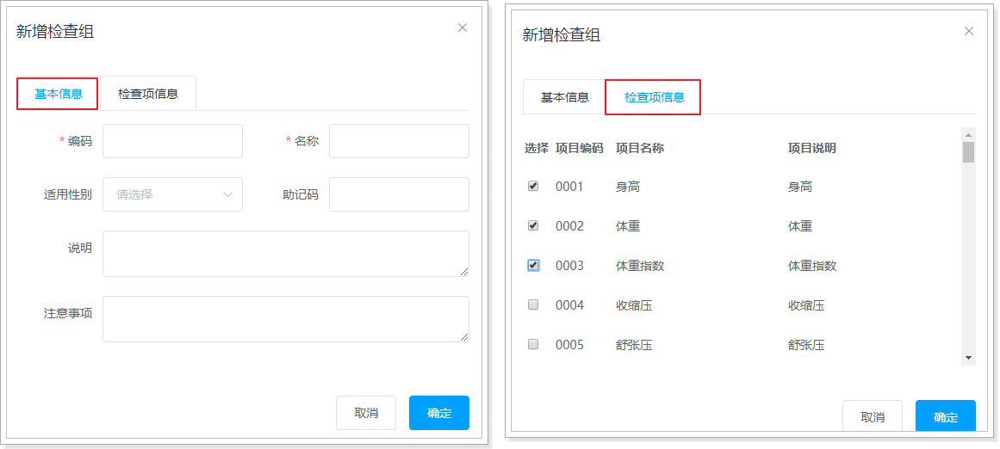
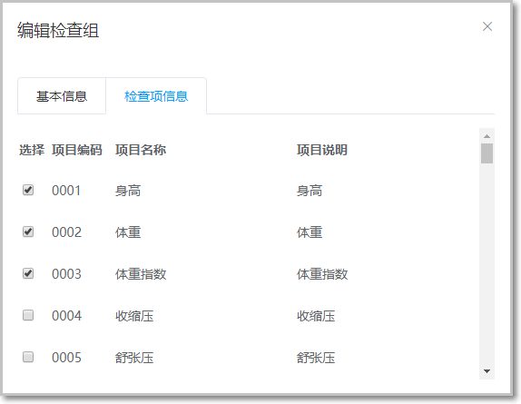

# 第3章 预约管理-检查组管理

## 3.1 功能介绍

```java
检查组其实就是多个检查项的集合，例如有一个检查组为“一般检查”，这个检查组可以包括多个检查项：身高、体重、收缩压、舒张压等。
所以在添加检查组时需要选择这个检查组包括的检查项。
```


检查组对应的实体类为**CheckGroup**，对应的数据表为**t_checkgroup**。

检查组和检查项为多对多关系，所以需要中间表t_checkgroup_checkitem进行关联。

今天的难点： 多表操作

 

## 3.2 新增检查组功能

### 3.2.1 新增检查项弹窗操作

检查组管理页面对应的是checkgroup.vue页面（见资料/页面），根据产品设计的原型已经完成了页面基本结构的编写，现在需要完善页面动态效果。

checkgroup.vue页面中已经提供了新增窗口，只是处于隐藏状态。

只需要将控制展示状态的属性**dialogFormVisible改为true**即可显示出新增窗口。

点击新建按钮时绑定的方法为**handleCreate**，所以在handleCreate方法中修改dialogFormVisible属性的值为true即可。

同时为了增加用户体验度，需要每次点击新建按钮时清空表单输入项。

 


### 3.2.2 checkgroup.vue完善页面

新建按钮绑定单击事件，对应的处理函数为handleCreate

```js
<el-button type="primary" class="butT" @click="handleCreate">新建</el-button>

// methods 模块中重置表单   
resetForm() {  
    this.formData = {};  
},  
// 弹出添加窗口  
handleCreate() {  
    this.dialogFormVisible = true;  
    this.resetForm();  
      //默认切换到第一个标签页（基本信息）  
    this.activeName='first';  
}

```

测试效果


### 3.2.3 添加检查组显示检查项信息

目标：

1.  在检查项信息标签页中需要动态展示所有的检查项信息列表数据

2.  每次打开默认显示的是基本信息的tab

3.  每次打开清空检查项选择

 

当点击新建检查组窗口弹出，后台加载检查项数据源，回显检查项数据到页面

#### 3.2.3.1 第一步：模型数据说明

```java
tableData:[],//新增和编辑表单中对应的检查项列表数据  
checkitemIds:[],//新增和编辑表单中检查项对应的复选框，基于双向绑定可以进行回显和数据提交

```

#### 3.2.3.2 第二步：动态显示模型数据

动态展示检查项列表数据，数据来源于上面定义的tableData模型数据

页面js已经完成，我们需要做的就是ajax访问后台检查项列表数据即可

```html
<table class="datatable">  
 <thead>  
   <tr>  
     <th>选择</th>  
     <th>项目编码</th>  
     <th>项目名称</th>  
     <th>项目说明</th>  
   </tr>  
 </thead>  
 <tbody>  
   <tr v-for="c in tableData">  
     <td>  
       <input :id="c.id" v-model="checkitemIds" type="checkbox" :value="c.id">  
     </td>  
     <td><label :for="c.id">{{c.code}}</label></td>  
     <td><label :for="c.id">{{c.name}}</label></td>  
     <td><label :for="c.id">{{c.remark}}</label></td>  
   </tr>  
 </tbody>  
</table>
```

补充说明： 

label标签与label for 有什么区别

 

显示的效果是一样的，但是属性上有什么区别？

```mark
单label 只是展示，鼠标左键点击 label 中的文字的时候没有任何效果，如果添加了 for 属性，当你点击 label 中的文字的时候，光标会for 属性相应的 id 标签中，图片中的代码，你点击慢跑两个字，id 为『慢跑』的单选框不会被选中，你必须点击单选框才能选中，但是你点击『登山』或者『篮球』两个字的时候，id 为『登山』或者『篮球』的单选框（也可以是复选框或者其它标签）会被选中
```

#### 3.2.3.3 第三步：完善handleCreate方法

发送ajax请求查询所有检查项数据并将结果赋值给tableData模型数据用于页面表格展示

```js
// 弹出添加窗口  
handleCreate() {  
 this.dialogFormVisible = true;  
 this.resetForm();  
 //默认切换到第一个标签页（基本信息）  
 this.activeName='first';  

 //发送ajax请求查询所有检查项信息  
 this.$http.get("api/checkitem/findAll").then((res)=> {  
   if(res.data.flag){  
     //将检查项列表数据赋值给模型数据用于页面表格展示  
     this.tableData = res.data.data;  
  }else{  
     this.$message.error(res.data.message);  
  }  
});  
}

```

#### 3.2.3.4 CheckItemController.java后台代码


注意出现上述错误： 原因：

```markdown
Mybatis-Plus官方：wrapper不支持也不推荐进行dubbo传递

- 当在模块中通过dubbo的rpc来调用其他服务的方法时，不能使用mybatisplus的条件构造器wrapper来进行方法调用

- 因为wrapper中包含有泛型 Wrapper<T> ,会导致rpc解析失败，从而导致调用失败

- 解决方法：不用wrapper作为参数，自己写方法传递参数就可以。
```

第一步：Controller  自定义一个方法 条件查询数据！

注意不要在dubbo 模块中使用mp的Wrapper<T> 条件构造器进行查询！

```java
  //  有条件和无条件查询 都是同一个方法
    @GetMapping("checkitem/findAll")
    public Result findAll(){
           List<CheckItem> list =  checkItemService.findAll();
          return  new Result(list);    
    }
```

第二步：服务接口

CheckItemService：

```java
public interface CheckItemService extends IService<CheckItem> {

    List<CheckItem> findAll();
}

```

第三步：服务实现类

CheckItemServiceImpl：

```java
   @Override
    public List<CheckItem> findAll() {
        QueryWrapper queryWrapper = new QueryWrapper();
        queryWrapper.eq("is_delete",0);//  有效数据
        List<CheckItem> list = list(queryWrapper);
        return list;
    }
```

测试

1.  问题：残留上次选择的检查项

显示检查项信息如下：问题，当关闭窗口，重新打开发现之前选择的内容还在。

 

解决方案：清空选择的检查项

```js
// 弹出添加窗口  
handleCreate() {

//重置检查项勾选数据  
 this.checkitemIds = [];  
 this.dialogFormVisible = true;  
 this.resetForm();  
 //默认切换到第一个标签页（基本信息）  
 this.activeName='first';  

 //发送ajax请求查询所有检查项信息  
 this.$http.get("api/checkitem/findAll").then((res)=> {  
   if(res.data.flag){  
     //将检查项列表数据赋值给模型数据用于页面表格展示  
     this.tableData = res.data.data;  
  }else{  
     this.$message.error(res.data.message);  
  }  
});  
}

```


### 3.2.4 新增检查组功能

目标

```java
当用户点击新增窗口中的确定按钮时进行表单校验，校验通过后发送ajax请求将数据提交到后台进行数据库操作。
提交到后台的数据分为两部分：检查组基本信息（对应的模型数据为formData）和检查项id数组（对应的模型数据为checkitemIds）
```

页面需求：**新增检查组时必须选择检查项**

功能完善：当添加检查项时，数据库表更新涉及两张表： 检查组 t_checkgroup 和中间表 t_checkgroup_checkitem

1.  t_checkgroup表中添加一条记录

2.  t_checkgroup_checkitem表中添加多条记录： 页面被勾选的检查项id 都要更新到中间表数据中



#### 3.2.4.1 检查组页面数据校验

为确定按钮绑定单击事件，对应的处理函数为handleAdd

复杂数据提交，可以使用拼接和请求体 结合的方式

```js
   //添加
                handleAdd () {

                    this.$refs['dataAddForm'].validate((valid)=>{
                        if(valid){
                        this.formData.checkItemIds=this.checkitemIds
                                this.$http.post("api/checkgroup/add",this.formData).then((res)=>{
                                if(res.data.flag){
                                    this.dialogFormVisible=false
                                    this.findPage()
                                }else{
                                    this.$message.error(res.data.message);
                                }

                            })

                        }
                    })
                   
                },
```

#### 3.2.4.2 CheckGroupController后台代码

1.  第一步：Controller

在health_web工程中创建CheckGroupController.java

```java
  //  检查项添加功能
  @PostMapping("checkgroup/add")
 public Result add(@RequestBody CheckGroupDTO checkGroupDTO){
            checkGroupService.add(checkGroupDTO);
            return  new Result(true);
       
    }
```

第二步：服务接口

在health_interface工程中创建CheckGroupService接口

```java
public interface CheckGroupService extends IService<CheckGroup> {
    void add(CheckGroupDTO checkGroupDTO);
}
```

第三步：服务实现类

在health_service_provider工程中创建CheckGroupServiceImpl.java实现类

```java
  @Override
    public void add(CheckGroupDTO checkGroupDTO) {
         save(checkGroupDTO); 
        Integer groupId  = checkGroupDTO.getId(); //  获取检查组的主键
        Integer[] checkitemIds = checkGroupDTO.getCheckItemIds();
        if(checkitemIds!=null&&checkitemIds.length!=0){
            for (Integer checkitemId : checkitemIds) {
                //  更新中间表   检查组和检查项中间表
                baseMapper.addCheckGroupAndCheckItemIds(groupId,checkitemId);
            }
        }
    }
```

第四步：Mapper接口

在health_mapper工程中创建CheckGroupMapper接口

```java
 @Insert("insert into t_checkgroup_checkitem values(#{groupId},#{checkitemId})")
    void addCheckGroupAndCheckItemIds(@Param("groupId") Integer groupId, @Param("checkitemId") Integer checkitemId);
```

测试之前  整个工程记得要install一下，重新启动 服务模块和消费模块

测试

 

 

t_checkgroup: 

 

t_checkgroup_checkitem:

 


## 3.3 检查组分页查询

目标：在checkgroup.vue页面加载后显示分页数据

具体完善：

1.  checkgroup.vue页面加载完成，显示所有分页数据

2. 点击“查询”按钮后按条件展示检查组的分页数据。

3. 检查组新建完成后，需要显示最新分页数据


### 3.3.1 完善checkgroup.vue页面

第一步：定义分页相关模型数据

```js
pagination: {//分页相关模型数据  
 currentPage: 1,//当前页码  
 pageSize:10,//每页显示的记录数  
 total:0,//总记录数  
 queryString:null//查询条件  
},  
dataList: [],//当前页要展示的分页列表数据
```

第二步：定义分页方法

在页面中提供了findPage方法用于分页查询，为了能够在checkgroup.vue页面加载后直接可以展示分页数据，可以在VUE提供的钩子函数created中调用分页查询pageQuery()方法.然后在新增检查组后查询分页数据

```js
created() {  
  this.findPage();//查询分页数据  
},

//分页查询  
findPage() {  
    //发送请求查询分页数据  
    this.$http.post("api/checkgroup/findPage",this.formData).then((res)=>{  
    if (res.data.flag){  
    //将查询出来的分页数据绑定到数据模型  
    this.dataList=res.data.data.list;  
    //将总记录数绑定到数据模型  
    this.pagination.total=res.data.data.total;  
    }else{  
    //查询错误，显示错误信息  
    this.$message.error(res.data.message);  
  }  
 })  
}

```

### 3.3.2 后台代码

在CheckGroupController中增加分页查询方法

```java
 //  有条件和无条件查询 都是同一个方法
    @PostMapping("checkgroup/findPage")
    public Result findPage(@RequestBody QueryPageBean queryPageBean){
            PageResult pageResult = checkGroupService.findPageByContion(queryPageBean);
            return  new Result(pageResult);   
    }
```

### 3.3.3 服务接口

在CheckGroupService服务接口中扩展分页查询方法

```java
PageResult findPage(QueryPageBean queryPageBean);
```

### 3.3.4 服务实现类

在CheckGroupServiceImpl服务实现类中实现分页查询方法，基于Mybatis分页助手插件实现分页

```java

    @Override
    public PageResult findPage(QueryPageBean queryPageBean) {
        //   select  * from xxx where is_delete = 0  and  xxx like ?
        //  条件构造出来   Wrapper对象
        QueryWrapper<CheckGroup> queryWrapper = new QueryWrapper<CheckGroup>();
        queryWrapper.eq("is_delete",0);
        Page<CheckGroup> page = null;
        if(StringUtils.isBlank(queryPageBean.getQueryString())){
            page = page(new Page<CheckGroup>(queryPageBean.getCurrentPage(), queryPageBean.getPageSize()),queryWrapper);
        }else{
            queryWrapper.like("HELPCODE",queryPageBean.getQueryString());
            //   sql   + 追加  sql  where  name like  %?%
            page = page(new Page<CheckGroup>(queryPageBean.getCurrentPage(), queryPageBean.getPageSize()),queryWrapper);
        }
        PageResult  result = new PageResult(page.getTotal(),page.getRecords());
        return result;
    }
```


测试

记得install  测试

分页数据已经可以显示，但是单击分页栏，并没有将切换到对应页面的数据。


## 3.4 分页栏分页查询功能

1.  目标

当点击分页栏切换页面时，显示对于页面的数据：


### 3.4.1 完善checkgroup.vue页面

1.  第一步：编写分页栏方法

为分页条组件绑定current-change事件，此事件是分页条组件自己定义的事件，当页码改变时触发，对应的处理函数为handleCurrentChange

```js
<el-pagination  
              class="pagiantion"  
              @current-change="handleCurrentChange"  
              :current-page="pagination.currentPage"  
              :page-size="pagination.pageSize"  
              layout="total, prev, pager, next, jumper"  
              :total="pagination.total">  
</el-pagination>
```

定义handleCurrentChange方法，当用户点击分页栏中的页码时也需要调用pageQuery方法重新发起查询请求：

```js
//切换页码  
handleCurrentChange(currentPage) {  
 //currentPage为切换后的页码  
 this.pagination.currentPage = currentPage;  
 this.findPage();  
}
```


### 3.4.2 条件分页查询优化

问题：当切换到第二页开始查询时，由于传递的页面是2，导致底层sql语句分页查询的limit
x,y中的x的值是10，即从第二页开始查询，而可能我们输入的条件”组”，所有的记录查询出来也就三四条记录，压根就没有第二页，导出查询不到数据:


解决方案：在点击“查询”按钮时，重新将当前页的页面设置为第一页，重新让分页查询从第0条数据开始查询：

为查询按钮绑定单击事件，修改为findPageByCondition方法

```js
<el-button @click="findPageByCondition()" class="dalfBut">查询</el-button>
定义findPageByCondition()方法：
findPageByCondition(){  
    this.pagination.currentPage=1  
    this.findPage();  
}

```

# 3.5 检查组编辑功能

## 3.5.0 检查组信息回显

1.  编辑检查组-点击编辑，弹出窗口页面，数据回显


当点击编辑按钮后，显示编辑页面，并回显当前数据。


2. checkgroup.vue完善页面

用户点击编辑按钮时，需要弹出编辑窗口并且将当前记录的数据进行回显，用户修改完成后点击确定按钮将修改后的数据提交到后台进行数据库操作。此处进行数据回显的时候，除了需要检查组基本信息的回显之外，还需要回显当前检查组包含的检查项（以复选框勾选的形式回显）。

具体步骤如下：

### 3.5.0.1 第一步：弹出编辑窗口

需要为编辑按钮绑定单击事件，并且将当前行数据作为参数传递给处理函数

```js
// 弹出编辑窗口  
handleUpdate(row) {  

//弹出编辑窗口  
this.dialogFormVisible4Edit=true;  
//默认选中第一个tab  
this.activeName="first";  
}

```

### 3.5.0.2 第二步：查询回显数据

```js
  // 弹出编辑窗口
                handleUpdate(row) {
               this.dialogFormVisible4Edit=true;
               //        1. 回显 检查组基本信息   this.formData=row
                    this.formData=row
                     
                },
```

回显检查组基本数据

 

## 3.5.1 编辑检查组-默认选中检查项

目标: 

在上面的编辑检查组页面回显的功能中，需要显示所有检查项数据，并默认选中当前检查组对应的检查项数据。

**注意**： 因为检查组修改可以重新选择不同的其他检查项信息，因此回显的检查项数据要求是全部的检查项数据！

 

### 3.5.1.1 完善checkgroup.vue页面

发送请求查询当前检查组关联的所有检查项的id并进行数据绑定。

回显当前检查组对应的选中的检查项信息 勾选用户之前的检查项信息！

在handleUpdate(row) 方法中添加下面js 

```js
 //  编辑业务  
                    handleUpdate(row){
                        this.dialogFormVisible4Edit= true
                        // 回显检查组基本信息
                         let  jsonString = JSON.stringify(row) //  json对象 转换 普通 字符串 json
                         let  jsonObj = JSON.parse(jsonString) //  json格式字符串 转换 js对象
                         this.formData = jsonObj  //   当前记录 id                          
                        // 检查项信息 根据当前点击 检查组id   ----  查询对应得检查项ids  +  List<checkItem>
                        this.$http.get("api/checkgroup/findCheckItemInfoByGroupId/"+row.id).then((res)=>{
                                if(res.data.flag){
                                        this.checkitemIds = res.data.data.checkitemIds
                                        this.tableData = res.data.data.checkItemList
                                }else{
                                    this.$message.error(res.data.message)
                                }
                        })
                    },

```

### 3.5.1.2 后台代码

1.  第一步：CheckGroupController

```java
    @ApiOperation(value = "检查项列表查询",notes = "根据客户端请求，完成检查项所有信息列表查询")//   添加业务方法上
    @GetMapping("checkgroup/findCheckItemInfoByGroupId/{id}")
    public Result findCheckItemInfoByGroupId(@PathVariable("id") int id){
        return   new Result(checkGroupService.findCheckItemInfoByGroupId(id));
    }
```

### 3.5.1.3 第二步：服务接口 CheckGroupService

```java
  CheckGroupVO findCheckItemInfoByGroupId(int id);
```


### 3.5.1.4 第三步：服务实现类CheckGroupServiceImpl

```java
 @Override
    public CheckGroupVO findCheckItemInfoByGroupId(int id) {
        //   查询所有检查项信息  +  gid  查询对应得 checkitemids 中间表
        List<CheckItem> list = checkItemService.list();
        int[] checkitemids = baseMapper.findCheckItemInfoByGroupId(id); //  一表
        CheckGroupVO checkGroupVO = new CheckGroupVO();
        checkGroupVO.setCheckItemList(list); //  将查询的结果集封装到vo 中
        checkGroupVO.setCheckitemIds(checkitemids);
        return checkGroupVO;
    }
```

vo设计：

```java
@Data
public class CheckGroupVO extends CheckGroup {

    private List<CheckItem> checkItemList; // 封装 检查项数据信息

    private  int[] checkitemIds;  //   当前检查组 对应得检查项ids

}
```

### 3.5.1.5 第四步：Mapper接口

```java
    @Select("select CHECKITEM_ID  from t_checkgroup_checkitem where CHECKGROUP_ID = #{gid}")
    int[] findCheckItemInfoByGroupId(@Param("gid") int gid);
```

默认选中：

 

## 3.5.2 检查组更新操作

编辑检查组-编辑更新

1.  目标： 通过表单校验后将编辑更新的检查组信息并持久化到数据库

>   请求需要携带所有检查项id和编辑表单数据

>   更新数据时需要先解除中间表的关联关系，然后重新设置关系。

2. 更新完成后关闭编辑窗口

3. 编辑更新完后需要重新查询最新检查组信息

具体操作：  先将中间表 根据检查组ID 删除中间表中对应的记录，解除关系！  再进行重新插入最新的关系数据

在编辑窗口中修改完成后，点击确定按钮需要提交请求，所以需要为确定按钮绑定事件并提供处理函数handleEdit

### 3.5.2.1 页面checkgroup.vue完善js

检查组的编辑和添加的业务代码几乎一致，我们可以进行代码优化：复用代码即可

```js
 //用户修改数据 点击提交表单
                handleEdit(dataForm) {
                   this.handleAdd(dataForm)
                },
 调用 添加业务代码 将表单的ref对应得数据传递给handleADD方法 
     //添加 和 修改代码 合并   区别： 添加 this.formData没有id   修改 ： this.formData存在id
 // dataForm  添加和修改表单的校验ref值 传递进来即可
                handleAdd (dataForm) {
                    this.$refs[dataForm].validate((valid)=>{
                        if(valid){
                          //  提交 检查组的基本信息+ 勾选的检查项的信息
                            //  1  用户有无勾选检查项  至少勾选一项才可以提交表单
                            if(this.checkitemIds.length==0){
                                this.activeName = "second" //  用户当前界面自动切换第二个选项卡
                                this.$message.warning("至少勾选一项")
                            }else{
                                //  检查组的formData  @RequestBody  +  checkitemIds  @RequestParam
                                
                            this.formData.checkItemIds=this.checkitemIds
                                this.$http.post("api/checkgroup/add",this.formData).then((res)=>{
                                    if(res.data.flag){
                                        this.dialogFormVisible = false
                                        this.dialogFormVisible4Edit = false
                                        this.findPage()
                                    }else{
                                        this.$message.warning(res.data.message)
                                    }
                                    this.dialogFormVisible = false
                                    this.dialogFormVisible4Edit=false
                                })
                            }

                        }else{

                        }
                    })
                   
                },                
                                    
```

### 3.5.2.2 后台代码实现

第一步：在CheckGroupController.java中 添加和修改代码一致

```java
  //  检查项添加功能
    @PostMapping("checkgroup/add")
 public Result add(@RequestBody CheckGroupDTO checkGroupDTO){
            checkGroupService.saveCheckGroupInfo(checkGroupDTO);
            return  new Result(true);

    }
```

第二步：服务接口

在CheckGroupService服务接口中扩展编辑方法

```java
public interface CheckGroupService extends IService<CheckGroup> {
    void saveCheckGroupInfo(CheckGroupDTO checkGroupDTO);
}
```

第三步：服务实现类

在CheckGroupServiceImpl实现类中实现编辑方法

```java
 /**
     *   添加 和 编辑
     * @param checkGroupDTO
     * @return
     */
    @Override
    public Boolean saveCheckGroupInfo(CheckGroupDTO checkGroupDTO) {

        Integer id = checkGroupDTO.getId();
        if(StringUtils.isNotBlank(String.valueOf(id))){
             //  根据 id  删除 中间表数据
            baseMapper.deleteCheckItemInfoByGroupId(id);
        }
        boolean flag = saveOrUpdate(checkGroupDTO);//   完成检查组录入  自动生成主键
        Integer gid = checkGroupDTO.getId();
        //  录入中间表
        Integer[] checkitemIds = checkGroupDTO.getCheckitemIds();
        if(checkitemIds!=null&&checkitemIds.length>0){
            //  中间表循环录入
            for (Integer checkitemId : checkitemIds) {
                //   添加和修改  中间数据录入
                baseMapper.addCheckGroupIdAndCheckItemId(gid,checkitemId);
            }
        }
        return flag;
    }
```

第四步：Mapper接口

```java
@Insert("insert into t_checkgroup_checkitem values(#{gid},#{checkitemId})")
    void addCheckGroupIdAndCheckItemId(@Param("gid") Integer gid, @Param("checkitemId") Integer checkitemId);

    @Select("select CHECKITEM_ID  from t_checkgroup_checkitem where CHECKGROUP_ID = #{gid}")
    int[] findCheckItemInfoByGroupId(@Param("gid") int gid);

    @Delete("delete from t_checkgroup_checkitem where checkgroup_id = #{id}")
    void deleteCheckItemInfoByGroupId(@Param("id") Integer id);
```

测试

修改如下：

 

 

更新后如下：测试无误


# 3.6 删除检查组（学员完成）

如果**物理删除**

checkgroup  1  +  checkitem  +  中间表

1. 先删除 中间表记录    根据 检查组id 删除

​      delete  from t_checkgroup_checkitem where checkgourp_id = 1

2. 再去删除检查该条记录

   delete from t_checkgroup where id  = #{id}

目标: 点击删除后将当前检查项删除,完成逻辑删除

要求：

1.  弹窗提示，是否确认删除
2.  如果被套餐引用，则不能进行删除
3.  删除后重新查询分页
4.  检查项和检查组中间表关系可以不用清除 - 后续恢复检查组功能可以无需处理中间表数据。


## 3.6.1 完善checkgroup.vue页面

弹出删除提示框，发送删除请求：

```js
// 删除  
handleDelete(row) {  
//弹出确认删除提示框  
this.$confirm('是否确认删除?', '提示', {  
confirmButtonText: '确定',  
cancelButtonText: '取消',  
type: 'warning'  
}).then(() => {  
//发送请求删除检查项  
this.$http.post("api/checkgroup/deleteCheckGroupitemById?id="+row.id).then((res)=>{  
if (res.data.flag){  
//重置页码  
this.pagination.currentPage = 1  
//重新查询分页数据  
this.findPage();  
} else{  
//提示错误信息  
this.$message.error(res.data.message)  
}  
})  

}).catch(() => {  
this.$message({  
type: 'info',  
message: '已取消删除'  
});  
});  
}

```

## 3.6.2 后台代码实现

### 3.6.2.1 第一步：CheckGroupController.java

```java
  @DeleteMapping("deleteCheckGroupitemById")
    public Result deleteCheckGroupitemById(@RequestParam("id") Integer id){
        try {

            CheckGroup checkGroup = new CheckGroup();
            checkGroup.setId(id);
            checkGroup.setIs_delete(1); //  修改字段值
            checkGroupService.updateById(checkGroup);
            return  new Result(true, MessageConstant.UPDATE_CHECKITEM_SUCCESS);
        } catch (Exception e) {
            e.printStackTrace();
            return  new Result(false, MessageConstant.UPDATE_CHECKITEM_FAIL);
        }

    }
```


被套餐引用的效果：


没有被套餐引用的效果：

 

-----

至此，我们完成了检查组相关功能实现！


当天作业：

- 完成检查组crud业务功能
- 复习redis 对于set集合的crud操作


