#  第4章 预约管理-套餐管理

## 4.0 套餐功能介绍

套餐管理：当用户预约检查时，根据用户的不同的身体需求，选择对应的套餐选项，达到快速预约的效果！

套餐管理和检查组是有一定联系的，每一个套餐都是由一个或多个检查组组成，而每一个检查组可以出现在不同的套餐中！因此套餐表和检查组表关系 ： 多对多！

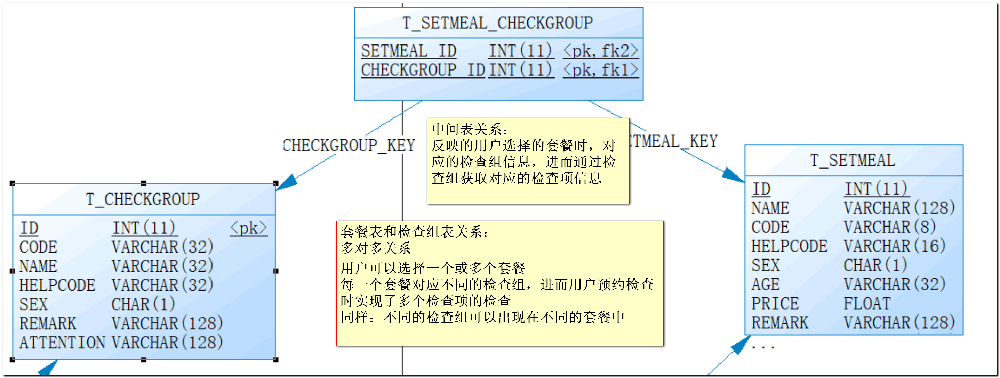 


## 4.1 阿里云oss图片存储方案

在实际开发中，我们会有很多处理不同功能的服务器。

##### 例如：

应用服务器：负责部署我们的应用

数据库服务器：运行我们的数据库

文件服务器：负责存储用户上传文件的服务器


分服务器处理的目的是让服务器各司其职，从而提高我们项目的运行效率。

文件存储的几种方案：

方案一：使用nginx搭建图片服务器

方案二：使用开源的分布式文件存储系统，例如Fastdfs、HDFS等

方案三：使用云存储，例如**阿里云oss**、腾讯云、百度云、七牛云等  

后续我们将采用阿里云来管理我们的图片资源！！！


## 4.2 图片管理服务器-阿里云oss

在开始学习套餐管理之前，今天的课程需要完成后台的图片管理功能，我们要先学习图片管理服务器：阿里云oss

```java
一 【让程序员头痛的问题】
1 . 海量存储
在互联网的应用中，用户会上传大量的图片以及文件，而且访问频繁，如果文件都以传统方式存在服务器磁盘上（单节点），对CPU，内存，磁盘空间和网络带宽等服务器资源都是很大的挑战。主要体现在：

单节访问，并发问题
单节点存储，单点故障
访问权限控制
扩容（水平扩展）
2 . 图片处理

为了满足前端显示需要，一个图片在不同的地方需要不同的尺寸，需要剪裁活压缩图片。
原图太大，带宽的资源非常宝贵，为了节省带宽，需要图片压缩。
图片鉴黄
图片加水印

二 【传统的解决方案】
FastDFS，一个开源的轻量级，需自己部署和维护，解决海量存储问题，但是成本高。

GraphicsMagick，号称图像处理领域的瑞士军刀，解决图片处理问题，但是一样成本高。

三 【阿里云云解决方案】
优点：

高并发
高可用
易扩展
低成本

```


4.3 阿里云存储准备工作
----------

官网：<https://www.qiniu.com/>

通过阿里云云官网介绍我们可以知道其提供了多种服务，我们主要使用的是oss提供的对象存储服务来存储图片。

### 4.3.1 阿里云注册

**注册前准备**： 常用有效的邮箱 推荐163、个人手机号、支付宝账号

<https://www.aliyun.com/?utm_content=se_1000301881>

 

### 4.3.2 阿里云oss 图片存储SDK说明

详见 老师下发的阿里云oss存储.md

### 4.4.3 阿里云Oss工具类封装

为了方便操作阿里云存储服务，我们可以将官方提供的案例简单改造成一个工具类，在我们的项目中直接使用此工具类来操作就可以：将资料中的AliyunUtils复制到health_common中即可。

 

```java
package com.itheima.pub.resources;

import com.aliyun.oss.ClientException;
import com.aliyun.oss.OSS;
import com.aliyun.oss.OSSClientBuilder;
import com.aliyun.oss.OSSException;
import com.google.gson.Gson;
import com.qiniu.common.QiniuException;
import com.qiniu.http.Response;
import com.qiniu.storage.BucketManager;
import com.qiniu.storage.Configuration;
import com.qiniu.storage.Region;
import com.qiniu.storage.UploadManager;
import com.qiniu.storage.model.DefaultPutRet;
import com.qiniu.util.Auth;

import java.io.ByteArrayInputStream;
import java.io.FileInputStream;
import java.io.FileNotFoundException;
import java.io.InputStream;
import java.util.ArrayList;
import java.util.Arrays;
import java.util.List;
import java.util.Set;

/**
 * 阿里云工具类   该配置文件 默认操作杭州区域！ 其他区域 操作 需要修改区域信息代码
 */
public class AliyunUtils {

    // 阿里云主账号AccessKey拥有所有API的访问权限，风险很高。强烈建议您创建并使用RAM账号进行API访问或日常运维，请登录 https://ram.console.aliyun.com 创建RAM账号。
    public  static  String accessKeyId = "填写自己的";
    public  static String accessKeySecret = "填写自己的";
    // Endpoint以杭州为例，其它Region请按实际情况填写。
    public  static  String endpoint = "http://oss-cn-hangzhou.aliyuncs.com";
    public  static  String bucketName = "填写自己的";//  空间名称


    /**
     *  删除文件
     *  deleteFilename  阿里云上的文件名称 或者  文件目录/文件名称
     */
    public static void deleteFile(String deleteFilename) {

// 创建OSSClient实例。
        OSS ossClient = new OSSClientBuilder().build(endpoint, accessKeyId, accessKeySecret);


// 删除文件。如需删除文件夹，请将ObjectName设置为对应的文件夹名称。如果文件夹非空，则需要将文件夹下的所有object删除后才能删除该文件夹。
        ossClient.deleteObject(bucketName, deleteFilename);

// 关闭OSSClient。
        ossClient.shutdown();

    }

    /**
     * 上传本地文件
     * @throws FileNotFoundException
     */
    public static void uploadLocalDiskFileToAliyun(String  uploadfilePath,String uuidfilename) {

        try {
// 创建OSSClient实例。
            OSS ossClient = new OSSClientBuilder().build(endpoint, accessKeyId, accessKeySecret);

// 上传文件流。
            InputStream inputStream = new FileInputStream(uploadfilePath);
            ossClient.putObject(bucketName, uuidfilename ,inputStream);

// 关闭OSSClient。
            ossClient.shutdown();
        } catch (Exception e) {
            e.printStackTrace();
            throw new RuntimeException(e.getMessage());
        }
    }


    /**
     * 上传文件字节数组
     * @throws FileNotFoundException
     */
    public static void uploadMultiPartFileToAliyun(byte[] bytes,String uuidfilename) {

        try {
// 创建OSSClient实例。
            OSS ossClient = new OSSClientBuilder().build(endpoint, accessKeyId, accessKeySecret);

            ossClient.putObject(bucketName, uuidfilename, new ByteArrayInputStream(bytes));

// 关闭OSSClient。
            ossClient.shutdown();
        } catch (Exception e) {
            e.printStackTrace();
            throw new RuntimeException(e.getMessage());
        }
    }

}

```

将此工具类放在health_common工程中，后续会使用到。


## 4.5 套餐管理-新增套餐功能-图片上传

目标：新增套餐-弹出新增套餐窗口

在套餐管理中，点击”新建”弹出新增套餐窗口。

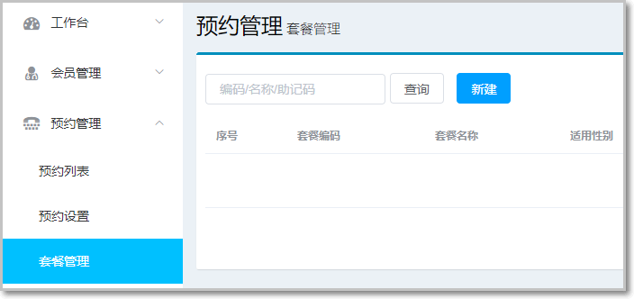 

弹窗如下：

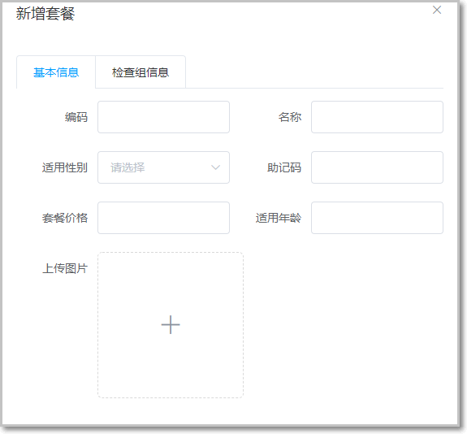 

### 4.5.1 新增弹窗页面

```java
页面中已经提供了新增窗口，只是出于隐藏状态。只需要将控制展示状态的属性dialogFormVisible改为true接口显示出新增窗口。点击新建按钮时绑定的方法为handleCreate，所以在handleCreate方法中修改dialogFormVisible属性的值为true即可。同时为了增加用户体验度，需要每次点击新建按钮时清空表单输入项。

新建按钮绑定单击事件，对应的处理函数为handleCreate()方法

```

js代码实现

```js
<el-button type="primary" class="butT" @click="handleCreate">新建</el-button>

// 重置表单  
resetForm() {  
 this.formData = {};// 重置表单  
 this.activeName='first'; // 默认切换到第一个标签页  
}  
// 弹出添加窗口  
handleCreate() {  
 this.dialogFormVisible = true;  
 this.resetForm();  
}

```

### 4.5.2 页面上传组件完善

完成新增套餐功能中的文件上传的功能，限制最大上传100m

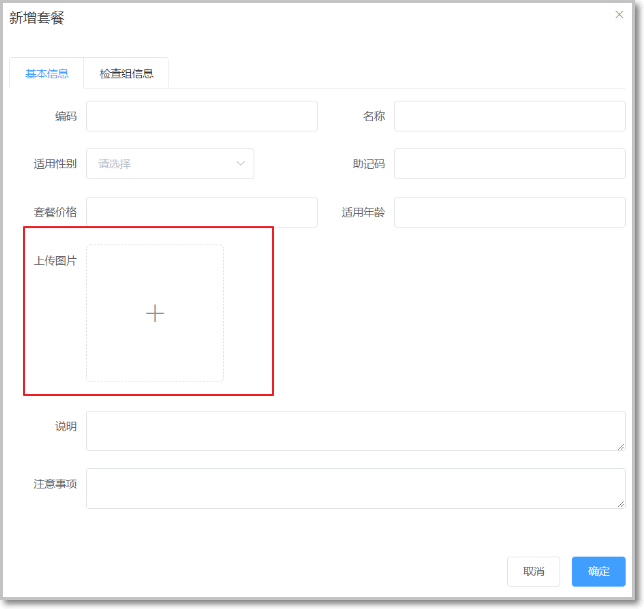 


此处使用的是ElementUI提供的上传组件el-upload，提供了多种不同的上传效果，上传成功后可以进行预览。

```js
<!--  
 el-upload：上传组件  
 action：上传的提交地址  
 auto-upload：选中文件后是否自动上传  
 name：上传文件的名称，服务端可以根据名称获得上传的文件对象  
 show-file-list：是否显示已上传文件列表  
 on-success：文件上传成功时的钩子  
 before-upload：上传文件之前的钩子  
-->  
<el-upload  
          class="avatar-uploader"  
          action="api/setmeal/upload"  
          :auto-upload="autoUpload"  
          name="imgFile"  
          :show-file-list="false"  
          :on-success="handleAvatarSuccess"  
          :before-upload="beforeAvatarUpload">  
 <!--用于上传图片预览-->  
   
 <!--用于展示上传图标-->  
 <i v-else class="el-icon-plus avatar-uploader-icon"></i>  
</el-upload>
```

**知识补充**

上传组件使用详细说明：

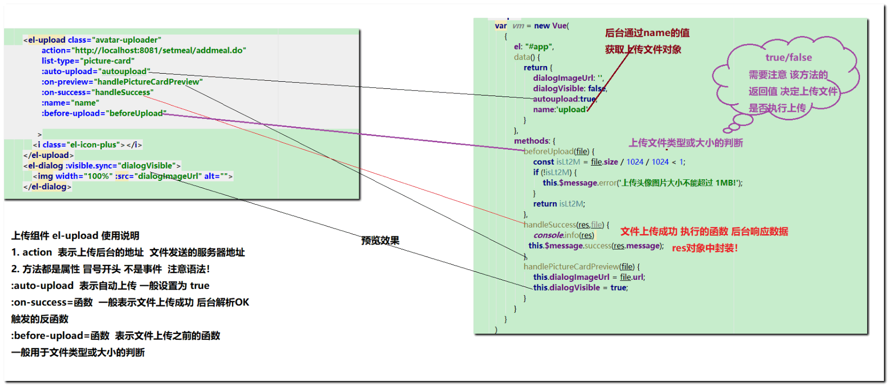 

### 4.5.3 上传功能-后台代码

1.  第一步：controller

创建上传方法，接收上传的文件

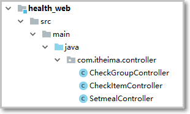 

```java
   @PostMapping("setmeal/upload")
    public Result upload (@RequestParam("imgFile") MultipartFile file) {
            String originalFilename = file.getOriginalFilename();
            String uuidFilename = UploadUtils.generateRandonFileName(originalFilename);
            AliyunUtils.uploadMultiPartFileToAliyun(file.getBytes(),uuidFilename);
            // 上传好阿里云图片之后 我们将图片存储到redis set 集合中
            //  将上传到阿里云的图片文件 保存在redis中
            return new Result（uuidFilename);//  一定要把阿里云上的文件名  回送给客户端 ，因为添加套餐时 需要存储到数据库的图片路径

      }
```

### 4.5.4 配置消费者端添加上传组件配置

注意：别忘了在配置文件中配置文件上传组件

```yaml
spring:
  servlet:
    multipart:
      max-file-size: 20MB
      max-request-size: 20MB
      enabled: true
```

### 4.5.5 测试上传功能

在阿里云上，发现上传后的文件：

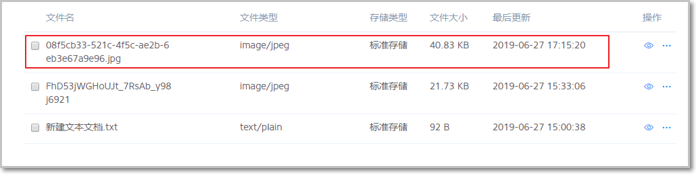

### 4.5.6 上传图片回显

目标： 图片上传成功后显示上传图片

 

第一步：定义数据模型

定义模型数据，用于后面上传文件的图片预览：

imageUrl:null,//模型数据，用于上传图片完成后图片预览

第二步：定义对应的钩子函数 ： handleAvatarSuccess（）方法

注意：修改为自己阿里云云的域名地址或者tomcat的ip地址。

this.imageUrl = "http://shheima106.oss-cn-hangzhou.aliyuncs.com/"+uuidfilename

使用阿里云的地址:

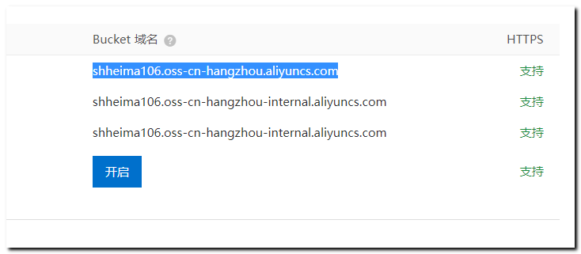 

```js
//文件上传成功后的钩子，response为服务端返回的值，file为当前上传的文件封装成的js对象  
handleAvatarSuccess(response, file) {  
 this.imageUrl = "http://shheima106.oss-cn-hangzhou.aliyuncs.com/"+response.data;
//显示上传的图片     此处的域名  更换成自己的阿里云域名地址
 this.$message({  
   message: response.message,  
   type: response.flag ? 'success' : 'error'  
});  
    this.formData.img = response.data
    //  将上传图片的文件名 保存到formData中，后续添加套餐，表单提交 包含图片名称 

}  
  
```

### 4.5.7 回显图片常见问题

测试成功,但是当再次打开窗口，发现依然显示上次的上传的图片：

 

解决方案

```js
// 重置表单  
resetForm() {  
this.formData={};//清空表单数据  
this.activeName='first'; // 默认切换到第一个标签页  
this.imageUrl=null;//清空图片显示  
},
```

## 4.6 套餐管理-新增套餐-回显检查组信息

目标

在新增套餐窗口的”检查组信息”标签页中显示所有检查组信息

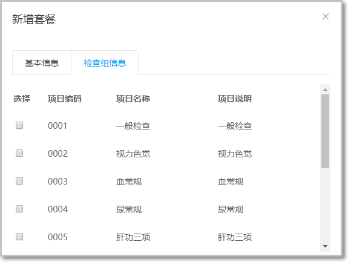 

### 4.6.1 完善页面

套餐管理页面对应的是setmeal.vue页面（资料\\页面中），根据产品设计的原型已经完成了页面基本结构的编写，现在需要完善页面动态效果。

### 4.6.2 页面介绍

现在虽然已经完成了新增窗口的弹出，但是在检查组信息标签页中需要动态展示所有的检查组信息列表数据，并且可以进行勾选。具体操作步骤如下：

（1）定义模型数据

tableData:[],//添加表单窗口中检查组列表数据  
checkgroupIds:[],//添加表单窗口中检查组复选框对应id

（2）动态展示检查组列表数据，数据来源于上面定义的tableData模型数据

```js
<table class="datatable">  
 <thead>  
   <tr>  
     <th>选择</th>  
     <th>项目编码</th>  
     <th>项目名称</th>  
     <th>项目说明</th>  
   </tr>  
 </thead>  
 <tbody>  
   <tr v-for="c in tableData">  
     <td>  
       <input :id="c.id" v-model="checkgroupIds" type="checkbox"
:value="c.id">  
     </td>  
     <td><label :for="c.id">{{c.code}}</label></td>  
     <td><label :for="c.id">{{c.name}}</label></td>  
     <td><label :for="c.id">{{c.remark}}</label></td>  
   </tr>  
 </tbody>  
</table>
```


### 4.6.3 发送查询检查组请求

完善handleCreate方法，发送ajax请求查询所有检查组数据并将结果赋值给tableData模型数据用于页面表格展示

```js
// 弹出添加窗口  
handleCreate() {  
 this.dialogFormVisible = true;  
 this.resetForm();  
 this.$http.get("api/checkgroup/findAll").then((res)=> {  
   if(res.data.flag){  
     this.tableData = res.data.data;  
  }else{  
     this.$message.error(res.data.message);  
  }  
});  
}
```


### 4.6.4 后台代码

编写对象CheckGroupController

```java
/**  
* 查询所有检查组信息  
*/  
@GetMapping("checkgroup/findAll")  
public Result findAll(){  
    List<CheckGroup> list = checkGroupService.findAll();  
    return new Result(list);  

}

```

### 4.6.5 服务接口

CheckGroupService：

```java
//查询所有检查组  
List<CheckGroup> findAll();
```


### 4.6.6 服务实现类

CheckGroupServiceImpl：

```java
 @Override
    public List<CheckGroup> findAll() {
        QueryWrapper queryWrapper = new QueryWrapper();
        queryWrapper.eq("is_delete",0);//  有效数据
        return list(queryWrapper);
    }
```

### 4.6.9 ※测试

常见问题1：

新增套餐的“检查组信息“标签页可以正常显示，但是当再次打开该窗口，默认选中上次勾选的检查项

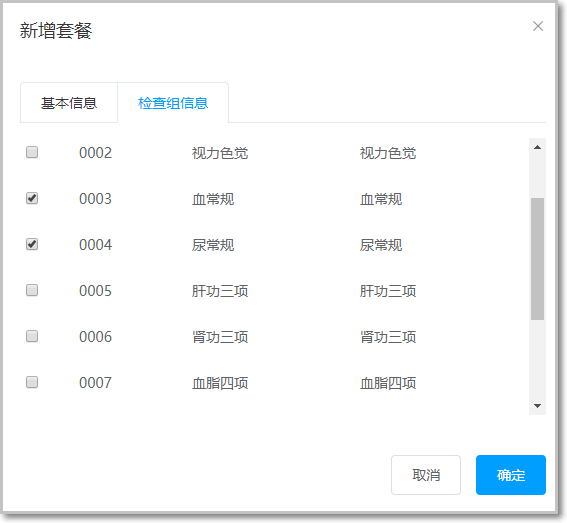 

解决方案：

每次弹窗时初始化检查项：

```js
// 重置表单  
resetForm() {  
    this.formData={};//清空表单数据  
    this.activeName='first'; // 默认切换到第一个标签页  
    this.imageUrl=null;//清空图片显示  
    this.checkgroupIds=[];//检查项初始化  
}
```


## 4.7 新增套餐-完成新增套餐功能

### 4.7.1 完善页面

1.  目标: 完成新增套餐的功能，保存数据到数据库中,完成后查询所有套餐

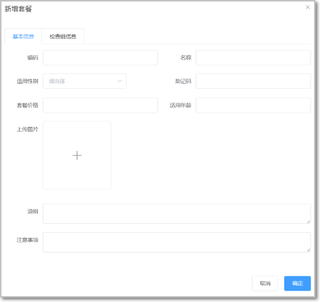 

完善页面

添加套餐的页面form 标签完善  可以添加校验器以及对于的规则！ 注意语法！ 

校验规则：学员可选代码操作

```html
  <el-form label-position="right" label-width="100px" :model="formData" ref="addSetMealForm"  :rules="rules">
      
   表单校验 一定要添加prop属性  
   <el-form-item label="套餐名称" prop="name">
      
      vue中添加校验规则
      
     rules: {// 添加套餐的表格校验规则
                    code: [
                        { required: true, message: '套餐编码为必填项', trigger: 'blur' },
                        { min: 2, max: 10, message: '长度在 2 到 10个字符', trigger: 'blur' }
                    ],
                    name: [
                        { required: true, message: '套餐名称为必填项', trigger: 'blur' },
                        { min: 2, max: 10, message: '长度在 2 到 10个字符', trigger: 'blur' }
                    ],
                    age: [
                        { required: true, message: '年龄必填项', trigger: 'blur' },
                        { type: 'number', min:1,message: '年龄必须为数字值' }
                    ]
                }  
      
```

可以参照之前的页面的模板，拷贝修改即可！

```java
当用户点击新增窗口中的确定按钮时发送ajax请求将数据提交到后台进行数据库操作。提交到后台的数据分为两部分：套餐基本信息（对应的模型数据为formData）和检查组id数组（对应的模型数据为checkgroupIds）。

为确定按钮绑定单击事件，对应的处理函数为handleAdd

```

```js
<el-button type="primary"  @click="handleAdd">确定</el-button>

完善handleAdd方法

//添加  
handleAdd () {  
//判断套餐是否选择了检查组  
    if(this.checkgroupIds==0){  
    this.$message.error("请选择检查组")  
}else{  
//发送url，新增套餐  
  this.formData.checkgroupIds = this.checkgroupIds
                                // 添加 套餐基本信息和选择的对应的检查组ids
  this.$http.post("api/setmeal/add", this.formData).then((res) => {

//关闭新建窗口  
this.dialogFormVisible=false;  

if (res.data.flag){  
    //重新查询所有数据  
    this.findPage();  
}else{  
	this.$message.error(res.data.message)  
}  

})  
}  
}

```


### 4.7.2 新增套餐后台代码

#### 4.7.2.1 完善Controller对象

在SetmealController中增加方法

```java
/**  
* 新增套餐  
* @param checkgroupIds  
* @param setmeal  
* @return  
*/  

    @Reference
    private SetMealService setMealService;

  //  套餐的添加
    @PostMapping("setmeal/add")
    @ApiOperation(value = "套餐录入", notes = "添加套餐，传递套餐对象和选中的检查组id")
    public Result add(@RequestBody SetmealDTO setmealDTO){
            setmealService.add(setmealDTO);
            return  new Result(true);
    }

```


#### 4.7.2.2 服务接口 

创建SetmealService接口并提供新增方法

```java
public interface SetMealService {
    void add(Setmeal setmeal, int[] checkgroupIds);
}
```

### 4.7.2.3 服务实现类 

创建SetmealServiceImpl服务实现类并实现新增方法

```java
 @Override
    public void add(Setmeal setmeal, Integer[] checkgroupids) {
        baseMapper.insert(setmeal);// 或者 直接调用 saveOrUpdate 都可以
        // saveOrUpdate(setmeal);  // 如果存在id ---update  如果不存在id  save
        System.out.println("-----  setmeal pk"+setmeal.getId());
        int setmeal_pk = setmeal.getId();
        if(checkgroupids!=null&&checkgroupids.length!=0) {
            for (Integer checkgroupid : checkgroupids) {
                setMealMapper.addSetMealAndCheckGroupInfos(setmeal_pk, checkgroupid);
            }
        }
    }
```


### 4.7.2.4 Mapper接口 

创建SetmealMapper接口并提供相关方法

```JAVA
public interface SetMealMapper extends BaseMapper<Setmeal> {

 @Insert("insert into t_setmeal_checkgroup values(#{setmeal_pk},#{checkgroupid})")
    void addSetMealAndCheckGroupInfos(@Param("setmeal_pk") int setmeal_pk, @Param("checkgroupid") Integer checkgroupid);
}

```

### 4.7.2.6 测试

可以参考资料中的t_setmeal.xlsx来添加数据:

基本信息：

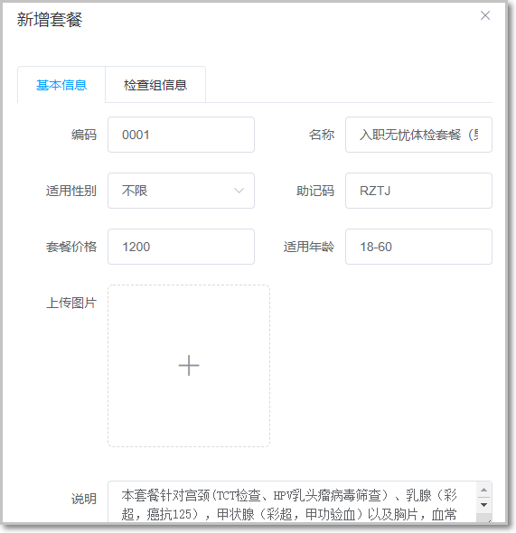 

检查组信息：

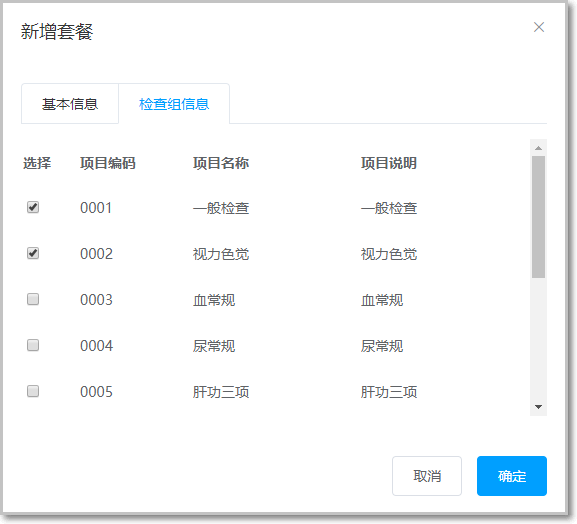 

### 4.7.2.7 常见问题

发现新增套餐后，数据库中并没有img字段的信息：


原因：表单中提交的属性名称是imgUrl，而seteal实体类中的属性名称为img，属性名称不一致无法封装。

解决方案

当图片上传成功之后，使用图片名称直接赋值给数据模型：

```js
    //文件上传成功后的钩子，response为服务端返回的值，file为当前上传的文件封装成的js对象
                handleAvatarSuccess(res, file) {
                    console.info(res)  //  el-upload   res=  Result
                    if(res.flag){
                        this.formData.img=res.data;//  添加套餐时，表单提交，将上传到七牛云的图片文件名称 存储到表单域中  添加表单 后台实体需要封装
                        this.imageUrl="https://shheima106.oss-cn-hangzhou.aliyuncs.com/"+res.data;// img图片加载的就是 uuid文件名称
                    }else{
                        this.$message.error(res.message);
                    }
                },
```

## 4.8 体检套餐查询功能

### 4.8.1 体检套餐分页查询

目标：加载套餐管理时，显示分页数据。

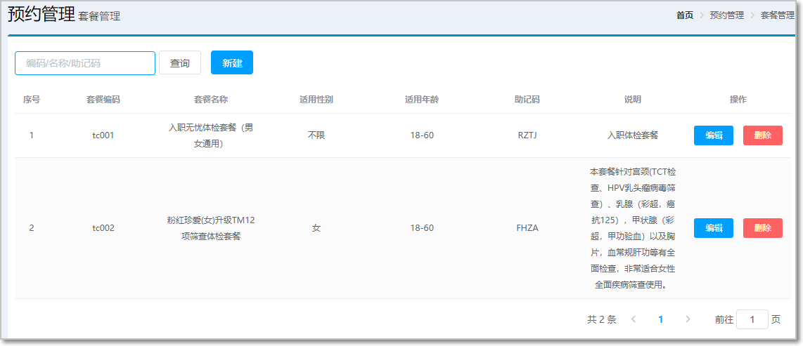 

#### 4.8.1.1 完善页面

：定义分页相关模型数据

```js
pagination: {//分页相关模型数据  
 currentPage: 1,//当前页码  
 pageSize:10,//每页显示的记录数  
 total:0,//总记录数  
 queryString:null//查询条件  
},  
dataList: [],//当前页要展示的分页列表数据
```


#### 4.8.1.2 定义分页方法

在页面中提供了findPage方法用于分页查询，为了能够在setmeal.html页面加载后直接可以展示分页数据，可以在VUE提供的钩子函数created中调用findPage方法

```js
//分页查询  
findPage() {  
//分页参数   
    //请求后台  
    this.$http.post("api/setmeal/findPage",this.pagination).then((res)=> {  
    if(res.data.flag){  
    //为模型数据赋值，基于VUE的双向绑定展示到页面  
    this.dataList = res.data.data.rows;  
    this.pagination.total = res.data.data.total;  
    }else{  
    this.$message.error(res.data.message);  
    }  
    });  

}

```

#### 4.8.1.3 后台代码 Controller

在SetmealController中增加分页查询方法

```java
/**  
* 分页查询  
* @param queryPageBean  
* @return  
*/  
@PostMapping("setmeal/findPage")  
public Result findPage(@RequestBody QueryPageBean queryPageBean){  

    PageResult pageResult = setmealService.findPage(queryPageBean);  
    return new Result(pageResult);  
}

```

#### 4.8.1.4 服务接口

在SetmealService服务接口中扩展分页查询方法

```java
//分页查询  
PageResult findPage(QueryPageBean queryPageBean);
```

#### 4.8.1.5 服务实现类

在SetmealServiceImpl服务实现类中实现分页查询方法，基于Mybatismp分页助手插件实现分页

```java
 @Override
    public PageResult  findPage(QueryPageBean queryPageBean) {
     QueryWrapper<Setmeal> queryWrapper = new QueryWrapper<Setmeal>();
        queryWrapper.eq("is_delete",0);
        Page<Setmeal> page = null;
        if(StringUtils.isBlank(queryPageBean.getQueryString())){
            page = page(new Page<Setmeal>(queryPageBean.getCurrentPage(), queryPageBean.getPageSize()),queryWrapper);
        }else{
            queryWrapper.like("name",queryPageBean.getQueryString());
            //   sql   + 追加  sql  where  name like  %?%
            page = page(new Page<Setmeal>(queryPageBean.getCurrentPage(), queryPageBean.getPageSize()),queryWrapper);
        }
        PageResult  result = new PageResult(page.getTotal(),page.getRecords());
        return result;
    }
```

#### 4.8.1.6 ※测试

1.  分页问题

点击分页栏，没有显示对应分页数据：

 

解决方案：

除了在created钩子函数中调用findPage方法查询分页数据之外，当用户点击查询按钮或者点击分页条中的页码时也需要调用findPage方法重新发起查询请求。

为查询按钮绑定单击事件，调用findPage方法

```js
<el-button @click="findPageByCondition" class="dalfBut">查询</el-button>
```


为分页条组件绑定current-change事件，此事件是分页条组件自己定义的事件，当页码改变时触发，对应的处理函数为handleCurrentChange

```js
<el-pagination  
              class="pagiantion"  
              @current-change="handleCurrentChange"  
              :current-page="pagination.currentPage"  
              :page-size="pagination.pageSize"  
              layout="total, prev, pager, next, jumper"  
              :total="pagination.total">  
</el-pagination>
```


定义handleCurrentChange方法

```js
//切换页码  
handleCurrentChange(currentPage) {  
 //currentPage为切换后的页码  
     this.pagination.currentPage = currentPage;  
     this.findPage();  
}

定义findPageByCondition方法：

findPageByCondition(){  
    this.pagination.currentPage=1;  
    this.findPage();  
}

```

**备注说明：  关于套餐的编辑）  - 作为项目最后的实战内容 学员小组完成！**


## 4.9 套餐图片管理-优化方案

1. 目标 : 清理用户上传的垃圾图片信息

```java
前面我们已经完成了文件上传，将图片存储在了专门的图片服务器中。
但是这个过程存在一个问题，就是如果用户只上传了图片而没有最终保存套餐信息到数据库，这时我们上传的图片就变为了垃圾图片。
对于这些垃圾图片我们需要定时清理来释放文件服务器磁盘空间。
这就需要我们能够区分出来哪些是垃圾图片，哪些不是垃圾图片。如何实现呢？
```

2. 方案就是利用redis来保存图片名称，具体做法为：

```markdown
1、当用户自动上传图片后，将图片名称保存到redis的一个Set集合中（使用sadd(key,value)方法），例如集合名称为setmealPicResources，另：将该图片单独存储在redis 上设置一个过期时间 例如24小时 以防用户延迟提交套餐表单，造成的误删。

2、当用户添加套餐成功后,将图片名称从上述的set集合中移除，这样的话 剩下来的set集合数据就是存储废弃的图片
   此时用户套餐添加成功，并且将之前redis保存的设置过期时间的图片 从redis上删除
   
3、编写定时任务，定期扫描清理：具体就是遍历set集合，查询redis上是否存在该图片信息，如果存在，说明用户还没有进行套餐录入操作，暂时不要从阿里云上删除oss图片信息！ 如果遍历set集合查询不到redis上的图片信息，则删除oss图片信息

```

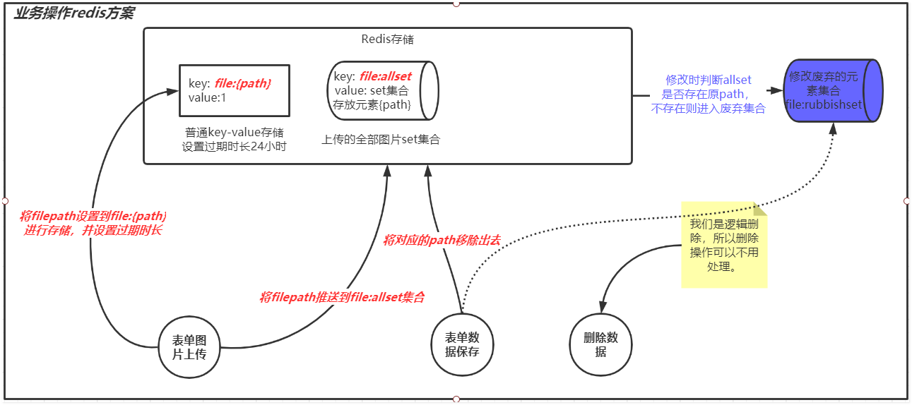 

定时任务调度  xxl-job 业务处理：定期删除图片信息

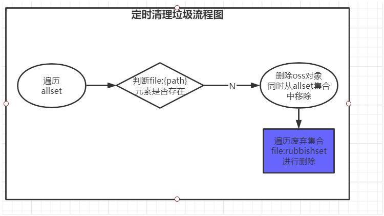 

### 4.9.1 RedisTemplate使用说明

1. health_commons模块导入依赖

```xml
<dependency>
    <groupId>org.springframework.boot</groupId>
    <artifactId>spring-boot-starter-data-redis</artifactId>
</dependency>
```

2. 使用redis配置和工具类

redis使用介绍：

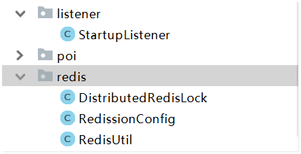 

其中listener作用 :  监听器对象 在spring  ioc容器初始化是，调用 在StartupListener 中 我们可以完成RedisTemplate注入等工作

```java
/**
 * spring ioc容器初始化完成后自动执行
 * 一般用于项目初始化
 */
@Component
public class StartupListener implements ApplicationListener<ContextRefreshedEvent> {

    @Resource
    private RedisTemplate<String,Object> redisTemplate;

    @Resource
    private DistributedRedisLock distributedRedisLock;

    @Override
    public void onApplicationEvent(ContextRefreshedEvent event) {
        RedisUtil.register(redisTemplate);
        RedisUtil.registerLock(distributedRedisLock);
    }
}
```

**RedisUtil**  :  操作redis crud  工具类！

 后续我们只需要调用此工具类可以直接操作redis数据库的crud即可！

### 4.9.2 套餐图片优化步骤实现

#### 第1步：图片存储redis

找到图片上传的SetmealController, 上传图片代码中：完善如下代码

```java
 //  调用阿里云 oss  sdk   完成  图片上传
String originalFilename = file.getOriginalFilename();
String uuidfilename = UploadUtils.generateRandonFileName(originalFilename);
AliyunUtils.uploadMultiPartFileToAliyun(file.getBytes(),uuidfilename);
// 将上传图片 保存到集合中  并且将图片保留24小时  设置过期时间。
RedisUtil.addToSet(RedisConstant.ALL_SETMEAL_PIC_SET,uuidfilename);
RedisUtil.set(RedisConstant.SINGLE_PIC+uuidfilename,uuidfilename,24, TimeUnit.HOURS);
```

#### 第2步：配置Redis常量

在health_common工程中提供Redis常量类： 

```java
public class RedisConstant {
    //套餐图片保存在阿里云的图片名称
    public static final String ALL_SETMEAL_PIC_SET = "allsetmealPicSet";
    public static final String SINGLE_PIC = "single:file:";

}
```

#### 第3步：套餐添加业务代码完善

SetmealController.java 优化添加套餐代码

```java
//  套餐添加时，将图片从集合set移除，剩下的就是 待清理的图片。 并且将未过期的 图片从redis清除
setmealService.saveSetemal(setmealDTO);
RedisUtil.removeSetMember(RedisConstant.ALL_SETMEAL_PIC_SET,setmealDTO.getImg());
RedisUtil.delete(RedisConstant.SINGLE_PIC+setmealDTO.getImg());
```

SetmealServiceImpl.java中添加清理图片的代码：

SetmealService接口中添加 **public boolean clearOssObject()**；

实现类：

```java
 /**
     *   该方法： xxl-job 框架调用
     */
    @Override
    public void clearOssImg() {
        //    清理  oss  垃圾图片   该方法 有  xxl-job 去调用
        //  1.  获取 set 集合 所有图片信息
        Set<String> members = RedisUtil.getMembersOfSet(RedisConstant.ALL_SETMEAL_PIC_SET);
        if(members.size()!=0){
            for (String uuidfilename : members) {
                  //   遍历 图片  判断 redis 该图片有没有存在
                boolean existsKey = RedisUtil.existsKey(RedisConstant.SINGLE_PIC + uuidfilename);
                 if(existsKey==false){
                     //   set集合中没找到  redis 对应得图片信息  那么通知 oss删除图片即可
                     AliyunUtils.deleteFile(uuidfilename);
                     System.out.println("-----阿里云删除垃圾图片一次----");
                     //  set    集合  垃圾图片 删除
                     RedisUtil.removeSetMember(RedisConstant.ALL_SETMEAL_PIC_SET,uuidfilename);
                 }
            }
        }

    }
```

### 4.9.3  定时清理垃圾图片

#### 4.9.3.1 xxl-job 分布式任务调度

XXL-JOB是一个轻量级分布式任务调度平台，其核心设计目标是开发迅速、学习简单、轻量级、易扩展。现已开放源代码并接入多家公司线上产品线，开箱即用。

**xxl-job特点**

- 内部多线程，多任务可在单个执行器上并发执行
- 支持简单的任务依赖关系，工作流
- 支持多语言Java、Shell、Python等
- 有界面，支持多租户隔离，每个租户管理自己的执行器，互相不影响

**xxl-job安装和使用**

详见下发资料文档 xxl-job 学习手册文档

#### 4.9.3.2 xxl-job定时清理垃圾图片

在health_appo模块 添加 xxl-job依赖

```xml

        <!-- xxl-job需要web模块依赖 -->
        <dependency>
            <groupId>org.springframework.boot</groupId>
            <artifactId>spring-boot-starter-web</artifactId>
        </dependency>

        <dependency>
            <groupId>com.xuxueli</groupId>
            <artifactId>xxl-job-core</artifactId>
            <version>2.0.1</version>
        </dependency>

```

**准备操作**：yaml文件追加  ： xxl-job 配置

```yaml
xxl:
  job:
    enabled: true  # 开关
    executor:
      appname: health-executor   #  后续web界面配置执行器的名称
      port: -1  # xxl 内部调用使用的端口   
      logpath: ${user.home}/xxl-job/logs
      logretentiondays: -1  #执行器Log文件定期清理功能，指定日志保存天数，日志文件过期自动删除
    admin:
      addresses: http://localhost:8091/xxl-job-admin  # 地址要和xxl-admin.jar 配置一致
        
```

##### 第1步：在health_xxl_job模块创建定时任务类

注意启动类的位置 一定要能扫描到配置类！com.itheima包下

```java
@JobHandler(value = "heima.setmeal.clean.img.job") //  web配置JobHandler的名称
@Component
public class MyJob extends IJobHandler {
    /**
     * 但是spring的@Scheduled只支持6位，年份是不支持的，带年份的7位格式会报错：
     * Cron expression must consist of 6 fields (found 7 in "1/5 * * * * ? 2018")
     * 通过cron表达式 来配置 该方法的执行周期
     * **/
      @Resource
      private SetmealService setmealService;

    @Override
    public ReturnT<String> execute(String param) throws Exception {
        System.out.println("clearOssObject!!!!!!!!!");
          setmealService.clearOssImg();
        return SUCCESS;
    }
      

}

```

##### 第2步：编写xxl-job  配置类

直接拷贝下发资料即可： 固定写法！

```java
package cn.itcast.xxl.config;

import com.xxl.job.core.executor.impl.XxlJobSpringExecutor;
import org.springframework.beans.factory.annotation.Value;
import org.springframework.boot.autoconfigure.condition.ConditionalOnProperty;
import org.springframework.context.annotation.Bean;
import org.springframework.context.annotation.Configuration;

@Configuration
@ConditionalOnProperty(name = "xxl.job.enabled", havingValue = "true")
public class XxlConfig {
    @Value("${xxl.job.admin.addresses}")
    private String adminAddresses;

    @Value("${xxl.job.executor.appname}")
    private String appName;

    @Value("${xxl.job.executor.port}")
    private int port;

    @Value("${xxl.job.executor.logpath}")
    private String logPath;

    @Value("${xxl.job.executor.logretentiondays}")
    private int logRetentionDays;


    @Bean(initMethod = "start", destroyMethod = "destroy")
    public XxlJobSpringExecutor xxlJobExecutor() {
        XxlJobSpringExecutor xxlJobExecutor = new XxlJobSpringExecutor();
        xxlJobExecutor.setAdminAddresses(adminAddresses);
        xxlJobExecutor.setAppName(appName);
        xxlJobExecutor.setIp("");
        xxlJobExecutor.setPort(port);
        xxlJobExecutor.setAccessToken("");
        xxlJobExecutor.setLogPath(logPath);
        xxlJobExecutor.setLogRetentionDays(logRetentionDays);
        return xxlJobExecutor;
    }

}
```

##### 第3步：配置任务执行器和任务管理

先执行xxl-job-admin.jar包  ：  **java  -jar   xxl-job-admin.jar**

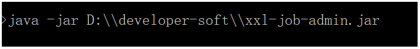 

**确保mysql数据库环境和服务要启动哦！**

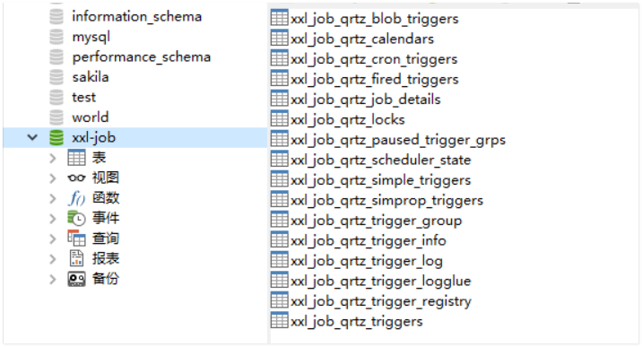 

访问网址：<http://localhost:8091/xxl-job-admin>

执行器配置： 注意  AppName 名称要和 yaml文件里面的配置一致！

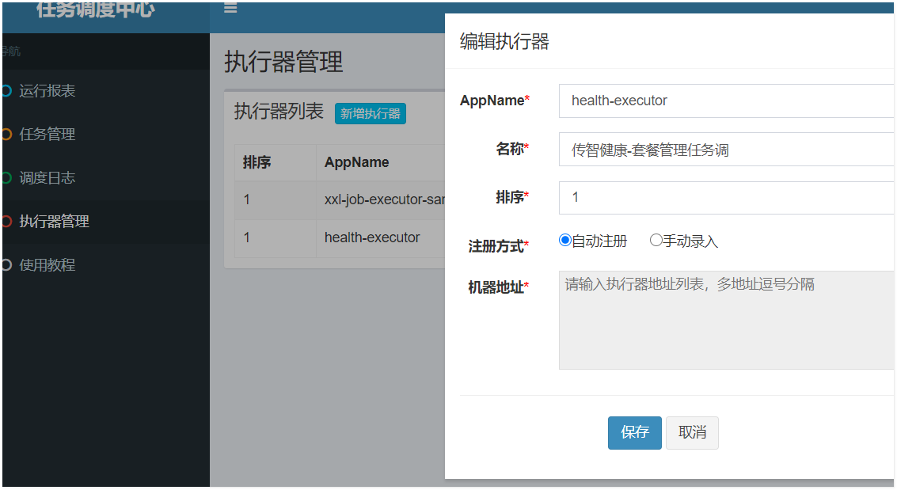 

点击任务管理： 右上角  新建任务配置：

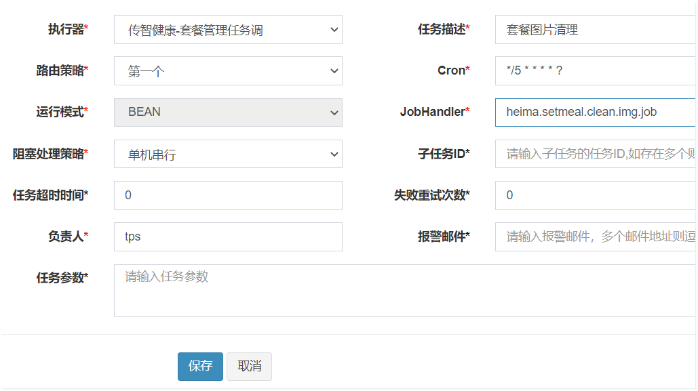 

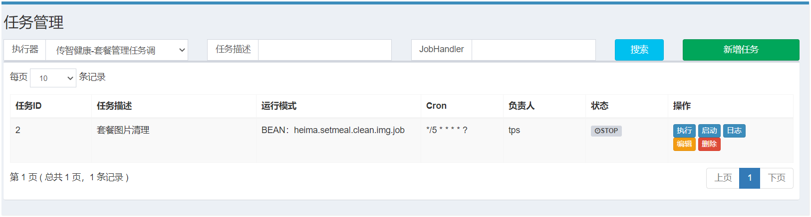

点击**启动！**    上述配置  每隔5秒执行一次任务！

**注意：  配置的JobHandler  = 要和 代码要一致！**

```java
@JobHandler(value = "heima.setmeal.clean.img.job") //  web配置JobHandler的名称
```

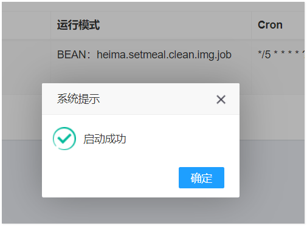 

#### 4.9.3.3  cron表达式学习（了解）

上面的入门案例中我们指定了一个表达式：0/3 \* \* \* \* ?

这种表达式称为cron表达式，通过cron表达式可以灵活的定义出符合要求的程序执行的时间。

本小节我们就来学习一下cron表达式的使用方法。

Cron表达式是一个字符串，字符串以5或6个空格隔开，分为6或7个域，每一个域代表一个含义，Cron有如下两种语法格式：

```java
　　（1） Seconds Minutes Hours DayofMonth Month DayofWeek Year

　　（2）Seconds Minutes Hours DayofMonth Month DayofWeek


```

**corn从左到右（用空格隔开）：秒 分 小时 月份中的日期 月份 星期中的日期 年份**

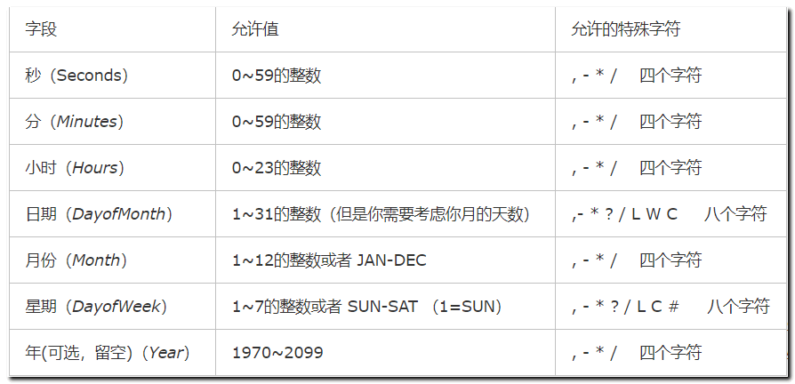 

每个域都有自己允许的值和一些特殊字符构成,使用这些特殊字符可以使我们定义的表达式更加灵活。

下面是对这些特殊字符的介绍：

```java
   （1）*：表示匹配该域的任意值。假如在Minutes域使用*, 即表示每分钟都会触发事件。

　　（2）?：只能用在DayofMonth和DayofWeek两个域。它也匹配域的任意值，但实际不会。因为DayofMonth和DayofWeek会相互影响。例如想在每月的20日触发调度，不管20日到底是星期几，则只能使用如下写法： 13 13 15 20 * ?, 其中最后一位只能用？，而不能使用*，如果使用*表示不管星期几都会触发，实际上并不是这样。

　　（3）-：表示范围。例如在Minutes域使用5-20，表示从5分到20分钟每分钟触发一次 

　　（4）/：表示起始时间开始触发，然后每隔固定时间触发一次。例如在Minutes域使用5/20,则意味着5分钟触发一次，而25，45等分别触发一次. 

　　（5）,：表示列出枚举值。例如：在Minutes域使用5,20，则意味着在5和20分每分钟触发一次。 

　　（6）L：表示最后，只能出现在DayofWeek和DayofMonth域。如果在DayofWeek域使用5L,意味着在最后的一个星期四触发。 

　　（7）W:表示有效工作日(周一到周五),只能出现在DayofMonth域，系统将在离指定日期的最近的有效工作日触发事件。例如：在 DayofMonth使用5W，如果5日是星期六，则将在最近的工作日：星期五，即4日触发。如果5日是星期天，则在6日(周一)触发；如果5日在星期一到星期五中的一天，则就在5日触发。另外一点，W的最近寻找不会跨过月份 。

　　（8）LW:这两个字符可以连用，表示在某个月最后一个工作日，即最后一个星期五。 

　　（9）#:用于确定每个月第几个星期几，只能出现在DayofMonth域。例如在4#2，表示某月的第二个星期三。

```

corn表达式案例：

```java
*/5 * * * * ? 每隔5秒执行一次
0 */1 * * * ? 每隔1分钟执行一次
0 0 5-15 * * ? 每天5-15点整点触发
0 0/3 * * * ? 每三分钟触发一次
0 0-5 14 * * ? 在每天下午2点到下午2:05期间的每1分钟触发 
0 0/5 14 * * ? 在每天下午2点到下午2:55期间的每5分钟触发
0 0/5 14,18 * * ? 在每天下午2点到2:55期间和下午6点到6:55期间的每5分钟触发


0 0 12 ? * WED 表示每个星期三中午12点
0 0 17 ? * TUES,THUR,SAT 每周二、四、六下午五点
0 10,44 14 ? 3 WED 每年三月的星期三的下午2:10和2:44触发 
0 15 10 ? * MON-FRI 周一至周五的上午10:15触发


"30 10 * * * ?" 每小时的10分30秒触发任务
"30 10 1 * * ?" 每天1点10分30秒触发任务
"30 10 1 20 * ?" 每月20号1点10分30秒触发任务
"30 10 1 20 10 ? *" 每年10月20号1点10分30秒触发任务
"30 10 1 20 10 ? 2011" 2011年10月20号1点10分30秒触发任务
"30 10 1 ? 10 * 2011" 2011年10月每天1点10分30秒触发任务
"30 10 1 ? 10 SUN 2011" 2011年10月每周日1点10分30秒触发任务
"15,30,45 * * * * ?" 每15秒，30秒，45秒时触发任务


0 * * * * ? 每1分钟触发一次

0 0 * * * ? 每天每1小时触发一次

0 0 10 * * ? 每天10点触发一次

0 * 14 * * ? 在每天下午2点到下午2:59期间的每1分钟触发

0 30 9 1 * ? 每月1号上午9点半

0 15 10 15 * ? 每月15日上午10:15触发

*/15 * * * * ? 每隔5秒执行一次

0 */1 * * * ? 每隔1分钟执行一次

0 0 5-15 * * ? 每天5-15点整点触发

0 0/3 * * * ? 每三分钟触发一次

0 0-5 14 * * ? 在每天下午2点到下午2:05期间的每1分钟触发

0 0/5 14 * * ? 在每天下午2点到下午2:55期间的每5分钟触发

0 0/5 14,18 * * ? 在每天下午2点到2:55期间和下午6点到6:55期间的每5分钟触发

0 0/30 9-17 * * ? 朝九晚五工作时间内每半小时

0 0 10,14,16 * * ? 每天上午10点，下午2点，4点

0 0 12 ? * WED 表示每个星期三中午12点

0 0 17 ? * TUES,THUR,SAT 每周二、四、六下午五点

0 10,44 14 ? 3 WED 每年三月的星期三的下午2:10和2:44触发

0 15 10 ? * MON-FRI 周一至周五的上午10:15触发

0 0 23 L * ? 每月最后一天23点执行一次

0 15 10 L * ? 每月最后一日的上午10:15触发

0 15 10 ? * 6L 每月的最后一个星期五上午10:15触发

0 15 10 * * ? 2005 2005年的每天上午10:15触发

0 15 10 ? * 6L 2002-2005 2002年至2005年的每月的最后一个星期五上午10:15触发

0 15 10 ? * 6#3 每月的第三个星期五上午10:15触发

```

#### 4.9.3.4 套餐图片清理测试

分别启动：  **生产者和消费者  ，redis服务和xxl-job-admin.jar 以及前端系统  执行上传图片和添加套餐操作**

在测试前，为了查看效果，可以先将表达式修改为每20秒钟执行一次清空,

如：0/20 \* \* \* * ？

每个20秒执行一次任务调度


**能力目标**：

1.  掌握阿里云oss图片上传功能
2. 完成套餐添加业务代码
5.  完成图片定时清理业务功能


   


