# 阿里云oss开发说明

## 1. 注册

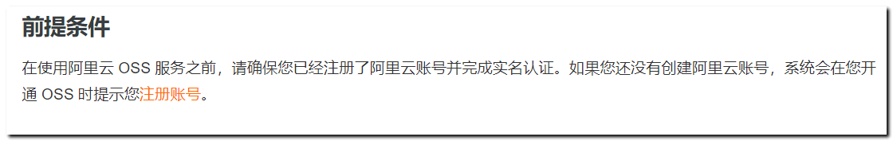

## 2. 开通服务

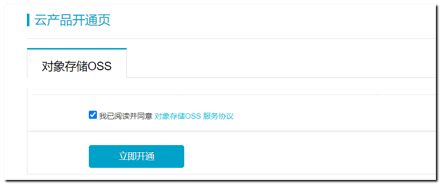


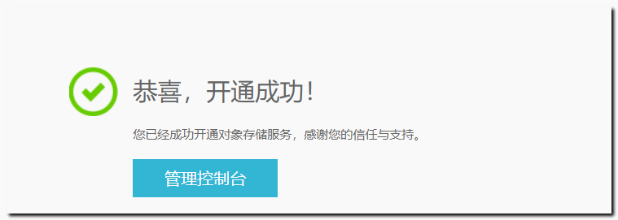 


https://oss.console.aliyun.com/overview

## 3. 创建空间和目录

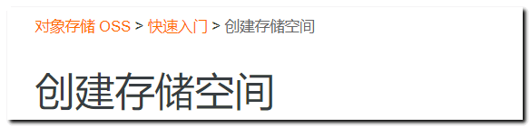 


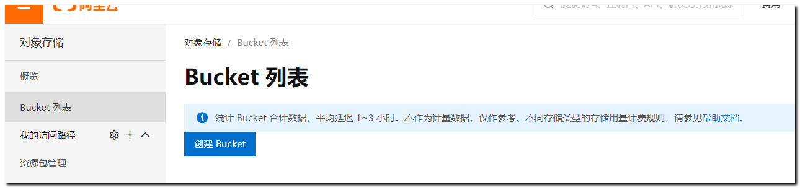 

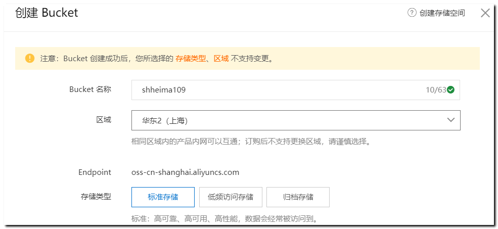 


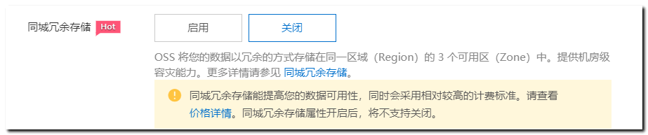 


选择 **公共读**

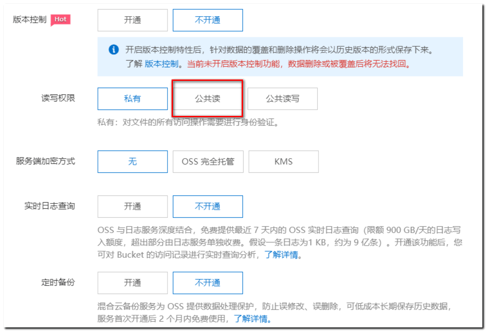 

创建目录：存放对应的文件

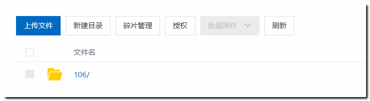 

## 4. 用户秘钥管理

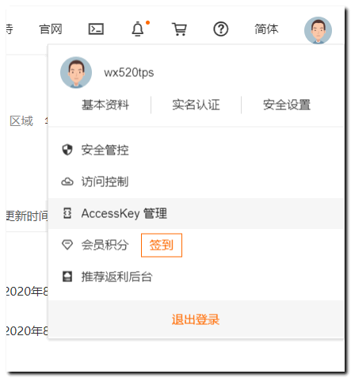 

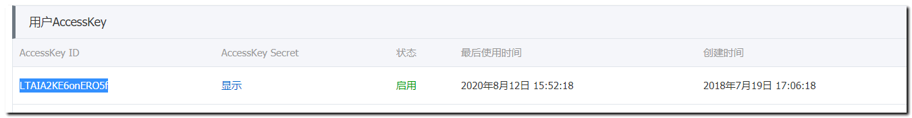 

## 5. 上传文件

https://help.aliyun.com/document_detail/84842.html?spm=a2c4g.11186623.6.963.61df6d1c8BOCRl

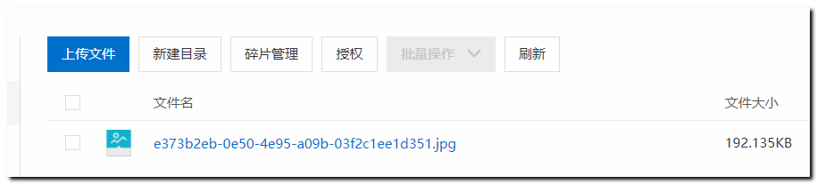 

访问文件：

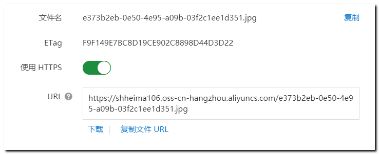 

关于浏览器访问文件下载 无法直接打开问题说明

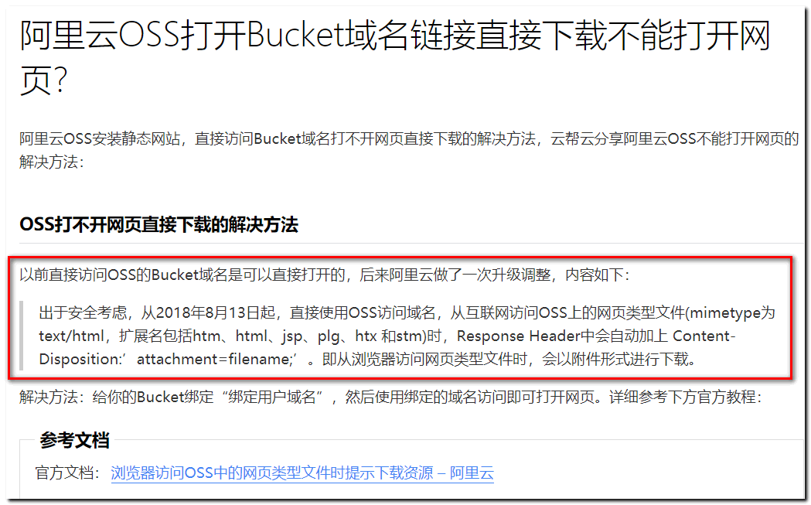 

<https://help.aliyun.com/knowledge_detail/39656.html?source=5176.11533457&userCode=r3yteowb&type=copy>

我们不可以直接打开，但是可以通过 标签 打开文件！

``` 

```

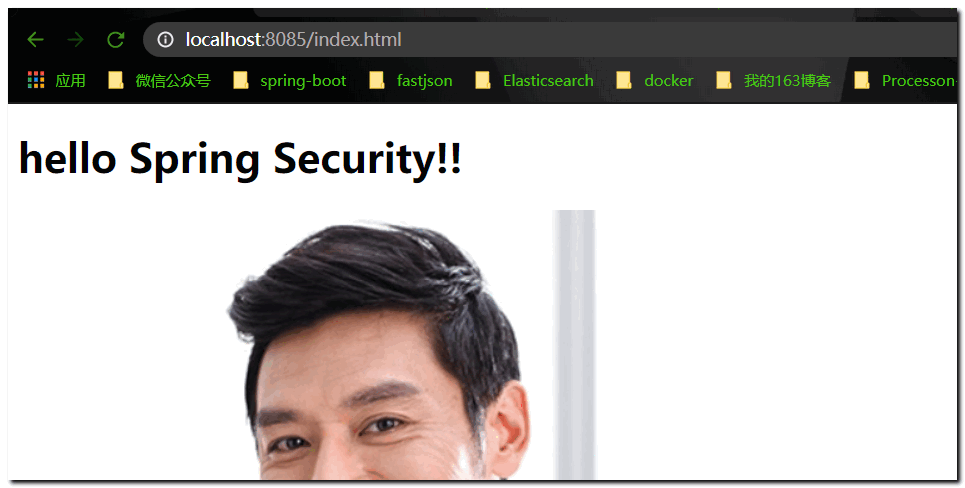 

## 6. sdk开发：

maven依赖

```xml
<dependency>
    <groupId>com.aliyun.oss</groupId>
    <artifactId>aliyun-sdk-oss</artifactId>
    <version>3.10.2</version>
</dependency>
```

文件上传 代码

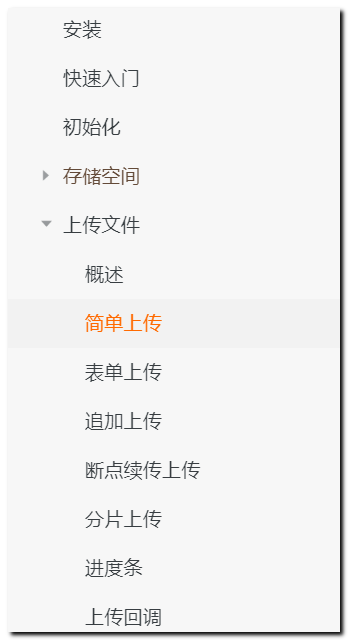  

### 上传字节数组

```java


// Endpoint以杭州为例，其它Region请按实际情况填写。
String endpoint = "http://oss-cn-hangzhou.aliyuncs.com";
// 阿里云主账号AccessKey拥有所有API的访问权限，风险很高。强烈建议您创建并使用RAM账号进行API访问或日常运维，请登录 https://ram.console.aliyun.com 创建RAM账号。
String accessKeyId = "<yourAccessKeyId>";
String accessKeySecret = "<yourAccessKeySecret>";

// 创建OSSClient实例。
OSS ossClient = new OSSClientBuilder().build(endpoint, accessKeyId,accessKeySecret);

// 上传Byte数组。
byte[] content = "Hello OSS".getBytes();
ossClient.putObject("<yourBucketName>", "<yourObjectName>", new ByteArrayInputStream(content));

// 关闭OSSClient。
ossClient.shutdown();
```


### 上传文件流

```java
// Endpoint以杭州为例，其它Region请按实际情况填写。
String endpoint = "http://oss-cn-hangzhou.aliyuncs.com";
// 云账号AccessKey有所有API访问权限，建议遵循阿里云安全最佳实践，创建并使用RAM子账号进行API访问或日常运维，请登录 https://ram.console.aliyun.com 创建。
String accessKeyId = "<yourAccessKeyId>";
String accessKeySecret = "<yourAccessKeySecret>";

// 创建OSSClient实例。
OSS ossClient = new OSSClientBuilder().build(endpoint, accessKeyId, accessKeySecret);

// 上传文件流。 <yourObjectName> 就是上传之后的文件名  可以带路径！
InputStream inputStream = new FileInputStream("<yourlocalFile>");
ossClient.putObject("<yourBucketName>", "<yourObjectName>", inputStream);

// 关闭OSSClient。
ossClient.shutdown();


例如：

// 上传文件流。
        InputStream inputStream = new FileInputStream("D:/桌面.jpg");
        ossClient.putObject("shheima106", "106/mypic.jpg", inputStream);

上传到 shheima106空间下的  106目录下！ 文件名 :  mypic.jpg

```


### 文件删除

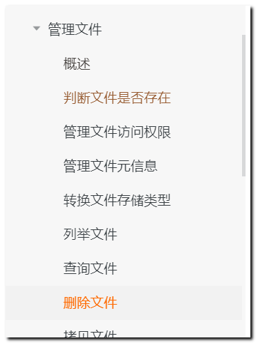 

```java
// Endpoint以杭州为例，其它Region请按实际情况填写。
String endpoint = "http://oss-cn-hangzhou.aliyuncs.com";
// 阿里云主账号AccessKey拥有所有API的访问权限，风险很高。强烈建议您创建并使用RAM账号进行API访问或日常运维，请登录 https://ram.console.aliyun.com 创建RAM账号。
String accessKeyId = "<yourAccessKeyId>";
String accessKeySecret = "<yourAccessKeySecret>";
String bucketName = "<yourBucketName>";
String objectName = "<yourObjectName>";

// 创建OSSClient实例。
OSS ossClient = new OSSClientBuilder().build(endpoint, accessKeyId, accessKeySecret);

// 删除文件。如需删除文件夹，请将ObjectName设置为对应的文件夹名称。如果文件夹非空，则需要将文件夹下的所有object删除后才能删除该文件夹。
ossClient.deleteObject(bucketName, objectName);

// 举例：删除shheima106 空间下的 106目录 下的 mypic.jpg文件
// ossClient.deleteObject("shheima106", "106/mypic.jpg");

// 关闭OSSClient。
ossClient.shutdown();
			

```


