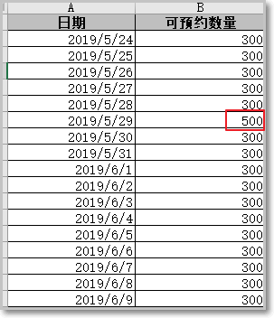

# 第5章 预约管理

### 5.1 预约管理业务功能分析

前面我们已经完成了检查项管理、检查组管理、套餐管理等。

接下来我们需要进行预约设置，其实就是设置每一天的体检预约最大数量。

客户可以通过微信端在线预约，在线预约时需要选择体检的时间，如果客户选择的时间已经预约满则无法进行预约。

 

表字段说明： **预约编号，预约日期，预约总数量，已经预约数量**

开发相关的业务功能如：

模板下载 ： 后台录入数据的模板 一般由系统提供！

上传文件： 后台管理员录入有效数据到系统中！

设置可预约数量 ： 后台设置预约数量

对应的页面原型： **ordersetting.vue** 


对应的数据库表如下：

 

 

预约设置功能的基础数据，**一般都会采用外部录入的形势进行批量录入到系统后台中**。

批量上传外部数据，我们通常会采用excel文件汇总数据，然后批量上传到系统中

**java处理office数据**，apache提供了POI组件给我们，方便我们对office进行快捷处理

### 5.2 Apache POI处理excel数据

POI介绍

```java
Apache POI是用Java编写的免费开源的跨平台的Java API，Apache
POI提供API给Java程序对Microsoft
Office格式档案读和写的功能，其中使用最多的就是使用POI操作Excel文件。
```

POI常用对象说明：

```java
HSSF － 提供读写Microsoft Excel XLS格式档案的功能  
XSSF － 提供读写Microsoft Excel OOXML XLSX格式档案的功能  
HWPF － 提供读写Microsoft Word DOC格式档案的功能  
HSLF － 提供读写Microsoft PowerPoint格式档案的功能  
HDGF － 提供读Microsoft Visio格式档案的功能  
HPBF － 提供读Microsoft Publisher格式档案的功能  
HSMF － 提供读Microsoft Outlook格式档案的功能
```

#### 5.2.1 快速入门案例

目标： 从Excel文件读取数据，hello.xlsx见资料：

 

内容如下：

 

##### 第一步：导入poi依赖

maven坐标：在health_common中已导入，无需重复导入。

```xml
<dependency>  
 <groupId>org.apache.poi</groupId>  
 <artifactId>poi</artifactId>   
</dependency>  
<dependency>  
 <groupId>org.apache.poi</groupId>  
 <artifactId>poi-ooxml</artifactId>  
</dependency>
```


##### 第二步：创建测试用例

 

读取excel数据

方式一

使POI可以从一个已经存在的Excel文件中读取数据

注意 读取excel文件 api编写规则顺序：**工作簿-----工作区-----记录行 -----单元格**

POI操作Excel表格封装了几个核心对象：

**XSSFWorkbook：工作簿  
XSSFSheet：工作表  
Row：行  
Cell：单元格**

```java
public class PoiTest {  
    @Test  
    public void demo1() throws IOException {  
        //创建工作簿  
        XSSFWorkbook workbook = new XSSFWorkbook("D:\\hello.xlsx");  
        //获取工作表，既可以根据工作表的顺序获取，也可以根据工作表的名称获取  
        XSSFSheet sheet = workbook.getSheetAt(0);  
        //遍历工作表获得行对象  
        for (Row row : sheet) {  
        //遍历行对象获取单元格对象  
            for (Cell cell : row) {  
            //获得单元格中的值  
            String value = cell.getStringCellValue();  
            System.out.println(value);  
     	}  
    }  
      workbook.close();  
    }  
}
```

方式二

上面案例是通过遍历工作表获得行，遍历行获得单元格，最终获取单元格中的值。

```java
还有一种方式就是获取工作表最后一个行号，从而根据行号获得行对象，通过行获取最后一个单元格索引，从而根据单元格索引获取每行的一个单元格对象。
```

代码如下：

```java
@Test  
public void demo2() throws IOException {  
    //创建工作簿  
    XSSFWorkbook workbook = new XSSFWorkbook("D:\\hello.xlsx");  
    //获取工作表，既可以根据工作表的顺序获取，也可以根据工作表的名称获取  
    XSSFSheet sheet = workbook.getSheetAt(0);  
    //获取当前工作表最后一行的行号，行号从0开始  
    int lastRowNum = sheet.getLastRowNum();  
    for(int i=0;i<=lastRowNum;i++){  
    //根据行号获取行对象  
    XSSFRow row = sheet.getRow(i);  
    //获取当前行的最后一个单元格的索引号  
    short lastCellNum = row.getLastCellNum();  
    //遍历每一行上的每一个单元格  
        for(short j=0;j<lastCellNum;j++){  
            String value = row.getCell(j).getStringCellValue();  
            System.out.println(value);  
           }  
         }  
     workbook.close();  
}
```


##### 第三步：poi向excel写入数据

使用POI可以在内存中创建一个Excel文件并将数据写入到这个文件，最后通过输出流将内存中的Excel文件下载到磁盘

```java
@Test  
public void demo3() throws IOException {  
//在内存中创建一个Excel文件  
XSSFWorkbook workbook = new XSSFWorkbook();  
//创建工作表，指定工作表名称  
XSSFSheet sheet = workbook.createSheet("传智播客");  

//创建行，0表示第一行  
XSSFRow row = sheet.createRow(0);  
//创建单元格，0表示第一个单元格  
row.createCell(0).setCellValue("编号");  
row.createCell(1).setCellValue("名称");  
row.createCell(2).setCellValue("年龄");  

XSSFRow row1 = sheet.createRow(1);  
row1.createCell(0).setCellValue("1");  
row1.createCell(1).setCellValue("小明");  
row1.createCell(2).setCellValue("10");  

XSSFRow row2 = sheet.createRow(2);  
row2.createCell(0).setCellValue("2");  
row2.createCell(1).setCellValue("小王");  
row2.createCell(2).setCellValue("20");  

//通过输出流将workbook对象输出到磁盘  
FileOutputStream out = new FileOutputStream("D:\\itcast.xlsx");  
workbook.write(out);  
out.flush();//清空缓冲区  
out.close();  
workbook.close();  

}

```

经常操作excel文件，我们可以将excel的crud封装一个通用工具类

### 5.3 POI工具类封装

在资料中的工具类文件夹中有两个工具类

 

将工具类复制到health_common工程中：

 

记得install 一下

### 5.4 预约设置模板功能

目标：当点击模板下载后，可以下载一个预约设置的模板，以便后续可以通过模板批量设置体检的”预约功能”


完善页面

#### 第一步：提供模板文件

资料中已经提供了Excel模板文件ordersetting_template.xlsx，将文件放在health_consumer工程的static/template目录下

 

为模板下载按钮绑定事件实现模板文件下载：其实是直接指定了health_web工程中的模板文件，然后由浏览器实现自动下载。

```js
<el-button style="margin-bottom: 20px;margin-right: 20px" type="primary" @click="downloadTemplate">模板下载</el-button>

//模板文件下载    后台项目 提供模板页面 ： resources/static/template目录下
 downloadTemplate:function(){
      //window.open(url,target) 
      //target:_blank新窗口,_parent本窗口,_self替换当前页面
      window.open('api/template/ordersetting_template.xlsx','_parent');
    }

```


#### 第二步：测试模板下载

测试下载模板无误。


#### 第三步：填写模板

在模板中填入数据以便后期测试。

 


### 5.5 批量导入预约设置信息

预约设置信息对应的数据表为t_ordersetting，

预约设置操作对应的页面为ordersetting.vue

t_ordersetting表结构：

 

**orderDate：预约日期**

**number：可预约人数**

**reservations：已预约人数**

#### 5.5.1 功能实现说明

```java
批量导入预约设置信息操作过程：

1、点击上传文件按钮将录入完信息的模板文件上传到服务器

2、通过POI读取上传文件的数据并保存到数据库

通过日期进行统计查询，判断预约的日期是否在数据库中已经存在（存在表示之前导入过）：

已存在：更新该日期的预约数量

不存在：新增预约日期

```


完善页面ordersetting.vue

#### 第一步：excel文件上传

使用ElementUI的上传组件实现文件上传并绑定相关事件,js组件和之前相同。

```js
     <el-upload action="api/ordersetting/importOrderSettings"
                                       name="excelFile"
                                       :show-file-list="false"
                                       :auto-upload="autoUpload"
                                       :before-upload="beforeAvatarUpload"
                                       :on-success="handleSuccess">
                                <el-button type="primary">上传文件</el-button>
                            </el-upload>

   //上传图片之前执行
                beforeAvatarUpload(file) {
                    const isXlsx = file.type === 'application/vnd.openxmlformats-officedocument.spreadsheetml.sheet';
                    if (!isXlsx) {
                        this.$message.error('必须上传xlsx文件');
                    }
                    return isXlsx ; //   返回值决定 文件是否上传 action 如果 true  自动向action发送文件上传请求
                },

                    
                    
                    

```

#### **第二步：**Controller编写

将资料中的POIUtils工具类复制到health_common工程

在health_web工程创建OrderSettingController并提供upload方法

```java
 @PostMapping("importOrderSettings")
    public Result  importOrderSettings(@RequestParam("excelFile")MultipartFile file){
          //  file   excel  file ----  List ----service--  批量录入 mp 优化--db
        List<String[]> orderSettingList = POIUtils.readExcel(file);
        orderSettingService.importOrderSettings(orderSettingList);
        return new Result(true);
    }

```


#### 第三步：服务接口

创建OrderSettingService服务接口并提供新增方法

```java
public interface OrderSettingService  extends IService<OrderSetting> {
    void importOrderSettings(List<String[]> list);
}
```


#### 第四步：服务实现类

创建服务实现类OrderSettingServiceImpl并实现新增方法

在新增之前，需要先查询当前预约的日期是否被预约过（有可能上传多次），

如果预约过，那么就选择更新（用户可能之前上传的表填错了，再次上传了一张）。

如果没有预约过，就选择添加预约。

采用mybatis-plus提供的批量添加和更新优化，提升性能

```java
  @Override
    public void importOrderSettings(List<String[]> orderSettingList) {
              //   根据 日期 判断 ： 如果数据库表 已经存在 日期  ---天  批量 update    最大预约
            //    如果数据库表  没有指定的日期记录     批量 insert

        List<OrderSetting>  orderSettingImportList =  changeStringArrayToList(orderSettingList);
        //  判断 数据库 是否已经存在 对应日期数据
           //     根据 主键判断  save  还是 update
        //  orderSettingImportList insert  update  (OrderSetting  id)
        for (OrderSetting orderSetting : orderSettingImportList) {
            //  按照日期查询  是否存在   存在  orderSetting  set id
            QueryWrapper<OrderSetting> queryWrapper = new QueryWrapper<OrderSetting>();
            queryWrapper.eq("orderdate",orderSetting.getOrderDate()); //  where  orderdate = '2020-11-9'
            OrderSetting orderSettingIsOrNotExist = baseMapper.selectOne(queryWrapper);
            if(orderSettingIsOrNotExist!=null){
                //  update
                orderSetting.setId(orderSettingIsOrNotExist.getId());
            }
        }
           saveOrUpdateBatch(orderSettingImportList);  //   批量更新和 添加操作
    }
```

#### 第五步：测试新增和修改

测试新增数据：

 

测试更新数据：

 

#### ※常见错误

1.  日期格式转换错误：


错误原因：调用的DateUtils中默认将日期格式化为yyyy-MM-dd,而**OrderSetting中的日期类型只能接受yyyy/MM/dd** 

本案例小结：

```markdown
1. 操作数据层 独立分层测试 方可进行整体模块测试

2. 工具类的使用，如果不熟悉 要进行工具类api使用的测试

3. excel表格默认的日期格式  yyyy/MM/dd   所以 要求我们后台的代码 按照此格式对字符串进行日期的转换！
 
```

### 5.6 当前月份展示预约设置信息

**目标：通过日历的方式展示出来每天设置的预约人数。**

在页面中已经完成了日历的动态展示，后台的营养师可以根据日期，设置重新设置预约人数。

业务说明：

```markd
批量导入数据，仅仅是初步的基本数据，而根据日期 指定设置当天的预约数据，是具体化设置预约参数

但是要注意，可以设置的预约人数，必须从当天开始计算， 当天之前的日期是不可以设置预约的，页面应该

```

我们只需要查询当前月份的预约设置信息并展示到日历中即可，同时在日历中还需要展示已经预约的人数

效果如下：   ordersetting.vue 页面


页面所需的数据格式如下：后台可以将数据封装到Map中。

```js
   this.settingData = {
      "2020-09-01":{number:200,reservations:200},
      "2020-09-02":{number:200,reservations:200},
      "2020-09-05":{number:200,reservations:100},
      "2020-09-15":{number:200,reservations:50},
      "2020-09-28":{number:100,reservations:90}
    }
```

map key : 当月的日期   value : OrderSetting.java 实体对象

#### 第一步：使用静态数据调试

为了能够快速看到效果，我们可以先使用静态数据模拟，然后再改为发送ajax请求查询数据库。

预约设置数据对应的模型数据为leftobj，在initData方法最后为leftobj模型数据赋值：

```js
   this.settingData = {
      "2020-09-01":{number:200,reservations:200},
      "2020-09-02":{number:200,reservations:200},
      "2020-09-05":{number:200,reservations:100},
      "2020-09-15":{number:200,reservations:50},
      "2020-09-28":{number:100,reservations:90}
    }
```

其中date表示日期，number表示可预约人数，reservations表示已预约人数

查看页面效果：


在页面上使用VUE的日历插件显示数据

 

显示效果：

 

#### 第二步：发送ajax获取动态数据

将上面的静态模拟数据去掉，改为发送ajax请求，根据当前页面对应的月份查询数据库获取预约设置信息，将查询结果赋值给leftobj模型数据

**我们需要将 当前的年 和 月  提交给后台！**

**后台根据当前的年  和  月  得出 起始日期  和 当月的 最后一天日期 ，查询当月的预约数**

这里需要注意日期传入 年-月 

为后面进行查询做了一些优化准备  我们只需要 插叙 xxxx-6-1     xxxx6-31  期间的即可 

即使没有31号 我们只要查询在这个范围就可以获取我们想要的参数！不需要 关注30还是31天！

```js
 created(){
        //  页面初始化获取当前年和月  后台发送请求
     this.findSettingData(this.curday.getFullYear(),this.curday.getMonth()+1)

  }

findSettingData(year,month){
        this.$http.get("api/ordersetting/findSettingData/"+year+"/"+month).then((res)=>{
        if(res.data.flag){
          this.settingData = res.data.data
          this.$message.success(res.data.message)
        }else{
          this.$message.error(res.data.message)
        }
    })
    }
```


#### 第三步：Controller编写

在OrderSettingController中提供findSettingData方法，根据月份查询预约设置信息

```java
    @Reference
    private OrderSettingService orderSettingService;

       @GetMapping("findSettingData/{year}/{month}")
    public Result findSettingData(@PathVariable("year") int year,@PathVariable("month") int month){
        return   new Result(orderSettingService.findSettingData(year,month));
    }

```

注意：此处的返回值需要按照模拟数据的结构来进行相应：

 

#### 第四步：服务接口

在OrderSettingService服务接口中扩展方法

```java
  Map findSettingData(String year, String month);
```


#### 第五步：服务实现类

在OrderSettingServiceImpl服务实现类中实现方法

```java
    @Override
    public Map findSettingData(int year, int month) {
           String beginDate = year+"-"+month+"-1";
           String endDate = year+"-"+month+"-31";
           List<OrderSetting> orderSettings = baseMapper.findSettingDataByYearAndMonth(beginDate,endDate);
           //  Map   前后数据交互 格式 对象
        Map<String,Object> map  = new HashMap();
        for (OrderSetting orderSetting : orderSettings) {
            Date orderDate = orderSetting.getOrderDate();
            String dateString = DateUtils.parseDate2String(orderDate, "yyyy-MM-dd");
           //   需要的 数据 传递 前端   灵活 方便    List  Map    json
            Map  orderSettingMap = new HashMap();
            orderSettingMap.put("number",orderSetting.getNumber());
            orderSettingMap.put("reservations",orderSetting.getReservations());
            map.put(dateString,orderSettingMap);
        }
        return map;
    }

```

#### 第六步：Mapper接口

结果集：  List<Map>    map  key  :    **数据库查询结果集 字段名**  

```java
  @Insert("insert into t_setmeal_checkgroup values(#{id},#{checkgroupId})")
    void addSetmealAndGroupInfo(@Param("id") Integer id, @Param("checkgroupId") Integer checkgroupId);
```

------

案例小结：

```markdown
1. 本案例 难点：  日期的查询，需要传递 年和月  使用字符串拼接的方式 来查询  当月的预约数据  
   年-月-1   和  年-月-31  来进行拼接，这样就无需进行复杂的精准日期计算了！ 省去很多不必要的代码封装！
   所以前端 发送日期数据的时候， 可以发送  年-月  2020-8 这样的字符串给后台即可
   
2. 查询的结果集默认的Json序列化 和 页面要求的json格式数据不一致，我们灵活采用 List<Map> 
   重新封装数据结构来完成指定的json格式数据
   
```

### 5.7 其他月份展示预约数据

说明：当用户点击下个月或上个月操作，显示指定月份的预约参数信息

我们可以使用vue中的watch事件  

**watch的作用可以监控一个值的变换，并调用因为变化需要执行的方法。可以通过watch动态改变关联的状态。**

语法使用：

 

当数据模型中的num发生变化时，会触发watch函数，获取最新的值和之前的值。

前端js:

```js
data() {
    return {
      curday: new Date(), // 当前的日期
      settingData:{},
      settingDay:'',
      settingDialog:false,
      number:'',
    };
  }, 


watch:{
    //  监听 当前 日期的变化  curday   只要curday值发生变化  函数function 就会触发 
    curday:function(newDate,oldDate){
      //判断如果日期变化后，不是相同月份就触发后台数据加载
      if(oldDate.getMonth() != newDate.getMonth()){
        this.loadData();//  获取后台指定月份对应得数据
      }
    }
  },    
      
methods:{
   loadData:function(){//后台数据加载
    //   this.curday  双向绑定  当前最新的日期
      console.log('最新日期',this.curday);
      this.findSettingData(this.curday.getFullYear(),this.curday.getMonth()+1)
    },
 
    findSettingData(year,month){
        this.$http.get("api/ordersetting/findSettingData/"+year+"/"+month).then((res)=>{
        if(res.data.flag){
          this.settingData = res.data.data
          this.$message.success(res.data.message)
        }else{
          this.$message.error(res.data.message)
        }
    })
  }  
 }   
```

**后台代码业务代码不变！**

### 5.8 基于日历实现预约设置

**目标:通过点击日历中的设置按钮来设置对应日期的可预约人数**。

功能说明：

```java
1、该功能需要在发送请求时携带两个参数：当前日期和输入的人数，用来修改数据库的数据

2、需要判断当前设置的日期之前是否设置过预约人数

3、传递给后台的参数： 1. 点击的当前日期对象 ： 2018-8-9 这样的格式传递给后台   2.设置的数量 num

未设置过：新增预约数据

已设置过：修改预约数据

```

完善页面

#### 第一步：为设置按钮绑定事件

为日历中的设置按钮绑定单击事件，当前日期作为参数，查看传入的日期的格式。

我们会发现，只有当天日期以后的日期才可以进行预约人数的的设置，当天之前的日期是不显示”设置”按钮的，关键在于以下的这行代码：

接下来我们给设置绑定一个事件弹窗输入框，使其可以输入人数

//预约设置 窗口设置

```js
 <el-dialog title="预约设置" :visible.sync="settingDialog" width="30%" top="15%">
       <div>日期:{{settingDay}}</div>
       <el-input v-model="number" placeholder="输入预约总人数"></el-input>
       <div slot="footer" class="dialog-footer">
        <el-button @click="settingDialog = false">取消</el-button>
        <el-button type="primary" @click="handleUpdate">确定</el-button>
      </div>
     </el-dialog>
```


#### 第二步：点击确定发送ajax请求

完善handleAdd方法，弹出预约设置窗口，用户点击确定按钮则发送ajax请求

```js
  //   点击设置按钮 提交数据到后台更新当前日期预约数据
  handleUpdate(){
          //   正则表达式  提交数据，对数据进行合法校验
          var reg=/^[0-9]*[1-9][0-9]*$/  // 创建一个正则表达式对象
          var flag =  reg.test(this.number) //  test方法 进行 数据合法校验
          if(flag){
            //  判断用户输入值 是否 大于 已经预约数     如果输入数值 小于  已经预约数据  不需要访问后台
            if(this.number<this.settingData[this.settingDay].reservations){
               this.$message.warning("输入数据必须>已经预约数据！");
               return
            }
            //   合法 提交数据给后台   修改数据库 。。 按照指定的日期 修改最大预约数
              this.$http.put("api/ordersetting/updateNumberByOrderdate/"+this.number+"/"+this.settingDay).then((res)=>{
                if(res.data.flag){
                  // 修改成功之后，不用再查询数据库  使用前端js更新  settingData对象中指定数据即可 
                  this.settingData[this.settingDay].number = this.number
                  this.settingDialog = false
                }else{
                  this.$message.error(res.data.message)
                }
              })

          }else{
            this.$message.warning("数据非法!");
          }

         

      },
```

**后台代码**

#### 第三步：编写Controller

在OrderSettingController中提供方法

```java
    @PutMapping("updateNumberByOrderdate/{number}/{orderdate}")
    public Result updateNumberByOrderdate(@PathVariable("number") int number,@PathVariable("orderdate") String orderdate){
        return   new Result(orderSettingService.updateNumberByOrderdate(number,orderdate));
    }
```


#### 第四步：服务接口

在OrderSettingService服务接口中提供方法updateNumberByOrderDate

```java
 Boolean updateNumberByOrderdate(int number, String orderdate);
```

#### 第五步：服务实现类

在OrderSettingServiceImpl服务实现类中实现updateOrderSettingData：

```java
   @Override
    public Boolean updateNumberByOrderdate(int number, String orderdate) {
        return  baseMapper.updateNumberByOrderdate(number,orderdate);

    }


    @Update("update t_ordersetting  set number= #{number}  where  orderdate= #{orderdate}")
    Boolean updateNumberByOrderdate(@Param("number") int number, @Param("orderdate") String orderdate);
```

至此完成了预约管理设置后台功能！

## 6. 能力目标

- 完成预约数据批量录入
- 完成预约数据日历展示


