# 第6章 移动端开发-体检预约

```java
随着移动互联网的兴起和手机的普及，目前移动端应用变得愈发重要，成为了各个商家的必争之地。

例如，我们可以使用手机购物、支付、打车、玩游戏、订酒店、购票等，以前只能通过PC端完成的事情，现在通过手机都能够实现，而且更加方便，而这些都需要移动端开发进行支持，那如何进行移动端开发呢？

移动端开发主要有三种方式：

1、基于手机API开发（原生APP）

2、基于手机浏览器开发（移动web）

3、混合开发（混合APP）

```

### 6.4 移动端开发说明    

#### 基于手机API开发

```java
手机端使用手机API，例如使用Android、ios
等进行开发，服务端只是一个数据提供者。手机端请求服务端获取数据（json、xml格式）并在界面进行展示。这种方式相当于传统开发中的C/S模式，即需要在手机上安装一个客户端软件。

这种方式需要针对不同的手机系统分别进行开发，目前主要有以下几个平台：

1、苹果ios系统版本，开发语言是Objective-C和Swift（底层还是Objective-C）

2、安卓Android系统版本，开发语言是Java

3、微软Windows phone系统版本，开发语言是C#

4、塞班symbian系统版本，开发语言是C++

此种开发方式举例：手机淘宝、抖音、今日头条、大众点评

```


#### 基于手机浏览器开发

```java
生存在浏览器中的应用，基本上可以说是触屏版的网页应用。这种开发方式相当于传统开发中的B/S模式，也就是手机上不需要额外安装软件，直接基于手机上的浏览器进行访问。这就需要我们编写的vue页面需要根据不同手机的尺寸进行自适应调节，目前比较流行的是vue5开发。除了直接通过手机浏览器访问，还可以将页面内嵌到一些应用程序中，例如通过微信公众号访问vue5页面。

这种开发方式不需要针对不同的手机系统分别进行开发，只需要开发一个版本，就可以在不同的手机上正常访问。

本项目会通过将我们开发的vue5页面内嵌到微信公众号这种方式进行开发。

```


#### 混合开发

```java
是半原生半Web的混合类App。需要下载安装，看上去类似原生App，访问的内容是Web网页。
其实就是把vue5页面嵌入到一个原生容器里面。
```


### 6.5 微信公众号开发

要进行微信公众号开发，首先需要访问微信公众平台，官网：<https://mp.weixin.qq.com/>。

#### 微信公众号开发 - 帐号分类

在微信公众平台可以看到，有四种帐号类型：

服务号（企业用户）、订阅号（个人用户） - 本章节采用此种方式、小程序（挑一挑游戏）、  企业微信（企业用户）。

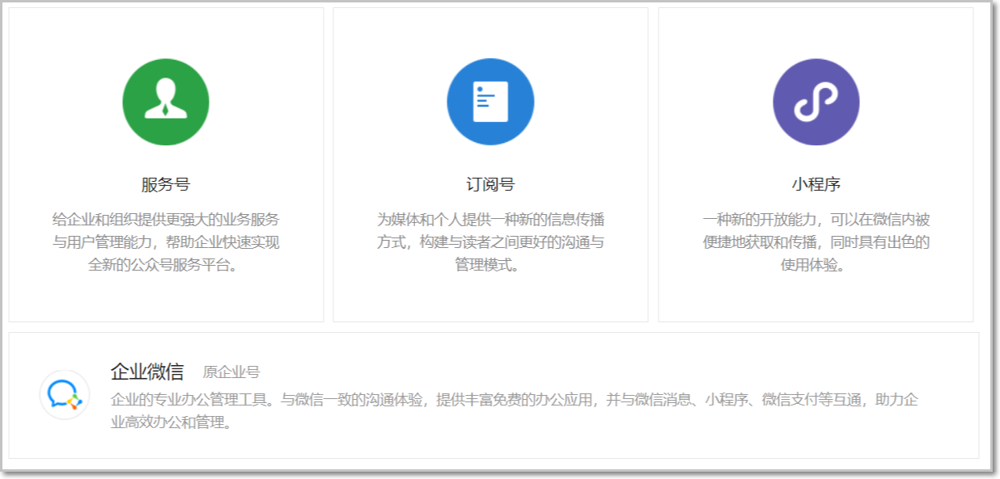

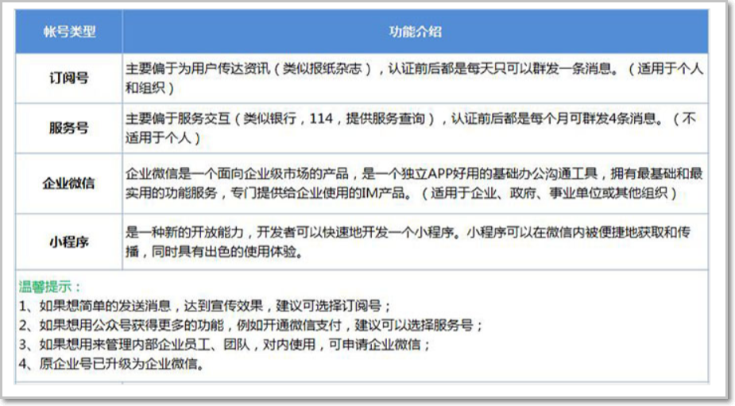

本项目会选择**订阅号这种方式进行公众号开发**。

#### 微信公账号注册帐号

要开发微信公众号，**首先需要注册成为会员**，然后就可以登录微信公众平台进行自定义菜单的设置。

注册页面：<https://mp.weixin.qq.com/cgi-bin/registermidpage?action=index&lang=zh_CN&token=>

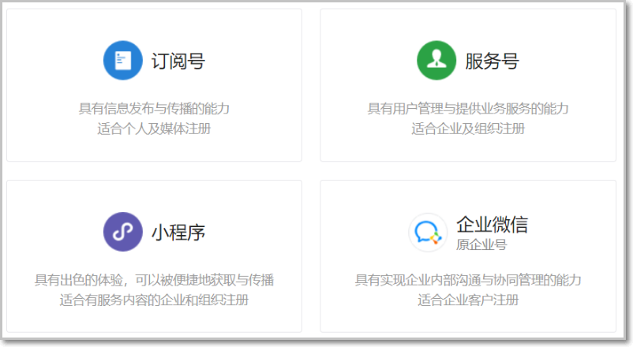

选择订阅号进行注册：激活邮箱后，需要去邮箱中查看验证码

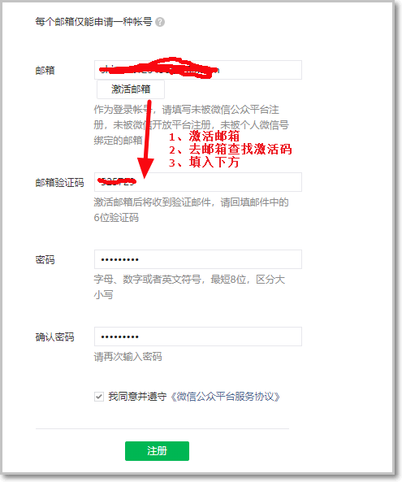 

选择地区：

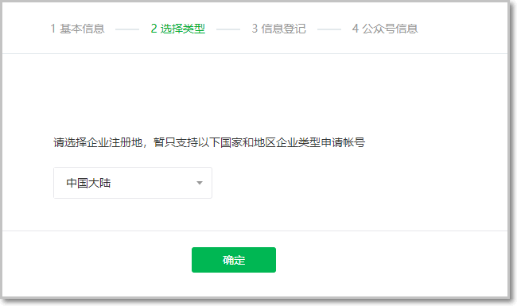 

选择订阅号：

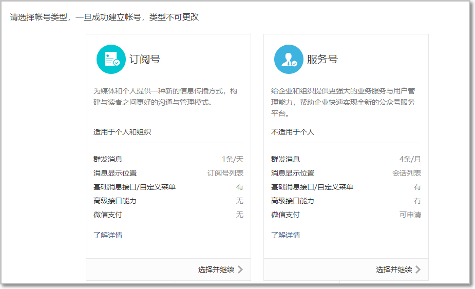

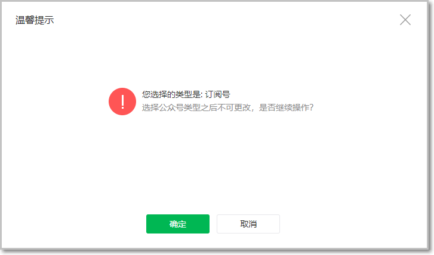 

选择主体类型：**应该选择企业，但是由于我们没有企业的相关信息，所以此处还是选择个人。**

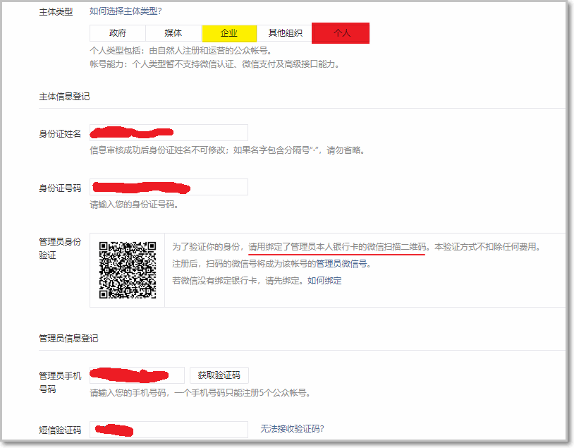

如果选择企业：

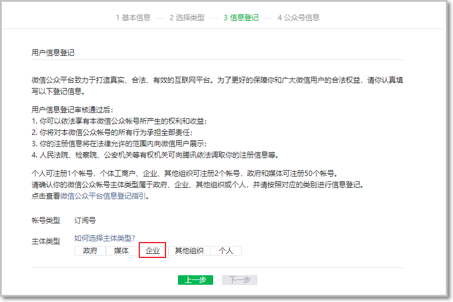 

选择企业后如下：需要填写企业相关信息。

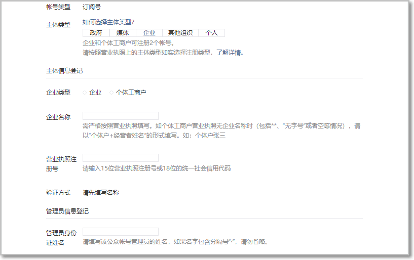

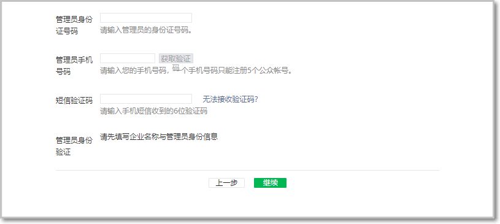

确认提示：

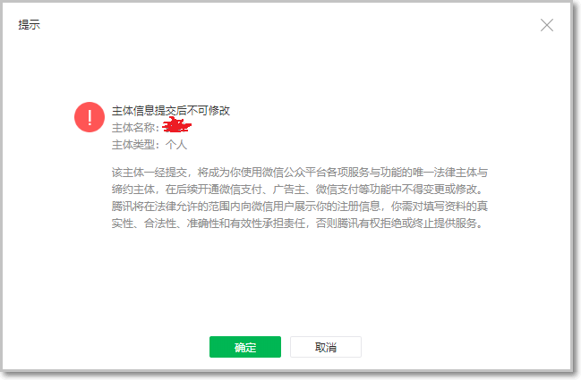 

公众号信息：

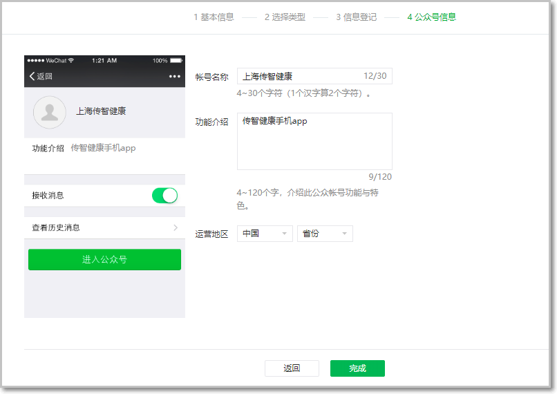

完成如下：

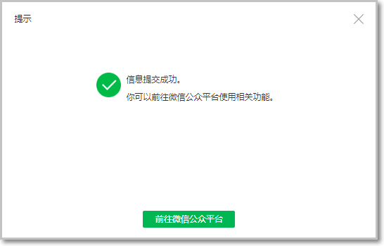 

注意申请公众号是有上限，具体如下：

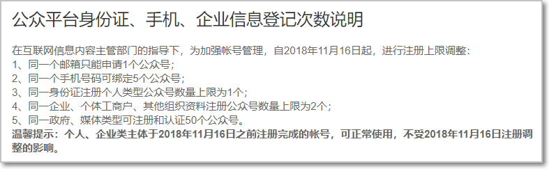

### 6.6 自定义菜单及关注公众号

注册成功后就可以使用注册的邮箱和设置的密码进行登录，登录成功后点击左侧“自定义菜单”进入自定义菜单页面。

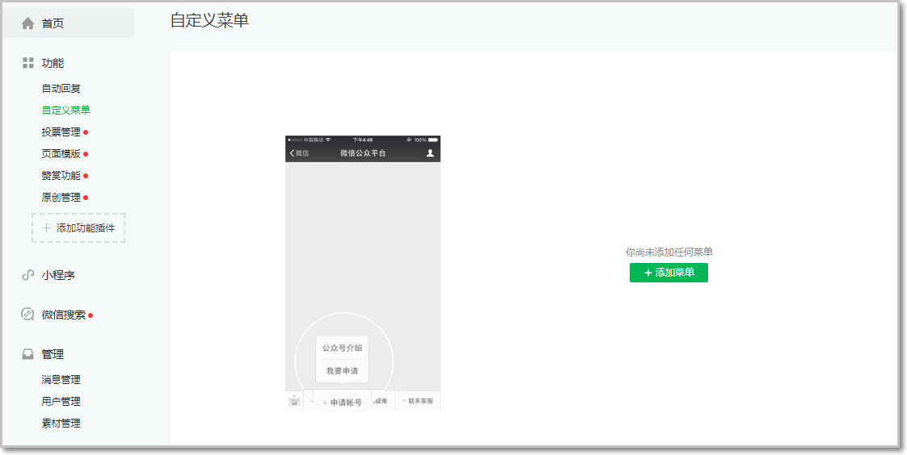

注意：如果要设置跳转页面需要的是企业用户,但是由于我们是学生因此无法使用。

否则当我们点击”健康咨询”菜单就会跳转到对应的页面。

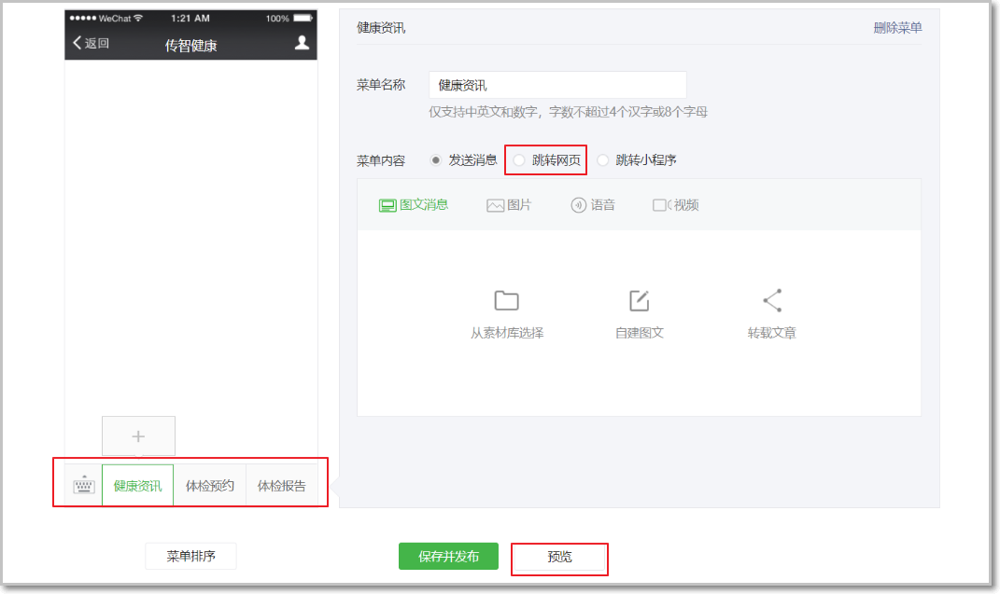

在自定义菜单页面可以根据需求创建一级菜单和二级菜单，

其中一级菜单最多可以创建3个，每个一级菜单下面最多可以创建5个二级菜单。

每个菜单由菜单名称和菜单内容组成，其中菜单内容有3中形式：发送消息、跳转网页、跳转小程序。

由于个人不能设置跳转网页：我们可以选择发送消息，然后自建图文。

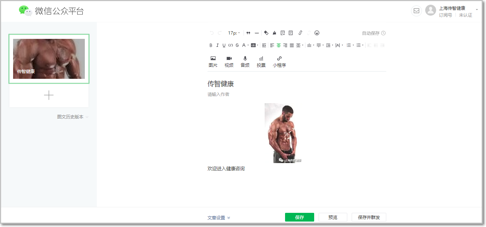

自建图文后，从素材库选择图文保存并即可：

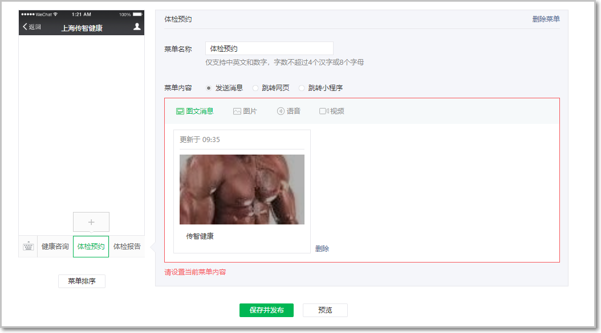

**公众号关注**

关注方式：

```java
1、公众号搜索”传智健康”

2、使用二维码扫描

```

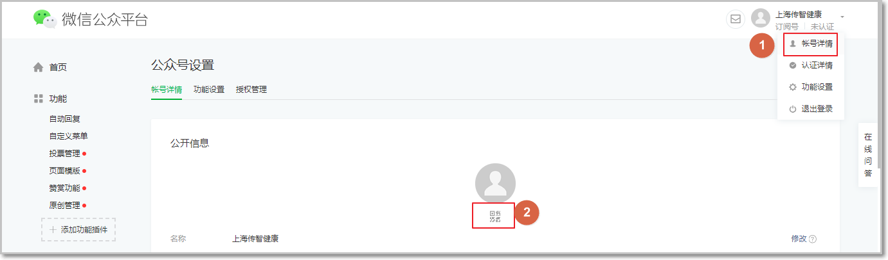

获取二维码图片：

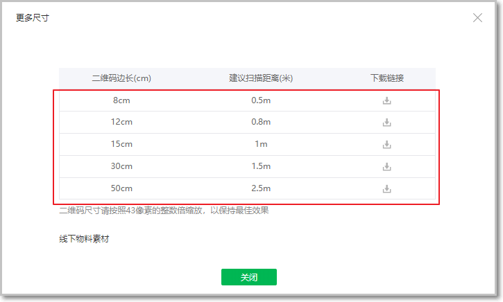 

扫描二维码后可以关注公众号：

  

关注之后，在用户管理中可以看到关注的用户：

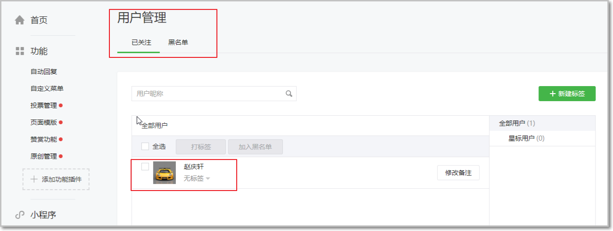

**上线要求**

```java
如果是个人用户身份注册的订阅号，则自定义菜单的菜单内容不能进行跳转网页，因为个人用户目前不支持微信认证，而跳转网页需要微信认证之后才有权限。

如果是企业用户，首先需要进行微信认证，通过后就可以进行跳转网页了，跳转网页的地址要求必须有域名并且域名需要备案通过。

```

### 6.7 用户自助预约功能

功能分析说明

```java
用户在体检之前需要进行预约，可以通过电话方式进行预约，此时会由体检中心客服人员通过后台系统录入预约信息。用户也可以通过手机端自助预约。

本章节开发的功能为用户通过手机自助预约。

预约流程如下：

1、访问移动端首页

2、点击体检预约进入体检套餐列表页面

3、在体检套餐列表页面点击具体套餐进入套餐详情页面

```

流程图：  

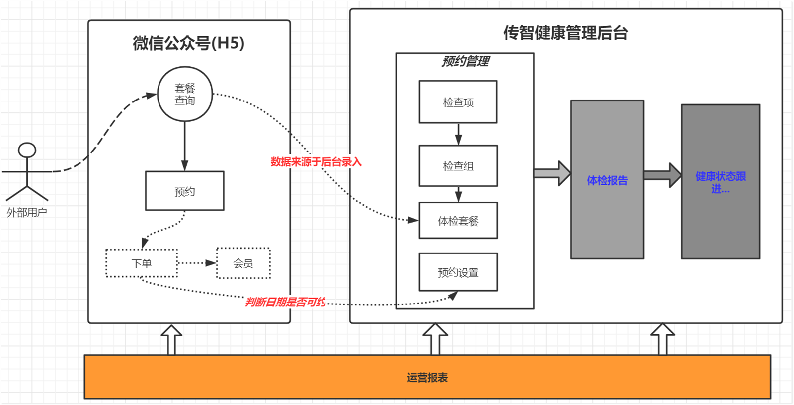 

效果如下图：

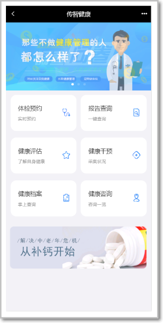 

 

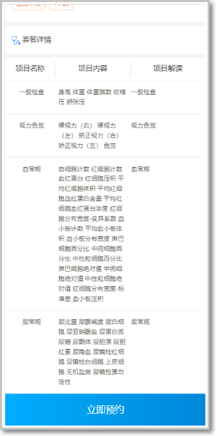 

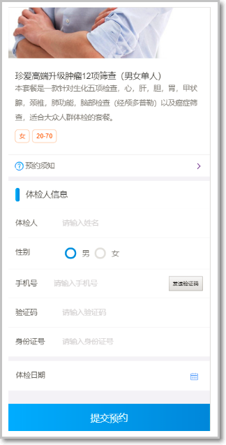 

#### 6.7.1 搭建移动端工程环境

本项目是基于SOA架构进行开发，前面我们已经完成了后台系统的部分功能开发，

在后台系统中都是通过Dubbo调用服务层发布的服务进行相关的操作。

本章节我们开发移动端工程也是同样的模式，所以我们也需要在移动端工程中通过Dubbo调用服务层发布的服务如图：

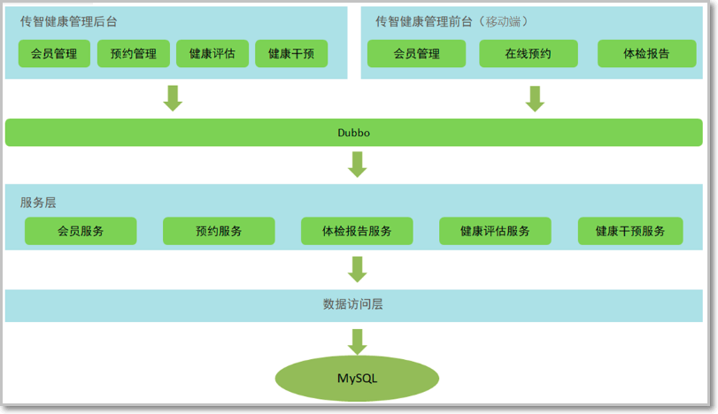

##### 第一步：创建移动端工程

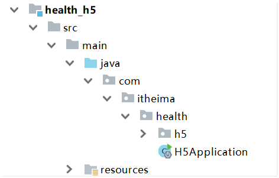 

##### 第二步：导入相关依赖

pom.xml  

```xml
  <dependencies>
        <dependency>
            <groupId>org.springframework.boot</groupId>
            <artifactId>spring-boot-starter-web</artifactId>
        </dependency>

        <dependency>
            <groupId>com.itheima.health</groupId>
            <artifactId>health_api</artifactId>
            <exclusions>
                <exclusion>
                    <groupId>org.springframework.boot</groupId>
                    <artifactId>spring-boot-starter-jdbc</artifactId>
                </exclusion>
            </exclusions>
        </dependency>
        <dependency>
            <groupId>com.itheima.health</groupId>
            <artifactId>health_commons</artifactId>
        </dependency>
        <!--springboot 整合dubbo 开始 -->
        <dependency>
            <groupId>org.apache.dubbo</groupId>
            <artifactId>dubbo-spring-boot-starter</artifactId>
            <version>2.7.5</version>
        </dependency>
        <dependency>
            <groupId>org.apache.dubbo</groupId>
            <artifactId>dubbo-dependencies-zookeeper</artifactId>
            <version>2.7.5</version>
            <type>pom</type>
            <exclusions>
                <exclusion>
                    <groupId>org.slf4j</groupId>
                    <artifactId>slf4j-log4j12</artifactId>
                </exclusion>
            </exclusions>
        </dependency>
        <!--springboot 整合dubbo 结束-->
        <!-- 整合swagger ui -->
        <dependency>
            <groupId>io.springfox</groupId>
            <artifactId>springfox-swagger2</artifactId>
            <version>2.9.2</version>
        </dependency>
        <dependency>
            <groupId>io.springfox</groupId>
            <artifactId>springfox-swagger-ui</artifactId>
            <version>2.9.2</version>
        </dependency>
        <!-- rabbitmq -->
        <dependency>
            <groupId>org.springframework.boot</groupId>
            <artifactId>spring-boot-starter-amqp</artifactId>
        </dependency>
    </dependencies>

    <build>
        <plugins>
            <plugin>
                <groupId>org.springframework.boot</groupId>
                <artifactId>spring-boot-maven-plugin</artifactId>
            </plugin>
        </plugins>
    </build>
```

##### 第三步：导入静态资源

静态资源（CSS、vue、img等，详见资料）：从资料中复制即可  静态资源文件拷贝到static目录下

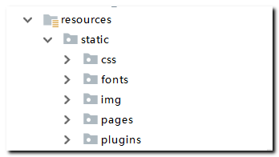 

##### 第四步：创建配置文件yaml

```yaml
server:
   port: 8082

spring:
  application:
    name: provider-application
  rabbitmq:
    virtual-host: /heima
    username: guest
    password: guest
    addresses: 127.0.0.1:5672

dubbo:
    application:            #应用配置，用于配置当前应用信息，不管该应用是提供者还是消费者。
      name: h5_consumer
    registry:                 #注册中心配置，用于配置连接注册中心相关信息。
      address: zookeeper://127.0.0.1:2181
      port: -1
    consumer:
      check: false
      
      
```

#### 6.7.2 套餐列表页面动态展示

移动端首页为/pages/index.html，效果如下：

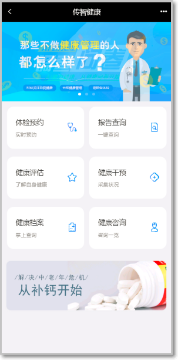 

目标: 点击“体检预约”直接跳转到体检套餐列表页面（/pages/setmeal.vue）并显示相关数据：

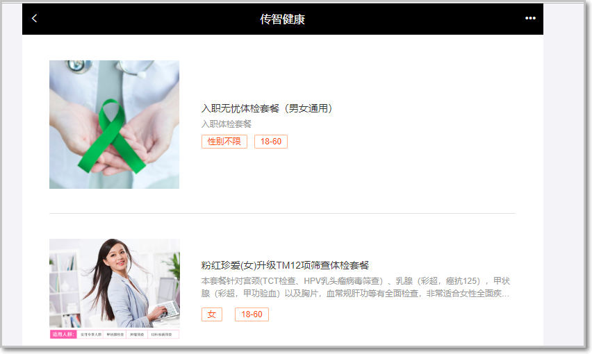

完善页面: 页面分析

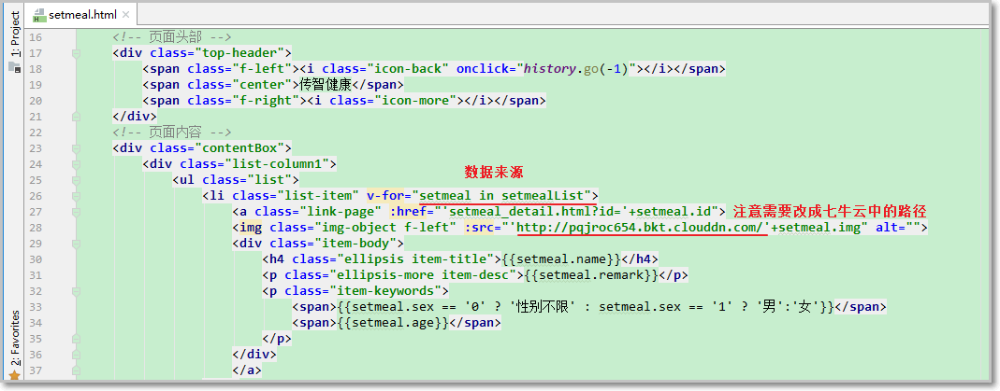

##### 第1步：获取套餐列表数据

在setmeal.vue中添加代码如下：

```js
created(){  
axios.get("setmeal/findAll").then((response)=>{  
if(response.data.flag){  
this.setmealList = response.data.data;  
}else{  
this.$message.error(response.data.message);  
}  
});  
}
```

**后台代码**

拷贝全局异常处理类到controller包下

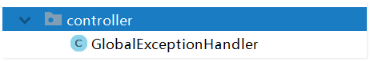 

##### 第2步：Controller

```java
@RestController  
public class SetmealMobileControler {  

@Reference  
private SetmealService setmealService;  

/**  
* 查询所有套餐  
* @return  
*/  
@GetMapping("setmeal/findAll")  
public Result findSetmealAll(){  
    List<Setmeal> setmealList = setmealService.list();  
    return new Result(setmealList);  

  }  
}

```


##### 第3步：服务接口

分别启动2台服务器：  service/生产者    webchat  微信客户端 

问题：

如果没有显示图片，请检查是否将图片的路径改为阿里云的路径：

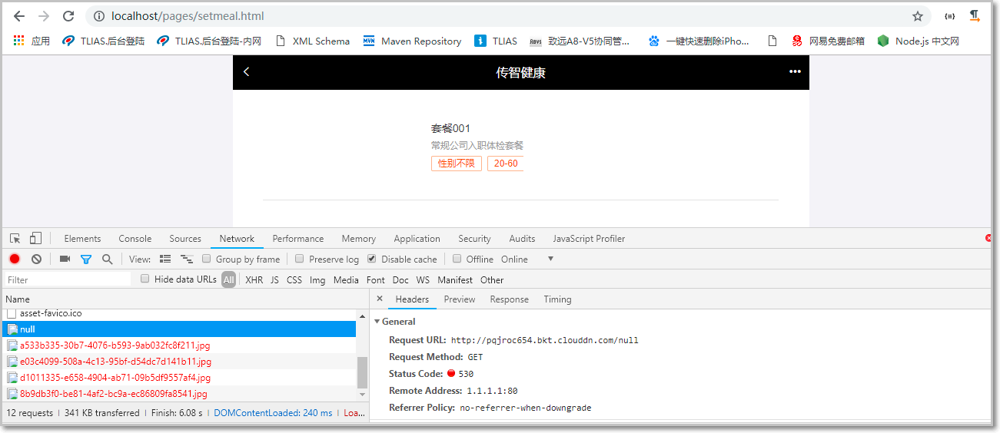

解决方案

将阿里云中的地址复制到setmeal.vue中替换之前的url:

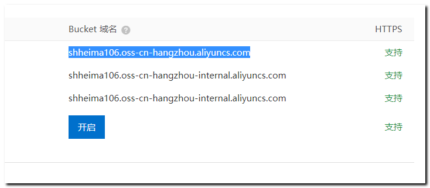 

替换如下即可：

https://itcast117.oss-cn-shanghai.aliyuncs.com/+uuidfilename


### 6.8  套餐详情页面展示

目标: 当点击某个套餐之后，在套餐详情页面显示相关信息：效果如下：

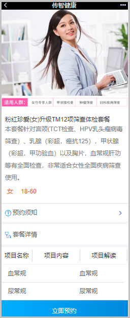 

开发流程图：

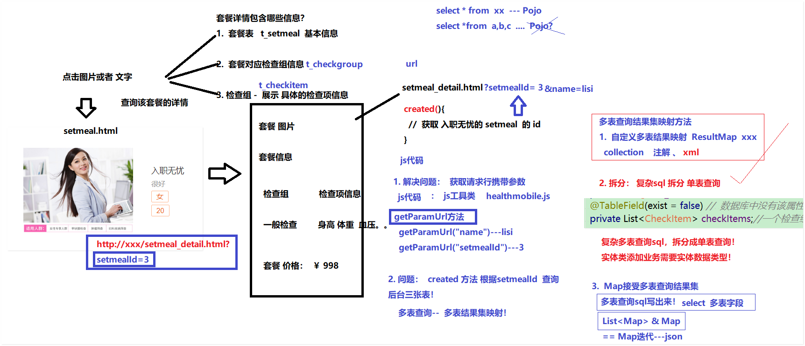

**完善页面**

#### 第一步：获取请求参数中套餐id

功能步骤说明

```java
前面我们已经完成了体检套餐列表页面动态展示，点击其中任意一个套餐则跳转到对应的套餐详情页面（/pages/setmeal_detail.html），并且会携带此套餐的id作为参数提交。

请求路径格式：http://localhost/pages/setmeal_detail.html?id=10

在套餐详情页面需要展示当前套餐的信息（包括图片、套餐名称、套餐介绍、适用性别、适用年龄）、此套餐包含的检查组信息、检查组包含的检查项信息等。

在页面中已经引入了healthmobile.js文件，此文件中已经封装了getUrlParam方法可以根据URL请求路径中的参数名获取对应的值

```

此案例难点  **底层数据封装的sql语句**  涉及到多表查询！

开发中，**我们往往将一条复杂的sql 拆分成简单的sql来实现对应的功能！**

```sql
根据id 查询 套餐信息
                select * from t_setmeal where id =#{id}


<!--根据套餐id 查询对应的检查组信息、-->
             select * from t_checkgroup tcg, t_setmeal_checkgroup  tsmcg
             where tsmcg.CHECKGROUP_ID = tcg.ID and  tcg.is_delete=0 and  tsmcg.SETMEAL_ID=#{id}
    
    
    
<!--套餐详情查询  拆分sql语句 根据检查组 查询所有的检查项信息-->
              select * from t_checkitem tci ,t_checkgroup_checkitem tcgci  
                where tci.ID = tcgci.CHECKITEM_ID
                and tcgci.CHECKGROUP_ID=#{id}  
```

#### 第二步：获取套餐详细信息

图片信息来自于阿里云上的图片，因此需要将地址改成阿里云上的地址：

```js
<script>  
   var vue = new Vue({  
       el:'#app',  
       data:{  
           imgUrl:null,//套餐对应的图片链接  
           setmeal:{}  
      },  
       mounted(){  
           axios.post("setmeal/findSetmealDetailById?id=" + id).then((response) => {  
               if(response.data.flag){  
                   this.setmeal = response.data.data;  
                   this.imgUrl = 'http://pqjroc654.bkt.clouddn.com/' +
this.setmeal.img;  
              }  
          });  
      }  
  });  
</script>
```

#### 第三步：展示套餐信息

发现页面显示的数据不仅仅只有Setmeal本身的数据，还涉及到了Setmeal的关联对象CheckGroup中的数据

并且通过CheckGroup还需要查询到管理对象item的数据：在页面上显示。

因此页面**需要查询三张表的数据**。

```js
<div class="contentBox">  
 <div class="card">  
   <div class="project-img">  
       
   </div>  
   <div class="project-text">  
     <h4 class="tit">{{setmeal.name}}</h4>  
     <p class="subtit">{{setmeal.remark}}</p>  
     <p class="keywords">  
       <span>{{setmeal.sex == '0' ? '性别不限' : setmeal.sex == '1' ?
'男':'女'}}</span>  
       <span>{{setmeal.age}}</span>  
     </p>  
   </div>  
 </div>  
 <div class="table-listbox">  
   <div class="box-title">  
     <i class="icon-zhen"><span class="path1"></span><span
class="path2"></span></i>  
     <span>套餐详情</span>  
   </div>  
   <div class="box-table">  
     <div class="table-title">  
       <div class="tit-item flex2">项目名称</div>  
       <div class="tit-item flex3">项目内容</div>  
       <div class="tit-item flex3">项目解读</div>  
     </div>  
     <div class="table-content">  
       <ul class="table-list">  
         <li class="table-item" v-for="checkgroup in setmeal.checkGroups">  
           <div class="item flex2">{{checkgroup.name}}</div>  
           <div class="item flex3">  
             <label v-for="checkitem in checkgroup.checkItems">  
              {{checkitem.name}}  
             </label>  
           </div>  
           <div class="item flex3">{{checkgroup.remark}}</div>  
         </li>  
       </ul>  
     </div>  
     <div class="box-button">  
       <a @click="toOrderInfo()" class="order-btn">立即预约</a>  
     </div>  
   </div>  
 </div>  
</div>
```

**后台代码**

#### 第四步：Controller

在SetmealMobileController中提供findById方法

```java
/**  
* 通过id查询套餐和检查组以及检查项数据  
* @return  
*/  
@GetMapping("setmeal/findSetMealDetail")  
public Result findSetMealDetail(@RequestParam("id")Integer id){  

try {  
    Setmeal setmeal = setmealService.findSetMealDetail(id);  
    return new Result(true,MessageConstant.QUERY_SETMEAL_SUCCESS,setmeal);  
} catch (Exception e) {  
    e.printStackTrace();  
    return new Result(false,MessageConstant.QUERY_SETMEAL_FAIL);  
}  

}

```


#### 第五步：服务接口

在SetmealService服务接口中提供findById方法

```java
//通过id查询套餐、检查组和检查项  
Setmeal findSetMealDetail(Integer id);
```


#### 第六步：服务实现类

在SetmealServiceImpl服务实现类中实现findById方法

注意： 开发中遇到复杂的多表sql ,我们推荐使用sql  取代 mybatis-plus 的对象操作，因为api 过于复杂！

```java
   @Override
    public Setmeal findSetMealDetailBySetmealId(Integer id) {
        //   1 查询 套餐基本信息多表查询
         Setmeal setmeal  = baseMapper.selectById(id);//   查询基本 套餐信息
        //   2.根据套餐id  查询对应得检查组信息
         List<CheckGroup> checkGroupList = baseMapper.findCheckGroupsBySetmealId(id);

         //   3. 根据检查组id  查询对应检查项信息
        for (CheckGroup checkGroup : checkGroupList) {
            List<CheckItem> checkItemList = checkGroupMapper.findCheckItemsByGroupId(checkGroup.getId());
            checkGroup.setCheckItems(checkItemList);
        }
         setmeal.setCheckGroups(checkGroupList);
        return setmeal;
    }
```

#### 第七步：Mapper接口

在Mapper接口中相关sql注解

```java
SetMealMapper

@Select("select  tcg.id,tcg.NAME,tcg.remark " +
            "from t_checkgroup tcg , t_setmeal_checkgroup tscg  " +
            "WHERE tscg.CHECKGROUP_ID = tcg.ID and tcg.is_delete=0 and tscg.SETMEAL_ID =#{sid}")
    List<CheckGroup> findCheckGroupsBySetmealId(@Param("sid") Integer sid);


CheckGroupMapper

   @Select("SELECT tc.NAME " +
            "FROM  t_checkitem tc,t_checkgroup_checkitem tcgc " +
            "WHERE tc.id = tcgc.CHECKITEM_ID and tc.is_delete=0 AND tcgc.CHECKGROUP_ID =#{gid}")
    List<CheckItem> findCheckItemsByGroupId(@Param("gid") Integer gid);

```

#### 第八步：测试 

本案例小结：

```markdown
1. 多表查询业务较为复杂，一般都会将复杂查询，拆分成单表查询
   根据页面需要的素材，我们可以将数据分模块查询，根据不同模块查询对应的单表数据，
   在后台代码进行模型数据的封装！

2. mybatis-mp 单表拆分语句,因为嵌套查询，表一旦多，就会很复杂，不易阅读，一般我们会进行
   代码拆分，单表单一查询  因此就会很简单   
   
   
优化方案： 对于页面不需要的数据，我们在查询底层数据的时候 可以选择不用封装到实体模型中
CheckGroupMapper  
@Select("select tcg.name,tcg.remark,tcg.id  " +
           "from t_checkgroup tcg, t_setmeal_checkgroup  tsmcg " +
           "where tsmcg.CHECKGROUP_ID = tcg.ID and  tcg.is_delete=0 and  tsmcg.SETMEAL_ID=#{id}")
    List<CheckGroup> findCheckGroupsBySetMealId(@Param("id") Integer id);

CheckItemMapper
    @Select("select tci.name from t_checkitem tci ,t_checkgroup_checkitem tcgci " +
            "where tci.is_delete = 0 and  tci.ID = tcgci.CHECKITEM_ID " +
            "and tcgci.CHECKGROUP_ID=#{id}")
    List<CheckItem> findCheckItemByCheckGroupId(@Param("id") Integer id);

```


### 6.9 完善预约页面套餐数据

目标： 在套餐详情页面点击“立即预约”后跳转到预约页面并显示相关数据，跳转到页面，显示相关信息：

显示图片和相关套餐信息

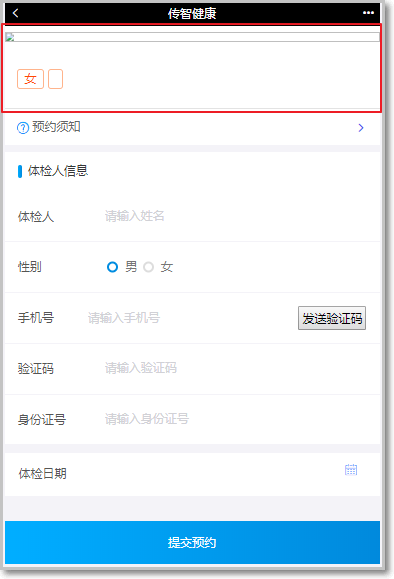 

**页面调整**

在预约页面（/pages/orderInfo.html）进行调整

#### 第一步：套餐页面js说明

发现页面上的套餐信息可以通过套餐id查询出来：


从请求路径中获取当前套餐的id

```js
<script>  
 var id = getUrlParam("id");  
</script>

发现所有页面数据其实还是通过id查询setmeal，而这个功能之前已经编写过了，在VUE的钩子函数中发送ajax请求，根据id查询套餐信息：

created(){  
    axios.get("setmeal/findById?id="+id).then((res)=>{  
    if(res.data.flag){  
    this.setmeal = res.data.data

    this.imgUrl =
    "http://ptqw7v2uv.bkt.clouddn.com/"+res.data.data.img  
    }else{  
    this.$message.error(res.data.message);  
    }  

})  
}

```

#### 第二步：根据id查询套餐后台

根据页面传递的套餐id  后台查询套餐基本数据

相关代码：

```java
相同功能学员自行完成
```


## 能力目标

- **完成套餐详情查询功能**


@Autowired 与 @Resource、@Reference注解区别：

1、 @Autowired与@Resource都可以用来装配bean. 都可以写在字段上,或写在setter方法上。

2、 @Autowired默认按类型装配（这个注解是属业spring的），默认情况下必须要求依赖对象必须存在，如果要允许null值，可以设置它的required属性为false，如：@Autowired(required=false) ，如果我们想使用名称装配可以结合@Qualifier注解进行使用，如下：

```java
@Autowired
@Qualifier("baseDao")
private BaseDao baseDao;
```

3、@Resource（这个注解属于J2EE的），默认按照名称进行装配，名称可以通过name属性进行指定，如果没有指定name属性，当注解写在字段上时，默认取字段名进行安装名称查找，如果注解写在setter方法上默认取属性名进行装配。当找不到与名称匹配的bean时才按照类型进行装配。但是需要注意的是，如果name属性一旦指定，就只会按照名称进行装配。

```java
@Resource(name="baseDao")
private BaseDao baseDao;`
```

推荐使用：@Resource注解在字段上，这样就不用写setter方法了，并且这个**注解是属于J2EE的**，减少了与spring的耦合。这样代码看起就**比较优雅**。

4、@Referece注解：  属于dubbo 体系注解 

该注解在分布式环境下： 生成接口的代理类：进行远程通信 ！


 


