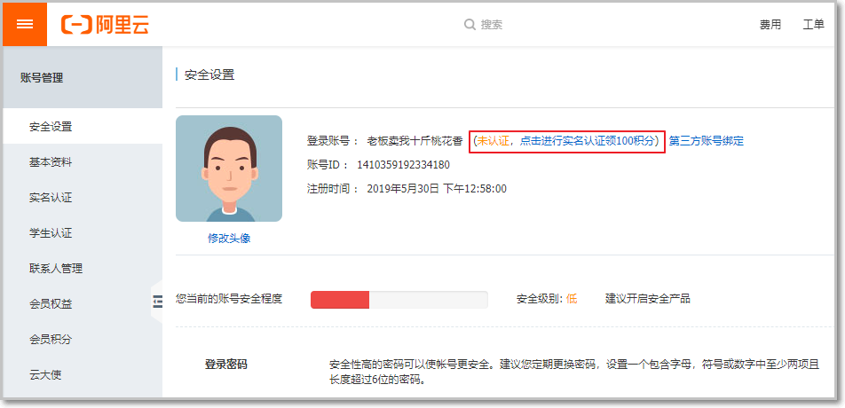
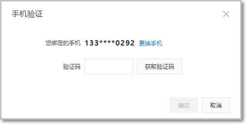

#  第7章 移动端开发-体检预约


## 体检预约流程说明

```java
用户可以通过如下操作流程进行体检预约：

1、在套餐详情页面点击立即预约，页面跳转到预约页面

2、在预约页面点击”发送验证码”，通过阿里云发送短信验证码到手机

3、在预约页面录入收到的手机短信验证码，点击提交预约，完成体检预约

```


涉及到的技术点： **短信发送**


## 7.1 短信发送功能申请

### 7.1.1 短信服务介绍

目前市面上有很多第三方提供的短信服务，这些第三方短信服务会和各个运营商（移动、联通、电信）对接，我们只需要注册成为会员并且按照提供的开发文档进行调用就可以发送短信。需要说明的是这些短信服务都是收费的服务。

本项目短信发送我们选择的是**阿里云**提供的短信服务。

短信服务（Short Message Service）是阿里云为用户提供的一种通信服务的能力，支持快速发送短信验证码、短信通知等。
三网合一（电信网、[有线电视网](https://www.baidu.com/s?wd=%E6%9C%89%E7%BA%BF%E7%94%B5%E8%A7%86%E7%BD%91&tn=SE_PcZhidaonwhc_ngpagmjz&rsv_dl=gh_pc_zhidao)和计算机通信网）专属通道，与工信部携号转网平台实时互联。

电信级运维保障，实时监控自动切换，到达率高达99%。

```java
短信服务API提供短信发送、发送状态查询、短信批量发送等能力，在短信服务控制台上添加签名、模板并通过审核之后，可以调用短信服务API完成短信发送等操作。
```


### 7.1.2 注册阿里云账号

阿里云官网：<https://www.aliyun.com/> 

点击官网首页免费注册跳转到如下注册页面：如果有阿里云、淘宝或1688账号可以直接登录即可。

 

需要输入验证码：

 

注册成功后跳转到如下页面：


### 7.1.3 实名认证

进入账号管理：


进行实名认证：



选择认证类型：个人或者企业


选择认证方式：个人支付宝授权认证


勾选后提交：


使用手机扫码：

 

确认信息：


完成认证：


### 7.1.4 开通短信服务

注册成功后，点击登录按钮进行登录。登录后进入短信服务管理页面，选择国内消息菜单：


开通短信服务：

 

短信服务需要收费，可以充值：


### 7.1.5 设置短信签名

点击添加签名按钮：用来显示短信是由哪里发送的

当我们手机收到短信后，会显示哪里发送的短信：

 

短信签名设置如下：


目前个人用户只能申请适用场景为验证码的签名，企业用户才可以申请通用的，签名的设置会有一个审核的过程，预计2小时。


确定后：

 

签名审核中：


### 7.1.6 设置短信模板

1.  手机验证模板

添加短信的模板：


点击添加模板按钮：回头我们会将短信发送的验证码保存到redis中以方便验证

注意：个人只能设置验证码模板，短信通知和推广短信是企业用户才能使用的。

 

当全部设置完成后提交：需要审核

 

状态显示：审核中


### 7.1.7 预约成功短信通知模板

步骤同上：由于个人无法使用短信通知，因此就将验证码作为通知来使用，如果是企业用户就可以选择使用短信通知业务。

 

例：

 

### 7.1.8 设置access keys

在发送短信时需要进行身份认证，只有认证通过才能发送短信。

本小节就是要设置用于发送短信时进行身份认证的key和密钥。鼠标放在页面右上角当前用户头像上，会出现下拉菜单：


点击accesskeys：阿里提供了很多的服务，为了保证服务的安全性，阿里建议用户不要使用全局的key，而是使用子服务（如短信服务）对应的key，以免因为泄露全局的key而导致其他服务的安全性问题。

 

点击开始使用子用户AccessKey按钮，后发现需要开通访问控制RAM（第一次使用阿里云短信服务，需要开通RAM）:

RAM是阿里云为客户提供的用户身份管理与资源访问控制服务,短信服务需要RAM服务的支持。

 

7.1.9 开通RAM服务

点击开始使用子用户AccessKey按钮，后发现需要开通访问控制RAM:

RAM是阿里云为客户提供的用户身份管理与资源访问控制服务,短信服务需要RAM服务的支持。

 

选择开通：

 

开通成功：


重新点击开始使用子用户AccessKey按钮：发现需要新建用户

### 7.1.10 新建用户

新建用户：每个用户可以使用各种不同的阿里云服务。

 

需要手机验证：

 

生成用户信息：


### 7.1.11 设置权限

给当前用户设置权限：即当前用户可以使用哪些阿里云的服务。

注意：在”添加权限”之前，一定先将key复制下来，因为之后就再也看不到了。除非再去创建新的key


选择短信服务的权限：


授权成功:

 

## 7.2 发送短信API说明

目标：**使用阿里云短信服务发送一条短信验证码到手机上，进行功能的测试**

#### 第一步：充值

注意使用阿里云的短信服务，需要进行预先充值：


#### 第二步：导入maven坐标和短信发送代码生成器

在health_parent工程的pom中导入：   然后在 commons模块导入依赖 去版本号即可！

```xml
    <dependency>
            <groupId>com.aliyun</groupId>
            <artifactId>aliyun-java-sdk-core</artifactId>
            <version>4.5.0</version>
        </dependency>
```

 参照官方范例即可

网址：<https://api.aliyun.com/new?spm=a2c4g.11186623.2.13.b26319d9PfotpM#/?product=Dysmsapi&version=2017-05-25&api=SendSms&tab=DEMO&lang=JAVA>

 可视化代码生成器！


工具类内容如下：

工具类使用 需要注意：

两个常量值 修改成自己的阿里云 审核通过的短信模板id  

 

```java
package com.itheima.pub.sms;


import com.aliyuncs.CommonRequest;
import com.aliyuncs.CommonResponse;
import com.aliyuncs.DefaultAcsClient;
import com.aliyuncs.IAcsClient;
import com.aliyuncs.exceptions.ClientException;
import com.aliyuncs.exceptions.ServerException;
import com.aliyuncs.http.MethodType;
import com.aliyuncs.profile.DefaultProfile;

/**
             * 短信发送工具类
             */
            public class SMSUtils {
                public static final String VALIDATE_CODE = "SMS_55665182";//发送短信验证码
                public static final String ORDER_NOTICE = "SMS_55665182";//体检预约成功通知

                /**
                 *  注册会员发送短信
                 */
                public static void registerSendCode(String sendyourTelephoneNumber,String codeNumber)  {

                    DefaultProfile profile = DefaultProfile.getProfile("cn-hangzhou", "LTAIA2KE6onERO5f", "raxTWs3twt1k9ESJrS2kUyrDUMFoGx");
                    IAcsClient client = new DefaultAcsClient(profile);

                    CommonRequest request = new CommonRequest();
                    request.setSysMethod(MethodType.POST);
                    request.setSysDomain("dysmsapi.aliyuncs.com");
                    request.setSysVersion("2017-05-25");
                    request.setSysAction("SendSms");
                    request.putQueryParameter("RegionId", "cn-hangzhou");
                    request.putQueryParameter("PhoneNumbers", sendyourTelephoneNumber);
                    request.putQueryParameter("SignName", "唐彭");
                    request.putQueryParameter("TemplateCode", VALIDATE_CODE);
                    request.putQueryParameter("TemplateParam", "{\"code\":\""+codeNumber+"\"}");
                    try {
                        CommonResponse response = client.getCommonResponse(request);
                        System.out.println(response.getData());
        } catch (ServerException e) {
            e.printStackTrace();
        } catch (ClientException e) {
            e.printStackTrace();
        }

    }

    /**
     * 预约成功 发送短信通知
     */

    public static void appointment_Is_Ok(String sendyourTelephoneNumber,String codeNumber)  {

        DefaultProfile profile = DefaultProfile.getProfile("cn-hangzhou", "LTAIA2KE6onERO5f", "raxTWs3twt1k9ESJrS2kUyrDUMFoGx");
        IAcsClient client = new DefaultAcsClient(profile);

        CommonRequest request = new CommonRequest();
        request.setSysMethod(MethodType.POST);
        request.setSysDomain("dysmsapi.aliyuncs.com");
        request.setSysVersion("2017-05-25");
        request.setSysAction("SendSms");
        request.putQueryParameter("RegionId", "cn-hangzhou");
        request.putQueryParameter("PhoneNumbers", sendyourTelephoneNumber);
        request.putQueryParameter("SignName", "唐彭");
        request.putQueryParameter("TemplateCode", ORDER_NOTICE);
        request.putQueryParameter("TemplateParam", "{\"code\":\""+codeNumber+"\"}");
        try {
            CommonResponse response = client.getCommonResponse(request);
            System.out.println(response.getData());
        } catch (ServerException e) {
            e.printStackTrace();
        } catch (ClientException e) {
            e.printStackTrace();
        }

    }

}

```

#### 第步：测试短信发送

注意：如果测试完全没有反应，请确保已经充值过短信服务的费用了。

第一个参数：模板code

第二个参数：手机号码

第三个参数：自定义验证码

修改工具类：  直接测试工具类

 

```java
 SMSUtils.registerSendCode("1376xxxxxxx","9876");
```

#### 常见问题

1.  发送没有反应

测试短信功能之前，一定预先充值。


**未联网**

检查网络连接是否完好：


**工具类未更新**

没有在工具类中更新相关参数导致发送验证码失败：

------------------------

案例小结 ：  **申请短信签名和模板**  要提前准备好！

```markdown
1. 阿里云短信发送 注册支付宝 ，充值账户，根据规范申请短信签名和发送短信的模板

2. 点击头像 生成用户AccessKey  生成ak和pk

3. 根据官方文档，导入pom,并进行可视化操作生成模板代码

   浏览器输入地址：
https://api.aliyun.com/new?spm=a2c4g.11186623.2.13.b26319d9PfotpM#/?product=Dysmsapi&version=2017-05-25&api=SendSms&params={%22RegionId%22:%22default%22}&tab=DEMO&lang=JAVA

如下图所示：
```


## 7.3 完成预约请求功能

目标：实现在线预约功能

业务功能说明：

图：

https://www.processon.com/diagraming/5f98034a1e085307a0a89142

 

涉及操作的多表 ：  t_order   /     t_ordersetting    / t_member   = 分别在不同的服务模块

```markdown
1. 手机验证码校验，基于 redis+阿里云  完成校验
2. 当验证码正确，日期必须要填写，后台要根据日期进行预约操作，要求提交表单之前 日期必须填写
3. 当前端校验成功，提交页面数据到后台 

   后台的业务逻辑流程如下：
   
   - 无论是新用户还是会员，要预约必须要判断 指定日期对应的 可预约数是否 小于  总的预约数 
     在这个前提下 方可以进行 预约操作
     
   - 当满足上述条件之后， 我们要判断当前的客户是否是新客户
     根据用户提交的手机号查询t_member里面有无此用户
     如果是新客户 ，我们需要对其进行添加操作  t_member表加入一条数据，主键要自动增长 因为订单表需要外键
     如果是会员，那么不需要t_member表不需要添加用户
     
   - 当上述两个条件都满足： 可预约 + 成为会员
     重点：
     
     新客户因为之前没有生成订单，也没有预约过，所以 只要进行生成新的订单 t_order  和 更改 可预约数据即可
     将日期和订单对象封装好即可，注意订单里面的member_id  根据新用户还是老会员 对应的id 不同！
     
     会员：可能之前下过同一个订单的，不可以当天对于同一个套餐 再次进行预约！
     所以要判断： 根据套餐id   memberId   以及  下单日期  and  条件 判断当前用户有无预约过
     如果查询的结果 没有预约过：那么添加订单操作+更新预约表数据  
     否则 响应客户当天已经预约过，不可以再预约，可以抛异常给cotroller层即可！
     
```

如图：

  

当提交预约成功后跳转到orderSuccess.html页面,并且需要在该页面上显示预约的相关订单信息。


#### 第一步：页面分析

注意点：由于提交预约时还提交了表单数据，而很多表单数据在Order实体类中没有对应的属性（比如验证码、性别等），因此无法在后台直接使用Order进行数据的封装，因此推荐使用Map来绑定前台提交的数据


#### 第二步：发送url请求

为提交预约按钮绑定事件:

```js
    //提交预约
                    submitOrder(){
                        //校验身份证号格式
                        if(!checkIdCard(this.orderInfo.idCard)){
                            this.$message.error('身份证号码输入错误，请重新输入');
                            return ;
                        }
                        if(!checkTelephone(this.orderInfo.telephone)){
                            this.$message.error('手机号格式错误，请重新输入');
                            return ;
                        }
                       //发送请求提交预约数据   1. 当前用户是否是会员  ？  必须是会员才可以预约
					   if(this.codeflag){
					       console.info(this.orderInfo);
                            axios.post("order/add",this.orderInfo).then((res)=>{
                                if(res.data.flag){
                                    this.$message.success(res.data.message);
                                    window.location.href="orderSuccess.html?id="+res.data.data.id;
                                }else{
                                    this.$message.error(res.data.message);
                                }
                            })
                       }else{
                           this.$message.error("输入验证码错误");
                       }
					   
                    }
                },
```

**后台代码**

1.  后台功能分析

 

1、**判断预约表中是否可以预约**（万一预约的指定时间不允许预约，或者预约满员）

2、**只有会员才能预约**，如果不是会员自动注册为会员。

如果成功预约，需要保存用户的预约类型和预约状态：

 

#### 第二步：生成短信模板

当我们预约成功之后，发送短信给用户，通知他预约成功，因此我们需要在阿里云中再去设置一个预约成功的通知的模板。

注意：
此处我们无法使用“短信通知”功能，因此还是可以使用验证码的方式来通知用户，效果一样。

更新短信工具类，需要2个短信模板！ 一个是验证码短信 ，一个是短信通知模板

 

#### 第三步：Controller

在health_mobileweb工程中创建OrderMobileController并提供submitOrder方法

**注意：由于用户提交的表单中还有一个短信验证码，而这个短信验证码没有在Order实体类中设置对应的属性，因此为了封装数据方便，我们可以将所有接收的json数据之间封装到map中。**

```java
 @PostMapping("order/add")
    public Result add(@RequestBody Map map){
        try{
           //  1.   判断表单提交的验证码 是否过期或 有效
            String  formCode = (String)map.get("validateCode");
            String  telephone = (String)map.get("telephone");
            //  2. 获取redis验证码
            String  redisCode = (String)redisTemplate.opsForValue().get(RedisMessageConstant.SENDTYPE_ORDER+telephone);
            if(redisCode==null){
                // 验证码过期
                return  new Result(false, MessageConstant.SEND_VALIDATECODE_TIMEOUT);
            }else{
                //  比对验证码是否相同
                if(redisCode.equals(formCode)){
                    //  验证码 正确   预约操作
                    Order order =  orderService.add(map);//  预约判断  业务层抛出异常信息
                    return  new Result(order);
                }else{
                    //   验证码错误
                    return  new Result(false, MessageConstant.VALIDATECODE_ERROR);
                }
            }
        }catch (Exception e){
            return  new Result(false, e.getMessage());
        }
    }
```

#### 第四步：服务接口

在health_api工程中创建体检预约服务接口OrderService并提供预约方法

```java
public interface OrderService extends IService<Order> {
    Order add(Map map);
}
```

#### 第五步：服务实现类

创建独立的服务模块： health_order模块 

在该服务模块先编写接口：OrderService 的实现类

参照第一天下发的后台模块资料搭建：

 

用户预约流程说明：


**需要进行如下业务处理：**

```markdown
 后台的业务逻辑流程如下：
   
   - 无论是新用户还是会员，要预约必须要判断 指定日期对应的 可预约数是否 小于  总的预约数 
     在这个前提下 方可以进行 预约操作
     
   - 当满足上述条件之后， 我们要判断当前的客户是否是新客户
     根据用户提交的手机号查询t_member里面有无此用户
     如果是新客户 ，我们需要对其进行添加操作  t_member表加入一条数据，主键要自动增长 因为订单表需要外键
     如果是会员，那么不需要t_member表不需要添加用户
     
   - 当上述两个条件都满足： 可预约 + 成为会员
     重点：
     
     新客户因为之前没有生成订单，也没有预约过，所以 只要进行生成新的订单 t_order  和 更改 可预约数据即可
     将日期和订单对象封装好即可，注意订单里面的member_id  根据新用户还是老会员 对应的id 不同！
     
     会员：说明有可能之前下过同一个订单的，不可以当天对于同一个套餐 再次进行预约！
     所以要判断： 根据套餐id   memberId   以及  下单日期  and  条件 判断当前用户有无预约过
     如果查询的结果 没有预约过：那么
     添加订单操作+更新预约表数据  
     否则 抛异常即可！
```

```java
package com.itheima.health.service.impl;

import com.baomidou.mybatisplus.extension.service.impl.ServiceImpl;
import com.codingapi.txlcn.tc.annotation.LcnTransaction;
import com.itheima.health.mapper.OrderMapper;
import com.itheima.health.pojo.Member;
import com.itheima.health.pojo.Order;
import com.itheima.health.service.MemberService;
import com.itheima.health.service.OrderService;
import com.itheima.health.service.OrderSettingService;
import com.itheima.health.utils.date.DateUtils;
import com.itheima.health.utils.redis.RedisUtil;
import com.itheima.health.utils.resources.RedisMessageConstant;
import org.apache.commons.lang3.StringUtils;
import org.apache.dubbo.config.annotation.Reference;
import org.apache.dubbo.config.annotation.Service;
import org.springframework.beans.factory.annotation.Autowired;
import org.springframework.transaction.annotation.Transactional;

import java.util.Date;
import java.util.Map;

/**
 *    预约   ：
 *      1.  验证码判断
 *      2.  是否预约满
 *      3.  重复预约
 *      4. 预约 成功更新多表
 */
@Service
@Transactional
public class OrderServiceImpl extends ServiceImpl<OrderMapper, Order> implements OrderService {

    //  服务和服务之间调用     此时  订单服务 既是 服务消费者 （相对于 会员服务 、预约服务）又是 服务的提供者 （相对于 H5 移动端的请求）
    @Reference
    private  OrderSettingService orderSettingService;  //  oderSettingMapper

    @Reference
    private MemberService memberService;


    @Override
    @LcnTransaction  //  所有参与者  方法上即可
    public Order add(Map map) {
         //  1. 判断验证码是否正确 或 过期
         String  codeFromMap = (String)map.get("validateCode");
         String  telephone = (String)map.get("telephone");
         String redisCode  = RedisUtil.get(RedisMessageConstant.SENDTYPE_ORDER +telephone);
         if(StringUtils.isBlank(redisCode)){
             //  过期
             throw  new RuntimeException("验证码过期");
         }
        if(StringUtils.isBlank(codeFromMap)){
            //  表单验证码null
            throw  new RuntimeException("验证码必须填写");
        }
         if(!redisCode.equals(codeFromMap)){
             //  验证码错误
             throw  new RuntimeException("验证码错误");
         }
         //  2  判断是否预约满   t_ordersetting
         String orderdate = (String)map.get("orderDate");  //  mysql  select  count(1)  where  number > resxxx and order = ''2020-11-1
        int count = orderSettingService.isOrderOk(orderdate);
         if(count<=0){
             throw  new RuntimeException("预约已满，请选择其他日期");
         }
         //  3  判断当前用户 是否 重复预约   用户  老用户   t_member    手机号查询
        Member memeber = memberService.findMemeberByTelephone(telephone);
         //  select  xxx  from   where  telepphone = ?
        String sid   = (String) map.get("setmealId");
        int mid;  //  会员 id
        if(memeber!=null){
            //  老用户   进一步判断 套餐  当天 是否重复预约   t_order  三个字段判断
             int  orderExist =  baseMapper.findOrderBySetmealIdAndOrderDateAndMemberId(Integer.parseInt(sid),orderdate,memeber.getId());
             mid = memeber.getId();
            if(orderExist>0){
                throw  new RuntimeException("已经预约过，请择日再约");
            }
        }else {
            //  更新会员表
            memeber = new Member();
            memeber.setName((String)map.get("name"));
            memeber.setSex((String)map.get("sex"));
            memeber.setIdCard((String)map.get("idCard"));
            memeber.setPhoneNumber(telephone);
            memeber.setRegTime(new Date(System.currentTimeMillis()));
             mid = memberService.saveMember(memeber);
        }
        //  4:  可以预约  多表更新    t_order  t_ordersetting  t_member
        orderSettingService.updateReservationByOrderDate(orderdate);  //   update  t_ordersetting  set  xx = xxx+1  where orderdate = ?

        //  订单表的录入
        Order  order = new  Order();
        order.setMemberId(mid);
        order.setOrderDate(DateUtils.parseString2Date(orderdate,"yyyy-MM-dd"));
        order.setOrderType((String)map.get("orderType"));
        order.setSetmealId(Integer.parseInt(sid));
        order.setOrderStatus("未到诊");
        save(order);
        return order;
    }

    @Override
    public Map findOrderInfoByOrderId(int id) {
        return baseMapper.findOrderInfoByOrderId(id);
    }
}

```

MemberService服务模块 开启分布式事务： @LcnTransaction 注解

```java
@Override
@Transactional
@LcnTransaction
public int saveMember(Member member) {
     this.save(member);
    return member.getId();
}
```

OrderSettingService服务 开启分布式事务：   @LcnTransaction 注解

```java
@Override
@Transactional
@LcnTransaction
public void updateReservationsByOrderDate(String orderDate) {
    baseMapper.updateReservationsByOrderDate(orderDate);
}
```

#### 第六步：相关Mapper接口

```java

OrderMapper   # 查询是否重复预约

  @Select("select count(1) from t_order where SETMEAL_ID = #{sid} and ORDERDATE= #{orderdate} and MEMBER_ID = #{mid}")
    int findOrderBySetmealIdAndOrderDateAndMemberId(@Param("sid") int sid, @Param("orderdate") String orderdate, @Param("mid") int mid);
    


OrderSettingMapper   # 更新预约数据
    @Update("update t_ordersetting set  RESERVATIONS = RESERVATIONS+1  where orderdate = #{orderdate}")
    void updateReservationByOrderDate(@Param("orderdate") String orderdate);


MemberMapper   # 更新会员数据
    @Select("select  id,PHONENUMBER  from t_member where PHONENUMBER = #{telephone} ")
    Member findMemeberByTelephone(@Param("telephone") String telephone);


```

#### 第七步：分布式事务管理平台

关于tx-lcn使用说明-参照老师下发的独立文档

准备 ： 数据库要添加一张表：执行脚本

```sql
DROP TABLE IF EXISTS `t_tx_exception`;
CREATE TABLE `t_tx_exception` (
  `id` bigint(20) NOT NULL AUTO_INCREMENT,
  `group_id` varchar(64) DEFAULT NULL,
  `unit_id` varchar(32) DEFAULT NULL,
  `mod_id` varchar(128) DEFAULT NULL,
  `transaction_state` tinyint(4) DEFAULT NULL,
  `registrar` tinyint(4) DEFAULT NULL,
  `remark` varchar(4096) DEFAULT NULL,
  `ex_state` tinyint(4) DEFAULT NULL COMMENT '0 未解决 1已解决',
  `create_time` datetime DEFAULT NULL,
  PRIMARY KEY (`id`) USING BTREE
) ENGINE=InnoDB DEFAULT CHARSET=utf8mb4 ROW_FORMAT=DYNAMIC;
```

- 搭建独立的项目- 分布式事务管理平台 - 优先启动该项目

 

pom.xml

```xml
<dependencies>
    <dependency>
        <groupId>com.codingapi.txlcn</groupId>
        <artifactId>txlcn-tm</artifactId>
        <version>5.0.2.RELEASE</version>
    </dependency>
    <dependency>
        <groupId>mysql</groupId>
        <artifactId>mysql-connector-java</artifactId>
    </dependency>
    <dependency>
        <groupId>org.springframework.boot</groupId>
        <artifactId>spring-boot-starter-jdbc</artifactId>
    </dependency>
    <dependency>
        <groupId>org.springframework.boot</groupId>
        <artifactId>spring-boot-starter-data-redis</artifactId>
    </dependency>
</dependencies>

<build>
    <plugins>
        <plugin>
            <groupId>org.springframework.boot</groupId>
            <artifactId>spring-boot-maven-plugin</artifactId>
        </plugin>
    </plugins>
</build>
```

application.properties - 目前版本 **使用properties文件 不要使用yaml文件**

```properties
spring.application.name=tx-manager
server.port=7970

spring.datasource.driver-class-name=com.mysql.cj.jdbc.Driver
spring.datasource.url=jdbc:mysql://localhost:3306/heima?characterEncoding=utf-8&serverTimezone=GMT%2B8
spring.datasource.username=root
spring.datasource.password=root
```

服务平台的启动类：发起分布式服务的启动类 添加注解 **@EnableTransactionManagerServer**

```java
@SpringBootApplication
@EnableTransactionManagerServer
public class TMApplication {

    public static void main(String[] args) {
        SpringApplication.run(TMApplication.class,args);
        System.out.println("---分布式事务管理器启动--");
    }

}
```

- 关于分布式事务涉及到的其他服务模块的启动类：配置注解

​        三个服务的启动类 分别都要添加 注解  ： **@EnableDistributedTransaction**

 

 


- health_core 模块pom.xml引入 分布式事务依赖 ： 所有的服务模块都依赖此模块

```xml
  <!--分布式事务需要的依赖-->
        <dependency>
            <groupId>org.springframework.boot</groupId>
            <artifactId>spring-boot-starter-web</artifactId>
        </dependency>
        <dependency>
            <groupId>com.codingapi.txlcn</groupId>
            <artifactId>txlcn-tc</artifactId>
            <version>5.0.2.RELEASE</version>
        </dependency>
        <dependency>
            <groupId>com.codingapi.txlcn</groupId>
            <artifactId>txlcn-txmsg-netty</artifactId>
            <version>5.0.2.RELEASE</version>
        </dependency>
```

- 由于 tx-lcn 分布式 **官网目前支持的dubbo版本是 2.6.5  我们的是2.7.5  因此需要修改 对应得依赖包**

将下发的资料两个jar: 拷贝到本地仓库 对应得位置 **替换 原始的jar** 

 

找到自己的本地仓库：直接**替换这两个jar** 即可


#### 第八步： 测试 顺序启动  不能颠倒！

1. 先启动分布式事务管理平台  **health_tm模块**
2. 启动移动端  ：h5
3. 启动三个服务   order/member/appo 三个服务  
4. 访问页面  localhost:8082/pages/index.html 开始测试 


分布式事务相关注解说明：

```java
TM

注解@EnableTransactionManagerServer  ： **服务端开启分布式事务功能。**

TC:

注解@EnableDistributedTransaction，这个注解是**客户端开启事务的注解**

@LcnTransaction
@Transactional
一般用于mysql 或 oracle  在于支持事务场景 代理本地 connection链接，使用数据库本身提供的 事务管理
完成事务的提交或回滚
```


## 7.4 预约成功页面展示

目标

 **预约成功后页面会跳转到成功提示页面（orderSuccess.html）并展示预约的相关信息（体检人、体检套餐、体检时间等）。**

 

#### 页面调整

提供orderSuccess.html页面，展示预约成功后相关信息,发现页面上需要显示Order、Member、Setmeal三张表的数据。

```js
      created(){
                axios.get("/order/findOrderInfoByOrderId/"+id).then((res)=>{
                    if(res.data.flag){
                        this.orderInfo = res.data.data //map
                        this.$message.success(res.data.message)
                    }else{
                        this.$message.error(res.data.message)
                    }
                })
            }
```

**后台代码**

#### 第一步：Controller

在OrderMobileController中提供findById方法，根据预约id查询预约相关信息

可以使用map封装页面需要显示的三张表的相关数据。

```java
   @GetMapping("order/findOrderInfoByOrderId/{id}")
    public Result findOrderInfoByOrderId(@PathVariable("id") int id){
        try{
            Map map = orderService.findOrderInfoByOrderId(id);
            // aliyun  发送短息通知
            return  new Result(true, MessageConstant.ADD_ORDER_SUCCESS,map);
        }catch (Exception e){
            return  new Result(false, MessageConstant.ADD_ORDER_FAIL);
        }
    }
```

#### 第二步：服务接口

在OrderService服务接口中

```java
  Map findOrderInfoByOrderId(int id);
```

#### 第三步：服务实现类

在OrderServiceImpl服务实现类中实现方法

```java
    @Override
    public Map findOrderInfoByOrderId(int id) {
        Map orderInfoByOrderId = baseMapper.findOrderInfoByOrderId(id);
//        SMSUtils.orderSuccessMessage();
        return orderInfoByOrderId;
    }
```

#### 第四步：Mapper接口

在OrderMapper接口

```java
    @Select("SELECT tm.name as member , ts.name as setmeal ,tor.ORDERDATE as orderDate , tor.ORDERTYPE as orderType " +
            "FROM  t_member tm, t_setmeal ts ,t_order tor " +
            "WHERE  tm.id = tor.MEMBER_ID and ts.id = tor.SETMEAL_ID " +
            "and tor.id = #{id}")
    Map findOrderInfoByOrderId(@Param("id") int id);
```

启动测试！

## 7.5 短信发送优化-消息队列

说明： 短信验证码发送基于mq实现，当用户量骤增，短信发送频繁，由于网络波动或延迟，极可能导致发送验证码失败或延迟，此时我们可以采用mq来对此业务进行解耦！

将短信发送交由mq来完成！

 

实现步骤：

- 在移动端引入RabbitMQ依赖环境和yml配置

在commons模块引入mq依赖

```xml
<dependency>
    <groupId>org.springframework.boot</groupId>
    <artifactId>spring-boot-starter-amqp</artifactId>
</dependency>
```

- yml添加mq配置:

```yaml
server:
  port: 8082
  
spring:
  application:
    name: consumer_h5_application
  rabbitmq:
    virtual-host: /heima
    username: guest
    password: guest
    addresses: 127.0.0.1:5672
    
dubbo:
  application:            #应用配置，用于配置当前应用信息，不管该应用是提供者还是消费者。
    name: robot_h5_consumer
  registry:                 #注册中心配置，用于配置连接注册中心相关信息。
    address: zookeeper://127.0.0.1:2181
    port: -1
  consumer:
    check: false
```

- 配置mq 队列  guest用户登录 web控制台界面

 

- 短息投递 - 封装用户短信和手机号 可以采用map形式发送

改造OrderController中发送短信的代码

```java
@Autowired
private RedisTemplate redisTemplate;

   @GetMapping("order/sendCodeToPhone/{telephone}")
    public  Result  sendCodeToPhone(@PathVariable("telephone") String telephone){
        try{
           //  生成一个验证码  发送给客户手机
            String code = ValidateCodeUtils.generateValidateCode(4);
            System.out.println("校验的验证码："+code);
//            封装用户手机号和验证码
             Map  map = new HashMap();
             map.put("telephone",telephone);
             map.put("code",code);
            rabbitTemplate.convertAndSend("heima-queue",map);
            //使用mq ：投递手机号和验证码到队列中
            redisTemplate.opsForValue().set(RedisMessageConstant.SENDTYPE_ORDER+telephone,code,90, TimeUnit.SECONDS);
            return new Result(true, MessageConstant.SEND_VALIDATECODE_SUCCESS);
        }catch (Exception e){
            return new Result(false, MessageConstant.SEND_VALIDATECODE_FAIL);
        }
    }
```

- 编写mq监听器对象 发送短信到用户手机上 

 在health_h5 添加子包 命名： **com.itheima.health.mq**,新建一个对象 **SmsConsumer.java**

```java
编写短信发送业务：

@Component
public class SmsConsumer {

    @RabbitListener(queues = "heima-queue")
    public void receive(Map map, Channel channel, Message message) throws IOException {
        //会话唯一ID
        long deliveryTag = message.getMessageProperties().getDeliveryTag();
        try {
            String telephone = (String)map.get("telephone");
            String code = (String)map.get("code");
            SmsUtils.validUserTelephone(telephone,code);
            channel.basicAck(deliveryTag,false);//  手动处理ack  通知broker 删除当前消息
        }catch (Exception e){
            channel.basicNack(deliveryTag,false,true);//  第三个参数 ： true  表示 出现代码业务一次 消息 重新放回队列中 再次获取
        }
    }
}
```


## 能力目标

- 完成阿里云短信发送功能
- 完成预约业务代码 （**重点、难点**）
- 完成mq实现短信发送


**v-model.number**

**.number**

`number` 修饰符会把 `v-model` 的值转换成数值类型。

以下是核心代码

```bash
<input type="text" v-model.number="msg">
```

代码

```xml
<template>
  <div id="app">
    <input type="text" v-model.number="msg">
    <p>{{msg}} : {{typeof(msg)}}</p>
  </div>
</template>

<script>
export default {
  name: 'app',
  data () {
    return {
      msg: ''
    }
  }
}
</script>
```

 

需要注意的是，

**如果输入的第一个字是字符串，那`number`这个修饰符就不会生效**。
 **输入的第一个只能是数字或者小数点或者是正负号**。

从上图可以看到，如果一开始输入的是数字，后面跟着字符串。再`number`的转换后，会把后面的字符串删掉。


**扩展说明：**

在开发过程中,需要统一返回前端*json*格式的数据,但有些返回值存在 *null*或者""这种没有意义的*字段*。通过修改*springboot*内置的Jackson达到json序列化时，不返回空*字段*

方案1：  在health_api模块

需要导入jackson依赖：

```xml
<dependency>
    <groupId>com.fasterxml.jackson.core</groupId>
    <artifactId>jackson-annotations</artifactId>
    <version>2.11.0</version>
</dependency>
<dependency>
    <groupId>com.fasterxml.jackson.core</groupId>
    <artifactId>jackson-databind</artifactId>
    <version>2.11.0</version>
</dependency>
```

然后在po类上添加注解；

```java
在实体类上直接添加：@JsonInclude(JsonInclude.Include.NON_NULL) // 序列化时  去除 json中的 null
```

**或者一劳永逸 ： 重构jackson 序列化json转换器对象**：MappingJackson2HttpMessageConverter.java

在health_web/h5模块 添加 配置类：  启动类可以扫描到即可！

```java
package com.itheima.health.config;


import com.fasterxml.jackson.annotation.JsonInclude;
import com.fasterxml.jackson.databind.ObjectMapper;
import org.springframework.context.annotation.Bean;
import org.springframework.context.annotation.Configuration;
import org.springframework.http.converter.HttpMessageConverter;
import org.springframework.http.converter.json.MappingJackson2HttpMessageConverter;
import org.springframework.web.servlet.config.annotation.EnableWebMvc;
import org.springframework.web.servlet.config.annotation.WebMvcConfigurer;

import java.nio.charset.Charset;
import java.util.List;

/**
 * <p>MvcConfigurer</p>
 * <p>基础配置  重写json序列化  null 忽略</p>
 *
 */
@Configuration
//@EnableWebMvc
public class Mvcconfig implements WebMvcConfigurer {


    @Override
    public void configureMessageConverters(List<HttpMessageConverter<?>> converters) {
        converters.add(mappingJackson2HttpMessageConverter());
    }

    @Bean
    public MappingJackson2HttpMessageConverter mappingJackson2HttpMessageConverter(){
        // 通过该方法对mapper对象进行设置，所有序列化的对象都将按改规则进行系列化
        // Include.Include.ALWAYS 默认
        // Include.NON_DEFAULT 属性为默认值不序列化
        // Include.NON_EMPTY 属性为 空（""） 或者为 NULL 都不序列化，则返回的json是没有这个字段的。
        // Include.NON_NULL 属性为NULL 不序列化,就是为null的字段不参加序列化
        MappingJackson2HttpMessageConverter converter = new MappingJackson2HttpMessageConverter();
        converter.setObjectMapper(new ObjectMapper().setSerializationInclusion(JsonInclude.Include.NON_NULL));
        converter.setDefaultCharset(Charset.forName("UTF-8"));
        return converter;
    }


}
```

关于WebMvcConfigurer 学习 参照老师准备的文档：day07资料

 