# TX-LCN v5.x详解

# 入门

​    随着互联化的蔓延，各种项目都逐渐向分布式服务做转换。如今微服务已经普遍存在，本地事务已经无法满足分布式的要求，由此分布式事务问题诞生。 分布式事务被称为世界性的难题，目前分布式事务存在两大理论依据：CAP定律 BASE理论。

## CAP定律

​    这个定理的内容是指的是在一个分布式系统中、Consistency（一致性）、 Availability（可用性）、Partition tolerance（分区容错性），三者不可得兼。

### 一致性（C）

​    在分布式系统中的所有数据备份，在同一时刻是否同样的值。（等同于所有节点访问同一份最新的数据副本）

### 可用性（A）

​    在集群中一部分节点故障后，集群整体是否还能响应客户端的读写请求。（对数据更新具备高可用性）

### 分区容错性（P）

​    以实际效果而言，分区相当于对通信的时限要求。系统如果不能在时限内达成数据一致性，就意味着发生了分区的情况，必须就当前操作在C和A之间做出选择。

## BASE理论

​    BASE是Basically Available（基本可用）、Soft state（软状态）和 Eventually consistent（最终一致性）三个短语的缩写。

BASE理论是对CAP中一致性和可用性权衡的结果，其来源于对大规模互联网系统分布式实践的总结， 是基于CAP定理逐步演化而来的。

BASE理论的核心思想是：即使无法做到强一致性，但每个应用都可以根据自身业务特点，采用适当的方式来使系统达到最终一致性。

### 基本可用

​    基本可用是指分布式系统在出现不可预知故障的时候，允许损失部分可用性—-注意，这绝不等价于系统不可用。比如：

（1）响应时间上的损失。正常情况下，一个在线搜索引擎需要在0.5秒之内返回给用户相应的查询结果，但由于出现故障，查询结果的响应时间增加了1~2秒

（2）系统功能上的损失：正常情况下，在一个电子商务网站上进行购物的时候，消费者几乎能够顺利完成每一笔订单，但是在一些节日大促购物高峰的时候，由于消费者的购物行为激增，为了保护购物系统的稳定性，部分消费者可能会被引导到一个降级页面

### 软状态

​    软状态指允许系统中的数据存在中间状态，并认为该中间状态的存在不会影响系统的整体可用性，即允许系统在不同节点的数据副本之间进行数据同步的过程存在延时

### 最终一致性

​    最终一致性强调的是所有的数据副本，在经过一段时间的同步之后，最终都能够达到一个一致的状态。因此，最终一致性的本质是需要系统保证最终数据能够达到一致，而不需要实时保证系统数据的强一致性。


# 背景

LCN框架在2017年6月份发布第一个版本，从开始的1.0，已经发展到了5.0版本。
LCN名称是由早期版本的LCN框架命名，在设计框架之初的1.0 ~ 2.0的版本时框架设计的步骤是如下,各取其首字母得来的LCN命名。

锁定事务单元（lock）
确认事务模块状态(confirm)
通知事务(notify)

​    5.0以后由于框架兼容了LCN、TCC、TXC三种事务模式，为了避免区分LCN模式，特此将LCN分布式事务改名为TX-LCN分布式事务框架。

## 框架定位

> LCN并不生产事务，LCN只是本地事务的**协调工**

TX-LCN定位于一款事务协调性框架，框架其本身并不操作事务，而是基于对事务的协调从而达到事务一致性的效果。

## 解决方案

​    在一个分布式系统下存在多个模块协调来完成一次业务。那么就存在一次业务事务下可能横跨多种数据源节点的可能。

TX-LCN将可以解决这样的问题。

​    例如存在服务模块A 、B、 C。

A模块是mysql作为数据源的服务，B模块是基于redis作为数据源的服务，C模块是基于mongo作为数据源的服务。

若需要解决他们的事务一致性就需要针对不同的节点采用不同的方案，并且统一协调完成分布式事务的处理。

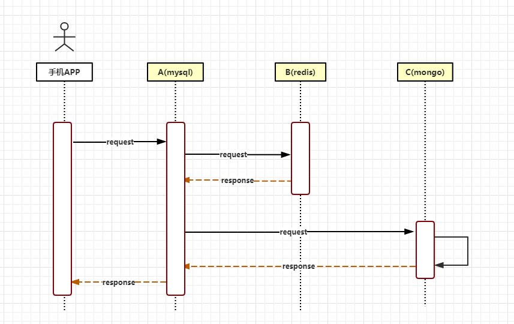

方案：

​    若采用TX-LCN分布式事务框架，则可以将A模块采用LCN模式、B/C采用TCC模式就能完美解决。


# 快速开始

## 说明

TX-LCN 主要有两个模块，**Tx-Client(TC)    Tx-Manager(TM)** 

TC作为微服务下的依赖，

TM是独立的服务。

详细配置可参考 [dubbo](https://www.codingapi.com/docs/txlcn-start/demo/dubbo.md) [springcloud](https://www.codingapi.com/docs/txlcn-start/demo/springcloud.md)

```java
TM

注解@EnableTransactionManagerServer  ： **服务端开启分布式事务功能。**

TC:

注解@EnableDistributedTransaction，这个注解是**客户端开启事务的注解**

@LcnTransaction
一般用于mysql 或 oracle  在于支持事务场景 代理本地 connection链接，使用数据库本身提供的 事务管理
完成事务的提交或回滚
```


## TM配置与启动

### TM的准备环境

TM需要依赖的服务有 JDK1.8+,Mysql5.6+,Redis3.2+,Git,Maven

初始化TM Mysql数据库 创建数据库名称为:tx-manager

```sql
DROP TABLE IF EXISTS `t_tx_exception`;
CREATE TABLE `t_tx_exception`  (
  `id` bigint(20) NOT NULL AUTO_INCREMENT,
  `group_id` varchar(32) CHARACTER SET utf8mb4 COLLATE utf8mb4_general_ci NULL DEFAULT NULL,
  `unit_id` varchar(32) CHARACTER SET utf8mb4 COLLATE utf8mb4_general_ci NULL DEFAULT NULL,
  `mod_id` varchar(32) CHARACTER SET utf8mb4 COLLATE utf8mb4_general_ci NULL DEFAULT NULL,
  `transaction_state` tinyint(4) NULL DEFAULT NULL,
  `registrar` tinyint(4) NULL DEFAULT NULL COMMENT '-1 未知 0 Manager 通知事务失败， 1 client询问事务状态失败2 事务发起方关闭事务组失败',
  `ex_state` tinyint(4) NULL DEFAULT NULL COMMENT '0 待处理 1已处理',
  `create_time` datetime(0) NULL DEFAULT NULL,
  PRIMARY KEY (`id`) USING BTREE
) ENGINE = InnoDB AUTO_INCREMENT = 967 CHARACTER SET = utf8mb4 COLLATE = utf8mb4_general_ci ROW_FORMAT = Dynamic;

SET FOREIGN_KEY_CHECKS = 1;
```

### TM下载与配置

```git
git clone https://github.com/codingapi/tx-lcn.git
```

修改配置信息(txlcn-tm\src\main\resources\application.properties)

```properties
spring.application.name=tx-manager
server.port=7970

spring.datasource.driver-class-name=com.mysql.jdbc.Driver
spring.datasource.url=jdbc:mysql://127.0.0.1:3306/tx-manager?characterEncoding=UTF-8
spring.datasource.username=root
spring.datasource.password=root

mybatis.configuration.map-underscore-to-camel-case=true
mybatis.configuration.use-generated-keys=true

#tx-lcn.logger.enabled=true
# TxManager Host Ip
#tx-lcn.manager.host=127.0.0.1
# TxClient连接请求端口
#tx-lcn.manager.port=8070
# 心跳检测时间(ms)
#tx-lcn.manager.heart-time=15000
# 分布式事务执行总时间
#tx-lcn.manager.dtx-time=30000
#参数延迟删除时间单位ms
#tx-lcn.message.netty.attr-delay-time=10000
#tx-lcn.manager.concurrent-level=128
# 开启日志
#tx-lcn.logger.enabled=true
#logging.level.com.codingapi=debug
#redisIp
#spring.redis.host=127.0.0.1
#redis\u7AEF\u53E3
#spring.redis.port=6379
#redis\u5BC6\u7801
#spring.redis.password=

admin密码默认为codingapi 
```

- `#`给出信息都是默认值

关于详细配置说明见 [manager](https://www.codingapi.com/docs/txlcn-start/setting/manager.md)

### TM编译与启动

编译
进入到txlcn-tm路径下。 执行 `mvn clean package '-Dmaven.test.skip=true'`
启动
进入target文件夹下。执行 `java -jar txlcn-tm-5.0.0.RELEASE.jar`

## TC微服务模块

微服务示例架构

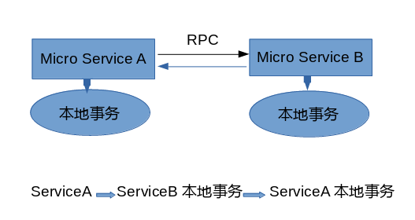 

- 服务A作为DTX发起方，远程调用服务B

### TC引入pom依赖

```xml
        <dependency>
            <groupId>com.codingapi.txlcn</groupId>
            <artifactId>txlcn-tc</artifactId>
            <version>5.0.1.RELEASE</version>
        </dependency>

        <dependency>
            <groupId>com.codingapi.txlcn</groupId>
            <artifactId>txlcn-txmsg-netty</artifactId>
            <version>5.0.1.RELEASE</version>
        </dependency>
```

### TC开启分布式事务注解

在主类上使用`@EnableDistributedTransaction`

```java
@SpringBootApplication
@EnableDistributedTransaction
public class DemoAApplication {

    public static void main(String[] args) {
        SpringApplication.run(DemoDubboClientApplication.class, args);
    }

}
```

### TC微服务A业务方法配置

```java
@Service
public class ServiceA {
    
    @Autowired
    private ValueDao valueDao; //本地db操作
    
    @Autowired
    private ServiceB serviceB;//远程B模块业务
    
    @LcnTransaction //分布式事务注解
    @Transactional //本地事务注解
    public String execute(String value) throws BusinessException {
        // step1. call remote service B
        String result = serviceB.rpc(value);  // (1)
        // step2. local store operate. DTX commit if save success, rollback if not.
        valueDao.save(value);  // (2)
        valueDao.saveBackup(value);  // (3)
        return result + " > " + "ok-A";
    }
}
```

### TC微服务B业务方法配置

```java
@Service
public class ServiceB {
    
    @Autowired
    private ValueDao valueDao; //本地db操作
    
    @LcnTransaction //分布式事务注解
    @Transactional  //本地事务注解
    public String rpc(String value) throws BusinessException {
        valueDao.save(value);  // (4)
        valueDao.saveBackup(value);  // (5)
        return "ok-B";
    }
}
```

### TC配置信息说明

```properties
# 默认之配置为TM的本机默认端口
tx-lcn.client.manager-address=127.0.0.1:8070 
```


# 依赖

## 基础依赖

- JDK 8+
- Maven 3（可选的）
- SpringBoot 2.x

## Java库依赖

- projectlombok:1.18.0
- hessian:4.0.38
- fastjson:1.2.34
- protostuff1.1.3
- kryo:4.0.0
- brave-instrumentation:5.4.3
- commons-dbutils:1.7
- jsqlparser:1.3
- h2database:1.4.197
- hikari-cp:3.1.0
- pagehelper:1.2.10 `TxManager(TM)`
- mybatis.spring.boot:1.3.2 `TxManager(TM)`
- spring-cloud:Finchley.SR2 (可选的)
- netty:4.1.31.Final （可选的）
- dubbo:0.2.0 (可选的)

## 中间件依赖

- Mariadb 10+ (MySQL5+)
- Redis any

------


# 简单的分布式事务

## 步骤引导

1. 准备依赖环境服务
   JDK1.8+,Mysql5.6+,Redis3.2+,Consul(SpringCloud),ZooKeeper(Dubbo),Git,Maven
2. 初始化数据 见下方说明
3. 启动TxManager(TM)
   见下方说明
4. 配置微服务模块
   见下方说明
5. 启动模块与测试
   见下方说明

## 初始化数据

TM数据初始化
TxManager(TM)依赖tx-manager数据库(MariaDB 、MySQL)建表语句如下:

```sql
DROP TABLE IF EXISTS `t_tx_exception`;
CREATE TABLE `t_tx_exception`  (
  `id` bigint(20) NOT NULL AUTO_INCREMENT,
  `group_id` varchar(32) CHARACTER SET utf8mb4 COLLATE utf8mb4_general_ci NULL DEFAULT NULL,
  `unit_id` varchar(32) CHARACTER SET utf8mb4 COLLATE utf8mb4_general_ci NULL DEFAULT NULL,
  `mod_id` varchar(32) CHARACTER SET utf8mb4 COLLATE utf8mb4_general_ci NULL DEFAULT NULL,
  `transaction_state` tinyint(4) NULL DEFAULT NULL,
  `registrar` tinyint(4) NULL DEFAULT NULL COMMENT '-1 未知 0 Manager 通知事务失败， 1 client询问事务状态失败2 事务发起方关闭事务组失败',
  `ex_state` tinyint(4) NULL DEFAULT NULL COMMENT '0 待处理 1已处理',
  `create_time` datetime(0) NULL DEFAULT NULL,
  PRIMARY KEY (`id`) USING BTREE
) ENGINE = InnoDB AUTO_INCREMENT = 967 CHARACTER SET = utf8mb4 COLLATE = utf8mb4_general_ci ROW_FORMAT = Dynamic;
```

TC数据初始化 微服务演示Demo依赖txlcn-demo数据库(MariaDB 、MySQL)建表语句如下:

```sql
DROP TABLE IF EXISTS `t_demo`;
CREATE TABLE `t_demo` (
  `id` bigint(20) NOT NULL AUTO_INCREMENT,
  `kid` varchar(45) DEFAULT NULL,
  `demo_field` varchar(255) DEFAULT NULL,
  `group_id` varchar(64) DEFAULT NULL,
  `unit_id` varchar(32) DEFAULT NULL,
  `app_name` varchar(32) DEFAULT NULL,
  `create_time` datetime DEFAULT NULL,
  PRIMARY KEY (`id`)
) ENGINE=InnoDB DEFAULT CHARSET=utf8 ROW_FORMAT=DYNAMIC;
```

## 启动TxManager(TM)

### TM下载与配置

```
git clone https://github.com/codingapi/tx-lcn.git
```

修改配置信息(txlcn-tm\src\main\resources\application.properties)

```properties
spring.application.name=tx-manager
server.port=7970

spring.datasource.driver-class-name=com.mysql.jdbc.Driver
spring.datasource.url=jdbc:mysql://127.0.0.1:3306/tx-manager?characterEncoding=UTF-8
spring.datasource.username=root
spring.datasource.password=root

mybatis.configuration.map-underscore-to-camel-case=true
mybatis.configuration.use-generated-keys=true

#tx-lcn.logger.enabled=true
# TxManager Host Ip
#tx-lcn.manager.host=127.0.0.1
# TxClient连接请求端口
#tx-lcn.manager.port=8070
# 心跳检测时间(ms)
#tx-lcn.manager.heart-time=15000
# 分布式事务执行总时间
#tx-lcn.manager.dtx-time=30000
#参数延迟删除时间单位ms
#tx-lcn.message.netty.attr-delay-time=10000
#tx-lcn.manager.concurrent-level=128
# 开启日志
#tx-lcn.logger.enabled=true
#logging.level.com.codingapi=debug
#redisIp
#spring.redis.host=127.0.0.1
#redis\u7AEF\u53E3
#spring.redis.port=6379
#redis\u5BC6\u7801
#spring.redis.password=
```

- `#`给出信息都是默认值

关于详细配置说明见 [manager](https://www.codingapi.com/docs/txlcn-demo-env/setting/manager.md)

### TM编译与启动

编译
进入到txlcn-tm路径下。 执行 `mvn clean package '-Dmaven.test.skip=true'`
启动
进入target文件夹下。执行 `java -jar txlcn-tm-5.0.0.jar`

启动TxManager 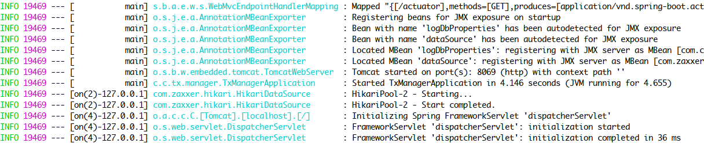

## 配置微服务模块

Dubbo Demo见[Dubbo-Demo](https://www.codingapi.com/docs/txlcn-demo-env/dubbo.html)

SpringCloud Demo见[SpringCloud-Demo](https://www.codingapi.com/docs/txlcn-demo-env/springcloud.html)

## 启动模块与测试

（1）正常提交事务

访问 发起方提供的Rest接口 `/txlcn?value=the-value`。发现事务全部提交


（2）回滚事务

修改微服务 发起方Client 业务，在返回结果前抛出异常，再请求Rest接口。发现发起方由于本地事务回滚，而参与方D、E，由于TX-LCN的协调，数据也回滚了。
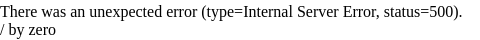


# Dubbo示例

Dubbo 示例说明
共三个模块如下：
dubbo-demo-client(发起方 | LCN模式)
dubbo-demo-d (参与方 | TXC模式)
dubbo-demo-e (参与方 | TCC模式)

代码地址:https://github.com/codingapi/txlcn-demo

调用关系说明:

dubbo-demo-client -> DemoConsumerController的`txlcn`的Mapping是调用发起方法，代码如下。

```java
@RestController
public class DemoConsumerController {


    @Autowired
    private DemoApiService demoApiService;


    @RequestMapping("/txlcn")
    public String sayHello(@RequestParam("value") String value) {
        return demoApiService.execute(value);
    }

}
```

DemoApiService.execute(value)方法代码:

```java
@Service
public class DemoApiServiceImpl implements DemoApiService {

    @Reference(version = "${demo.service.version}",
            application = "${dubbo.application.d}",
            registry = "${dubbo.registry.address}",
            retries = -1,
            check = false,
            loadbalance = "txlcn_random")
    private DDemoService dDemoService;

    @Reference(version = "${demo.service.version}",
            application = "${dubbo.application.e}",
            retries = -1,
            check = false,
            registry = "${dubbo.registry.address}",
            loadbalance = "txlcn_random")
    private EDemoService eDemoService;

    @Autowired
    private DemoMapper demoMapper;

    @Override
    @LcnTransaction
    public String execute(String name) {

        /*
         * 注意 5.0.0 请用 DTXLocal 类
         * 注意 5.0.0 请自行获取应用名称
         * 注意 5.0.0 其它类重新导入包名
         */
        String dResp = dDemoService.rpc(name);
        String eResp = eDemoService.rpc(name);
        Demo demo = new Demo();
        demo.setCreateTime(new Date());
        demo.setAppName(Transactions.APPLICATION_ID_WHEN_RUNNING);
        demo.setDemoField(name);
        demo.setGroupId(DTXLocalContext.getOrNew().getGroupId());
        demo.setUnitId(DTXLocalContext.getOrNew().getUnitId());
        demoMapper.save(demo);

//        int a = 1 / 0;
        return dResp + " > " + eResp + " > " + "client-ok";
    }
}
```

参与方dDemoService.rpc(name)的代码

```java
@Service(
        version = "${demo.service.version}",
        application = "${dubbo.application.id}",
        protocol = "${dubbo.protocol.id}",
        registry = "${dubbo.registry.id}"
)
@Slf4j
public class DefaultDemoService implements DDemoService {

    @Autowired
    private DDemoMapper demoMapper;

    @Override
    @TxTransaction(type = "txc")
    public String rpc(String name) {

        /*
         * 注意 5.0.0 请用 DTXLocal 类
         * 注意 5.0.0 请自行获取应用名称
         * 注意 5.0.0 其它类重新导入包名
         */
        log.info("GroupId: {}", TracingContext.tracing().groupId());
        Demo demo = new Demo();
        demo.setDemoField(name);
        demo.setCreateTime(new Date());
        demo.setGroupId(DTXLocalContext.getOrNew().getGroupId());
        demo.setAppName(Transactions.APPLICATION_ID_WHEN_RUNNING);
        demo.setUnitId(DTXLocalContext.getOrNew().getUnitId());
        demoMapper.save(demo);
        return "d-ok";
    }

}
```

参与方eDemoService.rpc(name)的代码

```java
@Service(
        version = "${demo.service.version}",
        application = "${dubbo.application.id}",
        protocol = "${dubbo.protocol.id}",
        registry = "${dubbo.registry.id}"
)
@Slf4j
public class DefaultDemoService implements EDemoService {

    @Autowired
    private EDemoMapper demoMapper;

    private ConcurrentHashMap<String, Long> ids = new ConcurrentHashMap<>();

    @Override
    @TccTransaction(confirmMethod = "cm", cancelMethod = "cl", executeClass = DefaultDemoService.class)
    public String rpc(String name) {
        /*
         * 注意 5.0.0 请用 DTXLocal 类
         * 注意 5.0.0 请自行获取应用名称
         * 注意 5.0.0 其它类重新导入包名
         */
        log.info("GroupId: {}", TracingContext.tracing().groupId());
        Demo demo = new Demo();
        demo.setDemoField(name);
        demo.setCreateTime(new Date());
        demo.setGroupId(DTXLocalContext.getOrNew().getGroupId());
        demo.setUnitId(DTXLocalContext.getOrNew().getUnitId());
        demo.setAppName(Transactions.APPLICATION_ID_WHEN_RUNNING);
        demoMapper.save(demo);
        ids.put(DTXLocalContext.cur().getGroupId(), demo.getId());
        return "e-ok";
    }

    public void cm(String name) {
        log.info("tcc-confirm-" + DTXLocalContext.getOrNew().getGroupId());
        ids.remove(DTXLocalContext.getOrNew().getGroupId());
    }

    public void cl(String name) {
        log.info("tcc-cancel-" + DTXLocalContext.getOrNew().getGroupId());
        demoMapper.deleteByKId(ids.get(DTXLocalContext.getOrNew().getGroupId()));
    }
}
```

## 事务参与方D配置

工程截图
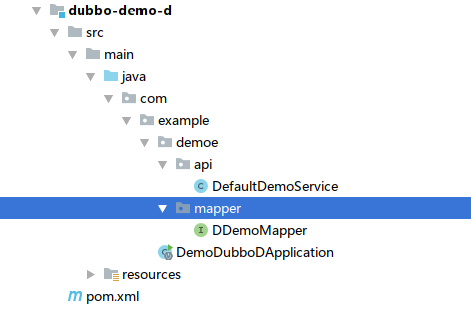
项目配置文件 application.properties

```properties
# Spring boot application
spring.application.name=dubbo-demo-d
server.port=12005
management.port=12008

# Service version
demo.service.version=1.0.0

# Base packages to scan Dubbo Components (e.g @Service , @Reference)
dubbo.scan.basePackages=com.example

# Dubbo Config properties
## ApplicationConfig Bean
dubbo.application.id=dubbo-demo-d
dubbo.application.name=dubbo-demo-d

## ProtocolConfig Bean
dubbo.protocol.id=dubbo
dubbo.protocol.name=dubbo
dubbo.protocol.port=12345

## RegistryConfig Bean
dubbo.registry.id=my-registry
dubbo.registry.address=127.0.0.1:2181
dubbo.registry.protocol=zookeeper
dubbo.application.qos.enable=false

## DB
spring.datasource.driver-class-name=com.mysql.jdbc.Driver
spring.datasource.url=jdbc:mysql://127.0.0.1:3306/txlcn-demo?characterEncoding=UTF-8&serverTimezone=UTC
spring.datasource.username=root
spring.datasource.password=root
spring.datasource.hikari.maximum-pool-size=20
mybatis.configuration.map-underscore-to-camel-case=true
mybatis.configuration.use-generated-keys=true

## tx-manager 配置
#tx-lcn.client.manager-address=127.0.0.1:8070
```

## Application代码

```java
@SpringBootApplication
@EnableDistributedTransaction
public class DemoDubboDApplication {

    public static void main(String[] args) {
        SpringApplication.run(DemoDubboDApplication.class, args);

    }

}
```

## 事务参与方 E

工程截图
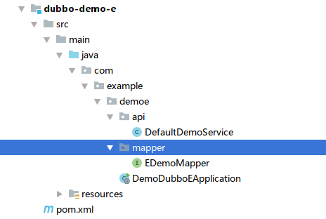
配置文件 application.properties

```properties
# Spring boot application
spring.application.name=dubbo-demo-e
server.port=12006
management.port=12009

# Service version
demo.service.version=1.0.0

# Base packages to scan Dubbo Components (e.g @Service , @Reference)
dubbo.scan.basePackages=com.example

# Dubbo Config properties
## ApplicationConfig Bean
dubbo.application.id=dubbo-demo-e
dubbo.application.name=dubbo-demo-e

dubbo.application.service4=dubbo-demo-client

## ProtocolConfig Bean
dubbo.protocol.id=dubbo
dubbo.protocol.name=dubbo
dubbo.protocol.port=12346

## RegistryConfig Bean
dubbo.registry.id=my-registry
dubbo.registry.address=127.0.0.1:2181
dubbo.registry.protocol=zookeeper

dubbo.application.qos.enable=false

#db
spring.datasource.driver-class-name=com.mysql.jdbc.Driver
spring.datasource.url=jdbc:mysql://127.0.0.1:3306/txlcn-demo\
  ?characterEncoding=UTF-8&serverTimezone=UTC
spring.datasource.username=root
spring.datasource.password=root
spring.datasource.hikari.maximum-pool-size=20

mybatis.configuration.map-underscore-to-camel-case=true
mybatis.configuration.use-generated-keys=true

## tx-manager 配置
#tx-lcn.client.manager-address=127.0.0.1:8070
```

## Application代码

```java
@SpringBootApplication
@EnableDistributedTransaction
public class DemoDubboEApplication {

    public static void main(String[] args) {
        SpringApplication.run(DemoDubboEApplication.class, args);

    }

}
```

## 事务发起方 Client

工程目录
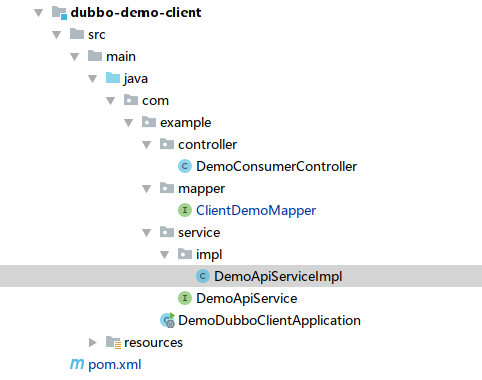
项目配置文件 application.properties

```properties
# Spring boot application
spring.application.name=dubbo-demo-client
server.port=12004
management.port=12007

# Service Version
demo.service.version=1.0.0

# Dubbo Config properties
## ApplicationConfig Bean
dubbo.application.id=dubbo-demo-client
dubbo.application.name=dubbo-demo-client
dubbo.application.d=dubbo-demo-d
dubbo.application.e=dubbo-demo-e
## ProtocolConfig Bean
dubbo.protocol.id=dubbo
dubbo.protocol.name=dubbo
dubbo.protocol.port=12345
dubbo.registry.protocol=zookeeper
dubbo.registry.address=127.0.0.1:2181


spring.datasource.driver-class-name=com.mysql.jdbc.Driver
spring.datasource.url=jdbc:mysql://127.0.0.1:3306/txlcn-demo?characterEncoding=UTF-8&serverTimezone=UTC
spring.datasource.username=root
spring.datasource.password=root
spring.datasource.hikari.maximum-pool-size=20
mybatis.configuration.map-underscore-to-camel-case=true
mybatis.configuration.use-generated-keys=true

## 切面日志信息(h2数据库地址,自创建)
#tx-lcn.aspect.log.file-path=D://txlcn/h2-${spring.application.name}
#
## manager服务地址(rpc端口),可填写多个负载
#tx-lcn.client.manager-address=127.0.0.1:8070
#
## 开启日志数据库记录存储
#tx-lcn.logger.enabled=true
## 日志数据库存储jdbc配置
#tx-lcn.logger.driver-class-name=com.mysql.jdbc.Driver
#tx-lcn.logger.jdbc-url=jdbc:mysql://127.0.0.1:3306/tx-logger?characterEncoding=UTF-8&serverTimezone=UTC
#tx-lcn.logger.username=root
#tx-lcn.logger.password=123456
```

## 启动Dubbo微服务

事务参与方 D
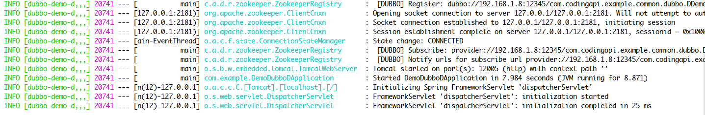 事务参与方 E
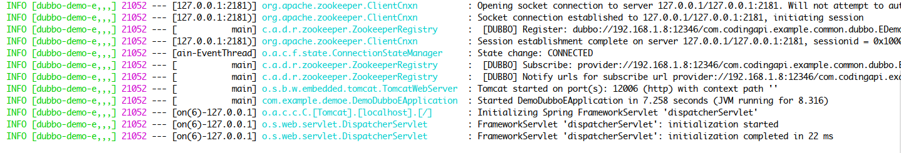 事务发起方 Client
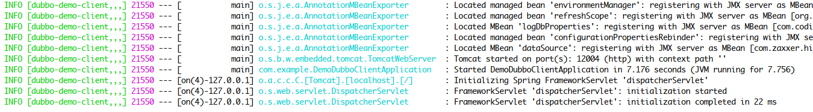


# SpringCloud示例

SpringCloud 示例说明
共三个模块如下：
spring-demo-client(发起方 | LCN模式)
spring-demo-d (参与方 | TXC模式)
spring-demo-e (参与方 | TCC模式)

代码地址:https://github.com/codingapi/txlcn-demo

调用关系说明:

spring-demo-client -> DemoController的`txlcn`的Mapping是调用发起方法，代码如下。

```java
@RestController
public class DemoController {

    private final DemoService demoService;

    @Autowired
    public DemoController(DemoService demoService) {
        this.demoService = demoService;
    }

    @RequestMapping("/txlcn")
    public String execute(@RequestParam("value") String value) {
        return  demoService.execute(value);
    }


}
```

demoService.execute(value)代码:

```java
@Service
@Slf4j
public class DemoServiceImpl implements DemoService {

    private final ClientDemoMapper demoMapper;

    private final DDemoClient dDemoClient;

    private final EDemoClient eDemoClient;

    @Autowired
    public DemoServiceImpl(ClientDemoMapper demoMapper, DDemoClient dDemoClient, EDemoClient eDemoClient) {
        this.demoMapper = demoMapper;
        this.dDemoClient = dDemoClient;
        this.eDemoClient = eDemoClient;
    }

    @Override
    @LcnTransaction
    public String execute(String value) {
        /*
         * 注意 5.0.0 请用 DTXLocal 类
         * 注意 5.0.0 请自行获取应用名称
         * 注意 5.0.0 其它类重新导入包名
         */

        // ServiceD
        String dResp = dDemoClient.rpc(value);

        // ServiceE
        String eResp = eDemoClient.rpc(value);

        // local transaction
        Demo demo = new Demo();
        demo.setDemoField(value);
        demo.setAppName(Transactions.APPLICATION_ID_WHEN_RUNNING); // 应用名称
        demo.setCreateTime(new Date());
        demo.setGroupId(DTXLocalContext.getOrNew().getGroupId());  // DTXLocal
        demo.setUnitId(DTXLocalContext.getOrNew().getUnitId());
        demoMapper.save(demo);

        // 手动异常，DTX B回滚
//        int i = 1 / 0;
        return dResp + " > " + eResp + " > " + "ok-client";
    }
}
```

dDemoClient.rpc(value)代码:

```java
@Service
@Slf4j
public class DemoServiceImpl implements DemoService {

    private final DDemoMapper demoMapper;


    @Autowired
    public DemoServiceImpl(DDemoMapper demoMapper) {
        this.demoMapper = demoMapper;
    }

    @Override
    @TxcTransaction(propagation = DTXPropagation.SUPPORTS)
    @Transactional
    public String rpc(String value) {
        /*
         * 注意 5.0.0 请用 DTXLocal 类
         * 注意 5.0.0 请自行获取应用名称
         * 注意 5.0.0 其它类重新导入包名
         */
//        log.info("GroupId: {}", TracingContext.tracing().groupId());
        Demo demo = new Demo();
        demo.setCreateTime(new Date());
        demo.setDemoField(value);
        demo.setAppName(Transactions.APPLICATION_ID_WHEN_RUNNING);  // 应用名称
        demo.setGroupId(DTXLocalContext.getOrNew().getGroupId());   // DTXLocal
        demo.setUnitId(DTXLocalContext.getOrNew().getUnitId());
        demoMapper.save(demo);
//        moreOperateMapper.update(new Date());
//        moreOperateMapper.delete();
        return "ok-d";
    }
}
```

eDemoClient.rpc(value)代码：

```java
@Service
@Slf4j
public class DemoServiceImpl implements DemoService {

    private final EDemoMapper demoMapper;

    private ConcurrentHashMap<String, Long> ids = new ConcurrentHashMap<>();

    @Autowired
    public DemoServiceImpl(EDemoMapper demoMapper) {
        this.demoMapper = demoMapper;
    }

    @Override
    @TccTransaction(propagation = DTXPropagation.SUPPORTS)
    @Transactional
    public String rpc(String value) {
        /*
         * 注意 5.0.0 请用 DTXLocal 类
         * 注意 5.0.0 请自行获取应用名称
         * 注意 5.0.0 其它类重新导入包名
         */
//        log.info("GroupId: {}", TracingContext.tracing().groupId());

        Demo demo = new Demo();
        demo.setDemoField(value);
        demo.setCreateTime(new Date());
        demo.setAppName(Transactions.APPLICATION_ID_WHEN_RUNNING);
        demo.setGroupId(DTXLocalContext.getOrNew().getGroupId());
        demo.setUnitId(DTXLocalContext.getOrNew().getUnitId());
        demoMapper.save(demo);
//        ids.put(DTXLocalContext.getOrNew().getGroupId(), demo.getId());
        return "ok-e";
    }

    public void confirmRpc(String value) {
        log.info("tcc-confirm-" + DTXLocalContext.getOrNew().getGroupId());
        ids.remove(DTXLocalContext.getOrNew().getGroupId());
    }

    public void cancelRpc(String value) {
        log.info("tcc-cancel-" + DTXLocalContext.getOrNew().getGroupId());
        Long kid = ids.get(DTXLocalContext.getOrNew().getGroupId());
        demoMapper.deleteByKId(kid);
    }
}
```

## 事务参与方D

工程截图
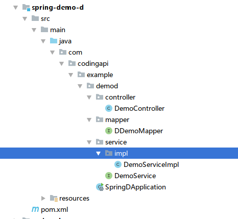
项目配置文件 application.properties

```properties
spring.application.name=spring-demo-d
server.port=12002
spring.datasource.type=com.alibaba.druid.pool.DruidDataSource
spring.datasource.driver-class-name=com.mysql.jdbc.Driver
## TODO 你的配置
spring.datasource.url=jdbc:mysql://127.0.0.1:3306/txlcn-demo\
  ?characterEncoding=UTF-8&serverTimezone=UTC
spring.datasource.username=root
spring.datasource.password=root
#spring.datasource.hikari.maximum-pool-size=20
mybatis.configuration.map-underscore-to-camel-case=true
mybatis.configuration.use-generated-keys=true


## tx-manager 配置
#tx-lcn.client.manager-address=127.0.0.1:8070
```

## Application

```java
@SpringBootApplication
@EnableDiscoveryClient
@EnableDistributedTransaction
public class SpringDApplication {

    public static void main(String[] args) {
        SpringApplication.run(SpringDApplication.class, args);

    }
}
```

## 事务参与方E

工程截图
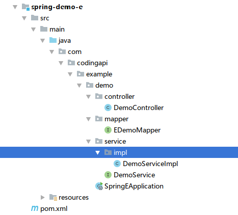
项目配置文件 application.properties

```properties
spring.application.name=spring-demo-e
server.port=12003

spring.datasource.driver-class-name=com.mysql.jdbc.Driver
spring.datasource.url=jdbc:mysql://ip:port/txlcn-demo?characterEncoding=UTF-8
spring.datasource.username=root
spring.datasource.password=123456
spring.datasource.hikari.maximum-pool-size=20

mybatis.configuration.map-underscore-to-camel-case=true
mybatis.configuration.use-generated-keys=true
```

## Application

```java
@SpringBootApplication
@EnableDiscoveryClient
@EnableDistributedTransaction
public class SpringEApplication {

    public static void main(String[] args) {
        SpringApplication.run(SpringEApplication.class, args);
    }
}
```

## 事务发起方Client

工程截图
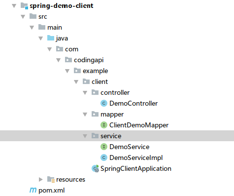
项目配置文件 application.properties

```properties
spring.application.name=spring-demo-client
server.port=12011
spring.datasource.driver-class-name=com.mysql.jdbc.Driver
## TODO 你的配置
spring.datasource.url=jdbc:mysql://127.0.0.1:3306/txlcn-demo?characterEncoding=UTF-8&serverTimezone=UTC
spring.datasource.username=root
spring.datasource.password=root
spring.datasource.hikari.maximum-pool-size=20
mybatis.configuration.map-underscore-to-camel-case=true
mybatis.configuration.use-generated-keys=true

# 关闭Ribbon的重试机制（如果有必要）
ribbon.MaxAutoRetriesNextServer=0
ribbon.ReadTimeout=5000
ribbon.ConnectTimeout=5000
        

## tx-manager 配置
#tx-lcn.client.manager-address=127.0.0.1:8070
```

## Application

```java
@SpringBootApplication
@EnableDiscoveryClient
@EnableDistributedTransaction
public class SpringClientApplication {

    public static void main(String[] args) {
        SpringApplication.run(SpringClientApplication.class, args);
    }
}
```

## 启动SpringCloud微服务

事务参与方 D
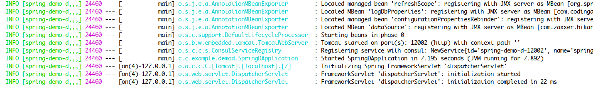 事务参与方 E
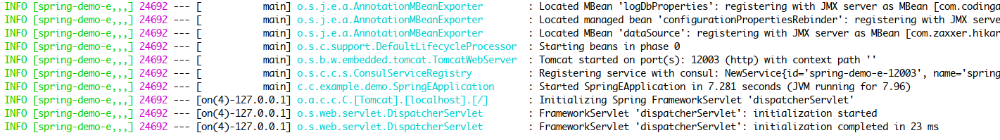 事务发起方 Client
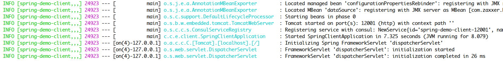

------


# 原理介绍|事务控制原理

​    TX-LCN由两大模块组成, TxClient、TxManager，TxClient作为模块的依赖框架，提供TX-LCN的标准支持，TxManager作为分布式事务的控制放。事务发起方或者参与反都由TxClient端来控制。

原理图:


### 核心步骤

- 创建事务组
  是指在事务发起方开始执行业务代码之前先调用TxManager创建事务组对象，然后拿到事务标示GroupId的过程。
- 加入事务组
  添加事务组是指参与方在执行完业务方法以后，将该模块的事务信息通知给TxManager的操作。
- 通知事务组
  是指在发起方执行完业务代码以后，将发起方执行结果状态通知给TxManager,TxManager将根据事务最终状态和事务组的信息来通知相应的参与模块提交或回滚事务，并返回结果给事务发起方。


# 原理介绍|LCN事务模式

## 一、原理介绍:

​    LCN模式是通过代理Connection的方式实现对本地事务的操作，然后在由TxManager统一协调控制事务。

   当本地事务提交回滚或者关闭连接时将会执行假操作，该代理的连接将由LCN连接池管理。

## 二、模式特点:

- 该模式对代码的嵌入性为低。
- 该模式仅限于本地存在连接对象且可通过连接对象控制事务的模块。
- 该模式下的事务提交与回滚是由本地事务方控制，对于数据一致性上有较高的保障。
- 该模式缺陷在于代理的连接需要随事务发起方一共释放连接，增加了连接占用的时间。


# 原理介绍|TCC事务模式

## 一、原理介绍:

​    TCC事务机制相对于传统事务机制（X/Open XA Two-Phase-Commit），其特征在于它不依赖资源管理器(RM)对XA的支持，而是通过对（由业务系统提供的）业务逻辑的调度来实现分布式事务。

主要由三步操作，Try: 尝试执行业务、 Confirm:确认执行业务、 Cancel: 取消执行业务。

## 二、模式特点:

- 该模式对代码的嵌入性高，要求每个业务需要写三种步骤的操作。
- 该模式对有无本地事务控制都可以支持使用面广。
- 数据一致性控制几乎完全由开发者控制，对业务开发难度要求高。


# 原理介绍|TXC事务模式

## 一、原理介绍：

​    TXC模式命名来源于淘宝，实现原理是在执行SQL之前，先查询SQL的影响数据，然后保存执行的SQL快走信息和创建锁。当需要回滚的时候就采用这些记录数据回滚数据库，目前锁实现依赖redis分布式锁控制。

## 二、模式特点:

- 该模式同样对代码的嵌入性低。
- 该模式仅限于对支持SQL方式的模块支持。
- 该模式由于每次执行SQL之前需要先查询影响数据，因此相比LCN模式消耗资源与时间要多。
- 该模式不会占用数据库的连接资源。


# 配置手册|TxClient配置说明

## 一、application.properties

```
# springcloud feign 下开启负载均衡时的配置。开启后同一个事务组下相同的模块会重复调用。
# 对应dubbo框架下需要设置的是 @Reference的loadbalance，有下面四种，作用都是开启后同一个事务组下相同的模块会重复调用。
#txlcn_random=com.codingapi.txlcn.tracing.dubbo.TxlcnRandomLoadBalance
#txlcn_roundrobin=com.codingapi.txlcn.tracing.dubbo.TxlcnRoundRobinLoadBalance
#txlcn_leastactive=com.codingapi.txlcn.tracing.dubbo.TxlcnLeastActiveLoadBalance
#txlcn_consistenthash=com.codingapi.txlcn.tracing.dubbo.TxlcnConsistentHashLoadBalance

tx-lcn.ribbon.loadbalancer.dtx.enabled=true
# tx-manager 的配置地址，多个用,分割。注意设置上的地址在启动的时候会检查并连接，连接不成功会启动失败。
# tx-manager 下集群策略，当增加一个新的tx-manager后，tx-manager也会通知到其他的在线模块，然后tx-client会在连接上后面加入的模块。
tx-lcn.client.manager-address=127.0.0.1:8070,127.0.0.1:8071
# 该参数是分布式事务框架存储的业务切面信息。采用的是h2数据库。绝对路径。该参数默认的值为{user.dir}/.txlcn/{application.name}-{application.port}
tx-lcn.aspect.log.file-path=logs/.txlcn/demo-8080
# 调用链长度等级，默认值为3.标识调用连长度为3，该参数是用于识别分布式事务的最大通讯时间。
tx-lcn.client.chain-level=3
# 该参数为tc与tm通讯时的最大超时时间，单位毫米。该参数不需要配置会在连接初始化时由tm返回。
tx-lcn.client.tm-rpc-timeout=2000
# 该参数为分布式事务的最大时间，单位毫米。该参数不需要配置会在连接初始化时由tm返回。
tx-lcn.client.dtx-time=50000
# 该参数为雪花算法的机器编号。该参数不需要配置会在连接初始化时由tm返回。
tx-lcn.client.machine-id=1
#该参数为事务方法注解切面的orderNumber，默认值为0.
tx-lcn.client.dtx-aspect-order=0
#该参数为事务连接资源方法切面的orderNumber，默认值为0.
tx-lcn.client.resource-order=0
#是否开启日志记录。当开启以后需要配置对应logger的数据库连接配置信息。
tx-lcn.logger.enabled=false

#该参数为tm下的配置，tc下忽略
tx-lcn.client.tx-manager-delay=2000
#该参数为tm下的配置，tc下忽略
tx-lcn.client.tx-manager-heart=2000
```

## 二、特别配置

### 1、微服务`集群`且用到 LCN事务模式时，为保证性能请开启TX-LCN重写的负载策略。

- Dubbo 开启

  ```
  @Reference(version = "${demo.service.version}",
        application = "${dubbo.application.e}",
        retries = -1,
        registry = "${dubbo.registry.address}",
        loadbalance = "txlcn_random")  // here
  private EDemoService eDemoService;
  ```

- SpringCloud 开启 (application.properties)

  ```
  tx-lcn.springcloud.loadbalance.enabled=true
  ```

  配置详情[参见](https://www.codingapi.com/docs/txlcn-setting-client/distributed.html)

### 2、关闭业务RPC重试

- Dubbo 开启

  ```
  @Reference(version = "${demo.service.version}",
        application = "${dubbo.application.e}",
        retries = -1,
        registry = "${dubbo.registry.address}",
        loadbalance = "txlcn_random")  // here
  private EDemoService eDemoService;
  ```

- SpringCloud 开启 (application.properties)

  ```
  # 关闭Ribbon的重试机制
  ribbon.MaxAutoRetriesNextServer=0
  ```

------

`NOTE`
1、TxClient所有配置均有默认配置，请按需覆盖默认配置。
2、为什么要关闭服务调用的重试。远程业务调用失败有两种可能： （1），远程业务执行失败 （2）、远程业务执行成功，网络失败。对于第2种，事务场景下重试会发生，某个业务执行两次的问题。 如果业务上控制某个事务接口的幂等，则不用关闭重试。

------

### 3、通过AOP配置本地事务与分布式事务

```
@Configuration
@EnableTransactionManagement
public class TransactionConfiguration {

    /**
     * 本地事务配置
     * @param transactionManager
     * @return
     */
    @Bean
    @ConditionalOnMissingBean
    public TransactionInterceptor transactionInterceptor(PlatformTransactionManager transactionManager) {
        Properties properties = new Properties();
        properties.setProperty("*", "PROPAGATION_REQUIRED,-Throwable");
        TransactionInterceptor transactionInterceptor = new TransactionInterceptor();
        transactionInterceptor.setTransactionManager(transactionManager);
        transactionInterceptor.setTransactionAttributes(properties);
        return transactionInterceptor;
    }

    /**
     * 分布式事务配置 设置为LCN模式
     * @param dtxLogicWeaver
     * @return
     */
    @ConditionalOnBean(DTXLogicWeaver.class)
    @Bean
    public TxLcnInterceptor txLcnInterceptor(DTXLogicWeaver dtxLogicWeaver) {
        TxLcnInterceptor txLcnInterceptor = new TxLcnInterceptor(dtxLogicWeaver);
        Properties properties = new Properties();
        properties.setProperty(Transactions.DTX_TYPE,Transactions.LCN);
        properties.setProperty(Transactions.DTX_PROPAGATION, "REQUIRED");
        txLcnInterceptor.setTransactionAttributes(properties);
        return txLcnInterceptor;
    }

    @Bean
    public BeanNameAutoProxyCreator beanNameAutoProxyCreator() {
        BeanNameAutoProxyCreator beanNameAutoProxyCreator = new BeanNameAutoProxyCreator();
        //需要调整优先级，分布式事务在前，本地事务在后。
        beanNameAutoProxyCreator.setInterceptorNames("txLcnInterceptor","transactionInterceptor");
        beanNameAutoProxyCreator.setBeanNames("*Impl");
        return beanNameAutoProxyCreator;
    }
}
```

\### 4、TXC模式定义表的实际主键

TXC 是基于逆向sql的方式实现对业务的回滚控制，在逆向sql操作数据是会检索对应记录的主键作为条件处理回滚业务。但是在有些情况下可能表中并没有主键字段(primary key)，仅存在业务上的名义主键，此时可通过重写`PrimaryKeysProvider`方式定义表对应的主键关系。

如下所示:

```
@Component
public class MysqlPrimaryKeysProvider implements PrimaryKeysProvider {

    @Override
    public Map<String, List<String>> provide() {
        //t_demo 表的回滚主键为 kid字段
        return Maps.newHashMap("t_demo", Collections.singletonList("kid"));
    }
}
```

------


# 配置手册|负载与集群配置

​    负载集群分为业务模块与TxManager

- 业务模块负载集群说明

​    模块的集群集群基于springcloud或dubbo机制，集群的方式都是围绕服务发现来完成的，关于模块的负载集群配置这里将不阐述，可参考dubbo与springcloud资料。

- TxManager集群说明

​    TxManager集群比较简单，只需要控制TxManager下的db资源相同(mysql 、redis)部署多份即可,注意TxManager负载均衡5.0版本与之前版本机制不同。

## TX-LCN 负载均衡介绍

使用步骤：

1. 首选需要启动多个TxManager服务。
2. 在客户端配置TxManager服务地址。

```
tx-lcn.client.manager-address=127.0.0.1:8070,127.0.0.1:8072
```

原理介绍：

当有事务请求客户端时事务发起端会随机选择一个可用TxManager作为事务控制方，然后告知其参与模块都与该模块通讯。

> 目前TX-LCN的负载机制仅提供了随机机制。

- 关于tx-lcn.client.manager-address的注意事项：

1. 客户端在配置上tx-lcn.client.manager-address地址后,启动时必须要全部可访问客户端才能正常启动。
2. 当tx-lcn.client.manager-address中的服务存在不可用时，客户端会重试链接11次，超过次数以后将不在重试，重试链接的间隔时间为15秒，当所有的TxManager都不可访问则会导致所有的分布式事务请求都失败回滚。
3. 当增加一个新的TxManager的集群模块时不需要添加到tx-lcn.client.manager-address下，TxManager也会广播到所有的TxManager端再通知所有链接中的TxClient端新的TxManager加入。

## 模块端负载集群注意事项

​    目前TX-LCN支持的事务种类有三种，其中LCN模式是会占用资源，详情见LCN模式原理。

若存在这样的请求链,A模块先调用了B模块的one方法，然后在调用了two方法，如下所示：

```
A ->B.one();
A ->B.two();
```

假如one与two方法的业务都是在修改同一条数据,假如两个方法的id相同，伪代码如下:

```
void one(id){
   execute => update demo set state = 1 where id = {id} ;
}

void two(id){
   execute => update demo set state = 2 where id = {id} ;
}
```

若B模块做了集群存在B1、B2两个模块。那么就可能出现A分别调用了B1 B2模块，如下:

```
A ->B1.one();
A ->B2.two();
```

在这样的情况下业务方将在LCN下会因为资源占用而导致执行失败而回滚事务。为了支持这样的场景，框架提供了重写了rpc的负载模式。

控制在同一次事务下同一个被负载的模块被重复调用时将只会请求到第一次被选中的模块。

针对dubbo需要指定loadbalance为txlcn的负载方式，框架重写了dubbo的负载方式提供了对应dubbo的四种负载方式 :

```
txlcn_random=com.codingapi.txlcn.tracing.dubbo.TxlcnRandomLoadBalance
txlcn_roundrobin=com.codingapi.txlcn.tracing.dubbo.TxlcnRoundRobinLoadBalance
txlcn_leastactive=com.codingapi.txlcn.tracing.dubbo.TxlcnLeastActiveLoadBalance
txlcn_consistenthash=com.codingapi.txlcn.tracing.dubbo.TxlcnConsistentHashLoadBalance
```

使用如下:

```
   @Reference(version = "${demo.service.version}",
            application = "${dubbo.application.e}",
            retries = -1,
            registry = "${dubbo.registry.address}",
            loadbalance = "txlcn_random")
    private EDemoService eDemoService;
```

springcloud下需要在application的配置文件下增加:

```
tx-lcn.springcloud.loadbalance.enabled=true
```

------


# 配置手册|TxManager配置说明

## application.properties

```
spring.application.name=tx-manager
server.port=7970

#mysql 配置
spring.datasource.driver-class-name=com.mysql.jdbc.Driver
spring.datasource.url=jdbc:mysql://127.0.0.1:3306/tx-manager?characterEncoding=UTF-8
spring.datasource.username=root
spring.datasource.password=root
        
mybatis.configuration.map-underscore-to-camel-case=true
mybatis.configuration.use-generated-keys=true


# TxManager Host Ip 默认为 127.0.0.1
tx-lcn.manager.host=127.0.0.1
# TxClient连接请求端口 默认为 8070
tx-lcn.manager.port=8070
# 心跳检测时间(ms) 默认为 300000
tx-lcn.manager.heart-time=300000
# 分布式事务执行总时间(ms) 默认为36000
tx-lcn.manager.dtx-time=36000
#参数延迟删除时间单位ms  默认为dtx-time值
tx-lcn.message.netty.attr-delay-time=36000
#事务处理并发等级 默认为128
tx-lcn.manager.concurrent-level=128

#后台登陆密码，默认值为codingapi
tx-lcn.manager.admin-key=codingapi
#分布式事务锁超时时间 默认为-1，当-1时会用tx-lcn.manager.dtx-time的时间
tx-lcn.manager.dtx-lock-time=-1
#雪花算法的sequence位长度，默认为12位.
tx-lcn.manager.seq-len=12
#异常回调开关
tx-lcn.manager.ex-url-enabled=false
# 事务异常通知（任何http协议地址。未指定协议时，为TxManager提供的接口）
tx-lcn.manager.ex-url=/provider/email-to/***@**.com


# 开启日志,默认为false
tx-lcn.logger.enabled=true
logging.level.com.codingapi=debug
#redis 的设置信息
spring.redis.host=127.0.0.1
spring.redis.port=6379
spring.redis.password=
```

------

```
注意（NOTE）
```

(1) TxManager所有配置均有默认配置，请按需覆盖默认配置。

(2) *特别注意* TxManager进程会监听两个端口号，一个为`TxManager端口`，另一个是`事务消息端口`。TxClient默认连接`事务消息端口`是`8070`， 所以，为保证TX-LCN基于默认配置运行良好，请设置`TxManager端口`号为`8069` 或者指定`事务消息端口`为`8070`

(3) `分布式事务执行总时间 a` 与 `TxClient通讯最大等待时间 b`、`TxManager通讯最大等待时间 c`、`微服务间通讯时间 d`、`微服务调用链长度 e` 几个时间存在着依赖关系。 `a >= 2c + (b + c + d) * (e - 1)`, 特别地，b、c、d 一致时，`a >= (3e-1)b`。你也可以在此理论上适当在减小a的值，发生异常时能更快得到自动补偿，即 `a >= (3e-1)b - Δ`（[原因](https://www.codingapi.com/docs/fqa.html)）。 最后，调用链小于等于3时，将基于默认配置运行良好

(4) 若用`tx-lcn.manager.ex-url=/provider/email-to/xxx@xx.xxx` 这个配置，配置管理员邮箱信息(如QQ邮箱)：

```
spring.mail.host=smtp.qq.com
spring.mail.port=587
spring.mail.username=xxxxx@**.com
spring.mail.password=*********
```

------


# 事务拓展|通讯协议扩展

通讯协议扩展是指txclient与txmanager通讯的协议扩展。

目前TX-LCN默认采用了netty方式通讯。关于拓展也以netty方式来说明如何拓展。

## 拓展txlcn-txmsg

主要实现6个接口，其中下面4个是由txlcn-txmsg的实现方提供:

- 发起请求调用客户端 `RpcClient`

```
public abstract class RpcClient {

    @Autowired
    private RpcLoadBalance rpcLoadBalance;

    /**
     * 发送指令不需要返回数据，需要知道返回的状态
     *
     * @param rpcCmd 指令内容
     * @return 指令状态
     * @throws RpcException 远程调用请求异常
     */
    public abstract RpcResponseState send(RpcCmd rpcCmd) throws RpcException;


    /**
     * 发送指令不需要返回数据，需要知道返回的状态
     *
     * @param remoteKey 远程标识关键字
     * @param msg       指令内容
     * @return 指令状态
     * @throws RpcException 远程调用请求异常
     */
    public abstract RpcResponseState send(String remoteKey, MessageDto msg) throws RpcException;


    /**
     * 发送请求并获取响应
     *
     * @param rpcCmd 指令内容
     * @return 响应指令数据
     * @throws RpcException 远程调用请求异常
     */
    public abstract MessageDto request(RpcCmd rpcCmd) throws RpcException;


    /**
     * 发送请求并响应
     *
     * @param remoteKey 远程标识关键字
     * @param msg       请求内容
     * @return 相应指令数据
     * @throws RpcException 远程调用请求异常
     */
    public abstract MessageDto request(String remoteKey, MessageDto msg) throws RpcException;

    /**
     * 发送请求并获取响应
     *
     * @param remoteKey 远程标识关键字
     * @param msg       请求内容
     * @param timeout   超时时间
     * @return 响应消息
     * @throws RpcException 远程调用请求异常
     */
    public abstract MessageDto request(String remoteKey, MessageDto msg, long timeout) throws RpcException;


    /**
     * 获取一个远程标识关键字
     *
     * @return 远程标识关键字
     * @throws RpcException 远程调用请求异常
     */
    public String loadRemoteKey() throws RpcException {
        return rpcLoadBalance.getRemoteKey();
    }


    /**
     * 获取所有的远程连接对象
     *
     * @return 远程连接对象数组.
     */
    public abstract List<String> loadAllRemoteKey();


    /**
     * 获取模块远程标识
     *
     * @param moduleName 模块名称
     * @return 远程标识
     */
    public abstract List<String> remoteKeys(String moduleName);


    /**
     * 绑定模块名称
     *
     * @param remoteKey 远程标识
     * @param appName   应用名称
     */
    public abstract void bindAppName(String remoteKey, String appName);


    /**
     * 获取模块名称
     *
     * @param remoteKey 远程标识
     * @return 应用名称
     */
    public abstract String getAppName(String remoteKey);


    /**
     * 获取所有的模块信息
     *
     * @return 应用名称
     */
    public abstract List<AppInfo> apps();

}
```

- 发起请求调用客户端初始化接口 `RpcClientInitializer`

```
public interface RpcClientInitializer {


    /**
     * message client init
     * @param hosts
     */
    void init(List<TxManagerHost> hosts);

    /**
     * 建立连接
     * @param socketAddress
     */
    void connect(SocketAddress socketAddress);

}
```

- TxManager message初始化接口 `RpcServerInitializer`

```
public interface RpcServerInitializer {


    /**
     * support server init
     *
     * @param managerProperties   配置信息
     */
    void init(ManagerProperties managerProperties);

}
```

- 客户端请求TxManager的负载策略 `RpcLoadBalance`

```
public interface RpcLoadBalance {

    /**
     * 获取一个远程标识关键字
     * @return
     * @throws RpcException
     */
    String getRemoteKey()throws RpcException;


}
```

下面两个用于Tx-Manager与Tx-Client的回调业务

`RpcAnswer`接口 Tx-Manager与Tx-Client都会实现用于接受响应数据。

```
public interface RpcAnswer {

    /**
     * 业务处理
     * @param rpcCmd    message 曾业务回调函数
     *
     */
    void callback(RpcCmd rpcCmd);

}
```

`ClientInitCallBack` 接口，用于Tx-Manager下需要处理客户端与TxManager建立连接的初始化回调业务。

```
public interface ClientInitCallBack {


    /**
     * 初始化连接成功回调
     * @param remoteKey 远程调用唯一key
     */
    void connected(String remoteKey);


}
```

实现细节可借鉴 txlcn-txmsg-netty 模块源码


# 事务拓展|RPC框架扩展

RPC扩展主要是指在分布式事务框架下对传递控制参数的支持、与负载均衡的扩展控制。

下面以dubbo框架为例讲解扩展的过程。

1. 传递控制参数的支持

dubbo参数传递可以通过隐形传参的方式来完成。参数传递分为传出与接受两块。下面分别展示代码说明。

dubbo传出参数的filter：

```
@Activate(group = Constants.CONSUMER)
public class DubboRequestInterceptor implements Filter {

    @Override
    public Result invoke(Invoker<?> invoker, Invocation invocation) throws RpcException {
        //判断是否存在事务
        if (TracingContext.tracing().hasGroup()) {
            //设置传递的参数信息
            RpcContext.getContext().setAttachment(TracingConstants.HEADER_KEY_GROUP_ID, TracingContext.tracing().groupId());
            RpcContext.getContext().setAttachment(TracingConstants.HEADER_KEY_APP_MAP, TracingContext.tracing().appMapBase64String());
        }
        return invoker.invoke(invocation);
    }
}
```

dubbo传入参数的filter:

```
@Activate(group = {Constants.PROVIDER})
public class TracingHandlerInterceptor implements Filter {

    @Override
    public Result invoke(Invoker<?> invoker, Invocation invocation) throws RpcException {
        //接受参数
        String groupId = invocation.getAttachment(TracingConstants.HEADER_KEY_GROUP_ID, "");
        String appList = invocation.getAttachment(TracingConstants.HEADER_KEY_APP_MAP, "");
        //设置参数
        TracingContext.tracing().init(Maps.newHashMap(TracingConstants.GROUP_ID, groupId, TracingConstants.APP_MAP, appList));
        return invoker.invoke(invocation);
    }
}
```

1. 负载均衡的扩展控制(仅限于LCN模式下)

控制的效果：负载均衡扩展主要为了做到在同一次分布式事务中相同的模块重复调用在同一个模块下。

为什么仅限于LCN模式？

当存在这样的请求链,A模块先调用了B模块的one方法，然后在调用了two方法，如下所示：

A ->B.one(); A ->B.two(); 假如one与two方法的业务都是在修改同一条数据,假如两个方法的id相同，伪代码如下:

```
 void one(id){
    execute => update demo set state = 1 where id = {id} ;
 }
 
 void two(id){
    execute => update demo set state = 2 where id = {id} ;
 }
 
```

若B模块做了集群存在B1、B2两个模块。那么就可能出现A分别调用了B1 B2模块，如下:

A ->B1.one(); A ->B2.two(); 在这样的情况下业务方将在LCN下会因为资源占用而导致执行失败而回滚事务。为了支持这样的场景，框架提供了重写了rpc的负载模式。

控制在同一次事务下同一个被负载的模块被重复调用时将只会请求到第一次被选中的模块。在采用这样的方案的时候也会提高Connection的连接使用率，会提高在负载情况下的性能。

dubbo框架默认提供了四种负载策略，这里仅仅展示random的实现。

```
public class TxlcnRandomLoadBalance extends RandomLoadBalance {

    @Override
    public <T> Invoker<T> select(List<Invoker<T>> invokers, URL url, Invocation invocation) {
        return DubboTxlcnLoadBalance.chooseInvoker(invokers, url, invocation, super::select);
    }

}

@Slf4j
class DubboTxlcnLoadBalance {

    private static final String empty = "";

    static <T> Invoker<T> chooseInvoker(List<Invoker<T>> invokers, URL url, Invocation invocation, TxLcnLoadBalance loadBalance) {

        //非分布式事务直接执行默认业务.
        if(!TracingContext.tracing().hasGroup()){
            return loadBalance.select(invokers, url, invocation);
        }
        TracingContext.tracing()
                .addApp(RpcContext.getContext().getLocalAddressString(), empty);
        assert invokers.size() > 0;
        JSONObject appMap = TracingContext.tracing().appMap();
        log.debug("invokers: {}", invokers);
        Invoker<T> chooseInvoker = null;
        outline:
        for (Invoker<T> tInvoker : invokers) {
            for (String address : appMap.keySet()) {
                if (address.equals(tInvoker.getUrl().getAddress())) {
                    chooseInvoker = tInvoker;
                    log.debug("txlcn choosed server [{}] in txGroup: {}", tInvoker, TracingContext.tracing().groupId());
                    break outline;
                }
            }
        }
        if (chooseInvoker == null) {
            Invoker<T> invoker = loadBalance.select(invokers, url, invocation);
            TracingContext.tracing().addApp(invoker.getUrl().getAddress(), empty);
            return invoker;
        }
        return chooseInvoker;
    }

    @FunctionalInterface
    public interface TxLcnLoadBalance {
        <T> Invoker<T> select(List<Invoker<T>> invokers, URL url, Invocation invocation);
    }
}
```

------


# 事务拓展|事务模式扩展

TX-LCN不仅仅支持LCN TXC TCC模式，也可以由开发者自定义符合TX-LCN控制原理的请求事务模型。

## 事务模式的接口定义

1. 增加一种新的事务模式名称，不能与已有的模式重名,例如test模式。

在使用新的模式时，只需要在业务上标准类型即可。如下：

```
    @TxTransaction(type = "test")
    @Transactional
    public void test(){

    }
```

1. 实现`TransactionResourceExecutor`接口，处理db资源。

```
public interface TransactionResourceProxy {

    /**
     * 获取资源连接
     *
     * @param connectionCallback Connection提供者
     * @return  Connection Connection
     * @throws Throwable Throwable
     */
    Connection proxyConnection(ConnectionCallback connectionCallback) throws Throwable;

}
```

1. 实现不同状态下的事务控制 实现`DTXLocalControl` 接口处理业务。

```
public interface DTXLocalControl {

    /**
     * 业务代码执行前
     *
     * @param info info
     * @throws  TransactionException TransactionException
     */
    default void preBusinessCode(TxTransactionInfo info) throws TransactionException {

    }

    /**
     * 执行业务代码
     *
     * @param info info
     * @return  Object Object
     * @throws Throwable Throwable
     */
    default Object doBusinessCode(TxTransactionInfo info) throws Throwable {
        return info.getBusinessCallback().call();
    }


    /**
     * 业务代码执行失败
     *
     * @param info info
     * @param throwable throwable
     */
    default void onBusinessCodeError(TxTransactionInfo info, Throwable throwable) throws TransactionException {

    }

    /**
     * 业务代码执行成功
     *
     * @param info info
     * @param result result
     * @throws TransactionException TransactionException
     */
    default void onBusinessCodeSuccess(TxTransactionInfo info, Object result) throws TransactionException {

    }

    /**
     * 清场
     *
     * @param info info
     */
    default void postBusinessCode(TxTransactionInfo info) {

    }
}
```

例如 LCN starting状态下的处理实现,bean name `control_lcn_starting`是标准规范，control_+模式名称+状态名称:

```
@Service(value = "control_lcn_starting")
@Slf4j
public class LcnStartingTransaction implements DTXLocalControl {

    private final TransactionControlTemplate transactionControlTemplate;


    @Autowired
    public LcnStartingTransaction(TransactionControlTemplate transactionControlTemplate) {
        this.transactionControlTemplate = transactionControlTemplate;
    }

    @Override
    public void preBusinessCode(TxTransactionInfo info) throws TransactionException {
        // create DTX group
        transactionControlTemplate.createGroup(
                info.getGroupId(), info.getUnitId(), info.getTransactionInfo(), info.getTransactionType());

        // lcn type need connection proxy
        DTXLocalContext.makeProxy();
    }

    @Override
    public void onBusinessCodeError(TxTransactionInfo info, Throwable throwable) {
        DTXLocalContext.cur().setSysTransactionState(0);
    }

    @Override
    public void onBusinessCodeSuccess(TxTransactionInfo info, Object result) {
        DTXLocalContext.cur().setSysTransactionState(1);
    }

    @Override
    public void postBusinessCode(TxTransactionInfo info) {
        // RPC close DTX group
        transactionControlTemplate.notifyGroup(
                info.getGroupId(), info.getUnitId(), info.getTransactionType(), DTXLocalContext.transactionState());
    }
}
```

说明：

若增加的新的模式最好创建一个新的模块，然后调整pom增加该模块的支持即可。


# 通讯指令手册

TxClient 与 TxManager 通讯指令说明文档

通讯指令数据包格式为Json格式

Json结构说明:

| 字段        | 数据类型 |                      说明                       |
| :---------- | :------: | :---------------------------------------------: |
| key         |  string  |                  请求唯一标示                   |
| remoteKey   |  string  |                请求资源方标示key                |
| msg         |  object  |                  请求包数据体                   |
| msg.action  |  string  |                 请求业务方法名                  |
| msg.state   |   int    | 请求状态 100:发起请求,200:响应成功,500:响应失败 |
| msg.groupId |  string  |                    事务组Id                     |
| msg.bytes   |  byte[]  |                 序列化请求数据                  |

示例数据包:

请求包

```
{
	"key": "25303248287617950",
	"msg": {
		"action": "joinGroup",
		"state": 100,
		"bytes": "ChEyNTMwMzIyNDYxMjczODg4OBIgNGQ1NTcwMjc3Yzg1OTI5OTI5YWUxNDBiNjFlNjA3ZjAaA3R4Yw==",
		"groupId": "25303224612738888"
	},
	"remoteKey": "/127.0.0.1:8070"
}
```

响应包

```
{
	"key": "25303248287617950",
	"msg": {
		"action": "joinGroup",
		"state": 200,
		"groupId": "25303224612738888"
	},
	"remoteKey": "/127.0.0.1:59413"
}
```

1. 创建事务组指令

请求方向:TxClient->TxManager

请求msg对象参数:

| 字段    | 数据类型 |     值      |     说明      |
| :------ | :------: | :---------: | :-----------: |
| action  |  string  | createGroup | 创建事务组key |
| state   |   int    |     100     |   请求状态    |
| groupId |  string  | 1234567890  |   事务组Id    |

响应参数:

| 字段    | 数据类型 |     值      |    说明    |
| :------ | :------: | :---------: | :--------: |
| action  |  string  | createGroup | 创建事务组 |
| state   |   int    |     200     |  响应成功  |
| groupId |  string  | 1234567890  |  事务组Id  |

1. 加入事务组指令

请求方向:TxClient->TxManager

请求msg对象参数:

| 字段    | 数据类型 |      值      |       说明       |
| :------ | :------: | :----------: | :--------------: |
| action  |  string  |  joinGroup   |    加入事务组    |
| state   |   int    |     100      |     请求状态     |
| groupId |  string  |  1234567890  |     事务组Id     |
| bytes   |  byte[]  | 1234567890== | 序列化请求数据包 |

序列化数据包内容格式

| 字段      | 数据类型 |       值        |         说明          |
| :-------- | :------: | :-------------: | :-------------------: |
| groupId   |  string  |   1234567890    |       事务组Id        |
| unitId    |  string  |   1234567890    |      事务单元Id       |
| unitType  |  string  |       lcn       | 事务类型(lcn/txc/tcc) |
| remoteKey |  string  | /127.0.0.1:8070 |   请求资源方标示key   |

响应参数:

| 字段    | 数据类型 |     值     |    说明    |
| :------ | :------: | :--------: | :--------: |
| action  |  string  | joinGroup  | 加入事务组 |
| state   |   int    |    200     |  响应成功  |
| groupId |  string  | 1234567890 |  事务组Id  |

1. 通知事务组指令

请求方向:TxClient->TxManager

请求msg对象参数:

| 字段    | 数据类型 |      值      |       说明       |
| :------ | :------: | :----------: | :--------------: |
| action  |  string  | notifyGroup  |    通知事务组    |
| state   |   int    |     100      |     请求状态     |
| groupId |  string  |  1234567890  |     事务组Id     |
| bytes   |  byte[]  | 1234567890== | 序列化请求数据包 |

序列化数据包内容格式

| 字段    | 数据类型 |     值     |            说明            |
| :------ | :------: | :--------: | :------------------------: |
| groupId |  string  | 1234567890 |          事务组Id          |
| state   |   int    |   0 或 1   | 代表发起方正常或者异常执行 |

响应参数:

| 字段    | 数据类型 |     值      |    说明    |
| :------ | :------: | :---------: | :--------: |
| action  |  string  | notifyGroup | 通知事务组 |
| state   |   int    |     200     |  响应成功  |
| groupId |  string  | 1234567890  |  事务组Id  |

1. 通知事务单元指令

请求方向:TxManager->TxClient

请求msg对象参数:

| 字段    | 数据类型 |      值      |       说明       |
| :------ | :------: | :----------: | :--------------: |
| action  |  string  |  notifyUnit  |   通知事务单元   |
| state   |   int    |     100      |     请求状态     |
| groupId |  string  |  1234567890  |     事务组Id     |
| bytes   |  byte[]  | 1234567890== | 序列化请求数据包 |

序列化数据包内容格式

| 字段     | 数据类型 |     值     |         说明          |
| :------- | :------: | :--------: | :-------------------: |
| groupId  |  string  | 1234567890 |       事务组Id        |
| unitId   |  string  | 1234567890 |      事务单元Id       |
| unitType |  string  |    lcn     | 事务类型(lcn/txc/tcc) |
| state    |   int    |   0 或 1   | 0 代表回滚，1代表提交 |

响应参数:

| 字段    | 数据类型 |     值     |    说明    |
| :------ | :------: | :--------: | :--------: |
| action  |  string  | notifyUnit | 通知事务组 |
| state   |   int    |    200     |  响应成功  |
| groupId |  string  | 1234567890 |  事务组Id  |

1. 事务单元检查事务状态

请求方向:TxClient->TxManager

请求msg对象参数:

| 字段    | 数据类型 |         值          |       说明       |
| :------ | :------: | :-----------------: | :--------------: |
| action  |  string  | askTransactionState |    通知事务组    |
| state   |   int    |         100         |     请求状态     |
| groupId |  string  |     1234567890      |     事务组Id     |
| bytes   |  byte[]  |    1234567890==     | 序列化请求数据包 |

序列化数据包内容格式

| 字段    | 数据类型 |     值     |    说明    |
| :------ | :------: | :--------: | :--------: |
| groupId |  string  | 1234567890 |  事务组Id  |
| unitId  |  string  | 1234567890 | 事务单元Id |

响应参数:

| 字段    | 数据类型 |         值          |       说明       |
| :------ | :------: | :-----------------: | :--------------: |
| action  |  string  | askTransactionState |    通知事务组    |
| state   |   int    |         200         |     响应成功     |
| groupId |  string  |     1234567890      |     事务组Id     |
| bytes   |  byte[]  |    1234567890==     | 序列化请求数据包 |

序列化数据包内容格式(该序列化直接对Short对象做了序列化，无Object对象)

| 数据类型 |    值    |                   说明                    |
| :------- | :------: | :---------------------------------------: |
| int      | 1、0、-1 | 0 代表回滚，1代表提交，-1将添加到异常状态 |

1. 心跳指令

请求方向:TxManager->TxClient

格式如下:

```
{"key":"252356025399579923","msg":{"action":"h","state":1000}}
```

1. 通知加入新的TxManager

请求方向:TxManager->TxClient

请求msg对象参数:

| 字段   | 数据类型 |      值      |       说明       |
| :----- | :------: | :----------: | :--------------: |
| action |  string  | newTxManager |    通知事务组    |
| state  |   int    |     100      |     请求状态     |
| bytes  |  byte[]  | 1234567890== | 序列化请求数据包 |

序列化数据包内容格式

| 字段 | 数据类型 |    值     |       说明        |
| :--- | :------: | :-------: | :---------------: |
| host |  string  | 127.0.0.1 | TxManager服务地址 |
| port |   int    |   8082    | TxManager服务端口 |

无需响应

1. 客户端上报异常状态

请求方向:TxClient->TxManager

请求msg对象参数:

| 字段    | 数据类型 |       值       |       说明       |
| :------ | :------: | :------------: | :--------------: |
| action  |  string  | writeException |    通知事务组    |
| state   |   int    |      100       |     请求状态     |
| groupId |  string  |   1234567890   |     事务组Id     |
| bytes   |  byte[]  |  1234567890==  | 序列化请求数据包 |

序列化数据包内容格式

| 字段             | 数据类型 |     值     |                             说明                             |
| :--------------- | :------: | :--------: | :----------------------------------------------------------: |
| groupId          |  string  | 1234567890 |                           事务组Id                           |
| unitId           |  string  | 1234567890 |                          事务单元Id                          |
| registrar        |  short   |  -1 0 1 2  | 异常情况 -1:未知, 0:TxManager通知事务,1:TxClient查询事务状态, 2:事务发起方通知事务组 |
| transactionState |  short   | 1234567890 |                          事务单元Id                          |

无需响应

1. 通知客户端获取事务切面日志

请求方向:TxManager->TxClient

请求msg对象参数:

| 字段   | 数据类型 |      值      |       说明       |
| :----- | :------: | :----------: | :--------------: |
| action |  string  | getAspectLog |    通知事务组    |
| state  |   int    |     100      |     请求状态     |
| bytes  |  byte[]  | 1234567890== | 序列化请求数据包 |

序列化数据包内容格式

| 字段    | 数据类型 |     值     |    说明    |
| :------ | :------: | :--------: | :--------: |
| groupId |  string  | 1234567890 |  事务组Id  |
| unitId  |  string  | 1234567890 | 事务单元Id |

响应参数:

| 字段    | 数据类型 |      值      |       说明       |
| :------ | :------: | :----------: | :--------------: |
| action  |  string  | getAspectLog |    通知事务组    |
| state   |   int    |     200      |     响应成功     |
| groupId |  string  |  1234567890  |     事务组Id     |
| bytes   |  byte[]  | 1234567890== | 序列化请求数据包 |

序列化数据包内容格式(该序列化直接对Json对象做了序列化，无Object对象)

| 数据类型   |     值      |       说明       |
| :--------- | :---------: | :--------------: |
| JsonObject | {key:value} | 切面日志json格式 |

1. 客户端初始化指令

请求方向:TxClient->TxManager

请求msg对象参数:

| 字段    | 数据类型 |      值      |       说明       |
| :------ | :------: | :----------: | :--------------: |
| action  |  string  |  initClient  |   通知事务单元   |
| state   |   int    |     100      |     请求状态     |
| groupId |  string  |  1234567890  |     事务组Id     |
| bytes   |  byte[]  | 1234567890== | 序列化请求数据包 |

序列化数据包内容格式

| 字段    | 数据类型 |  值   |   说明   |
| :------ | :------: | :---: | :------: |
| appName |  string  | demo1 | 模块名称 |

响应参数:

| 字段    | 数据类型 |      值      |       说明       |
| :------ | :------: | :----------: | :--------------: |
| action  |  string  |  initClient  |    通知事务组    |
| state   |   int    |     200      |     响应成功     |
| groupId |  string  |  1234567890  |     事务组Id     |
| bytes   |  byte[]  | 1234567890== | 序列化请求数据包 |

序列化数据包内容格式

| 字段         | 数据类型 |  值   |               说明                |
| :----------- | :------: | :---: | :-------------------------------: |
| appName      |  string  | demo1 |             模块名称              |
| dtxTime      |   int    | 30000 | 分布式事务执行最大时间(单位:毫秒) |
| tmRpcTimeout |   int    | 30000 |    TM RPC 超时时间(单位:毫秒)     |
| seqLen       |   int    |  12   |        雪花算法ID序列长度         |
| 分配的机器ID |   int    |   1   |       雪花算法分配的机器ID        |

1. TXC询问分布式锁

请求方向:TxClient->TxManager

请求msg对象参数:

| 字段   | 数据类型 |      值      |       说明       |
| :----- | :------: | :----------: | :--------------: |
| action |  string  |    qdtxl     |   询问分布式锁   |
| state  |   int    |     100      |     请求状态     |
| bytes  |  byte[]  | 1234567890== | 序列化请求数据包 |

序列化数据包内容格式

| 字段      | 数据类型 |      值       |       说明        |
| :-------- | :------: | :-----------: | :---------------: |
| groupId   |  string  |  1234567890   |     事务组Id      |
| contextId |  string  |  1234567890   | 应用模块位于标识  |
| locks     |   Set    | {“123”,”456”} |   锁的数据内容    |
| lockType  |   int    |       1       | 共享锁:2,排他锁:1 |

响应参数:

| 字段   | 数据类型 |      值      |       说明       |
| :----- | :------: | :----------: | :--------------: |
| action |  string  |  initClient  |    通知事务组    |
| state  |   int    |     200      |     响应成功     |
| bytes  |  byte[]  | 1234567890== | 序列化请求数据包 |

| 序列化数据包内容格式为boolean类型，false | true |
| ---------------------------------------- | ---- |
|                                          |      |

1. TXC释放分布式锁

请求方向:TxClient->TxManager

请求msg对象参数:

| 字段   | 数据类型 |      值      |       说明       |
| :----- | :------: | :----------: | :--------------: |
| action |  string  |    rdtxl     |   释放分布式锁   |
| state  |   int    |     100      |     请求状态     |
| bytes  |  byte[]  | 1234567890== | 序列化请求数据包 |

序列化数据包内容格式

| 字段      | 数据类型 |      值       |       说明       |
| :-------- | :------: | :-----------: | :--------------: |
| contextId |  string  |  1234567890   | 应用模块位于标识 |
| locks     |   Set    | {“123”,”456”} |   锁的数据内容   |

响应参数:

| 字段   | 数据类型 |      值      |       说明       |
| :----- | :------: | :----------: | :--------------: |
| action |  string  |  initClient  |    通知事务组    |
| state  |   int    |     200      |     响应成功     |
| bytes  |  byte[]  | 1234567890== | 序列化请求数据包 |

| 序列化数据包内容格式为boolean类型，false | true |
| ---------------------------------------- | ---- |
|                                          |      |


# TxManager管理手册

访问 <http://127.0.0.1:8069/admin/index.html>进入管理后台，默认密码时`codingapi`。[指定密码](https://www.codingapi.com/docs/txlcn-manageradmin/setting/manager.html)

## 后台使用说明

#### 首页信息

主要是TxManager的配置信息，不做特别说明。[注](https://www.codingapi.com/docs/txlcn-manageradmin/setting/manager.html)

#### 异常记录

`事务ID`：事务组标示

`事务单元ID`：参与事务单元标示

`TxClient标示`：模块标示

`异常情况`：【未知】【TxManager通知事务】【TxClient查询事务状态】【事务发起方通知事务组】, 这几种异常情况

`异常状态`：解决和未解决。对于系统未作出补偿的异常记录，需要系统管理员 【操作】查看当场信息，做出手动补偿

`时间`：发生时间

`操作`：查看异常时信息

#### 系统日志

- 日志分类-TAG:
  transaction: TxClient下达命令记录 manager: TxManager执行协调记录
- 日志内容: create group: TxClient创建事务组命令到达TxManager start join group: TxClient 开始加入事务组 over join group： TxClient 成功加事务组 notify group 1： TxManager通知TxClient提交本第事务（0回滚） notify unit exception： TxManager通知事务单元失败（此处会记录异常信息） notify group over：通知事务组结束（对于个别不能通知到的单元，会记下异常记录，不影响其它通知，异常的等待补偿）

------


# 问题排查手册

## 一、概述

TxManager 和 TxClient 都支持日志记录到数据库（TXManager默认开启日志记录）。
日志记录格式：
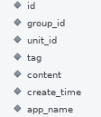

> group_id: 分布式事务组标示
> unit_id: 参与分布式事务的某个节点标示 tag:日志分类 content:日志内容 app_name:日志分类（应用级）

## 二、在日志开启后的问题排查

### 1、TxClient

- 事务组会话完整性检测

  ```
  select * from t_logger where t_logger.group_id = '99937859659434961'
  ```

  整个DTX下，TxClient某个事务组内容如下完整日志日路如下：
  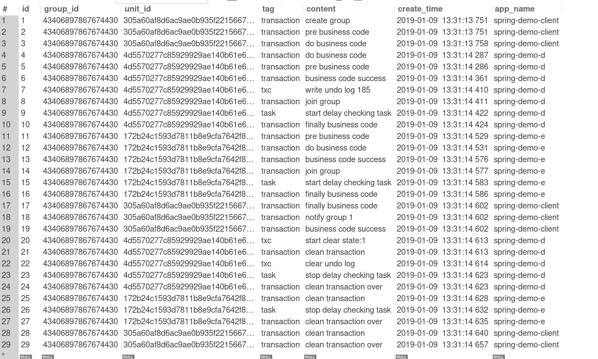

- 某个微服务某次事务会话

  ```
  select * 
  from t_logger 
  where t_logger.group_id = '99937859659434961' and app_name='spring-demo-d'
  ```

- 其它。根据情况按日志字段查看日志记录

##### 日志解读：

- 日志分类-应用:
  若基于默认配置，即非单独分配日志数据库时，日志会分别存在于各业务数据库下。若集中存储日志时，则可以按此字段查找整个事务到某个模块下的信息
- 日志分类-TAG:
  transaction: 事务信息
  task: 补偿任务信息
  txc: TXC模式事务信息
  lcn: LCN模式事务信息
  tcc: TCC模式事务信息
- 日志内容:
  pre business code: 准备业务代码
  [start]create group：创建分布式事务组
  do business code：执行业务代码
  business code success： 业务代码执行成功
  [txc]write undo log 193： 记录回滚sql
  [join]join group： 加入事务组
  [join,task]start delay checking task：开始补偿任务
  [start]notify group 1：通知事务组（提交/回滚）
  clean transaction：清理事务
  [txc]clear undo log：清理回滚sql
  [join,task]stop delay checking task：关闭补偿任务
  clean transaction over：事务清理成功

### 2、TxManager

TxManager 提供后台管理服务。[详情](https://www.codingapi.com/docs/txlcn-debug/manageradmin.html)


# TX-LCN 5.0.0 性能测试报告

## 方式说明

Dubbo下测试: D1. 在Dubbo下测试单LCN模块在并发20情况下循环请求的吞吐能力。
D2. 在Dubbo下测试单TXC模块在并发20情况下循环请求的吞吐能力。
D3. 在Dubbo下测试单TCC模块在并发20情况下循环请求的吞吐能力。
D4. 在Dubbo下测试TCC、TXC、LCN混合模块下在并发20情况下循环请求的吞吐能力。
D5. 在Dubbo下测试本地事务在并发20情况下循环请求的吞吐能力。

SpringCloud下测试: S1. 在SpringCloud下测试单LCN模块在并发20情况下循环请求的吞吐能力。
S2. 在SpringCloud下测试单TXC模块在并发20情况下循环请求的吞吐能力。
S3. 在SpringCloud下测试单TCC模块在并发20情况下循环请求的吞吐能力。
S4. 在SpringCloud下测试TCC、TXC、LCN混合模块下在并发20情况下循环请求的吞吐能力。
S5. 在SpringCloud下测试本地事务在并发20情况下循环请求的吞吐能力。

## 测试环境

硬件环境: CPU: Intel(R) Core(TM) I5-8400 CPU @ 2.80GHz 2.81GHz
内存: 16G
硬盘：240G SSD

软件环境:
系统:win10 64
JAVA: 1.8.0_181
Mysql: 5.7.23
Consul: 1.2.3
Zookeeper:3.4.9
Dubbo:2.6.2
SpringCloud:Finchley.SR2

## 测试模块

Client D E 三个模块,Client调用一次D模块在调用一次E模块。

Client.sayHello() -> D.rpc();
Client.sayHello() -> E.rpc();

### 重要配置信息

采用jmeter做的压测

线程配置

结果取值
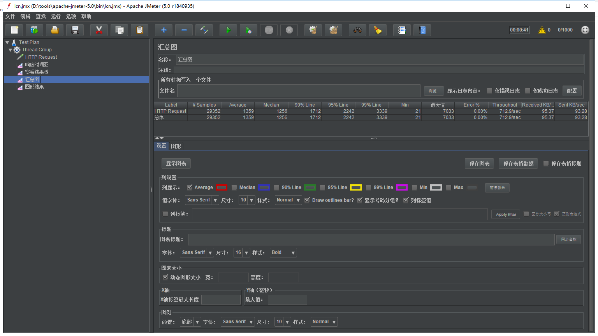

jvm -Xms256m -Xmx512m
连接池大小 均20
分布式事务框架未启用logger记录

## 测试结果

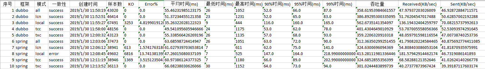

## 测试报告

[Jmeter报告](https://www.codingapi.com/img/5.0.0.zip)

## 测试说明

在相同条件下各种事务模式的效率关系

TCC > LCN > TXC

相比本地事务各模式的下降率

| 框架        | 模式 | 下降率 |
| :---------- | :--: | :----: |
| Dubbo       | LCN  | 31.3%  |
| Dubbo       | TXC  | 36.1%  |
| Dubbo       | TCC  | 28.6%  |
| SpringCloud | LCN  | 21.5%  |
| SpringCloud | TXC  | 27.1%  |
| SpringCloud | TCC  | 21.5%  |

- 下降率
  是指在相同的RPC框架下各种事务模式相同条件下的吞吐量相比本地事务吞吐量的下降比例。

例如：1 - dubbo下LCN模式的吞吐量/dubbo下本地事务的吞吐量

github 代码提交贡献人员:

https://github.com/codingapi/tx-lcn/graphs/contributors


  学习分享

我是基于吴恩达老师的开源课程学习的，大家感兴趣可以先去看吴恩达老师的公开课，建议先去看机器学习，然后再看深度学习的课程。

机器学习
https://study.163.com/course/courseMain.htm?courseId=1004570029
文刀 机器学习|理论与实战
https://www.youtube.com/playlist?list=PL_iBl5c4lkzpgB9ixAcHBZTwaupKSdb1i
深度学习
https://mooc.study.163.com/smartSpec/detail/1001319001.htm
基于java的DeepLearning框架 DL4j
https://deeplearning4j.org/
机器学习支持向量机
https://www.youtube.com/watch?v=o3oRG9VpVXU
自然常数e
https://www.youtube.com/watch?v=mZE0RmCbDe8

### 参考资料

梯度下降推导过程
https://blog.csdn.net/xiaopan233/article/details/86718372
神经网络反向传播的推倒过程
https://www.youtube.com/watch?v=5endCP0pfyE
https://blog.csdn.net/qq_32865355/article/details/80260212
黄博士吴恩达机器学习课程PDF笔记
https://github.com/fengdu78/Coursera-ML-AndrewNg-Notes

