#   第8章 权限管理（Spring Security）

### 8.1 权限控制管理   

#### 8.1.1 认证和授权概念

```markdown
前面我们已经完成了传智健康后台管理系统的部分功能，

例如检查项管理、检查组管理、套餐管理、预约设置等。

接下来我们需要思考2个问题：

问题1：在生产环境下我们如果不登录后台系统就可以完成这些功能操作吗？

答案显然是否定的，要操作这些功能必须首先登录到系统才可以。


问题2：是不是所有用户，只要登录成功就都可以操作所有功能呢？

并不是所有的用户都可以操作这些功能。不同的用户可能拥有不同的权限，这就需要进行授权了。


- 认证：系统提供的用于识别用户身份的功能，通常提供用户名和密码进行登录其实就是在进行认证，认证的目的是让系统知道你是谁。

- 授权：用户认证成功后，需要为用户授权，其实就是指定当前用户可以操作哪些功能。

本章节就是要对后台系统进行权限控制，其本质就是对用户进行认证和授权。

```


#### 8.1.2 权限模块数据模型

前面已经分析了认证和授权的概念，要实现最终的权限控制，权限信息都是存放到表中：

```markdown
- 用户表t_user、

- 权限表t_permission、

- 角色表t_role、

- 菜单表t_menu、

4张基础表


- 用户角色关系表t_user_role、

- 角色权限关系表t_role_permission、

- 角色菜单关系表t_role_menu。

3张关系表

```

其中最重要的表就是**角色表**

基于角色的权限访问控制（Role-Based AccessControl）,简称RBAC.

表之间关系如下图：见资料中的itcasthealth.pdm   详见第一天下发的pdm图

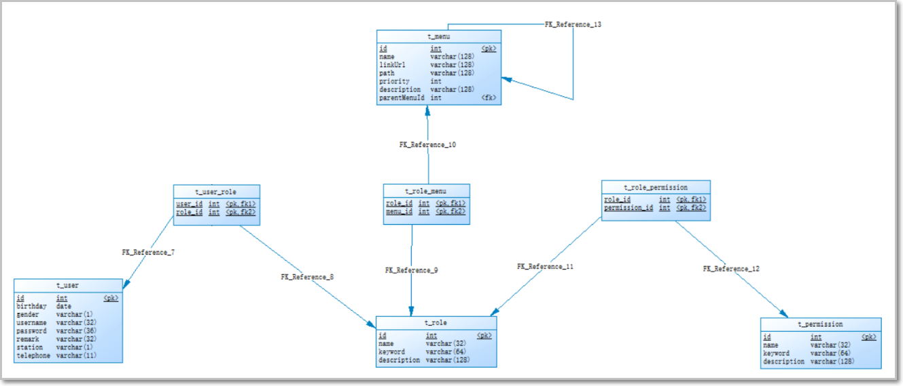

通过上图可以看到，权限模块共涉及到7张表。

在这7张表中，**角色表起到了至关重要的作用，其处于核心位置**，因为用户、权限、菜单都和角色是多对多关系。

其中菜单表有些特殊：进行了自关联

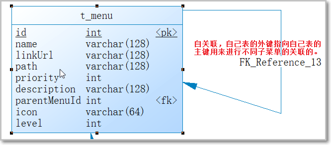 

接下来我们可以分析一下在认证和授权过程中分别会使用到哪些表：

**认证过程**：只需要用户表就可以了，可以简单的理解 访问后台管理网站平台 ，用户必须登录才可以访问

```java
在用户登录时可以查询用户表t_user进行校验，判断用户输入的用户名和密码是否正确。
用户名和密码要求：
用户名在所有表记录中要求唯一！非空！  类似该用户的身份标识，类似ID 通常选做 邮箱或手机号 作为用户名
```

**授权过程**：

```java
用户必须完成认证之后才可以进行授权，只有认证通过，我们才会对不同的用户进行授权，
可以根据用户查询其角色，再根据角色查询对应的菜单，这样就确定了用户能够看到哪些菜单。
然后再根据用户的角色查询对应的权限，这样就确定了用户拥有哪些权限。
```

所以授权过程会用到上面7张表。

### 8.2 Spring Security简介

- spring  secuirty 框架+Springboot 整合   自动配置说
- spring security 框架：自定义配置 （认证和授权）  重写 **WebSecurityConfigurerAdapter**  3个核心方法
- spring  security 框架 认证和授权流程！（**14-15 过滤器链**）
- 集中式权限管理和分布式权限管理

实际的企业开发中，我们都会使用权限框架来完成项目的权限开发

目前流行稳定安全级别较高的两大框架：**Apache shiro 和 Spring  security**

基于目前流行spring全家桶开发模式，我们学习spring security框架   

**Spring** **Security**是 Spring提供的安全认证服务的框架， 使用Spring Security可以帮助我们来简化认证和授权的过程。

官网：*https://spring.io/projects/spring-security*

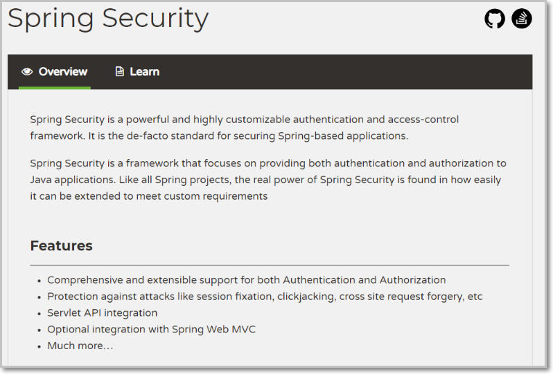

对应的maven坐标：在**父工程中**已导入

```xml
 			 <dependency>
                <groupId>org.springframework.boot</groupId>
                <artifactId>spring-boot-starter-security</artifactId>
            </dependency>
```

框架认证和授权执行流程：

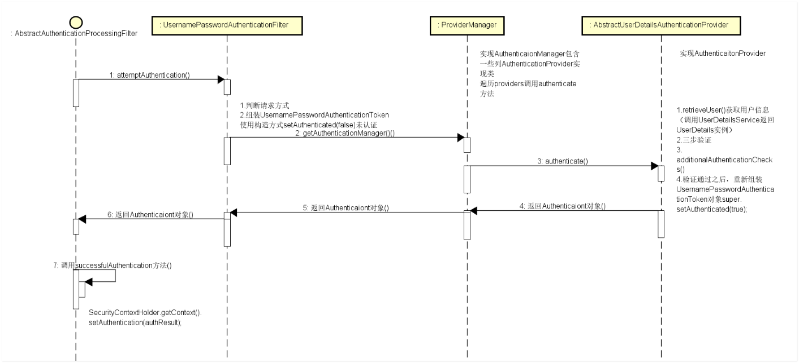 

框架核心过滤器链说明：

```java
- UsernamePasswordAuthenticationFilter认证的filter，经过这些过滤器后SecurityContextHolder中将包含一个完全组装好的Authentication对象，从而使后续鉴权能正常执行。表单认证是最常用的一个认证方式。


- BasicAuthenticationFilter认证filter，经过这些过滤器后SecurityContextHolder中将包含一个完全组装好的Authentication对象，从而使后续鉴权能正常执行

-- LogoutFilter处理退出登录的Filter

```


### 8.3 Spring Security学习-集中式权限管理

#### 第一步： 搭建权限框架环境

在**health_web** 模块添加下面依赖： 使用spring-security 框架 

```xml
 		<dependency>
            <groupId>org.springframework.boot</groupId>
            <artifactId>spring-boot-starter-security</artifactId>
        </dependency>
```

#### 第二步：准备静态资源

打开下发的资料：素材

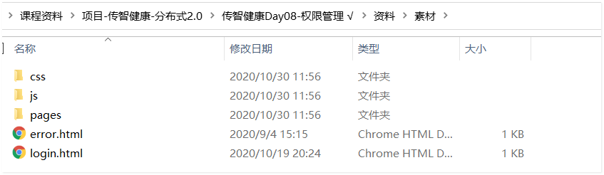 

将静态资源拷贝到static目录下 

#### 第三步：启动类

浏览器输入： localhost:8081/pages/index.html

效果：

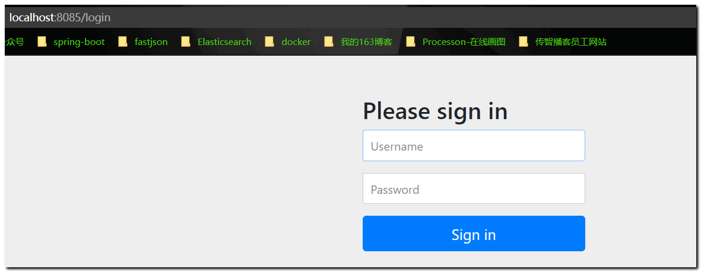 

我们发现，权限框架已经生效了！  需要输入账号和密码进行登录，方可以访问目标资源：index.html

账号和密码 由框架的自动配置类配置!

### 8.4 权限框架系统学习

通过上述案例我们可以看到，

Spring Security将我们项目中的所有资源都保护了起来，要访问这些资源必须要完成认证才可以访问。

通常我们还要解决如下一些问题：

```java
1、项目中我们将所有的资源（所有请求URL）都保护起来，实际环境下往往有一些资源不需要认证也可以访问，也就是可以匿名访问。
比如：电商网站各类商品的页面应该是不需要认证也可以访问，而个人资料需要认证之后才能访问。

2、登录页面是由框架生成的，而我们的项目往往会使用自己的登录页面。

3、直接将用户名和密码配置在了配置文件中，而真实生产环境下的用户名和密码往往保存在数据库中。

4、在配置文件中配置的密码使用明文，这非常不安全，而真实生产环境下密码需要进行加密。

```

**本章节需要对这些问题进行改进。 **  后门

#### 8.4.0 WebSecurityConfigurerAdapter

详见下发资料：

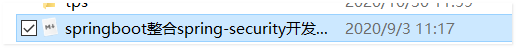 

了解：三个configure方法作用

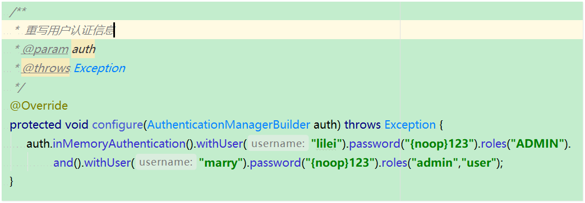 


#### 8.4.1 配置可匿名访问的资源

目标

>   在日常开发中，有一些url的访问时不需要任何权限的控制的，比如css、js、登陆页面等，可以使用springsecurity设置匿名访问路径，即没有任何限制，就能执行方法的url.

步骤实现

##### 第一步：访问css和js

在工程中添加人员js、css或者其他页面：可以从health_web工程中任意复制css和js到测试工程中

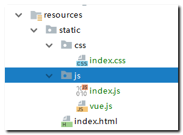   

##### 第二步：设置匿名访问路径

编写配置类继承**WebSecurityConfigurerAdapter** 重写

方法：public void configure(WebSecurity web)指定哪些资源可以匿名访问（即不需要认证就能访问）

```java
   @Override
    public void configure(WebSecurity web) throws Exception {
        web.ignoring().antMatchers("/img/**/*", "/**/*.css", "/**/*.js","/template/**","/plugins/**");
    }
```

##### 第三步：测试访问资源

浏览器直接访问静态资源 css或 js  不需要认证就可以访问

  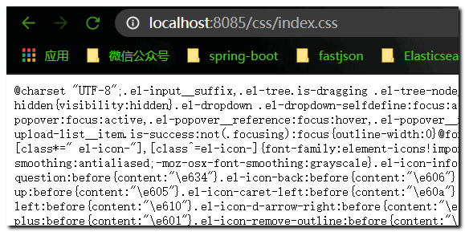  

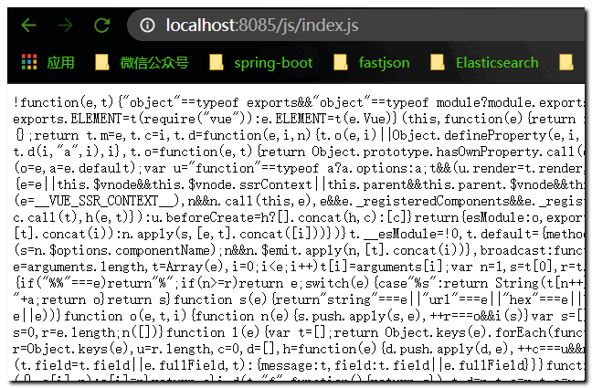 

#### 8.4.2 使用指定的登录页面

在正常开发过程中，肯定不是使用security框架准备的登陆页面，而是使用我们自己的登陆页面，接下来就来学习如何配置自己的登陆页面。

**目标**

使用自定义的登陆页面代替security给我们提供的默认登陆页面

**步骤实现**

##### 第一步：创建login.html

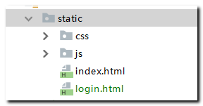 

login.html:

```html
<!DOCTYPE html>
<html>
<head>
    <!-- 页面meta -->
    <meta charset="utf-8">
       <title>登录</title>
</head>
<body>
   <form action="/login.do" method="post">
          用户名：<input type="text" name="username"><br>
          密码： <input type="password" name="password"><br>
           <input type="submit" value="登录">
       </form>
</body>
</html>
```

添加登录成功之后访问的资源

 

新建一个目录 page  定义两个资源页面：后续登录成功可以访问

##### 第二步：自定义登陆页面配置

编辑：配置类继承WebSecurityConfigurerAdapter 重写

```java
protected void configure(HttpSecurity http)
```

```java
  @Override
    protected void configure(HttpSecurity http) throws Exception {
        http.formLogin() 								// 定义当需要用户登录时候，转到的登录页面。
                .loginPage("/login.html")	 					// 设置登录页面
                .loginProcessingUrl("/login.do") 			// 表单提交的action 地址：
                .defaultSuccessUrl("/page/index.html")// 登录成功之后，默认跳转的页面
                .and()
                .authorizeRequests().antMatchers("/page/**").authenticated();// 表示 page下的所有资源 都需要认证才可以访问
       }
```

##### 第三步：测试  浏览器访问page/index.html页面 会先要求登录

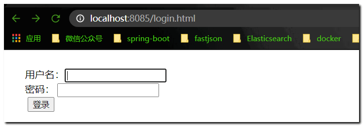 

##### 第四步： 自定义登录用户账号和密码

使用内存版 定义账号和密码   

我们需要重写  **WebSecurityConfigurerAdapter**提供的

```java
protected void configure(AuthenticationManagerBuilder auth) 
```

 ```java
  @Override
    protected void configure(AuthenticationManagerBuilder auth) throws Exception {
        //  基于内存  定义认证用户的账号 、密码 、以及权限关键字
        auth.inMemoryAuthentication().withUser("admin").password("1234").roles("ADMIN");
    }
 ```

重启: 登录表单输入 对应的账号 ： admin   密码  1234  我们登录提交

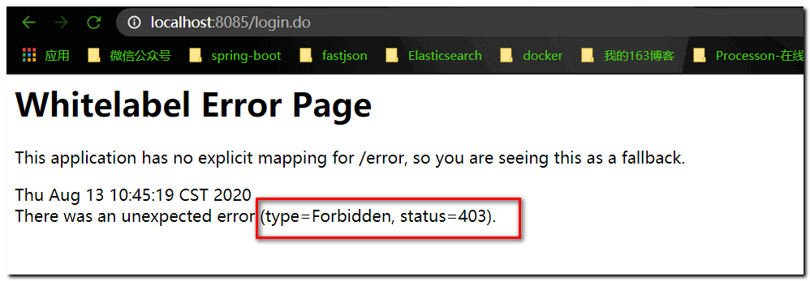 

原因是：security框架认为用户要访问的页面不安全而拒绝进行访问。

我们将自定义登陆页面注释掉之后重新查看security框架给我们准备的登陆页面，查看其源代码如下：

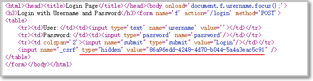 

发现其中有一个隐藏标签设置了一个value，该值在security框架内置的CsrfFilter过滤器中也有一个，security框架为了防止别人使用伪造的登陆页面来访问资源，因此设置了一个安全过滤器，只有当页面提交的隐藏值和过滤器中的页一致时，才允许用户继续访问资源。

解决方案：**关闭CsrfFilter过滤器**

##### 第五步：关闭CsrfFilter过滤器

关闭CsrfFilter过滤器：在configure(HttpSecurity http)  方法中 关闭

```java
   @Override
    protected void configure(HttpSecurity http) throws Exception {
        http.formLogin() 								// 定义当需要用户登录时候，转到的登录页面。
                .loginPage("/login.html")	 					// 设置登录页面
                .loginProcessingUrl("/login.do") 			// 表单提交的action 地址：
                .defaultSuccessUrl("/page/index.html")// 登录成功之后，默认跳转的页面
                .and()
                .authorizeRequests().antMatchers("/page/**").authenticated()// 表示 page下的所有资源 都需要认证才可以访问
                .and()
                .csrf().disable(); //  关闭  csrf过滤器
       }
```

---------------------------

再次测试： 我们发现 产生一个异常：

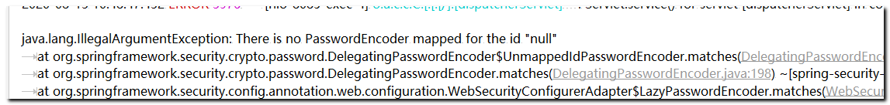 

因为： security框架对于用户认证的密码默认 采用 加盐加密处理： 我们的密码 1234 框架会对其进行加密：

使用到框架的内部加密器对象 PasswordEncoder 对象！

解决方案：

- 方案一

​      密码不要加密，告知框架，密码采用明文处理即可： 直接在密码前添加字符串： {noop}即可

   ```java
configure(AuthenticationManagerBuilder auth)   方法 处理密码
   @Override
    protected void configure(AuthenticationManagerBuilder auth) throws Exception {
        //  基于内存  定义认证用户的账号 、密码 、以及权限关键字
        auth.inMemoryAuthentication().withUser("admin").password("{noop}1234").roles("ADMIN");
    }
   ```

- 方案二

​    告知框架，我们的密码采用PasswordEncoder进行加密，引入注入加密器对象对密码处理即可

```java
- 在配置类中：先注入 PasswordEncoder对象 
  @Bean
    public BCryptPasswordEncoder passwordEncoder() {
        return new BCryptPasswordEncoder();//  密码加密 对象
    }
    
- 对密码进行加密处理 调用encode方法即可  
    @Override
    protected void configure(AuthenticationManagerBuilder auth) throws Exception {
        //  基于内存  定义认证用户的账号 、密码 、以及权限关键字
//        auth.inMemoryAuthentication().withUser("admin").password("{noop}1234").roles("ADMIN");
        String password = passwordEncoder().encode("1234"); //  数据库内存密码加密
            auth.inMemoryAuthentication().passwordEncoder(passwordEncoder()).withUser("admin").password(password).roles("ADMIN");
            //  密码加密器对象 通过passwordEncoder注入给spring security 框架 会自动对表单提交的密码进行加密处理
    }
```

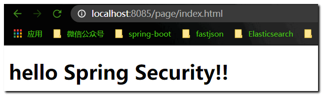 

#### 8.4.3 访问授权资源

只有ADMIN角色才可以访问find.html

1、修改登录用户的授权角色： **QUERY 角色**

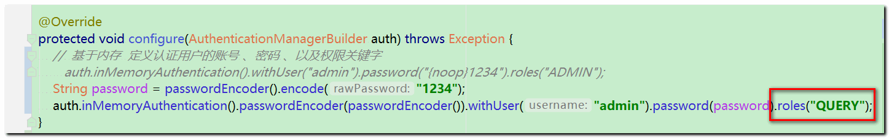 

修改目标资源的访问角色 ADMIN： 

注意授权代码的位置：  **权限和角色授权代码 要放在 认证代码之前**

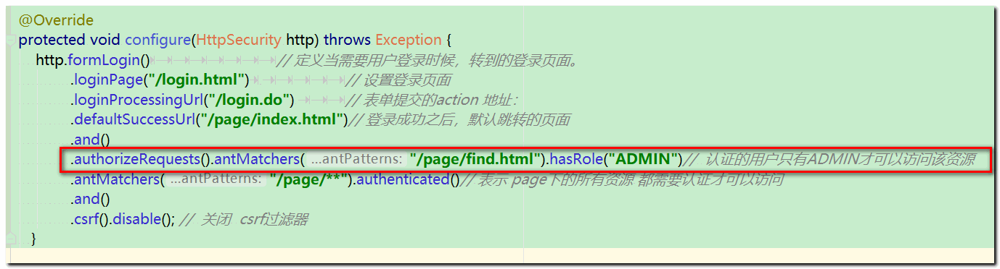 

浏览器访问： index.html 和  find.html 测试：

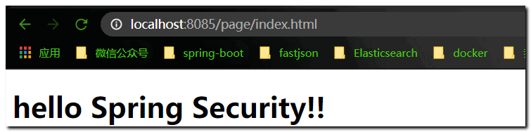 

 


#### 8.4.4 配置 403无权限友好页面

1. 定义一个友好页面

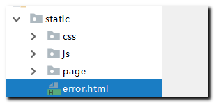 

2. 内容：

```html
<!DOCTYPE html>
<html lang="en">
<head>
    <meta charset="UTF-8">
    <title>Title</title>
</head>
<body>
              <h1>当前页面很火爆。。。。稍后再试！</h1>
</body>
</html>
```

3. 配置403  在  protected void configure(HttpSecurity http)  方法添加 

**exceptionHandling().accessDeniedPage("/error.html") 资源**

```java
    @Override
    protected void configure(HttpSecurity http) throws Exception {
        http.formLogin() 								// 定义当需要用户登录时候，转到的登录页面。
                .loginPage("/login.html")	 					// 设置登录页面
                .loginProcessingUrl("/login.do") 			// 表单提交的action 地址：
                .defaultSuccessUrl("/page/index.html")// 登录成功之后，默认跳转的页面
                .and()
                .authorizeRequests().antMatchers("/page/find.html").hasRole("ADMIN")//  认证的用户只有ADMIN才可以访问该资源
                .antMatchers("/page/**").authenticated()// 表示 page下的所有资源 都需要认证才可以访问
                .and().exceptionHandling().accessDeniedPage("/error.html") // 表示 403 无权限  跳转到友好页面
                .and()
                .csrf().disable(); //  关闭  csrf过滤器
       }

```

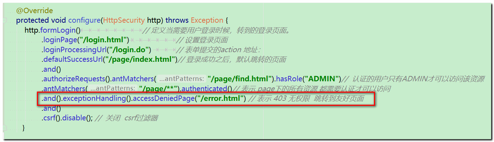 

测试： 浏览器访问find.html 页面

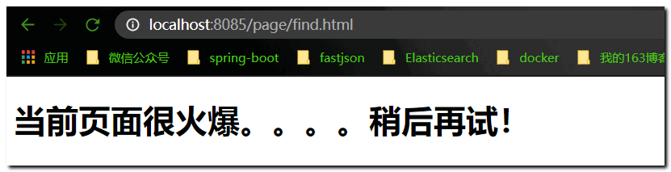 

#### 8.4.5 注解方式权限控制

Spring Security除了可以在配置文件中配置权限校验规则（即通过\<**security:intercept-url**\>标签配置），还可以使用注解方式进行权限的控制。

例如Controller中的某个方法要求必须具有某个权限才可以访问，此时就可以使用Spring Security框架提供的注解方式进行控制。

```java
角色控制：@PreAuthorize("hasRole('ROLE_ADMIN')")

权限控制：@PreAuthorize("hasAuthority('add')")

```

**注解一般作用在方法上。注解使用规则： 不乱用，不嵌套使用**

案例：

目标： 使用注解完成security框架的对于权限和角色的控制。

步骤实现：

#### 第一步：声明使用注解配置权限

在配置类上开启权限注解：

```java
@EnableGlobalMethodSecurity(prePostEnabled = true) //开启方法权限注解支持
public class SpringBootSecurityService extends WebSecurityConfigurerAdapter
```

#### 第二步：使用权限注解  @PreAuthorize()

编写controller 在业务方法上直接添加注解配置权限即可： 

在方法上加入**注解@PreAuthorize**进行权限控制

```java
@RestController
@RequestMapping("/user")
public class UserController {

    @RequestMapping("/addUser.do")  //  spEL  拥有ROLE_ADD 角色可以访问该业务方法
    @PreAuthorize("hasRole('ROLE_ADD')")
    public  String  addUser(){
        System.out.println("----adduser-----");
        return  "add";
    }
}
```

#### 第三步：测试

注意启动类的位置 要可以扫描到

 分别用 zs和lisi 登录 浏览器访问addUser.do方法

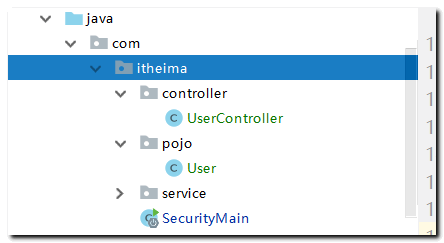 

#### 8.4.6 配置多种校验规则(了解)

在安全设置中，我们还可以根据不同的需求设置不同的权限和角色，比如在access属性中设置表达式如下：

spring-security.xml  配置相关的授权和认证SPEL表达式说明

```java
isAuthenticated()：是否通过认证,通过认证才能访问

hasAuthority('add')：是否拥有add权限，有权限才能访问

hasRole('ROLE_ADMIN')：是否拥有ROLE_ADMIN角色，有角色才能访问

hasRole('ADMIN')： 是否拥有ROLE_ADMIN角色简写方式，框架会自动添加前缀ROLE_。

spEL表达式
其他的表达式说明
    hasRole	用户具备某个角色即可访问资源
    hasAnyRole	用户具备多个角色中的任意一个即可访问资源
    hasAuthority	类似于 hasRole
    hasAnyAuthority	类似于 hasAnyRole
    permitAll	统统允许访问
    denyAll	统统拒绝访问
    isAnonymous	判断是否匿名用户
    isAuthenticated	判断是否认证成功
    isRememberMe	判断是否通过记住我登录的
    isFullyAuthenticated	判断是否用户名/密码登录的
    principle	当前用户
    authentication	从 SecurityContext 中提取出来的用户对象

```

#### 8.4.6 用户登出

**配置logout**

用户完成登录后Spring Security框架会记录当前用户认证状态为已认证状态，即表示用户登录成功了。

那用户如何退出登录呢？我们可以在配置类中进行如下配置：

```java
and()  
    //   logoutUrl  配置处理退出的请求路径     logoutSuccessUrl  退出之后跳转的资源地址   invalidateHttpSession  注销内置session对象
                .logout().logoutUrl("/logout.do").logoutSuccessUrl("/login.html").invalidateHttpSession(true)
```

通过上面的配置可以发现，如果用户要退出登录，只需要请求/logout.do这个URL地址就可以，同时会将当前session失效，最后页面会跳转到login.html页面。

发送请求：<http://localhost:8085/logout.do>，退出登陆成功后跳转到登陆页面。

 

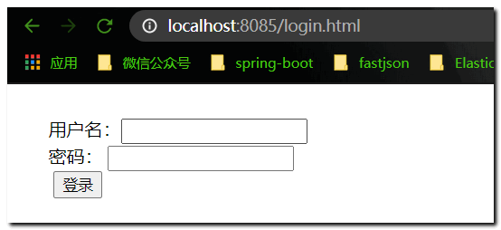 


### 8.5 用户认证和授权-数据库版

基于**传智健康后台 healt_consumer模块** 完成数据库版用户认证查询

搭建数据库认证和授权表环境：

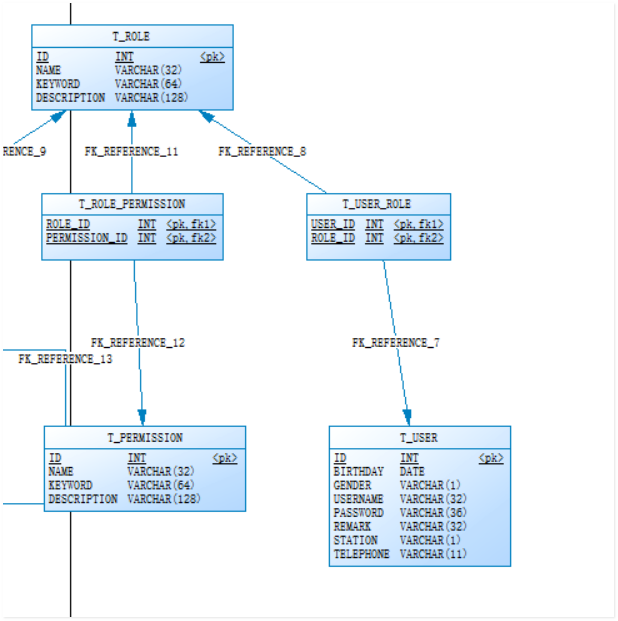 

使用下发的pd 导入数据库脚本，录入用户权限数据！

如果我们要从数据库动态查询用户信息，就必须按照spring security框架的要求提供一个实现UserDetailsService接口的实现类，并按照框架的要求进行配置即可，框架会自动调用实现类中的方法并自动进行密码校验。

我们需要在 ： 配置类中 将内存版的用户信息 替换成 数据库版的用户信息！

```java
    @Override
    protected void configure(AuthenticationManagerBuilder auth) throws Exception {
        //   认证管理器对象  配置用户认证信息
//        数据库版用户认证
        auth.userDetailsService(myUserDetailService).passwordEncoder(createPasswordEncoder());

    }
```

编写UserDetailService接口实现类 ：重写 loadUserByUsername方法

```java
//  数据库  认证 对象实例   由配置类 MyWebSecueiryAdapter 加载此对象
@Component
public class MyUserDetailService implements UserDetailsService {

       @Reference
      private UserService userService;
    @Override
    public UserDetails loadUserByUsername(String username) throws UsernameNotFoundException {
         //  根据账号 从数据库 查询 用户所有信息  封装   UserDetails 对象 中
          UserVO userVO =  userService.findUserInfoByUsername(username);
           if(userVO==null){
               return null;
           }
        Set<RoleVO> roles = userVO.getRoles();
        List<GrantedAuthority>  authorities = new ArrayList<GrantedAuthority>();
        for (RoleVO role : roles) {
            //   当前用户所有角色关键字  封装到 集合中
            authorities.add(new SimpleGrantedAuthority(role.getKeyword()));
              //  获取当前用户权限关键字
            Set<Permission> permissions = role.getPermissions();
            for (Permission permission : permissions) {
                authorities.add(new SimpleGrantedAuthority(permission.getKeyword()));
            }
        }
        User  user =   new User(userVO.getUsername(),userVO.getPassword(),authorities);
        return user;
    }
}


查询数据库：
 
 @Override
    public UserVO findUserInfoByUsername(String username) {
          //   根据账号查询用户所有角色和权限关键字
            UserVO userVO  =    baseMapper.findUserByUsername(username);
                        //  2 根据 uid  查询角色信息
           Set<RoleVO> roleVOSet = baseMapper.findrolesByUid(userVO.getId());
              //  3.  根据  roleId ==查询 权限信息
        for (RoleVO roleVO : roleVOSet) {
              Set<Permission>  permissionSet = baseMapper.findPermssionsByRoleId(roleVO.getId());
              roleVO.setPermissions(permissionSet);
        }
           userVO.setRoles(roleVOSet);
        return userVO;
    }
    

mapper sql语句
 @Select("select * from t_user where username = #{username}")
    UserVO findUserByUsername(@Param("username") String username);
    @Select("select tr.* from t_role tr , t_user_role tur where tr.id = tur.role_id and tur.user_id = #{uid}")
    Set<RoleVO> findrolesByUid(@Param("uid") Integer uid);
      @Select("select tp.*  from t_permission tp , t_role_permission trp where tp.id = trp.permission_id and trp.role_id = #{rid}")
    Set<Permission> findPermssionsByRoleId(@Param("rid") Integer rid);
 

```

后台系统测试：

基于 **apizza**使用下面用户开始测试

 **admin   1234  和  xiaoming  1234** 分别登录系统   先后访问  **检查项查询功能**

使用注解 ：@PreAuthorize("hasAuthority('CHECKITEM_QUERY')")  添加权限控制 进行测试

```java
  //   开发 检查项模块   crud
    @GetMapping("checkitem/findAll")
    @ApiOperation(value = "查询检查项方法",notes = "查询所有的检查项列表信息")
    @PreAuthorize("hasAuthority('CHECKITEM_QUERY')")
    public Result findAll(){
            List<CheckItem> list = checkItemService.list();
            return  new Result(list);   
    }
```

说明：

```java
我们实现了UserDetailsService接口。

在配置类中使用了自己的UserDetailService实现类。

当我们进行登录操作时，spring security框架会调用UserServiceDetails的loadUserByUsername方法查询用户信息，

并根据此方法中提供的密码和用户页面输入的密码进行比对来实现认证操作。

```

### 能力目标

1. 能够完成数据库版认证和授权代码实现

2. 能够完成注解权限配置

```markdown
 回顾分布式事务常用注解

TM
注解@EnableTransactionManagerServer  ： 服务端开启分布式事务功能。
一般在管理平台服务： 启动类上添加

TC:
注解@EnableDistributedTransaction，这个注解是**客户端开启事务的注解**
一般在客户端服务的启动类上添加该注解

@LcnTransaction
一般在客户端需要管理事务的方法上
一般用于mysql 或 oracle数据库，在于支持事务场景代理本地connection链接对象，使用数据库本身提供的事务管理
完成事务的提交或回滚
```


 