# 第10章 图形报表、POI报表

##  学习目标

- 权限管理-用户信息展示和退出
- 完成套餐预约占比饼图报表
- 完成会员数量占比折线报表

## 10.1 主页显示用户名

前面我们已经完成了认证和授权操作，如果用户认证成功后需要在页面展示当前用户的用户名。

实现步骤：  当用户认证成功，会在sessionStore中保存用户相关信息和token

第一步：在index.vue页面中修改，定义username模型数据基于VUE的数据绑定展示用户名

```javascript
   created(){
        this.menuList = mList;
        //  当用户认证成功 直接从  sessionStorege对象中获取用户数据
        this.username = window.sessionStorage.getItem("username")
    }
```

```html
<div class="avatar-wrapper">
  
  <!--展示用户名-->
  {{username}}
</div>
```


## 10.2 用户退出功能实现

第一步：在main.vue中提供的退出菜单上加入超链接

```html
							<el-dropdown-item divided>
                                        <span style="display:block;">
                                             <a @click="logout">退出</a>
                                        </span>
                                    </el-dropdown-item>
                            </el-dropdown-menu>
```

第二步：从sessionStore中移除 用户相关信息： 用户名和token 

```java
    //  用户退出功能
        logout(){
          window.sessionStorage.removeItem("username")
          window.sessionStorage.removeItem("token")
          this.$router.replace({ name: "/" });
        },
```


## 10.3 图形报表ECharts

### 10.3.1 ECharts简介-富客户端图表库

```markdown
ECharts缩写来自Enterprise Charts，商业级数据图表，是百度的一个开源的使用JavaScript实现的数据可视化工具，可以流畅的运行在PC和移动设备上，兼容当前绝大部分浏览器（IE8/9/10/11，Chrome，Firefox，Safari等），底层依赖轻量级的矢量图形库ZRender，提供直观、交互丰富、可高度个性化定制的数据可视化图表。
```

官网：<https://echarts.baidu.com/>

下载地址：<https://echarts.baidu.com/download.vue>

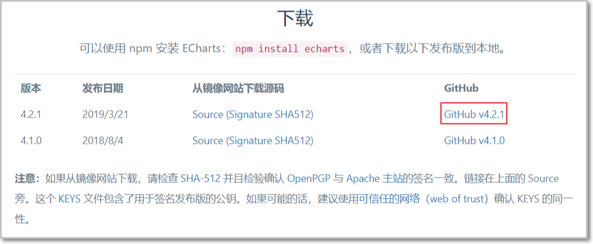

下载完成可以得到如下文件：

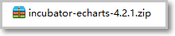 

解压上面的zip文件：

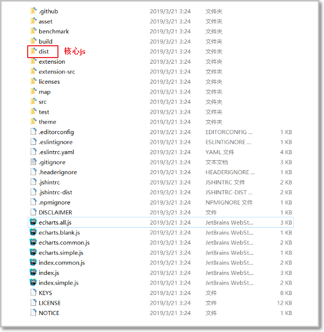 

我们只需要将dist目录下的echarts.js文件引入到页面上就可以使用了

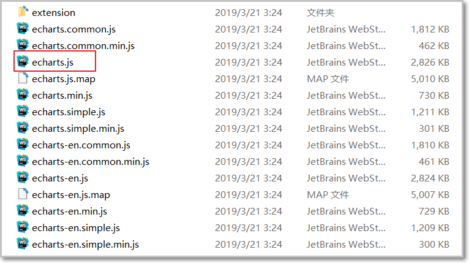

### 10.3.2 ECharts官方实例

ECharts提供了很多官方实例，我们可以通过这些官方实例来查看展示效果和使用方法。

官方实例地址：<https://www.echartsjs.com/examples/>

可以点击具体的一个图形会跳转到编辑页面，编辑页面左侧展示源码（js部分源码），右侧展示图表效果，如下：

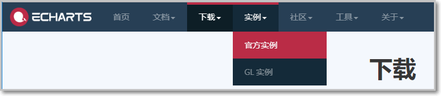 

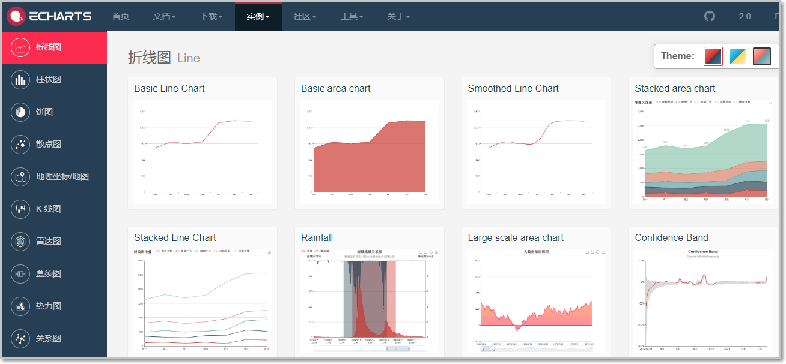

要查看完整代码可以点击右下角的**Download按钮**将完整页面下载到本地。

通过官方案例我们可以发现，使用ECharts展示图表效果，关键点在于确定此图表所需的**数据格式**，

然后按照此数据格式提供数据就可以了，我们无须关注效果是如何渲染出来的。

在实际应用中，我们要展示的数据往往存储在数据库中，所以我们可以发送ajax请求获取数据库中的数据并转为图表所需的数据即可。

通过点击就看到代码和效果：

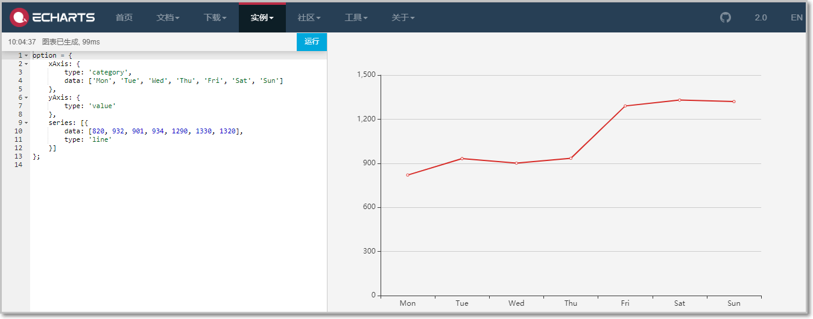

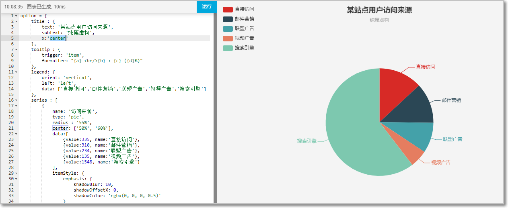

而当我们要使用的使用直接去实例中找一个图表通过修改其中的js就能完成我们想要的功能。

### 10.3.3 5分钟上手ECharts

我们可以参考官方提供的5分钟上手ECharts文档感受一下ECharts的使用方式，地址如下：

<https://www.echartsjs.com/tutorial.vue#5%20%E5%88%86%E9%92%9F%E4%B8%8A%E6%89%8B%20ECharts>

第一步：创建vue页面并引入echarts.js文件

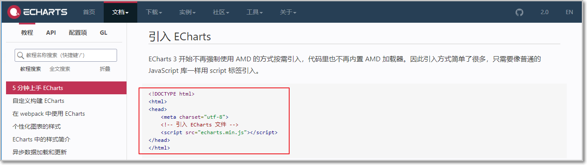

第二步：在页面中准备一个具备宽高的DOM容器。

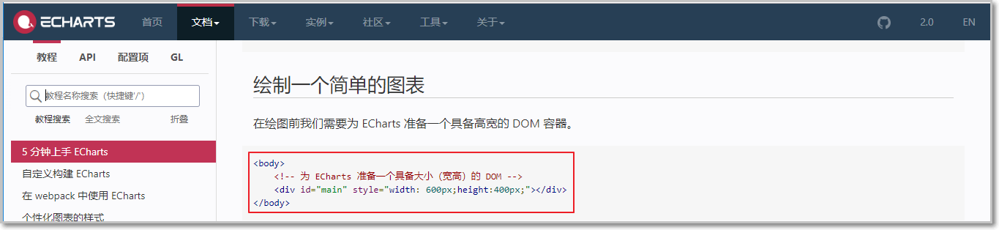

第三步：通过echarts.init方法初始化一个 echarts
实例并通过setOption方法生成一个简单的柱状图

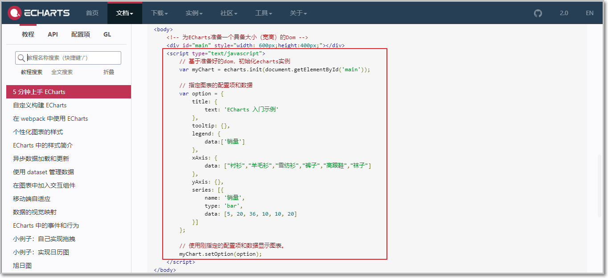

效果如下：

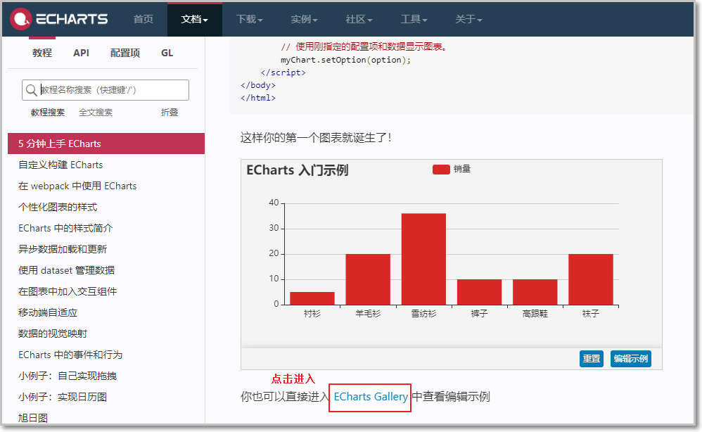


## 10.4 项目功能-会员数量折线图

1. 目标   

```markdown
- 会员信息是体检机构的核心数据，其会员数量和增长数量可以反映出机构的部分运营情况。
- 通过折线图可以直观的反映出会员数量的增长趋势。
- 本章节我们需要在report_member.vue页面中展示过去一年的每个月的会员总数据量。
```

展示效果如下图：

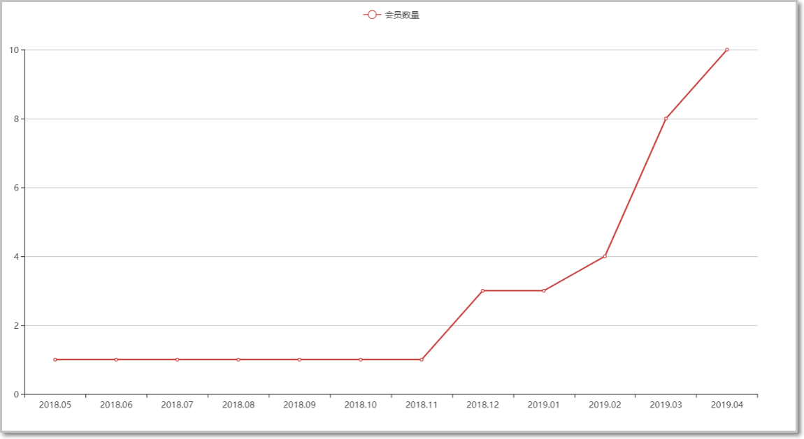

2. 完善页面

会员数量折线图对应的页面为**/pages/report_member.vue。**

第一步：导入ECharts库

将echarts.js文件复制到health_web工程中

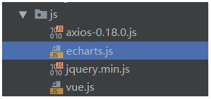 

第二步：导入report_member.vue页面

在当天的资料\\页面中将report_member.vue页面复制到工程中

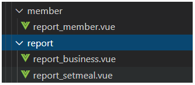 

路由中添加访问路径：

```js
 {
        path: '/report_setmeal',
        name: 'report_setmeal',
        component: () => import('../views/report/report_setmeal.vue')
      },
      {
        path: '/report_member',
        name: 'report_member',
        component: () => import('../views/member/report_member.vue')
      },
      {
        path: '/report_business',
        name: 'report_business',
        component: () => import('../views/report/report_business.vue')
      }
```

main.js中引入echarts.组件

```js
import echarts from 'echarts'
Vue.prototype.$echarts = echarts
```

**使用this.$echarts 来调用echart提供的函数**

第三步：参照官方实例导入折线图

```js
<template>
<div class="hold-transition">
  <div class="content-header">
                <h1>统计分析<small>会员数量</small></h1>
                <el-breadcrumb separator-class="el-icon-arrow-right" class="breadcrumb">
                    <el-breadcrumb-item :to="{ path: '/' }">首页</el-breadcrumb-item>
                    <el-breadcrumb-item>统计分析</el-breadcrumb-item>
                    <el-breadcrumb-item>会员数量</el-breadcrumb-item>
                </el-breadcrumb>
            </div>
            <div class="app-container">
                <div class="box">
                    <!-- 为 ECharts 准备一个具备大小（宽高）的 DOM -->
                    <div id="chart1" style="height:600px;"></div>
                </div>
            </div>
</div>
</template>

<script>
export default {
  data() {
    return {};
  },
   mounted:function(){
                  var myChart = this.$echarts.init(document.getElementById("chart1"));

                         myChart.setOption({
                             title:{
                                 text:'会员数量'
                             },
                             tooltip: {
                                 trigger: 'axis',
                                 formatter: [820, 932, 901, 934, 1290, 1330, 1320]
                             },
                             xAxis: {
                                 type: 'category',
                                 data: ['2020-6', 'Tue', 'Wed', 'Thu', 'Fri', 'Sat', 'Sun']
                               
                             },
                             yAxis: {
                                 type: 'value'
                             },
                             series: [{
                                 data: [820, 932, 901, 934, 1290, 1330, 1320],
                                 name:'会员数量',
                                 type: 'line'
                             }]
                         });

                     }
  
};
</script>
```

修改菜单： 点击菜单 访问对应得组件

menu.json修改如下：

```js
{
        "path": "5",
        "title": "统计分析",
        "icon": "fa-heartbeat",
        "children": [
            {
                "path": "/5-1",
                "title": "套餐占比",
                "linkUrl": "report_setmeal",
                "children": []
            },
            {
                "path": "/5-2",
                "title": "会员统计",
                "linkUrl": "report_member",
                "children": []
            },
            {
                "path": "/5-3",
                "title": "运营报表统计",
                "linkUrl": "report_business",
                "children": []
            }
        ]
    }
```

第四步： 导入查询的通用数据脚本： 下发的资料sql直接导入到数据库中

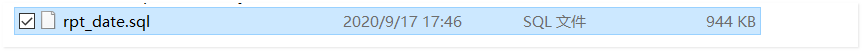 

该表结构说明：

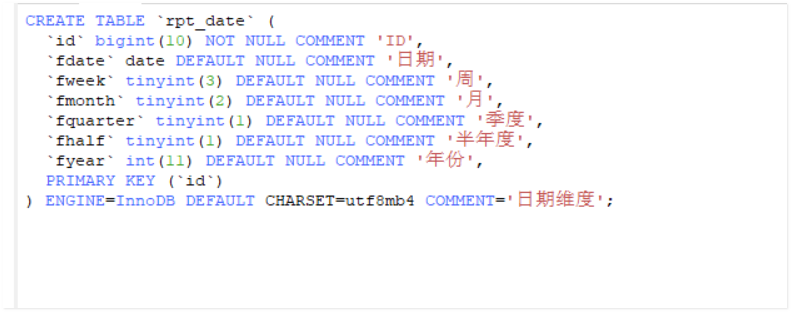 

我们后续可以根据这张日期维度表，查询各类关于日期的数据查询！

接下来完成后台数据访问实现：

第一步： 修改 remport_memeber.vue文件 完成axio请求发送：

```js
 this.$http.get("api/report/getMemberCount").then((res)=>{
     
 }）
```


第二步：Controller

在health_web工程中创建ReportController

```java
 @Reference
    private MemberService memberService;


    @GetMapping("report/getMemberCount")
    public  Result getMemberCount(){
        try {
            Map map  = memberService.getMemberCount();
            return  new Result(true, MessageConstant.GET_USERNAME_SUCCESS,map);
        } catch (Exception e) {
            e.printStackTrace();
            return  new Result(false, MessageConstant.GET_USERNAME_FAIL);
        }
    }
```

第三步：服务接口

在MemberService服务接口

```java
 Map getMemberCount();
```

第三步：服务实现类

在MemberServiceImpl服务实现类中实现findMemberCountByMonth方法

```java
    @Override
    public  List<Map> getMemberCount() {
           Map map = new HashMap(); //  封装月份和会员数量
          List<Map>  mapList  = baseMapper.getMemberCount();
        // 学员完成： 遍历mapList 将每个月会员数量和对应得日期  转换到map中
        //  。。。。。。。。。。。。
        return map;
    }
```

第四步： 编写实现的sql    传递年份即可

```sql
--  上一年 每一个月的 会员数量   查询结果；每一个月 以及 对应得会员数量汇总  avg()  sum()  year() now()
SELECT  count(tm.ID) as memberCounts, 
        concat(year(rp.fdate),"-",rp.fmonth) as yearAndMonth
from rpt_date  rp  ,t_member  tm
where rp.fdate = tm.REGTIME
and rp.fyear = year(now())-1
group by rp.fmonth
```

第五步：修改 js map中对应得key 

```js
                            xAxis: {
                                 type: 'category',
                                 data: res.data.data.yearAndMonth
                             },
                             yAxis: {
                                 type: 'value'
                             },
                             series: [{
                                 // data: [820, 932, 901, 934, 1290, 1330, 1320],
                                 name:'会员数量',
                                 data: res.data.data.memberCounts,
                                 type: 'line'
                             }]
```

手动添加会员数量，在echarts中添加动态效果

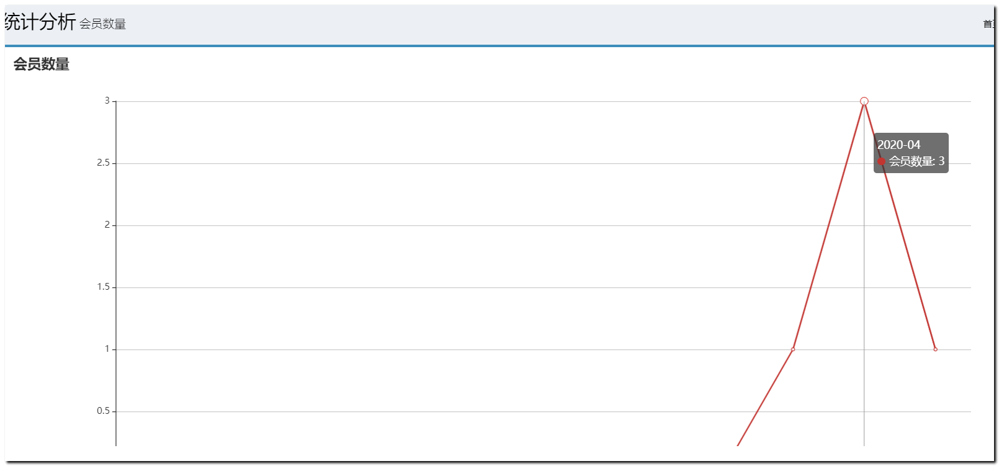 

```js
       tooltip: {
                                 trigger: 'axis',
                                 formatter: res.data.data.memberCounts
                             },
```

所有代码:  在Mounted函数中 添加上述属性对象   trigger:axis  

参照官方代码模板

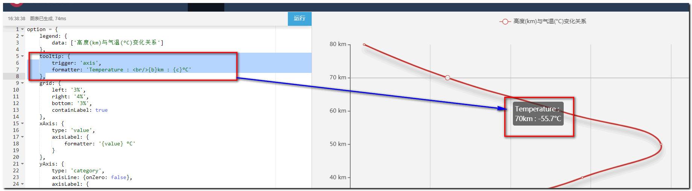 

```js
最终页面js代码：

              mounted(){
                  var myChart = this.$echarts.init(document.getElementById('chart1'));
                 this.$http.get("api/report/getMemberCount").then((res)=>{

                     if(res.data.flag){

                         myChart.setOption({
                             title:{
                                 text:'会员数量'
                             },
                             tooltip: {
                                 trigger: 'axis',
                                 formatter: res.data.data.memberCounts
                             },
                             xAxis: {
                                 type: 'category',
                                 data: res.data.data.yearAndMonth
                             },
                             yAxis: {
                                 type: 'value'
                             },
                             series: [{
                                 name:'会员数量',
                                 data: res.data.data.memberCounts,
                                 type: 'line'
                             }]
                         });

                     }
                 })
              }
          })

```


## 10.5 套餐预约占比饼形图

目标：完成用户预约套餐报表功能

会员可以通过移动端自助进行体检预约，在预约时需要选择预约的体检套餐。

本章节我们需要通过饼形图直观的展示出会员预约的各个套餐占比情况（report-setmeal.vue）。

展示效果如下图：

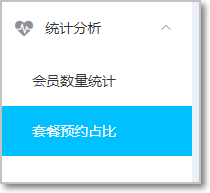 

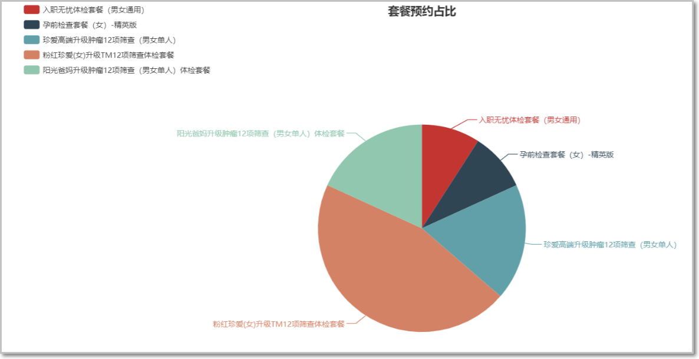

分析：

如果对饼图中的某些参数不了解，我们可以查看文档-配置项来了解其中的含义：

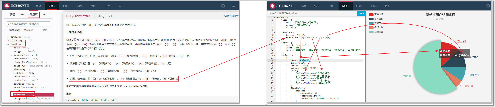

在饼图中我们需要得到**两个动态数据**进行查询：

注意查询的数据必须符合**value:xxx,name:xxx的结构**

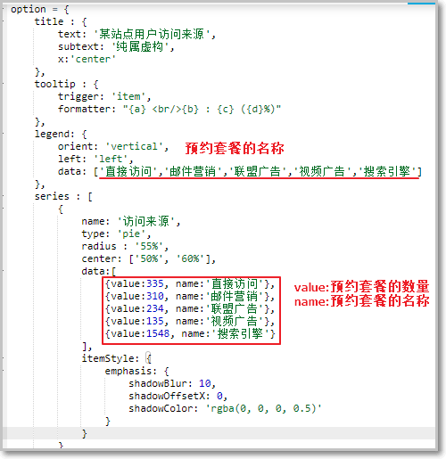 

而以上饼图中的数据来源其实对应的是**数据库中的t_order表中的数据**：

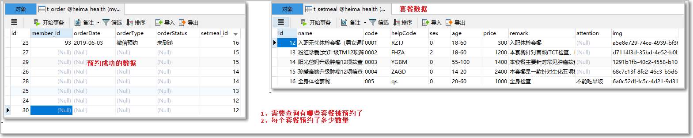

数据库统计预约套餐的sql语句如下:

```sql
SELECT s. NAME as name, count(o.setmeal_id) as value 

FROM t_order o INNER JOIN t_setmeal s 

ON o.setmeal_id = s.id

GROUP BY o.setmeal_id


List<Map>
```

完善页面

#### 第一步：显示页面

需要在main.vue页面的统计分析中添加一个子菜单来显示report_setmeal.vue页面：

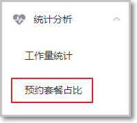 

```js
{
        "path": "5",
        "title": "统计分析",
        "icon": "fa-heartbeat",
        "children": [
            {
                "path": "/5-1",
                "title": "套餐占比",
                "linkUrl": "report_setmeal",
                "children": []
            },
            {
                "path": "/5-2",
                "title": "会员统计",
                "linkUrl": "report_member",
                "children": []
            },
            {
                "path": "/5-3",
                "title": "运营报表统计",
                "linkUrl": "report_business",
                "children": []
            }
        ]
    }
```

#### 第二步：参照官方实例导入饼形图

在页面中导入js:

```js
<template>
  <div class="hold-transition">
    <div class="content-header">
      <h1>
        统计分析
        <small>套餐占比</small>
      </h1>
      <el-breadcrumb separator-class="el-icon-arrow-right" class="breadcrumb">
        <el-breadcrumb-item :to="{ path: '/index' }">首页</el-breadcrumb-item>
        <el-breadcrumb-item>统计分析</el-breadcrumb-item>
        <el-breadcrumb-item>套餐占比</el-breadcrumb-item>
      </el-breadcrumb>
    </div>
    <div class="app-container">
      <div class="box">
        <div id="chart1" style="height:600px;"></div>
      </div>
    </div>
  </div>
</template>

<script>
export default {
  data() {
    return {};
  },
  mounted: function () {
    var myChart1 = this.$echarts.init(document.getElementById("chart1"));
    myChart1.setOption({
      title: {
        text: "套餐预约占比",
        subtext: "",
        x: "center",
      },
      tooltip: {
        //提示框组件
        trigger: "item", //触发类型，在饼形图中为item
        formatter: "{a} <br/>{b} : {c} ({d}%)", //提示内容格式
      },
      legend: {
        orient: "vertical",
        left: "left",
      },
      series: [
        {
          name: "套餐预约占比",
          type: "pie",
          radius: "55%",
          center: ["50%", "60%"],
          data: [
            { value: 335, name: "直接访问" },
            { value: 310, name: "邮件营销" },
            { value: 234, name: "联盟广告" },
            { value: 135, name: "视频广告" },
            { value: 1548, name: "搜索引擎" },
          ],
          itemStyle: {
            emphasis: {
              shadowBlur: 10,
              shadowOffsetX: 0,
              shadowColor: "rgba(0, 0, 0, 0.5)",
            },
          },
        },
      ],
    });
  },
};
</script>
```

根据饼形图对数据格式的要求，我们发送ajax请求，服务端需要返回如下格式的数据：

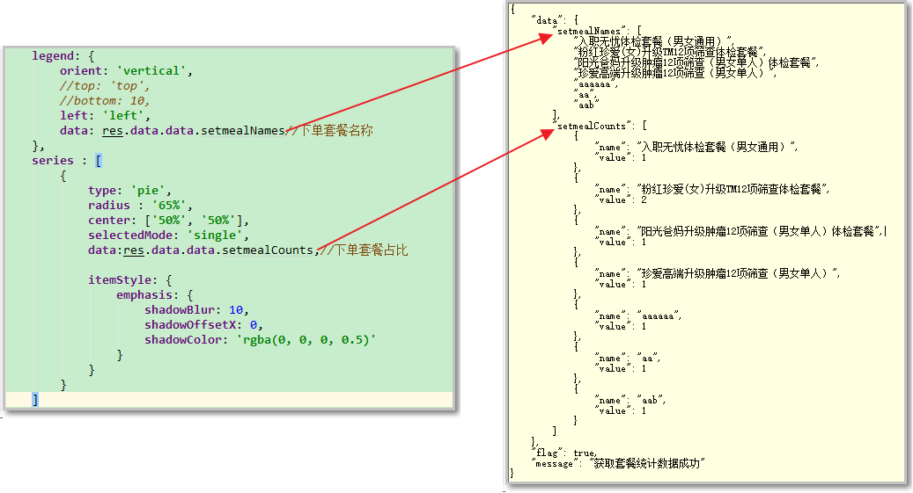

#### 第三步：后台代码

Controller

在health_web工程的SetmealController中提供getSetmealReport方法

```java
  //  套餐预约占比
    @GetMapping("report/getSetmealProportion")
//    @PreAuthorize()
    public Result getSetmealZhanBi(){
        try {
           List<Map> map =  setmealService.getSetmealReport();
            return  new Result(true, MessageConstant.GET_SETMEAL_COUNT_REPORT_SUCCESS,map);
        } catch (Exception e) {
            e.printStackTrace();
            return  new Result(false, MessageConstant.GET_SETMEAL_COUNT_REPORT_FAIL);
        }

    }
```

#### 第四步：服务接口

在SetmealService服务接口中扩展方法getSetmealReport

```java
Map getSetmealReport();
```

#### 第五步：服务实现类

在SetmealServiceImpl服务实现类中实现getSetmealReport方法

```java
   @Override
    public List<Map> getSetmealReport() {

        return baseMapper.getSetmealReport();
    }
```

#### 第六步：Mapper接口

在SetmealMapper接口中扩展方法getSetmealReport

```java
  @Select("select count(tor.SETMEAL_ID) as value,ts.name " +
            "FROM t_setmeal ts , t_order tor " +
            "where ts.ID = tor.SETMEAL_ID " +
            "group by tor.SETMEAL_ID;")
    List<Map> getSetmealReport();
```


添加别名后效果如下：

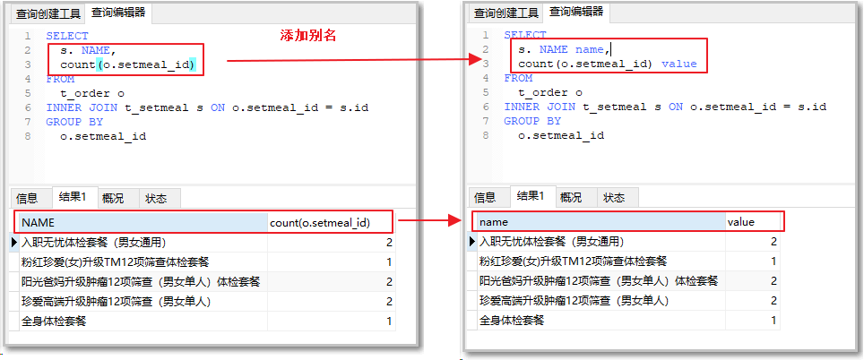

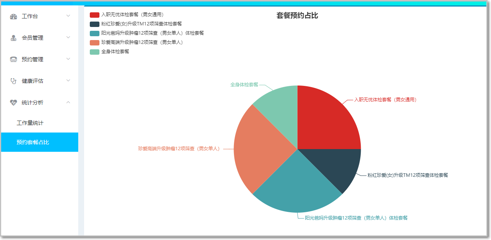


## 10.7 项目部署(windows)

https://www.processon.com/view/link/5fa7d1217d9c081baf1db586

https://www.processon.com/view/link/5fb10d861e0853373ed3330f

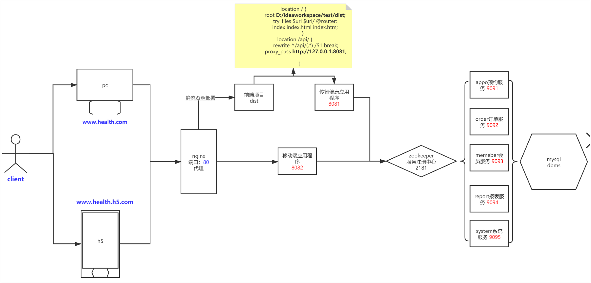 

官网地址：
http://nginx.org/

### 10.7.1 Nginx介绍

Nginx是一款轻量级的 Web 服务器,由俄罗斯的程序设计师伊戈尔·西索夫所开发。 Nginx性能非常优秀,
官方测试能够支撑5万并发链接，并且 cpu、内存等资源消耗却非常低，运行非常稳定。
Nginx的功能有很多，我们主要使用它来做静态资源服务器、负载均衡服务器和反向代理服务器。

### 10.7.2 应用场景

- 静态资源服务器
  部署网站的静态资源（html、css、js）

- 反向代理服务器
  代理: 给某个对象提供一个代理对象，并由代理对象控制原对象的引用
  正向代理: 对客户端进行代理(例如VPN)
  反向代理: 对服务端进行代理
  反向代理，就是对服务端进行代理，作为客户端,只需要将请求发送到反向代理服务器，由反向代理服务
  器去选择目标服务器获取数据后，再响应给客户端，此时反向代理服务器和目标服务器对外就是一个服
  务器，暴露的是代理服务器地址，隐藏了真实服务器IP地址。
- 负载均衡服务器
  负载均衡（Load Balance）意思就是将一份负载分摊到多个操作单元上进行执行
-  nginx与tomcat区别

1. 存放的文件形式
Nginx是http服务器,只能解析静态文件
Tomcat是web中间件(本质上是一个servlet),能解析jsp和静态文件
2. 用途
nginx可以作为反向代理服务器,负责均衡服务器,静态资源存放服务器
tomcat能作为jsp容器使用,静态资源存放服务器
3. 性能
nginx 单机支持5W每秒并发 

### 10.7.3 Nginx安装和配置

解压：

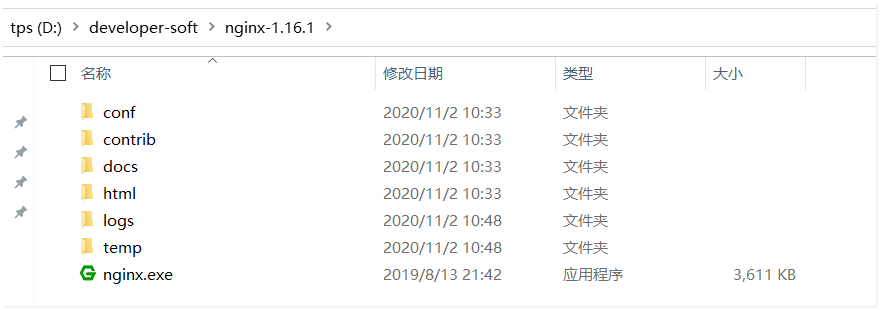

配置 移动端和传智健康后台

```
 server {
        listen       80;
        server_name  www.health.com;
		
        location / {
                root D:/ideaworkspace/114/dist;
                try_files $uri $uri/ @router;
                index index.html index.htm;
             }

        location /api/ {
                 rewrite ^/api/(.*) /$1 break;
                 proxy_pass http://127.0.0.1:8081;
        
         }
       } 
	   
	   
	server {
       listen       80;
       server_name  www.health.h5.com;
		
        location / {
               proxy_pass http://127.0.0.1:8082;
             }
       }   
```

配置本地hosts文件

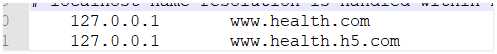 

### 10.7.4 前端系统发布

vscode输入命令  npm  run build  生成一个dist文件

将dist目录 拷贝到  nginx配置的目录下

 **D:/ideaworkspace/114/dist;**

### 10.7.5 nginx启动、停止、重新加载

在nginx.exe目录，输入命令

nginx.exe  启动

nginx.exe -s stop  停止服务

nginx.exe -s reload 重起服务


### 10.7.6 后台项目启动

1. 启动zookeeper ,redis ,xxl-job,rabbitmq ,nginx等服务。
2. java  -jar  xxx.jar  依次启动传智健康相关应用程序

后台系统：

浏览器输入： www.health.com  

移动端系统：

浏览器输入： www.health.h5.com/pages/index.html

传智健康项目架构图：

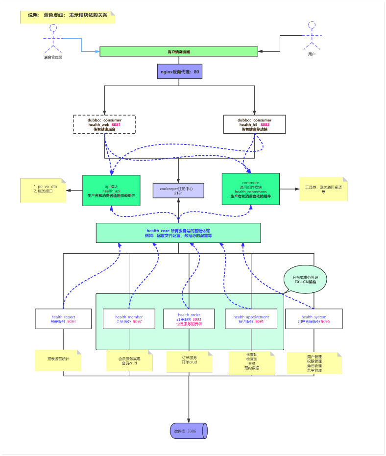

扩展内容：分布式锁和jemeter使用说明

链接：https://pan.baidu.com/s/18uJyO6EHAG10GdvjsNYqPQ 
提取码：4y93 
复制这段内容后打开百度网盘手机App，操作更方便哦--来自百度网盘超级会员V5的分享

