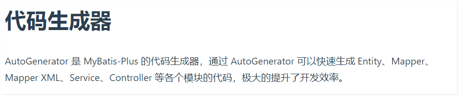
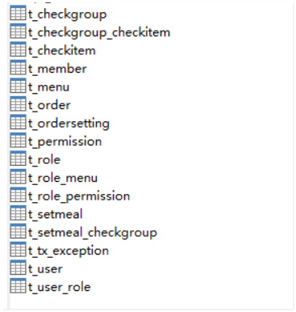

## Mybatis-plus代码生成器

实际开发中，当数据库环境搭建完成之后，我们需要根据表反向生成后台的 

controller/service/po等对象 可以基于mp的代码生成器完成：

官网：https://baomidou.com/guide/generator.html#%E4%BD%BF%E7%94%A8%E6%95%99%E7%A8%8B

 

开发步骤：  

注意：单独**搭建一个新工程 专门用来完成mp代码生成器的，编码因代码生成器导致项目业务代码被修改！**

1. 导入依赖 pom.xml

根据官方提供的代码要求 提供对应得依赖即可；

基于springboot环境完成

```xml
 <parent>
     <groupId>org.springframework.boot</groupId>
     <artifactId>spring-boot-starter-parent</artifactId>
     <version>2.3.0.RELEASE</version>
 </parent>
<properties>
     <mybatisplus.version>3.3.2</mybatisplus.version>
</properties>
 <dependencies>
     <dependency>
         <groupId>org.springframework.boot</groupId>
         <artifactId>spring-boot-starter-web</artifactId>
     </dependency>
     <dependency>
         <groupId>mysql</groupId>
         <artifactId>mysql-connector-java</artifactId>
         <scope>runtime</scope>
     </dependency>
     <dependency>
         <groupId>org.projectlombok</groupId>
         <artifactId>lombok</artifactId>
     </dependency>
     <!--mybatis-plus 启动器 -->
     <dependency>
         <groupId>com.baomidou</groupId>
         <artifactId>mybatis-plus-boot-starter</artifactId>
         <version>${mybatisplus.version}</version>
     </dependency>
     <!--mp依赖包-->
     <dependency>
         <groupId>com.baomidou</groupId>
         <artifactId>mybatis-plus-extension</artifactId>
         <version>${mybatisplus.version}</version>
     </dependency>
     <!--mybaits-plus 代码生成器-->
     <dependency>
         <groupId>com.baomidou</groupId>
         <artifactId>mybatis-plus-generator</artifactId>
         <version>${mybatisplus.version}</version>
     </dependency>
     <!--代码生成器需要模板 依赖-->
     <dependency>
         <groupId>org.apache.velocity</groupId>
         <artifactId>velocity-engine-core</artifactId>
         <version>2.2</version>
     </dependency>
     <dependency>
         <groupId>org.freemarker</groupId>
         <artifactId>freemarker</artifactId>
         <version>2.3.30</version>
     </dependency>
  <!--工具类StringUtils-->
     <dependency>
         <groupId>commons-lang</groupId>
         <artifactId>commons-lang</artifactId>
         <version>2.6</version>
     </dependency>
 </dependencies>
```

2. 根据官网提供的模板代码改造：

```java
/**
 * 代码生成器  配置类  
 *   启动main    控制台输入
 *   1. 生成代码需要的存放的包路径 = 模块名称 
 *   2. 输入数据库需要生成的表名称 以逗号分隔
 *   回车即可
 */
public class CodeGenerator {
    /**
     * <p>
     * 读取控制台内容
     * </p>
     */
    public static String scanner(String tip) {
        Scanner scanner = new Scanner(System.in);
        StringBuilder help = new StringBuilder();
        help.append("请输入" + tip + "：");
        System.out.println(help.toString());
        if (scanner.hasNext()) {
            String ipt = scanner.next();
            if (StringUtils.isNotBlank(ipt)) {
                return ipt;
            }
        }
        throw new MybatisPlusException("请输入正确的" + tip + "！");
    }

    public static void main(String[] args) {
        // 代码生成器
        AutoGenerator mpg = new AutoGenerator();

        // 全局配置
        GlobalConfig gc = new GlobalConfig();
        String projectPath = System.getProperty("user.dir");
        gc.setOutputDir(projectPath + "/src/main/java"); // 输出的源码路径
        gc.setAuthor("tps");
        gc.setOpen(false);

        //生成的service接口名字首字母是否为I，这样设置就没有I
        gc.setServiceName("%sService"); //  去除接口生成时 自带的I开头前缀
        // gc.setSwagger2(true); 实体属性 Swagger2 注解
        mpg.setGlobalConfig(gc);

        // 数据源配置  以自己的数据库环境为主，注意一点 mysql使用5.8版本 需要配置serverTimezone
        DataSourceConfig dsc = new DataSourceConfig();
        dsc.setUrl("jdbc:mysql://localhost:3306/heima?characterEncoding=utf-8&serverTimezone=GMT%2B8");
        // dsc.setSchemaName("public");
        dsc.setDriverName("com.mysql.cj.jdbc.Driver"); //注意 mysql 5.8 驱动包
        dsc.setUsername("root");
        dsc.setPassword("root");
        mpg.setDataSource(dsc);

        // 包配置
        PackageConfig pc = new PackageConfig();
        pc.setModuleName(scanner("模块名")); // 生成的mapper  controller service 所在的包名
        pc.setParent("com.itheima");
        mpg.setPackageInfo(pc);

        // 自定义配置
        InjectionConfig cfg = new InjectionConfig() {
            @Override
            public void initMap() {
                // to do nothing
            }
        };

        // 如果模板引擎是 freemarker
        String templatePath = "/templates/mapper.xml.ftl";
        // 如果模板引擎是 velocity
        // String templatePath = "/templates/mapper.xml.vm";

        // 自定义输出配置
        List<FileOutConfig> focList = new ArrayList<>();
        // 自定义配置会被优先输出
        focList.add(new FileOutConfig(templatePath) {
            @Override
            public String outputFile(TableInfo tableInfo) {
                // 自定义输出文件名 ， 如果你 Entity 设置了前后缀、此处注意 xml 的名称会跟着发生变化！！
                return projectPath + "/src/main/resources/mapper/" + pc.getModuleName()
                        + "/" + tableInfo.getEntityName() + "Mapper" + StringPool.DOT_XML;
            }
        });
      
        cfg.setFileOutConfigList(focList);
        mpg.setCfg(cfg);

        // 配置模板
        TemplateConfig templateConfig = new TemplateConfig();
        // 配置自定义输出模板
        //指定自定义模板路径，注意不要带上.ftl/.vm, 会根据使用的模板引擎自动识别
        // templateConfig.setEntity("templates/entity2.java");
        // templateConfig.setService();
        // templateConfig.setController();

        templateConfig.setXml(null);
        mpg.setTemplate(templateConfig);

        // 策略配置
        StrategyConfig strategy = new StrategyConfig();
        strategy.setNaming(NamingStrategy.underline_to_camel);
        strategy.setColumnNaming(NamingStrategy.underline_to_camel);
//        strategy.setSuperEntityClass("你自己的父类实体,没有就不用设置!");
        strategy.setEntityLombokModel(true);
        strategy.setRestControllerStyle(true);
        // 公共父类
//        strategy.setSuperControllerClass("你自己的父类控制器,没有就不用设置!");
        // 写于父类中的公共字段
//        strategy.setSuperEntityColumns("id");
        strategy.setInclude(scanner("表名，多个英文逗号分割").split(","));
        strategy.setControllerMappingHyphenStyle(true);
        strategy.setTablePrefix("t_");// 表明的前缀  生成的实体类 将自动去除 表的前缀
        // 我的数据库表 是以t_开头 故 这里写的是 t_,实际以数据库前缀为主
        mpg.setStrategy(strategy);
        mpg.setTemplateEngine(new FreemarkerTemplateEngine());
        mpg.execute();
    }
```

执行main方法，前提 数据库环境要先搭建完成

以我的表为例： 当数据库已经完成表设计，方可执行上述代码！

 

执行main之后 会在当前工程下生成对应得 mapper  controller  service  以及 resources目录下的mapper.xml映射文件


 