# day01-项目搭建


# 0.学习目标

- 了解乐优商城项目架构
- 会搭建后台管理前端
- 会搭建微服务集群
- 能完成统一异常处理
- 能够导入项目数据


# 1.了解电商行业

我们要学习的乐优商城属于电商项目，因此我们来了解一下电商行业的一些信息。

## 1.1.电商行业模式

电商行业的一些常见模式：

- B2C

  B2C就是企业通过网络销售产品或服务给个人消费者。企业厂商直接将产品或服务推上网络，并提供充足资讯与便利的接口吸引消费者选购，这也是一般最常见的[作业方式](https://baike.baidu.com/item/作业方式)，例如网络购物、证券公司网络下单作业、一般网站的资料查询作业等等，都是属于企业直接接触顾客的作业方式

  代表：唯品会、乐蜂网、当当网

- B2B

  企业与企业之间的[电子商务](https://baike.baidu.com/item/电子商务/98106)（Business to Business，即B2B）。B2B方式是电子商务应用最多和最受企业重视的形式，企业可以使用Internet或其他网络对每笔交易寻找最佳合作伙伴，完成从定购到结算的全部交易行为。

  代表：马云的[阿里巴巴](https://baike.baidu.com/item/阿里巴巴/33)电子商务模式，B2B交易金额占整体电子商务市场份额的85%左右。

- C2C平台

  C2C是指消费者与消费者之间的互动交易行为，这种交易方式是多变的。例如消费者可同在某一竞标网站或拍卖网站中，共同在线上出价而由价高者得标。或由消费者自行在[网络新闻](https://baike.baidu.com/item/网络新闻)论坛或BBS上张贴布告以出售二手货品，甚至是新品，诸如此类因消费者间的互动而完成的交易，就是[C2C](https://baike.baidu.com/item/C2C)的交易。

  代表：闲鱼

- O2O

  线上与线下相结合的电子商务（Online to Offline，即O2O）。[O2O](https://baike.baidu.com/item/O2O/8564117)通过网购导购机，把互联网与地面店完美对接，实现互联网落地。

  例如：美图、饿了么
  
- P2P

  - 个人对个人的金融借贷，


## 1.2.电商的特点

近年来，世界经济正向数字化转型，大力发展数字经济成为全球共识。党的十九大报告明确提出要建设“数字中国”“网络强国”，我国数字经济发展进入新阶段，市场规模位居全球第二，数字经济与实体经济深度融合，有力促进了供给侧结构性改革。电子商务是数字经济的重要组成部分，是数字经济最活跃、最集中的表现形式之一。

近年来，电子商务规模逐步扩大，已经深入到我们生活的各个角落，特别是一些全民参与的购物庆典，其典型代表就是每年一度的双十一、6.18等活动。有图为证：


2018双11开场30分钟，创造**每秒交易峰值21万笔**。

2019年，阿里自研数据库OceanBase的峰值达到6100万次。

如此高的并发，对技术有很高的要求：

- 技术范围广
- 技术新
- 要求双高：
  - 高并发（分布式、静态化技术、CDN服务、缓存技术、异步并发、池化、队列）
  - 高可用（集群、负载均衡、限流、降级、熔断）
- 数据量大
- 业务复杂


# 2.乐优商城介绍

## 2.1.项目介绍

乐优商城是一个全品类电商购物网站（B2C），目前提供了基于H5的购物网站，基于小程序的客户端正在开发中。服务端基于SpringCloud技术栈搭建微服务群，对外提供统一的REST风格接口，实现对多端的统一支持。

## 2.2.业务架构图

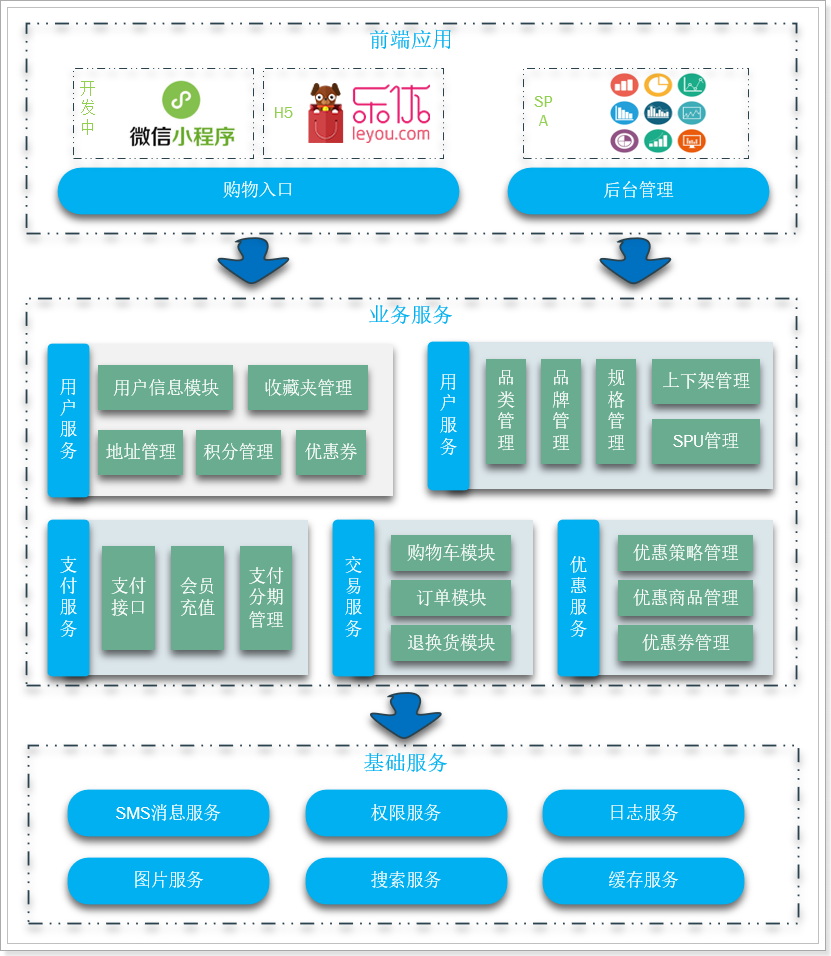

乐优商城采用了前后端分离的架构方式，

- 前端采用Vue技术栈，从使用者的角度，分为：
  - 前台门户系统：目前只支持H5，后期会加入微信小程序
  - 后台管理系统：基于Vue实现的单页应用（SPA），实现管理功能
- 服务端采用SpringCloud技术栈形成微服务集群，会包括：
  - 商品微服务：商品及商品分类、品牌、库存等的服务
  - 搜索微服务：实现搜索功能
  - 交易微服务：实现订单相关业务、实现购物车相关业务
  - 用户服务：用户的登录注册、用户信息管理等功能
  - 短信服务：完成各种短信的发送任务
  - 支付服务：对接各大支付平台
  - 授权服务：完成对用户的授权、鉴权等功能

## 2.3.技术架构图

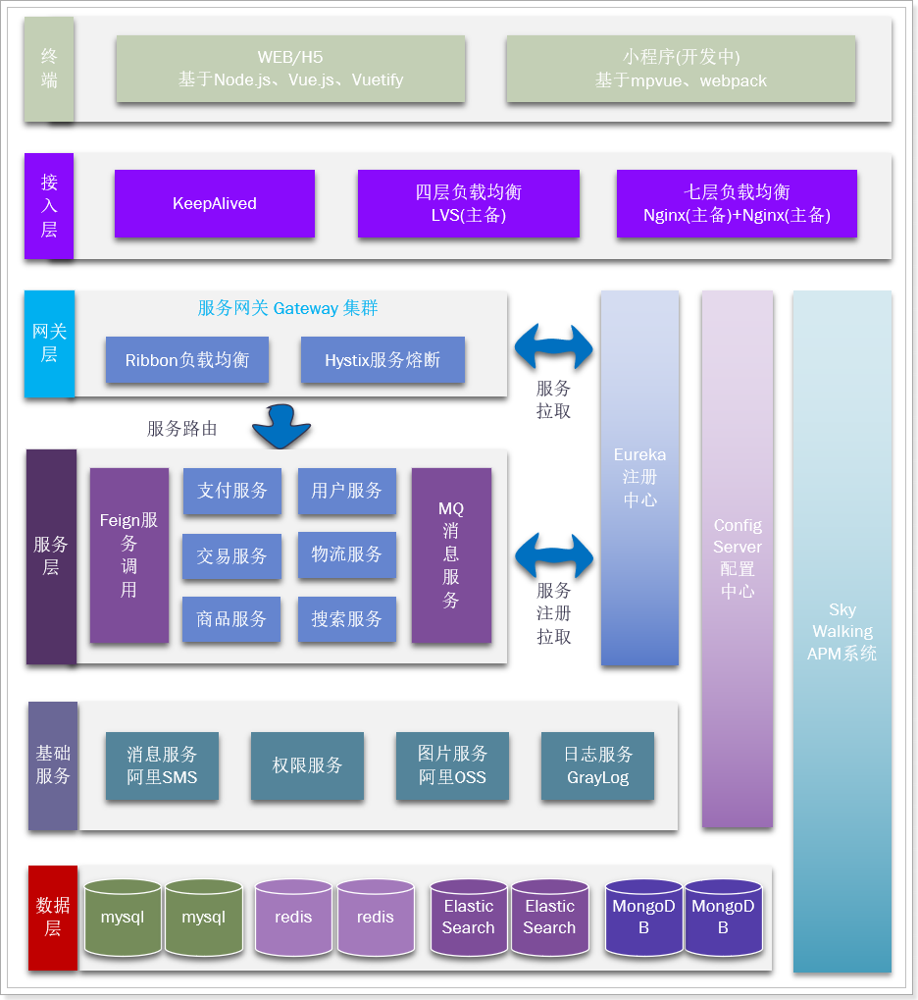


前端技术包括：

- 基础的HTML、CSS、JavaScript（基于ES6标准）
- JQuery
- Vue.js 2.0
- 基于Vue的UI框架：Vuetify、类似于BootStrap、element-ui
- 前端构建工具：WebPack，项目编译、打包工具
- 前端安装包工具：NPM
- Vue脚手架：Vue-cli
- Vue路由：vue-router
- ajax框架：axios
- 基于Vue的富文本框架：quill-editor

服务端技术包括：

- 基础的SpringMVC、Spring和MyBatis（MybatisPlus）
- Spring Boot 2
- Spring Cloud 技术栈
- OpenResty（Nginx + Lua）
- Redis、Jedis、Redission、Lua脚本
- RabbitMQ
- Elasticsearch
- nginx
- MongoDB
- Canal
- 数据库PXC集群、Mysql读写分离集群
- MyCat中间件
- JWT
- GrayLog日志系统
- Skywalking链路追踪
- Seata分布式事务
- 阿里OSS、SMS等服务
- 微信支付


# 3.后台管理页面

后台管理页面面向的是公司内部管理人员，我们采用的是基于vue的单页应用架构（SPA）。整个项目的UI部分使用的是vuetify框架。如图：


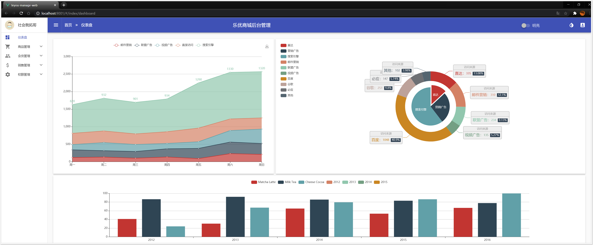


## 3.1.什么是SPA

SPA，并不是去洗澡按摩，而是Single Page Application，即单页应用。整个系统只会有一个HTML页面，和一个根Vue实例。然后需要定义很多的Vue组件，页面由许多定义好的组件组合而成。

我们的后台管理系统就是一个基于Vue的SPA的模式，其中的UI交互式通过一个名为Vue-router完成的。


## 3.2.导入项目资源

我们已经提前准备好了项目源码，在课前资料中：

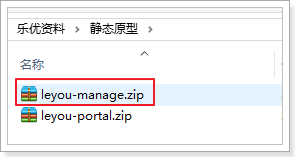 

接下来我们把这个项目导入，步骤如下：

- 解压缩
- 导入到Idea
- 运行


### 1）解压

我们解压缩，放到工作目录中：

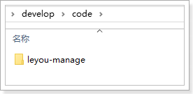 

然后在你喜欢的开发工具中打开即可。

### 2）导入

这里我们使用Idea来打开：

然后在IDE中导入新的工程：

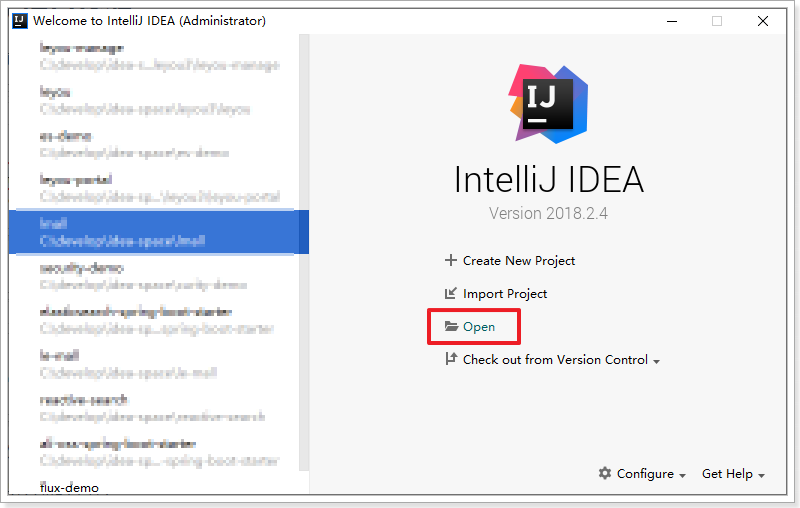

选中我们的工程：

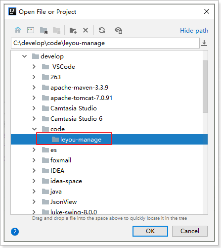 

项目结构如下：

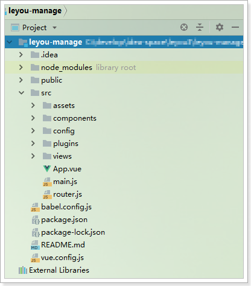 

### 3）运行

运行这个项目有2种方式：

- 直接输入命令运行
- 通过脚本运行

#### 方式一：

在Idea开发工具的左下角，有一个termnal按钮，点击即可弹出窗口，然后在窗口输入命令：

```
npm run serve
```

如图：

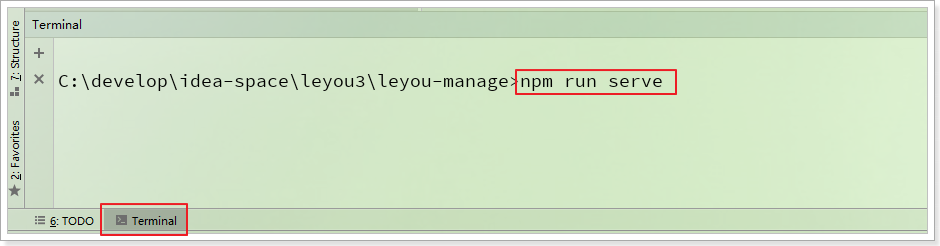


#### 方式二：

在项目中，有一个package.json文件：

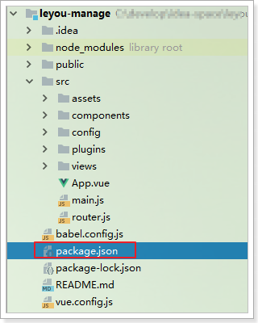 

打开文件，可以看到下面的信息：

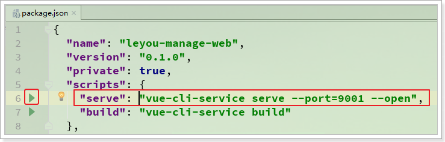

点击前面的小绿色三角形，即可启动。


### 4）页面

运行完成后，自动弹出页面：

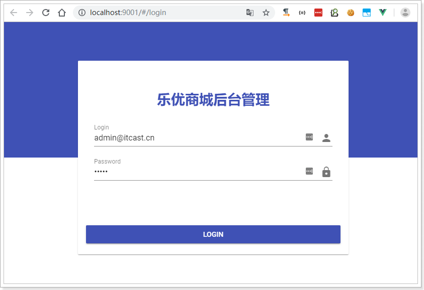


## 3.3.项目结构

在Idea中，观察项目结构：

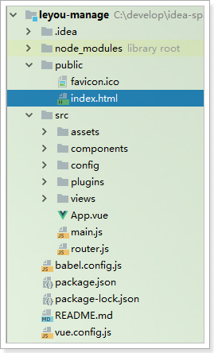 

可以看到，整个项目除了一个`index.html`外没有任何的静态页面。页面的内容定义在Vue组件中，也就是后缀名为`.vue`的文件。

### 3.3.1.单文件组件

`.vue`文件是vue组件的特殊形式，在以前我们定义一个Vue组件是这样来写的：

```js
const com = {
    template:`
		<div style="background-ground-color:red">
			<h1>hello ...</h1>
		</div>
	`,
    data(){
        return {
            
        }
    },
    methods:{
        
    }
}
Vue.component("com", com);
```

这种定义方式虽然可以实现，但是html、css、js代码混合在一起，而且在JS中编写html和css显然不够优雅。

而`.vue`文件是把三者做了分离：

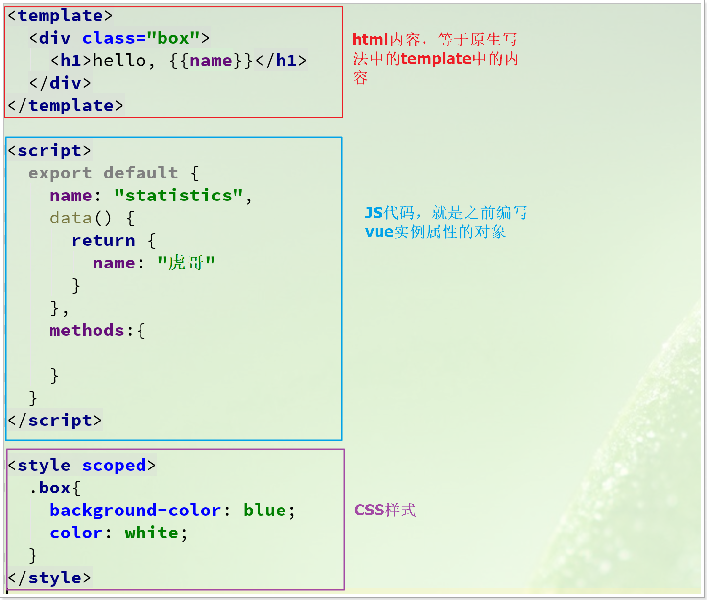

这样就可以方便我们定义组件内容了。

### 3.3.2.页面菜单

点击登录，进入首页，可以看到页面的左侧：

 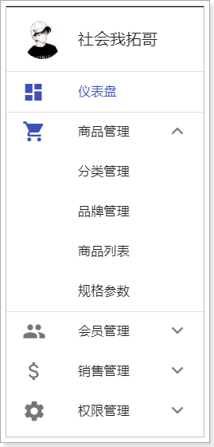

 

这个菜单的文字信息，在项目的src目录下，有一个menu.js文件，是页面的左侧菜单目录：

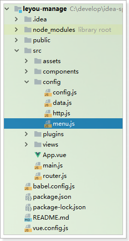 

内容如下：

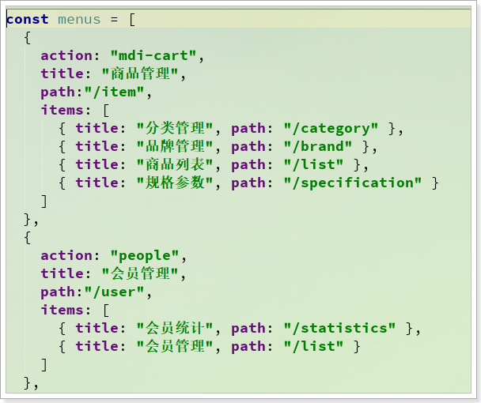 

### 3.3.3.组件路由

可以看到每个菜单都有一个path属性，点击path属性时，如何路由到对应的组件呢？

在项目目录下有一个route.js文件：

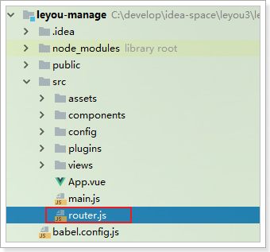 

点击打开，内容如下：

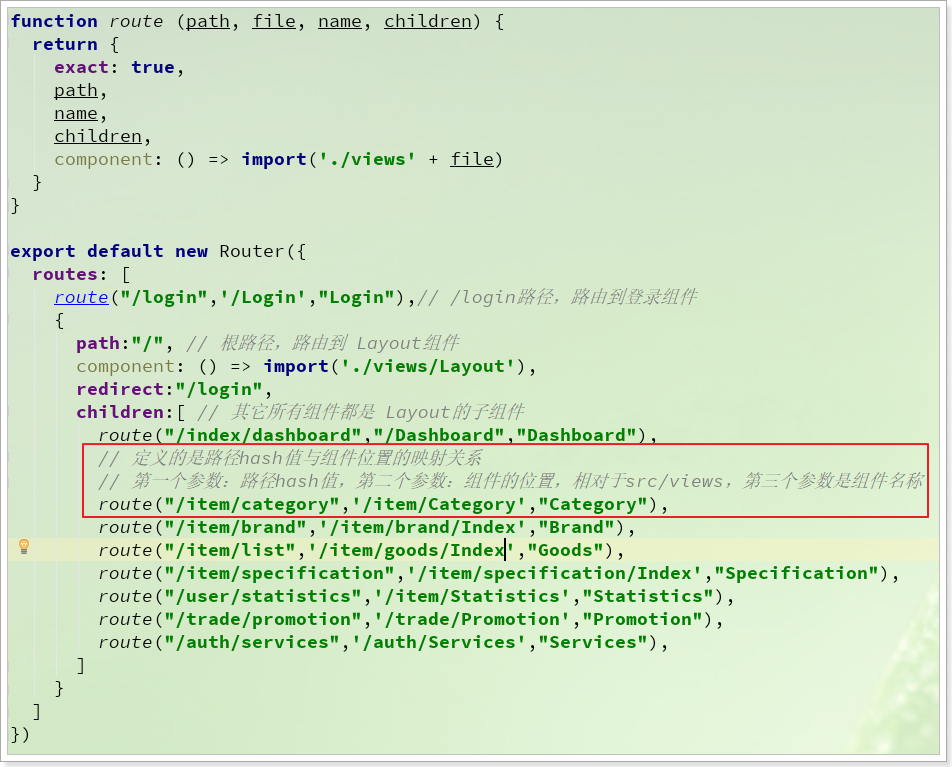

这里通过Vue-Router配置了一些路由的path路径和组件的映射关系。组件默认的路径前缀是`src/views`。例如：

```js
route("/item/category",'/item/Category',"Category"),
```

代表的意思是：

- path：`/item/category`
- 组件：`./src/views`下的`/item/Category`文件

访问path：`/item/category`，会被路由到：`./src/views/item/Category`组件：

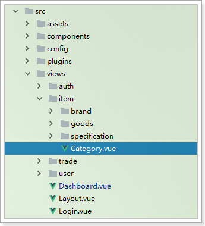 


# 4.搭建微服务集群

## 4.1.统一环境

为了保证开发环境的统一，减少不必要BUG，希望每个人都按照我的环境来配置：

- IDE：我们使用Idea，推荐版本，2019.1.4
- JDK：统一使用JDK1.8.xx
- 项目构建：maven 3.3.x以上版本即可

idea大家可以在我的课前资料中找到。另外，使用帮助大家可以参考课前资料的《idea使用指南.md》


我们在开发的过程中，为了保证以后的生产、测试环境统一。尽量都采用域名来访问项目。

二级域名：leyou.com  乐优商城

三级域名：manage.leyou.com , api.leyou.com，image.leyou.com，www.leyou.com...


因此，我们项目的包名也会以域名倒置：`com.leyou.项目名.包名`


另外，为了避免频繁修改配置文件中的IP地址，我们将注册中心、网关、mysql等服务的地址都配置在本地的hosts文件中：

- windows：修改 C:\Windows\System32\drivers\etc\hosts
- MAC：修改/etc/hosts

不是你的虚拟机，是你自己开发的电脑。

添加下面内容：

```
127.0.0.1 ly-gateway
127.0.0.1 ly-registry
192.168.206.99 ly-mysql
192.168.206.99 ly-redis
192.168.206.99 ly-mq
192.168.206.99 ly-es
```

注意：

- ly-gateway：是网关的IP地址，肯定是本机
- ly-registry：是注册中心的地址，肯定是本机
- ly-mysql：是mysql的地址，**请写你自己的mysql的正确地址**
- ly-redis：是你的redis的地址，**请写你自己的redis的正确地址**，在本地就写127.0.0.1，在虚拟机就填虚拟机地址
- ly-mq：是你的mq的地址，**请写你自己的mq的正确地址**
- ly-es：是你的elasticsearch的地址，**请写你自己的elasticsearch的正确地址**


## 4.2.项目结构

项目有许多微服务组成，而每个微服务的依赖及版本信息需要统一管理，因此需要有一个父工程。

而每个微服务本身有自己的业务，并且服务和服务间会有相互调用，需要将自身的实体类、Feign接口对外暴露出去，提供成jar包供别人加载，因此我们的项目结构是这样的：

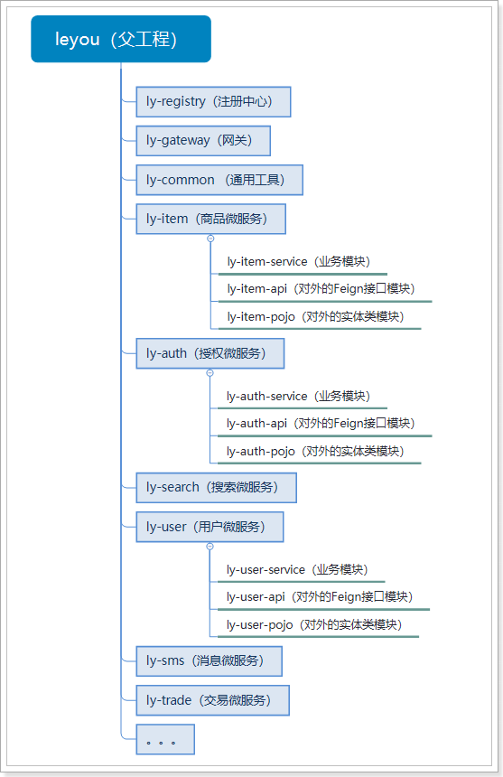 


## 4.3.父工程

创建统一的父工程：leyou，用来管理依赖及其版本，注意是创建project，而不是moudle

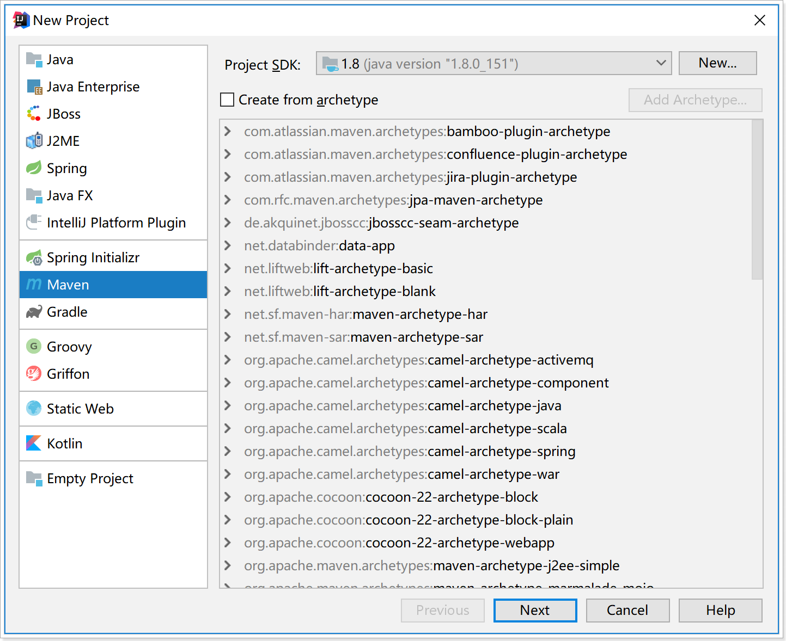

填写工程信息：

 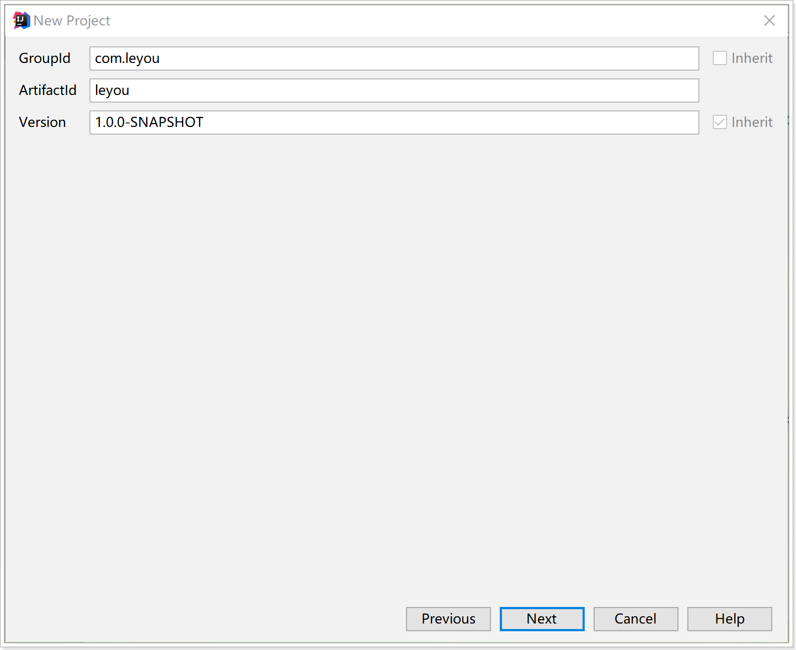

保存的位置信息：

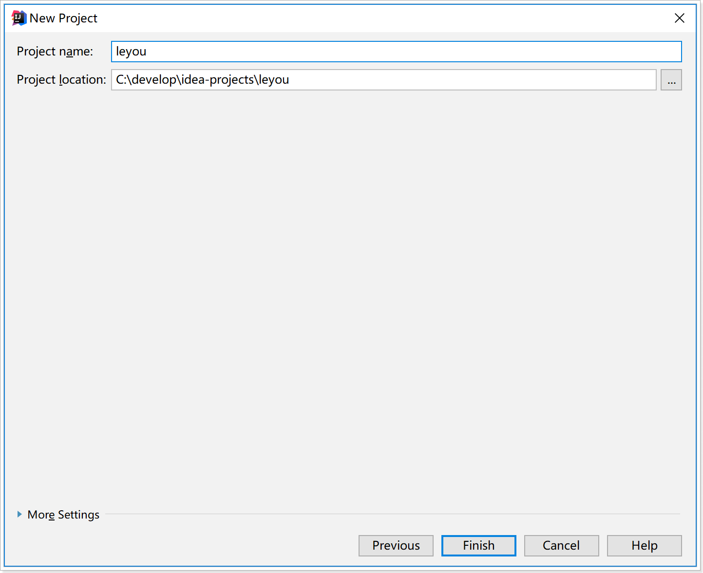


然后将pom文件修改成我这个样子：

```xml
<?xml version="1.0" encoding="UTF-8"?>
<project xmlns="http://maven.apache.org/POM/4.0.0"
         xmlns:xsi="http://www.w3.org/2001/XMLSchema-instance"
         xsi:schemaLocation="http://maven.apache.org/POM/4.0.0 http://maven.apache.org/xsd/maven-4.0.0.xsd">
    <modelVersion>4.0.0</modelVersion>

    <groupId>com.leyou</groupId>
    <artifactId>leyou</artifactId>
    <version>1.0.0-SNAPSHOT</version>

    <packaging>pom</packaging>

    <parent>
        <groupId>org.springframework.boot</groupId>
        <artifactId>spring-boot-starter-parent</artifactId>
        <version>2.1.12.RELEASE</version>
        <relativePath/>
    </parent>

    <properties>
        <project.build.sourceEncoding>UTF-8</project.build.sourceEncoding>
        <project.reporting.outputEncoding>UTF-8</project.reporting.outputEncoding>
        <java.version>1.8</java.version>
        <spring-cloud.version>Greenwich.SR5</spring-cloud.version>
        <mybatis.plus.version>3.3.0</mybatis.plus.version>
        <leyou.latest.version>1.0.0-SNAPSHOT</leyou.latest.version>
        <mysql.version>5.1.47</mysql.version>
        <ali.oss.version>3.4.2</ali.oss.version>
        <elasticsearch.version>7.4.2</elasticsearch.version>
    </properties>

    <dependencyManagement>
        <dependencies>
            <!-- springCloud -->
            <dependency>
                <groupId>org.springframework.cloud</groupId>
                <artifactId>spring-cloud-dependencies</artifactId>
                <version>${spring-cloud.version}</version>
                <type>pom</type>
                <scope>import</scope>
            </dependency>
            <!-- mysql驱动 -->
            <dependency>
                <groupId>mysql</groupId>
                <artifactId>mysql-connector-java</artifactId>
                <version>${mysql.version}</version>
            </dependency>
            <dependency>
                <groupId>com.baomidou</groupId>
                <artifactId>mybatis-plus-boot-starter</artifactId>
                <version>${mybatis.plus.version}</version>
            </dependency>
            <dependency>
                <groupId>com.aliyun.oss</groupId>
                <artifactId>aliyun-sdk-oss</artifactId>
                <version>${ali.oss.version}</version>
            </dependency>
        </dependencies>
    </dependencyManagement>

    <dependencies>
        <dependency>
            <groupId>org.apache.commons</groupId>
            <artifactId>commons-lang3</artifactId>
            <version>3.4</version>
        </dependency>
        <dependency>
            <groupId>org.projectlombok</groupId>
            <artifactId>lombok</artifactId>
        </dependency>
        <!--单元测试-->
        <dependency>
            <groupId>org.springframework.boot</groupId>
            <artifactId>spring-boot-starter-test</artifactId>
            <scope>test</scope>
        </dependency>
    </dependencies>
</project>
```

可以发现，我们在父工程中引入了SpringCloud等很多以后需要用到的依赖，以后创建的子工程就不需要自己引入了。

如果接下来创建的是一个需要**运行和启动**的子工程，需要加上SpringBoot的打包插件：

```xml
<build>
    <plugins>
        <plugin>
            <groupId>org.springframework.boot</groupId>
            <artifactId>spring-boot-maven-plugin</artifactId>
        </plugin>
    </plugins>
</build>
```


## 4.4.注册中心

### 4.4.1.创建工程

这个大家应该比较熟悉了。

我们的注册中心，起名为：ly-registry，直接创建maven项目，自然会继承父类的依赖：

选择新建module：

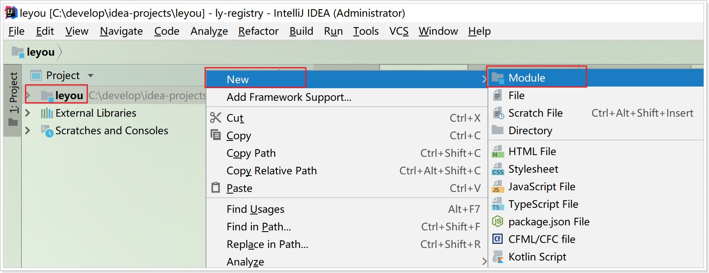


选择maven安装，但是不要选择骨架：

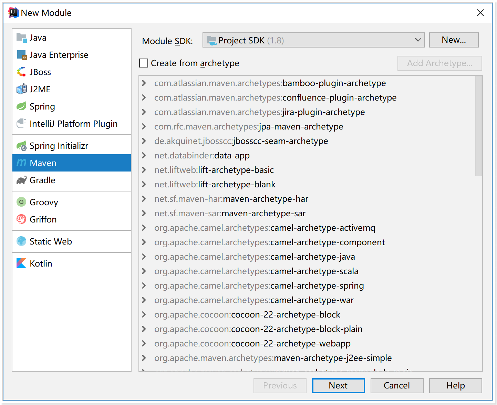

然后填写项目坐标，我们的项目名称为ly-registry:

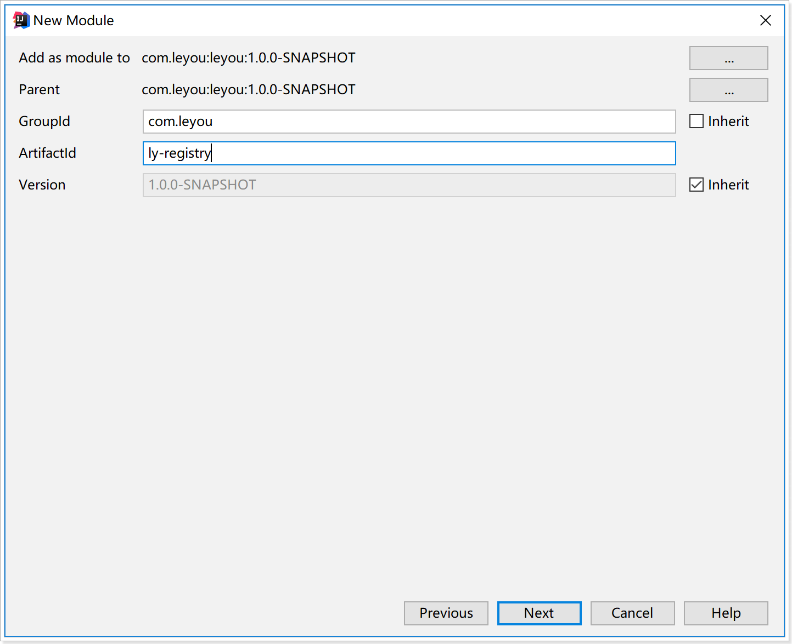

选择安装目录，因为是聚合项目，目录应该是在父工程leyou的下面：

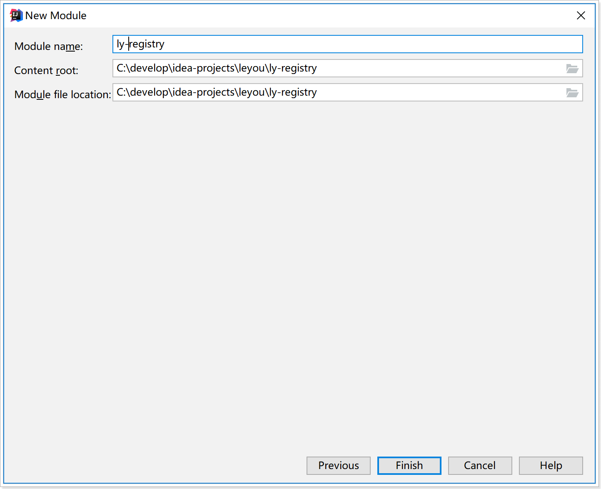


### 4.4.2.添加依赖

添加EurekaServer的依赖：

```xml
<?xml version="1.0" encoding="UTF-8"?>
<project xmlns="http://maven.apache.org/POM/4.0.0"
         xmlns:xsi="http://www.w3.org/2001/XMLSchema-instance"
         xsi:schemaLocation="http://maven.apache.org/POM/4.0.0 http://maven.apache.org/xsd/maven-4.0.0.xsd">
    <parent>
        <artifactId>leyou</artifactId>
        <groupId>com.leyou</groupId>
        <version>1.0.0-SNAPSHOT</version>
    </parent>
    <modelVersion>4.0.0</modelVersion>

    <artifactId>ly-registry</artifactId>

    <dependencies>
        <dependency>
            <groupId>org.springframework.cloud</groupId>
            <artifactId>spring-cloud-starter-netflix-eureka-server</artifactId>
        </dependency>
    </dependencies>
    <build>
        <plugins>
            <plugin>
                <groupId>org.springframework.boot</groupId>
                <artifactId>spring-boot-maven-plugin</artifactId>
            </plugin>
        </plugins>
    </build>
</project>
```

### 4.4.4.编写启动类

创建一个包：com.leyou，然后新建一个启动类：

```java
package com.leyou;

import org.springframework.boot.SpringApplication;
import org.springframework.boot.autoconfigure.SpringBootApplication;
import org.springframework.cloud.netflix.eureka.server.EnableEurekaServer;


@SpringBootApplication
@EnableEurekaServer
public class LyRegistry {
    public static void main(String[] args) {
        SpringApplication.run(LyRegistry.class, args);
    }
}
```

### 4.4.5.配置文件

```yaml
server:
  port: 10086
spring:
  application:
    name: ly-registry
eureka:
  client:
    fetch-registry: false
    register-with-eureka: false
    service-url:
      defaultZone: http://ly-registry:10086/eureka
```

### 4.4.6.项目的结构：

目前，整个项目的结构如图：

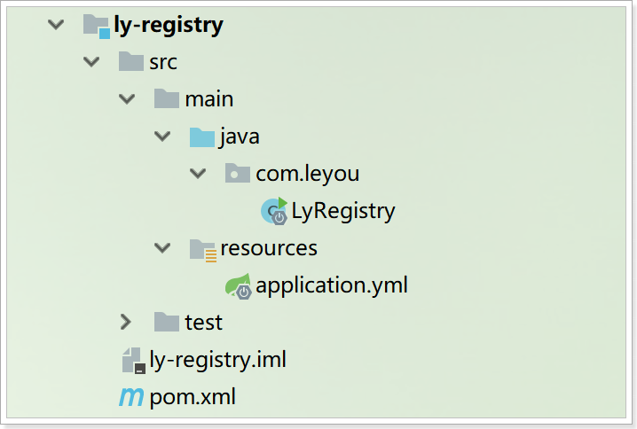


## 4.5.网关

### 4.5.1.搭建项目

步骤如下：

- 创建leyou的module，并命名
- 引入依赖
- 编写启动类
- 编写配置

#### 1）创建module

与上面类似，选择maven方式创建Module，然后填写项目名称，我们命名为：ly-gateway

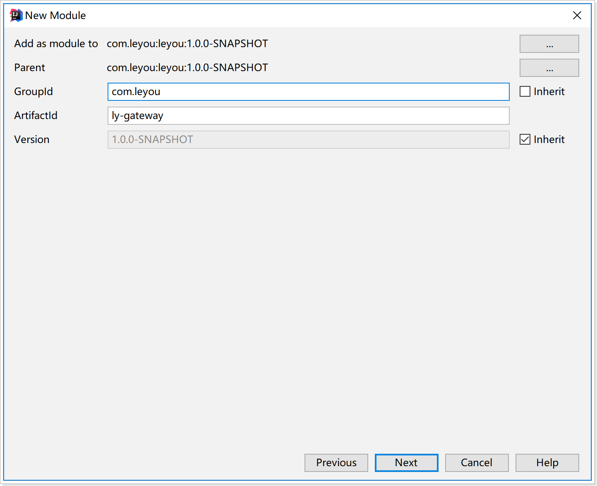

填写保存的目录：

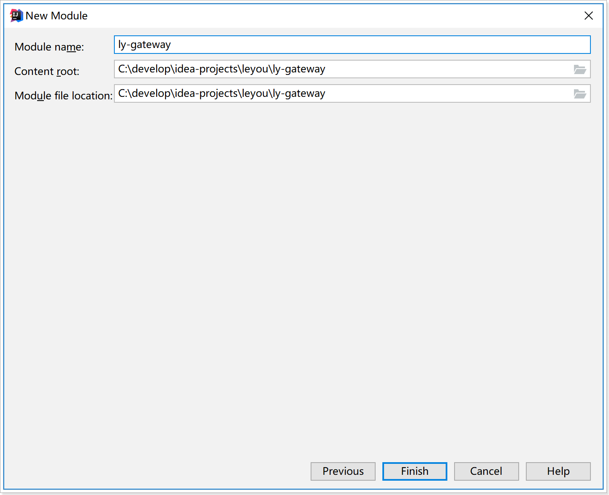

#### 2）添加依赖

这里我们需要添加Zuul和EurekaClient的依赖：

```xml
<?xml version="1.0" encoding="UTF-8"?>
<project xmlns="http://maven.apache.org/POM/4.0.0"
         xmlns:xsi="http://www.w3.org/2001/XMLSchema-instance"
         xsi:schemaLocation="http://maven.apache.org/POM/4.0.0 http://maven.apache.org/xsd/maven-4.0.0.xsd">
    <parent>
        <artifactId>leyou</artifactId>
        <groupId>com.leyou</groupId>
        <version>1.0.0-SNAPSHOT</version>
    </parent>
    <modelVersion>4.0.0</modelVersion>

    <artifactId>ly-gateway</artifactId>

    <dependencies>
        <dependency>
            <groupId>org.springframework.cloud</groupId>
            <artifactId>spring-cloud-starter-gateway</artifactId>
        </dependency>
        <dependency>
            <groupId>org.springframework.cloud</groupId>
            <artifactId>spring-cloud-starter-netflix-eureka-client</artifactId>
        </dependency>
        <dependency>
            <groupId>org.springframework.cloud</groupId>
            <artifactId>spring-cloud-starter-netflix-hystrix</artifactId>
        </dependency>
    </dependencies>
    <build>
        <plugins>
            <plugin>
                <groupId>org.springframework.boot</groupId>
                <artifactId>spring-boot-maven-plugin</artifactId>
            </plugin>
        </plugins>
    </build>
</project>
```

#### 3）编写启动类

创建一个包：`com.leyou.gateway`，然后新建一个启动类：

```java
package com.leyou.gateway;

import org.springframework.boot.SpringApplication;
import org.springframework.cloud.client.SpringCloudApplication;


@SpringCloudApplication
public class LyGateway {
    public static void main(String[] args) {
        SpringApplication.run(LyGateway.class, args);
    }
}
```


#### 4）配置文件

```yaml
server:
  port: 10010
eureka:
  client:
    service-url:
      defaultZone: http://ly-registry:10086/eureka
hystrix:
  command:
    default:
      execution.isolation.thread.timeoutInMilliseconds: 6000 # 熔断超时时长：6000ms
ribbon:
  ConnectTimeout: 500 # ribbon链接超时时长
  ReadTimeout: 2000 # ribbon读取超时时长
spring:
  application:
    name: ly-gateway
  cloud:
    gateway:
      default-filters: # 默认过滤项
      - StripPrefix=1 # 去除路由前缀
logging:
  level:
    com.leyou: debug
```

### 4.5.2.项目结构

目前，leyou下有两个子模块：

- ly-registry：服务的注册中心（EurekaServer）
- ly-api-gateway：服务网关（Zuul）

目前，服务的结构如图所示：

 	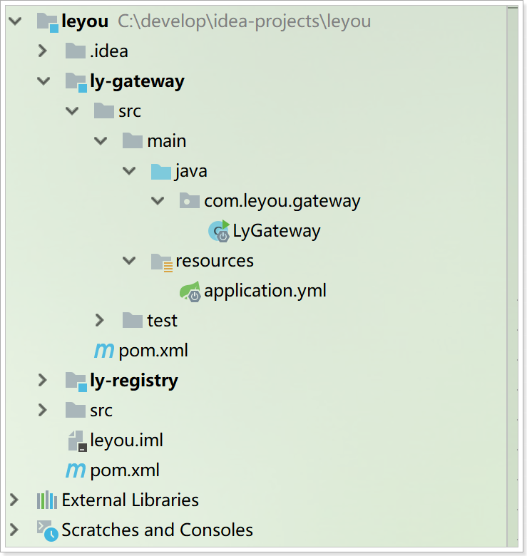


### 4.5.3.hystix降级配置

网关做请求路由转发，如果被调用的请求阻塞，需要通过Hystrix来做线程隔离和熔断，防止出现故障。

#### 1）Hystix降级过滤器

可以通过default-filter来配置，会作用于所有的路由规则。

```yaml
spring:
  application:
    name: ly-gateway
  cloud:
    gateway:
      default-filters: # 默认过滤项
      - name: Hystrix # 指定过滤工厂名称（可以是任意过滤工厂类型）
        args: # 指定过滤的参数
          name: fallbackcmd  # hystrix的指令名
          fallbackUri: forward:/hystrix/fallback # 失败后的跳转路径
```

触发降级后的fallback处理路径：/fhystrix/fallback

#### 2）处理fallback的controller

定义一个controller，用来编写失败的处理逻辑：

```java
package com.leyou.gateway.web;

import org.springframework.http.HttpStatus;
import org.springframework.http.ResponseEntity;
import org.springframework.web.bind.annotation.GetMapping;
import org.springframework.web.bind.annotation.RestController;


@RestController
public class FallbackController {

    /**
     * 默认的超时处理逻辑
     * @return 超时提醒
     */
    @GetMapping(value = "/hystrix/fallback")
    public ResponseEntity<String> fallBackController() {
        return ResponseEntity.status(HttpStatus.GATEWAY_TIMEOUT).body("请求超时！");
    }
}
```

这里的返回值是一个名为ResponseEntity的类型。

#### 3）ResponseEntity

ResponseEntity是Spring提供的结果类型，用来封装返回的HttpResponse数据，包括：

- 响应状态码：通过ResponseEntity#status(int)方法指定，可以直接指定int值，或者HttpStatus枚举
- 响应头：可以指定key、value结构
- 响应体：任意对象，处理方式类似于@ResponseBody

这种返回值方式是符合REST风格的，用Http状态码作为结果状态，用响应体封装数据。


### 4.5.4.网关限流(了解)

网关除了请求路由、身份验证，还有一个非常重要的作用：请求限流。当系统面对高并发请求时，为了减少对业务处理服务的压力，需要在网关中对请求限流，按照一定的速率放行请求。

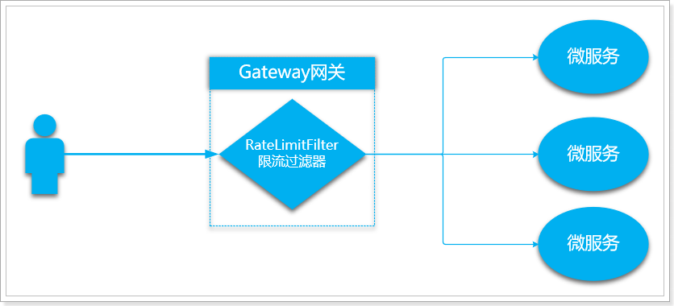

常见的限流算法包括：

- 计数器算法
- 漏桶算法
- 令牌桶算法

#### 4.5.4.1.令牌桶算法原理

SpringGateway中采用的是令牌桶算法，令牌桶算法原理：

- 准备一个令牌桶，有固定容量，一般为服务并发上限
- 按照固定速率，生成令牌并存入令牌桶，如果桶中令牌数达到上限，就丢弃令牌。
- 每次请求调用需要先获取令牌，只有拿到令牌，才继续执行，否则选择选择等待或者直接拒绝。


#### 4.5.4.2.Gateway中限流

##### 1）引入依赖

SpringCloudGateway是采用令牌桶算法，其令牌相关信息记录在redis中，因此需要引入Redis有关依赖：

```xml
<!--redis-->
<dependency>
    <groupId>org.springframework.boot</groupId>
    <artifactId>spring-boot-starter-data-redis-reactive</artifactId>
</dependency>
```

注意：这里不是普通的redis依赖，而是响应式的Redis依赖，因为SpringGateway是基于WebFlux的响应式项目。

##### 2）配置过滤条件key

Gateway会在Redis中记录令牌相关信息，我们可以自己定义令牌桶的规则，例如：

- 给不同的请求URI路径设置不同令牌桶
- 给不同的登录用户设置不同令牌桶
- 给不同的请求IP地址设置不同令牌桶

而SpringCloudGateway中给桶信息存入Redis时需要有一个KEY来标记，key的生成规则定义在`KeyResolver`接口中：

```java
public interface KeyResolver {

	Mono<String> resolve(ServerWebExchange exchange);

}
```

这个接口中的方法返回值就是给令牌桶生成的key。比如上面的三种令牌桶规则，生成key的方式如下：

- 给不同的请求URI路径设置不同令牌桶，示例代码：

  ```java
  return Mono.just(exchange.getRequest().getURI().getPath());// 获取请求URI
  ```

- 给不同的登录用户设置不同令牌桶

  ```java
  return exchange.getPrincipal().map(Principal::getName);// 获取用户
  ```

- 给不同的请求IP地址设置不同令牌桶

  ```java
  return Mono.just(exchange.getRequest().getRemoteAddress().getHostName());// 获取请求者IP
  ```

这里我们选择最后一种，使用IP地址的令牌桶key。

我们在`com.leyou.gateway.config`中定义一个类，配置一个KeyResolver的Bean实例：

```java
package com.leyou.gateway.config;

import org.springframework.cloud.gateway.filter.ratelimit.KeyResolver;
import org.springframework.context.annotation.Bean;
import org.springframework.context.annotation.Configuration;
import org.springframework.web.server.ServerWebExchange;
import reactor.core.publisher.Mono;


@Configuration
public class RateLimitConfig {
    //定义一个KeyResolver
    @Bean
    public KeyResolver ipKeyResolver() {
        return new KeyResolver() {
            @Override
            public Mono<String> resolve(ServerWebExchange exchange) {
                return Mono.just(exchange.getRequest().getRemoteAddress().getHostName());
            }
        };
        // JDK8 的Lambda写法：
        // return exchange -> Mono.just(exchange.getRequest().getRemoteAddress().getHostName());
    }
}
```

##### 3）配置桶参数

另外，令牌桶的参数需要通过yaml文件来配置，参数有2个：

- `replenishRate`：每秒钟生成令牌的速率，基本上就是每秒钟允许的最大请求数量

- `burstCapacity`：令牌桶的容量，就是令牌桶中存放的最大的令牌的数量

完整配置如下：

```yaml
spring:
  application:
    name: ly-gateway
  cloud:
    gateway:
      default-filters: # 默认过滤项
      - StripPrefix=1 # 去除路由前缀
      - name: Hystrix # 指定过滤工厂名称（可以是任意过滤工厂类型）
        args: # 指定过滤的参数
          name: fallbackcmd  # hystrix的指令名
          fallbackUri: forward:/hystrix/fallback # 失败后的跳转路径
      - name: RequestRateLimiter #请求数限流 名字不能随便写
        args:
          key-resolver: "#{@ipKeyResolver}" # 指定一个key生成器
          redis-rate-limiter.replenishRate: 2 # 生成令牌的速率
          redis-rate-limiter.burstCapacity: 2 # 桶的容量
```

这里配置了一个过滤器：RequestRateLimiter，并设置了三个参数：

- `key-resolver`：`"#{@ipKeyResolver}"`是SpEL表达式，写法是`#{@bean的名称}`，ipKeyResolver就是我们定义的Bean名称

- `redis-rate-limiter.replenishRate`：每秒钟生成令牌的速率

- `redis-rate-limiter.burstCapacity`：令牌桶的容量

这样的限流配置可以达成的效果：

- 每一个IP地址，每秒钟最多发起2次请求
- 每秒钟超过2次请求，则返回429的异常状态码


4）配置redis地址

在application.yml文件中添加redis地址信息：

```yaml
spring:
  redis:
    host: ly-redis
```


#### 4.5.4.3.安装Redis

##### 1）导入镜像

方案一：如果自己网络不错，直接下载：

```
docker pull redis
```

方案二：如果网络不太行，可以使用别人下载好的镜像包：

 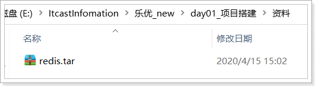

 

首先上传到Linux虚拟机，然后执行命令，导入即可；

```
docker load -i redis.tar
```

##### 2）创建挂载目录

创建一个用户：

```
useradd leyou
```

创建密码；

```
passwd leyou
```

会要求你输入密码两次，确认后创建成功。

然后进入乐优目录：

```
cd /home/leyou
```

创建一个文件夹：

```
mkdir redis
cd redis
```

创建redis 的配置文件：

```
touch redis.conf
```

修改配置：

```
vi redis.conf
```

添加一些配置：

```
databases 1
```


##### 3）运行

执行docker命令：

```powershell
docker run \
 -p 6379:6379 \
 --name ly-redis \
 -v  $PWD/redis.conf:/usr/local/etc/redis/redis.conf \
 --privileged \
 -d \
 redis \
 redis-server /usr/local/etc/redis/redis.conf
```


## 4.6.商品微服务

先看下之前的项目结构图：

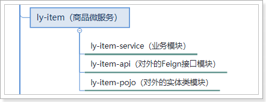 

可以知道商品微服务本身也是一个聚合工程，需要有3个子工程：

- ly-item-service：编写业务功能，业务功能会依赖于pojo实体类模块
- ly-item-api：对外提供的Feign客户端接口，接口会依赖于pojo实体类模块
- ly-item-pojo：对外提供的实体类


### 4.6.1.创建父工程ly-item

依然是使用maven构建：

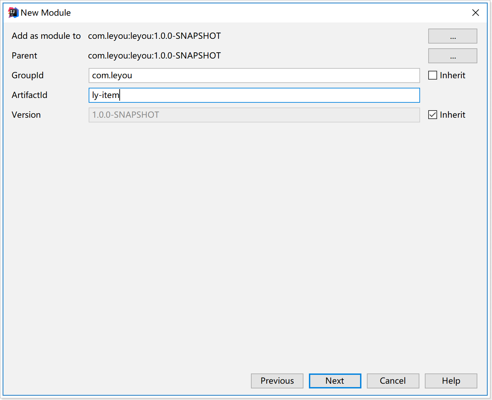

保存的位置：

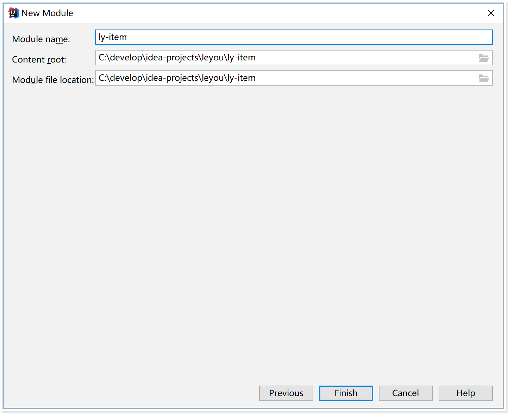

不需要任何依赖，我们可以把项目打包方式设置为pom

```xml
<?xml version="1.0" encoding="UTF-8"?>
<project xmlns="http://maven.apache.org/POM/4.0.0"
         xmlns:xsi="http://www.w3.org/2001/XMLSchema-instance"
         xsi:schemaLocation="http://maven.apache.org/POM/4.0.0 http://maven.apache.org/xsd/maven-4.0.0.xsd">
    <parent>
        <artifactId>leyou</artifactId>
        <groupId>com.leyou</groupId>
        <version>1.0.0-SNAPSHOT</version>
    </parent>
    <modelVersion>4.0.0</modelVersion>

    <artifactId>ly-item</artifactId>
    <!--打包方式：POM-->
    <packaging>pom</packaging>
</project>
```


### 4.6.2.创建ly-item-pojo

在ly-item工程上点击右键，选择new > module:

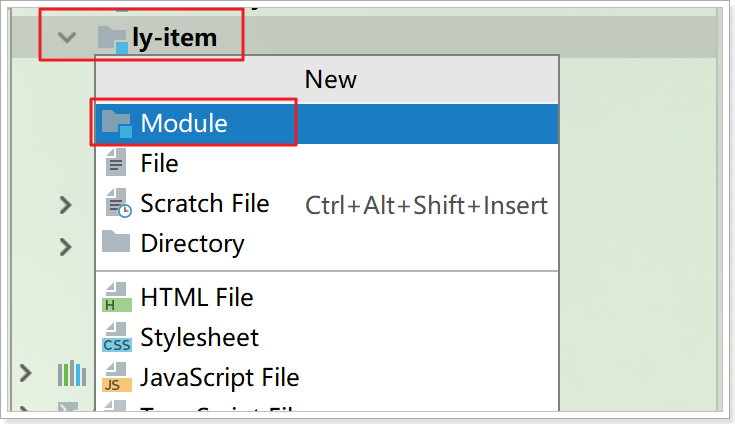

依然是使用maven构建，注意父工程是ly-item：


**注意**：接下来填写的目录结构需要自己手动完成，保存到`ly-item`下的`ly-item-pojo`目录中：

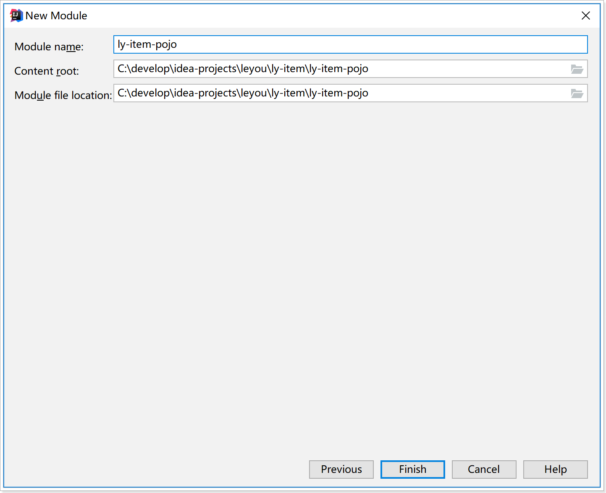

点击Finish完成。

此时的项目结构：

 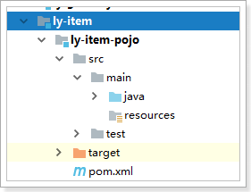 

### 4.6.3.创建ly-item-api

与`ly-item-pojo`类似，我们选择在`ly-item`上右键，新建module，然后填写项目信息：

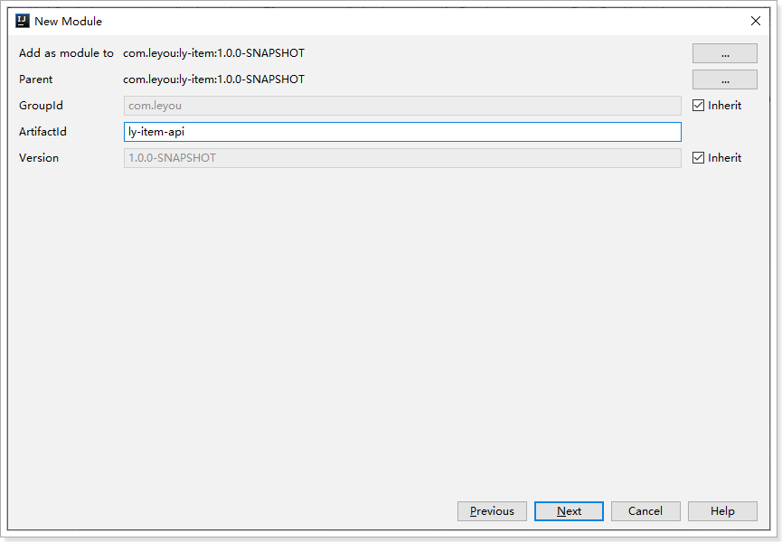

填写项目存储位置：

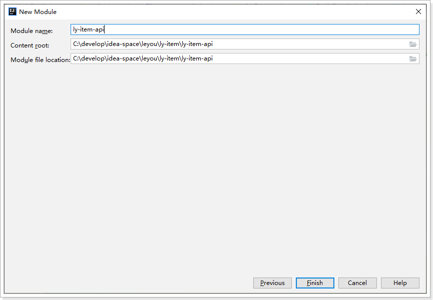

pom中添加一些依赖（**看清楚，不是在ly-item中添加，是ly-item-api**）：

```xml
<?xml version="1.0" encoding="UTF-8"?>
<project xmlns="http://maven.apache.org/POM/4.0.0"
         xmlns:xsi="http://www.w3.org/2001/XMLSchema-instance"
         xsi:schemaLocation="http://maven.apache.org/POM/4.0.0 http://maven.apache.org/xsd/maven-4.0.0.xsd">
    <parent>
        <artifactId>ly-item</artifactId>
        <groupId>com.leyou</groupId>
        <version>1.0.0-SNAPSHOT</version>
    </parent>
    <modelVersion>4.0.0</modelVersion>

    <artifactId>ly-item-api</artifactId>

    <dependencies>
        <!--feign的核心依赖，不是starter-->
        <dependency>
            <groupId>org.springframework.cloud</groupId>
            <artifactId>spring-cloud-openfeign-core</artifactId>
        </dependency>
        <!--pojo-->
        <dependency>
            <groupId>com.leyou</groupId>
            <artifactId>ly-item-pojo</artifactId>
            <version>1.0.0-SNAPSHOT</version>
        </dependency>
    </dependencies>
</project>
```


### 4.6.4.创建ly-item-service

#### 1）创建module

与`ly-item-pojo`类似，我们选择在`ly-item`上右键，新建module，然后填写项目信息：


填写存储位置，是在`/ly-item/ly-item-service`目录

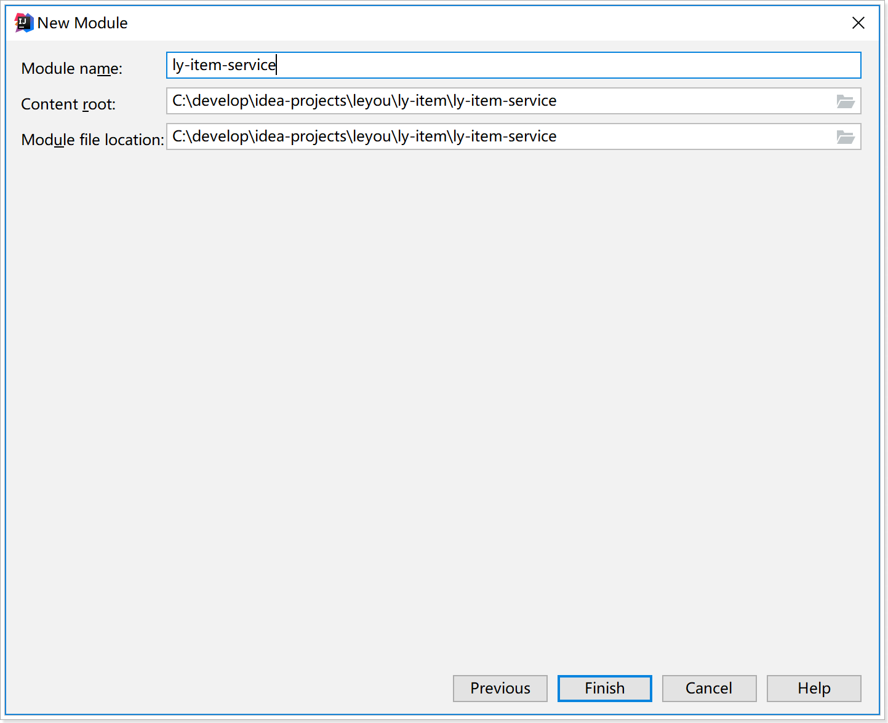

点击Finish完成。

#### 2）引入依赖

给ly-item-sepom中添加一些依赖（**看清楚，不是在ly-item中添加，是ly-item-service**）:

```xml
<?xml version="1.0" encoding="UTF-8"?>
<project xmlns="http://maven.apache.org/POM/4.0.0"
         xmlns:xsi="http://www.w3.org/2001/XMLSchema-instance"
         xsi:schemaLocation="http://maven.apache.org/POM/4.0.0 http://maven.apache.org/xsd/maven-4.0.0.xsd">
    <parent>
        <artifactId>ly-item</artifactId>
        <groupId>com.leyou</groupId>
        <version>1.0.0-SNAPSHOT</version>
    </parent>

    <modelVersion>4.0.0</modelVersion>

    <artifactId>ly-item-service</artifactId>

    <dependencies>
        <!--web启动器-->
        <dependency>
            <groupId>org.springframework.boot</groupId>
            <artifactId>spring-boot-starter-web</artifactId>
        </dependency>
        <!--eureka客户端-->
        <dependency>
            <groupId>org.springframework.cloud</groupId>
            <artifactId>spring-cloud-starter-netflix-eureka-client</artifactId>
        </dependency>
        <!--数据库驱动-->
        <dependency>
            <groupId>mysql</groupId>
            <artifactId>mysql-connector-java</artifactId>
        </dependency>
        <!--实体类-->
        <dependency>
            <groupId>com.leyou</groupId>
            <artifactId>ly-item-pojo</artifactId>
            <version>1.0.0-SNAPSHOT</version>
        </dependency>
    </dependencies>
    <build>
        <plugins>
            <plugin>
                <groupId>org.springframework.boot</groupId>
                <artifactId>spring-boot-maven-plugin</artifactId>
            </plugin>
        </plugins>
    </build>
</project>
```

#### 3）启动类

在项目中创建包：`com.leyou.item`，然后创建一个启动类：

```java
package com.leyou.item;

import org.springframework.boot.SpringApplication;
import org.springframework.boot.autoconfigure.SpringBootApplication;


@SpringBootApplication
public class LyItemApplication {
    public static void main(String[] args) {
        SpringApplication.run(LyItemApplication.class, args);
    }
}
```

#### 4）yaml配置

在项目的`resources`目录中，新建application.yml文件，加入下面内容：

```yaml
server:
  port: 8081
spring:
  application:
    name: item-service
  datasource:
    driver-class-name: com.mysql.jdbc.Driver
    url: jdbc:mysql://ly-mysql:3306/heima?useUnicode=true&characterEncoding=utf8&allowMultiQueries=true&useSSL=false
    username: root
    password: root
eureka:
  client:
    service-url:
      defaultZone: http://ly-registry:10086/eureka
logging:
  level:
    com.leyou: debug
```


#### 5）网关路由

最后，还要到ly-gateway的application.yml中给当前项目设置路由规则：

```yaml
spring:
  application:
    name: ly-gateway
  cloud:
    gateway:
      default-filters: # 默认过滤项
      - StripPrefix=1 # 去除路由前缀
      - name: Hystrix # 指定过滤工厂名称（可以是任意过滤工厂类型）
        args: # 指定过滤的参数
          name: fallbackcmd  # hystrix的指令名
          fallbackUri: forward:/hystrix/fallback # 失败后的跳转路径
      - name: RequestRateLimiter #请求数限流 名字不能随便写
        args:
          key-resolver: "#{@ipKeyResolver}"
          redis-rate-limiter.replenishRate: 2
          redis-rate-limiter.burstCapacity: 2
      routes:
      - id: item-service # 商品微服务
        uri: lb://item-service
        predicates:
        - Path=/item/**
```

这里的路由路径是：`/item/**`，因此要访问到商品微服务，请求路径需要以`/item`开头。


### 4.6.5.项目结构

整个商品微服务的结构图：

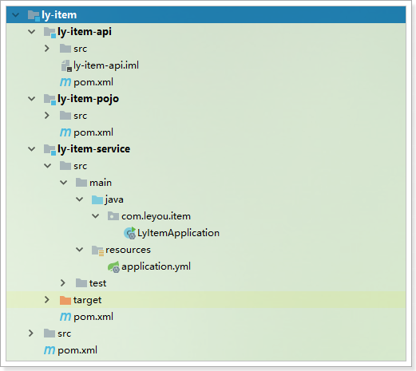 


## 4.7.通用工具模块

有些工具类或通用的内容，我们希望各个服务共享，因此需要创建一个工具模块：`ly-common`

### 4.7.1.创建common工程

使用maven来构建module：

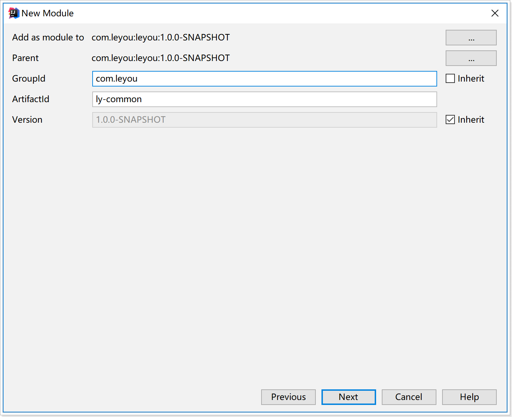

位置信息：

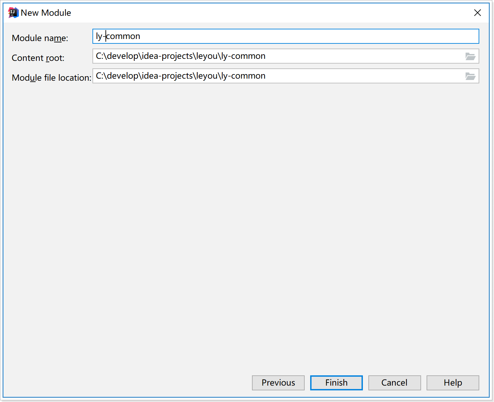


### 4.7.2.引入工具类

课前资料中提供了一些工具类：

 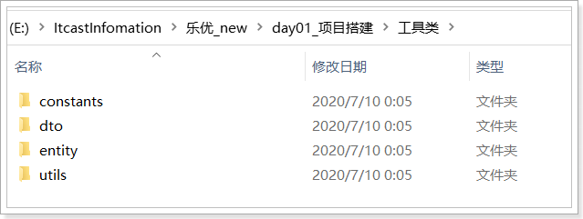

 

在`ly-common`中创建一个包：`com.leyou.common`，然后把资料中的四个文件夹拷贝进去：

 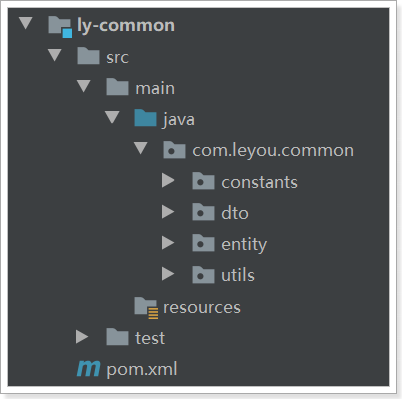

 

这些工具类有一些依赖的jar，需要在pom文件中引入：

```xml
<?xml version="1.0" encoding="UTF-8"?>
<project xmlns="http://maven.apache.org/POM/4.0.0"
         xmlns:xsi="http://www.w3.org/2001/XMLSchema-instance"
         xsi:schemaLocation="http://maven.apache.org/POM/4.0.0 http://maven.apache.org/xsd/maven-4.0.0.xsd">
    <parent>
        <artifactId>leyou</artifactId>
        <groupId>com.leyou</groupId>
        <version>1.0.0-SNAPSHOT</version>
    </parent>
    <modelVersion>4.0.0</modelVersion>

    <artifactId>ly-common</artifactId>

    <dependencies>
        <dependency>
            <groupId>javax.servlet</groupId>
            <artifactId>javax.servlet-api</artifactId>
            <version>3.1.0</version>
        </dependency>
        <dependency>
            <groupId>org.springframework.boot</groupId>
            <artifactId>spring-boot-starter-logging</artifactId>
        </dependency>
        <dependency>
            <groupId>com.fasterxml.jackson.core</groupId>
            <artifactId>jackson-databind</artifactId>
            <version>2.9.8</version>
            <scope>compile</scope>
        </dependency>
        <dependency>
            <groupId>org.springframework</groupId>
            <artifactId>spring-web</artifactId>
        </dependency>
        <dependency>
            <groupId>org.springframework</groupId>
            <artifactId>spring-context</artifactId>
        </dependency>
        <dependency>
            <groupId>org.aspectj</groupId>
            <artifactId>aspectjweaver</artifactId>
        </dependency>
        <dependency>
            <groupId>org.springframework</groupId>
            <artifactId>spring-beans</artifactId>
            <scope>compile</scope>
        </dependency>
        <dependency>
            <groupId>joda-time</groupId>
            <artifactId>joda-time</artifactId>
        </dependency>
    </dependencies>
</project>
```


# 5.统一异常处理

在项目中出现异常是在所难免的，但是出现异常后怎么处理，这就很有学问了。

## 5.1.场景预设

### 5.1.1.场景

我们预设这样一个场景，假如我们做新增商品，需要接收下面的参数：

```
price：价格
name：名称
```

然后对数据做简单校验：

- 价格不能为空
- 名称不能为空

新增时，自动形成ID，然后随商品对象一起返回

### 5.1.2.代码

在ly-item-service中编写实体类：

```java
package com.leyou.item.entity;
@Data
public class Item {
    private Integer id;
    private String name;
    private Long price;
}
```

在ly-item-service中编写业务：

service：

```java
package com.leyou.item.service;

import com.leyou.item.entity.Item;
import org.springframework.stereotype.Service;

import java.util.Random;

@Service
public class ItemService {
    
    public Item saveItem(Item item){
        // 判断价格是否为空
        if(item.getPrice() == null){
            throw new RuntimeException("价格不能为空！");
        }
        if(item.getName() == null){
            throw new RuntimeException("名称不能为空！");
        }

        // 随机生成id，模拟数据库的新增
        int id = new Random().nextInt(100);
        item.setId(id);
        // 返回新增之后的对象，回显id
        return item;
    }
}

```

- 这里临时使用随机生成id，然后直接返回，没有做数据库操作

controller：

```java
package com.leyou.item.web;

import com.leyou.item.entity.Item;
import com.leyou.item.service.ItemService;
import org.springframework.beans.factory.annotation.Autowired;
import org.springframework.http.HttpStatus;
import org.springframework.http.ResponseEntity;
import org.springframework.web.bind.annotation.PostMapping;
import org.springframework.web.bind.annotation.RequestMapping;
import org.springframework.web.bind.annotation.RestController;


@RestController
@RequestMapping("item")
public class ItemController {

    @Autowired
    private ItemService itemService;

    @PostMapping
    public ResponseEntity<Item> saveItem(Item item){
        try {
            Item result = itemService.saveItem(item);
            // 新增成功, 返回201
            return ResponseEntity.status(HttpStatus.CREATED).body(result);
        } catch (Exception e) {
            // 失败，返回400
            return ResponseEntity.status(HttpStatus.BAD_REQUEST).body(null);
        }
    }
}
```

ResponseEntity是一个Spring提供的，用于封装响应结果的实体类。可以自定义响应状态码、响应头、响应头。

- `ResponseEntity.status(HttpStatus.CREATED)`：用于指定这次响应的状态码，HttpStatus枚举中定义了常见的返回状态码。另外，ResponseEntity提供了几个便捷方法，代表常用状态码：
  - `ResponseEntity.ok()`：代表200
  - `ResponseEntity.noContent()`：代表204

- `.body(result)`：用于指定这次响应的返回值结果，就是响应体


### 5.1.3.测试

接下来，启动项目，通过任意Http客户端工具测试：

当请求正常时，得到201状态码，代表新增成功：

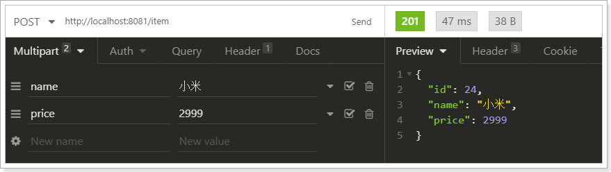

当缺少参数时：

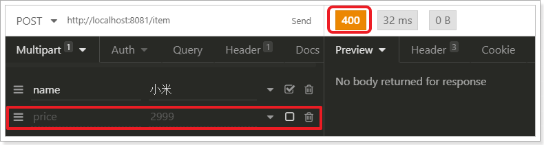

得到400状态码，说明新增失败，请求参数有误


## 5.2.统一异常处理

我们虽然完成了异常的处理，但是每一个controller中的方法都要写类似异常捕获和处理代码。

实际开发中，会有非常多的类和方法，每个都写实在是不方便。

Spring提供了一个通用的异常处理器`ControllerAdvice`，可以非常方便的帮助我们实现统一的异常处理。


### 5.2.1.定义异常处理器

为了让这个异常处理可以在每一个微服务中使用，我们定义到`ly-common`中。在`ly-common`中创建一个新的包：`com.leyou.common.advice`，然后创建一个类：

```java
package com.leyou.common.advice;

import lombok.extern.slf4j.Slf4j;
import org.springframework.http.ResponseEntity;
import org.springframework.web.bind.annotation.ControllerAdvice;
import org.springframework.web.bind.annotation.ExceptionHandler;

@ControllerAdvice
public class ControllerExceptionAdvice {

    /**
     * 统一异常处理方法，@ExceptionHandler(RuntimeException.class)声明这个方法处理RuntimeException这样的异常
     * @param e 捕获到的异常
     * @return 返回给页面的状态码和信息
     */
    @ExceptionHandler(RuntimeException.class)
    public ResponseEntity<String> handleLyException(RuntimeException e) {
        return ResponseEntity.status(400).body(e.getMessage());
    }
}
```

代码解读：

- `@ControllerAdvice`：添加了@ControllerAdvice的类，默认情况下，会拦截所有加了`@Controller`的类

  

- `@ExceptionHandler(RuntimeException.class)`：作用在方法上，声明要处理的异常类型，这里指定的是`RuntimeException`。因此任意`Controller`抛出`RuntimeException`都会被当前方法捕获和处理

  - 参数：捕获到的异常
  - 返回值：给页面的提示信息。这里返回值中不仅给出了状态码400，还给出了异常的message


### 5.2.2.引入advice

虽然写好了advice，但是是在`ly-common`中，要在商品微服务使用，比如引入依赖，并且让这个Bean加入Spring容器才可以。

#### 1）引入依赖

首先在`ly-item-service`中引入`ly-common`的依赖：

```xml
<!--ly-common-->
<dependency>
    <groupId>com.leyou</groupId>
    <artifactId>ly-common</artifactId>
    <version>1.0.0-SNAPSHOT</version>
</dependency>
```

#### 2）扫描包

要让这个类生效，必须让项目可以扫描到这个类所在的包，将其加入Spring容器。我们在`ly-item-service`的启动类的注解上添加扫描包信息：

```java

@SpringBootApplication(scanBasePackages = {"com.leyou.item", "com.leyou.common.advice"})
public class LyItemApplication {
    public static void main(String[] args) {
        SpringApplication.run(LyItemApplication.class, args);
    }
}
```

这里添加了两个扫描包：

- 一个是当前项目扫描包
- 一个是刚刚定义的advice的扫描包

#### 3）测试

首先删除ItemController中的异常处理代码：

```java
package com.leyou.item.web;

import com.leyou.item.entity.Item;
import com.leyou.item.service.ItemService;
import org.springframework.beans.factory.annotation.Autowired;
import org.springframework.http.HttpStatus;
import org.springframework.http.ResponseEntity;
import org.springframework.web.bind.annotation.PostMapping;
import org.springframework.web.bind.annotation.RequestMapping;
import org.springframework.web.bind.annotation.RestController;


@RestController
@RequestMapping("item")
public class ItemController {

    @Autowired
    private ItemService itemService;

    @PostMapping
    public ResponseEntity<Item> saveItem(Item item) {
        Item result = itemService.saveItem(item);
        // 新增成功, 返回201
        return ResponseEntity.status(HttpStatus.CREATED).body(result);
    }
}
```


再次启动项目，测试一下

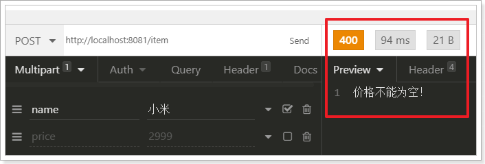 

可以看到异常结果状态码和消息，说明统一异常处理成功了！

## 5.3.自定义异常

在刚才的异常处理中，我们返回的状态码写死为400，这样显然是有问题的。不同的业务异常，应该返回不同状态码。

### 5.3.1.异常状态码

按照Rest风格，可以有下列状态：

| 状态码 | 说明                                     |
| ------ | ---------------------------------------- |
| 200    | 执行成功，一般是GET请求执行成功          |
| 201    | 新增业务成功，一般会返回资源访问路径     |
| 204    | 执行成功，但是没有返回值，比如删除成功后 |
| 400    | 请求参数有误                             |
| 401    | 未登录或登录失效                         |
| 403    | 没有访问权限                             |
| 404    | 资源不存在                               |
| 405    | 请求方式不正确，应该用GET的用了POST      |
| 406    | 响应格式与请求格式不匹配                 |
| 413    | 请求体过大                               |
| 500    | 服务端异常                               |
| 502    | 请求超时                                 |


### 5.3.2.自定义异常

只有处理业务的时候知道应该返回怎样的状态码，因此需要在抛出异常的地方把状态码信息封装到异常中，并携带到统一异常处理的地方去获取。

但是普通异常并不能封装状态码，所以需要我们自定义异常。

我们在ly-common中定义一个自定义异常：

```java
package com.leyou.common.exception;

import lombok.Getter;


@Getter
public class LyException extends RuntimeException {
    /**
     * 异常状态码信息
     */
    private int status;

    public LyException(int status) {
        this.status = status;
    }

    public LyException(int status, String message) {
        super(message);
        this.status = status;
    }

    public LyException(int status, String message, Throwable cause) {
        super(message, cause);
        this.status = status;
    }

    public LyException(int status, Throwable cause) {
        super(cause);
        this.status = status;
    }
}
```


### 5.3.3.使用自定义异常

我们修改ItemService代码，使用自定义异常：

```java
@Service
public class ItemService {
    
    public Item saveItem(Item item){
        // 判断价格是否为空
        if(item.getPrice() == null){
            throw new LyException(400, "价格不能为空！");
        }
        if(item.getName() == null){
            throw new LyException(400, "名称不能为空！");
        }

        // 随机生成id，模拟数据库的新增
        int id = new Random().nextInt(100);
        item.setId(id);
        // 返回新增之后的对象，回显id
        return item;
    }
}
```


### 5.3.4.在ControllerAdvice接收异常信息

我们修改处理的异常类型为`LyException`，并从异常中获取状态码信息：

```java
package com.leyou.common.advice;

@ControllerAdvice
@Slf4j
public class ControllerExceptionAdvice {

    /**
     * 统一异常处理方法，@ExceptionHandler(RuntimeException.class)声明这个方法处理RuntimeException这样的异常
     * @param e 捕获到的异常
     * @return 返回给页面的状态码和信息
     */
    @ExceptionHandler(LyException.class)
    public ResponseEntity<String> handleLyException(LyException e) {
        return ResponseEntity.status(e.getStatus()).body(e.getMessage());
    }
}
```


### 5.3.5.统一日志记录

在ly-common的`com.leyou.common.advice`包下，新建一个类，利用Aop拦截所有的Service方法，对执行结果日志进行记录。

```java
package com.leyou.common.advice;

import com.leyou.common.exception.LyException;
import lombok.extern.slf4j.Slf4j;
import org.aspectj.lang.ProceedingJoinPoint;
import org.aspectj.lang.annotation.Around;
import org.aspectj.lang.annotation.Aspect;
import org.springframework.stereotype.Component;

import java.util.Arrays;


@Slf4j
@Aspect
@Component
public class CommonLogAdvice {

    @Around("within(@org.springframework.stereotype.Service *)")
    public Object handleExceptionLog(ProceedingJoinPoint jp) throws Throwable {
        try {
            // 记录方法进入日志
            log.debug("{}方法准备调用，参数: {}", jp.getSignature(), Arrays.toString(jp.getArgs()));
            long a = System.currentTimeMillis();
            // 调用切点方法
            Object result = jp.proceed();
            // 记录方法结束日志
            log.debug("{}方法调用成功，执行耗时{}", jp.getSignature(), System.currentTimeMillis() - a);
            return result;
        } catch (Throwable throwable) {
            log.error("{}方法执行失败，原因：{}", jp.getSignature(), throwable.getMessage(), throwable);
            // 判断异常是否是LyException
            if(throwable instanceof LyException){
                // 如果是，不处理，直接抛
                throw throwable;
            }else{
                // 如果不是，转为LyException
                throw new LyException(500, throwable);
            }
        }
    }
}
```


# 6.安装MySQL及导入数据

大家需要在Linux虚拟机中安装Mysql，因为后面我们要用到Linux中的mysql的一些功能。如果以前安装过，也请按照下面的步骤重新安装(先删除之前的docker容器)。

## 6.1.导入mysql镜像

如果网络环境很好的同学，可以自己拉取镜像：

```
docker pull mysql:5.7.25
```


如果网络环境一般，可以使用课前资料提供的MySQL镜像包：

 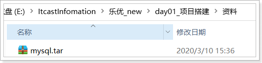

 

然后，上传到虚拟机中的`/tmp`目录，然后执行命令：

```shell
cd /tmp
docker load -i mysql.tar
```


## 6.2.创建本地卷

 创建一个新用户：

```
useradd leyou
```

设置密码

```
passwd leyou
```

然后会提示要求你输入密码，两次确认后密码设置完成。


进入leyou用户的目录：

```
cd /home/leyou
```


创建文件夹并进入：

```
mkdir mysql
cd mysql
```


## 6.3.安装mysql

执行docker命令：

```shell
docker run \
 -p 3306:3306 \
 --name ly-mysql \
 -v $PWD/conf:/etc/mysql/conf.d \
 -v $PWD/logs:/logs \
 -v $PWD/data:/var/lib/mysql \
 -e MYSQL_ROOT_PASSWORD=root \
 --privileged \
 -d \
 mysql:5.7.25
```

关键信息说明：

- ` -v $PWD/conf:/etc/mysql/conf.d`：是将当前目录的`conf`目录与docker容器中的`/etc/mysql/conf.d`目录绑定，可以自己指定配置文件

自定义配置文件：

```
vi conf/my.cnf
```

然后添加下面内容：

```
[mysqld]
skip-name-resolve
character_set_server=utf8
datadir=/var/lib/mysql
server-id=1000
```

重启mysql：

```
docker restart mysql
```


## 6.4.导入数据

通过Navicat连接MySQL，并执行课前资料提供的leyou.sql脚本


