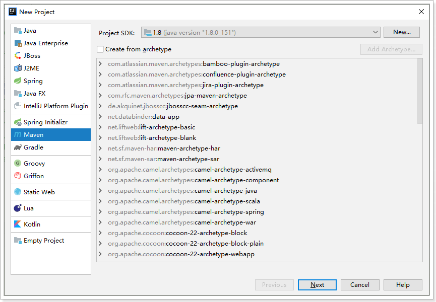

# day02-分类管理


# 0.学习目标

- 能利用Nginx实现反向代理
- 能使用mybatis-plus完成数据库操作
- 能实现商品分类查询业务
- 能使用Gateway解决跨域问题


# 1.域名访问

我们现在访问页面使用的是：http://localhost:9001

有没有什么问题？

实际开发中，会有不同的环境：

- 开发环境：自己的电脑
- 测试环境：提供给测试人员使用的环境
- 预发布环境：数据是和生成环境的数据一致，运行最新的项目代码进去测试
- 生产环境：项目最终发布上线的环境

如果不同环境使用不同的ip去访问，可能会出现一些问题。为了保证所有环境的一致，我们会在各种环境下都使用域名来访问。

我们将使用以下域名：

- 主域名是：www.leyou.com，
- 管理系统域名：manage.leyou.com
- 网关域名：api.leyou.com
- 图片的域名：image.leyou.com
- ...

但是开发环境下，我们希望这些域名指向的还是我们本机的某个端口。

那么，当我们在浏览器输入一个域名时，浏览器是如何找到对应服务的ip和端口的呢？

## 1.1.域名解析

一个域名一定会被解析为一个或多个ip。这一般会包含两步：

- 本地域名解析

  浏览器会首先在本机的hosts文件中查找域名映射的IP地址，如果查找到就返回IP ，没找到则进行域名服务器解析，一般本地解析都会失败，因为默认这个文件是空的。

  - Windows下的hosts文件地址：C:/Windows/System32/drivers/etc/hosts
  - Linux下的hosts文件所在路径： /etc/hosts 

  样式：

  ```
  # My hosts
  127.0.0.1 localhost
  0.0.0.0 account.jetbrains.com
  127.0.0.1 www.xmind.net
  ```

- 域名服务器解析

  本地解析失败，才会进行域名服务器解析，域名服务器就是网络中的一台计算机，里面记录了所有注册备案的域名和ip映射关系，一般只要域名是正确的，并且备案通过，一定能找到。


我们可以伪造本地的hosts文件，实现对域名的解析。修改本地的host为：

```
127.0.0.1 api.leyou.com
127.0.0.1 manage.leyou.com
127.0.0.1 www.leyou.com
127.0.0.1 image.leyou.com
```

这样就实现了域名的关系映射了。

每次在C盘寻找hosts文件并修改是非常麻烦的，给大家推荐一个快捷修改host的工具，在课前资料中可以找到：

 

效果：

 

我们添加了两个映射关系：

- `127.0.0.1 api.leyou.com` ：我们的网关gateway
- `127.0.0.1 manage.leyou.com`：我们的后台系统地址
- `127.0.0.1 www.leyou.com`：我们的首页地址
- `127.0.0.1 image.leyou.com`：我们的图片地址

现在，ping一下域名试试是否畅通：

 

OK！

如果加上day01我们加入了hosts，现在hosts是这样的：

```
127.0.0.1 ly-gateway
127.0.0.1 ly-registry
192.168.206.99 ly-mysql
192.168.206.99 ly-redis
192.168.206.99 ly-mq
192.168.206.99 ly-es
127.0.0.1 api.leyou.com
127.0.0.1 manage.leyou.com
127.0.0.1 www.leyou.com
127.0.0.1 image.leyou.com
```


## 1.2.反向代理

虽然域名解决了，但是现在如果我们要访问，还得自己加上端口：`http://manage.taotao.com:9001`。

这就不够优雅了。我们希望的是直接域名访问：`http://manage.taotao.com`。这种情况下端口默认是80，如何才能把请求转移到9001端口呢？

这里就要用到反向代理工具：Nginx

### 1.2.1.认识Nginx

*Nginx* (engine x) 是一个高性能的[HTTP](https://baike.baidu.com/item/HTTP)和[反向代理](https://baike.baidu.com/item/反向代理/7793488)web服务器，同时也提供了IMAP/POP3/SMTP[服务](https://baike.baidu.com/item/服务/100571)。Nginx是由伊戈尔·赛索耶夫为[俄罗斯](https://baike.baidu.com/item/俄罗斯/125568)访问量第二的Rambler.ru站点（俄文：Рамблер）开发的，第一个公开版本0.1.0发布于2004年10月4日。

其特点是占有内存少，[并发](https://baike.baidu.com/item/并发/11024806)能力强，事实上nginx的并发能力在同类型的网页服务器中表现较好，中国大陆使用nginx网站用户有：百度、[京东](https://baike.baidu.com/item/京东/210931)、[新浪](https://baike.baidu.com/item/新浪/125692)、[网易](https://baike.baidu.com/item/网易/185754)、[腾讯](https://baike.baidu.com/item/腾讯/112204)、[淘宝](https://baike.baidu.com/item/淘宝/145661)等。它的常见作用包括：

- 反向代理
- 负载均衡
- 请求限流

- ...

### 1.2.2.反向代理原理

什么是反向代理？

- 代理：通过客户机的配置，实现让一台服务器代理客户机，客户的所有请求都交给代理服务器处理。
- 反向代理：用一台服务器，代理真实服务器，用户访问时，不再是访问真实服务器，而是代理服务器。

nginx可以当做反向代理服务器来使用：

- 我们需要提前在nginx中配置好反向代理的规则，不同的请求，交给不同的真实服务器处理
- 当请求到达nginx，nginx会根据已经定义的规则进行请求的转发，从而实现路由功能


利用反向代理，就可以解决我们前面所说的端口问题，如图：


## 1.3.安装Nginx

安装非常简单，把课前资料提供的nginx直接解压即可：

 

绿色免安装，舒服！

解压后的目录：

 

nginx可以通过命令行来启动，打开CMD命令行，然后输入命令：

- 启动：

  ```
  start nginx.exe
  ```

- 停止：

  ```
  nginx.exe -s stop
  ```

- 重新加载：

  ```
  nginx.exe -s reload
  ```

启动后，访问：http://localhost即可访问nginx的默认页面：


## 1.4.配置nginx反向代理

进入nginx的配置目录：

 

### 1）导入自定义配置

打开`nginx.conf`文件，然后在文件的最后一行的`}`上面引入配置：

```nginx
include vhost/*.conf;
```

 

这个配置的意思是 导入 `vhost`目录下的所有以`.conf`为后缀的文件。这样可以做到多配置文件分离，方便管理。

现在，我们需要在`conf`目录中新建一个名为`vhost`的目录：

 

并在`vhost`中创建配置文件，这里我们叫`leyou.conf`：

 

### 2）配置反向代理

在leyou.conf中写入下面配置：

```nginx
server {
	listen       80;
	server_name  manage.leyou.com;
	
	location / {
	    proxy_pass   http://127.0.0.1:9001;
		proxy_connect_timeout 600;
		proxy_read_timeout 5000;
	}
}
server {
	listen       80;
	server_name  www.leyou.com;
	
	location / {
	    proxy_pass   http://127.0.0.1:9002;
		proxy_connect_timeout 600;
		proxy_read_timeout 5000;
	}
}
server {
	listen       80;
	server_name  api.leyou.com;
	
	location / {
	    proxy_pass   http://127.0.0.1:10010;
		proxy_connect_timeout 600;
		proxy_read_timeout 5000;
	}
}
```

配置解读：

- `server`：定义一个监听服务配置
  - `listen`：监听的端口
  - `server_name`：监听的域名，端口一致，域名不同也不会处理
  - `location`：匹配当前域名下的哪个路径。例如：`/`，代表的是一切路径
    - `proxy_pass`：监听并匹配成功后，反向代理的目的地，可以指向某个ip和port
    - `proxy_connect_timeout`：反向代理后的连接超时时间
    - `proxy_read_timeout`：反向代理后的读取超时时间


### 3）测试

由上面的配置可知：

- 发送到http://manage.leyou.com的请求，会被代理到http://127.0.0.1:9001
- 发送到http://www.leyou.com的请求，会被代理到http://127.0.0.1:9002
- 发送到http://api.leyou.com的请求，会被代理到http://127.0.0.1:10010

现在，我们重新加载Nginx配置:

```
nginx.exe -s reload
```

然后启动leyou-manage，测试用域名访问：


## 1.5.负载均衡（了解）

我们的nginx反向代理，目标服务器地址是通过IP和Port来指定，那么新的问题来了：

如果我们的`leyou-manage`不是单节点，而是一个服务集群，如图：


此时该怎么办呢？nginx该如何配置访问集群中的哪个节点呢？

 这就需要负载均衡的策略配置了。

### 1）负载均衡轮询策略

首先定义负载均衡的集群节点信息，及负载均衡的策略，默认策略是轮询，顾名思义，所有请求都按照时间顺序分配到不同的服务上，如果服务Down掉，可以自动剔除，本例中配置四个节点轮询：

```nginx
# 负载均衡配置，默认是轮询
upstream leyou-manage{
	server	127.0.0.1:9001; # 节点信息
    #server	127.0.0.1:9002; # 节点信息
    #server	127.0.0.1:9003; # 节点信息
    #server	127.0.0.1:9004; # 节点信息
}
```


然后在反向代理时不要指向具体IP，而是这里配置的：`leyou-manage`。

```nginx
server {
	listen       80;
	server_name  manage.leyou.com;
	
	location / {
	    proxy_pass   http://leyou-manage;
		proxy_connect_timeout 600;
		proxy_read_timeout 5000;
	}
}
```

### 2）加权轮询

指定每个服务的权重比例，weight和访问比率成正比，通常用于后端服务机器性能不统一，将性能好的分配权重高来发挥服务器最大性能，如下配置后9001服务的访问比率会是9002服务的二倍。

```nginx
# 负载均衡配置，默认是轮询
upstream leyou-manage{
	server	127.0.0.1:9001 weight=1; # 节点信息
    server	127.0.0.1:9002 weight=2; # 节点信息
}
```


### 3）IP哈希

每个请求都根据访问ip的hash结果分配，经过这样的处理，每个访客固定访问一个后端服务

```nginx
upstream  leyou-manage {
    ip_hash; 
	server	127.0.0.1:9001; # 节点信息
    server	127.0.0.1:9002; # 节点信息
}
```

### 4）最少连接

将请求分配到连接数最少的服务上。

```nginx
upstream leyou-manage{
    least_conn;
	server	127.0.0.1:9001; # 节点信息
    server	127.0.0.1:9002; # 节点信息
}
```


# 2.MybatisPlus

mybatis作为持久层框架，其优势是灵活，我们可以灵活定制sql。但凡事有利有弊，灵活的带来的缺点是，很多单表的简单CRUD，依然需要我们自己来写，非常浪费时间。

因此我们接下来要学习一个mybatis的插件：MybatisPlus，可以大大提高Mybatis的开发效率。

## 2.1.介绍

[MyBatis-Plus](https://github.com/baomidou/mybatis-plus)（简称 MP）是一个 [MyBatis](http://www.mybatis.org/mybatis-3/) 的增强工具，在 MyBatis 的基础上只做增强不做改变，为简化开发、提高效率而生。官网：https://mp.baomidou.com/

> 愿景
>
> 我们的愿景是成为 MyBatis 最好的搭档，就像 [魂斗罗](https://mp.baomidou.com/img/contra.jpg) 中的 1P、2P，基友搭配，效率翻倍。


- **无侵入**：只做增强不做改变，引入它不会对现有工程产生影响，如丝般顺滑
- **损耗小**：启动即会自动注入基本 CURD，性能基本无损耗，直接面向对象操作
- **强大的 CRUD 操作**：内置通用 Mapper、通用 Service，仅仅通过少量配置即可实现单表大部分 CRUD 操作，更有强大的条件构造器，满足各类使用需求
- **支持 Lambda 形式调用**：通过 Lambda 表达式，方便的编写各类查询条件，无需再担心字段写错
- **支持主键自动生成**：支持多达 4 种主键策略（内含分布式唯一 ID 生成器 - Sequence），可自由配置，完美解决主键问题
- **支持 ActiveRecord 模式**：支持 ActiveRecord 形式调用，实体类只需继承 Model 类即可进行强大的 CRUD 操作
- **支持自定义全局通用操作**：支持全局通用方法注入（ Write once, use anywhere ）
- **内置代码生成器**：采用代码或者 Maven 插件可快速生成 Mapper 、 Model 、 Service 、 Controller 层代码，支持模板引擎，更有超多自定义配置等您来使用
- **内置分页插件**：基于 MyBatis 物理分页，开发者无需关心具体操作，配置好插件之后，写分页等同于普通 List 查询
- **分页插件支持多种数据库**：支持 MySQL、MariaDB、Oracle、DB2、H2、HSQL、SQLite、Postgre、SQLServer 等多种数据库
- **内置性能分析插件**：可输出 Sql 语句以及其执行时间，建议开发测试时启用该功能，能快速揪出慢查询
- **内置全局拦截插件**：提供全表 delete 、 update 操作智能分析阻断，也可自定义拦截规则，预防误操作


## 2.2.快速入门

### 2.2.1.准备数据

首先新建一个库，然后运行下面的sql：

```mysql
# 建表
DROP TABLE IF EXISTS user;

CREATE TABLE user
(
	id BIGINT(20) NOT NULL COMMENT '主键ID',
	name VARCHAR(30) NULL DEFAULT NULL COMMENT '姓名',
	age INT(11) NULL DEFAULT NULL COMMENT '年龄',
	email VARCHAR(50) NULL DEFAULT NULL COMMENT '邮箱',
	PRIMARY KEY (id)
);
# 准备数据

INSERT INTO user (id, name, age, email) VALUES
(1, 'Jone', 18, 'test1@baomidou.com'),
(2, 'Jack', 20, 'test2@baomidou.com'),
(3, 'Tom', 28, 'test3@baomidou.com'),
(4, 'Sandy', 21, 'test4@baomidou.com'),
(5, 'Billie', 24, 'test5@baomidou.com');
```

### 2.2.2.准备Demo工程

新建maven工程



坐标：


项目位置：


### 2.2.3.引入依赖

在项目pom文件写入依赖：

```xml
<?xml version="1.0" encoding="UTF-8"?>
<project xmlns="http://maven.apache.org/POM/4.0.0"
         xmlns:xsi="http://www.w3.org/2001/XMLSchema-instance"
         xsi:schemaLocation="http://maven.apache.org/POM/4.0.0 http://maven.apache.org/xsd/maven-4.0.0.xsd">
    <modelVersion>4.0.0</modelVersion>

    <groupId>cn.itcast.demo</groupId>
    <artifactId>mybatis-plus-demo</artifactId>
    <version>1.0-SNAPSHOT</version>

    <parent>
        <groupId>org.springframework.boot</groupId>
        <artifactId>spring-boot-starter-parent</artifactId>
        <version>2.1.12.RELEASE</version>
    </parent>
    <dependencies>

        <dependency>
            <groupId>org.springframework.boot</groupId>
            <artifactId>spring-boot-starter-test</artifactId>
            <scope>test</scope>
        </dependency>
        <!--mybatis-plus的springboot支持-->
        <dependency>
            <groupId>com.baomidou</groupId>
            <artifactId>mybatis-plus-boot-starter</artifactId>
            <version>3.2.0</version>
        </dependency>
        <!--mysql驱动-->
        <dependency>
            <groupId>mysql</groupId>
            <artifactId>mysql-connector-java</artifactId>
            <version>5.1.47</version>
        </dependency>
        <!--简化代码的工具包-->
        <dependency>
            <groupId>org.projectlombok</groupId>
            <artifactId>lombok</artifactId>
            <optional>true</optional>
        </dependency>
    </dependencies>

    <build>
        <plugins>
            <plugin>
                <groupId>org.springframework.boot</groupId>
                <artifactId>spring-boot-maven-plugin</artifactId>
            </plugin>
        </plugins>
    </build>
</project>
```


### 2.2.4.配置

在resources目录新建application.yml文件，写入下列配置：

```yaml
spring:
  application:
    name: mybatis-plus-demo
  datasource:
    driver-class-name: com.mysql.jdbc.Driver
    url: jdbc:mysql://ly-mysql:3306/heima?useUnicode=true&characterEncoding=utf8&allowMultiQueries=true&useSSL=false
    username: root
    password: root
logging:
  level:
    cn.itcast: debug
```


### 2.2.5.实体类

```java
package cn.itcast.mp.pojo;

import lombok.Data;

@Data
public class User {
    private Long id;
    private String name;
    private Integer age;
    private String email;
}
```


### 2.2.6.mapper接口

```java
package cn.itcast.mp.mapper;

import cn.itcast.mp.pojo.User;
import com.baomidou.mybatisplus.core.mapper.BaseMapper;

public interface UserMapper extends BaseMapper<User> {

}
```

这里继承了BaseMapper，是MybatisPlus提供的基础接口，里面准备了大量的CRUD方法。


### 2.2.7.启动类

```java
package cn.itcast;

import org.mybatis.spring.annotation.MapperScan;
import org.springframework.boot.SpringApplication;
import org.springframework.boot.autoconfigure.SpringBootApplication;

@SpringBootApplication
@MapperScan("cn.itcast.mp.mapper")
public class MpDemoApplication {

    public static void main(String[] args) {
        SpringApplication.run(MpDemoApplication.class, args);
    }

}
```


### 2.2.8.单元测试

```java
package cn.itcast.mp.mapper;

import cn.itcast.mp.pojo.User;
import org.junit.Assert;
import org.junit.Test;
import org.junit.runner.RunWith;
import org.springframework.beans.factory.annotation.Autowired;
import org.springframework.boot.test.context.SpringBootTest;
import org.springframework.test.context.junit4.SpringRunner;

import java.util.List;

@RunWith(SpringRunner.class)
@SpringBootTest
public class UserMapperTest {

    @Autowired
    private UserMapper userMapper;

    @Test
    public void testSelect() {
        System.out.println(("----- selectAll method test ------"));
        // 使用BaseMapper提供的selectList方法
        List<User> userList = userMapper.selectList(null);
        Assert.assertEquals(5, userList.size());
        userList.forEach(System.out::println);
    }
}
```

这里测试了BaseMapper提供的查询所有的方法，运行结果如下：


## 2.3.一些注解

上面我们虽然定义了Mapper接口，但是没有写任何SQL，MybatisPlus是如何知道该查询哪张表呢？

来看看mapper的定义方式：

 

我们在继承BaseMapper时，指定了泛型是`<User>`，BaseMapper基于反射获取到`User`的字节码，然后默认就**把类的名称作为表名称**、**把类中的字段作为数据库字段**。

如果类名或字段名与数据库不一致，我们可以通过注解来声明：

官方文档：https://mp.baomidou.com/guide/annotation.html

### 2.3.1.@TableName

这个注解用在类上，声明当前类关联的表名称，可以配置下列属性：

|       属性       |  类型   | 必须指定 | 默认值 | 描述                                                         |
| :--------------: | :-----: | :------: | :----: | ------------------------------------------------------------ |
|      value       | String  |    否    |   ""   | 表名                                                         |
|      schema      | String  |    否    |   ""   | schema                                                       |
| keepGlobalPrefix | boolean |    否    | false  | 是否保持使用全局的 tablePrefix 的值(如果设置了全局 tablePrefix 且自行设置了 value 的值) |
|    resultMap     | String  |    否    |   ""   | xml 中 resultMap 的 id                                       |
|  autoResultMap   | boolean |    否    | false  | 是否自动构建 resultMap 并使用(如果设置 resultMap 则不会进行 resultMap 的自动构建并注入) |


### 2.3.2.@TableId

- 描述：主键注解

| 属性  |  类型  | 必须指定 |   默认值    |             描述             |
| :---: | :----: | :------: | :---------: | :--------------------------: |
| value | String |    否    |     ""      |          主键字段名          |
| type  |  Enum  |    否    | IdType.NONE | 主键类型，通过IdType枚举指定 |


- IdType的枚举项：

|     值      |                             描述                             |
| :---------: | :----------------------------------------------------------: |
|    AUTO     |                         数据库ID自增                         |
|    NONE     | 无状态,该类型为未设置主键类型(注解里等于跟随全局,全局里约等于 INPUT) |
|    INPUT    |                    insert前自行set主键值                     |
|  ASSIGN_ID  | 分配ID(主键类型为Number(Long和Integer)或String)(since 3.3.0),使用接口`IdentifierGenerator`的方法`nextId`(默认实现类为`DefaultIdentifierGenerator`雪花算法) |
| ASSIGN_UUID | 分配UUID,主键类型为String(since 3.3.0),使用接口`IdentifierGenerator`的方法`nextUUID`(默认default方法) |


### 2.3.3.@TableField

- 描述：字段注解(非主键)
- 属性：

|       属性       |             类型             | 必须指定 |          默认值          |                             描述                             |
| :--------------: | :--------------------------: | :------: | :----------------------: | :----------------------------------------------------------: |
|      value       |            String            |    否    |            ""            |                            字段名                            |
|        el        |            String            |    否    |            ""            | 映射为原生 `#{ ... }` 逻辑,相当于写在 xml 里的 `#{ ... }` 部分 |
|      exist       |           boolean            |    否    |           true           |                      是否为数据库表字段                      |
|    condition     |            String            |    否    |            ""            | 字段 `where` 实体查询比较条件,有值设置则按设置的值为准,没有则为默认全局的 `%s=#{%s}`,[参考](https://github.com/baomidou/mybatis-plus/blob/3.0/mybatis-plus-annotation/src/main/java/com/baomidou/mybatisplus/annotation/SqlCondition.java) |
|      update      |            String            |    否    |            ""            | 字段 `update set` 部分注入, 例如：update="%s+1"：表示更新时会set version=version+1(该属性优先级高于 `el` 属性) |
|  insertStrategy  |             Enum             |    N     |         DEFAULT          | 举例：NOT_NULL: `insert into table_a(column) values (#{columnProperty})` |
|  updateStrategy  |             Enum             |    N     |         DEFAULT          | 举例：IGNORED: `update table_a set column=#{columnProperty}` |
|  whereStrategy   |             Enum             |    N     |         DEFAULT          |      举例：NOT_EMPTY: `where column=#{columnProperty}`       |
|       fill       |             Enum             |    否    |    FieldFill.DEFAULT     |                       字段自动填充策略                       |
|      select      |           boolean            |    否    |           true           |                     是否进行 select 查询                     |
| keepGlobalFormat |           boolean            |    否    |          false           |              是否保持使用全局的 format 进行处理              |
|     jdbcType     |           JdbcType           |    否    |    JdbcType.UNDEFINED    |           JDBC类型 (该默认值不代表会按照该值生效)            |
|   typeHandler    | Class<? extends TypeHandler> |    否    | UnknownTypeHandler.class |          类型处理器 (该默认值不代表会按照该值生效)           |
|   numericScale   |            String            |    否    |            ""            |                    指定小数点后保留的位数                    |


## 2.4.常见配置

MyBatisPlus配置整合了部分原来的Mybatis配置，都可以通过yaml文件来配置。

详见文档：[https://mp.baomidou.com/config/](https://mp.baomidou.com/config/)


例如：mapper文件地址、别名扫描包等

```yaml
mybatis-plus:
  type-aliases-package: com.leyou.item.entity # 别名扫描包
  mapper-locations: classpath*:/mappers/*.xml # mapper的xml文件地址
  global-config:
    db-config:
      id-type: auto # 全局主键策略，默认为自增长
      update-strategy: not_null # 更新时，只更新非null字段
      insert-strategy: not_null # 新增时，只新增非null字段
```


## 2.5.BaseMapper的CRUD

在MybatisPlus中，BaseMapper中定义了一些常用的CRUD方法，当我们自定义的Mapper接口继承BaseMapper后即可拥有了这些方法。

### 2.5.1.新增

#### 方法：

```java
// 插入一条记录
int insert(T entity);
```

#### 参数说明

| 类型 | 参数名 |   描述   |
| :--: | :----: | :------: |
|  T   | entity | 实体对象 |

#### 示例：

```java
@Test
public void testInsert() {
    User user = new User();
    user.setId(6L);
    user.setName("Amy");
    user.setAge(16);
    user.setEmail("amy@itcast.cn");
    userMapper.insert(user);
}
```

运行结果：

```
11:49:28.988 DEBUG 30192 --- [           main] cn.itcast.mp.mapper.UserMapper.insert    : ==>  Preparing: INSERT INTO user ( id, name, email, age ) VALUES ( ?, ?, ?, ? ) 
11:49:29.004 DEBUG 30192 --- [           main] cn.itcast.mp.mapper.UserMapper.insert    : ==> Parameters: 6(Long), Amy(String), amy@itcast.cn(String), 16(Integer)
11:49:29.007 DEBUG 30192 --- [           main] cn.itcast.mp.mapper.UserMapper.insert    : <==    Updates: 1
```


### 2.5.2.删除

#### 方法：

```java
// 根据 entity 条件，删除记录
int delete(@Param(Constants.WRAPPER) Wrapper<T> wrapper);
// 删除（根据ID 批量删除）
int deleteBatchIds(@Param(Constants.COLLECTION) Collection<? extends Serializable> idList);
// 根据 ID 删除
int deleteById(Serializable id);
// 根据 columnMap 条件，删除记录
int deleteByMap(@Param(Constants.COLUMN_MAP) Map<String, Object> columnMap);
```

#### [#](https://mp.baomidou.com/guide/crud-interface.html#参数说明-10)参数说明

|                类型                |  参数名   |                描述                |
| :--------------------------------: | :-------: | :--------------------------------: |
|             Wrapper<T>             |  wrapper  | 实体对象封装操作类（可以为 null）  |
| Collection<? extends Serializable> |  idList   | 主键ID列表(不能为 null 以及 empty) |
|            Serializable            |    id     |               主键ID               |
|        Map<String, Object>         | columnMap |          表字段 map 对象           |

#### 测试

```java
  @Test
    public void testDelete(){

        int count = userMapper.delete(
                new QueryWrapper<User>()
                        .eq("name", "Amy"));

        System.out.println("count = " + count);
    }
```

结果：

```
2020-07-14 00:07:50.322 DEBUG 30156 --- [           main] cn.itcast.mp.mapper.UserMapper.delete    : ==>  Preparing: DELETE FROM user WHERE (name = ?) 
2020-07-14 00:07:50.367 DEBUG 30156 --- [           main] cn.itcast.mp.mapper.UserMapper.delete    : ==> Parameters: Amy(String)
2020-07-14 00:07:50.371 DEBUG 30156 --- [           main] cn.itcast.mp.mapper.UserMapper.delete    : <==    Updates: 1
```


### 2.5.3.修改

#### 方法：

```java
// 根据 whereEntity 条件，更新记录
int update(@Param(Constants.ENTITY) T entity, @Param(Constants.WRAPPER) Wrapper<T> updateWrapper);
// 根据 ID 修改
int updateById(@Param(Constants.ENTITY) T entity);
```

#### 参数：

|    类型    |    参数名     |                             描述                             |
| :--------: | :-----------: | :----------------------------------------------------------: |
|     T      |    entity     |               实体对象 (set 条件值,可为 null)                |
| Wrapper<T> | updateWrapper | 实体对象封装操作类（可以为 null,里面的 entity 用于生成 where 语句） |

#### 示例：

```java
@Test
public void testUpdate(){
    User user = new User();
    user.setId(5L);
    user.setName("lisi");
    int count = userMapper.updateById(user);
    System.out.println("修改成功!, count = " + count );
}
```

结果：

```
2020-07-14 00:12:03.403 DEBUG 6188 --- [           main] cn.itcast.mp.mapper.UserMapper.update    : ==>  Preparing: UPDATE user SET name=? WHERE (age = ?) 
2020-07-14 00:12:03.438 DEBUG 6188 --- [           main] cn.itcast.mp.mapper.UserMapper.update    : ==> Parameters: lisi(String), 24(Integer)
2020-07-14 00:12:03.440 DEBUG 6188 --- [           main] cn.itcast.mp.mapper.UserMapper.update    : <==    Updates: 1
修改成功!, count = 1
```


### 2.5.4.查询单个

#### 方法列表:

```java
// 根据 ID 查询
T selectById(Serializable id);
// 根据 entity 条件，查询一条记录
T selectOne(@Param(Constants.WRAPPER) Wrapper<T> queryWrapper);

```

#### [#](https://mp.baomidou.com/guide/crud-interface.html#参数说明-12)参数说明:

|     类型     |    参数名    |               描述                |
| :----------: | :----------: | :-------------------------------: |
| Serializable |      id      |              主键ID               |
|  Wrapper<T>  | queryWrapper | 实体对象封装操作类（可以为 null） |

#### 示例：

```java
@Test
public void testQueryById(){
    // 根据ID查询
    User user = userMapper.selectById(1L);
    System.out.println("user = " + user);
}
```


### 2.5.5.查询集合：

#### 方法列表：

```java
// 查询（根据ID 批量查询）
List<T> selectBatchIds(@Param(Constants.COLLECTION) Collection<? extends Serializable> idList);
// 根据 entity 条件，查询全部记录
List<T> selectList(@Param(Constants.WRAPPER) Wrapper<T> queryWrapper);
// 查询（根据 columnMap 条件）
List<T> selectByMap(@Param(Constants.COLUMN_MAP) Map<String, Object> columnMap);
// 根据 Wrapper 条件，查询全部记录
List<Map<String, Object>> selectMaps(@Param(Constants.WRAPPER) Wrapper<T> queryWrapper);
// 根据 Wrapper 条件，查询全部记录。注意： 只返回第一个字段的值
List<Object> selectObjs(@Param(Constants.WRAPPER) Wrapper<T> queryWrapper);

```

#### 示例：

1）根据id集合查询：

```java
@Test
public void testQueryByIdList(){
    // 根据ID查询
    List<User> list = userMapper.selectBatchIds(Arrays.asList(1L, 2L, 3L));
    list.forEach(System.out::println);
}
```

2）根据wrapper查询：

```java
@Test
public void testQueryByWrapper(){
    // 定义wrapper
    QueryWrapper<User> wrapper = new QueryWrapper<>();
    // 模糊
    wrapper.like("name", "o")
        // 范围
        .le("age", 30)
        // 排序
        .orderByAsc("age");

    // 查询
    List<User> list = userMapper.selectList(wrapper);

    list.forEach(System.out::println);
}
```

生成的sql：

```sql
SELECT id,name,email,age FROM user WHERE (name LIKE ? AND age <= ?) ORDER BY age ASC
```


### 2.5.6.分页查询

```java
// 根据 entity 条件，查询全部记录（并翻页）
IPage<T> selectPage(IPage<T> page, @Param(Constants.WRAPPER) Wrapper<T> queryWrapper);
// 根据 Wrapper 条件，查询全部记录（并翻页）
IPage<Map<String, Object>> selectMapsPage(IPage<T> page, @Param(Constants.WRAPPER) Wrapper<T> queryWrapper);
// 根据 Wrapper 条件，查询总记录数
Integer selectCount(@Param(Constants.WRAPPER) Wrapper<T> queryWrapper);
```


分页查询需要引入额外的插件才能生效。

#### 1）引入分页插件

```java
package cn.itcast.mp.config;

import com.baomidou.mybatisplus.extension.plugins.PaginationInterceptor;
import com.baomidou.mybatisplus.extension.plugins.pagination.optimize.JsqlParserCountOptimize;
import org.springframework.context.annotation.Bean;
import org.springframework.context.annotation.Configuration;


@Configuration
public class MybatisConfig {

    /**
     * 注册mybatis plus的分页插件
     * @return
     */
    @Bean
    public PaginationInterceptor paginationInterceptor() {
        PaginationInterceptor paginationInterceptor = new PaginationInterceptor();
        // 开启 count 的 join 优化,只针对部分 left join
        paginationInterceptor.setCountSqlParser(new JsqlParserCountOptimize(true));
        return paginationInterceptor;
    }
}
```

#### 2）测试分页

代码：

```java
@Test
public void testPageQuery(){
    // 分页条件
    Page<User> page = new Page<>();
    // 当前页
    page.setCurrent(1);
    // 每页大小
    page.setSize(3);
    // 分页查询，结果会放到Page<User>中，因此无需返回
    userMapper.selectPage(page, null);

    // 总条数
    long total = page.getTotal();
    System.out.println("total = " + total);
	// 总页数
    long pages = page.getPages();
    System.out.println("pages = " + pages);
    // 当前页结果
    List<User> list = page.getRecords();
    list.forEach(System.out::println);
}
```

结果：

```java
2020-01-13 13:23:55.761 DEBUG 41364 --- [           main] c.i.mp.mapper.UserMapper.selectPage      : ==>  Preparing: SELECT COUNT(1) FROM user 
2020-01-13 13:23:55.776 DEBUG 41364 --- [           main] c.i.mp.mapper.UserMapper.selectPage      : ==> Parameters: 
2020-01-13 13:23:55.787 DEBUG 41364 --- [           main] c.i.mp.mapper.UserMapper.selectPage      : ==>  Preparing: SELECT id,name,email,age FROM user LIMIT ?,? 
2020-01-13 13:23:55.788 DEBUG 41364 --- [           main] c.i.mp.mapper.UserMapper.selectPage      : ==> Parameters: 0(Long), 3(Long)
2020-01-13 13:23:55.791 DEBUG 41364 --- [           main] c.i.mp.mapper.UserMapper.selectPage      : <==      Total: 3
total = 5
pages = 2
User(id=1, name=Jone, age=18, email=test1@baomidou.com)
User(id=2, name=Jack, age=20, email=test2@baomidou.com)
User(id=3, name=Tom, age=28, email=test3@baomidou.com)

```


## 2.6.IService的CRUD

MybatisPlus除了提供BaseMapper，还提供了通用的Service接口：`IService`

### 2.6.1.新增

```java
// 插入一条记录（选择字段，策略插入）
boolean save(T entity);
// 插入（批量）
boolean saveBatch(Collection<T> entityList);
// 插入（批量）
boolean saveBatch(Collection<T> entityList, int batchSize);
```

#### [#](https://mp.baomidou.com/guide/crud-interface.html#参数说明)参数说明

|     类型      |   参数名   |     描述     |
| :-----------: | :--------: | :----------: |
|       T       |   entity   |   实体对象   |
| Collection<T> | entityList | 实体对象集合 |
|      int      | batchSize  | 插入批次数量 |


### 2.6.2.SaveOrUpdate

```java
// TableId 注解存在更新记录，否插入一条记录
boolean saveOrUpdate(T entity);
// 根据updateWrapper尝试更新，否继续执行saveOrUpdate(T)方法
boolean saveOrUpdate(T entity, Wrapper<T> updateWrapper);
// 批量修改插入
boolean saveOrUpdateBatch(Collection<T> entityList);
// 批量修改插入
boolean saveOrUpdateBatch(Collection<T> entityList, int batchSize);
```

#### [#](https://mp.baomidou.com/guide/crud-interface.html#参数说明-2)参数说明

|     类型      |    参数名     |               描述               |
| :-----------: | :-----------: | :------------------------------: |
|       T       |    entity     |             实体对象             |
|  Wrapper<T>   | updateWrapper | 实体对象封装操作类 UpdateWrapper |
| Collection<T> |  entityList   |           实体对象集合           |
|      int      |   batchSize   |           插入批次数量           |


### 2.6.3.删除

```java
// 根据 entity 条件，删除记录
boolean remove(Wrapper<T> queryWrapper);
// 根据 ID 删除
boolean removeById(Serializable id);
// 根据 columnMap 条件，删除记录
boolean removeByMap(Map<String, Object> columnMap);
// 删除（根据ID 批量删除）
boolean removeByIds(Collection<? extends Serializable> idList);
```

#### [#](https://mp.baomidou.com/guide/crud-interface.html#参数说明-3)参数说明

|                类型                |    参数名    |          描述           |
| :--------------------------------: | :----------: | :---------------------: |
|             Wrapper<T>             | queryWrapper | 实体包装类 QueryWrapper |
|            Serializable            |      id      |         主键ID          |
|        Map<String, Object>         |  columnMap   |     表字段 map 对象     |
| Collection<? extends Serializable> |    idList    |       主键ID列表        |

### 2.6.4.修改

```java
// 根据 UpdateWrapper 条件，更新记录 需要设置sqlset
boolean update(Wrapper<T> updateWrapper);
// 根据 whereEntity 条件，更新记录
boolean update(T entity, Wrapper<T> updateWrapper);
// 根据 ID 选择修改
boolean updateById(T entity);
// 根据ID 批量更新
boolean updateBatchById(Collection<T> entityList);
// 根据ID 批量更新
boolean updateBatchById(Collection<T> entityList, int batchSize);
```

#### [#](https://mp.baomidou.com/guide/crud-interface.html#参数说明-4)参数说明

|     类型      |    参数名     |               描述               |
| :-----------: | :-----------: | :------------------------------: |
|  Wrapper<T>   | updateWrapper | 实体对象封装操作类 UpdateWrapper |
|       T       |    entity     |             实体对象             |
| Collection<T> |  entityList   |           实体对象集合           |
|      int      |   batchSize   |           更新批次数量           |

### 2.6.5.查询单个

```java
// 根据 ID 查询
T getById(Serializable id);
// 根据 Wrapper，查询一条记录。结果集，如果是多个会抛出异常，随机取一条加上限制条件 wrapper.last("LIMIT 1")
T getOne(Wrapper<T> queryWrapper);
// 根据 Wrapper，查询一条记录
T getOne(Wrapper<T> queryWrapper, boolean throwEx);
// 根据 Wrapper，查询一条记录
Map<String, Object> getMap(Wrapper<T> queryWrapper);
// 根据 Wrapper，查询一条记录
<V> V getObj(Wrapper<T> queryWrapper, Function<? super Object, V> mapper);
```

#### [#](https://mp.baomidou.com/guide/crud-interface.html#参数说明-5)参数说明

|            类型             |    参数名    |              描述               |
| :-------------------------: | :----------: | :-----------------------------: |
|        Serializable         |      id      |             主键ID              |
|         Wrapper<T>          | queryWrapper | 实体对象封装操作类 QueryWrapper |
|           boolean           |   throwEx    |   有多个 result 是否抛出异常    |
|              T              |    entity    |            实体对象             |
| Function<? super Object, V> |    mapper    |            转换函数             |

### 2.6.6.查询多个

```java
// 查询所有
List<T> list();
// 查询列表
List<T> list(Wrapper<T> queryWrapper);
// 查询（根据ID 批量查询）
Collection<T> listByIds(Collection<? extends Serializable> idList);
// 查询（根据 columnMap 条件）
Collection<T> listByMap(Map<String, Object> columnMap);
// 查询所有列表
List<Map<String, Object>> listMaps();
// 查询列表
List<Map<String, Object>> listMaps(Wrapper<T> queryWrapper);
// 查询全部记录
List<Object> listObjs();
// 查询全部记录
<V> List<V> listObjs(Function<? super Object, V> mapper);
// 根据 Wrapper 条件，查询全部记录
List<Object> listObjs(Wrapper<T> queryWrapper);
// 根据 Wrapper 条件，查询全部记录
<V> List<V> listObjs(Wrapper<T> queryWrapper, Function<? super Object, V> mapper);
```

##### [#](https://mp.baomidou.com/guide/crud-interface.html#参数说明-6)参数说明

|                类型                |    参数名    |              描述               |
| :--------------------------------: | :----------: | :-----------------------------: |
|             Wrapper<T>             | queryWrapper | 实体对象封装操作类 QueryWrapper |
| Collection<? extends Serializable> |    idList    |           主键ID列表            |
|        Map<?String, Object>        |  columnMap   |         表字段 map 对象         |
|    Function<? super Object, V>     |    mapper    |            转换函数             |

### 2.6.7.分页查询

```java
// 无条件翻页查询
IPage<T> page(IPage<T> page);
// 翻页查询
IPage<T> page(IPage<T> page, Wrapper<T> queryWrapper);
// 无条件翻页查询
IPage<Map<String, Object>> pageMaps(IPage<T> page);
// 翻页查询
IPage<Map<String, Object>> pageMaps(IPage<T> page, Wrapper<T> queryWrapper);
```

##### [#](https://mp.baomidou.com/guide/crud-interface.html#参数说明-7)参数说明

|    类型    |    参数名    |              描述               |
| :--------: | :----------: | :-----------------------------: |
|  IPage<T>  |     page     |            翻页对象             |
| Wrapper<T> | queryWrapper | 实体对象封装操作类 QueryWrapper |

### 2.6.8.查询数量

```java
// 查询总记录数
int count();
// 根据 Wrapper 条件，查询总记录数
int count(Wrapper<T> queryWrapper);
```

#### [#](https://mp.baomidou.com/guide/crud-interface.html#参数说明-8)参数说明

|    类型    |    参数名    |              描述               |
| :--------: | :----------: | :-----------------------------: |
| Wrapper<T> | queryWrapper | 实体对象封装操作类 QueryWrapper |

### 2.6.9.链式查询

#### [#](https://mp.baomidou.com/guide/crud-interface.html#query)query

```java
// 链式查询 普通
QueryChainWrapper<T> query();
// 链式查询 lambda 式。注意：不支持 Kotlin
LambdaQueryChainWrapper<T> lambdaQuery(); 

// 示例：
query().eq("column", value).one();
lambdaQuery().eq(Entity::getId, value).list();
```


## 2.7.ServiceImpl

上面的`IService`提供了service的默认方法接口，而`ServiceImpl`就是对`IService`的默认实现。我们在定义service时，一般先定义接口，继承`IService`，然后在定义实现类，继承`ServiceImpl`。

例如，我们定义一个UserService接口：

```java
package cn.itcast.mp.service;

import cn.itcast.mp.pojo.User;
import com.baomidou.mybatisplus.extension.service.IService;


public interface UserService extends IService<User> {
}
```

然后是实现类：

```java
package cn.itcast.mp.service.impl;

import cn.itcast.mp.mapper.UserMapper;
import cn.itcast.mp.pojo.User;
import cn.itcast.mp.service.UserService;
import com.baomidou.mybatisplus.extension.service.impl.ServiceImpl;
import org.springframework.stereotype.Service;


@Service
public class UserServiceImpl extends ServiceImpl<UserMapper, User> implements UserService {
}
```

结构：

 

单元测试：

```java
package cn.itcast.mp.service;

import cn.itcast.mp.pojo.User;
import org.junit.Test;
import org.junit.runner.RunWith;
import org.springframework.beans.factory.annotation.Autowired;
import org.springframework.boot.test.context.SpringBootTest;
import org.springframework.test.context.junit4.SpringRunner;

import java.util.List;

@RunWith(SpringRunner.class)
@SpringBootTest
public class UserServiceTest {

    @Autowired
    private UserService userService;

    @Test
    public void testQuery(){
        List<User> list = userService.list();
        list.forEach(System.out::println);
    }
}
```


# 3.分类管理

接下来，我们完成后台管理项目的业务内容。

## 3.1.导入数据

将课前资料中的sql文件运行，导入数据：

 

我们先看商品分类表：

 

```mysql
CREATE TABLE `tb_category` (
  `id` bigint(20) NOT NULL AUTO_INCREMENT COMMENT '类目id',
  `name` varchar(32) NOT NULL COMMENT '类目名称',
  `parent_id` bigint(20) NOT NULL COMMENT '父类目id,顶级类目填0',
  `is_parent` tinyint(1) NOT NULL COMMENT '是否为父节点，0为否，1为是',
  `sort` tinyint(2) NOT NULL COMMENT '排序指数，越小越靠前',
  `create_time` timestamp NOT NULL DEFAULT CURRENT_TIMESTAMP COMMENT '数据创建时间',
  `update_time` timestamp NOT NULL DEFAULT CURRENT_TIMESTAMP ON UPDATE CURRENT_TIMESTAMP COMMENT '数据更新时间',
  PRIMARY KEY (`id`),
  KEY `key_parent_id` (`parent_id`) USING BTREE
) ENGINE=InnoDB DEFAULT CHARSET=utf8 COMMENT='商品类目表，类目和商品(spu)是一对多关系，类目与品牌是多对多关系';
```

因为商品分类会有层级关系，因此这里我们加入了`parent_id`字段，对本表中的其它分类进行自关联。

## 3.2.引入mybatis-plus

我们在`ly-item-service`中引入有关`mybatis-plus`的配置，便于操作数据库

### 1）依赖

首先在`ly-item-service`的pom中引入依赖：

```xml
<!--mybatis plus-->
<dependency>
    <groupId>com.baomidou</groupId>
    <artifactId>mybatis-plus-boot-starter</artifactId>
</dependency>
```

### 2）全局配置

然后在`ly-item-service`的`application.yml`文件中添加配置：

```yaml
mybatis-plus:
  type-aliases-package: com.leyou.item.entity # 别名扫描包
  # mapper-locations: classpath*: mappers/*.xml # mapper的xml文件地址
  global-config:
    db-config:
      id-type: auto # id默认为自增长
      update-strategy: NOT_EMPTY # 更新时，只更新非空字段
      insert-strategy: NOT_EMPTY # 新增时，只新增非空字段
```

### 3）启动类的注解

给`LyItemApplication`添加注解：`@MapperScan`

```java
package com.leyou.item;

import org.mybatis.spring.annotation.MapperScan;
import org.springframework.boot.SpringApplication;
import org.springframework.boot.autoconfigure.SpringBootApplication;


@MapperScan("com.leyou.item.mapper")
@SpringBootApplication(scanBasePackages = {"com.leyou.item", "com.leyou.common.advice"})
public class LyItemApplication {
    public static void main(String[] args) {
        SpringApplication.run(LyItemApplication.class, args);
    }
}

```

### 4）开启分页插件

在

```java
package com.leyou.item.config;

import com.baomidou.mybatisplus.extension.plugins.PaginationInterceptor;
import org.springframework.context.annotation.Bean;
import org.springframework.context.annotation.Configuration;


@Configuration
public class MybatisConfig {

    /**
     * 注册mybatis plus的分页插件
     * @return
     */
    @Bean
    public PaginationInterceptor paginationInterceptor() {
        PaginationInterceptor paginationInterceptor = new PaginationInterceptor();
        // 开启 count 的 join 优化,只针对部分 left join
        paginationInterceptor.setCountSqlParser(new JsqlParserCountOptimize(true));
        // 设置最大单页限制数量，默认 500 条，-1 不受限制
        paginationInterceptor.setLimit(500);
        return paginationInterceptor;
    }
}

```


### 5）修改日志advice的切入点语法

之前的切入点语法只对Service自己的方法有效，如果是继承自ServiceImpl的方法则失效。因此需要修改CommonLogAdvice中的切入点语法：

```java
package com.leyou.common.advice;

import com.leyou.common.exceptios.LyException;
import lombok.extern.slf4j.Slf4j;
import org.aspectj.lang.ProceedingJoinPoint;
import org.aspectj.lang.annotation.Around;
import org.aspectj.lang.annotation.Aspect;
import org.springframework.stereotype.Component;

import java.util.Arrays;


@Slf4j
@Aspect
@Component
public class CommonLogAdvice {

    @Around("within(@org.springframework.stereotype.Service *) || within(com.baomidou.mybatisplus.extension.service.IService+)")
    public Object handleExceptionLog(ProceedingJoinPoint jp) throws Throwable {
        // .....
    }
}
```

切入语法的意思是：

- `within(@org.springframework.stereotype.Service *)`：切带有@Service注解的
- `within(com.baomidou.mybatisplus.extension.service.IService+)`：切IService的实现类
- `||` ：代表两者都可以，`或`的关系

同时，在`ly-common`的`pom.xml`中引入IService的依赖：

```xml
<dependency>
    <groupId>com.baomidou</groupId>
    <artifactId>mybatis-plus-extension</artifactId>
    <version>3.3.0</version>
</dependency>
```


## 3.3.基本代码

### 3.3.1.实体类

因为所有的表都会有`create_time`和`update_time`属性，因此我们会先定义一个通用的实体类，因为是通用的，因此放到`ly-common`这个项目的`com.leyou.common.entity`中。

```java
package com.leyou.common.entity;

import lombok.EqualsAndHashCode;

import java.util.Date;


@EqualsAndHashCode(onlyExplicitlyIncluded = true)
public class BaseEntity {
    private Date createTime;
    private Date updateTime;

    public Date getCreateTime() {
        return createTime;
    }

    public void setCreateTime(Date createTime) {
        this.createTime = createTime;
    }

    public Date getUpdateTime() {
        return updateTime;
    }

    public void setUpdateTime(Date updateTime) {
        this.updateTime = updateTime;
    }
}
```


然后是商品分类对应的实体类，会继承上面的`BaseEntity`：

```java
package com.leyou.item.entity;

import com.baomidou.mybatisplus.annotation.TableId;
import com.baomidou.mybatisplus.annotation.TableName;
import com.leyou.common.entity.BaseEntity;
import lombok.Data;
import lombok.EqualsAndHashCode;


@Data
@EqualsAndHashCode(callSuper = false)
@TableName("tb_category")
public class Category extends BaseEntity {

    @TableId
    private Long id;
    private String name;
    private Long parentId;
    private Boolean isParent;
    private Integer sort;
}
```


### 3.3.2.mapper

首先是mapper接口，在`ly-item-service`中添加`CategoryMapper`接口：

```java
package com.leyou.item.mapper;

import com.baomidou.mybatisplus.core.mapper.BaseMapper;
import com.leyou.item.entity.Category;


public interface CategoryMapper extends BaseMapper<Category> {
}
```

### 3.3.3.service

然后是service，在`ly-item-service`中添加`CategoryService`接口：

```java
package com.leyou.item.service;

import com.baomidou.mybatisplus.extension.service.IService;
import com.leyou.item.entity.Category;

public interface CategoryService extends IService<Category> {
}
```

然后是实现类：

```java
package com.leyou.item.service.impl;

import com.baomidou.mybatisplus.extension.service.impl.ServiceImpl;
import com.leyou.item.entity.Category;
import com.leyou.item.mapper.CategoryMapper;
import com.leyou.item.service.CategoryService;
import org.springframework.stereotype.Service;


@Service
public class CategoryServiceImpl extends ServiceImpl<CategoryMapper, Category> implements CategoryService {
}
```


### 3.3.3.controller

然后是controller，在`ly-item-service`中添加`CategoryController`，并注入`CategoryService`：

```java
package com.leyou.item.web;

import com.leyou.item.service.CategoryService;
import org.springframework.beans.factory.annotation.Autowired;
import org.springframework.web.bind.annotation.RequestMapping;
import org.springframework.web.bind.annotation.RestController;


@RestController
@RequestMapping("category")
public class CategoryController {

    private final CategoryService categoryService;

    public CategoryController(CategoryService categoryService) {
        this.categoryService = categoryService;
    }
}

```


## 3.4.接口文档

企业开发中，都是前后端分离开发，因此需要提前编写好接口文档，方便前后端明确服务端的接口定义，同时开发。

在我们给大家准备的nginx中，已经准备好了静态的swagger文档。直接访问：http://localhost/api/doc.html 即可：


可以看到，跟商品分类有关的接口包括：

 

下面我们分别实现这四个接口。


## 3.5.根据id查询分类

### 3.5.1.接口规范

#### 1）基本信息

**接口地址** `/category/{id}`

**请求方式** `GET`

**produces** `["application/json"]`

#### 2）**接口描述** 

**请求参数**

| 参数名称 | 参数说明 | 请求类型 | 是否必须 | 数据类型 | schema |
| -------- | -------- | -------- | -------- | -------- | ------ |
| id       | 分类的id | path     | true     | integer  |        |


**响应状态**

| 状态码 | 说明                       | schema      |
| ------ | -------------------------- | ----------- |
| 200    | 查询成功，返回商品分类对象 | CategoryDTO |
| 401    | Unauthorized               |             |
| 403    | Forbidden                  |             |
| 404    | Not Found                  |             |


**响应参数**

| 参数名称 | 参数说明     | 类型           | schema         |
| -------- | ------------ | -------------- | -------------- |
| id       | 分类ID       | integer(int64) | integer(int64) |
| isParent | 是否是父类目 | boolean        |                |
| name     | 分类名称     | string         |                |
| parentId | 父类目id     | integer(int64) | integer(int64) |
| sort     | 顺序         | integer(int32) | integer(int32) |

**响应示例**


```json
{
	"id": 0,
	"isParent": true,
	"name": "",
	"parentId": 0,
	"sort": 0
}
```


### 3.5.2.DTO对象

在开发中，根据对象作用的领域不同，会把实体类划分成这样：

- PO：**P**ersistent **O**bject 持久层对象，与数据库的表一一对应，完全一致，出现在DAO层和Service层
- BO：**B**usiness **O**bject 业务层对象，用来组装PO，在业务层传递
- DTO：**D**ata **T**ransfer **O**bject 数据转移对象，用于服务端和客户端间的数据传输，比如服务端返回数据到浏览器


这里我们把商品分类的返回值用CategoryDTO来表示，放到`ly-item-pojo`的`com.leyou.item.dto`包：

```java
package com.leyou.item.dto;

import com.leyou.common.dto.BaseDTO;
import com.leyou.common.entity.BaseEntity;
import lombok.Data;
import lombok.EqualsAndHashCode;
import lombok.NoArgsConstructor;

import java.util.Collection;
import java.util.List;
import java.util.stream.Collectors;


@Data
@NoArgsConstructor
@EqualsAndHashCode(callSuper = true)
public class CategoryDTO extends BaseDTO {
	private Long id;
	private String name;
	private Long parentId;
	private Boolean isParent;
	private Integer sort;

	public CategoryDTO(BaseEntity entity) {
		super(entity);
	}

	/**
	 * 将PO集合转为DTO集合
	 * @param list PO对象的集合
	 * @param <T> PO的类型
	 * @return DTO集合
	 */
	public static <T extends BaseEntity> List<CategoryDTO> convertEntityList(Collection<T> list){
		if(list == null){
			return Collections.emptyList();
		}
		return list.stream().map(CategoryDTO::new).collect(Collectors.toList());
	}
}
```

因为经常会碰到DTO与PO转换的情况，所以我们在DTO中定义了工具方法，方便实现实体类转换。共有两个实体类PO和DTO转换的方法：

- `CategoryDTO`继承了`BaseDTO`，在`BaseDTO`中定义了通用的单个对象的转换方法：

  ```java
  package com.leyou.common.dto;
  
  import com.leyou.common.entity.BaseEntity;
  import com.leyou.common.utils.BeanHelper;
  import lombok.Data;
  import org.springframework.beans.BeanUtils;
  
  /**
   * 基本的DTO，提供了DTO和Entity之间的互相转换功能
   * 
   */
  @Data
  public abstract class BaseDTO {
  
      /**
       * DTO转PO
       * @param entityClass PO对象的字节码
       * @param <T> PO对象的类型
       * @return PO对象
       */
      public <T> T toEntity(Class<T> entityClass) {
          return BeanHelper.copyProperties(this, entityClass);
      }
  
      /**
       * 从Entity转为DTO
       * @param entity 任意实体
       */
      public BaseDTO(BaseEntity entity) {
          if(entity != null){
              BeanUtils.copyProperties(entity, this);
          }
      }
  
      public BaseDTO() {
      }
  }
  ```
  
  

- `CategoryDTO`中定义了从PO集合转为DTO集合的功能：

  ```java
  /**
  	 * 将PO集合转为DTO集合
  	 * @param list PO对象的集合
  	 * @param <T> PO的类型
  	 * @return DTO集合
  	 */
  public static <T extends BaseEntity> List<CategoryDTO> convertEntityList(Collection<T> list){
      if(list == null){
  			return Collections.emptyList();
  		}
    return list.stream().map(CategoryDTO::new).collect(Collectors.toList());
  }
  ```
  
  

### 3.5.3.controller

基于接口文档，定义controller中需要知道的信息包括：

- 请求方式：`GET`
- 请求路径：`/category/{id}`
- 请求参数：`id`
- 返回值：`CategoryDTO`，不过需要用ResponseEntity来封装

代码如下：

```java
/**
     * 根据id查询分类
     * @param id 分类id
     * @return 分类对象
     */
@GetMapping("{id}")
public ResponseEntity<CategoryDTO> queryCategoryById(@PathVariable("id") Long id){
    return ResponseEntity.ok(new CategoryDTO(categoryService.getById(id)));
}
```

代码解释：


## 3.6.根据id集合查询分类

基于接口文档，定义controller中需要知道的信息包括：

- 请求方式：`GET`
- 请求路径：`/category/list`
- 请求参数：`ids`，多个id集合
- 返回值：`List<CategoryDTO>`，不过需要用ResponseEntity来封装

代码：

```java
/**
  * 根据分类id集合查询分类集合
  * @param ids
  * @return
  */
@GetMapping("list")
public ResponseEntity<List<CategoryDTO>> queryCategoryByIds(@RequestParam("ids") List<Long> ids){
    return ResponseEntity.ok(CategoryDTO.convertEntityList(categoryService.listByIds(ids)));
}
```

代码解释：


## 3.7.根据父类目id查询子分类

基于接口文档，定义controller中需要知道的信息包括：

- 请求方式：`GET`
- 请求路径：`/category/of/parent`
- 请求参数：` pid`，父类目id，就是商品分类表中的`parent_id`字段
- 返回值：`List<CategoryDTO>`，不过需要用ResponseEntity来封装


parent_id是分类表中的普通字段，并不是主键，因此查询要选用 queryByWrapper。

代码：

```java
/**
     * 根据父类目id查询子类目的集合
     * @param pid 父类目的id
     * @return 子类目的集合
     */
@GetMapping("/of/parent")
public ResponseEntity<List<CategoryDTO>> queryCategoryByParentId(@RequestParam("pid") Long pid){
    return ResponseEntity.ok(// 封装并返回
        CategoryDTO.convertEntityList(// 把PO集合转为DTO集合
            categoryService.query().eq("parent_id", pid).list()// 根据父类目id查询集合
        )
    );
}
```


## 3.8.根据品牌id查询分类(实战作业)

### 3.8.1.业务分析

 商品品牌和商品分类之间是多对多关系，在我们的数据库中有一个中间表来维护关系：

```mysql
CREATE TABLE `tb_category_brand` (
  `category_id` bigint(20) NOT NULL COMMENT '商品类目id',
  `brand_id` bigint(20) NOT NULL COMMENT '品牌id',
  PRIMARY KEY (`category_id`,`brand_id`)
) ENGINE=InnoDB DEFAULT CHARSET=utf8 COMMENT='商品分类和品牌的中间表，两者是多对多关系';
```

因此，要根据品牌id查询分类，有两种选择：

- 方案一：先根据品牌id到中间表查询，得到分类id的集合，然后再根据分类id，到分类表查询
- 方案二：利用关联查询，一次查询完成。

mybatis-plus并不支持多表关联查询，因此这里我们可以采用方案一。

### 3.8.2.中间表代码

定义中间表的实体类、mapper、service等。

#### 实体类

在`ly-item-service`的`com.leyou.item.entity`包下定义中间表的实体类：

```java
package com.leyou.item.entity;

import com.baomidou.mybatisplus.annotation.IdType;
import com.baomidou.mybatisplus.annotation.TableId;
import com.baomidou.mybatisplus.annotation.TableName;
import lombok.AllArgsConstructor;
import lombok.Data;


@Data
@AllArgsConstructor(staticName = "of")
@TableName("tb_category_brand")
public class CategoryBrand {
    // IdType.INPUT，代表主键采用自己填写而不是自增长。
    @TableId(type = IdType.INPUT)
    private Long categoryId;
    @TableId(type = IdType.INPUT)
    private Long brandId;
}

```

#### mapper

在`ly-item-service`的`com.leyou.item.mapper`包下定义中间表的mapper代码：

```java
package com.leyou.item.mapper;

import com.baomidou.mybatisplus.core.mapper.BaseMapper;
import com.leyou.item.entity.CategoryBrand;


public interface CategoryBrandMapper extends BaseMapper<CategoryBrand> {
}
```

#### service

在`ly-item-service`的`com.leyou.item.service`包下定义中间表的service代码：

```java
package com.leyou.item.service;

import com.baomidou.mybatisplus.extension.service.IService;
import com.leyou.item.entity.CategoryBrand;

public interface CategoryBrandService extends IService<CategoryBrand> {
}
```

service实现类，先根据品牌id去中间表查询，得到分类id集合，再到分类表查询：

```java
package com.leyou.item.service.impl;

import com.baomidou.mybatisplus.extension.service.impl.ServiceImpl;
import com.leyou.item.entity.CategoryBrand;
import com.leyou.item.mapper.CategoryBrandMapper;
import com.leyou.item.service.CategoryBrandService;
import org.springframework.stereotype.Service;


@Service
public class CategoryBrandServiceImpl extends ServiceImpl<CategoryBrandMapper, CategoryBrand> implements CategoryBrandService {
    
}
```


### 3.8.3.接口声明

基于接口文档，定义controller中需要知道的信息包括：

- 请求方式：`GET`
- 请求路径：`/category/of/brand`
- 请求参数：` id`，品牌id
- 返回值：`List<CategoryDTO>`，不过需要用ResponseEntity来封装

代码如下：

```java
/**
     * 根据品牌id查询分类集合
     * @param brandId 品牌id
     * @return 分类集合
     */
@GetMapping("/of/brand")
public ResponseEntity<List<CategoryDTO>> queryCategoryByBrandId(@RequestParam("id") Long brandId){
    return ResponseEntity.ok(categoryService.queryCategoryByBrandId(brandId));
}
```


### 3.8.4.业务实现

先在CategoryService中定义方法声明：

```java
public interface CategoryService extends IService<Category> {

    List<CategoryDTO> queryCategoryByBrandId(Long brandId);
}
```

然后在CategoryServiceImpl中编写方法实现：

```java

@Service
public class CategoryServiceImpl extends ServiceImpl<CategoryMapper, Category> implements CategoryService {

    private final CategoryBrandService categoryBrandService;

    @Autowired
    public CategoryServiceImpl(CategoryBrandService categoryBrandService) {
        this.categoryBrandService = categoryBrandService;
    }

    @Override
    public List<CategoryDTO> queryCategoryByBrandId(Long brandId){
        // 1.根据品牌id，查询中间表，得到中间表对象集合
        List<CategoryBrand> categoryBrandList = categoryBrandService.query().eq("brand_id", brandId).list();
        if(CollectionUtils.isEmpty(categoryBrandList)){
            return Collections.emptyList();
        }
        // 2.获取分类id集合
        List<Long> categoryIdList = categoryBrandList.stream()
                .map(CategoryBrand::getCategoryId).collect(Collectors.toList());
        // 3.根据分类id集合，查询分类对象集合
        List<Category> categories = listByIds(categoryIdList);
        // 4.转换DTO
        return CategoryDTO.convertEntityList(categories);
    }
}
```


## 3.9.测试

我们重启商品微服务，然后测试接口。

### 3.9.1.接口测试

例如查询商品分类的接口，地址：

http://localhost:8081/category/of/parent?pid=0

 


### 3.9.2.页面测试

我们访问后台管理项目，点击商品管理下面的分类管理：

  

可以看到页面并未出现商品分类信息，打开浏览器控制台，发现这样的错误提示：


发现页面发起的请求地址是：http://api.leyou.com/item/category/of/parent?pid=0，并且出现了`blocked by CORS`这样的提示，这是怎么回事呢？


# 4.CORS跨域

## 4.1.跨域问题

### 4.1.1.什么是跨域

跨域是指跨域名及端口的访问，以下情况都属于跨域：

| 跨域原因说明       | 示例                                   |
| ------------------ | -------------------------------------- |
| 一级或二级域名不同 | `www.jd.com` 与 `www.taobao.com`       |
| 域名相同，端口不同 | `www.jd.com:8080` 与 `www.jd.com:8081` |
| 三级域名不同       | `item.jd.com` 与 `miaosha.jd.com`      |

如果**域名和端口都相同，但是请求路径不同**，不属于跨域，如：

`www.jd.com/item` 

`www.jd.com/goods`


而我们刚才是从`manage.leyou.com`去访问`api.leyou.com`，这属于三级域名不同，跨域了。


### 4.1.2.为什么有跨域问题？

跨域不一定会有跨域问题。

因为跨域问题是浏览器对于ajax请求的一种安全限制：**一个页面发起的ajax请求，只能是于当前页同域名的路径**，这能有效的阻止跨站攻击。

因此：**跨域问题 是针对ajax的一种限制**。

但是这却给我们的开发带来了不变，而且在实际生成环境中，肯定会有很多台服务器之间交互，地址和端口都可能不同，怎么办？


### 4.1.3.解决跨域问题的方案

浏览器虽然会限制跨域请求，但是也给出了解决方案。如果你确实需要发送跨域的ajax，必须通过被访问的服务端同意才可以。

浏览器与服务器间协商是否允许跨域，这样的方式就是CORS。

参考文档：https://www.ruanyifeng.com/blog/2016/04/cors.html

## 4.2.CORS介绍

CORS是一个W3C标准，全称是"跨域资源共享"（Cross-origin resource sharing）。

它允许浏览器向跨源服务器，发出[`XMLHttpRequest`](http://www.ruanyifeng.com/blog/2012/09/xmlhttprequest_level_2.html)请求，从而克服了AJAX只能[同源](http://www.ruanyifeng.com/blog/2016/04/same-origin-policy.html)使用的限制。

CORS需要浏览器和服务器同时支持。目前，所有浏览器都支持该功能，IE浏览器不能低于IE10。

- 浏览器端：

  目前，所有浏览器都支持该功能（IE10以下不行）。整个CORS通信过程，都是浏览器自动完成，不需要用户参与。浏览器会在发出ajax时询问服务端是否允许当前网站的跨域请求，并根据服务端响应做出拦截或放行的处理。

- 服务端：

  CORS通信与AJAX没有任何差别，因此你不需要改变以前的业务逻辑。只不过，浏览器会在请求中携带一些头信息，表明请求者的身份。服务端接收到以后，需要对这些信息做出判断，如果允许则需要在返回的头信息中携带一些许可的声明。


## 4.3.SpringCloudGateway的CORS

在SpringCloudGateway中，已经提供了默认的CORS实现，我们只需要通过application.yml做简单配置即可。我们在`ly-gateway`中的`application.yml`中添加一些配置：

```yaml
spring:
  cloud:
    gateway:
      # 。。。
      globalcors: # 全局的跨域处理
        add-to-simple-url-handler-mapping: true # 是否将当前cors配置加入到SimpleUrlHandlerMapping中，解决options请求被拦截问题
        corsConfigurations:
          '[/**]':
            allowedOrigins: # 允许哪些网站的跨域请求
              - "http://manage.leyou.com"
              - "http://www.leyou.com"
            allowedMethods: # 允许的跨域ajax的请求方式
              - "GET"
              - "POST"
              - "DELETE"
              - "PUT"
              - "OPTIONS"
            allowedHeaders: "*" # 允许在请求中携带的头信息
            allowCredentials: true # 是否允许携带cookie
            maxAge: 360000 # 这次跨域检测的有效期
```

完整配置：

```yaml
server:
  port: 10010
eureka:
  client:
    service-url:
      defaultZone: http://ly-registry:10086/eureka
hystrix:
  command:
    default:
      execution.isolation.thread.timeoutInMilliseconds: 6000 # 熔断超时时长：6000ms
ribbon:
  ConnectTimeout: 500 # ribbon链接超时时长
  ReadTimeout: 2000 # ribbon读取超时时长
spring:
  application:
    name: ly-gateway
  redis:
    host: ly-redis # redis地址
    port: 6379 # redis端口
  cloud:
    gateway:
      default-filters: # 默认过滤项
      - StripPrefix=1 # 去除路由前缀
      - name: Hystrix # 指定过滤工厂名称（可以是任意过滤工厂类型）
        args: # 指定过滤的参数
          name: fallbackcmd  # hystrix的指令名
          fallbackUri: forward:/hystrix/fallback # 失败后的跳转路径
      - name: RequestRateLimiter #请求数限流 名字不能随便写
        args:
          key-resolver: "#{@ipKeyResolver}" # 通过spEL表达式指定一个key生成器，#{}是spEL，@代表spring中的Bean
          redis-rate-limiter.replenishRate: 2 # 生成令牌的速率
          redis-rate-limiter.burstCapacity: 2 # 桶的容量
      globalcors: # 全局的跨域处理
        add-to-simple-url-handler-mapping: true # 是否将当前cors配置加入到SimpleUrlHandlerMapping中，解决options请求被拦截问题
        corsConfigurations:
          '[/**]': # /** 代表拦截一切请求路径，都需要做CORS判断
            allowedOrigins: # 允许哪些网站的跨域请求
            - "http://manage.leyou.com"
            - "http://www.leyou.com"
            allowedMethods: # 允许的跨域ajax的请求方式
            - "GET"
            - "POST"
            - "DELETE"
            - "PUT"
            - "OPTIONS"
            allowedHeaders: "*" # 允许在请求中携带的头信息
            allowCredentials: true # 是否允许携带cookie
            maxAge: 360000 # 这次跨域检测的有效期
      routes:
      - id: item-service # 商品微服务
        uri: lb://item-service
        predicates:
        - Path=/item/**
logging:
  level:
    com.leyou: debug
```


## 4.4.再次测试

重启网关，然后再次访问页面：

 