# day03-品牌管理


# 0.学习目标

- 了解品牌表结构
- 实现品牌相关业务
- 实现图片上传的业务


# 1.品牌管理业务

商品都有自己的品牌，而商品分类、商品品牌、商品之间的关系是这样的：

- 分类与品牌之间是多对多关系
- 分类与商品之间是一对多关系
- 品牌与商品之间也是一对多关系

下面我们来完成品牌相关业务，包括下面的接口：

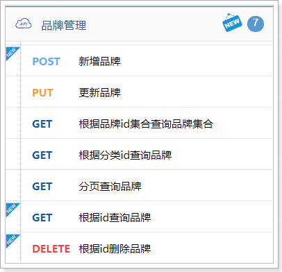 


## 1.1.表结构

来看下品牌的表结构：

```mysql
CREATE TABLE `tb_brand` (
  `id` bigint(20) NOT NULL AUTO_INCREMENT COMMENT '品牌id',
  `name` varchar(64) NOT NULL COMMENT '品牌名称',
  `image` varchar(256) DEFAULT '' COMMENT '品牌图片地址',
  `letter` char(1) DEFAULT '' COMMENT '品牌的首字母',
  `create_time` timestamp NOT NULL DEFAULT CURRENT_TIMESTAMP,
  `update_time` timestamp NOT NULL DEFAULT CURRENT_TIMESTAMP ON UPDATE CURRENT_TIMESTAMP,
  PRIMARY KEY (`id`)
) ENGINE=InnoDB DEFAULT CHARSET=utf8 COMMENT='品牌表';
```

品牌与商品分类是一对多关系，因此他们需要一个中间表：

```mysql
CREATE TABLE `tb_category_brand` (
  `category_id` bigint(20) NOT NULL COMMENT '商品类目id',
  `brand_id` bigint(20) NOT NULL COMMENT '品牌id',
  PRIMARY KEY (`category_id`,`brand_id`)
) ENGINE=InnoDB DEFAULT CHARSET=utf8 COMMENT='商品分类和品牌的中间表，两者是多对多关系';
```


## 1.2.基础代码

接下来，准备好PO、DTO、Mapper、Service、Controller等。

### 1.2.1.实体类

在`ly-item-service`的`com.leyou.item.entity`中准备两个PO，分别对应品牌表和中间表：

品牌实体类：

```java
package com.leyou.item.entity;

import com.baomidou.mybatisplus.annotation.TableId;
import com.baomidou.mybatisplus.annotation.TableName;
import com.leyou.common.entity.BaseEntity;
import lombok.Data;
import lombok.EqualsAndHashCode;


@Data
@EqualsAndHashCode(callSuper = false)
@TableName("tb_brand")
public class Brand extends BaseEntity {
    @TableId
    private Long id;
    private String name;
    private String image;
    private Character letter;
}
```

中间表实体类：

```java
package com.leyou.item.entity;

import com.baomidou.mybatisplus.annotation.IdType;
import com.baomidou.mybatisplus.annotation.TableId;
import com.baomidou.mybatisplus.annotation.TableName;
import lombok.AllArgsConstructor;
import lombok.Data;


@Data
@AllArgsConstructor(staticName = "of")
@TableName("tb_category_brand")
public class CategoryBrand {
    @TableId(type = IdType.INPUT)
    private Long categoryId;
    @TableId(type = IdType.INPUT)
    private Long brandId;
}
```


### 1.2.2.mapper

在`ly-item-service`的`com.leyou.item.mapper`中准备mapper：

首先是BrandMapper：

```java
package com.leyou.item.mapper;

import com.baomidou.mybatisplus.core.mapper.BaseMapper;
import com.leyou.item.entity.Brand;
import org.apache.ibatis.annotations.Param;
import org.apache.ibatis.annotations.Select;

import java.util.List;


public interface BrandMapper extends BaseMapper<Brand> {

}

```

然后是中间表的mapper：

```java
package com.leyou.item.mapper;

import com.baomidou.mybatisplus.core.mapper.BaseMapper;
import com.leyou.item.entity.CategoryBrand;


public interface CategoryBrandMapper extends BaseMapper<CategoryBrand> {
}
```


### 1.2.3.service

在`ly-item-service`的`com.leyou.item.service`中准备两个service接口：

品牌：

```java
package com.leyou.item.service;

import com.baomidou.mybatisplus.extension.service.IService;
import com.leyou.item.entity.Brand;


public interface BrandService extends IService<Brand> {
}
```

中间表：

```java
package com.leyou.item.service;

import com.baomidou.mybatisplus.extension.service.IService;
import com.leyou.item.entity.CategoryBrand;


public interface CategoryBrandService extends IService<CategoryBrand> {
}
```


在`ly-item-service`的`com.leyou.item.service.impl`中准备两个service的实现类：

brand:

```java
package com.leyou.item.service.impl;

import com.baomidou.mybatisplus.extension.service.impl.ServiceImpl;
import com.leyou.item.entity.Brand;
import com.leyou.item.mapper.BrandMapper;
import com.leyou.item.service.BrandService;


@Service
public class BrandServiceImpl extends ServiceImpl<BrandMapper, Brand> implements BrandService {
}
```

中间表：

```java
package com.leyou.item.service.impl;

import com.baomidou.mybatisplus.extension.service.impl.ServiceImpl;
import com.leyou.item.entity.CategoryBrand;
import com.leyou.item.mapper.CategoryBrandMapper;
import com.leyou.item.service.CategoryBrandService;
import org.springframework.stereotype.Service;


@Service
public class CategoryBrandServiceImpl extends ServiceImpl<CategoryBrandMapper, CategoryBrand> implements CategoryBrandService {

}
```


### 1.2.4.controller

然后是brand的controller：

```java
package com.leyou.item.web;

import com.leyou.item.service.BrandService;
import org.springframework.beans.factory.annotation.Autowired;
import org.springframework.web.bind.annotation.RestController;


@RestController
@RequestMapping("brand")
public class BrandController {

    private final BrandService brandService;

    public BrandController(BrandService brandService) {
        this.brandService = brandService;
    }
}
```


### 1.2.5.DTO

查询品牌后，返回的DTO对象，包括：

在`ly-common`中的`com.leyou.common.dto`中的用于封装分页结果的PageDTO：

```java
package com.leyou.common.dto;

import lombok.Data;

import java.util.List;

@Data
public class PageDTO<T> {
    private Long total;// 总条数
    private Long totalPage;// 总页数
    private List<T> items;// 当前页数据

    public PageDTO() {
    }

    public PageDTO(Long total, List<T> items) {
        this.total = total;
        this.items = items;
    }

    public PageDTO(Long total, Long totalPage, List<T> items) {
        this.total = total;
        this.totalPage = totalPage;
        this.items = items;
    }
}
```

在`ly-item-api`中的`com.leyou.item.dto`中的BrandDTO：

```java
package com.leyou.item.dto;

import com.leyou.common.dto.BaseDTO;
import com.leyou.common.entity.BaseEntity;
import lombok.Data;
import lombok.EqualsAndHashCode;
import lombok.NoArgsConstructor;

import java.util.Collection;
import java.util.List;
import java.util.stream.Collectors;


@Data
@NoArgsConstructor
@EqualsAndHashCode(callSuper = false)
public class BrandDTO extends BaseDTO {
    private Long id;
    private String name;
    private String image;
    private Character letter;
    private List<Long> categoryIds;

    public BrandDTO(BaseEntity entity) {
        super(entity);
    }

    public static <T extends BaseEntity> List<BrandDTO> convertEntityList(Collection<T> list) {
        if(list == null){
			return Collections.emptyList();
		}
        return list.stream().map(BrandDTO::new).collect(Collectors.toList());
    }
}
```


## 1.3.根据品牌id查询品牌

接口信息：

- 请求方式：`Get`

- 请求路径：`/brand/{id}`

- 请求参数：id，品牌id

- 返回值类型：BrandDTO，并不包含id集合

  ```json
  {
  	"id": 0,
  	"image": "",
  	"letter": "",
  	"name": ""
  }
  ```


在`ly-item-service`中的`com.leyou.item.web`的BrandController中，添加代码如下：

```java
/**
     * 根据id查询品牌
     * @param id 品牌的id
     * @return 品牌对象
     */
@GetMapping("/{id}")
public ResponseEntity<BrandDTO> queryBrandById(@PathVariable("id") Long id){
    return ResponseEntity.ok(new BrandDTO(brandService.getById(id)));
}
```


## 1.4.根据品牌id集合查询品牌集合

接口信息：

- 请求方式：`Get`
- 请求路径：`/brand/list`
- 请求参数：ids，品牌id的集合
- 返回值类型：BrandDTO的集合

在`ly-item-service`中的`com.leyou.item.web`的BrandController中，添加代码如下：

```java
/**
     * 根据品牌id集合查询品牌集合
     * @param idList id集合
     * @return BrandDTO 集合
     */
@GetMapping("/list")
public ResponseEntity<List<BrandDTO>> queryBrandByIds(@RequestParam("ids") List<Long> idList){
    return ResponseEntity.ok(BrandDTO.convertEntityList(brandService.listByIds(idList)));
}
```


## 1.5.分页查询品牌

接口信息：

- 请求方式：`Get`

- 请求路径：`/brand/page`

- 请求参数：

  | 参数名称 | 参数说明 | 请求类型 | 是否必须 | 数据类型 |
  | -------- | -------- | -------- | -------- | -------- |
  | key      | 搜索条件 | query    | false    | string   |
  | page     | 当前页码 | query    | false    | integer  |
  | rows     | 每页大小 | query    | false    | integer  |

- 返回值类型：分页结果PageDTO，其中包含BrandDTO集合

  ```json
  {
  	"items": [
  		{
  			"id": 0,
  			"image": "",
  			"letter": "",
  			"name": ""
  		}
  	],
  	"total": 0,
  	"totalPage": 0
  }
  ```

  

在`ly-item-service`中的`com.leyou.item.web`的`BrandController`中，添加代码如下：

```java
/**
     *
     * @param page 当前页码
     * @param rows 每页大小
     * @param key 查询条件
     * @return 品牌分页结果
     */
@GetMapping("page")
public ResponseEntity<PageDTO<BrandDTO>> queryBrandByPage(
    @RequestParam(value = "page", defaultValue = "1")Integer page,
    @RequestParam(value = "rows", defaultValue = "5")Integer rows,
    @RequestParam(value = "key", required = false)String key
){
    return ResponseEntity
        .ok(brandService.queryBrandByPage(page,rows, key));
}
```

在`ly-item-service`中的`com.leyou.item.service`的`BrandService`中，添加代码如下：

```java
/**
     * 分页查询品牌
     * @param page 当前页
     * @param rows 每页大小
     * @param key 搜索关键字
     * @return 分页结果
     */
PageDTO<BrandDTO> queryBrandByPage(Integer page, Integer rows, String key);
```


在`ly-item-service`中的`com.leyou.item.service.impl`的`BrandServiceImpl`中，添加代码如下：

```java
 @Override
    public PageDTO<BrandDTO> queryBrandByPage(Integer page, Integer rows, String key) {
        // 1.分页信息的健壮性处理
        page = Math.min(page, 100);
        rows = Math.max(rows, 5);
        // 2.分页
        Page<Brand> info = new Page<>(page, rows);
        // 3.判断key是否存在
        boolean isKeyExists = StringUtils.isNoneBlank(key);
        // 4.如果key存在，添加like和eq的查询条件，否则不添加
        query().like(isKeyExists, "name", key)
                .or()
                .eq(isKeyExists, "letter", key)
                .page(info);
        // 5.封装结果
        List<Brand> list = info.getRecords();
        return new PageDTO<>(info.getTotal(), info.getPages(), BrandDTO.convertEntityList(list));
    }
```


## 1.6.根据分类id查询品牌

接口信息：

- 请求方式：`Get`
- 请求路径：`/brand/of/category`
- 请求参数：id，分类的id
- 返回值类型：BrandDTO的集合

在`ly-item-service`中的`com.leyou.item.web`的BrandController中，添加代码如下：

```java
    /**
     * 根据分类查询品牌
     * @return 品牌集合
     */
@GetMapping("/of/category")
public ResponseEntity<List<BrandDTO>> queryBrandByCategory(@RequestParam("id") Long id){
    return ResponseEntity.ok(brandService.queryBrandByCategory(id));
}
```

在`ly-item-service`中的`com.leyou.item.service`的`BrandService`中，添加代码如下：

```java
    /**
     * 根据分类id查询品牌
     * @param id 分类id
     * @return 品牌集合
     */
List<BrandDTO> queryBrandByCategory(Long id);
```


分类和品牌之间是通过中间表联系的，因此要想实现这个功能，需要结合中间表完成查询，实现思路有两种：

- 思路一：关联查询:

  ```sql
  SELECT 
  	b.id, b.name, b.letter, b.image 
  FROM 
  	tb_category_brand cb 
  INNER JOIN 
  	tb_brand b ON b.id = cb.brand_id 
  WHERE 
  	cb.category_id = #{cid}
  ```

- 思路二：子查询

  ```sql
  SELECT
  	id,
  	`name`,
  	letter,
  	image 
  FROM
  	tb_brand
  WHERE
  	id IN (SELECT brand_id FROM tb_category_brand WHERE category_id = 1)
  ```

这里我们采用思路1.

首先在`ly-item-service`中的`com.leyou.item.mapper`的在`BrandMapper`中添加一个新的方法：

```java
@Select("SELECT b.id, b.name, b.letter, b.image FROM tb_category_brand cb INNER JOIN tb_brand b ON b.id = cb.brand_id WHERE cb.category_id = #{cid}")
List<Brand> queryByCategoryId(@Param("cid") Long cid);
```


在`ly-item-service`中的`com.leyou.item.service.impl`的`BrandServiceImpl`中，添加代码如下：

```java
@Override
public List<BrandDTO> queryBrandByCategory(Long id) {
    List<Brand> list = getBaseMapper().queryByCategoryId(id);
    return BrandDTO.convertEntityList(list);
}
```


## 1.7.新增品牌

接口信息：

- 请求方式：`POST`

- 请求路径：`/brand`

- 请求参数：BrandDTO对象

  | 参数名称    | 参数说明               | 请求类型 | 是否必须 | 数据类型 | schema |
  | ----------- | ---------------------- | -------- | -------- | -------- | ------ |
  | categoryIds | 品牌相关的分类ID的集合 | query    | true     | string   |        |
  | image       | 品牌LOGO               | query    | false    | string   |        |
  | letter      | 品牌首字母             | query    | true     | string   |        |
  | name        | 品牌名称               | query    | true     | string   |        |

- 返回值类型：无，状态码

  | 状态码 | 说明         | schema |
  | ------ | ------------ | ------ |
  | 201    | 新增成功     |        |
  | 401    | Unauthorized |        |
  | 403    | Forbidden    |        |
  | 404    | Not Found    |        |


在`ly-item-service`中的`com.leyou.item.web`的BrandController中，添加代码如下：

```java
/**
     * 新增品牌
     * @param brandDTO 品牌对象
     * @return 无
     */
@PostMapping
public ResponseEntity<Void> saveBrand(BrandDTO brandDTO) {
    brandService.saveBrand(brandDTO);
    return ResponseEntity.status(HttpStatus.CREATED).build();
}
```

在`ly-item-service`中的`com.leyou.item.service`BrandService中添加新的方法：

```java
/**
     * 新增品牌和中间表数据
     * @param brand 品牌的DTO
     */
void saveBrand(BrandDTO brand);
```


新增品牌的同时，还需要新增中间表，在`ly-item-service`中的`com.leyou.item.service.impl`的`BrandServiceImpl`中添加代码：

```java
private final CategoryBrandService categoryBrandService;

public BrandServiceImpl(CategoryBrandService categoryBrandService) {
    this.categoryBrandService = categoryBrandService;
}    

@Transactional
@Override
public void saveBrand(BrandDTO brandDTO) {
    Brand brand = brandDTO.toEntity(Brand.class);
    // 保存brand
    save(brand);
    /* // 2.获取分类id， 包含手机、空调、洗衣机
        List<Long> categoryIds = brandDTO.getCategoryIds();
        // 3.封装中间表对象集合
        Long brandId = brand.getId();// 小米

        List<CategoryBrand> categoryBrands = new ArrayList<>();
        for (Long categoryId : categoryIds) {
            // 创建中间表对象
            CategoryBrand categoryBrand = CategoryBrand.of(categoryId, brandId);
            categoryBrands.add(categoryBrand);
        }*/
    // 封装中间表对象的集合
    List<CategoryBrand> list = brandDTO.getCategoryIds().stream()
        .map(id -> CategoryBrand.of(id, brand.getId()))
        .collect(Collectors.toList());
    // 批量写入中间表数据
    categoryBrandService.saveBatch(list);
}
```


## 1.8.更新品牌（自己实现）

接口信息：

- 请求方式：`PUT`

- 请求路径：`/brand`

- 请求参数：BrandDTO对象

  | 参数名称    | 参数说明               | 请求类型 | 是否必须 | 数据类型 |
  | ----------- | ---------------------- | -------- | -------- | -------- |
  | id          | 品牌的id               | query    | true     | long     |
  | categoryIds | 品牌相关的分类ID的集合 | query    | true     | string   |
  | image       | 品牌LOGO               | query    | false    | string   |
  | letter      | 品牌首字母             | query    | true     | string   |
  | name        | 品牌名称               | query    | true     | string   |

- 返回值类型：无，状态码

  | 状态码 | 说明         |
  | ------ | ------------ |
  | 201    | 新增成功     |
  | 401    | Unauthorized |
  | 403    | Forbidden    |
  | 404    | Not Found    |


在`ly-item-service`中的`com.leyou.item.web`的BrandController中，添加代码如下：

```java
    /**
     * 修改品牌
     * @param brandDTO 品牌及分类信息
     * @return 无
     */
    @PutMapping
    public ResponseEntity<Void> updateBrand(BrandDTO brandDTO) {
        brandService.updateBrand(brandDTO);
        return ResponseEntity.status(HttpStatus.NO_CONTENT).build();
    }
```

在`ly-item-service`中的`com.leyou.item.service`BrandService中添加新的方法：

```java
    /**
     * 更新品牌
     * @param brandDTO 品牌的DTO
     */
    void updateBrand(BrandDTO brandDTO);
```


更新品牌还需要同时完成中间表更新。而中间表本身没有其它属性，只包含品牌和分类的id，因此不能修改，只能先删除之前的数据，然后再新增。

在`ly-item-service`中的`com.leyou.item.service.impl`的`BrandServiceImpl`中添加代码：

```java
@Override
@Transactional
public void updateBrand(BrandDTO brandDTO) {
    // 1.更新品牌
    boolean success = updateById(brandDTO.toEntity(Brand.class));
    if (!success) {
        // 更新失败，抛出异常
        throw new LyException(500, "更新品牌失败！");
    }
    // 2.根据品牌id删除中间表数据
    success = categoryBrandService.remove(
        new QueryWrapper<CategoryBrand>().eq("brand_id", brandDTO.getId()));
    if (!success) {
        // 更新失败，抛出异常
        throw new LyException(500,"更新品牌失败，删除中间表数据出错");
    }
    // 3.重新插入中间表数据
    List<CategoryBrand> list = brandDTO.getCategoryIds().stream()
        .map(id -> CategoryBrand.of(id, brandDTO.getId()))
        .collect(Collectors.toList());
    // 批量写入中间表数据
    categoryBrandService.saveBatch(list);
}
```


## 1.9.根据ID删除品牌（自己实现）

接口信息：

- 请求方式：`DELETE`
- 请求路径：`/brand/{id}`
- 请求参数：id，品牌的id
- 返回值类型：无

在`ly-item-service`中的`com.leyou.item.web`的BrandController中，添加代码如下：

```java
/**
     * 删除品牌
     * @param id 要删除的品牌id
     * @return 无
     */
@DeleteMapping("/{id}")
public ResponseEntity<Void> deleteBrandById(@PathVariable("id") Long id){
    // 删除品牌表
    brandService.removeById(id);
    // TODO 删除中间表
    categoryBrandService.remove(
        new QueryWrapper<CategoryBrand>().eq("brand_id", id));
    return ResponseEntity.status(HttpStatus.NO_CONTENT).build();
}
```


## 1.10.品牌管理页面

打开后台管理系统，在左侧菜单中点击品牌管理，即可看到品牌管理页面，展示出品牌信息：

 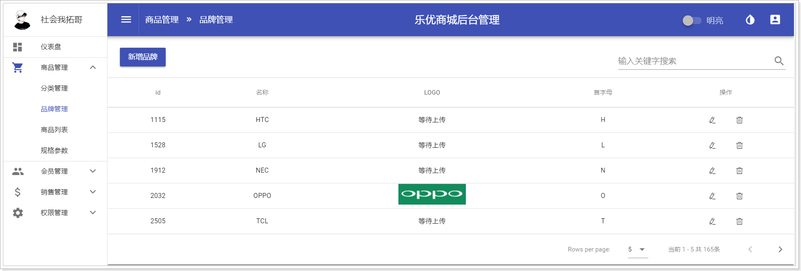


在这里测试刚刚编写的接口是否可用。


# 2.图片上传

点击页面的新增品牌按钮，发现表单中有一个品牌的LOGO图片需要上传：

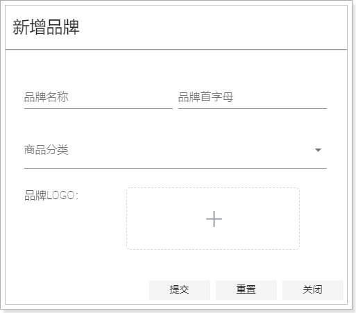 

之前我们的业务中并未处理品牌上传功能。

在早期的单点项目中，我们上传文件都是保存在tomcat所在服务器的。这样存在一些问题：

- 单机器存储，存储能力有限
- 无法进行水平扩展，因为多台机器的文件无法共享,会出现访问不到的情况
- 数据没有备份，有单点故障风险
- 并发能力差

这个时候，最好使用分布式文件存储来代替本地文件存储。

## 2.1.分布式文件存储

分布式文件系统（Distributed File System）是指文件系统管理的物理存储资源不一定直接连接在本地节点上，而是通过计算机网络与节点相连。 

通俗来讲：

- 传统文件系统管理的文件就存储在本机。
- 分布式文件系统管理的文件存储在很多机器，这些机器通过网络连接，要被统一管理。无论是上传或者访问文件，都需要通过管理中心来访问

常见的分布式文件系统有谷歌的GFS、HDFS（Hadoop）、TFS（淘宝）、FastDFS（淘宝）等。

不过，企业自己搭建分布式文件系统成本较高，对于一些中小型企业而言，使用云上的文件存储，是性价比更高的选择，比如我们今天要学习的阿里OSS。


## 2.2.阿里云OSS

阿里的OSS就是一个文件云存储方案：

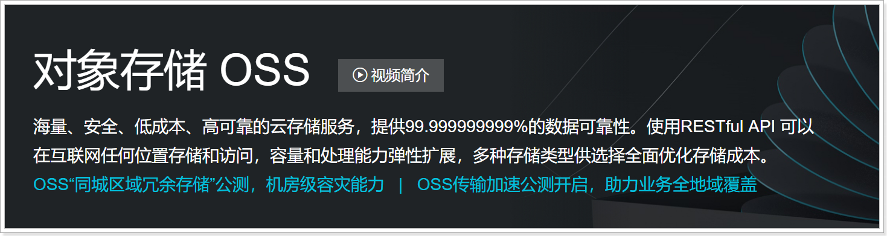

简介：

> 阿里云对象存储服务（Object Storage Service，简称 OSS），是阿里云提供的海量、安全、低成本、高可靠的云存储服务。其数据设计持久性不低于99.999999999%，服务设计可用性不低于99.99%。具有与平台无关的RESTful API接口，您可以在任何应用、任何时间、任何地点存储和访问任意类型的数据。
>
> 您可以使用阿里云提供的API、SDK接口或者OSS迁移工具轻松地将海量数据移入或移出阿里云OSS。数据存储到阿里云OSS以后，您可以选择标准类型（Standard）的阿里云OSS服务作为移动应用、大型网站、图片分享或热点音视频的主要存储方式，也可以选择成本更低、存储期限更长的低频访问类型（Infrequent Access）和归档类型（Archive）的阿里云OSS服务作为不经常访问数据的备份和归档。


### 2.2.1 开通oss访问

首先登陆阿里云，然后找到对象存储的产品：

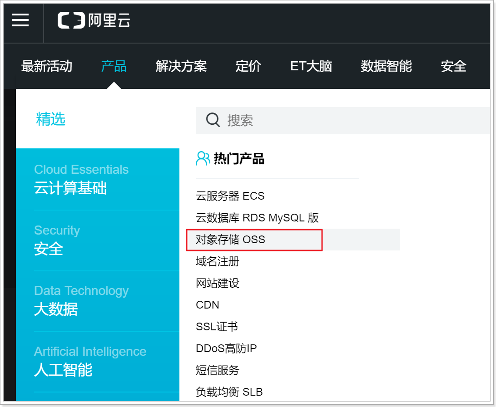

点击进入后，开通服务：

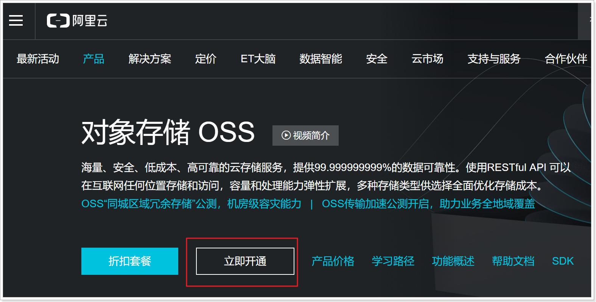


随后即可进入管理控制台：

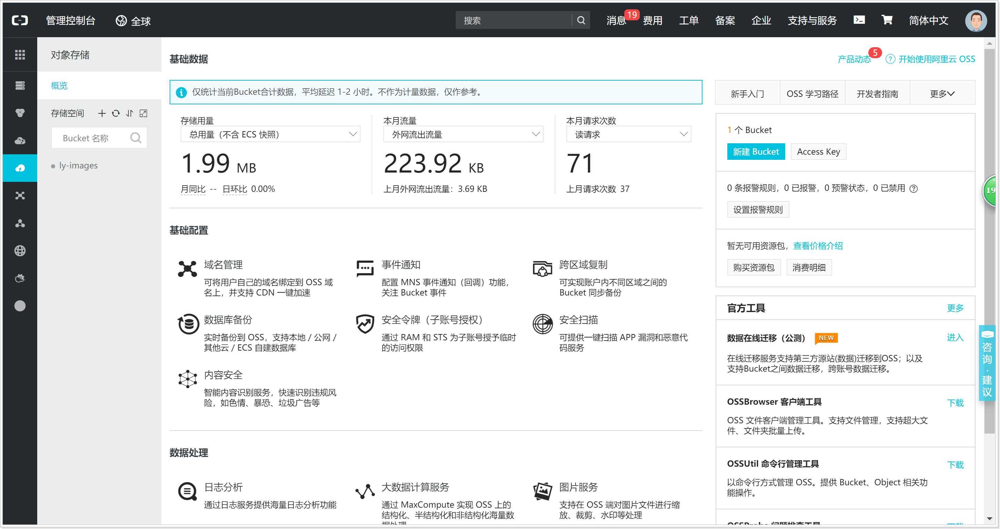

### 2.2.2.基本概念

OSS中包含一些概念，我们来认识一下：

- 存储类型（Storage Class）

  OSS提供标准、低频访问、归档三种存储类型，全面覆盖从热到冷的各种数据存储场景。其中标准存储类型提供高可靠、高可用、高性能的对象存储服务，能够支持频繁的数据访问；低频访问存储类型适合长期保存不经常访问的数据（平均每月访问频率1到2次），存储单价低于标准类型；归档存储类型适合需要长期保存（建议半年以上）的归档数据，在三种存储类型中单价最低。详情请参见[存储类型介绍](https://help.aliyun.com/document_detail/51374.html#concept-fcn-3xt-tdb)。

- `存储空间（Bucket）`

  存储空间是您用于存储对象（Object）的容器，所有的对象都必须隶属于某个存储空间。您可以设置和修改存储空间属性用来控制地域、访问权限、生命周期等，这些属性设置直接作用于该存储空间内所有对象，因此您可以通过灵活创建不同的存储空间来完成不同的管理功能。

- 对象/文件（Object）

  对象是 OSS 存储数据的基本单元，也被称为OSS的文件。对象由元信息（Object Meta），用户数据（Data）和文件名（Key）组成。对象由存储空间内部唯一的Key来标识。对象元信息是一组键值对，表示了对象的一些属性，比如最后修改时间、大小等信息，同时您也可以在元信息中存储一些自定义的信息。

- 地域（Region）

  地域表示 OSS 的数据中心所在物理位置。您可以根据费用、请求来源等综合选择数据存储的地域。详情请参见[OSS已开通的Region](https://help.aliyun.com/document_detail/31837.html#concept-zt4-cvy-5db)。

- `访问域名（Endpoint`）

  Endpoint 表示OSS对外服务的访问域名。OSS以HTTP RESTful API的形式对外提供服务，当访问不同地域的时候，需要不同的域名。通过内网和外网访问同一个地域所需要的域名也是不同的。具体的内容请参见[各个Region对应的Endpoint](https://help.aliyun.com/document_detail/31837.html#concept-zt4-cvy-5db)。

- `访问密钥（AccessKey）`

  AccessKey，简称 AK，指的是访问身份验证中用到的AccessKeyId 和AccessKeySecret。OSS通过使用AccessKeyId 和AccessKeySecret对称加密的方法来验证某个请求的发送者身份。AccessKeyId用于标识用户，AccessKeySecret是用户用于加密签名字符串和OSS用来验证签名字符串的密钥，其中AccessKeySecret 必须保密。

以上概念中，跟我们开发中密切相关的有三个：

- 存储空间（Bucket）
- 访问域名（Endpoint）
- 访问密钥（AccessKey）：包含了AccessKeyId 和AccessKeySecret。

### 2.2.3.创建一个bucket

在控制台的右侧，可以看到一个`新建Bucket`按钮：

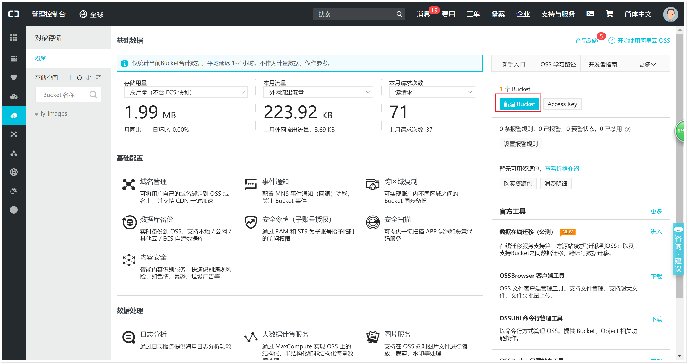

点击后，弹出对话框，填写基本信息：

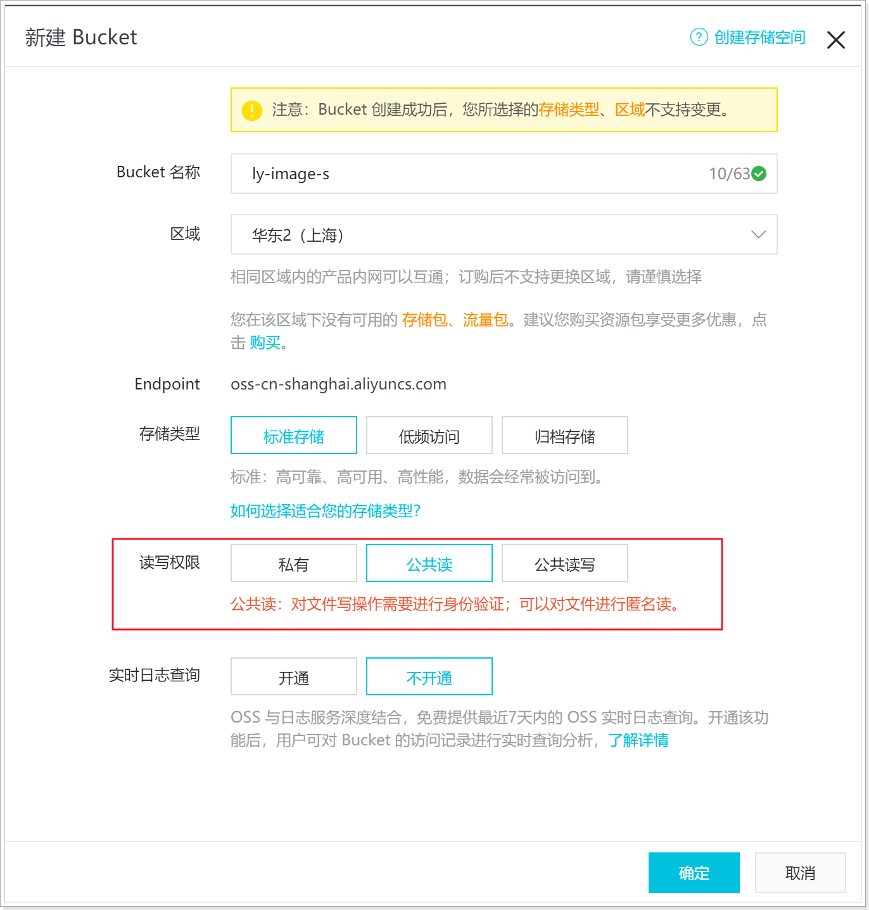

注意点：

- bucket：存储空间名称，名字只能是字母、数字、中划线
- 区域：即服务器的地址，这里选择了上海
- Endpoint：选中区域后，会自动生成一个Endpoint地址，这将是我们访问OSS服务的域名的组成部分
- 存储类型：默认
- 读写权限：这里我们选择公共读，否则每次访问都需要额外生成签名并校验，比较麻烦。敏感数据不要请都设置为私有！
- 日志：不开通


### 2.2.4.创建AccessKey

有了bucket就可以进行文件上传或下载了。不过，为了安全考虑，我们给阿里云账户开通一个子账户，并设置对OSS的读写权限。

点击屏幕右上角的个人图像，然后点击访问控制：

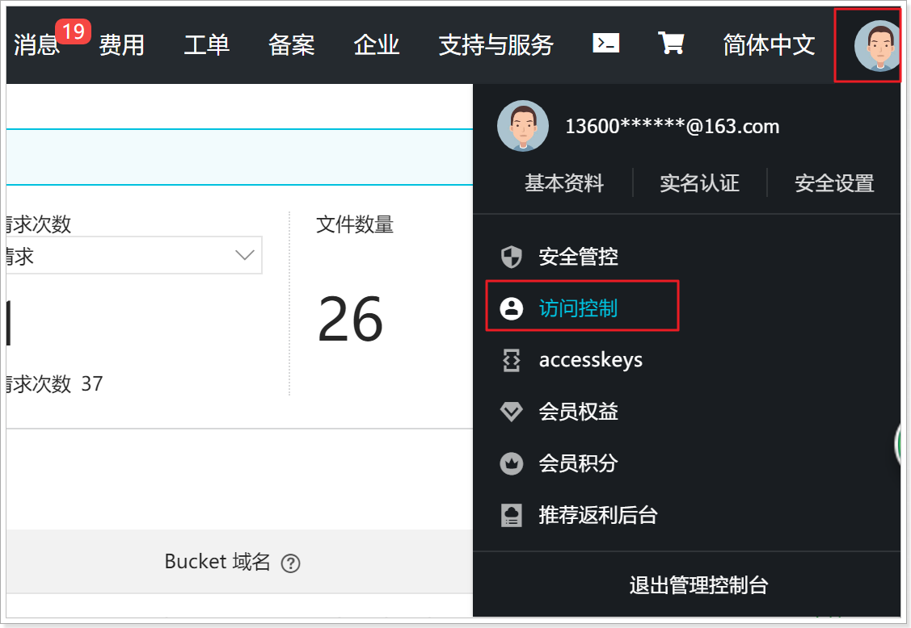

在跳转的页面中，选择用户，并新建一个用户：

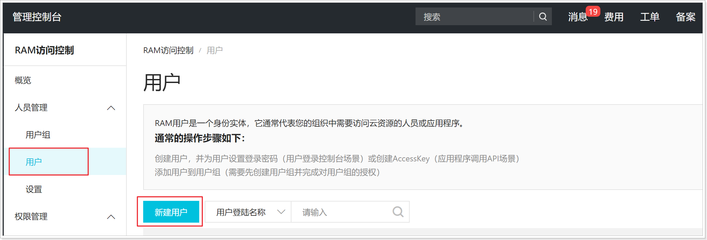

然后填写用户信息：

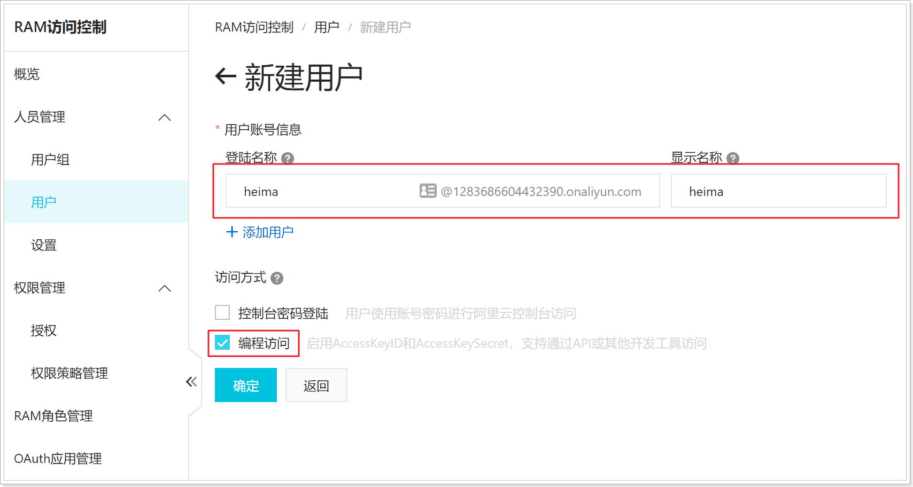

然后会为你生成用户的AccessKeyID和AccessKeySecret：

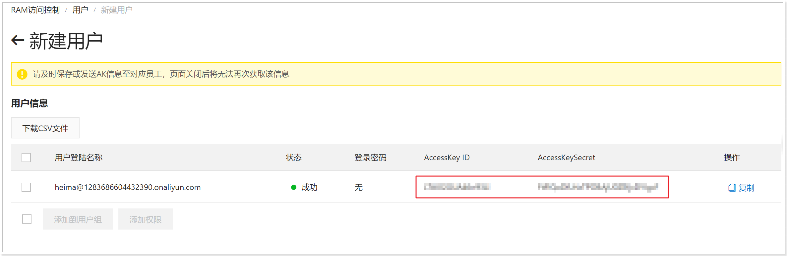

妥善保管，不要告诉任何人！

接下来，我们需要给这个用户添加对OSS的控制权限。

进入这个新增的用户详情页面：

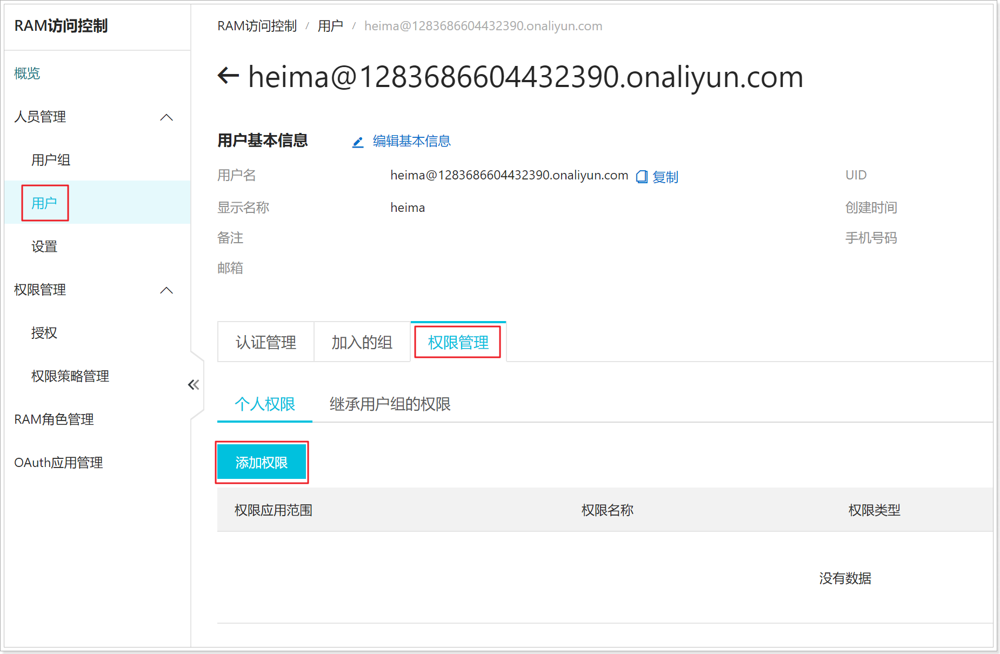

点击添加权限，会进入权限选择页面，输入oss进行搜索，然后选择`管理对象存储服务（OSS）`权限：

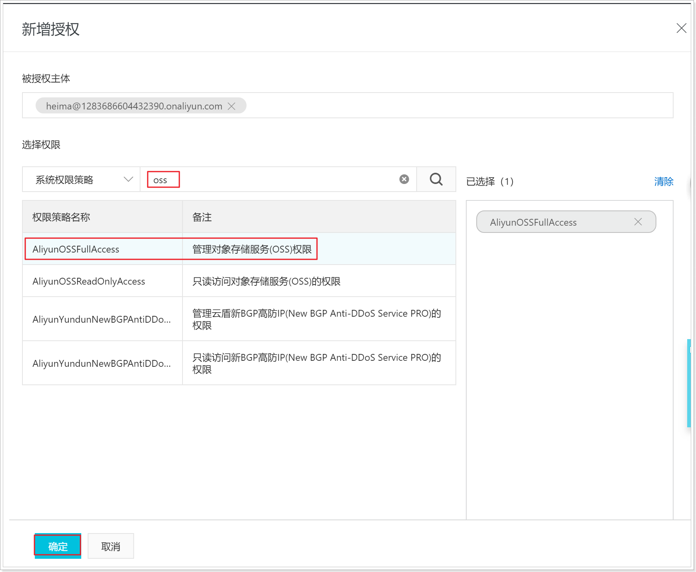


## 2.3.上传文件最佳实践

在控制台的右侧，点击`开发者指南`按钮，即可查看帮助文档：

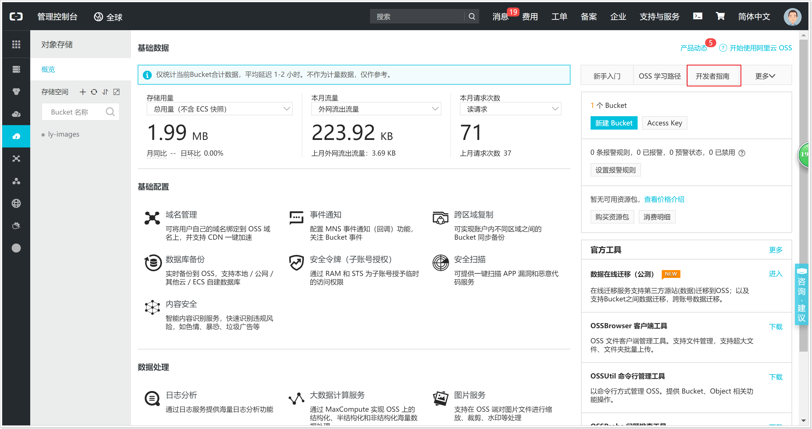

然后在弹出的新页面的左侧菜单中找到开发者指南：

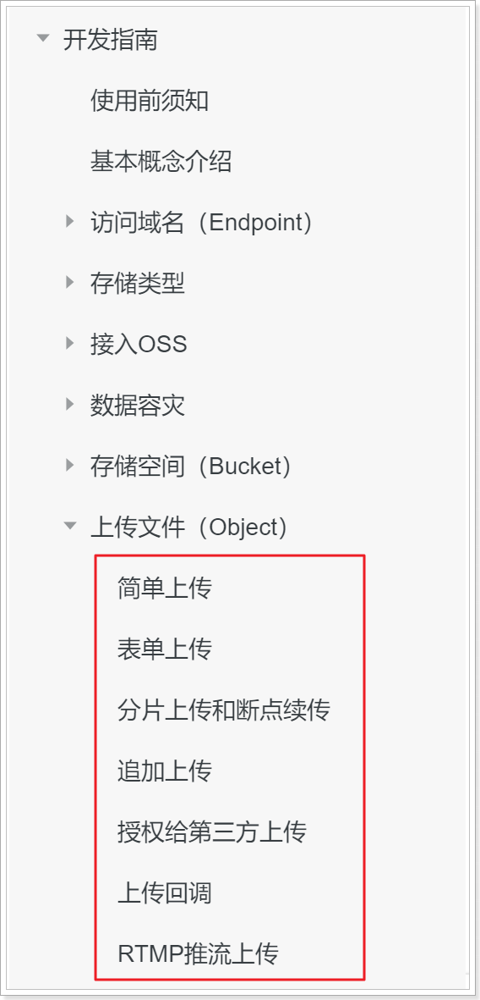 

可以看到上传文件中，支持多种上传方式，并且因为提供的Rest风格的API，任何语言都可以访问OSS实现上传。


我们可以直接使用java代码来实现把图片上传到OSS，不过这样以来文件会先从客户端浏览器上传到我们的服务端tomcat，然后再上传到OSS，效率较低，如图：

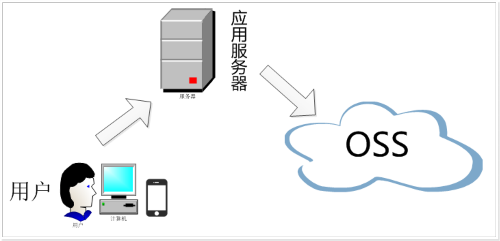

以上方法有三个缺点：

- 上传慢。先上传到应用服务器，再上传到OSS，网络传送比直传到OSS多了一倍。如果直传到OSS，不通过应用服务器，速度将大大提升，而且OSS采用BGP带宽，能保证各地各运营商的速度。
- 扩展性差。如果后续用户多了，应用服务器会成为瓶颈。
- 费用高。需要准备多台应用服务器。由于OSS上传流量是免费的，如果数据直传到OSS，不通过应用服务器，那么将能省下几台应用服务器。

在阿里官方的最佳实践中，推荐了更好的做法：

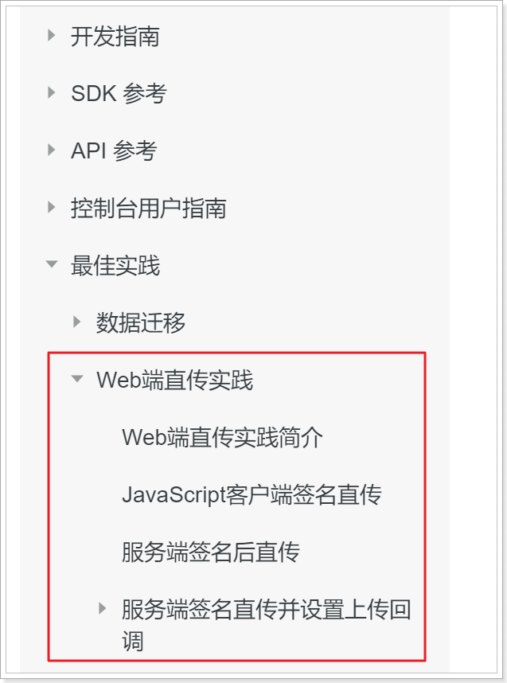 


阿里官方文档中，对于web前端直传又给出了3种不同方案：

- [JavaScript客户端签名直传](https://help.aliyun.com/document_detail/31925.html?spm=a2c4g.11186623.2.10.6c5762121wgIAS#concept-frd-4gy-5db)：客户端通过JavaScript代码完成签名，然后通过表单直传数据到OSS。
- [服务端签名后直传](https://help.aliyun.com/document_detail/31926.html?spm=a2c4g.11186623.2.11.6c5762121wgIAS#concept-en4-sjy-5db)：客户端上传之前，由服务端完成签名，前端获取签名，然后通过表单直传数据到OSS。
- [服务端签名直传并设置上传回调](https://help.aliyun.com/document_detail/31927.html?spm=a2c4g.11186623.2.12.6c5762121wgIAS#concept-qp2-g4y-5db)：服务端完成签名，并且服务端设置了上传后回调，然后通过表单直传数据到OSS。OSS回调完成后，再将应用服务器响应结果返回给客户端。

各自有一些优缺点。


### 2.3.1.web前端签名后直传

客户端通过JavaScript代码完成签名，然后通过表单直传数据到OSS。无需访问应用服务器，对应用服务器压力较低。

流程图如下：

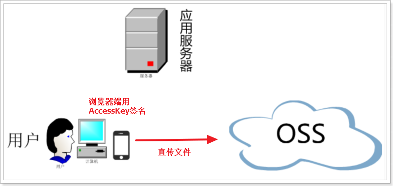

- JavaScript客户端签名直传：
  - 优点：在客户端通过JavaScript代码完成签名，无需过多配置，即可实现直传，非常方便。
  - 问题：客户端通过JavaScript把AccesssKeyID 和AccessKeySecret写在代码里面有泄露的风险
- 

这里我们选择第二种，因为我们并不需要了解用户上传的文件的情况。

### 2.3.2.服务端签名后直传流程

服务端签名后直传的原理如下：

1. 用户发送上传Policy请求到应用服务器（我们的微服务）。
2. 应用服务器返回上传Policy和签名给用户。
3. 用户直接上传数据到OSS。

流程图：

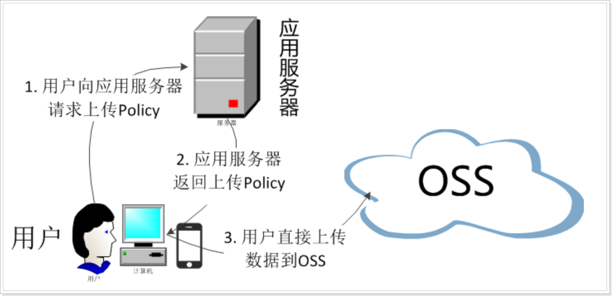

- 服务端签名，JavaScript客户端直传：
  - 优点：Web端向服务端请求签名，然后直接上传，不会对服务端产生压力，而且安全可靠
  - 问题：服务端无法实时了解用户上传了多少文件，上传了什么文件

在页面点击上传的按钮，可以看到请求已经发出：

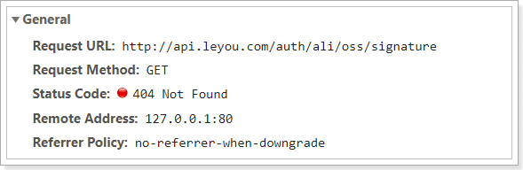 

这正是在向服务端申请签名，接下来我们需要在服务端接收请求，生成签名并返回。


我们要做的事情包括：

- 搭建微服务
- 在微服务中，提供一个接口，生成文件上传需要的签名
  - 分析接口声明，分析请求方式、请求路径、请求参数、返回值类型
  - 实现业务，生成签名
    - 把一些常量配置到yml文件
    - 编写类，读取这些属性
    - 把OSS客户端注入到spring容器
    - 编写业务，实现签名的生成
    - 解决跨域问题
- 前端，调用我们的接口，获取签名（已完成）
- 前端，携带签名，完成上传（已完成）


## 2.4.搭建授权签名微服务

文件上传并不是商品微服务独有的业务，以后的其它业务也可能用到。而且阿里的AccessKey授权也会在多个地方用到。因此我们把签名授权功能封装到一个独立的微服务中，专门做各种授权功能。

为了方便其它微服务调用，我们依然搭建成聚合工程。

### 2.4.1.创建父工程

#### 项目坐标

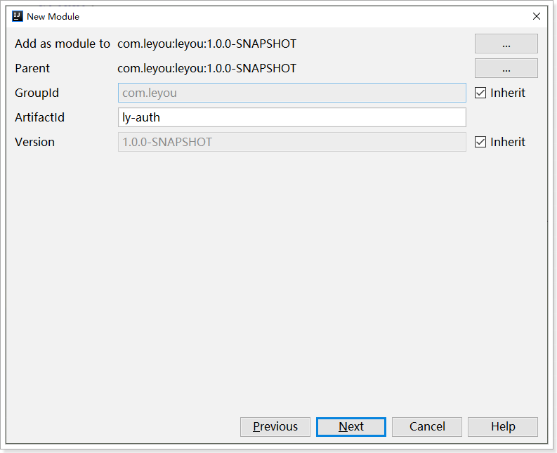

#### 存放目录

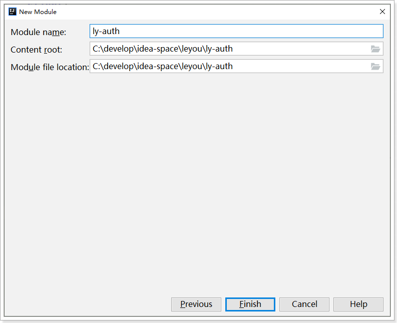

#### pom文件

修改打包方式为POM即可:

```xml
<?xml version="1.0" encoding="UTF-8"?>
<project xmlns="http://maven.apache.org/POM/4.0.0"
         xmlns:xsi="http://www.w3.org/2001/XMLSchema-instance"
         xsi:schemaLocation="http://maven.apache.org/POM/4.0.0 http://maven.apache.org/xsd/maven-4.0.0.xsd">
    <parent>
        <artifactId>leyou</artifactId>
        <groupId>com.leyou</groupId>
        <version>1.0.0-SNAPSHOT</version>
    </parent>
    <modelVersion>4.0.0</modelVersion>

    <artifactId>ly-auth</artifactId>
    <packaging>pom</packaging>

</project>
```


### 2.4.2.实体类模块

#### 项目坐标

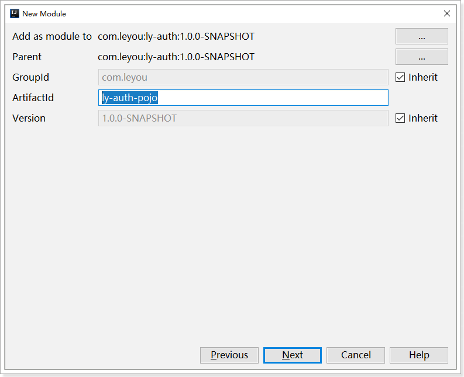

#### 存放位置

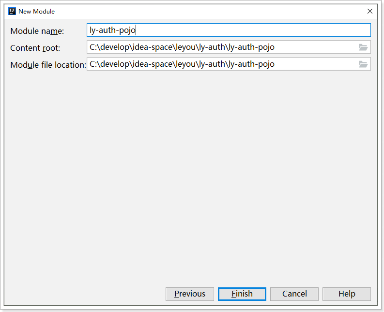

#### pom文件

```xml
<?xml version="1.0" encoding="UTF-8"?>
<project xmlns="http://maven.apache.org/POM/4.0.0"
         xmlns:xsi="http://www.w3.org/2001/XMLSchema-instance"
         xsi:schemaLocation="http://maven.apache.org/POM/4.0.0 http://maven.apache.org/xsd/maven-4.0.0.xsd">
    <parent>
        <artifactId>ly-auth</artifactId>
        <groupId>com.leyou</groupId>
        <version>1.0.0-SNAPSHOT</version>
    </parent>
    <modelVersion>4.0.0</modelVersion>

    <artifactId>ly-auth-pojo</artifactId>


</project>
```


### 2.4.3.API模块

坐标：

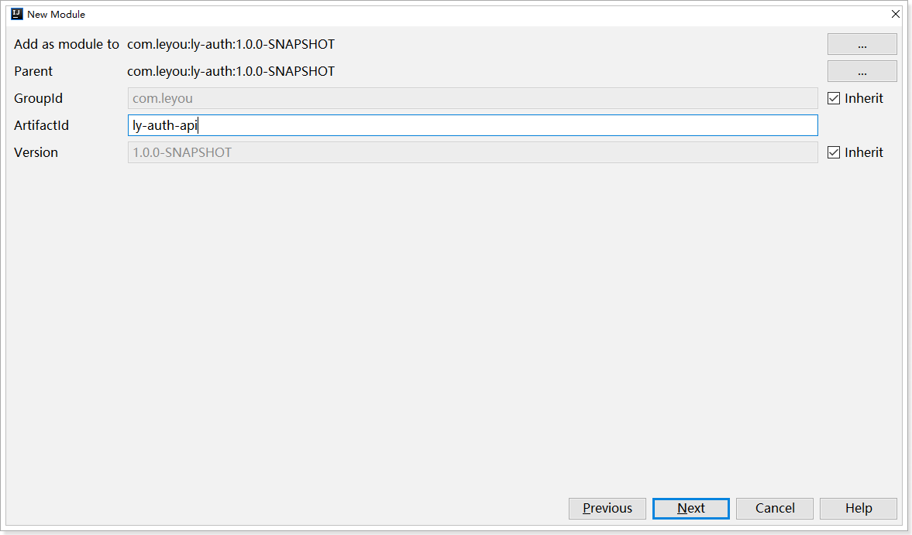

存储位置：

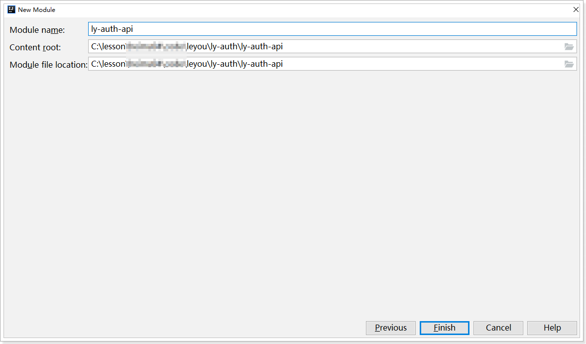

pom文件：

```xml
<?xml version="1.0" encoding="UTF-8"?>
<project xmlns="http://maven.apache.org/POM/4.0.0"
         xmlns:xsi="http://www.w3.org/2001/XMLSchema-instance"
         xsi:schemaLocation="http://maven.apache.org/POM/4.0.0 http://maven.apache.org/xsd/maven-4.0.0.xsd">
    <parent>
        <artifactId>ly-auth</artifactId>
        <groupId>com.leyou</groupId>
        <version>1.0.0-SNAPSHOT</version>
    </parent>
    <modelVersion>4.0.0</modelVersion>

    <artifactId>ly-auth-api</artifactId>

    <dependencies>
        <dependency>
            <groupId>com.leyou</groupId>
            <artifactId>ly-auth-pojo</artifactId>
            <version>1.0.0-SNAPSHOT</version>
        </dependency>
    </dependencies>
</project>
```


### 2.4.4.业务模块

#### 项目坐标

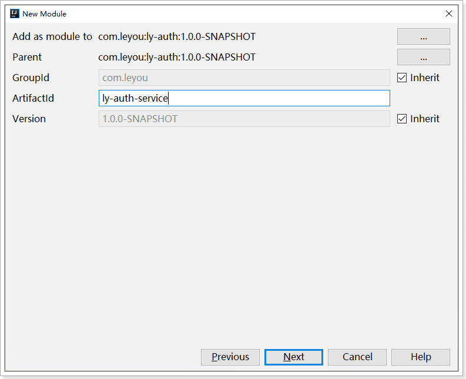

#### 存放位置

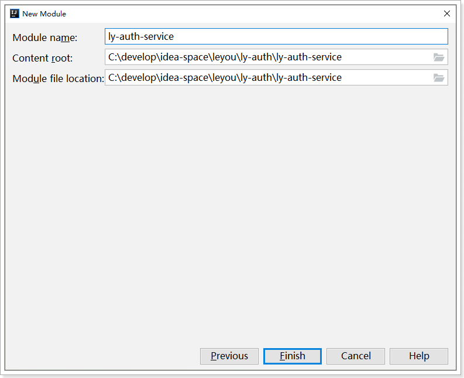

#### pom文件

```xml
<?xml version="1.0" encoding="UTF-8"?>
<project xmlns="http://maven.apache.org/POM/4.0.0"
         xmlns:xsi="http://www.w3.org/2001/XMLSchema-instance"
         xsi:schemaLocation="http://maven.apache.org/POM/4.0.0 http://maven.apache.org/xsd/maven-4.0.0.xsd">
    <parent>
        <artifactId>ly-auth</artifactId>
        <groupId>com.leyou</groupId>
        <version>1.0.0-SNAPSHOT</version>
    </parent>
    <modelVersion>4.0.0</modelVersion>

    <artifactId>ly-auth-service</artifactId>

    <dependencies>
        <!--eureka起步依赖-->
        <dependency>
            <groupId>org.springframework.cloud</groupId>
            <artifactId>spring-cloud-starter-netflix-eureka-client</artifactId>
        </dependency>
        <!--web起步依赖-->
        <dependency>
            <groupId>org.springframework.boot</groupId>
            <artifactId>spring-boot-starter-web</artifactId>
        </dependency>
        <!--阿里云OSS的SDK-->
        <dependency>
            <groupId>com.aliyun.oss</groupId>
            <artifactId>aliyun-sdk-oss</artifactId>
        </dependency>
        <!--auth-pojo-->
        <dependency>
            <groupId>com.leyou</groupId>
            <artifactId>ly-auth-pojo</artifactId>
            <version>1.0.0-SNAPSHOT</version>
        </dependency>
        <!--通用工具-->
        <dependency>
            <groupId>com.leyou</groupId>
            <artifactId>ly-common</artifactId>
            <version>1.0.0-SNAPSHOT</version>
        </dependency>
    </dependencies>
    <build>
        <plugins>
            <plugin>
                <groupId>org.springframework.boot</groupId>
                <artifactId>spring-boot-maven-plugin</artifactId>
            </plugin>
        </plugins>
    </build>
</project>
```


#### 启动类

在`ly-auth-service`的`com.leyou.auth`包下，新建一个启动类：

```java
package com.leyou.auth;

import org.springframework.boot.SpringApplication;
import org.springframework.boot.autoconfigure.SpringBootApplication;


@SpringBootApplication(scanBasePackages = {"com.leyou.auth", "com.leyou.common.advice"})
public class LyAuthApplication {
    public static void main(String[] args) {
        SpringApplication.run(LyAuthApplication.class, args);
    }
}

```


#### 配置文件

在`ly-auth-service`的`resources`目录下，新建一个`application.yml`文件：

```yaml
server:
  port: 8082
spring:
  application:
    name: auth-service
eureka:
  client:
    service-url:
      defaultZone: http://ly-registry:10086/eureka
logging:
  level:
    com.leyou: debug
```


#### 网关路由

在`ly-gateway`的`application.yml`中，添加对`auth-service`的路由：

```yaml
spring:
  # ...
  cloud:
    # ...
    gateway:
      # ...
      routes:
      - id: auth-service # 授权服务
        uri: lb://auth-service
        predicates:
        - Path=/auth/**
```


## 2.5.前端请求签名

在品牌新增的表单中，点击图片上传：

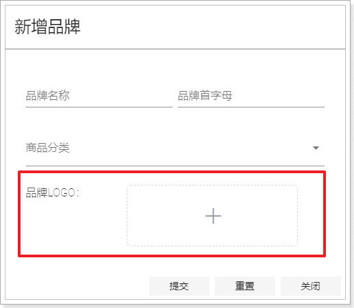 

发现请求已经发出：

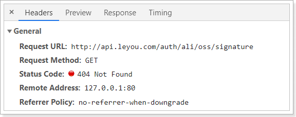 

### 2.5.1.请求分析

请求分析：

- 请求方式：Get
- 请求路径：/auth/ali/oss/signature
- 请求参数：无（如果有登录用户，会携带登录用户信息）
- 返回值：这个需要参考阿里云的[文档](https://help.aliyun.com/document_detail/31927.html?spm=a2c4g.11186623.2.13.34f16e285th61w#concept-qp2-g4y-5db)介绍


### 2.5.2.签名返回值

有关签名直传的文档部分：https://help.aliyun.com/document_detail/31927.html?spm=a2c4g.11186623.2.13.34f16e285th61w#concept-qp2-g4y-5db

其中，服务端签名返回给服务端的内容如下：

```json
{
"accessId":"6MKO******4AUk44",
"host":"http://post-test.oss-cn-hangzhou.aliyuncs.com",
"policy":"eyJleHBpcmF0aW9uIjoiMjAxNS0xMS0wNVQyMDo1Mjoy******Jjdb25kaXRpb25zIjpbWyJjdb250ZW50LWxlbmd0aC1yYW5nZSIsMCwxMDQ4NTc2MDAwXSxbInN0YXJ0cy13aXRoIiwiJGtleSIsInVzZXItZGlyXC8iXV19",
"signature":"VsxOcOudx******z93CLaXPz+4s=",
"expire":1446727949,
"dir":"user-dirs/"
}
```

详细解释：

- `accessId`：用户的AccessKeyId
- `host`：申请的阿里OSS的bucket访问地址
- `policy`：文件上传的策略，主要包含对上传文件的要求，利用Base64加密后返回，[说明文档](https://help.aliyun.com/document_detail/31988.html?spm=a2c4g.11186623.2.22.58cd7eaer5eXWw#section-d5z-1ww-wdb)
- `signature`：生成的签名
- `expire`：本次签名的过期时间，客户端可以换成签名，在有效期内无需再次签名
- `dir`：要上传到bucket中的哪个目录

我们在项目中定义个DTO用来封装这些结果属性：

在`ly-auth-pojo`的`com.leyou.auth.dto`中，添加新的类：

```java
package com.leyou.auth.dto;

import lombok.AllArgsConstructor;
import lombok.Data;
import lombok.NoArgsConstructor;


@Data
@AllArgsConstructor(staticName = "of")
@NoArgsConstructor
public class AliOssSignatureDTO {
    private String accessId;
    private String host;
    private String policy;
    private String signature;
    private long expire;
    private String dir;
}
```


### 2.5.3.服务端接口声明

根据上面的请求分析，我们可以定义出一个web接口了：

首先是controller，在`ly-auth-service`的`com.leyou.auth.web`包中，新增一个类：

```java
package com.leyou.auth.web;

import com.leyou.auth.dto.AliOssSignatureDTO;
import org.springframework.http.ResponseEntity;
import org.springframework.web.bind.annotation.GetMapping;
import org.springframework.web.bind.annotation.RequestMapping;
import org.springframework.web.bind.annotation.RestController;

/**
 * 阿里的相关授权接口
 * 
 */
@RestController
@RequestMapping("ali")
public class AliAuthController {
    /**
     * 申请oss签名
     * @return 包含签名、图片验证策略等信息
     */
    @GetMapping("/oss/signature")
    public ResponseEntity<AliOssSignatureDTO> getAliSignature(){
        return ResponseEntity.ok(null);
    }

}
```


## 2.6.服务端生成签名

根据之前的分析，我们来编写服务端代码，接收前端请求，返回签名结果。这个要参考官方文档中的Demo。

文档地址：https://help.aliyun.com/document_detail/91868.html?spm=a2c4g.11186623.2.16.58cd7eaer5eXWw#concept-ahk-rfz-2fb

代码如下：

```java
protected void doGet(HttpServletRequest request, HttpServletResponse response)
    throws ServletException, IOException {
	// 基本属性
    String accessId = "<yourAccessKeyId>"; // 请填写您的AccessKeyId。
    String accessKey = "<yourAccessKeySecret>"; // 请填写您的AccessKeySecret。
    String endpoint = "oss-cn-hangzhou.aliyuncs.com"; // 请填写您的 endpoint。
    String bucket = "bucket-name"; // 请填写您的 bucketname 。
    String host = "https://" + bucket + "." + endpoint; // host的格式为 bucketname.endpoint
   
    String dir = "user-dir-prefix/"; // 用户上传文件时指定的前缀。
	// OSS客户端
    OSS client = new OSSClient(endpoint, accessId, accessKey);
    try {
        // 过期时间
        long expireTime = 30;
        long expireEndTime = System.currentTimeMillis() + expireTime * 1000;
        Date expiration = new Date(expireEndTime);
        // 上传策略条件
        PolicyConditions policyConds = new PolicyConditions();
        // 文件大小限制
        policyConds.addConditionItem(PolicyConditions.COND_CONTENT_LENGTH_RANGE, 0, 1048576000);
        // 文件目录限制
        policyConds.addConditionItem(MatchMode.StartWith, PolicyConditions.COND_KEY, dir);
		// 对策略加密
        String postPolicy = client.generatePostPolicy(expiration, policyConds);
        byte[] binaryData = postPolicy.getBytes("utf-8");
        String encodedPolicy = BinaryUtil.toBase64String(binaryData);
		// 生成签名
        String postSignature = client.calculatePostSignature(postPolicy);
		// 准备响应结果
        Map<String, String> respMap = new LinkedHashMap<String, String>();
        respMap.put("accessid", accessId);
        respMap.put("policy", encodedPolicy);
        respMap.put("signature", postSignature);
        respMap.put("dir", dir);
        respMap.put("host", host);
        respMap.put("expire", String.valueOf(expireEndTime / 1000));
		// 把结果转JSON
        JSONObject ja1 = JSONObject.fromObject(respMap);
		// 写入response
        response(request, response, ja1.toString());

    } catch (Exception e) {
        System.out.println(e.getMessage());
    }
}
```


### 2.6.1.配置属性

在刚刚的Demo中，有许多是值或者与服务器环境有关，需要定义到配置文件中，在`application.yaml`中添加下面的属性：

```yaml
ly:
  oss:
    accessKeyId: LTAI4FhtSrGpB2mq4N36XbGb
    accessKeySecret: OEavFEiAyGm7OsGYff5TClHx88KJ28
    host: http://ly-images.oss-cn-shanghai.aliyuncs.com # 访问oss的bucket的域名
    endpoint: oss-cn-shanghai.aliyuncs.com # 你选择的oss服务器的地址
    dir: "heima01" # 保存到bucket的某个子目录
    expireTime: 1200000 # 过期时间，单位是ms
    maxFileSize: 5242880 #文件大小限制，这里是5M
```

然后，通过一个类来加载这些属性，在`ly-auth-service`的`com.leyou.auth.config`中定义类：

```java

@Data
@Component
@ConfigurationProperties("ly.oss")
public class OSSProperties {
    private String accessKeyId;
    private String accessKeySecret;
    private String host;
    private String endpoint;
    private String dir;
    private long expireTime;
    private long maxFileSize;
}
```


### 2.6.2.配置OSS客户端

OSS上传需要使用阿里提供的客户端API，其中核心是一个名为OSS的接口：

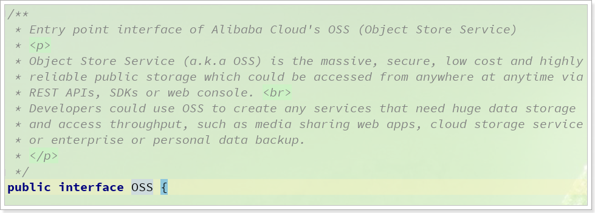

我们在`ly-auth-service`的`com.leyou.auth.config`定义一个配置类，将OSS注入到Spring容器：

```java
package com.leyou.auth.config;

import com.aliyun.oss.OSS;
import com.aliyun.oss.OSSClientBuilder;
import org.springframework.context.annotation.Bean;
import org.springframework.context.annotation.Configuration;


@Configuration
public class OSSConfig {

    @Bean
    public OSS ossClient(OSSProperties prop){
        return new OSSClientBuilder()
                .build(prop.getEndpoint(), prop.getAccessKeyId(), prop.getAccessKeySecret());
    }
}
```


### 2.6.3.service

定义业务代码，改造阿里提供的Demo，将结果封装为DTO返回.

在`ly-auth-service`的`com.leyou.auth.service`中定义Service接口：

```java
package com.leyou.auth.service;

import com.leyou.auth.dto.AliOssSignatureDTO;


public interface AliAuthService {

    /**
     * 生成OSS的文件签名
     */
    AliOssSignatureDTO getSignature();
}
```

在`ly-auth-service`的`com.leyou.auth.service.impl`中定义Service的实现类：

```java
package com.leyou.auth.service;

import com.aliyun.oss.OSS;
import com.aliyun.oss.common.utils.BinaryUtil;
import com.aliyun.oss.model.MatchMode;
import com.aliyun.oss.model.PolicyConditions;
import com.leyou.auth.config.OSSProperties;
import com.leyou.auth.dto.AliOssSignatureDTO;
import lombok.extern.slf4j.Slf4j;
import org.springframework.stereotype.Service;

import java.util.Date;


@Slf4j
@Service
public class AliAuthServiceImpl implements AliAuthService{

    private OSSProperties prop;

    private OSS client;

    public AliAuthServiceImpl(OSSProperties ossProperties, OSS client) {
        this.prop = ossProperties;
        this.client = client;
    }

    public AliOssSignatureDTO getSignature() {
        try {
            // 1.计算过期时间
            long expireTime = prop.getExpireTime();
            long expireEndTime = System.currentTimeMillis() + expireTime;
            Date expiration = new Date(expireEndTime);

            // 2.设置上传策略
            PolicyConditions policyConds = new PolicyConditions();
            // 2.1.文件大小限制
            policyConds.addConditionItem(PolicyConditions.COND_CONTENT_LENGTH_RANGE, 0, prop.getMaxFileSize());
            // 2.2.上传目录
            policyConds.addConditionItem(MatchMode.StartWith, PolicyConditions.COND_KEY, prop.getDir());
            // 2.3.生成策略
            String postPolicy = client.generatePostPolicy(expiration, policyConds);
            // 2.4.编码
            byte[] binaryData = postPolicy.getBytes("utf-8");
            String encodedPolicy = BinaryUtil.toBase64String(binaryData);
            // 3.生成签名
            String postSignature = client.calculatePostSignature(postPolicy);

            // 4.封装要返回的结果
            return AliOssSignatureDTO.of(prop.getAccessKeyId(), prop.getHost(), encodedPolicy, postSignature, expireEndTime, prop.getDir());
        } catch (Exception e) {
            log.error("上传文件失败，原因：{}", e.getMessage(), e);
            throw new RuntimeException("文件上传失败！", e);
        }
    }
}
```


### 2.6.4.补全controller

我们给`ly-auth-service`的`com.leyou.auth.web`包中的`AliAuthController`补全业务，调用`AliAuthService`：

```java
package com.leyou.auth.web;

import com.leyou.auth.dto.AliOssSignatureDTO;
import com.leyou.auth.service.AliAuthService;
import org.springframework.http.ResponseEntity;
import org.springframework.web.bind.annotation.GetMapping;
import org.springframework.web.bind.annotation.RequestMapping;
import org.springframework.web.bind.annotation.RestController;

/**
 * 阿里的相关授权接口
 *
 * 
 */
@RestController
@RequestMapping("ali")
public class AliAuthController {

    private AliAuthService aliAuthService;

    public AliAuthController(AliAuthService aliAuthService) {
        this.aliAuthService = aliAuthService;
    }

    /**
     * 申请oss签名
     *
     * @return 包含签名、图片验证策略等信息
     */
    @GetMapping("/oss/signature")
    public ResponseEntity<AliOssSignatureDTO> getAliSignature() {
        return ResponseEntity.ok(aliAuthService.getSignature());
    }

}
```


## 2.7.启动测试

启动`ly-auth-service`，并重启`ly-auth-gateway`，然后测试上传功能。

发现签名正确返回了：

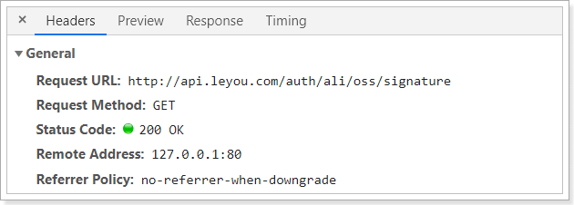 

结果：

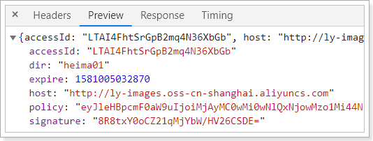 

但是上传失败了，返回了403的状态码：

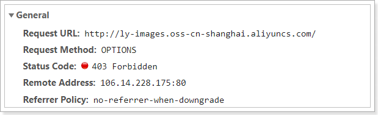 

控制台也报错了：

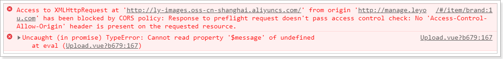

这是跨域问题。


## 2.8.解决跨域问题

我们在`manage.leyou.com`访问`aliyuncs.com`是跨域访问，需要设置跨域许可。

在阿里OSS的控制台看到这样的信息：

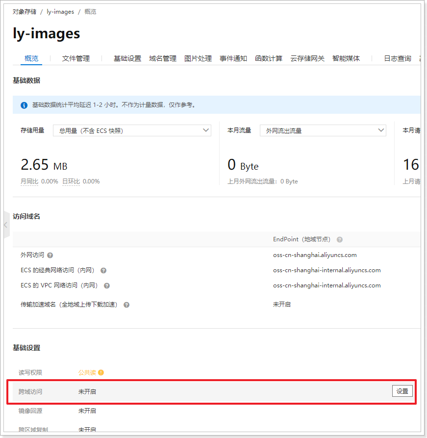

我们点击设置，进入设置页面：

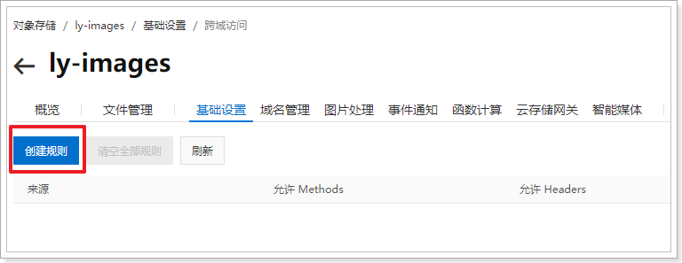

点击创建规则，进入跨域请求填写表单：

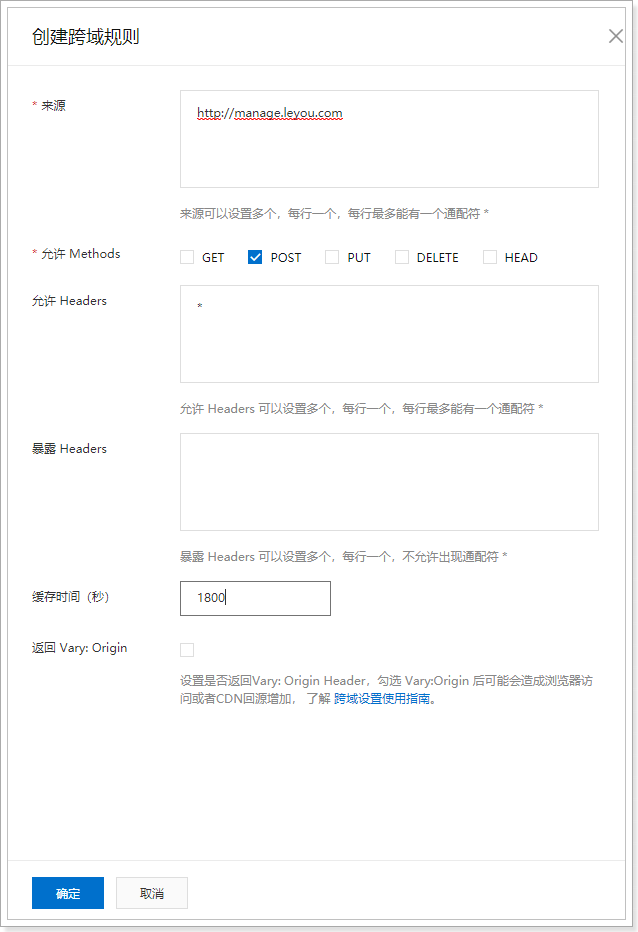 

填写完成后，再次测试：

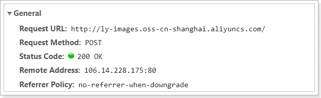 

回显：

 

上传成功！


# 3.清理无用图片（实战作业）

用户上传图片后，如果并未提交表单，则这张图片无效，需要清理。大家自己试试看怎么做。