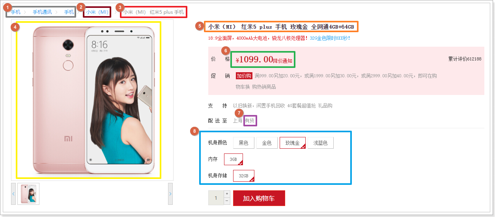
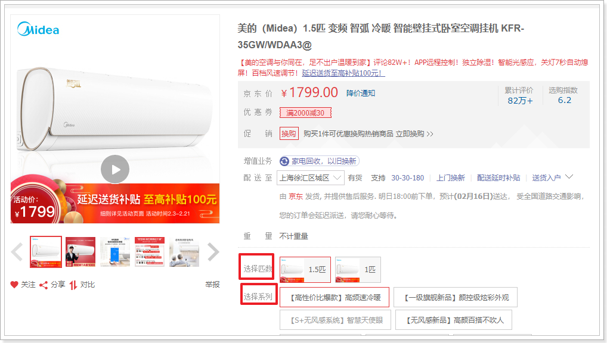
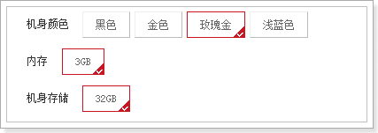
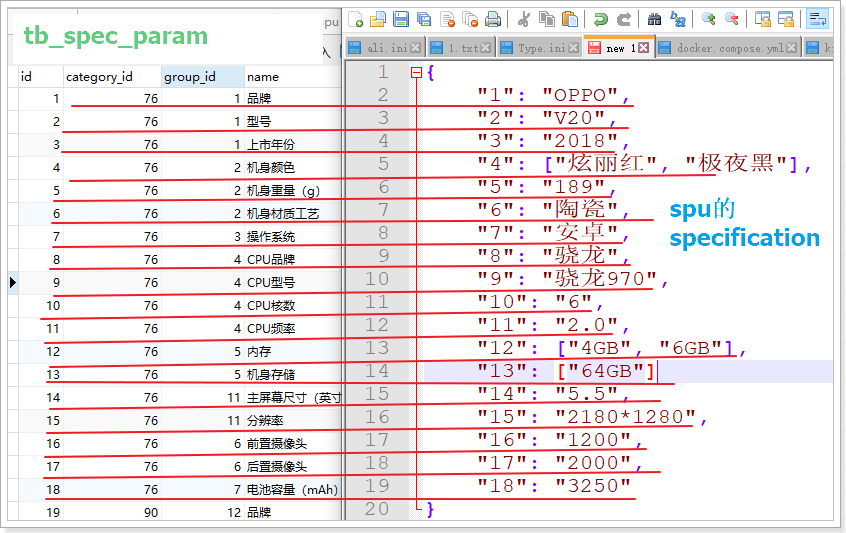
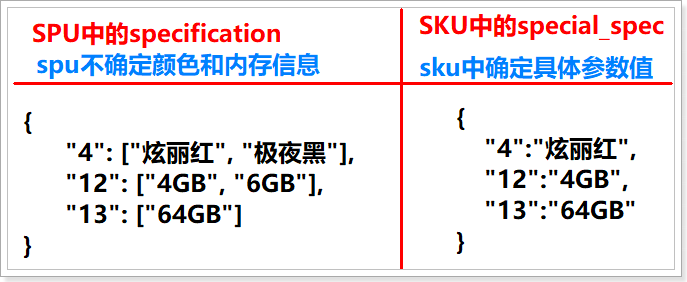
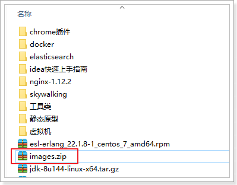
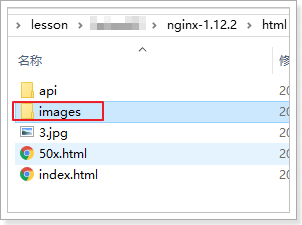
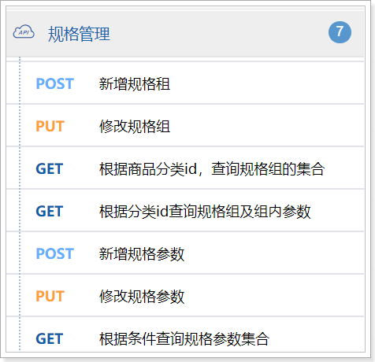

# day04-商品设计


# 0.学习目标

- 理解商品规格参数数据结构
- 理解商品SPU和SKU数据结构
- 完成规格参数的业务接口
- 完成商品的业务接口


# 1.商品数据结构设计

商品是电商的核心，而商品数据结构的设计也决定了一个电商网站的很多业务走向。

## 1.1.商品数据分析

我们先看一下我们乐优商城的商品页面结构：



包括的数据：

- ①：商品分类信息
- ②：商品品牌信息
- ③：商品名称
- ④：商品图片
- ⑤：商品标题
- ⑥：商品价格
- ⑦：商品库存
- ⑧：商品属性
  - 颜色
  - 内存
  - 机身存储

我们是不是可以这样设计商品表，把商品的内容都作为商品表的字段：

| id   | 分类 | 品牌 | 名称  | 图片   | 价格 | 库存 | 颜色   | 内存 | 存储 |      |
| ---- | ---- | ---- | ----- | ------ | ---- | ---- | ------ | ---- | ---- | ---- |
| 1    | 手机 | 小米 | 红米5 | xx.jpg | 1099 | 99   | 玫瑰金 | 3G   | 32G  |      |
|      |      |      |       |        |      |      |        |      |      |      |

但是如果这个商品不是手机，而是一个空调呢？



空调中会多出两个属性：

- 匹数
- 系列

电视呢？可能会多出：尺寸、型号这样的属性

衣服呢？可能会多出：尺码、颜色这样的属性

水果呢？可能会多出：重量、品种这样的属性

于是，商品表设计就会变成这样：

| id   | 分类 | 品牌  | 名称           | 图片   | 价格  | 库存 | 颜色   | 内存 | 存储 | 尺寸 | 型号         | 尺码 | 重量     | 品种   | ..   |
| ---- | ---- | ----- | -------------- | ------ | ----- | ---- | ------ | ---- | ---- | ---- | ------------ | ---- | -------- | ------ | ---- |
| 1    | 手机 | 小米  | 红米5          | xx.jpg | 1099  | 99   | 玫瑰金 | 3G   | 32G  |      |              |      |          |        |      |
| 2    | 电视 | TCL   | TCL55V6        | yy.jpg | 2399  | 12   |        |      |      | 55   | 55英寸声控v6 |      |          |        |      |
| 3    | 卫衣 | ED.HD | ED.HD卫衣男    | zz.jpg | 109   | 99   | 黄色   |      |      |      |              | XL   |          |        |      |
| 4    | 苹果 | 京觅  | 京觅烟台红富士 | 11.jpg | 38.80 | 66   |        |      |      |      |              |      | 190~240g | 红富士 |      |


发现问题了吗？

不同种类的商品，有不同的属性，如果这样设计表，那么表中的字段会存在问题：

- 字段过多：随着商品分类越来越多，表的字段数量越来越多，达到数万个字段
- 字段不确定：商品分类是会改变的，因此属性也会变，字段就要跟着变
- 字段利用率低：如果商品是手机，只会用到跟手机有关字段，其他字段就无用


那么我们该怎么设计商品表呢？

既然不同分类商品，其属性不同，说明属性是与商品无关的字段，应该与商品分类有关。

这样商品表的设计就不包含属性字段，就简化了：

| id   | 分类 | 品牌 | 名称  | 图片   | 价格 | 库存 | ..   |
| ---- | ---- | ---- | ----- | ------ | ---- | ---- | ---- |
| 1    | 手机 | 小米 | 红米5 | xx.jpg | 1099 | 99   |      |
|      |      |      |       |        |      |      |      |

那么商品的属性怎么办？

每一个种类的商品，就有一套对应的属性。我们把这个分类对应的一套属性，称为一套规格参数（specification）模板，设计一张独立的表，而后与商品分类关联。

当需要知道一个商品的属性有哪些，只要知道商品属于哪个商品分类，然后找到该商品分类对应的规格参数模板即可！

## 1.2.商品规格参数设计

规格参数模板与分类有关，我们可以设计规格参数表，然后与商品分类关联。一个分类，对应多个规格参数，形成一对多关系，让商品规格与商品分类关联即可。

商品规格表设计如下：

```sql
CREATE TABLE `tb_spec_param` (
  `id` bigint(20) NOT NULL AUTO_INCREMENT COMMENT '主键',
  `category_id` bigint(20) NOT NULL COMMENT '商品分类id',
  `group_id` bigint(20) NOT NULL COMMENT '规格参数所属的组id',
  `name` varchar(128) NOT NULL COMMENT '参数名',
  `numeric` tinyint(1) NOT NULL COMMENT '是否是数字类型参数，true或false',
  `unit` varchar(64) DEFAULT '' COMMENT '数字类型参数的单位，非数字类型可以为空',
  `generic` tinyint(1) NOT NULL COMMENT '是否是sku通用属性，true或false',
  `searching` tinyint(1) NOT NULL COMMENT '是否用于搜索过滤，true或false',
  `segments` varchar(1024) DEFAULT '' COMMENT '数值类型参数，如果需要搜索，则添加分段间隔值，如CPU频率区间：0.5-1.0,1.1~1.5',
  `options` varchar(1024) DEFAULT '' COMMENT '参数的可选值，不允许用户自己填值',
  `create_time` timestamp NOT NULL DEFAULT CURRENT_TIMESTAMP,
  `update_time` timestamp NOT NULL DEFAULT CURRENT_TIMESTAMP ON UPDATE CURRENT_TIMESTAMP,
  PRIMARY KEY (`id`),
  KEY `key_group` (`group_id`),
  KEY `key_category` (`category_id`)
) ENGINE=InnoDB AUTO_INCREMENT=42 DEFAULT CHARSET=utf8 COMMENT='规格参数组下的参数名';
```

这张表中，除了id、name、category_id外，还多出了一些字段，我们一一解释。

### 1.2.1.规格组

一个商品分类，包含的规格参数其实远不止3个，例如：

 

为了方便管理，我们需要对规格参数分组，定义了一个规格组表(tb_spec_group)。一个规格组对应多个规格参数，一对多关系，在规格参数中持有规格组的id：

- group_id：当前规格参数所属的规格组的id


规格组与分类有关，表结构如下：

tb_spec_group:

```sql
CREATE TABLE `tb_spec_group` (
  `id` bigint(20) NOT NULL AUTO_INCREMENT COMMENT '主键',
  `category_id` bigint(20) NOT NULL COMMENT '商品分类id,一个分类包含多个规格组',
  `name` varchar(32) NOT NULL COMMENT '规格组的名称',
  `create_time` timestamp NOT NULL DEFAULT CURRENT_TIMESTAMP,
  `update_time` timestamp NOT NULL DEFAULT CURRENT_TIMESTAMP ON UPDATE CURRENT_TIMESTAMP,
  PRIMARY KEY (`id`),
  KEY `key_category` (`category_id`)
) ENGINE=InnoDB AUTO_INCREMENT=19 DEFAULT CHARSET=utf8 COMMENT='规格参数的分组表,每个商品分类下有多个规格参数组';
```


### 1.2.2.数值类型

某些规格参数可能为数值类型，我们需要标记出来，并且记录单位：

​	 

我们有两个字段来描述：

- numberic：是否为数值类型
  - true：数值类型
  - false：不是数值类型
- unit：参数的单位

### 1.2.3.搜索字段

打开一个搜索页，我们来看看过滤的条件：


你会发现，过滤条件中的屏幕尺寸、运行内存、网路、机身内存、电池容量、CPU核数等，在规格参数中都能找到：

 

也就是说，规格参数中的数据，将来会有一部分作为搜索条件来使用。我们可以在设计时，将这部分属性标记出来，将来做搜索的时候，作为过滤条件。

与搜索相关的有两个字段：

- searching：标记是否用作过滤
  - true：用于过滤搜索
  - false：不用于过滤
- segments：某些数值类型的参数，在搜索时需要按区间划分，这里提前确定好划分区间
  - 比如电池容量，0~2000mAh，2000mAh~3000mAh，3000mAh~4000mAh


### 1.2.4.通用属性

商品的规格属性有很多：

 

但是，大部分属性都是比较通用的属性，但是有少数属性，用于区分商品，例如手机颜色、内存等。这样的属性会出现在页面上供用户选择：

 

这种是特殊属性。

为了区分通用属性和特殊属性，我们定义了一个字段：

- generic：是否是通用属性，布尔类型。true：通用属性，false：特殊属性。


### 1.2.5.待选项

有一些规格属性，在用户填写属性值时，不能任意填写，需要在规定的数据内选择。所以我们可以定义一些供选择待选项。

- options：规格参数的值的待选项

例如，手机的机身存储，我们给出了下列待选项：


## 1.3.商品设计

现在，每个种类的商品，都有了自己的一套规格参数。不过，该分类下的具体每个商品，其规格参数的值不同，这个值显然是跟商品有关的，需要记录在商品表中。

不过，我们需要先设计商品表才可以。而商品，离不开SPU和SKU这两个概念。

### 1.3.1.什么是SPU和SKU

SPU：Standard Product Unit （标准产品单位） ，一组具有共同属性的商品集

SKU：Stock Keeping Unit（库存量单位），SPU商品集因具体特性不同而细分的每个商品

以图为例来看：


- 本页的 华为Mate10 就是一个商品集，即SPU。
- 因为颜色、内存等不同，而细分出不同的Mate10，如亮黑色128G版、亮黑色64G版本。这就是不同的SKU。

可以看出：

- 一个SPU中包含多个SKU

- SPU是一个抽象的商品集概念，为了方便后台的管理。
- SKU才是具体要销售的商品，每一个SKU的价格、库存可能会不一样，用户购买的是SKU而不是SPU


### 1.3.2.为什么需要SPU和SKU

虽然一个SPU中包含多个SKU，例如亮黑色128G版Mate10、亮黑色64G版本的Mate10。但是，不同SKU的属性其实大部分是相同的，例如：

- 商品所属分类
- 商品品牌
- 商品名称
- 商品描述
- 商品包装
- 商品售后
- 商品重量、CPU、屏幕尺寸、电池容量等规格参数值信息

如果只有sku表，那么每个SKU都保存自己的一份数据，将会有大量的数据重复，而且不方便后期的维护和管理。因此，我们用SPU来整合一组SKU，方便管理SKU的共性数据，SKU表只记录每个SKU的特有属性。

因此，SPU和SKU表保存的数据也不一样：

- SPU：一组SKU的共性数据
- SKU：每个SKU的特有数据

### 1.3.3.SPU数据结构

spu保存的是一组SKU的共性数据，例如：

- 商品所属分类
- 商品品牌
- 商品名称
- 商品描述
- 商品包装
- 商品售后
- 商品重量、CPU、屏幕尺寸、电池容量等规格参数值信息

其数据结构如下：

`tb_spu`表：

```sql
CREATE TABLE `tb_spu` (
  `id` bigint(20) NOT NULL AUTO_INCREMENT COMMENT 'spu id',
  `name` varchar(256) NOT NULL DEFAULT '' COMMENT '商品名称',
  `title` varchar(256) NOT NULL DEFAULT '' COMMENT '商品标签,搜索关键字信息',
  `cid1` bigint(20) NOT NULL COMMENT '1级类目id',
  `cid2` bigint(20) NOT NULL COMMENT '2级类目id',
  `cid3` bigint(20) NOT NULL COMMENT '3级类目id',
  `brand_id` bigint(20) NOT NULL COMMENT '商品所属品牌id',
  `saleable` tinyint(1) NOT NULL DEFAULT '1' COMMENT '是否上架，0下架，1上架',
  `create_time` timestamp NOT NULL DEFAULT CURRENT_TIMESTAMP COMMENT '添加时间',
  `update_time` timestamp NOT NULL DEFAULT CURRENT_TIMESTAMP ON UPDATE CURRENT_TIMESTAMP COMMENT '最后修改时间',
  PRIMARY KEY (`id`)
) ENGINE=InnoDB AUTO_INCREMENT=190 DEFAULT CHARSET=utf8 COMMENT='spu表;
```

与我们前面分析的基本类似，但是似乎少了一些字段，比如:

- 商品描述
- 包装清单
- 售后服务
- 规格参数值信息


我们做了表的垂直拆分，将SPU的详情放到了另一张表：`tb_spu_detail`

```sql
CREATE TABLE `tb_spu_detail` (
  `spu_id` bigint(20) NOT NULL COMMENT '商品spu的id，与spu表一对一',
  `description` text COMMENT '商品描述信息',
  `specification` varchar(1024) NOT NULL DEFAULT '' COMMENT '规格参数值',
  `packing_list` varchar(1024) DEFAULT '' COMMENT '包装清单',
  `after_service` varchar(1024) DEFAULT '' COMMENT '售后服务',
  `create_time` timestamp NOT NULL DEFAULT CURRENT_TIMESTAMP,
  `update_time` timestamp NOT NULL DEFAULT CURRENT_TIMESTAMP ON UPDATE CURRENT_TIMESTAMP,
  PRIMARY KEY (`spu_id`)
) ENGINE=InnoDB DEFAULT CHARSET=utf8;
```

这张表中的数据都比较大，为了不影响主表的查询效率我们拆分出这张表。

需要注意的字段是`specification`字段，其中保存的是该商品对应的规格参数值。

例如：

```json
{
	"1": "OPPO",
	"2": "V20",
	"3": "2018",
	"5": "189",
	"6": "陶瓷",
	"7": "安卓",
	"8": "骁龙",
	"9": "骁龙970",
	"10": "6",
	"11": "2.0",
	"14": "5.5",
	"15": "2180*1280",
	"16": "1200",
	"17": "2000",
	"18": "3250",
	"4": ["炫丽红", "极夜黑"],
	"12": ["4GB", "6GB"],
	"13": ["64GB"]
}
```

json结构，其中都是键值对：

- key：该商品所属商品分类的规格参数的id
- value：对应规格参数的值




### 1.3.4.SKU数据结构

sku中保存的是每个SKU不同的属性，包括：

- 商品标题
- 商品价格
- 商品库存
- 商品图片
- 商品特有的规格属性，比如具体的颜色、内存等
- spu表id，要与SPU表关联

表结构如下：

```sql
CREATE TABLE `tb_sku` (
  `id` bigint(20) NOT NULL AUTO_INCREMENT COMMENT '主键',
  `spu_id` bigint(20) NOT NULL COMMENT 'spu表的id',
  `title` varchar(1024) NOT NULL DEFAULT '' COMMENT '商品sku的标题',
  `images` varchar(1024) DEFAULT '' COMMENT '商品的图片，多个图片以‘,’分割',
  `stock` int(8) unsigned DEFAULT '9999' COMMENT '库存',
  `price` bigint(16) NOT NULL DEFAULT '0' COMMENT '销售价格，单位为分',
  `indexes` varchar(32) DEFAULT '' COMMENT '属性下标',
  `sold` bigint(20) unsigned DEFAULT '0' COMMENT '销量',
  `special_spec` varchar(1024) DEFAULT '' COMMENT 'sku的特有规格参数键值对，json格式',
  `saleable` tinyint(1) NOT NULL DEFAULT '1' COMMENT '是否上架，0下架，1上架',
  `create_time` timestamp NOT NULL DEFAULT CURRENT_TIMESTAMP COMMENT '添加时间',
  `update_time` timestamp NOT NULL DEFAULT CURRENT_TIMESTAMP ON UPDATE CURRENT_TIMESTAMP COMMENT '最后修改时间',
  PRIMARY KEY (`id`),
  KEY `key_spu_id` (`spu_id`) USING BTREE
) ENGINE=InnoDB AUTO_INCREMENT=27359021573 DEFAULT CHARSET=utf8 COMMENT='sku表,该表表示具体的商品实体,如黑色的 64g的iphone 8';
```


其中，比较特殊的字段是：`special_spec`，其数据结构如下：

```json
{
    "4":"炫丽红",
    "12":"4GB",
    "13":"64GB"
}
```

我们与SPU中的Specification对比：

 

spu记录的是这个spu下的sku具备的所有颜色、内存的可能性

sku记录的是当前sku的具体颜色、内存值

## 1.4.导入商品图片数据

我们的商品表中，有很多的商品图片信息，例如：

http://image.leyou.com/images/8/11/1524297319952.jpg

这个图片对应的url地址是不存在的，但是我们课前资料中提供了这些图片：

 

因此，我们可以把这些图片解压出来，放到一个web服务器，对外开放即可。


这里，我们可以选择Nginx作为web服务器，吧images解压到nginx的html目录：

 

接下来，就是让 image.leyou.com 能够指向nginx下的html目录：

- 让image.leyou.com 指向127.0.0.1，域名解析

- 在nginx中配置反向代理，指向HTML目录：

  ```nginx
  server {
  	listen       80;
  	server_name  image.leyou.com;
  
  	location / {
  		# 默认资源去nginx目录下的html目录寻找
  		root   html;
  		index  index.html index.htm;
  	}
  }
  ```

  


# 2.规格参数业务

查看规格参数相关接口：

 

## 2.1.基本代码

### 2.1.1.实体类

在`ly-item-servicce`的`com.leyou.item.entity`包下，添加实体类

规格组：

```java
package com.leyou.item.entity;

import com.baomidou.mybatisplus.annotation.TableId;
import com.baomidou.mybatisplus.annotation.TableName;
import com.leyou.common.entity.BaseEntity;
import lombok.Data;
import lombok.EqualsAndHashCode;

@TableName("tb_spec_group")
@Data
@EqualsAndHashCode(callSuper = false)
public class SpecGroup extends BaseEntity {
    @TableId
    private Long id;
    private Long categoryId;
    private String name;
}
```

规格参数：

```java
package com.leyou.item.entity;

import com.baomidou.mybatisplus.annotation.TableField;
import com.baomidou.mybatisplus.annotation.TableId;
import com.baomidou.mybatisplus.annotation.TableName;
import com.leyou.common.entity.BaseEntity;
import lombok.Data;
import lombok.EqualsAndHashCode;

@TableName("tb_spec_param")
@Data
@EqualsAndHashCode(callSuper = false)
public class SpecParam extends BaseEntity {
    @TableId
    private Long id;
    private Long categoryId;
    private Long groupId;
    @TableField("`name`")
    private String name;
    @TableField("`numeric`")
    private Boolean numeric;
    private String unit;
    private Boolean generic;
    private Boolean searching;
    private String segments;
    private String options;
}
```

注意，numeric是数据库关键字，为了防止查询语句出错，需要给字段加上转义字符：==`==

### 2.1.2.DTO

在`ly-item-pojo`的`com.leyou.item.dto`包下，添加DTO

规格组的DTO

```java
package com.leyou.item.dto;

import com.leyou.common.dto.BaseDTO;
import com.leyou.common.entity.BaseEntity;
import lombok.Data;
import lombok.EqualsAndHashCode;
import lombok.NoArgsConstructor;

import java.util.Collection;
import java.util.List;
import java.util.stream.Collectors;


@Data
@NoArgsConstructor
@EqualsAndHashCode(callSuper = false)
public class SpecGroupDTO extends BaseDTO {
    private Long id;

    private Long categoryId;

    private String name;

    private List<SpecParamDTO> params;

    public SpecGroupDTO(BaseEntity entity) {
        super(entity);
    }

    public static <T extends BaseEntity> List<SpecGroupDTO> convertEntityList(Collection<T> list) {
        if(list == null){
			return Collections.emptyList();
		}
        return list.stream().map(SpecGroupDTO::new).collect(Collectors.toList());
    }
}
```

规格参数DTO：

```java
package com.leyou.item.dto;

import com.leyou.common.dto.BaseDTO;
import com.leyou.common.entity.BaseEntity;
import lombok.Data;
import lombok.EqualsAndHashCode;
import lombok.NoArgsConstructor;

import java.util.Collection;
import java.util.List;
import java.util.stream.Collectors;

@Data
@NoArgsConstructor
@EqualsAndHashCode(callSuper = false)
public class SpecParamDTO extends BaseDTO {
    private Long id;
    private Long categoryId;
    private Long groupId;
    private String name;
    private Boolean numeric;
    private String unit;
    private Boolean generic;
    private Boolean searching;
    private String segments;
    private String options;

    public SpecParamDTO(BaseEntity entity) {
        super(entity);
    }

    public static <T extends BaseEntity> List<SpecParamDTO> convertEntityList(Collection<T> list) {
        if(list == null){
			return Collections.emptyList();
		}
        return list.stream().map(SpecParamDTO::new).collect(Collectors.toList());
    }
}
```

### 2.1.3.mapper

在`ly-item-service`的`com.leyou.item.mapper`包下，添加mapper。

规格组mapper：

```java
package com.leyou.item.mapper;

import com.baomidou.mybatisplus.core.mapper.BaseMapper;
import com.leyou.item.entity.SpecGroup;


public interface SpecGroupMapper extends BaseMapper<SpecGroup> {
}
```

规格参数Mapper：

```java
package com.leyou.item.mapper;

import com.baomidou.mybatisplus.core.mapper.BaseMapper;
import com.leyou.item.entity.SpecParam;


public interface SpecParamMapper extends BaseMapper<SpecParam> {
}
```

### 2.1.4.service

在`ly-item-service`的`com.leyou.item.service`包中，添加`service`接口：

规格组：

```java
package com.leyou.item.service;

import com.baomidou.mybatisplus.extension.service.IService;
import com.leyou.item.entity.SpecGroup;


public interface SpecGroupService extends IService<SpecGroup> {
}
```

规格参数：

```java
package com.leyou.item.service;

import com.baomidou.mybatisplus.extension.service.IService;
import com.leyou.item.entity.SpecParam;


public interface SpecParamService extends IService<SpecParam> {
}
```


在`ly-item-service`的`com.leyou.item.service.impl`包中，添加`service`的实现类：

规格组：

```java
package com.leyou.item.service.impl;

import com.baomidou.mybatisplus.extension.service.impl.ServiceImpl;
import com.leyou.item.entity.SpecGroup;
import com.leyou.item.mapper.SpecGroupMapper;
import com.leyou.item.service.SpecGroupService;
import org.springframework.stereotype.Service;


@Service
public class SpecGroupServiceImpl extends ServiceImpl<SpecGroupMapper, SpecGroup> implements SpecGroupService {
}
```


规格参数：

```java
package com.leyou.item.service.impl;

import com.baomidou.mybatisplus.extension.service.impl.ServiceImpl;
import com.leyou.item.entity.SpecParam;
import com.leyou.item.mapper.SpecParamMapper;
import com.leyou.item.service.SpecParamService;
import org.springframework.stereotype.Service;


@Service
public class SpecParamServiceImpl extends ServiceImpl<SpecParamMapper, SpecParam> implements SpecParamService {
}
```

### 2.1.5.controller

在`ly-item-service`的` com.leyou.item.web`包中，添加controller代码：

```java
package com.leyou.item.web;

import com.leyou.common.exception.LyException;
import com.leyou.item.dto.SpecGroupDTO;
import com.leyou.item.dto.SpecParamDTO;
import com.leyou.item.entity.SpecGroup;
import com.leyou.item.entity.SpecParam;
import com.leyou.item.service.SpecGroupService;
import com.leyou.item.service.SpecParamService;
import org.springframework.beans.factory.annotation.Autowired;
import org.springframework.http.HttpStatus;
import org.springframework.http.ResponseEntity;
import org.springframework.web.bind.annotation.*;

import java.util.List;


@RestController
@RequestMapping("spec")
public class SpecController {

    private SpecGroupService groupService;
    private SpecParamService paramService;

    public SpecController(SpecGroupService groupService, SpecParamService paramService) {
        this.groupService = groupService;
        this.paramService = paramService;
    }
}

```


## 2.2.根据分类查询规格组

### 2.2.1接口声明

- 接口地址： `/spec/groups/of/category`
- 请求方式 ：`GET`
- 请求参数 ：`long`，商品分类id
-  返回值类型 ：`["application/json"]`

**请求参数**

| 参数名称 | 参数说明   | 请求类型 | 是否必须 | 数据类型 | schema |
| -------- | ---------- | -------- | -------- | -------- | ------ |
| id       | 商品分类id | query    | true     | integer  |        |

**实体**

| 参数名称   | 参数说明   | 类型           | schema         |
| ---------- | ---------- | -------------- | -------------- |
| categoryId | 商品分类id | integer(int64) | integer(int64) |
| id         | 规格租id   | integer(int64) | integer(int64) |
| name       | 规格组名称 | string         |                |

**响应示例**


```json
[
	{
		"categoryId": 0,
		"id": 0,
		"name": ""
	}
]
```


### 2.2.2.业务实现

在`ly-item-service`的` com.leyou.item.web`包的`SpecController`中添加代码：

```java
/**
     * 根据商品分类查询规格组
     * @param id 商品分类id
     * @return 规格组集合
     */
@GetMapping("/groups/of/category")
public ResponseEntity<List<SpecGroupDTO>> queryGroupByCategory(
    @RequestParam("id") Long id){
    return ResponseEntity.ok(
        SpecGroupDTO.convertEntityList(
            groupService.query().eq("category_id", id).list()
        )
    );
}
```


## 2.3.查询规格参数集合

### 2.3.1接口声明

- 接口地址： `/spec/params`
- 请求方式 ：`GET`
- 请求参数类型：`基本类型包装类`
-  返回值类型 ：`["application/json"]`


**请求参数**

| 参数名称   | 参数说明   | 请求类型 | 是否必须 | 数据类型 | schema |
| ---------- | ---------- | -------- | -------- | -------- | ------ |
| categoryId | 商品分类id | query    | false    | integer  |        |
| groupId    | 规格租id   | query    | false    | integer  |        |
| searching  | 是否搜索   | query    | false    | boolean  |        |


**响应参数**

| 参数名称   | 参数说明       | 类型           | schema         |
| ---------- | -------------- | -------------- | -------------- |
| categoryId | 商品分类ID     | integer(int64) | integer(int64) |
| generic    | 是否是普通参数 | boolean        |                |
| groupId    | 规格组ID       | integer(int64) | integer(int64) |
| id         | 规格参数ID     | integer(int64) | integer(int64) |
| name       | 规格参数名称   | string         |                |
| numeric    | 是否是数值类型 | boolean        |                |
| options    | 规格参数待选项 | string         |                |
| searching  | 是否参与搜索   | boolean        |                |
| segments   | 可选数值范围   | string         |                |
| unit       |                | 数值单位       | 数值单位       |


**响应示例**


```json
[
	{
		"categoryId": 0,
		"generic": true,
		"groupId": 0,
		"id": 0,
		"name": "",
		"numeric": true,
		"options": "",
		"searching": true,
		"segments": "",
		"unit": ""
	}
]
```

### 2.3.2.业务实现

在`ly-item-service`的` com.leyou.item.web`包的`SpecController`中添加代码：

```java
/**
     * 查询规格参数集合
     * @param categoryId 分类id
     * @param groupId 规格组id
     * @param searching 是否搜索
     * @return 参数集合
     */
@GetMapping("params")
public ResponseEntity<List<SpecParamDTO>> querySpecParams(
    @RequestParam(value = "categoryId", required = false) Long categoryId,
    @RequestParam(value = "groupId", required = false) Long groupId,
    @RequestParam(value = "searching", required = false) Boolean searching
){
    return ResponseEntity.ok(paramService.queryParams(categoryId, groupId, searching));
}
```


在`ly-item-service`的` com.leyou.item.service`包的`SpecParamService`接口中添加代码：

```java
List<SpecParamDTO> queryParams(Long categoryId, Long groupId, Boolean searching);
```


在`ly-item-service`的` com.leyou.item.service.impl`包的`SpecParamServiceImpl`中添加代码：

```java
@Override
public List<SpecParamDTO> queryParams(Long categoryId, Long groupId, Boolean searching) {
    // 健壮性判断
    if(categoryId == null && groupId == null){
        // 条件不能都为空
        throw new LyException(400, "查询条件不能为空！");
    }
    // 查询
    List<SpecParam> list = query()
        .eq(categoryId != null, "category_id", categoryId)
        .eq(groupId != null, "group_id", groupId)
        .eq(searching != null, "searching", searching)
        .list();
    // 返回
    return SpecParamDTO.convertEntityList(list);
}
```


## 2.4.新增规格组(实战作业)

### 2.4.1接口声明

- 接口地址 ： `/spec/group`
- 请求方式 ：`POST`
- 请求参数类型 ：`["application/json"]`
-  返回值类型 ：无

**请求参数**

| 参数名称 | 参数说明 | 请求类型 | 是否必须 | 数据类型     | schema       |
| -------- | -------- | -------- | -------- | ------------ | ------------ |
| groupDTO | groupDTO | Object   | true     | SpecGroupDTO | SpecGroupDTO |

**SpecGroupDTO**

| 参数名称   | 参数说明   | 请求类型 | 是否必须 | 数据类型       | schema |
| ---------- | ---------- | -------- | -------- | -------------- | ------ |
| categoryId | 商品分类id | body     | false    | integer(int64) |        |
| id         | 规格租id   | body     | false    | integer(int64) |        |
| name       | 规格组名称 | body     | false    | string         |        |


**响应状态**

| 状态码 | 说明         | schema |
| ------ | ------------ | ------ |
| 201    | 新增成功     |        |
| 401    | Unauthorized |        |
| 403    | Forbidden    |        |
| 404    | Not Found    |        |


**响应参数**

暂无


### 2.4.2.业务实现

在`ly-item-service`的` com.leyou.item.web`包的`SpecController`中添加代码：

```java
/**
     * 新增规格组
     * @param groupDTO 规格组信息
     * @return 无
     */
@PostMapping("group")
public ResponseEntity<Void> saveGroup(@RequestBody SpecGroupDTO groupDTO){
    // 新增规格组
    groupService.save(groupDTO.toEntity(SpecGroup.class));
    // 返回结果
    return ResponseEntity.status(HttpStatus.CREATED).build();
}
```


## 2.5.修改规格组(实战作业)

### 2.5.1接口声明

- 接口地址 ： `/spec/group`
- 请求方式 ：`PUT`
- 请求参数类型 ：`["application/json"]`
-  返回值类型 ：无

**请求参数**

| 参数名称 | 参数说明 | 请求类型 | 是否必须 | 数据类型     | schema       |
| -------- | -------- | -------- | -------- | ------------ | ------------ |
| groupDTO | groupDTO | Object   | true     | SpecGroupDTO | SpecGroupDTO |

**SpecGroupDTO**

| 参数名称   | 参数说明   | 请求类型 | 是否必须 | 数据类型       | schema |
| ---------- | ---------- | -------- | -------- | -------------- | ------ |
| categoryId | 商品分类id | body     | false    | integer(int64) |        |
| id         | 规格租id   | body     | false    | integer(int64) |        |
| name       | 规格组名称 | body     | false    | string         |        |

**响应状态**

| 状态码 | 说明         | schema |
| ------ | ------------ | ------ |
| 204    | 修改成功     |        |
| 401    | Unauthorized |        |
| 403    | Forbidden    |        |
| 404    | Not Found    |        |


**响应参数**

暂无


### 2.5.2.业务实现

在`ly-item-service`的` com.leyou.item.web`包的`SpecController`中添加代码：

```java
/**
     * 修改规格组
     * @param groupDTO 规格组信息
     * @return 无
     */
@PutMapping("group")
public ResponseEntity<Void> updateGroup(
    @RequestBody SpecGroupDTO groupDTO){
    // 更新规格组
    groupService.updateById(groupDTO.toEntity(SpecGroup.class));
    // 返回结果
    return ResponseEntity.status(HttpStatus.NO_CONTENT).build();
}
```


## 2.6.新增规格参数(实战作业)

### 2.6.1接口声明

- 接口地址：`/spec/param`
- 请求方式 ： `POST`
- 请求参数 ： `["application/json"]`
-  返回值类型 ：无

**请求参数**

| 参数名称 | 参数说明 | 请求类型 | 是否必须 | 数据类型     | schema       |
| -------- | -------- | -------- | -------- | ------------ | ------------ |
| body     | paramDTO | body     | true     | SpecParamDTO | SpecParamDTO |

**SpecParamDTO**

| 参数名称   | 参数说明       | 请求类型 | 是否必须 | 数据类型       | schema |
| ---------- | -------------- | -------- | -------- | -------------- | ------ |
| categoryId | 商品分类ID     | body     | false    | integer(int64) |        |
| generic    | 是否是普通参数 | body     | false    | boolean        |        |
| groupId    | 规格组ID       | body     | false    | integer(int64) |        |
| id         | 规格参数ID     | body     | false    | integer(int64) |        |
| name       | 规格参数名称   | body     | false    | string         |        |
| numeric    | 是否是数值类型 | body     | false    | boolean        |        |
| options    | 规格参数待选项 | body     | false    | string         |        |
| searching  | 是否参与搜索   | body     | false    | boolean        |        |
| segments   | 可选数值范围   | body     | false    | string         |        |
| unit       |                | body     | false    | 数值单位       |        |

**响应状态**

| 状态码 | 说明         | schema |
| ------ | ------------ | ------ |
| 201    | 新增成功     |        |
| 401    | Unauthorized |        |
| 403    | Forbidden    |        |
| 404    | Not Found    |        |


**响应参数**

暂无

### 2.6.2.业务实现

在`ly-item-service`的` com.leyou.item.web`包的`SpecController`中添加代码：

```java
/**
     * 新增规格参数
     * @param paramDTO 规格组信息
     * @return 无
     */
@PostMapping("param")
public ResponseEntity<Void> saveParam(@RequestBody SpecParamDTO paramDTO){
    paramService.save(paramDTO.toEntity(SpecParam.class));
    return ResponseEntity.status(HttpStatus.CREATED).build();
}
```


## 2.7.修改规格参数(实战作业)

### 2.7.1接口声明

- 接口地址：`/spec/param`
- 请求方式 ： `PUT`
- 请求参数 ： `["application/json"]`
-  返回值类型 ：无

**请求参数**

| 参数名称 | 参数说明 | 请求类型 | 是否必须 | 数据类型     | schema       |
| -------- | -------- | -------- | -------- | ------------ | ------------ |
| body     | paramDTO | body     | true     | SpecParamDTO | SpecParamDTO |

**SpecParamDTO**

| 参数名称   | 参数说明       | 请求类型 | 是否必须 | 数据类型       | schema |
| ---------- | -------------- | -------- | -------- | -------------- | ------ |
| categoryId | 商品分类ID     | body     | false    | integer(int64) |        |
| generic    | 是否是普通参数 | body     | false    | boolean        |        |
| groupId    | 规格组ID       | body     | false    | integer(int64) |        |
| id         | 规格参数ID     | body     | false    | integer(int64) |        |
| name       | 规格参数名称   | body     | false    | string         |        |
| numeric    | 是否是数值类型 | body     | false    | boolean        |        |
| options    | 规格参数待选项 | body     | false    | string         |        |
| searching  | 是否参与搜索   | body     | false    | boolean        |        |
| segments   | 可选数值范围   | body     | false    | string         |        |
| unit       |                | body     | false    | 数值单位       |        |

**响应状态**

| 状态码 | 说明         | schema |
| ------ | ------------ | ------ |
| 204    | 修改成功     |        |
| 401    | Unauthorized |        |
| 403    | Forbidden    |        |
| 404    | Not Found    |        |


**响应参数**

暂无


### 2.7.2.业务实现

在`ly-item-service`的` com.leyou.item.web`包的`SpecController`中添加代码：

```java
/**
     * 修改规格参数
     * @param paramDTO 规格组信息
     * @return 无
     */
@PutMapping("param")
public ResponseEntity<Void> updateParam(@RequestBody SpecParamDTO paramDTO){
    paramService.updateById(paramDTO.toEntity(SpecParam.class));
    return ResponseEntity.status(HttpStatus.NO_CONTENT).build();
}
```


## 2.8.查询规格组及规格参数

根据分类id查询规格组及组内参数

### 2.8.1接口声明

- 接口地址： `/spec/list`
- 请求方式 ：`GET`
- 请求参数类型：`基本类型包装类`
- 返回值类型 ：`["application/json"]`


**请求参数**

| 参数名称 | 参数说明   | 请求类型 | 是否必须 | 数据类型 | schema |
| -------- | ---------- | -------- | -------- | -------- | ------ |
| id       | 商品分类id | query    | false    | integer  |        |

**响应示例**


```json
[
	{
		"categoryId": 0,
		"id": 0,
		"name": "",
		"params": [
			{
				"categoryId": 76,
				"generic": true,
				"groupId": 5,
				"id": 12,
				"name": "屏幕尺寸",
				"numeric": true,
				"options": "",
				"searching": true,
				"segments": "0-3.5,3.6-4.3,4.4-4.7,4.8-5.5,5.6-5.9,6.0-",
				"unit": "英寸"
			}
		]
	}
]
```

### 2.3.2.业务实现

在`ly-item-service`的` com.leyou.item.web`包的`SpecController`中添加代码：

```java
/**
     * 根据分类id查询规格组及组内参数
     * @return 规格组集合
     */
@GetMapping("/list")
public ResponseEntity<List<SpecGroupDTO>> querySpecList(@RequestParam("id") Long categoryId) {
    return ResponseEntity.ok(groupService.querySpecList(categoryId));
}
```


在`ly-item-service`的` com.leyou.item.service`包的`SpecGroupService`接口中添加代码：

```java
List<SpecGroupDTO> querySpecList(Long categoryId);
```


在`ly-item-service`的` com.leyou.item.service.impl`包的`SpecGroupServiceImpl`中添加代码：

```java
@Override
public List<SpecGroupDTO> querySpecList(Long categoryId) {
    // 查询规格组
    List<SpecGroupDTO> groupList = SpecGroupDTO.convertEntityList(query().eq("category_id", categoryId).list());
    if(CollectionUtils.isEmpty(groupList)){
        throw new LyException(404, "该分类下的规格组不存在！");
    }
    // 查询规格参数
    List<SpecParamDTO> paramList = paramService.queryParams(categoryId, null, null);
    // 对规格参数分组，groupId一致的在一组
    Map<Long, List<SpecParamDTO>> map = paramList.stream().collect(Collectors.groupingBy(SpecParamDTO::getGroupId));
    // 把参数放入group
    for (SpecGroupDTO groupDTO : groupList) {
        groupDTO.setParams(map.get(groupDTO.getId()));
    }
    return groupList;
}
```


## 2.9.页面测试

在首页左侧的菜单中，我们点击菜单中的`规格参数`：

 

 

可以看到页面发生了变化：


可以看到规格参数页面的左侧是一个商品分类的树，右侧暂时是空白。那么问题来了：

我们这里是规格管理，为什么会显示商品分类信息呢？


因为规格是跟商品分类绑定的，我们在看到规格参数时，肯定希望知道接下来要管理的是哪个分类下的规格参数。

所以首先会展现商品分类树，并且提示你要选择商品分类，才能看到规格参数的模板。

### 2.9.1.查询规格组测试

此时，我们点击分类，当点击到某个3级分类时，页面发生了变化：


这里验证了根据分类查询规格组的接口没有问题。


### 2.9.2.查询规格参数测试

在刚才的表格中，只显示了规格组信息，但是却没有看到组内的规格参数，那么规格参数信息又保存在哪里呢？

我们在页面点击某个规格组信息，发现页面发生了变化：

在页面刷新：


# 3.商品业务

查看商品业务相关接口：

 

## 3.1.基本代码

### 3.1.1.实体类

在`ly-item-service`的`com.leyou.item.entity`包中，添加实体类。

商品SPU

```java
package com.leyou.item.entity;

import com.baomidou.mybatisplus.annotation.TableId;
import com.baomidou.mybatisplus.annotation.TableName;
import com.leyou.common.entity.BaseEntity;
import lombok.Data;
import lombok.EqualsAndHashCode;

@Data
@EqualsAndHashCode(callSuper = false)
@TableName("tb_spu")
public class Spu extends BaseEntity {
    @TableId
    private Long id;
    private Long brandId;
    private Long cid1;// 1级类目
    private Long cid2;// 2级类目
    private Long cid3;// 3级类目
    private String name;// 商品名称
    private String title;// 搜索标题
    private Boolean saleable;// 是否上架
}
```

商品详情SpuDetail

```java
package com.leyou.item.entity;

import com.baomidou.mybatisplus.annotation.IdType;
import com.baomidou.mybatisplus.annotation.TableId;
import com.baomidou.mybatisplus.annotation.TableName;
import com.leyou.common.entity.BaseEntity;
import lombok.Data;
import lombok.EqualsAndHashCode;

@Data
@EqualsAndHashCode(callSuper = false)
@TableName("tb_spu_detail")
public class SpuDetail extends BaseEntity {
    @TableId(type = IdType.INPUT)
    private Long spuId;// 对应的SPU的id
    private String description;// 商品描述
    private String packingList;// 包装清单
    private String afterService;// 售后服务
    private String specification;// 规格参数值
}
```

商品SKU

```java
package com.leyou.item.entity;

import com.baomidou.mybatisplus.annotation.TableId;
import com.baomidou.mybatisplus.annotation.TableName;
import com.leyou.common.entity.BaseEntity;
import lombok.Data;
import lombok.EqualsAndHashCode;

@Data
@EqualsAndHashCode(callSuper = false)
@TableName(value = "tb_sku")
public class Sku extends BaseEntity {
    @TableId
    private Long id;
    private Long spuId;
    private String title;
    private String images;
    private Long price;
    private Long sold;
    private Integer stock;
    private String specialSpec;
    private String indexes;
    private Boolean saleable;
}
```


### 3.1.2.DTO

在`ly-item-pojo`的`com.leyou.item.dto`包中，添加实体类。

商品SpuDTO，因为一个SPU包含多个SKU，而SPU和SpuDetail是一对一关系。所以在SPU的DTO中，持有了SkuDTO的集合，还持有了SpuDetailDTO对象。

```java
package com.leyou.item.dto;

import com.fasterxml.jackson.annotation.JsonIgnore;
import com.leyou.common.dto.BaseDTO;
import com.leyou.common.entity.BaseEntity;
import lombok.Data;
import lombok.EqualsAndHashCode;
import lombok.NoArgsConstructor;

import java.util.Arrays;
import java.util.Collection;
import java.util.List;
import java.util.stream.Collectors;


@Data
@NoArgsConstructor
@EqualsAndHashCode(callSuper = true)
public class SpuDTO extends BaseDTO {
    private Long id;
    private Long brandId;
    private Long cid1;// 1级类目
    private Long cid2;// 2级类目
    private Long cid3;// 3级类目
    private String name;// 名称
    private String title;// 标题
    private Boolean saleable;// 是否上架
    private String categoryName; // 商品分类名称拼接
    private String brandName;// 品牌名称
    /**
     * 商品详情
     */
    private SpuDetailDTO spuDetail;
    /**
     * spu下的sku的集合
     */
    private List<SkuDTO> skus;
    /**
     * 方便同时获取3级分类
     * @return 3级分类的id集合
     */
    @JsonIgnore
    public List<Long> getCategoryIds(){
        return Arrays.asList(cid1, cid2, cid3);
    }


    public SpuDTO(BaseEntity entity) {
        super(entity);
    }

    public static <T extends BaseEntity> List<SpuDTO> convertEntityList(Collection<T> list){
        if(list == null){
			return Collections.emptyList();
		}
        return list.stream().map(SpuDTO::new).collect(Collectors.toList());
    }
}
```

商品SpuDetailDTO

```java
package com.leyou.item.dto;

import com.leyou.common.dto.BaseDTO;
import com.leyou.common.entity.BaseEntity;
import lombok.Data;
import lombok.EqualsAndHashCode;
import lombok.NoArgsConstructor;


@Data
@NoArgsConstructor
@EqualsAndHashCode(callSuper = true)
public class SpuDetailDTO extends BaseDTO {
    private Long spuId;// 对应的SPU的id
    private String description;// 商品描述
    private String packingList;// 包装清单
    private String afterService;// 售后服务
    private String specification;// 规格参数

    public SpuDetailDTO(BaseEntity entity) {
        super(entity);
    }
}
```

商品SkuDTO

```java
package com.leyou.item.dto;

import com.leyou.common.dto.BaseDTO;
import com.leyou.common.entity.BaseEntity;
import lombok.Data;
import lombok.EqualsAndHashCode;
import lombok.NoArgsConstructor;

import java.util.Collection;
import java.util.Collections;
import java.util.List;
import java.util.stream.Collectors;

@Data
@NoArgsConstructor
@EqualsAndHashCode(callSuper = true)
public class SkuDTO extends BaseDTO {
    private Long id;
    private Long spuId;
    private String title;
    private String images;
    private Long price;
    private String specialSpec;// 商品特殊规格的键值对
    private String indexes;// 商品特殊规格的下标
    private Boolean saleable;// 是否有效，逻辑删除用
    private Integer stock; // 库存
    private Long sold; // 销量

    public SkuDTO(BaseEntity entity) {
        super(entity);
    }

    public static <T extends BaseEntity> List<SkuDTO> convertEntityList(Collection<T> list) {
        if (list == null) {
            return Collections.emptyList();
        }
        return list.stream().map(SkuDTO::new).collect(Collectors.toList());
    }
}
```


### 3.1.3.mapper

在`ly-item-service`的`com.leyou.item.mapper`包中，添加mapper接口。

SpuMapper

```java
package com.leyou.item.mapper;

import com.baomidou.mybatisplus.core.mapper.BaseMapper;
import com.leyou.item.entity.Spu;


public interface SpuMapper extends BaseMapper<Spu> {
}
```

SpuDetailMapper

```java
package com.leyou.item.mapper;

import com.baomidou.mybatisplus.core.mapper.BaseMapper;
import com.leyou.item.entity.SpuDetail;


public interface SpuDetailMapper extends BaseMapper<SpuDetail> {
}
```

SkuMapper

```java
package com.leyou.item.mapper;

import com.baomidou.mybatisplus.core.mapper.BaseMapper;
import com.leyou.item.entity.Sku;
import org.apache.ibatis.annotations.Param;
import org.apache.ibatis.annotations.Update;


public interface SkuMapper extends BaseMapper<Sku> {
}
```


### 3.1.4.service

在`ly-item-service`的`com.leyou.item.service`包中，添加Service接口。

SpuService:

```java
package com.leyou.item.service;

import com.baomidou.mybatisplus.extension.service.IService;
import com.leyou.common.dto.PageDTO;
import com.leyou.item.dto.SpuDTO;
import com.leyou.item.entity.Spu;
import org.springframework.transaction.annotation.Transactional;


public interface SpuService extends IService<Spu> {
}

```

SpuDetailService:

```java
package com.leyou.item.service;

import com.baomidou.mybatisplus.extension.service.IService;
import com.leyou.item.entity.SpuDetail;


public interface SpuDetailService extends IService<SpuDetail> {
}

```

SkuService:

```java
package com.leyou.item.service;

import com.baomidou.mybatisplus.extension.service.IService;
import com.leyou.item.entity.Sku;
import org.springframework.transaction.annotation.Transactional;

import java.util.Map;


public interface SkuService extends IService<Sku> {
}

```


然后在`ly-item-service`的`com.leyou.item.service.impl`包中，添加ServiceImpl实现类。

SpuServiceImpl:

```java
package com.leyou.item.service.impl;

import com.baomidou.mybatisplus.core.conditions.query.QueryWrapper;
import com.baomidou.mybatisplus.core.metadata.IPage;
import com.baomidou.mybatisplus.extension.plugins.pagination.Page;
import com.baomidou.mybatisplus.extension.service.impl.ServiceImpl;
import com.leyou.common.dto.PageDTO;
import com.leyou.common.exception.LyException;
import com.leyou.item.dto.SkuDTO;
import com.leyou.item.dto.SpuDTO;
import com.leyou.item.dto.SpuDetailDTO;
import com.leyou.item.entity.*;
import com.leyou.item.mapper.SpuMapper;
import com.leyou.item.service.*;
import org.springframework.stereotype.Service;
import org.springframework.transaction.annotation.Transactional;
import org.springframework.util.CollectionUtils;

import java.util.Collection;
import java.util.List;
import java.util.Map;
import java.util.stream.Collectors;


@Service
public class SpuServiceImpl extends ServiceImpl<SpuMapper, Spu> implements SpuService {
}

```

SpuDetailServiceImpl:

```java
package com.leyou.item.service.impl;

import com.baomidou.mybatisplus.extension.service.impl.ServiceImpl;
import com.leyou.item.entity.SpuDetail;
import com.leyou.item.mapper.SpuDetailMapper;
import com.leyou.item.service.SpuDetailService;
import org.springframework.stereotype.Service;


@Service
public class SpuDetailServiceImpl extends ServiceImpl<SpuDetailMapper, SpuDetail> implements SpuDetailService {
}

```

SkuServiceImpl:

```java
package com.leyou.item.service.impl;

import com.baomidou.mybatisplus.extension.service.impl.ServiceImpl;
import com.leyou.item.entity.Sku;
import com.leyou.item.mapper.SkuMapper;
import com.leyou.item.service.SkuService;
import org.springframework.stereotype.Service;
import org.springframework.transaction.annotation.Transactional;

import java.util.Map;


@Service
public class SkuServiceImpl extends ServiceImpl<SkuMapper, Sku> implements SkuService {
}

```


### 3.1.5.controller

在`ly-item-service`的`com.leyou.item.web`包中，添加Conroller。

```java
package com.leyou.item.web;

import com.leyou.common.dto.PageDTO;
import com.leyou.item.dto.SkuDTO;
import com.leyou.item.dto.SpuDTO;
import com.leyou.item.dto.SpuDetailDTO;
import com.leyou.item.service.SkuService;
import com.leyou.item.service.SpuDetailService;
import com.leyou.item.service.SpuService;
import org.springframework.http.HttpStatus;
import org.springframework.http.ResponseEntity;
import org.springframework.web.bind.annotation.*;

import java.util.List;
import java.util.Map;

@RestController
@RequestMapping("goods")
public class GoodsController {

    private final SpuService spuService;

    private final SpuDetailService detailService;

    private final SkuService skuService;

    public GoodsController(SpuService SpuService, SpuDetailService detailService, SkuService skuService) {
        this.spuService = SpuService;
        this.detailService = detailService;
        this.skuService = skuService;
    }
}
```


## 3.2.商品分页查询

点击左侧菜单的商品列表按钮，可以看到商品的列表查询页面：

 

并且控制台也已经发出请求：


### 3.2.1.接口声明

**请求信息：**

- 接口地址： `/goods/spu/page`

- 请求方式： `GET`

- 请求格式：`form`
- 响应格式： `application/json`

**请求参数**

| 参数名称   | 参数说明    | 请求类型 | 是否必须 | 数据类型 | schema |
| ---------- | ----------- | -------- | -------- | -------- | ------ |
| brandId    | 品牌id      | query    | false    | integer  |        |
| categoryId | 商品分类id  | query    | false    | integer  |        |
| id         | 商品spu的ID | query    | false    | integer  |        |
| page       | 当前页码    | query    | false    | integer  |        |
| rows       | 每页大小    | query    | false    | integer  |        |
| saleable   | 是否上架    | query    | false    | boolean  |        |

**响应参数**

| 参数名称  | 参数说明   | 类型           | schema         |
| --------- | ---------- | -------------- | -------------- |
| items     | 当前页数据 | array          | PageSpuDTO     |
| total     | 总条数     | integer(int64) | integer(int64) |
| totalPage | 总页数     | integer(int64) | integer(int64) |

**响应示例**


```json
{
	"items": [
		{
			"brandId": 0,
			"brandName": "",
			"categoryName": "",
			"cid1": 0,
			"cid2": 0,
			"cid3": 0,
			"id": 0,
			"name": "",
			"saleable": true
		}
	],
	"total": 0,
	"totalPage": 0
}
```

对应到DTO中的：`PageDTO<SpuDTO>`


### 3.2.2.controller

在`ly-item-service`的`com.leyou.item.web`包下的`GoodsController`中，添加代码：

```java
/**
     * 分页查询spu
     *
     * @param page     当前页
     * @param rows     每页大小
     * @param saleable 上架商品或下降商品
     * @param brandId 品牌id
     * @param categoryId 分类id
     * @param id  spu的id
     * @return 当前页商品数据
     */
@GetMapping("/spu/page")
public ResponseEntity<PageDTO<SpuDTO>> querySpuByPage(
    @RequestParam(value = "page", defaultValue = "1") Integer page,
    @RequestParam(value = "rows", defaultValue = "5") Integer rows,
    @RequestParam(value = "saleable", required = false) Boolean saleable,
    @RequestParam(value = "categoryId", required = false) Long categoryId,
    @RequestParam(value = "brandId", required = false) Long brandId,
    @RequestParam(value = "id", required = false) Long id) {
    return ResponseEntity.ok(spuService.querySpuByPage(page, rows, saleable, categoryId, brandId, id));
}
```


### 3.2.3.service

在`ly-item-service`的`com.leyou.item.service`包下的`SpuService`中，添加代码：

```java
PageDTO<SpuDTO> querySpuByPage(Integer page, Integer rows, Boolean saleable, Long categoryId, Long brandId, Long id);
```

在`ly-item-service`的`com.leyou.item.service`包下的`SpuServiceImpl`中，添加代码：

```java
@Override
    public PageDTO<SpuDTO> querySpuByPage(
            Integer page, Integer rows, Boolean saleable, Long categoryId, Long brandId, Long id) {
        // 1.健壮性
        int current = Math.max(page, 1);
        int size = Math.max(rows, 5);

        // 2.准备查询条件， SELECT * FROM tb_spu WHERE saleable = ? AND category_id = ? AND brand_id = ? AND id = ?
        Page<Spu> result = query()
                .eq(saleable != null, "saleable", saleable)
                .eq(categoryId != null, "cid3", categoryId)
                .eq(brandId != null, "brand_id", brandId)
                .eq(id != null, "id", id)
                // 3.准备分页条件 LIMIT ?, ?
                .page(new Page<>(current, size));

        // 4.解析查询结果
        long total = result.getTotal();
        long pages = result.getPages();
        List<Spu> list = result.getRecords();

        // 5.转换DTO
        List<SpuDTO> dtoList = SpuDTO.convertEntityList(list);
        for (SpuDTO spuDTO : dtoList) {
            // 查询spu的分类和品牌的名称
            handleCategoryAndBrandName(spuDTO);
        }

        // 6.封装分页结果并返回
        return new PageDTO<>(total, pages, dtoList);
    }
```


其中，给SPU中添加分类和品牌名称的代码：

```java
private void handleCategoryAndBrandName(SpuDTO spuDTO) {
    // 根据品牌id查询品牌名称
    Brand brand = brandService.getById(spuDTO.getBrandId());
    if(brand != null) {
        spuDTO.setBrandName(brand.getName());
    }
    // 根据三级分类id查询分类集合
    List<Category> categories = categoryService.listByIds(spuDTO.getCategoryIds());
    if(!CollectionUtils.isEmpty(categories)) {
        // 取出分类的名称，拼接起来
        String names = categories.stream().map(Category::getName).collect(Collectors.joining("/"));
        spuDTO.setCategoryName(names);
    }
}
```


## 3.3.商品新增

点击商品列表页顶部的新增按钮，即可进入商品新增的表单：


填写表单信息，然后报存，即可看到请求发出：


### 3.3.1.接口声明

**请求信息：**

- 接口地址： `/goods`

- 请求方式： `POST`

- 请求格式：`application/json`
- 响应格式： 无

**请求参数**

```json
{
	"brandId": 0,
	"brandName": "",
	"categoryName": "",
	"cid1": 0,
	"cid2": 0,
	"cid3": 0,
	"id": 0,
	"name": "",
	"saleable": true,
	"skus": [
		{
			"id": 0,
			"images": "",
			"indexes": "",
			"price": 0,
			"saleable": true,
			"specialSpec": "",
			"spuId": 0,
			"stock": 0
		}
	],
	"spuDetail": {
		"afterService": "",
		"description": "",
		"packingList": "",
		"specification": "",
		"spuId": 0
	}
}
```


### 3.3.2.controller

在`ly-item-service`的`com.leyou.item.web`包下的`GoodsController`中，添加代码：

```java
/**
     * 新增商品
     * @param spuDTO 页面提交商品信息
     * @return 无
     */
@PostMapping("spu")
public ResponseEntity<Void> saveGoods(@RequestBody SpuDTO spuDTO) {
    spuService.saveGoods(spuDTO);
    return ResponseEntity.status(HttpStatus.NO_CONTENT).build();
}
```


### 3.3.3.service

在`ly-item-service`的`com.leyou.item.service`包下的`SpuService`中，添加代码：

```java
void saveGoods(SpuDTO spuDTO);
```

在`ly-item-service`的`com.leyou.item.service`包下的`SpuServiceImpl`中，添加代码：

```java
@Transactional
@Override
public void saveGoods(SpuDTO spuDTO) {
    // 1.新增Spu
    Spu spu = spuDTO.toEntity(Spu.class);
    spu.setSaleable(false);
    boolean success = save(spu);
    if (!success) {
        throw new LyException(500, "新增商品失败");
    }
    // 2.新增SpuDetail
    SpuDetail spuDetail = spuDTO.getSpuDetail().toEntity(SpuDetail.class);
    spuDetail.setSpuId(spu.getId());
    success = detailService.save(spuDetail);
    if (!success) {
        throw new LyException(500, "新增商品详情失败");
    }
    // 3.新增Sku
    List<Sku> list = spuDTO.getSkus().stream().map(skuDTO -> {
        Sku sku = skuDTO.toEntity(Sku.class);
        sku.setSaleable(false);
        sku.setSpuId(spu.getId());
        return sku;
    }).collect(Collectors.toList());
    // 批量新增
    skuService.saveBatch(list);
}
```


## 3.4.商品上下架

商品修改前，必须先下架，因此要完成商品的上架和下架功能。

### 3.4.1.接口声明

**请求信息：**

- 接口地址： `/goods/saleable`

- 请求方式： `PUT`

- 请求格式：`form`
- 响应格式： `无`

**请求参数**

| 参数名称 | 参数说明   | 请求类型 | 是否必须 | 数据类型 | schema |
| -------- | ---------- | -------- | -------- | -------- | ------ |
| id       | 商品id     | query    | false    | integer  |        |
| saleable | 上架或下架 | query    | false    | boolean  |        |


### 3.4.2.controller

在`ly-item-service`的`com.leyou.item.web`包下的`GoodsController`中，添加代码：

```java
/**
     * 修改商品上下架
     * @param id 商品spu的id
     * @param saleable true：上架；false：下架
     * @return 无
     */
@PutMapping("saleable")
public ResponseEntity<Void> updateSpuSaleable(
    @RequestParam("id") Long id,
    @RequestParam("saleable") Boolean saleable) {
    spuService.updateSaleable(id, saleable);
    return ResponseEntity.status(HttpStatus.NO_CONTENT).build();
}
```


### 3.4.3.service

在`ly-item-service`的`com.leyou.item.service`包下的`SpuService`中，添加代码：

```java
 void updateSaleable(Long id, Boolean saleable);
```

在`ly-item-service`的`com.leyou.item.service`包下的`SpuServiceImpl`中，添加代码：

```java
@Override
@Transactional
public void updateSaleable(Long id, Boolean saleable) {
    // 1.更新SPU
    Spu spu = new Spu();
    spu.setId(id);
    spu.setSaleable(saleable);
    boolean success = updateById(spu);
    if (!success) {
        throw new LyException(500, "更新失败");
    }
    // 2.更新sku
    success =skuService.update().eq("spu_id", id).set("saleable", saleable).update();
    if (!success) {
        throw new LyException(500, "更新失败");
    }
}
```

SPU下架时，其关联的SKU也必须保持下架状态，因此这里业务中不仅更新了SPU表，也更新了SKU表。


## 3.5.根据id查询商品

商品回显时，需要先根据id查询到商品的spu、sku、spuDetail等信息

### 3.5.1.接口声明

**请求信息：**

- 接口地址： `/goods/{id}`

- 请求方式： `GET`

- 请求格式：`path`
- 响应格式： `application/json`

**响应示例**


```json
{
	"brandId": 0,
	"brandName": "",
	"categoryName": "",
	"cid1": 0,
	"cid2": 0,
	"cid3": 0,
	"id": 0,
	"name": "",
	"saleable": true,
	"skus": [
		{
			"id": 0,
			"images": "",
			"indexes": "",
			"price": 0,
			"saleable": true,
			"specialSpec": "",
			"spuId": 0,
			"stock": 0
		}
	],
	"spuDetail": {
		"afterService": "",
		"description": "",
		"packingList": "",
		"specification": "",
		"spuId": 0
	}
}
```


### 3.5.2.controller

在`ly-item-service`的`com.leyou.item.web`包下的`GoodsController`中，添加代码：

```java
/**
     * 根据id查询商品
     * @param id 商品id
     * @return 商品信息
     */
@GetMapping("/{id}")
public ResponseEntity<SpuDTO> queryGoodsById(@PathVariable("id") Long id){
    return ResponseEntity.ok(spuService.queryGoodsById(id));
}
```


### 3.5.3.service

在`ly-item-service`的`com.leyou.item.service`包下的`SpuService`中，添加代码：

```java
SpuDTO queryGoodsById(Long id);
```

在`ly-item-service`的`com.leyou.item.service`包下的`SpuServiceImpl`中，添加代码：

```java
@Override
public SpuDTO queryGoodsById(Long id) {
    // 1.查询spu
    // 1.1.查询
    Spu spu = getById(id);
    if (spu == null) {
        throw new LyException(400, "商品id不存在！");
    }
    // 1.2.转换DTO
    SpuDTO spuDTO = new SpuDTO(spu);

    // 2.查询spuDetail
    SpuDetail detail = detailService.getById(id);
    if (detail == null) {
        throw new LyException(400, "商品id不存在！");
    }
    spuDTO.setSpuDetail(new SpuDetailDTO(detail));

    // 3.查询sku
    List<Sku> list = skuService.query().eq("spu_id", id).list();
    if(CollectionUtils.isEmpty(list)){
        throw new LyException(400, "商品id不存在！");
    }
    spuDTO.setSkus(SkuDTO.convertEntityList(list));

    // 4.准备商品分类和品牌名称
    handleCategoryAndBrandName(spuDTO);

    return spuDTO;
}

```


## 3.6.商品修改

在商品列表页面，点击修改后，进入商品表单，填写后保存，会发现请求已经发出。而且，如果你只修改了SKU信息，请求参数中只有sku：


如果你修改了SPU，则参数中会有SPU中被修改的数据：

 

如果修改了SpuDetail相关数据，则参数中会有SpuDetail被修改的数据：

 

如果新增了SKU数据，则新增的数据不包含id，修改的数据保护ID：


如果有sku的被删除，那么我们前端会获取这个sku的id，并且指定一个属性：saleable为false：


要判断sku是否是删除，就看是否包含`saleable`字段


因此，我们需要在业务处理时，表单提交的数据做出判断：

- 是否包含spu信息

- 是否包含spuDetail信息

- 是否包含sku信息

  - sku中有没有saleable：
    - 有则删除的sku，
    - 没有则是增或改的sku
      - 有id：改
      - 无id：增

  

### 3.6.1.接口声明

**请求信息：**

- 接口地址： `/goods`

- 请求方式： `PUT`

- 请求格式：`JSON`
- 响应格式： `无`

**请求参数**

```json
{
	"brandId": 0,
	"brandName": "",
	"categoryName": "",
	"cid1": 0,
	"cid2": 0,
	"cid3": 0,
	"id": 0,
	"name": "",
	"saleable": true,
	"skus": [
		{
			"id": 0,
			"images": "",
			"indexes": "",
			"price": 0,
			"saleable": true,
			"specialSpec": "",
			"spuId": 0,
			"stock": 0
		}
	],
	"spuDetail": {
		"afterService": "",
		"description": "",
		"packingList": "",
		"specification": "",
		"spuId": 0
	}
}
```


### 3.6.2.controller

在`ly-item-service`的`com.leyou.item.web`包下的`GoodsController`中，添加代码：

```java
/**
     * 更新商品
     * @param spuDTO 页面提交商品信息
     * @return 无
     */
@PutMapping("spu")
public ResponseEntity<Void> updateGoods(@RequestBody SpuDTO spuDTO) {
    spuService.updateGoods(spuDTO);
    return ResponseEntity.status(HttpStatus.NO_CONTENT).build();
}
```


### 3.6.3.service

在`ly-item-service`的`com.leyou.item.service`包下的`SpuService`中，添加代码：

```java
void updateGoods(SpuDTO spuDTO);
```

在`ly-item-service`的`com.leyou.item.service`包下的`SpuServiceImpl`中，添加代码：

```java
@Override
@Transactional
public void updateGoods(SpuDTO spuDTO) {
    // 1.修改spu
    // 1.1.判断是否存在spu的id，有说明需要修改，没有说明不需要
    Long spuId = spuDTO.getId();
    if(spuId != null){
        // 1.2.spu需要修改，更新spu, 转换dto
        Spu spu = spuDTO.toEntity(Spu.class);
        // 1.3.更新
        boolean success = updateById(spu);
        if(!success){
            // 更新失败，抛出异常
            throw new LyException(500, "更新商品失败！");
        }
    }
    // 2.修改spuDetail
    SpuDetailDTO detailDTO = spuDTO.getSpuDetail();
    // 2.1.判断是否为null
    if (detailDTO != null && detailDTO.getSpuId() != null) {
        // 2.2.spuDetail存在，需要修改，转换DTO
        SpuDetail detail = detailDTO.toEntity(SpuDetail.class);
        boolean success = detailService.updateById(detail);
        if(!success){
            // 更新失败，抛出异常
            throw new LyException(500, "更新商品失败！");
        }
    }
    // 3.修改sku
    List<SkuDTO> dtoList = spuDTO.getSkus();
    // 3.1.判断是否包含sku
    if(CollectionUtils.isEmpty(dtoList)){
        return;
    }
    // 3.2.转换DTO，并将sku根据saleable是否为null来分组。null，是新增或修改，不是null是删除
    Map<Boolean, List<Sku>> map = dtoList.stream()
        .map(skuDTO -> skuDTO.toEntity(Sku.class))
        .collect(Collectors.groupingBy(sku -> sku.getSaleable() == null));

    // 3.3.获取要新增或修改的sku
    List<Sku> insertOrUpdateList = map.get(true);
    // 如果不为空，则修改或新增
    if(!CollectionUtils.isEmpty(insertOrUpdateList)) {
        skuService.saveOrUpdateBatch(insertOrUpdateList);
    }

    // 3.4.获取要删除的sku
    List<Sku> deleteSkuList = map.get(false);
    if(!CollectionUtils.isEmpty(deleteSkuList)){
        // 存在要删除的sku
        List<Long> idList = deleteSkuList.stream().map(Sku::getId).collect(Collectors.toList());
        // 删除
        skuService.removeByIds(idList);
    }
}
```


## 3.7.根据id查询SpuDetail

### 3.7.1.接口声明

**请求信息：**

- 接口地址： `/goods/spu/detail`

- 请求方式： `GET`

- 请求格式：`form`
- 响应格式： `JSON`

**请求参数**

| 参数名称 | 参数说明 | 请求类型 | 是否必须 | 数据类型 | schema |
| :------- | :------- | :------- | :------- | :------- | :----- |
| id       | 商品id   | query    | true     | integer  |        |

**响应结果**

```json
{
	"afterService": "",
	"description": "",
	"packingList": "",
	"specification": "",
	"spuId": 0
}
```


### 3.7.2.controller

在`ly-item-service`的`com.leyou.item.web`包下的`GoodsController`中，添加代码：

```java
/**
     * 根据id查询detail
     * @param id 商品id
     * @return 商品的Detail
     */
@GetMapping("/spu/detail")
public ResponseEntity<SpuDetailDTO> querySpuDetailById(@RequestParam("id") Long id){
    return ResponseEntity.ok(new SpuDetailDTO(detailService.getById(id)));
}
```


## 3.8.根据SpuId查询SKU集合


### 3.8.1.接口声明

**请求信息：**

- 接口地址： `/goods/sku/of/spu`

- 请求方式： `GET`

- 请求格式：`form`
- 响应格式： `JSON`

**请求参数**

| 参数名称 | 参数说明 | 请求类型 | 是否必须 | 数据类型 | schema |
| :------- | :------- | :------- | :------- | :------- | :----- |
| id       | 商品id   | query    | true     | integer  |        |

**响应结果**

```json
[
	{
		"id": 0,
		"images": "",
		"indexes": "",
		"price": 0,
		"saleable": true,
		"specialSpec": "",
		"spuId": 0,
		"stock": 0
	}
]
```


### 3.8.2.controller

在`ly-item-service`的`com.leyou.item.web`包下的`GoodsController`中，添加代码：

```java
/**
     * 根据spuID查询sku
     * @param id spuID
     * @return sku的集合
     */
@GetMapping("/sku/of/spu")
public ResponseEntity<List<SkuDTO>> querySkuBySpuId(@RequestParam("id") Long id){
    return ResponseEntity.ok(
        SkuDTO.convertEntityList(
            skuService.query().eq("spu_id", id).list()
        )
    );
}
```


## 3.9.根据id集合查询SKU集合


### 3.9.1.接口声明

**请求信息：**

- 接口地址： `/goods/sku/list`

- 请求方式： `GET`

- 请求格式：`form`
- 响应格式： `JSON`

**请求参数**

| 参数名称 | 参数说明    | 请求类型 | 是否必须 | 数据类型 | schema |
| :------- | :---------- | :------- | :------- | :------- | :----- |
| ids      | sku的id集合 | query    | true     | array    |        |

**响应结果**

```json
[
	{
		"id": 0,
		"images": "",
		"indexes": "",
		"price": 0,
		"saleable": true,
		"specialSpec": "",
		"spuId": 0,
		"stock": 0
	}
]
```


### 3.9.2.controller

在`ly-item-service`的`com.leyou.item.web`包下的`GoodsController`中，添加代码：

```java
/**
     * 根据id批量查询sku
     * @param ids id的集合
     * @return sku的集合
     */
@GetMapping("/sku/list")
public ResponseEntity<List<SkuDTO>> querySkuBySpuId(@RequestParam("ids") List<Long> ids){
    return ResponseEntity.ok(
        SkuDTO.convertEntityList(skuService.listByIds(ids))
    );
}
```


## 3.10.查询商品规格参数键值对

根据spuId查询spu的所有规格参数键值对

### 3.10.1.接口声明

**请求信息：**

- 接口地址： `/goods/spec/value`

- 请求方式： `GET`

- 请求格式：`form`
- 响应格式： `application/json`

**请求参数**

| 参数名称 | 参数说明    | 请求类型 | 是否必须 | 数据类型 | schema |
| -------- | ----------- | -------- | -------- | -------- | ------ |
| id       | 商品spu的ID | query    | true    | integer  |        |
| searching    | 是否参与搜索    | query    | false    | boolean  |        |


**响应示例**


```json
[
	{
		"categoryId": 76,
		"generic": true,
		"groupId": 5,
		"id": 14,
		"name": "屏幕尺寸",
		"numeric": true,
		"options": "",
		"searching": true,
		"segments": "0-3.5,3.6-4.3,4.4-4.7,4.8-5.5,5.6-5.9,6.0-",
		"unit": "英寸",
		"value": "5.2"
	}
]
```

可以看出来，这里返回的是一个集合，集合中似乎是SpecParam对象，不过仔细观察，结果中包含一个value属性，也就是规格参数的值。

这个需要在DTO中表示出来，我们来修改`SpecParamDTO`，添加value字段：

```java
package com.leyou.item.dto;

import com.leyou.common.dto.BaseDTO;
import com.leyou.common.entity.BaseEntity;
import lombok.Data;
import lombok.EqualsAndHashCode;
import lombok.NoArgsConstructor;

import java.util.Collection;
import java.util.List;
import java.util.stream.Collectors;

@Data
@NoArgsConstructor
@EqualsAndHashCode(callSuper = true)
public class SpecParamDTO extends BaseDTO {
    private Long id;
    private Long categoryId;
    private Long groupId;
    private String name;
    private Boolean numeric;
    private String unit;
    private Boolean generic;
    private Boolean searching;
    private String segments;
    private String options;
    /**
     * 规格参数值
     */
    private Object value;

    public SpecParamDTO(BaseEntity entity) {
        super(entity);
    }

    public static <T extends BaseEntity> List<SpecParamDTO> convertEntityList(Collection<T> list) {
        return list.stream().map(SpecParamDTO::new).collect(Collectors.toList());
    }
}
```


### 3.2.2.controller

在`ly-item-service`的`com.leyou.item.web`包下的`GoodsController`中，添加代码：

```java
/**
     * 根据spuId查询spu的所有规格参数值
     * @param id spu的id
     * @return 规格参数值
     */
@GetMapping("/spec/value")
public ResponseEntity<List<SpecParamDTO>> querySpecsValues(
    @RequestParam("id") Long id, @RequestParam(value = "searching", required = false) Boolean searching){
    return ResponseEntity.ok(detailService.querySpecValues(id, searching));
}
```


### 3.2.3.service

在`ly-item-service`的`com.leyou.item.service`包下的`SpuDetailService`中，添加代码：

```java
List<SpecParamDTO> querySpecValues(Long id, Boolean searching);
```

在`ly-item-service`的`com.leyou.item.service`包下的`SpuDetailServiceImpl`中，添加代码：

```java
package com.leyou.item.service.impl;

import com.baomidou.mybatisplus.extension.service.impl.ServiceImpl;
import com.leyou.common.utils.JsonUtils;
import com.leyou.item.dto.SpecParamDTO;
import com.leyou.item.entity.Spu;
import com.leyou.item.entity.SpuDetail;
import com.leyou.item.mapper.SpuDetailMapper;
import com.leyou.item.mapper.SpuMapper;
import com.leyou.item.service.SpecParamService;
import com.leyou.item.service.SpuDetailService;
import org.springframework.stereotype.Service;

import java.util.List;
import java.util.Map;


@Service
public class SpuDetailServiceImpl extends ServiceImpl<SpuDetailMapper, SpuDetail> implements SpuDetailService {

    private final SpuMapper spuMapper;
    private final SpecParamService paramService;

    public SpuDetailServiceImpl(SpuMapper spuMapper, SpecParamService paramService) {
        this.spuMapper = spuMapper;
        this.paramService = paramService;
    }

    @Override
    public List<SpecParamDTO> querySpecValues(Long id, Boolean searching) {
        // 1.准备规格参数value
        // 1.1.根据id查询spuDetail
        SpuDetail detail =  getById(id);
        // 1.2.获取其中的规格参数键值对，转为一个map
        Map<Long, Object> specValues = JsonUtils.toMap(detail.getSpecification(), Long.class, Object.class);

        // 2.准备规格参数对象
        // 2.1.根据id查询spu，获取商品分类信息
        Spu spu = spuMapper.selectById(id);
        // 2.2.根据分类id查询规格参数集合，如果searching不为空，还要加上searching条件
        List<SpecParamDTO> params = paramService.queryParams(spu.getCid3(), null, searching);

        // 3.找到param的value，并存储
        for (SpecParamDTO param : params) {
            param.setValue(specValues.get(param.getId()));
        }
        return params;
    }
}
```


## 3.11.根据Id查询商品Spu

根据spuId查询spu，不包含其它信息

### 3.11.1.接口声明

**请求信息：**

- 接口地址： `/goods/spu/{id}`

- 请求方式： `GET`

- 请求格式：`path`
- 响应格式： `application/json`

**请求参数**

| 参数名称 | 参数说明    | 请求类型 | 是否必须 | 数据类型 | schema |
| -------- | ----------- | -------- | -------- | -------- | ------ |
| id       | 商品spu的ID | path     | true     | integer  |        |


**响应示例**


```json
{
	"brandId": 0,
	"cid1": 0,
	"cid2": 0,
	"cid3": 0,
	"id": 0,
	"name": "",
	"saleable": true,
}
```


### 3.11.2.controller

在`ly-item-service`的`com.leyou.item.web`包下的`GoodsController`中，添加代码：

```java
/**
     * 根据id查询商品
     * @param id 商品id
     * @return 商品信息
     */
@GetMapping("/spu/{id}")
public ResponseEntity<SpuDTO> querySpuById(@PathVariable("id") Long id){
    return ResponseEntity.ok(new SpuDTO(spuService.getById(id)));
}
```


