# day06-Elasticsearch进阶和WebFlux


# 0.学习目标

- 学会拼音分词器的使用
- 学会suggest查询
- 知道nested结构的特点
- 学会elasticsearch的异步API
- 能搭建WebFlux项目


# 1.Elasticsearch进阶

虽然之前已经学习了ElasticSearch的使用，但是依然有一些elasticsearch的高级搜索功能等待大家探索。我们今天就会挑选几个比较常用的来学习。

详细文档我们可以参考官方文档：

https://www.elastic.co/guide/en/elasticsearch/reference/7.x/index.html

## 1.0.安装Elasticsearch

建议所有同学使用我提供的镜像从新安装elasticsearch，我的版本是7.4.2

参考课前资料文档：

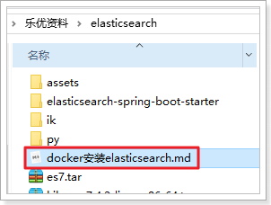 

## 1.1.特殊数据类型

在之前的学习中，我们了解了Elasticsearch的基本数据类型，今天我们来看看ES中提供的特殊数据类型：

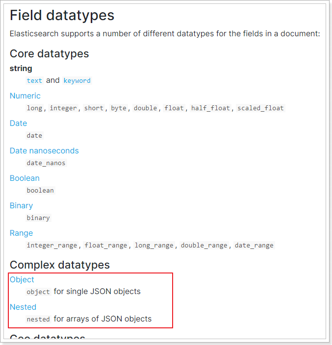 


### 1.1.1.Object类型

相关文档：https://www.elastic.co/guide/en/elasticsearch/reference/7.6/object.html

当我们向ES中存入JSON数据时，大多数情况下，数据都是简单JSON类型，例如：

```json
PUT my_index/_doc/1
{ 
  "region": "US",
  "age": 30,
  "name": "John Smith"
}
```

这样，写入ES的文档就包含3个字段，分别是：region、age、name

但是，如果我们存入ES的数据比较复杂，包含对象，例如：

```json
PUT my_index/_doc/1
{ 
  "region": "US",
  "age": 30,
  "name": { 
     "first": "John",
     "last":  "Smith"
  }
}
```

此时，写入ES的文档包含3个字段：

- region：普通字符串
- age：普通数字
- name：是一个内部嵌套的对象，包含两个属性：
  - first：普通字符串
  - last：普通字符串

因为Lucene是不支持对象数据的，因此ES会将数据扁平化处理，变成这样：

```json
{ 
  "region": "US",
  "age": 30,
  "name.first": "John",
  "name.last":  "Smith"
}
```

此时，文档的映射类型（mapping）大概是这样的：

```json
PUT my_index
{
    "mappings": {
        "properties": { 
            "region": {"type": "keyword"},
            "age":  {"type": "integer" },
            "name": { 
                "properties": {
                    "first": { "type": "text" },
                    "last":  { "type": "text" }
                }
            }
        }
    }
}
```

此时，如果我们要根据名称做match搜索，我们需要这样：

```json
GET /my_index/_search
{
  "query": {
    "match": {
      "name.first": "John"
    }
  }
}
```


### 1.1.2.nested类型

Nested类型其实是Object类型的一种特殊版本，它允许包含一组属性相似Object的数组中的每个对象，可以被独立的搜索，互不影响。

文档地址：https://www.elastic.co/guide/en/elasticsearch/reference/7.6/nested.html

#### 1）Object数组的问题

我们先来看一个文档数据：

```json
PUT my_index/_doc/1
{
  "group" : "fans",
  "user" : [ 
    {
      "first" : "张",
      "last" :  "学有"
    },
    {
      "first" : "刘",
      "last" :  "德华"
    }
  ]
}
```

因为user是一个数组，而数组中是Object类型，因此此时Use会被认定为Object类型，然后会被展开，处理成这样：

```json
{
  "group" :        "fans",
  "user.first" : [ "张", "刘" ],
  "user.last" :  [ "学有", "德华" ]
}
```

此时，user.first和user.last被处理成两个数组类型的字段，因此名字`Alice`和Smith之间的关联就丢失了。

当你搜索`张德华`时，也能搜索到数据，这显然是不对的。

我们试试：

```json
GET my_index/_search
{
  "query": {
    "bool": {
      "must": [
        { "match": { "user.first": "张" }},
        { "match": { "user.last":  "德华" }}
      ]
    }
  }
}
```

这个搜索时要搜first名称为张，last名称为德华的人，是不存在的，但是结果却搜索到了：

```json
{
  "took" : 22,
  "timed_out" : false,
  "_shards" : {
    "total" : 1,
    "successful" : 1,
    "skipped" : 0,
    "failed" : 0
  },
  "hits" : {
    "total" : {
      "value" : 1,
      "relation" : "eq"
    },
    "max_score" : 0.8630463,
    "hits" : [
      {
        "_index" : "my_index",
        "_type" : "_doc",
        "_id" : "1",
        "_score" : 0.8630463,
        "_source" : {
          "group" : "fans",
          "user" : [
            {
              "first" : "张",
              "last" : "学有"
            },
            {
              "first" : "刘",
              "last" : "德华"
            }
          ]
        }
      }
    ]
  }
}

```


#### 2）Nested解决Object数组问题

如果你想要使用对象数组格式，同时又想保持数组中每个Object的独立性。那么你应该使用nested类型。nested类型会把数组中的每个object用隐式的独立Document来保存，因此可以互不干扰的查询，但必须用nested方式查询。


首先，我们设置一个nested类型的字段：

```json
PUT my_index
{
  "mappings": {
    "properties": {
      "user": {
        "type": "nested",
        "properties": {
          "first":{"type":"keyword"},
          "last":{"type":"keyword"}
        }
      }
    }
  }
}
```

然后，再次填充数据：

```json
PUT my_index/_doc/1
{
  "group" : "fans",
  "user" : [ 
    {
      "first" : "张",
      "last" :  "学有"
    },
    {
      "first" : "刘",
      "last" :  "德华"
    }
  ]
}
```

搜索的时候，必须使用nested搜索，并制定对象的名称：

```json
GET my_index/_search
{
  "query": {
    "nested": {
      "path": "user",
      "query": {
        "bool": {
          "must": [
            {
              "match": {
                "user.first": "刘"
              }
            },
            {
              "match": {
                "user.last": "德华"
              }
            }
          ]
        }
      }
    }
  }
}
```

语法说明：

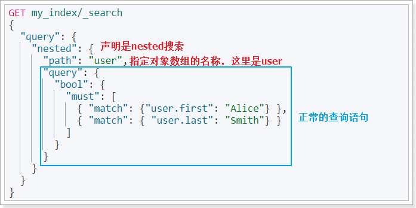 

这次就搜索不到数据了，因为没有名为`Alice Smith`的人。

```json
{
  "took" : 0,
  "timed_out" : false,
  "_shards" : {
    "total" : 1,
    "successful" : 1,
    "skipped" : 0,
    "failed" : 0
  },
  "hits" : {
    "total" : {
      "value" : 0,
      "relation" : "eq"
    },
    "max_score" : null,
    "hits" : [ ]
  }
}
```


## 1.2.自动补全和提示

ES的推荐功能（Suggester）包含三种不同方式，不过用的最多的，还是Completion模式，实现自动补全和基于上下文的提示功能。

相关文档：https://www.elastic.co/guide/en/elasticsearch/reference/7.6/search-suggesters.html#completion-suggester

### 1.2.1.准备数据

理想中，自动补全功能需要在用户键入一个字符时，尽可能快速的给用户返回提示信息。因此自动补全很注重查询的速度。为了提高suggester的速度，相关的数据必须在内存中缓存起来，数据的类型也不再是普通类型，而是completion类型。


首先我们要定义一个索引库，并设置用于自动补全的字段为completion类型。

```json
PUT articles
{
  "mappings": {
    "properties": {
      "suggestion":{
        "type": "completion"
      }
    }
  }
}
```

创建一个名为`articles`的索引库，并且有一个字段为`suggestion`，类型是`completion`

然后批量插入一些数据：

```json
POST articles/_bulk
{ "index" : { } }
{ "suggestion": ["lucene", "is", "very", "cool"]}
{ "index" : { } }
{ "suggestion": ["Elasticsearch", "builds", "on", "lucene"]}
{ "index" : { } }
{ "suggestion": ["Elasticsearch", "rocks"]}
{ "index" : { } }
{ "suggestion": ["elastic", "is", "the", "company", "behind", "ELK"]}
{ "index" : { } }
{ "suggestion": ["Elk", "stack", "rocks"]}
```

在一个文档中，completion类型的字段，其值可以有多个，它的每一个值都可以成为自动补全的推荐结果。


### 1.2.2.查询推荐值

如果我们要为用户输入的字符补全完整字符，可以向ES发起请求，指定要在哪个completion类型的字段上进行查询，示例：

```json
POST articles/_search
{
  "suggest": {
    "article-suggester": {
      "prefix": "el ",
      "completion": {
        "field": "suggestion",
        "size": 10
      }
    }
  }
}
```

参数说明：

- suggest：代表接下来的查询是一个suggest类型的查询
  - article-suggester：这次查询的名称，自定义
    - prefix：用来补全的词语前缀，本例中搜索以 el开头的内容
    - completion：代表是completion类型的suggest，其它类型还有：Term、Phrase
      - field：要查询的字段

### 1.2.3.推荐结果

上面的查询返回结果如下：

```json
{
  "took" : 0,
  "timed_out" : false,
  "_shards" : {
    "total" : 1,
    "successful" : 1,
    "skipped" : 0,
    "failed" : 0
  },
  "hits" : {
    "total" : {
      "value" : 0,
      "relation" : "eq"
    },
    "max_score" : null,
    "hits" : [ ]
  },
  "suggest" : {
    "article-suggester" : [
      {
        "text" : "el",
        "offset" : 0,
        "length" : 2,
        "options" : [
          {
            "text" : "Elasticsearch",
            "_index" : "articles",
            "_type" : "_doc",
            "_id" : "ZvxiWHABGZL7VTV2dPvC",
            "_score" : 1.0,
            "_source" : {
              "suggestion" : [
                "Elasticsearch",
                "builds",
                "on",
                "lucene"
              ]
            }
          },
          {
            "text" : "Elasticsearch",
            "_index" : "articles",
            "_type" : "_doc",
            "_id" : "Z_xiWHABGZL7VTV2dPvC",
            "_score" : 1.0,
            "_source" : {
              "suggestion" : [
                "Elasticsearch",
                "rocks"
              ]
            }
          },
          {
            "text" : "Elk",
            "_index" : "articles",
            "_type" : "_doc",
            "_id" : "afxiWHABGZL7VTV2dPvC",
            "_score" : 1.0,
            "_source" : {
              "suggestion" : [
                "Elk",
                "stack",
                "rocks"
              ]
            }
          },
          {
            "text" : "elastic",
            "_index" : "articles",
            "_type" : "_doc",
            "_id" : "aPxiWHABGZL7VTV2dPvC",
            "_score" : 1.0,
            "_source" : {
              "suggestion" : [
                "elastic",
                "is",
                "the",
                "company",
                "behind",
                "ELK"
              ]
            }
          }
        ]
      }
    ]
  }
}

```

返回结果中的`options`数组就是推荐的结果，其中`text`是推荐的文本，`_source`是文档原始数据。

本例中有四条推荐结果：

- `Elasticsearch`，文档的内容是："Elasticsearch",  "builds", "on",  "lucene"
- `Elasticsearch`，文档的内容是："Elasticsearch", "rocks"
- `ELK`，文档内容是："Elk",  "stack",  "rocks"
- `elastic`，文档内容是："elastic is the company behind ELK stack"


## 1.3.拼音搜索

拼音搜索的关键是汉字与拼音的转换，只要找到这样的elasticsearch插件就可以了。在GitHub上恰好有这样的拼音插件。地址：https://github.com/medcl/elasticsearch-analysis-pinyin

### 1.3.1.安装拼音插件

首先下载ES版本对应的拼音插件。在GitHub页面中找到releases：https://github.com/medcl/elasticsearch-analysis-pinyin/releases

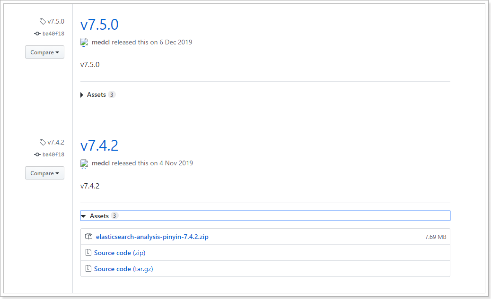

当然，课前资料提供的也有：

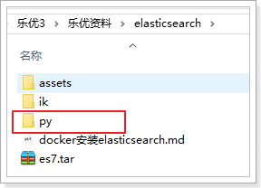 

与安装IK分词器一样，把这个拷贝到`${ES_HOME}/plugins/`即可。

`${ES_HOME}`：elasticsearch的安装目录，如果你使用了Docker安装，请找到你的`plugins`挂载的目录

```shell
cd /var/lib/docker/volumes/es-plugins/_data
```


我的目录如图：

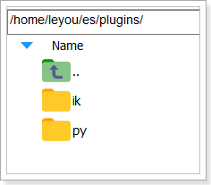 

然后重启你的elasticsearch即可。


### 1.3.2.测试

在kibana中，输入命令测试：

```json
POST _analyze
{
  "text": ["张学友", "刘德华"],
  "analyzer": "pinyin"
}
```

结果：

```json
{
  "tokens" : [
    {
      "token" : "zhang",
      "start_offset" : 0,
      "end_offset" : 0,
      "type" : "word",
      "position" : 0
    },
    {
      "token" : "zxy",
      "start_offset" : 0,
      "end_offset" : 0,
      "type" : "word",
      "position" : 0
    },
    {
      "token" : "xue",
      "start_offset" : 0,
      "end_offset" : 0,
      "type" : "word",
      "position" : 1
    },
    {
      "token" : "you",
      "start_offset" : 0,
      "end_offset" : 0,
      "type" : "word",
      "position" : 2
    },
    {
      "token" : "liu",
      "start_offset" : 1,
      "end_offset" : 1,
      "type" : "word",
      "position" : 3
    },
    {
      "token" : "ldh",
      "start_offset" : 1,
      "end_offset" : 1,
      "type" : "word",
      "position" : 3
    },
    {
      "token" : "de",
      "start_offset" : 1,
      "end_offset" : 1,
      "type" : "word",
      "position" : 4
    },
    {
      "token" : "hua",
      "start_offset" : 1,
      "end_offset" : 1,
      "type" : "word",
      "position" : 5
    }
  ]
}
```


### 1.3.3.组合分词器

在分词处理时，会用到analyzer，我们以前称它为分词器。但其实它叫分析器，一般包含两部分：

- Tokenizer：分词器，对文本内容分词，得到词条Term
- filter：过滤器，对分好的词条做进一步处理，例如拼音转换、同义词转换等

我们可以把各种下载的分词插件组合，作为tokenizer或者filter，来完成自定义分词效果。

示例：

```json
PUT /goods
{
  "settings": {
    "analysis": {
      "analyzer": {
        "my_pinyin": {
          "tokenizer": "ik_smart",
          "filter": [
            "py"
          ]
        }
      },
      "filter": {
        "py": {
          "type": "pinyin",
          "keep_full_pinyin": false,
          "keep_joined_full_pinyin": true,
          "keep_original": true,
          "limit_first_letter_length": 16,
          "remove_duplicated_term": true
        }
      }
    }
  },
  "mappings": {
    "properties": {
      "id": {
        "type": "keyword"
      },
      "name": {
        "type": "completion",
        "analyzer": "my_pinyin",
        "search_analyzer": "ik_smart"
      },
      "title":{
        "type": "text",
        "analyzer": "my_pinyin",
        "search_analyzer": "ik_smart"
      },
      "price":{
        "type": "long"
      }
    }
  }
}
```


说明：

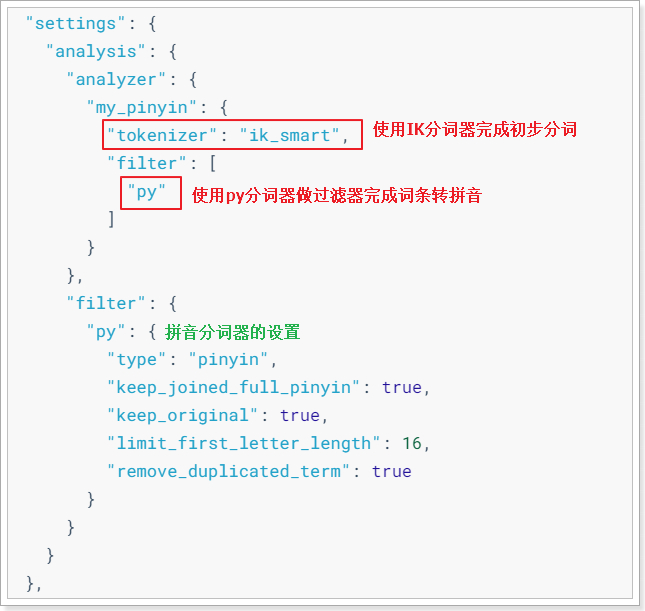 


### 1.3.4.测试自定义分词器

我们在kibana中运行测试，看看分词效果：

```json
POST /goods/_analyze
{
  "text": "你好,华为",
  "analyzer": "my_pinyin"
}
```

结果：

```json
{
  "tokens" : [
    {
      "token" : "你好",
      "start_offset" : 0,
      "end_offset" : 2,
      "type" : "CN_WORD",
      "position" : 0
    },
    {
      "token" : "nihao",
      "start_offset" : 0,
      "end_offset" : 2,
      "type" : "CN_WORD",
      "position" : 0
    },
    {
      "token" : "nh",
      "start_offset" : 0,
      "end_offset" : 2,
      "type" : "CN_WORD",
      "position" : 0
    },
    {
      "token" : "华为",
      "start_offset" : 3,
      "end_offset" : 5,
      "type" : "CN_WORD",
      "position" : 1
    },
    {
      "token" : "huawei",
      "start_offset" : 3,
      "end_offset" : 5,
      "type" : "CN_WORD",
      "position" : 1
    },
    {
      "token" : "hw",
      "start_offset" : 3,
      "end_offset" : 5,
      "type" : "CN_WORD",
      "position" : 1
    }
  ]
}
```


### 1.3.5.测试拼音补全

一旦有了拼音分词器，尽管用户使用拼音，我们也能完成自动补全了。

先插入一部分数据：

```json
PUT /goods/_bulk
{ "index" : {"_id":1 } }
{ "id": 1, "name": "手机","title":"小米手机"}
{ "index" : {"_id":2 } }
{"id": 2,"name": "空调","title":"小米空调"}
{ "index" : {"_id":3 } }
{"id": 3,"name": "sony","title":"sony播放器"}
{ "index" : {"_id":4 } }
{"id": 4,"name": "松下","title":"松下电视"}
```

然后来一个自动补全的查询：

```json
POST /goods/_search
{
  "suggest": {
    "name_suggest": {
      "prefix": "s",
      "completion": {
        "field": "name"
      }
    }
  }
}
```

注意，我们输入的关键字是字母：`s`

看结果：

```json
{
  "took" : 2,
  "timed_out" : false,
  "_shards" : {
    "total" : 1,
    "successful" : 1,
    "skipped" : 0,
    "failed" : 0
  },
  "hits" : {
    "total" : {
      "value" : 0,
      "relation" : "eq"
    },
    "max_score" : null,
    "hits" : [ ]
  },
  "suggest" : {
    "name_suggest" : [
      {
        "text" : "s",
        "offset" : 0,
        "length" : 1,
        "options" : [
          {
            "text" : "sony",
            "_index" : "goods",
            "_type" : "_doc",
            "_id" : "3",
            "_score" : 1.0,
            "_source" : {
              "id" : 3,
              "name" : "sony",
              "title" : "sony播放器"
            }
          },
          {
            "text" : "手机",
            "_index" : "goods",
            "_type" : "_doc",
            "_id" : "1",
            "_score" : 1.0,
            "_source" : {
              "id" : 1,
              "name" : "手机",
              "title" : "小米手机"
            }
          },
          {
            "text" : "松下",
            "_index" : "goods",
            "_type" : "_doc",
            "_id" : "4",
            "_score" : 1.0,
            "_source" : {
              "id" : 4,
              "name" : "松下",
              "title" : "松下电视"
            }
          }
        ]
      }
    ]
  }
}

```

返回的提示包括：`sony`、`松下`、`手机`，都是以`s`开头，是不是很酷炫呢！


# 2.RestAPI

ES提供的Java客户端包括两种：

在elasticsearch官网中提供了各种语言的客户端：https://www.elastic.co/guide/en/elasticsearch/client/index.html

而Java的客户端就有两个：

 

不过Java API这个客户端（Transport Client）已经在7.0以后过期了，而且在8.0版本中将直接废弃。所以我们会学习Java REST Client：

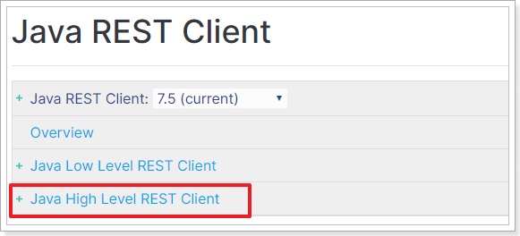 

然后再选择High Level REST Client这个。


## 2.1.初始化

### 2.1.1.引入依赖

创建一个新的maven工程，并在pom 文件中引入下列依赖：

```xml
<dependencies>
    <!-- Junit单元测试 -->
    <dependency>
        <groupId>junit</groupId>
        <artifactId>junit</artifactId>
        <version>4.12</version>
    </dependency>
    <!--elastic客户端-->
    <dependency>
        <groupId>org.elasticsearch.client</groupId>
        <artifactId>elasticsearch-rest-high-level-client</artifactId>
        <version>7.4.2</version>
    </dependency>
    <!--lombok-->
    <dependency>
        <groupId>org.projectlombok</groupId>
        <artifactId>lombok</artifactId>
        <version>1.18.8</version>
    </dependency>
    <!--JSON工具-->
    <dependency>
        <groupId>com.alibaba</groupId>
        <artifactId>fastjson</artifactId>
        <version>1.2.49</version>
    </dependency>
    <!--common工具-->
    <dependency>
        <groupId>org.apache.commons</groupId>
        <artifactId>commons-lang3</artifactId>
        <version>3.8.1</version>
    </dependency>
     <!--日志-->
    <dependency>
            <groupId>org.apache.logging.log4j</groupId>
            <artifactId>log4j-core</artifactId>
            <version>2.11.2</version>
        </dependency>
</dependencies>
<build>
    <plugins>
        <plugin>
            <groupId>org.apache.maven.plugins</groupId>
            <artifactId>maven-compiler-plugin</artifactId>
            <version>3.2</version>
            <configuration>
                <source>1.8</source>
                <target>1.8</target>
                <encoding>UTF-8</encoding>
            </configuration>
        </plugin>
    </plugins>
</build>
```

并在resources中新建文件：log4j2.xml，内容如下：

```xml
<?xml version="1.0" encoding="UTF-8"?>
<Configuration status="WARN">
    <Appenders>
        <Console name="Console" target="SYSTEM_OUT">
            <PatternLayout pattern="%d{HH:mm:ss.SSS} [%t] %-5level %logger{36} - %msg%n"/>
        </Console>
    </Appenders>
    <Loggers>
        <Root level="error">
            <AppenderRef ref="Console"/>
        </Root>
    </Loggers>
</Configuration>
```


### 2.1.2.创建ES的客户端

在官网上可以看到连接ES的初始化教程：https://www.elastic.co/guide/en/elasticsearch/client/java-rest/current/java-rest-high-getting-started-initialization.html

首先需要与ES建立连接，ES提供了一个客户端RestHighLevelClient。

代码如下：

```java
RestHighLevelClient client = new RestHighLevelClient(
                RestClient.builder(
                        new HttpHost("192.168.206.99", 9200, "http")
                )
        );
```

ES中的所有操作都是通过RestHighLevelClient来完成的：

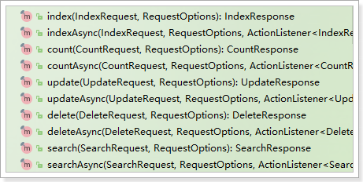 


为了后面测试方便，我们写到一个单元测试中，并且通过`@Before`注解来初始化客户端连接。

```java

public class ElasticDemo {

    private RestHighLevelClient client;

    /**
     * 建立连接
     */
    @Before
    public void init() throws IOException {
        client = new RestHighLevelClient(
                RestClient.builder(
                        new HttpHost("192.168.206.99", 9200, "http")
                )
        );
    }

    /**
     * 关闭客户端连接
     */
    @After
    public void close() throws IOException {
        client.close();
    }
}
```


### 2.1.3.准备实体类

索引库的CRUD需要用一个实体类来封装数据，我们准备一个实体类Goods：

```java
package cn.itcast.demo.pojo;

import lombok.AllArgsConstructor;
import lombok.Data;
import lombok.NoArgsConstructor;


@AllArgsConstructor
@NoArgsConstructor
@Data
public class Goods {
    private Long id;
    private String name;
    private String title;
    private Long price;
}
```


## 2.2.创建库和映射

开发中，往往库和映射的操作一起完成，官网详细文档地址：https://www.elastic.co/guide/en/elasticsearch/client/java-rest/7.x/_index_apis.html


这里我们主要实现库和映射的创建。查询、删除等功能大家可参考文档自己实现。

 

### 2.2.1.思路分析

按照官网给出的步骤，创建索引包括下面几个步骤：

- 1）创建CreateIndexRequest对象，并指定索引库名称
- 2）指定settings配置
- 3）指定mapping配置
- 4）发起请求，得到响应

其实仔细分析，与我们在Kibana中的Rest风格API完全一致：

```json
PUT /heima
{
  "settings": {
    "number_of_shards": 3,
    "number_of_replicas": 1
  },
  "mappings": {
    
  }
}
```


### 2.2.2.设计映射规则

Java代码中设置mapping，依然与REST中一致，需要JSON风格的映射规则。因此我们先在kibana中给Goods实体类定义好映射规则。

Goods包括下面的字段：

- Id：主键，在ES中是唯一标示
- name：商品的名称，字符串类型，不需要分词，将来可以用作自动补全功能
- title：商品标题，字符串类型，可以分词
- price：价格，数值类型

映射如下：

```json
PUT /goods
{
  "settings": {
    "analysis": {
      "analyzer": {
        "my_pinyin": {
          "tokenizer": "ik_smart",
          "filter": [
            "py"
          ]
        }
      },
      "filter": {
        "py": {
          "type": "pinyin",
          "keep_full_pinyin": false,
          "keep_joined_full_pinyin": true,
          "keep_original": true,
          "limit_first_letter_length": 16,
          "remove_duplicated_term": true
        }
      }
    }
  },
  "mappings": {
    "properties": {
      "id": {
        "type": "keyword"
      },
      "name": {
        "type": "completion",
        "analyzer": "my_pinyin",
        "search_analyzer": "ik_smart"
      },
      "title":{
        "type": "text",
        "analyzer": "my_pinyin",
        "search_analyzer": "ik_smart"
      },
      "price":{
        "type": "long"
      }
    }
  }
}
```


### 2.2.3.代码实现

我们在上面新建的ElasticDemo类中新建单元测试，完成代码，思路就是之前分析的4步骤：

- 1）创建CreateIndexRequest对象，并指定索引库名称
- 2）指定settings配置
- 3）指定mapping配置
- 4）发起请求，得到响应

运行之前，**不要忘了删除以前的Goods索引库**！！

运行之前，**不要忘了删除以前的Goods索引库**！！

```java
@Test
public void testCreateIndex() throws IOException {
    // 1.创建CreateIndexRequest对象，并指定索引库名称
    CreateIndexRequest request = new CreateIndexRequest("goods");
    // 2.准备参加索引的JSON请求体，包括settings和mapping
    request.source("{\n" +
                "  \"settings\": {\n" +
                "    \"analysis\": {\n" +
                "      \"analyzer\": {\n" +
                "        \"my_pinyin\": {\n" +
                "          \"tokenizer\": \"ik_smart\",\n" +
                "          \"filter\": [\n" +
                "            \"py\"\n" +
                "          ]\n" +
                "        }\n" +
                "      },\n" +
                "      \"filter\": {\n" +
                "        \"py\": {\n" +
                "          \"type\": \"pinyin\",\n" +
                "          \"keep_full_pinyin\": false,\n" +
                "          \"keep_joined_full_pinyin\": true,\n" +
                "          \"keep_original\": true,\n" +
                "          \"limit_first_letter_length\": 16,\n" +
                "          \"remove_duplicated_term\": true\n" +
                "        }\n" +
                "      }\n" +
                "    }\n" +
                "  },\n" +
                "  \"mappings\": {\n" +
                "    \"properties\": {\n" +
                "      \"id\": {\n" +
                "        \"type\": \"keyword\"\n" +
                "      },\n" +
                "      \"name\": {\n" +
                "        \"type\": \"completion\",\n" +
                "        \"analyzer\": \"my_pinyin\",\n" +
                "        \"search_analyzer\": \"ik_smart\"\n" +
                "      },\n" +
                "      \"title\":{\n" +
                "        \"type\": \"text\",\n" +
                "        \"analyzer\": \"my_pinyin\",\n" +
                "        \"search_analyzer\": \"ik_smart\"\n" +
                "      },\n" +
                "      \"price\":{\n" +
                "        \"type\": \"long\"\n" +
                "      }\n" +
                "    }\n" +
                "  }\n" +
                "}", XContentType.JSON);
    // 3.发起请求，得到响应
    CreateIndexResponse response = client.indices().create(request, RequestOptions.DEFAULT);

    System.out.println("response = " + response.isAcknowledged());
}
```

返回结果：

```
response = true
```


## 2.3.导入文档数据

示例代码：

```java
@Test
public void testBulkDocument() throws IOException {
    // 1.准备文档数据
    List<Goods> list = new ArrayList<>();
    list.add(new Goods(1L, "红米9", "红米9手机 数码", 1499L));
    list.add(new Goods(2L, "三星 Galaxy A90", "三星 Galaxy A90 手机 数码 疾速5G 骁龙855", 3099L));
    list.add(new Goods(3L, "Sony WH-1000XM3", "Sony WH-1000XM3 降噪耳机 数码", 2299L));
    list.add(new Goods(4L, "松下剃须刀", "松下电动剃须刀高转速磁悬浮马达", 599L));
    // 2.创建BulkRequest对象
    BulkRequest bulkRequest = new BulkRequest();
    // 3.创建多个IndexRequest对象，并添加到BulkRequest中
    for (Goods goods : list) {
        bulkRequest.add(new IndexRequest("goods")
                        .id(goods.getId().toString())
                        .source(JSON.toJSONString(goods), XContentType.JSON)
                       );
    }
    // 4.发起请求
    BulkResponse bulkResponse = client.bulk(bulkRequest, RequestOptions.DEFAULT);

    System.out.println("status: " + bulkResponse.status());
}
```


## 2.4.基本查询

代码如下：

```java
@Test
public void testBasicSearchWithSortAndPage() throws IOException, InvocationTargetException, IllegalAccessException {
    // 1.创建SearchSourceBuilder对象
    SearchSourceBuilder sourceBuilder = new SearchSourceBuilder();
    // 1.0.source过滤
    sourceBuilder.fetchSource(new String[0], new String[]{"name"});
    // 1.1.添加查询条件QueryBuilders，这里选择布尔查询，查询标题包含“数码”，并且价格小于3000
    // 1.1.1.定义布尔查询
    BoolQueryBuilder boolQueryBuilder = QueryBuilders.boolQuery();
    // 1.1.2.添加match查询
    boolQueryBuilder.must(QueryBuilders.matchQuery("title", "数码"));
    // 1.1.3.添加价格过滤
    boolQueryBuilder.filter(QueryBuilders.rangeQuery("price").lte(3000));
    sourceBuilder.query(boolQueryBuilder);
    // 1.2.添加排序、分页等其它条件
    sourceBuilder.sort("price", SortOrder.ASC);
    // 1.3.添加分页条件
    int page = 1, size = 5;
    int from = (page - 1) * size;
    sourceBuilder.from(from);
    sourceBuilder.size(size);
    // 1.4.高亮
    sourceBuilder.highlighter(new HighlightBuilder().field("title"));

    // 2.创建SearchRequest对象，并制定索引库名称
    SearchRequest request = new SearchRequest("goods");
    // 2.1.添加SearchSourceBuilder对象到SearchRequest对象中
    request.source(sourceBuilder);

    // 3.发起请求，得到结果
    SearchResponse response = client.search(request, RequestOptions.DEFAULT);

    // 4.解析结果
    SearchHits searchHits = response.getHits();
    //  4.1.获取总条数
    long total = searchHits.getTotalHits().value;
    System.out.println("total = " + total);
    //  4.2.获取SearchHits数组，并遍历
    SearchHit[] hits = searchHits.getHits();
    for (SearchHit hit : hits) {
        //  - 获取其中的`_source`，是JSON数据
        String json = hit.getSourceAsString();
        //  - 把`_source`反序列化为User对象
        Goods goods = JSON.parseObject(json, Goods.class);

        // 获取高亮结果
        Map<String, HighlightField> highlightFields = hit.getHighlightFields();
        // 遍历高亮字段
        for (HighlightField field : highlightFields.values()) {
            // 获取字段名
            String fieldName = field.getName();
            // 获取字段值
            String fieldValue = StringUtils.join(field.getFragments());
            // 注入对象中
            BeanUtils.setProperty(goods, fieldName, fieldValue);
        }

        System.out.println("goods = " + goods);
    }
}
```


其中的 BeanUtils用到了一个依赖：

```xml
<dependency>
    <groupId>commons-beanutils</groupId>
    <artifactId>commons-beanutils</artifactId>
    <version>1.9.3</version>
</dependency>
```


## 2.5.Suggest查询

这里以Completion Suggest查询为例：

```java
/**
     * 演示自动补全查询
     */
@Test
public void testSuggest() throws IOException {
    // 1.创建 查询条件工厂（封装查询条件） 的对象
    SearchSourceBuilder searchSourceBuilder = new SearchSourceBuilder();

    // 1.1.准备Suggest，需要指定四个内容：
    // 1）自动补全的名称：name_suggest
    // 2）自动补全的类型：SuggestBuilders.completionSuggestion
    // 3）自动补全的字段：completionSuggestion("name")
    // 4）自动补全的前缀：.prefix("s")
    SuggestBuilder suggestBuilder = new SuggestBuilder();
    suggestBuilder.addSuggestion("name_suggest",
                                 SuggestBuilders.completionSuggestion("name").prefix("s").size(30));

    // 1.2.添加suggest条件
    searchSourceBuilder.suggest(suggestBuilder);


    // 2.构建 搜索的请求 对象，把sourceBuilder放进去
    SearchRequest request = new SearchRequest("goods");
    request.source(searchSourceBuilder);

    // 3.发请求
    SearchResponse response = client.search(request, RequestOptions.DEFAULT);

    // 4.解析结果
    Suggest suggest = response.getSuggest();

    // 4.1.根据名称获取suggest结果
    Suggest.Suggestion<? extends Suggest.Suggestion.Entry<? extends Suggest.Suggestion.Entry.Option>> nameSuggest =
        suggest.getSuggestion("name_suggest");
    // 4.2.遍历结果
    nameSuggest.forEach(suggestion -> {
        // 获取其中的options
        List<? extends Suggest.Suggestion.Entry.Option> options = suggestion.getOptions();
        System.out.println("补全的结果如下： ");
        // 遍历options
        for (Suggest.Suggestion.Entry.Option option : options) {
            Text text = option.getText();
            System.out.println("\t" + text);
        }
    });
}
```

结果：

```
补全的结果如下： 
	Sony 
	手机
	松下
```


## 2.6.异步API

之前我们使用的API都是同步阻塞调用的，也就是说调用api时，除非ES返回结果，否则代码就一直阻塞。

当然，ES也提供了异步调用的API，利用回调函数来处理执行结果。其底层是异步的Http请求，并且将执行结果用`Future<T>`来封装。

因此我们在发出请求后，无需等待结果，而是去执行其它业务。当ES服务端返回结果时再去处理，可以提供CPU的利用率，减少不必要的等待时间。

异步API与同步API从调用来看，最大的区别是对结果的处理方式。其它如：创建请求、组织请求参数、发出请求等基本一致。

### 2.6.1.异步新增

代码如下：

```java
@Test
public void testAsyncAddDocument() throws InterruptedException {
    // 准备文档
    Goods goods = new Goods(5L, "松下电吹风", "松下电吹风 网红电吹风", 1599L);

    // 创建请求
    IndexRequest request = new IndexRequest("goods")
        .id(goods.getId().toString())
        .source(JSON.toJSONString(goods), XContentType.JSON);

    // 执行请求，第三个参数是回调处理
    client.indexAsync(request, RequestOptions.DEFAULT, new ActionListener<IndexResponse>() {
        /**
             * 执行成功时的回调，参数是IndexResponse结果
             * @param indexResponse 执行结果
             */
        @Override
        public void onResponse(IndexResponse indexResponse) {
            System.out.println("我是成功的回调！" + indexResponse);
        }
        /**
             * 执行失败时的回调，参数是异常信息
             * @param e 异常信息
             */
        @Override
        public void onFailure(Exception e) {
            System.out.println("我是失败的回调！");
            e.printStackTrace();
        }
    });

    System.out.println("我的异步方法调用完成~~");
    // 因为我们的程序结束会立即停止，接收不到回调结果，这里我们休眠一下，等待下回调结果
    Thread.sleep(2000L);
}
```

结果：

```
我的异步方法调用完成~~
我是成功的回调！IndexResponse[index=goods,type=_doc,id=5,version=1,result=created,seqNo=29,primaryTerm=1,shards={"total":2,"successful":1,"failed":0}]
```


### 2.6.2.异步删除

代码如下：

```java
@Test
public void testAsyncDeleteDocument() throws InterruptedException {
    // 创建请求
    DeleteRequest request = new DeleteRequest("goods", "5");

    // 执行请求，第三个参数是回调处理
    client.deleteAsync(request, RequestOptions.DEFAULT, new ActionListener<DeleteResponse>() {
        /**
             * 执行成功时的回调，参数是IndexResponse结果
             * @param indexResponse 执行结果
             */
        @Override
        public void onResponse(DeleteResponse indexResponse) {
            System.out.println("我是成功的回调！" + indexResponse);
        }
        /**
             * 执行失败时的回调，参数是异常信息
             * @param e 异常信息
             */
        @Override
        public void onFailure(Exception e) {
            System.out.println("我是失败的回调！");
            e.printStackTrace();
        }
    });

    System.out.println("我的异步方法调用完成~~");
    // 因为我们的程序结束会立即停止，接收不到回调结果，这里我们休眠一下，等待下回调结果
    Thread.sleep(2000L);
}
```

执行结果：

```
我的异步方法调用完成~~
我是成功的回调！DeleteResponse[index=goods,type=_doc,id=5,version=1,result=not_found,shards=ShardInfo{total=2, successful=1, failures=[]}]
```


### 2.6.3.异步查询

这里演示一个异步的模板查询：

```java
@Test
public void testGetDocumentByIdAsync() throws IOException, InterruptedException {

    System.out.println("准备开始查询");
    // 准备一个查询文档的请求
    GetRequest request = new GetRequest("goods", "1");
    // 异步查询一个文档，耗时50ms
    client.getAsync(request, RequestOptions.DEFAULT, new ActionListener<GetResponse>() {
        @Override
        public void onResponse(GetResponse response) {
            // 获取source
            String json = response.getSourceAsString();
            // 把json反序列化
            Goods goods = JSON.parseObject(json, Goods.class);

            System.out.println("查询结束，得到结果： " + goods);
        }

        @Override
        public void onFailure(Exception e) {
            e.printStackTrace();
        }
    });

    System.out.println("请求已经发出，等待执行结果！");

    Thread.sleep(2000);
}

```

执行结果：

```
我的异步方法调用完成~~
我是成功的回调！
推荐结果如下：
	Sony WH-1000XM3
	三星 Galaxy A90
	松下剃须刀
```


# 3.WebFlux

是不是感觉Elasticsearch的异步API感觉很别扭，而且似乎没什么用处？

那是因为我们之前学习的所有Web程序组件，都是同步阻塞的编程方式。包括：Tomcat、Servlet、SpringMVC、Mybatis等等。

因此在同步阻塞运行大环境下，使用异步API，就难以发挥异步调用的长处。

同步和异步执行，到底有怎样的差异呢？

## 3.1.同步和异步

那么同步和异步之间究竟有怎样的差异呢？

### 3.1.1.同步请求

一个典型的请求同步处理过程：

- 1.开启线程，接收用户
- 2.处理业务
- 3.调用DB（比如elasticsearch）
- 4.等待DB返回数据（无效的等待）
- 5.返回数据给用户

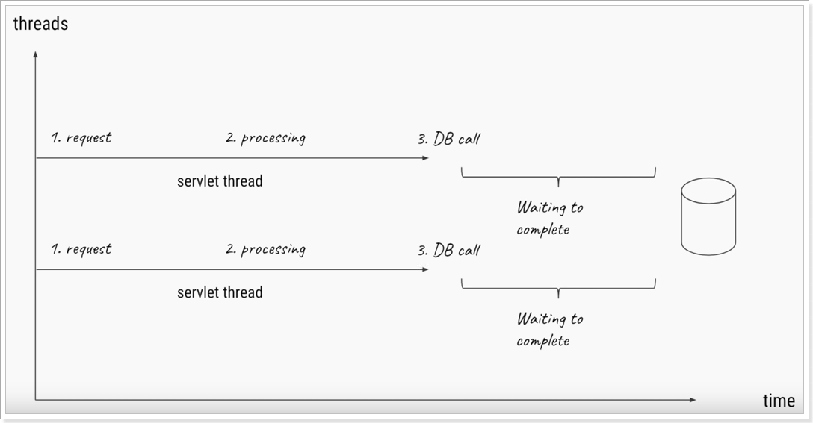

### 3.1.2.异步请求

一个典型的请求异步处理过程：

- 1.开启线程，接收用户
- 2.处理业务
- 3.调用DB（比如elasticsearch）
- 4.不等待，处理其他请求（同时DB准备数据）
- 5.DB返回数据，传递给`异步回调`函数
- 6.返回给用户

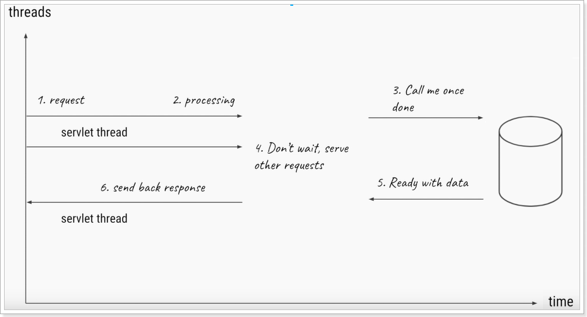

虽然处理过程麻烦了，但是无疑我们可以同时服务更多请求了，系统的吞吐量得到了提升。

### 3.1.3.总结

异步执行相对于同步执行，可以大大提高CPU的利用率，减少CPU空置时间，**提高服务的吞吐量**，但是并**不能减少单次请求的执行耗时**。

那么，有没有一套可以取代tomcat、SpringMVC，实现异步编程的Web应用方案呢？


### 3.1.4.异步Servlet（了解）

在Servlet3.0已经支持了异步编程，来看一个同步和异步Servlet的实例。

新建一个web项目，并在其中创建两个servlet：

#### 1）同步运行的servlet

代码：

```java
package cn.itcast.demo.servlet;

import javax.servlet.annotation.WebServlet;
import javax.servlet.http.HttpServlet;
import javax.servlet.http.HttpServletRequest;
import javax.servlet.http.HttpServletResponse;
import java.io.IOException;

@WebServlet(name = "SyncServlet", urlPatterns = "/sync")
public class SyncServlet extends HttpServlet {
    protected void doPost(HttpServletRequest request, HttpServletResponse response) throws javax.servlet.ServletException, IOException {
        doGet(request, response);
    }

    protected void doGet(HttpServletRequest request, HttpServletResponse response) throws javax.servlet.ServletException, IOException {
        long b = System.currentTimeMillis();
        // 执行业务
        doSomething(response);
        // 打印耗时时间
        System.out.println("sync use: " + (System.currentTimeMillis() - b));
    }

    private void doSomething(HttpServletResponse response) {
        try {
            // 模拟延迟
            Thread.sleep(3000);
            // 模拟业务
            response.getWriter().write("sync, hello !");
        } catch (Exception e) {
            e.printStackTrace();
        }

    }
}
```

在业务中，休眠3秒来模拟业务的执行。

#### 2）异步运行的Servlet

代码：

```java
package cn.itcast.demo.servlet;

import javax.servlet.AsyncContext;
import javax.servlet.annotation.WebServlet;
import javax.servlet.http.HttpServlet;
import javax.servlet.http.HttpServletRequest;
import javax.servlet.http.HttpServletResponse;
import java.io.IOException;

@WebServlet(name = "AsyncServlet", asyncSupported = true, urlPatterns = "/async")
public class AsyncServlet extends HttpServlet {
    protected void doPost(HttpServletRequest request, HttpServletResponse response) throws javax.servlet.ServletException, IOException {
        doGet(request, response);
    }

    protected void doGet(HttpServletRequest request, HttpServletResponse response) throws javax.servlet.ServletException, IOException {
        long b = System.currentTimeMillis();
        // 开启异步任务
        AsyncContext asyncContext = request.startAsync();
        // 执行业务
        asyncContext.start(() -> doSomething(asyncContext));
        // 打印耗时时间
        System.out.println("async use:" + (System.currentTimeMillis() - b));
    }

    private void doSomething(AsyncContext context) {
        try {
            // 模拟延迟
            Thread.sleep(5000);
            // 模拟业务
            context.getResponse().getWriter().write("async, hello !");
        } catch (Exception e) {
            e.printStackTrace();
        }
        // 结束业务
        context.complete();
    }
}
```

注意关键点：

- `asyncSupported`：在`@WebServlet`注解上，通过`asyncSupported=true`来开启异步支持
- `AsyncContext`：通过`request.startAsync()`来初始化一个AsyncContext对象，并创建异步运行环境。
- `asyncContext.start()`：通过AsyncContext的start(Runnable task)方法来开启一个异步任务，
- `context.complete()`：通过context.complete()来标记业务结束


#### 3）测试

启动项目，并分别访问：

```
localhost:8080/sync
localhost:8080/async
```

虽然浏览器返回结果都是耗时3秒：

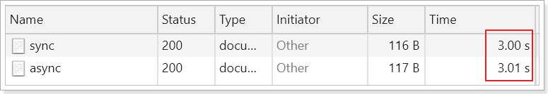

不过，在服务端AsyncServlet的执行却并没有阻塞：

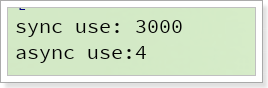 


由此可见，异步执行的Servlet不需要阻塞等待任务执行结果，而是处理其它请求，应用的并发能力就得到了提升。


## 3.2.认识WebFlux

Spring框架中包含的原始Web框架Spring Web MVC是专门为Servlet API和Servlet容器而构建的，是一套同步阻塞的Web应用方案。

响应式Web框架Spring WebFlux在更高版本5.0中添加，它是完全非阻塞的，支持 [Reactive Streams](https://www.reactive-streams.org/)、背压，并在Netty，Undertow和Servlet 3.1+容器等服务器上运行。


Spring的Reactive技术栈与传统Servlet技术栈：

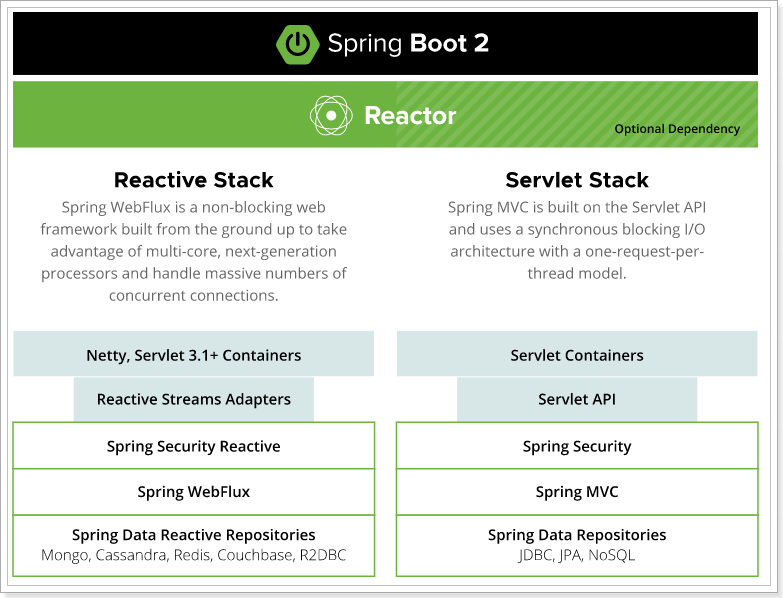


### 3.2.1.为什么需要WebFlux

虽然Servlet3.0也支持异步编程，但是Spring的WebFlux却并不推荐继续使用Servlet容器，而是默认使用Netty，为什么呢？

Spring官网给出的原因有两点：

- Servlet虽然支持异步API，但是其中的`Filter`、`Listener`等组件依然是同步的。而且如`getParameter()`这样的方法是阻塞的。而WebFlux中使用Netty作为容器，其中的API都是异步或非阻塞式的。
- JDK8中引入了stream的API、函数式编程的新特性。而这些恰好为非阻塞应用和链式编程提供了便捷。而Spring的WebFlux完全支持这些新的特性。


### 3.2.2.什么是响应式

我们知道什么是非阻塞、函数式编程。那么什么是响应式编程呢？

在**传统的**编程范式中，我们一般通过迭代器（Iterator）模式来遍历一个序列。这种遍历方式是由调用者来控制节奏的，采用的是`拉`的方式。每次由调用者通过 next()方法来获取序列中的下一个值。

**响应式**流采用的则是`推`的方式，即常见的发布者-订阅者模式。当发布者有新的数据产生时，这些数据会被`主动`推送到订阅者来进行处理。在响应式流上可以添加各种不同的操作来对数据进行处理，形成数据处理链。

> 比如，我们调用elasticsearch的异步API，获取一个Future结果，这个结果就是数据的发布者，将来的某一刻会把从elasticsearch中拿到的数据发布出去。
>
> 而我们的web应用就可以作为消息的订阅者，订阅elasticsearch的数据，当有数据到来的时候写入response中，响应给用户。
>
> 在elasticsearch查询并处理数据的时候，我们的web应用可以去做其它事情，无需阻塞等待，提高CPU利用率

反应式编程最早由 .NET 平台上的 Reactive Extensions (Rx) 库来实现。后来迁移到 Java 平台之后就产生了著名的 RxJava 库，并产生了很多其他编程语言上的对应实现。在这些实现的基础上产生了后来的反应式流（Reactive Streams）规范。该规范定义了反应式流的相关接口，并将集成到 Java 9 中。

### 3.2.3.Reactor Project

Project Reactor是Java中非常流行的响应式编程库，官网：https://projectreactor.io/

前面提到的 RxJava 库是 JVM 上反应式编程的先驱，也是反应式流规范的基础。不过 RxJava 库也有其不足的地方。

Reactor 则是完全基于反应式流规范设计和实现的库，没有 RxJava 那样的历史包袱，在使用上更加的直观易懂。Reactor 也是 Spring 5 中反应式编程的基础。学习和掌握 Reactor 可以更好地理解 Spring 5 中的相关概念，建议大家以后又机会多多学习该框架。

### 3.2.4.Flux 和 Mono

Flux 和 Mono 是 Reactor 中的两个基本概念。

Flux 表示的是包含 0 到 N 个元素的异步序列，是一个数据的发布者（publisher）。可以通过subscribe()函数来订阅该发布者的数据。当数据产生时，订阅者的处理方法会执行。

Mono 表示的是包含 0 或者 1 个元素的异步序列。与Flux类似，也是一个数据的发布者（publisher）。

WebFlux的Controller中，业务处理的返回值必须是Mono或者Flux。而我们可以把service或dao中数据查询的过程封装到Mono或Flux中，数据查询成功后由Mono或Flux将数据发布出去。

然后Spring的WebFlux会订阅Mono或Flux数据，接收数据后写入Response，响应给用户


## 3.3.WebFlux入门

接下来，我们来看看如何构建一个基于WebFlux的web应用。

### 3.3.1.搭建工程

使用spring的initialize来搭建：


项目名称：

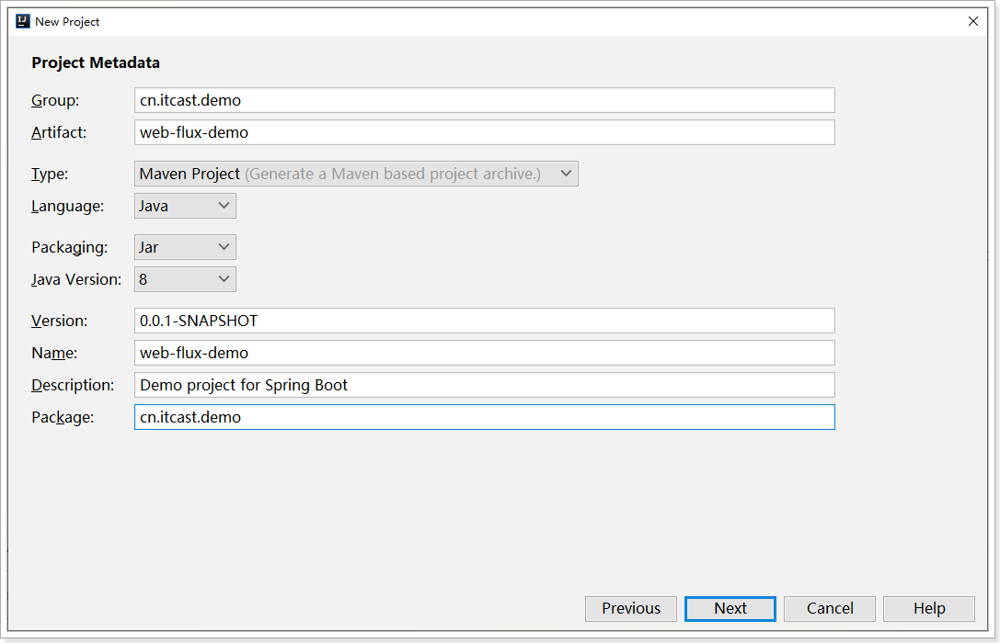

选择依赖：

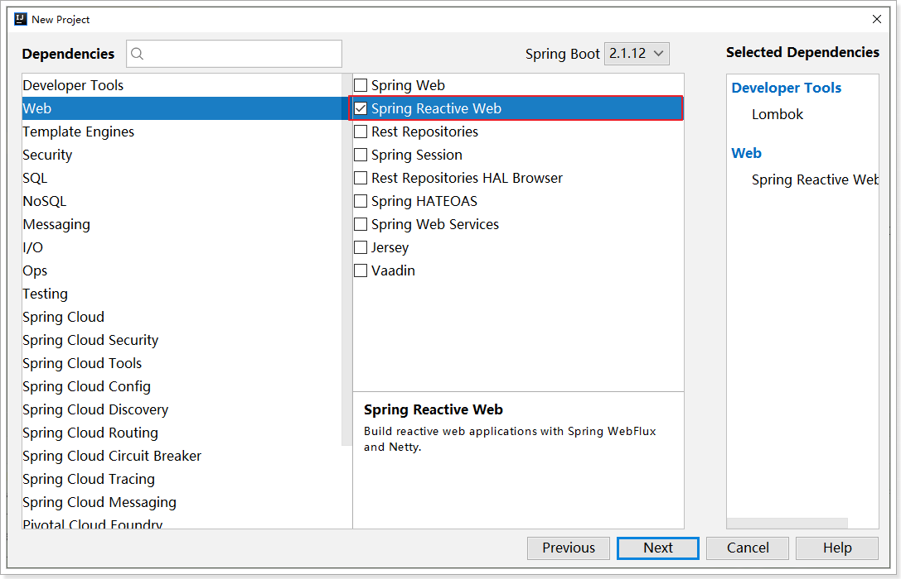

注意，这里必须选择`Spring Reactive Web`而不是`Spring Web`依赖。

然后，点击Next完成项目创建。

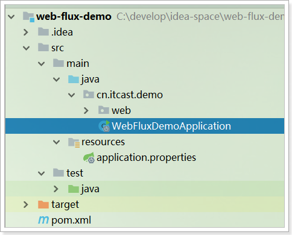 


### 3.3.2.Mono的Demo

为了降低学习难度，WebFlux开发时可以使用SpringMVC中的注解，因此Controller定义与以前差别不大，来看一个示例.

首先准备一个实体类：

```java
package cn.itcast.demo.pojo;

import lombok.AllArgsConstructor;
import lombok.Data;
import lombok.NoArgsConstructor;


@Data
@AllArgsConstructor(staticName = "of")
@NoArgsConstructor
public class User {
    private String name;
    private int age;
}
```


#### 1）一个传统的Handler

我们先写一个同步阻塞的Handler：

```java
package cn.itcast.demo.web;

import cn.itcast.demo.pojo.User;
import lombok.extern.slf4j.Slf4j;
import org.springframework.web.bind.annotation.GetMapping;
import org.springframework.web.bind.annotation.RequestMapping;
import org.springframework.web.bind.annotation.RestController;


@Slf4j
@RestController
@RequestMapping("user")
public class UserController {

    @GetMapping("/sync")
    public User getUserSync() {
        log.info("sync 开始执行");
        User user = getUser();
        log.info("sync 执行完毕");
        return user;
    }
    // 生成user的方法
    private User getUser(){
        try {
            // 模拟业务耗时1秒
            Thread.sleep(1000);
        } catch (InterruptedException e) {
            e.printStackTrace();
        }
        return User.of("Rose", 18);
    }
}

```

#### 2）异步的Handler

我们再来写一个异步的Handler：

```java
@GetMapping("/mono")
public Mono<User> getUserMono() {
    log.info("mono 开始执行");
    Mono<User> mono = Mono.fromSupplier(this::getUser);
    log.info("mono 执行完毕");
    return mono;
}
```

代码要点：

- 返回值：这里的返回值我们写的是`Mono<User>`，是一个只包含一个User元素的Publisher，它会将结果推送给客户端。
- `Mono.fromSupplier(this::getUser)`：构建Mono，参数是一个Supplier（无参有返回值的函数式接口），本例中是把`getUser()`方法作为数据的提供者。

#### 3）测试结果

启动项目，分别访问下面地址:

http://localhost:8080/hello/sync

http://localhost:8080/hello/mono

可以看到控制台的信息：

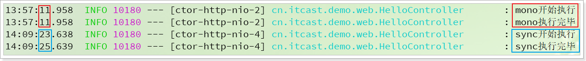

可以发现，传统的Handler执行getOne()方法，耗时2秒，而Mono方式执行耗时不足1毫秒


### 3.3.3.Flux的Demo

Mono代表返回值是一个元素，而Flux则代表返回值是一串元素，来看一个示例。

#### 1）普通Flux模式

首先看下基本的Flux模式

```java
@GetMapping("/flux")
public Flux<User> getUserFlux() {
    log.info("flux 开始执行");
    Flux<User> flux = getUserWithFlux();
    log.info("flux 执行完毕");
    return flux;
}

private Flux<User> getUserWithFlux() {
    return Flux.interval(Duration.ofSeconds(1))// 每隔1秒发射一个元素
        .take(3) // 取前3个元素
        // 将元素转为一个User对象
        .map(i -> User.of("user_" + i, 20 + i.intValue()));
}
```

这里通过`getUserWithFlux()`方法生成了包含3个元素的Flux，生成每个元素的间隔是1秒，模拟任务耗时。

来看下页面效果：

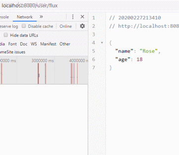 

发现在请求发出3秒后，浏览器拿到完整数据，并组织成了一个json的数组


#### 2）通过EventStream格式化的Flux

上面的请求中，响应结果并没有像流一样，逐个返回到页面，而是在3秒后将结果组织为一个JSON数组返回。

如果我们希望数据像流一样，不断生成并返回到页面，我们设置响应模式为：`text/event-stream`类型。

代码如下：

```java
@GetMapping(value = "/stream", produces = MediaType.TEXT_EVENT_STREAM_VALUE)
public Flux<User> getUserStream() {
    log.info("stream 开始执行");
    Flux<User> flux = getUserWithFlux();
    log.info("stream 执行完毕");
    return flux;
}
```

说明：`MediaType.TEXT_EVENT_STREAM_VALUE`枚举的值就是`text/event-stream`

效果图：

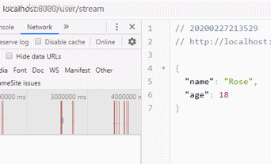 

可以看到，请求发出后，数据会逐条返回到客户端，并渲染在页面，真的像数据流一样。最终实现数据从服务端向客户端的持续推送，类似看视频直播一样，这个就是HTML5中的SSE技术：[Server Sent Events](https://www.ruanyifeng.com/blog/2017/05/server-sent_events.html)。

SSE： 服务端到客户端的持续推流，基于http协议

WebSocket：服务端与客户端的双向持续交互，额外的一种协议


## 3.4.Flux和Mono的API

在WebFlux应用中，我们会的返回值通常都会用Flux或者Mono来封装，那么构建Flux和Mono的方式有哪些呢？

### 3.4.1.创建Flux的API

#### 1）简单方法

首先是一些简单静态方法，这些方法添加一些包含固定元素的Flux或者简单数字的Flux。包括：

- just()：可以指定序列中包含的全部元素。创建出来的 Flux 序列在发布这些元素之后会自动结束。
- fromArray()，fromIterable()和 fromStream()：可以从一个数组、Iterable 对象或 Stream 对象中创建 Flux 对象。
- empty()：创建一个不包含任何元素，只发布结束消息的序列。
- error(Throwable error)：创建一个只包含错误消息的序列。
- never()：创建一个不包含任何消息通知的序列。
- range(int start, int count)：创建包含从 start 起始的 count 个数量的 Integer 对象的序列。
- interval(Duration period)和 interval(Duration delay, Duration period)：创建一个包含了从 0 开始递增的 Long 对象的序列。其中包含的元素按照指定的间隔来生成

代码实例：

```java
// 生成包含两个字符串的Flux："Hello", "World"
Flux.just("Hello", "World").subscribe(System.out::println);
// 从一个Integer数组中创建Flux
Flux.fromArray(new Integer[] {1, 2, 3}).subscribe(System.out::println);
// 空的Flux
Flux.empty().subscribe(System.out::println);
// 创建一个包含1到10的整数Integer类型的Flux
Flux.range(1, 10).subscribe(System.out::println);
// 每隔1秒生成一个元素
Flux.interval(Duration.ofSeconds(1)).subscribe(System.out::println)
```


如果生成元素的逻辑比较复杂，建议使用`generate`方法或者`create`方法

#### 2）generate方法

`generate()`方法通过同步和逐一的方式来产生 Flux 序列。序列的产生是通过调用所提供的 `SynchronousSink` 对象的 `next()`，`complete()`和 `error(Throwable)`方法来完成的。

代码：

```java
Flux<String> flux = Flux.generate(sink -> {
    // 添加一个元素
    sink.next("Hello");
    // 结束
    sink.complete();
});
```

这个方法的含义是生成一个Flux，但是只包含一个元素：`"hello"`;


`generate()`方法的另外一种形式 `generate(Callable<S> stateSupplier, BiFunction<S,SynchronousSink<T>,S> generator)`，其中 `stateSupplier` 用来提供初始的状态对象。在进行序列生成时，状态对象会作为 `generator` 使用的第一个参数传入，可以在对应的逻辑中对该状态对象进行修改以供下一次生成时使用。

代码：

```java
// 定义一个随机生成器
final Random random = new Random();
// 把集合的构造函数作为初始化方法，形成的初始化变量，会传递给第二个函数作为参数
Flux<Integer> flux = Flux.generate(ArrayList::new, (list, sink) -> {
    // 生成随机数
    int value = random.nextInt(100);
    // 加入集合
    list.add(value);
    // 加入Flux
    sink.next(value);
    if (list.size() == 10) {
        // 当集合元素数量等于10，则停止
        sink.complete();
    }
    return list;
});
```

这个方法的最终结果，是生成一个包含10个随机数的Flux


Generate方法比较抽象，有点类似于reduce方法。如果不好理解，建议使用create方法。

#### 3）create方法

create()方法与 generate()方法的不同之处在于所使用的是 FluxSink 对象。FluxSink 支持同步和异步的消息产生，并且可以在一次调用中产生多个元素。在代码清单 3 中，在一次调用中就产生了全部的 10 个元素。

代码：

```java
Flux<Integer> flux = Flux.create(sink -> {
    for (int i = 0; i < 10; i++) {
        // 将循环遍历得到的数字，添加到flux
        sink.next(i);
    }
    // 循环结束，任务完成
    sink.complete();
});
// 会生成一个包含从0到9的int元素的Flux
flux.subscribe(System.out::println);
```


### 3.4.2.创建Mono的API

Mono中只包含一个元素，因此创建起来更加简单，其中包含一些与Flux类似的API：

- just()：指定Mono中的固定元素
- empty()：创建一个不包含任何元素，但会发送消息的Mono。
- error(Throwable error)：创建一个只包含错误消息的Mono。
- never()：创建一个不包含任何元素的Mono。
- create()：通过MonoSink来构建包含一个元素的Mono，可以使用MonoSink的success()、error()等方法。

代码：

```java
Mono<String> mono = Mono.just("hello");
Mono<Object> mono = Mono.create(monoSink -> monoSink.success("hello"));
```


但Mono也有一些独特的方法：

- fromCallable()、fromCompletionStage()、fromFuture()、fromRunnable()和 fromSupplier()：分别从 Callable、CompletionStage、CompletableFuture、Runnable 和 Supplier 中创建 Mono。
- delay(Duration duration)和 delayMillis(long duration)：创建一个 Mono 序列，在指定的延迟时间之后，产生数字 0 作为唯一值。
- ignoreElements(Publisher<T> source)：创建一个 Mono 序列，忽略作为源的 Publisher 中的所有元素，只产生结束消息。
- justOrEmpty(Optional<? extends T> data)和 justOrEmpty(T data)：从一个 Optional 对象或可能为 null 的对象中创建 Mono。只有 Optional 对象中包含值或对象不为 null 时，Mono 序列才产生对应的元素。

代码：

```java
Mono<String> mono = Mono.fromSupplier(() -> "hello");
Mono<String> mono = Mono.fromFuture(CompletableFuture.supplyAsync(() -> "hello"));
```


