# day07_搜索过滤及数据同步

# 0.学习目标

- 利用elasticsearch，实现搜索框自动补全功能
- 利用elasticsearch，实现基本搜索功能
- 实现数据库与elasticsearch的数据同步


# 1.搜索框补全

在首页或者网站的其它大部分页面，都会在顶部显示一个搜索框：

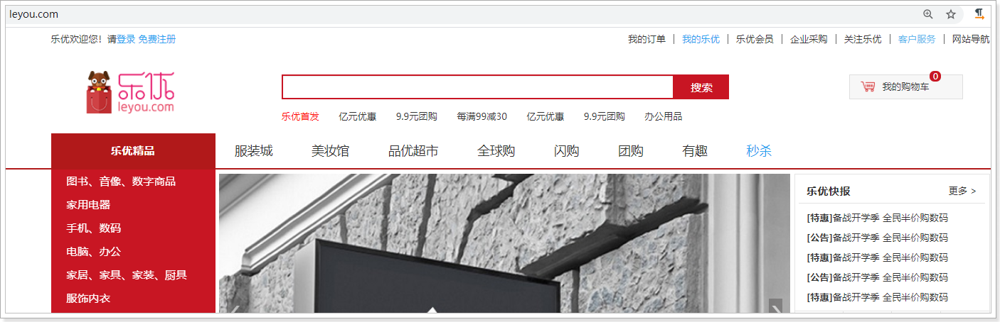

当用户在输入框中输入字母或文字式，我们应该弹出一系列相关提示，补全用户想要搜索的内容，这样用户体验比较好，像这样：

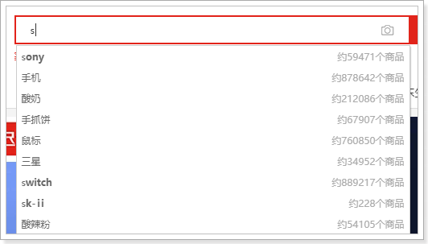 


## 1.1.需求分析

要实现这个功能，大概流程是这样的：

- 页面发请求到服务端，携带用户输入的关键字
- 服务端根据关键字查询elasticsearch，得到自动补全的提示信息
- 服务端返回信息到页面，在页面完成渲染


接下来，我们逐步完成上面的思路

## 1.2.页面请求

页面顶部搜索条是一个共享的组件，因此我们定义到了一个叫做`js/pages/top.js`的文件中：

 

打开文件，找到搜索输入框部分：

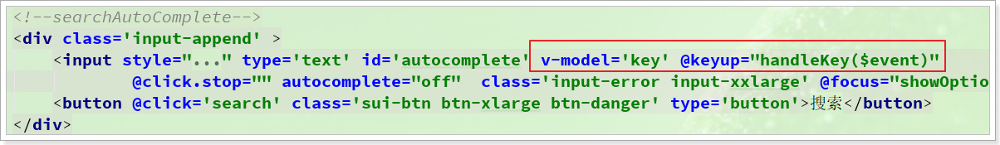

可以看到这里绑定了键盘事件，同时使用`v-model`关联了一个变量：`key`.

而在下面的键盘对应的事件里，我们会判断用户按下的键，如果是字母数字这样的按钮，就会去调用`getSuggestion()`方法，查询提示内容：

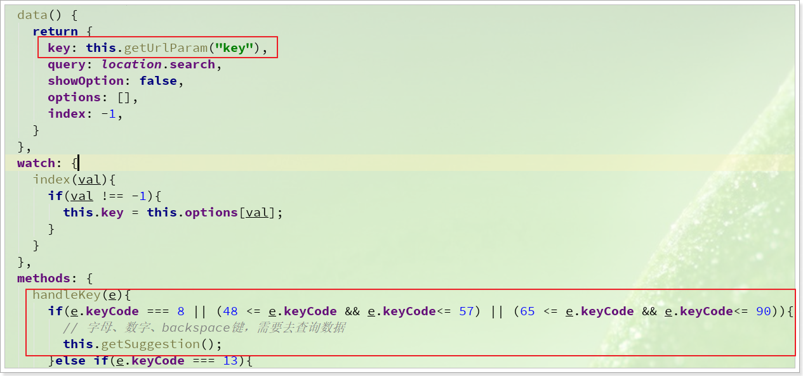

 `getSuggestion`方法如下：

```js
getSuggestion(){
    axios.get("/search/goods/suggestion?key=" + this.key)
        .then(resp => {
            this.options = resp.data;
            this.showOption = resp.data && resp.data.length > 0;
        })
        .catch(e => {
            console.log(e);
            this.options = resp.data
        })
}
```


每当用户按下对应按键，输入文字，就会触发，发送请求到服务端：

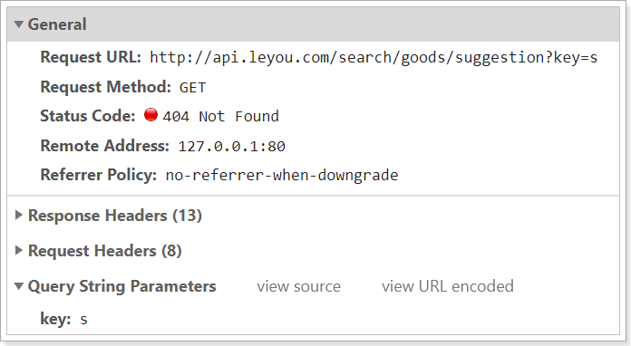 

现在，页面请求已经发出了，接下来就可以再服务端接收，并且去Elasticsearch查询了。


## 1.3.实现服务端查询

接下来，我们来完成服务端代码。

### 1.4.1.controller

首先对页面请求做简单的分析：

- 请求方式：GET
- 请求路径：/goods/suggestion
- 请求参数：key，就是用户输入的关键字
- 返回值：提示给用户看的词条列表，应该是一个字符串的集合，需要Mono封装

我们在`ly-search`的`SearchController`中定义方法：

```java
/**
     * 查询自动补全数据
     * @param key 用户输入的关键字
     * @return 补全的内容列表
     */
@GetMapping("/suggestion")
public Mono<List<String>> getSuggestion(@RequestParam("key") String key) {
    return searchService.getSuggestion(key);
}
```


### 1.4.2.service

我们要先定义到一个常量类，把一些索引库字段名称定义为常量.

我们在`ly-search`的`com.leyou.search.constants`包中添加`SearchConstants`类：

```java
package com.leyou.search.constants;


public abstract class SearchConstants {
    /**
     * 自动补全的模板id
     */
    public static final String SUGGESTION_TEMPLATE_ID = "goods_suggest_template";
    /**
     * 自动补全的模板参数1名称
     */
    public static final String SUGGESTION_PARAM_PREFIX_KEY = "prefix_key";
    /**
     * 自动补全的模板参数2名称
     */
    public static final String SUGGESTION_PARAM_FIELD = "suggest_field";
    /**
     * 自动补全的自动名
     */
    public static final String SUGGESTION_FIELD = "suggestion";

    /**
     * 默认的查询字段
     */
    public static final String DEFAULT_SEARCH_FIELD = "title";

    /**
     * 分类字段名称
     */
    public static final String CATEGORY_FIELD_NAME = "categoryId";
    /**
     * 品牌字段名称
     */
    public static final String BRAND_FIELD_NAME = "brandId";
    /**
     * 规格参数字段路径
     */
    public static final String SPEC_FIELD_PATH = "specs";

    /**
     * 规格参数名称字段的name
     */
    public static final String SPEC_NAME_FIELD_NAME = "specs.name";
    /**
     * 规格参数值字段路径name
     */
    public static final String SPEC_VALUE_FIELD_NAME = "specs.value";
    /**
     * 默认查询的source字段
     */
    public static final String[] DEFAULT_SOURCE_FIELD = new String[]{"id", "title", "image", "prices", "sold"};

    /**
     * 高亮时的标签
     */
    public static final String DEFAULT_PRE_TAG = "<am>";
    /**
     * 高亮时的标签
     */
    public static final String DEFAULT_POST_TAG = "</am>";
}
```

我们在`ly-search`的`com.leyou.search.service`包中的`SearchService`接口中添加一个`getSuggestion()`方法：

```java
/**
     * 查询补全数据
     * @param key 关键字
     * @return 补全数据列表
     */
Mono<List<String>> getSuggestion(String key);
```


我们在`ly-search`的`com.leyou.search.service.impl`包中的`SearchServiceImpl`中顶部使用静态导入，导入需要的常量

```java
import static com.leyou.search.constants.SearchConstants.*;
```


我们在`ly-search`的`com.leyou.search.service.impl`包中的`SearchServiceImpl`添加一个`getSuggestion()`方法：

```java
@Override
public Mono<List<String>> getSuggestion(String keyPrefix) {
    if (StringUtils.isBlank(keyPrefix)) {
        throw new LyException(400, "请求参数不能为空！");
    }
    return repository.suggestBySingleField(SUGGESTION_FIELD, keyPrefix);
}
```


然后，我们在浏览器测试下：

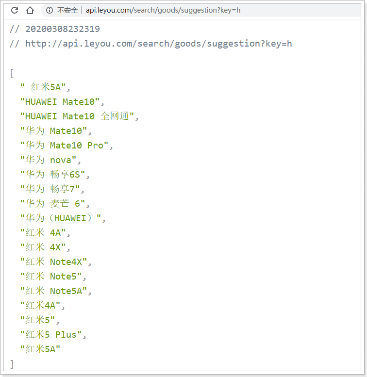 


## 1.4.完成页面渲染（了解）

### 1.4.1.基本渲染

数据返回到页面，首先保存到data的属性中：

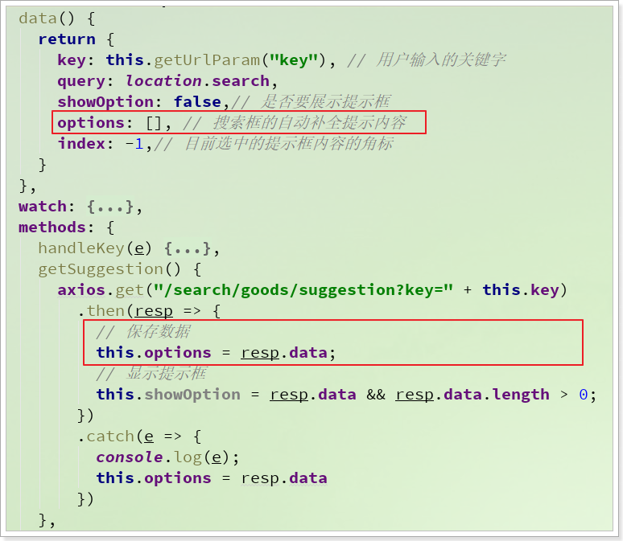

然后，在页面通过for循环遍历并渲染：

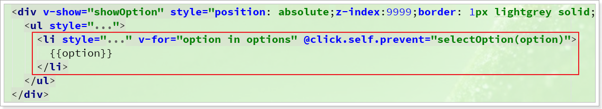

看下效果：

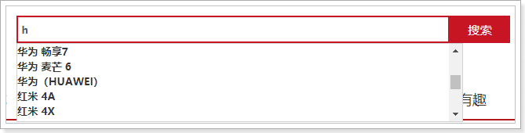 


### 1.4.2.背景变色

为了提升用户体验，我们需要在用户选中时，给提示项背景变色，因此我们需要先记录当前鼠标选中的是哪一个提示项.

#### 1）记录选中的提示项

在data中定义一个变量，来记录选中的提示项的角标：

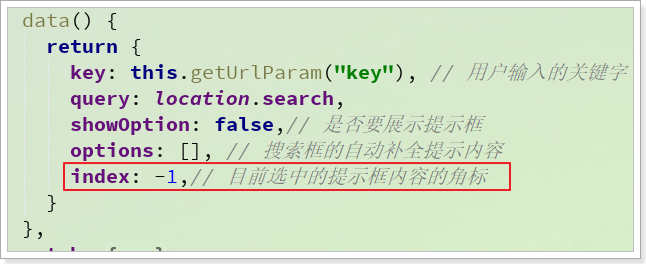 

然后，给选项添加动态样式，当**选中项**角标等于**当前选项**角标时，背景高亮：

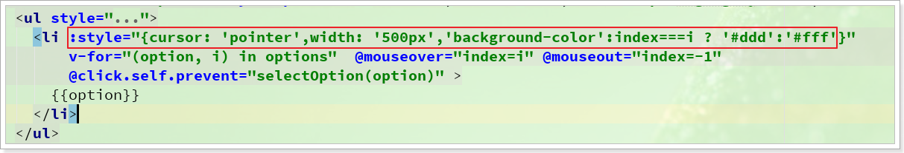

#### 2）鼠标移动选中提示项

然后，给提示项添加鼠标悬停事件，悬停到当前提示项时，**把index值改成自己的角标**，那么自己就高亮了:

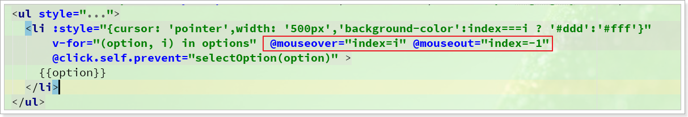


#### 3）键盘控制光标

有时候用户手正放在键盘上输入，所以可能希望通过==“↑”==或者==“↓”==两个按键来控制选中的提示项。

我们需要在之前的键盘事件中，添加对==“↑”==或者==“↓”==两个按键的判断：

- 点击==“↓”==：index就`+1`，光标就下移
- 点击==“↑”==：index就`-1`，光标就上移

不过，还要加入健壮性判断，如果超出了options的长度或者小于0就麻烦了：

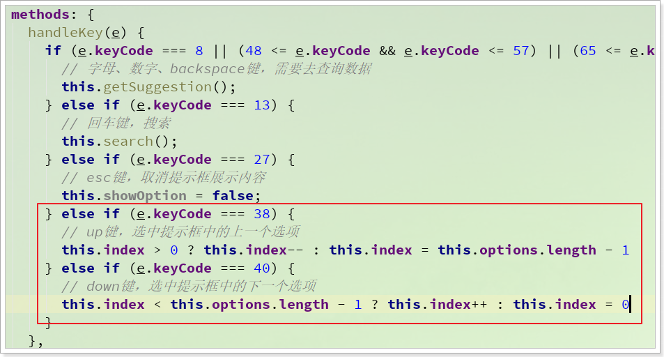


最终的效果：

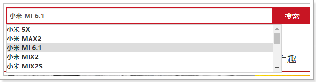 

#### 4）输入框内容跟随光标变化

光标上下移动，选中的提示项改变了，那么输入框内容也要一起改变。

我们可以watch监控index的变化，然后动态修改key的值即可：

```js
watch: {
    index(val) {
        if (val !== -1) {
            this.key = this.options[val];
        }
    }
}
```

最终效果如图：

 


# 2.基本搜索

给用户提示信息后，接下来用户就会去搜索数据了，大概的实现步骤是这样的：

- 用户点击提示的内容或自己输入内容点击搜索
- 页面跳转到搜索列表页，并携带搜索关键字
- 搜索列表页发起请求到服务端，携带搜索参数
- 服务端利用搜索关键字，向ElasticSearch发起请求，查询数据
- 返回数据到页面，完成渲染

我们来看看如何实现

## 2.1.页面跳转（了解）

### 2.1.1.提示框条目点击事件

用户点击提示框内的选项，我们要实现跳转，因此需要给提示框内容绑定点击事件：

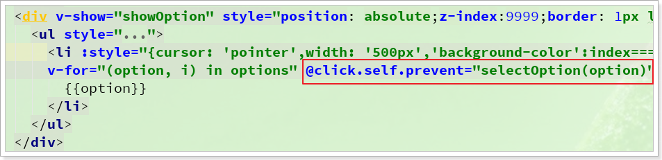

在事件中，获取选中的项，也就是搜索的关键字，关闭提示框，然后跳转到搜索页面：

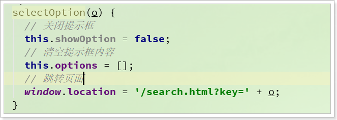 


### 2.1.2.搜索按钮和输入框事件

除了点击提示内容可以跳转，用户按回车或点击搜索按钮，也应该实现跳转，我们需要：

- 给输入框绑定键盘监听事件，监听回车键
- 需要给搜索按钮绑定点击事件：


在`handlekey`方法中，判断用户输入的按钮是不是回车键：

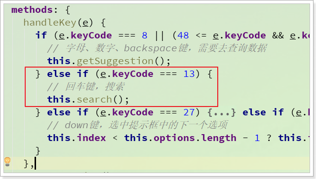 

如果是回车键，这里调用`this.search()`方法:

```js
search() {
	window.location = '/search.html?key=' + this.key;
},
```

方法中，实现页面跳转，携带请求参数。

## 2.2.查询请求分析（了解）

跳转到search.html以后，会在当前页面的生命周期钩子中，获取请求参数：

```js
created() {
    // 获取请求参数
    let key = ly.getUrlParam("key");
    if (!key) return;
    // 获取其它参数
    let params = ly.parse(location.hash.substring(1));
    // 初始化其它请求参数
    params.page = params.page ? parseInt(params.page) : 1;
    params.key = key;
    params.filters = params.filters || {};
    params.sortBy = "";
    params.desc = true;
    // 赋值给本地变量
    this.params = params;
}
```

当然，这里除了获取`key`这个参数以为，还会获取一些其他参数，这些我们在后面会用到。然后参数被赋值给了本地变量：`params`。

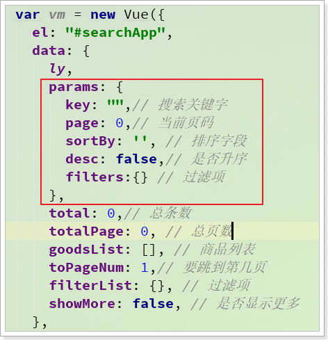 

而代码中通过`watch`监控了参数的变化，并发起请求：

```js
watch: {
    "params.key"(val, oldVal) {
        if (!oldVal) {
            return;
        }
        // 获取商品数据
        this.searchData();
        // 获取过滤项数据
        this.getFilters();
    },
}
```

`this.searchData()`方法中，搜索的代码如下：

```js
searchData() {
    axios.post("/search/goods/list", this.params)
        .then(resp => {
            // 分页数据
            this.total = resp.data.total;
            this.totalPage = Math.floor((this.total + 19) / 20);
            // 商品
            this.goodsList = resp.data.content;
        })
        .catch(e => console.log(e))
}
```

页面请求已经发出：

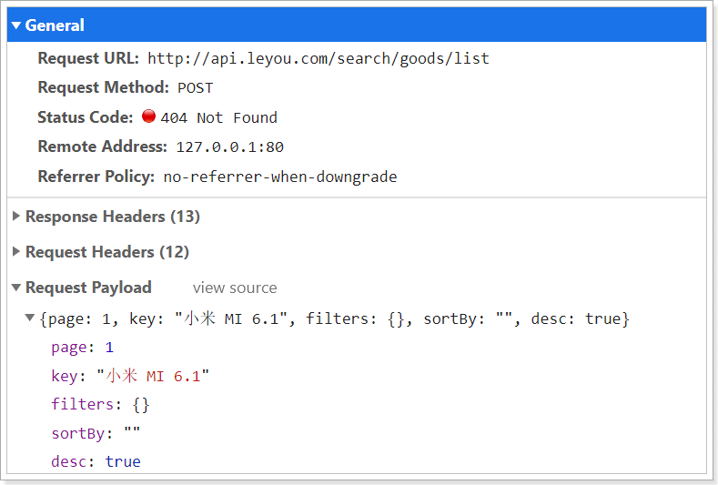 


## 2.3.查询的业务实现

### 2.3.1.接口分析

先来看下请求接口：

- 请求方式：POST

- 请求路径：/goods/list

- 请求参数：json风格，包含5个参数：

  - page：当前页
  - key：搜索关键字
  - filters：过滤项
  - sortBy：排序字段，可以为空，就是按照默认打分排序
  - desc：是否降序，默认true

- 返回值：分页查询，需要返回分页结果对象，包括2个字段:

  - total：总条数
  - content：当前页数据

  在自定义的es的starter中，包含了一个PageInfo类，符合这样的结构：

  ```java
  
  public class PageInfo<T> {
      private long total;
      private List<T> content;
  
      public PageInfo() {
      }
  }
  ```
  
  

这里需要准备接收请求参数的对象，我们在`ly-search`的`com.leyou.search.dto`包中，准备DTO对象：

```java
package com.leyou.search.dto;

import java.util.Map;

/**
 * 搜索的请求参数对象
 */
public class SearchParamDTO {
    /**
     * 每页大小，不从页面接收，而是固定大小
     */
    private static final Integer DEFAULT_SIZE = 20;
    /**
     * 默认页
     */
    private static final int DEFAULT_PAGE = 1;
    /**
     * 页码最大不能超过100
     */
    private static final int PAGE_MAX_VALUE = 100;
    /**
     * 搜索的关键字
     */
    private String key;
    /**
     * 当前页码
     */
    private Integer page = DEFAULT_PAGE;
    /**
     * 排序字段
     */
    private String sortBy;
    /**
     * 是否为降序
     */
    private Boolean desc;
    /**
     * 过滤参数
     */
    private Map<String,String> filters;
    /**
     * 开始索引
     */
    private Integer from;

    public String getKey() {
        return key;
    }

    public void setKey(String key) {
        this.key = key;
    }

    public int getPage() {
        if(page == null){
            return DEFAULT_PAGE;
        }
        return page;
    }

    public void setPage(Integer page) {
        this.page = Math.min(Math.max(DEFAULT_PAGE, page), PAGE_MAX_VALUE);
    }

    public int getSize() {
        return DEFAULT_SIZE;
    }

    public Map<String, String> getFilters() {
        return filters;
    }

    public void setFilters(Map<String, String> filters) {
        this.filters = filters;
    }

    public String getSortBy() {
        return sortBy;
    }

    public void setSortBy(String sortBy) {
        this.sortBy = sortBy;
    }

    public Boolean getDesc() {
        return desc;
    }

    public void setDesc(Boolean desc) {
        this.desc = desc;
    }

    public Integer getFrom() {
        return (page - 1) * getSize();
    }
}
```

注意，对象中包含几个特殊方法：

- getFrom()：根据page和size计算分页的开始索引
- getSize()：返回默认的每页大小，20


### 2.3.2.controller

我们在`ly-search`的`com.leyou.search.web`的`SearchController`中定义方法：

```java
/**
     * 分页搜索商品数据
     * @param request 请求参数
     * @return 分页结果
     */
@PostMapping("/list")
public Mono<PageInfo<Goods>> searchGoods(@RequestBody SearchParamDTO request){
    return searchService.searchGoods(request);
}
```


### 2.3.3.service

在实现搜索时，我们会调用`GoodsRepository`中提供的`queryBySourceBuilderForPageHighlight()`方法，其返回值是一个`PageInfo<T>`对象，这里的T应该就是`Goods`对象。

不过，页面渲染不需要Goods的全部数据，需要的参数包括：

- 商品id
- 商品标题
- 商品价格
- 商品图片
- 销量

因此，我们需要在查询时候，添加source过滤，限制elasticsearch返回的字段数量。

接下来，在`ly-search`的`com.leyou.search.service`包下的`SearchService`接口中，添加方法：

```java
/**
     * 分页查询商品数据
     * @param param 请求参数
     * @return 商品分页数据
     */
Mono<PageInfo<Goods>> searchGoods(SearchParamDTO param);
```

在`ly-search`的`com.leyou.search.service.impl`包下的`SearchServiceImpl`中，实现方法：

```java
@Override
public Mono<PageInfo<Goods>> searchGoods(SearchParamDTO param) {
    // 1.构建查询条件的工厂对象
    SearchSourceBuilder sourceBuilder = new SearchSourceBuilder();
    // 1.1.source过滤
    sourceBuilder.fetchSource(DEFAULT_SOURCE_FIELD, new String[0]);
    // 1.2.查询条件
    String key = param.getKey();
    if(StringUtils.isBlank(key)){
        // 搜索条件为null，返回异常
        throw new LyException(400, "搜索条件不能为空！");
    }
    sourceBuilder.query(QueryBuilders.matchQuery(DEFAULT_SEARCH_FIELD, key));
    // 1.3.分页条件
    sourceBuilder.from(param.getFrom());
    sourceBuilder.size(param.getSize());
    // 1.4.排序条件
    if(StringUtils.isNotBlank(param.getSortBy())){
        // 排序字段存在，才去排序
        sourceBuilder.sort(param.getSortBy(), param.getDesc() ? SortOrder.DESC: SortOrder.ASC);
    }
    // 1.5.高亮条件
    sourceBuilder.highlighter(new HighlightBuilder().field(DEFAULT_SEARCH_FIELD)
                              .preTags(DEFAULT_PRE_TAG).postTags(DEFAULT_POST_TAG));

    // 2.查询
    return repository.queryBySourceBuilderForPageHighlight(sourceBuilder);
}
```


## 2.4.页面渲染查询数据

我们重启服务，在页面访问试试：


不过，查看控制台响应的结果，发现一些问题：

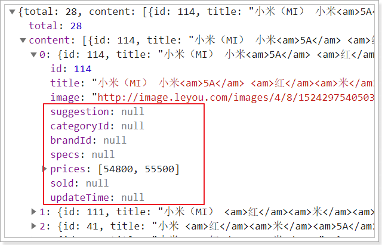 

我们不需要返回的结果没有值，但是返回了null到页面，看起来很糟糕。怎样才能在对象序列化为JSON的时候，忽略null字段呢？


我们可以再在`ly-search`的`application.yml`文件中添加配置：

```yaml
spring:
  application:
    name: search-service
  jackson:
    default-property-inclusion: non_null # json处理忽略null字段
```

重启后再试试效果：

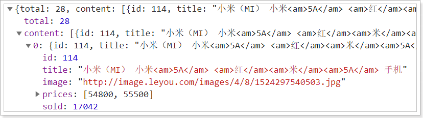


# 3.数据同步

我们已经完成了搜索的基本功能，但是一个问题摆在我们的面前：

搜索功能依赖的商品数据是存储在ElasticSearch中的，但是数据库中也有一份商品数据。当我们对商品做增、删、改这样的操作时，ElasticSearch并未感知到，此时就会出现**数据库数据与索引库数据的不一致**。


## 3.1.同步问题分析

大家首先的想法也许是这样的：我们可以再商品做增、删、改的时候，去修改索引库数据啊，同样把商品增删改到索引库中。


不过，我们并不需要在商品增、删、改的时候都对索引库做处理，因为索引库中只需要上架的商品，如果一个商品新增了，并不代表也上架了。而且，商品要修改和删除前必须先下架，商品新增后还要上架。

所以，我们需要做的是：

- 商品上架：在索引库新增数据
- 商品下架：把数据从索引库删除


但新的问题来了：商品的上架和下架时商品微服务`ly-item`中处理的，索引库数据是在`ly-search`中处理的。我们如何在上架时修改索引库呢？

这里有两种解决方案：

- 方案1：在商品微服务的上下架业务后，加入修改索引库数据

- 方案2：搜索服务对外提供操作索引库，商品微服务在商品上下架后，调用接口。


以上两种方式都有同一个严重问题：就是代码耦合，后台服务中需要嵌入搜索和商品页面服务，违背了微服务的`独立`原则，而且严重违背了开闭原则。

所以，我们会通过另外一种方式来解决这个问题：消息队列


## 3.2.流程分析

如何利用MQ来实现数据同步呢？来看一个流程图：

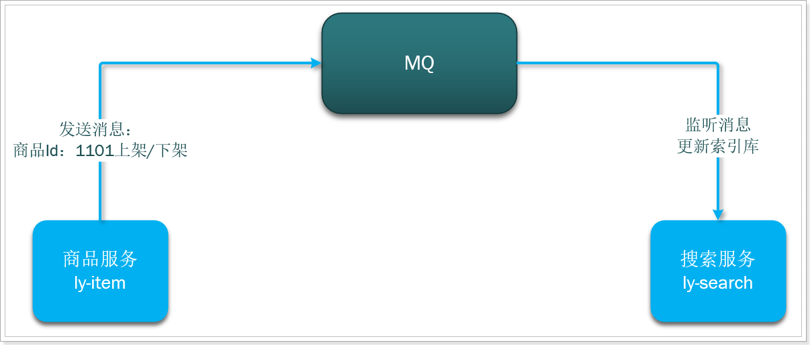

商品微服务在完成上架、下架后，发送消息到MQ，通知是哪个商品更新了，自己的业务就结束了，商品微服务不需要知道，也不关心到底是谁在监听这条消息。

搜索微服务在接收到消息后，更新索引库数据即可，同样不需要关心别人。

两个微服务之间没有直接调用，没有业务的耦合。


不过，这里有几个问题需要思考：

- 什么时候发消息？
  - 当商品服务对商品进行上下架的时候，需要发送一条消息，通知其它服务

- 商品微服务发送消息的内容是什么？
  - 对商品的增删改时其它服务可能需要新的商品数据，但是如果消息内容中包含全部商品信息，数据量太大，而且并不是每个服务都需要全部的信息。因此我们**只发送商品id**，其它服务可以根据id查询自己需要的信息。

- 搜索微服务接收消息后如何处理？
  - 上架：添加新的数据到索引库
  - 下架：删除索引库数据


附录：docker安装RabbitMQ的命令：

```shell
docker run \
 -e RABBITMQ_DEFAULT_USER=leyou \
 -e RABBITMQ_DEFAULT_PASS=123321 \
 --name ly-mq \
 --hostname mq1 \
 -p 15672:15672 \
 -p 5672:5672 \
 -d \
 rabbitmq:3-management
```


## 3.3.消息队列常量

在`ly-common`的`com.leyou.common.constants`包中编写一个常量类，记录将来会用到的Exchange名称、Queue名称、routing_key名称.

```java
package com.leyou.common.constants;


public abstract class MQConstants {

    public static final class ExchangeConstants {
        /**
         * 商品服务交换机名称
         */
        public static final String ITEM_EXCHANGE_NAME = "ly.item.exchange";
        /**
         * 消息服务交换机名称
         */
        public static final String SMS_EXCHANGE_NAME = "ly.sms.exchange";
        /**
         * 订单业务的交换机
         */
        public static final String ORDER_EXCHANGE_NAME = "ly.order.exchange";
        /**
         * 死信队列交换机名称
         */
        public static final String DEAD_EXCHANGE_NAME = "ly.dead.exchange";
    }

    public static final class RoutingKeyConstants {
        /**
         * 商品上架的routing-key
         */
        public static final String ITEM_UP_KEY = "item.up";
        /**
         * 商品下架的routing-key
         */
        public static final String ITEM_DOWN_KEY = "item.down";
        /**
         * 商品下架的routing-key
         */
        public static final String VERIFY_CODE_KEY = "sms.verify.code";
        /**
         * 清理订单routing-key
         */
        public static final String EVICT_ORDER_KEY = "order.evict";
    }

    public static final class QueueConstants{
        /**
         * 搜索服务，商品上架的队列
         */
        public static final String SEARCH_ITEM_UP = "search.item.up.queue";
        /**
         * 搜索服务，商品下架的队列
         */
        public static final String SEARCH_ITEM_DOWN = "search.item.down.queue";
        /**
         * 搜索服务，商品下架的队列
         */
        public static final String SMS_VERIFY_CODE_QUEUE = "sms.verify.code.queue";
        /**
         * 订单死信队列名称
         */
        public static final String DEAD_ORDER_QUEUE = "ly.dead.order.queue";
        /**
         * 订单清理队列名称
         */
        public static final String EVICT_ORDER_QUEUE = "ly.evict.order.queue";

    }
}
```


## 3.4.商品微服务发送消息

我们先在商品微服务`ly-item-service`中实现发送消息。

### 3.4.1.引入依赖

在`ly-item-service`的pom.xml文件中，添加RabbitMQ依赖：

```xml
<dependency>
    <groupId>org.springframework.boot</groupId>
    <artifactId>spring-boot-starter-amqp</artifactId>
</dependency>
```

### 3.4.2.配置文件

我们在`ly-item-service`的`application.yml`中添加一些有关RabbitMQ的配置：

```yaml
spring:
  rabbitmq:
    host: ly-mq
    username: leyou
    password: 123321
    virtual-host: /leyou
    template:
      retry:
        enabled: true
        initial-interval: 10000ms
        max-interval: 80000ms
        multiplier: 2
    publisher-confirms: true
```

- template：有关`AmqpTemplate`的配置
  - retry：失败重试
    - enabled：开启失败重试
    - initial-interval：第一次重试的间隔时长
    - max-interval：最长重试间隔，超过这个间隔将不再重试
    - multiplier：下次重试间隔的倍数，此处是2即下次重试间隔是上次的2倍
  - exchange：缺省的交换机名称，此处配置后，发送消息如果不指定交换机就会使用这个
- publisher-confirms：生产者确认机制，确保消息会正确发送，如果发送失败会有错误回执，从而触发重试

### 3.4.3.Json消息转换器

需要注意的是，默认情况下，AMQP会使用JDK的序列化方式对发送的消息进行处理，传输数据比较大，效率太低，可读性差。我们可以自定义消息转换器，使用JSON来处理.

我们在`ly-item-service`的`com.leyou.item.config`包下，添加一个配置类：

```java
package com.leyou.item.config;

import org.springframework.amqp.support.converter.Jackson2JsonMessageConverter;
import org.springframework.context.annotation.Bean;
import org.springframework.context.annotation.Configuration;


@Configuration
public class RabbitConfig {

    @Bean
    public Jackson2JsonMessageConverter messageConverter(){
        return new Jackson2JsonMessageConverter();
    }
}
```

位置：

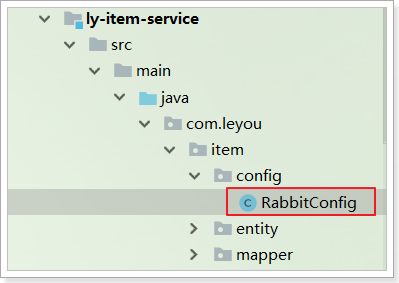 


### 3.4.4.改造SpuServiceImpl

改造SpuServiceImpl中的商品上下架功能，发送消息，两个注意点：

- 注入AmqpTemplate

- 注意用静态导入方式，导入在ly-common中定义的常量：

```java
import static com.leyou.common.constants.MQConstants.*;

@Override
@Transactional
public void updateSaleable(Long id, Boolean saleable) {
    // 1.修改spu
    Spu spu = new Spu();
    spu.setId(id);
    spu.setSaleable(saleable);

    boolean success = updateById(spu);
    if (!success) {
        throw new LyException(500, "更新失败");
    }
    // 2.修改sku
    success = skuService.update().set("saleable", saleable)
        .eq("spu_id", id).update();
    if (!success) {
        throw new LyException(500, "更新失败");
    }

    // 3.发送MQ消息
    String routingKey = saleable ? RoutingKeyConstants.ITEM_UP_KEY : RoutingKeyConstants.ITEM_DOWN_KEY;
    amqpTemplate.convertAndSend(ExchangeConstants.ITEM_EXCHANGE_NAME, routingKey, id);
}
```

重启商品微服务。


## 3.5.搜索服务接收消息

搜索服务接收到消息后要做的事情：

- 上架：添加新的数据到索引库
- 下架：删除索引库数据

我们需要两个不同队列，监听不同类型消息。

### 3.5.1.引入依赖

在`ly-search`的pom.xml文件中，添加RabbitMQ依赖：

```xml
<dependency>
    <groupId>org.springframework.boot</groupId>
    <artifactId>spring-boot-starter-amqp</artifactId>
</dependency>
```


### 3.5.2.添加配置

```yaml
spring:
  rabbitmq:
    host: ly-mq
    username: leyou
    password: 123321
    virtual-host: /leyou
```

这里只是接收消息而不发送，所以不用配置template相关内容。

### 3.5.3.消息转换器

不过，不要忘了消息转换器：

 

```java

@Configuration
public class RabbitConfig {

    @Bean
    public Jackson2JsonMessageConverter messageConverter(){
        return new Jackson2JsonMessageConverter();
    }
}
```


### 3.5.4.编写监听器

 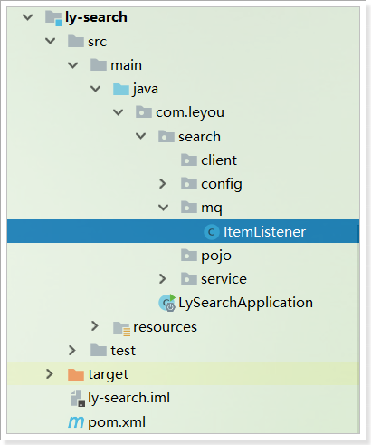 

代码：

```java
package com.leyou.search.mq;

import com.leyou.search.service.SearchService;
import org.springframework.amqp.core.ExchangeTypes;
import org.springframework.amqp.rabbit.annotation.Exchange;
import org.springframework.amqp.rabbit.annotation.Queue;
import org.springframework.amqp.rabbit.annotation.QueueBinding;
import org.springframework.amqp.rabbit.annotation.RabbitListener;
import org.springframework.beans.factory.annotation.Autowired;
import org.springframework.stereotype.Component;

import static com.leyou.common.constants.MQConstants.*;


@Component
public class ItemListener {

    @Autowired
    private SearchService searchService;

    @RabbitListener(bindings = @QueueBinding(
            value = @Queue(name = QueueConstants.SEARCH_ITEM_UP, durable = "true"),
            exchange = @Exchange(name = ExchangeConstants.ITEM_EXCHANGE_NAME, type = ExchangeTypes.TOPIC),
            key = RoutingKeyConstants.ITEM_UP_KEY
    ))
    public void listenItemUp(Long spuId){
        if (spuId != null) {
            // 商品上架，我们新增商品到索引库
            searchService.saveGoodsById(spuId);
        }
    }

    @RabbitListener(bindings = @QueueBinding(
            value = @Queue(name = QueueConstants.SEARCH_ITEM_DOWN, durable = "true"),
            exchange = @Exchange(name = ExchangeConstants.ITEM_EXCHANGE_NAME, type = ExchangeTypes.TOPIC),
            key = RoutingKeyConstants.ITEM_DOWN_KEY
    ))
    public void listenItemDown(Long spuId){
        if (spuId != null) {
            // 商品下架，我们删除商品
            searchService.deleteGoodsById(spuId);
        }
    }
}
```


### 3.5.5.编写创建和删除索引方法

在`ly-search`的`com.leyou.search.service`包的`SearchService`接口中添加两个方法：

```java
    /**
     * 新增一个商品到索引库
     * @param id 商品id
     */
    void saveGoodsById(Long id);

    /**
     * 从索引库删除一个商品
     * @param id 商品id
     */
    void deleteGoodsById(Long id);
```


在`ly-search`的`com.leyou.search.service.impl`包的`SearchServiceImpl`中实现这两个方法：

```java
@Override
public void saveGoodsById(Long spuId) {
    // 需要spu
    SpuDTO spu = itemClient.queryGoodsById(spuId);
    // 构建goods
    Goods goods = buildGoods(spu);
    // 写入索引库
    repository.save(goods);
}

@Override
public void deleteGoodsById(Long spuId) {
    repository.deleteById(spuId);
}
```


