# day09_商品详情页


# 0.学习目标

- 实现商品详情页几种解决办法
- 学会OpenResty的使用
- 学会Lua的基本语法
- 理解Nginx模板渲染功能
- 学会OpenResty操作Redis
- 学会Canal的使用


# 1.实现思路

用户搜索到商品后，就会点击商品，查看商品详情内容，就会访问到商品详情页。商品详情页是展示商品详细信息的一个页面，承载在网站的大部分流量和订单的入口。

因此，商品详情页必须能够应对高并发的压力。那么如何才能实现一个满足千万级并发量的商品详情页面呢？

接下来，我们就一起分析下商品详情页的设计思路。

## 1.1.传统模式

首先，来看下传统模式下，一个页面的加载和渲染过程：

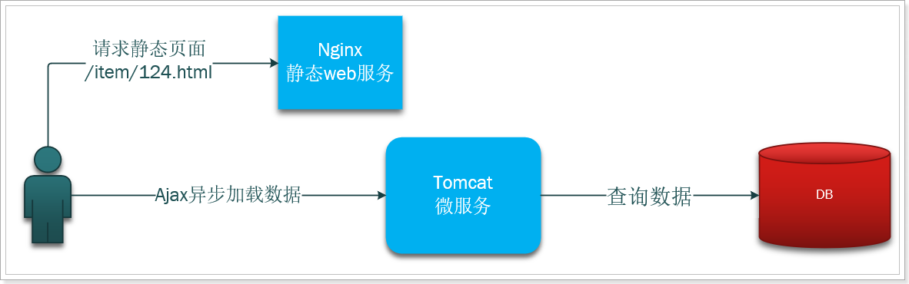

基本流程如下：

- 用户请求Nginx服务，获取到静态页面
- 然后页面发起ajax，向Tomcat服务获取数据
- Tomcat查询数据库
- 页面渲染


这种模式下，数据库称为了瓶颈，高并发情况下，数据库难以支撑，因此我们可能会在服务之前加入缓存，减小数据库压力：

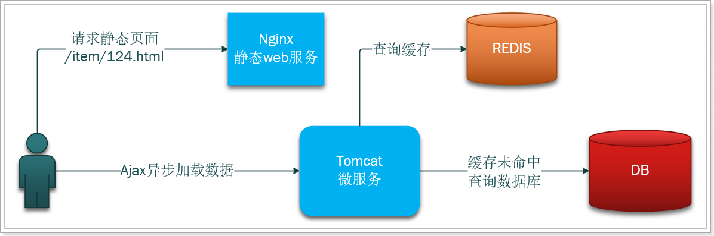

此时，整个服务的并发能力，就受限于Tomcat了，业务经常受到依赖的服务不稳定而导致的性能抖动。


## 1.2.静态化页面

为了解决上述问题，就有了页面静态化方案，如图：

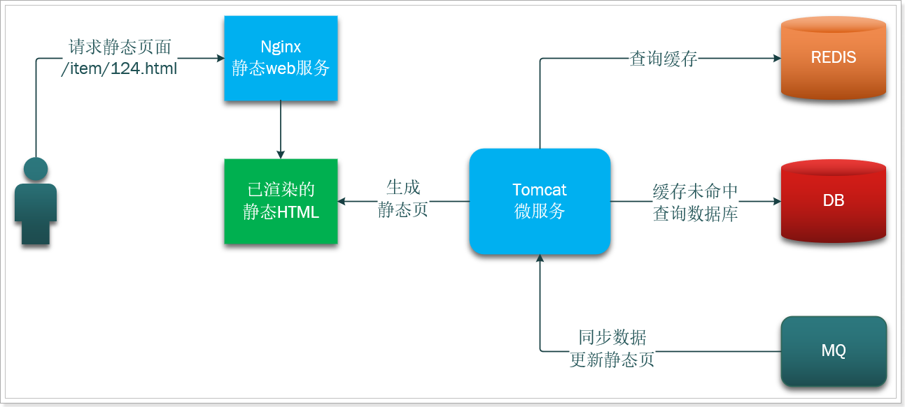

基本流程：

- 商品修改发送消息到MQ
- 微服务监听MQ，得知商品变化，渲染并生成一个静态页面
- 用户请求Nginx
- Nginx直接返回渲染好的静态Html

优点：

- 用户请求渲染好的Html，响应速度快
- 通过MQ异步更新，保证数据同步

缺陷：

- 小部分数据如价格变更，整个静态页都要重新生成
- 随着商品数量增加，页面会越来越多
- 页面模板变更，所有商品的静态页都要重新生成，非常困难


## 1.3.动态模板，静态化数据

我们要解决的问题：

- 能迅速响瞬变的需求，和各种变态需求；
- 支持各种垂直化页面改版；
- 页面模块化；
- 高性能、水平扩容；

怎么办？

- 如何做到动态响应需求变化，页面变化？
  - 将页面模板动态化，需要的数据静态化
- 如何避免整个页面的全量更新？
  - 我们把页面分成几部分：如顶部面包屑、商品SKU展示、商品描述、商品评论等，形成多个页面模板（模块）。对应的数据也分成几部分，这些数据可能来自不同的微服务。这样可以减少因局部变更引起的整个页面重新生成。
- 如何应对Tomcat的并发能力低问题？
  - 将模板渲染、数据放到nginx中做，利用nginx的高并发能力提高系统吞吐量
- 如何实现数据静态化？
  - 需要的数据可以缓存在Nginx的本地共享词典中（长期不会修改的数据），如果命中则直接渲染并返回。如果未命中，则查询Redis集群，获取数据。如果Redis集群依然未命中，再去查询后台微服务，由微服务获取数据，然后写入缓存中，保证下次Nginx可以从缓存中拿到数据。这样可以减少服务端压力。
- 如何保证数据一致性？
  - 为了保证Redis数据与数据库数据一致，我们还要用到Canal技术，监听数据库变化，及时更新Redis数据。


流程图：


因此，我们需要做的事情包括：

- 静态页数据服务：一个收集商品相关数据，并更新Redis缓存的数据服务
- Nginx服务：接收用户请求，查询模板数据，利用模板渲染商品页面
- Canal服务：监听数据库变化，同步通知静态页数据服务，更新Redis数据


# 2.静态页数据服务

我们搭建一个微服务，来做静态页数据处理。事实上，这样的页面静态化功能可以拓展至任何数据更新不频繁的其它页面，都可以再我们这个微服务完成数据处理。

## 2.1.搭建微服务

项目坐标：

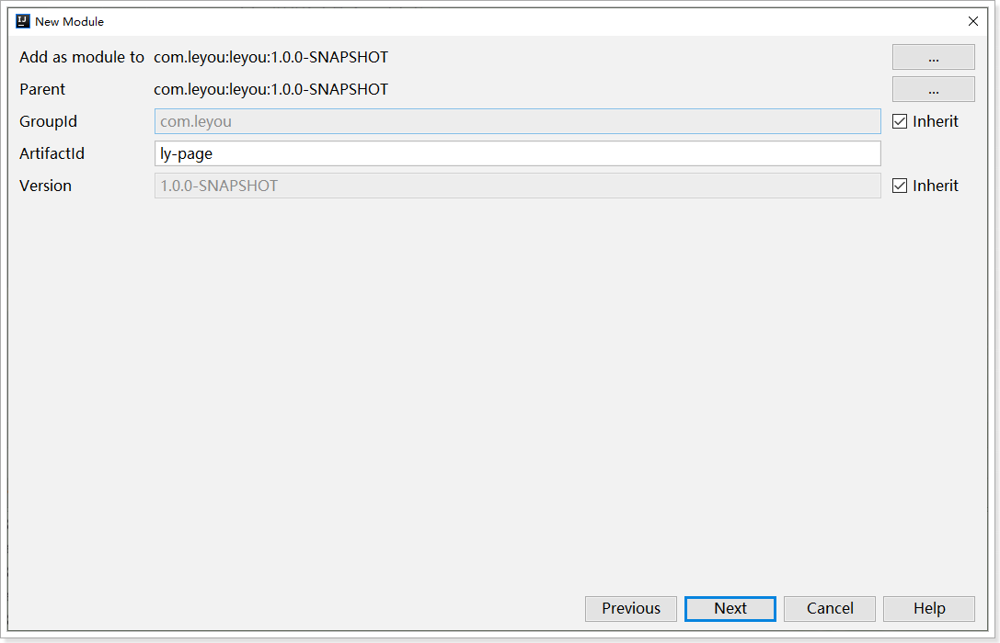

位置：

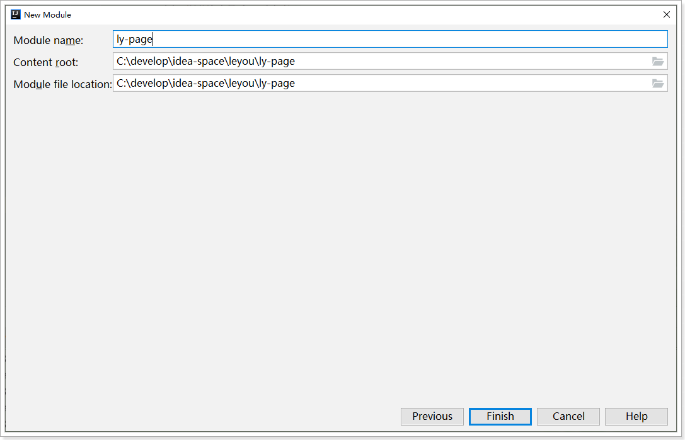

依赖：

修改项目中的`pom.xml`文件，添加下面依赖：

```xml
<dependencies>
    <!--web依赖-->
    <dependency>
        <groupId>org.springframework.boot</groupId>
        <artifactId>spring-boot-starter-web</artifactId>
    </dependency>
    <!--redis依赖-->
    <dependency>
        <groupId>org.springframework.boot</groupId>
        <artifactId>spring-boot-starter-data-redis</artifactId>
    </dependency>
    <!--商品微服务接口-->
    <dependency>
        <groupId>com.leyou</groupId>
        <artifactId>ly-item-api</artifactId>
        <version>1.0.0-SNAPSHOT</version>
    </dependency>
    <!--openfeign-->
    <dependency>
        <groupId>org.springframework.cloud</groupId>
        <artifactId>spring-cloud-starter-openfeign</artifactId>
    </dependency>
    <!--eureka客户端-->
    <dependency>
        <groupId>org.springframework.cloud</groupId>
        <artifactId>spring-cloud-starter-netflix-eureka-client</artifactId>
    </dependency>
</dependencies>
<build>
    <plugins>
        <plugin>
            <groupId>org.springframework.boot</groupId>
            <artifactId>spring-boot-maven-plugin</artifactId>
        </plugin>
    </plugins>
</build>
```

启动类：

在`ly-page`的`com.leyou.page`包下，添加一个启动类：

```java
package com.leyou.page;

import org.springframework.boot.SpringApplication;
import org.springframework.boot.autoconfigure.SpringBootApplication;
import org.springframework.cloud.openfeign.EnableFeignClients;


@EnableFeignClients(basePackages = "com.leyou.item.client")
@SpringBootApplication(scanBasePackages = {"com.leyou.page", "com.leyou.common.advice"})
public class LyPageApplication {
    public static void main(String[] args) {
        SpringApplication.run(LyPageApplication.class, args);
    }
}
```

配置文件application.yml中，添加配置：

```yaml
server:
  port: 8084
spring:
  application:
    name: page-service
  redis:
    host: ly-redis
eureka:
  client:
    service-url:
      defaultZone: http://ly-registry:10086/eureka
```


## 2.2.数据分析

商品详情页渲染过程中，需要哪些数据呢？

### 2.2.1.需要的数据

来看这张图：

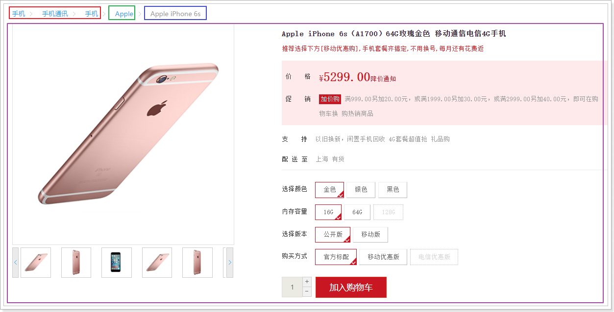

其中包含的如：商品三级分类、商品品牌、商品名称，这些数据主要是在`tb_spu`表中

而像：标题、价格、库存、特有规格参数、图片等数据，来自于`tb_sku`表

再往下看：


这里的商品介绍、规格保证、售后保障、通用的规格参数等数据，来自于`tb_spu_detail`表，当然，规格参数的名字是在`tb_spec_param`表中查询的，规格组信息是在`tb_spec_group`表。


### 2.2.2.数据的格式

我们需要的数据在很多表中，不过我们希望将来不同的数据库更新，只更新对应的缓存数据。因此我们不能将这些数据一次从商品服务查询并放入缓存，而是分开来做。

1）与SPU有关的信息：

- id：spu的id
- name：商品名称
- cid1\cid2\cid3：分类的三级id
- brandId：品牌id

2）分类

- categories：商品有关的三级分类对象的集合，对象只包含id和name

3）品牌

- brand：商品相关的品牌对象，id和name

4）spu下的所有sku集合

5）spu的SpuDetail信息

6）规格组及组内的参数集合

- 因为页面渲染知道**参数名称、id**，还有**规格组名称**：

  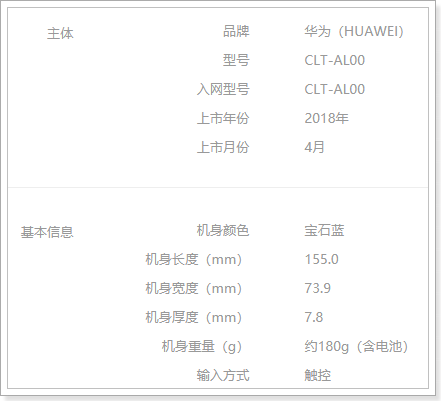 


## 2.3.查询商品信息，存入Redis

接下来，我们在静态页数据服务中，提供对Nginx访问的接口。当Nginx访问时，我们查询商品信息，存入Redis，然后把结果返回给Nginx。

### 2.3.1.业务分析

service业务中，我们需要做的事情包括：

- 根据spuId查询spu
- 根据spuId查询detail
- 根据spuId查询Sku
- 根据categoryId集合查询Category对象集合
- 根据brandId查询Brand
- 根据categoryId查询规格组及组内参数
- 把上述数据`分别`存入Redis

为了保证将来可以做到数据的局部修改，我们处理数据要分开到不同的业务方法中，分别查询、分别存储。


### 2.3.2.DTO

缓存到redis的数据要尽可能简化，因此我们不能直接把从商品微服务查询的数据写入Redis，而是要简单处理下。

我们从商品微服务查询的规格参数信息数据较臃肿，这里要处理一下，封装到两个新的DTO中。

规格参数的：

```java
package com.leyou.page.dto;

import lombok.Data;


@Data
public class SpecParamNameDTO {
    private Long id;
    private String name;
    private Boolean numeric;
    private Boolean generic;
    private String unit;
}
```

规格组的：

```java
package com.leyou.page.dto;

import lombok.Data;

import java.util.List;


@Data
public class SpecGroupNameDTO {
    private String name;
    private List<SpecParamNameDTO> params;
}
```


### 2.3.3.定义Service

在`ly-page`的`com.leyou.page.service`包下的`GoodsPageService`中，添加代码：

```java
package com.leyou.page.service;

import java.util.List;


public interface GoodsPageService {
    /**
     * 加载spu到redis中并返回
     * @param spuId 商品id
     */
    String loadSpuData(Long spuId);

    /**
     * 加载spuDetail到redis中并返回
     * @param spuId 商品id
     */
    String loadSpuDetailData(Long spuId);

    /**
     * 加载sku信息到redis中并返回
     * @param spuId 商品id
     */
    String loadSkuListData(Long spuId);

    /**
     * 加载分类信息到redis中并返回
     * @param ids 商品分类的三级分类id
     */
    String loadCategoriesData(List<Long> ids);

    /**
     * 加载品牌信息到redis中并返回
     * @param brandId 品牌id
     */
    String loadBrandData(Long brandId);

    /**
     * 加载规格参数信息到redis中并返回
     * @param categoryId 商品第三级分类id
     */
    String loadSpecData(Long categoryId);
}
```

在`ly-page`的`com.leyou.page.service`包下的`GoodsPageServiceImpl`中，添加代码：

```java
package com.leyou.page.service.impl;

import com.leyou.common.utils.BeanHelper;
import com.leyou.common.utils.JsonUtils;
import com.leyou.item.client.ItemClient;
import com.leyou.item.dto.*;
import com.leyou.page.service.GoodsPageService;
import com.leyou.page.service.dto.SpecGroupNameDTO;
import com.leyou.page.service.dto.SpecParamNameDTO;
import org.springframework.data.redis.core.StringRedisTemplate;
import org.springframework.stereotype.Service;

import java.util.ArrayList;
import java.util.HashMap;
import java.util.List;
import java.util.Map;
import java.util.stream.Collectors;


@Service
public class GoodsPageServiceImpl implements GoodsPageService {

    private final ItemClient itemClient;
    private final StringRedisTemplate redisTemplate;

    private static final String KEY_PREFIX_SPU = "page:spu:id:";
    private static final String KEY_PREFIX_SKU = "page:sku:id:";
    private static final String KEY_PREFIX_DETAIL = "page:detail:id:";
    private static final String KEY_PREFIX_CATEGORY = "page:category:id:";
    private static final String KEY_PREFIX_BRAND = "page:brand:id:";
    private static final String KEY_PREFIX_SPEC = "page:spec:id:";

    public GoodsPageServiceImpl(ItemClient itemClient, StringRedisTemplate redisTemplate) {
        this.itemClient = itemClient;
        this.redisTemplate = redisTemplate;
    }

    @Override
    public String loadSpuData(Long spuId) {
        // 查询信息
        SpuDTO spu = itemClient.querySpuById(spuId);
        // 组织数据
        Map<String, Object> map = new HashMap<>();
        map.put("id", spu.getId());
        map.put("name", spu.getName());
        map.put("categoryIds", spu.getCategoryIds());
        map.put("brandId", spu.getBrandId());
        String json = JsonUtils.toJson(map);
        // 存入redis, 如果数据量逐渐增多，可以用SSDB代替
        redisTemplate.opsForValue().set(KEY_PREFIX_SPU + spuId, json);
        return json;
    }

    @Override
    public String loadSpuDetailData(Long spuId) {
        // 查询信息
        SpuDetailDTO detail = itemClient.querySpuDetailById(spuId);
        String json = JsonUtils.toJson(detail);
        // 存入redis
        redisTemplate.opsForValue().set(KEY_PREFIX_DETAIL + spuId, json);
        return json;
    }

    @Override
    public String loadSkuListData(Long spuId) {
        // 查询信息
        List<SkuDTO> skuList = itemClient.querySkuBySpuId(spuId);
        String json = JsonUtils.toJson(skuList);
        // 存入redis
        redisTemplate.opsForValue().set(KEY_PREFIX_SKU + spuId, json);
        return json;
    }

    @Override
    public String loadCategoriesData(List<Long> ids) {
        // 查询信息
        List<CategoryDTO> list = itemClient.queryCategoryByIds(ids);
        List<Map<String, Object>> categoryList = list.stream().map(categoryDTO -> {
            Map<String, Object> map = new HashMap<>();
            map.put("id", categoryDTO.getId());
            map.put("name", categoryDTO.getName());
            return map;
        }).collect(Collectors.toList());
        String json = JsonUtils.toJson(categoryList);
        // 存入Redis
        redisTemplate.opsForValue().set(KEY_PREFIX_CATEGORY + ids.get(2), json);
        return json;
    }

    @Override
    public String loadBrandData(Long brandId) {
        // 查询信息
        BrandDTO brand = itemClient.queryBrandById(brandId);
        Map<String, Object> map = new HashMap<>();
        map.put("id", brand.getId());
        map.put("name", brand.getName());
        String json = JsonUtils.toJson(map);
        // 存入Redis
        redisTemplate.opsForValue().set(KEY_PREFIX_BRAND + brandId, json);
        return json;
    }

    @Override
    public String loadSpecData(Long categoryId) {
        // 查询信息
        List<SpecGroupDTO> list = itemClient.querySpecList(categoryId);

        List<SpecGroupNameDTO> groupList = new ArrayList<>();
        for (SpecGroupDTO groupDTO : list) {
            SpecGroupNameDTO nameDTO = new SpecGroupNameDTO();
            nameDTO.setName(groupDTO.getName());
            nameDTO.setParams(BeanHelper.copyWithCollection(groupDTO.getParams(), SpecParamNameDTO.class));
            groupList.add(nameDTO);
        }

        String json = JsonUtils.toJson(groupList);
        // 存入Redis
        redisTemplate.opsForValue().set(KEY_PREFIX_SPEC + categoryId, json);
        return json;
    }
}
```


### 2.3.4.定义controller

在`ly-page`的`com.leyou.page.web`中，添加一个`PageController`：

```java
package com.leyou.page.web;

import com.leyou.page.service.GoodsPageService;
import org.springframework.http.ResponseEntity;
import org.springframework.web.bind.annotation.*;

import java.util.List;


@RestController
@RequestMapping("page")
public class PageController {

    private final GoodsPageService goodsPageService;

    public PageController(GoodsPageService goodsPageService) {
        this.goodsPageService = goodsPageService;
    }

    /**
     * 查询商品spu数据
     * @param spuId 商品id
     * @return spu数据
     */
    @GetMapping("/spu/{id}")
    public ResponseEntity<String> querySpuPageData(@PathVariable("id") Long spuId){
        return ResponseEntity.ok(goodsPageService.loadSpuData(spuId));
    }

    /**
     * 查询商品sku数据
     * @param spuId 商品id
     * @return sku数据
     */
    @GetMapping("/sku/{id}")
    public ResponseEntity<String> querySkuPageData(@PathVariable("id") Long spuId){
        return ResponseEntity.ok(goodsPageService.loadSkuListData(spuId));
    }

    /**
     * 查询商品spuDetail数据
     * @param spuId 商品id
     * @return spu数据
     */
    @GetMapping("/detail/{id}")
    public ResponseEntity<String> queryDetailPageData(@PathVariable("id") Long spuId){
        return ResponseEntity.ok(goodsPageService.loadSpuDetailData(spuId));
    }

    /**
     * 查询商品分类数据
     * @param ids 商品分类id
     * @return 分类数据
     */
    @GetMapping("/categories")
    public ResponseEntity<String> queryCategoryPageData(@RequestParam("ids") List<Long> ids){
        return ResponseEntity.ok(goodsPageService.loadCategoriesData(ids));
    }

    /**
     * 查询品牌数据
     * @param id 品牌id
     * @return spu数据
     */
    @GetMapping("/brand/{id}")
    public ResponseEntity<String> queryBrandPageData(@PathVariable("id") Long id){
        return ResponseEntity.ok(goodsPageService.loadBrandData(id));
    }

    /**
     * 查询规格数据
     * @param categoryId 分类id
     * @return 规格参数
     */
    @GetMapping("/spec/{id}")
    public ResponseEntity<String> queryGoodsPageData(@PathVariable("id") Long categoryId){
        return ResponseEntity.ok(goodsPageService.loadSpecData(categoryId));
    }
}
```


# 3.OpenResty渲染静态页

之前分析中，我们计划使用Nginx来完成静态页面模板的渲染，不过我们之前学习过Nginx的web服务器功能、反向代理功能、负载均衡功能。

但是如何利用Nginx查询Redis缓存？如何利用Nginx完成页面模板渲染？

nginx中有一个模块叫做ngx_lua，可以将Lua嵌入到Nginx中，从而可以使用Lua来编写脚本，这样就可以使用Lua编写应用逻辑，操作Redis、MySQL等等；这样就可以使用Lua语言开发高性能Web应用了。

那么OpenResty是什么呢？

## 3.1.介绍OpenResty

OpenResty官网地址：http://openresty.org/cn/

OpenResty® 是一个基于 [Nginx](http://openresty.org/cn/nginx.html) 与 Lua 的高性能 Web 平台，其内部集成了大量精良的 Lua 库、第三方模块以及大多数的依赖项。用于方便地搭建能够处理超高并发、扩展性极高的动态 Web 应用、Web 服务和动态网关。

OpenResty® 通过汇聚各种设计精良的 [Nginx](http://openresty.org/cn/nginx.html) 模块（主要由 OpenResty 团队自主开发），从而将 [Nginx](http://openresty.org/cn/nginx.html) 有效地变成一个强大的通用 Web 应用平台。这样，Web 开发人员和系统工程师可以使用 Lua 脚本语言调动 [Nginx](http://openresty.org/cn/nginx.html) 支持的各种 C 以及 Lua 模块，快速构造出足以胜任 10K 乃至 1000K 以上单机并发连接的高性能 Web 应用系统。

OpenResty® 的目标是让你的Web服务直接跑在 [Nginx](http://openresty.org/cn/nginx.html) 服务内部，充分利用 [Nginx](http://openresty.org/cn/nginx.html) 的非阻塞 I/O 模型，不仅仅对 HTTP 客户端请求,甚至于对远程后端诸如 MySQL、PostgreSQL、Memcached 以及 Redis 等都进行一致的高性能响应。


## 3.2.安装OpenResty

首先你的Linux虚拟机必须联网，这里建议大家统一使用CentOS7版本。

1）安装开发库:

首先要安装OpenResty的依赖开发库，执行命令：

```sh
yum install -y pcre-devel openssl-devel gcc curl
```

2）安装OpenResty仓库

你可以在你的 CentOS 系统中添加 `openresty` 仓库，这样就可以便于未来安装或更新我们的软件包（通过 `yum check-update` 命令）。运行下面的命令就可以添加我们的仓库：

```bash
yum install -y yum-utils
```

然后执行：

```
yum-config-manager --add-repo https://openresty.org/package/centos/openresty.repo
```


3）安装OpenResty

然后就可以像下面这样安装软件包，比如 `openresty`：

```bash
yum install -y openresty
```

4）安装opm工具

opm是OpenResty的一个管理工具，可以帮助我们安装一个第三方的Lua模块。

如果你想安装命令行工具 `opm`，那么可以像下面这样安装 `openresty-opm` 包：

```bash
yum install -y openresty-opm
```

5）目录结构

默认情况下，OpenResty安装的目录是：/usr/local/openresty

 

看到里面的nginx目录了吗，OpenResty就是在Nginx基础上集成了一些Lua模块。


**4）配置nginx的环境变量**

打开配置文件：

```sh
vi /etc/profile
```

在最下面加入两行：

```sh
export NGINX_HOME=/usr/local/openresty/nginx
export PATH=${NGINX_HOME}/sbin:$PATH
```

NGINX_HOME：后面是OpenResty安装目录下的nginx的目录

然后让配置生效：

```
source /etc/profile
```


## 3.3.Lua语言

OpenResty的开发和使用离不开Lua脚本，那么Lua又是什么呢？

### 3.3.1.Lua介绍

Lua 是一种轻量小巧的脚本语言，用标准C语言编写并以源代码形式开放， 其设计目的是为了嵌入应用程序中，从而为应用程序提供灵活的扩展和定制功能。

Lua 是巴西里约热内卢天主教大学（Pontifical Catholic University of Rio de Janeiro）里的一个研究小组于 1993 年开发的，该小组成员有：Roberto Ierusalimschy、Waldemar Celes 和 Luiz Henrique de Figueiredo。

### 3.3.2.语法入门

Lua的详细语法大家可以参考网站上的一些教学，例如：[Lua菜鸟教程](https://www.runoob.com/lua/lua-tutorial.html)，任何语言都是从基本的如：变量、数据类型、循环、逻辑判断、运算、数组等入手。相信熟悉java的你应该可以快速上手Lua。

因此我们从这几块入手，看一些简单命令即可：

1）变量声明

声明一个局部变量，用local关键字即可：

```lua
-- 定义数字
local a = 123
-- 定义字符串
local b = "hello world"
-- 定义数组
local c = {"hello", "world", "lua"}
-- 定义table
local d = {
    name = "jack",
    age = 21
}
```

2）打印结果

```lua
print('hello world')
```

3）条件控制

```lua
if( 布尔表达式 1)
then
   --[ 在布尔表达式 1 为 true 时执行该语句块 --]

elseif( 布尔表达式 2)
then
   --[ 在布尔表达式 2 为 true 时执行该语句块 --]
else 
   --[ 如果以上布尔表达式都不为 true 则执行该语句块 --]
end
```

4）循环语句：

遍历数字

```lua
for i=0, 10, 1 do
    print(i)
end
```

遍历数组：

```lua
--打印数组a的所有值  
local a = {"one", "two", "three"}
for i, v in ipairs(a) do
    print(i, v)
end 
-- 遍历时，i是角标，v是元素。Lua中数组角标从1开始
```

遍历table：

```lua
-- 定义table
local b = {
    name = "jack",
    age = 21
}
for k, v in pairs(b) do
    print(k, v)
end 
-- 遍历时，k是key，v是值。
```


## 3.4.OpenResty快速入门

为了不影响OpenResty安装目录的结构，我们在新的目录中来启动和配置。

### 3.4.1.基本配置

我们创建一个新的目录：/usr/resty

```sh
cd /usr
mkdir resty
```

然后在这个目录下创建几个新目录：

```sh
cd resty
mkdir conf logs lua
```


然后新建一个配置文件：

```sh
cd /usr/resty
vi conf/nginx.conf
```

添加下面的内容：

```nginx
worker_processes  1;
error_log logs/error.log;
events {
    worker_connections 1024;
}  
http {
    lua_package_path "/usr/local/openresty/lualib/?.lua;;";  #lua 模块  
    lua_package_cpath "/usr/local/openresty/lualib/?.so;;";  #c模块 
	lua_shared_dict item_local_cache 50m; #共享全局变量，在所有worker间共享
	
    default_type  text/html; # 默认响应类型是html
    include lua.conf;    # 引入一个lua.conf文件
}
```

我们通过include导入另一个配置，不在nginx.conf中写入太多内容。


### 3.4.2.监听端口

现在，`lua.conf`已经被引入，我们的所有配置都写到这个里面。

新建一个文件：

```sh
cd /usr/resty
vi conf/lua.conf
```

添加下面的内容：

```nginx
server {
    listen 80;
    location / {
        # 响应数据由 lua/test.lua这个文件来指定
        content_by_lua_file lua/test.lua;
    }
}
```


### 3.4.3第一个lua脚本

现在，响应数据已经交给 `lua/test.lua`来处理了，我们编写`lua/test.lua`文件，返回你想返回的任何内容即可。

新建一个文件：

```sh
cd /usr/resty
vi lua/test.lua
```

写入下面内容：

```lua
ngx.say("<h1>hello, world</h1>")
```

`ngx.say()`可以理解成`HttpServletResponse`中的`response.getWriter().println()`


### 3.4.4.启动并访问

当前必须在`/usr/resty`目录中，然后执行命令

运行启动命令：

```sh
nginx -p `pwd` -c conf/nginx.conf
```

- ```-p `pwd` ```：-p 指定运行时路径前缀，pwd代表当前路径
- `-c conf/nginx.conf`：-c 指定运行时配置文件，这里指定了`conf/nginx.conf`


重新加载配置命令：

```sh
nginx -p `pwd` -c conf/nginx.conf -s reload
```

停止命令：

```sh
nginx -p `pwd` -c conf/nginx.conf -s stop
```


访问你的虚拟机地址，例如：http://192.168.206.99/，看到这个说明成功了：

 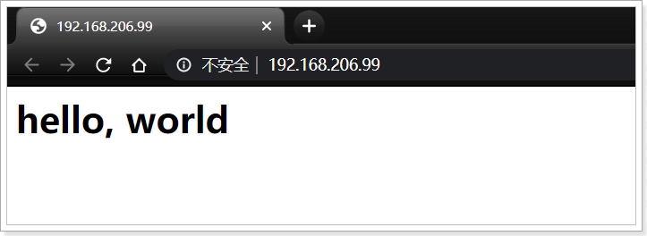

 

## 3.5.获取请求参数

Nginx接收到请求后，会帮我们解析并存储到内置变量中，只需要调用这些变量或方法就可以拿到。

- `ngx.var` ： nginx变量，如果要赋值如ngx.var.b = 2，此变量必须提前声明；另外对于nginx location中使用正则捕获的捕获组可以使用ngx.var[捕获组数字]获取；

- `ngx.req.get_headers()`：获取请求头，获取带中划线的请求头时请使用如headers.user_agent这种方式；如果一个请求头有多个值，则返回的是table；

- `ngx.req.get_uri_args()`：获取url请求参数，其用法和`get_headers`类似；?name=jack

- `ngx.req.get_post_args()`：获取post请求内容体，其用法和`get_headers`类似，但是必须提前调用`ngx.req.read_body()`来读取body体（也可以选择在nginx配置文件使用`lua_need_request_body` on;开启读取body体，但是官方不推荐）；

- `ngx.req.get_body_data()`：为解析的请求body体内容字符串。


### 3.5.1.编写映射规则

现在，我们在lua.conf中编写一条规则，来监听请求：

```nginx
# 采用正则表达式映射路径，有两个(\d+)，分别是第1组、第2组正则
location ~ /lua_request/(\d+)/(\d+) {  
    # $1代表获取第1组正则捕获的内容，set $a $1代表把$1的值赋值给$a这个变量
    set $a $1;
    # $2代表获取第2组正则捕获的内容，set $b $2代表把$2的值赋值给$b这个变量
    set $b $2; 
    #nginx内容处理  
    content_by_lua_file lua/test_request.lua;  
}
```


### 3.5.2.编写脚本

然后在新建test_request.lua文件：

```sh
cd /usr/resty
vi lua/test_request.lua
```

添加内容：

```lua
-- 定义一个函数，打印table数据,,-- 获取路径占位符中通过正则得到的参数,,-- 获取请求url参数
function sayTables(val)
	for k,v in pairs(val) do
		if type(v) == "table" then
			ngx.say(k, " : ", table.concat(v, ", "), "<br/>")
		else
			ngx.say(k, " : ", v, "<br/>")
		end
	end
end
ngx.say('<header>')
ngx.say('<meta charset="utf-8">')
ngx.say('</header>')

ngx.say("<h1> -----请求路径占位符参数------- </h1>");
ngx.say("<h4>")
ngx.say("ngx.var.a : ", ngx.var.a, "<br/>")
ngx.say("ngx.var.b : ", ngx.var.b, "<br/>")
ngx.say("ngx.var[1] : ", ngx.var[1], "<br/>")
ngx.say("ngx.var[2] : ", ngx.var[2], "<br/>")
ngx.say("</h4>")


ngx.say("<h1> -----请求url参数------- </h1>");
ngx.say("<h4>")
local params = ngx.req.get_uri_args()
sayTables(params)
ngx.say("</h4>")

return ngx.exit(200) 
```


### 3.5.3.重启测试

重启：

```sh
nginx -p `pwd` -c conf/nginx.conf -s reload
```

通过浏览器访问：

http://192.168.206.99/lua_request/110/120?name=jack&age=22

结果：

 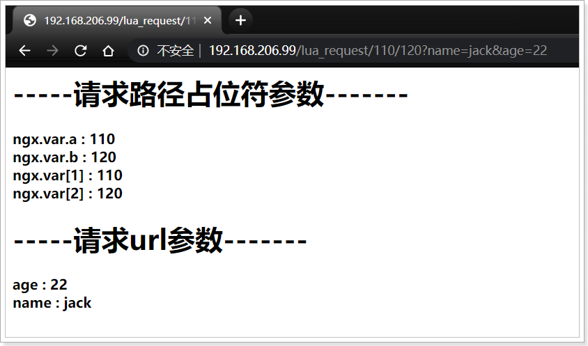

 


## 3.6.OpenResty模板渲染模块

动态web网页开发是Web开发中一个常见的场景，我们的商品详情页就需要nginx来完成页面的动态渲染，这要用到模板渲染模块。

我们会使用[lua-resty-template](https://github.com/bungle/lua-resty-template)来完成。

### 3.6.1.安装模板渲染模块

模板渲染组件并不是OpenResty自带的，需要我们自己来安装。

确保自己已经安装过OPM命令（参考安装OpenResty部分）。

输入命令：

```sh
opm get bungle/lua-resty-template
```


### 3.6.2.定义模板位置

模板渲染与服务端的JSP类似，需要知道的信息包括：

- 模板文件的位置
- 模板中的数据（上下文Context）

我们先在`lua.conf`文件的server部分，定义全局的模板文件位置信息：

```nginx
	set $template_root "/usr/resty/templates"; 
```

如图：

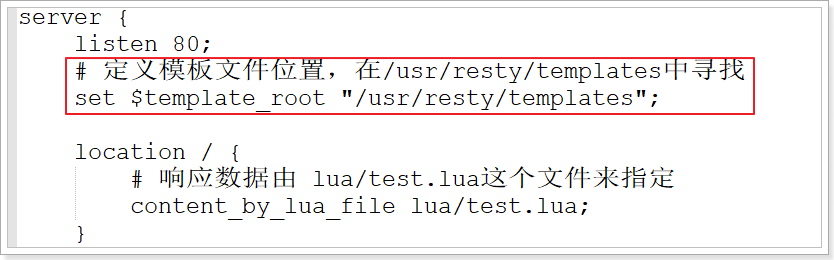

然后需要在`/usr/resty`目录下创建`templates`目录：

```sh
cd /usr/resty
mkdir templates
```


### 3.6.3.模板渲染

在`/usr/resty/conf/lua.conf`中定义一个location映射：

```nginx
location ~ /lua_template/(.*) {
    # 关闭lua代码缓存
    lua_code_cache off;
    # 指定请求交给lua/test_template.lua脚本来处理
    content_by_lua_file lua/test_template.lua;
}
```

新建`test_template.lua`文件，编写脚本：

```sh
cd /usr/resty
vi lua/test_template.lua
```

内容如下：

```lua
-- 导入template模块,类似java导包
local template = require("resty.template")  
--渲染模板需要的上下文(数据)  
local context = {
    title = "template test", 
    msg = "<h1>hello,"..ngx.var[1].."</h1>"
}
--渲染模板 ，指定模板文件名称，指定所需要的数据，table格式
template.render("t1.html", context)  
```

在`/usr/resty/templates`下新建模板文件：`t1.html`：

```sh
vi /usr/resty/templates/t1.html
```

内容如下：

```html
<!DOCTYPE html>
<html lang="en">
<head>
    <meta charset="UTF-8">
    <title>{{title}}</title>
</head>
<body>
    <p>{{msg}}</p>
    <p>{*msg*}</p>
</body>
</html>
```


### 3.6.4.测试

重启：

```sh
nginx -p `pwd` -c conf/nginx.conf -s reload
```

通过浏览器访问：

```
http://192.168.206.99/lua_template/社会我拓哥
```

结果：

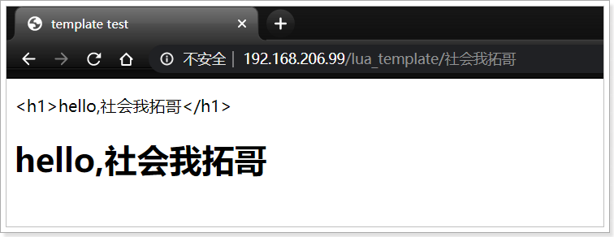  


## 3.7.OpenResty的Redis模块

渲染页面时，需要的数据要从redis中获取，而OpenResty中整合了操作Redis的模块，可以直接使用。

前置条件：你的Linux上已经安装了Redis

如果你的redis装在windows，关闭windows防火墙，知道window的ip地址


### 3.7.1.定义映射规则

现在，我们在`lua.conf`中编写一条规则，来监听请求：

```nginx
location ~ /lua_redis/(.*) {
    # 关闭lua代码缓存
	lua_code_cache off;
    # 指定请求交给lua/test_template.lua脚本来处理
    content_by_lua_file lua/test_redis.lua;
}
```


### 3.7.2.使用Redis模块功能

然后在`lua`目录下创建文件：`test_redis.lua`

```sh
vi /usr/resty/lua/test_redis.lua
```

内容如下：

```lua
-- 导入redis模块
local redis = require("resty.redis")
-- 定义释放redis连接的方法
local function close_redis(red)  
    if not red then  
        return  
    end  
    local ok, err = red:close()  
    if not ok then  
        ngx.say("close redis error : ", err)  
    end  
end   

--创建实例  
local red = redis:new()  
--设置超时（毫秒）  
red:set_timeout(1000)  
--建立连接 ,这里要指定redis的安装的ip和端口
local ip = "127.0.0.1"  
local port = 6379  
local ok, err = red:connect(ip, port)  
if not ok then  
    ngx.say("connect to redis error : ", err)  
    return close_redis(red)  
end  

--调用API进行处理  
ok, err = red:set("msg", "hello,"..ngx.var[1])  
if not ok then  
    ngx.say("set msg error : ", err)  
    return close_redis(red)  
end  
  
--调用API获取数据  
local resp, err = red:get("msg")  
if not resp then  
    ngx.say("get msg error : ", err)  
    return close_redis(red)  
end  
--得到的数据为空处理  
if resp == ngx.null then  
    resp = 'default'  --比如默认值  
end  
ngx.say("msg : ", resp)  
  
close_redis(red)  
```


### 3.7.3.测试

重启：

```sh
nginx -p `pwd` -c conf/nginx.conf -s reload
```

通过浏览器访问：

```
http://192.168.206.99/lua_redis/jack
```

结果：

 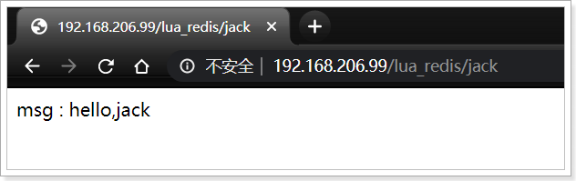

 


## 3.8.OpenResty  内部  请求代理

按照之前分析的实现原理，获取页面渲染数据时，我们先从redis拿，如果获取失败则请求tomcat，也就是之前我们准备的`ly-page`服务。

那么如何在OpenResty内部主动发送一个http请求呢？

### 3.8.1.两种实现方案

在OpenResty中有两种主动发送http请求的方案：

- 利用http模块：利用第三方提供的http模块工具，模拟一个http请求
- 利用内部请求代理：利用nginx自带的capture功能


这里我们使用nginx的capture功能，也就是内部请求代理


### 3.8.2.内部请求代理

nginx的capture功能语法如下：

```lua
local resp = ngx.location.capture("/path",{
    method = ngx.HTTP_GET,   #请求方式
    args = {a=1,b=2},  #get方式传参数
    body = "c=3&d=4" #post方式传参数
});
```

返回的响应内容包括：

- resp.status：响应状态码
- resp.header：响应头，是一个table
- resp.body：响应体，就是响应数据


不过，capture功能发起的请求只能指向nginx的内部，不能访问外部请求（例如百度）。该怎么解决？


我们可以将capture请求的地址指向一个内部的location，然后在这个location中做反向代理，指向目标地址（外部网站地址）。

### 3.8.3.示例

假设我们希望在nginx内部向百度发请求，然后把结果输出到页面，大概思路是这样的：

- 利用capture向某个路径发请求，指向内部的一个location，比如 `/baidu`
- 定义个location，接收 `/baidu`开头的请求
- 将请求反向代理到 https://www.baidu.com

1）定义location

我们先定义一个内部的location，用来处理内部请求，然后反向代理到百度。修改lua.conf文件，添加内容：

```nginx 
location ~ /baidu/(.*) {
    # 重写路径，去掉路径前面的 /baidu
    rewrite /baidu(/.*) $1 break;
    # 禁止响应体压缩
    proxy_set_header Accept-Encoding '';
    # 反向代理到百度
    proxy_pass https://www.baidu.com;
}
```

2）内部代理

然后我们再次修改lua.conf，添加一个location，作为测试接口：

```nginx
location ~ /lua_http/(.*) {
    # 关闭lua代码缓存
    lua_code_cache off;
    # 指定请求交给lua/test_http.lua脚本来处理
    content_by_lua_file lua/test_http.lua;
}
```

这里接收请求，并执行`lua/test_http.lua`这个文件。我们新建一个`lua/test_http.lua`文件，内容如下：

```lua

-- 向 /baidu 这个location发请求，并且携带请求参数
local resp = ngx.location.capture("/baidu/s?wd="..ngx.var[1], {  
	method = ngx.HTTP_GET
})

-- 查询失败的处理
if not resp then
	ngx.say("request error"); 
end 
-- 查询成功的处理，这里是打印响应体
ngx.say(resp.body)
```

3）测试

打开浏览器，访问：http://192.168.206.99/lua_http/hello，可以看到内容：

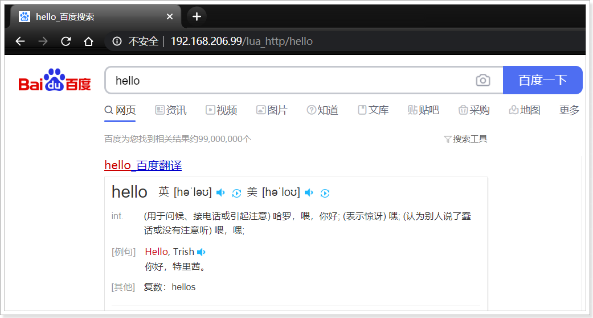


## 3.8.实现商品详情页渲染

接下来我们利用OpenResty实现商品详情页渲染，大概需要这样的步骤：

- 监听用户请求，进入定义好的lua脚本
- lua脚本中尝试读取redis数据
- 读取数据失败，尝试从`ly-page`微服务读取数据
  - 获取数据失败：返回404
  - 获取数据成功：开始渲染
- 把数据和模板交给template模块渲染，然后返回

我们要做的事情包括：

- 配置内部请求代理

- 定义通用工具模块：
  - 访问Redis的工具
  - 访问`ly-page`的http工具
- 定义商品详情页面模板
- 编写商品页面请求的路径映射
- 编写处理请求，查询数据，处理数据，渲染模板的lua脚本


### 3.8.1.内部请求代理配置

我们计划采用内部请求代理实现对微服务的访问，因此需要定义一个location，拦截内部请求，转发到`ly-page`微服务。这里我们约定，这个内部的location地址为：`/backend/*`


为了与之前的demo分离，我们修改`nginx.conf`，注释以前的`lua.conf`文件，并添加一个新的`leyou.conf`：

```sh
vi /usr/resty/conf/nginx.conf
```

内容如下：

```nginx
worker_processes  1;
error_log logs/error.log;
events {
    worker_connections 1024;
}
http { 
    lua_package_path "/usr/local/openresty/lualib/?.lua;;";  #lua 模块  
    lua_package_cpath "/usr/local/openresty/lualib/?.so;;";  #c模块 
	lua_shared_dict shared_data 20m; #共享全局变量，在所有worker间共享
	
    default_type  text/html; # 默认响应类型是html
    #include lua.conf;    # 引入一个lua.conf文件
    include leyou.conf;    # 引入一个leyou.conf文件
}
```

然后在`/usr/resty/conf/leyou.conf`中编写location监听：

```sh
vi /usr/resty/conf/leyou.conf
```

内容如下：

```nginx
upstream backend {  
    server 127.0.0.1:8084 max_fails=5 fail_timeout=10s weight=1;    
    keepalive 100;  
}  
  
server {  
    listen       80; 
	set $template_root "/usr/resty/templates"; 
  	# 我们要求内部请求以 /backend开头，与其他请求区分
    location ~ /backend/(.*) {  
        #internal;  
        keepalive_timeout   30s;  
        keepalive_requests  1000;  
        #支持keep-alive  
        proxy_http_version 1.1;  
        proxy_set_header Connection "";  
  
        rewrite /backend(/.*) $1 break;  
        proxy_pass_request_headers off;  
        #more_clear_input_headers Accept-Encoding;  
        proxy_next_upstream error timeout;  
        proxy_pass http://backend;
    }
}
```

注意，上面配置的backend集群中，ip地址必须是你**自己的宿主机地址,VM-NET8的虚拟主机地址，一般地址为:网段.1**，不要直接拷贝。

请求处理大概过程：

- 假如我们内部访问：/backend/page/spu/1

- 地址被监听到后，会处理成：http://backend/page/spu/1

- 而后进入 backend的upstream集群
  - 集群默认利用轮询策略对集群负载均衡，例如本例中的地址：192.168.206.99:8084
  - 发送请求到：http//192.168.206.99:8084/page/spu/1，就是宿主机

- 这样就被宿主机的`ly-page`微服务接收到了

重启nginx：

```sh
nginx -p `pwd` -c conf/nginx.conf -s reload
```

测试，在浏览器访问：http://192.168.206.99/backend/page/spu/5

 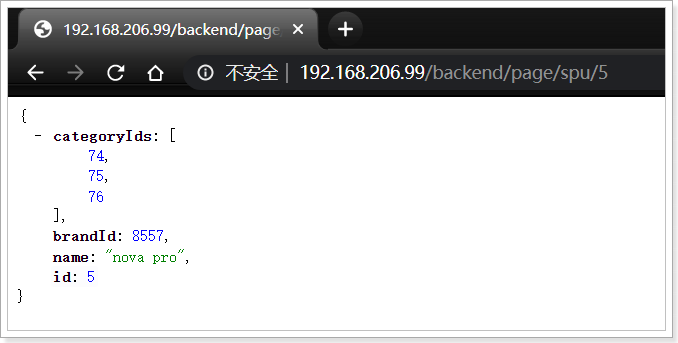 

### 3.8.2.编写通用工具模块

接下来，编写一个通用的工具模块，方便后期连接Redis，查询tomcat

脚本要定义到`/usr/local/openresty/lualib`目录，因为这里的lua会被扫描到模块库，供其它脚本共享使用。

新建脚本文件

```sh
vi /usr/local/openresty/lualib/common.lua
```

内容如下：

```lua
-- 导入redis模块
local redis = require("resty.redis")  
-- 日志
local ngx_log = ngx.log  
local ngx_ERR = ngx.ERR  
local function close_redis(red)  
    if not red then  
        return  
    end  
    --释放连接(连接池实现)  
    local pool_max_idle_time = 10000 --毫秒  
    local pool_size = 100 --连接池大小  
    local ok, err = red:set_keepalive(pool_max_idle_time, pool_size)  
  
    if not ok then  
        ngx_log(ngx_ERR, "set redis keepalive error : ", err)  
    end  
end  
-- 查询redis的方法 ip和port是redis地址，keys是查询的key，数组格式
local function read_redis(ip, port, keys)  
	-- 获取一个连接
    local red = redis:new()  
    red:set_timeout(1000)  
    local ok, err = red:connect(ip, port)  
    if not ok then  
        ngx_log(ngx_ERR, "connect to redis error : ", err)  
        return close_redis(red)  
    end  
    local resp = nil
	-- 判断key数量，如果多个key，就利用mget批量查询
    if #keys == 1 then  
        resp, err = red:get(keys[1])  
    else  
        resp, err = red:mget(keys)  
    end
	-- 查询失败处理
    if not resp then  
        ngx_log(ngx_ERR, "get redis content error : ", err)  
        return close_redis(red)  
    end  
  
    --得到的数据为空处理  
    if resp == ngx.null then  
        resp = nil  
    end  
    close_redis(red)  
    return resp
end  
-- 查询http请求的方法，path是请求路径，args是参数，table格式
local function read_http(path, args) 
	-- 默认查询地址走 /backend/page/,内部转发到8084端口
    local resp = ngx.location.capture("/backend/page"..path, {  
        method = ngx.HTTP_GET,  
        args = args  
    })  
	-- 查询失败的处理
    if not resp then  
        ngx_log(ngx_ERR, "request error")  
        return  
    end
	-- 返回状态码不是200就报错
    if resp.status ~= 200 then  
        ngx_log(ngx_ERR, "request error, status :", resp.status)  
        return  
    end
    return resp.body  
end  
-- 将方法导出
local _M = {  
    read_redis = read_redis,  
    read_http = read_http  
}  
return _M 
```

核心方法有两个：

- read_redis(ip, port, keys)：查询redis数据，参数：
  - ip：就是redis的ip地址
  - port：就是redis的端口
  - keys：查询用到的key，数组，可以同时查询多个
- read_http(path, args)：http请求查询，内部会转发到`ly-page`参数：
  - path：请求路径，方法内部会在path前拼接：/backend/page
  - args：请求参数，table类型

### 3.8.3.页面模板

我已经提前写好了一个页面模板，在课前资料中获取：item.html,**上传item.html到 /usr/resty/templates**

其中需要的参数包括：

- spu：商品spu，需要的是spu中的name，分类id、品牌id
- skuList：商品spu下的sku
- spuDetail：商品详情
- categories：商品分类
- brand：品牌
- specs：规格组包含规格参数


### 3.8.4.数据处理脚本

下面，我们编写数据处理的脚本。

新建脚本文件

```sh
vi /usr/resty/lua/item.lua
```

内容：

```lua
-- 导入模块
local common = require("common")
local read_redis = common.read_redis  
local read_http = common.read_http
local cjson = require("cjson")
local template = require("resty.template")  
-- 常用变量和方法
local ngx_log = ngx.log  
local ngx_ERR = ngx.ERR  
local ngx_exit = ngx.exit  
local ngx_print = ngx.print  
local ngx_re_match = ngx.re.match  

-- 获取商品id
local spuId = ngx.var.spuId
-- 获取spu
local spuKey = "page:spu:id:"..spuId 
local spuInfoStr = read_redis("127.0.0.1", 6379, {spuKey})  
if not spuInfoStr then  
   ngx_log(ngx_ERR, "redis not found spu info, back to http, spuId : ", spuId)  
   spuInfoStr = read_http("/spu/"..spuId, {})  
end  
if not spuInfoStr then  
   ngx_log(ngx_ERR, "http not found spuInfoStr info, spuId : ", spuId)  
   return ngx_exit(404)  
end

-- 获取sku
local skuKey = "page:sku:id:"..spuId 
local skuInfoStr = read_redis("127.0.0.1", 6379, {skuKey})  
if not skuInfoStr then  
   ngx_log(ngx_ERR, "redis not found sku info, back to http, spuId : ", spuId)  
   skuInfoStr = read_http("/sku/"..spuId, {})  
end  
if not skuInfoStr then  
   ngx_log(ngx_ERR, "http not found skuInfoStr info, spuId : ", spuId)  
   return ngx_exit(404)  
end
-- 获取spuDetail
local detailKey = "page:detail:id:"..spuId 
local detailInfoStr = read_redis("127.0.0.1", 6379, {detailKey})  
if not detailInfoStr then  
   ngx_log(ngx_ERR, "redis not found detail info, back to http, spuId : ", spuId)  
   detailInfoStr = read_http("/detail/"..spuId, {})  
end  
if not detailInfoStr then  
   ngx_log(ngx_ERR, "http not found detailInfoStr info, spuId : ", spuId)  
   return ngx_exit(404)  
end
-- 获取categories
local spuInfo = cjson.decode(spuInfoStr)  
local cid3 = spuInfo["categoryIds"][3]
local categoryKey = "page:category:id:"..cid3 
local categoryStr = read_redis("127.0.0.1", 6379, {categoryKey})  
if not categoryStr then  
   local idStr = table.concat(spuInfo["categoryIds"],",");
   ngx_log(ngx_ERR, "redis not found category info, back to http, categoryIds : ", idStr)  
   categoryStr = read_http("/categories/", {ids  = idStr})
end  
if not categoryStr then  
   ngx_log(ngx_ERR, "http not found categoryStr info, categoryId : ", cid3)  
   return ngx_exit(404)  
end
-- 获取品牌  
local brandId = spuInfo["brandId"]
local brandKey = "page:brand:id:"..brandId 
local brandStr = read_redis("127.0.0.1", 6379, {brandKey})  
if not brandStr then  
   ngx_log(ngx_ERR, "redis not found brand info, back to http, brandId : ", brandId)  
   brandStr = read_http("/brand/"..brandId, {})
end  
if not brandStr then  
   ngx_log(ngx_ERR, "http not found brandStr info, brandId : ", brandId)  
   return ngx_exit(404)  
end
-- 获取规格
local specKey = "page:spec:id:"..cid3 
local specStr = read_redis("127.0.0.1", 6379, {specKey})  
if not specStr then  
   ngx_log(ngx_ERR, "redis not found spec info, back to http, cid3 : ", cid3)  
   specStr = read_http("/spec/"..cid3, {})
end  
if not specStr then  
   ngx_log(ngx_ERR, "http not found specStr info, cid3 : ", cid3)  
   return ngx_exit(404)  
end
-- 组织数据
local context = {
	name = spuInfo["name"],
	skuList =  skuInfoStr,
	detail =  detailInfoStr,
	categories =  categoryStr,
	brand =  brandStr,
	specs =  specStr
}
--渲染模板  
template.render("item.html", context)
```


### 3.8.5.路径映射

最后，我们监听页面请求，把商品页面交给模板来处理.

在`/usr/resty/conf/leyou.conf`中添加映射：

```nginx
location ~ /item/(\d+).html$ {
    # 获取路径参数
    set $spuId $1;
    # 禁止除了www.leyou.com以外的请求访问
    if ($host !~ "^www\.leyou\.com$") {  
        return 403;  
    }
    # 关闭缓存/打开缓存
    lua_code_cache on; 
    default_type 'text/html';  
    charset utf-8;
    # 指定请求交给lua/item.lua脚本来处理
    content_by_lua_file lua/item.lua;
}
```


### 3.8.6.修改宿主机路径映射

现在，OpenResty已经准备就绪，不过我们在浏览器中输入：

http://www.leyou.com/item/141.html

这个商品地址时，目前依然走的是`ly-portal`。我们需要把请求地址修改到你的虚拟机地址，例如我的地址是：`192.168.206.99`

修改宿主机中的`leyou.conf`文件，修改原来的 www.leyou.com的域名解析部分：

```nginx
server {
	listen       80;
	server_name  www.leyou.com;
	location /item {
		# 携带hosts地址，避免因代理导致host丢失
		proxy_set_header Host       $host;
	    proxy_pass   http://192.168.206.99;
	}
	location / {
	    root C:\develop\idea-space\leyou3\leyou-portal;
	}
}
```


重启：

```sh
nginx -p `pwd` -c conf/nginx.conf -s reload
```

通过浏览器访问：

http://www.leyou.com/item/127.html

结果：

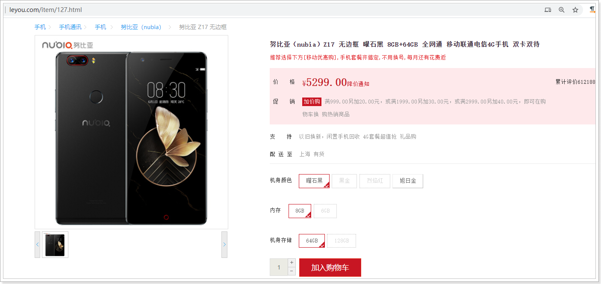


### 3.8.7.优化（理解即可）

虽然已经实现了页面静态化，不过依然有值得优化的地方：

- 在Nginx中设置本地缓存，把几乎不变的数据直接存储在nginx内部，例如：
  - 商品分类数据
  - 品牌数据
  - 规格参数数据
- 在nginx中对生成的页面做缓存或静态化，做CDN服务，页面不变的时候，减少渲染对CPU的消耗
- 随着商品数据的日益增多，Redis可能难以支持海量商品信息，此时可以用SSDB来代替，SSDB存储基于磁盘存储，查询性能与Redis差不多，因此可以作为海量数据的缓存库


参考：本地缓存的实现：

修改nginx.conf，配置本地缓存大小和名称：

```nginx
worker_processes  1;
error_log logs/error.log;
events {
    worker_connections 1024;
}  
http {
	
    lua_package_path "/usr/local/openresty/lualib/?.lua;;";  #lua 模块  
    lua_package_cpath "/usr/local/openresty/lualib/?.so;;";  #c模块 
    #本地缓存，名称叫做：item_local_cache，大小50m
	lua_shared_dict item_local_cache 50m; 
	
    default_type  text/html; # 默认响应类型是html
    #include lua.conf;    # 引入一个lua.conf文件
    include leyou.conf;    # 引入一个leyou.conf文件
}
```

修改common.lua，添加数据查询方法：

```lua
-- 导入redis模块
local redis = require("resty.redis") 
-- 配置商品的本地缓存 
local local_cache = ngx.shared.item_local_cache
-- 日志
local ngx_log = ngx.log  
local ngx_ERR = ngx.ERR
-- 读取本地缓存
local function cache_get(key)  
    if not local_cache then  
        return nil  
    end  
    return local_cache:get(key)  
end
-- 写入本地缓存
local function cache_set(key, value)  
    if not local_cache then  
        return nil  
    end  
    return local_cache:set(key, value, 10 * 60) --10分钟  
end

local function close_redis(red)  
    if not red then  
        return  
    end  
    --释放连接(连接池实现)  
    local pool_max_idle_time = 10000 --毫秒  
    local pool_size = 100 --连接池大小  
    local ok, err = red:set_keepalive(pool_max_idle_time, pool_size)  
  
    if not ok then  
        ngx_log(ngx_ERR, "set redis keepalive error : ", err)  
    end  
end  
-- 查询本地缓存，没有则查询redis, ip和port是redis地址，key是查询的key
local function read_cache(ip, port, key) 
	-- 尝试读本地缓存
	local resp = cache_get(key)
	-- ngx_log(ngx_ERR, "debug local cache data : ", resp) 
	if not resp then
		ngx_log(ngx_ERR, "read local cache fail , key", key)
		-- 获取一个redis连接
		local red = redis:new()  
		red:set_timeout(1000)  
		local ok, err = red:connect(ip, port)  
		if not ok then  
			ngx_log(ngx_ERR, "connect to redis error : ", err)  
			return close_redis(red)  
		end
		-- 利用get查询
		resp, err = red:get(key) 
	end
	-- 查询失败处理
    if not resp then  
        ngx_log(ngx_ERR, "get redis content error : ", err)  
        return close_redis(red)  
    end  
  
    --得到的数据为空处理  
    if resp == ngx.null then  
        resp = nil  
    end
	cache_set(key, resp)
    close_redis(red)  
    return resp  
end
-- 查询redis的方法 ip和port是redis地址，keys是查询的key，数组格式
local function read_redis(ip, port, key)  
	-- 获取一个连接
    local red = redis:new()  
    red:set_timeout(1000)  
    local ok, err = red:connect(ip, port)  
    if not ok then  
        ngx_log(ngx_ERR, "connect to redis error : ", err)  
        return close_redis(red)  
    end  
    local resp = nil
	-- 利用get查询 
    resp, err = red:get(key)  
	-- 查询失败处理
    if not resp then  
        ngx_log(ngx_ERR, "get redis content error : ", err)  
        return close_redis(red)  
    end  
  
    --得到的数据为空处理  
    if resp == ngx.null then  
        resp = nil  
    end  
    close_redis(red)  
    return resp  
end 
-- 查询http请求的方法，path是请求路径，args是参数，table格式
local function read_http(path, args) 
	-- 默认查询地址走 /backend/page/,内部转发到8083端口
    local resp = ngx.location.capture("/backend/page"..path, {  
        method = ngx.HTTP_GET,  
        args = args  
    })  
	-- 查询失败的处理
    if not resp then  
        ngx_log(ngx_ERR, "request error")  
        return  
    end
	-- 返回状态码不是200就报错
    if resp.status ~= 200 then  
        ngx_log(ngx_ERR, "request error, status :", resp.status)  
        return  
    end
    return resp.body  
end  
-- 将方法导出
local _M = {  
    read_redis = read_redis,  
    read_cache = read_cache,  
    read_http = read_http  
}  
return _M 
```


改造`item.lua`，将分类、品牌、规格查询走本地缓存

```lua
-- 导入模块
local common = require("common")
local read_redis = common.read_redis  
local read_http = common.read_http
local read_cache = common.read_cache
local cjson = require("cjson")
local template = require("resty.template")  
-- 常用变量和方法
local ngx_log = ngx.log  
local ngx_ERR = ngx.ERR  
local ngx_exit = ngx.exit  
local ngx_print = ngx.print  
local ngx_re_match = ngx.re.match  

-- 获取商品id
local spuId = ngx.var.spuId
-- 获取spu
local spuKey = "page:spu:id:"..spuId 
local spuInfoStr = read_redis("127.0.0.1", 6379, spuKey)  
if not spuInfoStr then  
   ngx_log(ngx_ERR, "redis not found spu info, back to http, spuId : ", spuId)  
   spuInfoStr = read_http("/spu/"..spuId, {})  
end  
if not spuInfoStr then  
   ngx_log(ngx_ERR, "http not found spuInfoStr info, spuId : ", spuId)  
   return ngx_exit(404)  
end

-- 获取sku
local skuKey = "page:sku:id:"..spuId 
local skuInfoStr = read_redis("127.0.0.1", 6379, skuKey)  
if not skuInfoStr then  
   ngx_log(ngx_ERR, "redis not found sku info, back to http, spuId : ", spuId)  
   skuInfoStr = read_http("/sku/"..spuId, {})  
end  
if not skuInfoStr then  
   ngx_log(ngx_ERR, "http not found skuInfoStr info, spuId : ", spuId)  
   return ngx_exit(404)  
end
-- 获取spuDetail
local detailKey = "page:detail:id:"..spuId 
local detailInfoStr = read_redis("127.0.0.1", 6379, detailKey)  
if not detailInfoStr then  
   ngx_log(ngx_ERR, "redis not found detail info, back to http, spuId : ", spuId)  
   detailInfoStr = read_http("/detail/"..spuId, {})  
end  
if not detailInfoStr then  
   ngx_log(ngx_ERR, "http not found detailInfoStr info, spuId : ", spuId)  
   return ngx_exit(404)  
end
-- 获取categories
local spuInfo = cjson.decode(spuInfoStr)  
local cid3 = spuInfo["categoryIds"][3]
local categoryKey = "page:category:id:"..cid3 
local categoryStr = read_cache("127.0.0.1", 6379, categoryKey)  
if not categoryStr then  
   local idStr = table.concat(spuInfo["categoryIds"],",");
   ngx_log(ngx_ERR, "redis not found category info, back to http, categoryIds : ", idStr)  
   categoryStr = read_http("/categories/", {ids  = idStr})
end  
if not categoryStr then  
   ngx_log(ngx_ERR, "http not found categoryStr info, categoryId : ", cid3)  
   return ngx_exit(404)  
end
-- 获取品牌  
local brandId = spuInfo["brandId"]
local brandKey = "page:brand:id:"..brandId 
local brandStr = read_cache("127.0.0.1", 6379, brandKey)  
if not brandStr then  
   ngx_log(ngx_ERR, "redis not found brand info, back to http, brandId : ", brandId)  
   brandStr = read_http("/brand/"..brandId, {})
end  
if not brandStr then  
   ngx_log(ngx_ERR, "http not found brandStr info, brandId : ", brandId)  
   return ngx_exit(404)  
end
-- 获取规格
local specKey = "page:spec:id:"..cid3 
local specStr = read_cache("127.0.0.1", 6379, specKey)  
if not specStr then  
   ngx_log(ngx_ERR, "redis not found spec info, back to http, cid3 : ", cid3)  
   specStr = read_http("/spec/"..cid3, {})
end  
if not specStr then  
   ngx_log(ngx_ERR, "http not found specStr info, cid3 : ", cid3)  
   return ngx_exit(404)  
end
-- 组织数据1
local context = {
	name = spuInfo["name"],
	skuList =  skuInfoStr,
	detail =  detailInfoStr,
	categories =  categoryStr,
	brand =  brandStr,
	specs =  specStr
}
--渲染模板  1
template.render("item.html", context)  
```


# 4.缓存数据同步

当商品、分类、品牌、规格等数据改变时，Redis中数据也必须同步改变，如何做到呢？

这里我们会采用Canal这个框架来实现

## 4.1.什么是Canal

**canal [kə'næl]**，译意为水道/管道/沟渠，canal是阿里巴巴旗下的一款开源项目，基于Java开发。基于数据库增量日志解析，提供增量数据订阅&消费。

基于日志增量订阅和消费的业务包括

- 数据库镜像
- 数据库实时备份
- 索引构建和实时维护(拆分异构索引、倒排索引等)
- 业务 cache 刷新
- 带业务逻辑的增量数据处理

当前的 canal 支持源端 MySQL 版本包括 5.1.x , 5.5.x , 5.6.x , 5.7.x , 8.0.x

在GitHub的地址：https://github.com/alibaba/canal


基本原理如下图：

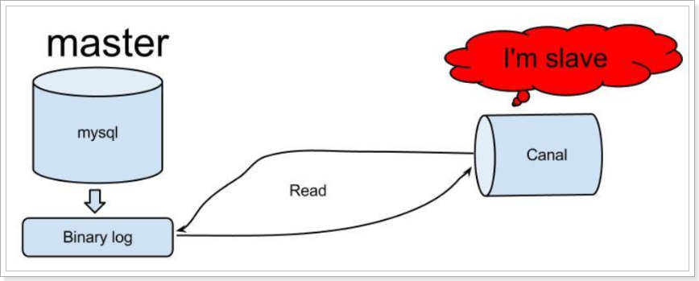


MySQL主备复制原理

- MySQL master 将**数据变更**写入二进制日志( binary log, 其中记录叫做二进制日志事件binary log events，可以通过 show binlog events 进行查看)
- MySQL slave 将 master 的 binary log events 拷贝到它的中继日志(relay log)
- MySQL slave 重放 relay log 中事件，将数据变更反映它自己的数据

canal 工作原理

- canal 模拟 MySQL slave 的交互协议，伪装自己为 MySQL slave ，向 MySQL master 发送dump 协议
- MySQL master 收到 dump 请求，开始推送 binary log 给 slave (即 canal )
- canal 解析 binary log 对象(原始为 byte 流)


## 4.2.设置主从同步

下面我们就开启mysql的主从同步机制，让Canal来模拟salve

这里以linux版本的mysql为例

### 4.2.1.设置binary log

根据上面介绍的原理，我们首先要开启mysql的binary log日志。

打开mysql容器挂载的日志文件，我的在`/home/leyou/mysql/conf`目录:

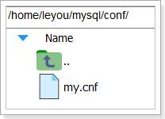 

修改文件：

```sh
vi /home/leyou/mysql/conf/my.cnf
```

最新内容为：

```ini
[mysqld]
skip-name-resolve
character_set_server=utf8
datadir=/var/lib/mysql
server-id=1000

log-bin=/var/lib/mysql/mysql-bin
binlog-do-db=heima
```

配置解读：

- `log-bin=/var/lib/mysql/mysql-bin`：设置binary log文件的存放地址
- `server-id=1000`：设置当前服务id
- `binlog-do-db=heima`：设置生成binary log的database名称，这里设置的是heima

效果截图：

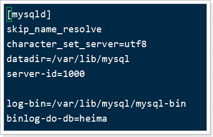 


### 4.2.2.设置账号权限

接下来添加一个仅用于数据同步的账户，出于安全考虑，这里仅提供对heima这个库的操作权限。

```shell
docker exec -it ly-mysql /bin/bash
```

链接mysql:

```shell
mysql -u root -p
```


```mysql
create user canal@'%' IDENTIFIED by 'canal';
GRANT SELECT, REPLICATION SLAVE, REPLICATION CLIENT,SUPER ON *.* TO 'canal'@'%' identified by 'canal';
FLUSH PRIVILEGES;
```

两次`exit`退出mysql，退出容器,到宿主机

```shell
exit
```


重启mysql容器即可

```
docker restart mysql
```


测试设置是否成功：在mysql控制台，或者Navicat中，输入命令：

```
show master status;
```

 


## 4.3.安装canal

拉取镜像：

```dockerfile
docker pull canal/canal-server
```

运行容器：

```sh
docker run -p 11111:11111 --name canal \
-e canal.destinations=test \
-e canal.instance.master.address=172.17.0.4:3306  \
-e canal.instance.dbUsername=canal  \
-e canal.instance.dbPassword=canal  \
-e canal.instance.connectionCharset=UTF-8 \
-e canal.instance.tsdb.enable=true \
-e canal.instance.gtidon=false  \
-e canal.instance.filter.regex=heima.tb_spu,heima.tb_sku,heima.tb_spu_detail,heima.tb_category,heima.tb_brand,heima.tb_spec_param \
--network host \
-d canal/canal-server
```

说明:

- `-p 11111:11111`：这是canal的默认监听端口
- `-e canal.instance.master.address=172.17.0.4:3306`：数据库地址和端口，如果不知道mysql容器地址，可以通过`docker inspect 容器id`来查看
- `-e canal.instance.dbUsername=canal`：数据库用户名
- `-e canal.instance.dbPassword=canal` ：数据库密码
- `-e canal.instance.filter.regex=`：要监听的表名称

表名称监听支持的语法：

```
mysql 数据解析关注的表，Perl正则表达式.
多个正则之间以逗号(,)分隔，转义符需要双斜杠(\\) 
常见例子：
1.  所有表：.*   or  .*\\..*
2.  canal schema下所有表： canal\\..*
3.  canal下的以canal打头的表：canal\\.canal.*
4.  canal schema下的一张表：canal.test1
5.  多个规则组合使用然后以逗号隔开：canal\\..*,mysql.test1,mysql.test2 
```


设置canal的自动启动：

```sh
docker update --restart=always canal
```


现在，canal就会去监听我们的数据库变化，并通知canal客户端。

## 4.4.编写canal客户端

我们在`ly-page`中配置canal客户端，当数据库变化时我们就能得到通知。

### 4.4.1引入依赖

在`ly-page`的`pom.xml`中添加依赖：

```xml
<dependency>
    <groupId>top.javatool</groupId>
    <artifactId>canal-spring-boot-starter</artifactId>
    <version>1.2.1-RELEASE</version>
</dependency>
```

编写`ly-page`的配置文件`application.yml`，指定canal服务端地址：

```yaml
logging:
  level:
    # top.javatool.canal: warn # 关闭心跳日志
    com.leyou: debug # 日志配置
canal:
  destination: test
  server: ly-canal:11111 # canal地址
```


### 4.4.2.添加Redis操作方法

等会监听到表的操作包括：增、删、改

- 增、改：我们写入数据到redis
- 删：我们把数据从redis删除

这里要监听的数据比较多，业务代码较多，我们以sku为例来给大家介绍。

给`ly-page`中的`GoodsPageService`中添加方法：

```java
/**
     * 把Sku从Redis删除
     */
Boolean deleteSku(Long spuId);
```


然后在`GoodsPageServiceImpl`中实现：

```java
@Override
public Boolean deleteSku(Long spuId){
    return redisTemplate.delete(KEY_PREFIX_SKU + spuId);
}
```


### 4.4.2.编写监听器

我们在ly-page的`com.leyou.page.canal`包下，新增一个类：

```java
package com.leyou.page.canal;

import com.leyou.page.service.GoodsPageService;
import lombok.extern.slf4j.Slf4j;
import org.springframework.beans.factory.annotation.Autowired;
import org.springframework.stereotype.Component;
import top.javatool.canal.client.annotation.CanalTable;
import top.javatool.canal.client.context.CanalContext;
import top.javatool.canal.client.handler.EntryHandler;

import java.util.Map;


@Slf4j
@CanalTable(value = "all")
@Component
public class CanalHandler implements EntryHandler<Map<String,String>> {

    @Autowired
    private GoodsPageService goodsPageService;

    @Override
    public void insert(Map<String,String> model) {
        // 获取表的名称
        String table = CanalContext.getModel().getTable();
        // 如果表是tb_sku
        if("tb_sku".equals(table)){
            log.info("sku新增了{}", model);
            goodsPageService.loadSkuListData(Long.valueOf(model.get("spu_id")));
        }
    }

    @Override
    public void update(Map<String,String> before, Map<String,String> after) {
        String table = CanalContext.getModel().getTable();
        if("tb_sku".equals(table)){
            log.info("sku修改了{}", after);
            goodsPageService.loadSkuListData(Long.valueOf(after.get("spu_id")));
        }
    }

    @Override
    public void delete(Map<String,String> model) {
        String table = CanalContext.getModel().getTable();
        if("tb_sku".equals(table)){
            log.info("sku删除了{}", model);
            goodsPageService.deleteSku(Long.valueOf(model.get("spu_id")));
        }
    }
}
```


