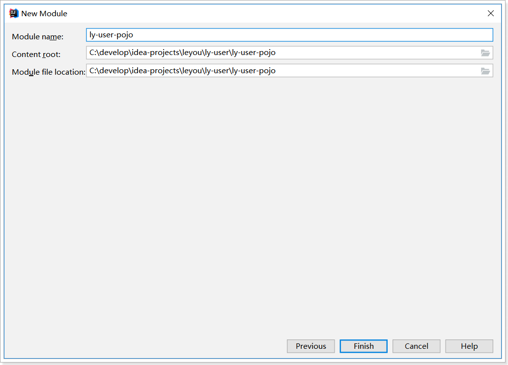
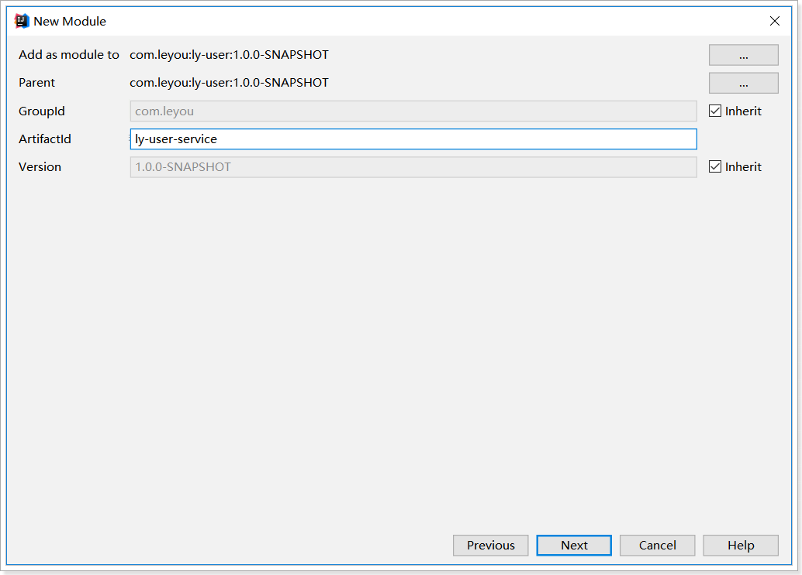
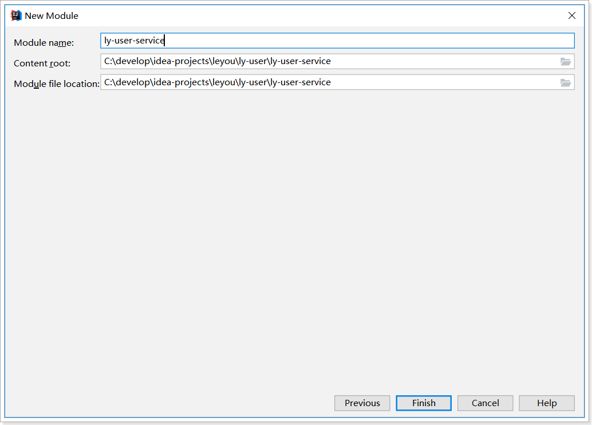
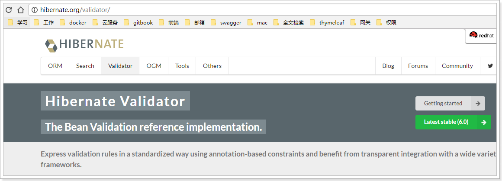
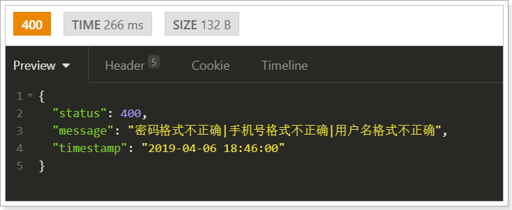

# day10_用户中心

# 0.学习目标

- 阿里SMS

- 实现数据校验功能
- 实现短信发送功能
- 实现注册功能
- 实现根据用户名和密码查询用户功能


# 1.阿里短信服务

之前我们已经学习过了阿里短信服务，但是大家真的掌握了企业中短信发送的正确方式吗？来看看我们在乐优商城中，如何实现短信发送功能。

## 1.1.demo

注册页面上有短信发送的按钮，当用户点击发送短信，我们需要生成验证码，发送给用户。我们将使用阿里提供的阿里大于来实现短信发送。

参考课前资料的《阿里短信.md》学习demo入门


## 1.2.创建短信微服务

在以前，我们都是把发送短信功能抽取一个工具类，任何地方需要，直接调用工具类发送短信即可。这样的方式存在以下缺点：

- 发送短信代码与业务代码耦合
- 短信发送功能会影响业务功能执行

如果在业务代码中，嵌入发送短信的代码，那就是功能的耦合，不方便后期的维护。而且

因为短信发送是调用第三方的云服务，API调用成功与否、执行时长都是不确定的。如果执行发短信时，因为网络问题导致阻塞，那么我们自己的业务也会阻塞。

为了解决上述问题，提高程序的响应速度，短信发送我们都将采用异步发送方式，即：

- 短信服务监听MQ消息
- 收到消息后发送短信，根据消息`routing_key`不同，发送不同类型的短信
- 其它服务要发送短信时，通过MQ通知短信微服务。

### 1.2.1.创建module


### 1.2.2.pom

```xml
<?xml version="1.0" encoding="UTF-8"?>
<project xmlns="http://maven.apache.org/POM/4.0.0"
         xmlns:xsi="http://www.w3.org/2001/XMLSchema-instance"
         xsi:schemaLocation="http://maven.apache.org/POM/4.0.0 http://maven.apache.org/xsd/maven-4.0.0.xsd">
    <parent>
        <artifactId>leyou</artifactId>
        <groupId>com.leyou</groupId>
        <version>1.0.0-SNAPSHOT</version>
    </parent>
    <modelVersion>4.0.0</modelVersion>

    <artifactId>ly-sms</artifactId>

    <dependencies>
        <dependency>
            <groupId>org.springframework.boot</groupId>
            <artifactId>spring-boot-starter-web</artifactId>
        </dependency>
        <dependency>
            <groupId>com.aliyun</groupId>
            <artifactId>aliyun-java-sdk-core</artifactId>
            <version>4.1.1</version>
        </dependency>
        <dependency>
            <groupId>org.springframework.boot</groupId>
            <artifactId>spring-boot-starter-amqp</artifactId>
        </dependency>
        <dependency>
            <groupId>com.leyou</groupId>
            <artifactId>ly-common</artifactId>
            <version>1.0.0-SNAPSHOT</version>
        </dependency>
    </dependencies>
    <build>
        <plugins>
            <plugin>
                <groupId>org.springframework.boot</groupId>
                <artifactId>spring-boot-maven-plugin</artifactId>
            </plugin>
        </plugins>
    </build>
</project>
```


### 1.2.3.编写启动类

我们在`ly-sms`的`com.leyou.sms`包下，新建一个启动类：

```java
package com.leyou.sms;

import org.springframework.boot.SpringApplication;
import org.springframework.boot.autoconfigure.SpringBootApplication;

@SpringBootApplication(scanBasePackages = {"com.leyou.sms", "com.leyou.common.advice"})
public class LySmsApplication {
    public static void main(String[] args) {
        SpringApplication.run(LySmsApplication.class, args);
    }
}
```


### 1.2.4.编写application.yml

```yaml
server:
  port: 8085
spring:
  application:
    name: sms-service
  rabbitmq:
    host: ly-mq
    username: leyou
    password: 123321
    virtual-host: /leyou
```

## 1.3.编写短信工具类

接下来，我们把刚刚学习的Demo中代码抽取成一个工具，方便后期使用

### 1.3.1.属性抽取

我们首先把一些常量抽取到application.yml中：

```yaml
ly:
  sms:
    accessKeyID: LTAIfmmL26haCK0b # 你自己的accessKeyId
    accessKeySecret: pX3RQns9ZwXs75M6Isae9sMgBLXDfY # 你自己的AccessKeySecret
    signName: 乐优商城 # 签名名称
    verifyCodeTemplate: SMS_143719983 # 模板名称
    domain: dysmsapi.aliyuncs.com # 域名
    action: SendSMS # API类型，发送短信
    version: 2017-05-25 # API版本，固定值
    regionID: cn-hangzhou # 区域id
```

然后在`com.leyou.sms.config`包下，定义一个类，读取yml文件的属性：

```java
package com.leyou.sms.config;

import lombok.Data;
import org.springframework.boot.context.properties.ConfigurationProperties;

@Data
@ConfigurationProperties(prefix = "ly.sms")
public class SmsProperties {
    /**
     * 账号
     */
    String accessKeyID;
    /**
     * 密钥
     */
    String accessKeySecret;
    /**
     * 短信签名
     */
    String signName;
    /**
     * 短信模板
     */
    String verifyCodeTemplate;
    /**
     * 发送短信请求的域名
     */
    String domain;
    /**
     * API版本
     */
    String version;
    /**
     * API类型
     */
    String action;
    /**
     * 区域
     */
    String regionID;
}
```


### 1.3.2.阿里客户端

然后通过java配置，将发请求需要的客户端注册到Spring容器。

在`com.leyou.sms.config`包定义一个配置类，标记为`@Configuration`，并通过`@Bean`注册阿里客户端到Spring：

```java
package com.leyou.sms.config;

import com.aliyuncs.DefaultAcsClient;
import com.aliyuncs.IAcsClient;
import com.aliyuncs.profile.DefaultProfile;
import org.springframework.boot.context.properties.EnableConfigurationProperties;
import org.springframework.context.annotation.Bean;
import org.springframework.context.annotation.Configuration;


@Configuration
@EnableConfigurationProperties(SmsProperties.class)
public class SmsConfiguration {

    @Bean
    public IAcsClient acsClient(SmsProperties prop){
        DefaultProfile profile = DefaultProfile.getProfile(
                prop.getRegionID(), prop.getAccessKeyID(), prop.getAccessKeySecret());
        return new DefaultAcsClient(profile);
    }
}
```


### 1.3.3.工具类

我们把阿里提供的demo进行简化和抽取，封装一个工具类。

在`com.leyou.sms.utils`包下，新建工具类:

```java
package com.leyou.sms.utils;

import com.aliyuncs.CommonRequest;
import com.aliyuncs.CommonResponse;
import com.aliyuncs.IAcsClient;
import com.aliyuncs.exceptions.ClientException;
import com.aliyuncs.exceptions.ServerException;
import com.aliyuncs.http.MethodType;
import com.aliyuncs.http.ProtocolType;
import com.leyou.common.utils.JsonUtils;
import com.leyou.sms.config.SmsProperties;
import lombok.extern.slf4j.Slf4j;
import org.apache.commons.lang3.StringUtils;
import org.springframework.stereotype.Component;

import java.util.Map;

import static com.leyou.sms.constants.SmsConstants.*;


@Slf4j
@Component
public class SmsUtils {

    private final IAcsClient client;

    private final SmsProperties prop;

    public SmsUtils(IAcsClient client, SmsProperties prop) {
        this.client = client;
        this.prop = prop;
    }

    /**
     * 发送短信验证码的方法
     *
     * @param phone 手机号
     * @param code  验证码
     */
    public void sendVerifyCode(String phone, String code) {
        // 参数
        String param = String.format(VERIFY_CODE_PARAM_TEMPLATE, code);
        // 发送短信
        sendMessage(phone, prop.getSignName(), prop.getVerifyCodeTemplate(), param);
    }

    /**
     * 通用的发送短信的方法
     *
     * @param phone    手机号
     * @param signName 签名
     * @param template 模板
     * @param param    模板参数，json风格
     */
    private void sendMessage(String phone, String signName, String template, String param) {
        CommonRequest request = new CommonRequest();
        request.setProtocol(ProtocolType.HTTPS);
        request.setMethod(MethodType.POST);
        request.setDomain(prop.getDomain());
        request.setVersion(prop.getVersion());
        request.setAction(prop.getAction());
        request.putQueryParameter(SMS_PARAM_KEY_PHONE, phone);
        request.putQueryParameter(SMS_PARAM_KEY_SIGN_NAME, signName);
        request.putQueryParameter(SMS_PARAM_KEY_TEMPLATE_CODE, template);
        request.putQueryParameter(SMS_PARAM_KEY_TEMPLATE_PARAM, param);

        try {
            CommonResponse response = client.getCommonResponse(request);
            if (response.getHttpStatus() >= 300) {
                log.error("【SMS服务】发送短信失败。响应信息：{}", response.getData());
            }
            // 获取响应体
            Map<String, String> resp = JsonUtils.toMap(response.getData(), String.class, String.class);
            // 判断是否是成功
            if (!StringUtils.equals(OK, resp.get(SMS_RESPONSE_KEY_CODE))) {
                // 不成功，
                log.error("【SMS服务】发送短信失败，原因{}", resp.get(SMS_RESPONSE_KEY_MESSAGE));
            }
            log.info("【SMS服务】发送短信成功，手机号：{}, 响应：{}", phone, response.getData());
        } catch (ServerException e) {
            log.error("【SMS服务】发送短信失败，服务端异常。", e);
        } catch (ClientException e) {
            log.error("【SMS服务】发送短信失败，客户端异常。", e);
        }
    }
}
```


这里把阿里SDK中会用到的一些参数KEY，响应KEY都定义成了常量，定义在`ly-sms`的`com.leyou.sms.constants`包下：

```java
package com.leyou.sms.constants;


public final class SmsConstants {
    /**
     * 请求参数
     */
    public static final String SMS_PARAM_KEY_PHONE = "PhoneNumbers";
    public static final String SMS_PARAM_KEY_SIGN_NAME = "SignName";
    public static final String SMS_PARAM_KEY_TEMPLATE_CODE = "TemplateCode";
    public static final String SMS_PARAM_KEY_TEMPLATE_PARAM= "TemplateParam";

    /**
     * 响应结果
     */
    public static final String SMS_RESPONSE_KEY_CODE = "Code";
    public static final String SMS_RESPONSE_KEY_MESSAGE = "Message";

    /**
     * 状态
     */
    public static final String OK = "OK";

    /**
     * 短信验证码的参数的模板
     */
    public static final String VERIFY_CODE_PARAM_TEMPLATE = "{\"code\":\"%s\"}";
}
```

如图：

 


## 1.4.编写消息监听器

接下来，在`com.leyou.sms.mq`包中编写消息监听器，当接收到消息后，我们发送短信。我们可以通过`routing_key`，监听不同类型消息，发送不同类型短信。

本例中，我们监听`VERIFY_CODE_KEY`，发送验证码短信。

```java
package com.leyou.sms.mq;

import com.leyou.common.utils.RegexUtils;
import com.leyou.sms.utils.SmsUtils;
import lombok.extern.slf4j.Slf4j;
import org.springframework.amqp.core.ExchangeTypes;
import org.springframework.amqp.rabbit.annotation.Exchange;
import org.springframework.amqp.rabbit.annotation.Queue;
import org.springframework.amqp.rabbit.annotation.QueueBinding;
import org.springframework.amqp.rabbit.annotation.RabbitListener;
import org.springframework.stereotype.Component;
import org.springframework.util.CollectionUtils;

import java.util.Map;

import static com.leyou.common.constants.MQConstants.*;


@Slf4j
@Component
public class MessageListener {

    private final SmsUtils smsUtils;

    public MessageListener(SmsUtils smsUtils) {
        this.smsUtils = smsUtils;
    }

    @RabbitListener(bindings = @QueueBinding(
            value = @Queue(name = QueueConstants.SMS_VERIFY_CODE_QUEUE, durable = "true"),
            exchange = @Exchange(name = ExchangeConstants.SMS_EXCHANGE_NAME, type = ExchangeTypes.TOPIC),
            key = RoutingKeyConstants.VERIFY_CODE_KEY
    ))
    public void listenVerifyCodeMessage(Map<String,String> msg){
        // 获取参数
        if(CollectionUtils.isEmpty(msg)){
            // 如果消息为空，不处理
            return;
        }
        // 手机号
        String phone = msg.get("phone");
        if (!RegexUtils.isPhone(phone)) {
            // 手机号有误，不处理
            return;
        }
        // 验证码
        String code = msg.get("code");
        if (!RegexUtils.isCodeValid(code)) {
            // 验证码有误，不处理
            return;
        }
        // 发送短信
        try {
            smsUtils.sendVerifyCode(phone, code);
        } catch (Exception e) {
            // 短信发送失败，我不想重试，异常捕获
            log.error("【SMS服务】短信验证码发送失败", e);
        }
    }
}
```


我们注意到，消息体是一个Map，里面有两个属性：

- phone：电话号码
- code：短信验证码


## 1.5.启动

启动项目，然后查看RabbitMQ控制台，发现交换机已经创建：

 


## 1.6.单元测试

编写一个测试类，尝试发送一条短信消息：

```java
@RunWith(SpringRunner.class)
@SpringBootTest
public class SmsTest {

    @Autowired
    private AmqpTemplate amqpTemplate;

    @Test
    public void testSendMessage() throws InterruptedException {
        Map<String,String> map = new HashMap<>();
        map.put("phone", "13000000000");
        map.put("code", "123321");
        amqpTemplate.convertAndSend("ly.sms.exchange", "sms.verify.code", map);

        Thread.sleep(5000);
    }
}
```


# 2.创建用户中心

用户搜索到自己心仪的商品，接下来就要去购买，但是购买必须先登录。所以接下来我们编写用户中心，实现用户的登录和注册功能。

用户中心的提供的服务：

- 用户的注册
- 用户个人信息管理
- 修改密码
- 修改手机
- 用户地址管理
- 用户收藏管理
- ...

这里我们暂时先实现基本的：`注册和登录`功能，其它功能大家可以自行补充完整。

因为用户中心的服务其它微服务也会调用，因此这里我们做聚合：

- ly-user：父工程，包含3个子工程：
  - ly-user-api：接口
  - ly-user-pojo:实体
  - ly-user-service：业务和服务

## 2.1.创建父module

创建


位置：

 

## 2.1.创建ly-user-pojo

项目坐标：

 

保存的位置：




pom：

```xml
<?xml version="1.0" encoding="UTF-8"?>
<project xmlns="http://maven.apache.org/POM/4.0.0"
         xmlns:xsi="http://www.w3.org/2001/XMLSchema-instance"
         xsi:schemaLocation="http://maven.apache.org/POM/4.0.0 http://maven.apache.org/xsd/maven-4.0.0.xsd">
    <parent>
        <artifactId>ly-user</artifactId>
        <groupId>com.leyou</groupId>
        <version>1.0.0-SNAPSHOT</version>
    </parent>
    <modelVersion>4.0.0</modelVersion>

    <artifactId>ly-user-pojo</artifactId>
    
    <dependencies>
        <dependency>
            <groupId>com.leyou</groupId>
            <artifactId>ly-common</artifactId>
            <version>1.0.0-SNAPSHOT</version>
        </dependency>
    </dependencies>
</project>
```


## 2.2.创建ly-user-api

创建module：


位置：

 

 

pom：

```xml
<?xml version="1.0" encoding="UTF-8"?>
<project xmlns="http://maven.apache.org/POM/4.0.0"
         xmlns:xsi="http://www.w3.org/2001/XMLSchema-instance"
         xsi:schemaLocation="http://maven.apache.org/POM/4.0.0 http://maven.apache.org/xsd/maven-4.0.0.xsd">
    <parent>
        <artifactId>ly-user</artifactId>
        <groupId>com.leyou</groupId>
        <version>1.0.0-SNAPSHOT</version>
    </parent>
    <modelVersion>4.0.0</modelVersion>

    <artifactId>ly-user-interface</artifactId>

    <dependencies>
        <dependency>
            <groupId>com.leyou</groupId>
            <artifactId>ly-user-pojo</artifactId>
            <version>1.0.0-SNAPSHOT</version>
        </dependency>
    </dependencies>
</project>
```


## 2.3.创建ly-user-service

创建module



 

pom

```xml
<?xml version="1.0" encoding="UTF-8"?>
<project xmlns="http://maven.apache.org/POM/4.0.0"
         xmlns:xsi="http://www.w3.org/2001/XMLSchema-instance"
         xsi:schemaLocation="http://maven.apache.org/POM/4.0.0 http://maven.apache.org/xsd/maven-4.0.0.xsd">
    <parent>
        <artifactId>ly-user</artifactId>
        <groupId>com.leyou</groupId>
        <version>1.0.0-SNAPSHOT</version>
    </parent>
    <modelVersion>4.0.0</modelVersion>

    <artifactId>ly-user-service</artifactId>

    <dependencies>
        <!--web启动器-->
        <dependency>
            <groupId>org.springframework.boot</groupId>
            <artifactId>spring-boot-starter-web</artifactId>
        </dependency>
        <!--eureka客户端-->
        <dependency>
            <groupId>org.springframework.cloud</groupId>
            <artifactId>spring-cloud-starter-netflix-eureka-client</artifactId>
        </dependency>
        <!-- mybatis-plus启动器 -->
        <dependency>
            <groupId>com.baomidou</groupId>
            <artifactId>mybatis-plus-boot-starter</artifactId>
        </dependency>
        <!-- mysql驱动 -->
        <dependency>
            <groupId>mysql</groupId>
            <artifactId>mysql-connector-java</artifactId>
        </dependency>
        <dependency>
            <groupId>com.leyou</groupId>
            <artifactId>ly-user-pojo</artifactId>
            <version>1.0.0-SNAPSHOT</version>
        </dependency>
    </dependencies>
    <build>
        <plugins>
            <plugin>
                <groupId>org.springframework.boot</groupId>
                <artifactId>spring-boot-maven-plugin</artifactId>
            </plugin>
        </plugins>
    </build>
</project>
```


在`ly-user`的`com.leyou.user`包下创建启动类

```java
package com.leyou.user;

import org.mybatis.spring.annotation.MapperScan;
import org.springframework.boot.SpringApplication;
import org.springframework.boot.autoconfigure.SpringBootApplication;

@SpringBootApplication(scanBasePackages = {"com.leyou.user", "com.leyou.common.advice"})
@MapperScan("com.leyou.user.mapper")
public class LyUserApplication {
    public static void main(String[] args) {
        SpringApplication.run(LyUserApplication.class,args);
    }
}
```


在application.yml文件中编写配置：

```yaml
server:
  port: 8086
spring:
  application:
    name: user-service
  datasource:
    url: jdbc:mysql://ly-mysql:3306/heima?useUnicode=true&characterEncoding=utf8&allowMultiQueries=true&useSSL=false
    username: root
    password: root
    driver-class-name: com.mysql.jdbc.Driver
eureka:
  client:
    service-url:
      defaultZone: http://ly-registry:10086/eureka
logging:
  level:
    com.leyou: debug
mybatis-plus:
  global-config:
    db-config:
      id-type: auto
      insert-strategy: not_null
      update-strategy: not_null
  type-aliases-package: com.leyou.user.entity
```


父工程ly-user的pom：

```xml
<?xml version="1.0" encoding="UTF-8"?>
<project xmlns="http://maven.apache.org/POM/4.0.0"
         xmlns:xsi="http://www.w3.org/2001/XMLSchema-instance"
         xsi:schemaLocation="http://maven.apache.org/POM/4.0.0 http://maven.apache.org/xsd/maven-4.0.0.xsd">
    <parent>
        <artifactId>leyou</artifactId>
        <groupId>com.leyou</groupId>
        <version>1.0.0-SNAPSHOT</version>
    </parent>
    <modelVersion>4.0.0</modelVersion>

    <artifactId>ly-user</artifactId>
    <packaging>pom</packaging>
    <modules>
        <module>ly-user-pojo</module>
        <module>ly-user-api</module>
        <module>ly-user-service</module>
    </modules>
</project>
```


## 2.4.添加网关路由

我们修改`ly-gateway`，添加路由规则，对`user-service`进行路由:

```yaml
spring:
  application:
    name: ly-gateway
  cloud:
    gateway:
      # ...略
      routes:
      # ...略
      - id: user-service # 用户服务
        uri: lb://user-service
        predicates:
        - Path=/user/**
```


# 3.用户中心功能

## 3.1.接口文档

在我们的接口文档中，可以选择查看用户服务的接口：


包含下面内容：

 


## 3.2.数据结构

大家把数据库中的`tb_user`删除，然后重新运行下面的SQL

```mysql
CREATE TABLE `tb_user` (
  `id` bigint(20) NOT NULL AUTO_INCREMENT,
  `username` varchar(32) NOT NULL COMMENT '用户名',
  `password` varchar(60) NOT NULL COMMENT '密码，加密存储',
  `phone` varchar(11) DEFAULT NULL COMMENT '注册手机号',
  `create_time` timestamp NULL DEFAULT CURRENT_TIMESTAMP COMMENT '创建时间',
  `update_time` timestamp NULL DEFAULT CURRENT_TIMESTAMP ON UPDATE CURRENT_TIMESTAMP COMMENT '更新时间',
  PRIMARY KEY (`id`),
  UNIQUE KEY `username` (`username`) USING BTREE,
  UNIQUE KEY `phone` (`phone`)
) ENGINE=InnoDB AUTO_INCREMENT=30 DEFAULT CHARSET=utf8 COMMENT='用户表';
```

数据结构比较简单，因为根据用户名查询的频率较高，所以我们给用户名创建了索引

## 3.3.基本代码

### 实体类

在`ly-user-service`的`com.leyou.user.entity`包下，创建实体类：

```java
package com.leyou.user.entity;

import com.baomidou.mybatisplus.annotation.TableId;
import com.baomidou.mybatisplus.annotation.TableName;
import com.leyou.common.entity.BaseEntity;
import lombok.Data;
import lombok.EqualsAndHashCode;

@TableName("tb_user")
@Data
@EqualsAndHashCode(callSuper = false)
public class User extends BaseEntity {
    @TableId
    private Long id;
    private String username;
    private String password;
    private String phone;
}
```

### mapper

在`ly-user-service`的`com.leyou.user.mapper`包下，创建Mapper接口：

```java
package com.leyou.user.mapper;

import com.baomidou.mybatisplus.core.mapper.BaseMapper;
import com.leyou.user.entity.User;

public interface UserMapper extends BaseMapper<User> {
}
```


### Service

在`ly-user-service`的`com.leyou.user.service`包下，创建Service接口：

```java
package com.leyou.user.service;

import com.baomidou.mybatisplus.extension.service.IService;
import com.leyou.user.entity.User;

public interface UserService extends IService<User> {
}
```

在`ly-user-service`的`com.leyou.user.service.impl`包下，创建Service的实现类：

```java
package com.leyou.user.service.impl;

import com.baomidou.mybatisplus.extension.service.impl.ServiceImpl;
import com.leyou.user.entity.User;
import com.leyou.user.mapper.UserMapper;
import com.leyou.user.service.UserService;


@Service
public class UserServiceImpl extends ServiceImpl<UserMapper, User> implements UserService {
}
```


## 3.4.查询数据是否存在

### 3.4.1.接口说明：

用户注册时，用户输入自己的手机号或者用户名，此时我们前端会把数据发送到服务端，服务端查询数据库，判断数据是否存在，把结果返回到前端，提示用户。

接口路径

```
GET /info/exists/{data}/{type}
```

参数说明：

| 参数 | 说明                             | 是否必须 | 数据类型 | 默认值 |
| ---- | -------------------------------- | -------- | -------- | ------ |
| data | 要校验的数据，可能是手机或用户名 | 是       | String   | 无     |
| type | 数据类型，1代表用户名，2代表手机 | 是       | Integer  | 无     |

返回结果：

返回布尔类型结果：

- true：存在
- false：不存在

状态码：

- 200：校验成功
- 400：参数有误，比如type传递了3
- 500：服务器内部异常


### 3.4.2.controller

根据接口文档信息，我们可以确定：

- 请求方式：GET
- 请求路径：/info/exists/{data}/{type}
- 请求参数：data,type
- 返回结果：true或false

在`ly-user-service`的`com.leyou.user.web`包中，创建一个`UserController`，并编写接口：

```java
package com.leyou.user.web;

import com.leyou.user.dto.UserDTO;
import com.leyou.user.entity.User;
import com.leyou.user.service.UserService;
import org.springframework.http.HttpStatus;
import org.springframework.http.ResponseEntity;
import org.springframework.web.bind.annotation.*;

import javax.validation.Valid;


@RestController
@RequestMapping("info")
public class UserController {

    private UserService userService;

    public UserController(UserService userService) {
        this.userService = userService;
    }

    /**
     * 校验手机号或用户名是否存在
     * @param data 用户名或手机号
     * @param type 数据类型：1是用户名；2是手机；其它是参数有误
     * @return true：可以使用; false：不可使用
     */
    @GetMapping("/exists/{data}/{type}")
    public ResponseEntity<Boolean> exists(@PathVariable("data") String data, @PathVariable("type") Integer type) {
        return ResponseEntity.ok(userService.exists(data, type));
    }
}
```

### 3.4.3.Service

首先，在`ly-user`的`com.leyou.user.service`包中的`UserService`接口中添加方法：

```java
Boolean exists(String data, Integer type);
```

在`ly-user`的`com.leyou.user.service.impl`包中的`UserServiceImpl`接口中添加方法：

```java
public Boolean exists(String data, Integer type) {
    if(type != 1 && type != 2){
        throw new LyException(400, "请求参数有误");
    }
    // 校验手机或用户名是否存在
    return query()
        .eq(type == 1, "username", data)
        .eq(type == 2, "phone", data)
        .count() == 1;
}
```


## 3.5.发送短信功能

### 3.5.1.接口说明

当用户输入手机号以后，点击发送短信验证码功能，前端会把用户手机号码发送到服务端，服务端需要生成一个验证码，然后发送到指定的手机号。

生成的验证码需要在服务端保存，下次用户提交验证码时，方便做校验。

**接口路径**

```
Post /info/code
```

**参数说明：**

form表单请求参数：

| 参数  | 说明                 | 是否必须 | 数据类型 | 默认值 |
| ----- | -------------------- | -------- | -------- | ------ |
| phone | 发短信的目标手机号码 | 是       | String   | 无     |

**返回结果：**

无

**状态码：**

- 204：发送成功
- 400：参数有误
- 500：服务器内部异常


这里的业务逻辑是这样的：

- 1）我们接收页面发送来的手机号码
- 2）生成一个随机验证码
- 3）将验证码保存在服务端（要用redis代替session）
- 4）发送短信，将验证码发送到用户手机（向MQ发送消息）


那么问题来了：验证码保存在哪里呢？

验证码有一定有效期，一般是5分钟，我们可以利用Redis的过期机制来保存。

### 3.5.2.controller

在`ly-user-service`的`com.leyou.user.web`包中的`UserController`中添加方法：

```java
/**
     * 发送短信验证码
     * @return 无
     */
@PostMapping("/code")
public ResponseEntity<Void> sendCode(@RequestParam("phone") String phone){
    userService.sendCode(phone);
    return ResponseEntity.status(HttpStatus.NO_CONTENT).build();
}
```

### 3.5.3.Service

这里的逻辑会稍微复杂：

- 生成随机验证码
- 将验证码保存到Redis中，用来在注册的时候验证
- 发送验证码到`ly-sms-service`服务，发送短信

因此，我们需要引入Redis和AMQP：

```xml
<dependency>
    <groupId>org.springframework.boot</groupId>
    <artifactId>spring-boot-starter-data-redis</artifactId>
</dependency>
<dependency>
    <groupId>org.springframework.boot</groupId>
    <artifactId>spring-boot-starter-amqp</artifactId>
</dependency>
```

添加RabbitMQ和Redis配置：

```yaml
spring:
  redis:
    host: ly-redis
  rabbitmq:
    host: ly-mq
    username: leyou
    password: 123321
    virtual-host: /leyou
```


然后，在`ly-user`的`com.leyou.user.service`包中的`UserService`接口中添加方法：

```java
void sendCode(String phone);
```

在`ly-user`的`com.leyou.user.service.impl`包中的`UserServiceImpl`中添加方法：

先引入`RedisTemplate`和`AmqpTemplate`：

```java
private StringRedisTemplate redisTemplate;

private AmqpTemplate amqpTemplate;

public UserServiceImpl(StringRedisTemplate redisTemplate, AmqpTemplate amqpTemplate) {
    this.redisTemplate = redisTemplate;
    this.amqpTemplate = amqpTemplate;
}
```

然后是业务代码：

```java
public void sendCode(String phone) {
    // 1.验证手机号格式
    if (!RegexUtils.isPhone(phone)) {
        throw new LyException(400, "请求参数有误");
    }

    // 2.使用Apache的工具类生成6位数字验证码
    String code = RandomStringUtils.randomNumeric(6);

    // 3.保存验证码到redis
    redisTemplate.opsForValue().set(KEY_PREFIX + phone, code, 5, TimeUnit.MINUTES);

    // 4.发送RabbitMQ消息到ly-sms
    Map<String, String> msg = new HashMap<>();
    msg.put("phone", phone);
    msg.put("code", code);
    amqpTemplate.convertAndSend(SMS_EXCHANGE_NAME, VERIFY_CODE_KEY, msg);
}
```


注意：

- 手机号校验使用了ly-common中定义的正则工具类

- 要设置短信验证码在Redis的缓存有效时间


## 3.6.注册功能

### 3.6.1.接口说明

**功能说明**

用户页面填写数据，发送表单到服务端，服务端对用户输入的短信验证码进行校验，对用户数据做校验，另外还需要对用户密码进行加密存储，使用MD5加密，加密过程中使用随机码作为salt加盐，步骤如下：

- 验证短信验证码
- 校验用户数据
- 对密码加密
- 写入数据库

**接口路径**

```
POST /info
```

**参数说明：**

form表单格式

| 参数     | 说明                                     | 是否必须 | 数据类型 | 默认值 |
| -------- | ---------------------------------------- | -------- | -------- | ------ |
| username | 用户名，格式为4~30位字母、数字、下划线   | 是       | String   | 无     |
| password | 用户密码，格式为4~30位字母、数字、下划线 | 是       | String   | 无     |
| phone    | 手机号码                                 | 是       | String   | 无     |
| code     | 短信验证码                               | 是       | String   | 无     |

**返回结果：**

无返回值。

状态码：

- 201：注册成功
- 400：参数有误，注册失败
- 500：服务器内部异常，注册失败


### 3.6.2.controller

在`ly-user-service`的`com.leyou.user.web`包中的`UserController`中添加方法：

```java
/**
     * 注册用户
     * @param user 用户信息
     * @param code 验证码
     * @return 无
     */
@PostMapping
public ResponseEntity<Void> register(User user, @RequestParam("code") String code){
    userService.register(user, code);
    return ResponseEntity.status(HttpStatus.CREATED).build();
}
```

### 3.6.3.Service

基本逻辑：

- 1）校验短信验证码
- 2）对密码加密
- 3）写入数据库

密码加密：

密码加密使用传统的MD5加密并不安全，这里我们使用的是Spring提供的BCryptPasswordEncoder加密算法，分成加密和验证两个过程：

- 加密：算法会对明文密码随机生成一个salt，使用salt结合密码来加密，得到最终的密文。

- 验证密码：需要先拿到加密后的密码和要验证的密码，根据已加密的密码来推测出salt，然后利用相同的算法和salt对要验证码的密码加密，与已加密的密码对比即可。

为了防止有人能根据密文推测出salt，我们需要在使用BCryptPasswordEncoder时配置随即密钥，在`com.leyou.user.config`包中创建一个配置类，注册`BCryptPasswordEncoder`对象：

```java
package com.leyou.user.config;

import lombok.Data;
import org.springframework.boot.context.properties.ConfigurationProperties;
import org.springframework.context.annotation.Bean;
import org.springframework.context.annotation.Configuration;
import org.springframework.security.crypto.bcrypt.BCryptPasswordEncoder;

import java.security.SecureRandom;


@Data
@Configuration
@ConfigurationProperties(prefix = "ly.encoder.crypt")
public class PasswordConfig {

    private int strength;
    private String secret;

    @Bean
    public BCryptPasswordEncoder passwordEncoder(){
        // 利用密钥生成随机安全码
        SecureRandom secureRandom = new SecureRandom(secret.getBytes());
        // 初始化BCryptPasswordEncoder
        return new BCryptPasswordEncoder(strength, secureRandom);
    }
}
```

在配置文件中配置属性：

```yaml
ly:
  encoder:
    crypt:
      secret: ${random.uuid} # 随机的密钥，使用uuid
      strength: 6 # 加密强度4~31，决定盐加密时的运算强度，超过10以后加密耗时会显著增加
```


然后，在`ly-user`的`com.leyou.user.service`包中的`UserService`接口中添加方法：

```java
void register(User user, String code);
```

在`ly-user`的`com.leyou.user.service.impl`包中的`UserServiceImpl`中添加方法：

```java
@Transactional
public void register(User user, String code) {
    // 1.校验验证码
    // 1.1 取出redis中的验证码
    String cacheCode = redisTemplate.opsForValue().get(KEY_PREFIX + user.getPhone());
    // 1.2 比较验证码
    if (!StringUtils.equals(code, cacheCode)) {
        throw new LyException(400, "验证码错误");
    }
    // 2.对密码加密
    user.setPassword(passwordEncoder.encode(user.getPassword()));

    // 3.写入数据库
    save(user);
}
```


## 3.7.服务端数据校验

刚才虽然实现了注册，但是服务端并没有进行数据校验，而前端的校验是很容易被有心人绕过的。所以我们必须在后台添加数据校验功能：

我们这里会使用Hibernate-Validator框架完成数据校验：

而SpringBoot的web启动器中已经集成了相关依赖：

 

### 3.7.1.什么是Hibernate Validator

Hibernate Validator是Hibernate提供的一个开源框架，使用注解方式非常方便的实现服务端的数据校验。

官网：http://hibernate.org/validator/




**hibernate Validator** 是 Bean Validation 的参考实现 。

Hibernate Validator 提供了 JSR 303 规范中所有内置 constraint（约束） 的实现，除此之外还有一些附加的 constraint。

在日常开发中，Hibernate Validator经常用来验证bean的字段，基于注解，方便快捷高效。

### 3.7.2.Bean校验的注解

常用注解如下：

| **Constraint**                                     | **详细信息**                                                 |
| -------------------------------------------------- | ------------------------------------------------------------ |
| **@Valid**                                         | 被注释的元素是一个对象，需要检查此对象的所有字段值           |
| **@Null**                                          | 被注释的元素必须为 null                                      |
| **@NotNull**                                       | 被注释的元素必须不为 null                                    |
| **@AssertTrue**                                    | 被注释的元素必须为 true                                      |
| **@AssertFalse**                                   | 被注释的元素必须为 false                                     |
| **@Min(value)**                                    | 被注释的元素必须是一个数字，其值必须大于等于指定的最小值     |
| **@Max(value)**                                    | 被注释的元素必须是一个数字，其值必须小于等于指定的最大值     |
| **@DecimalMin(value)**                             | 被注释的元素必须是一个数字，其值必须大于等于指定的最小值     |
| **@DecimalMax(value)**                             | 被注释的元素必须是一个数字，其值必须小于等于指定的最大值     |
| **@Size(max,   min)**                              | 被注释的元素的大小必须在指定的范围内                         |
| **@Digits   (integer, fraction)**                  | 被注释的元素必须是一个数字，其值必须在可接受的范围内         |
| **@Past**                                          | 被注释的元素必须是一个过去的日期                             |
| **@Future**                                        | 被注释的元素必须是一个将来的日期                             |
| **@Pattern(value)**                                | 被注释的元素必须符合指定的正则表达式                         |
| **@Email**                                         | 被注释的元素必须是电子邮箱地址                               |
| **@Length**                                        | 被注释的字符串的大小必须在指定的范围内                       |
| **@NotEmpty**                                      | 被注释的字符串的必须非空                                     |
| **@Range**                                         | 被注释的元素必须在合适的范围内                               |
| **@NotBlank**                                      | 被注释的字符串的必须非空                                     |
| **@URL(protocol=,host=,   port=,regexp=, flags=)** | 被注释的字符串必须是一个有效的url                            |
| **@CreditCardNumber**                              | 被注释的字符串必须通过Luhn校验算法，银行卡，信用卡等号码一般都用Luhn计算合法性 |

### 3.7.3.给User添加校验

我们在User对象的部分属性上添加注解：

```java
package com.leyou.user.entity;

import com.baomidou.mybatisplus.annotation.TableId;
import com.baomidou.mybatisplus.annotation.TableName;
import com.leyou.common.constants.RegexPatterns;
import com.leyou.common.entity.BaseEntity;
import lombok.Data;
import lombok.EqualsAndHashCode;

import javax.validation.constraints.Pattern;

@TableName("tb_user")
@Data
@EqualsAndHashCode(callSuper = false)
public class User extends BaseEntity {
    @TableId
    private Long id;
    @Pattern(regexp = RegexPatterns.USERNAME_REGEX, message = "用户名格式不正确")
    private String username;
    @Pattern(regexp = RegexPatterns.USERNAME_REGEX, message = "密码格式不正确")
    private String password;
    @Pattern(regexp = RegexPatterns.PHONE_REGEX, message = "手机号格式不正确")
    private String phone;
}
```

注意：`RegexPatterns`是我们在`ly-common`中定义的正则表达式常量，其中还包括：

```java
package com.leyou.common.constants;


public abstract class RegexPatterns {
    /**
     * 手机号正则
     */
    public static final String PHONE_REGEX = "^1([38][0-9]|4[579]|5[0-3,5-9]|6[6]|7[0135678]|9[89])\\d{8}$";
    /**
     * 邮箱正则
     */
    public static final String EMAIL_REGEX = "^[a-zA-Z0-9_-]+@[a-zA-Z0-9_-]+(\\.[a-zA-Z0-9_-]+)+$";
    /**
     * 用户名正则。4~32位的字母、数字、下划线
     */
    public static final String USERNAME_REGEX = "^\\w{4,32}$";
    /**
     * 密码正则。4~32位的字母、数字、下划线
     */
    public static final String PASSWORD_REGEX = "^\\w{4,32}$";
    /**
     * 验证码正则, 6位数字或字母
     */
    public static final String VERIFY_CODE_REGEX = "^[a-zA-Z\\d]{6}$";

}
```


### 3.7.4.在controller上进行控制

在controller中只需要给User添加 @Valid注解即可。


### 3.7.5.测试

我们故意填错：

 

然后SpringMVC会自动返回错误信息：

 


如果需要自定义返回结果，可以这么写：

```java
/**
     * 注册功能
     * @return 无
     */
@PostMapping("register")
public ResponseEntity<Void> register(@Valid User user, BindingResult result, @RequestParam("code") String code){
    if (result.hasErrors()) {
        String msg = result.getFieldErrors().stream().map(FieldError::getDefaultMessage)
            .collect(Collectors.joining("|"));
        throw new LyException(400, msg);
    }
    userService.register(user, code);
    return ResponseEntity.status(HttpStatus.CREATED).build();
}
```

我们在User参数后面跟一个BindingResult参数，不管校验是否通过，都会进入方法内部。如何判断校验是否通过呢？

BindingResult中会封装错误结果，我们通过result.hashErrors来判断是否有错误，然后荣光result.getFieldErrors来获取错误信息。

再次测试：


结果：




## 3.8.根据用户名和密码查询用户

### 3.8.1.接口说明

#### 功能说明

查询功能，根据参数中的用户名和密码查询指定用户，验证用户名和密码是否正确，如果正确我们返回用户信息，如果不正确，返回异常

#### 接口路径

```
GET /info
```

#### 参数说明：

form表单格式

| 参数     | 说明                                     | 是否必须 | 数据类型 | 默认值 |
| -------- | ---------------------------------------- | -------- | -------- | ------ |
| username | 用户名，格式为4~30位字母、数字、下划线   | 是       | String   | 无     |
| password | 用户密码，格式为4~30位字母、数字、下划线 | 是       | String   | 无     |

#### 返回结果：

用户的json格式数据

```json
{
    "id": 6572312,
    "username":"test",
    "phone":"13000000000",
}
```


状态码：

- 200：查询成功
- 400：用户名或密码错误
- 500：服务器内部异常，查询失败

这里要返回的结果与数据库字段不一致，需要在`ly-user-pojo`中定义一个dto：

```java
package com.leyou.user.dto;

import com.leyou.common.dto.BaseDTO;
import com.leyou.common.entity.BaseEntity;
import lombok.Data;
import lombok.EqualsAndHashCode;
import lombok.NoArgsConstructor;

import java.util.Collection;
import java.util.List;
import java.util.stream.Collectors;


@Data
@NoArgsConstructor
@EqualsAndHashCode(callSuper = true)
public class UserDTO extends BaseDTO {
    private Long id;
    private String phone;
    private String username;

    public UserDTO(BaseEntity entity) {
        super(entity);
    }

    public static <T extends BaseEntity> List<UserDTO> convertEntityList(Collection<T> list){
        return list.stream().map(UserDTO::new).collect(Collectors.toList());
    }
}
```


### 3.8.2.controller

在`ly-user-service`的`com.leyou.user.web`包中的`UserController`中添加方法：

```java
/**
     * 根据手机号和密码查询用户
     * @param username 手机号
     * @param password 密码
     * @return 用户信息
     */
    @GetMapping
    public ResponseEntity<UserDTO> queryUserByPhoneAndPassword(
            @RequestParam("username") String username, @RequestParam("password") String password){
        return ResponseEntity.ok(userService.queryUserByPhoneAndPassword(username, password));
    }
```

### 3.8.3.service

然后，在`ly-user`的`com.leyou.user.service`包中的`UserService`接口中添加方法：

```java
UserDTO queryUserByPhoneAndPassword(String phone, String password);
```

在`ly-user`的`com.leyou.user.service.impl`包中的`UserServiceImpl`中添加方法：

```java
public UserDTO queryUserByPhoneAndPassword(String username, String password) {
    // 1.根据用户名查询
    User user = getOne(new QueryWrapper<User>().eq("username", username));
    // 2.判断是否存在
    if (user == null) {
        // 用户名错误
        throw new LyException(400, "用户名或密码错误");
    }

    // 3.校验密码
    if(!passwordEncoder.matches(password, user.getPassword())){
        // 密码错误
        throw new LyException(400, "用户名或密码错误");
    }
    // 4.转换DTO
    return new UserDTO(user);
}
```

要注意，查询时也要对密码进行加密后判断是否一致。

