# 1.开通服务

## 1.1.注册阿里云

登录阿里云首页：https://account.aliyun.com/

然后注册账号并登录

## 1.2.开通短信服务

在首页的产品中，找到短信服务：

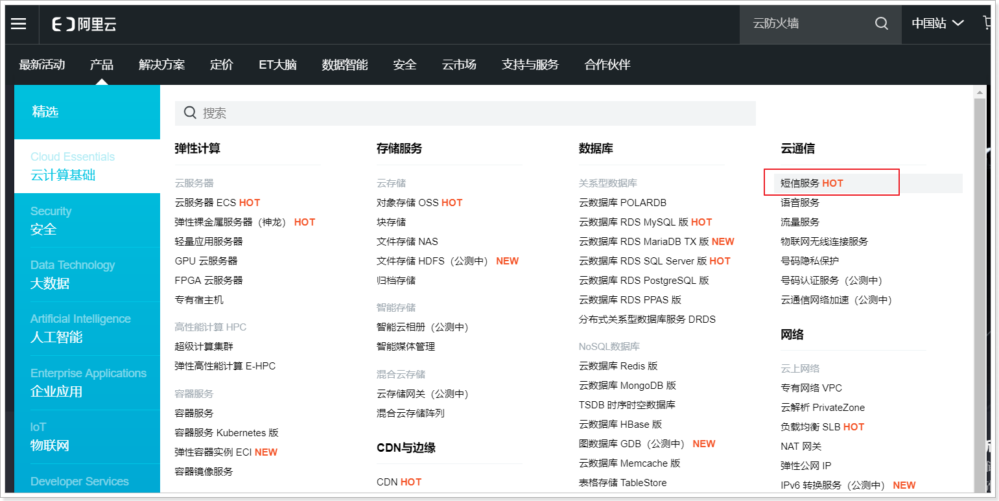

首次登入会显示：`立即开通`，以后会显示`管理控制台`：

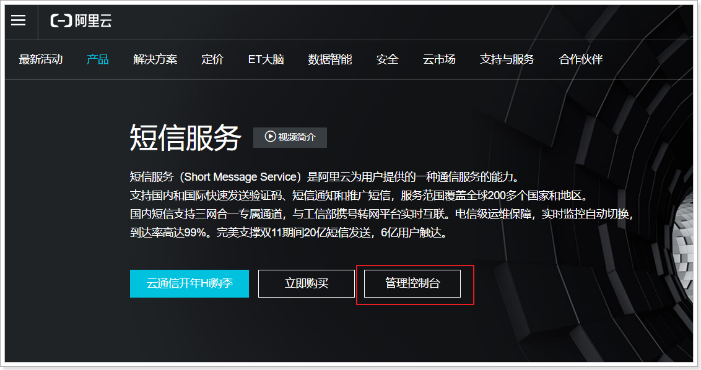

可以看到控制台页面：

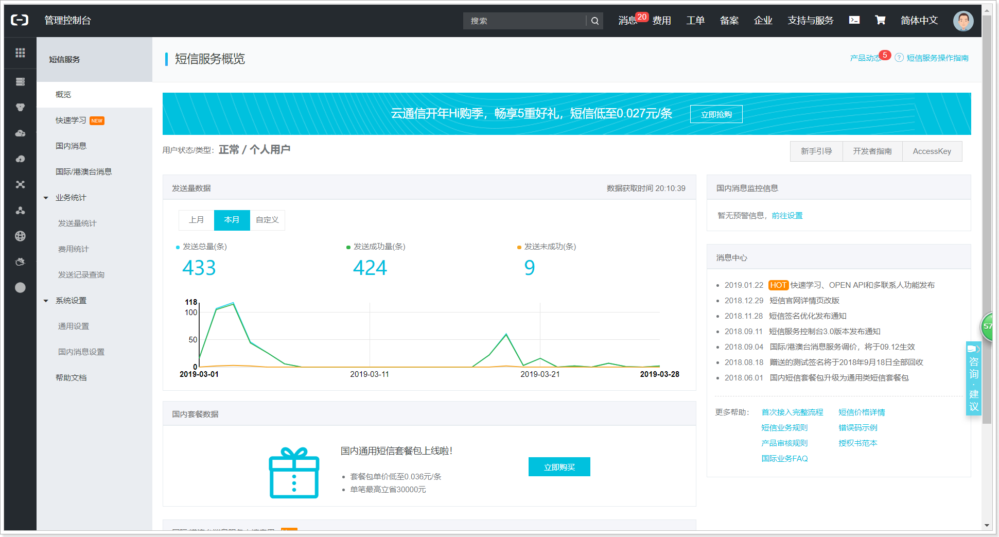

## 1.3.付费充值

在顶部菜单中选择费用，充值：

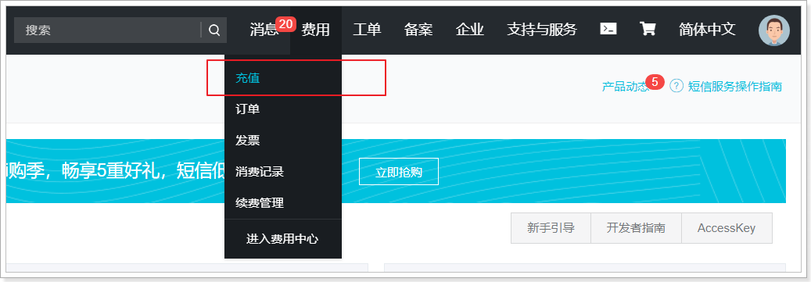

充值后即可使用短信服务发送短信了。


# 2.服务准备

正式开发发送短信前，还有一系列准备工作要做，主要包括以下几个部分：

- 开通子账户，设置AccessKeyId和AccessKeySecret
- 开通子账户短信权限
- 申请短信签名
- 申请短信模板

## 2.1.开通子账户

出于安全考虑，我们不能直接使用主账号开发，因为主账号具备整个云服务的完整权限，风险比较大。

所以，我们首先需要开通子账户，用于业务开发。

点击右上角的用户头像，可以选择权限控制：

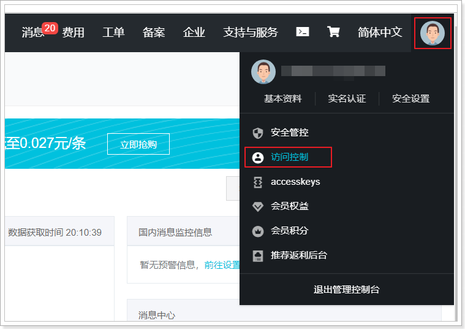

然后在弹出的页面中，选择新建用户：

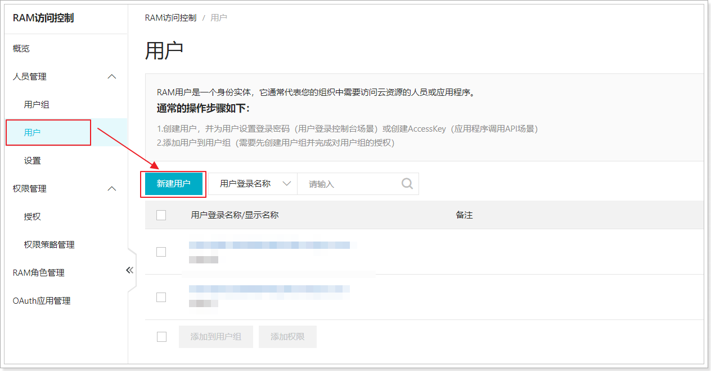

然后输入用户名，并选择`编程访问`：

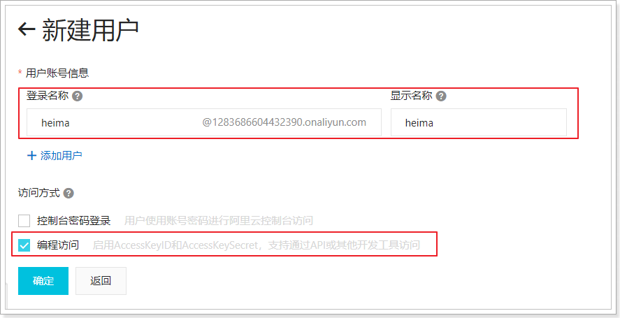

这样创建的用户就会带上AccessKeyID和AccessKeySecret了。

## 2.2.开通短信权限

在用户列表页面，选中一个新建的用户：

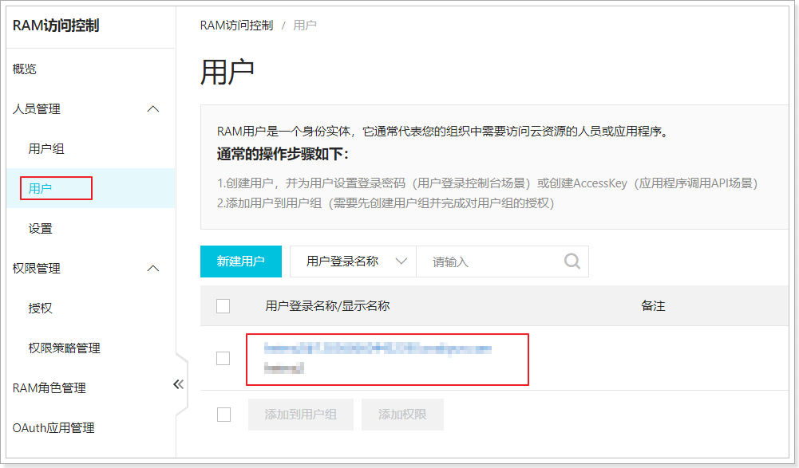

然后会进入用户设置页面，我们选择权限管理，并添加权限：

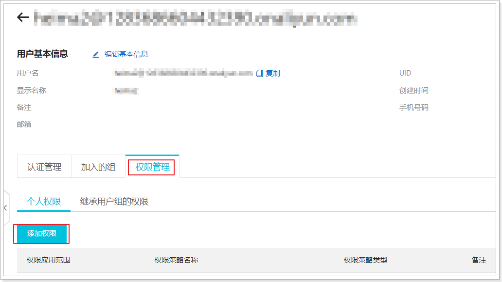

在弹出的列表页面中，搜索`短信`相关权限：

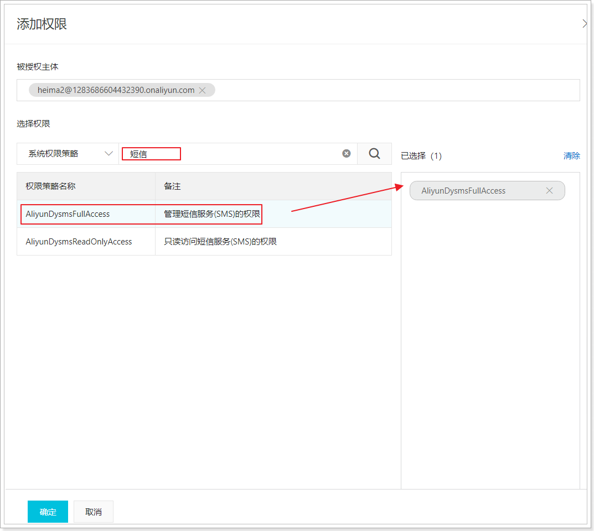

选中`管理短信服务（SMS）的权限`，点击确定即可！

## 2.3.短信签名

什么是短信签名？

短信签名是短信服务提供的一种快捷、方便的个性化签名方式。当发送短信时，短信平台会根据设置，在短信内容里附加个性签名，再发送给指定手机号码。

例如，企业主体为“阿里巴巴网络技术有限公司”，则可以提交的签名如下：

- 企业全称或简称：【阿里巴巴】、【阿里巴巴网络技术有限公司】。
- 公司旗下产品名称：【淘宝网】、【阿里云】等。

签名会在短信的开头携带，标示短信发送方的身份。


在管理控制台，找到国内短信菜单：

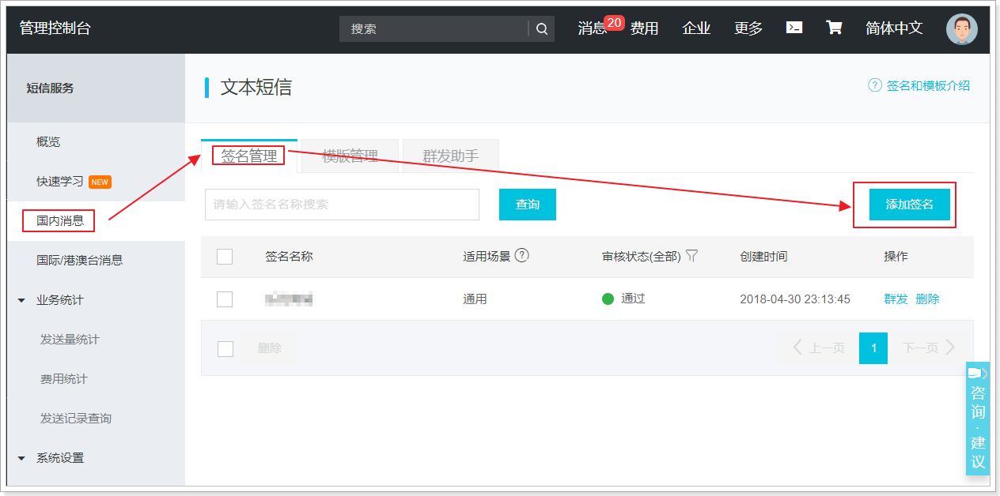

点击添加签名，进入签名申请页面：

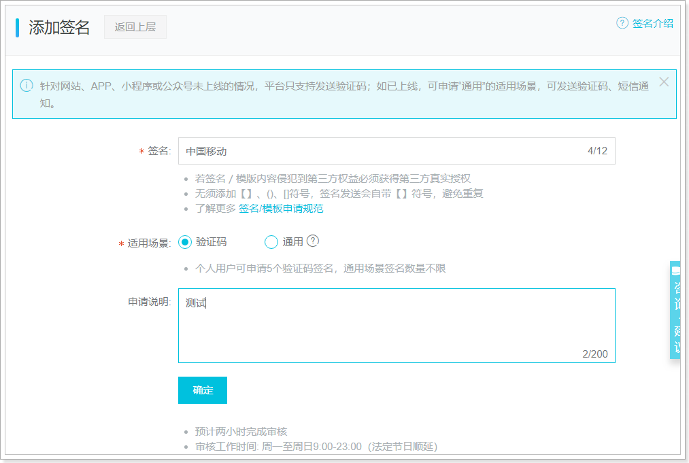

填写信息后，点击确定，等待人工审核即可。


## 2.4.短信模板

什么是短信模板？

阿里肯定不会允许你随意发送短信，因此会要求你提前定义好短信发送的内容。当然，内容中允许出现一些参数变量，但基本内容是固定的，这样的一套定义好的短信内容，就是**短信模板**。

**短信模板由变量和模板内容构成**。模板变量以变量形式提供针对不同手机号码的短信定制方式，在模板中设置变量后，发送短信时指定变量的实际值，短信服务会自动用实际值替换模板变量，并发送短信，实现短信的定制化。

例如：

```
【阿里云】您正在申请手机注册，验证码为：${code}，5分钟内有效！
```

其中：

- **模板内容**为：`您正在申请手机注册，验证码为：${code}，5分钟内有效！`。
- **模板变量**为：`${code}`。


> 申请模板

在国内短信菜单中，点击模板管理，

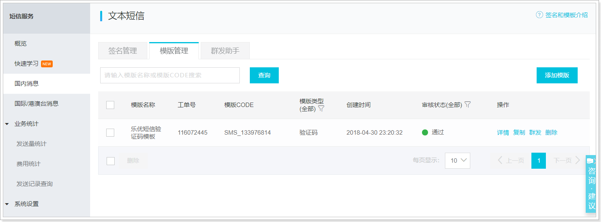

再点击添加模板按钮，进入模板申请页面：

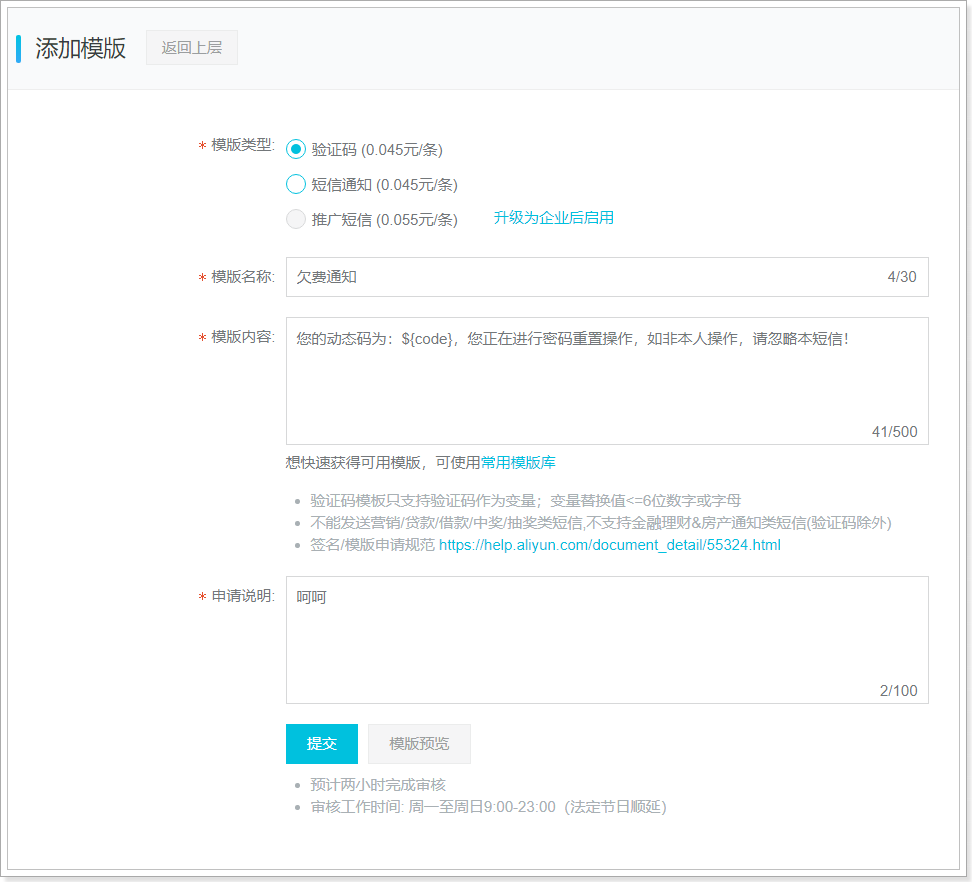

填写信息后，点击提交，等待人工审核即可！


# 3.阿里SDK

## 3.1.官方文档

发送短信最终要通过java代码，我们可以再阿里找到对应的文档信息：[短信发送文档](https://help.aliyun.com/document_detail/101414.html?spm=a2c4g.11186623.6.615.635850a4SVoFBk)

请求参数：

| 名称                | 类型   | 是否必选 | 示例值           | 描述                                                         |
| ------------------- | ------ | -------- | ---------------- | ------------------------------------------------------------ |
| **PhoneNumbers**    | String | 是       | 15900000000      | 接收短信的手机号码。格式：国内短信：11位手机号码，例如15951955195。国际/港澳台消息：国际区号+号码，例如85200000000。支持对多个手机号码发送短信，手机号码之间以英文逗号（,）分隔。上限为1000个手机号码。批量调用相对于单条调用及时性稍有延迟。**说明** 验证码类型短信，建议使用单独发送的方式。 |
| **SignName**        | String | 是       | 阿里云           | 短信签名名称。请在控制台**签名管理**页面**签名名称**一列查看。**说明** 必须是已添加、并通过审核的短信签名。 |
| **TemplateCode**    | String | 是       | SMS_153055065    | 短信模板ID。请在控制台**模板管理**页面**模板CODE**一列查看。**说明** 必须是已添加、并通过审核的短信签名；且发送国际/港澳台消息时，请使用国际/港澳台短信模版。 |
| **AccessKeyId**     | String | 否       | LTAIP00vvvvvvvvv | 主账号AccessKey的ID。                                        |
| **Action**          | String | 否       | SendSms          | 系统规定参数。取值：**SendSms**。                            |
| **OutId**           | String | 否       | abcdefgh         | 外部流水扩展字段。                                           |
| **SmsUpExtendCode** | String | 否       | 90999            | 上行短信扩展码，无特殊需要此字段的用户请忽略此字段。         |
| **TemplateParam**   | String | 否       | {"code":"1111"}  | 短信模板变量对应的实际值，JSON格式。**说明** 如果JSON中需要带换行符，请参照标准的JSON协议处理。 |

返回结果：

| 名称      | 类型   | 示例值                               | 描述                                                         |
| --------- | ------ | ------------------------------------ | ------------------------------------------------------------ |
| BizId     | String | 900619746936498440^0                 | 发送回执ID，可根据该ID在接口QuerySendDetails中查询具体的发送状态。 |
| Code      | String | OK                                   | 请求状态码。返回OK代表请求成功。其他错误码详见[错误码列表](https://help.aliyun.com/document_detail/101346.html)。 |
| Message   | String | OK                                   | 状态码的描述。                                               |
| RequestId | String | F655A8D5-B967-440B-8683-DAD6FF8DE990 | 请求ID。                                                     |


## 3.2.官方Demo

阿里提供了在线测试的Demo：https://api.aliyun.com/?spm=a2c4g.11186623.2.14.56ef50a4PQx5ux#/?product=Dysmsapi&api=SendSms

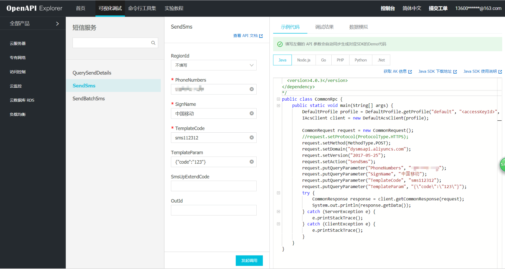


填写基本信息，即可发送并测试。


