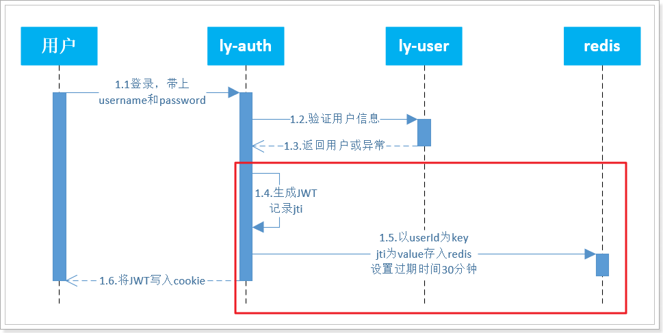
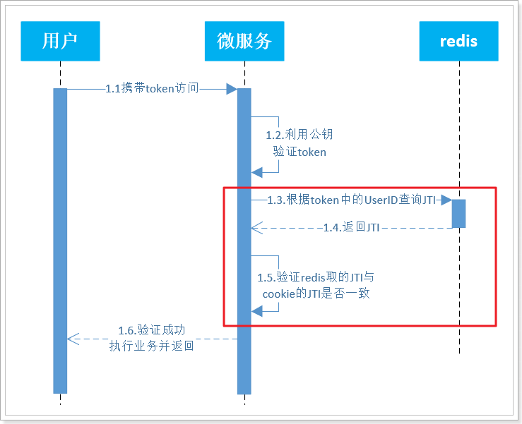
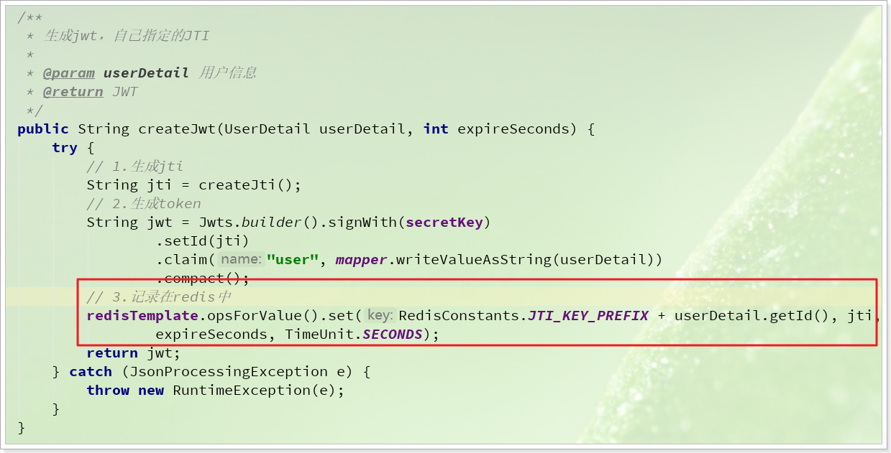
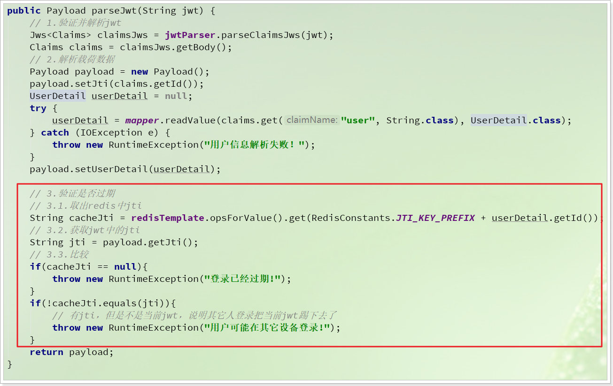
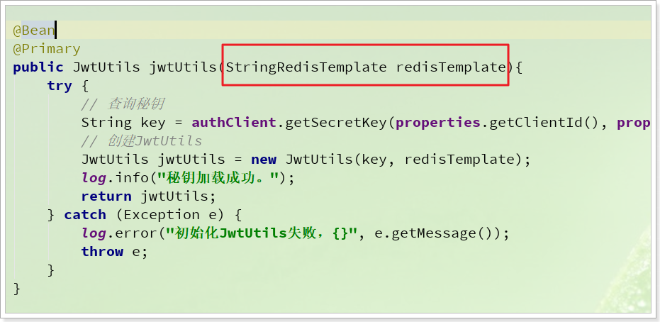
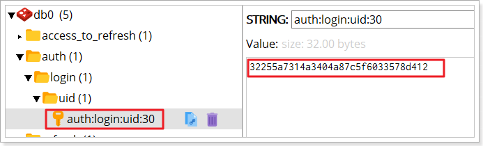
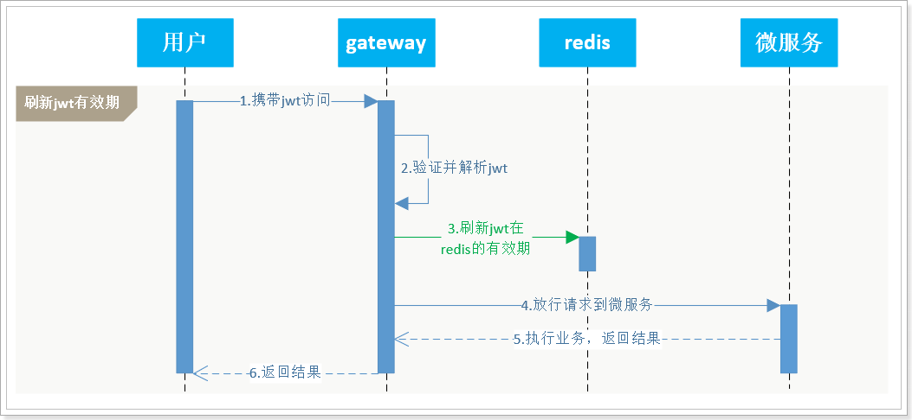
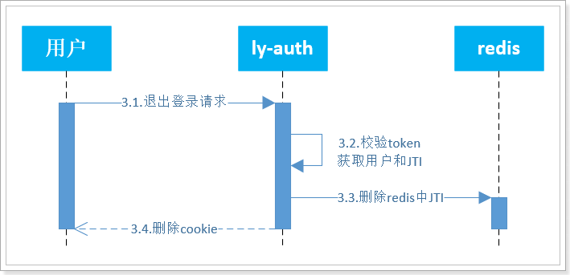
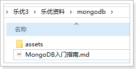

# 0.学习目标

- 理解网关登录拦截业务
- 理解如何退出登录
- 理解如何刷新token

# 1.登录超时控制

一般登录状态都有一个超时时间，超过时间后登录状态会失效。目前我们给用户颁发的JWT令牌并未设置超时时间，也就是说用户**只要不关闭浏览器，登录状态就一直有效**。

那么，我们该如何实现登录超时控制呢？

## 1.1.思路分析

登录超时控制有两种实现思路：

- 思路一：在颁发给用户的JWT中设置超时时间，每次校验JWT顺便校验时间
- 思路二：在服务端记录用户登录超时时间，即便jwt有效，服务端过期依然算登录失效

两种思路都可以，我们选择哪一种呢？

思路一的**优点**是过期时间在JWT中就有，无需服务端记录，减轻服务端压力；**缺点**是由于JWT的签名机制，一旦生成后不能修改，所以登录续期实现起来很麻烦。

思路二的**优点**是过期时间由服务端记录，控制用户的登录过期、续期、登出都很方便；**缺点**是给服务端带来了存储压力。

两种方案都可以，本例中我们采用**思路二**。

因此，这里我们需要完成两部分内容：

- 登录时配置超时时间：
  - 用户**登录时**记录JWT，并设置超时时间到redis中，采用string数据类型
  - key是用户id，值是JWT中的jti，并且设置过期时间，比如30分钟
- 用户访问时更新超时时间
  - 用户**每次**访问服务端，都更新redis的有效期


## 1.2.新的登录、验证逻辑

按照之前的分析，用户登录时，就需要把JWT中的jti信息记录到redis中，并设置过期时间。因此需要修改登录逻辑，流程图：



其中的1.4和1.5部分是新加入的逻辑。


另外，验证登录时，也需要验证redis中的JTI，如果到期则JTI在redis中就不存在了，验证流程如下：



其中的1.3、1.4、1.5是新增的流程。


### 1.2.1.定义Redis常量类

存入Redis时，需要使用到如：key的前缀、过期时间、等数据。我们在`ly-auth-pojo`的`com.leyou.auth.constants`包中定义一个常量类，记录这些值：

```java
package com.leyou.auth.constants;


public class RedisConstants {
    /**
     * 用户登录时记录TokenID的key前缀
     */
    public static final String JTI_KEY_PREFIX = "auth:login:uid:";
    /**
     * 用户登录时记录TokenID的超时时间
     */
    public static final Integer TOKEN_EXPIRE_SECONDS = 1800;
}
```

### 1.2.2.修改JwtUtils

我们可以把设置过期时间的代码直接写到JwtUtils中的`createJwt()`方法中，然后验证过期时间的代码写到JwtUtils的`parseJwt()`方法中。

首先在修改`ly-auth-pojo`的pom文件中引入redis的依赖：

```xml
<!--redis-->
<dependency>
    <groupId>org.springframework.boot</groupId>
    <artifactId>spring-boot-starter-data-redis</artifactId>
</dependency>
```


修改`ly-auth-pojo`中`com.leyou.auth.pojo`包下的`JwtUtils`：

登录时，存储到redis的逻辑：




验证JWT时，验证是否超时的逻辑：




完整的JwtUtils代码：

```java
package com.leyou.auth.utils;

import com.fasterxml.jackson.core.JsonProcessingException;
import com.fasterxml.jackson.databind.ObjectMapper;
import com.leyou.auth.constants.RedisConstants;
import com.leyou.auth.dto.Payload;
import com.leyou.auth.dto.UserDetail;
import io.jsonwebtoken.Claims;
import io.jsonwebtoken.Jws;
import io.jsonwebtoken.JwtParser;
import io.jsonwebtoken.Jwts;
import io.jsonwebtoken.security.Keys;
import org.apache.commons.lang3.StringUtils;
import org.springframework.data.redis.core.StringRedisTemplate;

import javax.crypto.SecretKey;
import java.io.IOException;
import java.nio.charset.Charset;
import java.util.UUID;
import java.util.concurrent.TimeUnit;


public class JwtUtils {

    /**
     * JWT解析器
     */
    private final JwtParser jwtParser;
    /**
     * 秘钥
     */
    private final SecretKey secretKey;

    private final StringRedisTemplate redisTemplate;

    private final static ObjectMapper mapper = new ObjectMapper();

    public JwtUtils(String key, StringRedisTemplate redisTemplate) {
        // 生成秘钥
        secretKey = Keys.hmacShaKeyFor(key.getBytes(Charset.forName("UTF-8")));
        // Redis工具
        this.redisTemplate = redisTemplate;
        // JWT解析器
        this.jwtParser = Jwts.parserBuilder().setSigningKey(secretKey).build();
    }

    /**
     * 生成jwt，用默认的JTI
     *
     * @param userDetail 用户信息
     * @return JWT
     */
    public String createJwt(UserDetail userDetail) {
        return createJwt(userDetail, RedisConstants.TOKEN_EXPIRE_SECONDS);
    }

    /**
     * 生成jwt，自己指定的JTI
     *
     * @param userDetail 用户信息
     * @return JWT
     */
    public String createJwt(UserDetail userDetail, int expireSeconds) {
        try {
            // 1.生成jti
            String jti = createJti();
            // 2.生成token
            String jwt = Jwts.builder().signWith(secretKey)
                    .setId(jti)
                    .claim("user", mapper.writeValueAsString(userDetail))
                    .compact();
            // 3.记录在redis中
            redisTemplate.opsForValue().set(RedisConstants.JTI_KEY_PREFIX + userDetail.getId(), jti,
                    expireSeconds, TimeUnit.SECONDS);
            return jwt;
        } catch (JsonProcessingException e) {
            throw new RuntimeException(e);
        }
    }

    /**
     * 解析jwt，并将用户信息转为指定的Clazz类型
     *
     * @param jwt token
     * @return 载荷，包含JTI和用户信息
     */
    public Payload parseJwt(String jwt) {
        // 1.验证并解析jwt
        Jws<Claims> claimsJws = jwtParser.parseClaimsJws(jwt);
        Claims claims = claimsJws.getBody();
        // 2.解析载荷数据
        Payload payload = new Payload();
        payload.setJti(claims.getId());
        UserDetail userDetail = null;
        try {
            userDetail = mapper.readValue(claims.get("user", String.class), UserDetail.class);
        } catch (IOException e) {
            throw new RuntimeException("用户信息解析失败！");
        }
        payload.setUserDetail(userDetail);

        // 3.验证是否过期
        // 3.1.取出redis中jti
        String cacheJti = redisTemplate.opsForValue().get(RedisConstants.JTI_KEY_PREFIX + userDetail.getId());
        // 3.2.获取jwt中的jti
        String jti = payload.getJti();
        // 3.3.比较
        if(cacheJti == null){
            throw new RuntimeException("登录已经过期!");
        }
        if(!cacheJti.equals(jti)){
            // 有jti，但是不是当前jwt，说明其它人登录把当前jwt踢下去了
            throw new RuntimeException("用户可能在其它设备登录!");
        }
        return payload;
    }

    private String createJti() {
        return StringUtils.replace(UUID.randomUUID().toString(), "-", "");
    }
}
```


### 1.2.3.引入Redis配置

因为JwtUtils中用到了StringRedisTemplate，因此我们需要在注册JwtUtils的时候注入。

修改`ly-auth-api`中的`AuthConfiguration`类：



完整代码：

```java
package com.leyou.auth.config;

import com.leyou.auth.client.AuthClient;
import com.leyou.auth.utils.JwtUtils;
import lombok.extern.slf4j.Slf4j;
import org.springframework.boot.autoconfigure.condition.ConditionalOnProperty;
import org.springframework.boot.context.properties.EnableConfigurationProperties;
import org.springframework.context.annotation.Bean;
import org.springframework.context.annotation.Configuration;
import org.springframework.context.annotation.Primary;
import org.springframework.data.redis.core.StringRedisTemplate;


@Slf4j
@Configuration
@ConditionalOnProperty(prefix = "ly.auth", name = {"clientId", "secret"})
@EnableConfigurationProperties(ClientProperties.class)
public class AuthConfiguration {

    private AuthClient authClient;
    private ClientProperties properties;

    public AuthConfiguration(AuthClient authClient, ClientProperties properties) {
        this.authClient = authClient;
        this.properties = properties;
    }

    @Bean
    @Primary
    public JwtUtils jwtUtils(StringRedisTemplate redisTemplate){
        try {
            // 查询秘钥
            String key = authClient.getSecretKey(properties.getClientId(), properties.getSecret());
            // 创建JwtUtils
            JwtUtils jwtUtils = new JwtUtils(key, redisTemplate);
            log.info("秘钥加载成功。");
            return jwtUtils;
        } catch (Exception e) {
            log.error("初始化JwtUtils失败，{}", e.getMessage());
            throw e;
        }
    }
}
```


修改`ly-auth-service`中的`JwtConfig`类：

```java
package com.leyou.auth.config;

import com.leyou.auth.utils.JwtUtils;
import org.springframework.beans.factory.annotation.Value;
import org.springframework.context.annotation.Bean;
import org.springframework.context.annotation.Configuration;
import org.springframework.data.redis.core.StringRedisTemplate;
import org.springframework.security.crypto.bcrypt.BCryptPasswordEncoder;
import org.springframework.security.crypto.password.PasswordEncoder;


@Configuration
public class JwtConfig {

    @Value("${ly.jwt.key}")
    private String key;

    @Bean
    public JwtUtils jwtUtils(StringRedisTemplate redisTemplate){
        return new JwtUtils(key, redisTemplate);
    }

    @Bean
    public PasswordEncoder passwordEncoder(){
        return new BCryptPasswordEncoder();
    }
}
```


## 1.3.配置Redis地址

现在，我们需要在用到JwtUtils的地方都引入redis的配置，包括：ly-auth-service和ly-user-service。

修改`ly-auth-service`中的application.yml文件，添加redis配置：

```yaml
spring:
  # ...
  redis:
    host: ly-redis
```

修改`ly-user-service`中的application.yml文件，添加redis配置：

```yaml
spring:
  # ...
  redis:
    host: ly-redis
```


## 1.4.重启测试

重启ly-auth-service和ly-user-service，再次登录，可以看到redis中已经写入数据：

 


# 2.刷新登录时间

我们给JWT设置了过期时间，如果用户登录后超过

## 2.1.思路分析

我们签发给用户的token是永久有效的，但是Redis的标示只存活30分钟。

当用户登录后，浏览网页时，很快30分钟就会过去，登录失效。用户付款时提示说您尚未登录，这样用户体验会很差。

我们需要做到：

- 只要用户一直访问，则登录状态一直存在，Redis不会过期
- 用户超过30分钟不访问，则登录状态失效

如何实现？

显然，需要在用户每次访问我们的微服务时，都去刷新Redis的缓存即可。


而用户的一切请求都会经过网关Gateway的过滤器，因此我们需要在网关中添加一个过滤器，拦截所有进入的请求，如果是**已登录用户**的请求，则**刷新Redis**的超时时间。

如图：



流程解读：

- 1.携带JWT访问：用户浏览浏览器过程中不可避免的会向服务端发送请求，都会携带jwt
- 2.验证并解析jwt：
  - 用户一切请求都经过网关，
  - 网关拦截并验证jwt是为了判断用户是否登录
  - 如果登录则刷新redis，未登录则什么都不做
- 3.刷新jwt在redis的有效期：利用redis的expire命令重置剩余有效期
- 4.放行请求到微服务
- 5.微服务执行自己业务逻辑并返回结果


## 2.2.代码实现

我们需要做的事情包括：

- 在网关引入`ly-auth-api`的相关依赖，确保能使用`JwtUtils`的功能
- 在网关编写过滤器，拦截用户请求，刷新redis中的jwt有效期

### 2.2.1.引入依赖

首先，我们在网关`ly-gateway`中引入`ly-auth-api`的依赖。

```xml
<dependency>
    <groupId>com.leyou</groupId>
    <artifactId>ly-auth-api</artifactId>
    <version>1.0.0-SNAPSHOT</version>
</dependency>
  <dependency>
      <groupId>org.springframework.cloud</groupId>
      <artifactId>spring-cloud-starter-openfeign</artifactId>
</dependency>
```

修改启动类：

```java
package com.leyou;

import org.springframework.boot.SpringApplication;
import org.springframework.boot.web.servlet.support.SpringBootServletInitializer;
import org.springframework.cloud.client.SpringCloudApplication;
import org.springframework.cloud.openfeign.EnableFeignClients;


@SpringCloudApplication
@EnableFeignClients //开启feign的支持
public class LyGateway{
    public static void main(String[] args) {
        SpringApplication.run(LyGateway.class, args);
    }
}
```

在网关中加入配置：

```yaml
ly:
  auth:
    clientId: api-gateway 
    secret: 1234
```


### 2.2.2.刷新有效期工具

刷新redis有效期的代码，我们也可以添加到JwtUtils中，方便使用。

现在，修改`ly-auth-pojo`中的JwtUtils类，添加两个方法：

```java
/**
     * 刷新jwt有效期
     * @param userId 用户id
     */
public void refreshJwt(Long userId){
    refreshJwt(userId, RedisConstants.TOKEN_EXPIRE_SECONDS);
}
/**
     * 刷新jwt有效期
     * @param userId 用户id
     * @param expireSeconds 有效期
     */
public void refreshJwt(Long userId, int expireSeconds){
    redisTemplate.expire(RedisConstants.JTI_KEY_PREFIX + userId, expireSeconds, TimeUnit.SECONDS);
}
```


### 2.2.2.编写过滤器

在`ly-gateway`中定义过滤器，拦截用户请求，并刷新有效期：

```java
package com.leyou.gateway.filters;

import com.leyou.auth.constants.JwtConstants;
import com.leyou.auth.dto.Payload;
import com.leyou.auth.dto.UserDetail;
import com.leyou.auth.utils.JwtUtils;
import lombok.extern.slf4j.Slf4j;
import org.springframework.cloud.gateway.filter.GatewayFilterChain;
import org.springframework.cloud.gateway.filter.GlobalFilter;
import org.springframework.core.Ordered;
import org.springframework.http.HttpCookie;
import org.springframework.http.server.reactive.ServerHttpRequest;
import org.springframework.stereotype.Component;
import org.springframework.web.server.ServerWebExchange;
import reactor.core.publisher.Mono;


@Slf4j
@Component
public class LoginFilter implements GlobalFilter, Ordered {

    private final JwtUtils jwtUtils;

    public LoginFilter(JwtUtils jwtUtils) {
        this.jwtUtils = jwtUtils;
    }

    @Override
    public Mono<Void> filter(ServerWebExchange exchange, GatewayFilterChain chain) {

        // 1.获取Request对象
        ServerHttpRequest request = exchange.getRequest();
        // 2.获取cookie
        HttpCookie cookie = request.getCookies().getFirst(JwtConstants.COOKIE_NAME);
        if (cookie == null) {
            // 没有登录，放行
            return chain.filter(exchange);
        }
        // 3.校验token是否有效
        String jwt = cookie.getValue();
        try {
            // 3.1.解析并验证token
            Payload payload = jwtUtils.parseJwt(jwt);
            // 3.2.获取用户
            UserDetail userInfo = payload.getUserDetail();
            // 3.3.刷新jwt
            jwtUtils.refreshJwt(userInfo.getId());
            log.info("用户{}正在访问{}", userInfo.getUsername(), request.getURI().getPath());
        } catch (Exception e) {
            // 解析失败，token有误
            log.info("用户未登录");
        }
        // 5.放行
        return chain.filter(exchange);

    }

    @Override
    public int getOrder() {
        // 登录拦截，可以采用最高优先级！
        return HIGHEST_PRECEDENCE;
    }
}
```


# 3.退出登录

首页左上角，登录后除了显示用户名，还有一个注销登录按钮：


点击这个按钮，该如何实现退出登录呢？

## 3.1.思路分析

回想下以前怎么实现的：

- 用户点击退出，发起请求到服务端
- 服务端删除用户session即可

我们现在信息保存在两个地方：cookie中的JWT、Redis中的JTI控制有效期，并没有session这东西，该如何退出？

有同学会想，太简单了，直接删除cookie就可以了。

别忘了，我们设置了httponly，JS无法操作cookie。因此，删除cookie也必须**发起请求到服务端，由服务端来删除cookie**。


那么，是不是删除了cookie，用户就完成了退出登录呢？

设想一下，删除了cookie，只是让用户在当前浏览器上的jwt删除了，但是这个jwt依然是有效的！

这就是JWT的另外一个缺点了，无法控制jwt让其失效。如果用户提前备份了jwt，那么重新填写到cookie后，登录状态依然有效。

所以，我们**不仅仅要让浏览器端清除cookie，而且要让这个cookie中的jwt失效**！我们在redis中记录了JTI，因此只要删除了Redis中的JTI信息，这个用户登录凭证就失效了！

综上所述，我们要实现退出登录要做的事情有两件：

- 删除redis中的用户记录JTI
- 删除浏览器cookie


## 3.2.流程图

退出登录：



步骤如下：

- 客户发请求到服务端
- 服务验证token，获取用户
- 根据用户id，删除redis中的JTI
- 删除cookie


## 3.3.业务实现

通过浏览器的请求分析，可以得知退出登录的请求信息：

- 请求方式：POST
- 请求路径：/user/logout
- 请求参数：无，携带cookie
- 返回值：无

在`ly-auth-service`的`com.leyou.auth.web`包的`UserAuthController`中，添加方法：

```java
    /**
     * 退出登录
     * @param request 请求参数
     * @param response 响应数据，写cookie用
     * @return 无
     */
@PostMapping("logout")
public ResponseEntity<Void> logout(HttpServletRequest request, HttpServletResponse response){
    userAuthService.logout(request, response);
    return ResponseEntity.noContent().build();
}
```

在`ly-auth-service`的`com.leyou.auth.service`包的`UserAuthService`中，添加方法：

```java
void logout(HttpServletRequest request, HttpServletResponse response);
```

在`ly-auth-service`的`com.leyou.auth.service.impl`包的`UserAuthServiceImpl`中，添加方法：

```java
@Override
public void logout(HttpServletRequest request, HttpServletResponse response) {
    // 1.获取用户cookie
    String jwt = CookieUtils.getCookieValue(request, UserTokenConstants.COOKIE_NAME);
    // 2.校验cookie中的token的有效性
    Payload payload = null;
    try {
        payload = jwtUtils.parseJwt(jwt);
    } catch (Exception e) {
        // 3.如果无效，什么都不做
        return;
    }
    // 4.如果有效，删除cookie（重新写一个cookie，maxAge为0）
    CookieUtils.deleteCookie(JwtConstants.COOKIE_NAME, JwtConstants.DOMAIN, response);

    // 5.删除redis中的JTI
    // 5.1.获取用户信息
    UserDetail userDetail = payload.getUserDetail();
    // 5.2.删除redis数据
    redisTemplate.delete(RedisConstants.JTI_KEY_PREFIX + userDetail.getId());
}
```


# 4.面试常见问题

## 4.1.Jwt和Spring Security的对比：

JWT的：

- 优点：
  - 无需在服务端存储用户数据，减轻服务端压力
  - 轻量级，json风格，比较简单
  - 跨语言
  - 有利于水平扩展
  
- 缺点：
  - token一旦签发，无法修改
    - 无法更新token有效期，用户登录状态刷新难以实现
    - 无法销毁一个token，服务端不能对用户状态进行绝对控制
  - 不包含权限控制


SpringSecurity：

- 优点：
  - 用户信息保存在服务端，服务端可以对用户状态绝对控制
  - 基于Spring，无缝整合，修改登录逻辑，其实就是添加过滤器
  - 整合权限管理
- 缺点：
  - 限定了语言
  - 实现复杂，基于一连串的过滤器链
  - 需要在服务端保存用户信息，增加服务端压力
  - 依赖于tomcat的HttpSession、如果是分布式项目，session不共享，登录失效，需要借助于SpringSession，实现共享session效果（利用redis代替tomcat的session）
  
  

## 4.2.登录控制问题

- 你们使用JWT做登录凭证，如何解决token注销问题

  答：jwt的缺陷是token生成后无法修改，因此无法让token失效。只能采用其它方案来弥补，基本思路如下：

    1）用户登录后，生成JWT，其中包含用户身份

    2）以用户id为key，把JWT的id存入redis，只有redis中有id的JWT，才是有效的JWT

    3）并且给Redis设置有效期，有效期到自动删除

    4）退出登录时，把ID从Redis删除即可

  

- 怎么解决登录超时后的登录续签问题？

  答：判断登录是否超时的标准是redis，而不是JWT，因此每次用户访问网关，我们都会刷新redis的数据有效期，保证登录状态不断。

- 如何解决异地登录或跨设备登录问题？

  答：

  方案一：不允许多端登录

  如果账户在第二个设备登录，自然会将redis中的JWT覆盖，那么之前的登录凭证就成了无效凭证。
  
  方案二：允许多端登录
  
  存入redis时，redis的类型可以选择set，这样一个用户可以具备多个JWT的id，实现多端登录。

## 4.3.cookie安全问题

- JWT中的cookie泄露，是否会泄露用户隐私？
  
- 不会，因为JWT中只保存用户id这样的非敏感字段，不存放例如手机、密码之类的信息
  
- 如何解决token被篡改问题？

  - 答：token中的数据可以篡改，但是签名无法篡改，否则服务端认证根本不会通过，因此篡改的token是无法通过服务端校验的
- 如何防止token的伪造
  
  与上个问题类似，token中带有签名认证，而签名需要私钥加密生成。只要私钥不泄露，就不可能有人伪造token，因为其它秘钥生成的token是不会被公钥认可的。
  
- 如何解决cookie被盗用问题？

  答：cookie被盗用的可能性主要包括下面几种：

  - XSS攻击：这个可以在前端页面渲染时对 数据做安全处理即可，而且我们的cookie使用了Httponly为true，可以防止JS脚本的攻击。
  - CSRF攻击：
    - 利用Referer头，防盗链
    - 请求头中加随机码
  - 数据抓包，获取用户cookie：我们采用了HTTPS协议通信，无法获取请求的任何数据
  - 请求重放攻击：对于普通用户的请求没有对请求重放做防御，而是对部分业务做好了`幂等`处理。运行管理系统中会对token添加随机码，认证token一次有效，来预防请求重放攻击。
  - 用户电脑中毒：这个无法防范。
  
- 用户的cookie被禁用怎么办？

  - cookie一般情况下，是不会被禁用，因为普通人根本不知道是什么是cookie，一般不用管，为了友好，我们可以给用户一个提示：你的cookie已经被禁用了，请启用cookie。
  - 把jwt作为响应头返回，浏览器中JS把token写到本地存储（sessionStorage），要求前端每次发ajax，都必须自己携带token。而且有被xss攻击的风险


## 4.4.权限问题

- 如何完成权限校验的？

  - 首先我们有权限管理的服务，管理用户的各种权限，及可访问路径等
  - 在网关中利用过滤器，拦截一切请求，在过滤器中，解析和验证jwt，获取用户身份，查询用户权限，判断用户身份可以访问当前路径


## 4.5.跨域登录问题

单点登录，顾名思义：在分布式服务中，用户只需要在一处登录，即可在各个受信任的服务器之间，共享登录状态，称为单点登录。


任何登录都离不开cookie，如果cookie无法使用或共享，就会导致登录凭证无法共享，导致登录状态无法共享。例如因为跨域名的多个服务，其cookie不可共享，导致登录失效。

因此实现单点登录有多种方式，其区别就在于是否能解决跨域登录

- 同域名单点登录
  - 分布式服务共享二级域名，二级以上域名不同，此时cookie可以共享。解决思路：
    - JWT无状态登录
    - 共享Session
- 跨域单点登录
  - 服务二级域名就不同，导致cookie无法共享，解决办法：
    - OAuth协议实现单点登录：[Oauth2.0协议](http://www.ruanyifeng.com/blog/2019/04/oauth_design.html)，成熟的框架：[CAS](https://blog.csdn.net/anumbrella/article/details/80821486)

CAS原理图：


# 5.MongoDB

后续购物车功能我们计划使用MongoDB服务器，那么MongoDB该如何使用呢？

大家参考课前资料提供的文档：

 

