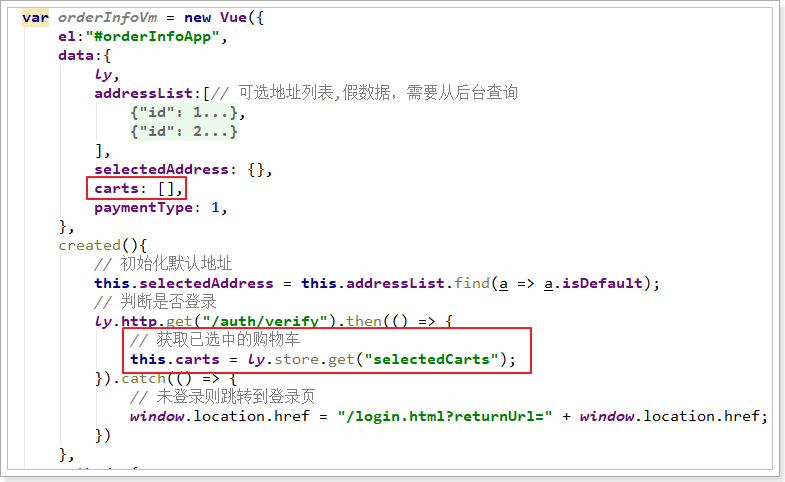
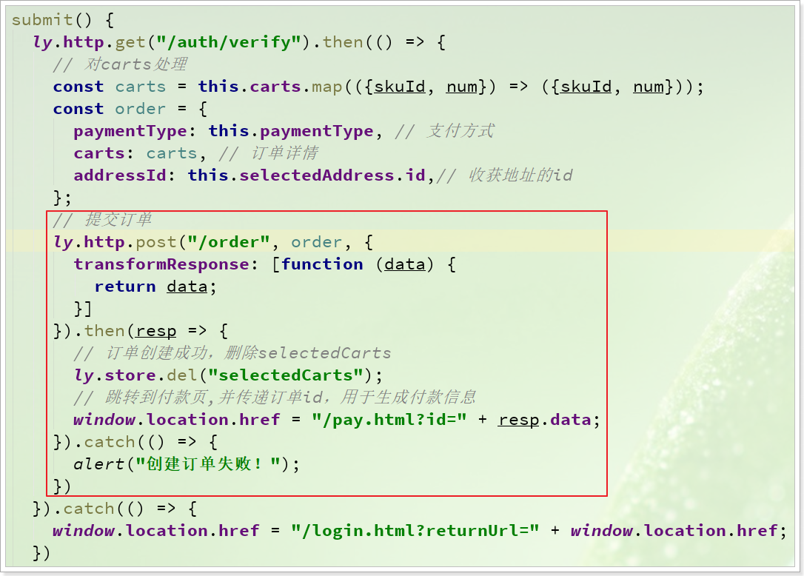

# 0.学习目标

- 了解订单表设计
- 实现减库存功能
- 实现下单功能
- 实现查询订单功能


# 1.订单数据结构

加入购物车后，自然就要完成用户下单，订单属于对事务要求较高的业务，肯定不能写入MongoDB，应该写入MySQL数据库中。


我们接下来看看订单表设计：

## 1.1.数据结构

订单表：

```sql
CREATE TABLE `tb_order` (
  `order_id` bigint(20) NOT NULL COMMENT '订单id',
  `total_fee` bigint(20) NOT NULL COMMENT '总金额，单位为分',
  `actual_fee` bigint(20) NOT NULL COMMENT '实付金额。单位:分。如:20007，表示:200元7分',
  `payment_type` tinyint(2) unsigned zerofill NOT NULL COMMENT '支付类型，1、微信支付，2、支付宝支付',
  `post_fee` bigint(20) NOT NULL COMMENT '邮费。单位:分。如:20007，表示:200元7分',
  `user_id` bigint(20) NOT NULL COMMENT '用户id',
  `status` tinyint(2) DEFAULT NULL COMMENT '订单的状态，1、未付款 2、已付款,未发货 3、已发货,未确认 4、确认收货，交易成功 5、交易取消，订单关闭 6、交易结束，已评价',
  `create_time` timestamp NULL DEFAULT CURRENT_TIMESTAMP COMMENT '创建时间',
  `pay_time` timestamp NULL DEFAULT NULL COMMENT '支付时间',
  `consign_time` timestamp NULL DEFAULT NULL COMMENT '发货时间',
  `end_time` timestamp NULL DEFAULT NULL COMMENT '交易完成时间',
  `close_time` timestamp NULL DEFAULT NULL COMMENT '交易关闭时间',
  `comment_time` timestamp NULL DEFAULT NULL COMMENT '评价时间',
  `update_time` timestamp NULL DEFAULT CURRENT_TIMESTAMP ON UPDATE CURRENT_TIMESTAMP COMMENT '更新时间',
  PRIMARY KEY (`order_id`),
  KEY `multi_key_status_time` (`status`,`create_time`) USING BTREE
) ENGINE=InnoDB DEFAULT CHARSET=utf8 COLLATE=utf8_bin;
```


物流信息表：

```mysql
CREATE TABLE `tb_order_logistics` (
  `order_id` bigint(20) NOT NULL COMMENT '订单id，与订单表一对一',
  `logistics_number` varchar(18) DEFAULT '' COMMENT '物流单号',
  `logistics_company` varchar(18) DEFAULT '' COMMENT '物流公司名称',
  `addressee` varchar(32) NOT NULL COMMENT '收件人',
  `phone` varchar(11) NOT NULL COMMENT '收件人手机号码',
  `province` varchar(16) NOT NULL COMMENT '省',
  `city` varchar(32) NOT NULL COMMENT '市',
  `district` varchar(32) NOT NULL COMMENT '区',
  `street` varchar(256) NOT NULL COMMENT '街道',
  `postcode` int(6) DEFAULT '0' COMMENT '邮编',
  `create_time` timestamp NOT NULL DEFAULT CURRENT_TIMESTAMP COMMENT '创建时间',
  `update_time` timestamp NOT NULL DEFAULT CURRENT_TIMESTAMP ON UPDATE CURRENT_TIMESTAMP COMMENT '更新时间',
  PRIMARY KEY (`order_id`)
) ENGINE=InnoDB DEFAULT CHARSET=utf8;
```


订单条目(**这个表需要重新生成，大家注意一下，ID的类型是Bigint**)：

```sql
CREATE TABLE `tb_order_detail` (
  `id` bigint(20) NOT NULL COMMENT '主键',
  `order_id` bigint(20) NOT NULL COMMENT '订单id',
  `sku_id` bigint(20) NOT NULL COMMENT 'sku商品id',
  `num` int(4) NOT NULL COMMENT '购买数量',
  `title` varchar(256) NOT NULL COMMENT '商品标题',
  `spec` varchar(1024) DEFAULT '' COMMENT '商品动态属性键值集',
  `price` int(16) NOT NULL COMMENT '价格,单位：分',
  `image` varchar(256) DEFAULT '' COMMENT '商品图片',
  `create_time` timestamp NOT NULL DEFAULT CURRENT_TIMESTAMP COMMENT '创建时间',
  `update_time` timestamp NOT NULL DEFAULT CURRENT_TIMESTAMP ON UPDATE CURRENT_TIMESTAMP COMMENT '更新时间',
  PRIMARY KEY (`id`) USING BTREE,
  KEY `key_order_id` (`order_id`) USING BTREE
) ENGINE=InnoDB DEFAULT CHARSET=utf8 COMMENT='订单详情表';
```


## 1.2.整合MybatisPlus

### 1.2.1.依赖

在`ly-trade`的`pom.xml`中添加数据库相关依赖：

```xml
<!-- mybatis-plus -->
<dependency>
    <groupId>com.baomidou</groupId>
    <artifactId>mybatis-plus-boot-starter</artifactId>
</dependency>
<!-- mysql驱动 -->
<dependency>
    <groupId>mysql</groupId>
    <artifactId>mysql-connector-java</artifactId>
</dependency>
```


### 1.2.2.配置

在`ly-trade`的`application.yml`中添加数据库配置

```yaml
spring:
  datasource:
    driver-class-name: com.mysql.jdbc.Driver
    url: jdbc:mysql://ly-mysql:3306/heima?useUnicode=true&characterEncoding=utf8&allowMultiQueries=true&useSSL=false
    username: root
    password: root
mybatis-plus:
  type-aliases-package: com.leyou.trade.entity
  global-config:
    db-config:
      id-type: INPUT # 此处的id类型选择INPUT，代表自定义
      insert-strategy: not_null
      update-strategy: not_null
```


### 1.2.3.启动类注解

在`ly-trade`的`com.leyou.trade`下的启动类`LyTradeApplication`上添加`@MapperScan`注解：

```java
package com.leyou.trade;

import org.mybatis.spring.annotation.MapperScan;
import org.springframework.boot.SpringApplication;
import org.springframework.boot.autoconfigure.SpringBootApplication;


@EnableJwtVerification
@EnableFeignClients
@MapperScan("com.leyou.trade.mapper")
@SpringBootApplication(scanBasePackages = {"com.leyou.trade", "com.leyou.common.advice"})
public class LyTradeApplication {
    public static void main(String[] args) {
        SpringApplication.run(LyTradeApplication.class, args);
    }
}
```


## 1.3.基本代码

### 1.3.1.全局唯一id

订单数据非常庞大，将来一定会做分库分表。那么这种情况下， 要保证id的唯一，就不能靠数据库自增，而是自己来实现算法，生成唯一id。

有很多种全局唯一ID的生成策略，包括：

> #### UUID

算法的核心思想是结合机器的网卡、当地时间、一个随记数来生成UUID。

- 优点：本地生成，生成简单，性能好，没有高可用风险
- 缺点：长度过长，存储冗余，且无序不可读，查询效率低

> #### 数据库自增ID

使用数据库的id自增策略，如 MySQL 的 auto_increment。并且可以使用两台数据库分别设置不同步长，生成不重复ID的策略来实现高可用。

- 优点：数据库生成的ID绝对有序，高可用实现方式简单
- 缺点：需要独立部署数据库实例，成本高，有性能瓶颈

> #### 批量生成ID

一次按需批量生成多个ID，每次生成都需要访问数据库，将数据库修改为最大的ID值，并在内存中记录当前值及最大值。

- 优点：避免了每次生成ID都要访问数据库并带来压力，提高性能
- 缺点：属于本地生成策略，存在单点故障，服务重启造成ID不连续

> ####  Redis生成ID

Redis的所有命令操作都是单线程的，本身提供像 incr 和 increby 这样的自增原子命令，所以能保证生成的 ID 肯定是唯一有序的。

- 优点：不依赖于数据库，灵活方便，且性能优于数据库；数字ID天然排序，对分页或者需要排序的结果很有帮助。
- 缺点：如果系统中没有Redis，还需要引入新的组件，增加系统复杂度；需要编码和配置的工作量比较大。

考虑到单节点的性能瓶颈，可以使用 Redis 集群来获取更高的吞吐量。假如一个集群中有5台 Redis。可以初始化每台 Redis 的值分别是1, 2, 3, 4, 5，然后步长都是 5。各个 Redis 生成的 ID 为：

```
A：1, 6, 11, 16, 21
B：2, 7, 12, 17, 22
C：3, 8, 13, 18, 23
D：4, 9, 14, 19, 24
E：5, 10, 15, 20, 25
```

随便负载到哪个机确定好，未来很难做修改。步长和初始值一定需要事先确定。使用 Redis 集群也可以方式单点故障的问题。

另外，比较适合使用 Redis 来生成每天从0开始的流水号。比如订单号 = 日期 + 当日自增长号。可以每天在 Redis 中生成一个 Key ，使用 INCR 进行累加。

> #### Twitter的snowflake算法

Twitter 利用 zookeeper 实现了一个全局ID生成的服务 Snowflake：[github.com/twitter/sno…](https://github.com/twitter/snowflake)


如上图的所示，Twitter 的 Snowflake 算法由下面几部分组成：

- 1位符号位：**

由于 long 类型在 java 中带符号的，最高位为符号位，正数为 0，负数为 1，且实际系统中所使用的ID一般都是正数，所以最高位为 0。

- **41位时间戳（毫秒级）：**

需要注意的是此处的 41 位时间戳并非存储当前时间的时间戳，而是存储时间戳的差值（当前时间戳 - 起始时间戳），这里的起始时间戳一般是ID生成器开始使用的时间戳，由程序来指定，所以41位毫秒时间戳最多可以使用 `(1 << 41) / (1000x60x60x24x365) = 69年`。

- **10位数据机器位：**

包括5位数据标识位和5位机器标识位，这10位决定了分布式系统中最多可以部署 `1 << 10 = 1024` s个节点。超过这个数量，生成的ID就有可能会冲突。

- **12位毫秒内的序列：**

这 12 位计数支持每个节点每毫秒（同一台机器，同一时刻）最多生成 `1 << 12 = 4096个ID`

加起来刚好64位，为一个Long型。

- 优点：高性能，低延迟，按时间有序，一般不会造成ID碰撞
- 缺点：需要独立的开发和部署，依赖于机器的时钟


> ####  百度UidGenerator

UidGenerator是百度开源的分布式ID生成器，基于于snowflake算法的实现，看起来感觉还行。不过，国内开源的项目维护性真是担忧。

具体可以参考官网说明：[github.com/baidu/uid-g…](https://github.com/baidu/uid-generator/blob/master/README.zh_cn.md)

> #### 美团Leaf

Leaf 是美团开源的分布式ID生成器，能保证全局唯一性、趋势递增、单调递增、信息安全，里面也提到了几种分布式方案的对比，但也需要依赖关系数据库、Zookeeper等中间件。

具体可以参考官网说明：[tech.meituan.com/MT_Leaf.htm…](https://tech.meituan.com/MT_Leaf.html)


在我们的项目中，会使用**雪花算法**作为唯一id的生成算法。


### 1.3.2.实体类

接下来，在`ly-trade`的`com.leyou.trade.entity`包中添加几个实体类。

#### 1.3.2.1.Order

```java
package com.leyou.trade.entity;

import com.baomidou.mybatisplus.annotation.IdType;
import com.baomidou.mybatisplus.annotation.TableField;
import com.baomidou.mybatisplus.annotation.TableId;
import com.baomidou.mybatisplus.annotation.TableName;
import com.baomidou.mybatisplus.extension.handlers.MybatisEnumTypeHandler;
import com.leyou.common.entity.BaseEntity;
import com.leyou.trade.entity.enums.OrderStatus;
import lombok.Data;
import lombok.EqualsAndHashCode;

import java.util.Date;

@Data
@EqualsAndHashCode(callSuper = false)
@TableName("tb_order")
public class Order extends BaseEntity {
    /**
     * 订单编号
     */
    @TableId(type = IdType.ASSIGN_ID)
    private Long orderId;
    /**
     * 商品金额
     */
    private Long totalFee;
    /**
     * 邮费
     */
    private Long postFee;
    /**
     * 实付金额
     */
    private Long actualFee;
    /**
     * 付款方式：1:微信支付, 2:支付宝支付
     */
    private Integer paymentType;
    /**
     * 用户id
     */
    private Long userId;

    /**
     * 订单状态,1、未付款 2、已付款,未发货 3、已发货,未确认 4、确认收货，交易成功 5、交易取消，订单关闭 6、交易结束
     */
    @TableField(typeHandler = MybatisEnumTypeHandler.class)
    private OrderStatus status;
    /**
     * 付款时间
     */
    private Date payTime;
    /**
     * 发货时间
     */
    private Date consignTime;
    /**
     * 确认收货时间
     */
    private Date endTime;
    /**
     * 交易关闭时间
     */
    private Date closeTime;
    /**
     * 评价时间
     */
    private Date commentTime;
}
```


需要注意的地方：

- id类型：这里是`@TableId(type = IdType.ASSIGN_ID)`，代表是自动生成ID，id生成算法是由MybatisPlus内置的雪花算法（SnowFlake，由Twitter公司开源）
- 订单状态：订单状态包含多个，在数据库中是数字，不太方便记忆。为了避免出错，这里我们使用了枚举`OrderStatus`


```java
package com.leyou.trade.entity.enums;

import com.baomidou.mybatisplus.annotation.EnumValue;
import com.fasterxml.jackson.annotation.JsonValue;


public enum OrderStatus {
    INIT(1, "初始化，未付款"),
    PAY_UP(2, "已付款，未发货"),
    DELIVERED(3, "已发货，未确认"),
    CONFIRMED(4, "已确认,未评价"),
    CLOSED(5, "已关闭"),
    RATED(6, "已评价，交易结束")
    ;

    private Integer value;
    private String msg;

    OrderStatus(Integer value, String msg) {
        this.value = value;
        this.msg = msg;
    }

    public Integer getValue(){
        return this.value;
    }

    public String getMsg(){
        return msg;
    }

    @Override
    public String toString() {
        return String.valueOf(value);
    }
}
```


#### 1.3.2.2.OrderDetail

```java
package com.leyou.trade.entity;

import com.baomidou.mybatisplus.annotation.TableId;
import com.baomidou.mybatisplus.annotation.TableName;
import com.leyou.common.entity.BaseEntity;
import lombok.Data;
import lombok.EqualsAndHashCode;

@Data
@EqualsAndHashCode(callSuper = false)
@TableName("tb_order_detail")
public class OrderDetail extends BaseEntity {
    /**
     * 订单编号
     */
    @TableId(type = IdType.ASSIGN_ID)
    private Long id;
    /**
     * 订单编号
     */
    private Long orderId;
    /**
     * 商品id
     */
    private Long skuId;
    /**
     * 商品购买数量
     */
    private Integer num;
    /**
     * 商品标题
     */
    private String title;
    /**
     * 商品单价
     */
    private Long price;
    /**
     * 商品规格数据
     */
    private String spec;
    /**
     * 图片
     */
    private String image;
}
```


#### 1.3.2.3.OrderLogistics

```java
package com.leyou.trade.entity;

import com.baomidou.mybatisplus.annotation.TableId;
import com.baomidou.mybatisplus.annotation.TableName;
import com.leyou.common.entity.BaseEntity;
import lombok.Data;
import lombok.EqualsAndHashCode;


@Data
@EqualsAndHashCode(callSuper = false)
@TableName("tb_order_logistics")
public class OrderLogistics extends BaseEntity {
    /**
     * 订单id，与订单表一对一
     */
    @TableId
    private Long orderId;
    /**
     * 物流单号
     */
    private String logisticsNumber;
    /**
     * 物流名称
     */
    private String logisticsCompany;
    /**
     * 收件人
     */
    private String addressee;
    /**
     * 手机号
     */
    private String phone;
    /**
     * 省
     */
    private String province;
    /**
     * 市
     */
    private String city;
    /**
     * 区
     */
    private String district;
    /**
     * 街道
     */
    private String street;
    /**
     * 邮编
     */
    private String postcode;
}
```


### 1.3.3.MybatisPlus对枚举的支持

我们的订单实体类中使用了枚举，而数据库中是int类型，那么在读写数据库的时候，如何实现int与enum间互相转换呢？

MybatisPlus已经默认支持了枚举的转换，你只需要这样做：

#### 1）在枚举类上添加注解

枚举中必须包含一个属性，属性值会作为将来写入数据库的值，比如：

 


这个字段需要添加注解：

 

完整内容：

```java
package com.leyou.trade.entity.enums;

import com.baomidou.mybatisplus.annotation.EnumValue;
import com.fasterxml.jackson.annotation.JsonValue;


public enum OrderStatus {
    INIT(1, "初始化，未付款"),
    PAY_UP(2, "已付款，未发货"),
    DELIVERED(3, "已发货，未确认"),
    CONFIRMED(4, "已确认,未评价"),
    CLOSED(5, "已关闭"),
    RATED(6, "已评价，交易结束")
    ;
    /**
     * 枚举值，对应订单状态
     */
    @EnumValue
    @JsonValue
    private Integer value;
    /**
     * 文字说明
     */
    private String msg;

    OrderStatus(Integer value, String msg) {
        this.value = value;
        this.msg = msg;
    }

    public Integer getValue(){
        return this.value;
    }

    public String getMsg(){
        return msg;
    }

    @Override
    public String toString() {
        return String.valueOf(value);
    }
}
```


#### 2）在配置文件中添加枚举配置

修改`ly-trade`的`application.yml`，添加配置：

```yaml
mybatis-plus:
  type-aliases-package: com.leyou.trade.entity
  global-config:
    db-config:
      id-type: INPUT
      insert-strategy: not_null
      update-strategy: not_null
  type-enums-package: com.leyou.trade.entity.enums # 枚举扫描包
```

这里添加了两个配置:

- `type-enums-package`：自定义枚举所在的包


#### 3）实体类的枚举属性添加类型转换器

给Order类的枚举属性添加类型转换器（TypeHandler），将来可以实现mysql数据类型与Java类型的互相转换：


### 1.3.4.mapper接口

在`ly-trade`的`com.leyou.trade.mapper`包中添加几个mapper接口：


OrderMapper:

```java
package com.leyou.trade.mapper;


import com.baomidou.mybatisplus.core.mapper.BaseMapper;
import com.leyou.trade.entity.Order;

public interface OrderMapper extends BaseMapper<Order> {
}
```


OrderDetailMapper：

```java
package com.leyou.trade.mapper;

import com.baomidou.mybatisplus.core.mapper.BaseMapper;
import com.leyou.trade.entity.OrderDetail;

public interface OrderDetailMapper extends BaseMapper<OrderDetail> {
}
```


OrderLogisticsMapper:

```java
package com.leyou.trade.mapper;

import com.baomidou.mybatisplus.core.mapper.BaseMapper;
import com.leyou.trade.entity.OrderLogistics;


public interface OrderLogisticsMapper extends BaseMapper<OrderLogistics> {
}
```


### 1.3.5.Service

在`ly-trade`的`com.leyou.trade.service`包中添加几个Service接口：

OrderService:

```java
package com.leyou.trade.service;

import com.baomidou.mybatisplus.extension.service.IService;
import com.leyou.trade.entity.Order;


public interface OrderService extends IService<Order> {
}
```


OrderDetailService：

```java
package com.leyou.trade.service;

import com.baomidou.mybatisplus.extension.service.IService;
import com.leyou.trade.entity.OrderDetail;


public interface OrderDetailService extends IService<OrderDetail> {
}
```


OrderLogisticsService

```java
package com.leyou.trade.service;

import com.baomidou.mybatisplus.extension.service.IService;
import com.leyou.trade.entity.OrderLogistics;


public interface OrderLogisticsService extends IService<OrderLogistics> {
}
```


在`ly-trade`的`com.leyou.trade.service.impl`包中添加几个Service的实现类：

OrderServiceImpl:

```java
package com.leyou.trade.service.impl;

import com.baomidou.mybatisplus.extension.service.impl.ServiceImpl;
import com.leyou.trade.entity.Order;
import com.leyou.trade.mapper.OrderMapper;
import com.leyou.trade.service.OrderService;
import org.springframework.stereotype.Service;


@Service
public class OrderServiceImpl extends ServiceImpl<OrderMapper, Order> implements OrderService {

}
```

OrderDetailServiceImpl:

```java
package com.leyou.trade.service.impl;

import com.baomidou.mybatisplus.extension.service.impl.ServiceImpl;
import com.leyou.trade.entity.OrderDetail;
import com.leyou.trade.mapper.OrderDetailMapper;
import com.leyou.trade.service.OrderDetailService;
import org.springframework.stereotype.Service;


@Service
public class OrderDetailServiceImpl extends ServiceImpl<OrderDetailMapper, OrderDetail> implements OrderDetailService {
}
```

OrderLogisticsServiceImpl:

```java
package com.leyou.trade.service.impl;

import com.baomidou.mybatisplus.extension.service.impl.ServiceImpl;
import com.leyou.trade.entity.OrderLogistics;
import com.leyou.trade.mapper.OrderLogisticsMapper;
import com.leyou.trade.service.OrderLogisticsService;
import org.springframework.stereotype.Service;


@Service
public class OrderLogisticsServiceImpl extends ServiceImpl<OrderLogisticsMapper, OrderLogistics>
        implements OrderLogisticsService {
}
```


# 2.订单结算页

在购物车页面，用户会点击`去结算`按钮:


随后就会进入订单结算页，展示用户正在购买的商品，并且需要用户选择收货人地址、付款方式等信息：


这个页面需要完成的功能如下：

- 收件人信息展示、选择
- 支付方式选择
- 商品清单展示


## 2.1.收货人信息（作业）


这里的收货人信息肯定是当前登录用户的收货地址。所以需要根据当前登录用户去查询，目前我们在页面是写的假数据：

 


大家可以在在后台提供地址的增删改查接口，然后页面加载时根据当前登录用户查询，而后赋值给addresses即可。

## 2.2.支付方式

支付方式有2种：

- 微信支付
- 货到付款

与我们订单数据中的`paymentType`关联：


所以我们可以在Vue实例中定义一个属性来记录支付方式：

 

然后在页面渲染时与这个变量关联：


效果：

 


## 2.3.商品清单

商品清单是通过localstorage从购物车页面传递过来的，到了本页从localstorage取出并且记录在data中：

 

随后在页面渲染完成.


## 2.4.提交订单

当点击`提交订单`按钮，会看到控制台发起请求：


参数说明：

- addressId：收货人地址信息的id，需要去用户中心查询收货人地址
- carts：购物车中的商品数据，key-value结构
  - key：购物车中的某商品的id
  - value：购物车中指定商品的购买数量
- paymentType：付款方式：1 在线支付，2 货到付款

对应的JS代码：



可以看到返回的提交订单成功，返回的应该是订单的编号id。


请求分析：

- 请求方式：POST
- 请求路径：/order
- 请求参数：JSON对象，包含属性：
  - addressId：收货人地址id
  - paymentType：付款方式
  - carts：购物车商品数据的map集合
- 返回结果：订单id


代表订单的DTO对象：

```java
package com.leyou.trade.dto;

import lombok.AllArgsConstructor;
import lombok.Data;
import lombok.NoArgsConstructor;

import java.util.List;

@Data
@AllArgsConstructor
@NoArgsConstructor
public class OrderFormDTO {
  
    private Long addressId; // 收获人地址id

    private Integer paymentType;// 付款类型
   
    private Map<Long,Integer> carts;// 订单中商品
}
```


# 3.创建订单接口

订单信息共有3张表，内容很多，但是前台提交的数据却只很少，也就是说我们需要自己填充很多的数据。

## 3.1.Controller

在`ly-trade`的`com.leyou.trade.web`包中，创建一个Controller：

```java
package com.leyou.trade.web;

import com.leyou.trade.dto.OrderFormDTO;
import com.leyou.trade.service.OrderService;
import org.springframework.http.HttpStatus;
import org.springframework.http.ResponseEntity;
import org.springframework.web.bind.annotation.PostMapping;
import org.springframework.web.bind.annotation.RequestBody;
import org.springframework.web.bind.annotation.RequestMapping;
import org.springframework.web.bind.annotation.RestController;

import javax.validation.Valid;

@RestController
@RequestMapping("order")
public class OrderController {

    private final OrderService orderService;

    public OrderController(OrderService orderService) {
        this.orderService = orderService;
    }

    /**
     * 创建订单
     * @param orderDTO 订单数据
     * @return 订单id
     */
    @PostMapping
    public ResponseEntity<Long> createOrder(@RequestBody @Valid OrderFormDTO orderDTO) {
        return ResponseEntity.status(HttpStatus.CREATED).body(orderService.createOrder(orderDTO));
    }
}
```


## 3.2.Service

在`ly-trade`的`com.leyou.trade.service`的`OrderService`接口中添加方法：

```java
/**
 * 创建订单
 */
Long createOrder(@Valid OrderFormDTO orderDTO);
```


订单相关表有3个，包括：

- 订单
- 订单详情
- 订单物流

但是页面提交的数据却少的可怜，仅仅包括：

- 支付类型（支付方式）
- 收获地址id
- 商品购物车列表，仅包含：商品id和购买数量

那么这些数据要从哪里获取呢？怎样获取三张表的数据呢？


### 3.2.1.订单Order

订单表中包括的信息大概有这么几部分：

- 订单id
- 订单金额相关，包括
  - 支付类型
  - 商品总金额
  - 实付金额
  - 邮费
- 用户id
- 订单状态相关，包括：
  - 订单状态
  - 订单不同状态对应的时间


页面只提交了一个支付类型、商品id、购买数量，其它内容都没有，我们如何获取？

- 订单id：可以通过雪花算法来获取
- 订单金额部分：
  - 支付类型已经有了，
  - 总金额：根据商品id查询到商品价格，然后乘以商品数量，再累加各个商品结果得来
  - 邮费：需要结合收获地址，去物流系统根据运费模板计算得到（其它微服务的业务），我们暂时不做。
  - 实付金额：要去优惠业务的微服务查询商品是否满足优惠信息，用户是否有优惠券等，得到优惠金额，用总金额 + 邮费 - 优惠金额 得到，我们暂时不做。
- 用户id：我们有一个UserContext可以获取
- 订单状态：默认订单为初始化状态，时间又数据库默认当前时间。其它状态以后随着业务变化再填写。


### 3.2.2.订单详情OrderDetail

订单详情包括的数据有：

- 订单id：在订单新增以后，就会回显id
- 商品相关：
  - 商品id：页面提交了
  - 购买数量num：页面提交了
  - 商品价格、图片、spec、标题：需要根据商品id到商品微服务查询

问题：为什么不让页面直接把商品价格、图片、spec、标题都提交到服务端，而是只提交了商品id？

答：为了安全考虑，商品价格等敏感信息由客户端提交存在风险。


因此，我们需要在订单微服务调用商品微服务

**1）引入Feign和商品服务的依赖**

在`ly-trade`的pom.xml中添加依赖：

```xml
<!--item接口-->
<dependency>
    <groupId>com.leyou</groupId>
    <artifactId>ly-item-api</artifactId>
    <version>1.0.0-SNAPSHOT</version>
</dependency>
```


### 3.3.3.订单物流 OrderLogistics

OrderLogistics包括的数据：

- 订单id：等订单新增完成，会回显
- 物流相关：暂时不管，这个是发货以后填写
  - 物流单号
  - 物流公司
- 收货人地址：页面仅仅提供了收件人地址的ID，需要去查询
  - 收件人
  - 省
  - 市
  - 区
  - 街道
  - 电话
  - 邮编

这张表数据目前需要填写的就是收货人地址，页面仅仅提供了收件人地址的ID，需要去查询。

而收货人地址肯定是在用户微服务(ly-user)中管理的，因此也需要到用户微服务远程调用，根据id查询出收货人详细信息。

目前用户微服务中没有完成收货人管理的功能，因此我们先准备一些假数据。

**1）实体类**：

我们在`ly-user-pojo`中的`com.leyou.user.dto`包达内添加收货人地址的DTO：

```java
package com.leyou.user.dto;

import com.leyou.common.dto.BaseDTO;
import com.leyou.common.entity.BaseEntity;
import lombok.Data;
import lombok.EqualsAndHashCode;

@Data
@NoArgsConstructor
@EqualsAndHashCode(callSuper = false)
public class AddressDTO extends BaseDTO {
    private Long id;
    private Long userId;
    private String addressee;// 收件人姓名
    private String phone;// 电话
    private String province;// 省份
    private String city;// 城市
    private String district;// 区
    private String street;// 街道地址
    private String  postcode;// 邮编
    private Boolean isDefault;

    public AddressDTO(BaseEntity entity) {
        super(entity);
    }
}
```

**2）API接口**

然后在`ly-user-api`的`UserClient`中添加新功能：

```java
/**
     * 根据id查询地址
     * @param id 地址id
     * @return 地址信息
     */
@GetMapping("/address/{id}")
AddressDTO queryAddressById(@PathVariable("id") Long id);
```


**3）Controller接口**

然后在`ly-user-service`中的`com.leyou.user.web`包添加新的controller：

```java
package com.leyou.user.web;

import com.leyou.user.dto.AddressDTO;
import org.springframework.http.ResponseEntity;
import org.springframework.web.bind.annotation.GetMapping;
import org.springframework.web.bind.annotation.PathVariable;
import org.springframework.web.bind.annotation.RequestMapping;
import org.springframework.web.bind.annotation.RestController;

@RestController
@RequestMapping("address")
public class AddressController {

    /**
     * 根据
     * @param id 地址id
     * @return 地址信息
     */
    @GetMapping("/{id}")
    public ResponseEntity<AddressDTO> queryAddressById(@PathVariable("id") Long id){
        AddressDTO address = new AddressDTO();
        address.setId(1L);
        address.setUserId(30L);
        address.setStreet("航头镇航头路18号传智播客 3号楼");
        address.setCity("上海");
        address.setDistrict("浦东新区");
        address.setAddressee("社会我拓哥");
        address.setPhone("15800000000");
        address.setProvince("上海");
        address.setPostcode("210000");
        address.setIsDefault(true);
        return ResponseEntity.ok(address);
    }
}
```

**4）ly-trade中引用**

在`ly-trade`的pom.xml中添加user的依赖：

```xml
 <dependency>
     <groupId>com.leyou</groupId>
     <artifactId>ly-user-api</artifactId>
     <version>1.0.0-SNAPSHOT</version>
</dependency>
```


**5）启动类扫描包**

在`ly-trade`的启动类上，@EnableFeignClient注解需要添加一个对`com.leyou.user.client`的扫描包：

```java
package com.leyou.trade;

import org.mybatis.spring.annotation.MapperScan;
import org.springframework.boot.SpringApplication;
import org.springframework.boot.autoconfigure.SpringBootApplication;
import org.springframework.cloud.openfeign.EnableFeignClients;


@EnableFeignClients({"com.leyou.item.client", "com.leyou.user.client"})
@MapperScan("com.leyou.trade.mapper")
@SpringBootApplication(scanBasePackages = {"com.leyou.trade", "com.leyou.common.advice"})
@EnableJwtVerification
public class LyTradeApplication {
    public static void main(String[] args) {
        SpringApplication.run(LyTradeApplication.class, args);
    }
}
```


### 3.2.4.OrderService的业务实现

在`ly-trade`的`com.leyou.trade.service.impl`包中的`OrderServiceImpl`中添加业务：

```java
package com.leyou.trade.service.impl;

import com.baomidou.mybatisplus.extension.service.impl.ServiceImpl;
import com.leyou.auth.utils.UserContext;
import com.leyou.common.exception.LyException;
import com.leyou.item.client.ItemClient;
import com.leyou.item.dto.SkuDTO;
import com.leyou.trade.dto.OrderFormDTO;
import com.leyou.trade.entity.Order;
import com.leyou.trade.entity.OrderDetail;
import com.leyou.trade.entity.OrderLogistics;
import com.leyou.trade.entity.enums.OrderStatus;
import com.leyou.trade.mapper.OrderMapper;
import com.leyou.trade.service.OrderService;
import com.leyou.user.client.UserClient;
import com.leyou.user.dto.AddressDTO;
import org.apache.commons.lang3.StringUtils;
import org.springframework.stereotype.Service;
import org.springframework.transaction.annotation.Transactional;

import javax.validation.Valid;
import java.util.ArrayList;
import java.util.List;
import java.util.Map;


@Service
public class OrderServiceImpl extends ServiceImpl<OrderMapper, Order> implements OrderService {

    private OrderDetailServiceImpl detailService;

    private OrderLogisticsServiceImpl logisticsService;

    private ItemClient itemClient;

    private UserClient userClient;

    public OrderServiceImpl(
                            OrderDetailServiceImpl detailService,
                            OrderLogisticsServiceImpl logisticsService,
                            ItemClient itemClient, UserClient userClient) {
        this.detailService = detailService;
        this.logisticsService = logisticsService;
        this.itemClient = itemClient;
        this.userClient = userClient;
    }

    @Override
    @Transactional
    public Long createOrder(@Valid OrderFormDTO orderDTO) {
        // 1.写order
        Order order = new Order();
        // 1.1 用户id
        Long userId = UserContext.getUser().getId();
        order.setUserId(userId);
        // 1.2 金额相关信息
        Map<Long, Integer> carts = orderDTO.getCarts();
        // 1.2.1.获取所有sku的id
        List<Long> idList = new ArrayList<>(carts.keySet());
        // 1.2.2.查询sku
        List<SkuDTO> skuList = itemClient.querySkuByIds(idList);
        // 1.2.3 计算金额的和
        long total = 0;
        for (SkuDTO sku : skuList) {
            // 获取金额
            int num = carts.get(sku.getId());
            // 计算总金额
            total += sku.getPrice() * num;
        }
        // 1.2.4 填写金额数据
        order.setTotalFee(total);
        order.setPaymentType(orderDTO.getPaymentType());
        order.setPostFee(0L);// 全场包邮
        order.setActualFee(total + order.getPostFee()/* - 优惠金额*/);

        // 1.3 订单状态初始化
        order.setStatus(OrderStatus.INIT);

        // 1.4 写order到数据库
        boolean success = save(order);
        if(!success){
            throw new LyException(500, "订单创建失败！");
        }

        // 2.写OrderDetail
        // 2.1.定义一个OrderDetail的集合
        List<OrderDetail> details = new ArrayList<>();
        // 2.2.遍历sku集合，转为detail
        for (SkuDTO sku : skuList) {
            // 2.2.1.商品数量
            int num = carts.get(sku.getId());
            // 2.2.2.组装OrderDetail
            OrderDetail detail = new OrderDetail();
            detail.setOrderId(order.getOrderId());
            detail.setImage(StringUtils.substringBefore(sku.getImages(), ","));
            detail.setNum(num);
            detail.setSkuId(sku.getId());
            detail.setSpec(sku.getSpecialSpec());
            detail.setPrice(sku.getPrice());
            detail.setTitle(sku.getTitle());
            // 2.2.3.装入detail集合
            details.add(detail);
        }
        // 2.3.批量新增
        success = detailService.saveBatch(details);
        if(!success){
            throw new LyException(500, "订单创建失败！");
        }
        // 3.写orderLogistics
        // 3.1.查询收货地址
        AddressDTO address = userClient.queryAddressById(orderDTO.getAddressId());
        // 3.2.填写物流信息
        OrderLogistics logistics = address.toEntity(OrderLogistics.class);
        logistics.setOrderId(order.getOrderId());
        // 3.3.写入数据库
        success = logisticsService.save(logistics);
        if(!success){
            throw new LyException(500, "订单创建失败！");
        }
        // 返回订单编号
        return order.getOrderId();
    }
}
```


## 3.3.减库存

到这里似乎创建订单业务完成了。不过有一个问题需要我们思考：创建了订单，用户购买的商品是否要扣减库存呢？还是等到用户支付的时候再扣减库存？

### 3.3.1.何时减库存

我们来分析下：

- 支付减库存？
  - 优点：用户付款，才会减库存，可以确定用户一定有购买意图，不会出现恶意下单导致的库存堆积
  - 缺点：可能用户付款后，发现库存不足，用户体验差

- 下单减库存
  - 优点：下单就预留库存，用户付款一定能拿到商品，体验比较好
  - 缺点：如果用户下单，不付款，会占用商家库存，导致它人无法购买

我们需要根据不同的场景去做选择，如果更在意用户体验，应该选择下单减库存！但是如何应对下单减库存的缺点呢？

- 超时未支付的订单需要关闭
- 限定每个用户每天可以取消订单的次数


在项目中，我们采用下单减库存方案。

### 3.3.2.减库存接口

我们首先在商品微服务提供减库存接口

在`ly-item-api`的`ItemClient`中添加接口：

```java
/**
     * 减库存
     * @param cartMap 商品id及数量的map
     */
@PutMapping("/goods/stock/minus")
void deductStock(@RequestBody Map<Long, Integer> cartMap);
```

在`ly-item-service`的`GoodsController`中编写业务：

```java
/**
     * 扣减库存
     * @param cartMap 商品集合
     */
@PutMapping("/stock/minus")
public ResponseEntity<Void> deductStock(@RequestBody Map<Long, Integer> cartMap){
    skuService.deductStock(cartMap);
    return ResponseEntity.noContent().build();
}
```

在`ly-item-service`的`SkuService`中添加方法：

```java
void deductStock(Map<Long, Integer> cartMap);
```


减库存的同时还要对商品的销量做+的操作，这个sql我们通过手写完成，定义在mapper中。

在`ly-item-service`的`com.leyou.item.mapper`的`SkuMapper`中定义方法：

```java
package com.leyou.item.mapper;

import com.baomidou.mybatisplus.core.mapper.BaseMapper;
import com.leyou.item.entity.Sku;
import org.apache.ibatis.annotations.Update;

import java.util.Map;


public interface SkuMapper extends BaseMapper<Sku> {
    @Update("UPDATE tb_sku SET stock = stock - #{num}, sold = sold + #{num} WHERE id = #{id}")
    int deductStock(Map<String,Object> sku);
}
```


#### 1）扣减库存的安全问题1

在`ly-item-service`的`SkuServiceImpl`中实现业务：

分析减库存的安全问题，假设我们这样来实现：

```java
@Override
public void deductStock(Map<Long, Integer> skuMap) {
    for (Map.Entry<Long, Integer> entry : skuMap.entrySet()) {
        Long skuId = entry.getKey();
        Integer num = entry.getValue();
        // 查询sku
        Sku sku = getById(skuId);
        //  判断库存是否充足
        if (sku.getStock() < num) {
            // 如果不足，抛出异常
            throw new LyException(400, "库存不足！");
        }

        // 如果充足，扣减库存 update tb_sku set stock = stock - 1, sold = sold + 1  where id = 1
        Map<String,Object> param = new HashMap<>();
        param.put("id", skuId);
        param.put("num", num);
        getBaseMapper().deductStock(param);
    }
}
```

上面这样的操作存在线程安全的风险，因为我们的代码是允许在多线程环境的，当多个用户并发访问时，先判断库存是否充足，然后再执行减库存，会出现一种情况：

- 判断的时候，库存是充足的，但是在减库存之前，有其它线程抢先一步，扣减库存，导致库存不足了，此时就会出现超卖现象！


#### 2）思路1，同步锁

按照以往的思路，我们应该怎么做？

我们一般需要加同步锁，synchronized，目的是让多线程串行执行，从而保证线程安全，但是加synchronized只能保证在当前JVM内的线程安全。

如果是搭建一个微服务集群，同步锁synchronized就失效了。原因是因为线程锁，在多进程时会失效，因为每个进程都有自己的锁。

解决多进程安全问题，必须使用进程锁（分布式锁）：


利用上面的方案缺点是：需要额外实现一个分布式锁功能，比较麻烦。


#### 3）思路2，数据库排它锁

数据库锁简单来说有两种：

- 共享锁：读操作时会开启共享锁，此时大家都可以查询
- 排它锁（互斥锁）：一般是写操作会开启排它锁，此时其它事务无法获取共享锁或排它锁，会阻塞

要保证安全，必须加排它锁。

但是我们之前的业务是先查询sku（读），然后判断是否充足，然后减库存（写），这样就会导致多个请求同时查询到一样的库存，减库存还是有安全问题。

我们必须在查询时就加排它锁，怎么办？

可以通过select ... for update语法来开启，但是我们要加锁的商品不止一个，此时加锁就是范围锁，甚至是表锁，性能会有较大的影响


#### 4）思路3：乐观锁

上述思路1和思路2都是加锁，实现互斥，保证线程安全，我们称为悲观锁。

- 悲观锁：认为线程安全问题一定会发生，因此会加锁保证线程串行执行，从而保证安全。

我们为了追求性能，可以使用乐观锁机制。

- 乐观锁：认为线程安全问题不一定会发生，因此允许多线程并行执行，一般会在执行那一刻进行判断和比较，然后根据是否存在风险来决定是否执行操作

举例，我们可以给库存的表加一个字段，叫做version

```
id  stock    version
10	10			1
```

执行更新前，先查询库存及version

`select * from tb_stock`，此时得到stock=10, version=1

然后判断库存是否充足，如果充足，执行sql：

```
update tb_stock set stock = stock - #{num}, version = version + 1 WHERE id = #{id} AND version = 1
```

乐观锁就是先比较再执行的思路，其实就是CAS（compare and set）的思想。

CAS的思想在很多地方都有使用，例如：

- JDK的JUC包下的AtomicInteger、AtomicLong等等
- Redis的watch，也是乐观锁,CAS原理


简化：我们在减库存中，可以用stock来代替version，执行sql时判断stock是否跟自己查询到的一样

```
update tb_stock set stock = stock - 1 WHERE id = 10 AND stock = 10
```


思路4：继续简化

我们可以不查询库存，直接执行sql，在sql语句中做判断

语句时这样的：

```
update tb_stock set stock = stock - 1 WHERE id = 10 AND stock >= 1
```


思路5：继续简化

我们最终的目的是 库存不能超卖，不能为负数，因此我们可以设置stock字段为无符号整数，数据库会自动对写入数据判断，如果为负，会抛出异常，我们就无需加锁或任何其它判断了。


这样，库存就永远不会超卖了。


最终的实现是这样的：

```java
private static final String DEDUCT_STOCK_STATEMENT = "com.leyou.item.mapper.SkuMapper.deductStock";
@Override
@Transactional
public void deductStock(Map<Long, Integer> cartMap) {
    executeBatch(sqlSession -> {
        for (Map.Entry<Long, Integer> entry : cartMap.entrySet()) {
            // 准备参数
            Map<String,Object> param = new HashMap<>();
            param.put("id", entry.getKey());
            param.put("num", entry.getValue());
            // 编译statement，namespace.statementId
            sqlSession.update(DEDUCT_STOCK_STATEMENT, param);  
        }
        // 刷新
       sqlSession.flushStatements();
    });
}
```


### 3.3.3.创建订单后减库存

修改之前的下单业务，添加减库存的业务逻辑：

 

完整代码如下：

```java
@Override
@Transactional
public Long createOrder(@Valid OrderFormDTO orderDTO) {
    // 1.写order
    Order order = new Order();
    // 1.1 用户id
    Long userId = UserContext.getUser().getId();
    order.setUserId(userId);
    // 1.2 金额相关信息
    Map<Long, Integer> carts = orderDTO.getCarts();
    // 1.2.1.获取所有sku的id
    List<Long> idList = new ArrayList<>(carts.keySet());
    // 1.2.2.查询sku
    List<SkuDTO> skuList = itemClient.querySkuByIds(idList);
    // 1.2.3 计算金额的和
    long total = 0;
    for (SkuDTO sku : skuList) {
        // 获取金额
        int num = carts.get(sku.getId());
        // 计算总金额
        total += sku.getPrice() * num;
    }
    // 1.2.4 填写金额数据
    order.setTotalFee(total);
    order.setPaymentType(orderDTO.getPaymentType());
    order.setPostFee(0L);// 全场包邮
    order.setActualFee(total + order.getPostFee()/* - 优惠金额*/);

    // 1.3 订单状态初始化
    order.setStatus(OrderStatus.INIT);

    // 1.4 写order到数据库
    boolean success = save(order);
    if(!success){
        throw new LyException(500, "订单创建失败！");
    }

    // 2.写OrderDetail
    // 2.1.定义一个OrderDetail的集合
    List<OrderDetail> details = new ArrayList<>();
    // 2.2.遍历sku集合，转为detail
    for (SkuDTO sku : skuList) {
        // 2.2.1.商品数量
        int num = carts.get(sku.getId());
        // 2.2.2.组装OrderDetail
        OrderDetail detail = new OrderDetail();
        detail.setOrderId(order.getOrderId());
        detail.setImage(StringUtils.substringBefore(sku.getImages(), ","));
        detail.setNum(num);
        detail.setSkuId(sku.getId());
        detail.setSpec(sku.getSpecialSpec());
        detail.setPrice(sku.getPrice());
        detail.setTitle(sku.getTitle());
        // 2.2.3.装入detail集合
        details.add(detail);
    }
    // 2.3.批量新增
    success = detailService.saveBatch(details);
    if(!success){
        throw new LyException(500, "订单创建失败！");
    }
    // 3.写orderLogistics
    // 3.1.查询收货地址
    AddressDTO address = userClient.queryAddressById(orderDTO.getAddressId());
    // 3.2.填写物流信息
    OrderLogistics logistics = address.toEntity(OrderLogistics.class);
    logistics.setOrderId(order.getOrderId());
    // 3.3.写入数据库
    success = logisticsService.save(logistics);
    if(!success){
        throw new LyException(500, "订单创建失败！");
    }

    // 4.减库存
    try {
        itemClient.deductStock(carts);
    } catch (FeignException e) {
        throw new LyException(e.status(), e.contentUTF8());
    }

    // 5.返回订单编号
    return order.getOrderId();
}
```


## 3.4.删除购物车中已下单商品（作业）

下单完成，还要从购物车中把已经下单的商品移除，大家自己完成下。


## 3.5.测试

启动项目，在页面再次点击提交订单，发现提交成功，跳转到了支付页面：

 

查看数据库，发现订单已经生成：

订单


订单详情：


订单状态：

 


# 4.查询订单接口

## 4.1.接口分析

支付页面需要展示订单信息，页面加载时，就会发起请求，查询订单信息：


因此我们应该提供查询订单接口：

- 请求方式：Get
- 请求路径：/order/{id}
- 请求参数：路径占位符的id
- 返回结果：主要包含订单id、订单金额、订单状态等信息，需要封装一个DTO


## 4.2.DTO对象

在`ly-trade`的`com.leyou.trade.dto`包下，新建一个OrderDTO：

```java
package com.leyou.trade.dto;

import com.leyou.common.dto.BaseDTO;
import com.leyou.trade.entity.Order;
import lombok.Data;
import lombok.EqualsAndHashCode;

import java.util.Date;


@EqualsAndHashCode(callSuper = true)
@Data
public class OrderDTO extends BaseDTO {
    private Long orderId;
    private Long totalFee;
    private Long postFee;
    private Long actualFee;
    private Integer paymentType;
    private Long userId;
    private Integer status;
    private Date createTime;
    private Date payTime;
    private Date consignTime;
    private Date endTime;
    private Date closeTime;
    private Date commentTime;

    public OrderDTO(Order entity) {
        super(entity);
        this.status = entity.getStatus().getValue();
    }
}
```


## 4.3.业务

在`ly-trade`的`com.leyou.trade.order`包的OrderController中添加方法：

```java
/**
     * 根据id查询订单
     * @param orderId 订单id
     * @return 订单对象
     */
@GetMapping("{id}")
public ResponseEntity<OrderDTO> queryOrderById(@PathVariable("id") Long orderId){
    return ResponseEntity.ok(new OrderDTO(orderService.getById(orderId)));
}
```


