# 0.学习目标

- 微信支付下单
- 生成二维码
- 实现支付回调
- 实现支付状态查询


# 1.微信支付简介

## 1.1.介绍

微信支付官方文档：https://pay.weixin.qq.com/index.php/core/home/login?return_url=%2F

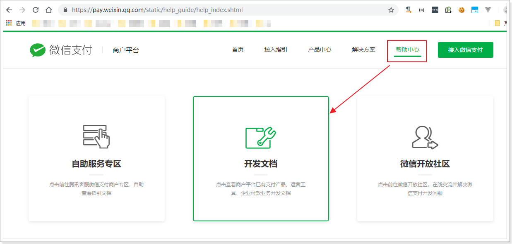

我们选择开发文档，而后进入选择页面：

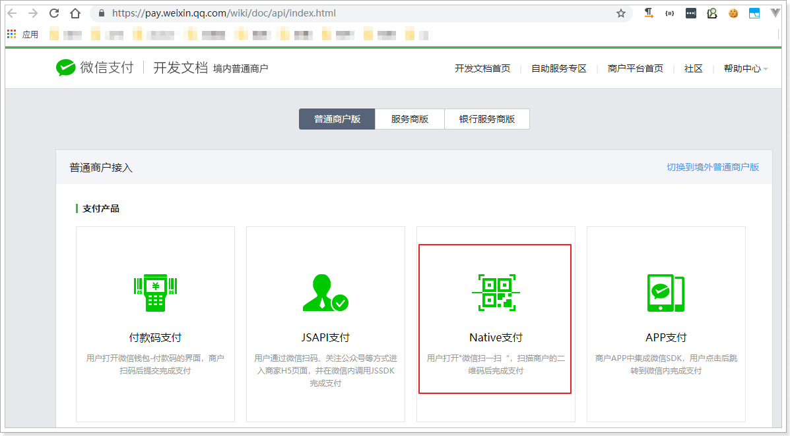

选择native支付，就是扫码支付：


此处我们使用模式二来开发：

## 1.2.开发流程

模式二与模式一相比，流程更为简单，不依赖设置的回调支付URL。

商户后台系统先调用微信支付的统一下单接口，微信后台系统返回链接参数code_url；

商户后台系统将code_url值生成二维码图片，用户使用微信客户端扫码后发起支付。

注意：code_url有效期为2小时，过期后扫码不能再发起支付。 

流程图：


这里我们把商户（我们）要做的事情总结一下：

- 1、商户生成订单
- 2、商户调用微信下单接口，获取预交易的链接
- 3、商户将链接生成二维码图片，展示给用户；
- 4、支付结果通知：
  - 微信异步通知商户支付结果，商户告知微信支付接收情况
  - 商户如果没有收到通知，可以调用接口，查询支付状态
- 5、如果支付成功，发货，修改订单状态


在前面的业务中，我们已经完成了：

- 1、生成订单

接下来，我们需要做的是：

- 2、调用微信下单接口，生成支付交易链接。
- 3、根据链接生成二维码图片
- 4、接收到支付成功通知后，修改订单状态，如果没收到通知，也可以主动查询


# 2.统一下单（生成支付链接）

按照上面的步骤分析，第一步是要生成支付链接。我们查看下微信官方文档

## 2.1.API说明

在微信支付文档中，可以查询到下面的信息：

> 请求路径

POST，URL地址：https://api.mch.weixin.qq.com/pay/unifiedorder


> 请求参数

| 字段名     | 变量名           | 必填 | 类型        | 示例值                                 | 描述                                                         |
| :--------- | ---------------- | ---- | ----------- | -------------------------------------- | ------------------------------------------------------------ |
| 公众账号ID | appid            | 是   | String(32)  | wxd678efh56                            | 微信支付分配的公众账号ID                                     |
| 商户号     | mch_id           | 是   | String(32)  | 1230000109                             | 微信支付分配的商户号                                         |
| 随机字符串 | nonce_str        | 是   | String(32)  | 5K8264ILT                              | 随机字符串，长度要求在32位以内。推荐[随机数生成算法](https://pay.weixin.qq.com/wiki/doc/api/native.php?chapter=4_3) |
| 签名       | sign             | 是   | String(32)  | C380BEC2B                              | 通过签名算法计算得出的签名值，详见[签名生成算法](https://pay.weixin.qq.com/wiki/doc/api/native.php?chapter=4_3) |
| 商品描述   | body             | 是   | String(128) | 乐优手机                               | 商品简单描述，该字段请按照规范传递，具体请见[参数规定](https://pay.weixin.qq.com/wiki/doc/api/native.php?chapter=4_2) |
| 商户订单号 | out_trade_no     | 是   | String(32)  | 20150806125                            | 商户系统内部订单号，要求32个字符内，只能是数字、大小写字母_-\|* 且在同一个商户号下唯一。详见[商户订单号](https://pay.weixin.qq.com/wiki/doc/api/native.php?chapter=4_2) |
| 标价金额   | total_fee        | 是   | Int         | 88                                     | 订单总金额，单位为分，详见[支付金额](https://pay.weixin.qq.com/wiki/doc/api/native.php?chapter=4_2) |
| 终端IP     | spbill_create_ip | 是   | String(16)  | 123.12.12.123                          | APP和网页支付提交用户端ip，Native支付填调用微信支付API的机器IP。 |
| 通知地址   | notify_url       | 是   | String(256) | http://www.weixin.qq.com/wxpay/pay.php | 异步接收微信支付结果通知的回调地址，通知url必须为外网可访问的url，不能携带参数。 |
| 交易类型   | trade_type       | 是   | String(16)  | NATIVE                                 | JSAPI 公众号支付；NATIVE 扫码支付；APP APP支付说明详见[参数规定](https://pay.weixin.qq.com/wiki/doc/api/native.php?chapter=4_2) |

这些参数大致分成3类：

- appid、mch_id、spbill_create_ip、notify_url、trade_type：是商家自己的信息或固定数据，可以提前配置，因此无需每次请求单独配置，而是统一设置好即可，

- nonce_str、sign：是为了保证数据安全而添加的验证数据，根据算法去生成，每次请求自动生成即可。

- body、out_trade_no、total_fee：订单相关信息，需要我们自己填写。


## 2.2.微信SDK

### 2.2.1.下载

虽然请求参数比较复杂，但官方已经提供了SDK，供我们使用：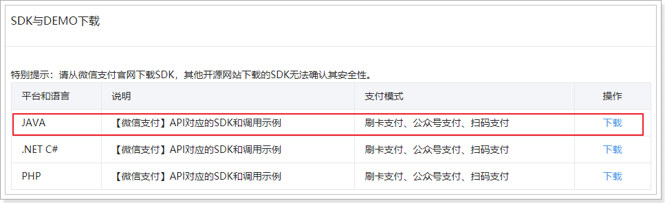

我也已经在课前资料提供：

 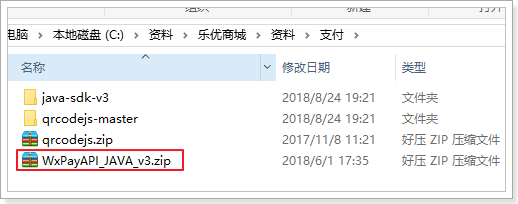

微信没有提供maven仓库坐标，因此我们必须下载使用，建议使用课前资料中，我提供给大家的SDK，其中做了一些必要的设置：

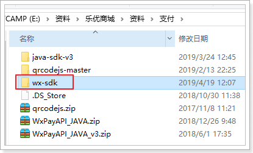 

### 2.2.2.WXPay工具

微信SDK提供了一个统一的微信支付工具类：WXPay：

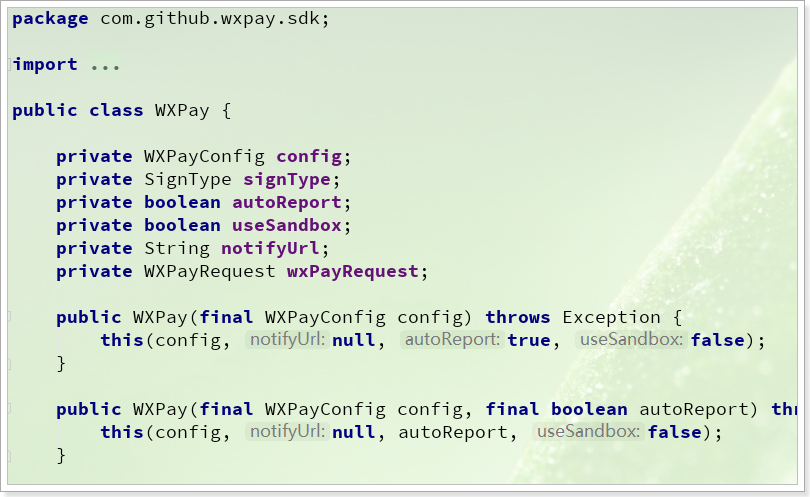

其中包含这样一些方法：

com.github.wxpay.sdk.WXPay类下提供了对应的方法：

| 方法名           | 说明             |
| ---------------- | ---------------- |
| microPay         | 刷卡支付         |
| `unifiedOrder`   | **统一下单**     |
| orderQuery       | 查询订单         |
| reverse          | 撤销订单         |
| closeOrder       | 关闭订单         |
| refund           | 申请退款         |
| refundQuery      | 查询退款         |
| downloadBill     | 下载对账单       |
| report           | 交易保障         |
| shortUrl         | 转换短链接       |
| authCodeToOpenid | 授权码查询openid |

- 注意:
  - 参数为`Map<String, String>`对象，返回类型也是`Map<String, String>`
  - 方法内部会将参数转换成含有`appid`、`mch_id`、`nonce_str`、`sign_type`和`sign`的XML
  - 通过HTTPS请求得到返回数据后会对其做必要的处理（例如验证签名，签名错误则抛出异常）

我们主要关注其中的unifiedOrder方法，统一下单：

```java
/**
     * 作用：统一下单<br>
     * 场景：公共号支付、扫码支付、APP支付
     * @param reqData 向wxpay post的请求数据
     * @return API返回数据
     * @throws Exception
     */
public Map<String, String> unifiedOrder(Map<String, String> reqData) throws Exception {
    return this.unifiedOrder(reqData, config.getHttpConnectTimeoutMs(), this.config.getHttpReadTimeoutMs());
}
```

这里的请求参数是：Map<String, String> reqData，就是官方API说明中的请求参数了，不过并不需要我们填写所有参数，而只需要下面的：

- body：商品描述
- out_trade_no：订单编号
- total_fee：订单应支付金额
- spbill_create_ip：设备IP
- notify_url：回调地址
- trade_type：交易类型

剩下的：`appid`、`mch_id`、`nonce_str`、`sign_type`和`sign`参数都有WXPay对象帮我们设置，那么问题来了：这些参数数据WXPay是怎么拿到的呢？

其中，

- nonce_str：是随机字符串，因此由WXPay随机生成，
- sign_type：是签名算法，由WXPay指定，默认是HMACSHA256；
- sign：是签名，有签名算法结合密钥加密而来，因此这里的关键是密钥：key
- appid、mch_id是商家信息，需要配置

也就是说，这例需要配置的包括：appid、mch_id、密钥key。这些从哪里来呢？

看下WXPay的构造函数：

```java
public WXPay(final WXPayConfig config) throws Exception {
    this(config, null, true, false);
}
```

这里需要一个WXPayConfig对象，显然是配置对象。


### 2.2.3..WXPayConfig配置

WXPay依赖于WXPayConfig进行配置，那么WXPayConfig是什么呢？

看下源码中的关键部分：

```java
public abstract class WXPayConfig {
    /**
     * 获取 App ID
     *
     * @return App ID
     */
    abstract String getAppID();
    /**
     * 获取 Mch ID
     *
     * @return Mch ID
     */
    abstract String getMchID();
    /**
     * 获取 API 密钥
     *
     * @return API密钥
     */
    abstract String getKey();
    
    // 。。。省略
}
```

这不就是WXPay中需要配置的3个属性嘛，当我们实现这个类，并且给出其中的值，把WXPayConfig传递给WXPay时，WXPay就会获取到这些数据:

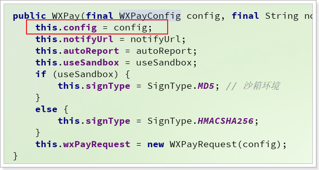 

当我们利用WXPay发送请求时，WXPay就会帮我们封装到请求参数中：

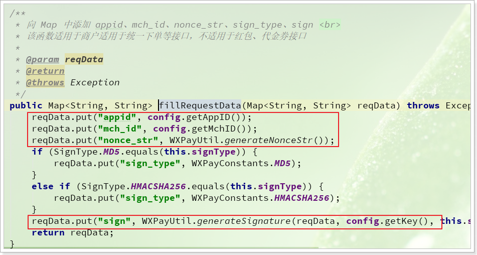


而在我提供给大家的SDK中，就编写了一个WXPayConfig的实现：

```java
package com.github.wxpay.sdk;

import lombok.Data;

import java.io.InputStream;

/**

 */
@Data
public class WXPayConfigImpl extends WXPayConfig {
    /**
     * 公众账号ID
     */
    private String appID;
    /**
     * 商户号
     */
    private String mchID;
    /**
     * 生成签名的密钥
     */
    private String key;
    /**
     * 支付回调地址
     */
    private String notifyUrl;
    /**
     * 终端IP，当前微服务IP
     */
    private String spbillCreateIp;

    public InputStream getCertStream(){
        return null;
    }

    public IWXPayDomain getWXPayDomain(){
        return WXPayDomainSimpleImpl.instance();
    }
}
```

这个WxPayConfig的实现类中，不仅有刚才看到的3个参数，而且还把请求参数中的：notifyUrl、spbillCreateIp都配置进去了，因为这几个值也都是需要配置到配置文件中的。


## 2.3.整合到项目中

### 2.3.1.打包SDK

首先，把我提供的SDK打包并安装到本地的maven仓库，方便在项目中使用。

进入我提供的SDK的项目目录，然后打开黑窗口，输入命令：

```
mvn source:jar install -Dmaven.test.skip=true
```

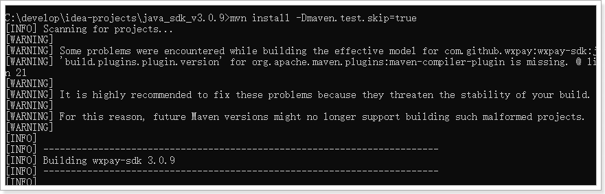

然后进入本地仓库查看：

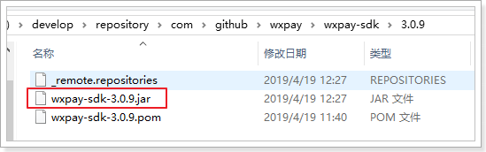 


### 2.3.2.配置WXPay

在在`ly-trade`的中的pom.xml中引入坐标：

```xml
<dependency>
    <groupId>com.github.wxpay</groupId>
    <artifactId>wxpay-sdk</artifactId>
    <version>3.0.9</version>
</dependency>
```


我们将这些WXPayConfig中的属性定义到`ly-trade`的application.yml中

```yaml
ly:
  pay:
    wx:
      appID: wx8397f8696b538317
      mchID: 1473426802
      key: T6m9iK73b0kn9g5v426MKfHQH7X8rKwb
      notifyUrl: http://api.leyou.com/trade/pay/wx/notify
      spbillCreateIp: 123.12.12.123
```

将这些属性注入到`WXPayConfigImpl`中，在`ly-trade`的`com.leyou.trade.config`包中添加一个配置类`PayConfiguration`，将`WXPayConfigImpl`配置为一个Bean，并注入相关属性：

```java
package com.leyou.trade.config;

import com.github.wxpay.sdk.WXPayConfigImpl;
import org.springframework.boot.context.properties.ConfigurationProperties;
import org.springframework.context.annotation.Bean;
import org.springframework.context.annotation.Configuration;

@Configuration
public class PayConfiguration {

    @Bean
    @ConfigurationProperties(prefix = "ly.pay.wx")
    public WXPayConfigImpl payConfig(){
        return new WXPayConfigImpl();
    }
}
```


### 2.3.4.支付工具类

我们先初始化WXPay对象，并注入到Spring容器中.

在`ly-trade`的`com.leyou.trade.config`包中的配置类`PayConfiguration`中添加一个@Bean，注册`WXPay`对象：

```java
package com.leyou.trade.config;

import com.github.wxpay.sdk.WXPay;
import com.github.wxpay.sdk.WXPayConfigImpl;
import org.springframework.boot.context.properties.ConfigurationProperties;
import org.springframework.context.annotation.Bean;
import org.springframework.context.annotation.Configuration;

@Configuration
public class PayConfiguration {

    @Bean
    @ConfigurationProperties(prefix = "ly.pay.wx")
    public WXPayConfigImpl payConfig(){
        return new WXPayConfigImpl();
    }

    /**
     * 注册WXPay对象
     * @param payConfig 支付相关配置
     * @return WXPay对象
     * @throws Exception 连结WX失败时用到
     */
    @Bean
    public WXPay wxPay(WXPayConfigImpl payConfig) throws Exception {
        return new WXPay(payConfig, payConfig.getNotifyUrl());
    }
}
```


我们要把统一下单的代码封装为一个工具类，不过其中又很多字符串常量，需要定义出来，我们在`ly-trade`的`com.leyou.trade.constants`包中，添加一个常量类：

```java
package com.leyou.trade.constants;


public abstract class PayConstants {
    /**
     * 统一的商品描述
     */
    public static final String ORDER_DESC = "乐优商城商品";
    /**
     * 统一下单支付的支付类型
     */
    public static final String UNIFIED_ORDER_TRADE_TYPE = "NATIVE";
    /**
     * 失败的CODE
     */
    public static final String FAIL = "FAIL";
    /**
     * 通信标示的KEY
     */
    public static final String RETURN_CODE_KEY = "return_code";
    /**
     * 业务标示的KEY
     */
    public static final String RESULT_CODE_KEY = "result_code";
    /**
     * 异常消息的KEY
     */
    public static final String ERROR_CODE_KEY = "err_code_des";
    /**
     * 订单编号的KEY
     */
    public static final String ORDER_NO_KEY = "out_trade_no";
    /**
     * 支付金额的KEY
     */
    public static final String TOTAL_FEE_KEY = "total_fee";
    /**
     * 支付链接的KEY
     */
    public static final String PAY_URL_KEY = "code_url";

}
```


然后在`ly-trade`的`com.leyou.trade.utils`包中添加一个工具类`PayHelper`，

```java
package com.leyou.trade.utils;

import com.github.wxpay.sdk.WXPay;
import com.github.wxpay.sdk.WXPayConfigImpl;
import lombok.extern.slf4j.Slf4j;
import org.apache.commons.lang3.StringUtils;
import org.springframework.stereotype.Component;

import java.util.HashMap;
import java.util.Map;


@Slf4j
@Component
public class PayHelper {

    private final WXPay wxPay;
    private final WXPayConfigImpl payConfig;

    public PayHelper(WXPay wxPay, WXPayConfigImpl payConfig) {
        this.wxPay = wxPay;
        this.payConfig = payConfig;
    }

    public String getPayUrl(Long orderId, Long totalFee, String desc){
        // 1.准备请求参数：
        Map<String, String> data = new HashMap<String, String>();
        data.put("body", desc);
        data.put("out_trade_no", orderId.toString());
        data.put("total_fee", totalFee.toString());
        data.put("spbill_create_ip", payConfig.getSpbillCreateIp());
        data.put("trade_type", payConfig.getTradeType());  // 此处指定为扫码支付

        try {
            // 2.下单
            Map<String, String> resp = wxPay.unifiedOrder(data);

            // 3.通信校验
            checkReturnCode(resp);
            // 4.业务校验
            checkResultCode(resp);
            // 5.签名校验
            checkResponseSignature(resp);

            // 6.获取支付链接
            String url = resp.get("code_url");
            if(StringUtils.isBlank(url)){
                // url为空
                throw new RuntimeException("支付链接为空！");
            }
            return url;
        } catch (Exception e) {
            log.error("微信支付统一下单失败，原因：", e.getMessage());
            throw new RuntimeException(e);
        }
    }

    public void checkResponseSignature(Map<String, String> resp){
        try {
            boolean isValid = wxPay.isResponseSignatureValid(resp);
            if(!isValid){
                // 签名无效
                throw new RuntimeException("签名错误！");
            }
        } catch (Exception e) {
            throw new RuntimeException("签名错误！", e);
        }
    }

    public void checkResultCode(Map<String, String> resp) {
        String resultCode = resp.get("result_code");
        if("FAIL".equals(resultCode)){
            // 失败
            throw new RuntimeException(resp.get("err_code_des"));
        }
    }

    public void checkReturnCode(Map<String, String> resp) {
        String returnCode = resp.get("return_code");
        if("FAIL".equals(returnCode)){
            // 失败
            throw new RuntimeException("通信失败！");
        }
    }
}

```


## 2.4.下单并生成支付链接

在订单支付页面，会向后台发起请求，查询支付的URL地址：

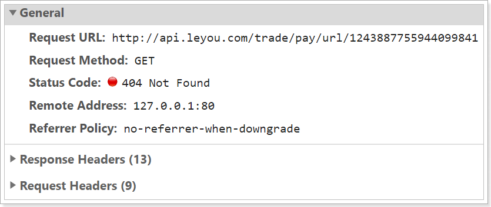 

我们需要编写controller，来实现这个功能：

- 请求方式：GET
- 请求路径：/pay/url/{id}
- 请求参数：id，订单的编号
- 返回结果：url地址

我们在`ly-trade`的`com.leyou.trade.web`包中创建一个`PayController`接口

```java
package com.leyou.trade.web;

import com.leyou.trade.service.OrderService;
import org.springframework.http.ResponseEntity;
import org.springframework.web.bind.annotation.GetMapping;
import org.springframework.web.bind.annotation.PathVariable;
import org.springframework.web.bind.annotation.RequestMapping;
import org.springframework.web.bind.annotation.RestController;


@RestController
@RequestMapping("pay")
public class PayController {

    private final OrderService orderService;

    public PayController(OrderService orderService) {
        this.orderService = orderService;
    }

    /**
     * 根据订单编号创建支付链接
     * @param orderId 订单编号
     * @return 支付链接
     */
    @GetMapping("/url/{id}")
    public ResponseEntity<String> getPayUrl(@PathVariable("id") Long orderId) {
        return ResponseEntity.ok(orderService.getPayUrl(orderId));
    }
}

```


我们在ly-trade的`com.leyou.trade.service`包的`OrderService`中添加方法：

```java
String getPayUrl(Long orderId);
```


我们在ly-trade的`com.leyou.trade.service.impl`包的`OrderServiceImpl`中添加方法：

```java
 @Override
    public String getPayUrl(Long orderId) {
        // 根据id查询订单
        Order order = getById(orderId);
        // 判断是否存在
        if (order == null) {
            throw new LyException(400, "订单编号错误，订单不存在！");
        }
        // 判断订单状态是否是未付款
        if (order.getStatus() != OrderStatus.INIT) {
            // 订单已经关闭或者已经支付，无需再次获取支付链接
            throw new LyException(400, "订单已经支付或者关闭！");
        }
        // TODO 尝试读取redis中的支付url

        // 获取订单金额
        Long actualFee = order.getActualFee();
        // 统一下单，获取支付链接
        String url = payHelper.getPayUrl(orderId, 1L/*actualFee*/, PayConstants.ORDER_DESC);


        // TODO 把支付的url缓存在redis中，2小时有效期

        // 返回支付链接
        return url;
    }
```

页面响应结果：

 


# 3.生成支付二维码（了解）

## 3.1.什么是二维码

二维码又称QR Code，QR全称Quick Response，是一个近几年来移动设备上超流行的一种编码方式，它比传统的Bar Code条形码能存更多的信息，也能表示更多的数据类型。

二维条码/二维码（2-dimensional bar code）是用某种特定的几何图形按一定规律在平面（二维方向上）分布的黑白相间的图形记录数据符号信息的；在代码编制上巧妙地利用构成计算机内部逻辑基础的“0”、“1”比特流的概念，使用若干个与二进制相对应的几何形体来表示文字数值信息，通过图象输入设备或光电扫描设备自动识读以实现信息自动处理：它具有条码技术的一些共性：每种码制有其特定的字符集；每个字符占有一定的宽度；具有一定的校验功能等。同时还具有对不同行的信息自动识别功能、及处理图形旋转变化点。

## 3.2.二维码优势

- 信息容量大, 可以容纳多达1850个大写字母或2710个数字或500多个汉字

- 应用范围广, 支持文字,声音,图片,指纹等等...

- 容错能力强, 即使图片出现部分破损也能使用

- 成本低, 容易制作

## 3.3.二维码容错级别

- L级（低） 7％的码字可以被恢复。

- M级（中） 15％的码字可以被恢复。

- Q级（四分）25％的码字可以被恢复。

- H级（高）30％ 的码字可以被恢复。

## 3.4.二维码生成插件qrious

qrious是一款基于HTML5 Canvas的纯JS二维码生成插件。通过qrious.js可以快速生成各种二维码，你可以控制二维码的尺寸颜色，还可以将生成的二维码进行Base64编码。[官网](https://github.com/davidshimjs/qrcodejs)

qrious.js二维码插件的可用配置参数如下：

| 参数       | 类型   | 默认值      | 描述                               |
| ---------- | ------ | ----------- | ---------------------------------- |
| background | String | "white"     | 二维码的背景颜色。                 |
| foreground | String | "black"     | 二维码的前景颜色。                 |
| level      | String | "L"         | 二维码的误差校正级别(L, M, Q, H)。 |
| mime       | String | "image/png" | 二维码输出为图片时的MIME类型。     |
| size       | Number | 100         | 二维码的尺寸，单位像素。           |
| value      | String | ""          | 需要编码为二维码的值               |

课前资料中给出的案例可以直接生成二维码：

 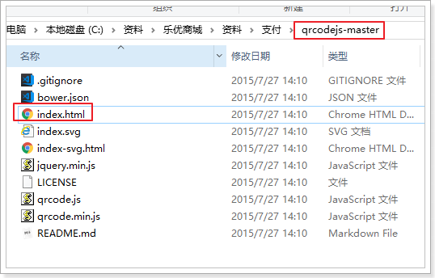

点击打开：

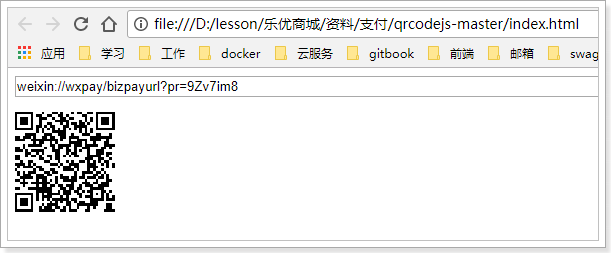 

## 3.5.生成二维码

我们的前端页面已经引用了这个JS组件：

 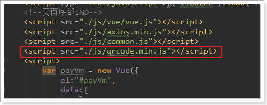

页面定义一个div，用于展示二维码：

 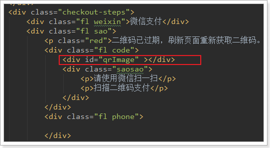

然后获取到付款链接后，根据链接生成二维码：

 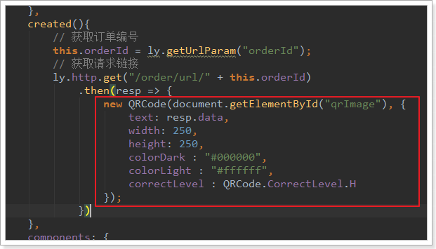


刷新页面，查看效果：

 

此时，客户用手机扫描二维码，可以看到付款页面。


# 4.支付结果通知

支付以后，我们后台需要修改订单状态。我们怎么得知有没有支付成功呢？

在我们的请求参数中，有一个notify_url的参数，是支付的回调地址。当用户支付成功后，微信会主动访问这个地址，并携带支付结果信息。

那么，这个notify_url该怎么用呢？


## 4.1.notify_url

### 1）什么是notify_url

参数中有一个非常重要的，叫做notify_url的：


基于上文的介绍我们知道，这个地址是在支付成功后的异步结果通知。官网介绍如下：

支付完成后，微信会把相关支付结果和用户信息发送给商户，商户需要接收处理，并返回应答。

所以，此处的地址必须是一个外网可访问地址，而且我们要定义好回调的处理接口。

http://api.leyou.com/trade/pay/wx/notify


### 2）内网穿透

此处我们肯定不能写：http://api.leyou.com，这个域名未经备案，是不被识别的。如何才能获取一个能够外网访问的域名呢？

我们可以通过内网穿透来实现，那么什么是内网穿透呢？

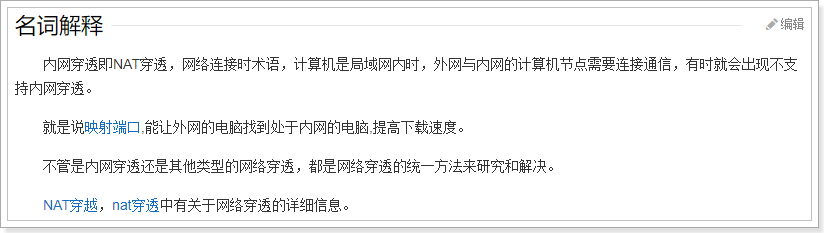

**简单来说内网穿透的目的是：让外网能访问你本地的应用，例如在外网打开你本地http://127.0.0.1指向的Web站点。**


这里我们使用一个免费的内网穿透工具：Natapp：[NATAPP官网](https://natapp.cn)


详细教程在这里：[一分钟的natapp快速新手教程](https://natapp.cn/article/natapp_newbie)

启动后的样子：

 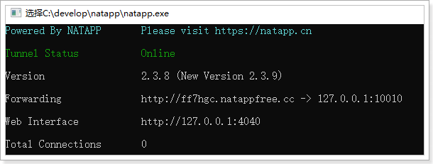

比如此处，我使用的natapp得到的域名是：http://ff7hgc.natappfree.cc，并且我设置指向到`127.0.0.1:10010`位置，也就是我的网关服务。


### 3）配置回调地址

设置内网穿透地址到配置文件application.yml：

```yaml
ly:
  pay:
    wx:
      notifyUrl: http://ff7hgc.natappfree.cc/trade/pay/wx/notify
```

WxPayConfigImpl中本来就有notifyURL属性，因此会被自动注入。

### 4）用户拦截器放行

请求进入ly-trade以后，会有一个用户拦截器，尝试获取登录用户，但是微信回调肯定是未登录的，需要放行。

修改application.yml，加入一个放行路径即可：

```yaml
ly:
  auth:
    clientId: trade-service
    secret: 1234
    excludeFilterPaths:
    - /pay/wx/notify
```


## 4.2.支付结果通知API

来看官网关于结果通知的介绍：https://pay.weixin.qq.com/wiki/doc/api/native.php?chapter=9_7&index=8

> 应用场景

支付完成后，微信会把相关支付结果和用户信息发送给商户，商户需要接收处理，并返回应答。

对后台通知交互时，如果微信收到商户的应答不是成功或超时，微信认为通知失败，微信会通过一定的策略定期重新发起通知，尽可能提高通知的成功率，但微信不保证通知最终能成功。 （通知频率为15/15/30/180/1800/1800/1800/1800/3600，单位：秒）

**注意：同样的通知可能会多次发送给商户系统。商户系统必须能够正确处理重复的通知。**

推荐的做法是，当收到通知进行处理时，首先检查对应业务数据的状态，判断该通知是否已经处理过，如果没有处理过再进行处理，如果处理过直接返回结果成功。在对业务数据进行状态检查和处理之前，要采用数据锁进行并发控制，以避免函数重入造成的数据混乱。

**特别提醒：商户系统对于支付结果通知的内容一定要做`签名验证,并校验返回的订单金额是否与商户侧的订单金额一致`，防止数据泄漏导致出现“假通知”，造成资金损失。**


支付完成后，微信服务会自动向`notify_url`地址发起POST请求，请求参数是xml格式：

| 字段名     | 变量名      | 必填 | 类型        | 示例值  | 描述                                                         |
| ---------- | ----------- | ---- | ----------- | ------- | ------------------------------------------------------------ |
| 返回状态码 | return_code | 是   | String(16)  | SUCCESS | SUCCESS/FAIL此字段是通信标识，非交易标识，交易是否成功需要查看trade_state来判断 |
| 返回信息   | return_msg  | 是   | String(128) | OK      | 当return_code为FAIL时返回信息为错误原因 ，例如签名失败参数格式校验错误 |

通信成功，会返回下面信息：

| 签名           | sign           | 是   | String(32)  | C380BEC2BFD.. | 名，详见[签名算法](https://pay.weixin.qq.com/wiki/doc/api/native.php?chapter=4_3) |
| -------------- | -------------- | ---- | ----------- | ------------- | ------------------------------------------------------------ |
| 签名类型       | sign_type      | 否   | String(32)  | HMAC-SHA256   | 签名类型，目前支持HMAC-SHA256和MD5，默认为MD5                |
| 业务结果       | result_code    | 是   | String(16)  | SUCCESS       | SUCCESS/FAIL                                                 |
| 错误代码       | err_code       | 否   | String(32)  | SYSTEMERROR   | 错误返回的信息描述                                           |
| 错误代码描述   | err_code_des   | 否   | String(128) | 系统错误      | 错误返回的信息描述                                           |
| 用户标识       | openid         | 是   | String(128) | wxd930ea54f   | 用户在商户appid下的唯一标识                                  |
| 交易类型       | trade_type     | 是   | String(16)  | JSAPI         | JSAPI、NATIVE、APP                                           |
| 订单金额       | total_fee      | 是   | Int         | 100           | 订单总金额，单位为分                                         |
| 现金支付金额   | cash_fee       | 是   | Int         | 100           | 现金支付金额订单现金支付金额，详见[支付金额](https://pay.weixin.qq.com/wiki/doc/api/native.php?chapter=4_2) |
| 微信支付订单号 | transaction_id | 是   | String(32)  | 121775250120  | 微信支付订单号                                               |
| 商户订单号     | out_trade_no   | 是   | String(32)  | 12123212112   | 商户系统内部订单号，要求32个字符内，只能是数字、大小写字母_-\|*@ ，且在同一个商户号下唯一。 |

我们需要返回给微信的结果：

```xml
<xml>
  <return_code><![CDATA[SUCCESS]]></return_code>
  <return_msg><![CDATA[OK]]></return_msg>
</xml>
```


## 4.3.编写回调接口


### 4.3.1.回调接口分析

先分析接口需要的四个数据：

- 请求方式：官方文档虽然没有明说，但是测试得出是POST请求

- 请求路径：我们之前指定的notify_url的路径是：/pay/wx/notify

- 请求参数：是xml格式数据，包括支付的结果和状态

- 返回结果：也是xml，表明是否成功，格式如下：

  - ```xml
    <xml>
      <return_code>SUCCESS></return_code>
      <return_msg>OK</return_msg>
    </xml>
    ```


### 4.3.2.返回值类型

返回结果需要定义一个DTO表示，我们在`com.leyou.trade.dto`包中定义：

```java
package com.leyou.trade.dto;

import lombok.Data;


@Data
public class PayResultDTO {
    private String returnCode = "SUCCESS";
    private String returnMsg = "OK";
}

```


因为要接收xml格式数据，因此我们需要引入解析xml的依赖，在`ly-trade`的pom.xml中添加依赖：

```xml
<dependency>
    <groupId>com.fasterxml.jackson.dataformat</groupId>
    <artifactId>jackson-dataformat-xml</artifactId>
</dependency>
```


不过，DTO在转换为xml时，标签名需要通过注解方式来指定，因此实体类需要修改：

```java
package com.leyou.trade.dto;

import com.fasterxml.jackson.dataformat.xml.annotation.JacksonXmlProperty;
import com.fasterxml.jackson.dataformat.xml.annotation.JacksonXmlRootElement;
import lombok.Data;


@Data
@JacksonXmlRootElement(localName = "xml")
public class PayResultDTO {
    @JacksonXmlProperty(localName = "return_code")
    private String returnCode = "SUCCESS";
    @JacksonXmlProperty(localName = "return_msg")
    private String returnMsg = "OK";
}
```

注解说明：

- `@JacksonXmlRootElement(localName = "xml")`：指定生成xml的根标签
- `@JacksonXmlProperty(localName = "return_code")`：指定某个字段对应的标签


### 4.3.3.业务代码

然后在`ly-trade`的`com.leyou.trade.web`包中的`PayController`中编写回调接口：

```java
/**
     * 处理微信的异步通知
     * @param data 通知内容
     * @return 处理结果
     */
@PostMapping(value = "/wx/notify", produces = MediaType.APPLICATION_XML_VALUE)
public ResponseEntity<PayResultDTO> handleWxNotify(@RequestBody Map<String,String> data){
    orderService.handleNotify(data);
    return ResponseEntity.ok(new PayResultDTO());
}
```


我们在ly-trade的`com.leyou.trade.service`包的`OrderService`中添加方法：

```java
void handleNotify(Map<String, String> data);
```


我们在ly-trade的`com.leyou.trade.service.impl`包的`OrderServiceImpl`中添加方法：

service中需要完成下列代码；

- 业务标示判断

- 签名校验
- 数据校验
  - 订单号码校验
  - 订单金额校验
- 更新订单状态（需要保证幂等）

```java
 @Transactional
    public void handleNotify(Map<String, String> data) {
        // 1.业务标示校验
        payHelper.checkResultCode(data);
        // 2.签名校验
        payHelper.checkResponseSignature(data);

        // 3.订单状态校验（保证幂等，防止重复通知）
        String outTradeNo = data.get(ORDER_NO_KEY);
        String totalFee = data.get(TOTAL_FEE_KEY);
        if (StringUtils.isBlank(outTradeNo) || StringUtils.isBlank(totalFee)) {
            // 数据有误
            throw new RuntimeException("响应数据有误，订单金额或编号为空！");
        }
        Long orderId = Long.valueOf(outTradeNo);
        Order order = getById(orderId);
        if (!order.getStatus().equals(OrderStatus.INIT)) {
            // 说明订单已经支付过了，属于重复通知，直接返回
            return;
        }

        // 4.订单金额校验
        Long total = Long.valueOf(totalFee);
        if (!total.equals(1L/*order.getActualFee()*/)) {
            throw new RuntimeException("订单金额有误，我要报警了！");
        }

        // 5.修改订单状态，更新状态和支付时间两个字段
        update().set("status", OrderStatus.PAY_UP.getValue()).set("pay_time", new Date())
                // 条件包括订单id和订单状态必须为1，乐观锁保证幂等
                .eq("order_id", orderId).eq("status", OrderStatus.INIT.getValue()).update();
        log.info("处理微信支付通知成功！{}", data);
    }
```


# 5.支付状态查询

当用户扫码支付成功，会自动调用回调接口，从而修改订单状态，完成订单支付。

但是，页面上并不知道支付是否成功。怎么办？

- 浏览器端主动查询支付状态
  - 短轮询
- 服务端通知浏览器端
  - SeverSentEvent
  - WebSocket


## 5.1.页面查询支付状态

因为不知道用户什么时候会支付，也不知道支付有没有成功，因此页面会采用定时任务，不断查询订单支付的状态：

```js
// 开启定时任务，查询付款状态
const taskId = setInterval(() => {
    ly.http.get("/trade/order/status/" + id)
        .then(resp => {
        let i = resp.data;
        if (i !== 1) {
            // 付款成功
            clearInterval(taskId);
            // 跳转到付款成功页
            location.href = "/paysuccess.html?orderId=" + id;
        }
    }).catch((e) => {
        alert("支付状态查询失败，请刷新页面重试。");
        clearInterval(taskId);
    })
}, 3000);
```

每隔3秒就会查询一次支付状态。


## 5.2.支付状态查询接口

上面的查询请求 分析：

- 请求方式：Get
- 请求路径 ：/order/status/{id}
- 请求参数：订单id
- 返回结果：1或者其它，1代表未支付，其它是已经支付

在`ly-trade`的`com.leyou.trade.web`包中的`OrderController`中添加一个方法：

```java
/**
     * 查询订单支付状态
     * @param orderId 订单id
     * @return 状态值
     */
@GetMapping("/status/{id}")
public ResponseEntity<Integer> queryOrderState(@PathVariable("id") Long orderId){
    return ResponseEntity.ok(orderService.queryOrderState(orderId));
}
```

我们在ly-trade的`com.leyou.trade.service`包的`OrderService`中添加方法：

```java
Integer queryOrderState(Long orderId);
```


我们在ly-trade的`com.leyou.trade.service.impl`包的`OrderServiceImpl`中添加方法：

service中需要完成下列代码；

```java
@Override
public Integer queryOrderState(Long orderId) {
    // 查询订单
    Order order = getById(orderId);
    // 判断是否存在
    if (order == null) {
        throw new LyException(400, "订单不存在！");
    }
    return order.getStatus().getValue();
}
```


## 5.3.主动查询订单支付状态（作业）

如果用户一直未支付，一直等待和查询不太合适。因此我们又添加了一个定时任务：

```javascript
// 同时设置一个定时任务，5分钟后，去微信主动查询支付结果，如果依然失败，终止查询，认为付款失败
setTimeout(() => {
    // 清除之前的定时任务
    clearInterval(taskId);
    // 主动查询订单状态
    ly.http.get("/trade/pay/status/" + id)
        .then(resp => {
        let i = resp.data;
        // i是返回的状态，1代表未支付、2代表已支付、3代表支付失败
        if(i !== 2){
            // 未支付或者支付失败，跳转到失败页
            location.href = "/payfail.html?orderId=" + id;
        }
        // 已经支付，跳转到支付成功页面
        location.href = "/paysuccess.html?orderId=" + id;
    })
        .catch(err => {
        location.href = "/payfail.html?orderId=" + id;
    })
}, 300000)
```

这个定时任务会在5分钟后执行，如果5分钟后用户依然未支付，则主动发请求查询订单状态，这次的查询需要到微信服务端查询，大家可以尝试自己完成。

