# 0.学习目标

- 了解Java的DelayQueue原理
- 理解Redis实现延迟队列原理
- 理解RabbitMQ死信队列原理
- 能实现清理订单业务


# 1.业务需求

之前我们讨论过扣减库存的问题，下单减库存和支付减库存各自有一定的优势和缺陷，我们选择了下单减库存的方案。

订单创建之后，就会扣减库存，并且生成了支付的二维码，但是如果用户一直不支付，就会导致商品库存被占用，而不能形成有效交易，会损害商家的利益，流失真正的具有购买意向的客户。

因此，如果有客户下单超过一定的时间没有付款，我们必须关闭订单，释放库存。


那么问题来了，我们如何得知哪些订单时超时未支付的订单呢？


订单下单后，需要等待一段时间后再判断是否支付，到底是关闭还是继续。这样的延时执行的业务，称为**延时任务**。


# 2.延迟队列

与延时关闭订单这样的业务类似，还有很多需要延时执行的任务，例如：

- 订餐通知:下单成功后60s之后给用户发送短信通知。
- 当订单一直处于未支付状态时，如何及时的关闭订单，并退还库存？
- 如何定期检查处于退款状态的订单是否已经退款成功？
- 新创建店铺，N天内没有上传商品，系统如何知道该信息，并发送激活短信？

而解决这一类**延时任务**问题，一般都会通过**延迟队列**来解决

## 2.1.什么是延迟队列

延迟队列，首先是队列，例如我们学习的MQ，是消息队列，也就是一个存放消息的容器。延迟队列就是延迟消费的消息队列。队列中存储的是**延时消息**，所谓“**延时消息**”是指当消息被发送以后，并不想让消费者立即拿到消息，而是等待指定时间后，消费者才拿到这个消息进行消费,**(延迟送达)**。

流程如图：

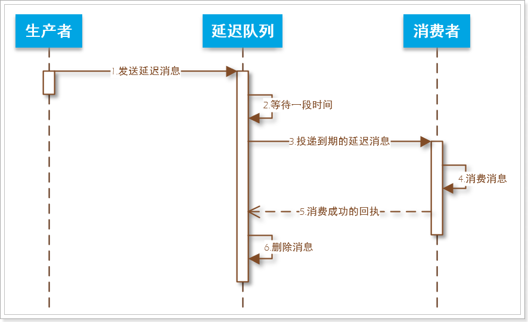


延迟队列不仅仅要实现消息的延迟消费，最好还要满足下面的几点要求：

- 可靠性：消息进入到延迟队列后， 保证至少被消费⼀一次。

- 高可用性：至少得支持多实例部署。挂掉一 个实例后，还有后备实例继续提供服务。

- 实时性：允许存在一定的时间误差，希望在秒级。

- 支持消息删除：业务使用方，可以随时删除指定消息。


目前比较常见的方案包括：

- **定期轮询数据库**
- **DelayQueue**
- **定时任务（Quartz）**
- **Redis键过期通知**
- **Redis(sorted_set)** 
- **时间轮**
- **RabbitMQ 死信队列**


我们以**清理超时未支付订单**为例，来看看这几种实现方案，我们假设需要清理超过半小时未支付的订单。


## 2.2.定期轮询数据库

基本思路：开启一个定时任务，每隔一段时间扫描数据库，找到需要清理的订单，然后执行清理订单，恢复库存业务。

- 优点：实现简单，定时任务所在服务可以集群，保证了可靠性，高可用性。 
- 缺点：
  - 定时扫描频率过高`数据库`压力比较大，频率过低则实时性不能保证。
  - 高可用集群时需要保证多个扫描任务的线程安全，避免重复执行任务，可以利用分布式锁、乐观锁、保证接口幂等等各种方式来解决。


## 2.3.DelayQueue

JDK中的java.util.concurrent包中的DelayQueue可以作为单JVM的延迟队列。

要了解DelayQueue的原理，你需要先知道几个接口：

- Comparable：标记一种可比较大小的对象类型
- Delayed：标记在给定延迟之后应该执行的对象


### 2.3.1.Comparable

该接口的实现类必须实现compareTo方法来定义比较大小的规则，并按照规则完成对象的排序。这种顺序称为类的自然顺序，类的compareTo方法称为类的自然比较方法。

例如：Integer类就实现了Comparable：

```java
public final class Integer extends Number implements Comparable<Integer> {
    // ...
    public int compareTo(Integer anotherInteger) {
        return compare(this.value, anotherInteger.value);
    }
    // ...
    public static int compare(int x, int y) {
        return (x < y) ? -1 : ((x == y) ? 0 : 1);
    }
    // ...
}
```

因此Integer的对象可以根据compareTo方法排序，从而实现集合排序这样的功能。


### 2.3.2.Delayed

Delayed一种混合接口，Delayed继承了Comparable，用来标记那些应该在给定延迟时间之后执行的对象。 

```java
package java.util.concurrent;

public interface Delayed extends Comparable<Delayed> {

    /**
     * Returns the remaining delay associated with this object, in the
     * given time unit.
     *
     * @param unit the time unit
     * @return the remaining delay; zero or negative values indicate
     * that the delay has already elapsed
     */
    long getDelay(TimeUnit unit);
}
```

getDelay()方法返回与此对象相关的剩余延迟时间，以给定的时间单位表示，当时间为0时该对象就会被执行。

另外，Delayed继承了Comparable，所以其实现类还要实现compareTo方法，用来对延迟对象排序，一般排序规则就是剩余延时时间


例如我定义一个类型：

```java
package cn.itcast.demo.pojo;

import lombok.Data;

import java.util.concurrent.Delayed;
import java.util.concurrent.TimeUnit;

/**
 * 延时执行的任务， D是任务相关数据
 */
@Data
public class DelayTask<D> implements Delayed {
    /**
     * 任务执行时间，标准时间1970开始的毫秒值
     */
    private long executeTime;
    /**
     * 任务中需要的数据
     */
    private D data;

    public DelayTask(long executeTime, D data) {
        this.executeTime = executeTime;
        this.data = data;
    }

    @Override
    public long getDelay(TimeUnit unit) {
        // 用执行时间减去当前时间，得到剩余时间
        return unit.convert(executeTime - System.currentTimeMillis(), TimeUnit.MICROSECONDS);
    }

    @Override
    public int compareTo(Delayed o) {
        // 比较剩余时间的大小
        return (int) (getDelay(TimeUnit.MILLISECONDS) - o.getDelay(TimeUnit.MILLISECONDS));
    }
}
```

我们定义的DelayTask对象包含两个属性：

- executeTime：延迟任务的执行时间，毫秒值
- data：任务中可能需要的数据，也可以是一个Runnable

并且实现了getDelay方法，方便知道这个任务还有多久执行。

实现了compareTo方法，用于根据剩余时间比较大小


### 2.3.3.DelayQueue

DelayQueue就是延迟队列，底层是一个有序的无界队列（PriorityQueue），元素类型必须是Delayed类型。

```java
public class DelayQueue<E extends Delayed> extends AbstractQueue<E>
    implements BlockingQueue<E> {
    private final PriorityQueue<E> q = new PriorityQueue<E>();
    // ...
}
```


存储在DelayQueue的元素会排序，一般根据getDelay()的结果排序，队首是延迟期（getDelay）最短的元素。

当调用DelayQueue的take()方法获取元素时，会拿到已经到期的元素（getDelay返回0），不过如果没有到期元素，则会阻塞等待（线程休眠）或者返回null。

```java
/**
 * 检索并删除此队列的头，如有必要，将一直等待，直到此队列上有一个具有过期延迟的元素可用为止。
 */
public E take() throws InterruptedException {
    final ReentrantLock lock = this.lock;
    // 获取锁，当线程被休眠时释放锁
    lock.lockInterruptibly();
    try {
        for (;;) {
            // 尝试从队首获取一个元素
            E first = q.peek();
            if (first == null)
                // 如果没有，说明队列为空，则等待，释放锁
                available.await();
            else {
                // 有元素，则获取元素的到期时间
                long delay = first.getDelay(NANOSECONDS);
                if (delay <= 0)
                    // 已经到期，则取出并返回
                    return q.poll();
                // 未到期，置空避免等待时依然持有元素
                first = null; // don't retain ref while waiting
                if (leader != null)
                    // 判断目前是否有其它线程在操作，有则等待
                    available.await();
                else {
                    // 没有，则获取当前线程
                    Thread thisThread = Thread.currentThread();
                    leader = thisThread;
                    try {
                        // 让当前线程休眠至delay到期，避免CPU无用轮询
                        available.awaitNanos(delay);
                    } finally {
                        if (leader == thisThread)
                            leader = null;
                    }
                }
            }
        }
    } finally {
        if (leader == null && q.peek() != null)
            // 如果有元素了，唤醒其它等待中的线程
            available.signal();
        lock.unlock();
    }
}
```


示例代码：

```java
package cn.itcast.demo;

import cn.itcast.demo.pojo.DelayTask;
import lombok.extern.slf4j.Slf4j;
import org.junit.Test;

import java.util.concurrent.DelayQueue;
import java.util.concurrent.ExecutorService;
import java.util.concurrent.Executors;


@Slf4j
public class DelayQueueDemo {

    private ExecutorService es = Executors.newFixedThreadPool(3);
    @Test
    public void testDelayQueue() throws InterruptedException {
        // 创建一个延迟队列
        DelayQueue<DelayTask<String>> queue = new DelayQueue<>();

        // 开始执行任务
        es.submit(() ->{
            while (true){
                try {
                    log.info("尝试获取任务。。。");
                    DelayTask<String> task = queue.take();
                    log.warn("获取到任务{}", task.getData());
                } catch (InterruptedException e) {
                    e.printStackTrace();
                    throw new RuntimeException(e);
                }
            }
        });
        // 开始向队列中添加任务
        es.submit(() -> {
            log.error("开始添加任务。。。");
            for (int i = 1; i <= 1000; i++) {
                queue.add(new DelayTask<String>(System.currentTimeMillis() + 1000 * i, "task_" + i ));
            }
            log.error("任务添加结束。。。");
        });

        // 等待任务执行完毕
        log.info("主函数任务结束。。。");
        Thread.sleep(1000000);
    }
}
```

两个线程任务，一个向队列中添加任务，任务之间时差是1秒，另一个从队列中取任务，结果：

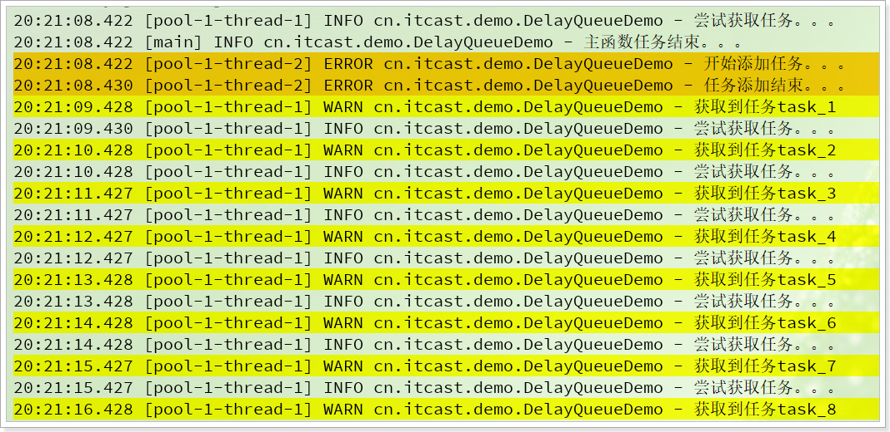


### 2.3.4.优缺点

优点: 

- 不引入其他服务依赖，wait-notify机制，不做polling，不会浪费cpu。
- 时效性好

 缺点: 

- 数据保存在JVM内存中，当应用重启会造成数据丢失，或者数据量大时造成DelayQueue过大
- 当前JVM内有效，应用与单进程场景


## 2.4.定时任务（Quartz）

**基本思路**：

在每次下单后，都开启一个延期30分钟的定时任务，任务会检查订单是否支付，如果未支付则关闭订单，恢复库存。

**优点**：

- 实现简单
- 实时性好，时差在可以接受的范围内

**缺点**：

- 需要开启较多的定时任务，当业务并发量大时会带来CPU的额外负担

  


## 2.5.Redis键过期通知

### 2.5.1.基本原理

利用redis的key过期机制，下单时将订单id写入redis，过期时间30分钟，30分钟后数据过期，我们的代码会收到redis的过期通知，从而得知订单ID，然后检查该订单状态，如果未支付，则进行处理

那么问题来了：如何才能订阅redis的key过期事件，如何得到Redis通知呢？


**1）开启redis的key事件通知**

首先，需要修改redis的配置文件：redis.conf，在其中添加一行配置：

```
notify-keyspace-events Ex
```

这里`Ex`是开启redis的key过期相关事件，可选的事件列表包括：

| 字符  | 发送通知                                                     |
| ----- | ------------------------------------------------------------ |
| K     | 键空间通知，keyspace事件，事件以`__keyspace@<db>__`为前缀进行发布； |
| E     | 键事件通知，keyevent事件，事件以`__keyevent@<db>__`为前缀进行发布； |
| *g*   | DEL 、 EXPIRE 、 RENAME 等数据类型无关的通用命令的通知       |
| **$** | 字符串命令的通知                                             |
| **l** | 列表命令的通知                                               |
| **s** | 集合命令的通知                                               |
| **h** | 哈希命令的通知                                               |
| **z** | 有序集合命令的通知                                           |
| *x*   | *过期事件：每当有过期键被删除时发送*                         |
| *e*   | *驱逐(evict)事件：每当有键因为 maxmemory 政策而被删除时发送* |
| A     | 参数 g$lshzxe 的别名，相当于是All                            |


**2）监听redis事件**

打开一个redis的控制台，然后输入下面命令：

```
PSUBSCRIBE __keyevent@0__:expired
```

然后会得到反馈信息，如下：

```sh
127.0.0.1:6379> PSUBSCRIBE __keyevent@0__:expired
Reading messages... (press Ctrl-C to quit)
1) "psubscribe"
2) "__keyevent@0__:expired"
3) (integer) 1
```


此时，打开另一个Redis控制台，然后添加一个带有过期时间的key：

```sh
set heima109 123 EX 5
```

这里设置num值为123，并在5秒后过期


稍等5秒后，会在第一个控制台中看到如下信息：

```java
1) "pmessage"
2) "__keyevent@0__:expired"
3) "__keyevent@0__:expired"
4) "num"
```

可以看到我们得到了过期的`key`的名称


### 2.5.2.Java代码监听通知

我们演示如何通过SpringDataRedis来监听过期的Key

**1）引入依赖**

创建一个SpringBoot的Demo工程，引入Redis依赖：

```xml
<dependency>
    <groupId>org.springframework.boot</groupId>
    <artifactId>spring-boot-starter-data-redis</artifactId>
</dependency>
```


**2）配置Redis地址**

在`application.properties`中添加redis地址：

```properties
spring.redis.host=ly-redis
```


**3）配置消息监听器**

编写一个配置类，内容如下：

```java
package cn.itcast.demo.config;

import org.springframework.context.annotation.Bean;
import org.springframework.context.annotation.Configuration;
import org.springframework.data.redis.connection.Message;
import org.springframework.data.redis.connection.RedisConnectionFactory;
import org.springframework.data.redis.listener.KeyExpirationEventMessageListener;
import org.springframework.data.redis.listener.RedisMessageListenerContainer;


@Configuration
public class RedisConfig {
    /**
     * 配置Redis消息监听器的容器
     */
    @Bean
    public RedisMessageListenerContainer container(RedisConnectionFactory connectionFactory) {

        RedisMessageListenerContainer container = new RedisMessageListenerContainer();
        container.setConnectionFactory(connectionFactory);
        return container;
    }

    /**
     * 配置一个过期key的消息监听器
     */
    @Bean
    public KeyExpirationEventMessageListener redisKeyExpirationListener(RedisMessageListenerContainer container){
        // 创建监听器，覆盖监听器默认的doHandleMessage方法
        return new KeyExpirationEventMessageListener(container){
            @Override
            protected void doHandleMessage(Message message) {
                // 获取消息体
                byte[] body = message.getBody();
                // 获取消息类型
                byte[] channel = message.getChannel();
                // 输出
                System.out.println("body = " + new String(body));
                System.out.println("channel = " + new String(channel));
            }
        };
    }
}
```

启动项目，然后在redis中添加一个过期key：

```sh
set num 123 EX 5
```

这里设置num值为123，并在5秒后过期。

一段时间后，即可在控制台看到打印的信息：

```
body = num
channel = __keyevent@0__:expired
```


### 2.5.3.优缺点

**优点**：

- 高可用，redis集群具备高并发、高可用的特性
- 实时性，监听事件通知几乎是瞬时的
- 支持消息删除

**缺点**：

- 大量键同一时间过期，对redis来说负载大
- 消息只会发送一次，没有确认机制，不能保证可靠性
- 持久性受限于Redis
- 需要注意消息广播后的并发安全问题


## 2.7.Redis(sorted_set) 

基本原理：基于redis的sorted_set结构来维护一个延迟任务的列表（待执行队列），并按照执行时间排序。开启独立的线程不停尝试获取sorted_set中的第一个元素，判断执行时间是否小于等于当前时间，如果是则将任务迁移到另外一个队列（准备执行队列），可以用list结构。其它线程可以不断从这个队列中获取任务并执行。

order_id delay_time

### 2.7.1.开源实现

目前又不少公司已经基于上述原理实现并开源了自己的代码，例如：

美图的LMSTFY，参考：https://zhuanlan.zhihu.com/p/94082947。

有赞团队开源实现，参考：https://tech.youzan.com/queuing_delay/

这里以有赞的设计为例来看。

这个设计中包含四个角色：

- `Job Pool`：用来存放所有Job的元信息。
- `Delay Bucket`：是一组以时间为维度的有序队列，用来存放所有需要延迟的或已经被拒绝的Job（这里只存放Job Id，需要到Job Pool获取任务信息）。
- `Ready Queue`：存放处于Ready状态的Job（这里只存放Job Id），以供消费程序消费。
- `Timer`：负责实时扫描各个Bucket，并将delay时间大于等于当前时间的Job放入到对应的`Ready Queue`。

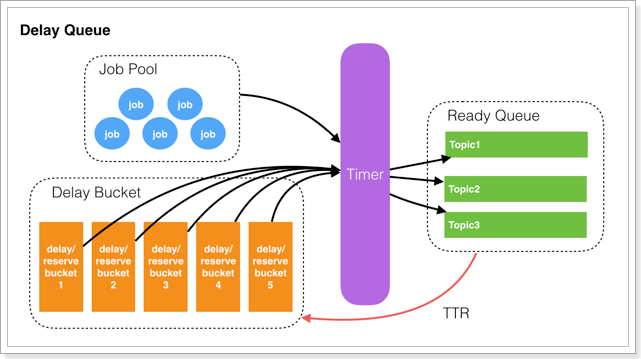 

再来看看一个任务（Job）的状态转换：

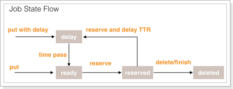 

其中包括的状态：

- ready：可执行状态，等待消费。
- delay：不可执行状态，等待时钟周期。
- reserved：已被消费者读取，但超过一定时间还未得到消费者的响应（delete、finish），重新放入Read队列。
- deleted：已被消费完成或者已被删除。


### 2.7.2.优缺点

**优点**：

- 高可用性
- 实时性
- 持久性
- 支持消息删除

**缺点**：

- 独立线程的无限循环，CPU的浪费，可以改成类似于DelayQueue的wait和notify机制
- 消费端在reserve job的时候，采用的是http短轮询的方式，IO开销较大，可以改进为基于长连接方式
- 数据存储使用的redis，消息在持久化上，受限于redis的特性，可能导致数据丢失


## 2.8.时间轮算法

基于时间轮算法多用在定时任务框架，或者分布式任务调度中，并直接没有可用的延迟队列框架，不过，前面已经说过，我们可以基于定时任务来实现延迟队列，殊途同归。

我们可以看看原理：[参考时间轮算法](https://www.veaxen.com/%E7%AE%97%E6%B3%95-%E6%97%B6%E9%97%B4%E8%BD%AE.html)

## 2.9.RabbitMQ 延迟队列

RabbitMQ本身并不支持延迟队列，不过我们可以利用其中的`Dead Letter Exchanges`功能来实现延迟队列。

Dead Letter Exchanges 通常被人们叫做**死信队列**，我更喜欢称为**死信交换机**。那么问题来了，什么是死信？


### 2.9.1.死信Dead Letter

参考官方网站：https://www.rabbitmq.com/dlx.html

首先来看死信的概念。

**死信**的英文是（Dead Letter），满足下列条件的消息被称为死信：

- 消费者使用basic.reject或 basic.nack声明消费失败，并且消息的requeue参数设置为false。意思就是这个消息没有消费者需要了。
- 消息是一个过期消息（TTL到期），到期可以是**消息本身超时或者队列的TTL超时**。
- 消息的长度超过了其被投递的队列最大限制


要实现延迟队列，我们肯定需要人为控制一个消息变为死信，因此我们一般采用上述的第二种方式：**让一个消息在一段时间后过期**，这种过期可以通过两种策略实现：

- 队列TTL：通过`x-message-ttl`属性给`消息所在队列`设置TTL（Time To Live），当队列中的消息存在时间超过TTL后就自动成为死信
- 消息TTL：消息的发送者在发送消息时，设置消息TTL属性。消息到达队列，TTL到期后成为死信、
- 如果一个消息具有TTL，同时所在队列也具备TTL，时间长度较小的会生效


由上面的概念可以知道，一个消息是不是死信，最终是由**消息所在的队列**来判断和处理的。当一个消息被判定为死信，它所在的队列会做怎样的处理呢？

队列会把**死信**交给提前指定的**死信交换机（Dead Letter Exchange）**。

如图：

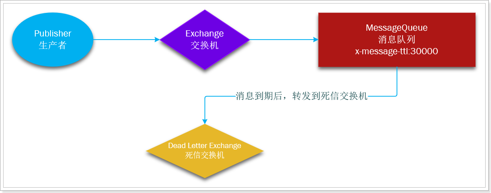


### 2.9.2.死信交换机Dead Letter Exchanges

**死信交换机（Dead Letter Exchange）**其实就是一个普通交换机，也具备以前学习的交换机的所有特征，例如可以设置交换机类型为：topic、direct等。它负责把消息根据routing key转发给绑定的队列。

那什么样的交换机才可以叫死信交换机？需要队列在声明的时候，通过`x-dead-letter-exchange`属性指定一个交换机，被指定的交换机就是**死信交换机（Dead Letter Exchange）**。同时队列还可以指定一个`x-dead-letter-routing-key`（死信路由）作为死信的`routing_key`，死信交换机转发消息时会根据这个`routing_key`来转发消息。

死信交换机接收到消息以后，会根据消息的`routing_key`再次转发消息到绑定的队列，如果队列绑定到死信交换机时，会根据队列指定的`x-dead-letter-routing-key`来转发，如果队列没有绑定，则会根据消息来源时指定的`routing_key`来转发。

例如：现在publisher发送消息时指定`routing_key`为`foo`，队列绑定死信交换机时指定了**死信路由**为：`bar`，则死信交换机转发时，会使用`bar`作为`routing_key`，如图：

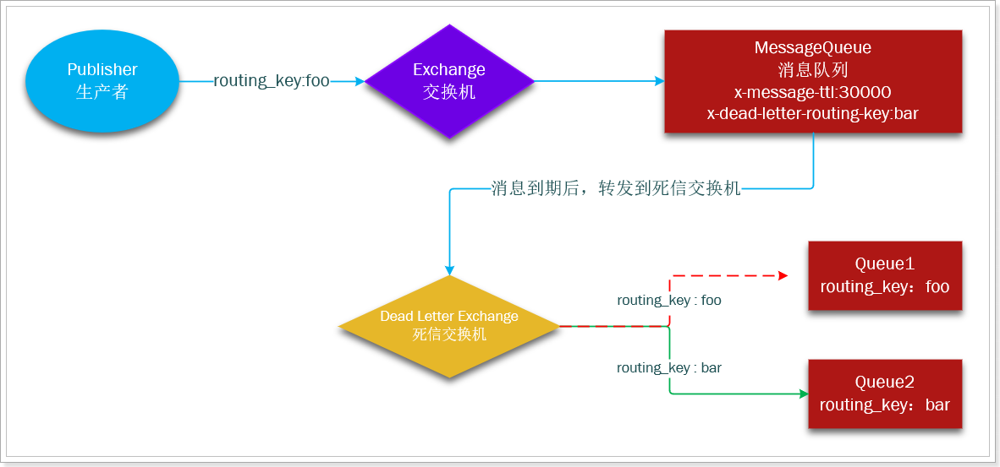

现在publisher发送消息时指定`routing_key`为`foo`，队列绑定死信交换机时没有指定**死信路由，则死信交换机转发时，会使用`foo`作为`routing_key`，如图：

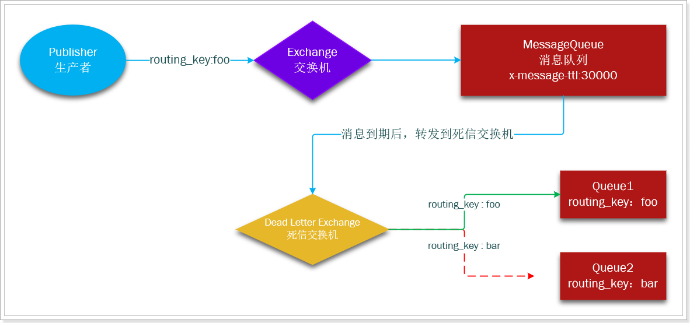


现在，如果我们发送一个routingKey为foo的消息到达设置了过期时间为30秒的队列（图中的MessageQueue），30秒后消息过期，就会转发到死信交换机，然后就会发送到Queue1这个队列，我们的任务执行者监听Queue1，即可实现延迟队列了。


### 2.9.3.示例

接下来，我们通过示例来展示下死信队列，如图：

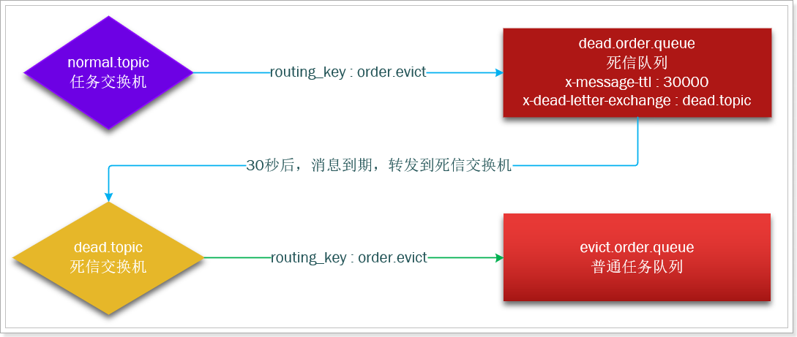


#### **1）创建交换机**

打开RabbitMQ的管理界面，然后先创建两个交换机：

- `normal.topic`：一个普通的topic类型的交换机
- `dead.topic`：一个普通topic类型的交换机，但是作为死信交换机来用

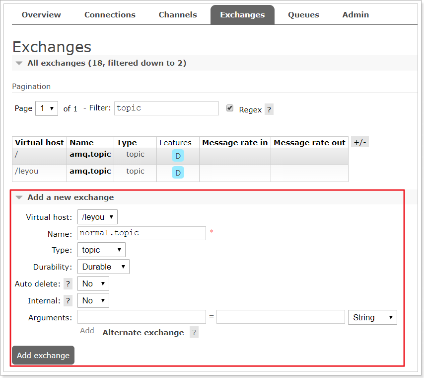

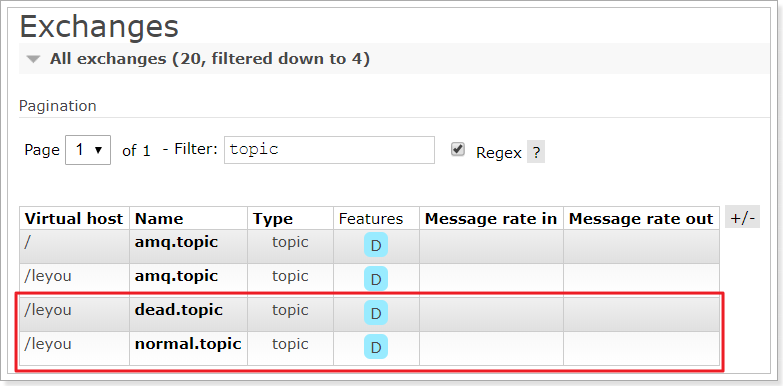


#### **2）创建队列**

然后创建两个队列：

- `dead.order.queue`：死信队列，设置过期时间为20秒，
  - 与`normal.topic`交换机绑定，接收消息，routing_key为 `order.evict`
  - 指定`x-dead-letter-exchange`为`dead.topic`这个死信交换机
  - 指定`x-message-ttl`设置消息过期时间
- `evict.order.queue`：普通任务队列，接收死信交换机转发过来的消息，将来推送给消费者
  - 与`dead.topic`交换机绑定，接收消息，routing_key为 `order.evict`

死信队列：

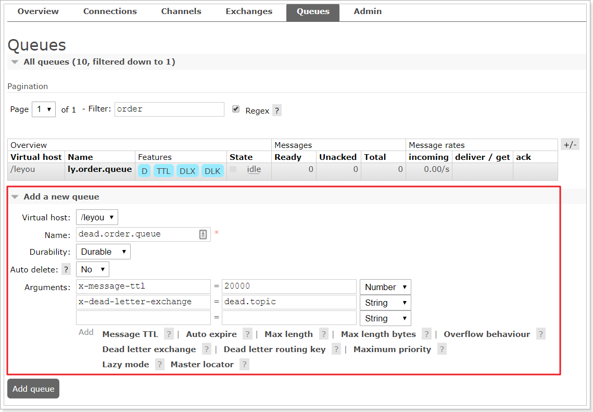

普通任务队列：

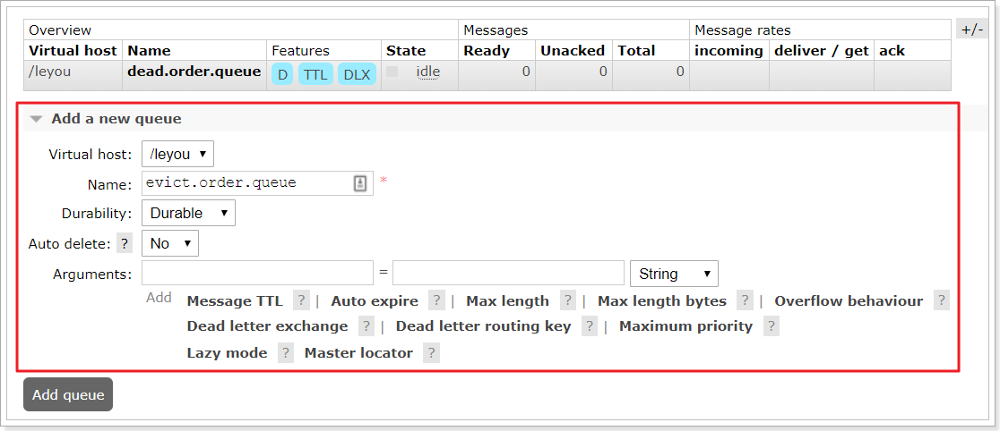


最终：

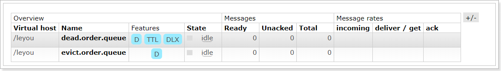


#### **3）绑定普通队列与交换机**

进入交换机界面，点击要绑定的交换机，例如：`normal.topic`：

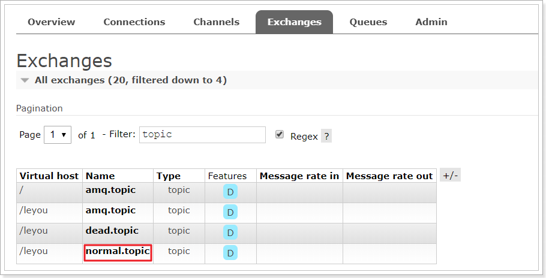

在点开的界面填写要绑定的队列及routing_key：

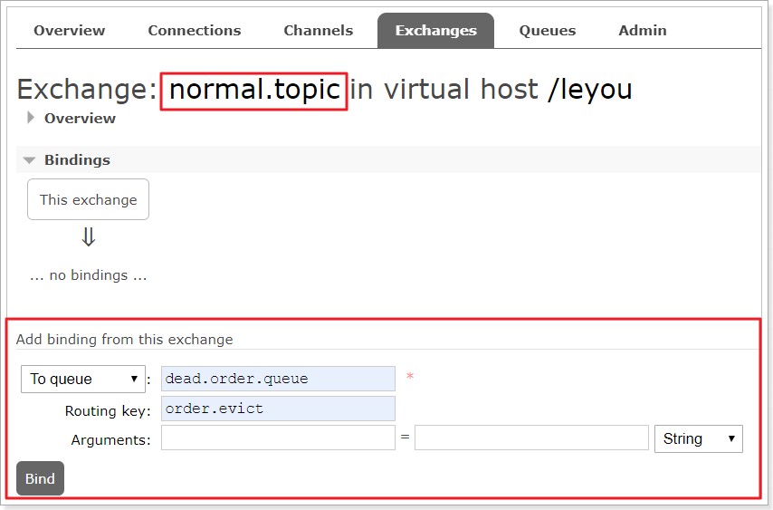


然后还要绑定`evict.order.queue`到`dead.topic`这个交换机：

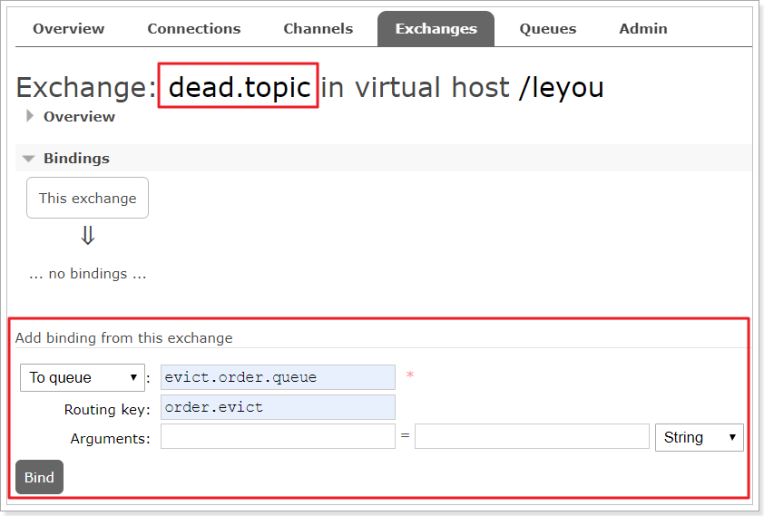


#### 4）测试发送消息

现在，向`normal.topic`交换机发送消息，指定`routing_key`为：`order.evict`

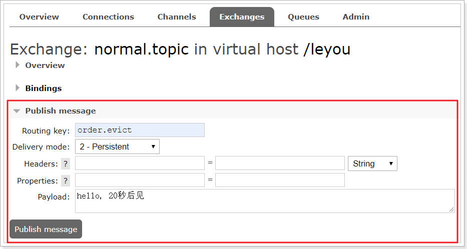

可以看到`dead.order.queue`中已经有消息了：

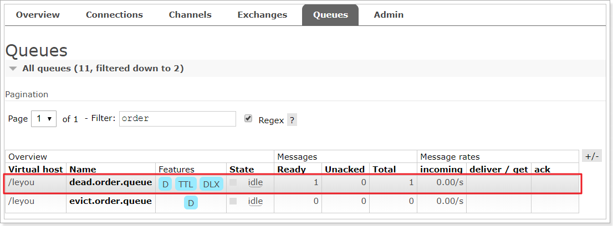

然后等待20秒后，看到消息到了`evict.order.queue`：

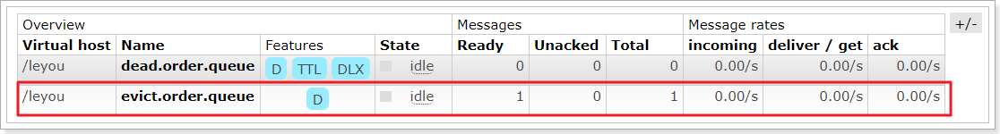


### 2.9.4.优缺点

RabbitMQ实现延迟队列的优缺点：

**优点：**

- 实现简单
- 可持久化
- 高可用集群
- 性能强
- 实时性好

**缺点：**

- 无法删除消息
- 如果是时间跨度非常大并且频率高的任务，不太适合


# 3.清理订单

学完了各种延迟队列的实现，不知道大家最喜欢哪一种？

本例中我们会选择RabbitMQ来作为延迟队列，综合起来比较有优势。


## 3.1.业务分析

首先，我们需要在项目中声明队列和交换机，与上面demo类似：

两个交换机：

- `ly.order.exchange`：一个普通的topic类型的交换机
- `ly.dead.exchange`：一个普通topic类型的交换机，但是作为死信交换机来用

两个队列：

- `ly.dead.order.queue`：死信队列，设置过期时间为30分钟（测试可以用20S），
  - 与`ly.order.exchange`交换机绑定，接收消息，`routing_key`为 `order.evict`
  - 指定`x-dead-letter-exchange`为`ly.dead.exchange`这个死信交换机
  - 设置`x-message-ttl`为30分钟
- `ly.evict.order.queue`：普通任务队列，接收死信交换机转发过来的消息
  - 与`ly.dead.exchange`交换机绑定，接收消息，`routing_key`为 `order.evict`

来看下业务流程：

首先修改下单业务：

- 下单业务的最后，向`ly.order.exchange`这个交换机发送消息，携带订单id

然后一个独立的消费者，需要监听`ly.evict.order.queue`这个队列，业务：

- 接收到订单id信息
- 根据id查询订单状态，判断是否是未支付
  - 如果未支付则需要关闭订单，设置状态为5（已关闭），注意**幂等处理**
  - 如果已支付，则无需处理

- 如果关闭订单了，还要查询对应OrderDetail，得到其中的商品和数量信息
- 调用商品微服务，恢复库存，注意分布式事务问题


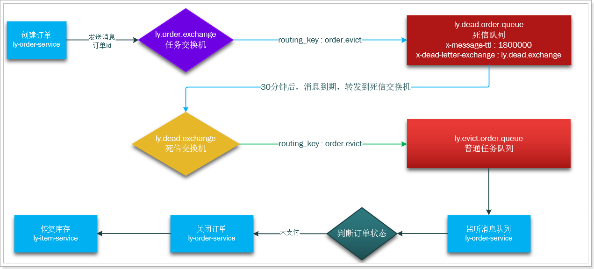


## 3.2.配置死信队列

我们先在`ly-trade`服务中利用java代码来配置之前约定的交换机和队列。

### 3.2.1.引入依赖和配置

在`ly-trade`的`pom.xml`中添加MQ的依赖：

```xml
<!--mq-->
<dependency>
    <groupId>org.springframework.boot</groupId>
    <artifactId>spring-boot-starter-amqp</artifactId>
</dependency>
```

在`ly-trade`的`application.yml`中添加MQ地址：

```yaml
spring:
  rabbitmq:
    host: ly-mq
    username: leyou
    password: 123321
    virtual-host: /leyou
    template:
      retry:
        enabled: true
        initial-interval: 10000ms
        max-interval: 80000ms
        multiplier: 2
    publisher-confirms: true
```


### 3.2.2.配置队列和交换机

在`ly-trade`的`com.leyou.trade.config`中定义一个配置类，配置队列和交换机：

```java
package com.leyou.trade.config;

import org.springframework.amqp.core.*;
import org.springframework.context.annotation.Bean;
import org.springframework.context.annotation.Configuration;

import java.util.HashMap;
import java.util.Map;

import static com.leyou.common.constants.MQConstants.ExchangeConstants.DEAD_EXCHANGE_NAME;
import static com.leyou.common.constants.MQConstants.ExchangeConstants.ORDER_EXCHANGE_NAME;
import static com.leyou.common.constants.MQConstants.QueueConstants.DEAD_ORDER_QUEUE;
import static com.leyou.common.constants.MQConstants.QueueConstants.EVICT_ORDER_QUEUE;
import static com.leyou.common.constants.MQConstants.RoutingKeyConstants.EVICT_ORDER_KEY;


@Configuration
public class MqConfig {
    /**
     * 订单超时未支付的时间
     */
    private static final long ORDER_QUEUE_DELAY_TIME = 30000;

    /**
     * 订单业务交换机
     */
    @Bean
    public TopicExchange orderTopicExchange(){
        return new TopicExchange(ORDER_EXCHANGE_NAME, true, false);
    }
    /**
     * 死信交换机
     */
    @Bean
    public TopicExchange deadTopicExchange(){
        return new TopicExchange(DEAD_EXCHANGE_NAME, true, false);
    }
    /**
     * 死信队列
     */
    @Bean
    public Queue deadOrderQueue(){
        Map<String, Object> args = new HashMap<>(2);
        // x-message-ttl 声明队列TTL值
        args.put("x-message-ttl", ORDER_QUEUE_DELAY_TIME);
        // x-dead-letter-exchange 声明当前队列绑定的死信交换机
        args.put("x-dead-letter-exchange", DEAD_EXCHANGE_NAME);
        return QueueBuilder.durable(DEAD_ORDER_QUEUE).withArguments(args).build();
    }
    /**
     * 清理订单业务队列
     */
    @Bean
    public Queue evictOrderQueue(){
        return new Queue(EVICT_ORDER_QUEUE, true);
    }
    /**
     * 将死信队列与ly.order.exchange交换机绑定
     */
    @Bean
    public Binding bindingDeadQueue(){
        return BindingBuilder.bind(deadOrderQueue()).to(orderTopicExchange()).with(EVICT_ORDER_KEY);
    }
    /**
     * 将清理订单业务队列与死信交换机绑定
     */
    @Bean
    public Binding bindingEvictQueue(){
        return BindingBuilder.bind(evictOrderQueue()).to(deadTopicExchange()).with(EVICT_ORDER_KEY);
    }
    @Bean
    public Jackson2JsonMessageConverter messageConverter(){
        return new Jackson2JsonMessageConverter();
    }
}
```


### 3.2.4.测试

重启项目，可以再MQ的控制台看到队列和交换机信息：

交换机：

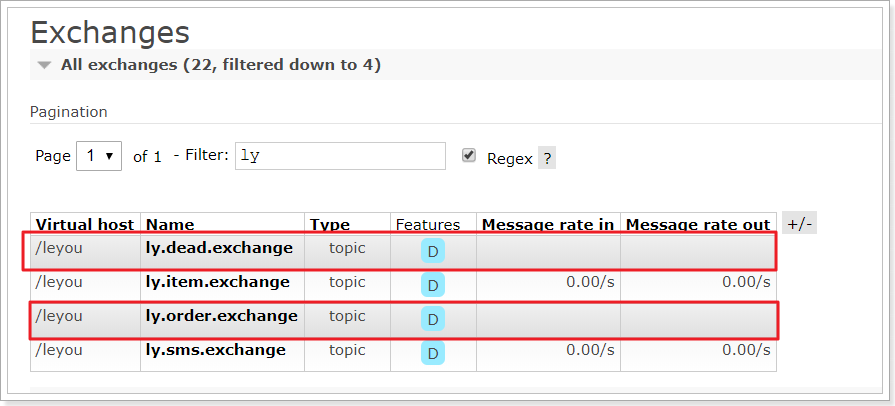

队列：

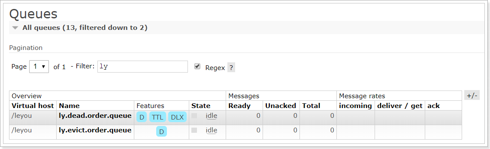

绑定：

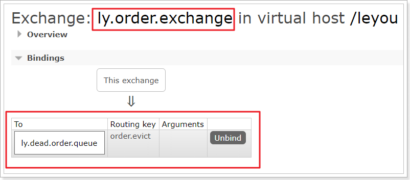


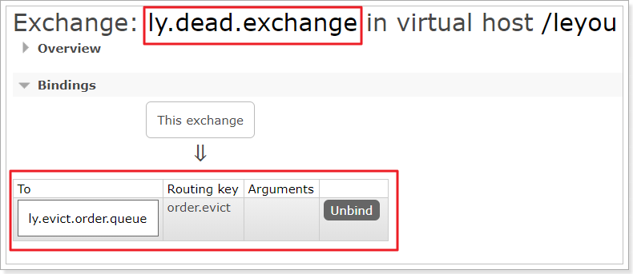


## 3.3.改造下单业务

下单业务的最后，向`ly.order.topic`这个交换机发送消息，携带订单id

修改`ly-trade`的`com.leyou.trade.service.impl`包中的`OrderServiceImpl`类中的`createOrder`方法：

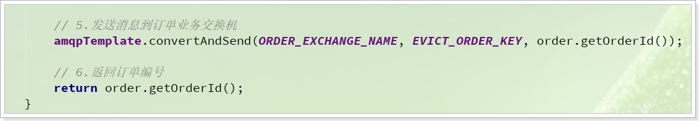

```java
 amqpTemplate.convertAndSend(ORDER_EXCHANGE_NAME, EVICT_ORDER_KEY, order.getOrderId());
```


## 3.4.商品服务恢复库存

我们在商品服务中添加一个恢复库存接口，方便在监听到MQ消息后调用：

在`ly-item-api`的`ItemClient`中添加接口：

```java
/**
     * 加库存
     * @param cartMap 商品id及数量的map
     */
@PutMapping("/goods/stock/plus")
void addStock(@RequestBody Map<Long, Integer> cartMap);
```

在`ly-item-service`的`GoodsController`中编写业务：

```java
    /**
     * 加库存
     * @param cartMap 商品id及数量的map
     */
    @PutMapping("/stock/plus")
    public ResponseEntity<Void> addStock(@RequestBody Map<Long, Integer> cartMap){
        skuService.addStock(cartMap);
        return ResponseEntity.status(HttpStatus.NO_CONTENT).build();
    }
```

在`ly-item-service`的`SkuService`中添加方法：

```java
void addStock(Map<Long, Integer> cartMap);
```


减库存的同时还要对商品的销量做+的操作，这个sql我们通过手写完成，定义在mapper中。

在`ly-item-service`的`com.leyou.item.mapper`的`SkuMapper`中定义方法：

```java
@Update("UPDATE tb_sku SET stock = stock + #{num} , sold = sold - #{num} WHERE id = #{id}")
int addStock(Map<String,Object> sku);
```


在`ly-item-service`的`SkuServiceImpl`中实现业务：

```java
private static final String ADD_STOCK_STATEMENT = "com.leyou.item.mapper.SkuMapper.addStock";
@Override
@Transactional
public void addStock(Map<Long, Integer> cartMap) {
    executeBatch(sqlSession -> {
        for (Map.Entry<Long, Integer> entry : cartMap.entrySet()) {
            Map<String,Object> param = new HashMap<>();
            param.put("id", entry.getKey());
            param.put("num", entry.getValue());
            sqlSession.update(ADD_STOCK_STATEMENT, param);
            sqlSession.flushStatements();
        }
    });
}
```


## 3.5.监听MQ消息

在`ly-trade`的`com.leyou.trade.mq`包中添加一个类，监听MQ消息：

```java
package com.leyou.trade.mq;

import com.leyou.trade.service.OrderService;
import org.springframework.amqp.rabbit.annotation.RabbitListener;
import org.springframework.stereotype.Component;

import static com.leyou.common.constants.MQConstants.QueueConstants.EVICT_ORDER_QUEUE;


@Component
public class OrderListener {
    
    private final OrderService orderService;

    public OrderListener(OrderService orderService) {
        this.orderService = orderService;
    }

    /**
     * 监听清理订单的消息
     * @param orderId 订单id
     */
    @RabbitListener(queues = EVICT_ORDER_QUEUE)
    public void listenOrderMessage(Long orderId) throws InterruptedException 	 {
        if(orderId != null){
            log.info("接收到订单任务，订单id：{}", orderId);
            try {
                orderService.evictOrderIfNecessary(orderId);
            } catch (Exception e) {
                Thread.sleep(5000);
                throw new RuntimeException(e);
            }
        }
    }
}
```

这里监听到订单信息后，说明订单已经超过30分钟了，我们可以去清理了，调用OrderService的清理订单功能。

## 3.6.清理订单

在`ly-trade`的`com.leyou.trade.service`的OrderService接口中添加方法：

```java
void evictOrderIfNecessary(Long orderId);
```

然后，在`ly-trade`的`com.leyou.trade.service.impl`的OrderServiceImpl中添加方法：

```java
@Override
@Transactional
public void evictOrderIfNecessary(Long orderId) {
    // 1.查询订单
    Order order = getById(orderId);
    if(order == null){
        // 订单不存在，无需处理
        return;
    }
    // 2.判断订单是否支付
    if(order.getStatus() != OrderStatus.INIT){
        // 订单已处理，无需重复处理
        return;
    }
    // 3.如果未支付，需要关闭订单
    boolean boo = update().set("status", OrderStatus.CLOSED.getValue())
        .set("close_time", new Date())
        .eq("order_id", orderId)
        // 通过乐观锁进一步保证幂等效果
        .eq("status", OrderStatus.INIT.getValue())
        // 执行update
        .update();
    if(!boo){
        // 更新失败，订单状态已经改变，无需处理
        return;
    }
    log.info("已关闭超时未支付订单：{}", orderId);
    // 4.查询OrderDetail
    List<OrderDetail> details = detailService.query().eq("order_id", orderId).list();

    // 5.获取商品及商品数量信息
    Map<Long, Integer> skuMap = new HashMap<>();
        // 得到其中的商品和数量信息
        for (OrderDetail detail : details) {
            skuMap.put(detail.getSkuId(), detail.getNum());
        }
    /*Map<Long, Integer> map = details.stream()
        .collect(Collectors.toMap(OrderDetail::getSkuId, OrderDetail::getNum));*/

    // 6.恢复库存
    itemClient.addStock(skuMap);
}
```

