# day18-分布式日志服务、链路追踪


# 0.学习目标

- 了解GrayLog的作用
- 了解SkyWalking的作用


# 1.分布式日志服务GrayLog

在微服务架构下，微服务被拆分成多个微小的服务，每个微小的服务都部署在不同的服务器实例上，当我们定位问题，检索日志的时候需要依次登录每台服务器进行检索。

这样是不是感觉很繁琐和效率低下。所以我们还需要一个工具来帮助集中收集、存储和搜索这些跟踪信息。

集中化管理日志后，日志的统计和检索又成为一件比较麻烦的事情。以前，我们通过使用grep、awk和wc等Linux命令能实现检索和统计，但是对于要求更高的查询、排序和统计等要求和庞大的机器数量依然使用这样的方法难免有点力不从心。


分布式日志服务就是来帮我们解决上述问题的。其基本思路是：

- **日志收集器**：微服务中引入**日志客户端**，将记录的日志通过日志服务端发送到对应的收集器，然后以某种方式存储
- **数据存储**：一般使用ElasticSearch分布式存储，把收集器收集到的日志格式化，然后存储到分布式存储中
- **web服务**：利用ElasticSearch的统计搜索功能，实现日志查询和报表输出

比较知名的分布式日志服务包括：

- ELK：elasticsearch、Logstash、Kibana
- GrayLog：


## 1.1.什么是GrayLog

业界比较知名的分布式日志服务解决方案是ELK，而我们今天要学习的是GrayLog。为什么呢？

ELK解决方案的问题：

1. 不能处理多行日志，比如Mysql慢查询，Tomcat/Jetty应用的Java异常打印
2. 不能保留原始日志，只能把原始日志分字段保存，这样搜索日志结果是一堆Json格式文本，无法阅读。
3. 不符合正则表达式匹配的日志行，被全部丢弃。

GrayLog方案的优势：

1. 一体化方案，安装方便，不像ELK有3个独立系统间的集成问题。
2. 采集原始日志，并可以事后再添加字段，比如http_status_code，response_time等等。
3. 自己开发采集日志的脚本，并用curl/nc发送到Graylog Server，发送格式是自定义的GELF，Flunted和Logstash都有相应的输出GELF消息的插件。自己开发带来很大的自由度。实际上只需要用inotifywait监控日志的modify事件，并把日志的新增行用curl/netcat发送到Graylog Server就可。
4. 搜索结果高亮显示，就像google一样。
5. 搜索语法简单，比如： `source:mongo AND reponse_time_ms:>5000`，避免直接输入elasticsearch搜索json语法
6. 搜索条件可以导出为elasticsearch的搜索json文本，方便直接开发调用elasticsearch rest api的搜索脚本。


官网：https://www.graylog.org/

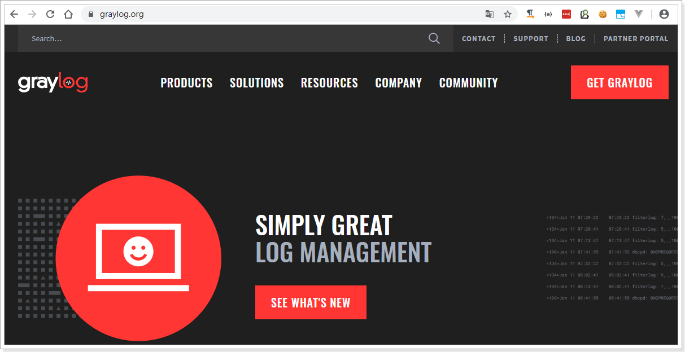


其基本框架如图：

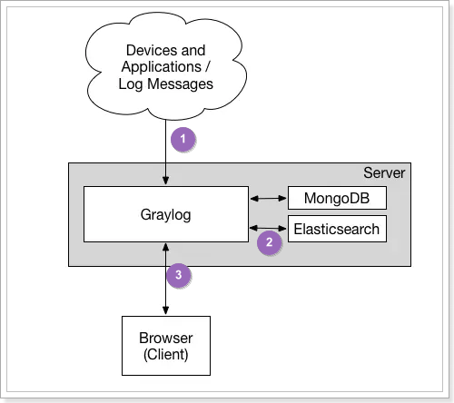 

流程如下：

- 微服务中的GrayLog客户端发送日志到GrayLog服务端
- GrayLog把日志信息格式化，存储到Elasticsearch
- 客户端通过浏览器访问GrayLog，GrayLog访问Elasticsearch

这里MongoDB是用来存储GrayLog的配置信息的，这样搭建集群时，GrayLog的各节点可以共享配置

## 1.2.安装

我们在虚拟机中选择使用Docker来安装。需要安装的包括：

- MongoDB：用来存储GrayLog的配置信息，可以使用最新版本
- Elasticsearch：用来存储日志信息，目前GrayLog兼容的是6.x版本
- GrayLog：GrayLog服务端，目前是3.1版本

### 1.2.1.上传docker镜像

上述镜像体积都比较大，我们在课前资料已经提供好了：

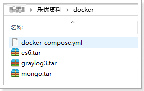 

我们上传到`/usr/local/src/`目录下，

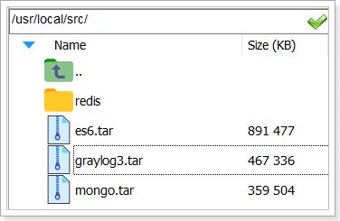 

然后执行命令，加载镜像：

```
docker load -i es6.tar
docker load -i graylog3.tar
docker load -i mongo.tar
```

然后查看加载好的镜像：

```
docker images
```

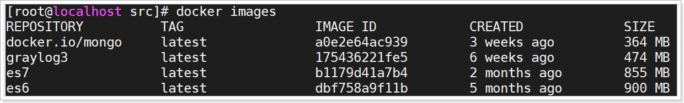


### 1.2.2.运行es容器

注意：GrayLog3.1不兼容elasticsearch7.x版本，必须使用6.x版本

命令如下：

```sh
docker run --name leyou-es6 \
    -e "http.host=0.0.0.0" \
    -e "network.host=0.0.0.0" \
    -e "ES_JAVA_OPTS=-Xms512m -Xmx512m" \
    -e "discovery.type=single-node" \
    -v es6-data:/usr/share/elasticsearch/data \
    -v es6-logs:/usr/share/elasticsearch/logs \
    --privileged \
    -p 9201:9200 \
    -p 9301:9300 \
    -d \
    es6
```

命令解读：

- `--name leyou-es6`：容器名称是`leyou-es6`
- 环境变量
  - `-e "http.host=0.0.0.0"`：监听的ip地址，外网可以访问
  - `-e "ES_JAVA_OPTS=-Xms256m -Xmx256m"`：JVM内存参数
  - `-e "discovery.type=single-node"`：单节点模式，无集群
- 卷信息：
  - `-v es6-data:/usr/share/elasticsearch/data`：存放es中数据的卷
  - `-v es6-logs:/usr/share/elasticsearch/logs`：存放es中日志的卷
- `--privileged`：授予逻辑卷访问权限
- 端口信息：
  - `-p 9201:9200`：http端口，此处没有用9200，因为大家之前安装的ES版本是7，并且已经占用了9200端口
  - `-p 9301:9300`：http端口，此处没有用9301，因为大家之前安装的ES版本是7，并且已经占用了9300端口
- `es6`：使用的镜像名称


### 1.2.3.运行MongoDB容器

命令如下：

```sh
docker run  \
    --name leyou-mongo \
    -p 27017:27017  \
    -v mongo-config:/data/configdb/ \
    -v mongo-db:/data/db/ \
    --privileged \
    -d \
    mongo
```

命令解读：

- `--name leyou-mongo`：容器名称是`leyou-mongo`
- 卷信息：
  - `-v mongo-config:/data/configdb/`：存放mongodv中配置信息的卷
  - `-v mongo-db:/data/db/`：存放mongodv中数据信息的卷
- `--privileged`：授予逻辑卷访问权限
- 端口信息：
  - `-p 27017:27017`：mongodb的端口
- `mongo`：使用的镜像名称


### 1.2.4.运行GrayLog容器

命令如下：

```sh
docker run \
    --name leyou-log \
    --link leyou-mongo:mongo \
    -p 9000:9000 \
    -p 12201:12201/udp \
    -e GRAYLOG_HTTP_EXTERNAL_URI=http://192.168.206.99:9000/ \
    -e GRAYLOG_ELASTICSEARCH_HOSTS=http://192.168.206.99:9201/ \
    -e GRAYLOG_ROOT_TIMEZONE="Asia/Shanghai"  \
    -e GRAYLOG_WEB_ENDPOINT_URI="http://192.168.206.99:9000/:9000/api" \
    -e GRAYLOG_PASSWORD_SECRET="somepasswordpepper" \
    -e GRAYLOG_ROOT_PASSWORD_SHA2=8c6976e5b5410415bde908bd4dee15dfb167a9c873fc4bb8a81f6f2ab448a918 \
    -d \
    graylog3
```

命令解读：

- `--name leyou-log`：容器名称是`leyou-log`
- `--link leyou-mongo:mongo`：连接另一个容器，因为GrayLog依赖于MongoDB，因此需要指定另一个容器信息，格式：`容器名称:镜像版本`
- 环境变量
  - `-e GRAYLOG_HTTP_EXTERNAL_URI=http://192.168.150.101:9000/`：对外开放的ip和端口信息，这里用9000端口
  - `-e GRAYLOG_ELASTICSEARCH_HOSTS=http://192.168.150.101:9201/`：GrayLog依赖于ES，这里指定ES的地址
  - `-e GRAYLOG_WEB_ENDPOINT_URI="http://192.168.150.101:9000/:9000/api"`：对外开放的API地址
  - `-e GRAYLOG_PASSWORD_SECRET="somepasswordpepper"`：密码加密的秘钥
  - `-e GRAYLOG_ROOT_PASSWORD_SHA2=8c6976e5b5410415bde908bd4dee15dfb167a9c873fc4bb8a81f6f2ab448a918`：密码加密后的密文。明文是`admin`，账户也是`admin`
  - `-e GRAYLOG_ROOT_TIMEZONE="Asia/Shanghai"`：GrayLog容器内时区
- 端口信息：
  - `-p 9000:9000`：GrayLog的http服务端口，9000
  - `-p 12201:12201/udp`：GrayLog的UDP协议端口，用于接收从微服务发来的日志信息
- `graylog3`：使用的镜像名称


如果看到这个信息，代表启动成功：

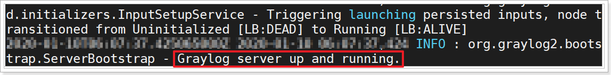


## 1.3.设置日志收集器

### 1.3.1.登录控制台

在浏览器中输入：http://192.168.206.99:9000即可访问：


输入账户和密码，都是`admin`，进入首页，不过因为没有数据，看不到日志信息，而是欢迎界面：

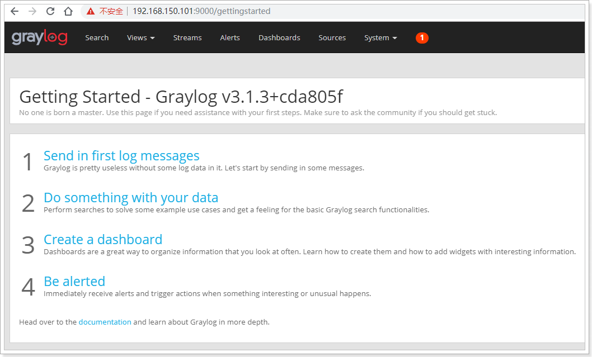

### 1.3.2.配置Inputs

在页面点击`System`菜单，选择`Inputs`

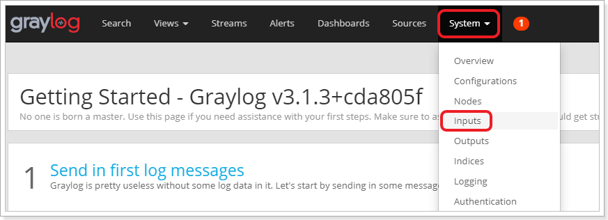

在页面的下拉选框中，选择`GELF UDP`：

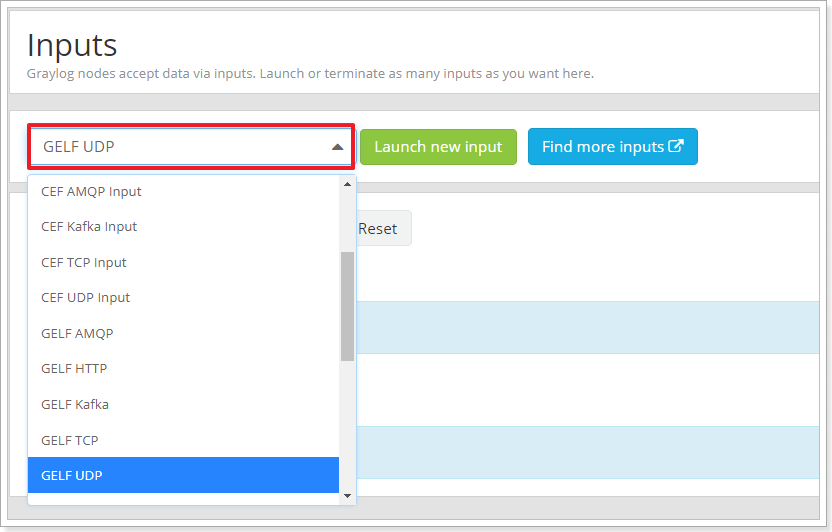

然后点击`Launch new input`按钮：

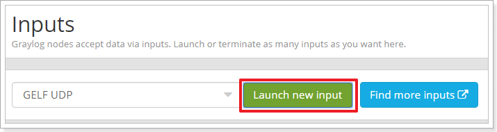 

会弹出表单窗口：

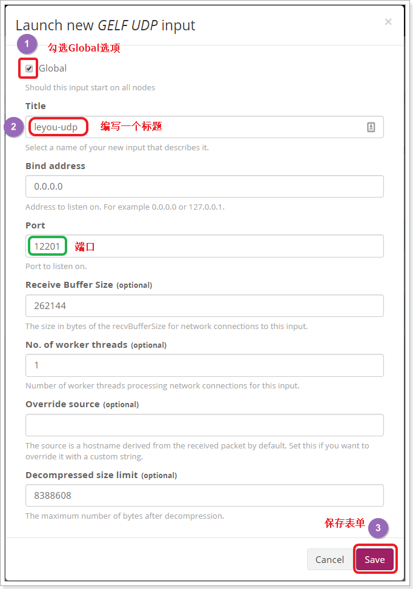 

填写表单，点击`Save`保存即可。

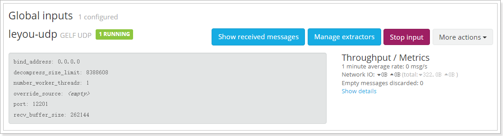

注意：这里UDP的端口是`12201`.


## 1.4.SpringBoot集成

现在，GrayLog的服务端日志收集器已经准备好，我们还需要在项目中添加GrayLog的客户端，将项目日志发送到GrayLog服务中，保存到ElasticSearch。

基本步骤如下：

- 1.引入GrayLog客户端依赖
- 2.配置Logback，集成GrayLog的Appender
- 3.启动并测试

我们以注册中心`ly-registry`为例：

### 1.4.1.引入依赖

这个是第三方提供的GrayLog依赖，并不是GrayLog官网。

```xml
<dependency>
    <groupId>biz.paluch.logging</groupId>
    <artifactId>logstash-gelf</artifactId>
    <version>1.13.0</version>
</dependency>
```


### 1.4.2.配置Logback

在项目的`resources`目录中，添加文件`logback.xml`：

```xml
<configuration>
    <appender name="CONSOLE" class="ch.qos.logback.core.ConsoleAppender">
        <encoder>
            <pattern>
                %d{yyyy-MM-dd HH:mm:ss.SSS} [%thread] %-5level %logger{50} - %msg%n
            </pattern>
        </encoder>
    </appender>
    <appender name="GELF" class="biz.paluch.logging.gelf.logback.GelfLogbackAppender">
        <!--GrayLog服务地址-->
        <host>udp:192.168.206.99</host>
        <!--GrayLog服务端口-->
        <port>12201</port>
        <version>1.1</version>
        <!--当前服务名称-->
        <facility>ly-registry</facility>
        <extractStackTrace>true</extractStackTrace>
        <filterStackTrace>true</filterStackTrace>
        <mdcProfiling>true</mdcProfiling>
        <timestampPattern>yyyy-MM-dd HH:mm:ss,SSS</timestampPattern>
        <maximumMessageSize>8192</maximumMessageSize>

    </appender>

    <logger name="com.leyou" level="DEBUG" additivity="false">
        <appender-ref ref="CONSOLE" />
        <appender-ref ref="GELF" />
    </logger>
    <root level="INFO">
        <appender-ref ref="CONSOLE" />
        <appender-ref ref="GELF" />
    </root>
</configuration>
```

目录：

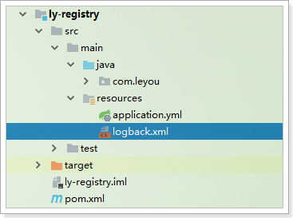 


### 1.4.3.启动测试

启动`ly-registry`项目，然后访问刚才的： http://192.168.206.99:9000，然后点击search按钮即可看到结果：

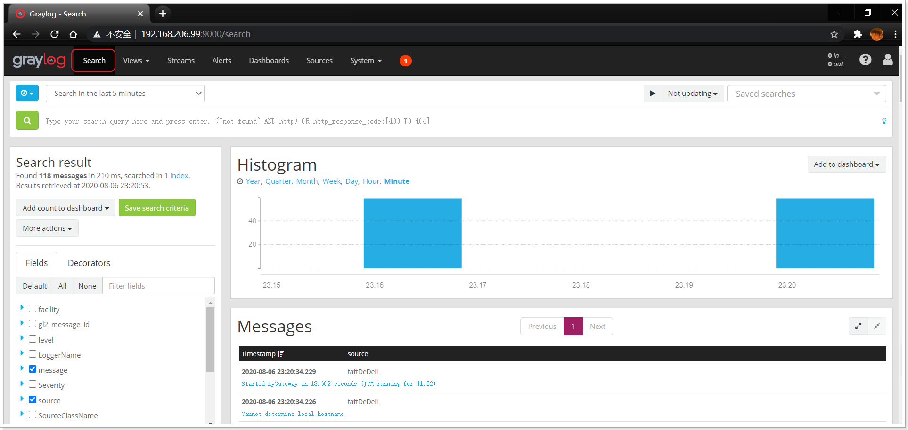


这个页面可以对日志做各种搜索和过滤


## 1.5.日志回收策略

到此graylog的基础配置就算完成了，已经可以收到日志数据。

但是在实际工作中，服务日志会非常多，这么多的日志，如果不进行存储限制，那么不久就会占满磁盘，查询变慢等等，而且过久的历史日志对于实际工作中的有效性也会很低。

Graylog则自身集成了日志数据限制的配置，可以通过如下进行设置：

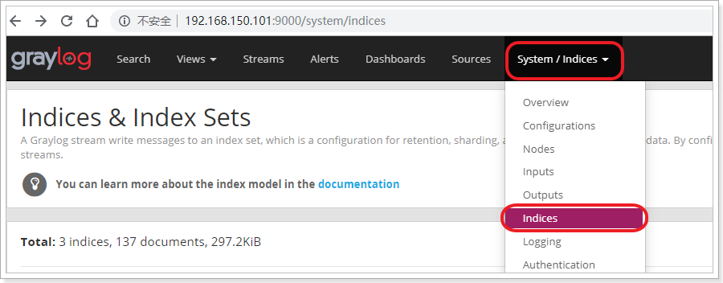

选择`Default index set`的`Edit`按钮：

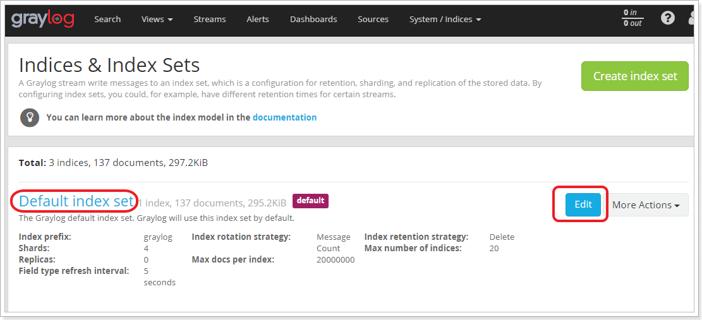


GrayLog有3种日志回收限制，触发以后就会开始回收空间，删除索引：

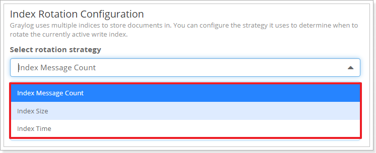 

分别是：

- `Index Message Count`：按照日志数量统计，默认超过`1000000`条日志开始清理
- `Index Size`：按照日志大小统计，默认超过`1GB`开始清理
- `Index Time`：按照日志日期清理，默认日志存储1天


## 1.6.搜索语法

在search页面，可以完成基本的日志搜索功能：

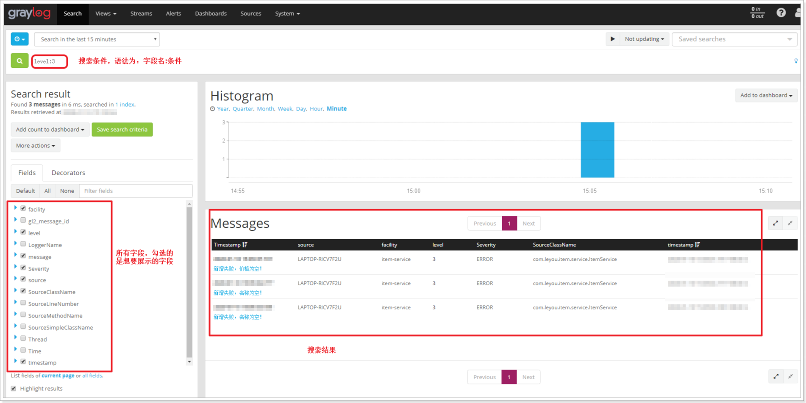

### 1）搜索语法

搜索语法非常简单：

```
字段名:搜索关键字
```

例如：`level:3`代表搜索日志级别`level`为`3`的日志，即错误日志。

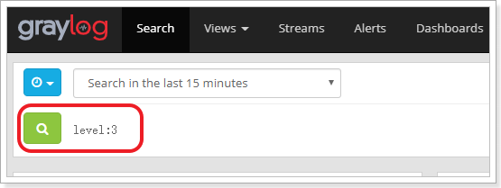 

### 2）字段选择

GrayLog存储的日志字段比较多，包括：

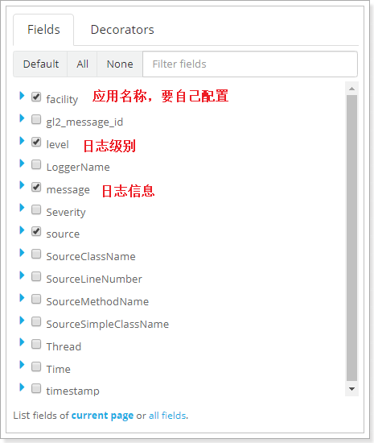 

可以自由选择需要展示的字段，搜索结果如下：

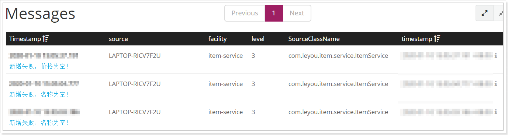

## 1.7.日志统计仪表盘

GrayLog支持把日志按照自己需要的方式形成统计报表，并把许多报表组合一起，形成DashBoard（仪表盘），方便对日志统计分析。

### 1.7.1.创建仪表盘

进入仪表盘页面，创建一个仪表盘

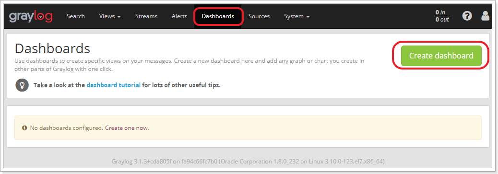

在弹出的表单中填写信息：

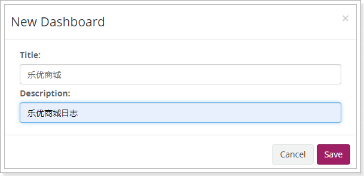 

保存。

### 1.7.2.添加结果到仪表盘

回到search页面，然后找到Fields部分，点击任意字段，即可添加统计信息。

比如：点击`facility`字段，根据应用名称来统计：

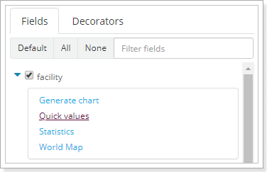 

选择`Quick values`，在页面展示结果：

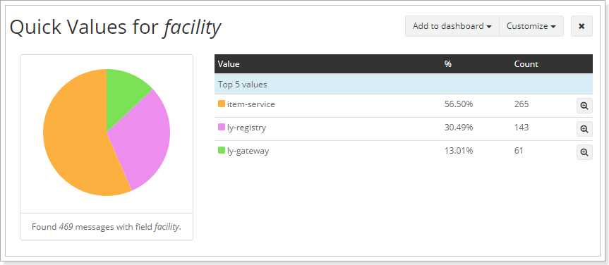

然后点击`Add to dashboard`，选择乐优商城：

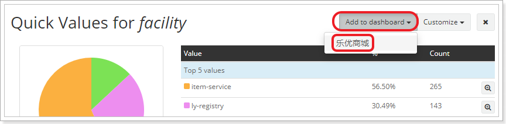

在弹出的窗口中，添加一个标题：

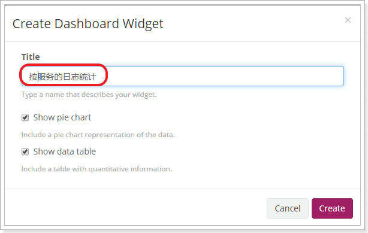 


按照这种方式，添加大量数据到仪表盘即可。

此时，进入仪表盘，可以看到很多统计信息：

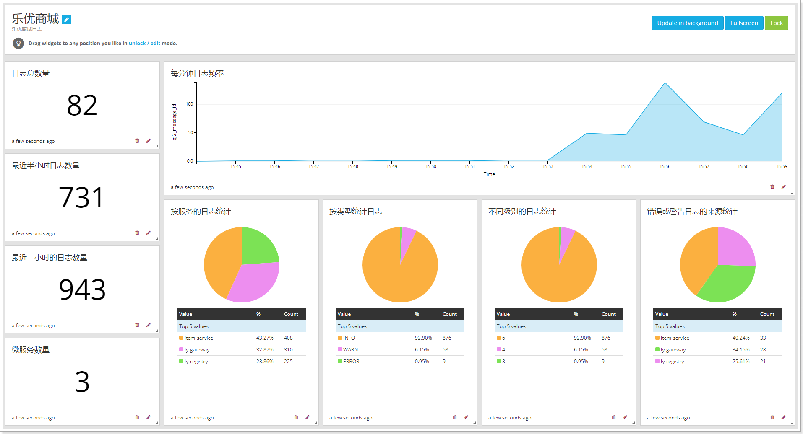


详细配置，可以参考官方文档：http://docs.graylog.org/en/latest/pages/extended_search.html


## 1.8.了解FileBeats（了解）

上面的日志收集器是通过SpringBoot中整合GrayLog的插件来完成，还有一种比较流行的方式，是使用Elastic的FileBeat（https://www.elastic.co/guide/en/beats/filebeat/current/index.html）产品，直接读取日志文件。可以支持各种不同的日志文件格式。

GrayLog通过一种叫做Beats的Inputs类型来接受FileBeat：

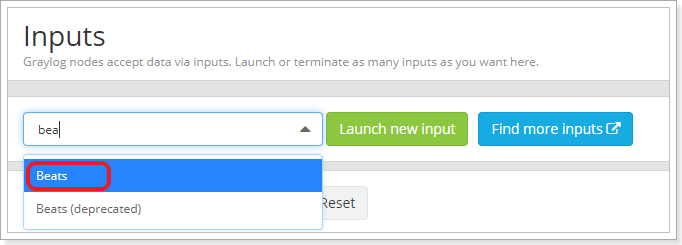 


不过，怎样让FileBeat收集的日志被格式化为GrayLog需要的格式呢？这就需要GrayLog提供的SideCar来实现：http://docs.graylog.org/en/3.1/pages/sidecar.html#

实现流程如图：

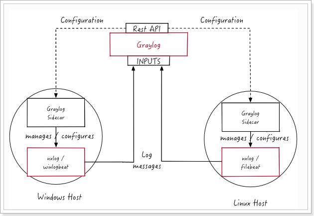

流程步骤：

- 通过wxlog或者FileBeats收集日志数据，交给GrayLog的SideCar
- 通过GrayLog的SideCar对数据处理，发送到GrayLog的INPUTS
- GrayLog将数据存储到ElasticSearch中


这种方式的优点：

- 无需在应用中编程或配置，与应用解耦合，没有侵入
- 日志收集是独立进程，不影响应用的性能

缺点：

- 配置复杂

综上所述，生产环境下适合用这种beats方式来收集日志。


# 2.APM系统SkyWalking

参考文档：https://www.cnblogs.com/xiaoqi/p/apm.html

## 2.1.什么是APM

随着微服务架构的流行，一次请求往往需要涉及到多个服务，因此服务性能监控和排查就变得更复杂：

- 不同的服务可能由不同的团队开发、甚至可能使用不同的编程语言来实现
- 服务有可能布在了几千台服务器，横跨多个不同的数据中心

因此，就需要一些可以帮助理解系统行为、用于分析性能问题的工具，以便发生故障的时候，能够快速定位和解决问题，这就是APM系统，全称是（**A**pplication **P**erformance **M**onitor，当然也有叫 **A**pplication **P**erformance **M**anagement tools）

AMP最早是谷歌公开的论文提到的 [Google Dapper](http://bigbully.github.io/Dapper-translation)。Dapper是Google生产环境下的分布式跟踪系统，自从Dapper发展成为一流的监控系统之后，给google的开发者和运维团队帮了大忙，所以谷歌公开论文分享了Dapper。


### 2.1.1.面临的问题

在google的首页页面，提交一个查询请求后，会经历什么：

- 可能对上百台查询服务器发起了一个Web查询，每一个查询都有自己的Index
- 这个查询可能会被发送到多个的子系统，这些子系统分别用来处理广告、进行拼写检查或是查找一些像图片、视频或新闻这样的特殊结果
- 根据每个子系统的查询结果进行筛选，得到最终结果，最后汇总到页面上

总结一下：

- 一次全局搜索有可能调用上千台服务器，涉及各种服务。
- 用户对搜索的耗时是很敏感的，而任何一个子系统的低效都导致导致最终的搜索耗时

如果一次查询耗时不正常，工程师怎么来排查到底是由哪个服务调用造成的？

- 首先，这个工程师可能无法准确的定位到这次全局搜索是调用了哪些服务，因为新的服务、乃至服务上的某个片段，都有可能在任何时间上过线或修改过，有可能是面向用户功能，也有可能是一些例如针对性能或安全认证方面的功能改进
- 其次，你不能苛求这个工程师对所有参与这次全局搜索的服务都了如指掌，每一个服务都有可能是由不同的团队开发或维护的
- 再次，这些暴露出来的服务或服务器有可能同时还被其他客户端使用着，所以这次全局搜索的性能问题甚至有可能是由其他应用造成的

从上面可以看出Dapper需要：

- 无所不在的部署，无所不在的重要性不言而喻，因为在使用跟踪系统的进行监控时，即便只有一小部分没被监控到，那么人们对这个系统是不是值得信任都会产生巨大的质疑
- 持续的监控


### 2.1.2.APM的目标

- **性能消耗低**
  - APM组件服务的影响应该做到足够小。**服务调用埋点本身会带来性能损耗，这就需要调用跟踪的低损耗，实际中还会通过配置采样率的方式，选择一部分请求去分析请求路径**。在一些高度优化过的服务，即使一点点损耗也会很容易察觉到，而且有可能迫使在线服务的部署团队不得不将跟踪系统关停。

- **应用透明**，也就是**代码的侵入性小**
  - 即也作为业务组件，应当尽可能少入侵或者无入侵其他业务系统，对于使用方透明，减少开发人员的负担。
  - 对于应用的程序员来说，是不需要知道有跟踪系统这回事的。如果一个跟踪系统想生效，就必须需要依赖应用的开发者主动配合，那么这个跟踪系统也太脆弱了，往往由于跟踪系统在应用中植入代码的bug或疏忽导致应用出问题，这样才是无法满足对跟踪系统“无所不在的部署”这个需求。
- **可扩展性**
  - **一个优秀的调用跟踪系统必须支持分布式部署，具备良好的可扩展性。能够支持的组件越多当然越好**。或者提供便捷的插件开发API，对于一些没有监控到的组件，应用开发者也可以自行扩展。

- **数据的分析**
  - **数据的分析要快 ，分析的维度尽可能多**。跟踪系统能提供足够快的信息反馈，就可以对生产环境下的异常状况做出快速反应。**分析的全面，能够避免二次开发**。


### 2.1.3.APM的原理

先来看一次请求调用示例：

1. 包括：前端（A），两个中间层（B和C），以及两个后端（D和E）
2. 当用户发起一个请求时，首先到达前端A服务，然后分别对B服务和C服务进行RPC调用；
3. B服务处理完给A做出响应，但是C服务还需要和后端的D服务和E服务交互之后再返还给A服务，最后由A服务来响应用户的请求；

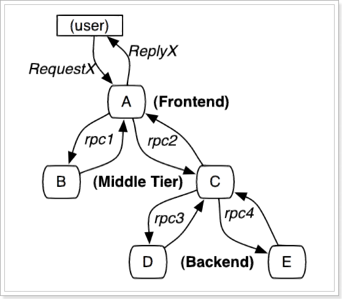 

如何才能实现跟踪呢？需要明白下面几个概念：

- **探针**：负责在客户端程序运行时搜索服务调用链路信息，发送给收集器
- 收集器：负责将数据格式化，保存到存储器
- 存储器：保存数据
- UI界面：统计并展示

探针会在链路追踪时记录每次调用的信息，Span是**基本单元**，一次链路调用（可以是RPC，DB等没有特定的限制）创建一个span，通过一个64位ID标识它；同时附加（Annotation）作为payload负载信息，用于记录性能等数据。

一个Span的基本数据结构：

```c++
type Span struct {
    TraceID    int64 // 用于标示一次完整的请求id
    Name       string
    ID         int64 // 当前这次调用span_id
    ParentID   int64 // 上层服务的调用span_id  最上层服务parent_id为null，代表根服务root
    Annotation []Annotation // 记录性能等数据
    Debug      bool
}
```

一次请求的每个链路，通过spanId、parentId就能串联起来：

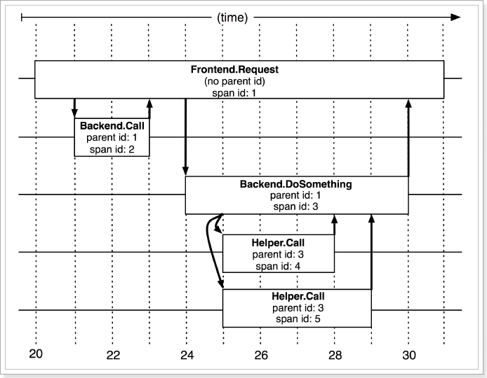 

当然，从请求到服务器开始，服务器返回response结束，每个span存在相同的唯一标识trace_id。


### 2.1.3.APM系统的选型

市面上的全链路监控理论模型大多都是借鉴Google Dapper论文，重点关注以下三种APM组件：

- **[Zipkin](https://link.juejin.im/?target=http%3A%2F%2Fzipkin.io%2F)**：由Twitter公司开源，开放源代码分布式的跟踪系统，用于收集服务的定时数据，以解决微服务架构中的延迟问题，包括：数据的收集、存储、查找和展现。
- **[Pinpoint](https://pinpoint.com/)**：一款对Java编写的大规模分布式系统的APM工具，由韩国人开源的分布式跟踪组件。
- **[Skywalking](https://skywalking.apache.org/zh/)**：国产的优秀APM组件，是一个对JAVA分布式应用程序集群的业务运行情况进行追踪、告警和分析的系统。现在是Apache的顶级项目之一

选项就是对比各个系统的使用差异，主要对比项：

1. **探针的性能**

   主要是agent对服务的吞吐量、CPU和内存的影响。微服务的规模和动态性使得数据收集的成本大幅度提高。

2. **collector的可扩展性**

   能够水平扩展以便支持大规模服务器集群。

3. **全面的调用链路数据分析**

   提供代码级别的可见性以便轻松定位失败点和瓶颈。

4. **对于开发透明，容易开关**

   添加新功能而无需修改代码，容易启用或者禁用。

5. **完整的调用链应用拓扑**

   自动检测应用拓扑，帮助你搞清楚应用的架构


三者对比如下：

| 对比项           | zipkin | pinpoint | skywalking |
| ---------------- | ------ | -------- | ---------- |
| 探针性能         | 中     | 低       | **高**     |
| collector扩展性  | **高** | 中       | **高**     |
| 调用链路数据分析 | 低     | **高**   | 中         |
| 对开发透明性     | 中     | **高**   | **高**     |
| 调用链应用拓扑   | 中     | **高**   | 中         |
| 社区支持         | **高** | 中       | **高**     |


综上所述，使用skywalking是最佳的选择。

## 2.2.Skywalking介绍

**SkyWalking** 创建与2015年，提供分布式追踪功能。从5.x开始，项目进化为一个完成功能的Application Performance Management系统。
他被用于追踪、监控和诊断分布式系统，特别是使用微服务架构，云原生或容积技术。提供以下主要功能：

- 分布式追踪和上下文传输
- 应用、实例、服务性能指标分析
- 根源分析
- 应用拓扑分析
- 应用和服务依赖分析
- 慢服务检测
- 性能优化

官网地址：http://skywalking.apache.org/

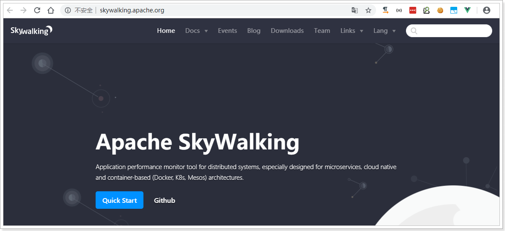


主要的特征：

- 多语言探针或类库

  - Java自动探针，追踪和监控程序时，不需要修改源码。
  - 社区提供的其他多语言探针
    - [.NET Core](https://github.com/OpenSkywalking/skywalking-netcore)
    - [Node.js](https://github.com/OpenSkywalking/skywalking-nodejs)

- 多种后端存储： ElasticSearch， H2

- 支持

  OpenTracing

  - Java自动探针支持和OpenTracing API协同工作

- 轻量级、完善功能的后端聚合和分析

- 现代化Web UI

- 日志集成

- 应用、实例和服务的告警


## 2.3.结构图

先来看下Skywalking的官方给出的结构图：

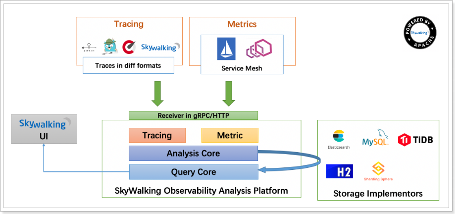

大致分四个部分：

- skywalking-oap-server：就是**O**bservability **A**nalysis **P**latformd的服务，用来收集和处理探针发来的数据
- skywalking-UI：就是skywalking提供的Web UI 服务，图形化方式展示服务链路、拓扑图、trace、性能监控等
- agent：探针，获取服务调用的链路信息、性能信息，发送到skywalking的OAP服务
- Storage：存储，一般选择elasticsearch

因此我们安装部署也从这四个方面入手，不过elasticsearch已经安装完成，还剩下3个。


## 2.4.安装OAP和UI服务

### 1）上传安装包

官方推荐的是源码安装，因此我们已经下载好了安装包：

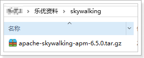 

我们上传到虚拟机的 `/usr/local/src`目录：

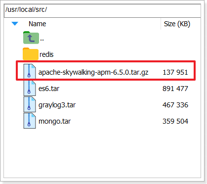 

### 2）解压

解压安装包，并重命名为skywalking：

```sh
# 解压
tar xvf apache-skywalking-apm-6.5.0.tar.gz
```

如图：

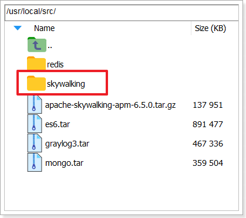 

目录结构：

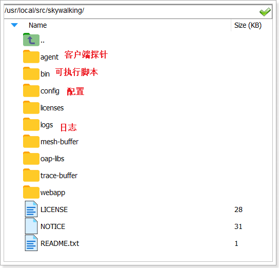 


### 3）修改配置

进入`config`目录，修改`application.yml`，主要是把存储方案从h2改为elasticsearch

建议直接使用下面的：

```yaml
# Licensed to the Apache Software Foundation (ASF) under one
# or more contributor license agreements.  See the NOTICE file
# distributed with this work for additional information
# regarding copyright ownership.  The ASF licenses this file
# to you under the Apache License, Version 2.0 (the
# "License"); you may not use this file except in compliance
# with the License.  You may obtain a copy of the License at
#
#     http://www.apache.org/licenses/LICENSE-2.0
#
# Unless required by applicable law or agreed to in writing, software
# distributed under the License is distributed on an "AS IS" BASIS,
# WITHOUT WARRANTIES OR CONDITIONS OF ANY KIND, either express or implied.
# See the License for the specific language governing permissions and
# limitations under the License.

cluster:
  standalone:
core:
  default:
    # Mixed: Receive agent data, Level 1 aggregate, Level 2 aggregate
    # Receiver: Receive agent data, Level 1 aggregate
    # Aggregator: Level 2 aggregate
    role: ${SW_CORE_ROLE:Mixed} # Mixed/Receiver/Aggregator
    restHost: ${SW_CORE_REST_HOST:0.0.0.0}
    restPort: ${SW_CORE_REST_PORT:12800}
    restContextPath: ${SW_CORE_REST_CONTEXT_PATH:/}
    gRPCHost: ${SW_CORE_GRPC_HOST:0.0.0.0}
    gRPCPort: ${SW_CORE_GRPC_PORT:11800}
    downsampling:
      - Hour
      - Day
      - Month
    # Set a timeout on metrics data. After the timeout has expired, the metrics data will automatically be deleted.
    enableDataKeeperExecutor: ${SW_CORE_ENABLE_DATA_KEEPER_EXECUTOR:true} # Turn it off then automatically metrics data delete will be close.
    dataKeeperExecutePeriod: ${SW_CORE_DATA_KEEPER_EXECUTE_PERIOD:5} # How often the data keeper executor runs periodically, unit is minute
    recordDataTTL: ${SW_CORE_RECORD_DATA_TTL:90} # Unit is minute
    minuteMetricsDataTTL: ${SW_CORE_MINUTE_METRIC_DATA_TTL:90} # Unit is minute
    hourMetricsDataTTL: ${SW_CORE_HOUR_METRIC_DATA_TTL:36} # Unit is hour
    dayMetricsDataTTL: ${SW_CORE_DAY_METRIC_DATA_TTL:45} # Unit is day
    monthMetricsDataTTL: ${SW_CORE_MONTH_METRIC_DATA_TTL:18} # Unit is month
    # Cache metric data for 1 minute to reduce database queries, and if the OAP cluster changes within that minute,
    # the metrics may not be accurate within that minute.
    enableDatabaseSession: ${SW_CORE_ENABLE_DATABASE_SESSION:true}
storage:
 elasticsearch:
   nameSpace: ${SW_NAMESPACE:"docker-cluster"}
   clusterNodes: ${SW_STORAGE_ES_CLUSTER_NODES:localhost:9201}
   protocol: ${SW_STORAGE_ES_HTTP_PROTOCOL:"http"}
   trustStorePath: ${SW_SW_STORAGE_ES_SSL_JKS_PATH:"../es_keystore.jks"}
   trustStorePass: ${SW_SW_STORAGE_ES_SSL_JKS_PASS:""}
   user: ${SW_ES_USER:""}
   password: ${SW_ES_PASSWORD:""}
   indexShardsNumber: ${SW_STORAGE_ES_INDEX_SHARDS_NUMBER:2}
   indexReplicasNumber: ${SW_STORAGE_ES_INDEX_REPLICAS_NUMBER:0}
   # Those data TTL settings will override the same settings in core module.
   recordDataTTL: ${SW_STORAGE_ES_RECORD_DATA_TTL:1} # Unit is day
   otherMetricsDataTTL: ${SW_STORAGE_ES_OTHER_METRIC_DATA_TTL:25} # Unit is day
   monthMetricsDataTTL: ${SW_STORAGE_ES_MONTH_METRIC_DATA_TTL:1} # Unit is month
   # Batch process setting, refer to https://www.elastic.co/guide/en/elasticsearch/client/java-api/5.5/java-docs-bulk-processor.html
   bulkActions: ${SW_STORAGE_ES_BULK_ACTIONS:1000} # Execute the bulk every 1000 requests
   flushInterval: ${SW_STORAGE_ES_FLUSH_INTERVAL:10} # flush the bulk every 10 seconds whatever the number of requests
   concurrentRequests: ${SW_STORAGE_ES_CONCURRENT_REQUESTS:2} # the number of concurrent requests
   resultWindowMaxSize: ${SW_STORAGE_ES_QUERY_MAX_WINDOW_SIZE:10000}
   metadataQueryMaxSize: ${SW_STORAGE_ES_QUERY_MAX_SIZE:5000}
   segmentQueryMaxSize: ${SW_STORAGE_ES_QUERY_SEGMENT_SIZE:200}
receiver-sharing-server:
  default:
receiver-register:
  default:
receiver-trace:
  default:
    bufferPath: ${SW_RECEIVER_BUFFER_PATH:../trace-buffer/}  # Path to trace buffer files, suggest to use absolute path
    bufferOffsetMaxFileSize: ${SW_RECEIVER_BUFFER_OFFSET_MAX_FILE_SIZE:100} # Unit is MB
    bufferDataMaxFileSize: ${SW_RECEIVER_BUFFER_DATA_MAX_FILE_SIZE:500} # Unit is MB
    bufferFileCleanWhenRestart: ${SW_RECEIVER_BUFFER_FILE_CLEAN_WHEN_RESTART:false}
    sampleRate: ${SW_TRACE_SAMPLE_RATE:10000} # The sample rate precision is 1/10000. 10000 means 100% sample in default.
    slowDBAccessThreshold: ${SW_SLOW_DB_THRESHOLD:default:200,mongodb:100} # The slow database access thresholds. Unit ms.
receiver-jvm:
  default:
receiver-clr:
  default:
service-mesh:
  default:
    bufferPath: ${SW_SERVICE_MESH_BUFFER_PATH:../mesh-buffer/}  # Path to trace buffer files, suggest to use absolute path
    bufferOffsetMaxFileSize: ${SW_SERVICE_MESH_OFFSET_MAX_FILE_SIZE:100} # Unit is MB
    bufferDataMaxFileSize: ${SW_SERVICE_MESH_BUFFER_DATA_MAX_FILE_SIZE:500} # Unit is MB
    bufferFileCleanWhenRestart: ${SW_SERVICE_MESH_BUFFER_FILE_CLEAN_WHEN_RESTART:false}
istio-telemetry:
  default:
envoy-metric:
  default:
#    alsHTTPAnalysis: ${SW_ENVOY_METRIC_ALS_HTTP_ANALYSIS:k8s-mesh}
#receiver_zipkin:
#  default:
#    host: ${SW_RECEIVER_ZIPKIN_HOST:0.0.0.0}
#    port: ${SW_RECEIVER_ZIPKIN_PORT:9411}
#    contextPath: ${SW_RECEIVER_ZIPKIN_CONTEXT_PATH:/}
query:
  graphql:
    path: ${SW_QUERY_GRAPHQL_PATH:/graphql}
alarm:
  default:
telemetry:
  none:
configuration:
  none:
```

**注意elasticsearch的ip和端口**

安装JDK，上传jdk到/usr/local/src目录，解压，配置环境变量

 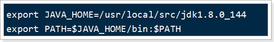

### 4）启动

要确保已经启动了elasticsearch，并且防火墙已经关闭。

**启动时如果没有效果，先配置java环境变量**

进入`bin`目录，执行命令即可运行：

```sh
./startup.sh && tail -f ../logs/skywalking-oap-server.log 
```


默认的UI端口是8080，可以访问：http://192.168.206.99:8080

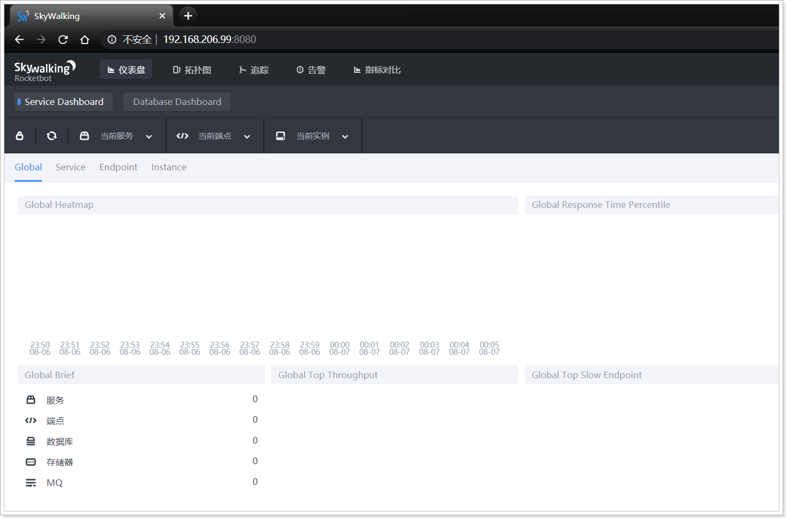


## 2.5.微服务探针

现在，Skywalking的服务端已经启动完成，我们还需要在微服务中加入服务探针，来收集数据。

### 1）解压9

首先，将课前资料给的压缩包在windows环境下解压：

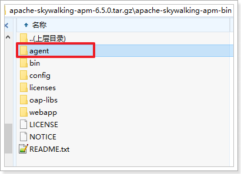 

将其中的`agent`解压到某个目录，不要出现中文，可以看到其结构如下：

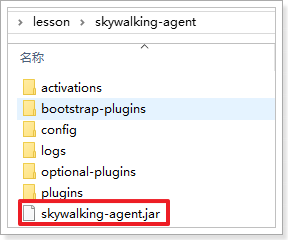 

其中有一个`skywalking-agent.jar`就是一我们要用的探针。

### 2）配置

分别给`ly-registry`、`ly-gateway`、`ly-item-service`三个应用配置即可。

以`ly-registry`为例，在IDEA工具中，选择要修改的启动项，点击右键，选择`Edit Configuration`：

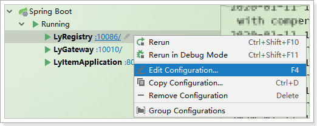 

然后在弹出的窗口中，点击`Environment`，选择`VM options`后面对应的展开按钮：

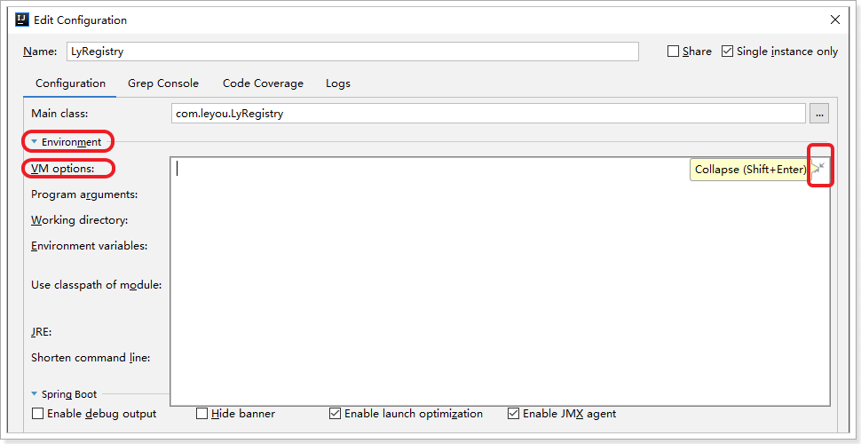

在展开的输入框中，输入下面的配置：

```powershell
-javaagent:D:/develop/skywalking-agent/skywalking-agent.jar
-Dskywalking.agent.service_name=ly-registry
-Dskywalking.collector.backend_service=192.168.206.99:11800
```

注意：

- `-javaagent:D:/test/skywalking-agent.jar：配置的是skywalking-agent.jar这个包的位置，要修改成你自己存放的目录
- `-Dskywalking.agent.service_name=ly-registry`：是当前项目的名称，需要分别修改为`ly-registry`、`ly-gateway`、`ly-item-service`
- `-Dskywalking.collector.backend_service=192.168.206.99:11800`：是Skywalking的OPA服务地址，采用的是GRPC通信，因此端口是11800，不是8080

### 3）启动项目

Skywalking的探针会在项目启动前对class文件进行修改，完成探针植入，对业务代码**零侵入**，所以我们只需要启动项目，即可生效了。

启动3个项目，然后对之前的业务接口访问。然后就可以在控制台：http://192.168.206.99:8080

看到统计数据：

## 2.6.数据统计

检测到有3个服务：

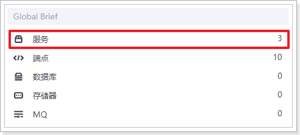 

访问最慢的endpoint排名：

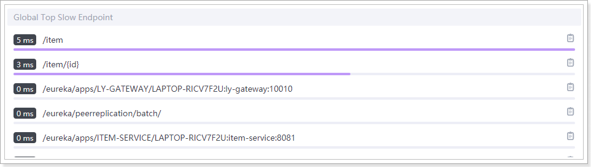

当前服务的部分性能信息：

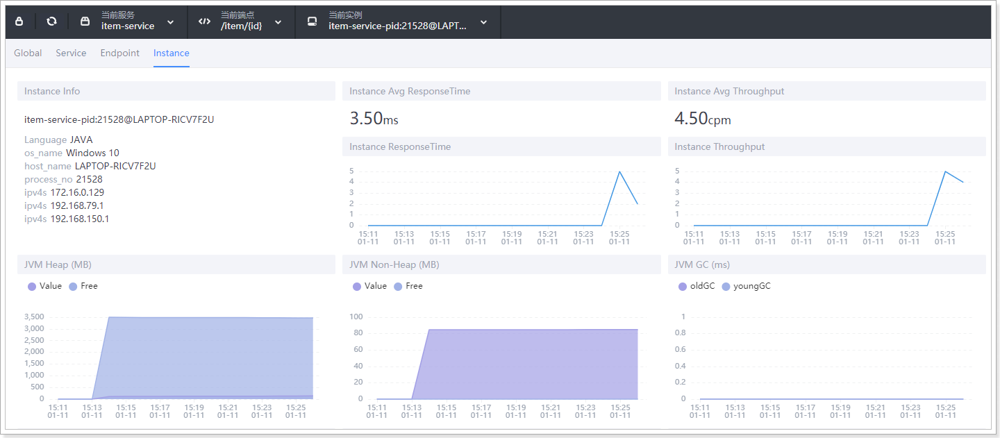

服务关系拓扑图：

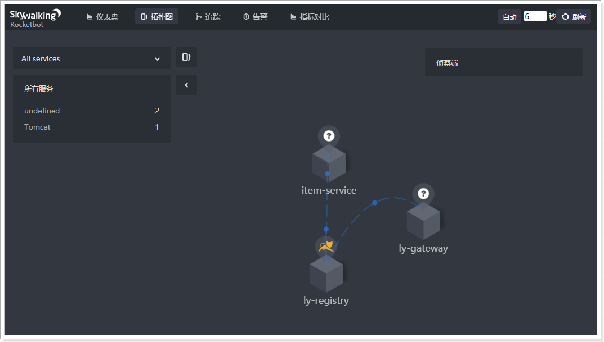

访问链路追踪图：

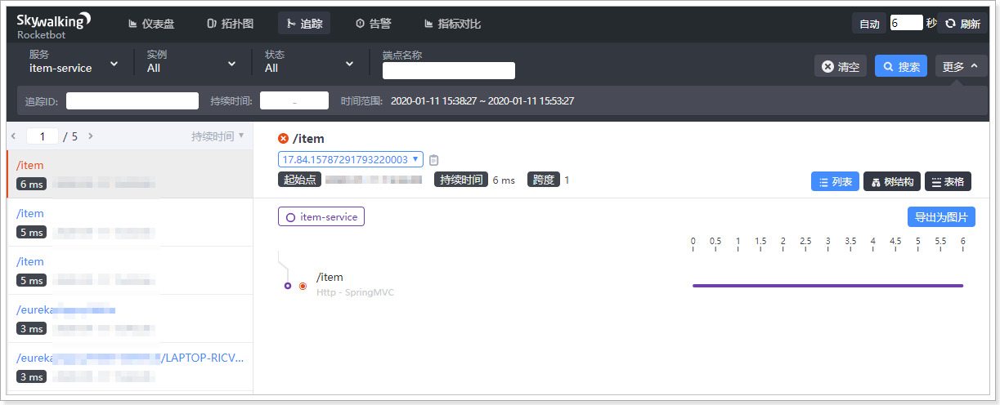

当前业务链路较短，如果链路比较深，也可以看到完整链路信息。


