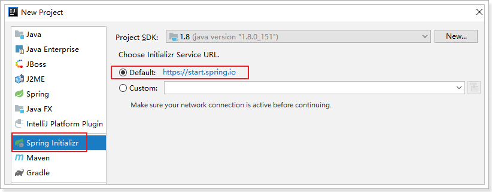
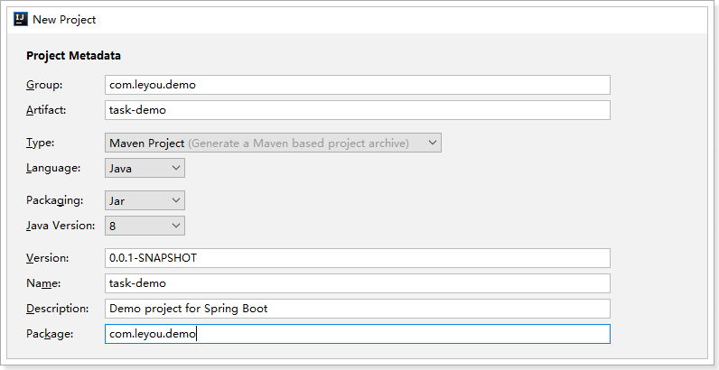
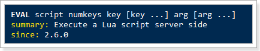
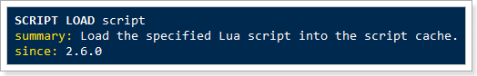
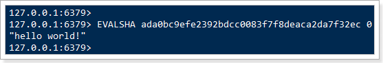
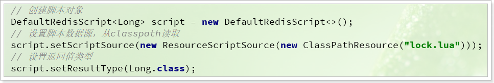

# 0.学习目标

- 知道什么是分布式锁
- 知道分布式锁的几种实现方式
- 知道Redis分布式锁原理
- 会使用SpringDataRedis执行Lua脚本
- 掌握Redission的使用


# 1.SpringSchedule

之前我们学习过Quartz这个定时任务框架，功能非常强大，不过我们有时候也会用到一些其它的定时任务框架。

## 1.1.常见的定时任务框架

目前常用的定时任务实现:

| 实现方式        | cron表达式 | 固定时间执行 | 固定频率执行 | 开发难易程度 |
| --------------- | ---------- | ------------ | ------------ | ------------ |
| JDK 的TimeTask  | 不支持     | 支持         | 支持         | 复杂         |
| Spring Schedule | 支持       | 支持         | 支持         | 简单         |
| Quartz          | 支持       | 支持         | 支持         | 难           |

从以上表格可以看出，Spring Schedule框架功能完善，简单易用。对于中小型项目需求，Spring Schedule是完全可以胜任的。


## 1.2.简介

Spring Schedule是Spring  Framework的其中一部分功能：


并且在SpringBoot中已经默认对Spring的Schedule实现了自动配置，使用时只需要简单注解和部分属性设置即可。

## 1.3.快速入门

我们新建一个Demo工程，完成入门案例的测试：

### 1.3.1.创建项目

使用Spring的 initializr来搭建项目：





选择依赖：


### 1.3.2.开启定时任务

要开启定时任务功能，只需要在启动类上加载一个`@EnableScheduling`注解即可：

```java
@SpringBootApplication
@EnableScheduling
public class TaskDemoApplication {

    public static void main(String[] args) {
        SpringApplication.run(TaskDemoApplication.class, args);
    }
}
```

### 1.3.3.定义任务

定义任务，需要散步：

- 声明类，通过`@Component`注解注册到Spring容器
- 类中定义方法，方法内部编写任务逻辑
- 方法上添加注解`@Scheduled(fixedRate = 1000)`来定义任务执行频率，
  - 这里的fiexRate=1000，代表是每隔1000毫秒执行一次

 

```java
package com.leyou.task.job;

import lombok.extern.slf4j.Slf4j;
import org.springframework.scheduling.annotation.Scheduled;
import org.springframework.stereotype.Component;


@Slf4j
@Component
public class HelloJob {

    @Scheduled(fixedRate = 1000)
    public void hello(){
        log.info("hello spring schedule!");
    }
}
```

### 1.3.4.启动测试

启动项目，可以在控制台看到任务执行情况：


## 1.4.配置

定时任务有许多可以自定义的配置属性：

### 1.4.1.任务线程池大小

默认情况下，定时任务的线程池大小只有1，**当任务较多执行频繁时，会出现阻塞等待的情况**，任务调度器就会出现**时间漂移**，任务执行时间将不确定。

为了避免这样的情况发生，我们需要自定义线程池的大小：

修改application.yml即可实现：

```yaml
spring:
  task:
    scheduling:
      pool:
        size: 10
```

重启项目后测试：


可以看到执行时会切换到不同的线程执行。

### 1.4.2.定时策略

在方法上添加注解`@Scheduled`可以控制定时执行的频率，有三种策略：

- fixedRate：按照固定时间频率执行，单位毫秒，即每xx毫秒执行一次。
  - 如果上一个任务阻塞导致任务积压，则会在当前任务执行后，一次把多个积压的任务都执行完成
  - 举例：假如任务执行每秒1次，而第一个任务执行耗时4秒，会导致4个任务积压，在第一个任务执行后，积压的4个任务会立即执行，不再等待
- fixedDelay：固定延迟执行，单位毫秒，即前一个任务执行结束后xx毫秒执行第二个任务。
  - 如果上一个任务阻塞导致任务积压，则会在当前任务执行后xx毫秒执行下一个任务
- cron：知名的cron表达式，使用表达式规则来定义任务执行策略，与fixedDelay类似的。


### 1.4.3.cron表达式

什么是cron表达式呢？

Cron表达式是一个字符串，字符串包含6或7个域，每一个域代表一个含义，例如秒、分。域和域之间以空格隔开，有如下两种语法格式：

-  Seconds Minutes Hours DayofMonth Month DayofWeek Year
-  Seconds Minutes Hours DayofMonth Month DayofWeek

cron表达式规则：

| 域                       | 允许值                                 | 允许的特殊字符           |
| ------------------------ | -------------------------------------- | ------------------------ |
| 秒（Seconds）            | 0~59的整数                             | ,   -   *   /            |
| 分（*Minutes*）          | 0~59的整数                             | ,   -   *   /            |
| 小时（*Hours*）          | 0~23的整数                             | ,   -   *   /            |
| 日期（*DayofMonth*）     | 1~31的整数（但是你需要考虑你月的天数） | ,   -   *  ?   /  L W C  |
| 月份（*Month*）          | 1~12的整数或者 JAN-DEC                 | ,   -   *   /            |
| 星期（*DayofWeek*）      | 1~7的整数或者 SUN-SAT （1=SUN）        | ,   -   *  ?   /  L C  # |
| 年(可选，留空)（*Year*） | 1970~2099                              | ,   -   *   /            |

每个域上一般都是数字，或者指定允许的特殊字符：

| 特殊字符 | 说明                                                         |
| -------- | ------------------------------------------------------------ |
| *        | 表示匹配该域的任意值。假如在Minutes域使用, 即表示每分钟都会触发事件 |
| ?        | 只能用在DayofMonth和DayofWeek两个域中的一个。它表示不确定的值 |
| -        | 表示范围。例如在Hours域使用5-8，表示从5点、6点、7点、8点各执行一次 |
| ,        | 表示列出枚举值。例如：在week域使用FRI,SUN，表示星期五和星期六执行 |
| /        | 一般用法：x/y，从x开始，每次递增y。如果放在minutes域，5/15，表示每小时的5分钟开始，每隔15分钟一次，即：5分钟、20分钟、35分钟、50分钟时执行 |
| L        | 表示最后，只能出现在DayofWeek和DayofMonth域。如果在DayOfMonth中，代表每个月的最后一天。如果是在DayOfWeek域，表示每周最后一天（周六），但是如果是：数字+L，如6L表示每月的 最后一个周五 |
| W        | 表示最近的有效工作日(周一到周五),只能出现在DayofMonth域，系统将在离指定日期的最近的有效工作日触发事件。例如：在 DayofMonth使用5W，如果5日是星期六，则将在最近的工作日：星期五，即4日触发。如果5日是星期天，则在6日(周一)触发；如果5日在星期一到星期五中的一天，则就在5日触发。另外一点，W的最近寻找不会跨过月份 。 |
| LW       | 两个字符可以连用，表示在某个月最后一个工作日，即最后一个星期五 |
| #        | 用在DayOfMonth中，确定每个月第几个星期几。例如在4#2，表示某月的第二个星期三（2表示当月的第二周，4表示这周的第4天，即星期三）。 |


示例：

| 表达式                     | 含义                                                 |
| -------------------------- | ---------------------------------------------------- |
| `0 0 2 1 * ?  *`           | 表示在每月的1日的凌晨2点执行任务                     |
| `0 15 10 ?  * MON-FRI`     | 表示周一到周五每天上午10:15执行作                    |
| `0 15 10 ? * 6L 2002-2006` | 表示2002-2006年的每个月的最后一个星期五上午10:15执行 |
| `0 0 9-21 * * 2-7`         | 996                                                  |

我们把代码修改一下：

```java

@Slf4j
@Component
public class HelloJob {

    @Scheduled(cron = "0/2 * * * * ?")
    public void hello() throws InterruptedException {
        log.info("hello spring schedule!");
    }
}
```

测试：


# 2.认识分布式锁

在讨论分布式锁前，我们先假设一个业务场景：

## 2.1.业务场景

我们在订单服务中开启一个定时任务，每隔一段时间扫描超时未支付订单，然后完成订单清理。

在这个定时任务中，需要完成的业务步骤主要包括：

1. 查询超时未支付订单，获取订单中商品信息
2. 修改这些未支付订单的状态，为已关闭
3. 恢复订单中商品扣减的库存

如图：


因为订单服务可能是一个包含多节点的集群，例如包含10台订单微服务，那么并发时可能发生这样的事情：

- 订单服务A执行了步骤1，但还没有执行步骤2
- 订单服务B执行了步骤1，于是查询到了与订单服务A查询到的一样的数据
- 订单服务A执行步骤2和3，此时订单中对应商品的库存已经恢复了
- 订单服务B也执行了步骤2和步骤3，此时订单中对应商品的库存再次被增加
- 库存被错误的恢复了多次，==事实上只需要执行一次就可以了==。

就像这样：


因为任务的并发执行，出现了线程安全问题，商品库存被错误的增加了多次，你能想到解决办法吗？


## 2.2.为什么需要分布式锁

对于线程安全问题，我们都很熟悉了，传统的解决方案就是对线程操作资源的代码加锁。如图：


理想状态下，加了锁以后，在当前订单服务执行时，其它订单服务需要等待当前订单服务完成业务后才能执行，这样就避免了线程安全问题的发生。

但是，这样真的能解决问题吗？

答案时否定的，为什么呢。

### 2.2.1.线程锁

我们通常使用的synchronized或者Lock都是线程锁，对同一个JVM进程内的多个线程有效。因为锁的本质是内存中存放一个标记，记录获取锁的线程时谁，**这个标记对每个线程都可见**。

- 获取锁：就是判断标记中是否已经有线程存在，如果有，则获取锁失败，如果没有，在标记中记录当前线程
- 释放锁：就是删除标记中保存的线程，并唤醒等待队列中的其它线程

因此，锁生效的前提是：

- 互斥：锁的标记只有一个线程可以获取
- 共享：标记对所有线程可见

然而我们启动的多个订单服务，就是多个JVM，内存中的锁显然是不共享的，每个JVM进程都有自己的锁，自然无法保证线程的互斥了，如图：


要解决这个问题，就必须保证各个订单服务能够共享内存中的锁标记，此时，分布式锁就闪亮登场了！


### 2.2.2.分布式锁

线程锁时一个多线程可见的内存标记，保证同一个任务，同一时刻只能被多线程中的某一个执行。但是这样的锁在分布式系统中，多进程环境下， 就达不到预期的效果了。

而如果我们==将这个标记变成多进程可见，保证这个任务同一时刻只能被多个进程中的某一个执行，那这样的锁就是分布式锁==了。


分布式锁实现有多种方式，其原理都基本类似，只要满足下列要求即可：

- **多进程可见**：多进程可见，否则就无法实现分布式效果
- **互斥**：同一时刻，只能有一个进程获得锁，执行任务后释放锁
- 可重入（可选）：同一个任务再次获取改锁不会被死锁
- 阻塞锁（可选）：获取失败时，具备重试机制，尝试再次获取锁
- 性能好（可选）：效率高，应对高并发场景
- 高可用：避免锁服务宕机或处理好宕机的补救措施


常见的分布式锁实现方案包括：==基于数据库实现、基于缓存(redis)实现、基于zookeeper==等.


# 3.Redis实现分布式锁

按照上面的分析，实现分布是锁要满足五点：多进程可见，互斥，可重入，阻塞，高性能，高可用等。我们来看看Redis如何满足这些需求。

## 3.1.版本1-基本实现

第一次尝试，我们先关注其中必须满足的2个条件：

- 多进程可见
- 互斥，锁可释放


1）多进程可见

首先Redis本身就是基于JVM之外的，因此满足多进程可见的要求。

2）互斥

互斥就是说只能有一个进程获取锁标记，这个我们可以基于Redis的setnx指令来实现。setnx是set when not exits的意思。当多次执行setnx命令时，只有第一次执行的才会成功并返回1，其它情况返回0：

 

多个进程来对同一个key执行setnx操作，肯定只有一个能执行成功，其它一定会失败，满足了互斥的需求。

3）释放锁

释放锁其实只需要把锁的key删除即可，使用del xxx指令。不过，仔细思考，如果在我们执行del之前，服务突然宕机，那么锁岂不是永远无法删除了？！

为了避免因服务宕机引起锁无法释放问题，我们可以在获取锁的时候，给锁加一个有效时间，当时间超出时，就会自动释放锁，这样就不会死锁了。

但时setnx指令没有设置时间的功能，我们要借助于set指令，然后结合set的 NX和PX参数来完成。

 

其中可以指定这样几个参数：

- EX：过期时长，单位是秒
- PX：过期时长，单位是毫秒
- NX：等同于setnx


因此，获取和释放锁的基本流程如图：


步骤如下：

- 1、通过set命令设置锁
- 2、判断返回结果是否是OK
  - 1）Nil，获取失败，结束或重试（自旋锁）
  - 2）OK，获取锁成功
    - 执行业务
    - 释放锁，DEL 删除key即可
- 3、异常情况，服务宕机。超时时间EX结束，会自动释放锁


## 3.2.版本2-互斥性

刚才的初级版本中，会有一定的安全问题。

### 3.2.1.问题分析

大家思考一下，释放锁就是用DEL语句把锁对应的key给删除，有没有这么一种可能性：

1. 3个进程：A和B和C，在执行任务，并争抢锁，此时A获取了锁，并设置自动过期时间为10s
2. A开始执行业务，因为某种原因，业务阻塞，耗时超过了10秒，此时锁自动释放了
3. B恰好此时开始尝试获取锁，因为锁已经自动释放，成功获取锁
4. A此时业务执行完毕，执行释放锁逻辑（删除key），于是B的锁被释放了，而B其实还在执行业务
5. 此时进程C尝试获取锁，也成功了，因为A把B的锁删除了。

问题出现了：B和C同时获取了锁，违反了互斥性！

如何解决这个问题呢？我们应该在删除锁之前，判断这个锁是否是自己设置的锁，如果不是（例如自己的锁已经超时释放），那么就不要删除了。

### 3.2.2.解决思路

那么问题来了：**如何得知当前获取锁的是不是自己**呢？

我们可以在set 锁时，存入当前线程的唯一标识！删除锁前，判断下里面的值是不是与自己标识释放一致，如果不一致，说明不是自己的锁，就不要删除了。

流程如图：


### 3.2.3.代码实现

我们创建一个SpringBoot项目，引入一些依赖：

```xml
<dependency>
    <groupId>org.springframework.boot</groupId>
    <artifactId>spring-boot-starter-web</artifactId>
</dependency>

<dependency>
    <groupId>org.projectlombok</groupId>
    <artifactId>lombok</artifactId>
    <optional>true</optional>
</dependency>
<dependency>
    <groupId>org.springframework.boot</groupId>
    <artifactId>spring-boot-starter-test</artifactId>
    <scope>test</scope>
</dependency>
<dependency>
    <groupId>org.springframework.boot</groupId>
    <artifactId>spring-boot-starter-data-redis</artifactId>
</dependency>
<dependency>
    <groupId>org.apache.commons</groupId>
    <artifactId>commons-lang3</artifactId>
</dependency>
```

在application.yml中指定redis地址：

```yaml
spring:
  redis:
    host: ly-redis
```


首先定义一个锁接口：

```java
package cn.itcast.demo.lock;


public interface RedisLock {

    /**
     * 尝试获取锁
     * @return true: 获取锁成功， false：获取锁失败
     */
    boolean tryLock(long releaseTime);

    /**
     * 释放锁
     */
    void unlock();
}
```

然后定义一个实现类：

```java
package cn.itcast.demo.lock;

import org.apache.commons.lang3.BooleanUtils;
import org.apache.commons.lang3.StringUtils;
import org.springframework.data.redis.core.StringRedisTemplate;

import java.util.UUID;
import java.util.concurrent.TimeUnit;


public class SimpleRedisLock implements RedisLock {
    /**
     * 锁的名称
     */
    private final String key;
    /**
     * redis模板
     */
    private final StringRedisTemplate redisTemplate;

    private final String VALUE_PREFIX = UUID.randomUUID().toString();

    public SimpleRedisLock(String key, StringRedisTemplate redisTemplate) {
        this.key = key;
        this.redisTemplate = redisTemplate;
    }

    @Override
    public boolean tryLock(long releaseTime) {
        // 当前线程的锁标示
        String value = VALUE_PREFIX + Thread.currentThread().getId();
        // 尝试获取锁
        Boolean boo = redisTemplate.opsForValue().setIfAbsent(key, value, releaseTime, TimeUnit.SECONDS);
        // 判断结果
        return BooleanUtils.isTrue(boo);
    }

    @Override
    public void unlock() {
        // 当前线程的锁标示
        String value = VALUE_PREFIX + Thread.currentThread().getId();
        // 获取redis中的锁标示
        String cacheValue = redisTemplate.opsForValue().get(key);
        // 比较
        if(StringUtils.equals(value, cacheValue)){
            // 一致，是自己的锁，删除
            redisTemplate.delete(key);
        }
    }
}
```


接下来，定义一个锁工厂，方便用户获取锁对象：

```java
package cn.itcast.demo.lock;

import org.springframework.data.redis.core.StringRedisTemplate;
import org.springframework.stereotype.Component;


@Component
public class RedisLockFactory {

    private final StringRedisTemplate redisTemplate;

    public RedisLockFactory(StringRedisTemplate redisTemplate) {
        this.redisTemplate = redisTemplate;
    }

    public SimpleRedisLock getSimpleRedisLock(String key){
        return new SimpleRedisLock(key, redisTemplate);
    }
}
```


最后编写一个单元测试：

```java
package cn.itcast.demo.task;

import cn.itcast.demo.lock.RedisLockFactory;
import cn.itcast.demo.lock.SimpleRedisLock;
import lombok.extern.slf4j.Slf4j;
import org.springframework.scheduling.annotation.Scheduled;
import org.springframework.stereotype.Component;


@Slf4j
@Component
public class LockTask {

    // 获取锁对象
    private SimpleRedisLock lock;

    public LockTask(RedisLockFactory factory) {
        lock = factory.getSimpleRedisLock("lock");
    }

    @Scheduled(cron = "0/10 * * * * ?")
    public void job(){
        log.warn("尝试获取锁");
        // 尝试获取锁
        boolean isLock = lock.tryLock(200);
        // 判断是否成功
        if(!isLock){
            // 获取锁失败，任务终止
            log.error("获取锁失败，任务结束！");
            return;
        }
        try {
            // 获取锁成功，开始执行任务
            log.info("获取锁成功，开始执行业务");
            clearOrder();
        }finally {
            log.warn("任务执行结束，释放锁");
            // 释放锁
            lock.unlock();
        }
    }

    private void clearOrder() {
        try {
            // 默认任务延迟
            Thread.sleep(500);
        } catch (InterruptedException e) {
            e.printStackTrace();
        }
    }
}
```


同时启动项目的两个副本：

 

可以看到定时任务会实现互斥效果。


## 3.3.版本3-重入性（了解）

接下来我们来看看分布式锁的第三个特性，重入性。

如果我们在获取锁以后，执行代码的过程中，再次尝试获取锁，执行setnx肯定会失败，因为锁已经存在了。这样有可能导致死锁，这样的锁就是**不可重入**的。

如何解决呢？

当然是想办法改造成**可重入锁**。

### 3.4.1.重入锁

什么叫做可重入锁呢？

> 可重入锁，也叫做递归锁，指的是在同一线程内，外层函数获得锁之后，内层递归函数仍然可以获取到该锁。换一种说法：**同一个线程再次进入同步代码时，可以使用自己已获取到的锁。**

可重入锁可以避免因同一线程中多次获取锁而导致死锁发生。


那么，如何实现可重入锁呢？

- 获取锁：首先尝试获取锁，如果获取失败，**判断这个锁是否是自己的，如果是则允许再次获取**，而且必须记录重复获取锁的次数。
- 释放锁：释放锁不能直接删除了，因为锁是可重入的，如果锁进入了多次，在最内层直接删除锁，导致外部的业务在没有锁的情况下执行，会有安全问题。因此必须**获取锁时累计重入的次数，释放时则减去重入次数，如果减到0，则可以删除锁**.

因此，存储在锁中的信息就必须包含：key、线程标识、重入次数。不能再使用简单的key-value结构，这里推荐使用hash结构：

- key：lock
- hashKey：线程信息
- hashValue：重入次数，默认1


### 3.4.2.流程图

需要用到的一些Redis命令包括：

- EXISTS key：判断一个Key是否存在
- HEXISTS key field：判断一个hash的field是否存在
- HSET key field value ：给一个hash的field设置一个值
- HINCRBY key field increment：给一个hash的field值增加指定数值
- EXPIRE key seconds：给一个key设置过期时间
- DEL key：删除指定key

具体流程如图：


下面我们假设锁的key为“`lock`”，hashKey是当前线程的id：“`threadId`”，锁自动释放时间假设为20

获取锁的步骤：

- 1、判断lock是否存在 `EXISTS lock`
  - 存在，说明有人获取锁了，下面判断是不是自己的锁
    - 判断当前线程id作为hashKey是否存在：`HEXISTS lock threadId`
      - 不存在，说明锁已经有了，且不是自己获取的，锁获取失败，end
      - 存在，说明是自己获取的锁，重入次数+1：`HINCRBY lock threadId 1`，去到步骤3
  - 2、不存在，说明可以获取锁，`HSET key threadId 1`
  - 3、设置锁自动释放时间，`EXPIRE lock 20`

释放锁的步骤：

- 1、判断当前线程id作为hashKey是否存在：`HEXISTS lock threadId`
  - 不存在，说明锁已经失效，不用管了
  - 存在，说明锁还在，重入次数减1：`HINCRBY lock threadId -1`，获取新的重入次数
- 2、判断重入次数是否为0：
  - 为0，说明锁全部释放，删除key：`DEL lock`
  - 大于0，说明锁还在使用，重置有效时间：`EXPIRE lock 20`


## 3.4.Lua脚本

上面探讨的Redis锁实现方案都忽略了一个非常重要的问题：**原子性**问题。无论是获取锁，还是释放锁的过程，都是有多行Redis指令来完成的，如果不能保证这些Redis命令执行的原子性，则整个过程都是不安全的。

而Redis中支持以Lua脚本来运行多行命令，并且保证整个脚本运行的原子性。

接下来，我们分几块来学习Lua脚本的使用：

- Redis中如何执行Lua脚本
- Lua脚本的基本语法
- 编写上述分布式锁对应的Lua脚本

### 3.4.1.Redis中如何执行Lua脚本

与操作Lua相关的命令如下：

| 序号 | 命令及描述                                                   |
| :--- | :----------------------------------------------------------- |
| 1    | `EVAL script numkeys key [key ...] arg [arg ...]` 执行 Lua 脚本。 |
| 2    | `EVALSHA sha1 numkeys key [key ...] arg [arg ...]`  执行 Lua 脚本。 |
| 3    | `SCRIPT EXISTS script [script ...] ` 查看指定的脚本是否已经被保存在缓存当中。 |
| 4    | `SCRIPT FLUSH`  从脚本缓存中移除所有脚本。                   |
| 5    | `SCRIPT KILL`  杀死当前正在运行的 Lua 脚本。                 |
| 6    | `SCRIPT LOAD script`  将脚本 script 添加到脚本缓存中，但并不立即执行这个脚本。 |

其中我们会用到的几个：

> EVAL命令：

 

直接执行一段脚本，参数包括：

- script：脚本内容，或者脚本地址
- numkeys：脚本中用到的key的数量，接下来的numkeys个参数会作为key参数，剩下的作为arg参数
- key：作为key的参数，会被存入脚本环境中的KEYS数组，角标从1开始
- arg：其它参数，会被存入脚本环境中的ARGV数组，角标从1开始


示例：`EVAL "return 'hello world!'" 0`，其中：

- `"return 'hello world!'"`：就是脚本的内容，直接返回字符串，没有别的命令
- `0`：就是说没有用key参数，直接返回

效果：

 


> SCRIPT LOAD命令

 

将一段脚本编译并缓存起来，生成一个SHA1值并返回，作为脚本字典的key，方便下次使用。

参数script就是脚本内容或地址。

以之前案例中的的脚本为例：

 

此处返回的`ada0bc9efe2392bdcc0083f7f8deaca2da7f32ec`就是脚本缓存后得到的sha1值。

在脚本字典中，每一个这样的sha1值，对应一段解析好的脚本：

 


> EVALSHA 命令：

 

与EVAL类似，执行一段脚本，区别是通过脚本的sha1值，去脚本缓存中查找，然后执行，参数：

- sha1：就是脚本对应的sha1值

我们用刚刚缓存的脚本为例：

 


### 3.4.2.Lua脚本的基本语法

Lua的详细语法大家可以参考网站上的一些教学，例如：[Lua菜鸟教程](https://www.runoob.com/lua/lua-tutorial.html)，任何语言都是从基本的如：变量、数据类型、循环、逻辑判断、运算、数组等入手。相信熟悉java的你应该可以快速上手Lua。

我们的分布式锁脚本中，主要用到的是对Redis指令的调用，还有`if ... else`这样的逻辑判断，再加上一些变量声明等。因此我们从这几块入手，看一些简单命令即可：

1）变量声明

声明一个局部变量，用local关键字即可：

```lua
local a = 123
```

2）打印结果

```lua
print('hello world')
```

3）条件控制

```lua
if( 布尔表达式 1)
then
   --[ 在布尔表达式 1 为 true 时执行该语句块 --]

elseif( 布尔表达式 2)
then
   --[ 在布尔表达式 2 为 true 时执行该语句块 --]
else 
   --[ 如果以上布尔表达式都不为 true 则执行该语句块 --]
end
```

4）循环语句：

```lua
while( true )
do
   print("循环将永远执行下去")
end
```

注意，使用break可以跳出循环。

大家能否利用上述语法编写一个猜数字的小游戏？

提示：`io.read("*num")`可以用来读取一个用户输入的数字


代码示例：

```lua
while(true) do
  print('请输入一个数字:')
  local a = io.read("*num")
  if(a > 100) then
    print('太大了')
  elseif(a < 100) then
    print('太小了')
  else
    print('bingo!猜对了!')
    break
  end
end
```

 


5）Lua调用Redis指令

当我们再Redis中允许Lua脚本时，有一个内置变量redis，并且具备两个函数：

- `redis.call("命令名称", 参数1， 参数2 ...)`: 执行指定的redis命令，执行遇到错误会直接返回错误
- `redis.pcall("命令名称", 参数1， 参数2 ...)`: 执行指定的redis命令，执行遇到错误会错误以Lua表的形式返回

例如：

```lua
redis.call('SET', 'num', '123')
```

这行Lua脚本的含义就是执行Redis命令：`set num 123`


不过，我们编写脚本时并不希望把set后面的key和value写死，而是可以由调用脚本的人来指定，把key和value作为参数传入脚本中执行。

还记得redis中的EVAL命令吗？

```
EVAL script numkeys key [key ...] arg [arg ...]
```

EVAL执行脚本时可以接受参数，key和arg，并且会用两个内置变量（数组格式）来接受用户传入的key和arg参数：

- KEYS：用来存放key参数
- ARGV：用来存放除Key以外的参数


我们在脚本中，可以从数组中根据角标（Lua中数组角标时从1开始）取出用户传入的参数，像这样：

```lua
redis.call('SET', KEYS[1], ARGV[1])
```


而后，我们在执行脚本时可以动态指定key及需要存放的value值：

```
EVAL "return redis.call('SET', KEYS[1], ARGV[1])" 1 num 666
```


### 3.4.3.编写分布式锁的Lua脚本

接下来，我们就可以将上面的分布式锁思路用Lua脚本来实现了。

#### 1）普通互斥锁

先看版本2的实现：

- 获取锁：直接使用客户端的set nx ex 命令即可，无需脚本
- 释放锁：因为要判断锁中的标识是否时自己的，因此需要脚本，如下：

长的：

```lua
-- 知道当前线程的锁标示
local threadId = ARGV[1]
-- 知道锁的key
local key = KEYS[1]
-- 根据锁的key，获取标示
local id = redis.call('get', key)
-- 与指定的标示比较是否一致
if (id == threadId) then
-- 如果一致，就删除
	return redis.call('del', key)
end
return 0
```


简化的：

```lua
-- 判断锁是否是自己的
if (redis.call('GET', KEYS[1]) == ARGV[1]) then
  -- 是则删除锁
  return redis.call('DEL', KEYS[1])
end
-- 不是则直接返回
return 0
```

参数的含义说明：

- KEYS[1]：就是锁的key，比如"lock"
- ARGV[1]：就是线程的唯一标识，可以时随机字符串


#### 2）可重入锁：

首先是获取锁：

```lua
local key = KEYS[1]; -- 锁的key
local threadId = ARGV[1]; -- 线程唯一标识
local releaseTime = ARGV[2]; -- 锁的自动释放时间

if(redis.call('exists', key) == 0) then -- 判断是否存在
	redis.call('hset', key, threadId, '1'); -- 不存在, 获取锁
	redis.call('expire', key, releaseTime); -- 设置有效期
	return 1; -- 返回结果
end;

if(redis.call('hexists', key, threadId) == 1) then -- 锁已经存在，判断threadId是否是自己	
	redis.call('hincrby', key, threadId, '1'); -- 不存在, 获取锁，重入次数+1
	redis.call('expire', key, releaseTime); -- 设置有效期
	return 1; -- 返回结果
end;
return 0; -- 代码走到这里,说明获取锁的不是自己，获取锁失败
```

然后是释放锁：

```lua
local key = KEYS[1]; -- 锁的key
local threadId = ARGV[1]; -- 线程唯一标识
local releaseTime = ARGV[2]; -- 锁的自动释放时间

if (redis.call('HEXISTS', key, threadId) == 0) then -- 判断当前锁是否还是被自己持有
    return nil; -- 如果已经不是自己，则直接返回
end;
local count = redis.call('HINCRBY', key, threadId, -1); -- 是自己的锁，则重入次数-1

if (count > 0) then -- 判断是否重入次数是否已经为0
    redis.call('EXPIRE', key, releaseTime); -- 大于0说明不能释放锁，重置有效期然后返回
    return nil;
else
    redis.call('DEL', key); -- 等于0说明可以释放锁，直接删除
    return nil;
end;
```


## 3.5.Redis客户端调用Lua

脚本编写完成，还需要通过客户端来调用lua脚本，封装一个获取锁和释放锁的工具。

首先我们创建一个工程：


填写信息：


选择依赖：


在配置文件中引入Redis的地址信息(注意修改成你自己的redis地址)：

```properties
spring.redis.host=192.168.206.99
```


### 3.5.1.锁接口

首先定义一个锁接口，定义锁中的方法：

```java
package cn.itcast.demo.lock;


public interface RedisLock {
    /**
     * 获取锁
     * @param releaseTime
     * @return
     */
    boolean tryLock(long releaseTime);

    /**
     * 释放锁
     */
    void unlock();
}
```

### 3.5.2.实现类

我们通过Spring提供的RedisTemplate来操作lua脚本，`RedisTemplate`中提供了一个方法，用来执行Lua脚本：


包含3个参数：

- `RedisScript<T> script`：封装了Lua脚本的对象
- `List<K> keys`：脚本中的key的值
- `Object ... args`：脚本中的参数的值

因此，要执行Lua脚本，我们需要先把脚本封装到`RedisScript`对象中，有两种方式来构建`RedisScript`对象：

1）通过RedisScript中的静态方法：


这个方法接受两个参数：

- `String script`：Lua脚本
- `Class<T> resultType`：返回值类型

需要把脚本内容写到代码中，作为参数传递，不够优雅。

2）自己创建DefaultRedisScript

另一种方式，就是自己去创建`RedisScript`的实现类`DefaultRedisScript`的对象：



可以把脚本文件写到classpath下的某个位置，然后通过加载这个文件来获取脚本内容，并设置给`DefaultRedisScript`实例。

此处我们选择方式二，方便后期对脚本文件的维护。

首先在classpath中编写两个Lua脚本文件.

然后编写一个新的RedisLock实现：ReentrantRedisLock，利用静态代码块来加载脚本并初始化：

 

其中，加载脚本文件的代码如下：

```java
public class ReentrantRedisLock {
    // 获取锁的脚本
    private static final DefaultRedisScript<Long> LOCK_SCRIPT;
    // 释放锁的脚本
    private static final DefaultRedisScript<Object> UNLOCK_SCRIPT;
    static {
        // 加载获取锁的脚本
        LOCK_SCRIPT = new DefaultRedisScript<>();
        LOCK_SCRIPT.setScriptSource(
            new ResourceScriptSource(new ClassPathResource("lock.lua")));
        LOCK_SCRIPT.setResultType(Long.class);

        // 加载释放锁的脚本
        UNLOCK_SCRIPT = new DefaultRedisScript<>();
        UNLOCK_SCRIPT.setScriptSource(
            new ResourceScriptSource(new ClassPathResource("unlock.lua")));
    }
    
    // 其它代码略
}
```

然后实现RedisLock接口，实现其中的抽象方法，完整代码如下：

```java
package cn.itcast.demo.lock;

import org.springframework.core.io.ClassPathResource;
import org.springframework.data.redis.core.StringRedisTemplate;
import org.springframework.data.redis.core.script.DefaultRedisScript;
import org.springframework.scripting.support.ResourceScriptSource;

import java.util.Collections;
import java.util.UUID;

public class ReentrantRedisLock implements RedisLock {

    private StringRedisTemplate redisTemplate;
    /**
     * 设定好锁对应的 key
     */
    private String key;

    /**
     * 存入的线程信息的前缀，防止与其它JVM中线程信息冲突
     */
    private final String ID_PREFIX = UUID.randomUUID().toString();

    public ReentrantRedisLock(StringRedisTemplate redisTemplate, String key) {
        this.redisTemplate = redisTemplate;
        this.key = key;
    }

    private static final DefaultRedisScript<Long> LOCK_SCRIPT;
    private static final DefaultRedisScript<Object> UNLOCK_SCRIPT;
    static {
        // 加载释放锁的脚本
        LOCK_SCRIPT = new DefaultRedisScript<>();
        LOCK_SCRIPT.setScriptSource(new ResourceScriptSource(new ClassPathResource("lock.lua")));
        LOCK_SCRIPT.setResultType(Long.class);

        // 加载释放锁的脚本
        UNLOCK_SCRIPT = new DefaultRedisScript<>();
        UNLOCK_SCRIPT.setScriptSource(new ResourceScriptSource(new ClassPathResource("unlock.lua")));
    }
    // 锁释放时间
    private String releaseTime;

    @Override
    public boolean tryLock(long releaseTime) {
        // 记录释放时间
        this.releaseTime = String.valueOf(releaseTime);
        // 执行脚本
        Long result = redisTemplate.execute(
                LOCK_SCRIPT,
                Collections.singletonList(key),
                ID_PREFIX + Thread.currentThread().getId(), this.releaseTime);
        // 判断结果
        return result != null && result.intValue() == 1;
    }

    @Override
    public void unlock() {
        // 执行脚本
        redisTemplate.execute(
                UNLOCK_SCRIPT,
                Collections.singletonList(key),
                ID_PREFIX + Thread.currentThread().getId(), this.releaseTime);
    }
}
```


### 3.5.3.获取锁的工厂

定义一个工厂，用来生成锁对象：

```java
package cn.itcast.demo.lock;

import org.springframework.beans.factory.annotation.Autowired;
import org.springframework.data.redis.core.StringRedisTemplate;
import org.springframework.stereotype.Component;


@Component
public class RedisLockFactory {

    @Autowired
    private StringRedisTemplate redisTemplate;

    public RedisLock getReentrantLock(String key){
        return new ReentrantRedisLock(redisTemplate, key);
    }
}
```


### 3.5.4.测试

我们定义一个定时任务，模拟清理订单的任务：

```java
package cn.itcast.demo.task;

import cn.itcast.demo.lock.RedisLock;
import cn.itcast.demo.lock.RedisLockFactory;
import lombok.extern.slf4j.Slf4j;
import org.springframework.beans.factory.annotation.Autowired;
import org.springframework.scheduling.annotation.Scheduled;
import org.springframework.stereotype.Component;


@Slf4j
@Component
public class ClearOrderTask {

    @Autowired
    private RedisLockFactory redisLockFactory;

    @Scheduled(cron = "0/10 * * ? * *")
    public void clearOrderTask() throws InterruptedException {
        // 执行任务
        clearOrder();
    }

    private void clearOrder() throws InterruptedException {
        log.info("开始清理未支付订单!");
        Thread.sleep(500);
        log.info("恢复数据库库存！");
    }
}

```

接下来，我们给任务加锁：

```java

@Slf4j
@Component
public class ClearOrderTask {

    @Autowired
    private RedisLockFactory redisLockFactory;

    @Scheduled(cron = "0/10 * * ? * *")
    public void clearOrderTask() throws InterruptedException {
        // 获取锁对象
        RedisLock lock = redisLockFactory.getReentrantLock("lock");
        // 尝试加锁
        boolean isLock = lock.tryLock(50);
        // 判断是否成功
        if(!isLock){
            // 获取锁失败，结束任务
            log.error("获取锁失败，任务终止！");
            return;
        }
        try {
            log.info("获取锁成功，开始执行任务");
            // 执行任务
            clearOrder();
        }finally {
            // 释放锁
            log.warn("任务结束，释放锁");
            lock.unlock();
        }
    }

    private void clearOrder() throws InterruptedException {
        log.info("开始清理未支付订单!");
        Thread.sleep(500);
        log.info("恢复数据库库存！");
    }
}
```

将启动项复制2份（或多分），测试锁是否能生效：

 

修改第二个启动项的端口，避免冲突


同时启动2个启动项，查看日志：

第一个服务：


第二个服务：


可以看到：

- 在13:39:50秒时，8081服务获取锁失败，而8082服务获取锁成功
- 在13:40:00秒时，8082服务获取锁失败，而8081服务获取锁成功


## 3.6.Redisson

如果按照Redlock算法来实现分布式锁，加上各种安全控制，代码会比较复杂。而开源的Redission框架就帮我们实现了各种基于Redis的分布式锁，包括Redlock锁。


Redisson是一个在Redis的基础上实现的Java驻内存数据网格（In-Memory Data Grid）。它不仅提供了一系列的分布式的Java常用对象，还提供了许多分布式服务。其中包括(`BitSet`, `Set`, `Multimap`, `SortedSet`, `Map`, `List`, `Queue`, `BlockingQueue`, `Deque`, `BlockingDeque`, `Semaphore`, `Lock`, `AtomicLong`, `CountDownLatch`, `Publish / Subscribe`, `Bloom filter`, `Remote service`, `Spring cache`, `Executor service`, `Live Object service`, `Scheduler service`) Redisson提供了使用Redis的最简单和最便捷的方法。Redisson的宗旨是促进使用者对Redis的关注分离（Separation of Concern），从而让使用者能够将精力更集中地放在处理业务逻辑上。

[官网地址](https://redisson.org/)：https://redisson.org/

[GitHub地址](https://github.com/redisson/redisson)：https://github.com/redisson/redisson

看看Redisson能实现的功能：

 


### 3.6.1.快速入门

#### 1）依赖

使用起来非常方便，首先引入依赖：

```xml
<dependency>
    <groupId>org.redisson</groupId>
    <artifactId>redisson</artifactId>
    <version>3.10.6</version>
</dependency>
```

#### 2）配置

然后通过Java配置的方式，设置Redis的地址，构建RedissionClient客户端：

```java

@Configuration
public class RedisConfig {

    @Bean
    public RedissonClient redissonClient() {
        // 配置类
        Config config = new Config();
        // 添加redis地址，这里添加了单点的地址，也可以使用config.useClusterServers()添加集群地址
        config.useSingleServer()
                .setAddress("redis://192.168.206.99:6379");
        // 创建客户端
        return Redisson.create(config);
    }
}
```


#### 3）常用API介绍：

RedissClient中定义了常见的锁：

 

```java
// 创建锁对象，并制定锁的名称
RLock lock = redissonClient.getLock("taskLock");
```


获取锁对象后，可以通过`tryLock()`方法获取锁：


有3个重载的方法，可以控制锁是否需要重试来获取：

- 三个参数：获取锁，设置锁等待时间`waitTime`、释放时间`leaseTime`，时间单位`unit`。
  - 如果获取锁失败后，会在`waitTime  `减去获取锁用时的剩余时间段内继续尝试获取锁，如果依然获取失败，则认为获取锁失败；
  - 获取锁后，如果超过`leaseTime`未释放，为避免死锁会自动释放。
- 两个参数：获取锁，设置锁等待时间`time`、时间单位`unit`。释放时间`leaseTime`按照默认的30s
- 空参：获取锁，`waitTime`默认0s，即获取锁失败不重试，`leaseTime`默认30s


任务执行完毕，使用`unlock()`方法释放锁：

 


#### 4）完整案例

使用Redission来代替我们之前自定义锁的测试案例：


代码如下：

```java

@Slf4j
@Component
public class ClearOrderTask2 {

    @Autowired
    private RedissonClient redissonClient;

    @Scheduled(cron = "0/10 * * ? * *")
    public void clearOrderTask() throws InterruptedException {
        // 获取锁对象
        RLock lock = redissonClient.getLock("lock");
        // 尝试加锁
        boolean isLock = lock.tryLock();
        // 判断是否成功
        if(!isLock){
            // 获取锁失败，结束任务
            log.error("获取锁失败，任务终止！");
            return;
        }
        try {
            log.info("获取锁成功，开始执行任务");
            // 执行任务
            clearOrder();
        }finally {
            // 释放锁
            log.warn("任务结束，释放锁");
            lock.unlock();
        }
    }

    private void clearOrder() throws InterruptedException {
        log.info("开始清理未支付订单!");
        Thread.sleep(500);
        log.info("恢复数据库库存！");
    }
}
```


### 3.6.2.Redisson实现细节

首先看空参获取lock的方法：

```java
// RedissonLock类
@Override
public boolean tryLock() {
    return get(tryLockAsync());
}
// ...
@Override
public RFuture<Boolean> tryLockAsync() {
    return tryLockAsync(Thread.currentThread().getId());
}
// ...
@Override
public RFuture<Boolean> tryLockAsync(long threadId) {
    return tryAcquireOnceAsync(-1, null, threadId);
}
```


```java
private RFuture<Boolean> tryAcquireOnceAsync(long leaseTime, TimeUnit unit, long threadId) {
    if (leaseTime != -1) {
        return tryLockInnerAsync(leaseTime, unit, threadId, RedisCommands.EVAL_NULL_BOOLEAN);
    }
    // 尝试获取锁，返回RFuture(带结果的异步任务)
    RFuture<Boolean> ttlRemainingFuture = tryLockInnerAsync(commandExecutor.getConnectionManager().getCfg().getLockWatchdogTimeout(), TimeUnit.MILLISECONDS, threadId, RedisCommands.EVAL_NULL_BOOLEAN);
    // 如果成功
    ttlRemainingFuture.onComplete((ttlRemaining, e) -> {
        if (e != null) {
            return;
        }

        // lock acquired
        if (ttlRemaining) {
            // 尝试自动续期（看门狗watch dog）
            scheduleExpirationRenewal(threadId);
        }
    });
    return ttlRemainingFuture;
}
```

这里的核心有两部分：

- 一个是获取锁的方法：tryLockInnerAsync
- 一个是自动续期（看门狗）的方法：scheduleExpirationRenewal


#### 1）获取锁

首先看tryLockInnerAsync，这个方法是获取锁的方法：

```java
    <T> RFuture<T> tryLockInnerAsync(long leaseTime, TimeUnit unit, long threadId, RedisStrictCommand<T> command) {
        internalLockLeaseTime = unit.toMillis(leaseTime);

        return commandExecutor.evalWriteAsync(getName(), LongCodec.INSTANCE, command,
                  "if (redis.call('exists', KEYS[1]) == 0) then " +
                      "redis.call('hset', KEYS[1], ARGV[2], 1); " +
                      "redis.call('pexpire', KEYS[1], ARGV[1]); " +
                      "return nil; " +
                  "end; " +
                  "if (redis.call('hexists', KEYS[1], ARGV[2]) == 1) then " +
                      "redis.call('hincrby', KEYS[1], ARGV[2], 1); " +
                      "redis.call('pexpire', KEYS[1], ARGV[1]); " +
                      "return nil; " +
                  "end; " +
                  "return redis.call('pttl', KEYS[1]);",
                    Collections.<Object>singletonList(getName()), internalLockLeaseTime, getLockName(threadId));
    }
```

这里的核心就是这段Lua脚本，看看与我们写的是不是基本类似呢，区别是最后返回了这个key的剩余有效期。


#### 2）锁的自动续期

锁如果在执行任务时自动过期，就会引起各种问题， 因此我们需要在锁过期前自动申请续期，这个被称为watch dog，看门狗。

```java
private void scheduleExpirationRenewal(long threadId) {
    // 创建entry，记录线程id，因为需要知道对哪个线程的锁刷新
    ExpirationEntry entry = new ExpirationEntry();
    ExpirationEntry oldEntry = EXPIRATION_RENEWAL_MAP.putIfAbsent(getEntryName(), entry);
    if (oldEntry != null) {
        oldEntry.addThreadId(threadId);
    } else {
        entry.addThreadId(threadId);
        // 刷新过期时间
        renewExpiration();
    }
}
```

刷新时间的代码：

```java
private void renewExpiration() {
        ExpirationEntry ee = EXPIRATION_RENEWAL_MAP.get(getEntryName());
        if (ee == null) {
            return;
        }
        // 设置一个延迟刷新的任务，并且设置超时时间为总过期时间的1/3，例如总时间时30秒，则每隔10秒重试一次
        Timeout task = commandExecutor.getConnectionManager().newTimeout(new TimerTask() {
            @Override
            public void run(Timeout timeout) throws Exception {
                ExpirationEntry ent = EXPIRATION_RENEWAL_MAP.get(getEntryName());
                if (ent == null) {
                    return;
                }
                Long threadId = ent.getFirstThreadId();
                if (threadId == null) {
                    return;
                }
                // 异步发送更新过期时间的请求
                RFuture<Boolean> future = renewExpirationAsync(threadId);
                // 更新成功后的任务
                future.onComplete((res, e) -> {
                    if (e != null) {
                        log.error("Can't update lock " + getName() + " expiration", e);
                        return;
                    }
                    
                    // 再次调用自己
                    renewExpiration();
                });
            }
        }, internalLockLeaseTime / 3, TimeUnit.MILLISECONDS);
        
        ee.setTimeout(task);
    }
```

刷新过期时间的代码：

```java
    protected RFuture<Boolean> renewExpirationAsync(long threadId) {
        return commandExecutor.evalWriteAsync(getName(), LongCodec.INSTANCE, RedisCommands.EVAL_BOOLEAN,
                "if (redis.call('hexists', KEYS[1], ARGV[2]) == 1) then " +
                    "redis.call('pexpire', KEYS[1], ARGV[1]); " +
                    "return 1; " +
                "end; " +
                "return 0;",
            Collections.<Object>singletonList(getName()), 
            internalLockLeaseTime, getLockName(threadId));
    }
```


#### 3）带阻塞的获取锁

阻塞获取锁，会在获取失败以后重试，不过会设置失败超时时间。

`public boolean tryLock(long waitTime, long leaseTime, TimeUnit unit)`

- waitTime：获取锁重试的最大超时时间，默认为0
- leaseTime：释放锁的最大时间，默认时30秒
- unit：时间单位

代码如下：

```java
@Override
    public boolean tryLock(long waitTime, long leaseTime, TimeUnit unit) throws InterruptedException {
        // 获取锁的重试时长
        long time = unit.toMillis(waitTime);
        long current = System.currentTimeMillis();
        long threadId = Thread.currentThread().getId();
        // 尝试获取锁，并获取有效时间
        Long ttl = tryAcquire(leaseTime, unit, threadId);
      
        if (ttl == null) {
            // 获取锁成功，直接返回
            return true;
        }
        // 计算获取锁的耗时是否超过了最大重试时间
        time -= System.currentTimeMillis() - current;
        if (time <= 0) {
            // 如果超时则认为获取锁失败，不再重试，直接返回
            acquireFailed(threadId);
            return false;
        }
        // 虽然失败，但是没有超过最大等待时间，继续获取锁
        current = System.currentTimeMillis();
        // 订阅锁释放的消息
        RFuture<RedissonLockEntry> subscribeFuture = subscribe(threadId);
       
        // 此处会阻塞，等待消息。如果超时，则认为获取锁失败
        if (!await(subscribeFuture, time, TimeUnit.MILLISECONDS)) {
            if (!subscribeFuture.cancel(false)) {
                subscribeFuture.onComplete((res, e) -> {
                    if (e == null) {
                        unsubscribe(subscribeFuture, threadId);
                    }
                });
            }
            acquireFailed(threadId);
            return false;
        }
		// 如果获取到订阅消息，说明锁已经释放，可以重试
        try {
            time -= System.currentTimeMillis() - current;
            if (time <= 0) {
                acquireFailed(threadId);
                return false;
            }
        	// 循环重试获取锁
            while (true) {
                long currentTime = System.currentTimeMillis();
                ttl = tryAcquire(leaseTime, unit, threadId);
                // lock acquired
                if (ttl == null) {
                    return true;
                }

                time -= System.currentTimeMillis() - currentTime;
                if (time <= 0) {
                    acquireFailed(threadId);
                    return false;
                }

                // waiting for message
                currentTime = System.currentTimeMillis();
                if (ttl >= 0 && ttl < time) {
                    getEntry(threadId).getLatch().tryAcquire(ttl, TimeUnit.MILLISECONDS);
                } else {
                    getEntry(threadId).getLatch().tryAcquire(time, TimeUnit.MILLISECONDS);
                }

                time -= System.currentTimeMillis() - currentTime;
                if (time <= 0) {
                    acquireFailed(threadId);
                    return false;
                }
            }
        } finally {
            unsubscribe(subscribeFuture, threadId);
        }
    }
```

获取锁失败，会通过Redis的pubsub功能订阅一个频道，如果释放锁会通知自己，然后再重试获取锁。


#### 4）释放锁

释放锁代码基本一致：

```java
public void unlock() {
    try {
        get(unlockAsync(Thread.currentThread().getId()));
    } catch (RedisException e) {
        if (e.getCause() instanceof IllegalMonitorStateException) {
            throw (IllegalMonitorStateException) e.getCause();
        } else {
            throw e;
        }
    }
```

下面跟到unlockAsync方法：

```java
@Override
public RFuture<Void> unlockAsync(long threadId) {
    RPromise<Void> result = new RedissonPromise<Void>();
    // 释放锁
    RFuture<Boolean> future = unlockInnerAsync(threadId);
	// 回调
    future.onComplete((opStatus, e) -> {
        if (e != null) {
            // 出现异常的情况，取消自动续期任务
            cancelExpirationRenewal(threadId);
            result.tryFailure(e);
            return;
        }
		// 说明锁是自动释放，已经不是自己的了
        if (opStatus == null) {
            IllegalMonitorStateException cause = new IllegalMonitorStateException("attempt to unlock lock, not locked by current thread by node id: "
                                                                                  + id + " thread-id: " + threadId);
            result.tryFailure(cause);
            return;
        }
		// 取消自动续期任务
        cancelExpirationRenewal(threadId);
        result.trySuccess(null);
    });

    return result;
}
```

然后关键是释放锁的代码：

```java
protected RFuture<Boolean> unlockInnerAsync(long threadId) {
        return commandExecutor.evalWriteAsync(getName(), LongCodec.INSTANCE, RedisCommands.EVAL_BOOLEAN,
                "if (redis.call('hexists', KEYS[1], ARGV[3]) == 0) then " +
                    "return nil;" +
                "end; " +
                "local counter = redis.call('hincrby', KEYS[1], ARGV[3], -1); " +
                "if (counter > 0) then " +
                    "redis.call('pexpire', KEYS[1], ARGV[2]); " +
                    "return 0; " +
                "else " +
                    "redis.call('del', KEYS[1]); " +
                    "redis.call('publish', KEYS[2], ARGV[1]); " +
                    "return 1; "+
                "end; " +
                "return nil;",
                Arrays.<Object>asList(getName(), getChannelName()), LockPubSub.UNLOCK_MESSAGE, internalLockLeaseTime, getLockName(threadId));

    }
```

代码基本一致，就是再最后释放成功后，通过`redis.call('publish', KEYS[2], ARGV[1]);`发布了一条消息，通知锁已经释放，那些再等待的其它线程，就可以获取锁了。


## 3.7.总结

总结来看，Redis实现分布式锁，具备下列优缺点：

- 优点：实现简单，性能好，并发能力强，如果对并发能力有要求，推荐使用
- 缺点：可靠性有争议，极端情况会出现锁失效问题，如果对安全要求较高，不建议使用


# 4.zookeeper实现分布式锁

Zookeeper是一种提供配置管理、分布式协同以及命名的中心化服务。

zk的模型是这样的：zk包含一系列的节点，叫做znode，就好像文件系统一样每个znode表示一个目录，然后znode有一些特性：

- **有序节点**：假如当前有一个父节点为`/lock`，我们可以在这个父节点下面创建子节点；

  zookeeper提供了一个可选的有序特性，例如我们可以创建子节点“/lock/node-”并且指明有序，那么zookeeper在生成子节点时会根据当前的子节点数量自动添加整数序号

  也就是说，如果是第一个创建的子节点，那么生成的子节点为`/lock/node-0000000000`，下一个节点则为`/lock/node-0000000001`，依次类推。

  

- **临时节点**：客户端可以建立一个临时节点，在会话结束或者会话超时后，zookeeper会自动删除该节点。

  

- **事件监听**：在读取数据时，我们可以同时对节点设置事件监听，当节点数据或结构变化时，zookeeper会通知客户端。当前zookeeper有如下四种事件：

- - 节点创建
  - 节点删除
  - 节点数据修改
  - 子节点变更


基于以上的一些zk的特性，我们很容易得出使用zk实现分布式锁的落地方案：

1. 使用zk的临时节点和有序节点，每个线程获取锁就是在zk创建一个临时有序的节点，比如在/lock/目录下。

2. 创建节点成功后，获取/lock目录下的所有临时节点，再判断当前线程创建的节点是否是所有的节点的序号最小的节点

3. 如果当前线程创建的节点是所有节点序号最小的节点，则认为获取锁成功。

4. 如果当前线程创建的节点不是所有节点序号最小的节点，则对节点序号的前一个节点添加一个事件监听。

   比如当前线程获取到的节点序号为`/lock/003`,然后所有的节点列表为`[/lock/001,/lock/002,/lock/003]`,则对`/lock/002`这个节点添加一个事件监听器。


如果锁释放了，会唤醒下一个序号的节点，然后重新执行第3步，判断是否自己的节点序号是最小。

比如`/lock/001`释放了，`/lock/002`监听到时间，此时节点集合为`[/lock/002,/lock/003]`,则`/lock/002`为最小序号节点，获取到锁。


Curator是一个zookeeper的开源客户端，也提供了分布式锁的实现。


来看看锁的一些特性Zookeeper是否满足：

- 互斥：因为只有一个最小节点，满足互斥特性

- 锁释放：使用Zookeeper可以有效的解决锁无法释放的问题，因为在创建锁的时候，客户端会在ZK中创建一个临时节点，一旦客户端获取到锁之后突然挂掉（Session连接断开），那么这个临时节点就会自动删除掉。其他客户端就可以再次获得锁。
- 阻塞锁：使用Zookeeper可以实现阻塞的锁，客户端可以通过在ZK中创建顺序节点，并且在节点上绑定监听器，一旦节点有变化，Zookeeper会通知客户端，客户端可以检查自己创建的节点是不是当前所有节点中序号最小的，如果是，那么自己就获取到锁，便可以执行业务逻辑了。
- 可重入：使用Zookeeper也可以有效的解决不可重入的问题，客户端在创建节点的时候，把当前客户端的主机信息和线程信息直接写入到节点中，下次想要获取锁的时候和当前最小的节点中的数据比对一下就可以了。如果和自己的信息一样，那么自己直接获取到锁，如果不一样就再创建一个临时的顺序节点，参与排队。
- 高可用：使用Zookeeper可以有效的解决单点问题，ZK是集群部署的，只要集群中有半数以上的机器存活，就可以对外提供服务。
- 高性能：Zookeeper集群是满足强一致性的，因此就会牺牲一定的性能，与Redis相比略显不足


总结：

- 优点：使用非常简单，不用操心释放问题、阻塞获取问题
- 缺点：性能比Redis稍差一些


# 5.基于数据库的实现

准备一张表，记录锁相关信息:`tb_lock`

```
id	lockname
1	createOrder
2	evictOrder
```


互斥：利用了数据库本身的排它锁来实现。


步骤：

- 获取锁：select * from tb_lock where method_name = "evictOrder" for update
- 执行自己的业务 ...
- 释放锁：commit 提交事务


优点：

- 实现简单
- 锁的自动释放

缺点：

- 依赖于数据库，性能是一个问题
- 单点故障问题
- 并发一般


# 6.总结

分布式锁释放方式多种多样，每种方式都有自己的优缺点，我们应该根据业务的具体需求，先择合适的实现。

Redis实现：实现比较简单，性能最高，但是可靠性难以维护

Zookeeper实现：实现最简单，可靠性最高，性能比redis略低


