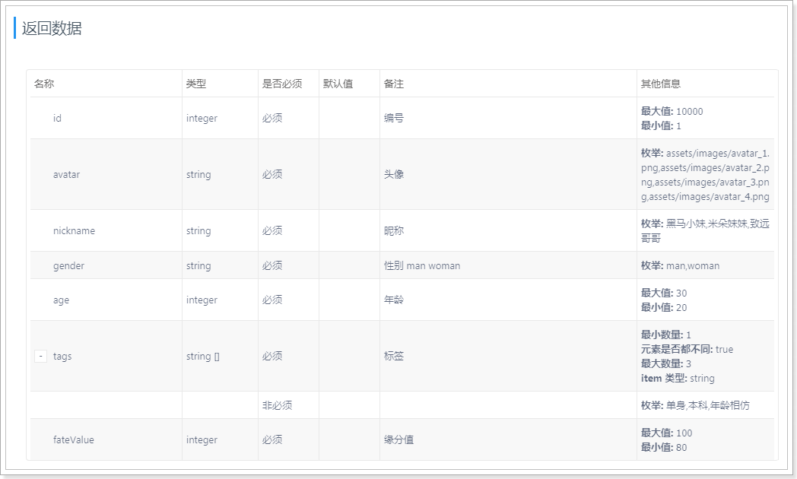
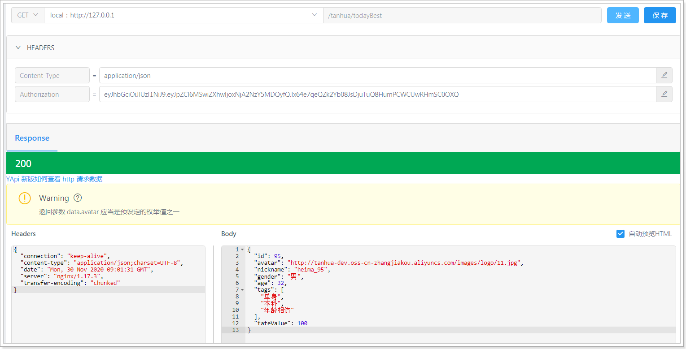
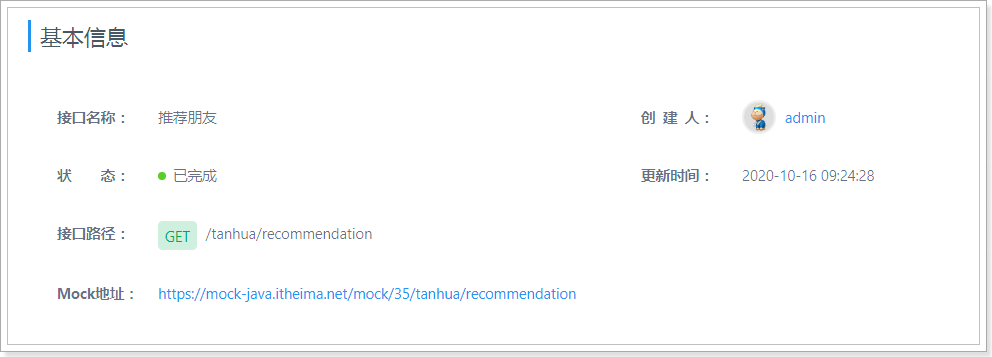
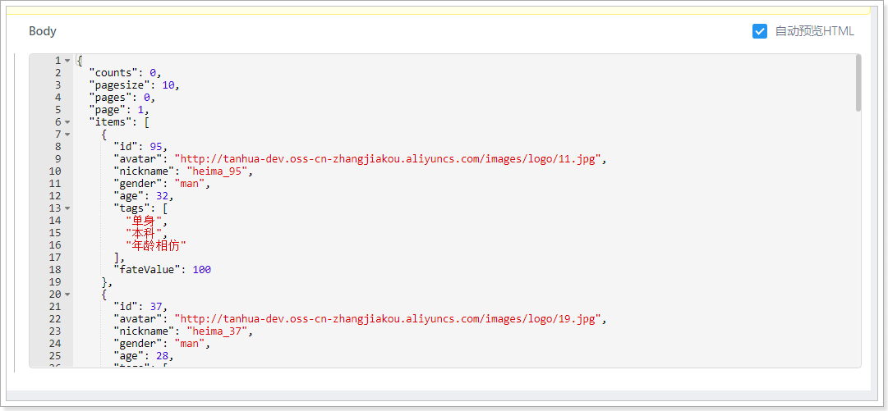

## 课程说明

- 首页功能说明
- 系统架构说明
- 实现今日佳人功能
- 实现推荐用户的列表
- 接口增加缓存功能
- 整合前端联调测试

## 1、首页

在用户登录成功后，就会进入首页，首页中有今日佳人、推荐好友、探花、搜附近等功能。

 

## 2、系统架构

在开发完SSO系统中的登录功能后，接下来就需要实现其他的功能，在整体架构中，完成与APP对接的服务工程叫my-tanhua-server，真正的核心业务逻辑使用dubbo完成，其工程名叫：my-tanhua-dubbo，它们的架构示意图如下：


说明：

- 客户端APP发起请求到Nginx，在Nginx中对请求做出判断，将请求转发至sso系统或server系统。
- sso系统中，将对接第三方平台以及完成数据的缓存、消息发送、用户的注册登录功能。
- server系统为APP提供了接口服务的支撑
  - 通过公钥对token进行校验
  - 通过rpc调用dubbo中提供的服务，在dubbo服务中与MongoDB对接，完成数据的CRUD操作
  - 将一些数据缓存到Redis，从而提升数据查询性能
  - 用户数据的查询将基于MySQL数据库进行查询

### 2.1、nginx服务

#### 2.1.1、部署安装

安装包在资料中：nginx-1.17.3.zip

安装在任意目录，通过命令：start nginx.exe 启动：

 

重启加载配置文件命令：nginx.exe -s reload

 

#### 2.1.2、配置

修改conf目录下的nginx.conf文件：

~~~shell
#user  nobody;
worker_processes  1;

#error_log  logs/error.log;
#error_log  logs/error.log  notice;
#error_log  logs/error.log  info;

#pid        logs/nginx.pid;


events {
    worker_connections  1024;
}


http {
    include       mime.types;
    default_type  application/octet-stream;

    #log_format  main  '$remote_addr - $remote_user [$time_local] "$request" '
    #                  '$status $body_bytes_sent "$http_referer" '
    #                  '"$http_user_agent" "$http_x_forwarded_for"';

    #access_log  logs/access.log  main;

    sendfile        on;
    #tcp_nopush     on;

    #keepalive_timeout  0;
    keepalive_timeout  65;

    #gzip  on;

    server {
        listen       80;
        server_name  localhost;

        #charset koi8-r;

        #access_log  logs/host.access.log  main;

        #error_page  404              /404.html;

        # redirect server error pages to the static page /50x.html
        #
        error_page   500 502 503 504  /50x.html;
        location = /50x.html {
            root   html;
        }

        location /user/ {  #请求路径中凡是以/user/开头的请求，转发到sso系统
            client_max_body_size  300m;  #设置最大的请求体大小，解决大文件上传不了的问题
            proxy_connect_timeout 300s;  #代理连接超时时间
            proxy_send_timeout 300s;  #代理发送数据的超时时间
            proxy_read_timeout 300s;  #代理读取数据的超时时间
            proxy_pass   http://127.0.0.1:18080;  #转发请求
        }

        location / {   #上面未匹配到的在这里处理
            client_max_body_size  300m;
            proxy_connect_timeout 300s;
            proxy_send_timeout 300s;
            proxy_read_timeout 300s;
                proxy_pass   http://127.0.0.1:18081;  #转发请求到server系统
            }
        }

}
~~~

#### 2.1.3、测试

 

### 2.2、搭建server工程

#### 2.2.1、导入依赖

pom.xml文件：

~~~xml
<?xml version="1.0" encoding="UTF-8"?>
<project xmlns="http://maven.apache.org/POM/4.0.0"
         xmlns:xsi="http://www.w3.org/2001/XMLSchema-instance"
         xsi:schemaLocation="http://maven.apache.org/POM/4.0.0 http://maven.apache.org/xsd/maven-4.0.0.xsd">
    <parent>
        <artifactId>my-tanhua</artifactId>
        <groupId>cn.itcast</groupId>
        <version>1.0-SNAPSHOT</version>
    </parent>
    <modelVersion>4.0.0</modelVersion>

    <artifactId>my-tanhua-server</artifactId>

    <dependencies>
        <dependency>
            <groupId>cn.itcast</groupId>
            <artifactId>my-tanhua-common</artifactId>
            <version>1.0-SNAPSHOT</version>
        </dependency>
        <dependency>
            <groupId>cn.itcast.dubbo</groupId>
            <artifactId>my-tanhua-dubbo-interface</artifactId>
            <version>1.0-SNAPSHOT</version>
        </dependency>
        <dependency>
            <groupId>org.springframework.boot</groupId>
            <artifactId>spring-boot-starter-data-redis</artifactId>
            <exclusions>
                <exclusion>
                    <groupId>io.lettuce</groupId>
                    <artifactId>lettuce-core</artifactId>
                </exclusion>
            </exclusions>
        </dependency>
        <dependency>
            <groupId>redis.clients</groupId>
            <artifactId>jedis</artifactId>
        </dependency>
    </dependencies>
</project>
~~~

#### 2.2.2、配置文件

application.properties

~~~properties
#激活的配置，规则：application-{profile}.properties
spring.profiles.active=local
~~~

application-local.properties

~~~properties
spring.application.name = itcast-tanhua-server
server.port = 18081

#dubbo配置
dubbo.application.name = itcast-tanhua-sso
dubbo.registry.address = nacos://192.168.31.81:8848
dubbo.registry.timeout = 60000
dubbo.consumer.timeout = 60000

#nacos配置中心
nacos.config.server-addr = 192.168.31.81:8848

#默认今日佳人推荐用户
tanhua.sso.default.user=2

#rsa文件的目录
tanhua.rsa.dir = F:\\code\\rsa
~~~

#### 2.2.3、ServerApplication

~~~java
package com.tanhua;

import org.springframework.boot.SpringApplication;
import org.springframework.boot.autoconfigure.SpringBootApplication;

@SpringBootApplication
public class ServerApplication {

    public static void main(String[] args) {
        SpringApplication.run(ServerApplication.class, args);
    }
}

~~~

### 2.3、工程结构

最终搭建完成的效果如下：

 

各工程之间的关系如下：


### 2.4、读取公钥

~~~java
package com.tanhua.server.service;

import cn.hutool.core.io.FileUtil;
import cn.hutool.core.util.CharsetUtil;
import cn.hutool.core.util.StrUtil;
import lombok.Data;
import org.springframework.beans.factory.annotation.Value;
import org.springframework.stereotype.Service;

import javax.annotation.PostConstruct;
import java.io.File;

/**
 * 完成公钥的读取操作
 */
@Service
@Data
public class RSAService {

    private String publicKey;

    @Value("${tanhua.rsa.dir}")
    private String rsaDir;

    /**
     * 完成公钥的读取操作
     */
    @PostConstruct
    public void init() {
        //公钥的文件路径，通过File.separator解决跨平台的目录分隔符的问题
        String publicKeyFile = rsaDir + File.separator + "rsa.pub";

        if (FileUtil.exist(publicKeyFile)) {
            //读取
            this.publicKey = FileUtil.readString(publicKeyFile, CharsetUtil.CHARSET_UTF_8);
        }

        if (StrUtil.isAllEmpty(publicKey)) {
            //如果公钥不存在，就抛出异常，阻止工程的启动
            throw new RuntimeException(StrUtil.format("公钥文件{}不存在", publicKeyFile));
        }
    }
}

~~~

## 3、今日佳人

今日佳人，会推荐缘分值最大的用户，进行展现出来。缘分值的计算是由用户的行为进行打分，如：点击、点赞、评论、学历、婚姻状态等信息组合而成的。

实现：我们先不考虑推荐的逻辑，假设现在已经有推荐的结果，我们只需要从结果中查询到缘分值最高的用户就可以了。至于推荐的逻辑以及实现，我们将后面的课程中讲解。

流程：

 

### 3.1、表结构

~~~shell
#表结构，表名：recommend_user
{
  "userId":1001,  #推荐的用户id
  "toUserId":1002, #用户id
  "score":90,  #推荐得分
  "date":"2019/1/1" #日期
}
~~~

已经提供的测试数据（4855条数据）：

 

### 3.2、编写dubbo服务

#### 3.2.1、编写接口

在my-tanhua-dubbo-interface工程中定义接口：

导入依赖：

~~~xml
<!--springdata对于mongodb支持-->
<dependency>
    <groupId>org.springframework.boot</groupId>
    <artifactId>spring-boot-starter-data-mongodb</artifactId>
</dependency>
~~~


~~~java
package com.tanhua.dubbo.api;

import com.tanhua.dubbo.pojo.RecommendUser;
import com.tanhua.dubbo.vo.PageInfo;

public interface RecommendUserApi {

    /**
     * 查询一位得分最高的推荐用户
     *
     * @param userId
     * @return
     */
    RecommendUser queryWithMaxScore(Long userId);

    /**
     * 按照得分倒序
     *
     * @param userId
     * @param pageNum
     * @param pageSize
     * @return
     */
    PageInfo<RecommendUser> queryPageInfo(Long userId, Integer pageNum, Integer pageSize);
}

~~~

~~~java
package com.tanhua.dubbo.pojo;

import lombok.AllArgsConstructor;
import lombok.Data;
import lombok.NoArgsConstructor;
import org.bson.types.ObjectId;
import org.springframework.data.annotation.Id;
import org.springframework.data.mongodb.core.index.Indexed;
import org.springframework.data.mongodb.core.mapping.Document;

@Data
@NoArgsConstructor
@AllArgsConstructor
@Document(collection = "recommend_user")
public class RecommendUser implements java.io.Serializable{

    private static final long serialVersionUID = -4296017160071130962L;

    @Id
    private ObjectId id; //主键id
    @Indexed
    private Long userId; //推荐的用户id
    private Long toUserId; //用户id
    @Indexed
    private Double score; //推荐得分
    private String date; //日期
}

~~~

~~~java
package com.tanhua.dubbo.vo;

import lombok.AllArgsConstructor;
import lombok.Data;
import lombok.NoArgsConstructor;

import java.util.Collections;
import java.util.List;

@Data
@AllArgsConstructor
@NoArgsConstructor
public class PageInfo<T> implements java.io.Serializable {

    private static final long serialVersionUID = -2105385689859184204L;

    /**
     * 总条数
     */
    private Integer total = 0;

    /**
     * 当前页
     */
    private Integer pageNum = 0;

    /**
     * 一页显示的大小
     */
    private Integer pageSize = 0;

    /**
     * 数据列表
     */
    private List<T> records = Collections.emptyList();

}

~~~

#### 3.2.2、编写实现

引入MongoDB的链接配置：

~~~properties
#springboot MongoDB配置
spring.data.mongodb.username=tanhua
spring.data.mongodb.password=l3SCjl0HvmSkTtiSbN0Swv40spYnHhDV
spring.data.mongodb.authentication-database=admin
spring.data.mongodb.database=tanhua
spring.data.mongodb.port=27017
spring.data.mongodb.host=192.168.31.81
~~~

~~~java
package com.tanhua.dubbo.api.impl;

import com.tanhua.dubbo.api.RecommendUserApi;
import com.tanhua.dubbo.pojo.RecommendUser;
import com.tanhua.dubbo.vo.PageInfo;
import org.apache.dubbo.config.annotation.DubboService;
import org.springframework.beans.factory.annotation.Autowired;
import org.springframework.data.domain.PageRequest;
import org.springframework.data.domain.Sort;
import org.springframework.data.mongodb.core.MongoTemplate;
import org.springframework.data.mongodb.core.query.Criteria;
import org.springframework.data.mongodb.core.query.Query;

import java.util.List;

@DubboService(version = "1.0.0")
public class RecommendUserApiImpl implements RecommendUserApi {

    @Autowired
    private MongoTemplate mongoTemplate;

    @Override
    public RecommendUser queryWithMaxScore(Long userId) {
        //条件：toUserId = 1
        //对得分倒序排序，获取第一条
        Query query = Query.query(Criteria.where("toUserId").is(userId))
                .with(Sort.by(Sort.Order.desc("score"))).limit(1);
        return this.mongoTemplate.findOne(query, RecommendUser.class);
    }

    @Override
    public PageInfo<RecommendUser> queryPageInfo(Long userId, Integer pageNum, Integer pageSize) {
        //设置分页和排序
        PageRequest pageRequest = PageRequest.of(pageNum - 1,
                pageSize, Sort.by(Sort.Order.desc("score")));
        //构造查询条件
        Query query = Query.query(Criteria.where("toUserId").is(userId)).with(pageRequest);
        List<RecommendUser> recommendUserList = this.mongoTemplate.find(query, RecommendUser.class);

        PageInfo<RecommendUser> pageInfo = new PageInfo<>();
        pageInfo.setPageNum(pageNum);
        pageInfo.setPageSize(pageSize);
        pageInfo.setRecords(recommendUserList);

        //不提供总条数，一般APP项目都不显示页数
        return pageInfo;
    }
}

~~~

#### 3.2.3、测试

~~~java
package com.tanhua.dubbo.api;

import org.junit.Test;
import org.junit.runner.RunWith;
import org.springframework.beans.factory.annotation.Autowired;
import org.springframework.boot.test.context.SpringBootTest;
import org.springframework.test.context.junit4.SpringRunner;

@RunWith(SpringRunner.class)
@SpringBootTest
public class TestRecommendUserApi {

    @Autowired
    private RecommendUserApi recommendUserApi;

    @Test
    public void testQueryWithMaxScore(){
        System.out.println(this.recommendUserApi.queryWithMaxScore(1L));
        System.out.println(this.recommendUserApi.queryWithMaxScore(8L));
        System.out.println(this.recommendUserApi.queryWithMaxScore(26L));
    }

    @Test
    public void testQueryPageInfo(){
        System.out.println(this.recommendUserApi.queryPageInfo(1L,1,5));
        System.out.println(this.recommendUserApi.queryPageInfo(1L,2,5));
        System.out.println(this.recommendUserApi.queryPageInfo(1L,3,5));
    }

}

~~~

### 3.3、实现今日佳人服务

#### 3.3.1、mock服务

地址：https://mock-java.itheima.net/project/35/interface/api/617




#### 3.3.2、实现功能

实现描述：

- 需要根据前端定义的结构定义java对象
- 根据dubbo系统提供的服务查询当前登录用户的信息
- 根据dubbo系统提供的服务进行查询今日佳人数据

##### 3.3.2.1、TodayBest

~~~java
package com.tanhua.server.vo;

import cn.hutool.core.annotation.Alias;
import lombok.AllArgsConstructor;
import lombok.Data;
import lombok.NoArgsConstructor;

/**
 * 今日佳人
 */
@Data
@NoArgsConstructor
@AllArgsConstructor
public class TodayBest {

    private Long id;
    @Alias("logo")
    private String avatar;
    @Alias("nickName")
    private String nickname;
    private String gender; //性别 man woman
    private Integer age;
    private String[] tags;
    private Long fateValue; //缘分值

}

~~~

##### 3.3.2.2、TodayBestController

~~~java
package com.tanhua.server.controller;

import com.tanhua.server.service.TodayBestService;
import com.tanhua.server.vo.TodayBest;
import org.springframework.beans.factory.annotation.Autowired;
import org.springframework.web.bind.annotation.GetMapping;
import org.springframework.web.bind.annotation.RequestHeader;
import org.springframework.web.bind.annotation.RequestMapping;
import org.springframework.web.bind.annotation.RestController;

@RestController
@RequestMapping("tanhua")
public class TodayBestController {

    @Autowired
    private TodayBestService todayBestService;

    /**
     * 查询今日佳人
     *
     * @param token
     * @return
     */
    @GetMapping("todayBest")
    public TodayBest queryTodayBest(@RequestHeader("Authorization") String token) {
        return this.todayBestService.queryTodayBest(token);
    }
}

~~~

##### 3.3.2.3、TodayBestService

~~~java
package com.tanhua.server.service;

import cn.hutool.core.bean.BeanUtil;
import cn.hutool.core.util.ObjectUtil;
import cn.hutool.core.util.RandomUtil;
import com.tanhua.dubbo.api.RecommendUserApi;
import com.tanhua.dubbo.api.UserInfoApi;
import com.tanhua.dubbo.pojo.RecommendUser;
import com.tanhua.dubbo.pojo.UserInfo;
import com.tanhua.server.vo.TodayBest;
import org.apache.dubbo.config.annotation.DubboReference;
import org.springframework.beans.factory.annotation.Autowired;
import org.springframework.beans.factory.annotation.Value;
import org.springframework.stereotype.Service;

@Service
public class TodayBestService {

    @Autowired
    private UserService userService;

    //问题：写死到配置文件，不方便修改与维护？ -- 由学生自己解决这个问题
    @Value("${tanhua.sso.default.user}")
    private Long defaultUser;

    @DubboReference(version = "1.0.0")
    private RecommendUserApi recommendUserApi;

    @DubboReference(version = "1.0.0")
    private UserInfoApi userInfoApi;

    public TodayBest queryTodayBest(String token) {
        //校验token是否有效，获取userId
        Long userId = this.userService.checkToken(token);
        if (null == userId) {
            return null;
        }

        //通过调用dubbo服务查询得分最高的用户
        RecommendUser recommendUser = this.recommendUserApi.queryWithMaxScore(userId);
        if (ObjectUtil.isEmpty(recommendUser)) {
            //给出一个默认的推荐用户
            recommendUser = new RecommendUser();
            recommendUser.setUserId(defaultUser);
            recommendUser.setToUserId(userId);
            //随机一个得分
            recommendUser.setScore(RandomUtil.randomDouble(80, 99));
        }

        //根据用户id查询用户的基本信息
        UserInfo userInfo = this.userInfoApi.queryByUserId(recommendUser.getUserId());
        TodayBest todayBest = BeanUtil.toBeanIgnoreError(userInfo, TodayBest.class);
        todayBest.setGender(userInfo.getSex().name().toLowerCase());
        todayBest.setId(userInfo.getUserId());
        todayBest.setFateValue(recommendUser.getScore().longValue());
        return todayBest;
    }
}

~~~

##### 3.3.2.4、UserService

~~~java
package com.tanhua.server.service;

import cn.hutool.core.collection.CollUtil;
import cn.hutool.core.convert.Convert;
import com.tanhua.common.utils.JwtUtils;
import lombok.extern.slf4j.Slf4j;
import org.springframework.beans.factory.annotation.Autowired;
import org.springframework.stereotype.Service;

import java.util.Map;

/**
 * 访问sso系统，通过token查询用户信息
 */
@Service
@Slf4j
public class UserService {

    @Autowired
    private RSAService rsaService;

    /**
     * 使用公钥解析token
     *
     * @param token
     * @return 解析成功返回用户id，否则返回null
     */
    public Long checkToken(String token) {
        // 通过token解析数据
        Map<String, Object> body = JwtUtils.checkToken(token,
                this.rsaService.getPublicKey());
        if (CollUtil.isEmpty(body)) {
            return null;
        }
        return Convert.toLong(body.get("id"));
    }
}

~~~

#### 3.3.3、测试

整合功能测试，需要将sso、dubbo服务启动完成后进行测试。



 

#### 3.3.4、解决MongoDB启动报错

在项目中，添加了mongo的依赖的话，springboot就会自动去连接本地的mongo，由于他连接不上会导致出错。

 

解决：

springboot中添加排除自动配置的注解

~~~java
package com.tanhua.server;

import org.springframework.boot.SpringApplication;
import org.springframework.boot.autoconfigure.SpringBootApplication;
import org.springframework.boot.autoconfigure.data.mongo.MongoDataAutoConfiguration;
import org.springframework.boot.autoconfigure.mongo.MongoAutoConfiguration;

@SpringBootApplication(exclude = {MongoAutoConfiguration.class, MongoDataAutoConfiguration.class}) //排除mongo的自动配置
public class ServerApplication {

    public static void main(String[] args) {
        SpringApplication.run(ServerApplication.class, args);
    }
}
~~~

## 4、推荐列表

 

### 4.1、mock接口

地址：https://mock-java.itheima.net/project/35/interface/api/623

 

 

### 4.2、查询参数对象

~~~java
package com.tanhua.server.vo;

import lombok.AllArgsConstructor;
import lombok.Data;
import lombok.NoArgsConstructor;

@Data
@NoArgsConstructor
@AllArgsConstructor
public class RecommendUserQueryParam {

    private Integer page = 1; //当前页数
    private Integer pagesize = 10; //页尺寸
    private String gender; //性别 man woman
    private String lastLogin; //近期登陆时间
    private Integer age; //年龄
    private String city; //居住地
    private String education; //学历
}

~~~

### 4.3、结果对象

~~~java
package com.tanhua.server.vo;

import lombok.AllArgsConstructor;
import lombok.Data;
import lombok.NoArgsConstructor;

import java.util.Collections;
import java.util.List;

@Data
@AllArgsConstructor
@NoArgsConstructor
public class PageResult {

    private Integer counts = 0;//总记录数
    private Integer pagesize = 0;//页大小
    private Integer pages = 0;//总页数
    private Integer page = 0;//当前页码
    private List<?> items = Collections.emptyList(); //列表

}
~~~

### 4.4、Controller

~~~java
//com.tanhua.server.controller.TodayBestController

	/**
     * 查询推荐用户列表
     *
     * @param token
     * @param queryParam
     * @return
     */
    @GetMapping("recommendation")
    public PageResult queryRecommendation(@RequestHeader("Authorization") String token,
                                          RecommendUserQueryParam queryParam){
        return this.todayBestService.queryRecommendation(token, queryParam);
    }
~~~

### 4.5、Service

~~~java
 //com.tanhua.server.service.TodayBestService

    /**
     * 查询推荐用户列表
     * 
     * @param token
     * @param queryParam
     * @return
     */
    public PageResult queryRecommendation(String token, RecommendUserQueryParam queryParam) {
        //校验token是否有效，获取userId
        Long userId = this.userService.checkToken(token);
        if (null == userId) {
            return null;
        }

        PageResult pageResult = new PageResult();
        pageResult.setPage(queryParam.getPage());
        pageResult.setPagesize(queryParam.getPagesize());

        //查询dubbo服务，查询推荐列表
        PageInfo<RecommendUser> pageInfo = this.recommendUserApi.queryPageInfo(userId, queryParam.getPage(), queryParam.getPagesize());
        List<RecommendUser> records = pageInfo.getRecords();
        if(CollUtil.isEmpty(records)){
            //TODO 默认的推荐列表
            // 不建议返回null
            return pageResult;
        }

        List<Object> userIdList = CollUtil.getFieldValues(records, "userId");
        List<UserInfo> userInfoList = this.userInfoApi.queryByUserIdList(userIdList);
        if(CollUtil.isEmpty(userInfoList)){
            return pageResult;
        }

        //目标：封装TodayBest列表
        List<TodayBest> todayBestList = new ArrayList<>();

        for (UserInfo userInfo : userInfoList) {
            TodayBest todayBest = BeanUtil.toBeanIgnoreError(userInfo, TodayBest.class);
            todayBest.setGender(userInfo.getSex().name().toLowerCase());
            todayBest.setId(userInfo.getUserId());

            // 查找到该用户所对应的RecommendUser对象，目的是获取它的得分
            for (RecommendUser record : records) {
                if(ObjectUtil.equal(record.getUserId(), userInfo.getUserId())){
                    todayBest.setFateValue(record.getScore().longValue());
                    break;
                }
            }

            todayBestList.add(todayBest);
        }

        //TODO 排除今日佳人的用户

        //对集合排序
        Collections.sort(todayBestList, (o1, o2) -> Convert.toInt(o2.getFateValue() - o1.getFateValue()));

        pageResult.setItems(todayBestList);
        return pageResult;
    }
~~~

UserInfoApi的dubbo服务新增方法：

~~~java
//com.tanhua.dubbo.api.UserInfoApi

/**
     * 根据推荐用户内容查询列表
     *
     * @param userIdList
     * @param age
     * @param city
     * @return
     */
    List<UserInfo> queryByRecommendUser(List<Object> userIdList, Integer age, String city);
~~~

方法实现：

~~~java
    @Override
    public List<UserInfo> queryByRecommendUser(List<Object> userIdList, Integer age, String city) {
        //添加过滤条件
        QueryWrapper<UserInfo> queryWrapper = new QueryWrapper<>();
        queryWrapper.in("user_id", userIdList);
        if (ObjectUtil.isNotEmpty(age)) {
            //年龄小于等于目标值
            queryWrapper.le("age", age);
        }
        if (ObjectUtil.isNotEmpty(city)) {
            //城市 like 操作
            queryWrapper.like("city", city);
        }
        return this.userInfoMapper.selectList(queryWrapper);
    }
~~~

### 4.6、测试




## 5、缓存

在接口服务中，有必要对于接口进行缓存处理，尤其是GET请求，如果每个接口单独添加的话会存在很多的重复的逻辑，所以可以编写一套通用的解决方案。

实现思路：

- 通过拦截器实现对请求的拦截，在拦截器中实现缓存的命中。
- 通过ResponseBodyAdvice进行对响应的拦截，可以将数据缓存到Redis中。
- 考虑到，不能对于所有的请求都一刀切，所以需要创建@Cache注解进行标记，只有标记的Controller才进行缓存处理。
- 缓存的处理中，仅针对GET请求处理，其他的请求均不做处理。

### 5.1、自定义注解

```java
package com.tanhua.server.utils;

import java.lang.annotation.*;

/**
 * 被标记为Cache的Controller进行缓存，其他情况不进行缓存
 */
@Target(ElementType.METHOD)
@Retention(RetentionPolicy.RUNTIME)
@Documented //标记注解
public @interface Cache {

    /**
     * 缓存时间，默认为60秒
     * @return
     */
    String time() default "60";
}
```

### 5.2、采用拦截器进行缓存命中

编写拦截器：RedisCacheInterceptor。

~~~java
package com.tanhua.server.interceptor;

import cn.hutool.core.util.StrUtil;
import cn.hutool.crypto.SecureUtil;
import cn.hutool.json.JSONUtil;
import com.tanhua.server.utils.Cache;
import org.springframework.beans.factory.annotation.Autowired;
import org.springframework.beans.factory.annotation.Value;
import org.springframework.data.redis.core.StringRedisTemplate;
import org.springframework.stereotype.Component;
import org.springframework.web.bind.annotation.GetMapping;
import org.springframework.web.method.HandlerMethod;
import org.springframework.web.servlet.HandlerInterceptor;

import javax.servlet.http.HttpServletRequest;
import javax.servlet.http.HttpServletResponse;

/**
 * 作用：在进入Controller之前进行做缓存的命中，如果命中就返回数据，不再执行Controller中的逻辑
 * 如果没有命中，就放行，正常执行Controller中的逻辑
 * 条件：一般针对GET请求处理，被标记了@Cache注解的方法
 */
@Component
public class RedisCacheInterceptor implements HandlerInterceptor {

    @Autowired
    private StringRedisTemplate redisTemplate;

    //缓存的总开关
    @Value("${tanhua.cache.enable}")
    private Boolean cacheEnable;

    @Override
    public boolean preHandle(HttpServletRequest request, HttpServletResponse response,
                             Object handler) throws Exception {

        if (!cacheEnable) {
            return true;
        }

        if (!(handler instanceof HandlerMethod)) {
            return true;
        }

        HandlerMethod handlerMethod = (HandlerMethod) handler;
        //判断是否为GET请求
        if (!handlerMethod.hasMethodAnnotation(GetMapping.class)) {
            return true;
        }

        //判断是否包含@Cache注解
        if (!handlerMethod.hasMethodAnnotation(Cache.class)) {
            return true;
        }

        //进行缓存命中
        String redisKey = this.createRedisKey(request);
        String cacheData = this.redisTemplate.opsForValue().get(redisKey);
        if (StrUtil.isEmpty(cacheData)) {
            //缓存未命中
            return true;
        }

        //响应数据
        response.setCharacterEncoding("UTF-8");
        response.setContentType("application/json; charset=utf-8");
        response.getWriter().write(cacheData);

        //拦截，不再执行Controller中的方法
        return false;
    }

    public static String createRedisKey(HttpServletRequest request) {
        //请求路径
        String url = request.getRequestURI();
        //请求参数
        String param = JSONUtil.toJsonStr(request.getParameterMap());
        //请求头
        String token = request.getHeader("Authorization");

        return "TANHUA_CACHE_" + SecureUtil.md5(url + param + token);
    }
}

~~~

application.properties：

~~~properties
#是否开启数据缓存
tanhua.cache.enable=false

# Redis相关配置
spring.redis.jedis.pool.max-wait = 5000ms
spring.redis.jedis.pool.max-Idle = 100
spring.redis.jedis.pool.min-Idle = 10
spring.redis.timeout = 10s
spring.redis.cluster.nodes = 192.168.31.81:6379,192.168.31.81:6380,192.168.31.81:6381
spring.redis.cluster.max-redirects=5
~~~

注册拦截器到Spring容器：

~~~java
package com.tanhua.server.config;

import com.tanhua.server.interceptor.RedisCacheInterceptor;
import org.springframework.beans.factory.annotation.Autowired;
import org.springframework.context.annotation.Configuration;
import org.springframework.web.servlet.config.annotation.InterceptorRegistry;
import org.springframework.web.servlet.config.annotation.WebMvcConfigurer;

@Configuration
public class WebConfig implements WebMvcConfigurer {

    @Autowired
    private RedisCacheInterceptor redisCacheInterceptor;

    @Override
    public void addInterceptors(InterceptorRegistry registry) {
        registry.addInterceptor(this.redisCacheInterceptor).addPathPatterns("/**");
    }
}
~~~

### 4.3、响应结果写入到缓存

使用ResponseBodyAdvice进行对响应结果处理，将结果写入到Redis中：

具体实现：

~~~java
package com.tanhua.server.interceptor;

import cn.hutool.core.convert.Convert;
import cn.hutool.json.JSONUtil;
import com.tanhua.server.utils.Cache;
import org.springframework.beans.factory.annotation.Autowired;
import org.springframework.beans.factory.annotation.Value;
import org.springframework.core.MethodParameter;
import org.springframework.data.redis.core.StringRedisTemplate;
import org.springframework.http.MediaType;
import org.springframework.http.server.ServerHttpRequest;
import org.springframework.http.server.ServerHttpResponse;
import org.springframework.http.server.ServletServerHttpRequest;
import org.springframework.stereotype.Component;
import org.springframework.web.bind.annotation.ControllerAdvice;
import org.springframework.web.bind.annotation.GetMapping;
import org.springframework.web.servlet.mvc.method.annotation.ResponseBodyAdvice;

import java.util.concurrent.TimeUnit;

/**
 * 作用：将Controller中返回的数据写入到redis中
 */
@ControllerAdvice
public class MyResponseBodyAdvice implements ResponseBodyAdvice {

    @Autowired
    private StringRedisTemplate redisTemplate;

    //缓存的总开关
    @Value("${tanhua.cache.enable}")
    private Boolean cacheEnable;

    @Override
    public boolean supports(MethodParameter methodParameter, Class aClass) {
        return cacheEnable && methodParameter.hasMethodAnnotation(GetMapping.class)
                && methodParameter.hasMethodAnnotation(Cache.class);
    }

    @Override
    public Object beforeBodyWrite(Object body, MethodParameter methodParameter, MediaType mediaType, Class aClass, ServerHttpRequest serverHttpRequest, ServerHttpResponse serverHttpResponse) {

        if (null == body) {
            return body;
        }

        String cacheData;
        if (body instanceof String) {
            cacheData = (String) body;
        } else {
            cacheData = JSONUtil.toJsonStr(body);
        }

        //生成redis中的key
        String redisKey = RedisCacheInterceptor
                .createRedisKey(((ServletServerHttpRequest) serverHttpRequest).getServletRequest());


        //获取Cache注解，目的获取注解中的时间的长度
        Cache cache = methodParameter.getMethodAnnotation(Cache.class);

        //写数据到redis中，有效期时间单位是：秒
        this.redisTemplate.opsForValue().set(redisKey, cacheData,
                Convert.toLong(cache.time()), TimeUnit.SECONDS);

        return body;
    }
}

~~~

### 4.4、测试


可以看到数据已经缓存到Redis中，并且其缓存时间也是30秒，与预期一致。


## 6、整合测试

测试时需要注意，由于用户数据较少，所以测试时需要把条件注释掉，否则查询不到数据：


效果：

 

 


