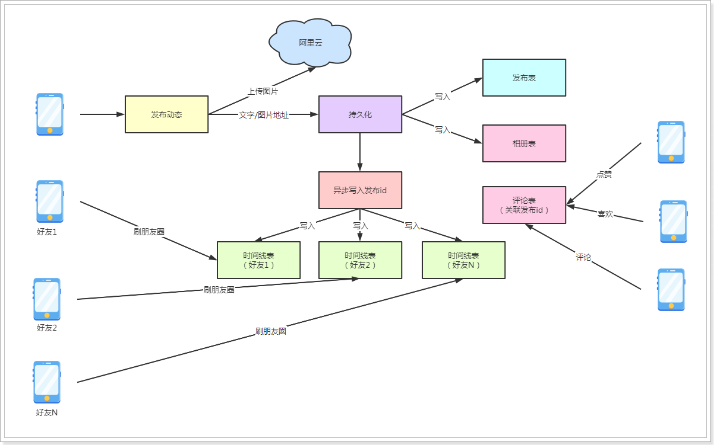
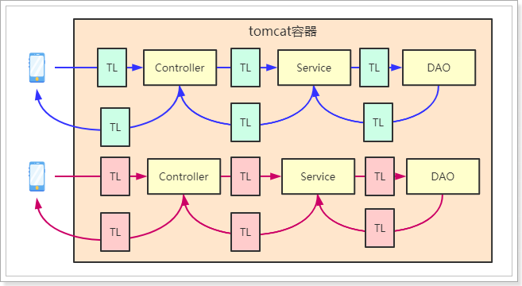
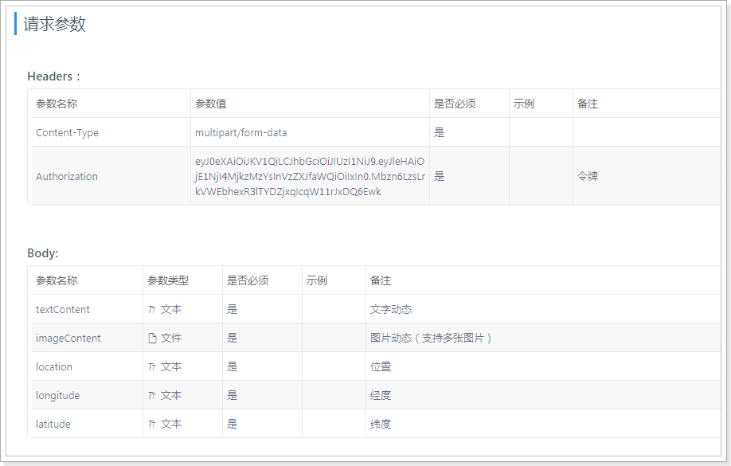

## 课程说明

- 圈子功能说明
- 圈子技术实现
- 圈子技术方案
- 圈子实现发布动态
- 圈子实现好友动态
- 圈子实现推荐动态

## 1、圈子功能

### 1.1、功能说明

探花交友项目中的圈子功能，类似微信的朋友圈，基本的功能为：发布动态、浏览好友动态、浏览推荐动态、点赞、评论、喜欢等功能。

 

发布：

 

### 1.2、实现方案分析

对于圈子功能的实现，我们需要对它的功能特点做分析：

- 数据量会随着用户数增大而增大
- 读多写少，一般而言，浏览朋友圈动态会多一些，发动态相对就会少一些
- 非好友看不到其动态内容
- ……

针对以上特点，我们来分析一下：

- 对于数据量大而言，显然不能够使用关系型数据库进行存储，我们需要通过MongoDB进行存储
- 对于读多写少的应用，尽可能的减少读取数据的成本
  - 比如说，一条SQL语句，单张表查询一定比多张表查询要快
  - 条件越多的查询速度将越慢，尽可能的减少条件以提升查询速度

**所以对于存储而言，主要是核心的4张表：**

- 发布表：记录了所有用户的发布的东西信息，如图片、视频等。
- 相册：相册是每个用户独立的，记录了该用户所发布的所有内容。
- 评论：针对某个具体发布的朋友评论和点赞操作。
- 时间线：所谓“刷朋友圈”，就是刷时间线，就是一个用户所有的朋友的发布内容。

流程：



流程说明：

- 用户发布动态，动态中一般包含了图片和文字，图片上传到阿里云，上传成功后拿到图片地址，将文字和图片地址进行持久化存储
- 首先，需要将动态数据写入到发布表中，其次，再写入到自己的相册表中，需要注意的是，相册表中只包含了发布id，不会冗余存储发布数据
- 最后，需要将发布数据异步的写入到好友的时间线表中，之所以考虑异步操作，是因为希望发布能够尽快给用户反馈，发布成功
- 好友刷朋友圈时，实际上只需要查询自己的时间线表即可，这样最大限度的提升了查询速度，再配合redis的缓存，那速度将是飞快的
- 用户在对动态内容进行点赞、喜欢、评论操作时，只需要写入到评论表即可，该表中也是只会记录发布id，并不会冗余存储发布数据

### 1.3、表结构设计

> **发布表：**

~~~json
#表名：quanzi_publish
{
    "_id":"5fae53d17e52992e78a3db61",#主键id
    "pid":1001, #发布id（Long类型）
    "userId":1, #用户id
    "text":"今天心情很好", #文本内容
    "medias":"http://xxxx/x/y/z.jpg", #媒体数据，图片或小视频 url
    "seeType":1, #谁可以看，1-公开，2-私密，3-部分可见，4-不给谁看
    "seeList":[1,2,3], #部分可见的列表
    "notSeeList":[4,5,6],#不给谁看的列表
	"longitude":108.840974298098,#经度
	"latitude":34.2789316522934,#纬度
    "locationName":"上海市浦东区", #位置名称
    "created",1568012791171 #发布时间
}
~~~

> **相册表：**

~~~json
#表名：quanzi_album_{userId}
{
    "_id":"5fae539d7e52992e78a3b684",#主键id
    "publishId":"5fae53d17e52992e78a3db61", #发布id
    "created":1568012791171 #发布时间
}
~~~

> **时间线表：**

~~~json
#表名：quanzi_time_line_{userId}
{
    "_id":"5fae539b7e52992e78a3b4ae",#主键id,
    "userId":2, #好友id
    "publishId":"5fae53d17e52992e78a3db61", #发布id
    "date":1568012791171 #发布时间
}
~~~

> **评论表：**

~~~json
#表名：quanzi_comment
{
    "_id":"5fae539d7e52992e78a3b648", #主键id
    "publishId":"5fae53d17e52992e78a3db61", #发布id
    "commentType":1, #评论类型，1-点赞，2-评论，3-喜欢
    "content":"给力！", #评论内容
    "userId":2, #评论人
    "publishUserId":9, #发布动态的人的id
    "isParent":false, #是否为父节点，默认是否
    "parentId":1001, #父节点id
    "created":1568012791171
}
~~~

## 2、好友关系数据

由于圈子中会涉及的好友关系数据，虽然现在主线是开发圈子功能，但是也需要对于好友关系有所了解，在我们提供的Mongodb数据库中有一些mock数据。

好友关系结构：

~~~java
package com.tanhua.dubbo.pojo;

import lombok.AllArgsConstructor;
import lombok.Data;
import lombok.NoArgsConstructor;
import org.bson.types.ObjectId;
import org.springframework.data.mongodb.core.mapping.Document;

/**
 * 好友关系
 */
@Data
@NoArgsConstructor
@AllArgsConstructor
@Document(collection = "tanhua_users")
public class Users implements java.io.Serializable{

    private static final long serialVersionUID = 6003135946820874230L;

    private ObjectId id;
    private Long userId; //用户id
    private Long friendId; //好友id
    private Long date; //时间

}

~~~

在mock数据中，为每个用户构造了10个好友数据：

 

## 3、查询好友动态

查询好友动态与查询推荐动态显示的结构是一样的，只是其查询数据源不同：

 

### 3.1、基础代码

在my-tanhua-dubbo-interface中编写：

```java
package com.tanhua.dubbo.pojo;

import lombok.AllArgsConstructor;
import lombok.Data;
import lombok.NoArgsConstructor;
import org.bson.types.ObjectId;
import org.springframework.data.annotation.Id;
import org.springframework.data.mongodb.core.mapping.Document;

import java.util.Date;
import java.util.List;

/**
 * 发布表，动态内容
 */
@Data
@NoArgsConstructor
@AllArgsConstructor
@Document(collection = "quanzi_publish")
public class Publish implements java.io.Serializable {

    private static final long serialVersionUID = 8732308321082804771L;

    @Id
    private ObjectId id; //主键id
    private Long pid; //发布id
    private Long userId; //发布用户id
    private String text; //文字
    private List<String> medias; //媒体数据，图片或小视频 url
    private Integer seeType; // 谁可以看，1-公开，2-私密，3-部分可见，4-不给谁看
    private List<Long> seeList; //部分可见的列表
    private List<Long> notSeeList; //不给谁看的列表
    private String longitude; //经度
    private String latitude; //纬度
    private String locationName; //位置名称
    private Long created; //发布时间

}
```

```java
package com.tanhua.dubbo.pojo;

import lombok.AllArgsConstructor;
import lombok.Data;
import lombok.NoArgsConstructor;
import org.bson.types.ObjectId;
import org.springframework.data.annotation.Id;
import org.springframework.data.mongodb.core.mapping.Document;

import java.util.Date;

/**
 * 相册表，用于存储自己发布的数据，每一个用户一张表进行存储
 */
@Data
@NoArgsConstructor
@AllArgsConstructor
@Document(collection = "quanzi_album_{userId}")
public class Album implements java.io.Serializable {

    private static final long serialVersionUID = 432183095092216817L;

    @Id
    private ObjectId id; //主键id

    private ObjectId publishId; //发布id
    private Long created; //发布时间

}
```

```java
package com.tanhua.dubbo.pojo;

import lombok.AllArgsConstructor;
import lombok.Data;
import lombok.NoArgsConstructor;
import org.bson.types.ObjectId;
import org.springframework.data.annotation.Id;
import org.springframework.data.mongodb.core.mapping.Document;

import java.util.Date;

/**
 * 时间线表，用于存储发布的数据，每一个用户一张表进行存储
 */
@Data
@NoArgsConstructor
@AllArgsConstructor
@Document(collection = "quanzi_time_line_{userId}")
public class TimeLine implements java.io.Serializable {
    private static final long serialVersionUID = 9096178416317502524L;
    
    @Id
    private ObjectId id;
    private Long userId; // 用户id
    private ObjectId publishId; //发布id
    private Long date; //发布的时间

}

```

~~~java
package com.tanhua.dubbo.pojo;

import lombok.AllArgsConstructor;
import lombok.Data;
import lombok.NoArgsConstructor;
import org.bson.types.ObjectId;
import org.springframework.data.annotation.Id;
import org.springframework.data.mongodb.core.mapping.Document;

import java.util.Date;

/**
 * 评论表
 */
@Data
@NoArgsConstructor
@AllArgsConstructor
@Document(collection = "quanzi_comment")
public class Comment implements java.io.Serializable{

    private static final long serialVersionUID = -291788258125767614L;

    @Id
    private ObjectId id;
    private ObjectId publishId; //发布id
    private Integer commentType; //评论类型，1-点赞，2-评论，3-喜欢
    private String content; //评论内容
    private Long userId; //评论人
    private Long publishUserId; //发布动态的用户id
    private Boolean isParent = false; //是否为父节点，默认是否
    private ObjectId parentId; // 父节点id
    private Long created; //发表时间

}

~~~

### 3.2、dubbo服务

圈子的具体业务逻辑的实现需要在dubbo中完成，所以需要开发dubbo服务。

#### 3.2.1、定义接口

在my-tanhua-dubbo-interface工程中：

~~~java
package com.tanhua.dubbo.api;

import com.tanhua.dubbo.pojo.Publish;
import com.tanhua.dubbo.vo.PageInfo;

public interface QuanZiApi {

    /**
     * 查询好友动态
     *
     * @param userId 用户id
     * @param page 当前页数
     * @param pageSize 每一页查询的数据条数
     * @return
     */
    PageInfo<Publish> queryPublishList(Long userId, Integer page, Integer pageSize);

}

~~~

#### 3.2.2、实现接口

创建 my-tanhua-dubbo-quanzi 工程：

~~~xml
<?xml version="1.0" encoding="UTF-8"?>
<project xmlns="http://maven.apache.org/POM/4.0.0"
         xmlns:xsi="http://www.w3.org/2001/XMLSchema-instance"
         xsi:schemaLocation="http://maven.apache.org/POM/4.0.0 http://maven.apache.org/xsd/maven-4.0.0.xsd">
    <parent>
        <artifactId>my-tanhua-dubbo</artifactId>
        <groupId>cn.itcast.dubbo</groupId>
        <version>1.0-SNAPSHOT</version>
    </parent>
    <modelVersion>4.0.0</modelVersion>

    <artifactId>my-tanhua-dubbo-quanzi</artifactId>

    <dependencies>
        <dependency>
            <groupId>cn.itcast.dubbo</groupId>
            <artifactId>my-tanhua-dubbo-interface</artifactId>
            <version>1.0-SNAPSHOT</version>
        </dependency>
    </dependencies>

</project>
~~~

配置文件application-local.properties：

~~~properties
# Spring boot application
spring.application.name = itcast-tanhua-dubbo-quanzi

# dubbo 扫描包配置
dubbo.scan.base-packages = com.tanhua.dubbo
dubbo.application.name = dubbo-provider-quanzi

#dubbo 对外暴露的端口信息
dubbo.protocol.name = dubbo
dubbo.protocol.port = 20881

#dubbo注册中心的配置
dubbo.registry.address = nacos://192.168.31.81:8848
dubbo.registry.timeout = 6000

#springboot MongoDB配置
spring.data.mongodb.username=tanhua
spring.data.mongodb.password=l3SCjl0HvmSkTtiSbN0Swv40spYnHhDV
spring.data.mongodb.authentication-database=admin
spring.data.mongodb.database=tanhua
spring.data.mongodb.port=27017
spring.data.mongodb.host=192.168.31.81
~~~

启动类：

~~~java
package com.tanhua.dubbo;

import org.springframework.boot.SpringApplication;
import org.springframework.boot.autoconfigure.SpringBootApplication;

@SpringBootApplication
public class QuanZiApplication {

    public static void main(String[] args) {
        SpringApplication.run(QuanZiApplication.class, args);
    }
}

~~~


```java
package com.tanhua.dubbo.api.impl;

import cn.hutool.core.collection.CollUtil;
import com.tanhua.dubbo.api.QuanZiApi;
import com.tanhua.dubbo.pojo.Publish;
import com.tanhua.dubbo.pojo.TimeLine;
import com.tanhua.dubbo.vo.PageInfo;
import org.apache.dubbo.config.annotation.DubboService;
import org.springframework.beans.factory.annotation.Autowired;
import org.springframework.data.domain.PageRequest;
import org.springframework.data.domain.Sort;
import org.springframework.data.mongodb.core.MongoTemplate;
import org.springframework.data.mongodb.core.query.Criteria;
import org.springframework.data.mongodb.core.query.Query;

import java.util.List;

@DubboService(version = "1.0.0")
public class QuanZiApiImpl implements QuanZiApi {

    @Autowired
    private MongoTemplate mongoTemplate;

    /**
     * 查询好友动态(刷朋友圈)
     *
     * @param userId   用户id
     * @param page     当前页数
     * @param pageSize 每一页查询的数据条数
     * @return
     */
    @Override
    public PageInfo<Publish> queryPublishList(Long userId, Integer page, Integer pageSize) {

        PageRequest pageRequest = PageRequest.of(page - 1, pageSize,
                Sort.by(Sort.Order.desc("date")));
        Query query = new Query().with(pageRequest);

        //查询自己的时间线表即可
        List<TimeLine> timeLineList =
                this.mongoTemplate.find(query, TimeLine.class, "quanzi_time_line_" + userId);

        List<Object> publishIdList = CollUtil.getFieldValues(timeLineList, "publishId");

        //查询发布对象
        Query publishQuery = Query.query(Criteria.where("id").in(publishIdList))
                .with(Sort.by(Sort.Order.desc("created")));
        List<Publish> publishList = this.mongoTemplate.find(publishQuery, Publish.class);

        PageInfo<Publish> pageInfo = new PageInfo<>();
        pageInfo.setPageNum(page);
        pageInfo.setPageSize(pageSize);
        pageInfo.setRecords(publishList);
        return pageInfo;
    }
}

```

#### 3.2.3、测试用例

~~~java
package com.tanhua.dubbo.api;

import com.tanhua.dubbo.server.pojo.Publish;
import com.tanhua.dubbo.server.vo.PageInfo;
import org.junit.Test;
import org.junit.runner.RunWith;
import org.springframework.beans.factory.annotation.Autowired;
import org.springframework.boot.test.context.SpringBootTest;
import org.springframework.test.context.junit4.SpringRunner;

@RunWith(SpringRunner.class)
@SpringBootTest
public class TestQuanZiApi {

    @Autowired
    private QuanZiApi quanZiApi;

    @Test
    public void testQueryPublishList(){
        this.quanZiApi.queryPublishList(1L, 1, 2)
                .getRecords().forEach(publish -> System.out.println(publish));
        System.out.println("------------");
        this.quanZiApi.queryPublishList(1L, 2, 2)
                .getRecords().forEach(publish -> System.out.println(publish));
        System.out.println("------------");
        this.quanZiApi.queryPublishList(1L, 3, 2)
                .getRecords().forEach(publish -> System.out.println(publish));

    }

}

~~~

测试结果： 

### 3.3、APP接口服务

开发完成dubbo服务后，我们将开发APP端的接口服务，依然是需要按照mock接口的中的接口定义实现。

接口地址：https://mock-java.itheima.net/project/35/interface/api/683

#### 3.3.1、QuanZiVo

根据接口中响应的数据结构进行定义vo对象：(在my-tanhua-server工程中)

~~~java
package com.tanhua.server.vo;

import cn.hutool.core.annotation.Alias;
import lombok.AllArgsConstructor;
import lombok.Data;
import lombok.NoArgsConstructor;

@Data
@NoArgsConstructor
@AllArgsConstructor
public class QuanZiVo {

    private String id; //动态id
    private Long userId; //用户id
    @Alias("logo") //别名
    private String avatar; //头像
    @Alias("nickName") //别名
    private String nickname; //昵称
    private String gender; //性别 man woman
    private Integer age; //年龄
    private String[] tags; //标签
    private String textContent; //文字动态
    private String[] imageContent; //图片动态
    private String distance; //距离
    private String createDate; //发布时间 如: 10分钟前
    private Integer likeCount; //点赞数
    private Integer commentCount; //评论数
    private Integer loveCount; //喜欢数
    private Integer hasLiked; //是否点赞（1是，0否）
    private Integer hasLoved; //是否喜欢（1是，0否）

}

~~~

#### 3.3.2、QuanZiController

根据服务接口编写QuanZiController，其请求方法为GET请求，会传递page、pageSize、token等信息。

代码实现如下：

~~~java
package com.tanhua.server.controller;

import com.tanhua.server.service.QuanZiService;
import org.springframework.beans.factory.annotation.Autowired;
import org.springframework.web.bind.annotation.*;

@RestController
@RequestMapping("movements")
public class QuanZiController {

    @Autowired
    private QuanZiService quanZiService;

    /**
     * 查询好友动态
     *
     * @param token
     * @param page
     * @param pageSzie
     * @return
     */
    @GetMapping
    public Object queryPublishList(@RequestHeader("Authorization") String token,
                                   @RequestParam("page") Integer page,
                                   @RequestParam("pagesize") Integer pageSzie) {
        return this.quanZiService.queryPublishList(token, page, pageSzie);
    }

}

~~~

#### 3.3.3、QuanZiService

在QuanZiService中将实现具体的业务逻辑，需要调用quanzi的dubbo服务完成数据的查询，并且要完成用户登录是否有效的校验，最后按照服务接口中定义的结构进行封装数据。

```java
package com.tanhua.server.service;

import cn.hutool.core.bean.BeanUtil;
import cn.hutool.core.collection.CollUtil;
import cn.hutool.core.util.ObjectUtil;
import com.tanhua.common.utils.RelativeDateFormat;
import com.tanhua.dubbo.api.QuanZiApi;
import com.tanhua.dubbo.api.UserInfoApi;
import com.tanhua.dubbo.pojo.Publish;
import com.tanhua.dubbo.pojo.UserInfo;
import com.tanhua.dubbo.vo.PageInfo;
import com.tanhua.server.vo.PageResult;
import com.tanhua.server.vo.QuanZiVo;
import org.apache.dubbo.config.annotation.DubboReference;
import org.springframework.beans.factory.annotation.Autowired;
import org.springframework.stereotype.Service;

import java.util.ArrayList;
import java.util.Date;
import java.util.List;

@Service
public class QuanZiService {

    @Autowired
    private UserService userService;

    @DubboReference(version = "1.0.0")
    private QuanZiApi quanZiApi;

    @DubboReference(version = "1.0.0")
    private UserInfoApi userInfoApi;

    public PageResult queryPublishList(String token, Integer page, Integer pageSzie) {

        //校验token是否有效，获取userId
        Long userId = this.userService.checkToken(token);
        if (null == userId) {
            return null;
        }

        PageResult pageResult = new PageResult();
        pageResult.setPage(page);
        pageResult.setPagesize(pageSzie);

        //通过远程的dubbo服务查询好友动态列表
        PageInfo<Publish> pageInfo = this.quanZiApi.queryPublishList(userId, page, pageSzie);
        List<Publish> records = pageInfo.getRecords();
        if (CollUtil.isEmpty(records)) {
            return pageResult;
        }

        List<QuanZiVo> quanZiVoList = new ArrayList<>();

        for (Publish publish : records) {
            QuanZiVo quanZiVo = BeanUtil.toBeanIgnoreError(publish, QuanZiVo.class);

            quanZiVo.setDistance("距离1.8公里"); //TODO 距离
            quanZiVo.setCommentCount(0); //TODO 评论数
            quanZiVo.setHasLiked(0); //TODO 是否点赞（1是，0否）
            quanZiVo.setLikeCount(0); //TODO 点赞数
            quanZiVo.setHasLoved(0); //TODO 是否喜欢（1是，0否）
            quanZiVo.setLoveCount(0); //TODO 喜欢数

            // 时间：10分钟前
            quanZiVo.setCreateDate(RelativeDateFormat.format(new Date(publish.getCreated())));
            quanZiVoList.add(quanZiVo);
        }

        //查询用户信息
        List<Object> userIdList = CollUtil.getFieldValues(quanZiVoList, "userId");
        List<UserInfo> userInfoList = this.userInfoApi.queryByUserIdList(userIdList);
        for (QuanZiVo quanZiVo : quanZiVoList) {
            for (UserInfo userInfo : userInfoList) {
                if (ObjectUtil.equal(quanZiVo.getUserId(), userInfo.getUserId())) {
                    BeanUtil.copyProperties(userInfo, quanZiVo, "id");
                    //设置性别
                    quanZiVo.setGender(userInfo.getSex().name().toLowerCase());
                    break;
                }
            }
        }

        pageResult.setItems(quanZiVoList);
        return pageResult;
    }
}

```

~~~java
package com.tanhua.common.utils;

import java.text.ParseException;
import java.text.SimpleDateFormat;
import java.util.Date;
 
public class RelativeDateFormat {
 
    private static final long ONE_MINUTE = 60000L;
    private static final long ONE_HOUR = 3600000L;
    private static final long ONE_DAY = 86400000L;
    private static final long ONE_WEEK = 604800000L;
 
    private static final String ONE_SECOND_AGO = "秒前";
    private static final String ONE_MINUTE_AGO = "分钟前";
    private static final String ONE_HOUR_AGO = "小时前";
    private static final String ONE_DAY_AGO = "天前";
    private static final String ONE_MONTH_AGO = "月前";
    private static final String ONE_YEAR_AGO = "年前";
 
    public static void main(String[] args) throws ParseException {
        SimpleDateFormat format = new SimpleDateFormat("yyyy-MM-dd HH:m:s");
        Date date = format.parse("2013-11-11 18:35:35");
        System.out.println(format(date));
    }
 
    public static String format(Date date) {
        long delta = new Date().getTime() - date.getTime();
        if (delta < 1L * ONE_MINUTE) {
            long seconds = toSeconds(delta);
            return (seconds <= 0 ? 1 : seconds) + ONE_SECOND_AGO;
        }
        if (delta < 45L * ONE_MINUTE) {
            long minutes = toMinutes(delta);
            return (minutes <= 0 ? 1 : minutes) + ONE_MINUTE_AGO;
        }
        if (delta < 24L * ONE_HOUR) {
            long hours = toHours(delta);
            return (hours <= 0 ? 1 : hours) + ONE_HOUR_AGO;
        }
        if (delta < 48L * ONE_HOUR) {
            return "昨天";
        }
        if (delta < 30L * ONE_DAY) {
            long days = toDays(delta);
            return (days <= 0 ? 1 : days) + ONE_DAY_AGO;
        }
        if (delta < 12L * 4L * ONE_WEEK) {
            long months = toMonths(delta);
            return (months <= 0 ? 1 : months) + ONE_MONTH_AGO;
        } else {
            long years = toYears(delta);
            return (years <= 0 ? 1 : years) + ONE_YEAR_AGO;
        }
    }
 
    private static long toSeconds(long date) {
        return date / 1000L;
    }
 
    private static long toMinutes(long date) {
        return toSeconds(date) / 60L;
    }
 
    private static long toHours(long date) {
        return toMinutes(date) / 60L;
    }
 
    private static long toDays(long date) {
        return toHours(date) / 24L;
    }
 
    private static long toMonths(long date) {
        return toDays(date) / 30L;
    }
 
    private static long toYears(long date) {
        return toMonths(date) / 365L;
    }
 
}

~~~

#### 3.3.4、测试


## 4、统一校验token

在之前的开发中，我们会在每一个Service中对token做处理，相同的逻辑一定是要进行统一处理的，该如何处理呢？

由于程序是运行在web容器中，每一个HTTP请求都是一个独立线程，也就是可以理解成我们编写的应用程序运行在一个多线程的环境中，那么我们就可以使用ThreadLocal在HTTP请求的生命周期内进行存值、取值操作。

如下图：

 

说明：

- 用户的每一个请求，都是一个独立的线程
- 图中的TL就是ThreadLocal，一旦将数据绑定到ThreadLocal中，那么在整个请求的生命周期内都可以随时拿到ThreadLocal中当前线程的数据。

根据上面的分析，我们只需要在Controller请求之前进行对token做校验，如果token有效，则会拿到User对象，然后将该User对象保存到ThreadLocal中即可，最后放行请求，在后续的各个环节中都可以获取到该数据了。

如果token无效，给客户端响应401状态码，拦截请求，不再放行到Controller中。

由此可见，这个校验的逻辑是比较适合放在拦截器中完成的。

### 4.1、编写UserThreadLocal

在my-tanhua-common工程中，编写UserThreadLocal。

~~~java
package com.tanhua.common.utils;

public class UserThreadLocal {

    private static final ThreadLocal<Long> LOCAL = new ThreadLocal<>();

    private UserThreadLocal(){

    }

    /**
     * 将用户id放入到ThreadLocal
     */
    public static void set(Long userId){
        LOCAL.set(userId);
    }

    /**
     * 返回当前线程中的用户id
     *
     * @return
     */
    public static Long get(){
        return LOCAL.get();
    }

    /**
     * 删除当前线程中的User对象
     */
    public static void remove(){
        LOCAL.remove();
    }

}

~~~

### 4.2、编写TokenInterceptor

~~~java
package com.tanhua.server.interceptor;

import cn.hutool.core.util.StrUtil;
import com.tanhua.common.utils.UserThreadLocal;
import com.tanhua.server.service.UserService;
import com.tanhua.server.utils.NoAuthorization;
import org.springframework.beans.factory.annotation.Autowired;
import org.springframework.stereotype.Component;
import org.springframework.web.method.HandlerMethod;
import org.springframework.web.servlet.HandlerInterceptor;

import javax.servlet.http.HttpServletRequest;
import javax.servlet.http.HttpServletResponse;

/**
 * 作用：用于校验token，如果有效就将userId存入UserThreadLocal中，如果无效，响应401状态码
 */
@Component
public class UserTokenInterceptor implements HandlerInterceptor {

    @Autowired
    private UserService userService;

    @Override
    public boolean preHandle(HttpServletRequest request, HttpServletResponse response, Object handler) throws Exception {
        if (!(handler instanceof HandlerMethod)) {
            return true;
        }

        HandlerMethod handlerMethod = (HandlerMethod) handler;

        if (handlerMethod.hasMethodAnnotation(NoAuthorization.class)) {
            //该请求无需校验
            return true;
        }

        //获取到token
        String token = request.getHeader("Authorization");
        if (StrUtil.isNotEmpty(token)) {
            Long userId = this.userService.checkToken(token);
            if (null != userId) {
                //token有效
                UserThreadLocal.set(userId);
                return true;
            }
        }

        //响应状态码为401
        response.setStatus(401);
        return false;
    }

    @Override
    public void afterCompletion(HttpServletRequest request, HttpServletResponse response, Object handler, Exception ex) throws Exception {
        UserThreadLocal.remove();
    }
}

~~~

### 4.3、编写注解NoAuthorization

~~~java
package com.tanhua.common.utils;

import java.lang.annotation.*;

@Target(ElementType.METHOD)
@Retention(RetentionPolicy.RUNTIME)
@Documented //标记注解
public @interface NoAuthorization {

}
~~~

### 4.4、注册拦截器

~~~java
package com.tanhua.server.config;

import com.tanhua.server.interceptor.RedisCacheInterceptor;
import com.tanhua.server.interceptor.UserTokenInterceptor;
import org.springframework.beans.factory.annotation.Autowired;
import org.springframework.context.annotation.Configuration;
import org.springframework.web.servlet.config.annotation.InterceptorRegistry;
import org.springframework.web.servlet.config.annotation.WebMvcConfigurer;

@Configuration
public class WebConfig implements WebMvcConfigurer {

    @Autowired
    private RedisCacheInterceptor redisCacheInterceptor;

    @Autowired
    private UserTokenInterceptor userTokenInterceptor;

    @Override
    public void addInterceptors(InterceptorRegistry registry) {
        //考虑拦截器的顺序
        registry.addInterceptor(this.userTokenInterceptor).addPathPatterns("/**");
        registry.addInterceptor(this.redisCacheInterceptor).addPathPatterns("/**");
    }
}
~~~

### 4.5、使用ThreadLocal

在所有的Service中，如果需要获取用户id的，直接从UserThreadLocal获取即可，同时在Controller中也无需进行获取token操作。

例如：

~~~java
//com.tanhua.server.service.QuanZiService

public PageResult queryPublishList(Integer page, Integer pageSize) {
        PageResult pageResult = new PageResult();
        pageResult.setPage(page);
        pageResult.setPagesize(pageSize);

        //获取User对象，无需对User对象校验，其一定不为null
        Long userId = UserThreadLocal.get();

        PageInfo<Publish> pageInfo = this.quanZiApi.queryPublishList(userId, page, pageSize);
        
       //。。。。代码略。。。。。

        return pageResult;
    }
~~~

需要注意的是，在APP中，如果请求响应401，会跳转到登录页面。

## 6、发布动态

用户可以在圈子中发布动态，动态内容中可以有文字和图片。如下图：

 

### 6.1、dubbo服务

#### 6.1.1、定义接口

```java
package com.tanhua.dubbo.api;

import com.tanhua.dubbo.pojo.Publish;
import com.tanhua.dubbo.vo.PageInfo;

public interface QuanZiApi {

    /**
     * 查询好友动态
     *
     * @param userId 用户id
     * @param page 当前页数
     * @param pageSize 每一页查询的数据条数
     * @return
     */
    PageInfo<Publish> queryPublishList(Long userId, Integer page, Integer pageSize);

    /**
     * 发布动态
     *
     * @param publish
     * @return 发布成功返回动态id
     */
    String savePublish(Publish publish);

}
```

#### 6.1.2、实现接口

```java
    /**
     * 发布动态
     *
     * @param publish
     * @return 发布成功返回动态id
     */
    public String savePublish(Publish publish) {
        //对publish对象校验
        if (!ObjectUtil.isAllNotEmpty(publish.getText(), publish.getUserId())) {
            //发布失败
            return null;
        }

        //设置主键id
        publish.setId(ObjectId.get());

        try {
            //设置自增长的pid
            publish.setPid(this.idService.createId(IdType.PUBLISH));
            publish.setCreated(System.currentTimeMillis());

            //写入到publish表中
            this.mongoTemplate.save(publish);

            //写入相册表
            Album album = new Album();
            album.setId(ObjectId.get());
            album.setCreated(System.currentTimeMillis());
            album.setPublishId(publish.getId());

            this.mongoTemplate.save(album, "quanzi_album_" + publish.getUserId());

            //写入好友的时间线表（异步写入）
            this.timeLineService.saveTimeLine(publish.getUserId(), publish.getId());
        } catch (Exception e) {
            //TODO 需要做事务的回滚，Mongodb的单节点服务，不支持事务，对于回滚我们暂时不实现了
            log.error("发布动态失败~ publish = " + publish, e);
        }

        return publish.getId().toHexString();
    }
```

~~~java
package com.tanhua.dubbo.service;

import com.tanhua.dubbo.enums.IdType;
import org.springframework.beans.factory.annotation.Autowired;
import org.springframework.data.redis.core.RedisTemplate;
import org.springframework.stereotype.Service;

//生成自增长的id，原理：使用redis的自增长值
@Service
public class IdService {

    @Autowired
    private RedisTemplate<String, String> redisTemplate;

    public Long createId(IdType idType) {
        String idKey = "TANHUA_ID_" + idType.toString();
        return this.redisTemplate.opsForValue().increment(idKey);
    }

}
~~~

```java
package com.tanhua.dubbo.enums;

public enum IdType {

    PUBLISH, VIDEO;

}
```

#### 6.1.3、好友时间线数据

好友的时间线数据需要异步执行。这里使用Spring的@Async注解实现异步执行，其底层是通过启动独立线程来执行，从而可以异步执行。通过返回的CompletableFuture来判断是否执行成功以及是否存在异常。同时需要在启动类中添加@EnableAsync 开启异步的支持。

```java
package com.tanhua.dubbo.service;

import cn.hutool.core.collection.CollUtil;
import com.tanhua.dubbo.pojo.TimeLine;
import com.tanhua.dubbo.pojo.Users;
import lombok.extern.slf4j.Slf4j;
import org.bson.types.ObjectId;
import org.springframework.beans.factory.annotation.Autowired;
import org.springframework.data.mongodb.core.MongoTemplate;
import org.springframework.data.mongodb.core.query.Criteria;
import org.springframework.data.mongodb.core.query.Query;
import org.springframework.scheduling.annotation.Async;
import org.springframework.stereotype.Service;

import java.util.List;
import java.util.concurrent.CompletableFuture;

@Service
@Slf4j
public class TimeLineService {

    @Autowired
    private MongoTemplate mongoTemplate;

    @Async //异步执行，原理：底层开一个线程去执行该方法
    public CompletableFuture<String> saveTimeLine(Long userId, ObjectId publishId) {
        //写入好友的时间线表

        try {
            //查询好友列表
            Query query = Query.query(Criteria.where("userId").is(userId));
            List<Users> usersList = this.mongoTemplate.find(query, Users.class);
            if (CollUtil.isEmpty(usersList)) {
                //返回成功
                return CompletableFuture.completedFuture("ok");
            }

            //依次写入到好友的时间线表中
            for (Users users : usersList) {
                TimeLine timeLine = new TimeLine();
                timeLine.setId(ObjectId.get());
                timeLine.setDate(System.currentTimeMillis());
                timeLine.setPublishId(publishId);
                timeLine.setUserId(userId);

                //写入数据
                this.mongoTemplate.save(timeLine, "quanzi_time_line_" + users.getFriendId());
            }
        } catch (Exception e) {
            log.error("写入好友时间线表失败~ userId = " + userId + ", publishId = " + publishId, e);
            //TODO 事务回滚问题
            return CompletableFuture.completedFuture("error");
        }

        return CompletableFuture.completedFuture("ok");
    }

}

```

开启异步执行：

~~~~java
package com.tanhua.dubbo;

import org.springframework.boot.SpringApplication;
import org.springframework.boot.autoconfigure.SpringBootApplication;
import org.springframework.scheduling.annotation.EnableAsync;

@SpringBootApplication
@EnableAsync //开启异步执行的支持
public class QuanZiApplication {

    public static void main(String[] args) {
        SpringApplication.run(QuanZiApplication.class, args);
    }
}

~~~~

#### 6.1.4、测试好友时间线

~~~java
package com.tanhua.dubbo.api;

import com.tanhua.dubbo.service.TimeLineService;
import org.bson.types.ObjectId;
import org.junit.Test;
import org.junit.runner.RunWith;
import org.springframework.beans.factory.annotation.Autowired;
import org.springframework.boot.test.context.SpringBootTest;
import org.springframework.test.context.junit4.SpringRunner;

import java.util.concurrent.CompletableFuture;

@RunWith(SpringRunner.class)
@SpringBootTest
public class TestTimeLineService {

    @Autowired
    private TimeLineService timeLineService;

    @Test
    public void testSaveTimeLine() {
        ObjectId objectId = ObjectId.get();
        System.out.println("生成的id为：" + objectId.toHexString());
        CompletableFuture<String> future = this.timeLineService.saveTimeLine(1L, objectId);
        future.whenComplete((s, throwable) -> {
            System.out.println("执行完成：" + s);
        });

        System.out.println("异步方法执行完成");


        try {
            future.get(); //阻塞当前的主线程，等待异步执行的结束
        } catch (Exception e) {
            e.printStackTrace();
        }

    }

}

~~~

#### 6.1.5、测试发布动态

将dubbo服务启动起来，在my-tanhua-server工程中进行功能的测试：

~~~java
package com.tanhua.server;

import cn.hutool.core.collection.ListUtil;
import com.tanhua.dubbo.api.QuanZiApi;
import com.tanhua.dubbo.pojo.Publish;
import org.apache.dubbo.config.annotation.DubboReference;
import org.junit.Test;
import org.junit.runner.RunWith;
import org.springframework.boot.test.context.SpringBootTest;
import org.springframework.test.context.junit4.SpringRunner;

@RunWith(SpringRunner.class)
@SpringBootTest
public class TestQuanZiApi {

    @DubboReference(version = "1.0.0")
    private QuanZiApi quanZiApi;

    @Test
    public void testSavePublish(){
        Publish publish = new Publish();
        publish.setText("人生不如意事十之八九，真正有格局的人，既能享受最好的，也能承受最坏的。");
        publish.setMedias(ListUtil.toList("https://tanhua-dev.oss-cn-zhangjiakou.aliyuncs.com/photo/6/1.jpg", "https://tanhua-dev.oss-cn-zhangjiakou.aliyuncs.com/photo/6/CL-3.jpg"));
        publish.setUserId(1L);
        publish.setSeeType(1);
        publish.setLongitude("116.350426");
        publish.setLatitude("40.066355");
        publish.setLocationName("中国北京市昌平区建材城西路16号");
        this.quanZiApi.savePublish(publish);
    }
}

~~~

### 6.2、APP接口服务

接口地址：https://mock-java.itheima.net/project/35/interface/api/701

 

从接口中可以看出，主要的参数有：文字、图片、位置等内容。

#### 6.2.2、接口服务

需要注意的是，文字是必须提交的，图片是非必须的。

~~~java
//com.tanhua.server.controller.QuanZiController
    /**
     * 发布动态
     *
     * @param textContent
     * @param location
     * @param latitude
     * @param longitude
     * @param multipartFile
     * @return
     */
    @PostMapping
    public Object savePublish(@RequestParam("textContent") String textContent,
                       @RequestParam(value = "location", required = false) String location,
                       @RequestParam(value = "latitude", required = false) String latitude,
                       @RequestParam(value = "longitude", required = false) String longitude,
                       @RequestParam(value = "imageContent", required = false) MultipartFile[] multipartFile){
        return this.quanZiService.savePublish(textContent, location, latitude, longitude, multipartFile);
    }
~~~

#### 6.2.3、QuanZiService实现

~~~java
// com.tanhua.server.service.QuanZiService

    public Object savePublish(String textContent, String location,
                              String latitude, String longitude, MultipartFile[] multipartFile) {
        Publish publish = new Publish();
        publish.setUserId(UserThreadLocal.get());
        publish.setText(textContent);
        publish.setLocationName(location);
        publish.setLatitude(latitude);
        publish.setLongitude(longitude);
        publish.setMedias(new ArrayList<>());

        //图片上传
        for (MultipartFile file : multipartFile) {
            PicUploadResult uploadResult = this.picUploadService.upload(file);
            if (StrUtil.isNotEmpty(uploadResult.getName())) {
                publish.getMedias().add(uploadResult.getName());
            }
        }

        String publishId = this.quanZiApi.savePublish(publish);
        if (StrUtil.isEmpty(publishId)) {
            return ErrorResult.builder().errCode("500").errMessage("发布动态失效！").build();
        }

        return null;
    }
~~~

## 7、查询推荐动态

推荐动态是通过推荐系统计算出的结果，现在我们只需要实现查询即可，推荐系统在后面的课程中完成。

推荐系统计算完成后，会将结果数据写入到Redis中，数据如下：

~~~shell
192.168.31.81:6379> get QUANZI_PUBLISH_RECOMMEND_1
"2562,3639,2063,3448,2128,2597,2893,2333,3330,2642,2541,3002,3561,3649,2384,2504,3397,2843,2341,2249"
~~~

可以看到，在Redis中的数据是有多个发布id组成（pid）由逗号分隔。所以实现中需要自己对这些数据做分页处理。

### 7.1、dubbo服务

#### 7.1.1、定义接口

~~~java
//com.tanhua.dubbo.server.api.QuanZiApi

	/**
     * 查询推荐动态
     *
     * @param userId 用户id
     * @param page 当前页数
     * @param pageSize 每一页查询的数据条数
     * @return
     */
    PageInfo<Publish> queryRecommendPublishList(Long userId, Integer page, Integer pageSize);

~~~

#### 7.1.2、编写实现

~~~java
//com.tanhua.dubbo.server.api.QuanZiApiImpl

	@Autowired
    private RedisTemplate<String, String> redisTemplate;

    /**
     * 查询推荐动态  数据源在redis中
     *
     * @param userId   用户id
     * @param page     当前页数
     * @param pageSize 每一页查询的数据条数
     * @return
     */
    @Override
    public PageInfo<Publish> queryRecommendPublishList(Long userId, Integer page,
                                                       Integer pageSize) {
        PageInfo<Publish> pageInfo = new PageInfo<>();
        pageInfo.setPageNum(page);
        pageInfo.setPageSize(pageSize);

        //首先从redis中查询数据
        String redisKey = "QUANZI_PUBLISH_RECOMMEND_" + userId;
        String redisData = this.redisTemplate.opsForValue().get(redisKey);
        if (StrUtil.isEmpty(redisData)) {
            return pageInfo;
        }

        //数据源
        List<String> pidList = StrUtil.split(redisData, ',');

        //手动分页
        int[] startEnd = PageUtil.transToStartEnd(page - 1, pageSize);
        int start = startEnd[0]; //开始下标
        int end = Math.min(pidList.size(), startEnd[1]); // 结束下标

        //真正返回的数据集合
        List<Long> pids = new ArrayList<>();
        for (int i = start; i < end; i++) {
            pids.add(Convert.toLong(pidList.get(i)));
        }

        //查询发布对象数据
        Query query = Query.query(Criteria.where("pid").in(pids));
        List<Publish> publishList = this.mongoTemplate.find(query, Publish.class);

        //按照推荐的结果顺序进行排序
        pageInfo.setRecords(new ArrayList<>());
        for (Long pid : pids) {
            for (Publish publish : publishList) {
                if(ObjectUtil.equal(publish.getPid(), pid)){
                    pageInfo.getRecords().add(publish);
                    break;
                }
            }
        }

        return pageInfo;
    }
~~~

### 7.2、APP服务

地址：https://mock-java.itheima.net/project/35/interface/api/677

通过接口的定义可以看出，其响应的数据结构与好友动态结构一样，所以可以复用QuanZiVo对象。

#### 7.2.1、QuanZiController

~~~java
//com.tanhua.server.controller.QuanZiController
    /**
     * 查询推荐动态
     *
     * @return
     */
    @GetMapping("recommend")
    public PageResult queryRecommendPublish(@RequestParam(value = "page", defaultValue = "1") Integer page,
                                            @RequestParam(value = "pagesize", defaultValue = "10") Integer pageSize) {
        return this.quanZiService.queryRecommendPublish(page, pageSize);
    }
~~~

#### 7.2.2、QuanZiService

在实现中，将查询好友动态的方法中公共的内容，进行抽取，具体如下：

```java
//com.tanhua.server.service.QuanZiService
package com.tanhua.server.service;

import cn.hutool.core.bean.BeanUtil;
import cn.hutool.core.collection.CollUtil;
import cn.hutool.core.util.ObjectUtil;
import cn.hutool.core.util.StrUtil;
import com.tanhua.common.service.PicUploadService;
import com.tanhua.common.utils.RelativeDateFormat;
import com.tanhua.common.utils.UserThreadLocal;
import com.tanhua.common.vo.ErrorResult;
import com.tanhua.common.vo.PicUploadResult;
import com.tanhua.dubbo.api.QuanZiApi;
import com.tanhua.dubbo.api.UserInfoApi;
import com.tanhua.dubbo.pojo.Publish;
import com.tanhua.dubbo.pojo.UserInfo;
import com.tanhua.dubbo.vo.PageInfo;
import com.tanhua.server.vo.PageResult;
import com.tanhua.server.vo.QuanZiVo;
import org.apache.dubbo.config.annotation.DubboReference;
import org.springframework.beans.factory.annotation.Autowired;
import org.springframework.stereotype.Service;
import org.springframework.web.multipart.MultipartFile;

import java.util.ArrayList;
import java.util.Date;
import java.util.List;

@Service
public class QuanZiService {

    @Autowired
    private UserService userService;

    @DubboReference(version = "1.0.0")
    private QuanZiApi quanZiApi;

    @DubboReference(version = "1.0.0")
    private UserInfoApi userInfoApi;

    @Autowired
    private PicUploadService picUploadService;

    public PageResult queryPublishList(Integer page, Integer pageSzie) {

        //校验token是否有效，获取userId
        Long userId = UserThreadLocal.get();

        PageResult pageResult = new PageResult();
        pageResult.setPage(page);
        pageResult.setPagesize(pageSzie);

        //通过远程的dubbo服务查询好友动态列表
        PageInfo<Publish> pageInfo = this.quanZiApi.queryPublishList(userId, page, pageSzie);
        List<Publish> records = pageInfo.getRecords();
        if (CollUtil.isEmpty(records)) {
            return pageResult;
        }

        pageResult.setItems(this.fillPublishList(records));
        return pageResult;
    }

    private List<QuanZiVo> fillPublishList(List<Publish> publishList) {
        List<QuanZiVo> quanZiVoList = new ArrayList<>();

        for (Publish publish : publishList) {
            QuanZiVo quanZiVo = BeanUtil.toBeanIgnoreError(publish, QuanZiVo.class);

            quanZiVo.setDistance("距离1.8公里"); //TODO 距离
            quanZiVo.setCommentCount(0); //TODO 评论数
            quanZiVo.setHasLiked(0); //TODO 是否点赞（1是，0否）
            quanZiVo.setLikeCount(0); //TODO 点赞数
            quanZiVo.setHasLoved(0); //TODO 是否喜欢（1是，0否）
            quanZiVo.setLoveCount(0); //TODO 喜欢数

            // 时间：10分钟前
            quanZiVo.setCreateDate(RelativeDateFormat.format(new Date(publish.getCreated())));
            quanZiVoList.add(quanZiVo);
        }

        //查询用户信息
        List<Object> userIdList = CollUtil.getFieldValues(quanZiVoList, "userId");
        List<UserInfo> userInfoList = this.userInfoApi.queryByUserIdList(userIdList);
        for (QuanZiVo quanZiVo : quanZiVoList) {
            for (UserInfo userInfo : userInfoList) {
                if (ObjectUtil.equal(quanZiVo.getUserId(), userInfo.getUserId())) {
                    BeanUtil.copyProperties(userInfo, quanZiVo, "id");
                    //设置性别
                    quanZiVo.setGender(userInfo.getSex().name().toLowerCase());
                    break;
                }
            }
        }

        return quanZiVoList;
    }

    public Object savePublish(String textContent, String location,
                              String latitude, String longitude, MultipartFile[] multipartFile) {
        Publish publish = new Publish();
        publish.setUserId(UserThreadLocal.get());
        publish.setText(textContent);
        publish.setLocationName(location);
        publish.setLatitude(latitude);
        publish.setLongitude(longitude);
        publish.setMedias(new ArrayList<>());

        //图片上传
        for (MultipartFile file : multipartFile) {
            PicUploadResult uploadResult = this.picUploadService.upload(file);
            if (StrUtil.isNotEmpty(uploadResult.getName())) {
                publish.getMedias().add(uploadResult.getName());
            }
        }

        String publishId = this.quanZiApi.savePublish(publish);
        if (StrUtil.isEmpty(publishId)) {
            return ErrorResult.builder().errCode("500").errMessage("发布动态失效！").build();
        }

        return null;
    }

    /**
     * 查询推荐动态
     *
     * @param page
     * @param pageSize
     * @return
     */
    public PageResult queryRecommendPublish(Integer page, Integer pageSize) {

        PageResult pageResult = new PageResult();
        pageResult.setPage(page);
        pageResult.setPagesize(pageSize);

        Long userId = UserThreadLocal.get();

        //通过duboo服务查询推荐列表数据
        PageInfo<Publish> pageInfo = this.quanZiApi.queryRecommendPublishList(userId, page, pageSize);
        List<Publish> publishList = pageInfo.getRecords();
        if (CollUtil.isEmpty(publishList)) {
            return pageResult;
        }

        pageResult.setItems(this.fillPublishList(publishList));
        return pageResult;
    }
}

```

### 7.3、测试

 