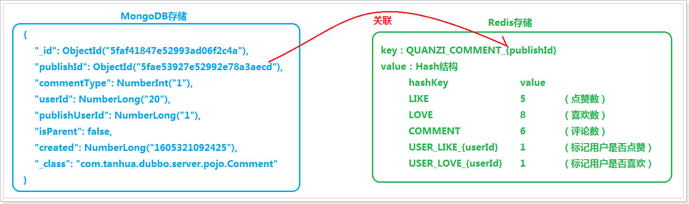
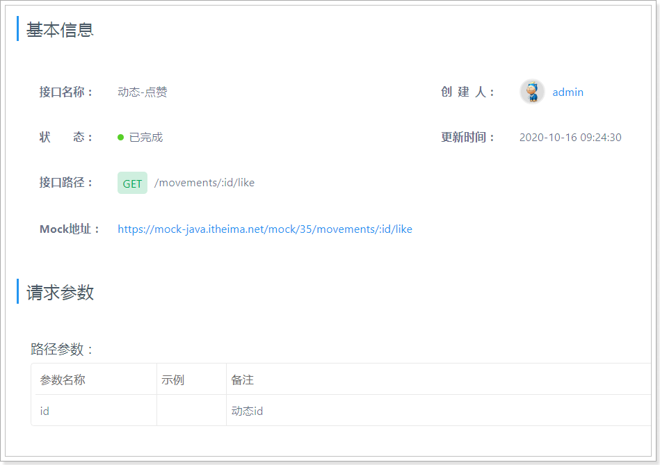
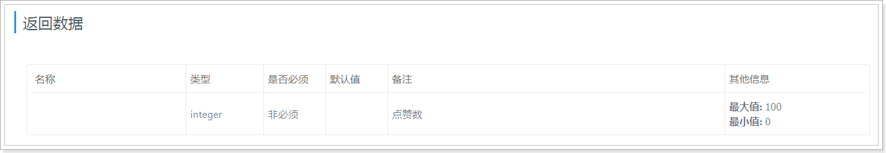
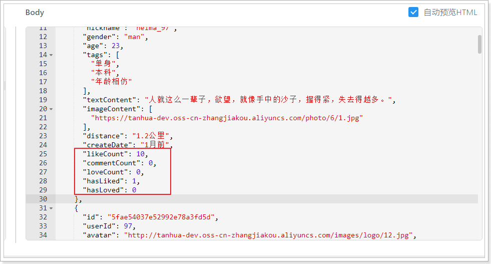
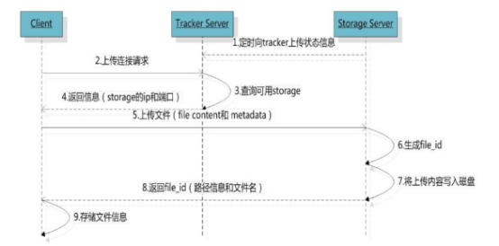
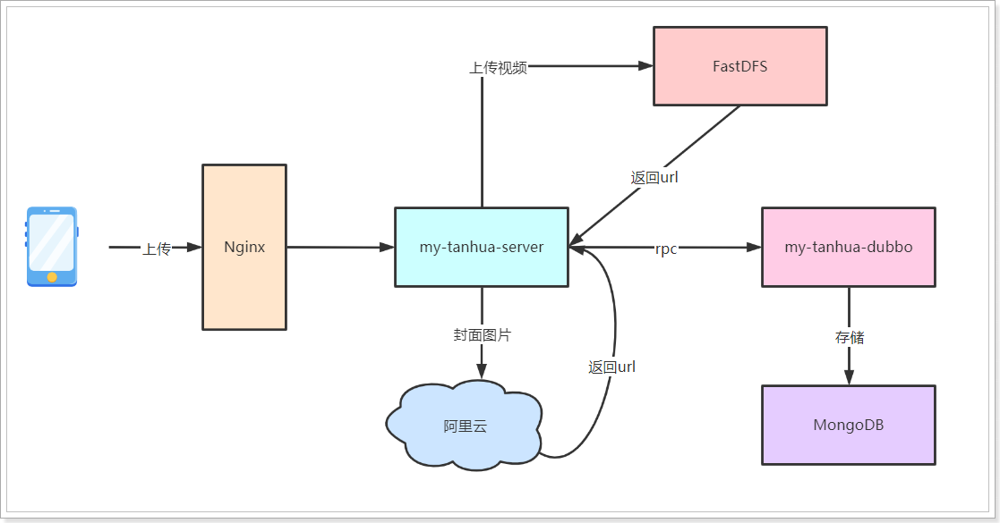
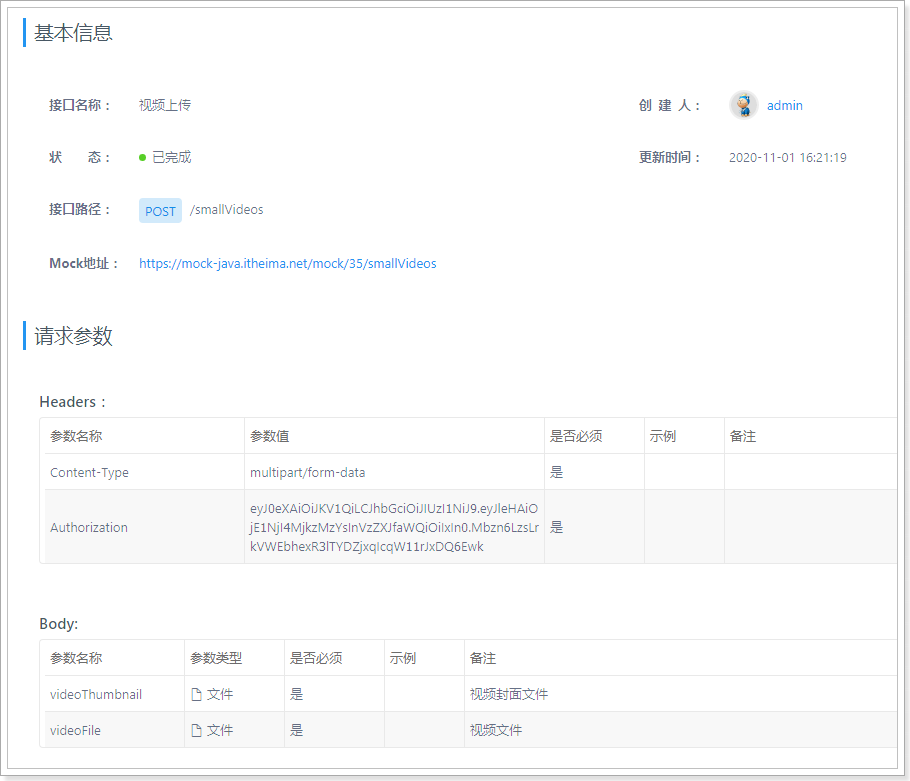
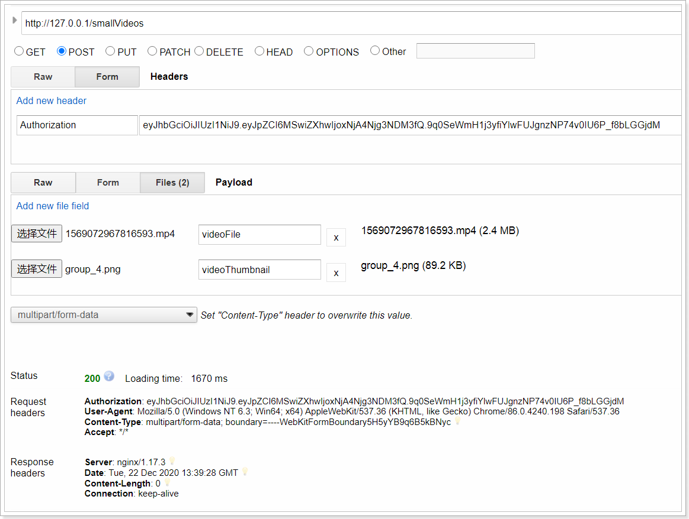

## 课程说明

- 圈子实现点赞、喜欢功能
- 圈子实现评论
- 圈子实现评论的点赞
- 小视频功能介绍
- FastDFS入门学习
- 实现发布小视频功能
- 实现查询小视频列表功能

## 1、圈子点赞实现分析

在圈子功能中，对于圈子的点赞、喜欢、评论等均可理解为用户对动态的评论（Comment），在quanzi_comment表中使用commentType进行区分。

在具体的实现中，需要将点赞数、某用户是否点赞等数据保存到Reds中，以减轻MongoDB的压力。

具体存储结构如下：



> 说明：在Redis的存储结构中，采用的是Hash存储，这样的好处就在于一条动态的点赞、喜欢等数据都会集中的存储到一起，从而减少了Redis中数据条数。

## 2、点赞

### 2.1、定义枚举

为了规范使用CommentType，所以将其定义为枚举类型。

~~~java
package com.tanhua.dubbo.enums;

/**
 * 评论类型：1-点赞，2-评论，3-喜欢
 */
public enum CommentType {

    LIKE(1), COMMENT(2), LOVE(3);

    int type;

    CommentType(int type) {
        this.type = type;
    }

    public int getType() {
        return type;
    }
}
~~~

### 2.2、dubbo服务

#### 2.2.1、定义接口

~~~java
package com.tanhua.dubbo.server.api;

import com.tanhua.dubbo.server.pojo.Publish;
import com.tanhua.dubbo.server.vo.PageInfo;

public interface QuanZiApi {

    //........此处忽略其他代码..........

    /**
     * 根据id查询动态
     *
     * @param id 动态id
     * @return
     */
    Publish queryPublishById(String id);

    /**
     * 点赞
     *
     * @param userId
     * @param publishId
     * @return
     */
    Boolean likeComment(Long userId, String publishId);

    /**
     * 取消点赞
     *
     * @param userId
     * @param publishId
     * @return
     */
    Boolean disLikeComment(Long userId, String publishId);

    /**
     * 查询点赞数
     *
     * @param publishId
     * @return
     */
    Long queryLikeCount(String publishId);

    /**
     * 查询用户是否点赞该动态
     *
     * @param userId
     * @param publishId
     * @return
     */
    Boolean queryUserIsLike(Long userId, String publishId);

}

~~~

#### 2.2.2、编写实现

~~~java
package com.tanhua.dubbo.server.api;

@DubboService(version = "1.0.0")
@Slf4j
public class QuanZiApiImpl implements QuanZiApi {

    //评论数据存储在Redis中key的前缀
    private static final String COMMENT_REDIS_KEY_PREFIX = "QUANZI_COMMENT_";

    //用户是否点赞的前缀
    private static final String COMMENT_USER_LIEK_REDIS_KEY_PREFIX = "USER_LIKE_";

    //用户是否喜欢的前缀
    private static final String COMMENT_USER_LOVE_REDIS_KEY_PREFIX = "USER_LOVE_";

    @Autowired
    private MongoTemplate mongoTemplate;

    @Autowired
    private RedisTemplate<String, String> redisTemplate;

   	//........此处忽略其他代码..........

      /**
     * 根据id查询动态
     *
     * @param id 动态id
     * @return
     */
    @Override
    public Publish queryPublishById(String id) {
        return this.mongoTemplate.findById(new ObjectId(id), Publish.class);
    }

    /**
     * 点赞
     *
     * @param userId
     * @param publishId
     * @return
     */
    @Override
    public Boolean likeComment(Long userId, String publishId) {
        // 判断该用户是否对该动态已经点赞
        if (this.queryUserIsLike(userId, publishId)) {
            return false;
        }

        //将数据保存到MongoDB
        Comment comment = new Comment();
        comment.setId(ObjectId.get());
        comment.setCommentType(CommentType.LIKE.getType());
        comment.setCreated(System.currentTimeMillis());
        comment.setPublishId(new ObjectId(publishId));
        comment.setIsParent(false);

        //查询动态
        Publish publish = this.queryPublishById(publishId);
        comment.setPublishUserId(publish.getUserId());
        comment.setUserId(userId);
        this.mongoTemplate.save(comment);

        //将点赞数以及用户是否点赞记录到redis中
        String redisKey = this.getCommentRedisKey(publishId);
        String hashKey = CommentType.LIKE.name();
        //点赞数
        this.redisTemplate.opsForHash().increment(redisKey, hashKey, 1);

        //标识该用户已经点赞
        this.redisTemplate.opsForHash().put(redisKey, this.getCommentUserLikeRedisKey(userId), "1");

        return true;
    }

    /**
     * 根据动态id返回redis的key
     *
     * @param publishId
     * @return
     */
    private String getCommentRedisKey(String publishId) {
        return COMMENT_REDIS_KEY_PREFIX + publishId;
    }

    /**
     * 根据用户id返回hashkey
     *
     * @param userId
     * @return
     */
    private String getCommentUserLikeRedisKey(Long userId) {
        return COMMENT_USER_LIKE_REDIS_KEY_PREFIX + userId;
    }

    /**
     * 取消点赞
     *
     * @param userId
     * @param publishId
     * @return
     */
    @Override
    public Boolean disLikeComment(Long userId, String publishId) {
        //判断该用户是否有点赞
        if (!this.queryUserIsLike(userId, publishId)) {
            return false;
        }

        //删除MongoDB中的点赞记录
        Query query = Query.query(Criteria.where("userId").is(userId)
                .and("publishId").is(new ObjectId(publishId))
                .and("commentType").is(CommentType.LIKE.getType()));
        this.mongoTemplate.remove(query, Comment.class);

        //修改redis中的数据
        String redisKey = this.getCommentRedisKey(publishId);
        String hashKey = CommentType.LIKE.name();
        //点赞数
        this.redisTemplate.opsForHash().increment(redisKey, hashKey, -1);

        //删除已点赞的标识
        this.redisTemplate.opsForHash().delete(redisKey, this.getCommentUserLikeRedisKey(userId));

        return true;
    }

    /**
     * 查询点赞数
     *
     * @param publishId
     * @return
     */
    @Override
    public Long queryLikeCount(String publishId) {
        String redisKey = this.getCommentRedisKey(publishId);
        String hashKey = CommentType.LIKE.name();
        return Convert.toLong(this.redisTemplate.opsForHash().get(redisKey, hashKey), 0L);
    }

    /**
     * 查询用户是否点赞该动态
     *
     * @param userId
     * @param publishId
     * @return
     */
    @Override
    public Boolean queryUserIsLike(Long userId, String publishId) {
        String redisKey = this.getCommentRedisKey(publishId);
        String hashKey = this.getCommentUserLikeRedisKey(userId);
        return this.redisTemplate.opsForHash().hasKey(redisKey, hashKey);
    }
}

~~~

#### 2.2.3、编写测试用例

```java
package com.tanhua.dubbo.server.api;

import com.tanhua.dubbo.server.pojo.Publish;
import com.tanhua.dubbo.server.vo.PageInfo;
import org.junit.Test;
import org.junit.runner.RunWith;
import org.springframework.beans.factory.annotation.Autowired;
import org.springframework.boot.test.context.SpringBootTest;
import org.springframework.test.context.junit4.SpringRunner;

@RunWith(SpringRunner.class)
@SpringBootTest
public class TestQuanZiApi {

    @Autowired
    private QuanZiApi quanZiApi;

    //........此处忽略其他代码..........
    
    @Test
    public void testLike(){
        Long userId = 1L;
        String publishId = "5fae53947e52992e78a3afb1";
        Boolean data = this.quanZiApi.queryUserIsLike(userId, publishId);
        System.out.println(data);

        System.out.println(this.quanZiApi.likeComment(userId, publishId));

        System.out.println(this.quanZiApi.queryLikeCount(publishId));

        System.out.println(this.quanZiApi.disLikeComment(userId, publishId));

        System.out.println(this.quanZiApi.queryLikeCount(publishId));
    }

}
```

### 2.3、APP接口服务

点赞接口地址：https://mock-java.itheima.net/project/35/interface/api/707





从接口文档来看，点赞完成后需要返回点赞数。

#### 2.3.1、编写接口服务

~~~java
//com.tanhua.server.controller.QuanZiController
    /**
     * 点赞
     *
     * @param publishId
     * @return
     */
    @GetMapping("/{id}/like")
    public Long likeComment(@PathVariable("id") String publishId) {
        return this.quanZiService.likeComment(publishId);
    }

    /**
     * 取消点赞
     *
     * @param publishId
     * @return
     */
    @GetMapping("/{id}/dislike")
    public Long disLikeComment(@PathVariable("id") String publishId) {
        return this.quanZiService.disLikeComment(publishId);
    }

~~~

#### 2.3.2、编写服务实现

~~~java
//com.tanhua.server.service.QuanZiService

public Long likeComment(String publishId) {
        Long userId = UserThreadLocal.get();
        //点赞
        Boolean result = this.quanZiApi.likeComment(userId, publishId);
        if (result) {
            //查询点赞数
            return this.quanZiApi.queryLikeCount(publishId);
        }
        return 0L;
    }

    public Long disLikeComment(String publishId) {
        Long userId = UserThreadLocal.get();
        //取消点赞
        Boolean result = this.quanZiApi.disLikeComment(userId, publishId);
        if (result) {
            //查询点赞数
            return this.quanZiApi.queryLikeCount(publishId);
        }
        return 0L;
    }
~~~

#### 2.3.3、修改查询动态点赞数

查询点赞数、是否点赞，需要通过dubbo服务进行查询。

~~~java
//com.tanhua.server.service.QuanZiService

    /**
     * 填充QuanZiVo
     *
     */
    private List<QuanZiVo> fillPublishList(List<Publish> publishList) {
        List<QuanZiVo> quanZiVoList = new ArrayList<>();

        Long userId = UserThreadLocal.get();

        for (Publish publish : publishList) {
            QuanZiVo quanZiVo = BeanUtil.toBeanIgnoreError(publish, QuanZiVo.class);

            quanZiVo.setDistance("距离1.8公里"); //TODO 距离
            quanZiVo.setCommentCount(0); //TODO 评论数
            quanZiVo.setHasLiked(this.quanZiApi.queryUserIsLike(userId, quanZiVo.getId()) ? 1 : 0); //是否点赞（1是，0否）
            quanZiVo.setLikeCount(Convert.toInt(this.quanZiApi.queryLikeCount(quanZiVo.getId()))); //点赞数
            quanZiVo.setHasLoved(0); //TODO 是否喜欢（1是，0否）
            quanZiVo.setLoveCount(0); //TODO 喜欢数

            // 时间：10分钟前
            quanZiVo.setCreateDate(RelativeDateFormat.format(new Date(publish.getCreated())));
            quanZiVoList.add(quanZiVo);
        }

        //查询用户信息
        List<Object> userIdList = CollUtil.getFieldValues(quanZiVoList, "userId");
        List<UserInfo> userInfoList = this.userInfoApi.queryByUserIdList(userIdList);
        for (QuanZiVo quanZiVo : quanZiVoList) {
            for (UserInfo userInfo : userInfoList) {
                if (ObjectUtil.equal(quanZiVo.getUserId(), userInfo.getUserId())) {
                    BeanUtil.copyProperties(userInfo, quanZiVo, "id");
                    //设置性别
                    quanZiVo.setGender(userInfo.getSex().name().toLowerCase());
                    break;
                }
            }
        }

        return quanZiVoList;
    }
~~~

#### 2.3.4、测试



从测试结果中可以看出，在响应结果中返回了点赞数以及是否点赞的数据。

## 3、喜欢（TODO）

喜欢的实现与点赞类似，只是其类型不同。需要注意的是，在推荐动态中才有喜欢功能，好友动态中是没有此功能的。

### 3.1、dubbo服务

#### 3.1.1、定义接口

~~~java
//com.tanhua.dubbo.server.api.QuanZiApi

	/**
     * 喜欢
     *
     * @param userId
     * @param publishId
     * @return
     */
    Boolean loveComment(Long userId, String publishId);

    /**
     * 取消喜欢
     *
     * @param userId
     * @param publishId
     * @return
     */
    Boolean disLoveComment(Long userId, String publishId);

    /**
     * 查询喜欢数
     *
     * @param publishId
     * @return
     */
    Long queryLoveCount(String publishId);

    /**
     * 查询用户是否喜欢该动态
     *
     * @param userId
     * @param publishId
     * @return
     */
    Boolean queryUserIsLove(Long userId, String publishId);
~~~

#### 3.1.2、编写实现

```java
//com.tanhua.dubbo.server.api.QuanZiApiImpl

	private String getCommentUserLoveRedisKey(Long userId) {
        return COMMENT_USER_LOVE_REDIS_KEY_PREFIX + userId;
    }

    /**
     * 喜欢
     *
     * @param userId
     * @param publishId
     * @return
     */
    @Override
    public Boolean loveComment(Long userId, String publishId) {
        //是否判断是否已经喜欢
        if (this.queryUserIsLove(userId, publishId)) {
            return false;
        }

        try {
            Boolean result = this.saveComment(userId, publishId, CommentType.LOVE);
            if (!result) {
                return false;
            }

            //喜欢数与用户是否喜欢存储到redis中
            String redisKey = getCommentRedisKey(publishId);
            //喜欢数
            this.redisTemplate.opsForHash().increment(redisKey, CommentType.LOVE.name(), 1);
            //标记用户已经喜欢
            this.redisTemplate.opsForHash().put(redisKey, getCommentUserLoveRedisKey(userId), "1");

            return true;
        } catch (Exception e) {
            log.error("喜欢失败~ userId = " + userId + ", publishId = " + publishId, e);
        }

        return false;
    }

    @Override
    public Boolean disLoveComment(Long userId, String publishId) {
        //判断改用户是否已经喜欢
        if (!this.queryUserIsLove(userId, publishId)) {
            return false;
        }

        try {
            //删除MongoDB数据
            Query query = Query.query(Criteria.where("userId").is(userId)
                    .and("publishId").is(new ObjectId(publishId))
                    .and("commentType").is(CommentType.LOVE.getType()));
            this.mongoTemplate.remove(query, Comment.class);

            //喜欢数与用户是否喜欢存储到redis中
            String redisKey = getCommentRedisKey(publishId);
            //修改点喜欢
            this.redisTemplate.opsForHash().increment(redisKey, CommentType.LOVE.name(), -1);
            //删除已经喜欢的标记
            this.redisTemplate.opsForHash().delete(redisKey, getCommentUserLoveRedisKey(userId));

            return true;
        } catch (Exception e) {
            e.printStackTrace();
        }

        return false;
    }

    @Override
    public Long queryLoveCount(String publishId) {
        String redisKey = getCommentRedisKey(publishId);
        Object data = this.redisTemplate.opsForHash().get(redisKey, CommentType.LOVE.name());
        if (ObjectUtil.isEmpty(data)) {
            return 0L;
        }
        //TODO 如果redis数据丢失的话，需要查询MongoDB
        return Convert.toLong(data);
    }

    @Override
    public Boolean queryUserIsLove(Long userId, String publishId) {
        String redisKey = getCommentRedisKey(publishId);
        String hashKey = getCommentUserLoveRedisKey(userId);
        //TODO 如果redis数据丢失的话，需要查询MongoDB
        return this.redisTemplate.opsForHash().hasKey(redisKey, hashKey);
    }
```

### 3.2、APP接口服务

#### 3.2.1、编写接口服务

~~~java
//com.tanhua.server.controller.QuanZiController

     /**
     * 喜欢
     *
     * @param publishId
     * @return
     */
    @GetMapping("/{id}/love")
    public Long loveComment(@PathVariable("id") String publishId) {
        return this.quanZiService.loveComment(publishId);
    }

    /**
     * 取消喜欢
     *
     * @param publishId
     * @return
     */
    @GetMapping("/{id}/unlove")
    public Long disLoveComment(@PathVariable("id") String publishId) {
        return this.quanZiService.disLoveComment(publishId);
    }
~~~

#### 3.2.2、编写服务实现

~~~java
//com.tanhua.server.service.QuanZiService

    public Long loveComment(String publishId) {
        Long userId = UserThreadLocal.get();
        //喜欢
        Boolean result = this.quanZiApi.loveComment(userId, publishId);
        if (result) {
            //查询喜欢数
            return this.quanZiApi.queryLoveCount(publishId);
        }
        return null;
    }

    public Long disLoveComment(String publishId) {
        Long userId = UserThreadLocal.get();
        //取消喜欢
        Boolean result = this.quanZiApi.disLoveComment(userId, publishId);
        if (result) {
            //查询喜欢数
            return this.quanZiApi.queryLoveCount(publishId);
        }
        return null;
    }

    /**
     * 填充用户信息
     *
     * @param userInfo
     * @param quanZiVo
     */
    private void fillUserInfoToQuanZiVo(UserInfo userInfo, QuanZiVo quanZiVo) {
        BeanUtil.copyProperties(userInfo, quanZiVo, "id");
        quanZiVo.setGender(userInfo.getSex().name().toLowerCase());
        quanZiVo.setTags(StringUtils.split(userInfo.getTags(), ','));

        //当前用户
        User user = UserThreadLocal.get();

        quanZiVo.setCommentCount(0); //TODO 评论数
        quanZiVo.setDistance("1.2公里"); //TODO 距离
        quanZiVo.setHasLiked(this.quanZiApi.queryUserIsLike(user.getId(), quanZiVo.getId()) ? 1 : 0); //是否点赞（1是，0否）
        quanZiVo.setLikeCount(Convert.toInt(this.quanZiApi.queryLikeCount(quanZiVo.getId()))); //点赞数
        quanZiVo.setHasLoved(this.quanZiApi.queryUserIsLove(user.getId(), quanZiVo.getId()) ? 1 : 0); //是否喜欢（1是，0否）
        quanZiVo.setLoveCount(Convert.toInt(this.quanZiApi.queryLoveCount(quanZiVo.getId()))); //喜欢数
    }
~~~

#### 1.2.3、测试

 

## 4、查询单条动态

用户点击评论时需要查询单条动态详情，需要有接口支持。

服务接口地址：https://mock-java.itheima.net/project/35/interface/api/695


响应的数据接口与查询好友动态一致，只是单条返回而不是集合。

要注意的是，dubbo服务接口在前面已经开发完成，现在只要想实现APP端的接口服务即可。

### 4.1、定义服务接口

~~~java
//com.tanhua.server.controller.QuanZiController

    /**
     * 查询单条动态信息
     *
     * @param publishId
     * @return
     */
    @GetMapping("/{id}")
    public QuanZiVo queryById(@PathVariable("id") String publishId) {
        return this.quanZiService.queryById(publishId);
    }
~~~

### 4.2、服务实现

~~~java
//com.tanhua.server.service.QuanZiService

    public QuanZiVo queryById(String publishId) {
        Publish publish = this.quanZiApi.queryPublishById(publishId);
        if(null == publish){
            return null;
        }
        return this.fillPublishList(Arrays.asList(publish)).get(0);
    }
~~~

### 4.3、测试


可以看到，返回了单条数据。

### 4.4、异常的解决

在完成查询单条动态接口后，会发现，刷新首页时会出现如下异常：

~~~shell
java.lang.IllegalArgumentException: invalid hexadecimal representation of an ObjectId: [visitors]
	at org.bson.types.ObjectId.parseHexString(ObjectId.java:550)
	at org.bson.types.ObjectId.<init>(ObjectId.java:239)
	at com.tanhua.dubbo.server.api.QuanZiApiImpl.queryPublishById(QuanZiApiImpl.java:411)
	at com.alibaba.dubbo.common.bytecode.Wrapper1.invokeMethod(Wrapper1.java)
	at com.alibaba.dubbo.rpc.proxy.javassist.JavassistProxyFactory$1.doInvoke(JavassistProxyFactory.java:47)
	at com.alibaba.dubbo.rpc.proxy.AbstractProxyInvoker.invoke(AbstractProxyInvoker.java:76)
	at com.alibaba.dubbo.config.invoker.DelegateProviderMetaDataInvoker.invoke(DelegateProviderMetaDataInvoker.java:52)
	at com.alibaba.dubbo.rpc.protocol.InvokerWrapper.invoke(InvokerWrapper.java:56)
~~~

原因是：谁看过我的接口还没实现，导致了映射到了查询单条动态的接口，导致的异常，接口地址：https://mock-java.itheima.net/project/35/interface/api/743

解决方法：编写一个空的方法《谁看过我》的接口实现。

```java
//com.tanhua.server.controller.QuanZiController
    /**
     * TODO：谁看过我
     *
     * @return
     */
    @GetMapping("visitors")
    public Object queryVisitors() {
        return Collections.EMPTY_LIST;
    }
```

## 5、评论（TODO）

在单条动态打开后，可以看到有评论列表，功能包括：查询评论列表，评论点赞、取消点赞。

需要注意的是，评论的点赞操作与圈子动态的点赞使用同一套逻辑。

### 5.1、dubbo服务

#### 5.1.1、定义服务接口

~~~java
//com.tanhua.dubbo.server.api.QuanZiApi

	/**
     * 查询评论
     *
     * @return
     */
    PageInfo<Comment> queryCommentList(String publishId, Integer page, Integer pageSize);

    /**
     * 发表评论
     *
     * @param userId
     * @param publishId
     * @param content
     * @return
     */
    Boolean saveComment(Long userId, String publishId, String content);
~~~

#### 5.1.2、编写实现

~~~java
    /**
     * 查询评论列表
     * 
     * @param publishId
     * @param page
     * @param pageSize
     * @return
     */
    @Override
    public PageInfo<Comment> queryCommentList(String publishId, Integer page, Integer pageSize) {
        PageRequest pageRequest = PageRequest.of(page - 1, pageSize, Sort.by(Sort.Order.asc("created")));
        
        Query query = new Query(Criteria
                .where("publishId").is(new ObjectId(publishId))
                .and("commentType").is(CommentType.COMMENT.getType())).with(pageRequest);

        //查询评论列表
        List<Comment> commentList = this.mongoTemplate.find(query, Comment.class);

        PageInfo<Comment> pageInfo = new PageInfo<>();
        pageInfo.setPageNum(page);
        pageInfo.setPageSize(pageSize);
        pageInfo.setRecords(commentList);
        return pageInfo;
    }

    /**
     * 发表评论
     *
     * @param userId
     * @param publishId
     * @param content
     * @return
     */
    @Override
    public Boolean saveComment(Long userId, String publishId, String content) {
        return this.saveComment(userId, publishId, CommentType.COMMENT, content);
    }

    private Boolean saveComment(Long userId, String publishId, CommentType commentType,
                                String content) {
        //点赞，数据保存到MongoDB中
        try {
            Comment comment = new Comment();
            comment.setId(ObjectId.get());
            comment.setCommentType(commentType.getType());
            comment.setUserId(userId);
            comment.setPublishId(new ObjectId(publishId));
            comment.setCreated(System.currentTimeMillis());
            comment.setContent(content);
            //发布动态userId
            Publish publish = this.queryPublishById(publishId);
            comment.setPublishUserId(publish.getUserId());

            //存储到MongoDB
            this.mongoTemplate.save(comment);
            return true;
        } catch (Exception e) {
            log.error("saveComment error! ", e);
        }
        return false;
    }

    private Boolean saveComment(Long userId, String publishId, CommentType commentType) {
        return this.saveComment(userId, publishId, commentType, null);
    }
~~~

### 5.2、APP接口服务

#### 5.2.1、CommentVo

根据响应结果的数据结构定义对象：

~~~java
package com.tanhua.server.vo;

import cn.hutool.core.annotation.Alias;
import lombok.AllArgsConstructor;
import lombok.Data;
import lombok.NoArgsConstructor;

/**
 * 评论
 */
@Data
@NoArgsConstructor
@AllArgsConstructor
public class CommentVo {

    private String id; //评论id
    @Alias("logo")
    private String avatar; //头像
    @Alias("nickName")
    private String nickname; //昵称
    private String content; //评论
    private String createDate; //评论时间: 08:27
    private Integer likeCount; //点赞数
    private Integer hasLiked; //是否点赞（1是，0否）

}
~~~
#### 5.2.2、编写Controller

在APP接口服务中，需要开发4个接口，分别是查询评论列表、发表评论、点赞、取消点赞。

由于其接口的url地址与QuanZiConroller地址不同，所以需要创建不同的Controller类。

~~~java
package com.tanhua.server.controller;

import com.tanhua.server.service.QuanZiService;
import com.tanhua.server.vo.PageResult;
import org.springframework.beans.factory.annotation.Autowired;
import org.springframework.http.HttpStatus;
import org.springframework.http.ResponseEntity;
import org.springframework.web.bind.annotation.*;

import java.util.Map;

/**
 * 圈子功能中的评论
 */
@RestController
@RequestMapping("comments")
public class QuanZiCommentController {

    @Autowired
    private QuanZiService quanZiService;

    /**
     * 查询评论列表
     *
     * @return
     */
    @GetMapping
    public PageResult queryCommentsList(@RequestParam("movementId") String publishId,
                                        @RequestParam(value = "page", defaultValue = "1") Integer page,
                                        @RequestParam(value = "pagesize", defaultValue = "10") Integer pageSize) {
        return this.quanZiService.queryCommentList(publishId, page, pageSize);
    }

    /**
     * 保存评论
     */
    @PostMapping
    public void saveComments(@RequestBody Map<String, String> param) {
        String publishId = param.get("movementId");
        String content = param.get("comment");
        this.quanZiService.saveComments(publishId, content);
    }

    /**
     * 点赞
     *
     * @param publishId
     * @return
     */
    @GetMapping("{id}/like")
    public Long likeComment(@PathVariable("id") String publishId) {
        return this.quanZiService.likeComment(publishId);
    }

    /**
     * 取消点赞
     *
     * @param publishId
     * @return
     */
    @GetMapping("{id}/dislike")
    public Long disLikeComment(@PathVariable("id") String publishId) {
        return this.quanZiService.disLikeComment(publishId);
    }

}

~~~

#### 5.2.3、编写Service实现

Service的具体实现依然是放到QuanZiSerivce中完成。

~~~java
//com.tanhua.server.service.QuanZiService

    /**
     * 查询评论列表
     *
     * @param publishId
     * @param page
     * @param pageSize
     * @return
     */
    public PageResult queryCommentList(String publishId, Integer page, Integer pageSize) {

        PageResult pageResult = new PageResult();
        pageResult.setPage(page);
        pageResult.setPagesize(pageSize);

        Long userId = UserThreadLocal.get();

        //查询评论列表数据
        PageInfo<Comment> pageInfo = this.quanZiApi.queryCommentList(publishId, page, pageSize);
        List<Comment> records = pageInfo.getRecords();
        if(CollUtil.isEmpty(records)){
            return pageResult;
        }

        //查询用户信息
        List<Object> userIdList = CollUtil.getFieldValues(records, "userId");
        List<UserInfo> userInfoList = this.userInfoApi.queryByUserIdList(userIdList);

        List<CommentVo> result = new ArrayList<>();
        for (Comment record : records) {
            CommentVo commentVo = new CommentVo();
            commentVo.setContent(record.getContent());
            commentVo.setId(record.getId().toHexString());
            commentVo.setCreateDate(DateUtil.format(new Date(record.getCreated()), "HH:mm"));
            //是否点赞
            commentVo.setHasLiked(this.quanZiApi.queryUserIsLike(userId, commentVo.getId()) ? 1 : 0);
            //点赞数
            commentVo.setLikeCount(Convert.toInt(this.quanZiApi.queryLikeCount(commentVo.getId())));

            for (UserInfo userInfo : userInfoList) {
                if(ObjectUtil.equals(record.getUserId(), userInfo.getUserId())){
                    commentVo.setAvatar(userInfo.getLogo());
                    commentVo.setNickname(userInfo.getNickName());
                    break;
                }
            }
            result.add(commentVo);
        }
        pageResult.setItems(result);
        return pageResult;
    }

    /**
     * 发表评论
     * @param publishId
     * @param content
     * @return
     */
    public Boolean saveComments(String publishId, String content) {
        return this.quanZiApi.saveComment(UserThreadLocal.get(), publishId, content);
    }
~~~

#### 5.2.4、测试

 

测试点赞时会发现dubbo服务中会出现null指针异常，如下：

~~~shell
java.lang.NullPointerException
	at com.tanhua.dubbo.server.api.QuanZiApiImpl.saveComment(QuanZiApiImpl.java:386)
	at com.tanhua.dubbo.server.api.QuanZiApiImpl.likeComment(QuanZiApiImpl.java:180)
	at com.alibaba.dubbo.common.bytecode.Wrapper1.invokeMethod(Wrapper1.java)
	at com.alibaba.dubbo.rpc.proxy.javassist.JavassistProxyFactory$1.doInvoke(JavassistProxyFactory.java:47)
	at com.alibaba.dubbo.rpc.proxy.AbstractProxyInvoker.invoke(AbstractProxyInvoker.java:76)
	at com.alibaba.dubbo.config.invoker.DelegateProviderMetaDataInvoker.invoke(DelegateProviderMetaDataInvoker.java:52)
	at com.alibaba.dubbo.rpc.protocol.InvokerWrapper.invoke(InvokerWrapper.java:56)
~~~

原因是：原有的点赞实现中，需要查询Publish对象，但是现在实现的是针对评论的点赞，是查询不到Publish对象的，所以抛出了空指针异常。

解决如下：

~~~java
//com.tanhua.dubbo.server.api.QuanZiApiImpl

    /**
     * 保存Comment
     *
     * @return
     */
        private Boolean saveComment(Long userId, String publishId, CommentType commentType, String content) {
        //点赞，数据保存到MongoDB中
        try {
            Comment comment = new Comment();
            comment.setId(ObjectId.get());
            comment.setCommentType(commentType.getType());
            comment.setUserId(userId);
            comment.setPublishId(new ObjectId(publishId));
            comment.setCreated(System.currentTimeMillis());
            //发布动态userId
            Publish publish = this.queryPublishById(publishId);
            if(null != publish){
                comment.setPublishUserId(publish.getUserId());
            }else{
                // 对于评论点赞
                Comment commentObj = this.mongoTemplate.findById(new ObjectId(publishId), Comment.class);
                if(null != commentObj){
                    comment.setPublishUserId(commentObj.getUserId());
                }
            }

            comment.setContent(content);

            //存储到MongoDB
            this.mongoTemplate.save(comment);
            return true;
        } catch (Exception e) {
            log.error("saveComment error! ", e);
        }
        return false;
    }

~~~

 

这样，点赞功能正常了。

## 6、小视频

### 6.1、功能说明

小视频功能类似于抖音、快手小视频的应用，用户可以上传小视频进行分享，也可以浏览查看别人分享的视频，并且可以对视频评论和点赞操作。

效果：

 

查看详情：

 

评论：

 

点赞：

 

### 6.2、技术方案

对于小视频的功能的开发，核心点就是：存储 + 推荐 + 加载速度 。

- 对于存储而言，小视频的存储量以及容量都是非常巨大的。
  - 所以我们选择自己搭建分布式存储系统 FastDFS进行存储。
- 对于推荐算法，我们将采用多种权重的计算方式进行计算。
- 对于加载速度，除了提升服务器带宽外可以通过CDN的方式进行加速，当然了这需要额外购买CDN服务。

## 7、FastDFS

### 7.1、FastDFS是什么？

FastDFS是分布式文件系统。使用 FastDFS很容易搭建一套高性能的文件服务器集群提供文件上传、下载等服务。

### 7.2、工作原理

FastDFS 架构包括 Tracker server 和 Storage server。客户端请求 Tracker server 进行文件上传、下载，通过 Tracker server 调度最终由 Storage server 完成文件上传和下载。

Tracker server 作用是负载均衡和调度，通过 Tracker server 在文件上传时可以根据一些策略找到 Storage server 提供文件上传服务。可以将 tracker 称为追踪服务器或调度服务器。

Storage server 作用是文件存储，客户端上传的文件最终存储在 Storage 服务器上，Storage server 没有实现自己的文件系统而是利用操作系统的文件系统来管理文件。可以将storage称为存储服务器。

 

每个 tracker 节点地位平等，收集 Storage 集群的状态。

Storage 分为多个组，每个组之间保存的文件是不同的。每个组内部可以有多个成员，组成员内部保存的内容是一样的，组成员的地位是一致的，没有主从的概念。

### 7.3、文件的上传

 

客户端上传文件后存储服务器将文件 ID 返回给客户端，此文件 ID 用于以后访问该文件的索引信息。文件索引信息包括：组名，虚拟磁盘路径，数据两级目录，文件名。

### 7.4、文件的下载

 

客户端下载请求到Tracker服务，Tracker返回给客户端storage的信息，客户端根据这些信息进行请求storage获取到文件。

### 7.5、开始使用

在我们提供的虚拟机中已经通过docker搭建了FastDFS环境，下面我们来学习下如何通过Java程序来使用FastDFS。

#### 7.5.1、引入依赖

关于使用FastDFS上传小视频的逻辑我们在server工程中完成，所以需要在server工程中引入依赖。

~~~xml
<dependency>
    <groupId>com.github.tobato</groupId>
    <artifactId>fastdfs-client</artifactId>
</dependency>
~~~

#### 7.5.2、编写配置文件

在application.properties配置文件中加入如下内容：

~~~properties
# ===================================================================
# 分布式文件系统FDFS配置
# ===================================================================
fdfs.so-timeout = 1501
fdfs.connect-timeout = 601
#缩略图生成参数
fdfs.thumb-image.width= 150
fdfs.thumb-image.height= 150
#TrackerList参数,支持多个
fdfs.tracker-list=192.168.31.81:22122
#访问路径
fdfs.web-server-url=http://192.168.31.81:8888/
~~~

#### 7.5.3、测试代码

~~~java
package com.tanhua.server;

import com.github.tobato.fastdfs.domain.conn.FdfsWebServer;
import com.github.tobato.fastdfs.domain.fdfs.StorePath;
import com.github.tobato.fastdfs.service.FastFileStorageClient;
import org.apache.commons.io.FileUtils;
import org.junit.Test;
import org.junit.runner.RunWith;
import org.springframework.beans.factory.annotation.Autowired;
import org.springframework.boot.test.context.SpringBootTest;
import org.springframework.test.context.junit4.SpringRunner;

import java.io.File;
import java.io.IOException;

@RunWith(SpringRunner.class)
@SpringBootTest
public class TestFastDFS {

    @Autowired
    protected FastFileStorageClient storageClient;

    @Autowired
    private FdfsWebServer fdfsWebServer;

    @Test
    public void testUpload(){
        String path = "F:\\1.jpg";
        File file = new File(path);

        try {
            StorePath storePath = this.storageClient.uploadFile(FileUtils.openInputStream(file), file.length(), "jpg", null);

            System.out.println(storePath); //StorePath [group=group1, path=M00/00/00/wKgfUV2GJSuAOUd_AAHnjh7KpOc1.1.jpg]
            System.out.println(fdfsWebServer.getWebServerUrl() + storePath.getFullPath());//group1/M00/00/00/wKgfUV2GJSuAOUd_AAHnjh7KpOc1.1.jpg
        } catch (IOException e) {
            e.printStackTrace();
        }
    }
}

~~~

通过浏览器访问图片：

 

## 8、发布小视频

发布小视频的流程如下：



说明：

- 用户发通过客户端APP上传视频到server服务
- server服务上传视频到FastDFS文件系统，上传成功后返回视频的url地址
- server通过rpc的调用dubbo服务进行保存小视频数据

### 8.1、dubbo服务

#### 8.1.1、编写pojo

在dubbo接口工程中编写pojo：

~~~java
package com.tanhua.dubbo.server.pojo;

import lombok.AllArgsConstructor;
import lombok.Data;
import lombok.NoArgsConstructor;
import org.bson.types.ObjectId;
import org.springframework.data.mongodb.core.mapping.Document;

import java.util.List;

@Data
@NoArgsConstructor
@AllArgsConstructor
@Document(collection = "video")
public class Video implements java.io.Serializable {

    private static final long serialVersionUID = -3136732836884933873L;

    private ObjectId id; //主键id
    private Long vid; //自增长id
    private Long userId;
    private String text; //文字
    private String picUrl; //视频封面文件
    private String videoUrl; //视频文件
    private Long created; //创建时间
    private Integer seeType; // 谁可以看，1-公开，2-私密，3-部分可见，4-不给谁看
    private List<Long> seeList; //部分可见的列表
    private List<Long> notSeeList; //不给谁看的列表
    private String longitude; //经度
    private String latitude; //纬度
    private String locationName; //位置名称
}

~~~

#### 8.1.2、定义接口

~~~java
package com.tanhua.dubbo.api;

import com.tanhua.dubbo.pojo.Video;

public interface VideoApi {

    /**
     * 保存小视频
     *
     * @param video
     * @return 保存成功后，返回视频id
     */
    String saveVideo(Video video);

}

~~~

#### 8.1.3、编写实现

~~~java
package com.tanhua.dubbo.api.impl;

import cn.hutool.core.util.ObjectUtil;
import com.tanhua.dubbo.api.VideoApi;
import com.tanhua.dubbo.enums.IdType;
import com.tanhua.dubbo.pojo.Video;
import com.tanhua.dubbo.service.IdService;
import org.apache.dubbo.config.annotation.DubboService;
import org.bson.types.ObjectId;
import org.springframework.beans.factory.annotation.Autowired;
import org.springframework.data.mongodb.core.MongoTemplate;

@DubboService(version = "1.0.0")
public class VideoApiImpl implements VideoApi {

    @Autowired
    private MongoTemplate mongoTemplate;

    @Autowired
    private IdService idService;

    /**
     * 保存小视频
     *
     * @param video
     * @return 保存成功后，返回视频id
     */
    @Override
    public String saveVideo(Video video) {
        //校验
        if (!ObjectUtil.isAllNotEmpty(video.getUserId(),
                video.getPicUrl(), video.getVideoUrl())) {
            return null;
        }

        video.setId(ObjectId.get());
        video.setCreated(System.currentTimeMillis());
        video.setVid(this.idService.createId(IdType.VIDEO));
        video.setSeeType(1);

        this.mongoTemplate.save(video);

        return video.getId().toHexString();
    }
}

~~~

### 8.2、APP接口服务

接口地址：https://mock-java.itheima.net/project/35/interface/api/821

 

#### 8.2.1、VideoController

~~~java
package com.tanhua.server.controller;

import com.tanhua.server.service.VideoService;
import org.springframework.beans.factory.annotation.Autowired;
import org.springframework.web.bind.annotation.PostMapping;
import org.springframework.web.bind.annotation.RequestMapping;
import org.springframework.web.bind.annotation.RequestParam;
import org.springframework.web.bind.annotation.RestController;
import org.springframework.web.multipart.MultipartFile;

@RestController
@RequestMapping("smallVideos")
public class VideoController {

    @Autowired
    private VideoService videoService;

    /**
     * 发布小视频
     *
     * @param picFile
     * @param videoFile
     * @return
     */
    @PostMapping
    public Object saveVideo(@RequestParam("videoThumbnail") MultipartFile picFile,
                            @RequestParam("videoFile") MultipartFile videoFile) {
        return this.videoService.saveVideo(picFile, videoFile);
    }
}

~~~

#### 8.2.2、VideoService

~~~java
package com.tanhua.server.service;

import cn.hutool.core.util.StrUtil;
import com.github.tobato.fastdfs.domain.conn.FdfsWebServer;
import com.github.tobato.fastdfs.domain.fdfs.StorePath;
import com.github.tobato.fastdfs.service.FastFileStorageClient;
import com.tanhua.common.service.PicUploadService;
import com.tanhua.common.utils.UserThreadLocal;
import com.tanhua.common.vo.ErrorResult;
import com.tanhua.common.vo.PicUploadResult;
import com.tanhua.dubbo.api.VideoApi;
import com.tanhua.dubbo.pojo.Video;
import lombok.extern.slf4j.Slf4j;
import org.apache.commons.io.FileUtils;
import org.apache.dubbo.config.annotation.DubboReference;
import org.springframework.beans.factory.annotation.Autowired;
import org.springframework.stereotype.Service;
import org.springframework.web.multipart.MultipartFile;

import java.io.IOException;

@Service
@Slf4j
public class VideoService {

    @DubboReference(version = "1.0.0")
    private VideoApi videoApi;

    @Autowired
    protected FastFileStorageClient storageClient;

    @Autowired
    private FdfsWebServer fdfsWebServer;

    @Autowired
    private PicUploadService picUploadService;

    public Object saveVideo(MultipartFile picFile, MultipartFile videoFile) {
        try {
            Video video = new Video();

            video.setUserId(UserThreadLocal.get());

            //上传图片
            PicUploadResult uploadResult = this.picUploadService.upload(picFile);
            video.setPicUrl(uploadResult.getName());

            //上传小视频
            StorePath storePath = this.storageClient
                    .uploadFile(videoFile.getInputStream(), videoFile.getSize(),
                            StrUtil.subAfter(videoFile.getOriginalFilename(), '.', true), null);

            video.setVideoUrl(fdfsWebServer.getWebServerUrl() + storePath.getFullPath());
            return this.videoApi.saveVideo(video);
        } catch (Exception e) {
            String msg = StrUtil.format("上传小视频失败！ videoFile = {}, picFile = {}"
                    , videoFile.getOriginalFilename(), picFile.getOriginalFilename());
            log.error(msg, e);
        }
        return ErrorResult.builder().errCode("500").errMessage("上传小视频失败！").build();
    }
}

~~~

#### 5.4.3、测试

如果上传视频，会导致异常，是因为请求太大的缘故：


解决：application.properties

~~~properties
spring.servlet.multipart.max-file-size=300MB
spring.servlet.multipart.max-request-size=300MB
~~~

测试：




可以看到数据已经写入到了MongoDB中。

## 9、小视频列表

小视频的列表查询的实现需要注意的是，如果有推荐视频，优先返回推荐视频，如果不够或没有，按照时间倒序查询视频表。

推荐数据：


### 9.1、dubbo服务

#### 9.1.1、定义dubbo服务

~~~java
package com.tanhua.dubbo.api;

import com.tanhua.dubbo.pojo.Video;
import com.tanhua.dubbo.vo.PageInfo;

public interface VideoApi {

    /**
     * 保存小视频
     *
     * @param video
     * @return 保存成功后，返回视频id
     */
    String saveVideo(Video video);

    /**
     * 分页查询小视频列表，按照时间倒序排序
     *
     * @param userId
     * @param page
     * @param pageSize
     * @return
     */
    PageInfo<Video> queryVideoList(Long userId, Integer page, Integer pageSize);

}

~~~

#### 9.1.2、实现dubbo服务

~~~java
//com.tanhua.dubbo.server.api.VideoApiImpl

    /**
     * 查询小视频列表
     * 实现：优先查询推荐的小视频列表的数据，其次按照时间倒序排序查询MongoDB中的数据
     *
     * @param userId
     * @param page
     * @param pageSize
     * @return
     */
    @Override
    public PageInfo<Video> queryVideoList(Long userId, Integer page, Integer pageSize) {
        PageInfo<Video> pageInfo = new PageInfo<>();
        pageInfo.setPageNum(page);
        pageInfo.setPageSize(pageSize);
        pageInfo.setRecords(new ArrayList<>());

        String redisKey = "QUANZI_VIDEO_RECOMMEND_" + userId;
        String redisValue = this.redisTemplate.opsForValue().get(redisKey);
        List<String> vidStrList = StrUtil.split(redisValue, ',');
        List<Long> vidList = new ArrayList<>();
        if (CollUtil.isNotEmpty(vidStrList)) {
            //手动分页
            int[] startEnd = PageUtil.transToStartEnd(page - 1, pageSize);
            int start = startEnd[0]; //开始下标
            int end = Math.min(vidStrList.size(), startEnd[1]); // 结束下标

            for (int i = start; i < end; i++) {
                vidList.add(Convert.toLong(vidStrList.get(i)));
            }
        }

        if (CollUtil.isEmpty(vidList)) {
            //TODO 排除已经在推荐列表中返回的视频数据
            //没有推荐数据 或 推荐数据已经查完了
            //计算前面推荐数据的页数
            int totalPage = PageUtil.totalPage(vidStrList.size(), pageSize);

            PageRequest pageRequest = PageRequest.of(page - totalPage - 1, pageSize,
                    Sort.by(Sort.Order.desc("created")));
            Query query = new Query().with(pageRequest);
            List<Video> videoList = this.mongoTemplate.find(query, Video.class);
            pageInfo.setRecords(videoList);
        } else {
            Query query = Query.query(Criteria.where("vid").in(vidList));
            List<Video> videoList = this.mongoTemplate.find(query, Video.class);

            //按照推荐顺序进行排序
            for (Long vid : vidList) {
                for (Video video : videoList) {
                    if (ObjectUtil.equal(vid, video.getVid())) {
                        pageInfo.getRecords().add(video);
                        break;
                    }
                }
            }
        }

        return pageInfo;
    }
~~~

#### 9.1.3、测试用例

~~~java
package com.tanhua.dubbo.server.api;

import com.tanhua.dubbo.server.pojo.Video;
import org.junit.Test;
import org.junit.runner.RunWith;
import org.springframework.beans.factory.annotation.Autowired;
import org.springframework.boot.test.context.SpringBootTest;
import org.springframework.test.context.junit4.SpringRunner;

@RunWith(SpringRunner.class)
@SpringBootTest
public class TestVideoApi {

    @Autowired
    private VideoApi videoApi;

    @Test
    public void testQueryVideoList() {
        //返回的推荐结果数据
        System.out.println(this.videoApi.queryVideoList(1L, 1, 8));
        //返回少于pageSize数据，因为推荐数据不够了
        System.out.println(this.videoApi.queryVideoList(1L, 3, 8));

        //返回系统数据
        System.out.println(this.videoApi.queryVideoList(1L, 4, 8));

    }

}

~~~

### 9.2、APP接口服务

服务地址：https://mock-java.itheima.net/project/35/interface/api/815

#### 9.2.1、定义VideoVo

~~~java
package com.tanhua.server.vo;

import cn.hutool.core.annotation.Alias;
import lombok.AllArgsConstructor;
import lombok.Data;
import lombok.NoArgsConstructor;

@Data
@NoArgsConstructor
@AllArgsConstructor
public class VideoVo {

    private String id;
    private Long userId;
    @Alias("logo")
    private String avatar; //头像
    @Alias("nickName")
    private String nickname; //昵称
    @Alias("picUrl")
    private String cover; //封面
    private String videoUrl; //视频URL
    private String signature = "黑马程序员"; //签名
    private Integer likeCount = 0; //点赞数量
    private Integer hasLiked = 0; //是否已赞（1是，0否）
    private Integer hasFocus = 0; //是是否关注 （1是，0否）
    private Integer commentCount = 0; //评论数量
}

~~~

#### 9.2.2、VideoController

~~~java
@RestController
@RequestMapping("smallVideos")
public class VideoController {    

         /**
     * 查询小视频列表
     *
     * @param page
     * @param pageSize
     * @return
     */
    @GetMapping
    public PageResult queryVideoList(@RequestParam(value = "page", defaultValue = "1") Integer page,
                                     @RequestParam(value = "pagesize", defaultValue = "10") Integer pageSize) {
        return this.videoService.queryVideoList(Math.max(page, 1), pageSize);
    }
}
~~~

#### 9.2.3、VideoService

~~~java
//com.tanhua.server.service.VideoService

    /**
     * 查询小视频列表
     *
     * @param page
     * @param pageSize
     * @return
     */
    public PageResult queryVideoList(int page, Integer pageSize) {
        PageResult pageResult = new PageResult();
        pageResult.setPage(page);
        pageResult.setPagesize(pageSize);

        PageInfo<Video> pageInfo = this.videoApi.queryVideoList(UserThreadLocal.get(), page, pageSize);
        List<Video> videoList = pageInfo.getRecords();
        if(CollUtil.isEmpty(videoList)){
            //TODO 没有数据，返回默认的小视频数据
            return pageResult;
        }

        List<Object> userIdList = CollUtil.getFieldValues(videoList, "userId");
        List<UserInfo> userInfoList = this.userInfoApi.queryByUserIdList(userIdList);

        List<VideoVo> videoVoList = new ArrayList<>();
        for (Video video : videoList) {
            VideoVo videoVo = BeanUtil.toBeanIgnoreError(video, VideoVo.class);
            for (UserInfo userInfo : userInfoList) {
                if(ObjectUtil.equal(video.getUserId(), userInfo.getUserId())){
                    //拷贝值，主要拷贝头像和昵称
                    BeanUtil.copyProperties(userInfo, videoVo, "id");
                    break;
                }
            }
            videoVoList.add(videoVo);
        }

        pageResult.setItems(videoVoList);
        return pageResult;
    }
~~~

#### 9.2.5、测试

 


可以看到已经查询到数据：

 
