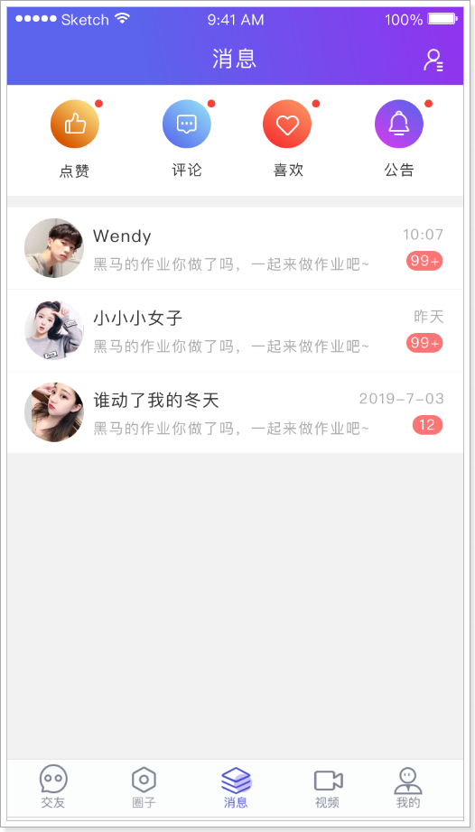
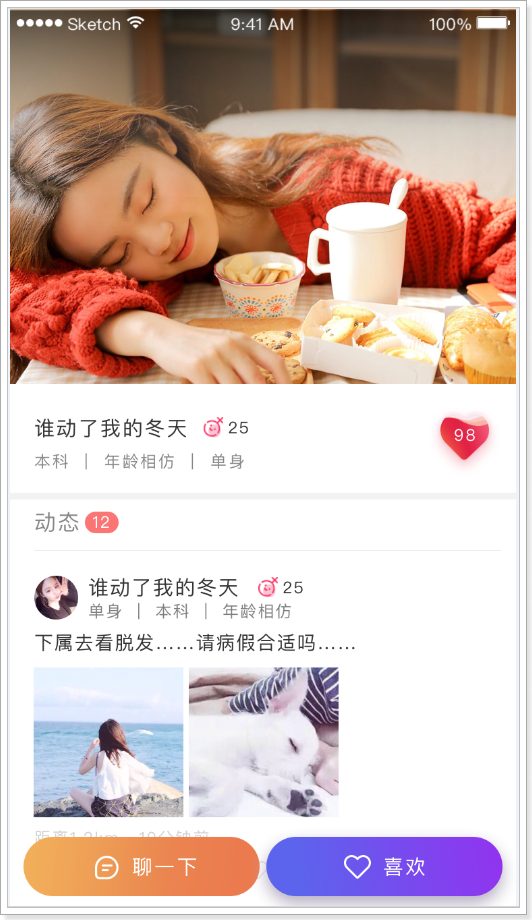
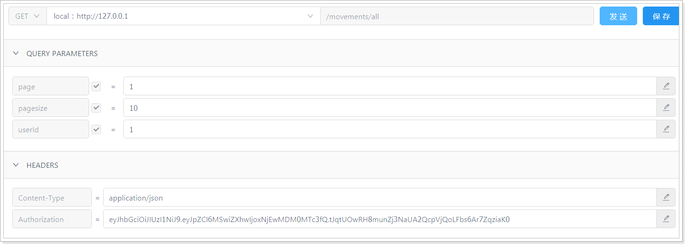
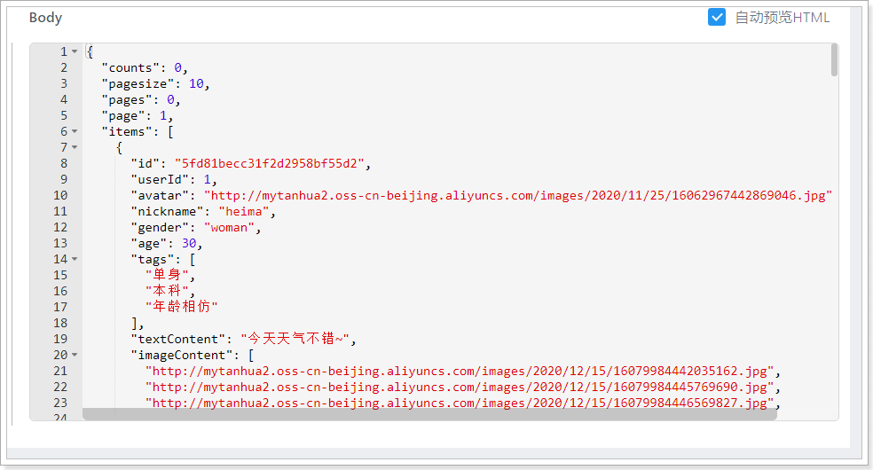
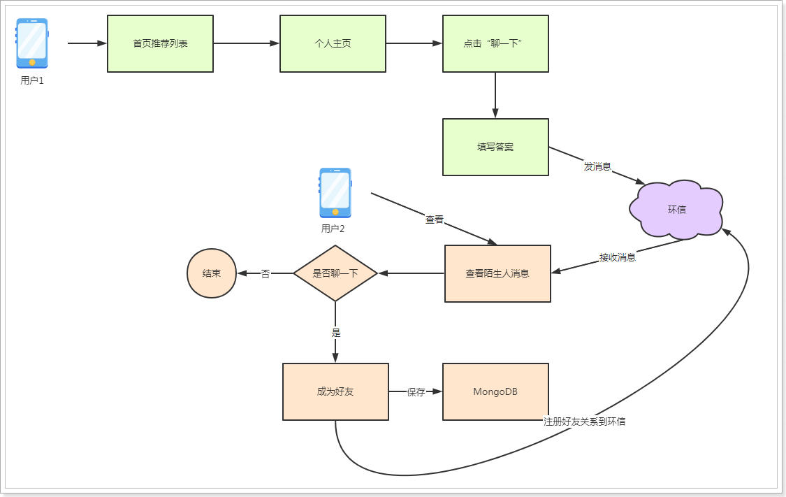
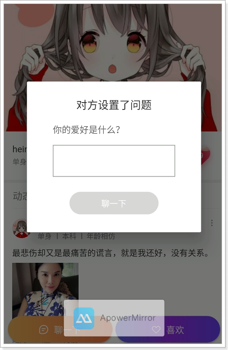
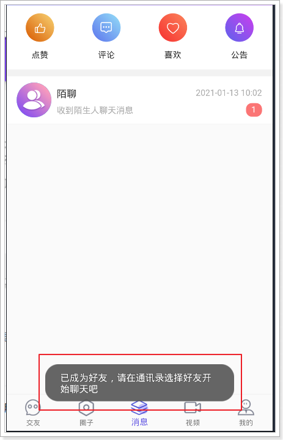
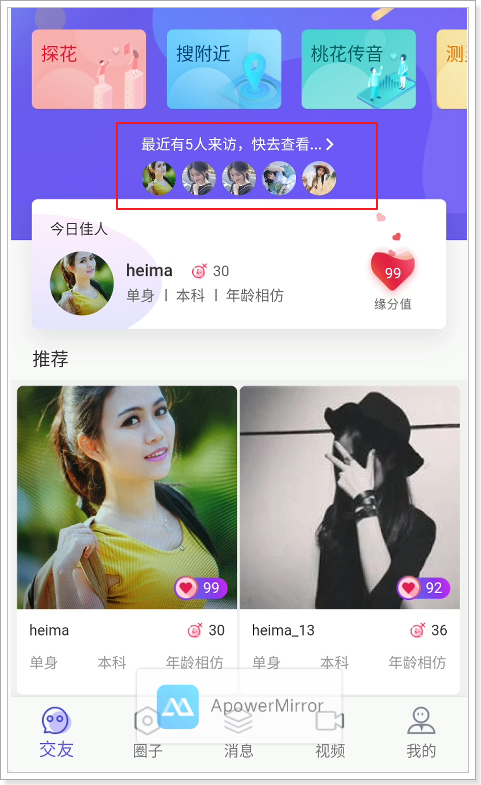

## 课程说明

- 点赞消息列表
- 喜欢消息列表
- 评论消息列表
- 公告列表
- 个人主页
- 聊一下功能
- 谁看过我的功能

​                          

## 1、消息点赞、喜欢、评论列表（实战）

在消息模块中的点赞、喜欢、评论列表，是别人对自己发布的内容的操作，其实现基本一致，所以在一起实现。

效果：

 

点赞列表接口地址：https://mock-java.itheima.net/project/35/interface/api/779

评论列表接口地址：https://mock-java.itheima.net/project/35/interface/api/785

喜欢列表接口地址：https://mock-java.itheima.net/project/35/interface/api/791

### 1.1、dubbo服务

#### 1.1.1、定义接口

~~~java
//com.tanhua.dubbo.server.api.QuanZiApi
    /**
     * 查询对我的点赞消息列表
     *
     * @return
     */
    PageInfo<Comment> queryLikeCommentListByUser(Long userId, Integer page, Integer pageSize);

    /**
     * 查询对我的喜欢消息列表
     *
     * @return
     */
    PageInfo<Comment> queryLoveCommentListByUser(Long userId, Integer page, Integer pageSize);

    /**
     * 查询对我的评论消息列表
     *
     * @return
     */
    PageInfo<Comment> queryCommentListByUser(Long userId, Integer page, Integer pageSize);
~~~

#### 1.1.2、编写实现

```java
//com.tanhua.dubbo.server.api.QuanziApiImpl

    @Override
    public PageInfo<Comment> queryLikeCommentListByUser(Long userId, Integer page, Integer pageSize) {
        return this.queryCommentListByUser(userId, CommentType.LIKE, page, pageSize);
    }

    @Override
    public PageInfo<Comment> queryLoveCommentListByUser(Long userId, Integer page, Integer pageSize) {
        return this.queryCommentListByUser(userId, CommentType.LOVE, page, pageSize);
    }

    @Override
    public PageInfo<Comment> queryCommentListByUser(Long userId, Integer page, Integer pageSize) {
        return this.queryCommentListByUser(userId, CommentType.COMMENT, page, pageSize);
    }

    private PageInfo<Comment> queryCommentListByUser(Long userId, CommentType commentType, Integer page, Integer pageSize) {
        PageRequest pageRequest = PageRequest.of(page - 1, pageSize,
                Sort.by(Sort.Order.desc("created")));

        Query query = new Query(Criteria
                .where("publishUserId").is(userId)
                .and("commentType").is(commentType.getType())).with(pageRequest);

        List<Comment> commentList = this.mongoTemplate.find(query, Comment.class);

        PageInfo<Comment> pageInfo = new PageInfo<>();
        pageInfo.setPageNum(page);
        pageInfo.setPageSize(pageSize);
        pageInfo.setRecords(commentList);
        return pageInfo;
    }
```

### 1.2、APP接口服务

#### 1.2.1、MessageCommentVo

根据接口定义vo对象。

~~~java
package com.tanhua.server.vo;

import lombok.AllArgsConstructor;
import lombok.Data;
import lombok.NoArgsConstructor;

@Data
@NoArgsConstructor
@AllArgsConstructor
public class MessageCommentVo {

    private String id;
    private String avatar;
    private String nickname;
    private String createDate; //格式：2019-09-08 10:07

}

~~~

#### 1.2.3、IMController

~~~java
//com.tanhua.server.controller.IMController

    /**
     * 查询消息点赞列表
     *
     * @param page
     * @param pageSize
     * @return
     */
    @GetMapping("likes")
    public ResponseEntity<PageResult> queryLikeCommentList(@RequestParam(value = "page", defaultValue = "1") Integer page,
                                                           @RequestParam(value = "pagesize", defaultValue = "10") Integer pageSize) {
        try {
            PageResult pageResult = this.imService.queryLikeCommentList(page, pageSize);
            return ResponseEntity.ok(pageResult);
        } catch (Exception e) {
            log.error("查询点赞列表失败~ ", e);
        }
        return ResponseEntity.status(HttpStatus.INTERNAL_SERVER_ERROR).build();
    }

    /**
     * 查询消息评论列表
     *
     * @param page
     * @param pageSize
     * @return
     */
    @GetMapping("comments")
    public ResponseEntity<PageResult> queryUserCommentList(@RequestParam(value = "page", defaultValue = "1") Integer page,
                                                           @RequestParam(value = "pagesize", defaultValue = "10") Integer pageSize) {
        try {
            PageResult pageResult = this.imService.queryUserCommentList(page, pageSize);
            return ResponseEntity.ok(pageResult);
        } catch (Exception e) {
            log.error("查询评论列表失败~ ", e);
        }
        return ResponseEntity.status(HttpStatus.INTERNAL_SERVER_ERROR).build();

    }

    /**
     * 查询消息喜欢列表
     *
     * @param page
     * @param pageSize
     * @return
     */
    @GetMapping("loves")
    public ResponseEntity<PageResult> queryLoveCommentList(@RequestParam(value = "page", defaultValue = "1") Integer page,
                                                           @RequestParam(value = "pagesize", defaultValue = "10") Integer pageSize) {
        try {
            PageResult pageResult = this.imService.queryLoveCommentList(page, pageSize);
            return ResponseEntity.ok(pageResult);
        } catch (Exception e) {
            log.error("查询喜欢列表失败~ ", e);
        }
        return ResponseEntity.status(HttpStatus.INTERNAL_SERVER_ERROR).build();
    }
~~~
#### 1.2.4、IMService

~~~java
//com.tanhua.server.service.IMService

    public PageResult queryLikeCommentList(Integer page, Integer pageSize) {
        User user = UserThreadLocal.get();
        PageInfo<Comment> pageInfo = this.quanZiApi.queryLikeCommentListByUser(user.getId(), page, pageSize);
        return this.fillUserCommentList(pageInfo);
    }

    public PageResult queryLoveCommentList(Integer page, Integer pageSize) {
        User user = UserThreadLocal.get();
        PageInfo<Comment> pageInfo = this.quanZiApi.queryLoveCommentListByUser(user.getId(), page, pageSize);
        return this.fillUserCommentList(pageInfo);
    }

    public PageResult queryUserCommentList(Integer page, Integer pageSize) {
        User user = UserThreadLocal.get();
        PageInfo<Comment> pageInfo = this.quanZiApi.queryCommentListByUser(user.getId(), page, pageSize);
        return this.fillUserCommentList(pageInfo);
    }

    private PageResult fillUserCommentList(PageInfo<Comment> pageInfo){
        PageResult pageResult = new PageResult();
        pageResult.setPage(pageInfo.getPageNum());
        pageResult.setPagesize(pageInfo.getPageSize());

        List<Comment> records = pageInfo.getRecords();
        if(CollUtil.isEmpty(records)){
            //没有查询到数据
            return pageResult;
        }

        List<Object> userIdList = CollUtil.getFieldValues(records, "userId");
        List<UserInfo> userInfoList = this.userInfoService.queryUserInfoByUserIdList(userIdList);

        List<MessageCommentVo> messageCommentVoList = new ArrayList<>();
        for (Comment comment : records) {
            for (UserInfo userInfo : userInfoList) {
                if(ObjectUtil.equals(comment.getUserId(), userInfo.getUserId())){

                    MessageCommentVo messageCommentVo = new MessageCommentVo();
                    messageCommentVo.setId(comment.getId().toHexString());
                    messageCommentVo.setAvatar(userInfo.getLogo());
                    messageCommentVo.setNickname(userInfo.getNickName());
                    messageCommentVo.setCreateDate(DateUtil.format(new Date(comment.getCreated()), "yyyy-MM-dd HH:mm"));

                    messageCommentVoList.add(messageCommentVo);
                    break;
                }
            }
        }

        pageResult.setItems(messageCommentVoList);

        return pageResult;
    }
~~~

### 1.3、测试


## 2、公告列表（实战）

公告是后台系统对所有用户发布的公告消息。

效果：

 

接口地址：https://mock-java.itheima.net/project/35/interface/api/797

### 2.1、表结构

~~~sql
CREATE TABLE `tb_announcement` (
  `id` bigint(20) NOT NULL AUTO_INCREMENT,
  `title` varchar(200) DEFAULT NULL COMMENT '标题',
  `description` text COMMENT '描述',
  `created` datetime DEFAULT NULL,
  `updated` datetime DEFAULT NULL,
  PRIMARY KEY (`id`),
  KEY `created` (`created`)
) ENGINE=InnoDB AUTO_INCREMENT=4 DEFAULT CHARSET=utf8 COMMENT='公告表';
~~~

~~~sql
--插入数据
INSERT INTO `tb_announcement` (`id`, `title`, `description`, `created`, `updated`) VALUES ('1', '探花新版本上线发布啦～,盛夏high趴开始了，赶紧来报名吧！', '探花App2019年7月23日起在苹果商店…,浓情夏日，清爽一聚，探花将吧大家聚…', '2019-10-14 11:06:34', '2019-10-14 11:06:37');
INSERT INTO `tb_announcement` (`id`, `title`, `description`, `created`, `updated`) VALUES ('2', '探花交友的圈子功能正式上线啦~~', '探花交友的圈子功能正式上线啦，欢迎使用~', '2019-10-14 11:09:31', '2019-10-14 11:09:33');
INSERT INTO `tb_announcement` (`id`, `title`, `description`, `created`, `updated`) VALUES ('3', '国庆放假期间，探花交友正常使用~', '国庆放假期间，探花交友正常使用~', '2019-10-14 11:10:01', '2019-10-14 11:10:04');

~~~

### 2.2、pojo

~~~java
package com.tanhua.common.pojo;

import lombok.AllArgsConstructor;
import lombok.Data;
import lombok.NoArgsConstructor;

@Data
@NoArgsConstructor
@AllArgsConstructor
public class Announcement extends BasePojo {

    private Long id;
    private String title;
    private String description;

}

~~~

### 2.3、AnnouncementMapper

~~~java
package com.tanhua.common.mapper;

import com.baomidou.mybatisplus.core.mapper.BaseMapper;
import com.tanhua.common.pojo.Announcement;

public interface AnnouncementMapper extends BaseMapper<Announcement> {
}

~~~

### 2.4、AnnouncementService

~~~java
package com.tanhua.server.service;

import com.baomidou.mybatisplus.core.conditions.query.QueryWrapper;
import com.baomidou.mybatisplus.core.metadata.IPage;
import com.baomidou.mybatisplus.extension.plugins.pagination.Page;
import com.tanhua.common.mapper.AnnouncementMapper;
import com.tanhua.common.pojo.Announcement;
import org.springframework.beans.factory.annotation.Autowired;
import org.springframework.stereotype.Service;

@Service
public class AnnouncementService {

    @Autowired
    private AnnouncementMapper announcementMapper;


    public IPage<Announcement> queryList(Integer page, Integer pageSize) {
        QueryWrapper queryWrapper = new QueryWrapper();
        queryWrapper.orderByDesc("created");
        return this.announcementMapper.selectPage(new Page<Announcement>(page, pageSize), queryWrapper);
    }
}

~~~

### 2.5、定义vo对象

~~~java
package com.tanhua.server.vo;

import lombok.AllArgsConstructor;
import lombok.Data;
import lombok.NoArgsConstructor;

@Data
@NoArgsConstructor
@AllArgsConstructor
public class AnnouncementVo {

    private String id;
    private String title;
    private String description;
    private String createDate;

}
~~~

### 2.6、IMController

~~~java
    /**
     * 查询公告列表
     *
     * @param page
     * @param pageSize
     * @return
     */
    @GetMapping("announcements")
    @NoAuthorization  //优化，无需进行token校验
    public ResponseEntity<PageResult> queryMessageAnnouncementList(@RequestParam(value = "page", defaultValue = "1") Integer page,
                                                                   @RequestParam(value = "pagesize", defaultValue = "10") Integer pageSize) {
        try {
            PageResult pageResult = this.imService.queryMessageAnnouncementList(page, pageSize);
            return ResponseEntity.ok(pageResult);
        } catch (Exception e) {
            log.error("查询公告列表失败~ ", e);
        }
        return ResponseEntity.status(HttpStatus.INTERNAL_SERVER_ERROR).build();
    }
~~~

### 2.7、IMService

~~~java
    public PageResult queryMessageAnnouncementList(Integer page, Integer pageSize) {
        IPage<Announcement> announcementPage = this.announcementService.queryList(page, pageSize);

        List<AnnouncementVo> announcementVoList = new ArrayList<>();

        for (Announcement record : announcementPage.getRecords()) {
            AnnouncementVo announcementVo = new AnnouncementVo();
            announcementVo.setId(record.getId().toString());
            announcementVo.setTitle(record.getTitle());
            announcementVo.setDescription(record.getDescription());
            announcementVo.setCreateDate(DateUtil.format(record.getCreated(), "yyyy-MM-dd HH:mm"));

            announcementVoList.add(announcementVo);
        }

        PageResult pageResult = new PageResult();
        pageResult.setPage(page);
        pageResult.setPagesize(pageSize);
        pageResult.setItems(announcementVoList);

        return pageResult;
    }
~~~

### 2.8、测试

 

## 3、个人主页

点击首页的今日佳人或任意推荐人的图片就会进入个人主页页面，效果如下：

 

在个人主页的页面中，会显示出个人信息、缘分值、个人相册等内容。

### 3.1、个人信息

#### 3.1.1、dubbo服务

需要在dubbo服务中提供查询缘分值的接口服务。

##### 3.1.1.1、定义接口

~~~java
//com.tanhua.dubbo.server.api.RecommendUserApi

    /**
     * 查询推荐好友的缘分值
     *
     * @param userId 好友的id
     * @param toUserId 我的id
     * @return
     */
    Double queryScore(Long userId, Long toUserId);
~~~

##### 3.1.1.2、实现接口

~~~java
//com.tanhua.dubbo.server.api.RecommendUserApiImpl

    @Override
    public Double queryScore(Long userId, Long toUserId) {
        Query query = Query.query(Criteria.where("userId").is(userId)
                .and("toUserId").is(toUserId));
        RecommendUser recommendUser = this.mongoTemplate.findOne(query, RecommendUser.class);
        if (recommendUser == null) {
            return 0D;
        }
        return recommendUser.getScore();
    }
~~~

#### 3.1.2、APP接口服务

接口地址：https://mock-java.itheima.net/project/35/interface/api/629

> 说明：该接口的返回值接口与今日佳人的结构一致，所以可以通用今日佳人的对象。

##### 3.1.2.1、TanHuaController

~~~java
package com.tanhua.server.controller;

import com.tanhua.server.service.TanHuaService;
import com.tanhua.server.vo.TodayBest;
import org.springframework.beans.factory.annotation.Autowired;
import org.springframework.web.bind.annotation.GetMapping;
import org.springframework.web.bind.annotation.PathVariable;
import org.springframework.web.bind.annotation.RequestMapping;
import org.springframework.web.bind.annotation.RestController;

@RequestMapping("tanhua")
@RestController
public class TanHuaController {

    @Autowired
    private TanHuaService tanHuaService;

    /**
     * 查询个人主页的个人信息
     *
     * @param userId
     * @return
     */
    @GetMapping("{id}/personalInfo")
    public TodayBest queryUserInfo(@PathVariable("id") Long userId) {
            return this.tanHuaService.queryUserInfo(userId);
    }

}

~~~

##### 3.1.2.2、TanHuaService

~~~java
package com.tanhua.server.service;

import cn.hutool.core.bean.BeanUtil;
import cn.hutool.core.convert.Convert;
import com.tanhua.common.utils.UserThreadLocal;
import com.tanhua.dubbo.api.RecommendUserApi;
import com.tanhua.dubbo.api.UserInfoApi;
import com.tanhua.dubbo.pojo.UserInfo;
import com.tanhua.server.vo.TodayBest;
import org.apache.dubbo.config.annotation.DubboReference;
import org.springframework.stereotype.Service;

@Service
public class TanHuaService {

    @DubboReference(version = "1.0.0")
    private UserInfoApi userInfoApi;

    @DubboReference(version = "1.0.0")
    private RecommendUserApi recommendUserApi;

    public TodayBest queryUserInfo(Long userId) {
        //根据用户id查询用户的基本信息
        UserInfo userInfo = this.userInfoApi.queryByUserId(userId);
        TodayBest todayBest = BeanUtil.toBeanIgnoreError(userInfo, TodayBest.class);
        todayBest.setGender(userInfo.getSex().name().toLowerCase());
        todayBest.setId(userInfo.getUserId());
        //得分
        todayBest.setFateValue(Convert.toLong(this.recommendUserApi.queryScore(userId, UserThreadLocal.get())));
        return todayBest;
    }
}

~~~

说明，在TodayBest中添加 @Alias("userId") 别名注解：

~~~java
package com.tanhua.server.vo;

import cn.hutool.core.annotation.Alias;
import lombok.AllArgsConstructor;
import lombok.Data;
import lombok.NoArgsConstructor;

/**
 * 今日佳人
 */
@Data
@NoArgsConstructor
@AllArgsConstructor
public class TodayBest {

    @Alias("userId")
    private Long id;

    @Alias("logo")
    private String avatar;
    @Alias("nickName")
    private String nickname;
    private String gender; //性别 man woman
    private Integer age;
    private String[] tags;
    private Long fateValue; //缘分值

}

~~~

#### 3.1.3、测试


 

### 3.2、个人相册

#### 3.2.1、dubbo服务

##### 3.2.1.1、定义接口

~~~java
//com.tanhua.dubbo.server.api.QuanZiApi

	/**
     * 查询相册表
     *
     * @param userId
     * @param page
     * @param pageSize
     * @return
     */
    PageInfo<Publish> queryAlbumList(Long userId, Integer page, Integer pageSize);

~~~

##### 3.2.1.2、实现接口

~~~java
//com.tanhua.dubbo.server.api.QuanZiApiImpl

   /**
     * 查询相册表
     *
     * @param userId
     * @param page
     * @param pageSize
     * @return
     */
    @Override
    public PageInfo<Publish> queryAlbumList(Long userId, Integer page, Integer pageSize) {
        PageInfo<Publish> pageInfo = new PageInfo<>();
        pageInfo.setPageNum(page);
        pageInfo.setPageSize(pageSize);

        //查询我的相册表 -> 发布id列表
        PageRequest pageRequest = PageRequest.of(page - 1, pageSize,
                Sort.by(Sort.Order.desc("created")));
        Query query = new Query().with(pageRequest);
        List<Album> albumList = this.mongoTemplate.find(query, Album.class, "quanzi_album_" + userId);

        //根据发布id查询发布对象
        List<Object> publishIdList = CollUtil.getFieldValues(albumList, "publishId");
        Query publishQuery = Query.query(Criteria.where("id").in(publishIdList))
                .with(Sort.by(Sort.Order.desc("created")));
        List<Publish> publishList = this.mongoTemplate.find(publishQuery, Publish.class);

        pageInfo.setRecords(publishList);

        return pageInfo;
    }
~~~

#### 3.2.2、APP接口服务

接口文档地址：https://mock-java.itheima.net/project/35/interface/api/689

##### 3.2.2.1、QuanZiController

~~~java
//com.tanhua.server.controller.QuanZiController

    /**
     * 自己的所有动态
     *
     * @return
     */
    @GetMapping("all")
    public PageResult queryAlbumList(@RequestParam(value = "page", defaultValue = "1") Integer page,
                                     @RequestParam(value = "pagesize", defaultValue = "10") Integer pageSize,
                                     @RequestParam(value = "userId") Long userId) {
        return this.quanZiService.queryAlbumList(userId, page, pageSize);
    }
~~~

##### 3.2.2.2、QuanZiService

~~~java
//com.tanhua.server.service.QuanZiService

    public PageResult queryAlbumList(Long userId, Integer page, Integer pageSize) {
        PageResult pageResult = new PageResult();
        pageResult.setPage(page);
        pageResult.setPagesize(pageSize);

        PageInfo<Publish> pageInfo = this.quanZiApi.queryAlbumList(userId, page, pageSize);
        List<Publish> records = pageInfo.getRecords();
        if(CollUtil.isEmpty(records)){
            return pageResult;
        }
        pageResult.setItems(this.fillPublishList(records));

        return pageResult;
    }
~~~

#### 3.2.3、测试





### 3.3、整合测试

 

## 4、聊一下

在个人主页中，点击聊一下按钮，会弹出回答问题窗口，输入答案后，系统会向对方发送一条陌聊消息，如果对方在陌聊消息中点击聊一下，他们就会成为好友。

用户1在用户2的个人主页中点击“聊一下”，流程如下：



### 4.1、陌聊问题

点击聊一下时，需要显示出问题，所以需要在mysql中存储用户的问题。

#### 4.1.1、表结构

~~~sql
CREATE TABLE `tb_question` (
  `id` bigint(20) NOT NULL AUTO_INCREMENT,
  `user_id` bigint(20) DEFAULT NULL COMMENT '用户id',
  `txt` varchar(200) DEFAULT NULL COMMENT '问题内容',
  `created` datetime DEFAULT NULL,
  `updated` datetime DEFAULT NULL,
  PRIMARY KEY (`id`),
  KEY `user_id` (`user_id`)
) ENGINE=InnoDB DEFAULT CHARSET=utf8;
~~~

#### 4.1.2、Question实体对象

> 在my-tanhua-dubbo-interface工程中完成。

~~~java
package com.tanhua.dubbo.pojo;

import lombok.AllArgsConstructor;
import lombok.Data;
import lombok.NoArgsConstructor;

@Data
@NoArgsConstructor
@AllArgsConstructor
public class Question extends BasePojo {

    private Long id;
    private Long userId;
    //问题内容
    private String txt;

}
~~~

#### 4.1.3、QuestionMapper

> 在my-tanhua-dubbo-service工程中完成。

~~~java
package com.tanhua.dubbo.mapper;

import com.baomidou.mybatisplus.core.mapper.BaseMapper;
import com.tanhua.dubbo.pojo.Question;
import org.apache.ibatis.annotations.Mapper;

@Mapper
public interface QuestionMapper extends BaseMapper<Question> {

}
~~~

#### 4.1.4、定义dubbo接口

在my-tanhua-dubbo-interface中。

~~~java
package com.tanhua.dubbo.api;

import com.tanhua.dubbo.pojo.Question;

public interface QuestionApi {

    /**
     * 根据用户id查询陌聊问题
     *
     * @param userId
     * @return
     */
    Question queryQuestion(Long userId);
}

~~~

#### 4.1.5、实现dubbo服务

> 在my-tanhua-dubbo-service工程中完成。

~~~java
package com.tanhua.dubbo.api.impl;

import com.baomidou.mybatisplus.core.conditions.query.QueryWrapper;
import com.tanhua.dubbo.api.QuestionApi;
import com.tanhua.dubbo.mapper.QuestionMapper;
import com.tanhua.dubbo.pojo.Question;
import org.apache.dubbo.config.annotation.DubboService;
import org.springframework.beans.factory.annotation.Autowired;

@DubboService(version = "1.0.0")
public class QuestionApiImpl implements QuestionApi {

    @Autowired
    private QuestionMapper questionMapper;

    @Override
    public Question queryQuestion(Long userId) {
        QueryWrapper<Question> queryWrapper = new QueryWrapper<>();
        queryWrapper.eq("user_id", userId);
        return this.questionMapper.selectOne(queryWrapper);
    }
}

~~~

### 4.2、APP接口服务

接口地址：https://mock-java.itheima.net/project/35/interface/api/635

#### 4.2.1、TanHuaController

```java
//com.tanhua.server.controller.TanHuaController

    /**
     * 查询陌生人问题
     *
     * @param userId
     * @return
     */
    @GetMapping("strangerQuestions")
    public String queryQuestion(@RequestParam("userId") Long userId) {
        return this.tanHuaService.queryQuestion(userId);
    }
```

#### 4.2.2、TanHuaService

```java
//com.tanhua.server.service.TanHuaService

    public String queryQuestion(Long userId) {
        Question question = this.questionApi.queryQuestion(userId);
        if(null != question){
            //问题
            return question.getTxt();
        }
        return "你是谁？"; //默认问题
    }
```

#### 4.2.3、测试

 

### 4.3、回复陌生人问题

点击问题窗口中的“聊一下”，需要通过admin权限发送系统消息。

#### 4.3.1、dubbo服务

##### 4.3.1.1、定义接口

~~~java
//com.tanhua.dubbo.server.api.HuanXinApi

    /**
     * 以管理员身份发送消息
     * 文档地址：http://docs-im.easemob.com/im/server/basics/messages#%E5%8F%91%E9%80%81%E6%B6%88%E6%81%AF
     *
     * @param targetUserName 发送目标的用户名
     * @param huanXinMessageType 消息类型
     * @param msg
     * @return
     */
    Boolean sendMsgFromAdmin(String targetUserName, HuanXinMessageType huanXinMessageType, String msg);


~~~

~~~java
package com.tanhua.dubbo.server.enums;

/**
 * 消息类型；txt:文本消息，img：图片消息，loc：位置消息，audio：语音消息，video：视频消息，file：文件消息
 */
public enum HuanXinMessageType {

    TXT("txt"), IMG("img"), LOC("loc"), AUDIO("audio"), VIDEO("video"), FILE("file");

    String type;

    HuanXinMessageType(String type) {
        this.type = type;
    }

    public String getType() {
        return type;
    }
}
~~~

##### 4.3.1.2、实现接口

~~~java
//com.tanhua.dubbo.server.api.HuanXinApiImpl

    @Override
    public Boolean sendMsgFromAdmin(String targetUserName, HuanXinMessageType huanXinMessageType,
                                    String msg) {
        // //{org_name}/{app_name}/messages
        String url = StrUtil.format("{}/{}/{}/messages",
                this.huanXinConfig.getUrl(),
                this.huanXinConfig.getOrgName(),
                this.huanXinConfig.getAppName());

        Map<String, Object> map = new HashMap<>();
        map.put("target_type", "users");
        map.put("target", Arrays.asList(targetUserName));

        Map<String, Object> msgMap = new HashMap<>();
        msgMap.put("type", huanXinMessageType.getType());
        msgMap.put("msg", msg);

        map.put("msg", msgMap);
        map.put("from", "admin");

        HttpResponse response = this.requestService.execute(url, JSONUtil.toJsonStr(map), Method.POST);
        if (response.isOk()) {
            return true;
        }

        if (response.getStatus() == 400) {
            log.error("发送给环信的消息结构有误！ userName = {}, msg = {}", targetUserName, msg);
        }
        return false;
    }
~~~

#### 4.3.2、APP接口服务

接口文档：https://mock-java.itheima.net/project/35/interface/api/641

##### 4.3.2.1、TanHuaController

~~~java
//com.tanhua.server.controller.TanHuaController

    /**
     * 回复陌生人问题
     *
     * @return
     */
    @PostMapping("strangerQuestions")
    public void replyQuestion(@RequestBody Map<String, Object> param) {
        Long userId = Long.valueOf(param.get("userId").toString());
        String reply = param.get("reply").toString();
        this.tanHuaService.replyQuestion(userId, reply);
    }
~~~

##### 4.3.2.2、TanHuaService

~~~java
//com.tanhua.server.service.TanHuaService

	@Reference(version = "1.0.0")
    private HuanXinApi huanXinApi;

    public void replyQuestion(Long userId, String reply) {
        //{"userId":1,"huanXinId":"HX_1","nickname":"黑马小妹","strangerQuestion":"你喜欢去看蔚蓝的大海还是去爬巍峨的高山？","reply":"我喜欢秋天的落叶，夏天的泉水，冬天的雪地，只要有你一切皆可~"}

        Long myUserId = UserThreadLocal.get();
        Map<String, Object> map = new HashMap<>();
        map.put("userId", myUserId);
        map.put("huanXinId", "HX_" + myUserId);
        map.put("nickname", this.userInfoApi.queryByUserId(myUserId).getNickName());
        map.put("strangerQuestion", this.queryQuestion(userId));
        map.put("reply", reply);

        String msg = JSONUtil.toJsonStr(map);
        //发送消息
        this.huanXinApi.sendMsgFromAdmin("HX_" + userId, HuanXinMessageType.TXT, msg);
    }
~~~

#### 4.3.3、测试

 

 

用户heima_37收到陌生人消息：

 

 

可以看到好友已经添加完成，可以在通讯录中选择好友进行聊天。

> 在陌聊消息中的“确认添加”功能，就是前面实现的添加联系人接口。

## 5、谁看过我

查询别人来访了我的主页的信息，其他用户在浏览我的主页时，需要记录访客数据。访客在一天内每个用户只记录一次。

查询数据时，如果用户查询过列表，就需要记录这次查询数据的时间，下次查询时查询大于等于该时间的数据。

如果，用户没有记录查询时间，就查询最近的5个来访用户。

页面效果如下：

 

### 5.1、dubbo服务

#### 5.1.1、实体对象

~~~java
package com.tanhua.dubbo.pojo;

import lombok.AllArgsConstructor;
import lombok.Data;
import lombok.NoArgsConstructor;
import org.bson.types.ObjectId;
import org.springframework.data.mongodb.core.mapping.Document;

@Data
@NoArgsConstructor
@AllArgsConstructor
@Document(collection = "visitors")
public class Visitors implements java.io.Serializable{

    private static final long serialVersionUID = 2811682148052386573L;

    private ObjectId id;
    private Long userId; //我的id
    private Long visitorUserId; //来访用户id
    private String from; //来源，如首页、圈子等
    private Long date; //来访时间

    private Double score; //得分

}

~~~

#### 5.1.2、定义接口

~~~java
package com.tanhua.dubbo.api;

import com.tanhua.dubbo.pojo.Visitors;

import java.util.List;

public interface VisitorsApi {

    /**
     * 保存访客数据
     *
     * @param userId 我的id
     * @param visitorUserId 访客id
     * @param from 来源
     * @return
     */
    String saveVisitor(Long userId, Long visitorUserId, String from);

    /**
     * 查询我的访客数据，存在2种情况：
     * 1. 我没有看过我的访客数据，返回前5个访客信息
     * 2. 之前看过我的访客，从上一次查看的时间点往后查询5个访客数据
     *
     * @param userId
     * @return
     */
    List<Visitors> queryMyVisitor(Long userId);

}

~~~

#### 5.1.3、编写实现

~~~java
package com.tanhua.dubbo.api.impl;

import cn.hutool.core.convert.Convert;
import cn.hutool.core.date.DateUtil;
import cn.hutool.core.util.ObjectUtil;
import com.tanhua.dubbo.api.VisitorsApi;
import com.tanhua.dubbo.pojo.Visitors;
import org.apache.dubbo.config.annotation.DubboService;
import org.bson.types.ObjectId;
import org.springframework.beans.factory.annotation.Autowired;
import org.springframework.data.domain.Sort;
import org.springframework.data.mongodb.core.MongoTemplate;
import org.springframework.data.mongodb.core.query.Criteria;
import org.springframework.data.mongodb.core.query.Query;
import org.springframework.data.redis.core.RedisTemplate;
import org.springframework.data.redis.core.StringRedisTemplate;

import java.util.List;

@DubboService(version = "1.0.0")
public class VisitorsApiImpl implements VisitorsApi {

    @Autowired
    private MongoTemplate mongoTemplate;

    private static final String VISITOR_REDIS_KEY = "VISITOR_USER";

    @Autowired
    private StringRedisTemplate redisTemplate;

    @Override
    public String saveVisitor(Long userId, Long visitorUserId, String from) {

        //查询访客用户在今天是否已经记录过，如果已经记录过，不再记录
        String today = DateUtil.today();
        Long minDate = DateUtil.parseDateTime(today + " 00:00:00").getTime();
        Long maxDate = DateUtil.parseDateTime(today + " 23:59:59").getTime();

        Query query = Query.query(Criteria.where("userId").is(userId)
                .and("visitorUserId").is(visitorUserId)
                .andOperator(Criteria.where("date").gte(minDate),
                        Criteria.where("date").lte(maxDate)
                ));

        long count = this.mongoTemplate.count(query, Visitors.class);
        if (count > 0) {
            return null;
        }

        Visitors visitors = new Visitors();
        visitors.setFrom(from);
        visitors.setVisitorUserId(visitorUserId);
        visitors.setUserId(userId);
        visitors.setDate(System.currentTimeMillis());
        visitors.setId(ObjectId.get());

        this.mongoTemplate.save(visitors);
        return visitors.getId().toHexString();
    }

    @Override
    public List<Visitors> queryMyVisitor(Long userId) {

        // 上一次查询列表的时间
        Long date = Convert.toLong(this.redisTemplate.opsForHash().get(VISITOR_REDIS_KEY, String.valueOf(userId)));

        Query query = Query.query(Criteria.where("userId").is(userId))
                .with(Sort.by(Sort.Order.desc("date"))).limit(5);
        if (ObjectUtil.isNotEmpty(date)) {
            //如果有时间，加入到查询条件中
            query.addCriteria(Criteria.where("date").gte(date));
        }

        //TODO 得分暂时不查询

        return this.mongoTemplate.find(query, Visitors.class);
    }
}

~~~

#### 5.1.4、单元测试

~~~java
package com.tanhua.dubbo.server.api;

import org.junit.Test;
import org.junit.runner.RunWith;
import org.springframework.beans.factory.annotation.Autowired;
import org.springframework.boot.test.context.SpringBootTest;
import org.springframework.test.context.junit4.SpringRunner;

@RunWith(SpringRunner.class)
@SpringBootTest
public class TestVisitorsApi {

    @Autowired
    private VisitorsApi visitorsApi;

    @Test
    public void testSaveVisitor(){
        this.visitorsApi.saveVisitor(1L, 2L, "个人主页");
        this.visitorsApi.saveVisitor(1L, 3L, "个人主页");
        this.visitorsApi.saveVisitor(1L, 2L, "个人主页");
    }

    @Test
    public void testQueryMyVisitor(){
        this.visitorsApi.queryMyVisitor(1L)
                .forEach(visitors -> System.out.println(visitors));
    }

}

~~~

### 5.2、APP接口服务

文档地址：https://mock-java.itheima.net/project/35/interface/api/743

```java
package com.tanhua.server.vo;

import cn.hutool.core.annotation.Alias;
import lombok.AllArgsConstructor;
import lombok.Data;
import lombok.NoArgsConstructor;

@Data
@NoArgsConstructor
@AllArgsConstructor
public class VisitorsVo {

    @Alias("userId")
    private Long id;
    @Alias("logo")
    private String avatar;
    @Alias("nickName")
    private String nickname;
    private String gender;
    private Integer age;
    private String[] tags;
    private Integer fateValue;

}
```

#### 5.2.2、QuanZiController

~~~java
//com.tanhua.server.controller.QuanZiController

    /**
     * 谁看过我
     *
     * @return
     */
    @GetMapping("visitors")
    public List<VisitorsVo> queryVisitorsList() {
        return this.quanZiService.queryVisitorsList();
    }
~~~

#### 5.2.3、QuanZiService

```java
//com.tanhua.server.service.QuanZiService

    public List<VisitorsVo> queryVisitorsList() {
        Long userId = UserThreadLocal.get();
        List<Visitors> visitorsList = this.visitorsApi.queryMyVisitor(userId);
        if(CollUtil.isEmpty(visitorsList)){
            return Collections.emptyList();
        }

        //查询用户列表
        List<Object> userIdList = CollUtil.getFieldValues(visitorsList, "visitorUserId");
        List<UserInfo> userInfoList = this.userInfoApi.queryByUserIdList(userIdList);

        List<VisitorsVo> visitorsVoList = new ArrayList<>();

        for (UserInfo userInfo : userInfoList) {
            VisitorsVo visitorsVo = BeanUtil.toBeanIgnoreError(userInfo, VisitorsVo.class);
            visitorsVo.setGender(userInfo.getSex().name().toLowerCase());
            visitorsVoList.add(visitorsVo);
        }

        return visitorsVoList;

    }
```

### 5.3、记录访客数据

~~~java
//com.tanhua.server.service.TanHuaService

     public TodayBest queryUserInfo(Long userId) {
        //根据用户id查询用户的基本信息
        UserInfo userInfo = this.userInfoApi.queryByUserId(userId);
        TodayBest todayBest = BeanUtil.toBeanIgnoreError(userInfo, TodayBest.class);
        todayBest.setGender(userInfo.getSex().name().toLowerCase());
        todayBest.setId(userInfo.getUserId());
        //得分
        todayBest.setFateValue(Convert.toLong(this.recommendUserApi.queryScore(userId, UserThreadLocal.get())));

        //记录访客
        this.visitorsApi.saveVisitor(userId, UserThreadLocal.get(), "个人主页");

        return todayBest;
    }
~~~

### 5.4、测试

 