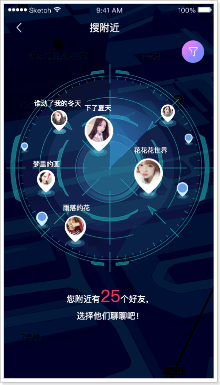

## 课程说明

- 上报地位位置
- 实现搜附近功能
- 实现探花功能
- 用户基本信息维护

## 1、上报地理位置

当客户端检测用户的地理位置，当变化大于500米时或每隔5分钟，向服务端上报地理位置。

用户的地理位置存储到MongoDB中，如下：

 

### 1.1、dubbo服务

#### 1.1.1、定义pojo

在my-tanhua-dubbo-interface中创建：

~~~java
package com.tanhua.dubbo.vo;

import cn.hutool.core.bean.BeanUtil;
import com.tanhua.dubbo.pojo.UserLocation;
import lombok.AllArgsConstructor;
import lombok.Data;
import lombok.NoArgsConstructor;

import java.util.ArrayList;
import java.util.List;

@Data
@NoArgsConstructor
@AllArgsConstructor
public class UserLocationVo implements java.io.Serializable {

    private static final long serialVersionUID = 4133419501260037769L;

    private Long userId; //用户id
    private Double longitude; //经度
    private Double latitude; //维度
    private String address; //位置描述
    private Long created; //创建时间
    private Long updated; //更新时间
    private Long lastUpdated; //上次更新时间

    public static final UserLocationVo format(UserLocation userLocation) {
        if (null == userLocation) {
            return null;
        }
        UserLocationVo userLocationVo = BeanUtil.toBean(userLocation, UserLocationVo.class);
        userLocationVo.setLongitude(userLocation.getLocation().getX());
        userLocationVo.setLatitude(userLocation.getLocation().getY());
        return userLocationVo;
    }

    public static final List<UserLocationVo> formatToList(List<UserLocation> userLocations) {
        List<UserLocationVo> list = new ArrayList<>();
        for (UserLocation userLocation : userLocations) {
            list.add(format(userLocation));
        }
        return list;
    }
}

~~~

~~~java
package com.tanhua.dubbo.server.vo;

import cn.hutool.core.bean.BeanUtil;
import com.tanhua.dubbo.server.pojo.UserLocation;
import lombok.AllArgsConstructor;
import lombok.Data;
import lombok.NoArgsConstructor;

import java.util.ArrayList;
import java.util.List;

@Data
@NoArgsConstructor
@AllArgsConstructor
public class UserLocationVo implements java.io.Serializable {

    private static final long serialVersionUID = 4133419501260037769L;

    private Long userId; //用户id
    private Double longitude; //经度
    private Double latitude; //维度
    private String address; //位置描述
    private Long created; //创建时间
    private Long updated; //更新时间
    private Long lastUpdated; //上次更新时间

    public static final UserLocationVo format(UserLocation userLocation) {
        UserLocationVo userLocationVo = BeanUtil.toBean(userLocation, UserLocationVo.class);
        userLocationVo.setLongitude(userLocation.getLocation().getX());
        userLocationVo.setLatitude(userLocation.getLocation().getY());
        return userLocationVo;
    }

    public static final List<UserLocationVo> formatToList(List<UserLocation> userLocations) {
        List<UserLocationVo> list = new ArrayList<>();
        for (UserLocation userLocation : userLocations) {
            list.add(format(userLocation));
        }
        return list;
    }
}

~~~

> **由于UserLocation不能序列化，所以要再定义UserLocationVo进行返回数据。**

#### 1.1.2、定义dubbo接口

在my-tanhua-dubbo-interface工程中。

~~~java
package com.tanhua.dubbo.server.api;

public interface UserLocationApi {

    /**
     * 更新用户地理位置
     *
     * @param userId 用户id
     * @param longitude 经度
     * @param latitude 纬度
     * @param address 地址名称
     * @return
     */
    Boolean updateUserLocation(Long userId, Double longitude, Double latitude, String address);

}

~~~

#### 1.1.3、编写实现

~~~java
package com.tanhua.dubbo.api.impl;

import com.tanhua.dubbo.api.UserLocationApi;
import com.tanhua.dubbo.pojo.UserLocation;
import org.apache.dubbo.config.annotation.DubboService;
import org.bson.types.ObjectId;
import org.springframework.beans.factory.annotation.Autowired;
import org.springframework.data.mongodb.core.MongoTemplate;
import org.springframework.data.mongodb.core.geo.GeoJsonPoint;
import org.springframework.data.mongodb.core.query.Criteria;
import org.springframework.data.mongodb.core.query.Query;
import org.springframework.data.mongodb.core.query.Update;

@DubboService(version = "1.0.0")
public class UserLocationApiImpl implements UserLocationApi {

    @Autowired
    private MongoTemplate mongoTemplate;

    /**
     * 更新用户地理位置
     *
     * @param userId    用户id
     * @param longitude 经度
     * @param latitude  纬度
     * @param address   地址名称
     * @return
     */
    @Override
    public Boolean updateUserLocation(Long userId, Double longitude, Double latitude, String address) {
        //查询用户的地理位置数据，如果有，就进行更新操作，如果没有，就插入数据

        Query query = Query.query(Criteria.where("userId").is(userId));
        UserLocation userLocation = this.mongoTemplate.findOne(query, UserLocation.class);
        if (null == userLocation) {
            //用户数据不存在，新增操作
            userLocation = new UserLocation();
            userLocation.setLocation(new GeoJsonPoint(longitude, latitude));
            userLocation.setUserId(userId);
            userLocation.setAddress(address);
            userLocation.setCreated(System.currentTimeMillis());
            userLocation.setUpdated(userLocation.getCreated());
            userLocation.setLastUpdated(userLocation.getCreated());
            userLocation.setId(ObjectId.get());

            this.mongoTemplate.save(userLocation);
        } else {
            //更新操作
            Update update = Update.update("location", new GeoJsonPoint(longitude, latitude))
                    .set("address", address)
                    .set("updated", System.currentTimeMillis())
                    .set("lastUpdated", userLocation.getUpdated());
            this.mongoTemplate.updateFirst(query, update, UserLocation.class);
        }

        return true;
    }
}

~~~

#### 1.1.4、单元测试

```java
package com.tanhua.dubbo.api;

import org.junit.Test;
import org.junit.runner.RunWith;
import org.springframework.beans.factory.annotation.Autowired;
import org.springframework.boot.test.context.SpringBootTest;
import org.springframework.test.context.junit4.SpringRunner;

@RunWith(SpringRunner.class)
@SpringBootTest
public class TestUserLocationApi {

    @Autowired
    private UserLocationApi userLocationApi;

    @Test
    public void testUpdateUserLocation() {
        this.userLocationApi.updateUserLocation(1L, 121.512253,31.24094, "金茂大厦");
        this.userLocationApi.updateUserLocation(2L, 121.506379,31.245414, "东方明珠广播电视塔");
        this.userLocationApi.updateUserLocation(10L, 121.508815, 31.243844, "陆家嘴地铁站");
        this.userLocationApi.updateUserLocation(12L, 121.511999, 31.239185, "上海中心大厦");
        this.userLocationApi.updateUserLocation(25L, 121.493444, 31.240513, "上海市公安局");
        this.userLocationApi.updateUserLocation(27L, 121.494108, 31.247011, "上海外滩美术馆");
        this.userLocationApi.updateUserLocation(30L, 121.462452, 31.253463, "上海火车站");
        this.userLocationApi.updateUserLocation(32L, 121.81509, 31.157478, "上海浦东国际机场");
        this.userLocationApi.updateUserLocation(34L, 121.327908, 31.20033, "虹桥火车站");
        this.userLocationApi.updateUserLocation(38L, 121.490155, 31.277476, "鲁迅公园");
        this.userLocationApi.updateUserLocation(40L, 121.425511, 31.227831, "中山公园");
        this.userLocationApi.updateUserLocation(43L, 121.594194, 31.207786, "张江高科");
    }

}
```

### 1.2、APP接口

接口文档：https://mock-java.itheima.net/project/35/interface/api/557

#### 1.2.1、BaiduController

~~~java
package com.tanhua.server.controller;

import com.tanhua.server.service.BaiduService;
import org.springframework.beans.factory.annotation.Autowired;
import org.springframework.web.bind.annotation.PostMapping;
import org.springframework.web.bind.annotation.RequestBody;
import org.springframework.web.bind.annotation.RequestMapping;
import org.springframework.web.bind.annotation.RestController;

import java.util.Map;

@RestController
@RequestMapping("baidu")
public class BaiduController {

    @Autowired
    private BaiduService baiduService;

    /**
     * 更新位置
     *
     * @param param
     * @return
     */
    @PostMapping("location")
    public void updateLocation(@RequestBody Map<String, Object> param) {
        Double longitude = Double.valueOf(param.get("longitude").toString());
        Double latitude = Double.valueOf(param.get("latitude").toString());
        String address = param.get("addrStr").toString();
        this.baiduService.updateLocation(longitude, latitude, address);

    }
}

~~~

#### 1.2.2、BaiduService

```java
package com.tanhua.server.service;

import com.tanhua.common.utils.UserThreadLocal;
import com.tanhua.dubbo.api.UserLocationApi;
import org.apache.dubbo.config.annotation.DubboReference;
import org.springframework.stereotype.Service;

@Service
public class BaiduService {

    @DubboReference(version = "1.0.0")
    private UserLocationApi userLocationApi;

    public void updateLocation(Double longitude, Double latitude, String address) {
        Long userId = UserThreadLocal.get();
        this.userLocationApi.updateUserLocation(userId, longitude, latitude, address);
    }
}

```

### 1.3、测试

## 

## 2、搜附近

在首页中点击“搜附近”可以搜索附近的好友，效果如下：

  

实现思路：根据当前用户的位置，查询附近范围内的用户。范围是可以设置的。

### 2.1、dubbo服务

#### 2.1.1、定义接口方法

~~~java
//com.tanhua.dubbo.server.api.UserLocationApi

	/**
     * 查询用户地理位置
     *
     * @param userId
     * @return
     */
    UserLocationVo queryByUserId(Long userId);

    /**
     * 根据位置搜索
     *
     * @param longitude 经度
     * @param latitude  纬度
     * @param distance  距离(米)
     * @param page      页数
     * @param pageSize  页面大小
     */
    PageInfo<UserLocationVo> queryUserFromLocation(Double longitude, Double latitude, Double distance, Integer page, Integer pageSize);

~~~

#### 2.1.2、编写实现

~~~java
//com.tanhua.dubbo.server.api.UserLocationApiImpl

     /**
     * 根据位置搜索
     *
     * @param longitude 经度
     * @param latitude  纬度
     * @param distance  距离(米)
     * @param page      页数
     * @param pageSize  页面大小
     */
    @Override
    public PageInfo<UserLocationVo> queryUserFromLocation(Double longitude, Double latitude,
                                                          Double distance, Integer page, Integer pageSize) {

        PageInfo<UserLocationVo> pageInfo = new PageInfo<>();
        pageInfo.setPageSize(pageSize);
        pageInfo.setPageNum(page);

        //距离
        Distance distanceObj = new Distance(distance / 1000, Metrics.KILOMETERS);

        //画一个圆圈
        Circle circle = new Circle(new GeoJsonPoint(longitude, latitude), distanceObj);

        // 设置分页参数
        PageRequest pageRequest = PageRequest.of(page - 1, pageSize, Sort.by(Sort.Order.desc("location")));
        Query query = Query.query(Criteria.where("location").withinSphere(circle)).with(pageRequest);

        List<UserLocation> userLocationList = this.mongoTemplate.find(query, UserLocation.class);
        if(CollUtil.isEmpty(userLocationList)){
            return pageInfo;
        }

        // TODO 按照距离排序 实现思路：根据坐标进行计算 目标点与 我的点的距离  按照距离进行排序

        pageInfo.setRecords(UserLocationVo.formatToList(userLocationList));
        return pageInfo;
    }
~~~

#### 2.1.3、单元测试

~~~java
//com.tanhua.dubbo.server.api.TestUserLocationApi

	@Test
    public void testQueryByUserId(){
        UserLocationVo userLocationVo = this.userLocationApi.queryByUserId(1L);
        System.out.println(userLocationVo);
    }

    @Test
    public void testQueryUserFromLocation(){
        UserLocationVo userLocationVo = this.userLocationApi.queryByUserId(1L);
        PageInfo<UserLocationVo> pageInfo = this.userLocationApi
                .queryUserFromLocation(userLocationVo.getLongitude(),
                        userLocationVo.getLatitude(), 5000d, 1, 10);
        pageInfo.getRecords().forEach(vo -> System.out.println(vo));
    }
~~~

### 2.2、APP接口服务

文档地址：https://mock-java.itheima.net/project/35/interface/api/611

#### 2.2.1、NearUserVo

~~~java
package com.tanhua.server.vo;

import cn.hutool.core.annotation.Alias;
import lombok.AllArgsConstructor;
import lombok.Data;
import lombok.NoArgsConstructor;

@Data
@NoArgsConstructor
@AllArgsConstructor
public class NearUserVo {

    private Long userId;
    @Alias("logo")
    private String avatar;
    @Alias("nickName")
    private String nickname;

}

~~~

#### 2.2.2、TanHuaController

~~~java
//com.tanhua.server.controller.TanHuaController

    /**
     * 搜附近
     *
     * @param gender
     * @param distance
     * @return
     */
    @GetMapping("search")
    public List<NearUserVo> queryNearUser(@RequestParam(value = "gender", required = false) String gender,
                                          @RequestParam(value = "distance", defaultValue = "2000") String distance) {
        return this.tanHuaService.queryNearUser(gender, distance);
    }
~~~

#### 2.2.3、TanHuaService

```java
//com.tanhua.server.service.TanHuaService

    public List<NearUserVo> queryNearUser(String gender, String distance) {
        //查询自己的位置
        UserLocationVo userLocationVo = this.userLocationApi.queryByUserId(UserThreadLocal.get());

        //根据自己的位置查询
        PageInfo<UserLocationVo> pageInfo = this.userLocationApi.queryUserFromLocation(userLocationVo.getLongitude(),
                userLocationVo.getLatitude(),
                Convert.toDouble(distance),
                1, 100
        );

        List<UserLocationVo> records = pageInfo.getRecords();
        if (CollUtil.isEmpty(records)) {
            return Collections.emptyList();
        }

        //TODO 查询用户时，需要考虑到性别的条件，我不考虑性别，在实战中自己完成
        List<Object> userIdList = CollUtil.getFieldValues(records, "userId");
        List<UserInfo> userInfoList = this.userInfoApi.queryByUserIdList(userIdList);

        List<NearUserVo> result = new ArrayList<>();
        for (UserLocationVo record : records) {
            //排除自己
            if (ObjectUtil.equal(record.getUserId(), UserThreadLocal.get())) {
                continue;
            }
            for (UserInfo userInfo : userInfoList) {
                if (ObjectUtil.equal(userInfo.getUserId(), record.getUserId())) {
                    NearUserVo nearUserVo = BeanUtil.toBeanIgnoreError(userInfo, NearUserVo.class);
                    result.add(nearUserVo);
                    break;
                }
            }
        }

        return result;
    }
```

#### 2.2.4、测试

 

## 3、探花

探花功能是将推荐的好友随机的通过卡片的形式展现出来，用户可以选择左滑、右滑操作，左滑：“不喜欢”，右滑：“喜欢”。

喜欢：如果双方喜欢，那么就会成为好友。

 

如果已经喜欢或不喜欢的用户在列表中不再显示。

### 3.1、喜欢的dubbo服务

用户的喜欢与不喜欢列表需要保存在redis中，为了防止redis中的数据丢失，同时需要将数据保存到mongodb进行持久化保存。

#### 3.1.1、实体对象

```java
package com.tanhua.dubbo.server.pojo;

import lombok.AllArgsConstructor;
import lombok.Data;
import lombok.NoArgsConstructor;
import org.bson.types.ObjectId;
import org.springframework.data.mongodb.core.index.Indexed;
import org.springframework.data.mongodb.core.mapping.Document;

@Data
@NoArgsConstructor
@AllArgsConstructor
@Document(collection = "user_like")
public class UserLike implements java.io.Serializable {

    private static final long serialVersionUID = 6739966698394686523L;

    private ObjectId id;
    @Indexed
    private Long userId; //用户id，自己
    @Indexed
    private Long likeUserId; //喜欢的用户id，对方
    private Boolean isLike; // 是否喜欢
    private Long created; //创建时间
    private Long updated; // 更新时间

}
```

#### 3.1.2、定义接口

```java
package com.tanhua.dubbo.server.api;

import java.util.List;

public interface UserLikeApi {

    /**
     * 喜欢
     *
     * @param userId
     * @param likeUserId
     * @return
     */
    Boolean likeUser(Long userId, Long likeUserId);

    /**
     * 不喜欢
     *
     * @param userId
     * @param likeUserId
     * @return
     */
    Boolean notLikeUser(Long userId, Long likeUserId);

    /**
     * 是否喜欢
     *
     * @param userId
     * @param likeUserId
     * @return
     */
    Boolean isLike(Long userId, Long likeUserId);

    /**
     * 是否不喜欢
     *
     * @param userId
     * @param likeUserId
     * @return
     */
    Boolean isNotLike(Long userId, Long likeUserId);


    /**
     * 是否相互喜欢
     *
     * @param userId
     * @param likeUserId
     * @return
     */
    Boolean isMutualLike(Long userId, Long likeUserId);


    /**
     * 查询喜欢列表
     *
     * @param userId
     * @return
     */
    List<Long> queryLikeList(Long userId);

    /**
     * 查询不喜欢列表
     *
     * @param userId
     * @return
     */
    List<Long> queryNotLikeList(Long userId);

}
```

#### 3.1.3、编写实现

```java
package com.tanhua.dubbo.api.impl;

import cn.hutool.core.collection.CollUtil;
import cn.hutool.core.convert.Convert;
import cn.hutool.core.util.ObjectUtil;
import com.tanhua.dubbo.api.UserLikeApi;
import com.tanhua.dubbo.pojo.UserLike;
import org.apache.dubbo.config.annotation.DubboService;
import org.bson.types.ObjectId;
import org.springframework.beans.factory.annotation.Autowired;
import org.springframework.data.mongodb.core.MongoTemplate;
import org.springframework.data.mongodb.core.query.Criteria;
import org.springframework.data.mongodb.core.query.Query;
import org.springframework.data.mongodb.core.query.Update;
import org.springframework.data.redis.core.StringRedisTemplate;

import java.util.ArrayList;
import java.util.Collections;
import java.util.List;
import java.util.Set;

@DubboService(version = "1.0.0")
public class UserLikeApiImpl implements UserLikeApi {

    public static final String LIKE_REDIS_KEY_PREFIX = "USER_LIKE_";

    public static final String NOT_LIKE_REDIS_KEY_PREFIX = "USER_NOT_LIKE_";

    @Autowired
    private MongoTemplate mongoTemplate;

    @Autowired
    private StringRedisTemplate redisTemplate;

    /**
     * 喜欢
     *
     * @param userId
     * @param likeUserId
     * @return
     */
    @Override
    public Boolean likeUser(Long userId, Long likeUserId) {
        //判断用户是否已经喜欢
        if(this.isLike(userId, likeUserId)){
            return false;
        }

        //存储到redis，使用的是hash结构
        //用户1喜欢用户2 ->  大key：USER_LIKE_1  小key："2" 值："1"
        //用户1喜欢用户3 ->  大key：USER_LIKE_1  小key："3" 值："1"
        //用户3喜欢用户1 ->  大key：USER_LIKE_3  小key："1" 值："1"

        String redisKey = this.getLikeRedisKey(userId);
        String hashKey = Convert.toStr(likeUserId);
        this.redisTemplate.opsForHash().put(redisKey, hashKey, "1");

        //存储到MongoDB中
        this.saveMongoDB(userId, likeUserId, true);

        //无论对方是否在我的不喜欢列表中，直接将其删除
        this.redisTemplate.opsForHash().delete(this.getNotLikeRedisKey(userId), hashKey);

        return true;
    }

    private void saveMongoDB(Long userId, Long likeUserId, Boolean isLike) {
        Query query = Query.query(Criteria.where("userId").is(userId)
                .and("likeUserId").is(likeUserId));
        UserLike userLike = this.mongoTemplate.findOne(query, UserLike.class);

        if (ObjectUtil.isEmpty(userLike)) {
            //存储到MongoDB
            userLike = new UserLike();
            userLike.setId(ObjectId.get());
            userLike.setUserId(userId);
            userLike.setLikeUserId(likeUserId);
            userLike.setCreated(System.currentTimeMillis());
            userLike.setUpdated(userLike.getCreated());
            userLike.setIsLike(isLike);
            this.mongoTemplate.save(userLike);
        } else {
            //更新字段
            Update update = Update.update("isLike", isLike)
                    .set("updated", System.currentTimeMillis());
            this.mongoTemplate.updateFirst(query, update, UserLike.class);
        }
    }

    /**
     * 喜欢列表的大key
     *
     * @param userId
     * @return
     */
    private String getLikeRedisKey(Long userId){
        return LIKE_REDIS_KEY_PREFIX + userId;
    }

    /**
     * 不喜欢列表的大key
     *
     * @param userId
     * @return
     */
    private String getNotLikeRedisKey(Long userId){
        return NOT_LIKE_REDIS_KEY_PREFIX + userId;
    }

    /**
     * 不喜欢
     *
     * @param userId
     * @param likeUserId
     * @return
     */
    @Override
    public Boolean notLikeUser(Long userId, Long likeUserId) {
        if(this.isNotLike(userId, likeUserId)){
            return false;
        }

        //保存不喜欢到redis
        String redisKey = this.getNotLikeRedisKey(userId);
        String hashKey = Convert.toStr(likeUserId);
        this.redisTemplate.opsForHash().put(redisKey, hashKey, "1");

        //保存到mongodb
        this.saveMongoDB(userId, likeUserId, false);

        //无论用户是否在我的喜欢列表中，都将其删除
        this.redisTemplate.opsForHash().delete(this.getLikeRedisKey(userId), hashKey);

        return true;
    }

    /**
     * 是否喜欢
     *
     * @param userId
     * @param likeUserId
     * @return
     */
    @Override
    public Boolean isLike(Long userId, Long likeUserId) {
        String redisKey = this.getLikeRedisKey(userId);
        String hashKey = Convert.toStr(likeUserId);
        return this.redisTemplate.opsForHash().hasKey(redisKey, hashKey);
    }

    /**
     * 是否不喜欢
     *
     * @param userId
     * @param likeUserId
     * @return
     */
    @Override
    public Boolean isNotLike(Long userId, Long likeUserId) {
        String redisKey = this.getNotLikeRedisKey(userId);
        String hashKey = Convert.toStr(likeUserId);
        return this.redisTemplate.opsForHash().hasKey(redisKey, hashKey);
    }

    /**
     * 是否相互喜欢
     *
     * @param userId
     * @param likeUserId
     * @return
     */
    @Override
    public Boolean isMutualLike(Long userId, Long likeUserId) {
        return this.isLike(userId, likeUserId) && this.isLike(likeUserId, userId);
    }

    /**
     * 查询喜欢列表
     *
     * @param userId
     * @return
     */
    @Override
    public List<Long> queryLikeList(Long userId) {
        String redisKey = this.getLikeRedisKey(userId);
        return this.queryList(redisKey);
    }

    /**
     * 查询不喜欢列表
     *
     * @param userId
     * @return
     */
    @Override
    public List<Long> queryNotLikeList(Long userId) {
        String redisKey = this.getNotLikeRedisKey(userId);
        return this.queryList(redisKey);
    }

    private List<Long> queryList(String redisKey){
        //获取喜欢的所有小key
        Set<Object> keys = this.redisTemplate.opsForHash().keys(redisKey);
        if(CollUtil.isEmpty(keys)){
            return Collections.emptyList();
        }

        List<Long> list = new ArrayList<>();
        keys.forEach(key -> list.add(Convert.toLong(key)));
        return list;
    }
}

```

#### 3.1.4、单元测试

```java
package com.tanhua.dubbo.server.api;

import org.junit.Test;
import org.junit.runner.RunWith;
import org.springframework.beans.factory.annotation.Autowired;
import org.springframework.boot.test.context.SpringBootTest;
import org.springframework.test.context.junit4.SpringRunner;

@RunWith(SpringRunner.class)
@SpringBootTest
public class TestUserLikeApi {

    @Autowired
    private UserLikeApi userLikeApi;

    @Test
    public void testUserLike() {
        System.out.println(this.userLikeApi.likeUser(1L, 2L));
        System.out.println(this.userLikeApi.likeUser(1L, 3L));
        System.out.println(this.userLikeApi.likeUser(1L, 4L));

        System.out.println(this.userLikeApi.notLikeUser(1L, 5L));
        System.out.println(this.userLikeApi.notLikeUser(1L, 6L));

        System.out.println(this.userLikeApi.likeUser(1L, 5L));
        System.out.println(this.userLikeApi.notLikeUser(1L, 2L));
    }

    @Test
    public void testQueryList(){
        this.userLikeApi.queryLikeList(1L).forEach(a -> System.out.println(a));
        System.out.println("-------");
        this.userLikeApi.queryNotLikeList(1L).forEach(a -> System.out.println(a));
    }
}
```

### 3.2、查询推荐列表dubbo服务

#### 3.2.1、定义接口

```java
//com.tanhua.dubbo.server.api.RecommendUserApi

    /**
     * 查询探花列表，查询时需要排除喜欢和不喜欢的用户
     *
     * @param userId
     * @param count
     * @return
     */
    List<RecommendUser> queryCardList(Long userId, Integer count);
```

#### 3.2.2、编写实现

```java
//com.tanhua.dubbo.server.api.RecommendUserApiImpl

   /**
     * 查询探花列表，查询时需要排除喜欢和不喜欢的用户
     *
     * @param userId
     * @param count
     * @return
     */
      @Override
    public List<RecommendUser> queryCardList(Long userId, Integer count) {
        Criteria criteria = Criteria.where("toUserId").is(userId);
        //排除喜欢和不喜欢列表
        List<Long> likeList = this.userLikeApi.queryLikeList(userId);
        List<Long> notLikeList = this.userLikeApi.queryNotLikeList(userId);

        List<Long> userIdList = new ArrayList<>();
        CollUtil.addAll(userIdList, likeList);
        CollUtil.addAll(userIdList, notLikeList);

        if(CollUtil.isNotEmpty(userIdList)){
            criteria.andOperator(Criteria.where("userId").nin(userIdList));
        }

        return this.mongoTemplate.find(Query.query(criteria).limit(count), RecommendUser.class);
    }
```

#### 3.2.3、单元测试

```java
//com.tanhua.dubbo.server.api.TestRecommendUserApi

@Test
public void testQueryCardList(){
    this.recommendUserApi.queryCardList(2L, 20)
            .forEach(recommendUser -> System.out.println(recommendUser));
}
```

### 3.3、查询推荐列表APP接口实现

接口文档：https://mock-java.itheima.net/project/35/interface/api/593

#### 3.3.1、TanHuaController

~~~java
    /**
     * 探花
     *
     * @return
     */
    @GetMapping("cards")
    public List<TodayBest> queryCardsList() {
        return this.tanHuaService.queryCardsList();
    }
~~~

#### 3.3.2、TanHuaService

~~~properties
#默认推荐列表
tanhua.default.recommend.users=2,3,8,10,18,20,24,29,27,32,36,37,56,64,75,88
~~~

```java
/**
 * 查询推荐卡片列表，从推荐列表中随机选取10个用户
 *
 * @return
 */
    public List<TodayBest> queryCardsList() {
        User user = UserThreadLocal.get();
        List<RecommendUser> recommendUserList = this.recommendUserApi.queryCardList(user.getId(), 50);
        if (CollUtil.isEmpty(recommendUserList)) {
            //默认推荐列表
            recommendUserList = new ArrayList<>();
            String[] userIds = defaultRecommendUsers.split(",");
            for (String userId : userIds) {
                RecommendUser recommendUser = new RecommendUser();
                recommendUser.setUserId(Convert.toLong(userId));
                recommendUser.setToUserId(user.getId());
                recommendUser.setScore(RandomUtil.randomDouble(60, 90));
                recommendUserList.add(recommendUser);
            }
        }

        // List<RecommendUser> recommendList = new ArrayList<>();
        //随机选取10个进行展现
        int count = Math.min(10, recommendUserList.size());
        // for (int i = 0; i < count; i++) {
        //     //TODO 可能出现重复  实现：递归
        //     int index = RandomUtil.randomInt(0, recommendUserList.size());
        //     recommendList.add(recommendUserList.get(index));
        // }
        Collections.shuffle(recommendUserList); //随机打乱顺序
        List<RecommendUser> recommendList = CollUtil.sub(recommendUserList, 0, count); //截取集合

        List<Object> userIdList = CollUtil.getFieldValues(recommendList, "userId");
        List<UserInfo> userInfoList = this.userinfoService.queryByUserIdList(userIdList);

        //排序
        List<TodayBest> todayBestList = new ArrayList<>();
        for (RecommendUser recommendUser : recommendList) {
            for (UserInfo userInfo : userInfoList) {
                if (ObjectUtil.equal(userInfo.getUserId(), recommendUser.getUserId())) {
                    TodayBest todayBest = BeanUtil.toBeanIgnoreError(userInfo, TodayBest.class);
                    todayBest.setGender(userInfo.getSex() == SexEnum.MAN ? "man" : "woman");
                    todayBest.setFateValue(Convert.toLong(recommendUser.getScore()));
                    todayBestList.add(todayBest);
                    break;
                }
            }
        }

        return todayBestList;
    }
```

#### 3.3.3、测试


效果：

 

### 3.4、左滑右滑

左滑：“不喜欢”，右滑：“喜欢”，如果双方喜欢，那么就会成为好友。

喜欢的接口文档：https://mock-java.itheima.net/project/35/interface/api/599

不喜欢的接口文档：https://mock-java.itheima.net/project/35/interface/api/605

#### 3.4.1、TanHuaController

```java
    /**
     * 喜欢
     *
     * @param likeUserId
     * @return
     */
    @GetMapping("{id}/love")
    public void likeUser(@PathVariable("id") Long likeUserId) {
        this.tanHuaService.likeUser(likeUserId);
    }

    /**
     * 不喜欢
     *
     * @param likeUserId
     * @return
     */
    @GetMapping("{id}/unlove")
    public void notLikeUser(@PathVariable("id") Long likeUserId) {
        this.tanHuaService.notLikeUser(likeUserId);
    }
```

#### 3.4.2、TanHuaService

```java
//com.tanhua.server.service.TanHuaService

    public void likeUser(Long likeUserId) {
        Long userId = UserThreadLocal.get();
        Boolean result = this.userLikeApi.likeUser(userId, likeUserId);
        if (result) {
            //判断是否是相互喜欢，如果是，就需要加为好友
            if(this.userLikeApi.isMutualLike(userId, likeUserId)){
                this.imService.contactUser(likeUserId);
            }
        }
    }

    public void notLikeUser(Long likeUserId) {
        Long userId = UserThreadLocal.get();
        this.userLikeApi.notLikeUser(userId, likeUserId);
    }
```

#### 3.4.3、测试


user_like表，可以看到已经相互喜欢了：

 

tanhua_users表，可以看到相互是好友了：

 

环信平台：

 

### 3.5、是否喜欢

#### 3.5.1、MyCenterController

~~~java
//com.tanhua.server.controller.MyCenterController

	/**
     * 是否喜欢
     *
     * @param userId
     * @return
     */
    @GetMapping("{userId}/alreadyLove")
    public Boolean isLike(@PathVariable("userId") Long userId){
        return this.myCenterService.isLike(userId);
    }
~~~

#### 3.5.2、MyCenterService

~~~java
//com.tanhua.server.service.MyCenterService

    public Boolean isLike(Long userId) {
        return this.userLikeApi.isLike(UserThreadLocal.get(), userId);
    }
~~~

#### 3.5.3、测试

 

## 4、用户资料（项目实战）

在我的中心模块中，可以对个人信息做修改。

 

### 4.1、基本信息

在前面实现的查询个人信息接口中，已经返回个人基本数据，所以可以直接展现出个人信息，下面只需要进行实现数据的保存即可。

#### 4.4.1、接口信息

接口地址：https://mock-java.itheima.net/project/35/interface/api/887


请求参数：

#### 

#### 4.4.2、MyCenterController

```java
//com.tanhua.server.controller.MyCenterController

/**
 * 更新用户信息
 *
 * @param userInfoVo
 * @return
 */
@PutMapping
public ResponseEntity<Void> updateUserInfo(@RequestBody UserInfoVo userInfoVo){
    try {
        Boolean bool = this.myCenterService.updateUserInfo(userInfoVo);
        if(bool){
            return ResponseEntity.ok(null);
        }
    } catch (Exception e) {
        e.printStackTrace();
    }
    return ResponseEntity.status(HttpStatus.INTERNAL_SERVER_ERROR).build();
}
```

#### 4.4.3、MyCenterService

```java
//com.tanhua.server.service.MyCenterService

public Boolean updateUserInfo(UserInfoVo userInfoVo) {
    User user = UserThreadLocal.get();
    UserInfo userInfo = new UserInfo();
    userInfo.setUserId(user.getId());
    userInfo.setAge(Integer.valueOf(userInfoVo.getAge()));
    userInfo.setSex(StringUtils.equalsIgnoreCase(userInfoVo.getGender(), "man") ? SexEnum.MAN : SexEnum.WOMAN);
    userInfo.setBirthday(userInfoVo.getBirthday());
    userInfo.setCity(userInfoVo.getCity());
    userInfo.setEdu(userInfoVo.getEducation());
    userInfo.setIncome(StringUtils.replaceAll(userInfoVo.getIncome(), "K", ""));
    userInfo.setIndustry(userInfoVo.getProfession());
    userInfo.setMarriage(userInfoVo.getMarriage() == 1 ? "已婚" : "未婚");
    return this.userInfoService.updateUserInfoByUserId(userInfo);
}
```

#### 4.4.4、UserInfoService

```java
//com.tanhua.server.service.UserInfoService

public boolean updateUserInfoByUserId(UserInfo userInfo) {
    QueryWrapper<UserInfo> queryWrapper = new QueryWrapper<>();
    queryWrapper.eq("user_id", userInfo.getUserId());
    return this.userInfoMapper.update(userInfo, queryWrapper) > 0;
}
```

#### 4.4.5、bug修复

在之前的查询个人信息中接口中，返回数据中的性别数据有误，需要返回man或woman。

如下：

~~~java
//com.tanhua.server.service.MyCenterService

	public UserInfoVo queryUserInfoByUserId(Long userId) {
        if (ObjectUtil.isEmpty(userId)) {
            //如果查询id为null，就表示查询当前用户信息
            userId = UserThreadLocal.get().getId();
        }
        //查询用户信息
        UserInfo userInfo = this.userInfoService.queryUserInfoByUserId(userId);
        if (ObjectUtil.isEmpty(userInfo)) {
            return null;
        }

        UserInfoVo userInfoVo = BeanUtil.copyProperties(userInfo, UserInfoVo.class, "marriage");
        userInfoVo.setGender(userInfo.getSex().getValue() == 1 ? "man" : "women");
        userInfoVo.setMarriage(StrUtil.equals("已婚", userInfo.getMarriage()) ? 1 : 0);
        return userInfoVo;
    }
~~~

### 4.2、更新头像

上传头像使用sso中的上传逻辑即可，只是路径不同，所以我们只需要修改nginx配置和在sso中定义Controller即可。

接口文档：https://mock-java.itheima.net/project/35/interface/api/881 

~~~shell
#user  nobody;
worker_processes  1;

#error_log  logs/error.log;
#error_log  logs/error.log  notice;
#error_log  logs/error.log  info;

#pid        logs/nginx.pid;


events {
    worker_connections  1024;
}


http {
    include       mime.types;
    default_type  application/octet-stream;

    #log_format  main  '$remote_addr - $remote_user [$time_local] "$request" '
    #                  '$status $body_bytes_sent "$http_referer" '
    #                  '"$http_user_agent" "$http_x_forwarded_for"';

    #access_log  logs/access.log  main;

    sendfile        on;
    #tcp_nopush     on;

    #keepalive_timeout  0;
    keepalive_timeout  65;

    #gzip  on;

    server {
        listen       80;
        server_name  localhost;

        #charset koi8-r;

        #access_log  logs/host.access.log  main;

        #error_page  404              /404.html;

        # redirect server error pages to the static page /50x.html
        #
        error_page   500 502 503 504  /50x.html;
        location = /50x.html {
            root   html;
        }

        location /user/ {  #请求路径中凡是以/user/开头的请求，转发到sso系统
            client_max_body_size  300m;  #设置最大的请求体大小，解决大文件上传不了的问题
            proxy_connect_timeout 300s;  #代理连接超时时间
            proxy_send_timeout 300s;  #代理发送数据的超时时间
            proxy_read_timeout 300s;  #代理读取数据的超时时间
            proxy_pass   http://127.0.0.1:18080;  #转发请求
        }

        location /users/header {  #请求路径中凡是以/user/header开头的请求，转发到sso系统
            client_max_body_size  300m;  #设置最大的请求体大小，解决大文件上传不了的问题
            proxy_connect_timeout 300s;  #代理连接超时时间
            proxy_send_timeout 300s;  #代理发送数据的超时时间
            proxy_read_timeout 300s;  #代理读取数据的超时时间
            proxy_pass   http://127.0.0.1:18080;  #转发请求
        }

        location / {   #上面未匹配到的在这里处理
            client_max_body_size  300m;
            proxy_connect_timeout 300s;
            proxy_send_timeout 300s;
            proxy_read_timeout 300s;
                proxy_pass   http://127.0.0.1:18081;  #转发请求到server系统
            }
        }

}
~~~

#### 4.2.2、MyCenterController

在sso工程中定义MyCenterController。

```java
package com.tanhua.sso.controller;

import com.tanhua.sso.vo.ErrorResult;
import org.springframework.beans.factory.annotation.Autowired;
import org.springframework.http.HttpStatus;
import org.springframework.http.ResponseEntity;
import org.springframework.web.bind.annotation.*;
import org.springframework.web.multipart.MultipartFile;

@RestController
@RequestMapping("users")
public class MyCenterController {

    @Autowired
    private UserInfoController userInfoController;

    /**
     * 上传头像
     *
     * @param file
     * @param token
     * @return
     */
    @PostMapping("header")
    public ResponseEntity<Object> saveLogo(@RequestParam("headPhoto") MultipartFile file, @RequestHeader("Authorization") String token) {
        return this.userInfoController.saveUserLogo(file, token);
    }
}
```


