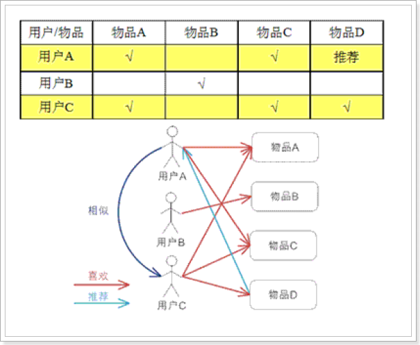
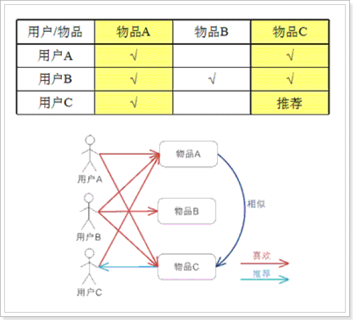
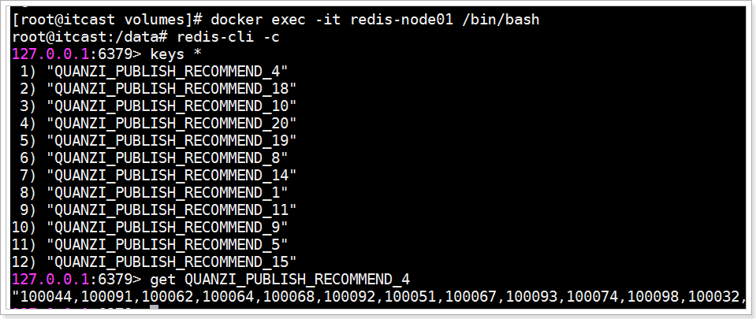

## 课程说明

- 了解推荐系统
- 实现好友的推荐
- 圈子推荐功能说明
- 圈子推荐功能流程
- 圈子推荐功能的实现
- 小视频推荐功能的实现

## 1、了解推荐系统

### 1.1、什么是推荐系统？

**为了解决信息过载和用户无明确需求的问题，找到用户感兴趣的物品，才有了个性化推荐系统。**

其实，解决信息过载的问题，代表性的解决方案是分类目录和搜索引擎，如hao123，电商首页的分类目录以及百度，360搜索等。

不过分类目录和搜索引擎只能解决用户主动查找信息的需求，即用户知道自己想要什么，并不能解决用户没用明确需求很随便的问题。

经典语录是：你想吃什么，随便！面对这种很随便又得罪不起的用户（女友和上帝），只能**通过分析用户的历史行为给用户的兴趣建模**，从而主动给用户推荐能够满足他们兴趣和需求的信息。比如问问女友的闺蜜，她一般什么时候喜欢吃什么。

### 1.2、电商是推荐系统的先行者

- [ ] 电子商务网站是个性化推荐系统重要地应用的领域之一，亚马逊就是个性化推荐系统的积极应用者和推广者，亚马逊的推荐系统深入到网站的各类商品，为亚马逊带来了至少30%的销售额。
- [ ] 不光是电商类，推荐系统无处不在。QQ，微信的好友推荐；新浪微博的你可能感兴趣的人；优酷，土豆的电影推荐；豆瓣的图书推荐；大从点评的餐饮推荐；脉脉的同事推荐等。
- [ ] 推荐引擎的鼻祖思想源泉：http://portal.acm.org/citation.cfm?id=1070751
- [ ] 亚马逊最早提出基于物品的协同过滤推荐算法：http://portal.acm.org/citation.cfm?id=372071

京东的推荐： 

### 1.3、推荐系统业务流程

 

推荐系统广泛存在于各类网站中，作为一个应用为用户提供个性化的推荐。它需要一些用户的历史数据，一般由三个部分组成：基础数据、推荐算法系统、前台展示。

- 基础数据包括很多维度，包括用户的访问、浏览、下单、收藏，用户的历史订单信息，评价信息等很多信息；
- 推荐算法系统主要是根据不同的推荐诉求由多个算法组成的推荐模型；
- 前台展示主要是对客户端系统进行响应，返回相关的推荐信息以供展示。

### 1.4、协同过滤推荐算法

迄今为止，在个性化推荐系统中，协同过滤技术是应用最成功的技术。目前国内外有许多大型网站应用这项技术为用户更加智能（个性化、千人千面）的推荐内容。

> 核心思想：
>
> 协同过滤一般是在海量的用户中发掘出一小部分和你品位比较类似的，在协同过滤中，这些用户成为邻居，然后根据他们喜欢的其他东西组织成一个排序的目彔作为推荐给你。
>

#### 1.4.1、基于用户的推荐 UserCF


  

  

对于用户A，根据用户的历史偏好，这里只计算得到一个邻居–用户C，然后将用户C 喜欢的物品D 推荐给用户A。

基于用户的协同过滤算法先计算的是用户与用户的相似度（兴趣相投，物以类聚人以群分），然后将相似度比较接近的用户A购买的物品推荐给用户B，专业的说法是该算法用最近邻居（nearest-neighbor）算法找出一个用户的邻居集合，该集合的用户和该用户有相似的喜好，算法根据邻居的偏好对该用户进行预测。

#### 1.4.2、基于商品的推荐 ItemCF

  

- 基于ItemCF的原理和基于UserCF类似，只是在计算邻居时采用物品本身，而不是从用户的角度，即基于用户对物品的偏好找到相似的物品，然后根据用户的历史偏好，推荐相似的物品给他。
- 从计算的角度看，就是将所有用户对某个物品的偏好作为一个向量来计算物品之间的相似度，得到物品的相似物品后，根据用户历史的偏好预测当前用户还没有表示偏好的物品，计算得到一个排序的物品列表作为推荐。
- 解释：对于物品A，根据所有用户的历史偏好，喜欢物品A 的用户都喜欢物品C，得出物品A 和物品C 比较相似，而用户C 喜欢物品A，那么可以推断出用户C 可能也喜欢物品C。

### 1.5、ALS算法

ALS 是交替最小二乘 （alternating least squares）的简称。在机器学习的上下文中，ALS 特指使用交替最小二乘求解的一个协同推荐算法。它通过观察到的所有用户给产品的打分，来推断每个用户的喜好并向用户推荐适合的产品。从协同过滤的分类来说，ALS算法属于User-Item CF，也叫做混合CF。它同时考虑了User和Item两个方面。

用户和商品的关系，可以抽象为如下的三元组：<User,Item,Rating>。其中，Rating是用户对商品的评分，表征用户对该商品的喜好程度。如下：

~~~shell
196	242	3	881250949
186	302	3	891717742
22	377	1	878887116
244	51	2	880606923
166	346	1	886397596
298	474	4	884182806
115	265	2	881171488
253	465	5	891628467
305	451	3	886324817
6	86	3	883603013
62	257	2	879372434
286	1014	5	879781125
200	222	5	876042340
210	40	3	891035994
................
~~~

## 2、好友推荐

对于好友的推荐，需要找出每个用户之间的相似性，具体规则如下：

| 字段   | 权重分     |          |             |              |
| ------ | ---------- | -------- | ----------- | ------------ |
| 年龄差 | 0-2岁 30分 | 3-5 20分 | 5-10岁 10分 | 10岁以上 0分 |
| 性别   | 异性 30分  | 同性 0分 |             |              |
| 位置   | 同城 20分  | 不同 0分 |             |              |
| 学历   | 相同 20分  | 不同 0分 |             |              |

### 2.1、流程

 

### 2.2、部署好友推荐服务

~~~shell
#拉取镜像
docker pull registry.cn-hangzhou.aliyuncs.com/itcast/tanhua-spark-recommend-user:1.0.1

#创建容器
docker create --name tanhua-spark-recommend-user \
--env MONGODB_HOST=192.168.31.81 \
--env MONGODB_PORT=27017 \
--env MONGODB_USERNAME=tanhua \
--env MONGODB_PASSWORD=l3SCjl0HvmSkTtiSbN0Swv40spYnHhDV \
--env MONGODB_DATABASE=tanhua \
--env MONGODB_COLLECTION=recommend_user \
--env JDBC_URL="jdbc:mysql://192.168.31.81:3306/mytanhua?useUnicode=true&characterEncoding=utf8&autoReconnect=true&allowMultiQueries=true&useSSL=false" \
--env JDBC_DRIVER=com.mysql.jdbc.Driver \
--env JDBC_USER=root \
--env JDBC_PASSWORD=root \
--env JDBC_TABLE=tb_user_info \
--env SCHEDULE_PERIOD=30 \
registry.cn-hangzhou.aliyuncs.com/itcast/tanhua-spark-recommend-user:1.0.1

#参数说明
#MONGODB_HOST mongodb服务的地址
#MONGODB_PORT mongodb服务的端口
#MONGODB_USERNAME mongodb服务的认证用户名
#MONGODB_PASSWORD mongodb服务的认证密码
#MONGODB_DATABASE mongodb连接的数据库
#MONGODB_COLLECTION 操作表
#JDBC_URL  mysql数据库连接地址
#JDBC_DRIVER  jdbc驱动
#JDBC_USER  数据库连接用户名
#JDBC_PASSWORD  数据库连接密码
#JDBC_TABLE  数据库表名
#SCHEDULE_PERIOD  下次执行时间间隔，但是为分，默认为10分钟

#启动服务
docker start tanhua-spark-recommend-user
#查看日志
docker logs -f tanhua-spark-recommend-user
~~~

执行完成后，可以看到MongoDB中的recommend_user表中数据已经重新生成了。

## 3、圈子推荐

### 3.1、功能说明

在圈子功能中，针对于用户发布的动态信息，系统可以根据用户的发布、浏览、点赞等操作，对动态信息做计算，然后对每个用户进行不同的推荐。

### 3.2、流程说明

 

流程说明：

- 用户对圈子的动态操作，如：发布、浏览、点赞、喜欢等，就会给RocketMQ进行发送消息；
- 推荐系统接收消息，并且处理消息数据，处理之后将结果数据写入到MongoDB中；
- Spark系统拉取数据，然后进行推荐计算；
- 计算之后的结果数据写入到Redis中，为每个用户都进行个性化推荐；

### 3.3、动态计分规则

- 浏览 +1
- 点赞 +5
- 喜欢 +8
- 评论 + 10
- 发布动态
  - 文字长度：50以内1分，50~100之间2分，100以上3分
  - 图片个数：每个图片一分

核心推荐逻辑：

- 推荐模型：用户 |  动态  | 评分
- 其中，评分是用户对动态操作的得分合计
- 为什么自己发布动态还要计分？ 是因为，自己发布就相当于自己对此动态也感兴趣，这样就可以在相似的人之间进行推荐了。

### 3.4、发送消息

#### 3.4.1、QuanziMQService

my-tanhua-server增加依赖：

~~~xml
<!--RocketMQ相关-->
<dependency>
    <groupId>org.apache.rocketmq</groupId>
    <artifactId>rocketmq-spring-boot-starter</artifactId>
</dependency>
<dependency>
    <groupId>org.apache.rocketmq</groupId>
    <artifactId>rocketmq-client</artifactId>
</dependency>
~~~

配置文件：

~~~properties
# RocketMQ相关配置
rocketmq.name-server=192.168.31.81:9876
rocketmq.producer.group=tanhua
~~~


~~~java
package com.tanhua.server.service;

import com.tanhua.common.utils.UserThreadLocal;
import com.tanhua.dubbo.api.QuanZiApi;
import com.tanhua.dubbo.pojo.Publish;
import lombok.extern.slf4j.Slf4j;
import org.apache.dubbo.config.annotation.DubboReference;
import org.apache.rocketmq.spring.core.RocketMQTemplate;
import org.springframework.beans.factory.annotation.Autowired;
import org.springframework.stereotype.Service;

import java.util.HashMap;
import java.util.Map;

@Service
@Slf4j
public class QuanziMQService {

    @Autowired
    private RocketMQTemplate rocketMQTemplate;

    @DubboReference(version = "1.0.0")
    private QuanZiApi quanZiApi;

    /**
     * 发布动态消息
     *
     * @param publishId
     * @return
     */
    public Boolean publishMsg(String publishId) {
        return this.sendMsg(publishId, 1);
    }

    /**
     * 浏览动态消息
     *
     * @param publishId
     * @return
     */
    public Boolean queryPublishMsg(String publishId) {
        return this.sendMsg(publishId, 2);
    }

    /**
     * 点赞动态消息
     *
     * @param publishId
     * @return
     */
    public Boolean likePublishMsg(String publishId) {
        return this.sendMsg(publishId, 3);
    }

    /**
     * 取消点赞动态消息
     *
     * @param publishId
     * @return
     */
    public Boolean disLikePublishMsg(String publishId) {
        return this.sendMsg(publishId, 6);
    }

    /**
     * 喜欢动态消息
     *
     * @param publishId
     * @return
     */
    public Boolean lovePublishMsg(String publishId) {
        return this.sendMsg(publishId, 4);
    }

    /**
     * 取消喜欢动态消息
     *
     * @param publishId
     * @return
     */
    public Boolean disLovePublishMsg(String publishId) {
        return this.sendMsg(publishId, 7);
    }

    /**
     * 评论动态消息
     *
     * @param publishId
     * @return
     */
    public Boolean commentPublishMsg(String publishId) {
        return this.sendMsg(publishId, 5);
    }

    /**
     * 发送圈子操作相关的消息
     *
     * @param publishId
     * @param type      1-发动态，2-浏览动态， 3-点赞， 4-喜欢， 5-评论，6-取消点赞，7-取消喜欢
     * @return
     */
    private Boolean sendMsg(String publishId, Integer type) {
        try {
            Long userId = UserThreadLocal.get();

            Publish publish = this.quanZiApi.queryPublishById(publishId);

            //构建消息
            Map<String, Object> msg = new HashMap<>();
            msg.put("userId", userId);
            msg.put("date", System.currentTimeMillis());
            msg.put("publishId", publishId);
            msg.put("pid", publish.getPid());
            msg.put("type", type);

            this.rocketMQTemplate.convertAndSend("tanhua-quanzi", msg);
        } catch (Exception e) {
            log.error("发送消息失败! publishId = " + publishId + ", type = " + type, e);
            return false;
        }

        return true;
    }
}

~~~

#### 3.4.2、修改QuanZiService

在QuanZiService完成发送消息方法调用。

~~~java
package com.tanhua.server.service;

import cn.hutool.core.bean.BeanUtil;
import cn.hutool.core.collection.CollUtil;
import cn.hutool.core.convert.Convert;
import cn.hutool.core.util.ObjectUtil;
import cn.hutool.core.util.StrUtil;
import com.tanhua.common.service.PicUploadService;
import com.tanhua.common.utils.RelativeDateFormat;
import com.tanhua.common.utils.UserThreadLocal;
import com.tanhua.common.vo.ErrorResult;
import com.tanhua.common.vo.PicUploadResult;
import com.tanhua.dubbo.api.QuanZiApi;
import com.tanhua.dubbo.api.UserInfoApi;
import com.tanhua.dubbo.api.VisitorsApi;
import com.tanhua.dubbo.pojo.Publish;
import com.tanhua.dubbo.pojo.UserInfo;
import com.tanhua.dubbo.pojo.Visitors;
import com.tanhua.dubbo.vo.PageInfo;
import com.tanhua.server.vo.PageResult;
import com.tanhua.server.vo.QuanZiVo;
import com.tanhua.server.vo.VisitorsVo;
import org.apache.dubbo.config.annotation.DubboReference;
import org.springframework.beans.factory.annotation.Autowired;
import org.springframework.stereotype.Service;
import org.springframework.web.multipart.MultipartFile;

import java.util.*;

@Service
public class QuanZiService {

    @Autowired
    private UserService userService;

    @DubboReference(version = "1.0.0")
    private QuanZiApi quanZiApi;

    @DubboReference(version = "1.0.0")
    private UserInfoApi userInfoApi;

    @DubboReference(version = "1.0.0")
    private VisitorsApi visitorsApi;

    @Autowired
    private PicUploadService picUploadService;

    @Autowired
    private QuanziMQService quanziMQService;

    public PageResult queryPublishList(Integer page, Integer pageSzie) {

        //校验token是否有效，获取userId
        Long userId = UserThreadLocal.get();

        PageResult pageResult = new PageResult();
        pageResult.setPage(page);
        pageResult.setPagesize(pageSzie);

        //通过远程的dubbo服务查询好友动态列表
        PageInfo<Publish> pageInfo = this.quanZiApi.queryPublishList(userId, page, pageSzie);
        List<Publish> records = pageInfo.getRecords();
        if (CollUtil.isEmpty(records)) {
            return pageResult;
        }

        pageResult.setItems(this.fillPublishList(records));
        return pageResult;
    }

    /**
     * 填充QuanZiVo
     */
    private List<QuanZiVo> fillPublishList(List<Publish> publishList) {
        List<QuanZiVo> quanZiVoList = new ArrayList<>();

        Long userId = UserThreadLocal.get();

        for (Publish publish : publishList) {
            QuanZiVo quanZiVo = BeanUtil.toBeanIgnoreError(publish, QuanZiVo.class);

            quanZiVo.setDistance("距离1.8公里"); //TODO 距离
            quanZiVo.setCommentCount(0); //TODO 评论数
            quanZiVo.setHasLiked(this.quanZiApi.queryUserIsLike(userId, quanZiVo.getId()) ? 1 : 0); //是否点赞（1是，0否）
            quanZiVo.setLikeCount(Convert.toInt(this.quanZiApi.queryLikeCount(quanZiVo.getId()))); //点赞数
            quanZiVo.setHasLoved(0); //TODO 是否喜欢（1是，0否）
            quanZiVo.setLoveCount(0); //TODO 喜欢数

            // 时间：10分钟前
            quanZiVo.setCreateDate(RelativeDateFormat.format(new Date(publish.getCreated())));
            quanZiVoList.add(quanZiVo);
        }

        //查询用户信息
        List<Object> userIdList = CollUtil.getFieldValues(quanZiVoList, "userId");
        List<UserInfo> userInfoList = this.userInfoApi.queryByUserIdList(userIdList);
        for (QuanZiVo quanZiVo : quanZiVoList) {
            for (UserInfo userInfo : userInfoList) {
                if (ObjectUtil.equal(quanZiVo.getUserId(), userInfo.getUserId())) {
                    BeanUtil.copyProperties(userInfo, quanZiVo, "id");
                    //设置性别
                    quanZiVo.setGender(userInfo.getSex().name().toLowerCase());
                    break;
                }
            }
        }

        return quanZiVoList;
    }

    public Object savePublish(String textContent, String location,
                              String latitude, String longitude, MultipartFile[] multipartFile) {
        Publish publish = new Publish();
        publish.setUserId(UserThreadLocal.get());
        publish.setText(textContent);
        publish.setLocationName(location);
        publish.setLatitude(latitude);
        publish.setLongitude(longitude);
        publish.setMedias(new ArrayList<>());

        //图片上传
        for (MultipartFile file : multipartFile) {
            PicUploadResult uploadResult = this.picUploadService.upload(file);
            if (StrUtil.isNotEmpty(uploadResult.getName())) {
                publish.getMedias().add(uploadResult.getName());
            }
        }

        String publishId = this.quanZiApi.savePublish(publish);
        if (StrUtil.isEmpty(publishId)) {
            return ErrorResult.builder().errCode("500").errMessage("发布动态失效！").build();
        }

        //发消息
        this.quanziMQService.publishMsg(publishId);

        return null;
    }

    /**
     * 查询推荐动态
     *
     * @param page
     * @param pageSize
     * @return
     */
    public PageResult queryRecommendPublish(Integer page, Integer pageSize) {

        PageResult pageResult = new PageResult();
        pageResult.setPage(page);
        pageResult.setPagesize(pageSize);

        Long userId = UserThreadLocal.get();

        //通过duboo服务查询推荐列表数据
        PageInfo<Publish> pageInfo = this.quanZiApi.queryRecommendPublishList(userId, page, pageSize);
        List<Publish> publishList = pageInfo.getRecords();
        if (CollUtil.isEmpty(publishList)) {
            return pageResult;
        }

        pageResult.setItems(this.fillPublishList(publishList));
        return pageResult;
    }

    public Long likeComment(String publishId) {
        Long userId = UserThreadLocal.get();
        //点赞
        Boolean result = this.quanZiApi.likeComment(userId, publishId);
        if (result) {
            //发消息
            this.quanziMQService.likePublishMsg(publishId);

            //查询点赞数
            return this.quanZiApi.queryLikeCount(publishId);
        }
        return 0L;
    }

    public Long disLikeComment(String publishId) {
        Long userId = UserThreadLocal.get();
        //取消点赞
        Boolean result = this.quanZiApi.disLikeComment(userId, publishId);
        if (result) {

            //发消息
            this.quanziMQService.disLikePublishMsg(publishId);

            //查询点赞数
            return this.quanZiApi.queryLikeCount(publishId);
        }
        return 0L;
    }

    public QuanZiVo queryById(String publishId) {
        Publish publish = this.quanZiApi.queryPublishById(publishId);
        if (null == publish) {
            return null;
        }

        //发消息
        this.quanziMQService.queryPublishMsg(publishId);

        return this.fillPublishList(Arrays.asList(publish)).get(0);
    }

    public PageResult queryAlbumList(Long userId, Integer page, Integer pageSize) {
        PageResult pageResult = new PageResult();
        pageResult.setPage(page);
        pageResult.setPagesize(pageSize);

        PageInfo<Publish> pageInfo = this.quanZiApi.queryAlbumList(userId, page, pageSize);
        List<Publish> records = pageInfo.getRecords();
        if (CollUtil.isEmpty(records)) {
            return pageResult;
        }
        pageResult.setItems(this.fillPublishList(records));

        return pageResult;
    }

    public List<VisitorsVo> queryVisitorsList() {
        Long userId = UserThreadLocal.get();
        List<Visitors> visitorsList = this.visitorsApi.queryMyVisitor(userId);
        if (CollUtil.isEmpty(visitorsList)) {
            return Collections.emptyList();
        }

        //查询用户列表
        List<Object> userIdList = CollUtil.getFieldValues(visitorsList, "visitorUserId");
        List<UserInfo> userInfoList = this.userInfoApi.queryByUserIdList(userIdList);

        List<VisitorsVo> visitorsVoList = new ArrayList<>();

        //注意按照原有的顺序返回
        for (Object uId : userIdList) {
            for (UserInfo userInfo : userInfoList) {
                if (ObjectUtil.equal(uId, userInfo.getUserId())) {
                    VisitorsVo visitorsVo = BeanUtil.toBeanIgnoreError(userInfo, VisitorsVo.class);
                    visitorsVo.setGender(userInfo.getSex().name().toLowerCase());
                    visitorsVoList.add(visitorsVo);
                    break;
                }
            }
        }

        return visitorsVoList;

    }
}

~~~

### 3.5、接收消息

接收消息的工作需要新创建my-tanhua-recommend工程，在此工程中完成相关的操作。

#### 3.5.1、创建my-tanhua-recommend工程

~~~xml
<?xml version="1.0" encoding="UTF-8"?>
<project xmlns="http://maven.apache.org/POM/4.0.0"
         xmlns:xsi="http://www.w3.org/2001/XMLSchema-instance"
         xsi:schemaLocation="http://maven.apache.org/POM/4.0.0 http://maven.apache.org/xsd/maven-4.0.0.xsd">
    <parent>
        <artifactId>my-tanhua</artifactId>
        <groupId>cn.itcast</groupId>
        <version>1.0-SNAPSHOT</version>
    </parent>
    <modelVersion>4.0.0</modelVersion>

    <artifactId>my-tanhua-recommend</artifactId>

    <dependencies>
        <dependency>
            <groupId>cn.itcast.dubbo</groupId>
            <artifactId>my-tanhua-dubbo-interface</artifactId>
            <version>1.0-SNAPSHOT</version>
        </dependency>
        <dependency>
            <groupId>org.springframework.boot</groupId>
            <artifactId>spring-boot-starter-web</artifactId>
        </dependency>
        <dependency>
            <groupId>org.springframework.boot</groupId>
            <artifactId>spring-boot-starter-test</artifactId>
            <scope>test</scope>
        </dependency>
        <dependency>
            <groupId>org.springframework.boot</groupId>
            <artifactId>spring-boot-starter-data-redis</artifactId>
        </dependency>
        <dependency>
            <groupId>org.springframework.boot</groupId>
            <artifactId>spring-boot-starter-data-mongodb</artifactId>
        </dependency>
        <!--RocketMQ相关-->
        <dependency>
            <groupId>org.apache.rocketmq</groupId>
            <artifactId>rocketmq-spring-boot-starter</artifactId>
        </dependency>
        <dependency>
            <groupId>org.apache.rocketmq</groupId>
            <artifactId>rocketmq-client</artifactId>
        </dependency>
        <dependency>
            <groupId>org.projectlombok</groupId>
            <artifactId>lombok</artifactId>
        </dependency>
        <dependency>
            <groupId>joda-time</groupId>
            <artifactId>joda-time</artifactId>
        </dependency>
    </dependencies>

</project>
~~~

#### 3.5.2、配置文件

application.properties

~~~properties
spring.application.name = itcast-rocketmq
server.port = 18082

# RocketMQ相关配置
rocketmq.name-server=192.168.31.81:9876
rocketmq.producer.group=tanhua

# mongodb相关配置
spring.data.mongodb.username=tanhua
spring.data.mongodb.password=l3SCjl0HvmSkTtiSbN0Swv40spYnHhDV
spring.data.mongodb.authentication-database=admin
spring.data.mongodb.database=tanhua
spring.data.mongodb.port=27017
spring.data.mongodb.host=192.168.31.81
~~~

#### 3.5.3、启动类

```java
package com.tanhua.recommend;

import org.springframework.boot.SpringApplication;
import org.springframework.boot.autoconfigure.SpringBootApplication;

@SpringBootApplication
public class RecommendApplication {

    public static void main(String[] args) {
        SpringApplication.run(RecommendApplication.class, args);
    }
}
```

#### 3.5.4、RecommendQuanZi

存储到MongoDB的中的实体结构。

~~~java
package com.tanhua.recommend.pojo;

import lombok.AllArgsConstructor;
import lombok.Data;
import lombok.NoArgsConstructor;
import org.bson.types.ObjectId;
import org.springframework.data.mongodb.core.mapping.Document;

@Data
@NoArgsConstructor
@AllArgsConstructor
@Document(collection = "recommend_quanzi")
public class RecommendQuanZi {

    private ObjectId id;
    private Long userId;// 用户id
    private Long publishId; //动态id，需要转化为Long类型
    private Double score; //得分
    private Long date; //时间戳
}

~~~

#### 3.5.5、QuanZiMsgConsumer

~~~java
package com.tanhua.recommend.msg;

import cn.hutool.core.collection.CollUtil;
import cn.hutool.core.util.ObjectUtil;
import cn.hutool.core.util.StrUtil;
import cn.hutool.json.JSONObject;
import cn.hutool.json.JSONUtil;
import com.tanhua.dubbo.pojo.Publish;
import com.tanhua.recommend.pojo.RecommendQuanZi;
import lombok.extern.slf4j.Slf4j;
import org.apache.rocketmq.spring.annotation.RocketMQMessageListener;
import org.apache.rocketmq.spring.core.RocketMQListener;
import org.bson.types.ObjectId;
import org.springframework.beans.factory.annotation.Autowired;
import org.springframework.data.mongodb.core.MongoTemplate;
import org.springframework.stereotype.Component;

@Component
@RocketMQMessageListener(topic = "tanhua-quanzi",
        consumerGroup = "tanhua-quanzi-consumer")
@Slf4j
public class QuanZiMsgConsumer implements RocketMQListener<String> {

    @Autowired
    private MongoTemplate mongoTemplate;

    @Override
    public void onMessage(String msg) {
        try {
            JSONObject jsonObject = JSONUtil.parseObj(msg);

            Long userId = jsonObject.getLong("userId");
            Long date = jsonObject.getLong("date");
            String publishId = jsonObject.getStr("publishId");
            Long pid = jsonObject.getLong("pid");
            Integer type = jsonObject.getInt("type");

            RecommendQuanZi recommendQuanZi = new RecommendQuanZi();
            recommendQuanZi.setUserId(userId);
            recommendQuanZi.setId(ObjectId.get());
            recommendQuanZi.setDate(date);
            recommendQuanZi.setPublishId(pid);

            //1-发动态，2-浏览动态， 3-点赞， 4-喜欢， 5-评论，6-取消点赞，7-取消喜欢

            switch (type) {
                case 1: {

                    Publish publish = this.mongoTemplate.findById(new ObjectId(publishId), Publish.class);
                    if (ObjectUtil.isNotEmpty(publish)) {
                        double score = 0d;

                        //获取图片数
                        score += CollUtil.size(publish.getMedias());

                        //获取文本的长度
                        //文字长度：50以内1分，50~100之间2分，100以上3分
                        int length = StrUtil.length(publish.getText());
                        if (length >= 0 && length < 50) {
                            score += 1;
                        } else if (length < 100) {
                            score += 2;
                        } else {
                            score += 3;
                        }

                        recommendQuanZi.setScore(score);
                    }

                    break;
                }
                case 2: {
                    recommendQuanZi.setScore(1d);
                    break;
                }
                case 3: {
                    recommendQuanZi.setScore(5d);
                    break;
                }
                case 4: {
                    recommendQuanZi.setScore(8d);
                    break;
                }
                case 5: {
                    recommendQuanZi.setScore(10d);
                    break;
                }
                case 6: {
                    recommendQuanZi.setScore(-5d);
                    break;
                }
                case 7: {
                    recommendQuanZi.setScore(-8d);
                    break;
                }
                default: {
                    recommendQuanZi.setScore(0d);
                    break;
                }

            }

            //数据保存到MongoDB中
            this.mongoTemplate.save(recommendQuanZi);
        } catch (Exception e) {
            log.error("处理消息出错！msg = " + msg, e);
        }
    }
}

~~~

### 1.7、测试

测试方法：使用APP进行操作，可以看到在MongoDB中已经有数据写入。

 

## 4、部署推荐系统

在推荐系统中，我们将基于前面写入到推荐表中的数据通过Spark进行计算，在Spark计算完成后将结果写入到Redis中，以供在业务系统中进行查询。

推荐服务我们将基于docker的形式进行部署：

~~~shell
#拉取镜像
docker pull registry.cn-hangzhou.aliyuncs.com/itcast/tanhua-spark-quanzi:1.0

#创建容器
docker create --name tanhua-spark-quanzi \
--env MONGODB_HOST=192.168.31.81 \
--env MONGODB_PORT=27017 \
--env MONGODB_USERNAME=tanhua \
--env MONGODB_PASSWORD=l3SCjl0HvmSkTtiSbN0Swv40spYnHhDV \
--env MONGODB_DATABASE=tanhua \
--env MONGODB_COLLECTION=recommend_quanzi \
--env SCHEDULE_PERIOD=10 \
--env REDIS_NODES="192.168.31.81:6379,192.168.31.81:6380,192.168.31.81:6381" \
registry.cn-hangzhou.aliyuncs.com/itcast/tanhua-spark-quanzi:1.0

#参数说明
#MONGODB_HOST mongodb服务的地址
#MONGODB_PORT mongodb服务的端口
#MONGODB_USERNAME mongodb服务的认证用户名
#MONGODB_PASSWORD mongodb服务的认证密码
#MONGODB_DATABASE mongodb连接的数据库
#MONGODB_COLLECTION 操作表
#SCHEDULE_PERIOD  下次执行时间间隔，但是为分，默认为10分钟
#REDIS_NODES  redis集群地址，也可以使用单节点

#mongodb开启认证服务
#docker create --name mongodb --restart=always -p 27017:27017 -v mongodb:/data/db mongo:4.0.3 --auth

#启动服务，启动之后就会进行执行，在SCHEDULE_PERIOD时间后再次执行
docker start tanhua-spark-quanzi

#查看日志
docker logs -f tanhua-spark-quanzi

#执行完成后会将数据写入到redis中
~~~

进入redis查看是否已经有数据： 

## 5、小视频推荐

小视频的推荐和动态推荐的实现逻辑非常的类似。

### 5.1、动态计分规则

- 发布+2
- 点赞 +5
- 评论 + 10

### 5.2、发送消息

在my-tanhua-server工程中。

#### 5.2.1、VideoMQService

~~~java
package com.tanhua.server.service;

import com.tanhua.common.utils.UserThreadLocal;
import com.tanhua.dubbo.api.VideoApi;
import com.tanhua.dubbo.pojo.Video;
import lombok.extern.slf4j.Slf4j;
import org.apache.dubbo.config.annotation.DubboReference;
import org.apache.rocketmq.spring.core.RocketMQTemplate;
import org.springframework.beans.factory.annotation.Autowired;
import org.springframework.stereotype.Service;

import java.util.HashMap;
import java.util.Map;

@Service
@Slf4j
public class VideoMQService {

    @Autowired
    private RocketMQTemplate rocketMQTemplate;

    @DubboReference(version = "1.0.0")
    private VideoApi videoApi;

    /**
     * 发布小视频消息
     *
     * @return
     */
    public Boolean videoMsg(String videoId) {
        return this.sendMsg(videoId, 1);
    }

    /**
     * 点赞小视频
     *
     * @return
     */
    public Boolean likeVideoMsg(String videoId) {
        return this.sendMsg(videoId, 2);
    }

    /**
     * 取消点赞小视频
     *
     * @return
     */
    public Boolean disLikeVideoMsg(String videoId) {
        return this.sendMsg(videoId, 3);
    }

    /**
     * 评论小视频
     *
     * @return
     */
    public Boolean commentVideoMsg(String videoId) {
        return this.sendMsg(videoId, 4);
    }

    /**
     * 发送小视频操作相关的消息
     *
     * @param videoId
     * @param type     1-发动态，2-点赞， 3-取消点赞，4-评论
     * @return
     */
    private Boolean sendMsg(String videoId, Integer type) {
        try {
            Video video = this.videoApi.queryVideoById(videoId);
            //构建消息
            Map<String, Object> msg = new HashMap<>();
            msg.put("userId", UserThreadLocal.get());
            msg.put("date", System.currentTimeMillis());
            msg.put("videoId", videoId);
            msg.put("vid", video.getVid());
            msg.put("type", type);

            this.rocketMQTemplate.convertAndSend("tanhua-video", msg);
        } catch (Exception e) {
            log.error("发送消息失败! videoId = " + videoId + ", type = " + type, e);
            return false;
        }

        return true;
    }
}

~~~

#### 4.3.2、VideoService

~~~java
package com.tanhua.server.service;

import cn.hutool.core.bean.BeanUtil;
import cn.hutool.core.collection.CollUtil;
import cn.hutool.core.util.ObjectUtil;
import cn.hutool.core.util.StrUtil;
import com.github.tobato.fastdfs.domain.conn.FdfsWebServer;
import com.github.tobato.fastdfs.domain.fdfs.StorePath;
import com.github.tobato.fastdfs.service.FastFileStorageClient;
import com.tanhua.common.service.PicUploadService;
import com.tanhua.common.utils.UserThreadLocal;
import com.tanhua.common.vo.ErrorResult;
import com.tanhua.common.vo.PicUploadResult;
import com.tanhua.dubbo.api.UserInfoApi;
import com.tanhua.dubbo.api.VideoApi;
import com.tanhua.dubbo.pojo.UserInfo;
import com.tanhua.dubbo.pojo.Video;
import com.tanhua.dubbo.vo.PageInfo;
import com.tanhua.server.vo.PageResult;
import com.tanhua.server.vo.VideoVo;
import lombok.extern.slf4j.Slf4j;
import org.apache.commons.io.FileUtils;
import org.apache.dubbo.config.annotation.DubboReference;
import org.springframework.beans.factory.annotation.Autowired;
import org.springframework.stereotype.Service;
import org.springframework.web.multipart.MultipartFile;

import java.io.IOException;
import java.util.ArrayList;
import java.util.List;

@Service
@Slf4j
public class VideoService {

    @DubboReference(version = "1.0.0")
    private VideoApi videoApi;

    @DubboReference(version = "1.0.0")
    private UserInfoApi userInfoApi;

    @Autowired
    private VideoMQService videoMQService;

    @Autowired
    protected FastFileStorageClient storageClient;

    @Autowired
    private FdfsWebServer fdfsWebServer;

    @Autowired
    private PicUploadService picUploadService;

    public Object saveVideo(MultipartFile picFile, MultipartFile videoFile) {
        try {
            Video video = new Video();

            video.setUserId(UserThreadLocal.get());

            //上传图片
            PicUploadResult uploadResult = this.picUploadService.upload(picFile);
            video.setPicUrl(uploadResult.getName());

            //上传小视频
            StorePath storePath = this.storageClient
                    .uploadFile(videoFile.getInputStream(), videoFile.getSize(),
                            StrUtil.subAfter(videoFile.getOriginalFilename(), '.', true), null);

            video.setVideoUrl(fdfsWebServer.getWebServerUrl() + storePath.getFullPath());
            String videoId = this.videoApi.saveVideo(video);

            //发消息
            this.videoMQService.videoMsg(videoId);

            return videoId;
        } catch (Exception e) {
            String msg = StrUtil.format("上传小视频失败！ videoFile = {}, picFile = {}"
                    , videoFile.getOriginalFilename(), picFile.getOriginalFilename());
            log.error(msg, e);
        }
        return ErrorResult.builder().errCode("500").errMessage("上传小视频失败！").build();
    }

    /**
     * 查询小视频列表
     *
     * @param page
     * @param pageSize
     * @return
     */
    public PageResult queryVideoList(int page, Integer pageSize) {
        PageResult pageResult = new PageResult();
        pageResult.setPage(page);
        pageResult.setPagesize(pageSize);

        PageInfo<Video> pageInfo = this.videoApi.queryVideoList(UserThreadLocal.get(), page, pageSize);
        List<Video> videoList = pageInfo.getRecords();
        if(CollUtil.isEmpty(videoList)){
            //TODO 没有数据，返回默认的小视频数据
            return pageResult;
        }

        List<Object> userIdList = CollUtil.getFieldValues(videoList, "userId");
        List<UserInfo> userInfoList = this.userInfoApi.queryByUserIdList(userIdList);

        List<VideoVo> videoVoList = new ArrayList<>();
        for (Video video : videoList) {
            VideoVo videoVo = BeanUtil.toBeanIgnoreError(video, VideoVo.class);
            for (UserInfo userInfo : userInfoList) {
                if(ObjectUtil.equal(video.getUserId(), userInfo.getUserId())){
                    //拷贝值，主要拷贝头像和昵称
                    BeanUtil.copyProperties(userInfo, videoVo, "id");
                    break;
                }
            }
            videoVoList.add(videoVo);
        }

        pageResult.setItems(videoVoList);
        return pageResult;
    }
}

~~~

### 5.3、接收消息

在my-tanhua-recommend工程中。

#### 5.3.1、RecommendVideo

~~~java
package com.tanhua.recommend.pojo;

import lombok.AllArgsConstructor;
import lombok.Data;
import lombok.NoArgsConstructor;
import org.bson.types.ObjectId;
import org.springframework.data.mongodb.core.mapping.Document;

@Data
@NoArgsConstructor
@AllArgsConstructor
@Document(collection = "recommend_video")
public class RecommendVideo {

    private ObjectId id;
    private Long userId;// 用户id
    private Long videoId; //视频id，需要转化为Long类型
    private Double score; //得分
    private Long date; //时间戳
}

~~~

#### 5.3.2、VideoMsgConsumer

~~~java
package com.tanhua.recommend.msg;

import cn.hutool.json.JSONObject;
import cn.hutool.json.JSONUtil;
import com.tanhua.recommend.pojo.RecommendVideo;
import lombok.extern.slf4j.Slf4j;
import org.apache.rocketmq.spring.annotation.RocketMQMessageListener;
import org.apache.rocketmq.spring.core.RocketMQListener;
import org.bson.types.ObjectId;
import org.springframework.beans.factory.annotation.Autowired;
import org.springframework.data.mongodb.core.MongoTemplate;
import org.springframework.stereotype.Component;

@Component
@RocketMQMessageListener(topic = "tanhua-video",
        consumerGroup = "tanhua-video-consumer")
@Slf4j
public class VideoMsgConsumer implements RocketMQListener<String> {

    @Autowired
    private MongoTemplate mongoTemplate;

    @Override
    public void onMessage(String msg) {
        try {
            JSONObject jsonObject = JSONUtil.parseObj(msg);
            Long userId = jsonObject.getLong("userId");
            Long vid = jsonObject.getLong("vid");
            Integer type = jsonObject.getInt("type");

            //1-发动态，2-点赞， 3-取消点赞，4-评论
            RecommendVideo recommendVideo = new RecommendVideo();
            recommendVideo.setUserId(userId);
            recommendVideo.setId(ObjectId.get());
            recommendVideo.setDate(System.currentTimeMillis());
            recommendVideo.setVideoId(vid);

            switch (type) {
                case 1: {
                    recommendVideo.setScore(2d);
                    break;
                }
                case 2: {
                    recommendVideo.setScore(5d);
                    break;
                }
                case 3: {
                    recommendVideo.setScore(-5d);
                    break;
                }
                case 4: {
                    recommendVideo.setScore(10d);
                    break;
                }
                default: {
                    recommendVideo.setScore(0d);
                    break;
                }
            }

            this.mongoTemplate.save(recommendVideo);

        } catch (Exception e) {
            log.error("处理小视频消息失败~" + msg, e);
        }
    }
}

~~~

#### 5.3.3、测试

 

可以看到，用户1对于视频有点赞、取消点赞、评论等操作。

### 5.4、部署推荐服务

~~~shell
#拉取镜像
docker pull registry.cn-hangzhou.aliyuncs.com/itcast/tanhua-spark-video:1.0

#创建容器
docker create --name tanhua-spark-video \
--env MONGODB_HOST=192.168.31.81 \
--env MONGODB_PORT=27017 \
--env MONGODB_USERNAME=tanhua \
--env MONGODB_PASSWORD=l3SCjl0HvmSkTtiSbN0Swv40spYnHhDV \
--env MONGODB_DATABASE=tanhua \
--env MONGODB_COLLECTION=recommend_video \
--env SCHEDULE_PERIOD=10 \
--env REDIS_NODES="192.168.31.81:6379,192.168.31.81:6380,192.168.31.81:6381" \
registry.cn-hangzhou.aliyuncs.com/itcast/tanhua-spark-video:1.0

#启动服务
docker start tanhua-spark-video

#查看日志
docker logs -f tanhua-spark-video
~~~

测试：


