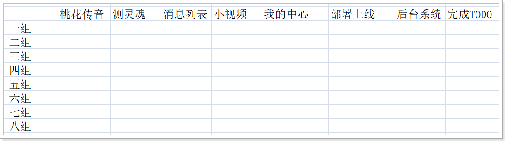
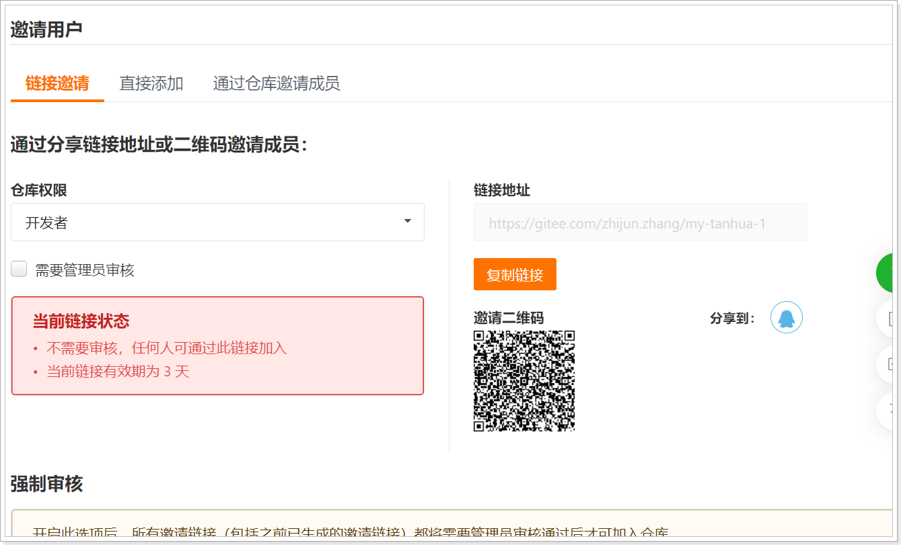
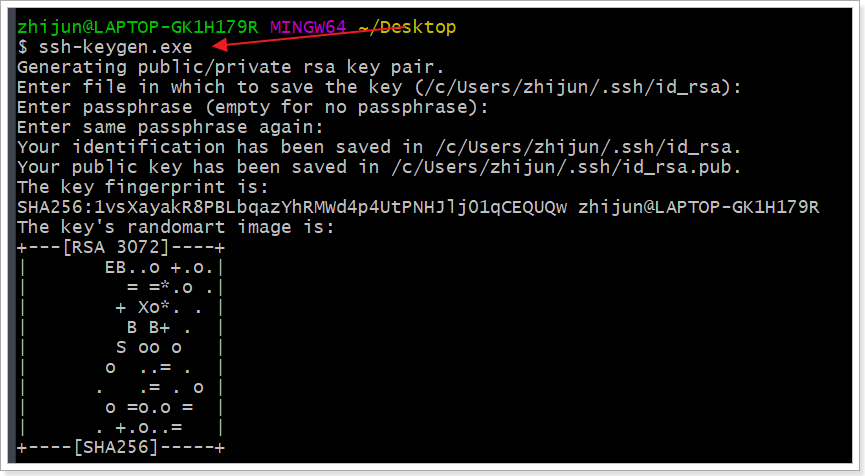
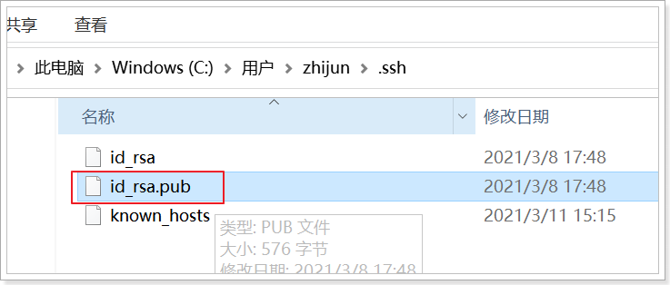
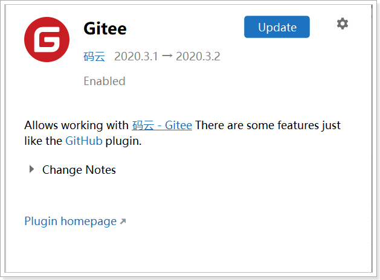
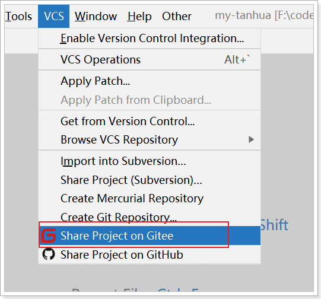
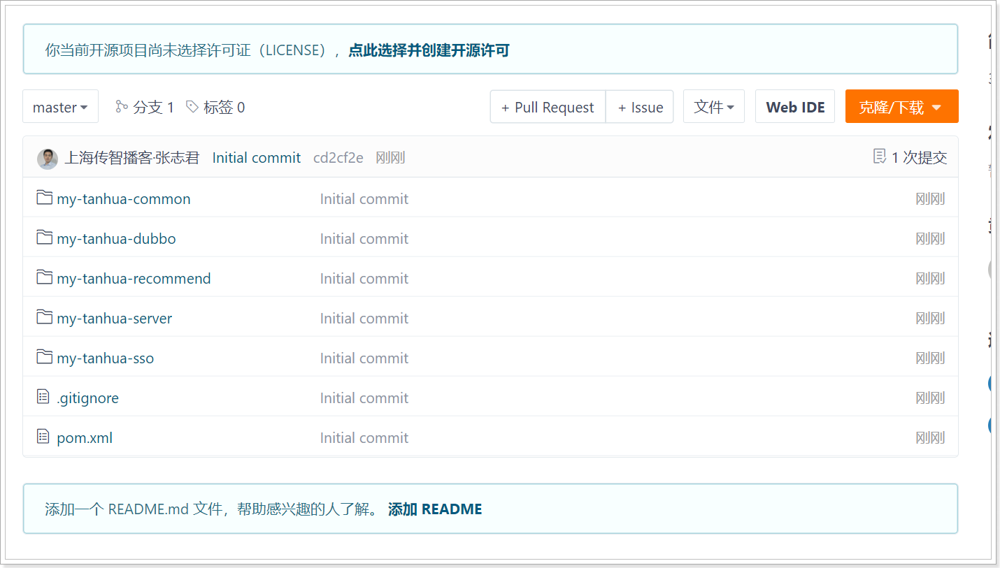
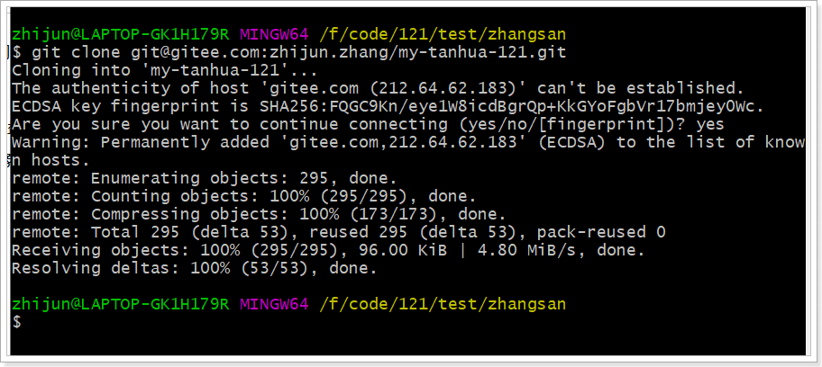

## 1、分组

要求：

- 座位对坐，在企业中氛围
- 每个人都要参与，因为是一个团队

## 2、功能

要求：

- 小组组长，需要把功能梳理清楚，分配任务
- 组长需要每天汇总成员的进度
- 表格画后面的白板上，大家推荐一个人：妹子
- 成员：每天发工作总结给组长，小组组长给总结给我，以邮件的形式，邮件：格式，以及设置签名，我的邮箱：zhangzhijun@itcast.cn
- 部署上线
  - 理想状态：找一些阿里云外网主机，部署上线
  - 其次，内网机器部署
  - 最后，本地环境

## 3、git使用

整个实战期间都是用git管理代码。统一使用码云存储代码。https://gitee.com/

每个组是一份代码，把团队成员加入到项目中。

组长需要邀请成员加入团队：

### 3.1、环境

- 安装git

- git生成ssh公钥
  

  

- 把公钥拷贝到码云

  - 地址：https://gitee.com/profile/sshkeys

- idea安装码云插件
  

### 3.2、代码发布到码云

组长实施，自己可以体验。

分享到码云：

 

最终效果：

### 3.3、克隆

模拟3个用户，克隆以及代码冲突解决。

操作：

任务分配：

- 张三：开发小视频模块
- 李四：开发小视频模块
- 王五：开发桃花传音

对于每个开发人员，不要在master上开发，基于分支进行。这一点非常重要。

功能开发完成后，提交到本地仓库。合并到主干。

合并的步骤：

- 先切换到主干
- 进行合并

