# 平台管理端基础数据准备&登录实现

## 今日目标

- 能够掌握项目中通用异常的处理方式
- 能够了解前端基础环境搭建
- 能够搭建nacos注册中心
- 能够集成gateway网关
- 能够完成敏感词管理的开发
- 能够熟悉常用密码加密方式
- 能够实现运营端登录功能

## 1 项目全局异常处理

### 1.1 不可预知异常

#### 1.1.1 问题分析

目前的代码中如果发生系统异常，则直接会给用户抛出不友好的异常信息。为了增加用户的体验，应该给一些适当信息进行提示。例如删除频道的代码，如下

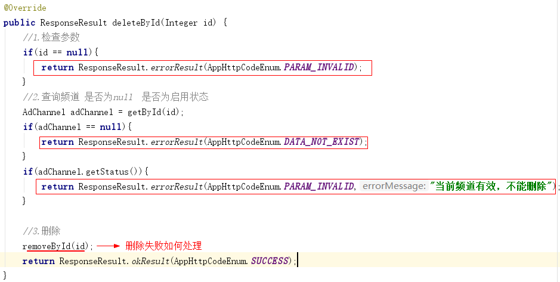

目前红框圈起来的是可以给用户友好提示的，但是当执行删除这一行代码，如何失败了该如何处理。有可能系统会抛出异常。那这个时候就不应该把异常信息直接返回给用户。那该如何处理呢？

项目开发中肯定会设置**全局异常处理**，不管系统发生了任何不可知的异常信息，都应该给用户返回友好提示信息。

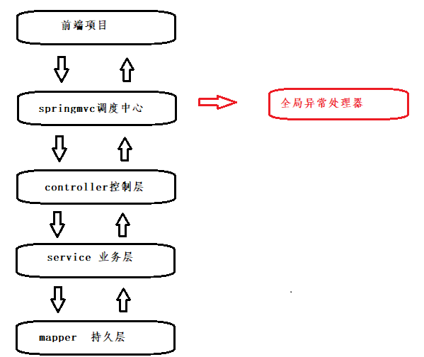

#### 1.1.2 代码完成

在`heima-leadnews-basic`模块下 新建`autoconfiguration-exception` 工程

（1） pom中引入依赖

```xml
	<dependencies>
        <dependency>
            <groupId>org.springframework</groupId>
            <artifactId>spring-web</artifactId>
            <scope>provided</scope>
        </dependency>
        <dependency>
            <groupId>com.heima</groupId>
            <artifactId>heima-leadnews-model</artifactId>
            <scope>provided</scope>
        </dependency>
    </dependencies>
```

(2) 创建通用异常处理类 com.heima.common.exception.ExceptionCatch

```java
package com.heima.common.exception;

import com.heima.model.common.dtos.ResponseResult;
import com.heima.model.common.enums.AppHttpCodeEnum;
import lombok.extern.slf4j.Slf4j;
import org.springframework.context.annotation.Configuration;
import org.springframework.web.bind.annotation.ExceptionHandler;
import org.springframework.web.bind.annotation.RestControllerAdvice;

/**
 * @Description:  目的是给用户提供友好的提示信息
 * @Version: V1.0
 */
@Slf4j
@Configuration
@RestControllerAdvice   // Springmvc 异常处理拦截注解
public class ExceptionCatch {
    /**
     * 解决项目中所有的异常拦截
     * @return
     */
    @ExceptionHandler(Exception.class)  // exception 所有子类
    public ResponseResult exception(Exception ex) {
        // 记录日志
        log.error("ExceptionCatch ex:{}", ex);
        return ResponseResult.errorResult(AppHttpCodeEnum.SERVER_ERROR, "您的网络异常，请稍后重试");
    }
}
```

`@ControllerAdvice`  控制器增强注解

`@ExceptionHandler` 异常处理器 与上面注解一起使用，可以拦截指定的异常信息

在 `META-INF/spring.factories` 配置文件中添加：

```properties
org.springframework.boot.autoconfigure.EnableAutoConfiguration=\
  com.heima.common.exception.ExceptionCatch
```

#### 1.1.4 测试

代码修改：

```java
    @Override
    public ResponseResult deleteById(Integer id) {
        //1.检查参数
        if(id == null){
            return ResponseResult.errorResult(AppHttpCodeEnum.PARAM_INVALID);
        }
        //2.判断当前频道是否存在 和 是否有效
        AdChannel adChannel = getById(id);
        if(adChannel==null){
            return ResponseResult.errorResult(AppHttpCodeEnum.DATA_NOT_EXIST);
        }
        // 启用状态下不能删除
        if (adChannel.getStatus()) {
            return ResponseResult.errorResult(AppHttpCodeEnum.PARAM_REQUIRE);
        }
        int i = 1/0;// 制造异常
        //3.删除频道
        removeById(id);
        return ResponseResult.okResult(AppHttpCodeEnum.SUCCESS);
    }
```

添加异常信息以后，返回如下：

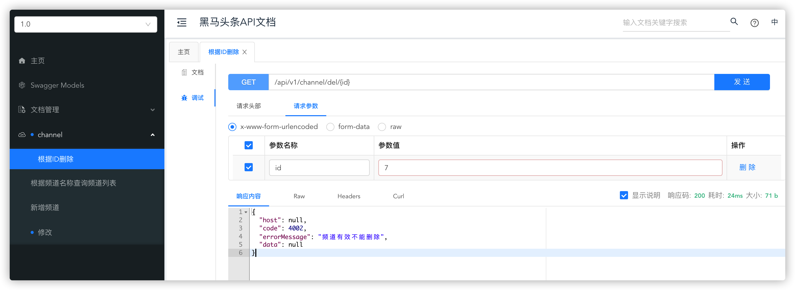


### 1.2 可预知异常处理

可预知异常是程序员在代码中手动抛出本系统定义的特定异常类型，由于是程序员抛出的异常，通常异常信息比较
齐全，程序员在抛出时会指定错误代码及错误信息，获取异常信息也比较方便。

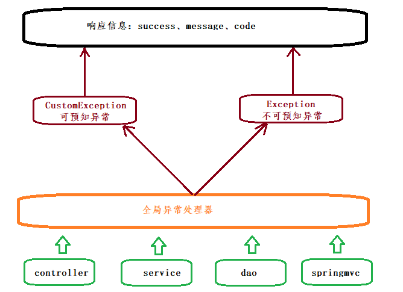

#### 1.2.1 定义自定义异常

```java
package com.heima.common.exception;

import com.heima.model.common.dtos.ResponseResult;
public class CustomException extends RuntimeException {

    // 异常处理的枚举
    private AppHttpCodeEnum appHttpCodeEnum;

    public CustomException(AppHttpCodeEnum appHttpCodeEnum) {
        this.appHttpCodeEnum = appHttpCodeEnum;
    }

    public AppHttpCodeEnum getAppHttpCodeEnum() {
        return appHttpCodeEnum;
    }
}
```

#### 1.2.2 配置到全局异常处理

修改全局异常处理ExceptionCatch，拦截自定义异常

```java
package com.heima.common.exception;
import com.heima.model.common.dtos.ResponseResult;
import com.heima.model.common.enums.AppHttpCodeEnum;
import lombok.extern.log4j.Log4j2;
import org.springframework.web.bind.annotation.ControllerAdvice;
import org.springframework.web.bind.annotation.ExceptionHandler;
import org.springframework.web.bind.annotation.ResponseBody;
@ControllerAdvice  //控制器增强
@Slf4j
@Configuration
public class ExceptionCatch {
    @ExceptionHandler(Exception.class)
    @ResponseBody
    public ResponseResult exception(Exception e){
        e.printStackTrace();
        log.error("catch exception:{}",e.getMessage());
        return ResponseResult.errorResult(AppHttpCodeEnum.SERVER_ERROR);
    }
  //可预知异常
    /**
     * 拦截自定义异常
     *
     * @return
     */
    @ExceptionHandler(CustomException.class)
    @ResponseBody
    public ResponseResult custException(CustomException ex) {
        System.out.println(ex);
        log.error("CustomException ex:{}", ex);
        AppHttpCodeEnum codeEnum = ex.getAppHttpCodeEnum();
        return ResponseResult.errorResult(codeEnum);
    }
}
```

补充：可以定义主动抛出异常的工具类，我们就可以直接调用工具类抛出异常。如下：

```java
package com.heima.common.exception;
import com.heima.model.common.enums.AppHttpCodeEnum;
/**
 * @Description:  抛异常工具类
 * @Version: V1.0
 */
public class CustException {
    public static void cust(AppHttpCodeEnum codeEnum) {
        throw new CustomException(codeEnum );
    }
}
```

#### 1.2.3 测试

任意代码手动抛出自定义异常，如下是在控制器的删除方法中抛出

```java
@GetMapping("/del/{id}")
@Override
public ResponseResult deleteById(@PathVariable("id") Integer id) {
    if(true){
       CustException.cust(AppHttpCodeEnum.DATA_NOT_EXIST);
    }
    return adChannelService.deleteById(id);
}
```

### 1.3 总结

在项目开发中有两种异常处理方式，一个是不可知异常，一个是可知异常，切记不可返回错误信息给用户。

## 2 admin服务注册到nacos

### 2.1 简介

Nacos是阿里的一个开源产品，它是针对微服务架构中的服务发现、配置管理、服务治理的综合型解决方案。
官方介绍是这样的：

Nacos  致力于帮助您发现、配置和管理微服务。Nacos 提供了一组简单易用的特性集，帮助您实现动态服务
发现、服务配置管理、服务及流量管理。 Nacos 帮助您更敏捷和容易地构建、交付和管理微服务平台。
Nacos 是构建以“服务”为中心的现代应用架构的服务基础设施。

官网地址：https://nacos.io

官方文档：https://nacos.io/zh-cn/docs/what-is-nacos.html

Nacos主要提供以下四大功能：

1. 服务发现与服务健康检查
   Nacos使服务更容易注册，并通过DNS或HTTP接口发现其他服务，Nacos还提供服务的实时健康检查，以防
   止向不健康的主机或服务实例发送请求。
2. 动态配置管理
   动态配置服务允许您在所有环境中以集中和动态的方式管理所有服务的配置。Nacos消除了在更新配置时重新
   部署应用程序，这使配置的更改更加高效和灵活。
3. 动态DNS服务
   Nacos提供基于DNS 协议的服务发现能力，旨在支持异构语言的服务发现，支持将注册在Nacos上的服务以
   域名的方式暴露端点，让三方应用方便的查阅及发现。
4. 服务和元数据管理
   Nacos 能让您从微服务平台建设的视角管理数据中心的所有服务及元数据，包括管理服务的描述、生命周
   期、服务的静态依赖分析、服务的健康状态、服务的流量管理、路由及安全策略。

### 2.2 安装Nacos Server

**docker安装nacos**

拉取镜像

```shell
docker pull nacos/nacos-server:1.3.2
```

创建容器

```shell
docker run -d \
-e PREFER_HOST_MODE=hostname \
-e MODE=standalone \
-e JVM_XMS=256m \
-e JVM_XMX=256m \
-e JVM_XMN=128m \
-p 8848:8848 \
--name nacos \
--restart=always \
nacos/nacos-server:1.3.2
```

- MODE=standalone  单机版
- --restart=always  开机启动
- -p 8848:8848   映射端口
- -d 创建一个守护式容器在后台运行

> 提供虚拟机已安装启动，无需重复安装

### 2.3 注册服务

在`heima-leadnews-services`聚合服务中加入依赖

```xml
<dependency>
    <groupId>com.alibaba.cloud</groupId>
    <artifactId>spring-cloud-starter-alibaba-nacos-discovery</artifactId>
</dependency>
```

在admin微服务中的application.yml文件中加入配置

```yaml
spring:
  cloud:
    nacos:
      discovery:
        server-addr: 192.168.200.129:8848
```

引导类中加上注解`@EnableDiscoveryClient`可以让该服务注册到nacos注册中心上去

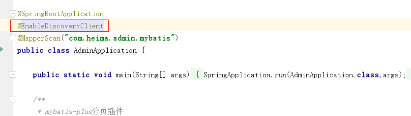


启动admin微服务，启动nacos，可以查看到admin服务已经在服务列表中了

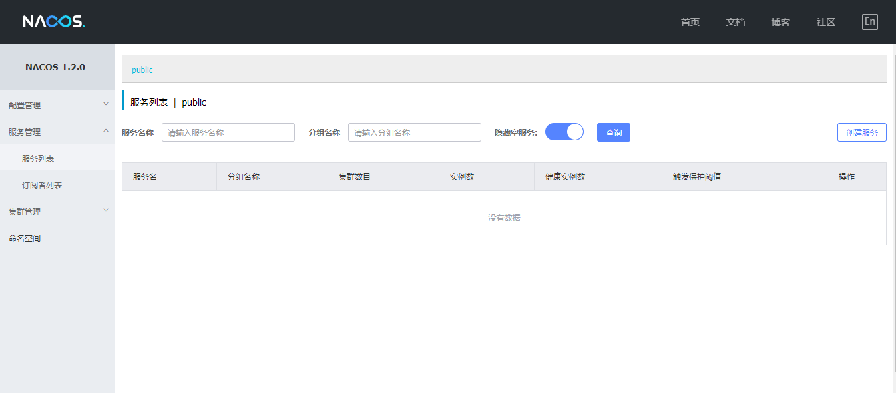


## 3 admin服务集成网关gateway

### 3.1 微服务网关概述

不同的微服务一般会有不同的网络地址，而外部客户端可能需要调用多个服务的接口才能完成一个业务需求，如果让客户端直接与各个微服务通信，会有以下的问题：

- 客户端会多次请求不同的微服务，增加了客户端的复杂性
- 存在跨域请求，在一定场景下处理相对复杂
- 认证复杂，每个服务都需要独立认证
- 难以重构，随着项目的迭代，可能需要重新划分微服务。例如，可能将多个服务合并成一个或者将一个服务拆分成多个。如果客户端直接与微服务通信，那么重构将会很难实施
- 某些微服务可能使用了防火墙 / 浏览器不友好的协议，直接访问会有一定的困难

以上这些问题可以借助网关解决。

网关是介于客户端和服务器端之间的中间层，所有的外部请求都会先经过 网关这一层。也就是说，API 的实现方面更多的考虑业务逻辑，而安全、性能、监控可以交由 网关来做，这样既提高业务灵活性又不缺安全性，典型的架构图如图所示：

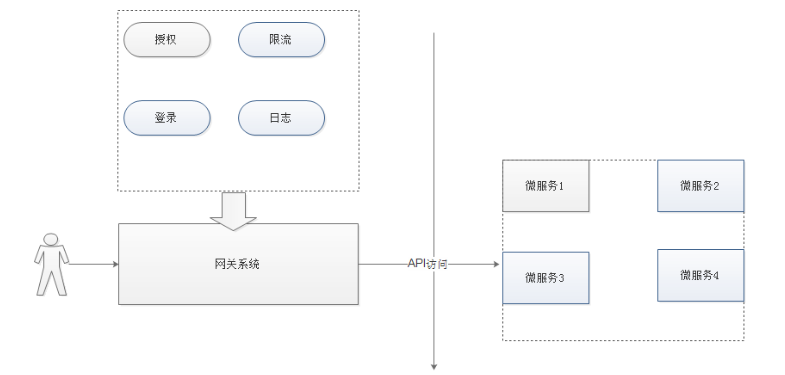

优点如下：

- 安全 ，只有网关系统对外进行暴露，微服务可以隐藏在内网，通过防火墙保护。
- 易于监控。可以在网关收集监控数据并将其推送到外部系统进行分析。
- 易于认证。可以在网关上进行认证，然后再将请求转发到后端的微服务，而无须在每个微服务中进行认证。
- 减少了客户端与各个微服务之间的交互次数
- 易于统一授权。

总结：微服务网关就是一个系统，通过暴露该微服务网关系统，方便我们进行相关的鉴权，安全控制，日志统一处理，易于监控的相关功能。

实现微服务网关的技术有很多，

- nginx  Nginx (engine x) 是一个高性能的[HTTP](https://baike.baidu.com/item/HTTP)和[反向代理](https://baike.baidu.com/item/%E5%8F%8D%E5%90%91%E4%BB%A3%E7%90%86/7793488)web服务器，同时也提供了IMAP/POP3/SMTP服务
- zuul ,Zuul 是 Netflix 出品的一个基于 JVM 路由和服务端的负载均衡器。 1.x  servlet 2.5  
- spring-cloud-gateway, 是spring 出品的 基于spring 的网关项目，集成断路器，路径重写，性能比Zuul好。

我们使用gateway这个网关技术，无缝衔接到基于spring cloud的微服务开发中来。

gateway官网：

https://spring.io/projects/spring-cloud-gateway

### 3.2 搭建gateway网关微服务

（1）创建 `heima-leadnews-gateways` 网关聚合maven工程

pom文件

```xml
<dependencies>
    <dependency>
        <groupId>org.springframework.cloud</groupId>
        <artifactId>spring-cloud-starter-gateway</artifactId>
    </dependency>
    <dependency>
        <groupId>com.alibaba.cloud</groupId>
        <artifactId>spring-cloud-starter-alibaba-nacos-discovery</artifactId>
    </dependency>
    <dependency>
        <groupId>io.jsonwebtoken</groupId>
        <artifactId>jjwt</artifactId>
    </dependency>
</dependencies>
```

（2）在`heima-leadnews-gateways` 工程下创建admin端网关  `admin-gateway`

配置文件application.yml

```yaml
server:
  port: 6001
spring:
  application:
    name: leadnews-admin-gateway
  cloud:
    nacos:
      discovery:
        server-addr: 192.168.200.130:8848
    gateway:
      globalcors:
        cors-configurations:
          '[/**]': # 匹配所有请求
            allowedOrigins: "*" #跨域处理 允许所有的域
            allowedMethods: # 支持的方法
            - GET
            - POST
            - PUT
            - DELETE
      routes:
      # 平台管理
      - id: admin
        uri: lb://leadnews-admin
        predicates:
        - Path=/admin/**
        filters:
        - StripPrefix= 1
```

引导类：

```java
package com.heima.admin.gateway;
@SpringBootApplication
@EnableDiscoveryClient  //开启注册中心
public class AdminGatewayApplication {
    public static void main(String[] args) {
        SpringApplication.run(AdminGatewayApplication.class,args);
    }
}
```

## 4 前端相关基础知识（了解）

### 4.1 webpack

#### 4.1.1 什么是webpack

webpack 是一个现代 JavaScript 应用程序的模块打包器(module bundler)，分析你的项目结构，找到JavaScript模块以及其它的一些浏览器不能直接运行的拓展语言（Sass，TypeScript等），并将其转换和打包为合适的格式供浏览器使用。


#### 4.1.2 webpack安装

注意：请先安装node环境

webpack基于node.js运行，首先需要安装node.js。(须安装)  

**安装版本为：node-v9.4.0-x64**

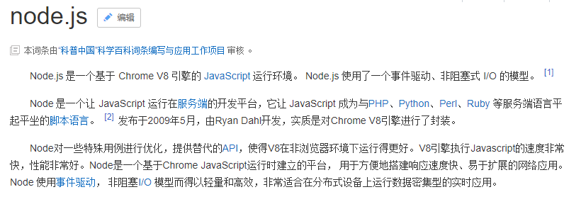

建议大家这样操作(随时切换镜像源)：

1. npm install nrm -g // 安装nrm
2. nrm ls // 查看镜像源
3. nrm use taobao // 选择淘宝镜像，也可以选择cnpm

安装webpack

`npm install webpack@3.6.0 -g`  (须安装 推荐)

`cnpm install webpack@3.6.0 -g`  (须安装)

### 4.2 vue脚手架(可不做)

vue-cli是官方的一个脚手架工具，所谓脚手架呢就是一个架子，什么架子呢？项目结构的架子，里面有一些最基本的结构配置。利用vue-cli呢，我们可以生成这样的一个脚手架，所以呢它就被称为vue脚手架工具。

`npm install vue-cli -g`   安装


### 4.3 导入admin前端工程

前端代码：https://gitee.com/jitheima/leadnews-front-end.git

使用VsCode 工具打开前端项目

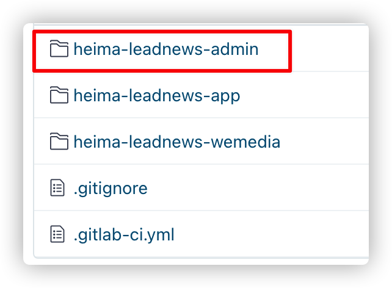

* heima-leadnews-admin：admin管理平台
* heima-leadnews-app：app端
* heima-leadnews-wemedia：自媒体端

打开项目

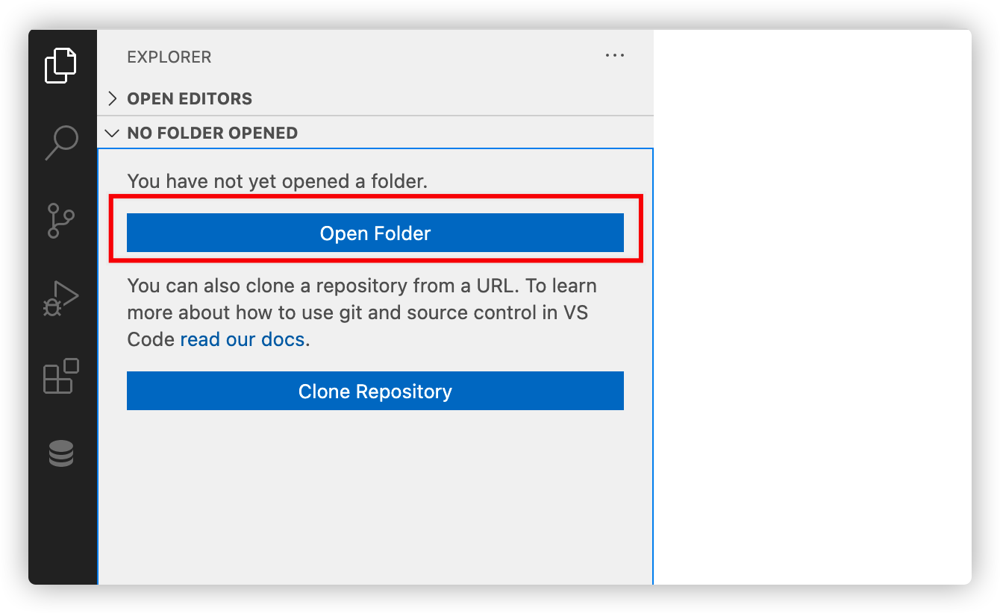

（1）安装js依赖，保证有网络，在项目的根目录执行命令`cnpm install`

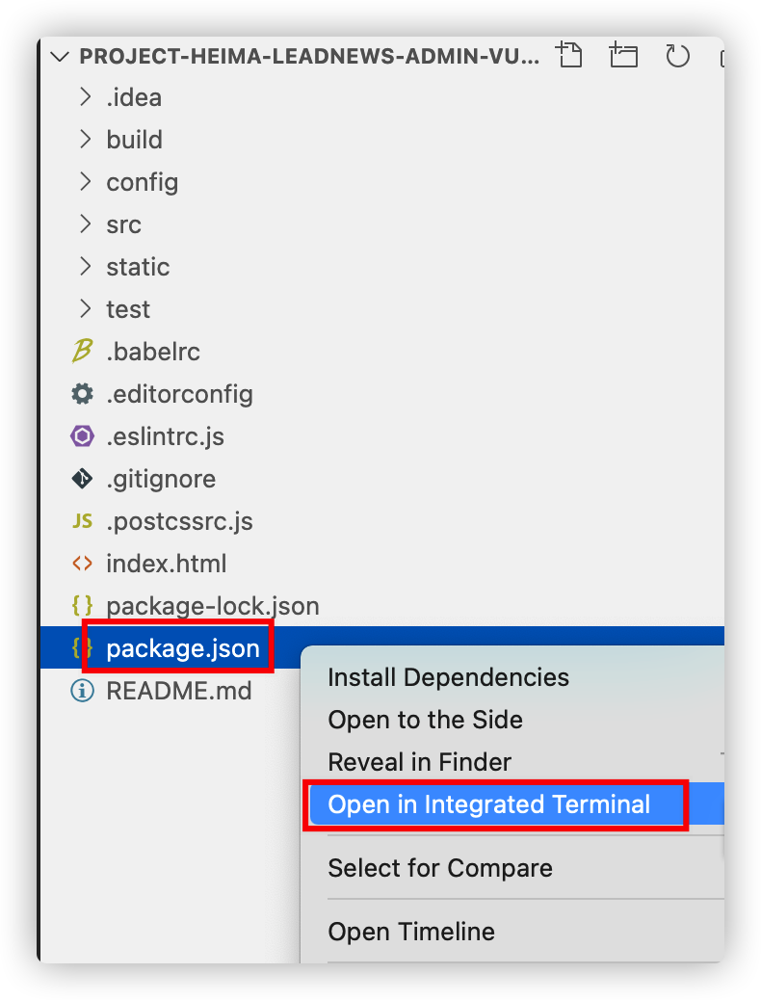

> 注意：前端项目中如果没有node_models 文件夹，则需要使用 npm install 安装

(2)修改文件，暂时不登录

文件的位置：`\src\views\login\index.vue`

注释登录请求，直接跳转到列表页面，添加跳转代码：

```js
this.$router.replace({path:'/auth/index'})
```

修改效果如下：

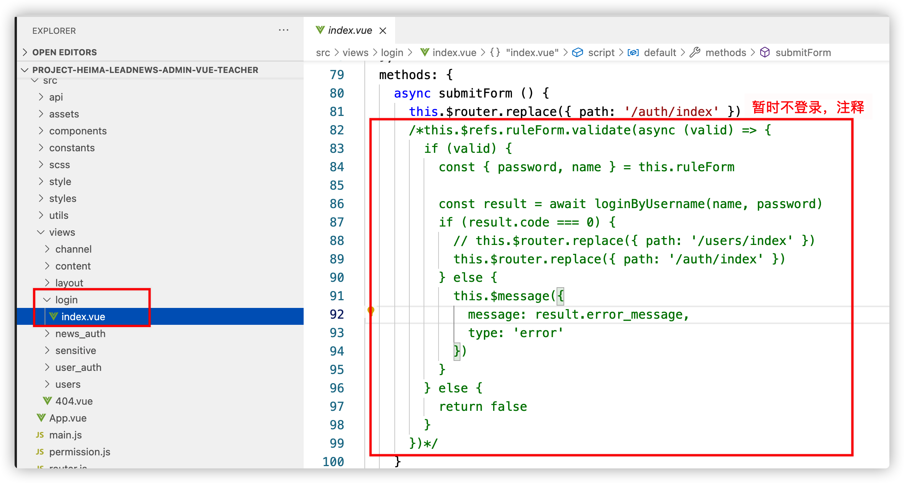

（3）修改 `config/index.js` 中后端地址

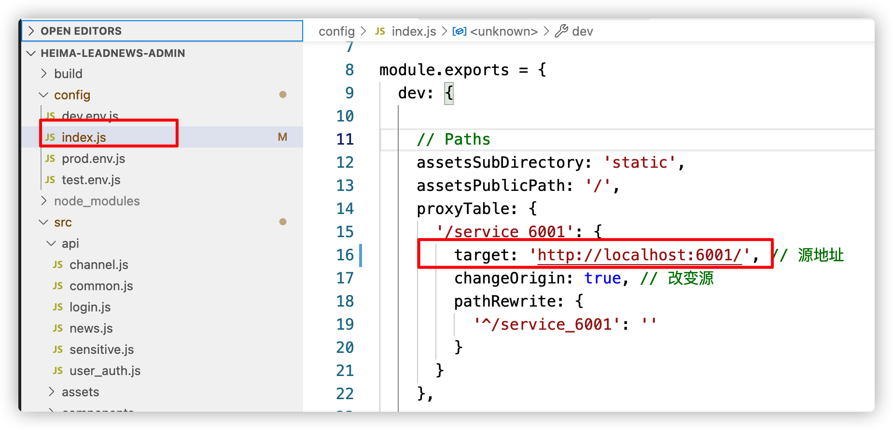

（4）启动项目

执行 `npm run dev`  就能启动项目了

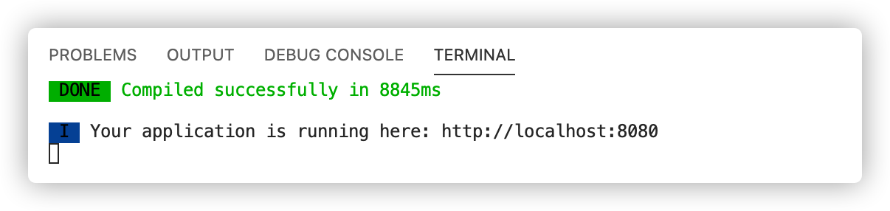

（5）启动成功以后，用浏览器打开，可以测试已开发好的频道功能

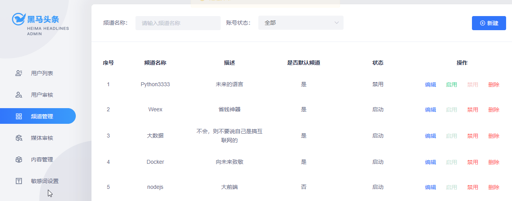

## 5 敏感词管理

需求效果图：

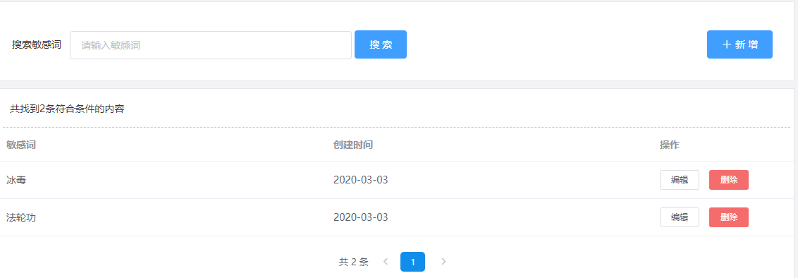

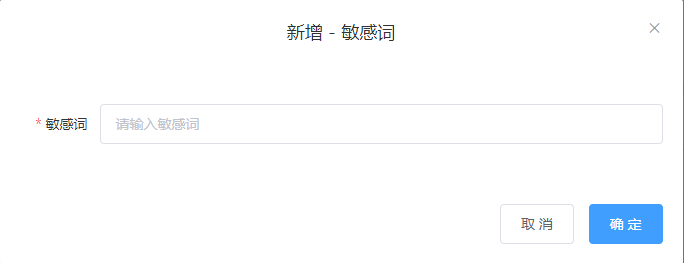

ad_sensitive 敏感词

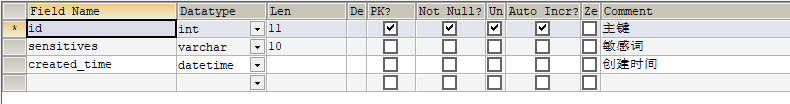

实体类：

```java
package com.heima.model.admin.pojos;

import com.baomidou.mybatisplus.annotation.IdType;
import com.baomidou.mybatisplus.annotation.TableField;
import com.baomidou.mybatisplus.annotation.TableId;
import com.baomidou.mybatisplus.annotation.TableName;
import lombok.Data;

import java.io.Serializable;
import java.util.Date;

/**
 * <p>
 * 敏感词信息表
 * </p>
 *
 * @author itheima
 */
@Data
@TableName("ad_sensitive")
public class AdSensitive implements Serializable {
    private static final long serialVersionUID = 1L;
    /**
     * 主键
     */
    @TableId(value = "id", type = IdType.AUTO)
    private Integer id;
    /**
     * 敏感词
     */
    @TableField("sensitives")
    private String sensitives;
    /**
     * 创建时间
     */
    @TableField("created_time")
    private Date createdTime;
}
```

### 5.1 接口定义

分别要完成敏感词管理的如下功能

- 敏感词的分页按照关键字模糊查询
- 敏感词新增
- 敏感词修改
- 敏感词删除

在`heima-leadnews-apis`模块中新建接口`com.heima.api.admin.SensitiveControllerApi`

分别定义查询，新增，修改，删除方法

```java
package com.heima.apis.admin;
import com.heima.model.admin.dtos.SensitiveDto;
import com.heima.model.admin.pojos.AdSensitive;
import com.heima.model.common.dtos.ResponseResult;
public interface AdSensitiveControllerApi {
    /**
     * 查询敏感词列表
     * @param dto
     * @return
     */
    public ResponseResult list(SensitiveDto dto);
    /**
     * 新增
     * @param adSensitive
     * @return
     */
    public ResponseResult insert(AdSensitive adSensitive);
    /**
     * 修改
     * @param adSensitive
     * @return
     */
    public ResponseResult update(AdSensitive adSensitive);
    /**
     * 删除
     * @param id
     * @return
     */
    public ResponseResult delete(Integer id);
}
```

SensitiveDto

```java
package com.heima.model.admin.dtos;
import com.heima.model.common.dtos.PageRequestDto;
import lombok.Data;
@Data
public class SensitiveDto extends PageRequestDto {
    /**
     * 敏感词名称
     */
    private String name;
}
```

### 5.2 mapper接口

定义敏感词mapper接口：com.heima.admin.mapper.AdSensitiveMapper

```java
package com.heima.admin.mapper;
import com.baomidou.mybatisplus.core.mapper.BaseMapper;
import com.heima.model.admin.pojos.AdSensitive;
import org.apache.ibatis.annotations.Mapper;
@Mapper
public interface AdSensitiveMapper extends BaseMapper<AdSensitive> {
}

```

### 5.3 业务层

定义敏感词业务接口com.heima.admin.service.AdSensitiveService

```java
package com.heima.admin.service;

import com.baomidou.mybatisplus.extension.service.IService;
import com.heima.model.admin.dtos.SensitiveDto;
import com.heima.model.admin.pojos.AdSensitive;
import com.heima.model.common.dtos.ResponseResult;

public interface AdSensitiveService extends IService<AdSensitive> {

    /**
     * 查询敏感词列表
     * @param dto
     * @return
     */
    public ResponseResult list(SensitiveDto dto);

    /**
     * 新增
     * @param adSensitive
     * @return
     */
    public ResponseResult insert(AdSensitive adSensitive);

    /**
     * 修改
     * @param adSensitive
     * @return
     */
    public ResponseResult update(AdSensitive adSensitive);

    /**
     * 删除
     * @param id
     * @return
     */
    public ResponseResult delete(Integer id);
}
```

实现类：

```java
package com.heima.admin.service.impl;

import com.baomidou.mybatisplus.core.conditions.query.LambdaQueryWrapper;
import com.baomidou.mybatisplus.core.metadata.IPage;
import com.baomidou.mybatisplus.extension.plugins.pagination.Page;
import com.baomidou.mybatisplus.extension.service.impl.ServiceImpl;
import com.heima.admin.mapper.AdSensitiveMapper;
import com.heima.admin.service.AdSensitiveService;
import com.heima.model.admin.dtos.SensitiveDto;
import com.heima.model.admin.pojos.AdSensitive;
import com.heima.model.common.dtos.PageResponseResult;
import com.heima.model.common.dtos.ResponseResult;
import com.heima.model.common.enums.AppHttpCodeEnum;
import org.apache.commons.lang3.StringUtils;
import org.springframework.stereotype.Service;
import org.springframework.transaction.annotation.Transactional;

import java.util.Date;

@Service
@Transactional
public class AdSensitiveServiceImpl extends ServiceImpl<AdSensitiveMapper, AdSensitive> implements AdSensitiveService {
    @Override
    public ResponseResult list(SensitiveDto dto) {
        //1.检查参数
        if(dto == null){
            return ResponseResult.errorResult(AppHttpCodeEnum.PARAM_INVALID);
        }
        dto.checkParam();

        //2.根据名称模糊分页查询
        IPage pageParam = new Page(dto.getPage(),dto.getSize());
        LambdaQueryWrapper<AdSensitive> lambdaQueryWrapper = new LambdaQueryWrapper();
        if(StringUtils.isNotBlank(dto.getName())){
            lambdaQueryWrapper.like(AdSensitive::getSensitives,dto.getName());
        }
        IPage page = page(pageParam, lambdaQueryWrapper);
        //3.结果返回
        ResponseResult responseResult = new PageResponseResult(dto.getPage(),dto.getSize(),(int)page.getTotal());
        responseResult.setData(page.getRecords());
        return responseResult;
    }
    @Override
    public ResponseResult insert(AdSensitive adSensitive) {
        //1.检查参数
        if(adSensitive == null){
            return ResponseResult.errorResult(AppHttpCodeEnum.PARAM_INVALID);
        }
        //2.保存
        adSensitive.setCreatedTime(new Date());
        save(adSensitive);
        return ResponseResult.okResult(AppHttpCodeEnum.SUCCESS);
    }

    @Override
    public ResponseResult update(AdSensitive adSensitive) {
        //1.检查参数
        if(adSensitive == null || adSensitive.getId() == null){
            return ResponseResult.errorResult(AppHttpCodeEnum.PARAM_INVALID);
        }
        //2.修改
        updateById(adSensitive);
        return ResponseResult.okResult(AppHttpCodeEnum.SUCCESS);
    }

    @Override
    public ResponseResult delete(Integer id) {
        //1.检查参数
        if(id == null){
            return ResponseResult.errorResult(AppHttpCodeEnum.PARAM_INVALID);
        }
        //2.查询敏感词是否存在
        AdSensitive adSensitive = getById(id);
        if(adSensitive == null){
            return ResponseResult.errorResult(AppHttpCodeEnum.DATA_NOT_EXIST);
        }

        //3.删除
        removeById(id);
        return ResponseResult.okResult(AppHttpCodeEnum.SUCCESS);
    }
}
```

### 5.4 控制层

定义com.heima.admin.controller.v1.SensitiveController实现SensitiveControllerApi接口

```java
package com.heima.admin.controller.v1;
import com.heima.admin.service.AdSensitiveService;
import com.heima.apis.admin.AdSensitiveControllerApi;
import com.heima.model.admin.dtos.SensitiveDto;
import com.heima.model.admin.pojos.AdSensitive;
import com.heima.model.common.dtos.ResponseResult;
import org.springframework.beans.factory.annotation.Autowired;
import org.springframework.web.bind.annotation.*;
@RestController
@RequestMapping("/api/v1/sensitive")
public class AdSensitiveController implements AdSensitiveControllerApi {
    @Autowired
    private AdSensitiveService adSensitiveService;
    @PostMapping("/list")
    @Override
    public ResponseResult list(@RequestBody SensitiveDto dto) {
        return adSensitiveService.list(dto);
    }
    @PostMapping("/save")
    @Override
    public ResponseResult insert(@RequestBody AdSensitive adSensitive) {
        return adSensitiveService.insert(adSensitive);
    }
    @PostMapping("/update")
    @Override
    public ResponseResult update(@RequestBody AdSensitive adSensitive) {
        return adSensitiveService.update(adSensitive);
    }
    @DeleteMapping("/del/{id}")
    @Override
    public ResponseResult delete(@PathVariable("id") Integer id) {
        return adSensitiveService.delete(id);
    }
}
```

### 5.5 测试

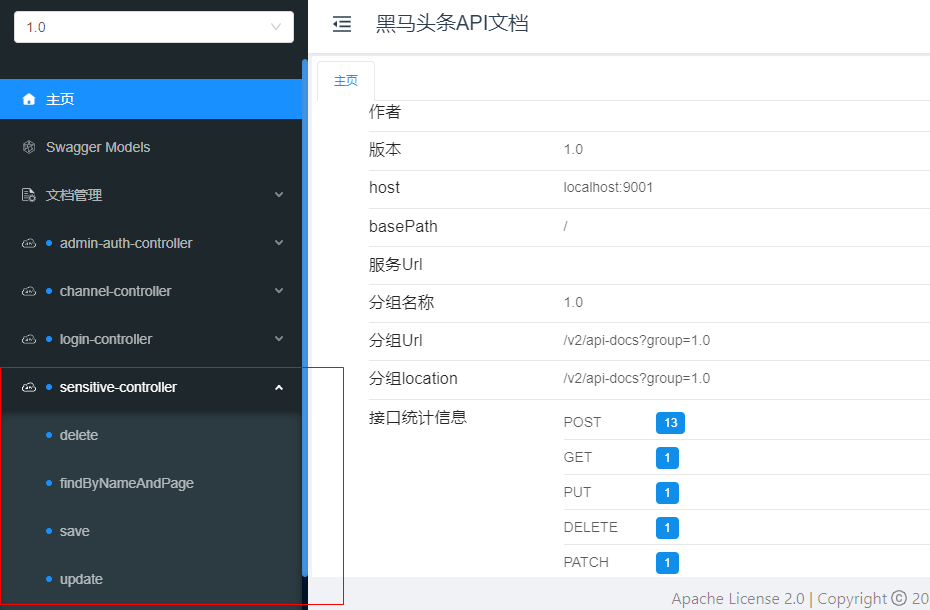

如果集成页面进行测试，请严格按照讲义中的控制层路径进行定义

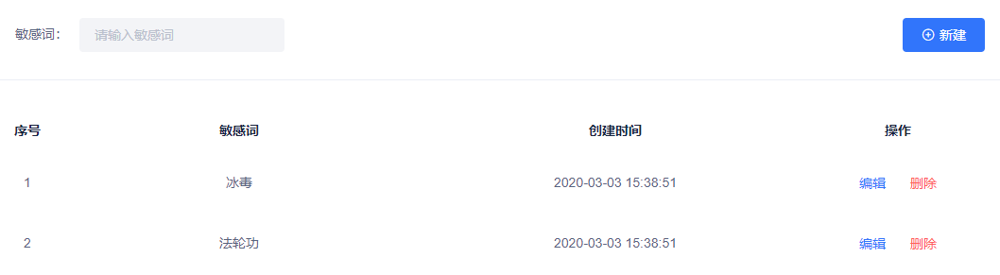


## 6 常见的加密方式

**由于在学习JWT的时候会涉及使用很多加密算法, 所以在这里做下扫盲, 简单了解就可以**

加密算法种类有:

### 6.1.可逆加密算法

**解释:**  加密后, 密文可以反向解密得到密码原文.

#### 6.1.1. 对称加密

【**文件加密和解密使用相同的密钥，即加密密钥也可以用作解密密钥**】 

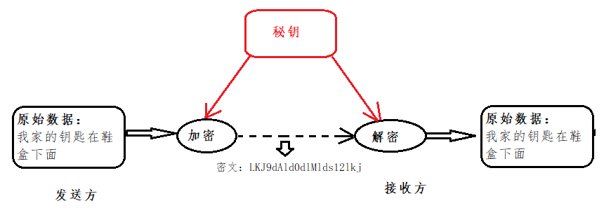

**解释:** 在对称加密算法中，数据发信方将明文和加密密钥一起经过特殊的加密算法处理后，使其变成复杂的加密密文发送出去，收信方收到密文后，若想解读出原文，则需要使用加密时用的密钥以及相同加密算法的逆算法对密文进行解密，才能使其回复成可读明文。在对称加密算法中，使用的密钥只有一个，收发双方都使用这个密钥，这就需要解密方事先知道加密密钥。

**优点:**  对称加密算法的优点是算法公开、计算量小、加密速度快、加密效率高。

**缺点:**  没有非对称加密安全.

**用途：** 一般用于保存用户手机号、身份证等敏感但能解密的信息。

**常见的对称加密算法有**: `AES、DES、3DES、Blowfish、IDEA、RC4、RC5、RC6、HS256 `

#### 6.1.2. 非对称加密

【**两个密钥：公开密钥（publickey）和私有密钥，公有密钥加密，私有密钥解密**】

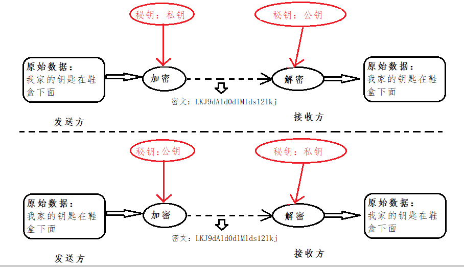

**解释: ** 同时生成两把密钥：私钥和公钥，私钥隐秘保存，公钥可以下发给信任客户端.

加密与解密:

* 私钥加密，持有公钥才可以解密
* 公钥加密，持有私钥才可解密

签名:

* 私钥签名,  持有公钥进行验证是否被篡改过.

**优点: ** 非对称加密与对称加密相比，其安全性更好；

**缺点:**  非对称加密的缺点是加密和解密花费时间长、速度慢，只适合对少量数据进行加密。

**用途：** 一般用于签名和认证。私钥服务器保存, 用来加密,  公钥客户拿着用于对于令牌或者签名的解密或者校验使用.

**常见的非对称加密算法有：** `RSA、DSA（数字签名用）、ECC（移动设备用）、RS256 (采用SHA-256 的 RSA 签名) `

### 6.2.不可逆加密算法

**解释:**  一旦加密就不能反向解密得到密码原文.

**种类:**  Hash加密算法, 散列算法, 摘要算法等

**用途：**一般用于校验下载文件正确性，一般在网站上下载文件都能见到；存储用户敏感信息，如密码、 卡号等不可解密的信息。

**常见的不可逆加密算法有：** `MD5、SHA、HMAC`

### 6.3.Base64编码 

Base64是网络上最常见的用于传输8Bit字节代码的编码方式之一。Base64编码可用于在HTTP环境下传递较长的标识信息。采用Base64Base64编码解码具有不可读性，即所编码的数据不会被人用肉眼所直接看到。**注意：Base64只是一种编码方式，不算加密方法。**

在线编码工具：

https://www.bejson.com/

## 7 密码加密的方式选型

### 7.1 MD5密码加密


```java
//md5加密  DegestUtils：spring框架提供的工具类
String md5Str = DigestUtils.md5DigestAsHex("abc".getBytes());
System.out.println(md5Str);//900150983cd24fb0d6963f7d28e17f72
```

md5相同的密码每次加密都一样，不太安全

### 7.2 手动加密（md5+随机字符串）

在md5的基础上手动加盐（salt）处理  

```java
//uername:zhangsan  password:123   salt:随时字符串
String salt = RandomStringUtils.randomAlphanumeric(10);//获取一个10位的随机字符串
System.out.println(salt);
String pswd = "123"+salt;

String saltPswd = DigestUtils.md5DigestAsHex(pswd.getBytes());
System.out.println(saltPswd);
```

这样同样的密码，加密多次值是不相同的，因为加入了随机字符串

### 7.3. BCrypt密码加密

在用户模块，对于用户密码的保护，通常都会进行加密。我们通常对密码进行加密，然后存放在数据库中，在用户进行登录的时候，将其输入的密码进行加密然后与数据库中存放的密文进行比较，以验证用户密码是否正确。  目前，MD5和BCrypt比较流行。相对来说，BCrypt比MD5更安全。

BCrypt 官网[http://www.mindrot.org/projects/jBCrypt/](http://www.mindrot.org/projects/jBCrypt/)

（1）我们从官网下载源码

（2）新建工程，将源码类BCrypt拷贝到工程

（3）新建测试类，main方法中编写代码，实现对密码的加密

```java
String gensalt = BCrypt.gensalt();//这个是盐  29个字符，随机生成
System.out.println(gensalt);
String password = BCrypt.hashpw("123456", gensalt);  //根据盐对密码进行加密
System.out.println(password);//加密后的字符串前29位就是盐
```

（4）新建测试类，main方法中编写代码，实现对密码的校验。BCrypt不支持反运算，只支持密码校验。

```java
boolean checkpw = BCrypt.checkpw("123456",     "$2a$10$61ogZY7EXsMDWeVGQpDq3OBF1.phaUu7.xrwLyWFTOu8woE08zMIW");
System.out.println(checkpw);
```

## 8 jwt介绍

### 8.1 token认证

随着 Restful API、微服务的兴起，基于 Token 的认证现在已经越来越普遍。基于token的用户认证是一种**服务端无状态**的认证方式，所谓服务端无状态指的token本身包含登录用户所有的相关数据，而客户端在认证后的每次请求都会携带token，因此服务器端无需存放token数据。

当用户认证后，服务端生成一个token发给客户端，客户端可以放到 cookie 或 **localStorage** 等存储中，每次请求时带上 token，服务端收到token通过验证后即可确认用户身份。

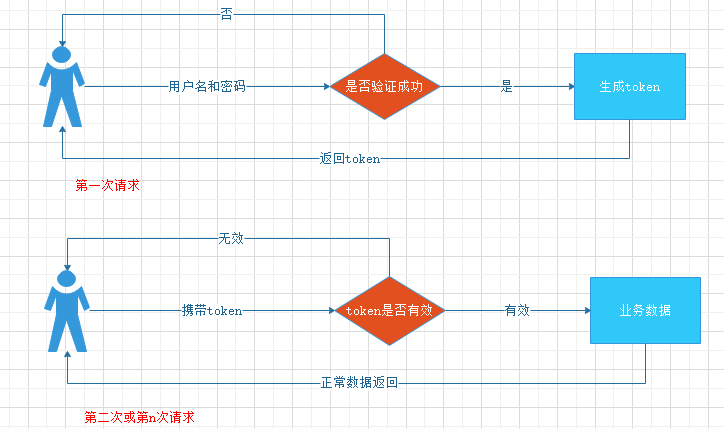

### 8.2 什么是JWT？

我们现在了解了基于token认证的交互机制，但令牌里面究竟是什么内容？什么格式呢？市面上基于token的认证方式大都采用的是JWT(Json Web Token)。

JSON Web Token（JWT）是一个开放的行业标准（RFC 7519），它定义了一种简洁的、自包含的协议格式，用于在通信双方传递json对象，传递的信息经过数字签名可以被验证和信任。

**JWT令牌结构：**

JWT令牌由Header、Payload、Signature三部分组成，每部分中间使用点（.）分隔，比如：xxxxx.yyyyy.zzzzz

- Header

头部包括令牌的类型（即JWT）及使用的哈希算法（如HMAC、SHA256或RSA）。

一个例子：

```json
{
	"alg": "HS256"，
	"typ": "JWT"
}
```

将上边的内容使用Base64Url编码，得到一个字符串就是JWT令牌的第一部分。

- Payload

第二部分是负载，内容也是一个json对象，它是存放有效信息的地方，它可以存放jwt提供的现成字段，比如：iss（签发者），exp（过期时间戳）， sub（面向的用户）等，也可自定义字段。
此部分不建议存放敏感信息，因为此部分可以解码还原原始内容。
一个例子：

```json
{
	"sub": "1234567890"，
	"name": "456"，
	"admin": true
}
```

最后将第二部分负载使用Base64Url编码，得到一个字符串就是JWT令牌的第二部分。

- Signature

第三部分是签名，此部分用于防止jwt内容被篡改。
这个部分使用base64url将前两部分进行编码，编码后使用点（.）连接组成字符串，最后使用header中声明
签名算法进行签名。
一个例子：

```json
HMACSHA256(
base64UrlEncode(header) + "." +
base64UrlEncode(payload)，
secret)
```

base64UrlEncode(header)：jwt令牌的第一部分。
base64UrlEncode(payload)：jwt令牌的第二部分。
secret：签名所使用的密钥。

下图中包含一个生成的jwt令牌：

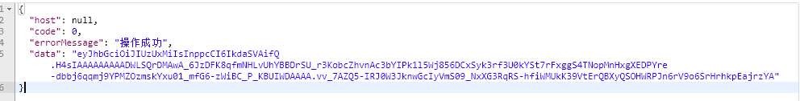

### 8.3 生成token

需要引入jwt相关依赖

```xml
<dependency>
    <groupId>io.jsonwebtoken</groupId>
    <artifactId>jjwt</artifactId>
</dependency>
```

工具类

```java
package com.heima.utils.common;
import io.jsonwebtoken.*;
import javax.crypto.SecretKey;
import javax.crypto.spec.SecretKeySpec;
import java.util.*;
public class AppJwtUtil {
    // TOKEN的有效期一天（S）
    private static final int TOKEN_TIME_OUT = 3_600;
    // 加密KEY
    private static final String TOKEN_ENCRY_KEY = "MDk4ZjZiY2Q0NjIxZDM3M2NhZGU0ZTgzMjYyN2I0ZjY";
    // 最小刷新间隔(S)
    private static final int REFRESH_TIME = 300;
    // 生产ID
    public static String getToken(Long id){
        Map<String, Object> claimMaps = new HashMap<>();
        claimMaps.put("id",id);
        long currentTime = System.currentTimeMillis();
        return Jwts.builder()
                .setId(UUID.randomUUID().toString())
                .setIssuedAt(new Date(currentTime))  //签发时间
                .setSubject("system")  //说明
                .setIssuer("heima") //签发者信息
                .setAudience("app")  //接收用户
                .compressWith(CompressionCodecs.GZIP)  //数据压缩方式
                .signWith(SignatureAlgorithm.HS512, generalKey()) //加密方式
                .setExpiration(new Date(currentTime + TOKEN_TIME_OUT * 1000))  //过期时间戳
                .addClaims(claimMaps) //cla信息
                .compact();
    }
    /**
     * 获取token中的claims信息
     * @param token
     * @return
     */
    private static Jws<Claims> getJws(String token) {
            return Jwts.parser()
                    .setSigningKey(generalKey())
                    .parseClaimsJws(token);
    }
    /**
     * 获取payload body信息
     * @param token
     * @return
     */
    public static Claims getClaimsBody(String token) {
        try {
            return getJws(token).getBody();
        }catch (ExpiredJwtException e){
            return null;
        }
    }
    /**
     * 获取hearder body信息
     * @param token
     * @return
     */
    public static JwsHeader getHeaderBody(String token) {
        return getJws(token).getHeader();
    }
    /**
     * 是否过期
     * @param claims
     * @return -1：有效，0：有效，1：过期，2：过期
     */
    public static int verifyToken(Claims claims) {
        if(claims==null){
            return 1;
        }
        try {
            claims.getExpiration()
                    .before(new Date());
            // 需要自动刷新TOKEN
            if((claims.getExpiration().getTime()-System.currentTimeMillis())>REFRESH_TIME*1000){
                return -1;
            }else {
                return 0;
            }
        } catch (ExpiredJwtException ex) {
            return 1;
        }catch (Exception e){
            return 2;
        }
    }
    /**
     * 由字符串生成加密key
     * @return
     */
    public static SecretKey generalKey() {
        byte[] encodedKey = Base64.getEncoder().encode(TOKEN_ENCRY_KEY.getBytes());
        SecretKey key = new SecretKeySpec(encodedKey, 0, encodedKey.length, "AES");
        return key;
    }
    public static void main(String[] args) {
       /* Map map = new HashMap();
        map.put("id","11");*/
       // 生产 JWT令牌 token
        System.out.println(AppJwtUtil.getToken(4L));
        // 根据token获取 jwt内容
        Jws<Claims> jws = AppJwtUtil.getJws("eyJhbGciOiJIUzUxMiIsInppcCI6IkdaSVAifQ.H4sIAAAAAAAAADWLQQqDQAwA_5KzC6bZGutvEjbiCsJCVmgp_bvx0NsMw3xh7xUWIJLHjKKJdHymbLwmpRcmLUJszGWdDAao0mHBCUfkjDQP4KfG7R_vdtzdPXSzekiYnCVMWgu2d_ufzPdZo-XfBcNm1rKAAAAA.8c_QVxdFIVVyuzLZnWa0T7gsJZ5dX-kmk7prhMyPLEzkvgG65qx0HzFx1aIc3m61fyptRrW1WLp44thvQfdmDw");
        // 校验jwt合法性
        int i = AppJwtUtil.verifyToken(jws.getBody());
        System.out.println("i="+i);
        Claims claims = AppJwtUtil.getClaimsBody("eyJhbGciOiJIUzUxMiIsInppcCI6IkdaSVAifQ.H4sIAAAAAAAAADWLQQqDQAwA_5KzC6bZGutvEjbiCsJCVmgp_bvx0NsMw3xh7xUWIJLHjKKJdHymbLwmpRcmLUJszGWdDAao0mHBCUfkjDQP4KfG7R_vdtzdPXSzekiYnCVMWgu2d_ufzPdZo-XfBcNm1rKAAAAA.8c_QVxdFIVVyuzLZnWa0T7gsJZ5dX-kmk7prhMyPLEzkvgG65qx0HzFx1aIc3m61fyptRrW1WLp44thvQfdmDw");
        Object map = claims.get("id");
        System.out.println(map);
        // 得到用户存储id
//        Claims claims = jws.getBody();
//        System.out.println(claims.get("id"));
    }
}
```

## 9 admin端-登录实现

ad_user 运营平台用户信息表

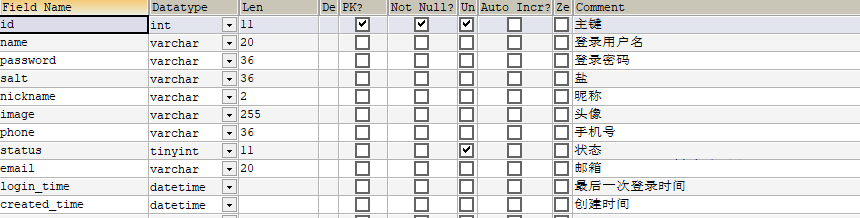


检查用户是否存在

检查用户状态是否有效

检查密码是否正确

修改最近登录时间

颁发token


对应实体类

```java
package com.heima.model.admin.pojos;
import com.baomidou.mybatisplus.annotation.IdType;
import com.baomidou.mybatisplus.annotation.TableField;
import com.baomidou.mybatisplus.annotation.TableId;
import com.baomidou.mybatisplus.annotation.TableName;
import lombok.Data;
import java.io.Serializable;
import java.util.Date;

/**
 * <p>
 * 管理员用户信息表
 * </p>
 *
 * @author itheima
 */
@Data
@TableName("ad_user")
public class AdUser implements Serializable {
    private static final long serialVersionUID = 1L;
    /**
     * 主键
     */
    @TableId(value = "id",type = IdType.AUTO)
    private Integer id;
    /**
     * 登录用户名
     */
    @TableField("name")
    private String name;
    /**
     * 登录密码
     */
    @TableField("password")
    private String password;
    /**
     * 盐
     */
    @TableField("salt")
    private String salt;

    /**
     * 昵称
     */
    @TableField("nickname")
    private String nickname;

    /**
     * 头像
     */
    @TableField("image")
    private String image;

    /**
     * 手机号
     */
    @TableField("phone")
    private String phone;

    /**
     * 状态
            0 暂时不可用
            1 永久不可用
            9 正常可用
     */
    @TableField("status")
    private Integer status;

    /**
     * 邮箱
     */
    @TableField("email")
    private String email;

    /**
     * 最后一次登录时间
     */
    @TableField("login_time")
    private Date loginTime;

    /**
     * 创建时间
     */
    @TableField("created_time")
    private Date createdTime;

}
```

### 9.1 接口定义

在heima-leadnews-apis中新建:com.heima.api.admin.LoginControllerApi

```java
package com.heima.apis.admin;
import com.heima.model.admin.dtos.AdUserDto;
import com.heima.model.common.dtos.ResponseResult;
public interface LoginControllerApi {
    /**
     * admin登录功能
     * @param dto
     * @return
     */
    public ResponseResult login(AdUserDto dto);
}
```

AdUserDto

```java
package com.heima.model.admin.dtos;
import lombok.Data;
@Data
public class AdUserDto {
    //用户名
    private String name;
    //密码
    private String password;
}
```

### 7.2 mapper

```java
package com.heima.admin.mapper;
import com.baomidou.mybatisplus.core.mapper.BaseMapper;
import com.heima.model.admin.pojos.AdUser;
public interface AdUserMapper extends BaseMapper<AdUser> {
}
```

### 7.3 业务层代码

```java
package com.itheima.admin.service;
import com.baomidou.mybatisplus.extension.service.IService;
import com.heima.model.admin.dtos.AdUserDto;
import com.heima.model.admin.pojos.AdUser;
import com.heima.model.common.dtos.ResponseResult;
public interface AdUserService extends IService<AdUser> {
    /**
     * 登录功能
     * @param dto
     * @return
     */
    ResponseResult login(AdUserDto dto);
}
```

实现类：

```java
package com.heima.admin.service.impl;
import com.baomidou.mybatisplus.core.toolkit.Wrappers;
import com.baomidou.mybatisplus.extension.service.impl.ServiceImpl;
import com.heima.admin.mapper.AdUserMapper;
import com.heima.admin.service.AdUserService;
import com.heima.model.admin.dtos.AdUserDto;
import com.heima.model.admin.pojos.AdUser;
import com.heima.model.admin.vo.AdUserVo;
import com.heima.model.common.dtos.ResponseResult;
import com.heima.model.common.enums.AppHttpCodeEnum;
import com.heima.utils.common.AppJwtUtil;
import org.apache.commons.lang3.StringUtils;
import org.springframework.beans.BeanUtils;
import org.springframework.stereotype.Service;
import org.springframework.util.DigestUtils;
import java.util.Date;
import java.util.HashMap;
import java.util.Map;
/**
 * @作者 itcast
 * @创建日期 2021/4/9 19:57
 **/
@Service
public class AdUserServiceImpl extends ServiceImpl<AdUserMapper, AdUser> implements AdUserService {
    @Override
    public ResponseResult login(AdUserDto dto) {
        //1. 参数校验
        if(dto == null || StringUtils.isBlank(dto.getName())||StringUtils.isBlank(dto.getPassword())){
            return ResponseResult.errorResult(AppHttpCodeEnum.PARAM_INVALID);
        }
        //2. 基于用户名查询用户信息
        AdUser user = getOne(Wrappers.<AdUser>lambdaQuery().eq(AdUser::getName, dto.getName()));
        //3. 如果用户不存在 返回错误
        if(user == null){
            return ResponseResult.errorResult(AppHttpCodeEnum.DATA_NOT_EXIST);
        }
        if(user.getStatus() != 9 ){
            return ResponseResult.errorResult(AppHttpCodeEnum.LOGIN_STATUS_INVALID);
        }
        //4. 如果用户存在对比密码
        String pwd = user.getPassword();
        String inputPwd = DigestUtils.md5DigestAsHex((dto.getPassword() + user.getSalt()).getBytes());
        if(!pwd.equalsIgnoreCase(inputPwd)){
            return ResponseResult.errorResult(AppHttpCodeEnum.LOGIN_PASSWORD_ERROR);
        }
        //5. 修改用户最近登录时间
        user.setLoginTime(new Date());
        updateById(user);
        //6. 生成token
        String token = AppJwtUtil.getToken(Long.valueOf(user.getId()));
        Map resultMap = new HashMap<>();
        AdUserVo userVo = new AdUserVo();
        BeanUtils.copyProperties(user,userVo);
        resultMap.put("user",userVo);
        resultMap.put("token",token);
        //7. 返回结果
        return ResponseResult.okResult(resultMap);
    }
}
```

封装vo对象，返回登录用户信息

```java
package com.heima.model.admin.vo;
import lombok.Data;
import java.util.Date;
@Data
public class AdUserVo {
    private Integer id;
    private String name;
    private String nickname;
    private String image;
    private String phone;
    private Integer status;
    private String email;
    private Date loginTime;
    private Date createdTime;
}
```


### 9.4 控制层代码

```java
package com.heima.admin.controller.v1;
import com.heima.admin.service.AdUserService;
import com.heima.apis.admin.LoginControllerApi;
import com.heima.model.admin.dtos.AdUserDto;
import com.heima.model.common.dtos.ResponseResult;
import org.springframework.beans.factory.annotation.Autowired;
import org.springframework.web.bind.annotation.PostMapping;
import org.springframework.web.bind.annotation.RequestBody;
import org.springframework.web.bind.annotation.RequestMapping;
import org.springframework.web.bind.annotation.RestController;
@RestController
@RequestMapping("/login")
public class LoginController implements LoginControllerApi {
    @Autowired
    private AdUserService adUserService;
    @PostMapping("/in")
    @Override
    public ResponseResult login(@RequestBody AdUserDto dto) {
        return adUserService.login(dto);
    }
}
```

### 7.5 测试

在表中创建一个用户guest，使用以下代码生成密码后修改表中的密码

```java
String salt = "123456";
String pswd = "guest"+salt;
String saltPswd = DigestUtils.md5DigestAsHex(pswd.getBytes());
System.out.println(saltPswd);
//34e20b52f5bd120db806e57e27f47ed0
```

生成密码后的结果为：

salt:123456

password:34e20b52f5bd120db806e57e27f47ed0

username:guest

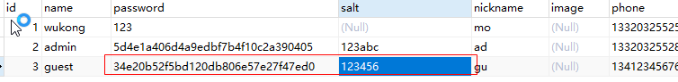

接口工具测试，或者页面直接登录测试

## 作业

### admin端-用户注册

需求：完成后端管理控制台用户注册

> 要求：用户的密码加密规则是：MD5（密码 + salt）,主键自增

#### 9.1.1 接口定义

在heima-leadnews-apis中com.heima.api.admin.LoginControllerApi定义新增方法

```java
/**
 * 注册功能
 * @param adUser 用户实体对象
 * @return
 */
@ApiOperation("后端注册")
public ResponseResult register(AdUser adUser);
```

#### 9.1.2 mapper

```java
public interface AdUserMapper extends BaseMapper<AdUser> {
}
```

#### 9.1.3 业务层

1）定义接口

```java
/**
 * 后端用户注册
 * @param user
 * @return
 */
public ResponseResult register(AdUser user);
```

2）编写实现类

```java
	/**
     * 后端用户注册
     * @param user
     * @return
     */
    @Override
    public ResponseResult register(AdUser user) {
        //1.参数校验
        if (StringUtils.isEmpty(user.getName())
                || StringUtils.isEmpty(user.getPassword())) {
            return ResponseResult.errorResult(AppHttpCodeEnum.PARAM_INVALID, "用户名或密码不能为空");
        }
        // 业务处理
        // 用户的密码加密规则是：MD5（密码 + salt）
        String salt = RandomStringUtils.randomAlphanumeric(8);
        String password = user.getPassword();
        user.setPassword( DigestUtils.md5DigestAsHex((password + salt).getBytes()) );
        user.setSalt(salt);
        user.setCreatedTime(new Date());
        user.setStatus(9);
        save(user);
        return ResponseResult.okResult(AppHttpCodeEnum.SUCCESS);
    }
```

#### 9.1.4 控制层

```java
/**
 * 注册功能
 * @param adUser 用户实体对象
 * @return
 */
@PostMapping("register")
public ResponseResult register(@RequestBody AdUser adUser) {
    return userService.register(adUser);
}
```

#### 9.1.5 启动服务测试

```json
// 测试数据
{
  "name": "admins",
  "password": "123456",
  "nickname": "ad",
  "phone": "13320325528",
  "email": "guest@qq.com"
}
```

**注意:** ad_user表中的id未被设置成主键 注意设置下

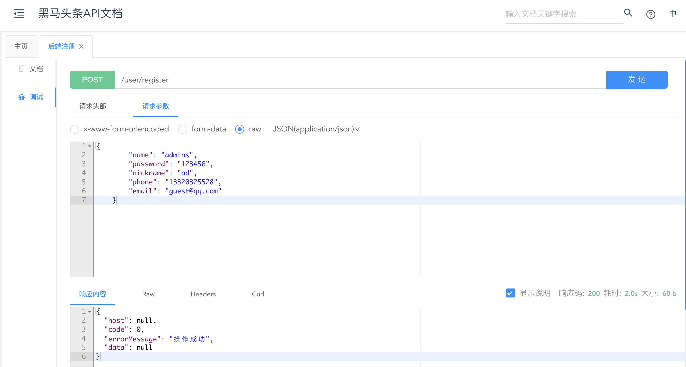

**使用新的用户名登录测试**