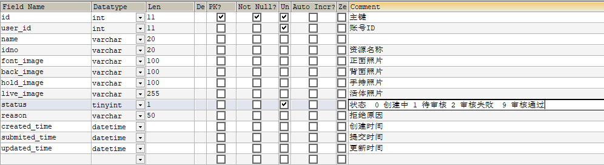

#  第三章 app端用户认证

## 今日目标

- 能够完成网关统一鉴权的功能

- 能够完成认证用户列表查询
- 能够熟悉app端用户认证审核流程
- 能够完成app用户审核代码开发

## 1 网关校验jwt

### 1.1 全局过滤器实现jwt校验


思路分析：

1. 用户进入网关开始登陆，网关过滤器进行判断，如果是登录，则路由到后台管理微服务进行登录
2. 用户登录成功，后台管理微服务签发JWT TOKEN信息返回给用户
3. 用户再次进入网关开始访问，网关过滤器接收用户携带的TOKEN 
4. 网关过滤器解析TOKEN ，判断是否有权限，如果有，则放行，如果没有则返回未认证错误

在网关微服务中新建全局过滤器：

第一步，准备工具类

把heima-leadnews-utils模块中的AppJwtUtil类拷贝到网关模块下，如下图：


第二步，编写全局过滤器

```java
package com.heima.admin.gateway.filter;
/**
 * @Description: 认证过滤器
 * @Version: V1.0
 */
@Component
@Slf4j
public class AuthorizeFilter implements GlobalFilter, Ordered {
    @Override
    public Mono<Void> filter(ServerWebExchange exchange, GatewayFilterChain chain) {
        //1 判断当前是否是登录请求，如果是登录则放行
        ServerHttpRequest request = exchange.getRequest();
        ServerHttpResponse response = exchange.getResponse();
        String reqUrl = request.getURI().getPath();
        if (reqUrl.contains("/login/in")) {
            return chain.filter(exchange);
        }
        //2 获取请求头jwt token信息
        String jwtToken = request.getHeaders().getFirst("token");
        if(StringUtils.isEmpty(jwtToken)){
            //如果不存在，向客户端返回错误提示信息
            response.setStatusCode(HttpStatus.UNAUTHORIZED);
            return response.setComplete();
        }
        //3 判断令牌信息是否正确
        try {
            Claims claims = AppJwtUtil.getClaimsBody(jwtToken);
            //  -1：有效，0：有效，1：过期，2：过期
            int verifyToken = AppJwtUtil.verifyToken(claims);
            //3.1 如果不存在或失效，则拦截
            if (verifyToken > 0) {
                response.setStatusCode(HttpStatus.UNAUTHORIZED);
                return response.setComplete();
            }
            //3.2 解析JWT令牌信息
            Integer id = claims.get("id", Integer.class);
            log.info("header token id:{}, URL:{}", id, request.getURI().getPath());
            //4 将令牌信息传递到各个微服务
            ServerHttpRequest serverHttpRequest = request.mutate().
                    headers( httpHeaders ->{
                        httpHeaders.add("userId", String.valueOf(id));
                    } ).build();
            exchange.mutate().request(serverHttpRequest).build();
        } catch (Exception e) {
            e.printStackTrace();
            response.setStatusCode(HttpStatus.UNAUTHORIZED);
            return response.setComplete();
        }
        //5 返回结果
        return chain.filter(exchange);
    }
    @Override
    public int getOrder() {
        return 0;
    }
}
```

### 1.2 网关token校验测试

启动admin服务，继续访问其他微服务，会提示需要认证才能访问，这个时候需要在heads中设置设置token才能正常访问。

1. 用户名密码登录获取token

   

2. 访问其它微服务时携带 token信息

## 2 app端用户认证列表查询

### 2.1 需求分析


当用户在app前端进行了认证

ap_user_realname



对应的实体类：

```java
package com.heima.model.user.pojos;

/**
 * <p>
 * APP实名认证信息表
 * </p>
 *
 * @author itheima
 */
@Data
@TableName("ap_user_realname")
public class ApUserRealname implements Serializable {

    private static final long serialVersionUID = 1L;

    /**
     * 主键
     */
    @TableId(value = "id", type = IdType.AUTO)
    private Integer id;

    /**
     * 账号ID
     */
    @TableField("user_id")
    private Integer userId;

    /**
     * 用户名称
     */
    @TableField("name")
    private String name;

    /**
     * 资源名称
     */
    @TableField("idno")
    private String idno;

    /**
     * 正面照片
     */
    @TableField("font_image")
    private String fontImage;

    /**
     * 背面照片
     */
    @TableField("back_image")
    private String backImage;

    /**
     * 手持照片
     */
    @TableField("hold_image")
    private String holdImage;

    /**
     * 活体照片
     */
    @TableField("live_image")
    private String liveImage;

    /**
     * 状态
            0 创建中
            1 待审核
            2 审核失败
            9 审核通过
     */
    @TableField("status")
    private Short status;

    /**
     * 拒绝原因
     */
    @TableField("reason")
    private String reason;

    /**
     * 创建时间
     */
    @TableField("created_time")
    private Date createdTime;

    /**
     * 提交时间
     */
    @TableField("submited_time")
    private Date submitedTime;

    /**
     * 更新时间
     */
    @TableField("updated_time")
    private Date updatedTime;

}
```

### 2.2 新建user微服务

（1）`heima-leadnews-services` 下新建模块：`user-service`

- 定义包名
- 新建引导类  参考其他微服务创建
- pom文件引入，参考其他微服务


（3）在resources下新建application.yml

```yaml
server:
  port: 9002
spring:
  application:
    name: leadnews-user
  cloud:
    nacos:
      discovery:
        server-addr: 192.168.200.130:8848
  datasource:
    driver-class-name: com.mysql.jdbc.Driver
    url: jdbc:mysql://192.168.200.130:3306/leadnews_user?useUnicode=true&characterEncoding=UTF-8&serverTimezone=UTC
    username: root
    password: root
# 设置Mapper接口所对应的XML文件位置，如果你在Mapper接口中有自定义方法，需要进行该配置
mybatis-plus:
  mapper-locations: classpath*:mapper/*.xml
  # 设置别名包扫描路径，通过该属性可以给包中的类注册别名
  type-aliases-package: com.heima.model.user.pojos
```


### 2.3 接口定义

在`heima-leadnews-apis`模块中新增接口：`com.heima.api.user.ApUserRealnameControllerApi`

```java
package com.heima.api.user;

@Api(value = "APP端用户管理", tags = "APP端用户管理-user", description = "APP端用户管理 API")
public interface ApUserRealnameControllerApi {

    /**
     *按照状态查询用户认证列表
     * @param dto
     * @return
     */
    @ApiOperation("根据状态查询用户认证列表")
    public ResponseResult loadListByStatus(AuthDto dto);

}
```

**AuthDto**

```java
package com.heima.model.user.dtos;

import com.heima.model.common.dtos.PageRequestDto;
import lombok.Data;

@Data
public class AuthDto extends PageRequestDto {
    // 认证用户ID
    private Integer id;
    //驳回的信息
    private String msg;
    //状态
    private Short status;
}
```

### 2.4 mapper

在user微服务下新建mapper接口:`com.heima.user.mapper.ApUserRealnameMapper`

```java
package com.heima.user.mapper;

public interface ApUserRealnameMapper extends BaseMapper<ApUserRealname> {
}
```

### 2.5 业务层

新建业务层接口：`com.heima.user.service.ApUserRealnameService`

```java
package com.heima.user.service;

import com.baomidou.mybatisplus.extension.service.IService;
import com.heima.model.common.dtos.PageResponseResult;
import com.heima.model.user.dtos.AuthDto;
import com.heima.model.user.pojos.ApUserRealname;

public interface ApUserRealnameService extends IService<ApUserRealname> {

    /**
     * 根据状态查询需要认证相关的用户信息
     * @param dto
     * @return
     */
    ResponseResult loadListByStatus(AuthDto dto);

}
```

实现类：

```java
package com.heima.user.service.impl;


@Service
public class ApUserRealnameServiceImpl extends ServiceImpl<ApUserRealnameMapper, ApUserRealname> implements ApUserRealnameService {

    /**
     * 查询列表
     * @param dto
     * @return
     */
    @Override
    public ResponseResult loadListByStatus(AuthDto dto) {
        // 1 参数检查
        if (dto == null) {
            throw new CustomException(AppHttpCodeEnum.PARAM_INVALID);
        }
        dto.checkParam();

        // 2 条件查询
        Page<ApUserRealname> page = new Page<>(dto.getPage(), dto.getSize());
        LambdaQueryWrapper<ApUserRealname> lambdaQueryWrapper = new LambdaQueryWrapper();

        if (dto.getStatus() != null) {
            lambdaQueryWrapper.eq(ApUserRealname::getStatus, dto.getStatus());
        }

        IPage<ApUserRealname> resultPage = page(page, lambdaQueryWrapper);

        // 3 返回结果
        return PageResponseResult.page(dto.getPage(), dto.getSize(),
                (int) resultPage.getTotal(), resultPage.getRecords());
    }
}
```

### 2.6 控制层

```java
@RestController
@RequestMapping("/api/v1/auth")
public class ApUserRealnameController implements ApUserRealnameControllerApi {

    @Autowired
    private ApUserRealnameService userRealnameService;

    @PostMapping("/list")
    @Override
    public ResponseResult loadListByStatus(@RequestBody AuthDto dto){
        return userRealnameService.loadListByStatus(dto);
    }
}
```

### 2.7 测试

http://localhost:9002/doc.html


打开前端工程整合测试：http://localhost:8080/#/auth/index


## 3 app端用户认证后审核

### 3.1 需求分析


**流程说明**


- 在app端的个人中心用户可以实名认证，需要材料为：姓名、身份证号、身份证正面照、身份证反面照、手持照片、活体照片（通过**微笑、眨眼、张嘴、摇头、点头**等组合动作，确保操作的为真实活体人脸。），当用户提交审核后就到了后端让运营管理人员进行审核
- 平台运营端查看用户认证信息，进行审核，其中审核包括了用户身份审核，需要对接公安系统校验身份证信息
- 用户通过审核后需要开通自媒体账号**（该账号的用户名和密码与app一致）**
- 用户通过审核后需要在article中在作者表中新建一个作者信息

#### 3.1.1 实现步骤

三个角色（用户、自媒体、作者）对应的表分析：

* ap_user：用户表。普通阅读文章的用户。不发表文章可以不用实名认证。
* ap_user_realname：用户认证信息表。存放实名认证的用户信息，审核通过后可以发表文章数据。
* wm_user：自媒体用户信息表
* ap_author：文章作者信息表


1. admin后台点击审核按钮审核当前用户，传递ap_user_realname的id
2. user微服务接收到审核用户请求，按照资质条件审核
3. 如果审核通过则保存用户认证信息数据到ap_user_realname中
4. 再通过feign远程的调用wemedia微服务的新增自媒体用户接口，完成新增自媒体信息保存，**（该账号的用户名和密码与app一致）**
5. 再通过feign远程的调用article微服务的新增文章作者的接口，完成新增文章作者信息保存
6. 前端响应审核成功

### 3.2 自媒体服务-用户保存

#### 3.2.1 wemedia微服务搭建

（1）`heima-leadnews-services`下新建`wemedia-service`模块，引导类和pom配置参考其他微服务


（2）resources下新建application.yml

```yaml
server:
  port: 9004
spring:
  application:
    name: leadnews-wemedia
  cloud:
    nacos:
      discovery:
        server-addr: 192.168.200.129:8848
  datasource:
    driver-class-name: com.mysql.jdbc.Driver
    url: jdbc:mysql://192.168.200.129:3306/leadnews_wemedia?useUnicode=true&characterEncoding=UTF-8&serverTimezone=UTC
    username: root
    password: root
# 设置Mapper接口所对应的XML文件位置，如果你在Mapper接口中有自定义方法，需要进行该配置
mybatis-plus:
  mapper-locations: classpath*:mapper/*.xml
  # 设置别名包扫描路径，通过该属性可以给包中的类注册别名
  type-aliases-package: com.heima.model.media.pojo
```

#### 3.2.2 自媒体用户保存和按照用户名查询

wm_user 自媒体用户表


实体类：

```java
package com.heima.model.wemedia.pojos;
/**
 * <p>
 * 自媒体用户信息表
 * </p>
 *
 * @author itheima
 */
@Data
@TableName("wm_user")
public class WmUser implements Serializable {

    private static final long serialVersionUID = 1L;

    /**
     * 主键
     */
    @TableId(value = "id", type = IdType.AUTO)
    private Integer id;

    @TableField("ap_user_id")
    private Integer apUserId;

    /**
     * 登录用户名
     */
    @TableField("name")
    private String name;

    /**
     * 登录密码
     */
    @TableField("password")
    private String password;

    /**
     * 盐
     */
    @TableField("salt")
    private String salt;

    /**
     * 昵称
     */
    @TableField("nickname")
    private String nickname;

    /**
     * 头像
     */
    @TableField("image")
    private String image;

    /**
     * 归属地
     */
    @TableField("location")
    private String location;

    /**
     * 手机号
     */
    @TableField("phone")
    private String phone;

    /**
     * 状态
            0 暂时不可用
            1 永久不可用
            9 正常可用
     */
    @TableField("status")
    private Integer status;

    /**
     * 邮箱
     */
    @TableField("email")
    private String email;

    /**
     * 账号类型
            0 个人 
            1 企业
            2 子账号
     */
    @TableField("type")
    private Integer type;

    /**
     * 运营评分
     */
    @TableField("score")
    private Integer score;

    /**
     * 最后一次登录时间
     */
    @TableField("login_time")
    private Date loginTime;

    /**
     * 创建时间
     */
    @TableField("created_time")
    private Date createdTime;

}
```

（1）接口定义

在`heima-leadnews-apis`中新建接口：`com.heima.api.wemedia.WmUserControllerApi`

```java
package com.heima.api.wemedia;

import com.heima.model.wemedia.pojos.WmUser;
import io.swagger.annotations.ApiOperation;

@Api(value = "自媒体管理", tags = "自媒体管理-WmUser", description = "自媒体管理 API")
public interface WmUserControllerApi {

    /**
     * 保存自媒体用户
     * @param wmUser 
     * @return wmUser 需要主键返回
     */
    @ApiOperation("保存自媒体用户")
    public WmUser save(WmUser wmUser);

    /**
     * 根据登录名查询当前用户
     * @param name
     * @return
     */
    @ApiOperation("按照名称查询用户")
    public WmUser findByName(String name);
}
```

（2）mapper定义

新建接口`com.heima.wemedia.mapper.WmUserMapper`

```java
package com.heima.wemedia.mapper;
public interface WmUserMapper extends BaseMapper<WmUser> {
}
```

（3）业务层

新建接口：`com.heima.wemedia.service.WmUserService`

```java
package com.heima.wemedia.service;

import com.baomidou.mybatisplus.extension.service.IService;
import com.heima.model.wemedia.pojos.WmUser;
public interface WmUserService extends IService<WmUser> {
}
```

实现类：

```java
package com.heima.wemedia.service.impl;
import com.baomidou.mybatisplus.extension.service.impl.ServiceImpl;
import com.heima.model.wemedia.pojos.WmUser;
import com.heima.wemedia.mapper.WmUserMapper;
import com.heima.wemedia.service.WmUserService;
import org.springframework.stereotype.Service;
@Service
public class WmUserServiceImpl extends ServiceImpl<WmUserMapper, WmUser> implements WmUserService {
}
```

(4)控制层

```java
package com.heima.wemedia.controller.v1;

import com.baomidou.mybatisplus.core.toolkit.Wrappers;
import com.heima.apis.wemedia.WmUserControllerApi;
import com.heima.model.wemedia.pojos.WmUser;
import com.heima.wemedia.service.WmUserService;
import org.springframework.beans.factory.annotation.Autowired;
import org.springframework.web.bind.annotation.GetMapping;
import org.springframework.web.bind.annotation.PathVariable;
import org.springframework.web.bind.annotation.PostMapping;
import org.springframework.web.bind.annotation.RequestBody;
import org.springframework.web.bind.annotation.RequestMapping;
import org.springframework.web.bind.annotation.RestController;

/**
 * @Description:
 * @Version: V1.0
 */
@RestController
@RequestMapping("/api/v1/user")
public class WmUserController implements WmUserControllerApi {

    @Autowired
    private WmUserService wmUserService;

    @PostMapping("/save")
    @Override
    public WmUser save(@RequestBody WmUser wmUser) {
        wmUserService.save(wmUser);
        return wmUser;
    }
      @GetMapping("/findByName/{name}")
    @Override
    public WmUser findByName(@PathVariable("name") String name) {
        return wmUserService.getOne(Wrappers.<WmUser>lambdaQuery().eq(WmUser::getName, name));
    }
}
```

访问http://127.0.0.1:9004/doc.html测试

#### 3.2.3 feign远程接口定义

新建模块 `heima-leadnews-feign`，主要存放所有的远程访问的接口，并且实现自动化的配置。

（1）引入依赖

```xml
<dependencies>
    <dependency>
        <groupId>com.heima</groupId>
        <artifactId>heima-leadnews-model</artifactId>
        <version>1.0-SNAPSHOT</version>
    </dependency>
    <!--openfeign-->
    <dependency>
        <groupId>org.springframework.cloud</groupId>
        <artifactId>spring-cloud-starter-openfeign</artifactId>
    </dependency>
</dependencies>
```

（2）新建包`com.heima.feigns.wemedia`，定义`WemediaFeign`接口

```java
package com.heima.feigns.wemedia;

import com.heima.model.wemedia.pojos.WmUser;
import org.springframework.cloud.openfeign.FeignClient;
import org.springframework.web.bind.annotation.GetMapping;
import org.springframework.web.bind.annotation.PathVariable;
import org.springframework.web.bind.annotation.PostMapping;
import org.springframework.web.bind.annotation.RequestBody;

@FeignClient("leadnews-wemedia")
public interface WemediaFeign {
    @PostMapping("/api/v1/user/save")
    public WmUser save(@RequestBody WmUser wmUser);
    @GetMapping("/api/v1/user/findByName/{name}")
    public WmUser findByName(@PathVariable("name") String name);
}
```

（3）新建 `com.heima.config`包，并创建`HeimaFeignAutoConfiguration`配置类

```java
package com.heima.config;
import org.springframework.cloud.openfeign.EnableFeignClients;
import org.springframework.context.annotation.Configuration;
/**
 * @Description: 自动化配置类扫描 feign对应的接口
 * @Version: V1.0
 */
@Configuration
@EnableFeignClients(basePackages = "com.heima.feigns")
public class HeimaFeignAutoConfiguration {
}
```

（4）在resources目录下创建 META-INF 文件夹，并新建 `spring.factories` 文件

```properties
# Auto Configure
org.springframework.boot.autoconfigure.EnableAutoConfiguration=\
com.heima.config.HeimaFeignAutoConfiguration
```

### 3.3 文章服务-创建作者

#### 3.3.1 article微服务创建

(1) `heima-leadnews-services`下新建模块`article-service`,其中引导类和pom文件依赖参考其他微服务


（2）resources下新建application.yml

```yml
server:
  port: 9003
spring:
  application:
    name: leadnews-article
  cloud:
    nacos:
      discovery:
        server-addr: 192.168.200.129:8848
  datasource:
    driver-class-name: com.mysql.jdbc.Driver
    url: jdbc:mysql://192.168.200.129:3306/leadnews_article?useUnicode=true&characterEncoding=UTF-8&serverTimezone=UTC
    username: root
    password: root
# 设置Mapper接口所对应的XML文件位置，如果你在Mapper接口中有自定义方法，需要进行该配置
mybatis-plus:
  mapper-locations: classpath*:mapper/*.xml
  # 设置别名包扫描路径，通过该属性可以给包中的类注册别名
  type-aliases-package: com.heima.model.article.pojos
```

#### 3.3.2 查询作者和保存作者

ap_author  作者信息表


对应实体类：

```java
package com.heima.model.article.pojos;
import com.baomidou.mybatisplus.annotation.IdType;
import com.baomidou.mybatisplus.annotation.TableField;
import com.baomidou.mybatisplus.annotation.TableId;
import com.baomidou.mybatisplus.annotation.TableName;
import lombok.Data;
import java.io.Serializable;
import java.util.Date;
/**
 * <p>
 * APP文章作者信息表
 * </p>
 *
 * @author itheima
 */
@Data
@TableName("ap_author")
public class ApAuthor implements Serializable {

    private static final long serialVersionUID = 1L;

    /**
     * 主键
     */
    @TableId(value = "id", type = IdType.AUTO)
    private Integer id;

    /**
     * 作者名称
     */
    @TableField("name")
    private String name;

    /**
     * 0 爬取数据
            1 签约合作商
            2 平台自媒体人

     */
    @TableField("type")
    private Integer type;

    /**
     * 社交账号ID
     */
    @TableField("user_id")
    private Integer userId;

    /**
     * 创建时间
     */
    @TableField("created_time")
    private Date createdTime;

    /**
     * 自媒体账号
     */
    @TableField("wm_user_id")
    private Integer wmUserId;
}
```

(1) 接口定义：`com.heima.api.article.AuthorControllerApi`

```java
package com.heima.apis.article;
import com.heima.model.article.ApAuthor;
import com.heima.model.common.dtos.ResponseResult;
public interface AuthorControllerApi {
    /**
     *根据用户id查询作者信息
     * @param userId
     * @return
     */
    public ApAuthor findByUserId(Integer userId);
    /**
     * 保存作者
     * @param apAuthor
     * @return
     */
    public ResponseResult save(ApAuthor apAuthor);
}
```

(2)mapper接口

新建mapper接口：`com.heima.article.mapper.AuthorMapper`

```java
package com.heima.article.mapper;
import com.baomidou.mybatisplus.core.mapper.BaseMapper;
import com.heima.model.article.pojos.ApAuthor;
public interface AuthorMapper extends BaseMapper<ApAuthor> {
}
```

(3)业务层

新建接口：com.heima.article.service.AuthorService

```java
package com.heima.article.service;

import com.baomidou.mybatisplus.extension.service.IService;
import com.heima.model.article.pojos.ApAuthor;

public interface AuthorService extends IService<ApAuthor> {
}
```

实现类：

```java
package com.heima.article.service.impl;

import com.baomidou.mybatisplus.extension.service.impl.ServiceImpl;
import com.heima.article.mapper.AuthorMapper;
import com.heima.article.service.AuthorService;
import com.heima.model.article.pojos.ApAuthor;
import org.springframework.stereotype.Service;

@Service
public class AuthorServiceImpl extends ServiceImpl<AuthorMapper, ApAuthor> implements AuthorService {
}
```

(4) 控制层

新建控制器：com.heima.article.controller.AuthorController

```java
package com.heima.article.controller.v1;

import com.baomidou.mybatisplus.core.toolkit.Wrappers;
import com.heima.apis.article.AuthorControllerApi;
import com.heima.article.service.AuthorService;
import com.heima.model.article.pojos.ApAuthor;
import com.heima.model.common.dtos.ResponseResult;
import com.heima.model.common.enums.AppHttpCodeEnum;
import org.springframework.beans.factory.annotation.Autowired;
import org.springframework.web.bind.annotation.*;

@RestController
@RequestMapping("/api/v1/author")
public class AuthorController implements AuthorControllerApi {

    @Autowired
    private AuthorService authorService;

    @GetMapping("/findByUserId/{userId}")
    @Override
    public ApAuthor findByUserId(@PathVariable("userId") Integer userId) {
        return authorService.getOne(Wrappers.<ApAuthor>lambdaQuery().eq(ApAuthor::getUserId, userId));
    }

    @PostMapping("/save")
    @Override
    public ResponseResult save(@RequestBody ApAuthor apAuthor) {
        authorService.save(apAuthor);
        return ResponseResult.okResult(AppHttpCodeEnum.SUCCESS);
    }
}
```

访问http://127.0.0.1:9003/doc.html测试

#### 3.3.3 feign远程接口定义

新建 com.heima.feigns.article 包，并且创建 ArticleFeign 接口

```java
package com.heima.feigns.article;
import com.heima.model.article.pojos.ApAuthor;
import com.heima.model.common.dtos.ResponseResult;
import org.springframework.cloud.openfeign.FeignClient;
import org.springframework.web.bind.annotation.GetMapping;
import org.springframework.web.bind.annotation.PathVariable;
import org.springframework.web.bind.annotation.PostMapping;
import org.springframework.web.bind.annotation.RequestBody;
@FeignClient("leadnews-article")
public interface ArticleFeign {
    @GetMapping("/api/v1/author/findByUserId/{userId}")
    public ApAuthor findByUserId(@PathVariable("userId") Integer userId);
    @PostMapping("/api/v1/author/save")
    public ResponseResult save(@RequestBody ApAuthor apAuthor);
}
```

### 3.4 用户服务-认证审核用户

#### 3.4.1 用户审核接口定义

修改`com.heima.api.user.ApUserRealnameControllerApi`新增方法

```java
	/**
     * 审核通过
     * @param dto
     * @return
     */
public ResponseResult authPass(AuthDto dto) ;

	/**
     * 审核失败
     * @param dto
     * @return
     */
public ResponseResult authFail(AuthDto dto);
```

#### 3.4.2 用户审核mapper接口定义

在新建自媒体账户时需要把apuser信息赋值给自媒体用户

app端用户信息表


在`heima-leadnews-model`中新增实体类

```java
package com.heima.model.user.pojos;
import com.baomidou.mybatisplus.annotation.IdType;
import com.baomidou.mybatisplus.annotation.TableField;
import com.baomidou.mybatisplus.annotation.TableId;
import com.baomidou.mybatisplus.annotation.TableName;
import lombok.Data;
import java.io.Serializable;
import java.util.Date;
/**
 * <p>
 * APP用户信息表
 * </p>
 * @author itheima
 */
@Data
@TableName("ap_user")
public class ApUser implements Serializable {
    private static final long serialVersionUID = 1L;
    /**
     * 主键
     */
    @TableId(value = "id", type = IdType.AUTO)
    private Integer id;
    /**
     * 密码、通信等加密盐
     */
    @TableField("salt")
    private String salt;
    /**
     * 用户名
     */
    @TableField("name")
    private String name;
    /**
     * 密码,md5加密
     */
    @TableField("password")
    private String password;

    /**
     * 手机号
     */
    @TableField("phone")
    private String phone;

    /**
     * 头像
     */
    @TableField("image")
    private String image;

    /**
     * 0 男
            1 女
            2 未知
     */
    @TableField("sex")
    private Boolean sex;

    /**
     * 0 未
            1 是
     */
    @TableField("is_certification")
    private Boolean certification;

    /**
     * 是否身份认证
     */
    @TableField("is_identity_authentication")
    private Boolean identityAuthentication;

    /**
     * 0正常
       1锁定
     */
    @TableField("status")
    private Boolean status;

    /**
     * 0 普通用户
            1 自媒体人
            2 大V
     */
    @TableField("flag")
    private Short flag;

    /**
     * 注册时间
     */
    @TableField("created_time")
    private Date createdTime;

}
```

在`user-service`模块中新增mapper接口

```java
package com.heima.user.mapper;
public interface ApUserMapper extends BaseMapper<ApUser> {
}
```

#### 3.4.3 用户审核业务层

新建常量类：com.heima.common.constants.admin.AdminConstants

```java
package com.heima.model.common.constants.admin;
public class AdminConstants {
    public static final Short WAIT_AUTH = 1;
    public static final Short PASS_AUTH = 9;
    public static final Short FAIL_AUTH = 2;
    public static final Integer AUTHOR_TYPE = 2; // 自媒体用户
}
```

修改：ApUserRealnameService 新增修改状态方法

```java
    /**
     * 根据状态进行审核
     * @param dto
     * @param status  2 审核失败   9 审核成功
     * @return
     */
    ResponseResult updateStatusById(AuthDto dto, Short status);
```

实现类：

```java
	@Autowired
    ApUserMapper apUserMapper;
    /**
     * 实名认证审核
     * 2 审核失败   9 审核成功
     */
    @Override
    public ResponseResult updateStatusById(AuthDto dto, Short status) {
        // 1. 检查参数
        if(dto == null || dto.getId() == null){
            throw new CustomException(AppHttpCodeEnum.PARAM_INVALID);
        }
        // 2. 根据ID查询实名认证信息
        ApUserRealname userRealname = getById(dto.getId());
        if(userRealname == null){
            throw new CustomException(AppHttpCodeEnum.PARAM_INVALID);
        }
        // 3. 判断实名认证状态是否为待审核
        if(userRealname.getStatus().intValue()!=1){
            throw new CustomException(AppHttpCodeEnum.DATA_STATUS_ERROR);
        }
        // 4. 查询实名认证用户关联的ap_user信息
        ApUser apUser = apUserMapper.selectById(userRealname.getUserId());
        if(apUser == null){
            throw new CustomException(AppHttpCodeEnum.DATA_NOT_EXIST,"关联用户信息不存在");
        }
        // 5. 更新实名认证信息
        userRealname.setStatus(status);
        userRealname.setUpdatedTime(new Date());
        if(StringUtils.isNotBlank(dto.getMsg())){
            userRealname.setReason(dto.getMsg());
        }
        updateById(userRealname);
        // 6. 如果 审核结果为 通过(9) 生成自媒体账号，生成作者信息
        if(status.intValue() == AdminConstants.AD_USER_ISSTATUS){
            WmUser wmUser = createWmUser(dto,apUser);
            if(wmUser == null){
                throw new CustomException(AppHttpCodeEnum.SERVER_ERROR,"创建自媒体用户失败");
            }
            createAuthor(wmUser);
        }
        // 7. 当前用户为自媒体人
        apUser.setFlag((short)1);
        apUser.setIdentityAuthentication(true);// 身份认证通过
        apUserMapper.insert(apUser);
        return ResponseResult.okResult();
    }
    @Autowired
    ArticleFeign articleFeign;
    /**
     * 创建作者信息
     * @param wmUser
     */
    private void createAuthor(WmUser wmUser) {
        ApAuthor author = articleFeign.findByUserId(wmUser.getApUserId());
        if(author!=null){
            throw new CustomException(AppHttpCodeEnum.DATA_EXIST,"作者信息已经存在");
        }
        author = new ApAuthor();
        author.setName(wmUser.getName());
        author.setType(2);
        author.setUserId(wmUser.getApUserId());
        author.setCreatedTime(new Date());
        author.setWmUserId(wmUser.getId());
        articleFeign.save(author);
    }
    @Autowired
    WemediaFeign wemediaFeign;
    /**
     * 创建自媒体用户
     * @param dto
     * @param apUser
     * @return
     */
    private WmUser createWmUser(AuthDto dto, ApUser apUser) {
        WmUser wmUser = wemediaFeign.findByName(apUser.getName());
        if(wmUser!=null){
            throw new CustomException(AppHttpCodeEnum.DATA_EXIST,"自媒体用户已经存在");
        }
        wmUser = new WmUser();
        wmUser.setApUserId(apUser.getId());
        wmUser.setName(apUser.getName());
        wmUser.setPassword(apUser.getPassword());
        wmUser.setSalt(apUser.getSalt());
        wmUser.setImage(apUser.getImage());
        wmUser.setPhone(apUser.getPhone());
        wmUser.setStatus(AdminConstants.AD_USER_ISSTATUS);
        wmUser.setType(0);
        wmUser.setCreatedTime(new Date());
        return wemediaFeign.save(wmUser);
    }
```

#### 3.4.4 用户审核控制层

修改ApUserRealnameController类，新增方法

```java
@PostMapping("/authPass")
@Override
public ResponseResult authPass(@RequestBody AuthDto dto) {
  return userRealnameService.updateStatusById(dto, AdminConstants.PASS_AUTH);
}

@PostMapping("/authFail")
@Override
public ResponseResult authFail(@RequestBody AuthDto dto) {
  return userRealnameService.updateStatusById(dto, AdminConstants.FAIL_AUTH);
}
```

#### 3.4.5 测试

步骤：

（1）修改网关配置

在`admin-gateway`模块中的`application.yml`文件中新增以下配置

```yaml
- id: user
  uri: lb://leadnews-user
  predicates:
  - Path=/user/**
  filters:
  - StripPrefix= 1
```


（2）数据准备

在leadnews-user库中ap_user表中新增一条数据


ap_user_realname表中新增一条数据，注意user_id字段要与ap_user表中对应


```sql
-- 1、新增APP端用户
INSERT INTO `leadnews_user`.`ap_user`( `salt`, `name`, `password`, `phone`, `image`, `sex`, `is_certification`, `is_identity_authentication`, `status`, `flag`, `created_time`) 
VALUES ('123abc', 'shitheima', '251b57454f0c600aa20a51ab03756845', '13511223454', '1111', 1, NULL, NULL, 0, 0, '2020-12-19 23:22:07');

-- 2、新增提交认证的APP用户 （保存ap_user后把user_id对应的值改了） 
INSERT INTO `leadnews_user`.`ap_user_realname`(`user_id`, `name`, `idno`, `font_image`, `back_image`, `hold_image`, `live_image`, `status`, `reason`, `created_time`, `submited_time`) 
VALUES (7, 'shitheima', '512335455602781279', 'rBENvl05FnaAM6J1AAaGax3lKLo443.jpg', '', 'rBENvl05Bb-ASsfdAAMSUGkiBP4475.png', 'rBENvl04UoSAQBnVAAB43XPvV6s47.jpeg', 1, '', '2020-11-11 17:21:18', '2020-12-11 17:21:20');
```


（3）启动工程清单

1. nacos
2. heima-leadnews-admin
3. heima-leadnews-admin-gateway
4. heima-leadnews-article
5. heima-leadnews-user
6. heima-leadnews-wemedia

（4）post测试或打开前端页面测试

第一：登录操作

url:http://localhost:6001/admin/login/in

param:`{"name":"admin","password":"123456"}`


第二，用户审核通过操作

url:http://localhost:6001/user/api/v1/auth/authPass

需要添加header头信息，token


请求完成以后在leadnews_wemedia库中的wm_user表中新增了一条自媒体用户数据

在leadnews_article库中的ap_author表中新增了一条作者数据
