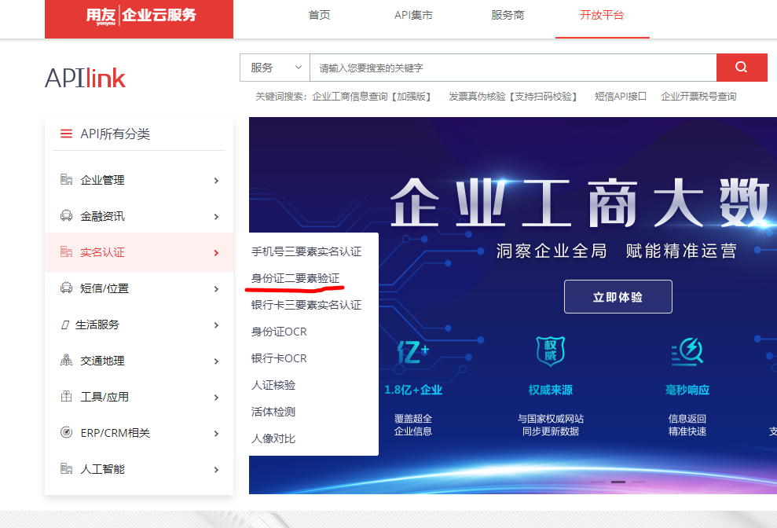
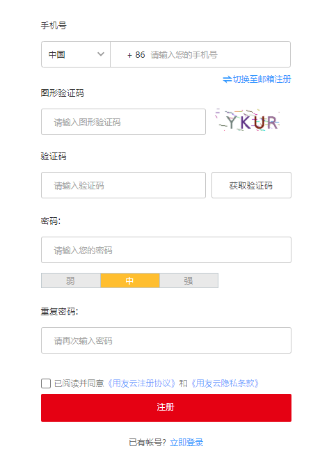
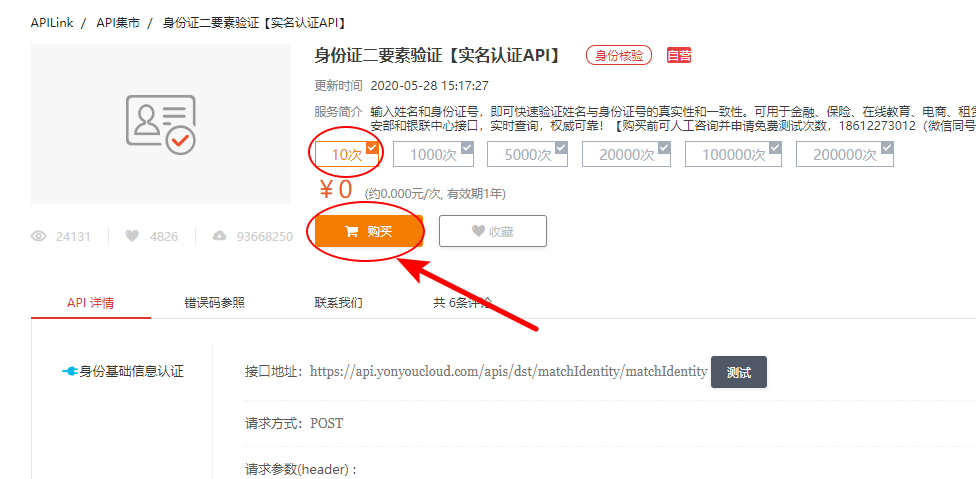
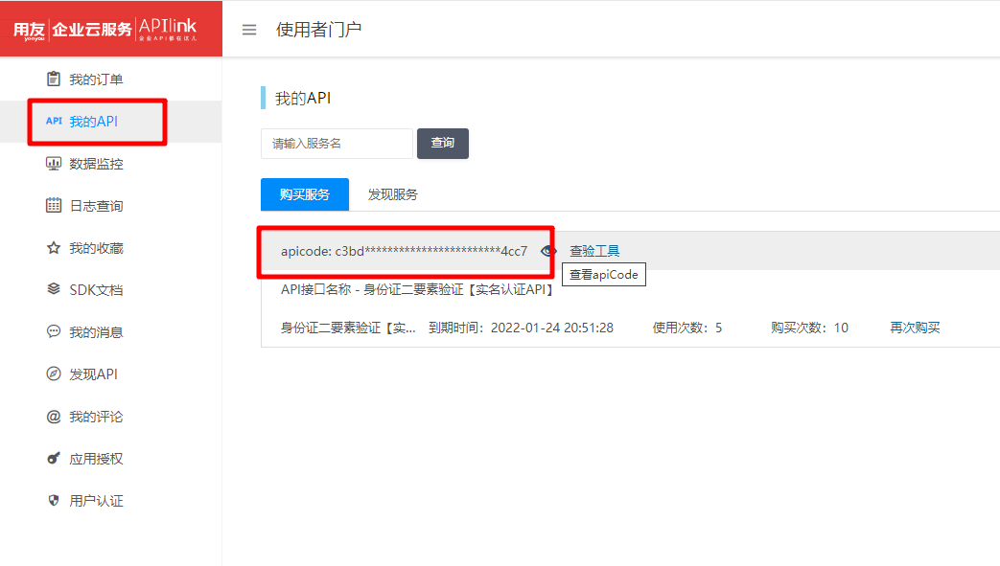
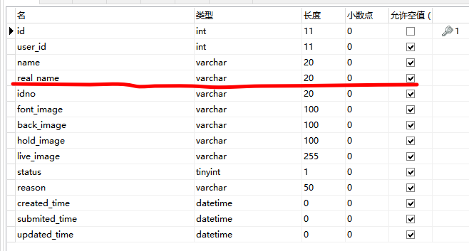
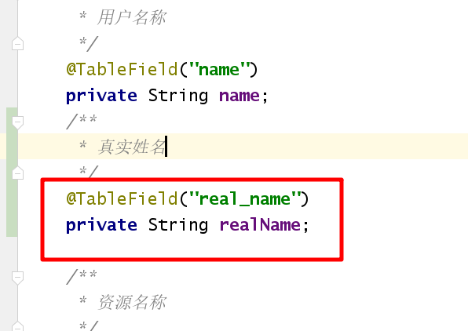

### 用户身份审核

- 平台运营端查看用户认证信息，进行审核，其中审核包括了用户身份审核，需要对接公安系统校验身份证信息， 而公安系统校验身份的接口不对外提供调用，只有专门的合作机构才可以进行调用。  这里我们使用**用友云**提供的实名认证服务来进行实名认证。

##### 用友实名认证介绍

**用友云:** https://api.yonyoucloud.com/apilink/#/



认证方式选择: 用友实名认证提供了多种认证方案，如 活体认证，身份证识别扫描等等

我们这里选择 **身份证二要素验证**,   用户输入  姓名  、身份证号 后调用公安系统身份信息是否正确


##### **API密钥申请:**

1.注册用友账号并登陆



2.购买使用次数 (可试用10次)



3. 查看密钥apicode



4.下载调用demo , demo我已经修改 拷贝下面内容即可 

  将第三部的apicode 添加到下面工具类中

```java
package com.heima.utils.common;
import com.alibaba.fastjson.JSONObject;
import org.apache.commons.lang3.StringUtils;

import java.io.BufferedReader;
import java.io.IOException;
import java.io.InputStream;
import java.io.InputStreamReader;
import java.io.OutputStream;
import java.io.UnsupportedEncodingException;
import java.net.HttpURLConnection;
import java.net.URL;
import java.net.URLEncoder;
import java.util.HashMap;
import java.util.Map;

import javax.net.ssl.HostnameVerifier;
import javax.net.ssl.HttpsURLConnection;
import javax.net.ssl.SSLSession;

public class IdCardUtils {
    public static final String DEF_CHATSET = "UTF-8";
    public static final int DEF_CONN_TIMEOUT = 30000;
    public static final int DEF_READ_TIMEOUT = 30000;
    public static String userAgent =  "Mozilla/5.0 (Windows NT 6.1) AppleWebKit/537.36 (KHTML, like Gecko) Chrome/29.0.1547.66 Safari/537.36";

    public static final HostnameVerifier DO_NOT_VERIFY = new HostnameVerifier() {
        public boolean verify(String hostname, SSLSession session) {
            return true;
        }
    };
    //配置您申请的KEY
    public static final String APICODE ="替换成自己的密钥";

    //1.API方法
    public static boolean checkIdCardInfo(String name,String idcard){
        if (StringUtils.isEmpty(name)||StringUtils.isEmpty(idcard)){
            throw new RuntimeException("姓名或密码不能为空");
        }
        String result =null;
        String url ="https://api.yonyoucloud.com/apis/dst/matchIdentity/matchIdentity";//请求接口地址
        String method = "POST";
        String paramFormat = "form";
        Map<String, Object> params = new HashMap<String, Object>();//请求参数
        params.put("idNumber", idcard);
        params.put("userName", name);
        Map<String, Object> headerParams = new HashMap<String, Object>();//请求头参数
        headerParams.put("apicode", APICODE);//APICODE
        headerParams.put("Content-Type", "application/json");
        try {
            result = net(url, params, headerParams, method, paramFormat);
            Map map = JSONObject.parseObject(result,Map.class);
            System.out.println(map);
            //{"success":true,"code":400100,"message":"一致"}
            return Boolean.valueOf(String.valueOf(map.get("success")));
        } catch (Exception e) {
            e.printStackTrace();
        }
        return false;
    }
    /**
     *
     * @param strUrl 请求地址
     * @param params 请求参数
     * @param method 请求方法
     * @return  网络请求字符串
     * @throws Exception
     */
    public static String net(String strUrl, Map<String,Object> params, Map<String,Object> headerParams,String method, String paramFormat) throws Exception {
        HttpURLConnection conn = null;
        BufferedReader reader = null;
        String rs = null;
        try {
            String contentType = null;
            if(headerParams.containsKey("Content-Type"))
                contentType = headerParams.get("Content-Type").toString();
            StringBuffer sb = new StringBuffer();
            if(method==null || method.equals("GET")){
                strUrl = strUrl+"?"+urlencode(params);
            }
            trustAllHttpsCertificates();
            HttpsURLConnection.setDefaultHostnameVerifier(DO_NOT_VERIFY);
            URL url = new URL(strUrl);
            conn = (HttpURLConnection) url.openConnection();
            if(method==null || method.equals("GET")){
                conn.setRequestMethod("GET");
            }else{
                conn.setRequestMethod("POST");
                conn.setDoOutput(true);
            }
            conn.setRequestProperty("User-agent", userAgent);
            for (String i : headerParams.keySet()) {
                conn.setRequestProperty(i, headerParams.get(i).toString());
            }
            if("form".equals(paramFormat) && !"application/x-www-form-urlencoded".equals(contentType) && !"application/xml".equals(contentType)) {
                conn.setRequestProperty("Content-Type", "application/json;charset=utf-8");
            }
            conn.setUseCaches(false);
            conn.setConnectTimeout(DEF_CONN_TIMEOUT);
            conn.setReadTimeout(DEF_READ_TIMEOUT);
            conn.setInstanceFollowRedirects(false);
            conn.connect();
            if (params!= null && method.equals("POST")) {
                try {
                    OutputStream out = conn.getOutputStream();
                    if("form".equals(paramFormat)) {
                        if("application/x-www-form-urlencoded".equals(contentType))
                            out.write(urlencode(params).getBytes("utf-8"));
                        else if("application/xml".equals(contentType))
                            out.write(xmlencode(params).getBytes("utf-8"));
                        else
                            out.write(jsonencode(params).getBytes("utf-8"));
                    } else
                        out.write(params.toString().getBytes("utf-8"));

                } catch (Exception e) {
                    e.printStackTrace();
                }
            }
            InputStream is = conn.getInputStream();
            reader = new BufferedReader(new InputStreamReader(is, DEF_CHATSET));
            String strRead = null;
            while ((strRead = reader.readLine()) != null) {
                sb.append(strRead);
            }
            rs = sb.toString();
        } catch (IOException e) {
            e.printStackTrace();
        } finally {
            if (reader != null) {
                reader.close();
            }
            if (conn != null) {
                conn.disconnect();
            }
        }
        return rs;
    }
    //将map型转为请求参数型
    public static String urlencode(Map<String,Object>data) {
        StringBuilder sb = new StringBuilder();
        for (Map.Entry i : data.entrySet()) {
            try {
                if(("").equals(i.getKey())) {
                    sb.append(URLEncoder.encode(i.getValue()+"","UTF-8"));
                } else {
                    sb.append(i.getKey()).append("=").append(URLEncoder.encode(i.getValue()+"","UTF-8")).append("&");
                }
            } catch (UnsupportedEncodingException e) {
                e.printStackTrace();
            }
        }
        return sb.toString();
    }

    //将map型转为请求参数型
    public static String jsonencode(Map<String,Object>data) {
        JSONObject jparam = new JSONObject();
        for (Map.Entry i : data.entrySet())
            jparam.put(String.valueOf(i.getKey()), i.getValue());
        return jparam.toString();
    }
    //将map型转为请求参数型
    public static String xmlencode(Map<String,Object>data) {
        StringBuffer xmlData = new StringBuffer();
        xmlData.append("<?xml version=\"1.0\" encoding=\"UTF-8\"?>");
        for (Map.Entry i : data.entrySet())
            xmlData.append("<" + i.getKey() + ">" + i.getValue() + "</" + i.getKey() + ">");
        return xmlData.toString();
    }
    static class miTM implements javax.net.ssl.TrustManager, javax.net.ssl.X509TrustManager {
        public java.security.cert.X509Certificate[] getAcceptedIssuers() {
            return null;
        }
        public boolean isServerTrusted(java.security.cert.X509Certificate[] certs) {
            return true;
        }
        public boolean isClientTrusted(java.security.cert.X509Certificate[] certs) {
            return true;
        }
        public void checkServerTrusted(java.security.cert.X509Certificate[] certs, String authType)
                throws java.security.cert.CertificateException {
            return;
        }
        public void checkClientTrusted(java.security.cert.X509Certificate[] certs, String authType)
                throws java.security.cert.CertificateException {
            return;
        }
    }

    private static void trustAllHttpsCertificates() throws Exception {
        javax.net.ssl.TrustManager[] trustAllCerts = new javax.net.ssl.TrustManager[1];
        javax.net.ssl.TrustManager tm = new miTM();
        trustAllCerts[0] = tm;
        javax.net.ssl.SSLContext sc = javax.net.ssl.SSLContext.getInstance("SSL");
        sc.init(null, trustAllCerts, null);
        javax.net.ssl.HttpsURLConnection.setDefaultSSLSocketFactory(sc.getSocketFactory());
    }
//    public static void main(String[] args) {
//        IdCardUtils.checkIdCardInfo("姓名","身份证号");
//    }
}
```


##### 整合到项目中:

1. 修改数据库字段及实体类

​    数据库中的实名认证表ap_user_realname并没有提供真实姓名字段，添加 read_name字段



实体类中添加对应字段




2. 审核方法中加入实名认证身份信息检查

   ```java
   private void createWmUserAndAuthor(AuthDto dto) {
       ApUserRealname aur = getById(dto.getId());
       // 调用公安部实名认证接口，识别该用户身份信息是否正确
       boolean checkIdcard = IdCardUtils.checkIdCardInfo(aur.getRealName(), aur.getIdno());
       if (!checkIdcard){
           throw new CustomException(ResponseResult.errorResult(AppHttpCodeEnum.PARAM_INVALID,"用户身份证信息错误"));
       }
       
       ........ 略
   }
   ```