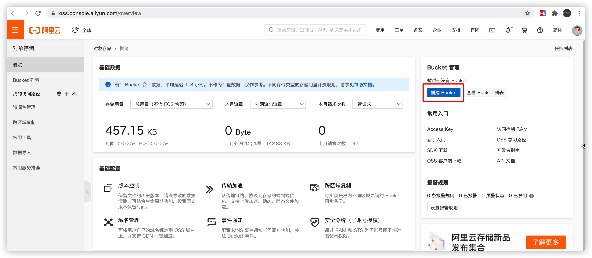

# 第四章 分布式事务&自媒体素材管理

## 今日目标

- 能够理解什么是分布式事务

- 能够理解CAP定理和BASE理论

- 能够掌握seata要解决的问题
- 能够完成seata集成到项目中使用
- 能够掌握阿里云存储OSS的使用
- 能够完成素材管理功能

  

##  1 分布式事务解决方案    

我们昨天编写的用户认证审核的代码服务中存在的，如果审核完用户后出了异常是不会回滚的，这样就会造成数据不一致的情况，这其实就是我们所说的**分布式事务的问题**，接下来我们来学习分布式事务的解决方案。

​		**详见: 分布式事务资料**

## 2 基于Seata实现分布式事务

### 2.1 Seata简介

**Simple Extensible Autonomous Transaction Architecture**，是一套一站式分布式事务解决方案

官网地址：http://seata.io/zh-cn/


- Seata用于解决分布式事务

- Seata非常适合解决微服务分布式事务【dubbo、SpringCloud....】

- Seata性能高

- Seata使用简单

### 2.3 Seata Server端环境准备

#### 2.3.1 Linux 本机 TC[Seata Server] 安装

**开发阶段基于 <font color="red">file</font> 模式**

（1）从官网上下载seata server端的程序包

下载地址：https://github.com/seata/seata/releases

官网下载：http://seata.io/zh-cn/blog/download.html


> https://hub.fastgit.org/seata 镜像网站

资料中已提供，解压

（2）修改配置

Seata的核心配置主要是两部分：

- 注册中心的配置：在`${seata_home}/conf/`目录中，一般是`registry.conf`文件
- 当前服务的配置，两种配置方式：
  - 通过分布式服务的统一配置中心，例如Zookeeper
  - 通过本地文件

**registry.conf 对应配置如下：**

```json
registry {
  # file 、nacos 、eureka、redis、zk、consul、etcd3、sofa
  # 指定注册中心类型，这里使用 file 类型
  type = "file"
  # 各种注册中心的配置
  nacos {
    application = "seata-server"
    serverAddr = "127.0.0.1:8848"
    group = "SEATA_GROUP"
    namespace = ""
    cluster = "default"
    username = ""
    password = ""
  }
  eureka {
    serviceUrl = "http://localhost:8761/eureka"
    application = "default"
    weight = "1"
  }
  redis {
    serverAddr = "localhost:6379"
    db = 0
    password = ""
    cluster = "default"
    timeout = 0
  }
  zk {
    cluster = "default"
    serverAddr = "127.0.0.1:2181"
    sessionTimeout = 6000
    connectTimeout = 2000
    username = ""
    password = ""
  }
  consul {
    cluster = "default"
    serverAddr = "127.0.0.1:8500"
  }
  etcd3 {
    cluster = "default"
    serverAddr = "http://localhost:2379"
  }
  sofa {
    serverAddr = "127.0.0.1:9603"
    application = "default"
    region = "DEFAULT_ZONE"
    datacenter = "DefaultDataCenter"
    cluster = "default"
    group = "SEATA_GROUP"
    addressWaitTime = "3000"
  }
  file {
    name = "file.conf"
  }
}
# 配置文件方式，可以支持 file、nacos 、apollo、zk、consul、etcd3
config {
  # file、nacos 、apollo、zk、consul、etcd3
  type = "file"

  nacos {
    serverAddr = "127.0.0.1:8848"
    namespace = ""
    group = "SEATA_GROUP"
    username = ""
    password = ""
  }
  consul {
    serverAddr = "127.0.0.1:8500"
  }
  apollo {
    appId = "seata-server"
    apolloMeta = "http://192.168.1.204:8801"
    namespace = "application"
  }
  zk {
    serverAddr = "127.0.0.1:2181"
    sessionTimeout = 6000
    connectTimeout = 2000
    username = ""
    password = ""
  }
  etcd3 {
    serverAddr = "http://localhost:2379"
  }
  file {
    name = "file.conf"
  }
}
```

这个文件主要配置两个内容：

- 注册中心的类型及地址，本例我们选择file做注册中心
- 配置中心的类型及地址，本例我们选择本地文件做配置，就是当前目录的`file.conf`文件


**file.conf 配置文件：**

```json
transport {
  # tcp udt unix-domain-socket
  type = "TCP"
  #NIO NATIVE
  server = "NIO"
  #enable heartbeat
  heartbeat = true
  #thread factory for netty
  thread-factory {
    boss-thread-prefix = "NettyBoss"
    worker-thread-prefix = "NettyServerNIOWorker"
    server-executor-thread-prefix = "NettyServerBizHandler"
    share-boss-worker = false
    client-selector-thread-prefix = "NettyClientSelector"
    client-selector-thread-size = 1
    client-worker-thread-prefix = "NettyClientWorkerThread"
    # netty boss thread size,will not be used for UDT
    boss-thread-size = 1
    #auto default pin or 8
    worker-thread-size = 8
  }
}

service {
  # 修改vgroup_mapping
  #vgroup->rgroup
  vgroup_mapping.heima_leadnews_tx_group = "default"
  
  #only support single node
  #修改连接TC Seata server 端地址
  default.grouplist = "192.168.200.129:8091"
  
  #degrade current not support
  enableDegrade = false
  #disable
  disable = false
}
## transaction log store, only used in seata-server
store {
  ## store mode: file、db、redis
  mode = "file"

  ## file store property
  file {
    ## store location dir
    dir = "sessionStore"
    # branch session size , if exceeded first try compress lockkey, still exceeded throws exceptions
    maxBranchSessionSize = 16384
    # globe session size , if exceeded throws exceptions
    maxGlobalSessionSize = 512
    # file buffer size , if exceeded allocate new buffer
    fileWriteBufferCacheSize = 16384
    # when recover batch read size
    sessionReloadReadSize = 100
    # async, sync
    flushDiskMode = async
  }

  ## database store property
  db {
    ## the implement of javax.sql.DataSource, such as DruidDataSource(druid)/BasicDataSource(dbcp)/HikariDataSource(hikari) etc.
    datasource = "druid"
    ## mysql/oracle/postgresql/h2/oceanbase etc.
    dbType = "mysql"
    driverClassName = "com.mysql.jdbc.Driver"
    url = "jdbc:mysql://127.0.0.1:3306/restkeeper_seata"
    user = "root"
    password = "root"
    minConn = 5
    maxConn = 30
    globalTable = "global_table"
    branchTable = "branch_table"
    lockTable = "lock_table"
    queryLimit = 100
    maxWait = 5000
  }

  ## redis store property
  redis {
    host = "127.0.0.1"
    port = "6379"
    password = ""
    database = "0"
    minConn = 1
    maxConn = 10
    queryLimit = 100
  }

}
```

**关键配置：**

- store：TC的服务端数据存储配置
  - mode：数据存储方式，支持两种：file和db
    - file：将数据存储在本地文件中，性能比较好，但不支持水平扩展
    - db：将数据保存在指定的数据库中，需要指定数据库连接信息

如果用文件作为存储介质，不需要其它配置了，直接运行即可。

但是如果使用[db](https://github.com/seata/seata/blob/develop/script/server/db/mysql.sql)作为存储介质，还需要在数据库中创建3张表：

```sql
-- the table to store GlobalSession data
CREATE TABLE IF NOT EXISTS `global_table`
(
    `xid`                       VARCHAR(128) NOT NULL,
    `transaction_id`            BIGINT,
    `status`                    TINYINT      NOT NULL,
    `application_id`            VARCHAR(32),
    `transaction_service_group` VARCHAR(32),
    `transaction_name`          VARCHAR(128),
    `timeout`                   INT,
    `begin_time`                BIGINT,
    `application_data`          VARCHAR(2000),
    `gmt_create`                DATETIME,
    `gmt_modified`              DATETIME,
    PRIMARY KEY (`xid`),
    KEY `idx_gmt_modified_status` (`gmt_modified`, `status`),
    KEY `idx_transaction_id` (`transaction_id`)
) ENGINE = InnoDB
  DEFAULT CHARSET = utf8;

-- the table to store BranchSession data
CREATE TABLE IF NOT EXISTS `branch_table`
(
    `branch_id`         BIGINT       NOT NULL,
    `xid`               VARCHAR(128) NOT NULL,
    `transaction_id`    BIGINT,
    `resource_group_id` VARCHAR(32),
    `resource_id`       VARCHAR(256),
    `branch_type`       VARCHAR(8),
    `status`            TINYINT,
    `client_id`         VARCHAR(64),
    `application_data`  VARCHAR(2000),
    `gmt_create`        DATETIME(6),
    `gmt_modified`      DATETIME(6),
    PRIMARY KEY (`branch_id`),
    KEY `idx_xid` (`xid`)
) ENGINE = InnoDB
  DEFAULT CHARSET = utf8;

-- the table to store lock data
CREATE TABLE IF NOT EXISTS `lock_table`
(
    `row_key`        VARCHAR(128) NOT NULL,
    `xid`            VARCHAR(96),
    `transaction_id` BIGINT,
    `branch_id`      BIGINT       NOT NULL,
    `resource_id`    VARCHAR(256),
    `table_name`     VARCHAR(32),
    `pk`             VARCHAR(36),
    `gmt_create`     DATETIME,
    `gmt_modified`   DATETIME,
    PRIMARY KEY (`row_key`),
    KEY `idx_branch_id` (`branch_id`)
) ENGINE = InnoDB
  DEFAULT CHARSET = utf8;
```

（3）启动server

到bin目录下执行脚本启动seata server端，注：windows下执行`seata-server.bat`启动；linux下执行`seata-server.sh`启动

<font color="red">**总结：**</font> 

如果设置的是 file模式，我们只需要修改 **file.conf 配置文件** 下的 service 节点的两部分：

服务集成 seata 需要修改：

1. 修改vgroup_mapping
2. 修改连接TC Seata server 端地址

其他的配置默认即可。


#### 2.3.2 Docker TC[Seata Server] 安装（推荐）

如果使用docker安装并且使用的是默认的 **file 模式**只需要运行docker命令即可：

```sh
docker run --name seata --restart=always -p 8091:8091 -e SEATA_IP=192.168.200.129 -e SEATA_PORT=8091 -id seataio/seata-server:1.3.0
```


### 2.4 项目集成seata

配置步骤参考[官网](https://hub.fastgit.org/seata/seata-samples/blob/master/doc/quick-integration-with-spring-cloud.md)

#### 2.4.1 创建日志表undo_log            

分别在leadnews_user、leadnews_article、leadnews_wemedia三个库中都创建undo_log表

**注意此处seata版本是0.7.0+ 增加字段 context**

```sql
CREATE TABLE `undo_log`
(
    `id`            BIGINT(20)   NOT NULL AUTO_INCREMENT,
    `branch_id`     BIGINT(20)   NOT NULL,
    `xid`           VARCHAR(100) NOT NULL,
    `context`       VARCHAR(128) NOT NULL,
    `rollback_info` LONGBLOB     NOT NULL,
    `log_status`    INT(11)      NOT NULL,
    `log_created`   DATETIME     NOT NULL,
    `log_modified`  DATETIME     NOT NULL,
    `ext`           VARCHAR(100) DEFAULT NULL,
    PRIMARY KEY (`id`),
    UNIQUE KEY `ux_undo_log` (`xid`, `branch_id`)
) ENGINE = InnoDB
  AUTO_INCREMENT = 1
  DEFAULT CHARSET = utf8;
```


#### 2.4.2 导入依赖包      

因为有多个工程都需要引入seata，在`heima-leadnews-basic`新建一个工程`autoconfiguration-seata`专门来处理分布式事务 

```xml
	<dependencies>
        <dependency>
            <groupId>com.baomidou</groupId>
            <artifactId>mybatis-plus-boot-starter</artifactId>
        </dependency>
        <dependency>
            <groupId>com.alibaba.cloud</groupId>
            <artifactId>spring-cloud-starter-alibaba-seata</artifactId>
        </dependency>
        <dependency>
            <groupId>io.seata</groupId>
            <artifactId>seata-all</artifactId>
            <version>1.3.0</version>
            <exclusions>
                <exclusion>
                    <groupId>com.alibaba</groupId>
                    <artifactId>druid</artifactId>
                </exclusion>
            </exclusions>
        </dependency>
        <dependency>
            <groupId>com.alibaba</groupId>
            <artifactId>druid</artifactId>
            <version>1.1.21</version>
        </dependency>
    </dependencies>
```

#### 2.4.3 创建代理数据源 

(1)因为多个工程都需要依赖与seata，所以在`autoconfiguration-seata`模块下创建seata的配置类

```java
package com.heima.seata.config;

import com.alibaba.druid.pool.DruidDataSource;
import com.baomidou.mybatisplus.autoconfigure.MybatisPlusProperties;
import com.baomidou.mybatisplus.core.MybatisConfiguration;
import com.baomidou.mybatisplus.core.parser.ISqlParser;
import com.baomidou.mybatisplus.extension.parsers.BlockAttackSqlParser;
import com.baomidou.mybatisplus.extension.plugins.PaginationInterceptor;
import com.baomidou.mybatisplus.extension.spring.MybatisSqlSessionFactoryBean;
import io.seata.rm.datasource.DataSourceProxy;
import org.apache.ibatis.plugin.Interceptor;
import org.mybatis.spring.transaction.SpringManagedTransactionFactory;
import org.springframework.boot.context.properties.ConfigurationProperties;
import org.springframework.boot.context.properties.EnableConfigurationProperties;
import org.springframework.context.annotation.Bean;
import org.springframework.context.annotation.Configuration;
import org.springframework.context.annotation.Primary;
import org.springframework.core.io.support.PathMatchingResourcePatternResolver;

import javax.sql.DataSource;
import java.util.ArrayList;
import java.util.List;

@Configuration
@EnableConfigurationProperties({MybatisPlusProperties.class})
public class DataSourcesProxyConfig {

    @Bean
    @ConfigurationProperties(prefix = "spring.datasource")
    public DataSource druidDataSource() {
        return new DruidDataSource();
    }
    //创建代理数据源

    @Primary//@Primary标识必须配置在代码数据源上，否则本地事务失效
    @Bean
    public DataSourceProxy dataSourceProxy(DataSource druidDataSource) {
        return new DataSourceProxy(druidDataSource);
    }

    private MybatisPlusProperties properties;

    public DataSourcesProxyConfig(MybatisPlusProperties properties) {
        this.properties = properties;
    }

    //替换SqlSessionFactory的DataSource
    @Bean
    public MybatisSqlSessionFactoryBean sqlSessionFactory(DataSourceProxy dataSourceProxy) throws Exception {

        // 这里必须用 MybatisSqlSessionFactoryBean 代替了 SqlSessionFactoryBean，否则 MyBatisPlus 不会生效
        MybatisSqlSessionFactoryBean mybatisSqlSessionFactoryBean = new MybatisSqlSessionFactoryBean();
        mybatisSqlSessionFactoryBean.setDataSource(dataSourceProxy);
        mybatisSqlSessionFactoryBean.setTransactionFactory(new SpringManagedTransactionFactory());

        mybatisSqlSessionFactoryBean.setMapperLocations(new PathMatchingResourcePatternResolver()
                .getResources("classpath*:/mapper/*.xml"));

        MybatisConfiguration configuration = this.properties.getConfiguration();
        if(configuration == null){
            configuration = new MybatisConfiguration();
        }
        mybatisSqlSessionFactoryBean.setConfiguration(configuration);


        // 设置分页插件****
        PaginationInterceptor paginationInterceptor = new PaginationInterceptor();
        List<ISqlParser> sqlParserList = new ArrayList<ISqlParser>();
        // 攻击 SQL 阻断解析器、加入解析链
        sqlParserList.add(new BlockAttackSqlParser());
        paginationInterceptor.setSqlParserList(sqlParserList);
        Interceptor[] plugins = { paginationInterceptor };
        mybatisSqlSessionFactoryBean.setPlugins( plugins );

        return mybatisSqlSessionFactoryBean;
    }
}
```

（2）在 resources 目录下创建 `META-INF/spring.factories` 配置文件

```properties
org.springframework.boot.autoconfigure.EnableAutoConfiguration=\
com.heima.seata.config.DataSourcesProxyConfig
```

#### 2.4.4 配置seata-server链接和注册中心信息

将上述讲解的**file.conf和registry.conf** 配置文件直接复制到 `autoconfiguration-seata`微服务的 resources 目录下。

具体结构如下：


#### 2.4.5 指定事务分组

分别在`article-serivce`、`user-serivce`、`wemedia-serivce`微服务中引入通用配置依赖

```xml
 <dependencies>
        <dependency>
            <artifactId>autoconfiguration-seata</artifactId>
            <groupId>com.heima</groupId>
            <version>1.0-SNAPSHOT</version>
        </dependency>
    </dependencies>
```


分别在`article-serivce`、`user-serivce`、`wemedia-serivce`微服务的application.yml文件中添加如下配置：

```yaml
spring:
  cloud:
    alibaba:
      seata:
        tx-service-group: heima_leadnews_tx_group
  autoconfigure:
    exclude: org.springframework.boot.autoconfigure.jdbc.DataSourceAutoConfiguration
```

* 配置 tx 事务分组名称需要和 `autoconfiguration-seata` 配置文件的分组保持一致
* 排除SpringBoot的 数据库的自动化配置类(seata中也引入了数据源，防止数据源冲突)


#### 2.4.6 添加注解@GlobalTransactional

在ApUserRealnameServiceImpl类的`updateStatusById`方法上加上`@GlobalTransactional`注解


#### 2.4.7 测试

对应的微服务启动成功后观察 seata server 日志：


（1）功能测试，看功能能否正常执行。

（2）异常测试，我们在方法中添加` int x=1/0`  ，看认证信息和自媒体用户是否能够回滚。


测试结果：


## 3 云存储解决方案-阿里云OSS 

### 3.1 阿里云OSS简介

​	阿里云对象存储服务（Object Storage Service，简称OSS）为您提供基于网络的数据存取服务。使用OSS，您可以通过网络随时存储和调用包括文本、图片、音频和视频等在内的各种非结构化数据文件。
阿里云OSS将数据文件以对象（object）的形式上传到存储空间（bucket）中。

​	您可以进行以下操作：

- 创建一个或者多个存储空间，向每个存储空间中添加一个或多个文件。
- 通过获取已上传文件的地址进行文件的分享和下载。
- 通过修改存储空间或文件的属性或元信息来设置相应的访问权限。
- 在阿里云管理控制台执行基本和高级OSS任务。
- 使用阿里云开发工具包或直接在应用程序中进行RESTful API调用执行基本和高级OSS任务

### 3.2 OSS开通 

（1）打开https://www.aliyun.com/ ，申请阿里云账号并完成实名认证。

（2）充值

（3）开通OSS:  登录阿里云官网。将鼠标移至产品找到并单击对象存储OSS打开OSS产品详情页面。在OSS产品详情页中的单击立即开通。开通服务后，在OSS产品详情页面单击管理控制台直接进入OSS管理控制台界面。您也可以单击位于官网首页右上方菜单栏的控制台，进入阿里云管理控制台首页，然后单击左侧的对象存储OSS菜单进入[OSS管理控制台界面](https://oss.console.aliyun.com/overview)。



（4）创建存储空间

新建Bucket，命名为 hmleadnews ，读写权限为**公共读**


创建文件目录：


### 3.3 OSS快速入门 

[参考文档官方](https://help.aliyun.com/document_detail/32009.html?spm=a2c4g.11186623.6.919.7c264562C2Fjfs)

（1）创建测试工程，引入依赖

```xml
<dependency>
  <groupId>com.aliyun.oss</groupId>
  <artifactId>aliyun-sdk-oss</artifactId>
  <version>3.10.2</version>
</dependency>
<dependency>
  <groupId>commons-logging</groupId>
  <artifactId>commons-logging</artifactId>
  <version>1.2</version>
</dependency>
```

（2）新建类和main方法

```java
public static void main(String[] args) throws Exception{
        // Endpoint以杭州为例，其它Region请按实际情况填写。
        String endpoint = "http://oss-cn-shanghai.aliyuncs.com";
        // 阿里云主账号AccessKey拥有所有API的访问权限，风险很高。
        String accessKeyId = "LTAI4G25HSmUJART11TivJaa";
        String accessKeySecret = "PTLWOlfEJNaaGnqBrZa0irPDaaKmGE";

        // 创建OSSClient实例。
        OSS ossClient = new OSSClientBuilder().build(endpoint, accessKeyId, accessKeySecret);

        // 上传Byte数组。
        FileInputStream inputStream = new FileInputStream("/Users/Ares/Desktop/1.png");
        PutObjectResult result = ossClient.putObject("hmleadnews", "material/a.jpg", inputStream);

        // 关闭OSSClient。
        ossClient.shutdown();
 }
```

### 3.4 OSS starter工具封装

（1）`heima-leadnews-basic` 模块，在当前模块下创建 `autoconfiguration-oss`子模块，

添加依赖

```xml
<dependencies>
  <dependency>
    <groupId>org.springframework.boot</groupId>
    <artifactId>spring-boot-autoconfigure</artifactId>
  </dependency>
  <!--OSS-->
  <dependency>
    <groupId>com.aliyun.oss</groupId>
    <artifactId>aliyun-sdk-oss</artifactId>
    <version>3.10.2</version>
  </dependency>
  <dependency>
    <groupId>com.google.guava</groupId>
    <artifactId>guava</artifactId>
         <version>21.0</version>
  </dependency>
  <dependency>
    <groupId>org.springframework.boot</groupId>
    <artifactId>spring-boot-starter</artifactId>
  </dependency>
  <dependency>
    <groupId>org.springframework.boot</groupId>
    <artifactId>spring-boot-configuration-processor</artifactId>
    <optional>true</optional>
  </dependency>
  <dependency>
    <groupId>org.springframework.boot</groupId>
    <artifactId>spring-boot-starter-actuator</artifactId>
  </dependency>
</dependencies>
```

（2）资料文件夹下导入service 和 config 包下的内容


（3）在`resources`目录下新建 `META-INF/spring.factories` 配置文件

```properties
org.springframework.boot.autoconfigure.EnableAutoConfiguration=\
  com.heima.file.service.impl.OSSAliyunFileStorageService
```

（4）`wemedia-service`  添加OSS配置

```yaml
#OSS配置
file:
  oss:
    bucket-name: heimaleadnews 
    access-key-id: <替换成自己的> 
    access-key-secret: <替换成自己的>
    endpoint: oss-cn-shanghai.aliyuncs.com
    web-site: <替换成自己的>
    proxy-username: aliyun-sdk-java
    socket-timeout: 10000
    idle-connection-time: 10000
    connection-request-timeout: 4000
    max-connections: 2048
    max-error-retry: 5
    white-list: 127.0.0.1
    connection-timeout: 10000
    profix: material
```

（5）在 `wemedia-service` 中新建测试类测试OSS工具类

```java
package com.heima.wemedia;

import com.heima.file.service.FileStorageService;
import org.junit.Test;
import org.junit.runner.RunWith;
import org.springframework.beans.factory.annotation.Autowired;
import org.springframework.beans.factory.annotation.Value;
import org.springframework.boot.test.context.SpringBootTest;
import org.springframework.test.context.junit4.SpringRunner;

/**
 * @Description:
 * @Version: V1.0
 */
@SpringBootTest(classes = WemediaApplication.class)
@RunWith(SpringRunner.class)
public class OssTest {

    @Autowired
    FileStorageService fileStorageService;

    @Value("${file.oss.bucket-name}")
    String bucketName;

    @Value("${file.oss.endpoint}")
    String endpoint;

    @Value("${file.oss.web-site}")
    String webSite;

    @Test
    public void testFileUpload() throws Exception {

//        FileInputStream inputStream = new FileInputStream(new File("/Users/Ares/Desktop/temp/banner1.jpg"));

//        String wemedia = fileStorageService.store("upload", "aaa1.jpg", inputStream);
//        System.out.println(webSite+wemedia);

        // 删除文件
        fileStorageService.delete("wemedia/2020/12/20201227/aaa1.jpg");
    }
}

```

## 4 自媒体管理

### 4.1 自媒体用户登录

自媒体登录操作与admin端登录思路是一样的

（1）自媒体登录接口定义

```java
package com.heima.api.wemedia;
import com.heima.model.common.dtos.ResponseResult;
import com.heima.model.media.pojos.WmUser;
import org.springframework.web.bind.annotation.RequestBody;
public interface LoginControllerApi {
    /**
     * 自媒体登录
     * @param dto
     * @return
     */
    public ResponseResult login(WmUserDto dto);
}
```

WmUserDto

```java
package com.heima.model.wemedia.dtos;
import lombok.Data;
@Data
public class WmUserDto {
    /**
     * 用户名
     */
    private String name;
    /**
     * 密码
     */
    private String password;
}
```

（1）业务层service

新增业务层接口

```java
package com.heima.wemedia.service;
import com.baomidou.mybatisplus.extension.service.IService;
import com.heima.model.common.dtos.ResponseResult;
import com.heima.model.media.pojos.WmUser;
public interface WmUserService extends IService<WmUser> {
    /**
     * 登录
     * @param dto
     * @return
     */
    public ResponseResult login(WmUserDto dto);
}
```

实现类：

```java
package com.heima.wemedia.service.impl;
import com.baomidou.mybatisplus.core.toolkit.Wrappers;
import com.baomidou.mybatisplus.extension.service.impl.ServiceImpl;
import com.heima.common.exception.CustomException;
import com.heima.model.common.constants.admin.AdminConstants;
import com.heima.model.common.dtos.ResponseResult;
import com.heima.model.common.enums.AppHttpCodeEnum;
import com.heima.model.wemedia.dtos.WmUserDto;
import com.heima.model.wemedia.pojos.WmUser;
import com.heima.utils.common.AppJwtUtil;
import com.heima.wemedia.mapper.WmUserMapper;
import com.heima.wemedia.service.WmUserService;
import org.apache.commons.lang3.StringUtils;
import org.springframework.stereotype.Service;
import org.springframework.util.DigestUtils;
import java.util.HashMap;
import java.util.List;
import java.util.Map;
@Service
public class WmUserServiceImpl extends ServiceImpl<WmUserMapper, WmUser> implements WmUserService {
    /**
     * 登录
     * @param dto
     * @return
     */
    @Override
    public ResponseResult login(WmUserDto dto) {
        //1.检查参数
        if (StringUtils.isEmpty(dto.getName()) || StringUtils.isEmpty(dto.getPassword())) {
            return ResponseResult.errorResult(AppHttpCodeEnum.PARAM_INVALID, "用户名或密码错误");
        }
        //2 查询自媒体用户
        List<WmUser> resultList = list(Wrappers.<WmUser>lambdaQuery()
                .eq(WmUser::getName, dto.getName())
                .eq(WmUser::getStatus, AdminConstants.PASS_AUTH.intValue()));
        if (resultList == null || resultList.size()==0) {
            throw new CustomException(AppHttpCodeEnum.DATA_NOT_EXIST);
        }
        //3 比对密码
        WmUser wmUser = resultList.get(0);
        String pswd = DigestUtils.md5DigestAsHex((dto.getPassword() + wmUser.getSalt()).getBytes());
        if (!wmUser.getPassword().equals(pswd)) {
            throw new CustomException(AppHttpCodeEnum.LOGIN_PASSWORD_ERROR);
        }
        //4 返回jwt结果
        Map<String, Object> map = new HashMap<>();
        map.put("token", AppJwtUtil.getToken(wmUser.getId().longValue()));
        wmUser.setPassword("");
        wmUser.setSalt("");
        map.put("user", wmUser);
        return  ResponseResult.okResult(map);
    }
}
```

（2）控制器controller

新增控制器

```java
package com.heima.wemedia.controller.v1;

import com.heima.api.wemedia.LoginControllerApi;
import com.heima.model.common.dtos.ResponseResult;
import com.heima.model.media.pojos.WmUser;
import com.heima.wemedia.service.WmUserService;
import org.springframework.beans.factory.annotation.Autowired;
import org.springframework.web.bind.annotation.PostMapping;
import org.springframework.web.bind.annotation.RequestBody;
import org.springframework.web.bind.annotation.RequestMapping;
import org.springframework.web.bind.annotation.RestController;

@RestController
@RequestMapping("/login")
public class LoginController implements LoginControllerApi {
    @Autowired
    private WmUserService wmUserService;
    @PostMapping("/in")
    @Override
    public ResponseResult login(@RequestBody WmUserDto dto){
        return wmUserService.login(dto);
    }
}
```

（3）无网关测试


### 4.2 自媒体网关和获取登录用户

（1）自媒体网关

上一次创建的admin平台管理的网关，自媒体端也有自己的网关，后边还需要创建app端的网关

自媒体网关与admin端网关几乎是一样的，可以参考admin端网关

①创建`wemedia-gateway`网关工程：pom文件如下


②从admin网关中把必要的类拷贝过来


③新增`application.yml`

```yaml
server:
  port: 6002
spring:
  application:
    name: leadnews-wemedia-gateway
  cloud:
    nacos:
      discovery:
        server-addr: 192.168.200.130:8848
    gateway:
      globalcors:
        cors-configurations:
          '[/**]': # 匹配所有请求
            allowedOrigins: "*" #跨域处理 允许所有的域
            allowedMethods: # 支持的方法
            - GET
            - POST
            - PUT
            - DELETE
      routes:
      # 平台管理
      - id: wemedia
        uri: lb://leadnews-wemedia
        predicates:
        - Path=/wemedia/**
        filters:
        - StripPrefix= 1
```

（2）获取登录用户思路分析

在去保存图片之前，需要先知道是哪一位自媒体人登录了当前系统，也就是需要确定哪个自媒体人上传了图片


**操作步骤：**

1. 上传图片需要携带token

2. 首先请求到网关服务，解析token是否有效，如果有效，解析后把用户数据设置到下一级请求的header中

3. 在自媒体微服务中使用过滤器解析header中的数据，拿到用户数据，使用threadlocal设置到当前线程中

4. 在具体业务代码中可以从当前线程threadlocal中获取用户


（3）获取登录用户

前面两步都已经实现，主要是在代码中实现后两步即可

1)添加工具类

在使用过滤器解析后的用户需要放在当前线程中，可以使用工具类来实现,

在`heima-leadnews-model`中`com.heima.utils.threadlocal`添加如下类,用于存储自媒体的用户登录信息

```java
package com.heima.utils.threadlocal;
import com.heima.model.admin.pojos.AdUser;
import com.heima.model.media.pojos.WmUser;
public class WmThreadLocalUtils {
    private final  static ThreadLocal<WmUser> userThreadLocal = new ThreadLocal<>();
    /**
     * 设置当前线程中的用户
     * @param user
     */
    public static void setUser(WmUser user){
        userThreadLocal.set(user);
    }
    /**
     * 获取线程中的用户
     * @return
     */
    public static WmUser getUser( ){
        return userThreadLocal.get();
    }
}
```

2)在`wemedia-service`自媒体微服务中使用过滤器解析header数据并设置到当前线程中

```java
package com.heima.wemedia.filter;

import com.heima.model.wemedia.pojos.WmUser;
import com.heima.utils.threadlocal.WmThreadLocalUtils;
import org.springframework.core.annotation.Order;
import org.springframework.web.filter.GenericFilterBean;
import javax.servlet.FilterChain;
import javax.servlet.ServletException;
import javax.servlet.ServletRequest;
import javax.servlet.ServletResponse;
import javax.servlet.annotation.WebFilter;
import javax.servlet.http.HttpServletRequest;
import javax.servlet.http.HttpServletResponse;
import java.io.IOException;
@Order(1)
@WebFilter(filterName = "wmTokenFilter",urlPatterns = "/*")
@Slf4j
@Component  // 扫描包
public class WmTokenFilter extends GenericFilterBean {
    @Override
    public void doFilter(ServletRequest servletRequest, ServletResponse servletResponse, FilterChain filterChain) throws IOException, ServletException {
        HttpServletRequest request = (HttpServletRequest) servletRequest;
        HttpServletResponse response = (HttpServletResponse) servletResponse;
        //得到header中的信息
        String userId = request.getHeader("userId");
        if(userId != null){
            WmUser wmUser = new WmUser();
            wmUser.setId(Integer.valueOf(userId));
            // 保存到当前线程中
            WmThreadLocalUtils.setUser(wmUser);
        }
        // 如果没有则直接放行
        filterChain.doFilter(request,response);
    }
}
```


### 4.3 素材管理

**效果演示:** http://heima-wemedia-java.itheima.net/#/material/list


#### 4.3.1 图片上传

##### 4.3.1.1 文件上传需求


上传图片到OSS，同时要保存一份数据到表中，方便后期管理

媒体图文素材信息表**wm_material**


对应实体类：

```java
package com.heima.model.wemedia.pojos;

import com.baomidou.mybatisplus.annotation.IdType;
import com.baomidou.mybatisplus.annotation.TableField;
import com.baomidou.mybatisplus.annotation.TableId;
import com.baomidou.mybatisplus.annotation.TableName;
import lombok.Data;

import java.io.Serializable;
import java.util.Date;

/**
 * <p>
 * 自媒体图文素材信息表
 * </p>
 *
 * @author itheima
 */
@Data
@TableName("wm_material")
public class WmMaterial implements Serializable {

    private static final long serialVersionUID = 1L;

    /**
     * 主键
     */
    @TableId(value = "id", type = IdType.AUTO)
    private Integer id;

    /**
     * 自媒体用户ID
     */
    @TableField("user_id")
    private Integer userId;

    /**
     * 图片地址
     */
    @TableField("url")
    private String url;

    /**
     * 素材类型
            0 图片
            1 视频
     */
    @TableField("type")
    private Short type;

    /**
     * 是否收藏
     */
    @TableField("is_collection")
    private Short isCollection;

    /**
     * 创建时间
     */
    @TableField("created_time")
    private Date createdTime;

}
```

##### 4.3.1.2 接口定义

在`heima-leadnews-apis`中定义接口：`com.heima.api.wemedia.MaterialManageControllerApi`

```java
package com.heima.api.wemedia;
import com.heima.model.common.dtos.ResponseResult;
import org.springframework.web.multipart.MultipartFile;
public interface WmMaterialControllerApi {
    /**
     * 上传图片
     * @param multipartFile
     * @return
     */
    ResponseResult uploadPicture(MultipartFile multipartFile);

}
```

`MultipartFile` 会提示不存在 ，添加下面以来即可

```xml
<dependency>
    <groupId>org.springframework</groupId>
    <artifactId>spring-webmvc</artifactId>
    <scope>provided</scope>
</dependency>
```

##### 4.3.1.3 定义mapper

新建接口：`com.heima.wemedia.mapper.WmMaterialMapper`

```java
package com.heima.wemedia.mapper;

import com.baomidou.mybatisplus.core.mapper.BaseMapper;
import com.heima.model.media.pojos.WmMaterial;
import org.apache.ibatis.annotations.Mapper;
public interface WmMaterialMapper extends BaseMapper<WmMaterial> {
}
```

##### 4.3.1.4 定义service

新建接口：`com.heima.wemedia.service.MaterialService`

```java
package com.heima.wemedia.service;
import com.baomidou.mybatisplus.extension.service.IService;
import com.heima.model.common.dtos.ResponseResult;
import com.heima.model.media.pojos.WmMaterial;
import org.springframework.web.multipart.MultipartFile;
public interface WmMaterialService extends IService<WmMaterial> {
    /**
     * 上传图片接口
     * @param multipartFile
     * @return
     */
    ResponseResult uploadPicture(MultipartFile multipartFile);
}
```

实现类：

```java
package com.heima.wemedia.service.impl;

import com.baomidou.mybatisplus.extension.service.impl.ServiceImpl;
import com.heima.common.exception.CustomException;
import com.heima.file.service.FileStorageService;
import com.heima.model.common.dtos.ResponseResult;
import com.heima.model.common.enums.AppHttpCodeEnum;
import com.heima.model.wemedia.pojos.WmMaterial;
import com.heima.model.wemedia.pojos.WmUser;
import com.heima.utils.threadlocal.WmThreadLocalUtils;
import com.heima.wemedia.mapper.WmMaterialMapper;
import com.heima.wemedia.service.WmMaterialService;
import lombok.extern.slf4j.Slf4j;
import org.springframework.beans.factory.annotation.Autowired;
import org.springframework.beans.factory.annotation.Value;
import org.springframework.stereotype.Service;
import org.springframework.web.multipart.MultipartFile;

import java.io.IOException;
import java.util.Date;
import java.util.UUID;

@Service
@Slf4j
public class WmMaterialServiceImpl extends ServiceImpl<WmMaterialMapper, WmMaterial> implements WmMaterialService {
    @Autowired
    FileStorageService fileStorageService;
    @Value("${file.oss.profix}")
    String profix;
    @Value("${file.oss.endpoint}")
    String endpoint;
    @Value("${file.oss.web-site}")
    String webSite;
    @Override
    public ResponseResult<WmMaterial> uploadPicture(MultipartFile multipartFile) {
        // 1 参数校验
        if (multipartFile == null || multipartFile.getSize() == 0) {
            throw new CustomException(AppHttpCodeEnum.FILE_UPLOAD_PARAMREQUIRE_ERROR);
        }
        // 2 上传到oss
        String fileId = null;
        try {
            String filename = UUID.randomUUID().toString().replace("-", "");
            String originalFilename = multipartFile.getOriginalFilename();
            String sufix = originalFilename.substring(originalFilename.lastIndexOf("."));

            fileId = fileStorageService.store(profix, filename+postfix, multipartFile.getInputStream());
            log.info("fileId: {}",fileId);
        } catch (IOException e) {
            e.printStackTrace();
            log.error("WmMaterialServiceImpl uploadPicture error: {}", e);
            throw new CustomException(AppHttpCodeEnum.FILE_UPLOAD_ERROR);
        }
        // 3 封装数据并保持到素材库中
        WmMaterial wmMaterial = new WmMaterial();
        wmMaterial.setIsCollection((short)0);
        wmMaterial.setType((short)0);
        wmMaterial.setCreatedTime(new Date());
        // 设置文件id
        wmMaterial.setUrl(fileId);
        // 当前线程中获取用户ID
        WmUser user = WmThreadLocalUtils.getUser();
        if (user == null) {
            throw new CustomException(AppHttpCodeEnum.NO_OPERATOR_AUTH);
        }
        wmMaterial.setUserId(user.getId());
        save(wmMaterial);
				// 前端显示
				wmMaterial.setUrl(webSite+fileId);
        // 4 返回结果
        return ResponseResult.okResult(wmMaterial);
    }
}
```

##### 4.3.1.5 控制层

```java
package com.heima.wemedia.controller.v1;

import com.heima.api.wemedia.MaterialManageControllerApi;
import com.heima.model.common.dtos.ResponseResult;
import com.heima.wemedia.service.MaterialService;
import org.springframework.beans.factory.annotation.Autowired;
import org.springframework.web.bind.annotation.PostMapping;
import org.springframework.web.bind.annotation.RequestMapping;
import org.springframework.web.bind.annotation.RestController;
import org.springframework.web.multipart.MultipartFile;

@RestController
@RequestMapping("/api/v1/material")
public class WmMaterialController implements WmMaterialControllerApi {
    @Autowired
    private WmMaterialService materialService;

    @PostMapping("/upload_picture")
    @Override
    public ResponseResult uploadPicture(MultipartFile file) {
        return materialService.uploadPicture(file);
    }

}
```

##### 4.3.1.6 测试

启动清单：

1. naocs
2. WemediaGatewayApplication 网关
3. WemediaApplication 自媒体服务


使用postman测试，需要先登录设置token后再操作


#### 4.3.2 素材列表加载


1. 素材列表查询，前台有可能给传一个条件 是否收藏  0 不收藏  1 收藏
2. 只能查询当前登录用户上传的素材
3. 按照发布时间 降序排序
4. 返回的结果 ， 图片需要加上前缀访问路径

##### 4.3.2.1 接口定义

在 `com.heima.api.wemedia.WmMaterialControllerApi` 中新增方法

```java
/**
     * 素材列表
     * @param dto
     * @return
     */
ResponseResult findList(WmMaterialDto dto);
```

WmMaterialDto

```java
package com.heima.model.media.dtos;

import com.heima.model.common.dtos.PageRequestDto;
import lombok.Data;

@Data
public class WmMaterialDto extends PageRequestDto {
        Short isCollection; //1 查询收藏的   0: 未收藏
}
```

##### 4.3.2.2 定义service

在`com.heima.wemedia.service.WmMaterialService`类中新增方法

```java
/**
     * 素材列表查询
     * @param dto
     * @return
     */
ResponseResult findList(WmMaterialDto dto);
```

实现类：

```java
@Override
public ResponseResult findList(WmMaterialDto dto) {
  // 1 参数校验
  dto.checkParam();
  // 2 执行业务查询
  LambdaQueryWrapper<WmMaterial> wrapper = new LambdaQueryWrapper<>();
  // 收藏
  if (dto.getIsCollection() != null && dto.getIsCollection() == 1) {
     wrapper.eq(WmMaterial::getIsCollection, dto.getIsCollection());
  }
  // 当前登录用户的素材
  WmUser user = WmThreadLocalUtils.getUser();
  if (user == null) {
    throw new CustomException(AppHttpCodeEnum.NO_OPERATOR_AUTH);
  }
  wrapper.eq(WmMaterial::getUserId, user.getId());

  // 时间倒序
  wrapper.orderByDesc(WmMaterial::getCreatedTime);
  IPage<WmMaterial> pageParam = new Page<>(dto.getPage(), dto.getSize());
  IPage<WmMaterial> resultPage = page(pageParam, wrapper);

  // 处理图片
  List<WmMaterial> wmMaterials = resultPage.getRecords();
  for (WmMaterial wmMaterial : wmMaterials) {
    wmMaterial.setUrl(webSite + wmMaterial.getUrl());
  }
  // 3 封装结果
  PageResponseResult pageResponseResult = new PageResponseResult(dto.getPage(), dto.getSize(),
                (int) resultPage.getTotal());
  pageResponseResult.setData(wmMaterials);
  return pageResponseResult;
}
```

##### 4.3.2.3 控制层

在`com.heima.wemedia.controller.v1.WmMaterialController`新增方法

```java
@PostMapping("/list")
@Override
public ResponseResult findList(@RequestBody WmMaterialDto dto) {
    return materialService.findList(dto);
}
```

##### 4.3.2.4 测试

使用postman测试，需要先登录设置token后再操作


也可打开前端工程进行测试

#### 4.3.3 图片删除

##### 4.3.3.1 接口定义

> 1 根据素材id删除图片
>
> 2 如果当前图片被引用，则不能删除

一旦该图片被引用会在这个表中插入数据，用作素材与文章的关联

wm_news_material （自媒体图文引用素材信息表）


对应实体类：

```java
package com.heima.model.wemedia.pojos;

import com.baomidou.mybatisplus.annotation.IdType;
import com.baomidou.mybatisplus.annotation.TableField;
import com.baomidou.mybatisplus.annotation.TableId;
import com.baomidou.mybatisplus.annotation.TableName;
import lombok.Data;

import java.io.Serializable;

/**
 * <p>
 * 自媒体图文引用素材信息表
 * </p>
 *
 * @author itheima
 */
@Data
@TableName("wm_news_material")
public class WmNewsMaterial implements Serializable {

    private static final long serialVersionUID = 1L;

    /**
     * 主键
     */
    @TableId(value = "id", type = IdType.AUTO)
    private Integer id;

    /**
     * 素材ID
     */
    @TableField("material_id")
    private Integer materialId;

    /**
     * 图文ID
     */
    @TableField("news_id")
    private Integer newsId;

    /**
     * 引用类型
            0 内容引用
            1 主图引用
     */
    @TableField("type")
    private Short type;

    /**
     * 引用排序
     */
    @TableField("ord")
    private Short ord;

}
```

在`com.heima.api.wemedia.WmMaterialControllerApi`中新增方法

```java
/**
     * 删除图片
     * @param wmMaterial
     * @return
     */
ResponseResult delPicture(Integer id);
```


##### 4.3.3.2 持久层mapper

新建mapper接口：`com.heima.wemedia.mapper.WmNewsMaterialMapper`

```java
package com.heima.wemedia.mapper;
import com.baomidou.mybatisplus.core.mapper.BaseMapper;
import com.heima.model.media.pojos.WmNewsMaterial;
import org.apache.ibatis.annotations.Mapper;
public interface WmNewsMaterialMapper extends BaseMapper<WmNewsMaterial> {
}
```

##### 4.3.3.3 业务层代码

在`com.heima.wemedia.service.WmMaterialService`类中新增方法

```java
/**
     * 删除图片
     * @param id
     * @return
     */
ResponseResult delPicture(Integer id);
```

实现类：

```java

@Autowired
private WmNewsMaterialMapper wmNewsMaterialMapper;

/**
     * 删除素材
     * @param id
     * @return
     */
@Override
public ResponseResult delPicture(Integer id) {
  // 1 参数校验
  if (id == null) {
    throw new CustomException(AppHttpCodeEnum.PARAM_INVALID);
  }
  // 2 业务处理
  // 判断当前id是否被引用，如果被使用则禁止删除
  WmMaterial wmMaterial = getById(id);
  if(wmMaterial == null){
    throw new CustomException(AppHttpCodeEnum.DATA_NOT_EXIST);
  }
  LambdaQueryWrapper<WmNewsMaterial> wrapper = new LambdaQueryWrapper<>();
  wrapper.eq(WmNewsMaterial::getMaterialId, id);
  Integer count = wmNewsMaterialMapper.selectCount(wrapper);
  if(count > 0){
    throw new CustomException( AppHttpCodeEnum.FILE_DELETE_ERROR);
  }
  // 删除图片OSS
  fileStorageService.delete(wmMaterial.getUrl());
  // 删除素材库
  removeById(id);
  // 3 封装结果
  return ResponseResult.okResult(AppHttpCodeEnum.SUCCESS);
}
```

##### 4.3.3.4 控制层

在`com.heima.wemedia.controller.v1.WmMaterialController`中新增方法

```java
@GetMapping("/del_picture/{id}")
@Override
public ResponseResult delPicture(@PathVariable("id") Integer id) {
    return materialService.delPicture(id);
}
```

##### 4.3.3.5 测试

使用postman测试，需要先登录设置token后再操作


删除成功后打开阿里云OSS查看是否删除文件

#### 4.3.4 收藏与取消图片

##### 4.3.4.1 接口定义

根据当前用户和id设置is_collection的值 0 为不收藏  1为收藏

在`com.heima.api.wemedia.WmMaterialControllerApi`中新增方法

```java
	/**
     * 取消收藏
     * @param id
     * @return
     */
	@ApiOperation("取消收藏")
	ResponseResult cancelCollectionMaterial(Integer id);
	/**
     * 收藏图片
     * @param id
     * @return
     */
	@ApiOperation("收藏图片")
	ResponseResult collectionMaterial(Integer id);
```

##### 4.3.4.2 业务层代码

在`com.heima.wemedia.service.WmMaterialService`新增方法

```java
/**
     * 收藏与取消收藏
     * @param id
     * @param type
     * @return
     */
ResponseResult updateStatus(Integer id, Short type);
```

实现类

```java
@Override
public ResponseResult updateStatus(Integer id, Short type) {
    //1.检查参数
    if(id == null){
        return ResponseResult.errorResult(AppHttpCodeEnum.PARAM_INVALID);
    }
    //2.更新状态
    //获取当前用户信息
    Integer uid = WmThreadLocalUtils.getUser().getId();
    update(Wrappers.<WmMaterial>lambdaUpdate()
           .set(WmMaterial::getIsCollection,type)
           .eq(WmMaterial::getId,id)
           .eq(WmMaterial::getUserId,uid));

    return ResponseResult.okResult(AppHttpCodeEnum.SUCCESS);
}
```

##### 4.3.4.3 控制层

在`WmMaterialController`类中新增方法

```java
    @GetMapping("/cancel_collect/{id}")
    @Override
    public ResponseResult cancelCollectionMaterial(@PathVariable("id") Integer id) {
        return materialService.updateStatus(id, WemediaConstants.CANCEL_COLLECT_MATERIAL);
    }
    @GetMapping("/collect/{id}")
    @Override
    public ResponseResult collectionMaterial(@PathVariable("id") Integer id) {
        return materialService.updateStatus(id, WemediaConstants.COLLECT_MATERIAL);
    }
```

需要在`heima-leadnews-common`中定义常量:`com.heima.model.common.constants.wemedia.WemediaConstants`

```java
package com.heima.model.common.constants.wemedia;
package com.heima.common.constants.wemedia;
/**
 * @Description: 素材常量
 * @Version: V1.0
 */
public class WemediaConstants {
    public static final Short COLLECT_MATERIAL = 1;//收藏
    public static final Short CANCEL_COLLECT_MATERIAL = 0;//取消收藏
}
```

##### 4.3.4.4 测试

使用postman测试，需要先登录设置token后再操作


打开前端工程，测试效果
