# 微服务中分布式事务实现与原理分析

## 第一部分：分布式事务的理论基础

### 1.1 什么是事务（基础回顾）

> 事务是关系型数据库中，由以组SQL组成的一个执行单元，该单元要么整体成功，要么整体失败.。


事务的ACID四大特性：

**原子性（Atomicity）**

指事务包含的所有sql执行，要么整体成功，要么整体失败。


**一致性(Consistency)**

 事务执行之前和事务执行之后，预期的结果是一致的。比如转账的例子：比如张三余额是2000元，李四账户是：3000元。


无论转账多少次，结论都是相同的。


**持久性（Durability）**

 一旦事务被提交了，数据就会落地到磁盘中。即使系统故障数据也不会丢失。


**隔离性(Isolation) **

是指多个==并发==，相互独立，相互隔离，互不影响。

mysql的隔离级别:

读未提交

读已提交

可重复读 （默认）

串行化


如果事务不进行隔离，会出现如下问题：

1：脏读，是指一个事务处理的过程中读取了另一个==未提交==（回滚）的事务的数据。

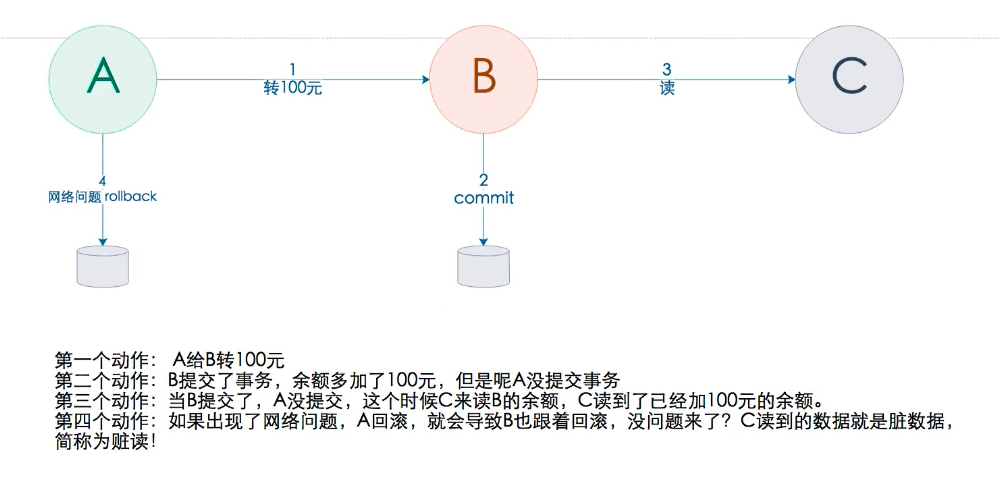

2：不可重复度：指==多次查询==却返回了不同的数据值，这是由于查询间隔的原因，被另一个事务修改并提交了。


3：幻读：指当A事务在读取==某个范围内==的记录时， B事务又在改范围内插入了新记录。当A事务再次读取==该范围内==的记录时，就产生了：幻读


幻读和不可重复读的区别：

- 相同点：幻读和不可重复读都是读到了另一个事务已经提交的数据，脏读是读取未提交的数据。
- 不同点：不可重复读读到都是同一个数据值（同一条记录数据），幻读是：是针对一批整体数据的数据（数据的总数或一张表）。


### 1.2 什么是本地事务和分布式事务

**目标**

掌握和了解本地事务和分布式事务的区别。

**分析**


**本地事务：**

>本地事务是关系型数据库中，由一组SQL组成的一个执行单元，该单元要么整体成功，要么整体失败。它的缺点就是：仅支持单库事务，并不支持跨库事务。


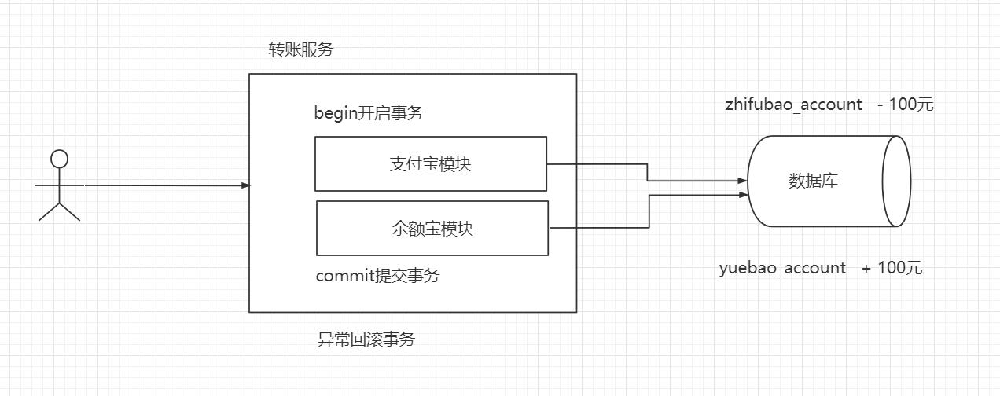


**分布式事务**：

>分布式事务是指：一个业务需要同时操作多个数据库的情况下，而且保持ACID的特性（数据的一致性），一般应用于微服务的多服务处理。 
>

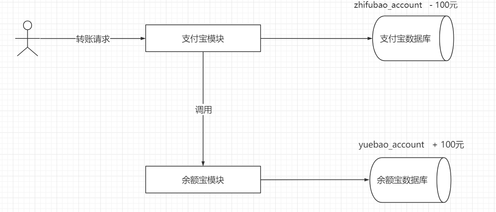


### 1.3 什么是CAP定理

**目标**

掌握和了解什么是CAP定理

 埃里克·布鲁尔（Eric Brewer）在《CAP 理论十二年回顾：“规则”变了》一文中详细地阐述了理解和应用 CAP 的一些细节点，可能是由于作者写作风格的原因，对于一些非常关键的细节点一句话就带过了，这里我特别提炼出来重点阐述。 

C 一致性

A 可用性

P 分区容错性 

**分析**

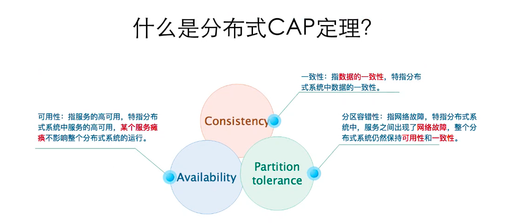

一句话概括CAP：在分布式系统中，即使网络故障，服务出现瘫痪，整个系统的数据保持一致性。

**场景分析**


美团下单到派单，并且扣除优惠券100元

张三在美团上点了外卖，然后下订单，然后在通知外卖小哥接单。思考三个问题：

1：如何体现C数据的 一致性

整个分布式系统中，一致性体现这笔订单，必须通知外卖小哥送单。必须扣除100元的优惠券。

2：如果体现A 可用性

在整个分布式系统中，可用性体现在张三下订单的时候，如果订单服务或卡券服务瘫痪了，这时候不能影响张三下单。（一般采用集群部署即可）

3：如何体现P分区容错性

整个分布式系统中，分区容错主要体现中张三下单的时候，突然订单服务和卡券服务之间的网络突然断开了，但是不能影响张三下订单。

  项目A     -->   项目B  卡卷 

 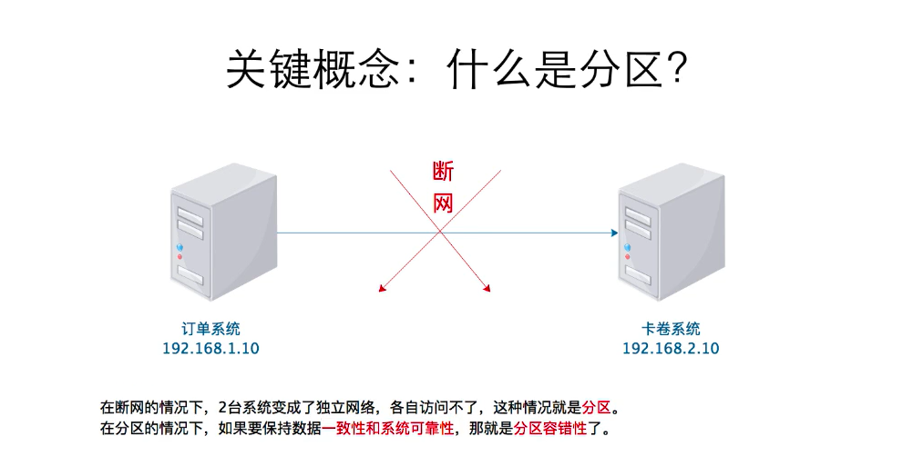


在分布式系统中，出现网络故障出现P，服务瘫痪A，整个系统的数据仍然保持一致性C。满足三者这种方案是做不到的。

相对可以是实现方案：业界的做法是：三选二。


当前服务之间出现网络故障的情况下：

1：如何保证订单服务和卡券服务高可用

2：下一笔订单同时扣除100元优惠券如何实现：


分布式系统解决方案：AP

1：CAP的（AP）：==牺牲一致性，保证高可用==，（保证订单服务可以正常访问，保证卡券服务可以正常访问，是牺牲了数据的一致性），张三下单成功，但是不扣除100元优惠券。在这种情况下：张三下订单成功后再去查看100元，居然还存在。

如何解决呢？一般做法是：当网络恢复正常的情况下，订单服务重试请求卡券服务，再扣除100元优惠券。使用消息队列来做。

2：CAP的（CP）：==牺牲可用性，保证数据一致性==，即未了保证数据的强一致性，当张三来下单的时候，提示：`系统维护中` 等服务间的网络恢复正常后，张三再来下单。

3：CAP的(CA)：可以实现码？当然是不可以的，因为网络故障是一定会存在的，因为我们没办法去控制网络。你没办法去控制网络。也就是P必须要容忍。

思考：

不要P分区容错性，即不允许网络出现故障，这是不可能实现的。所以在分布式系统中，是不存在CA的，即使单体系统也做不到CA，因为单体系统也会出现单一故障问题。你可能说我可以用集群，但是一旦做了集群就由网络问题。

### 1.4 什么是Base定理


  


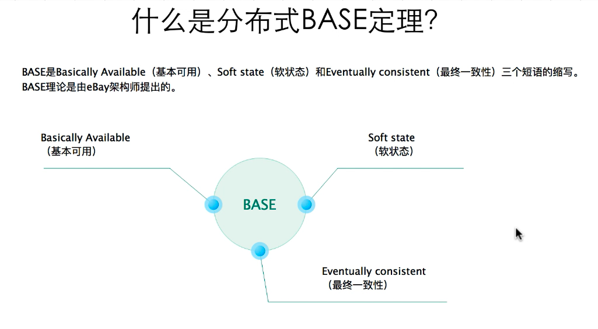


BASE 是指基本可用（Basically Available）、软状态（ Soft State）、最终一致性（ Eventual Consistency），核心思想是即使无法做到强一致性（CAP 的一致性就是强一致性），但应用可以采用适合的方式达到最终一致性。


基本可用（Basically Available）

分布式系统在出现故障时，允许损失部分可用性，即保证核心可用。

这里的关键词是“部分”和“核心”，具体选择哪些作为可以损失的业务，哪些是必须保证的业务，是一项有挑战的工作。例如，对于一个用户管理系统来说，“登录”是核心功能，而“注册”可以算作非核心功能。因为未注册的用户本来就还没有使用系统的业务，注册不了最多就是流失一部分用户，而且这部分用户数量较少。如果用户已经注册但无法登录，那就意味用户无法使用系统。例如，充了钱的游戏不能玩了、云存储不能用了……这些会对用户造成较大损失，而且登录用户数量远远大于新注册用户，影响范围更大。

软状态（Soft State）

允许系统存在中间状态，而该中间状态不会影响系统整体可用性。这里的中间状态就是 CAP 理论中的数据不一致。

最终一致性（Eventual Consistency）

系统中的所有数据副本经过一定时间后，最终能够达到一致的状态。

这里的关键词是“一定时间” 和 “最终”，“一定时间”和数据的特性是强关联的，不同的数据能够容忍的不一致时间是不同的。举一个微博系统的例子，用户账号数据较好能在 1 分钟内就达到一致状态。因为用户在 A 节点注册或者登录后，1 分钟内不太可能立刻切换到另外一个节点，但 10 分钟后可能就重新登录到另外一个节点了，而用户发布的微博，可以容忍 30 分钟内达到一致状态。因为对于用户来说，看不到某个明星发布的微博，用户是无感知的，会认为明星没有发布微博。“最终”的含义就是不管多长时间，最终还是要达到一致性的状态。

BASE 理论本质上是对 CAP 的延伸和补充，更具体地说，是对 CAP 中 AP 方案的一个补充。前面在剖析 CAP 理论时，提到了其实和 BASE 相关的两点：==其实base理论就是告诉我们：虽然在分布式开发中，存在网络问题，我们虽然达不到一致性，但是可以通过一些技术和手段或者认为干预让我们数据达到最终一致性。==

CAP 理论是忽略延时的，而实际应用中延时是无法避免的。


## 第二部分：分布式事务的解决方案

分布式事务实现方案从类型上去分，分为刚性事务 和 柔型事务。

**刚性事务**：通常无业务改造，在CAP定理中主要满足的是CP，也就是强一致性，原生支持回滚/隔离性，适合低并发，短事务。 (金融类、银行类) 

**柔性事务**：有业务改造，在CAP定理中主要满足的是BASE定理，也就是说允许在一定时间内出现数据不一致的情况，但要通过通知或补偿机制实现最终的数据一致性，适合高并发，适合长事务。(互联网项目)

### 2.1 刚性事务解决方案（CP）

#### 2.1.1 2PC(基于XA 协议)

##### 概述

2PC全称Two-phaseCommit，中文名是二阶段提交，是XA规范的实现思路，XA规范是 X/Open DTP 定义的交易中间件与数据库之间的接口规范（即接口函数），交易中间件用它来通知数据库事务的开始、结束以及提交、回滚等。XA 接口函数由数据库厂商提供。

JDBC 

XA接口  远程管理其它数据库的事务


XA协议一套接口 通过这套接口可以远程的控制 数据库事务的操作 


X/Open DTP是X/Open 组织（即现在的 Open Group ）1994定义的分布式事务处理模型。XA规模型包括应用程序（ AP ）、事务管理器（ TM ）、资源管理器（ RM ）、通信资源管理器（ CRM ）四部分。一般，常见的事务管理器（ TM ）是交易中间件，常见的资源管理器（ RM ）是数据库，常见的通信资源管理器（ CRM ）是消息中间件。

2PC 通常使用到XA中的三个角色TM、AP

AP：事务发起方，通常为微服务自身；定义事务边界(事务开始、结束)，并访问事务边界内的资源
TM：事务协调方，事务操作总控；管理事务全局事务，分配事务唯一标识，监控事务的执行进度，负责事务的提交、回滚、失败恢复。
RM：本地事务资源，根据协调方命令进行操作；管理本地共享资源(既数据库)。

  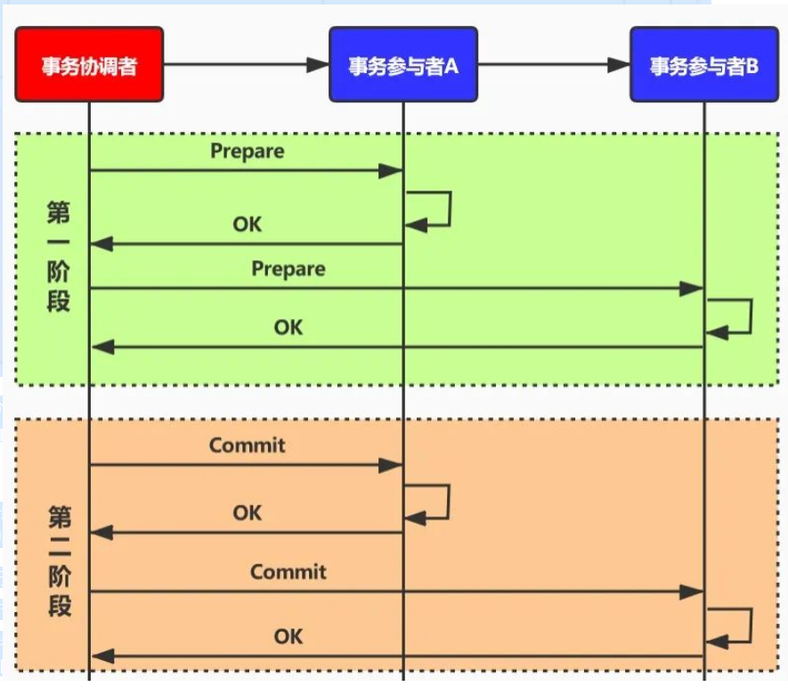

2PC 分成2个阶段，第一阶段：请求阶段（commit-request phase，或称表决阶段，voting phase）和第二阶段：提交阶段（commit phase）。

##### 演示

java中基于XA协议的二阶段简单Demo演示


pom依赖:

```xml
    <dependencies>
        <dependency>
            <groupId>mysql</groupId>
            <artifactId>mysql-connector-java</artifactId>
            <version>5.1.10</version>
        </dependency>
        <dependency>
            <groupId>junit</groupId>
            <artifactId>junit</artifactId>
            <version>4.13</version>
        </dependency>
    </dependencies>
```

事务的发起者AP:

```java
public class AP {
    public Connection getRmZhiFuBaoConn(){
        try {
            Connection connection = DriverManager.getConnection("jdbc:mysql://127.0.0.1:3306/alipay_zhifubao?useUnicode=true&characterEncoding=utf-8&allowMultiQueries=true&useSSL=false","root","root");
            return connection;
        }catch (Exception ex){
            ex.printStackTrace();
        }
        return null;
    }
    public Connection getRmYuEBaoConn(){
        try {
            Connection connection = DriverManager.getConnection("jdbc:mysql://127.0.0.1:3306/alipay_yuebao?useUnicode=true&characterEncoding=utf-8&allowMultiQueries=true&useSSL=false","root","root");
            return connection;
        }catch (Exception ex){
            ex.printStackTrace();
        }
        return null;
    }
}
```

TM事务管理器:

```java
/**
 * 事务协调器代码:
 *  控制多个数据源的 1阶段事务预提交
 *  全部提交成功后
 *  控制多个数据源的 2阶段commit提交
 *  如果中间出现任何问题
 *  出发多个数据源的 全部rollback操作
 */
public class TM { // 事务
    public void execute(Connection zfbConn,Connection yebConn) throws SQLException {
        // 是否打印XA的事务日志
        boolean logXaConmands = true;
        // 获取RM1的接口实例
        XAConnection xaConnection = new MysqlXAConnection((ConnectionImpl)zfbConn,logXaConmands);
        XAResource rm1 = xaConnection.getXAResource();
        // 获取RM2的接口实例
        XAConnection xaConnection2 = new MysqlXAConnection((ConnectionImpl)yebConn,logXaConmands);
        XAResource rm2 = xaConnection2.getXAResource();
        // 生成一个全局事务ID
        byte[] globalid = "global_id_123456".getBytes(); // 全局事务ID
        int formateId = 1;

        Xid xid1 =null;
        Xid xid2 =null;
        try {
            /************************第一阶段-********事务准备**************************/
            // TM 把rmi的事务分支ID，注册到全局ID进行注册
            byte[] bqual1 = "xa0001".getBytes();
            xid1 = new MysqlXid(globalid,bqual1,formateId);

            // 事务开启-rm1的本地事务
            rm1.start(xid1,XAResource.TMNOFLAGS);
            // 支付宝 扣款
            String sql = "update t_account set amount = amount - 100 where username = 'xiaoming'";
            // 执行sql
            PreparedStatement preparedStatement = zfbConn.prepareStatement(sql);
            preparedStatement.execute();
            // 事务结束rm1
            rm1.end(xid1,XAResource.TMSUCCESS);

            // TM 把rm2的事务分支ID，注册到全局ID进行注册
            byte[] bqual2 = "xa0002".getBytes();
            xid2 = new MysqlXid(globalid,bqual2,formateId);
            // 事务开启-rm2的本地事务
            rm2.start(xid2,XAResource.TMNOFLAGS);
            // 模拟用户购买一个商品，扣除红包10元
            String sql2 = "update t_account set amount = amount + 100 where username = 'xiaoming'";
            // 执行sql
            PreparedStatement preparedStatement2 = yebConn.prepareStatement(sql2);
            preparedStatement2.execute();
            // 事务结束rm2结束
            rm2.end(xid2,XAResource.TMSUCCESS);

            // 准备提交
            int prepare1 = rm1.prepare(xid1);
            int prepare2 = rm2.prepare(xid2);
            /************************第一阶段- end ****************************************/

            /************************第二阶段-*******事务提交*******************************/
            if(prepare1 == XAResource.XA_OK && prepare2 == XAResource.XA_OK){
                boolean onePharse = false;
                rm1.commit(xid1,onePharse);//提交事务
                rm2.commit(xid2,onePharse);//提交事务
            }else{
                rm1.rollback(xid1);//提交事务
                rm2.rollback(xid2);//提交事务
            }
        }catch (Exception ex){
            try {
                if(rm1!=null && xid1!=null){
                    rm1.rollback(xid1);//提交事务
                }
                if(rm2!=null && xid2!=null){
                    rm2.rollback(xid2);//提交事务
                }
            }catch ( Exception e){
                e.printStackTrace();
            }
            // 事务回滚
            ex.printStackTrace();
        }
    }
}
```

**测试类:**

```java
/**
 * 测试类: 创建 AP TM对象
 * 通过TM对象管理全局事务
 */
public class XATests {
    AP ap = new AP();
    TM tm = new TM();
    @Test
    public void xatest() throws  Exception{
        tm.execute(ap.getRmZhiFuBaoConn(),ap.getRmYuEBaoConn());
    }
}
```

##### 小结

**1) 性能问题**：所有参与者在事务提交阶段处于同步阻塞状态，占用系统资源，容易导致性能瓶颈。

**2) 可靠性问题：**如果协调者存在单点故障问题，或出现故障，提供者将一直处于锁定状态。

**3) 数据一致性问题：**在阶段 2 中，如果出现协调者和参与者都挂了的情况，有可能导致数据不一致。

**优点：**尽量保证了数据的强一致，适合对数据强一致要求很高的关键领域。

**缺点：**实现复杂，牺牲了可用性，对性能影响较大，不适合高并发高性能场景。


#### 2.1.2 3PC（了解）

2PC是CP的刚性事务，追求数据强一致性。但是通过我们上面分析可以得知TM脑裂可能造成数据不一致和事务状态不确定问题。无法达到CP的完美状态。因此业界就出现了3PC，用来处理TM脑裂引起的数据不一致和事务状态不确定问题。

1）3PC确保任何分支下的数据一致性
2）3PC确保任何分支最多3次握手得到最终结果(超时机制)
3）RM超时后的事务状态必须从TM获取。2PC只有TM的超时机制，3PC新增了参与者(RM)的超时机制，一方面辅助解决了2PC的事务/事务问题，还能降低一定的同步阻塞问题。因为TM、RM双向超时机制，所以维基百科对3PC定义为“非阻塞”协议。


#### 2.1.3 二阶段优化版(Seata AT模式)


##### 概述

是seata框架中提供的一种模式,Atomic Transaction是基于两阶段提交协议的演变：

- 一阶段：业务数据和回滚日志记录在同一个本地事务中提交，释放本地锁和连接资源。
- 二阶段：
  - 提交异步化，非常快速地完成。
  - 回滚通过一阶段的回滚日志进行反向补偿。

详情参考:  http://seata.io/zh-cn/docs/overview/what-is-seata.html


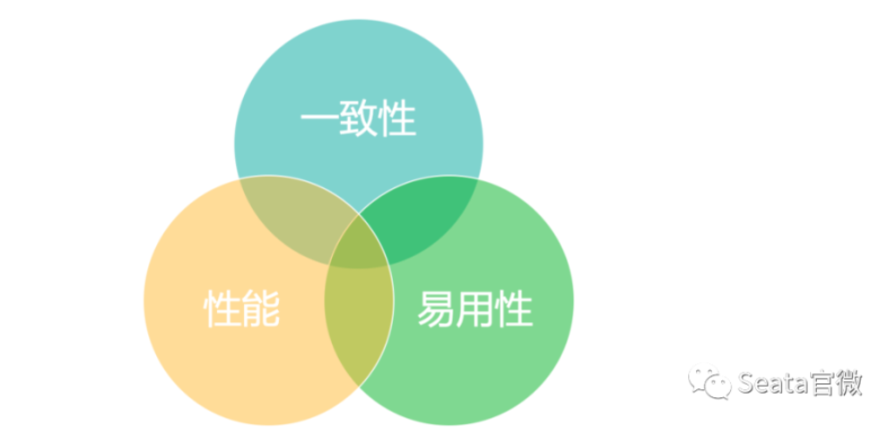

分布式事务是个复杂的问题，目前还没有任何一种解决方案可以非常完美地适应所有应用场景。

如果把分布式事务方案按 一致性、性能 和 易用性 这 3 个维度来考量：AT 模式，实际上是在业务需求允许的前提下，找到一个比较好的平衡点。编程模型不做改变的前提下，达到确定的一致性，而且保证了性能和系统可用性。

基于 Seata 的 AT 模式构建企业业务的分布式事务解决方案，可以带来以下 3 个方面的 核心价值：

- 低成本： 编程模型 不变，轻依赖 不需要为分布式事务场景做特定设计，业务像搭积木一样自然地构建成长。
- 高性能：协议不阻塞；资源释放快，保证业务的吞吐。
- 高可用：极端的异常情况下，可以暂时跳过异常事务，保证整个业务系统的高可用。


##### 演示：

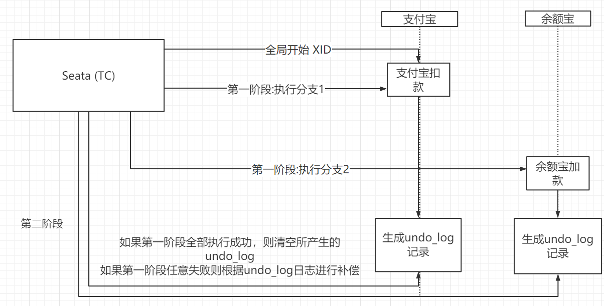


基于Seata框架实现，在事务发起方的方法上加GlobalTransactional注解即可

```java
@GlobalTransactional
    @Transactional
    @Override
    public int payToYuebao(String username, BigDecimal amount) {
        int i = accountMapper.minusAmount(username, amount);
        log.info("用户 : {} , 支付宝减钱: {}  操作成功" ,username,amount);
        yuebaoAddAmount(username,amount);

        // 制造异常  余额宝操作无法回滚
//        System.out.println(1/0);
        return i;
    }
```

##### 小结: 

```
优点:  

和基于XA的二阶段相比，性能高 

和其它柔性事务相比，一致性强

业务代码侵入低，基于seata实现简单高效，且高可用

缺点:
基于ACID的关系型数据库
可以使用JDBC的java应用
```


### 2.2 柔性事务解决方案（BASE）

#### 2.2.2 TCC (补偿型)

##### 概述

TCC 是一种补偿型事务，该模型要求应用的每个服务提供 try、confirm、cancel 三个接口，它的核心思想是通过对资源的预留(提供中间态，如账户状态、冻结金额等)，尽早释放对资源的加锁，如果事务可以提交，则完成对预留资源的确认，如果事务要回滚，则释放预留的资源。

1. Try：尝试执行业务，完成所有业务检查(一致性)，预留必要的业务资源(准隔离性)。

支付宝-钱                                                          余额宝+钱

try:   预减钱   冻结:  100                                    try:      预加钱:  100

1. Confirm：确认执行业务，不再做业务检查。只使用Try阶段预留的业务资源，Confirm操作满足幂等性。

Confirm:   确认执行业务:   冻结:  0              预加钱:  100 --> 主账户

1. Cancel：取消执行业务释放Try阶段预留业务资源。

Cancel: 冻结:  100 ->加回支付宝账户          预加钱:  0

如： 支付宝 转账 到 余额宝案例改造

##### 演示:

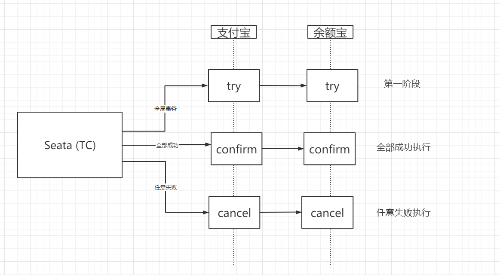

基于Seata的TCC模式实现，全部代课参考资料中代码:

```java
/**
* 支付宝端服务接口
*/
@LocalTCC
public interface AccountService {

    @TwoPhaseBusinessAction(
            name="zhifubao_add",
            commitMethod = "confirmMinusAmount",
            rollbackMethod = "cancelMinusAmount")
    boolean tryMinusAmount(BusinessActionContext actionContext, @BusinessActionContextParameter(paramName = "username")String username, @BusinessActionContextParameter(paramName = "amount")BigDecimal amount);
    boolean confirmMinusAmount(BusinessActionContext actionContext);
    boolean cancelMinusAmount(BusinessActionContext actionContext);
}
```

```java
/**
 * 余额宝中的服务接口
 */
@LocalTCC
public interface AccountService {
    @TwoPhaseBusinessAction(
            name="yuebao_add",
            commitMethod = "confirmAddAmount",
            rollbackMethod = "cancelAddAmount"
    )
    boolean tryAddAmount(BusinessActionContext actionContext, @BusinessActionContextParameter(paramName = "username")String username, @BusinessActionContextParameter(paramName = "amount")BigDecimal amount);
    boolean confirmAddAmount(BusinessActionContext actionContext);
    boolean cancelAddAmount(BusinessActionContext actionContext);
}
```

发起事务方法需要 设置全局事务注解

将每个事务参与者的 try方法执行

后续由TCC框架处理 提交或回滚操作

```java
/**
     * 这里创建全局事务，调用每个事务参与者的try方法
     * 如果有一个try失败，直接抛出异常   抛出异常后seata会执行 cancel方法
     * 如果全部try执行成功，    seata会执行 commit方法
     * @param username
     * @param amount
     * @return
     */
    @GlobalTransactional
    @Override
    public String doTransactionCommit(String username, BigDecimal amount) {
        //第一个TCC 事务参与者
        boolean result = accountService.tryMinusAmount(null,username, amount);
        if (!result) {
            throw new RuntimeException("支付宝扣减金额 失败==> 触发回滚");
        }
        //第二个TCC 事务参与者
        result = yuebaoAddAmount(username, amount);
        if (!result) {
            throw new RuntimeException("余额宝增加金额 失败==> 触发回滚");
        }
        return RootContext.getXID();
    }
```

##### **小结:** 

```
优点：

性能提升：具体业务来实现控制资源锁的粒度变小，不会锁定整个资源。

数据最终一致性：基于 Confirm 和 Cancel 的幂等性，保证事务最终完成确认或者取消，保证数据的一致性。

可靠性：解决了 XA 协议的协调者单点故障问题，由主业务方发起并控制整个业务活动，业务活动管理器也变成多点，引入集群。

缺点：
TCC 的 Try、Confirm 和 Cancel 操作功能要按具体业务来实现，业务耦合度较高，提高了开发成本。
```

#### 2.2.3 Saga (补偿型 了解)

##### 概述:

Saga模型是把一个分布式事务拆分为多个本地事务，每个本地事务都有相应的执行模块和补偿模块（对应TCC中的Confirm和Cancel），当Saga事务中任意一个本地事务出错时，可以通过调用相关的补偿方法恢复之前的事务，达到事务最终一致性。

在Saga模式中，业务流程中每个参与者都提交本地事务，当出现某一个参与者失败则补偿前面已经成功的参与者，一阶段正向服务和二阶段补偿服务都由业务开发实现。

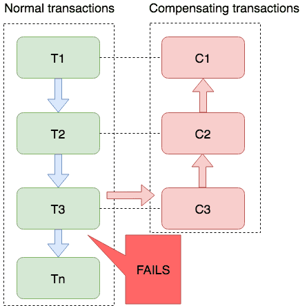

理论基础：Hector & Kenneth 发表论⽂ Sagas （1987）

**适用场景：**

- 业务流程长、业务流程多
- 参与者包含其它公司或遗留系统服务，无法提供 TCC 模式要求的三个接口

##### **小结:**

```
优势：
一阶段提交本地事务，无锁，高性能
事件驱动架构，参与者可异步执行，高吞吐
补偿服务易于实现

缺点：
不保证隔离性
```


#### 2.2.4 基于MQ+本地事务表 （异步通知）

##### 概述

其核心思想是将分布式事务拆分成本地事务进行处理。并通过在数据库新建事务消息表，来记录事务消息的发送情况，处理情况，如果出现发送失败等情况，轮询事务消息表的数据重发事务消息，在基于消息队列完成事务的最终一致性。


事务1              消息通知                     事务2    


##### 演示

如： 支付宝 转账 到 余额宝案例改造

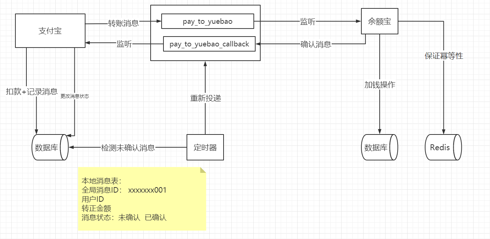

支付宝账户的核心方法

```java
@Service
@Slf4j
public class AccountServiceImpl implements AccountService {
    @Autowired
    AccountDao accountDao;
    @Autowired
    MessageDao messageDao;
    @Autowired
    TransactionTemplate transactionTemplate;

    @Autowired
    RabbitmqSender rabbitmqSender;

    // 优化细节, 使用编程事务 控制方法内事务的粒度
    // 防止发消息的操作出错 造成整个回滚
//    @Transactional
    @Override
    public void payToYuebao(String username, Integer amount) {
        // 手动编程事务  保证 减钱  和  添加消息数据到本地消息表 在一个事务中
        Message sendMsg = transactionTemplate.execute((transactionStatus)->{
            Message message = null;
            String msgId = UUID.randomUUID().toString().replaceAll("-","");
            // 1. 支付宝减钱
            int i = accountDao.minusAmount(username, new BigDecimal(amount));
            log.info("用户 : {} , 余额宝加钱: {}  操作成功" ,username,amount);
            // 2. 本地消息表添加事务消息
            if(i>0){
                message = new Message();
                message.setMsgId(msgId);
                message.setMsgStatus(MessageState.NO_CONSUMED);
                message.setUsername(username);
                message.setAmount(amount);
                messageDao.addMessage(message);
            }
            return message;
        });
        // 发消息操作 不需要在事务中，出错后 会有重试机制 重新发送消息
        if(sendMsg!=null){
            // 3. 发送消息到MQ
            rabbitmqSender.sendMessage(MessageState.PAY_EXCHANGE,"zhifubao.pay",sendMsg);
        }
    }

    /**
     * 消费服务的回调方法
     * 暂时只处理消费成功的情况
     * @param param
     */
    @Transactional
    @Override
    public void payToYuebaoCallback(String param) {
        JSONObject jsonObject = JSONObject.parseObject(param);
        String msgId = jsonObject.getString("msgId");
        Message message = new Message();
        message.setMsgStatus(MessageState.HAS_CONSUMED);
        message.setMsgId(msgId);
        messageDao.updateMessage(message);
    }
}
```

发送消息的核心方法

```java
@Slf4j
@Component
public class RabbitmqSender implements RabbitTemplate.ConfirmCallback {
    private RabbitTemplate rabbitTemplate;

    public RabbitmqSender(RabbitTemplate rabbitTemplate) {
        // 设置确认回调
        rabbitTemplate.setConfirmCallback(this);
        // 设置未投放到指定队列回调
//        rabbitTemplate.setReturnCallback(this);
        this.rabbitTemplate = rabbitTemplate;
    }
    /**
     * 封装发送消息的方法
     * @param exchange
     * @param routekey
     * @param message
     */
    public void sendMessage(String exchange, String routekey, Message message){
        try {
            log.info("发送消息给余额宝");
            rabbitTemplate.convertAndSend(exchange,routekey, JSONObject.toJSONString(message));
        } catch (AmqpException e) {
            log.error("发送消息给余额宝失败 ==> {}",e.getMessage());
        }
    }
    /**
     * 确认回调的处理方法
     * @param correlationData
     * @param b
     * @param s
     */
    @Override
    public void confirm(CorrelationData correlationData, boolean b, String s) {
        if(b){
            log.info("发送消息给余额宝 成功");
        }else {
            log.error("发送消息给余额宝 失败 ==> {}",s);
        }
    }
}
```

定时任务

定时检查本地消息表中未被消费的消息，进行定时的重新投递

```java
@Slf4j
@Component
public class ScheduledService {
    @Autowired
    MessageDao messageDao;
    @Autowired
    RabbitmqSender rabbitmqSender;
    @Scheduled(cron = "0/20 * * * * ?")
    public void retrySendMsg(){
        log.info("定时器触发 检测未被消费消息");
        List<Message> messages = messageDao.queryMessageByState(MessageState.NO_CONSUMED);
        log.info("定时器触发 检测未被消费消息数量==> {}",( messages==null? 0 : messages.size()));
        for (Message message : messages) {
            log.info("重发消息======>");
            rabbitmqSender.sendMessage(MessageState.PAY_EXCHANGE,"zhifubao.pay",message);
        }
    }
}
```

余额宝消费消息的核心方法

一定要考虑幂等性

处理成功后需要异步通知

```java
@Slf4j
@Component
public class MessageListener {

    @Autowired
    AccountService accountService;

    @Autowired
    StringRedisTemplate redisTemplate; // 使用redis处理幂等性

    @Autowired
    TransactionTemplate transactionTemplate; // 编程事务对象

    @Autowired
    RabbitTemplate rabbitTemplate;

    @RabbitListener(queues = MessageState.PAY_YEB_QUEUE)
    public void applyPayMsg(String messageJson){
        log.info("接收到 转账消息请求 消息内容==> {}",messageJson);
        try {
            // 模拟消费处理时间
            Thread.sleep(30000);
        } catch (InterruptedException e) {
            e.printStackTrace();
        }
        // 1. 接收传递过来的消息后，需要考虑幂等性
        Message msgObj = JSONObject.parseObject(messageJson, Message.class);
        // 2. redis中查看消息是否已经处理过
        Object handle_pay_msg = redisTemplate.boundHashOps("handle_pay_msg").get(msgObj.getMsgId());
        if(handle_pay_msg!=null){
            // 重复性消息 不在处理
            log.error("重复的余额宝转账消息  已忽略 流水号: {}",msgObj.getMsgId());
            return;
        }
        boolean handleResult = transactionTemplate.execute((state)->{
            int i = accountService.addAmount(msgObj.getUsername(), new BigDecimal(msgObj.getAmount()));
            if(i>0){
                redisTemplate.boundHashOps("handle_pay_msg").put(msgObj.getMsgId(),JSONObject.toJSONString(msgObj));
                return true;
            }
            return false;
        });
        if(handleResult){
            // 处理结束 回发确认消息
            JSONObject ackMsg = new JSONObject();
            ackMsg.put("msgId",msgObj.getMsgId());
            ackMsg.put("ack",true);
            rabbitTemplate.convertAndSend(MessageState.PAY_EXCHANGE,"yuebao.callback",ackMsg.toJSONString());
            log.info("余额宝处理转账完毕 异步回复确认消息到 支付宝 流水ID ==> {}",msgObj.getMsgId());
        }
    }
}
```

##### 小结

```
优点：效率高，从应用设计开发的角度实现了消息数据的可靠性，消息数据的可靠性不依赖于消息中间件，弱化了对 MQ 中间件特性的依赖。

缺点：与具体的业务场景绑定，耦合性强，不可公用。消息数据与业务数据同库，占用业务系统资源。业务系统在使用关系型数据库的情况下，消息服务性能会受到关系型数据库并发性能的局限。
```


#### 2.2.3 基于MQ自身事务消息（异步通知 了解）

##### 概述

Rocket

基于MQ的事务消息方案主要依靠MQ的半消息机制来实现投递消息和参与者自身本地事务的一致性保障。半消息机制实现原理其实借鉴的2PC的思路，是二阶段提交的广义拓展，流程图如下：

##### 小结

```
优点：
消息数据独立存储，降低业务系统与消息系统之间的耦合。
吞吐量优于本地消息表方案。

缺点：
大部分MQ没这功能
一次消息发送需要两次网络请求(half消息 + commit/rollback)。
需要实现消息回查接口。
```


## 第三部分 分布式事务话术小结 

### 3.1 前面小结

```
从互联网的公司角度出发:

业务规避 > 柔性事务 > 刚性事务
业务规避:
从设计的角度避免分布式问题
刚性事务:
XA-2PC: 效率低，强一致性

AT:   业务侵入性低，必须在关系型数据库和java支持JDBC项目中可以使用
	  seata提供实现
柔性事务:
Saga: 适合业务流程复杂的长事务,不保证隔离性
      适合大型互联网公司，且事务涉及的流程特别复杂
      seata提供实现
      
Tcc:  但业务侵入性强，每个功能都要提供try,confirm,cancel
	  对资源依赖低，主要通过代码来保证一致性 有效的隔离了资源
	  seata提供实现

MQ： 效率最高，但与其实现与业务场景绑定紧密
	  RocketMQ支持分布式事务消息
	  其他MQ需要配合本地消息表实现
```


### 3.2 Seata是什么

Seata (原名: Fescar , 后更名Seata )是阿里巴巴推出一款开源的分布式事务解决方案，致力于在微服务架构下提供高性能和简单易用的分布式事务，
服务。https://seata.io/zh-cn/

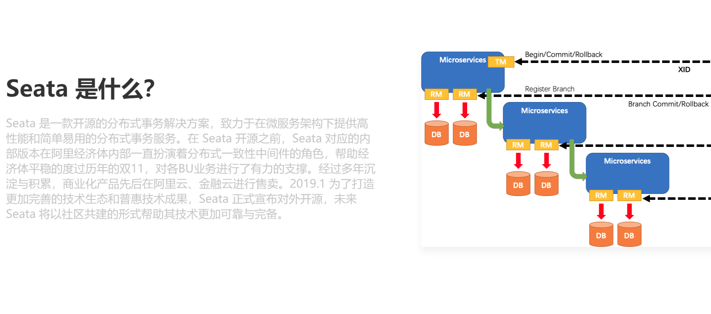

解决分布式事务问题，有两个设计初衷
对业务无侵入：即减少技术架构上的微服务化所带来的分布式事务问题对业务的侵入 高性能：减少分布式事务解决方案所带来的性能消耗

Seata目前有三种分布式事务实现方案：AT、TCC及SAGA 及正在开发的XA方案


# 相关面试题

**什么是事务及事务的特性?**

```
事务 指的是一系列的操作，要么全部成功，要么全部失败。
在数据库中，指的是一个操作由一些列SQL组成，这些SQL看成一个整体，要么全部成功，要么全部失败。

数据库中的事务满足ACID的特性
原子性（Atomicity）
一致性(Consistency)
隔离性(Isolation) 
持久性（Durability）
```

**什么是分布式事务?**

```
在分布式架构中，一个操作可能横跨多个微服务，多个数据库，传统的本地事务无法解决，需要使用分布式事务来解决。
```

**什么是CAP定理?**

```
在分布式系统中，
C： 指的是多个系统中数据的一致性。
A： 指的是服务的高可用
P： 指的是分区容错

即使网络故障的时候能够做到分区容错，在服务出现瘫痪时也能保证对应服务的高可用，而且整个系统的数据保持一致性。想完全满足以上3点是不可能的，所以业界主要选择3保2 优先保证两点，但分区容错和网络有关无法避免，所以P必须要保证 常见的两种方案:
CP: 保证一致性,分区容错
AP：保证高可用,分区容错
```

**什么是Base定理?**

```
Base定理，对CAP的平衡落地理论。
强调的是: 
   保证基本可用(核心服务高可用)
   允许存在软状态(运行出现一段时间的数据不一致情况)
   最终一致性(最终能够达到数据的一致性)
```

**zk和eureka的区别?(从CAP的角度分析)**

```
zk: cp   强调一致性
eureka: ap  强调高可用
```

**分布式事务的解决方案?**

```
刚性事务解决方案 (CP)
	基于XA的二阶段提交
	三阶段提交
柔性事务解决方案 (Base)
	TCC (补偿型)
	SAGA （补偿型）
	MQ事务消息 （异步通知）
	MQ+本地消息表 (异步通知)
```

**seata介绍**

```
阿里推出的一款开源的、一站式的分布式事务解决方案。 提供了TCC、SAGA、AT等模式的解决方案，XA二阶段模式也即将推出，适合各类微服务场景。在2019年1月左右开始推出最初版本，目前已经更新到1.2.1版本，由阿里的团队积极维护，而且社区非常活跃，是目前非常火的分布式事务解决方案
```

**我们项目中分布式事务是如何处理的?**

```
可以说使用seata框架， 不过最好在0.9以上版本 2019.10.16日发布0.9版本

MQ+本地消息表的方式在过去使用的最多,因为可靠消息队列的异步通信效率很高。
不过需要针对特定的场景要做对应的设计，当子事务比较多时，或者要考虑各种补偿方案时实现比较复杂。
```


