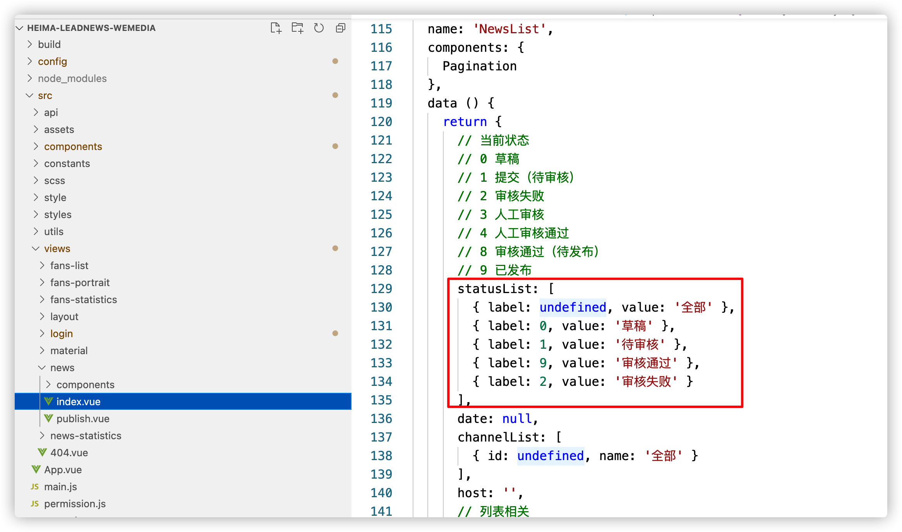
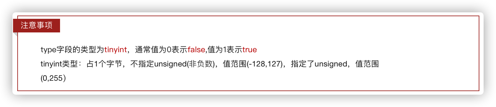
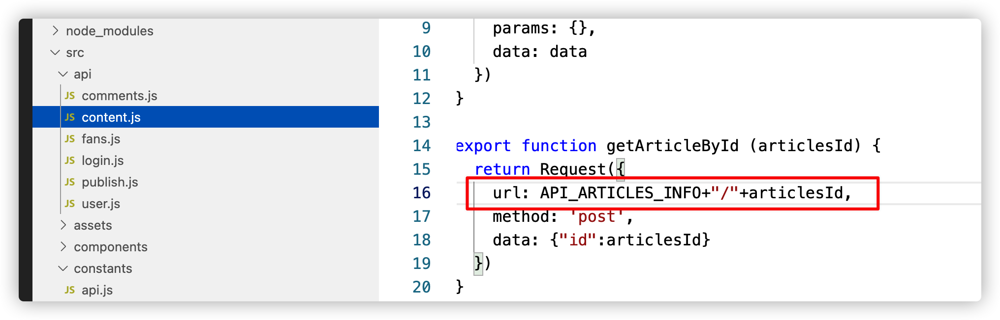

# 第五章 自媒体文章发布

## 今日目标

- 完成自媒体文章列表查询功能
- 完成自媒体文章的发布功能
- 完成自媒体文章的查询
- 完成自媒体文章的删除功能
- 完成自媒体文章的上下架功能

## 1 自媒体文章列表查询

### 1.1 需求分析


### 1.2 表结构和实体类

**wm_news  自媒体文章表**


**需求:** 

1. 如果有文章标题，按照文章标题模糊查询
2. 如果有频道信息，按照频道ID查询
3. 如果有文章状态，按照状态信息进行查询
4. 如果开始时间，结束时间不为空按照时间区间查询
5. 按照登录用户ID去查询
6. 按照创建时间降序
7. 分页查询，返回结果添加图片访问前缀

**自媒体文章实体类**

```java
package com.heima.model.wemedia.pojos;

import com.baomidou.mybatisplus.annotation.IdType;
import com.baomidou.mybatisplus.annotation.TableField;
import com.baomidou.mybatisplus.annotation.TableId;
import com.baomidou.mybatisplus.annotation.TableName;
import lombok.Data;
import org.apache.ibatis.type.Alias;

import java.io.Serializable;
import java.util.Date;

/**
 * <p>
 * 自媒体图文内容信息表
 * </p>
 *
 * @author itheima
 */
@Data
@TableName("wm_news")
public class WmNews implements Serializable {

    private static final long serialVersionUID = 1L;

    /**
     * 主键
     */
    @TableId(value = "id", type = IdType.AUTO)
    private Integer id;

    /**
     * 自媒体用户ID
     */
    @TableField("user_id")
    private Integer userId;

    /**
     * 标题
     */
    @TableField("title")
    private String title;

    /**
     * 图文内容
     */
    @TableField("content")
    private String content;

    /**
     * 文章布局
            0 无图文章
            1 单图文章
            3 多图文章
     */
    @TableField("type")
    private Short type;

    /**
     * 图文频道ID
     */
    @TableField("channel_id")
    private Integer channelId;

    @TableField("labels")
    private String labels;

    /**
     * 创建时间
     */
    @TableField("created_time")
    private Date createdTime;

    /**
     * 提交时间
     */
    @TableField("submited_time")
    private Date submitedTime;

    /**
     * 当前状态
            0 草稿
            1 提交（待审核）
            2 审核失败
            3 人工审核
            4 人工审核通过
            8 审核通过（待发布）
            9 已发布
     */
    @TableField("status")
    private Short status;

    /**
     * 定时发布时间，不定时则为空
     */
    @TableField("publish_time")
    private Date publishTime;

    /**
     * 拒绝理由
     */
    @TableField("reason")
    private String reason;

    /**
     * 发布库文章ID
     */
    @TableField("article_id")
    private Long articleId;

    /**
     * //图片用逗号分隔
     */
    @TableField("images")
    private String images;

    @TableField("enable")
    private Short enable;
    
     //状态枚举类
    @Alias("WmNewsStatus")
    public enum Status{
        NORMAL((short)0),SUBMIT((short)1),FAIL((short)2),ADMIN_AUTH((short)3),ADMIN_SUCCESS((short)4),SUCCESS((short)8),PUBLISHED((short)9);
        short code;
        Status(short code){
            this.code = code;
        }
        public short getCode(){
            return this.code;
        }
    }

}
```

### 1.3 接口定义

在接口工程`heima-leadnews-apis`中定义接口

`com.heima.apis.wemedia.WmNewsControllerApi`

```java
package com.heima.api.wemedia;

import com.heima.model.common.dtos.ResponseResult;

/**
 * 自媒体文章接口
 */
public interface WmNewsControllerApi {

    /**
     * 分页带条件查询自媒体文章列表
     * @param wmNewsPageReqDto
     * @return
     */
    public ResponseResult findAll(WmNewsPageReqDto wmNewsPageReqDto);
}
```

**WmNewsPageReqDto**

```java
package com.heima.model.wemedia.dtos;
import com.heima.model.common.dtos.PageRequestDto;
import lombok.Data;
import java.util.Date;
@Data
public class WmNewsPageReqDto extends PageRequestDto {
    private Short status;//状态
    private Date beginPubDate;//开始时间
    private Date endPubDate;//结束时间
    private Integer channelId;//所属频道ID
    private String keyword;//关键字
}
```

### 1.4 mapper实现

创建com.heima.wemedia.mapper.WmNewsMapper

```java
package com.heima.wemedia.mapper;

import com.baomidou.mybatisplus.core.mapper.BaseMapper;
import com.heima.model.wemedia.pojos.WmNews;

public interface WmNewsMapper extends BaseMapper<WmNews> {
}
```

### 1.5 service代码实现

定义WmNewsService接口：com.heima.wemedia.service.WmNewsService

```java
package com.heima.wemedia.service;

import com.baomidou.mybatisplus.extension.service.IService;
import com.heima.model.common.dtos.ResponseResult;
import com.heima.model.media.dtos.WmNewsPageReqDto;
import com.heima.model.media.pojos.WmNews;

public interface WmNewsService extends IService<WmNews> {

    /**
     * 查询所有自媒体文章
     * @return
     */
    public ResponseResult findAll(WmNewsPageReqDto dto);
}
```

定义实现类 com.heima.wemedia.service.impl.WmNewsServiceImpl

```java
package com.heima.wemedia.service.impl;

import com.baomidou.mybatisplus.core.conditions.query.LambdaQueryWrapper;
import com.baomidou.mybatisplus.core.metadata.IPage;
import com.baomidou.mybatisplus.extension.plugins.pagination.Page;
import com.baomidou.mybatisplus.extension.service.impl.ServiceImpl;
import com.heima.common.exception.CustException;
import com.heima.model.common.dtos.PageResponseResult;
import com.heima.model.common.dtos.ResponseResult;
import com.heima.model.common.enums.AppHttpCodeEnum;
import com.heima.model.wemedia.dtos.WmNewsPageReqDto;
import com.heima.model.wemedia.pojos.WmNews;
import com.heima.model.wemedia.pojos.WmUser;
import com.heima.utils.threadlocal.WmThreadLocalUtils;
import com.heima.wemedia.mapper.WmNewsMapper;
import com.heima.wemedia.service.WmNewsService;
import org.apache.commons.lang3.StringUtils;
import org.springframework.stereotype.Service;

@Service
public class WmNewsServiceImpl extends ServiceImpl<WmNewsMapper, WmNews> implements WmNewsService {
    /**
     * 查询所有自媒体文章
     * @param dto
     * @return
     */
    @Override
    public ResponseResult findAll(WmNewsPageReqDto dto) {
        //1 参数检查
        if (dto == null) {
            return ResponseResult.errorResult(AppHttpCodeEnum.PARAM_INVALID);
        }
        dto.checkParam();
        //2 条件封装执行查询
        LambdaQueryWrapper<WmNews> wrapper = new LambdaQueryWrapper<>();
        // 文章标题模糊查询
        if (StringUtils.isNotBlank(dto.getKeyword())) {
            wrapper.like(WmNews::getTitle, dto.getKeyword());
        }
        // 频道id
        if (dto.getChannelId() != null) {
            wrapper.eq(WmNews::getChannelId, dto.getChannelId());
        }
        // 文章状态
        if (dto.getStatus() != null) {
            wrapper.eq(WmNews::getStatus, dto.getStatus());
        }
        // 发布时间
        if (dto.getBeginPubDate() != null && dto.getEndPubDate() != null) {
            wrapper.between(WmNews::getPublishTime, dto.getBeginPubDate(), dto.getBeginPubDate());
        }
        // 当前自媒体人文章
        WmUser user = WmThreadLocalUtils.getUser();
        if (user == null) {
            CustException.cust(AppHttpCodeEnum.NEED_LOGIN);
        }
        wrapper.eq(WmNews::getUserId, user.getId());
        // 按照创建日期倒序
        wrapper.orderByDesc(WmNews::getCreatedTime);
        // 分页条件构建
        Page<WmNews> page = new Page<>(dto.getPage(), dto.getSize());
        //3 执行查询
        IPage<WmNews> pageResult = page(page, wrapper);
        //4 返回封装查询结果
        ResponseResult result = new PageResponseResult(dto.getPage(), dto.getSize(), (int)pageResult.getTotal(), pageResult.getRecords());
        // 处理文章图片 
        result.setHost(webSite);
       return result;
    }
}
```

### 1.6 controller代码实现

在自媒体微服务中定义controller：com.heima.wemedia.controller.WmNewsController

```java
package com.heima.wemedia.controller.v1;
import com.heima.apis.wemedia.WmNewsControllerApi;
import com.heima.model.common.dtos.ResponseResult;
import com.heima.model.wemedia.dtos.WmNewsPageReqDto;
import com.heima.wemedia.service.WmNewsService;
import org.springframework.beans.factory.annotation.Autowired;
import org.springframework.web.bind.annotation.PostMapping;
import org.springframework.web.bind.annotation.RequestBody;
import org.springframework.web.bind.annotation.RequestMapping;
import org.springframework.web.bind.annotation.RestController;
@RestController
@RequestMapping("/api/v1/news")
public class WmNewsController implements WmNewsControllerApi {
    @Autowired
    private WmNewsService wmNewsService;
    @PostMapping("/list")
    @Override
    public ResponseResult findAll(@RequestBody WmNewsPageReqDto wmNewsPageReqDto){
        return wmNewsService.findAll(wmNewsPageReqDto);
    }
}
```

### 1.7 测试

使用postman测试需要先登录，获取token后访问


或打开页面进行测试

其中页面联调，需要修改状态传入后台的值，修改前端以下文件




## 2 频道列表展示

### 2.1需求分析


文章展示列表页面打开的时候，默认自动加载频道列表数据进行展示，就是查询所有频道数据

### 2.2 接口定义

在AdChannelControllerApi接口中新增方法，查询所有频道的数据

```java
/**
     * 查询所有频道
     * @return
     */
public ResponseResult findAll();
```

### 2.3 功能实现

在<font color="red">admin-service</font> 端，修改AdChannelController类，添加如下方法，mapper和service在之前已经定义

```java
@GetMapping("/channels")
@Override
public ResponseResult findAll() {
    List<AdChannel> list = adChannelService.list();
    return ResponseResult.okResult(list);
}
```

### 2.4 修改自媒体网关

在<font color="red">wemedia-gateway</font> 自媒体网关的yml配置文件中添加如下配置

```yaml
- id: admin
  uri: lb://leadnews-admin
  predicates:
  - Path=/admin/**
  filters:
  - StripPrefix= 1
```

### 2.5 测试

重启` admin-service `和`wemedia-gateway` 微服务

使用postman测试或者直接打开页面测试即可

## 3 自媒体文章-发布、修改、保存草稿

### 3.1 需求分析


保存文章，除了需要wm_news表以外，还需要另外两张表

​                                                  **wm_material  素材表**


​                                               **wm_news_material  文章素材关系表**


### 3.2 思路分析

1. 参数校验
2. 保存或修改文章
   * 该功能为保存、修改（是否有id）、保存草稿的共用方法
   * 如果有id修改文章，先删除所有素材关联关系
   * 如果没有id，保存文章

3. 关联文章和素材关系表

   * 关联**内容**中的图片与素材的关系

   * 关联**封面**中的图片与素材的关系

     > 封面图片如果选择是自动需要从内容中截图图片做为封面图片
     >
     > 截取规则为：
     >
     > * 内容图片的个数小于等于2  则为单图截图一张图
     > * 内容图片大于2，则为多图，截图三张图
     > * 内容中没有图片，则为无图

4. 封装返回成功结果

<font color="red">前端给后端传递的参数格式：</font> 

```json
{
    "title":"传智教育于2021年1月12日在深交所上市",
    "type":"1",  # 0：无图 1：单图  3：多图 -1：自动
    "labels":"黑马头条",
    "publishTime":"2021-01-14T11:35:49.000Z",
    "channelId":1,
    "images":[  # 文章封面 集合
        "https://heimaleadnewsoss.oss-cn-shanghai.aliyuncs.com/material/2021/1/20210113/20214312094300211.jpg"
    ],
    "status":1,
    # 文章内容 字符串
    "content":"[  
    {
        "type":"text",
        "value":"传智教育于2021年1月12日在深交所上市"
    },
    {
        "type":"image",
        "value":"https://heimaleadnewsoss.oss-cn-shanghai.aliyuncs.com/material/2021/1/20210113/20210112100045327.jpg"
    }
]"
}
```

### 3.3 接口定义

在接口中新增提交文章的方法：`com.heima.api.wemedia.WmNewsControllerApi`

```java
	/**
     * 提交文章
     * @param wmNewsDto
     * @return
     */
ResponseResult submitNews(WmNewsDto wmNewsDto);
```

WmNewsDto用于接收前端传递参数

```java
package com.heima.model.media.dtos;

import lombok.Data;

import java.util.Date;
import java.util.List;

@Data
public class WmNewsDto {
    // 文章ID
    private Integer id;
     /**
     * 标题
     */
    private String title;
     /**
     * 频道id
     */
    private Integer channelId;
     /**
     * 标签
     */
    private String labels;
     /**
     * 发布时间
     */
    private Date publishTime;
     /**
     * 文章内容
     */
    private String content;
     /**
     * 文章封面类型  0 无图 1 单图 3 多图 -1 自动
     */
    private Short type;
     /**
     * 是否上架  0 下架  1 上架
     */
    private Short enable;
     /**
     * 提交时间
     */
    private Date submitedTime; 
     /**
     * 状态 提交为1  草稿为0
     */
    private Short status;
     /**
     * 拒绝理由
     */
    private String reason; 
     /**
     * 封面图片列表
     */
    private List<String> images;
}
```

### 3.4 mapper定义

修改WmNewsMaterialMapper，添加一个方法，用来批量添加数据，用于素材与文章关系做关联

```java

public interface WmNewsMaterialMapper extends BaseMapper<WmNewsMaterial> {

    /**
     * 保存文章和素材的关联关系	
     *
     * @param wmMaterialIds 素材id集合
     * @param newsId        文章ID
     * @param type          文章封面类型  0 内容引用  1 封面引用
     */
    public void saveRelations(@Param("wmMaterialIds") List<Integer> wmMaterialIds,
                              @Param("newsId") Integer newsId,
                              @Param("type") Short type);

}

```

新建resources\mapper\WmNewsMaterialMapper.xml文件

```xml
<?xml version="1.0" encoding="UTF-8"?>
<!DOCTYPE mapper PUBLIC "-//mybatis.org//DTD Mapper 3.0//EN" "http://mybatis.org/dtd/mybatis-3-mapper.dtd">
<mapper namespace="com.heima.wemedia.mapper.WmNewsMaterialMapper">
    <insert id="saveRelations">
        insert into wm_news_material (material_id, news_id, type, ord)
        values
        <foreach collection="wmMaterialIds" item="materialId" index="ord" separator=",">
            (#{materialId}, #{newsId}, #{type}, #{ord})
        </foreach>
    </insert>
</mapper>
```

### 3.5 业务层代码

常量类准备：com.heima.common.constants.wemedia.WmMediaConstans

```java
package com.heima.common.constans.wemedia;

public class WemediaConstants {

    // 是否收藏
    public static final Short COLLECT_MATERIAL = 1;//收藏
    public static final Short CANCEL_COLLECT_MATERIAL = 0;//取消收藏

    // 文章类型
    public static final String WM_NEWS_TYPE_IMAGE = "image";

    // 文章状态
    public static final Short WM_NEWS_DRAFT_STATUS = 0; //草稿
    public static final Short WM_NEWS_SUMMIT_STATUS = 1; //提交
    public static final Short WM_NEWS_AUTHED_STATUS = 8; //审核通过
    public static final Short WM_NEWS_PUBLISH_STATUS = 9; //已发布

    // 文章封面选图
    public static final Short WM_NEWS_NONE_IMAGE = 0; //无图
    public static final Short WM_NEWS_SINGLE_IMAGE = 1; //单图
    public static final Short WM_NEWS_MANY_IMAGE = 3; //多图
    public static final Short WM_NEWS_TYPE_AUTO = -1; //图文类型自动

    // 文章图片引用
    public static final Short WM_CONTENT_REFERENCE = 0;
    public static final Short WM_IMAGE_REFERENCE = 1;
}
```


在WmNewsService类中新增方法

```java
/**
   * 自媒体文章发布
   * @param wmNewsDto
   * @param isSubmit  是否为提交 1 为提交 0为草稿
   * @return
  */
ResponseResult submitNews(WmNewsDto wmNewsDto, Short isSubmit);
```

#### 3.5.1 保存或修改文章

* 该功能为保存、修改（是否有id）、保存草稿的共用方法
* 如果有id修改文章，先删除所有素材关联关系
* 如果没有id，保存文章

```java
	/**
     * 自媒体文章发布
     * @param wmNewsDto
     * @param isSubmit 是否为提交 1 为提交 0为草稿
     * @return
     */
    @Override
    public ResponseResult saveNews(WmNewsDto wmNewsDto, Short isSubmit) {
        // 1 参数校验
        if (wmNewsDto == null || StringUtils.isBlank(wmNewsDto.getContent())) {
            throw new CustomException(AppHttpCodeEnum.PARAM_INVALID);
        }
        // 2 保存或修改文章
        WmNews wmNews = new WmNews();
        // 将dto参数里面的值设置到wmNews
        BeanUtils.copyProperties(wmNewsDto, wmNews);
        //如果文章布局是自动，需要设置为null
        if (wmNewsDto.getType().equals(WemediaConstants.WM_NEWS_TYPE_AUTO)) {
            wmNews.setType(null);
        }
        // 处理dto参数 images封面集合 转换成 字符串
        String images = imageListToStr(wmNewsDto.getImages(), webSite);
        wmNews.setImages(images);
        saveWmNews(wmNews, isSubmit);
        // TODO 3.1 抽取文章中关联的图片路径
        // TODO 3.2 关联文章内容中的图片和素材关系
        // TODO 3.3 关联文章封面中的图片和素材关系  封面可能是选择自动或者是无图
        return ResponseResult.okResult();
    }
```

**图片集合转字符串**

```java
/**
 * 图片列表转字符串，并去除图片前缀
 * @param images 图片列表
 * @param webSite 图片前缀
 */
private String imageListToStr(List<String> images, String webSite) {
    return images.stream()  // 获取流
                    .map((url) -> url.replace(webSite, ""))  // 对流数据的中间操作
                    .collect(Collectors.joining(","));
}
```

**保存文章**

```java
/**
 * 保存或修改文章
 * @param wmNews 文章对象（前端传递）
 * @param isSubmit 0 草稿  1 提交审核
 */
private void saveWmNews(WmNews wmNews) {
    wmNews.setCreatedTime(new Date());
    wmNews.setUserId(WmThreadLocalUtils.getUser().getId());
    wmNews.setSubmitedTime(new Date());
    wmNews.setEnable(WemediaConstants.WM_NEWS_UPENABLE); // 上架
    if (wmNews.getId()==null) { // 保存操作
        save(wmNews);
    }else {  // 修改
        // 当前文章 和 素材关系表数据删除
        wmNewsMaterialMapper.delete(Wrappers.<WmNewsMaterial>lambdaQuery()
                .eq(WmNewsMaterial::getNewsId, wmNews.getId()));
        updateById(wmNews);
    }
}
```

**小知识点：**



#### 3.5.2 解析内容中图片列表

```java
	/**
     * 自媒体文章发布
     * @param wmNewsDto
     * @param isSubmit 是否为提交 1 为提交 0为草稿
     * @return
     */
    @Override
    public ResponseResult saveNews(WmNewsDto wmNewsDto, Short isSubmit) {
        
        // 上面代码略 ..........................
        
        // 3.1 抽取文章中关联的图片路径
        List<Map> contents = JSON.parseArray(wmNewsDto.getContent(), Map.class);
        List<String> materials = parseContentImages(contents);
        
        // 下面代码略 ..........................
    }	
	/**  
     * 解析内容中图片列表
     * @param contentImages
     * @return
     */
    private List<String> parseContentImages(List<Map> contents) {
        return contentImages.stream() // 流式处理
                .filter(map.get("type").equals(WemediaConstants.WM_NEWS_TYPE_IMAGE)) // 过滤是图片
                .map(map -> (String)map.get("value")) // 映射处理->获取图片url
                .map(imageUrl -> imageUrl.replace(webSite,"")) // 映射处理->替换前缀路径
                .collect(Collectors.toList()); // 将图片收集到一个图片集合中
    }
```

> 参考前端传递参数数据格式解析即可

#### 3.5.3 关联文章内容中的图片和素材关系

```java
	/**
     * 自媒体文章发布
     * @param wmNewsDto
     * @param isSubmit 是否为提交 1 为提交 0为草稿
     * @return
     */
    @Override
    public ResponseResult saveNews(WmNewsDto wmNewsDto, Short isSubmit) {
        // 上面代码略 ..........................
        
        // 3.2 关联文章内容中的图片和素材关系
        if (isSubmit == WmNews.Status.SUBMIT.getCode() && materials.size() > 0) {
            saveRelativeInfoForContent(materials, wmNews.getId());
        }
        
        // 下面代码略 ..........................
    }
	private void saveRelativeInfoForContent(List<String> materials, Integer newsId) {
        // 保存素材和文章关系，抽取一个独立方法执行关联操作，原因当前方法可以复用
        saveRelativeInfo(materials, newsId, WemediaConstants.WM_CONTENT_REFERENCE);
    }
	/**
     * 保存素材和文章关系
     * @param materials  素材列表
     * @param newsId     文章ID
     * @param type       类型 0：内容素材  1：封面素材
     */
    private void saveRelativeInfo(List<String> materials, Integer newsId, Short type) {
        //1 查询文章内容中的图片对应的素材ID
        List<WmMaterial> dbmaterials = wmMaterialMapper.selectList(Wrappers.<WmMaterial>lambdaQuery()
                .in(WmMaterial::getUrl,materials)
                .eq(WmMaterial::getUserId, WmThreadLocalUtils.getUser().getId())
        );
        //2 校验素材列表
        if (dbmaterials == null || dbmaterials.size() == 0) {
            throw new CustomException(AppHttpCodeEnum.DATA_NOT_EXIST);
        }
        List<Integer> materialIds = new ArrayList<>();
        // {"1.jpg":55,"2.jpg":56}  草稿中的图片列表大于等于 数据库的素材
        Map<String, Integer> matreialMap = dbmaterials.stream()
                .collect(Collectors.toMap(WmMaterial::getUrl, WmMaterial::getId));
        for (String material : materials) {
            Integer id = matreialMap.get(material);
            if (id == null) {
                throw new CustomException(AppHttpCodeEnum.DATA_NOT_EXIST);
            }
            materialIds.add(id);
        }
        //3 保存素材关系
        wmNewsMaterialMapper.saveRelations(materialIds,newsId,type);
    }
```

启动服务测试

* `admin-service`
* `wemedia-service`
* `wemedia-gateway`
* 前端自媒体服务

> 注意当前登录人下需要上传几张图片

#### 3.5.4 关联文章封面中的图片和素材关系

```java
	/**
     * 自媒体文章发布
     * @param wmNewsDto
     * @param isSubmit 是否为提交 1 为提交 0为草稿
     * @return
     */
    @Override
    public ResponseResult saveNews(WmNewsDto wmNewsDto, Short isSubmit) {
		// 上面代码略 ..........................
        
        // 3.3 关联文章封面中的图片和素材关系  封面可能是选择自动或者是无图
        if (isSubmit == WmNews.Status.SUBMIT.getCode()) {
            saveRelativeInfoForCover(wmNewsDto,materials, wmNews);
        }
        return ResponseResult.okResult();
    }
	/**
     * 【3.3】 关联文章封面中的图片和素材关系
     * @param wmNewsDto  前端用户选择封面信息数据
     * @param materials  从内容中解析的图片列表
     * @param wmNews     文章ID
     */
    private void saveRelativeInfoForCover(WmNewsDto wmNewsDto, List<String> materials, WmNews wmNews) {
        // 前端用户选择的图
        List<String> images = wmNewsDto.getImages();
        if (WemediaConstants.WM_NEWS_TYPE_AUTO.equals(wmNewsDto.getType())) { // 自动获取封面 ****
            int materialSize = materials.size();
            if (materialSize > 0 && materialSize <= 2) {  // 单图
                images =  materials.stream().limit(1).collect(Collectors.toList());
                wmNews.setType(WemediaConstants.WM_NEWS_SINGLE_IMAGE);
            } else if (materialSize > 2) { // 多图
                images =  materials.stream().limit(3).collect(Collectors.toList());
                wmNews.setType(WemediaConstants.WM_NEWS_MANY_IMAGE);
            } else {  // 无图
                wmNews.setType(WemediaConstants.WM_NEWS_NONE_IMAGE);
            }
            if (images != null && images.size() > 0) {
                // 将图片集合 转为字符串  url1,url2,url3
                wmNews.setImages(imageListToStr(images,webSite));
            }
            updateById(wmNews);
        }
        // 保存图片列表和素材的关系
        if (images != null && images.size() > 0) {
            images = images.stream()
                    .map(x->x.replace(webSite,"")
                    .replace(" ","")).collect(Collectors.toList());
            saveRelativeInfo(images, wmNews.getId(), WemediaConstants.WM_IMAGE_REFERENCE);
        }
    }
```


### 3.6 控制层

在WmNewsController类中新增方法

```java
@PostMapping("/submit")
@Override
public ResponseResult submitNews(@RequestBody WmNewsDto wmNews) {
    if(wmNews.getStatus()== WmNews.Status.SUBMIT.getCode()){
        //提交文章
        return wmNewsService.saveNews(wmNews, WmNews.Status.SUBMIT.getCode());
    }else{
        //保存草稿
        return wmNewsService.saveNews(wmNews, WmNews.Status.NORMAL.getCode());
    }
}
```

### 3.7 测试

postman工具测试


**打开前端工程联调**

* 保存草稿
* 提交文章待审核
  * 封面单图、多图、无图
  * 封面图自动测试

## 4 自媒体文章-根据id查询

### 4.1 需求分析


点击修改的时候，就是根据文章id查询，跳转至编辑页面进行展示


### 4.2 接口定义

在WmNewsControllerApi接口中新增方法：

```java
/**
     * 根据id获取文章信息
     * @return
     */
ResponseResult findWmNewsById(Integer id);
```

### 4.3 业务层代码编写

在WmNewsService接口中新增方法 根据id查询文章的方法

```java
/**
     * 根据文章id查询文章
     * @return
     */
ResponseResult findWmNewsById(Integer id);
```

实现类：

```java
@Override
public ResponseResult findWmNewsById(Integer id) {
  //1 参数检查
  if (id == null) {
    throw new CustomException(AppHttpCodeEnum.PARAM_INVALID);
  }

  //2 执行查询
  WmNews wmNews = getById(id);
  if (wmNews == null) {
    throw new CustomException(AppHttpCodeEnum.DATA_NOT_EXIST);
  }
  //3 返回结果
  ResponseResult result = ResponseResult.okResult(wmNews);
  result.setHost(webSite);
  return result;
}
```

### 4.4 控制层

在WmNewsController新增方法 查询文章

```java
@GetMapping("/one/{id}")
@Override
public ResponseResult findWmNewsById(@PathVariable("id") Integer id) {
    return wmNewsService.findWmNewsById(id);
}
```

### 4.5 测试


打开页面进行测试



## 5 自媒体文章-删除

### 5.1 需求分析


- 当文章状态为9(已发布)且已上架则不能删除文章，下架状态可以删除，如果是其他状态可以删除
- 删除文章之前需要先把素材与文章的关系删除掉

### 5.2 接口定义

WmNewsControllerApi中添加删除方法

```java
/**
     * 删除文章
     * @return
     */
ResponseResult delNews(Integer id);
```

### 5.3 业务层

WmNewsService添加删除方法

```java
/**
     * 删除文章
     * @return
     */
ResponseResult delNews(Integer id);
```

实现类：

```java
@Override
public ResponseResult delNews(Integer id) {
    //1.检查参数
    if(id == null){
        return ResponseResult.errorResult(AppHttpCodeEnum.PARAM_INVALID,"文章Id不可缺少");
    }
    //2.获取数据
    WmNews wmNews = getById(id);
    if(wmNews == null){
        return ResponseResult.errorResult(AppHttpCodeEnum.DATA_NOT_EXIST,"文章不存在");
    }

    //3.判断当前文章的状态  status==9  enable == 1
    if(wmNews.getStatus().equals(WmNews.Status.PUBLISHED.getCode()) && wmNews.getEnable().equals(WemediaConstants.WM_NEWS_UPENABLE)){
        return ResponseResult.errorResult(AppHttpCodeEnum.DATA_NOT_EXIST,"文章已发布，不能删除");
    }

    //4.去除素材与文章的关系
    wmNewsMaterialMapper.delete(Wrappers.<WmNewsMaterial>lambdaQuery().eq(WmNewsMaterial::getNewsId,wmNews.getId()));

    //5.删除文章
    removeById(wmNews.getId());
    return ResponseResult.okResult(AppHttpCodeEnum.SUCCESS);
}
```

### 5.4 控制层

在WmNewsController中添加删除方法

```java
@GetMapping("/del_news/{id}")
@Override
public ResponseResult delNews(@PathVariable("id") Integer id) {
    return wmNewsService.delNews(id);
}
```

## 6 自媒体文章-上架、下架

### 6.1 需求分析


- 当前已经发布（状态为9）的文章可以上架（enable = 1），也可以下架（enable = 0）

- 在上架和下架操作的同时，需要同步app端的文章配置信息，暂时不做，后期讲到审核文章的时候再优化

### 6.2 接口定义

在WmNewsControllerApi中新增方法

```java
 /**
     * 上下架
     * @param dto
     * @return
     */
ResponseResult downOrUp(WmNewsDto dto);
```


### 6.3 业务层

在WmNewsService新增方法

```java
/**
     * 上下架
     * @param dto
     * @return
     */
ResponseResult downOrUp(WmNewsDto dto);
```

实现类：

```java
@Override
public ResponseResult downOrUp(WmNewsDto dto) {
    //1.检查参数
    if(dto == null || dto.getId() == null){
        return ResponseResult.errorResult(AppHttpCodeEnum.PARAM_INVALID);
    }

    //2.查询文章
    WmNews wmNews = getById(dto.getId());
    if(wmNews == null){
        return ResponseResult.errorResult(AppHttpCodeEnum.DATA_NOT_EXIST,"文章不存在");
    }

    //3.判断文章是否发布
    if(!wmNews.getStatus().equals(WmNews.Status.PUBLISHED.getCode())){
        return ResponseResult.errorResult(AppHttpCodeEnum.DATA_NOT_EXIST,"当前文章不是发布状态，不能上下架");
    }

    //4.修改文章状态，同步到app端（后期做）TODO
    if(dto.getEnable() != null && dto.getEnable() > -1 && dto.getEnable() < 2){
        update(Wrappers.<WmNews>lambdaUpdate().eq(WmNews::getId,dto.getId()).set(WmNews::getEnable,dto.getEnable()));
    }
    return ResponseResult.okResult(AppHttpCodeEnum.SUCCESS);
}
```

### 6.4 控制层

```java
@PostMapping("/down_or_up")
@Override
public ResponseResult downOrUp(@RequestBody WmNewsDto dto) {
    return wmNewsService.downOrUp(dto);
}
```

### 6.5测试

前端页面测试


