# 第6章 kafka&第三方接口对接

## 今日目标

- 能够了解kafka基本信息
- 能够运用kafka进行消息的收发
- 能能理解kafka生产者的原理和机制
- 能能理解kafka消费者的原理和机制
- 能够完成阿里云安全第三方接口文档的使用
- 能够把阿里云安全对接到项目中
- 能够理解敏感词过滤算法dfa

## 1 kafka

### 1.1 kafka介绍

Kafka 是一个分布式流媒体平台

kafka官网：http://kafka.apache.org/

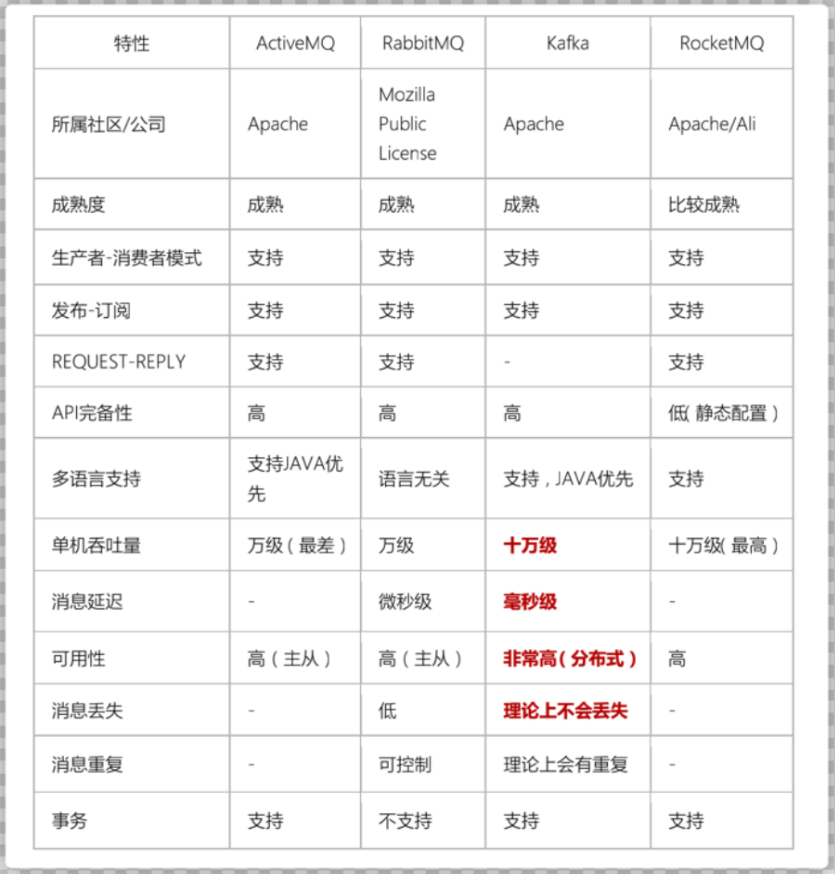

（1）流媒体平台有三个关键功能：

-  **发布和订阅记录流**，类似于消息队列或企业消息传递系统。
-  以**容错的持久方式存储记录流**。
-  记录发生时处理流。

（2）Kafka通常用于两大类应用：

-  构建可在**系统或应用程序之间**可靠获取数据的实时流数据管道
-  构建转换或响应数据流的实时流应用程序


（3）kafka名词解释

- topic：Kafka将消息分门别类，每一类的消息称之为一个主题（Topic）
- producer：发布消息的对象称之为主题生产者（Kafka topic producer）
- consumer：订阅消息并处理发布的消息的对象称之为主题消费者（consumers）
- broker：已发布的消息保存在一组服务器中，称之为Kafka集群。集群中的每一个服务器都是一个代理（Broker）。 消费者可以订阅一个或多个主题（topic），并从Broker拉数据，从而消费这些已发布的消息。

### 1.2 kafka安装和配置

课程中直接使用docker安装

#### 1.2.1 zookeeper部署

```sh
docker run -id --name zookeeper --net=bridge --restart=always  -p 2181:2181 zookeeper:3.4.14
```

#### 1.2.2 kafka部署

```sh
docker run -id --restart=always -p 9092:9092 --name kafka \
--env KAFKA_ADVERTISED_HOST_NAME=192.168.200.129 \
--env KAFKA_ZOOKEEPER_CONNECT=192.168.200.129:2181 \
--env KAFKA_ADVERTISED_LISTENERS=PLAINTEXT://192.168.200.129:9092 \
--env KAFKA_LISTENERS=PLAINTEXT://0.0.0.0:9092 \
--env KAFKA_HEAP_OPTS="-Xmx256M -Xms256M" \
--net=bridge wurstmeister/kafka:2.12-2.3.1
```


### 1.3 kafka入门案例

#### 1.3.1 创建工程kafka-test

创建kafka-test工程，引入依赖信息

```xml
<properties>
    <kafka.client.version>2.0.1</kafka.client.version>
</properties>
<dependencies>
    <dependency>
        <groupId>org.apache.kafka</groupId>
        <artifactId>kafka-clients</artifactId>
        <version>${kafka.client.version}</version>
    </dependency>
</dependencies>
```

做一个java普通的生产者和消费者只需要依赖`kafka-clients`即可

#### 1.3.2 消息生产者

创建类：

```java
package com.itheima.kafka.simple;

import org.apache.kafka.clients.producer.KafkaProducer;
import org.apache.kafka.clients.producer.ProducerConfig;
import org.apache.kafka.clients.producer.ProducerRecord;
import org.apache.kafka.common.protocol.types.Field;

import java.util.Properties;

/**
 * 消息生产者
 */
public class ProducerFastStart {

    private static final String TOPIC = "itcast-heima";

    public static void main(String[] args) {

        //添加kafka的配置信息
        Properties properties = new Properties();
        //配置broker信息
        properties.put("bootstrap.servers","192.168.200.130:9092");
        properties.put(ProducerConfig.KEY_SERIALIZER_CLASS_CONFIG,"org.apache.kafka.common.serialization.StringSerializer");
        properties.put(ProducerConfig.VALUE_SERIALIZER_CLASS_CONFIG,"org.apache.kafka.common.serialization.StringSerializer");
        properties.put(ProducerConfig.RETRIES_CONFIG,10);

        //生产者对象
        KafkaProducer<String,String> producer = new KafkaProducer<String, String>(properties);

        //封装消息
        ProducerRecord<String,String> record = new ProducerRecord<String, String>(TOPIC,"00001","hello kafka !");
        //发送消息
        try {
            producer.send(record);
        }catch (Exception e){
            e.printStackTrace();
        }

        //关系消息通道
        producer.close();
    }
}
```

[参考官网](http://kafka.apache.org/24/javadoc/index.html?org/apache/kafka/clients/producer/KafkaProducer.html)

#### 1.3.3 消息消费者

创建消费者类：

```java
package com.itheima.kafka.simple;

import org.apache.kafka.clients.consumer.ConsumerConfig;
import org.apache.kafka.clients.consumer.ConsumerRecord;
import org.apache.kafka.clients.consumer.ConsumerRecords;
import org.apache.kafka.clients.consumer.KafkaConsumer;

import java.time.Duration;
import java.util.Collections;
import java.util.Properties;

/**
 * 消息消费者
 */
public class ConsumerFastStart {

    private static final String TOPIC = "itcast-heima";

    public static void main(String[] args) {

        //添加配置信息
        Properties properties = new Properties();
        properties.put(ConsumerConfig.BOOTSTRAP_SERVERS_CONFIG,"192.168.200.130:9092");
        properties.put(ConsumerConfig.KEY_DESERIALIZER_CLASS_CONFIG,"org.apache.kafka.common.serialization.StringDeserializer");
        properties.put(ConsumerConfig.VALUE_DESERIALIZER_CLASS_CONFIG,"org.apache.kafka.common.serialization.StringDeserializer");
        //设置分组
        properties.put(ConsumerConfig.GROUP_ID_CONFIG,"group2");

        //创建消费者
        KafkaConsumer<String, String> consumer = new KafkaConsumer<String, String>(properties);
        //订阅主题
        consumer.subscribe(Collections.singletonList(TOPIC));

        while (true){
            ConsumerRecords<String, String> records = consumer.poll(Duration.ofMillis(1000));
            for (ConsumerRecord<String, String> record : records) {
                System.out.println(record.value());
                System.out.println(record.key());
            }
        }

    }
}
```

[参考官网](http://kafka.apache.org/24/javadoc/index.html?org/apache/kafka/clients/consumer/KafkaConsumer.html)

#### 1.3.4 测试及结论

- 生产者发送消息，同一个组中的多个消费者只能有一个消费者接收消息
- 生产者发送消息，如果有多个组，每个组中只能有一个消费者接收消息,如果想要实现广播的效果，可以让每个消费者单独有一个组即可，这样每个消费者都可以接收到消息

#### 1.3.5 相关概念再介绍

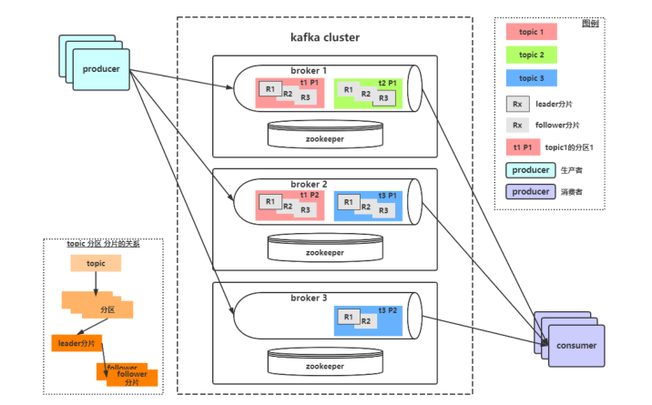

在kafka概述里介绍了概念包括：topic、producer、consumer、broker，这些是最基本的一些概念，想要更深入理解kafka还要知道它的一些其他概念定义：

- 消息Message

  Kafka 中的数据单元被称为消息message，也被称为记录，可以把它看作数据库表中某一行的记录。

- topic

  Kafka将消息分门别类，每一类的消息称之为一个主题（Topic）

- 批次

  为了提高效率， 消息会分批次写入 Kafka，批次就代指的是一组消息。

- <font color="red">分区Partition</font>  

  主题可以被分为若干个分区（partition），同一个主题中的分区可以不在一个机器上，有可能会部署在多个机器上，由此来实现 kafka 的伸缩性。topic中的数据分割为一个或多个partition。每个topic至少有一个partition。每个partition中的数据使用多个文件进行存储。**partition中的数据是有序的，partition之间的数据是没有顺序的**。**如果topic有多个partition，消费数据时就不能保证数据的顺序**。**在需要严格保证消息的消费顺序的场景下，需要将partition数目设为1。**

  ​		在Kafka集群中，主题被分为多个分区，并且分区会在broker之间复制、同步

  * 如果在生产消息的时候，指定一个key，可以确保同一个key的消息，总是在一个分区中
  * 基于上述的分区特点，Kafka是可以保证消息的有序性的。但如果不带key，是无法保证消息的有序性的，Kafka会以随机的方式写入到分区中

- broker

  一个独立的 Kafka 服务器就被称为 broker，broker 接收来自生产者的消息，为消息设置偏移量，并提交消息到磁盘保存。

- Broker 集群

  broker 是集群 的组成部分，broker 集群由一个或多个 broker 组成，每个集群都有一个 broker同时充当了集群控制器的角色（自动从集群的活跃成员中选举出来）。

- 副本Replica

  Kafka 中消息的备份又叫做 副本（Replica），副本的数量是可以配置的，Kafka 定义了两类副本：领导者副本（Leader Replica） 和 追随者副本（Follower Replica）；所有写请求都通过Leader路由，数据变更会广播给所有Follower，Follower与Leader保持数据同步。如果Leader失效，则从Follower中选举出一个新的Leader。当Follower与Leader挂掉、卡住或者同步太慢，leader会把这个follower从**ISR列表（保持同步的副本列表）**中删除，重新创建一个Follower。

- Zookeeper

  kafka对与zookeeper是强依赖的，是以zookeeper作为基础的，即使不做集群，也需要zk的支持。**Kafka通过Zookeeper管理集群配置，选举leader，以及在Consumer Group发生变化时进行重平衡**。

- 消费者群组Consumer Group

  生产者与消费者的关系就如同餐厅中的厨师和顾客之间的关系一样，一个厨师对应多个顾客，也就是一个生产者对应多个消费者，消费者群组（Consumer Group）指的就是由一个或多个消费者组成的群体。

- **偏移量Consumer Offset**

  偏移量（Consumer Offset）是一种元数据，它是一个不断递增的整数值，用来记录消费者发生重平衡时的位置，以便用来恢复数据。

- **重平衡Rebalance**

  消费者组内某个消费者实例挂掉后，其他消费者实例自动重新分配订阅主题分区的过程。Rebalance 是 Kafka 消费者端实现高可用的重要手段。

#### 1.3.5 生产者详解

（1）发送消息的工作原理


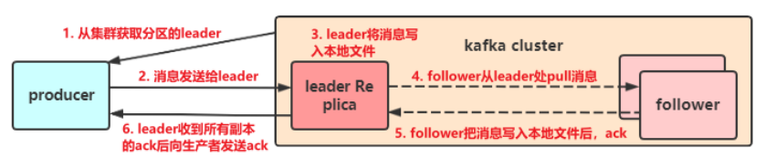

（2）发送类型

- 发送并忘记（fire-and-forget）

  把消息发送给服务器，并不关心它是否正常到达，大多数情况下，消息会正常到达，因为kafka是高可用的，而且生产者会自动尝试重发，使用这种方式有时候会丢失一些信息

- 同步发送

  使用send()方法发送，它会返回一个Future对象，调用get()方法进行等待，就可以知道消息是否发送成功

  ```java
  //发送消息
  try {
      RecordMetadata recordMetadata = producer.send(record).get();
      System.out.println(recordMetadata.offset());//获取偏移量
  }catch (Exception e){
      e.printStackTrace();
  }
  ```

  如果服务器返回错误，get()方法会抛出异常，如果没有发生错误，我们就会得到一个RecordMetadata对象，可以用它来获取消息的偏移量

- 异步发送

  调用send()方法，并指定一个回调函数，服务器在返回响应时调用函数。如下代码

  ```java
  //发送消息
  try {
      producer.send(record, new Callback() {
          @Override
          public void onCompletion(RecordMetadata recordMetadata, Exception e) {
              if(e!=null){
                  e.printStackTrace();
              }
              System.out.println(recordMetadata.offset());
          }
      });
  }catch (Exception e){
      e.printStackTrace();
  }
  ```

  如果kafka返回一个错误，onCompletion()方法会抛出一个非空（non null）异常，可以根据实际情况处理，比如记录错误日志，或者把消息写入“错误消息”文件中，方便后期进行分析。

**（3）参数详解**

到目前为止，我们只介绍了生产者的几个必要参数（bootstrap.servers、序列化器等）

生产者还有很多可配置的参数，在kafka官方文档中都有说明，大部分都有合理的默认值，所以没有必要去修改它们，不过有几个参数在内存使用，性能和可靠性方法对生产者有影响

- acks 

  指的是producer的消息发送确认机制

  - acks=0

    生产者在成功写入消息之前不会等待任何来自服务器的响应，也就是说，如果当中出现了问题，导致服务器没有收到消息，那么生产者就无从得知，消息也就丢失了。不过，因为生产者不需要等待服务器的响应，所以它可以以网络能够支持的最大速度发送消息，从而达到很高的吞吐量。

  - acks=1

    默认值；只要集群首领节点收到消息，生产者就会收到一个来自服务器的成功响应，如果消息无法到达首领节点，生产者会收到一个错误响应，为了避免数据丢失，生产者会重发消息。

  - acks=all

    只有当所有参与赋值的节点全部收到消息时，生产者才会收到一个来自服务器的成功响应，这种模式是最安全的，它可以保证不止一个服务器收到消息，就算有服务器发生崩溃，整个集群仍然可以运行。不过他的延迟比acks=1时更高。

- retries

  生产者从服务器收到的错误有可能是临时性错误，在这种情况下，retries参数的值决定了生产者可以重发消息的次数，如果达到这个次数，生产者会放弃重试返回错误，默认情况下，生产者会在每次重试之间等待100ms

  

#### 1.3.6 消费者详解

（1）消费者工作原理

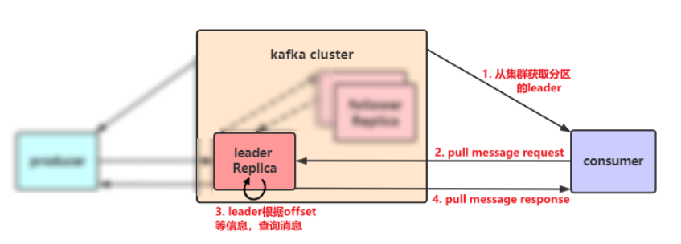

（2）其他参数详解

- enable.auto.commit

  该属性指定了消费者是否自动提交偏移量，默认值是true。为了尽量避免出现重复数据和数据丢失，可以把它设置为false，由自己控制何时提交偏移量。如果把它设置为true,还可以通过配置`auto.commit.interval.ms`属性来控制提交的频率。																																			

- auto.offset.reset

  - earliest

    当各分区下有已提交的offset时，从提交的offset开始消费；

    无提交的offset时，从头开始消费

  - latest

    当各分区下有已提交的offset时，从提交的offset开始消费；

    无提交的offset时，消费新产生的该分区下的数据

  - none

    topic各分区都存在已提交的offset时，从offset后开始消费；
  
    只要有一个分区不存在已提交的offset，则抛出异常
  
  - anything  else
  
    向consumer抛出异常

**（3）提交和偏移量**

每次调用poll()方法，它会返回由生产者写入kafka但还没有被消费者读取过来的记录，我们由此可以追踪到哪些记录是被群组里的哪个消费者读取的，kafka不会像其他JMS队列那样需要得到消费者的确认，这是kafka的一个独特之处，相反，消费者可以使用kafka来追踪消息在分区的位置（偏移量）

消费者会往一个叫做`_consumer_offset`的特殊主题发送消息，消息里包含了每个分区的偏移量。如果消费者一直处于运行状态，那么偏移量就没有什么用处。不过，如果消费者发生崩溃或有新的消费者加入群组，就会**触发再均衡**，完成再均衡之后，每个消费者可能分配到新的分区，消费者需要读取每个分区最后一次提交的偏移量，然后从偏移量指定的地方继续处理。

**如果提交偏移量小于客户端处理的最后一个消息的偏移量，那么处于两个偏移量之间的消息就会被重复处理。**

如下图：

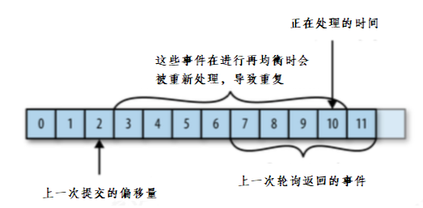

**如果提交的偏移量大于客户端的最后一个消息的偏移量，那么处于两个偏移量之间的消息将会丢失。**

如下图：

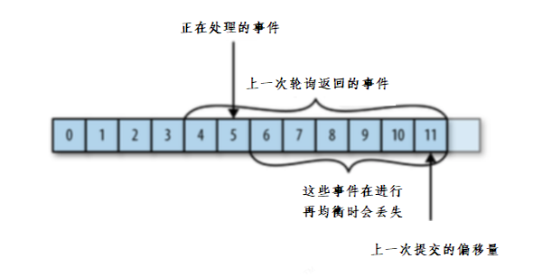

（4）自动提交偏移量

当`enable.auto.commit`被设置为true，提交方式就是让消费者自动提交偏移量，每隔5秒消费者会自动把从poll()方法接收的最大偏移量提交上去。提交时间间隔有`auto.commot.interval.ms`控制，默认值是5秒。

需要注意到，这种方式可能会导致消息重复消费。假如，某个消费者poll消息后，应用正在处理消息，在3秒后Kafka进行了重平衡，那么由于没有更新位移导致重平衡后这部分消息重复消费。

（5）提交当前偏移量（同步提交）

把`enable.auto.commit`设置为false,让应用程序决定何时提交偏移量。使用commitSync()提交偏移量，commitSync()将会提交poll返回的最新的偏移量，所以在处理完所有记录后要确保调用了commitSync()方法。否则还是会有消息丢失的风险。

只要没有发生不可恢复的错误，commitSync()方法会一直尝试直至提交成功，如果提交失败也可以记录到错误日志里。

```java
while (true){
    ConsumerRecords<String, String> records = consumer.poll(Duration.ofMillis(1000));
    for (ConsumerRecord<String, String> record : records) {
        System.out.println(record.value());
        System.out.println(record.key());
        try {
            consumer.commitSync();//同步提交当前最新的偏移量
        }catch (CommitFailedException e){
            System.out.println("记录提交失败的异常："+e);
        }

    }
}
```

（6）异步提交

手动提交有一个缺点，那就是当发起提交调用时应用会阻塞。当然我们可以减少手动提交的频率，但这个会增加消息重复的概率（和自动提交一样）。另外一个解决办法是，使用异步提交的API。

```java
while (true){
    ConsumerRecords<String, String> records = consumer.poll(Duration.ofMillis(1000));
    for (ConsumerRecord<String, String> record : records) {
        System.out.println(record.value());
        System.out.println(record.key());
    }
    consumer.commitAsync(new OffsetCommitCallback() {
        @Override
        public void onComplete(Map<TopicPartition, OffsetAndMetadata> map, Exception e) {
            if(e!=null){
                System.out.println("记录错误的提交偏移量："+ map+",异常信息"+e);
            }
        }
    });
}
```

(7）同步和异步组合提交

异步提交也有个缺点，那就是如果服务器返回提交失败，异步提交不会进行重试。相比较起来，同步提交会进行重试直到成功或者最后抛出异常给应用。异步提交没有实现重试是因为，如果同时存在多个异步提交，进行重试可能会导致位移覆盖。

举个例子，假如我们发起了一个异步提交commitA，此时的提交位移为2000，随后又发起了一个异步提交commitB且位移为3000；commitA提交失败但commitB提交成功，此时commitA进行重试并成功的话，会将实际上将已经提交的位移从3000回滚到2000，导致消息重复消费。

```java
try {
    while (true){
        ConsumerRecords<String, String> records = consumer.poll(Duration.ofMillis(1000));
        for (ConsumerRecord<String, String> record : records) {
            System.out.println(record.value());
            System.out.println(record.key());
        }
        consumer.commitAsync();
    }
}catch (Exception e){
    e.printStackTrace();
    System.out.println("记录错误信息："+e);
}finally {
    try {
        consumer.commitSync();
    }finally {
        consumer.close();
    }
}
```

### 1.4 spring boot集成kafka收发消息

#### 1.4.1 环境搭建

（1）pom依赖，最终的依赖信息

```xml
	<parent>
        <groupId>org.springframework.boot</groupId>
        <artifactId>spring-boot-starter-parent</artifactId>
        <version>2.3.2.RELEASE</version>
        <relativePath/> <!-- lookup parent from repository -->
    </parent>
    <!-- 继承Spring boot工程 -->
    <properties>
        <fastjson.version>1.2.58</fastjson.version>
    </properties>
    <dependencies>
        <dependency>
            <groupId>org.springframework.boot</groupId>
            <artifactId>spring-boot-starter-web</artifactId>
        </dependency>
        <!-- kafkfa -->
        <dependency>
            <groupId>org.springframework.kafka</groupId>
            <artifactId>spring-kafka</artifactId>
        </dependency>
        <dependency>
            <groupId>org.apache.kafka</groupId>
            <artifactId>kafka-streams</artifactId>
        </dependency>
        <dependency>
            <groupId>com.alibaba</groupId>
            <artifactId>fastjson</artifactId>
            <version>${fastjson.version}</version>
        </dependency>
        <!-- https://mvnrepository.com/artifact/org.projectlombok/lombok -->
        <dependency>
            <groupId>org.projectlombok</groupId>
            <artifactId>lombok</artifactId>
            <version>1.18.12</version>
            <scope>provided</scope>
        </dependency>
    </dependencies>
```

（2）在resources下创建文件application.yml

```yaml
server:
  port: 9991
spring:
  application:
    name: kafka-demo
  kafka:
    bootstrap-servers: 192.168.200.130:9092
    producer:
      retries: 10
      key-serializer: org.apache.kafka.common.serialization.StringSerializer
      value-serializer: org.apache.kafka.common.serialization.StringSerializer
    consumer:
      group-id: test-hello-group
      key-deserializer: org.apache.kafka.common.serialization.StringDeserializer
      value-deserializer: org.apache.kafka.common.serialization.StringDeserializer
```

（3）引导类

```java
package com.itheima.kafka;

import org.springframework.boot.SpringApplication;
import org.springframework.boot.autoconfigure.SpringBootApplication;

@SpringBootApplication
public class KafkaApplication {

    public static void main(String[] args) {
        SpringApplication.run(KafkaApplication.class,args);
    }
}
```

#### 1.4.2 消息生产者

新建controller

```java
package com.itheima.kafka.controller;

import org.springframework.beans.factory.annotation.Autowired;
import org.springframework.kafka.core.KafkaTemplate;
import org.springframework.web.bind.annotation.GetMapping;
import org.springframework.web.bind.annotation.RestController;

@RestController
public class HelloController {

    @Autowired
    private KafkaTemplate<String,String> kafkaTemplate;

    @GetMapping("/hello")
    public String hello(){
        //第一个参数：topics  
        //第二个参数：消息内容
        kafkaTemplate.send("kafka-hello","黑马程序员");
        return "ok";
    }
}
```

#### 1.4.3 消息消费者

新建监听类：

```java
package com.itheima.kafka.listener;

import org.apache.kafka.clients.consumer.ConsumerRecord;
import org.springframework.kafka.annotation.KafkaListener;
import org.springframework.stereotype.Component;

import java.util.Optional;

@Component
public class HelloListener {

    @KafkaListener(topics = {"hello-itcast"})
    public void receiverMessage(ConsumerRecord<?,?> record){
        Optional<? extends ConsumerRecord<?, ?>> optional = Optional.ofNullable(record);
        if(optional.isPresent()){
            Object value = record.value();
            System.out.println(value);
        }
    }
  
  // 或者使用
    @KafkaListener(topics = HelloController.TOPIC)
    public void receiverMessage(String message) {
        if (!StringUtils.isEmpty(message)) {
            System.out.println(message);
        }
    }
}
```

#### 1.4.4 测试

启动项目访问：http://localhost:9991/hello

控制台打印，效果如下

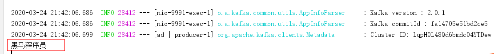

### 1.5 传递消息为对象

目前springboot整合后的kafka，因为序列化器是StringSerializer，这个时候如果需要传递对象可以有两种方式

方式一：可以自定义序列化器，对象类型众多，这种方式通用性不强，本章节不介绍

方式二：可以把要传递的对象进行转json字符串，接收消息后再转为对象即可，本项目采用这种方式

（1）新建类User

```java
package com.itheima.kafka.pojo;

public class User {

    private String username;
    private Integer age;

    //setter  getter
}

```

（2）修改消息发送

```java
@RestController
public class HelloController {

    @Autowired
    private KafkaTemplate<String,Object> kafkaTemplate;

    @GetMapping("/hello")
    public String hello(){
        //发送消息
        User user = new User();
        user.setUsername("zhangsan");
        user.setAge(18);
        kafkaTemplate.send("kafka-hello", JSON.toJSONString(user));
        return "ok";
    }
}
```

（4）修改消费者

```java
@Component
public class HelloListener {

    @KafkaListener(topics = {"hello-itcast"})
    public void receiverMessage(ConsumerRecord<?,?> record){
        Optional<? extends ConsumerRecord<?, ?>> optional = Optional.ofNullable(record);
        if(optional.isPresent()){
            Object value = record.value();
            User user = JSON.parseObject((String) value, User.class);
            System.out.println(user);
        }
    }
}
```

测试效果如下：

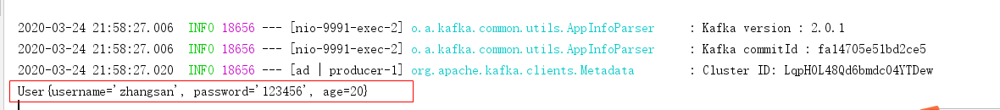


## 2 内容安全第三方接口对接

### 2.1 内容安全接口选型

内容安全是识别服务，支持对图片、视频、文本、语音等对象进行多样化场景检测，有效降低内容违规风险。

黑马头条发布文章中有内容可能违规，如何有效避免风险，可以使用第三方接口进行内容检测。

目前很多平台都支持内容检测，如阿里云、腾讯云、百度AI、网易云等国内大型互联网公司都对外提供了API。

按照性能和收费来看，黑马头条项目使用的就是阿里云的内容安全接口，使用到了图片和文本的审核。

阿里云收费标准：https://www.aliyun.com/price/product/?spm=a2c4g.11186623.2.10.4146401eg5oeu8#/lvwang/detail

### 2.2 阿里云服务介绍

#### 2.2.1 准备工作

您在使用内容检测API之前，需要先注册阿里云账号，添加Access Key并签约云盾内容安全。

**操作步骤**

1. 前往[阿里云官网](https://www.aliyun.com/)注册账号。如果已有注册账号，请跳过此步骤。

   进入阿里云首页后，如果没有阿里云的账户需要先进行注册，才可以进行登录。由于注册较为简单，课程和讲义不在进行体现（注册可以使用多种方式，如淘宝账号、支付宝账号、微博账号等...）。

   需要实名认证和活体认证。

2. 打开[云盾内容安全产品试用页面](https://promotion.aliyun.com/ntms/act/lvwangdemo.html)，单击**立即开通**，正式开通服务。

   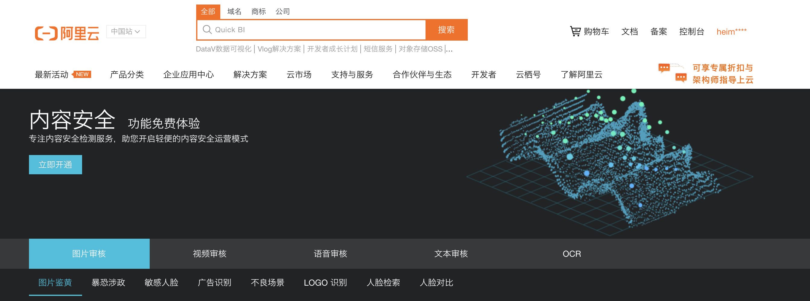

   内容安全控制台

   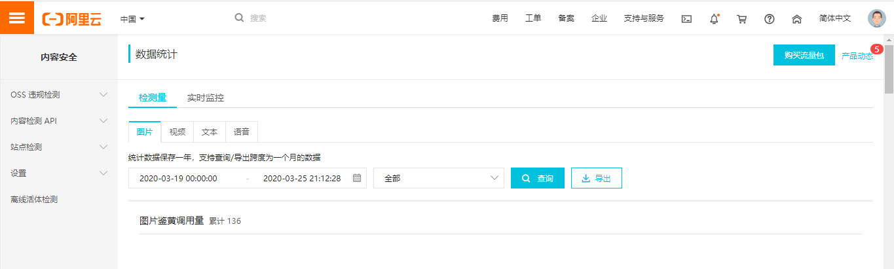

3. 在[AccessKey管理页面](https://ak-console.aliyun.com/#/accesskey)管理您的AccessKeyID和AccessKeySecret。

   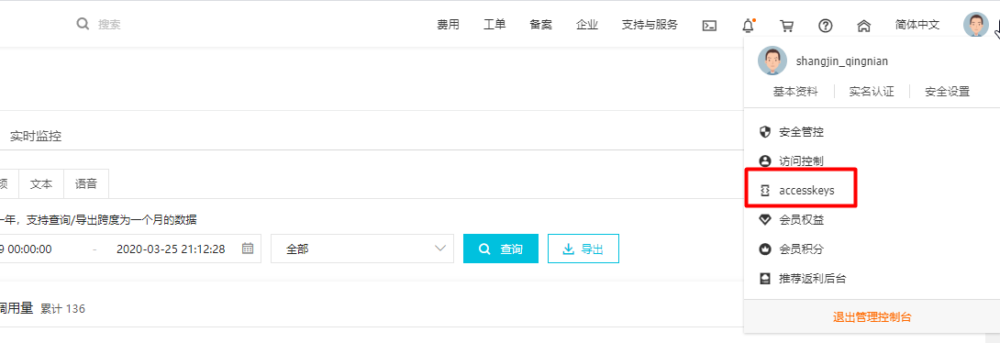

   管理自己的AccessKey,可以新建和删除AccessKey

   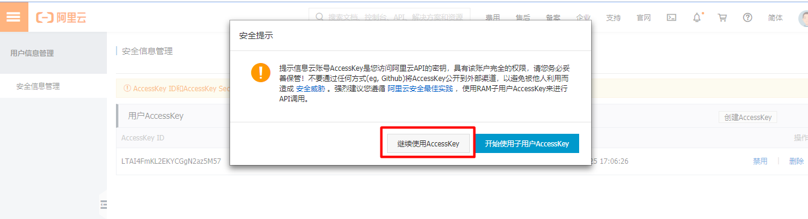

   查看自己的AccessKey，

   AccessKey默认是隐藏的，第一次申请的时候可以保存AccessKey，点击显示，通过验证手机号后也可以查看

   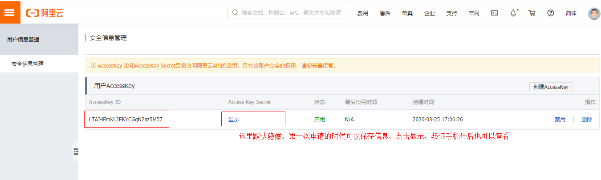

#### 2.2.2 阿里云安全-文本内容垃圾检测

[文本垃圾内容检测接口说明](https://help.aliyun.com/document_detail/70439.html?spm=a2c4g.11186623.6.659.35ac3db3l0wV5k)

示例代码地址：https://help.aliyun.com/document_detail/53427.html?spm=a2c4g.11186623.6.717.466d7544QbU8Lr

创建项目aliyun-sdk-demo

安装sdk

```xml
<dependencies>
    <!-- 阿里云内容安全sdk -->
  <dependency>
      <groupId>com.aliyun</groupId>
      <artifactId>aliyun-java-sdk-core</artifactId>
      <version>4.1.1</version>
  </dependency>
  <dependency>
      <groupId>com.aliyun</groupId>
      <artifactId>aliyun-java-sdk-green</artifactId>
      <version>3.6.2</version>
  </dependency>
  <dependency>
      <groupId>com.alibaba</groupId>
      <artifactId>fastjson</artifactId>
      <version>1.2.51</version>
  </dependency>
  <dependency>
      <groupId>com.aliyun.oss</groupId>
      <artifactId>aliyun-sdk-oss</artifactId>
      <version>2.8.3</version>
  </dependency>

    <dependency>
        <groupId>commons-io</groupId>
        <artifactId>commons-io</artifactId>
        <version>2.4</version>
    </dependency>

    <dependency>
        <groupId>commons-codec</groupId>
        <artifactId>commons-codec</artifactId>
        <version>1.10</version>
    </dependency>
  	<dependency>
   	 <groupId>commons-logging</groupId>
   	 <artifactId>commons-logging</artifactId>
  	 <version>1.2</version>
 		</dependency>
</dependencies>
```

示例代码

```java
package com.itheima.aliyun.util;

import com.alibaba.fastjson.JSON;
import com.alibaba.fastjson.JSONArray;
import com.alibaba.fastjson.JSONObject;
import com.aliyun.oss.ClientException;
import com.aliyuncs.DefaultAcsClient;
import com.aliyuncs.IAcsClient;
import com.aliyuncs.exceptions.ServerException;
import com.aliyuncs.green.model.v20180509.TextScanRequest;
import com.aliyuncs.http.FormatType;
import com.aliyuncs.http.HttpResponse;
import com.aliyuncs.profile.DefaultProfile;
import com.aliyuncs.profile.IClientProfile;

import java.util.*;

public class Main {

    public static void main(String[] args) throws Exception {
        IClientProfile profile = DefaultProfile
            .getProfile("cn-shanghai", "LTAI4F1mKL2EKYCGgN2az5M57", "XjgvRoAGzM3rWQxKWDJx198VWOmO0Hz");
        DefaultProfile
            .addEndpoint("cn-shanghai", "cn-shanghai", "Green", "green.cn-shanghai.aliyuncs.com");        
        IAcsClient client = new DefaultAcsClient(profile);
        TextScanRequest textScanRequest = new TextScanRequest();
        textScanRequest.setAcceptFormat(FormatType.JSON); // 指定API返回格式。
        textScanRequest.setHttpContentType(FormatType.JSON);
        textScanRequest.setMethod(com.aliyuncs.http.MethodType.POST); // 指定请求方法。
        textScanRequest.setEncoding("UTF-8");
        textScanRequest.setRegionId("cn-shanghai");
        List<Map<String, Object>> tasks = new ArrayList<Map<String, Object>>();
        Map<String, Object> task1 = new LinkedHashMap<String, Object>();
        task1.put("dataId", UUID.randomUUID().toString());
        /**
         * 待检测的文本，长度不超过10000个字符。
         */
        task1.put("content", "我是一个文本,买卖冰毒是违法的");
        tasks.add(task1);
        JSONObject data = new JSONObject();

        /**
         * 检测场景。文本垃圾检测请传递antispam。
         **/
        data.put("scenes", Arrays.asList("antispam"));
        data.put("tasks", tasks);
        System.out.println("参数："+JSON.toJSONString(data, true));
        textScanRequest.setHttpContent(data.toJSONString().getBytes("UTF-8"), "UTF-8", FormatType.JSON);
        // 请务必设置超时时间。
        textScanRequest.setConnectTimeout(3000);
        textScanRequest.setReadTimeout(6000);
        try {
            HttpResponse httpResponse = client.doAction(textScanRequest);
            if(httpResponse.isSuccess()){
                JSONObject scrResponse = JSON.parseObject(new String(httpResponse.getHttpContent(), "UTF-8"));
                System.out.println("结果："+JSON.toJSONString(scrResponse, true));
                if (200 == scrResponse.getInteger("code")) {
                    JSONArray taskResults = scrResponse.getJSONArray("data");
                    for (Object taskResult : taskResults) {
                        if(200 == ((JSONObject)taskResult).getInteger("code")){
                            JSONArray sceneResults = ((JSONObject)taskResult).getJSONArray("results");
                            for (Object sceneResult : sceneResults) {
                                String scene = ((JSONObject)sceneResult).getString("scene");
                                String suggestion = ((JSONObject)sceneResult).getString("suggestion");
                                //根据scene和suggetion做相关处理。
                                //suggestion == pass表示未命中垃圾。suggestion == block表示命中了垃圾，可以通过label字段查看命中的垃圾分类。
                                System.out.println("args = [" + scene + "]");
                                System.out.println("args = [" + suggestion + "]");
                            }
                        }else{
                            System.out.println("task process fail:" + ((JSONObject)taskResult).getInteger("code"));
                        }
                    }
                } else {
                    System.out.println("detect not success. code:" + scrResponse.getInteger("code"));
                }
            }else{
                System.out.println("response not success. status:" + httpResponse.getStatus());
            }
        } catch (ServerException e) {
            e.printStackTrace();
        } catch (ClientException e) {
            e.printStackTrace();
        } catch (Exception e) {
            e.printStackTrace();
        }
    }

}
```

测试一：输入以上的内容，检测通过

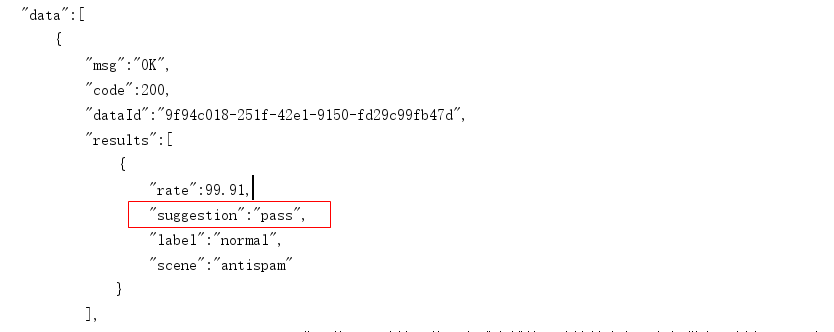


测试二：如果在上述文本内容中添加“冰毒买卖”，就会未通过

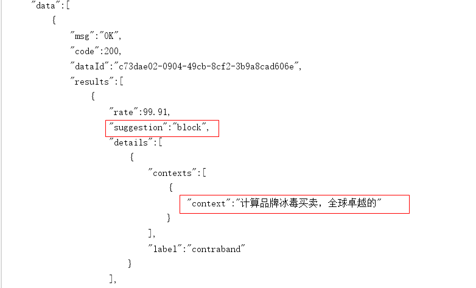


#### 2.2.3 阿里云安全-图片审核

参考阿里云提供的接口文档说明[文档地址](https://help.aliyun.com/document_detail/70292.html?spm=a2c4g.11186623.6.616.5d7d1e7f9vDRz4)

[示例代码地址](https://help.aliyun.com/document_detail/53424.html?spm=a2c4g.11186623.6.715.c8f69b12ey35j4)

注意事项：如果使用本地文件或者二进制文件检测，请下载并在项目工程中引入[Extension.Uploader工具类](https://aligreen-shanghai-share.oss-cn-shanghai.aliyuncs.com/com.aliyuncs.green.extension.uploader.zip)。

修改后的示例代码

```java
import com.alibaba.fastjson.JSON;
import com.alibaba.fastjson.JSONArray;
import com.alibaba.fastjson.JSONObject;
import com.aliyuncs.DefaultAcsClient;
import com.aliyuncs.IAcsClient;
import com.aliyuncs.green.model.v20180509.ImageSyncScanRequest;
import com.aliyuncs.http.FormatType;
import com.aliyuncs.http.HttpResponse;
import com.aliyuncs.http.MethodType;
import com.aliyuncs.http.ProtocolType;
import com.aliyuncs.profile.DefaultProfile;
import com.aliyuncs.profile.IClientProfile;

import java.util.*;

public class ImgMain {

    public static void main(String[] args) throws Exception {
        IClientProfile profile = DefaultProfile
                .getProfile("cn-shanghai", "LTAI4FzL1ddwcgSNDv3GTfJZ1", "13ygpLlW8MUervH5U2it420vGG1AcbF");
        DefaultProfile
                .addEndpoint("cn-shanghai", "cn-shanghai", "Green", "green.cn-shanghai.aliyuncs.com");
        IAcsClient client = new DefaultAcsClient(profile);

        ImageSyncScanRequest imageSyncScanRequest = new ImageSyncScanRequest();
        // 指定API返回格式。
        imageSyncScanRequest.setAcceptFormat(FormatType.JSON);
        // 指定请求方法。
        imageSyncScanRequest.setMethod(MethodType.POST);
        imageSyncScanRequest.setEncoding("utf-8");
        // 支持HTTP和HTTPS。
        imageSyncScanRequest.setProtocol(ProtocolType.HTTP);


        JSONObject httpBody = new JSONObject();
        /**
         * 设置要检测的风险场景。计费依据此处传递的场景计算。
         * 一次请求中可以同时检测多张图片，每张图片可以同时检测多个风险场景，计费按照场景计算。
         * 例如，检测2张图片，场景传递porn和terrorism，计费会按照2张图片鉴黄，2张图片暴恐检测计算。
         * porn：表示鉴黄场景。
         */
        httpBody.put("scenes", Arrays.asList("terrorism"));

        /**
         * 设置待检测图片。一张图片对应一个task。
         * 多张图片同时检测时，处理的时间由最后一个处理完的图片决定。
         * 通常情况下批量检测的平均响应时间比单张检测的要长。一次批量提交的图片数越多，响应时间被拉长的概率越高。
         * 这里以单张图片检测作为示例, 如果是批量图片检测，请自行构建多个task。
         */
        JSONObject task = new JSONObject();
        task.put("dataId", UUID.randomUUID().toString());

        // 设置图片链接。
        task.put("url", "https://heimaleadnewsoss.oss-cn-shanghai.aliyuncs.com/material/2021/1/20210112/205cd5d3346a48b59352c92808709da1.jpg");
        task.put("time", new Date());
        httpBody.put("tasks", Arrays.asList(task));

        imageSyncScanRequest.setHttpContent(org.apache.commons.codec.binary.StringUtils.getBytesUtf8(httpBody.toJSONString()),
            "UTF-8", FormatType.JSON);

        /**
         * 请设置超时时间。服务端全链路处理超时时间为10秒，请做相应设置。
         * 如果您设置的ReadTimeout小于服务端处理的时间，程序中会获得一个read timeout异常。
         */
        imageSyncScanRequest.setConnectTimeout(3000);
        imageSyncScanRequest.setReadTimeout(10000);
        HttpResponse httpResponse = null;
        try {
            httpResponse = client.doAction(imageSyncScanRequest);
        } catch (Exception e) {
            e.printStackTrace();
        }

        // 服务端接收到请求，完成处理后返回的结果。
        if (httpResponse != null && httpResponse.isSuccess()) {
            JSONObject scrResponse = JSON.parseObject(org.apache.commons.codec.binary.StringUtils.newStringUtf8(httpResponse.getHttpContent()));
            System.out.println(JSON.toJSONString(scrResponse, true));
            int requestCode = scrResponse.getIntValue("code");
            // 每一张图片的检测结果。
            JSONArray taskResults = scrResponse.getJSONArray("data");
            if (200 == requestCode) {
                for (Object taskResult : taskResults) {
                    // 单张图片的处理结果。
                    int taskCode = ((JSONObject) taskResult).getIntValue("code");
                    // 图片对应检测场景的处理结果。如果是多个场景，则会有每个场景的结果。
                    JSONArray sceneResults = ((JSONObject) taskResult).getJSONArray("results");
                    if (200 == taskCode) {
                        for (Object sceneResult : sceneResults) {
                            String scene = ((JSONObject) sceneResult).getString("scene");
                            String suggestion = ((JSONObject) sceneResult).getString("suggestion");
                            // 根据scene和suggestion做相关处理。
                            // 根据不同的suggestion结果做业务上的不同处理。例如，将违规数据删除等。
                            System.out.println("scene = [" + scene + "]");
                            System.out.println("suggestion = [" + suggestion + "]");
                        }
                    } else {
                        // 单张图片处理失败, 原因视具体的情况详细分析。
                        System.out.println("task process fail. task response:" + JSON.toJSONString(taskResult));
                    }
                }
            } else {
                /**
                 * 表明请求整体处理失败，原因视具体的情况详细分析。
                 */
                System.out.println("the whole image scan request failed. response:" + JSON.toJSONString(scrResponse));
            }
        }
    }

}
```

测试：

测试结果，ak47.jpg涉及兵器，审核不通过，itheima.jpg审核通过，如果文章中有任何一张图片审核不通过，则文章审核就不通过。

image1测试结果：不通过

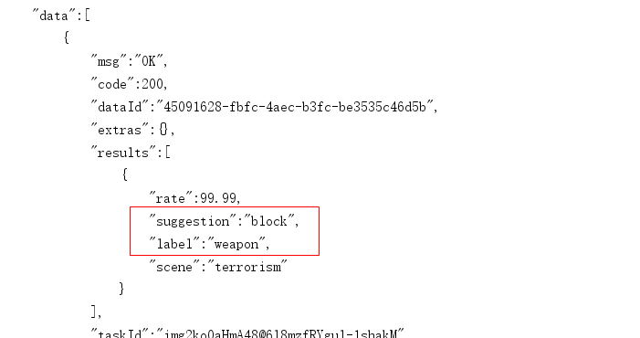

image2测试结果：通过

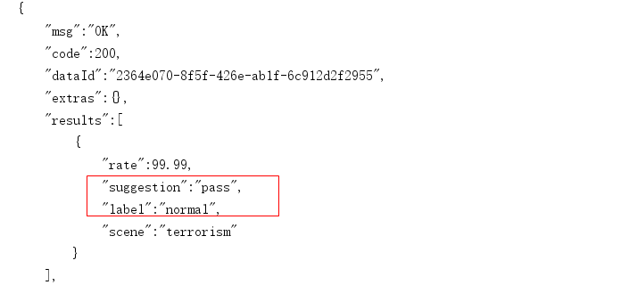


## 	3 阿里云安全集成到项目

### 3.1 依赖引入

创建 `autoconfiguration-aliyun-security` 模块引入阿里云sdk依赖

```xml
<dependencies>
  <dependency>
    <groupId>com.aliyun</groupId>
    <artifactId>aliyun-java-sdk-core</artifactId>
  </dependency>
  <dependency>
    <groupId>com.aliyun</groupId>
    <artifactId>aliyun-java-sdk-green</artifactId>
  </dependency>
  <!--OSS-->
  <dependency>
    <groupId>com.aliyun.oss</groupId>
    <artifactId>aliyun-sdk-oss</artifactId>
    <version>3.10.2</version>
  </dependency>
  <dependency>
    <groupId>com.alibaba</groupId>
    <artifactId>fastjson</artifactId>
  </dependency>
  <dependency>
    <groupId>org.springframework.boot</groupId>
    <artifactId>spring-boot-autoconfigure</artifactId>
  </dependency>
  <dependency>
    <groupId>org.springframework.boot</groupId>
    <artifactId>spring-boot-starter</artifactId>
  </dependency>
  <dependency>
    <groupId>org.springframework.boot</groupId>
    <artifactId>spring-boot-configuration-processor</artifactId>
    <optional>true</optional>
  </dependency>
  <dependency>
    <groupId>org.springframework.boot</groupId>
    <artifactId>spring-boot-starter-actuator</artifactId>
  </dependency>
</dependencies>
```

### 3.2 引入图片上传工具类

从之前测试阿里云服务的工程拷贝到`autoconfiguration-aliyun-security`中，结构如下：

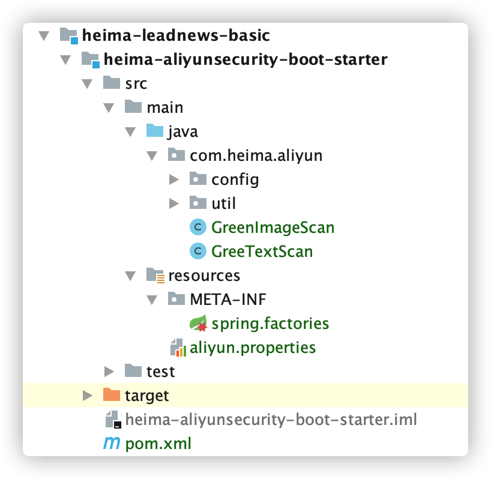

引入 资料文件夹下：**文本内容审核和图片审核** 对应的工具类


### 3.3 新建配置文件


在resources中新建aliyun.properties

```properties
aliyun.accessKeyId=LTAI4FzL1ddwcgSNDv3GTfJZ1
aliyun.secret=13ygpLlW8MUervH5U2it420vGGAcbF1
#aliyun.scenes=porn,terrorism,ad,qrcode,live,logo
aliyun.scenes=porn,terrorism
```

参数说明：[scenes](https://help.aliyun.com/document_detail/70292.html?spm=a2c4g.11186623.6.621.8b4abb0aodKTCS)，当前的这个场景设置，只有在图片审核的时候会用到，可以根据实际情况自由组合

- porn：图片智能鉴黄
- terrorism：图片暴恐涉政
- ad：图文违规
- qrcode：图片二维码
- live：图片不良场景
- logo：图片logo

创建 配置类：

```java
@Configuration
@ComponentScan("com.heima.aliyun")
public class AliyunConfig {
}
```

创建 `META-INF/spring.factories` 文件：

```properties
org.springframework.boot.autoconfigure.EnableAutoConfiguration=\
com.heima.aliyun.config.AliyunConfig
```

### 3.4 测试

后期需要在admin微服务中使用，可以在admin微服中引用

在`admin-service`微服务中添加依赖，支持阿里云接口服务

创建测试类：

分别测试文本垃圾检测接口和图片审核接口

```java
package com.heima.admin;
import com.heima.common.aliyun.GreeTextScan;
import com.heima.common.aliyun.GreenImageScan;
import org.junit.Test;
import org.junit.runner.RunWith;
import org.springframework.beans.factory.annotation.Autowired;
import org.springframework.boot.test.context.SpringBootTest;
import org.springframework.test.context.junit4.SpringRunner;
import java.util.ArrayList;
import java.util.List;
import java.util.Map;
/**
 * @Description:
 * @Version: V1.0
 */
@SpringBootTest(classes = AdminApplication.class)
@RunWith(SpringRunner.class)
public class AliyunTest {
    @Autowired
    private GreeTextScan greeTextScan;
    @Autowired
    private GreenImageScan greenImageScan;
    @Test
    public void testText() throws Exception{
        Map map = greeTextScan.greeTextScan("我是一个文本,冰毒买卖是违法的");
        System.out.println(map);
    }
    @Test
    public void testImage() throws Exception {
        List<String> images = new ArrayList<>();
        images.add("https://heimaleadnewsoss.oss-cn-shanghai.aliyuncs.com/material/2021/1/20210112/205cd5d3346a48b59352c92808709da1.jpg");
        Map map = greenImageScan.imageUrlScan(images);
        System.out.println(map);
    }
}
```

## 4 敏感词过滤算法DFA

敏感词过滤方案 【敏感词 】

> 1 使用数据库模糊查询，效率太低
>
> 2 使用String.indexOf("")查找，数据库量大的话也是比较慢
>
> 3 把敏感词和内容使用全文检索（solr,ElasticSearche）技术进行分词再匹配，也是可以的，但是这种方案比较麻烦。
>
> 4 DFA算法，确定有穷自动机。本项目采用这种方案

DFA全称为：Deterministic Finite Automaton,即确定有穷自动机。其特征为：有一个有限状态集合和一些从一个状态通向另一个状态的边，每条边上标记有一个符号，其中一个状态是初态，某些状态是终态。但不同于不确定的有限自动机，DFA中不会有从同一状态出发的两条边标志有相同的符号。

- 一次性的把所有的敏感词存储到了多个map中，就是下图表示这种结构

敏感词：冰毒、大麻、大坏蛋


- 检索的过程，就是hashMap的get实现

> 1、第一个字“冰”，我们在hashMap中可以找到。得到一个新的map = hashMap.get("")。
>
> 2、如果map == null，则不是敏感词。否则跳至3
>
> 3、获取map中的isEnd，通过isEnd是否等于1来判断该词是否为最后一个。如果isEnd == 1表示该词为敏感词，否则跳至1。
>
> 通过这个步骤我们可以判断“冰毒”为敏感词，但是如果我们输入“冰箱”则不是敏感词了。

工具类：

```java
package com.heima.utils.common;
import java.util.*;
public class SensitiveWordUtil {
    public static Map<String, Object> dictionaryMap = new HashMap<>();
    /**
     * 生成关键词字典库
     * @param words
     * @return
     */
    public static void initMap(Collection<String> words) {
        if (words == null) {
            System.out.println("敏感词列表不能为空");
            return ;
        }

        // map初始长度words.size()，整个字典库的入口字数(小于words.size()，因为不同的词可能会有相同的首字)
        Map<String, Object> map = new HashMap<>(words.size());
        // 遍历过程中当前层次的数据
        Map<String, Object> curMap = null;
        Iterator<String> iterator = words.iterator();
        while (iterator.hasNext()) {
            String word = iterator.next();
            curMap = map;
            int len = word.length();
            for (int i =0; i < len; i++) {
                // 遍历每个词的字
                String key = String.valueOf(word.charAt(i));
                // 当前字在当前层是否存在, 不存在则新建, 当前层数据指向下一个节点, 继续判断是否存在数据
                Map<String, Object> wordMap = (Map<String, Object>) curMap.get(key);
                if (wordMap == null) {
                    // 每个节点存在两个数据: 下一个节点和isEnd(是否结束标志)
                    wordMap = new HashMap<>(2);
                    wordMap.put("isEnd", "0");
                    curMap.put(key, wordMap);
                }
                curMap = wordMap;
                // 如果当前字是词的最后一个字，则将isEnd标志置1
                if (i == len -1) {
                    curMap.put("isEnd", "1");
                }
            }
        }
        dictionaryMap = map;
    }

    /**
     * 搜索文本中某个文字是否匹配关键词
     * @param text
     * @param beginIndex
     * @return
     */
    private static int checkWord(String text, int beginIndex) {
        if (dictionaryMap == null) {
            throw new RuntimeException("字典不能为空");
        }
        boolean isEnd = false;
        int wordLength = 0;
        Map<String, Object> curMap = dictionaryMap;
        int len = text.length();
        // 从文本的第beginIndex开始匹配
        for (int i = beginIndex; i < len; i++) {
            String key = String.valueOf(text.charAt(i));
            // 获取当前key的下一个节点
            curMap = (Map<String, Object>) curMap.get(key);
            if (curMap == null) {
                break;
            } else {
                wordLength ++;
                if ("1".equals(curMap.get("isEnd"))) {
                    isEnd = true;
                }
            }
        }
        if (!isEnd) {
            wordLength = 0;
        }
        return wordLength;
    }

    /**
     * 获取匹配的关键词和命中次数
     * @param text
     * @return
     */
    public static Map<String, Integer> matchWords(String text) {
        Map<String, Integer> wordMap = new HashMap<>();
        int len = text.length();
        for (int i = 0; i < len; i++) {
            int wordLength = checkWord(text, i);
            if (wordLength > 0) {
                String word = text.substring(i, i + wordLength);
                // 添加关键词匹配次数
                if (wordMap.containsKey(word)) {
                    wordMap.put(word, wordMap.get(word) + 1);
                } else {
                    wordMap.put(word, 1);
                }
                i += wordLength - 1;
            }
        }
        return wordMap;
    }

}
```

新建测试类：

```java
package com.heima.admin;
import com.heima.utils.common.SensitiveWordUtil;
import java.util.ArrayList;
import java.util.List;
import java.util.Map;
public class SensitiveWordUtilTest {
    public static void main(String[] args) {
        // 初始化 敏感词 列表
        List<String> list = new ArrayList<>();
        list.add("冰毒");
        list.add("特朗普");
        SensitiveWordUtil.initMap(list);
        // 待查询文本
        String content="我是一个好人，买卖冰毒是违法的特朗普";
        // 匹配文本
        Map<String, Integer> map = SensitiveWordUtil.matchWords(content);
        System.out.println(map);
    }
}
```