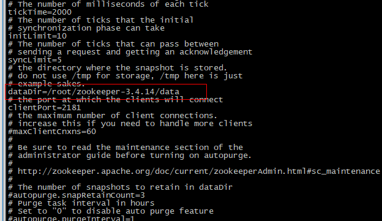
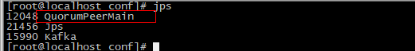
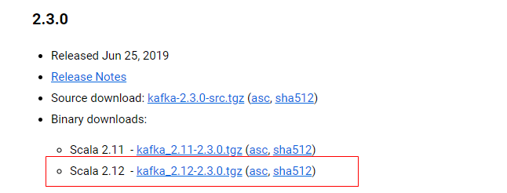
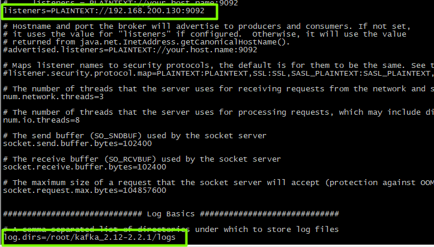

# Linux本机安装 Kafka

## 1 kafka

### 1.1 kafka介绍

Kafka 是一个分布式流媒体平台

kafka官网：http://kafka.apache.org/

（1）流媒体平台有三个关键功能：

-  **发布和订阅记录流**，类似于消息队列或企业消息传递系统。
-  以**容错的持久方式存储记录流**。
-  记录发生时处理流。

（2）Kafka通常用于两大类应用：

-  构建可在**系统或应用程序之间**可靠获取数据的实时流数据管道
-  构建转换或响应数据流的实时流应用程序


（3）kafka名词解释

- topic：Kafka将消息分门别类，每一类的消息称之为一个主题（Topic）
- producer：发布消息的对象称之为主题生产者（Kafka topic producer）
- consumer：订阅消息并处理发布的消息的对象称之为主题消费者（consumers）
- broker：已发布的消息保存在一组服务器中，称之为Kafka集群。集群中的每一个服务器都是一个代理（Broker）。 消费者可以订阅一个或多个主题（topic），并从Broker拉数据，从而消费这些已发布的消息。

### 1.2 kafka安装和配置

#### 1.2.1 jdk环境

首先需要安装Java环境，同时配置环境变量

#### 1.2.2 zookeeper安装

Zookeeper是安装Kafka集群的必要组件，Kafka通过Zookeeper来实施对元数据信息的管理，包括集
群、主题、分区等内容。
同样在官网下载安装包到指定目录解压缩

ZooKeeper 官网： http://zookeeper.apache.org/

在今天提供的资料中，有一个zookeeper-3.4.14.tar.gz包，上传到服务器，也可以到官网上下载

（1）解压压缩包

```shell
tar zxvf zookeeper-3.4.14.tar.gz
```

（2）修改配置文件，进入安装路径conf目录，并将zoo_sample.cfg文件修改为zoo.cfg

```shell
cd zookeeper-3.4.14  #进入安装目录
cd conf   #进入配置目录
mv zoo_sample.cfg zoo.cfg  # 把文件改名
```


（3）创建存放数据的目录 data

在zookeeper安装的根目录创建目录 data

```shell
mkdir data 
```

创建完的效果如下：


（4）配置数据存储目录

进入conf目录下，编辑zoo.cfg

```shell
vi conf/zoo.cfg
```

修改内容，如下图



（5）启动zookeeper

进入bin目录

```shell
./zkServer.sh start # 启动
./zkServer.sh status # 查看状态
./zkServer.sh restart # 重启
./zkServer.sh stop # 关闭
```

启动后可以查看进行

```shell
jps
```



#### 1.2.3 kafka安装

（1）官网下载

下载地址：http://kafka.apache.org/downloads



也可以在今天的资源文件夹中找到这个安装，直接上传到服务器即可

（2）解压

```shell
tar zxvf kafka_2.12-2.2.1.tgz
```

（3）修改参数

修改config目录下的server.properties文件,效果如下

- 修改listeners=PLAINTEXT://host:9092
- log.dirs=/root/kafka_2.12-2.2.1/logs       <font color='gree'>需要在kafka安装目录新建logs目录</font>



（4）启动kafka

在kafka的根目录

```shell
bin/kafka-server-start.sh config/server.properties  #启动kafka
```

查看进程


（5）配置Zookeeper的链接的地址

如果kafka和zk在同一台服务器上，则可以按照默认配置即可

```sh
zookeeper.connect=ip:2181
```


<font color='red'>注意：启动kafka之前，必须先启动zookeeper</font>