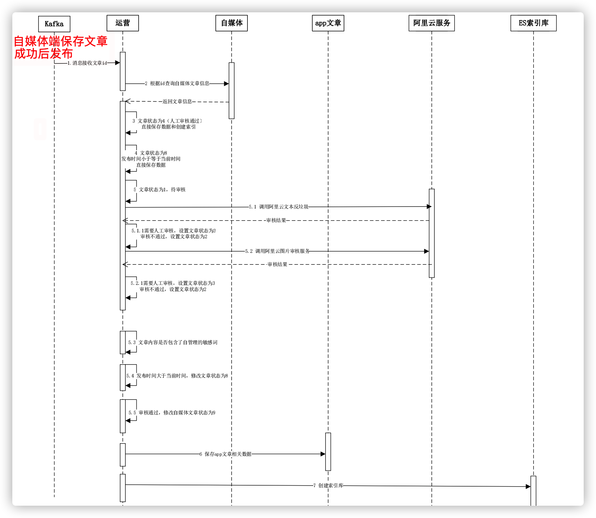
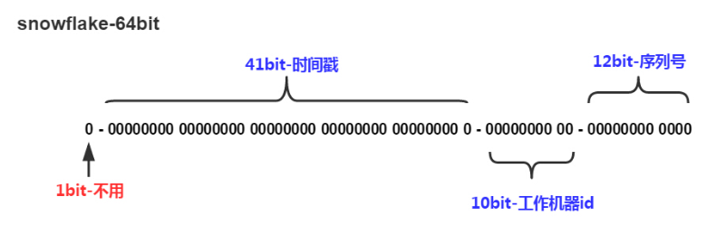
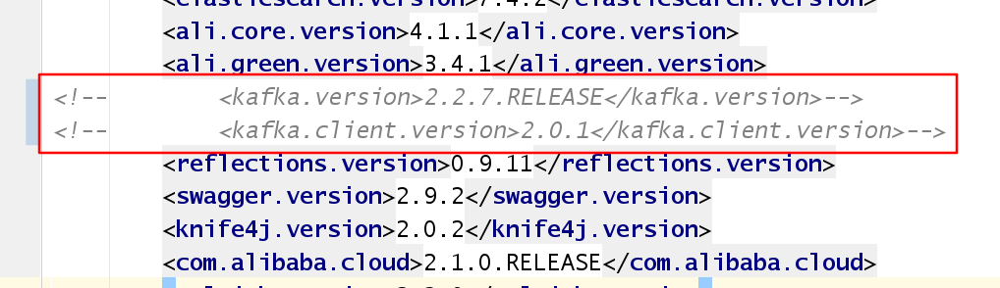
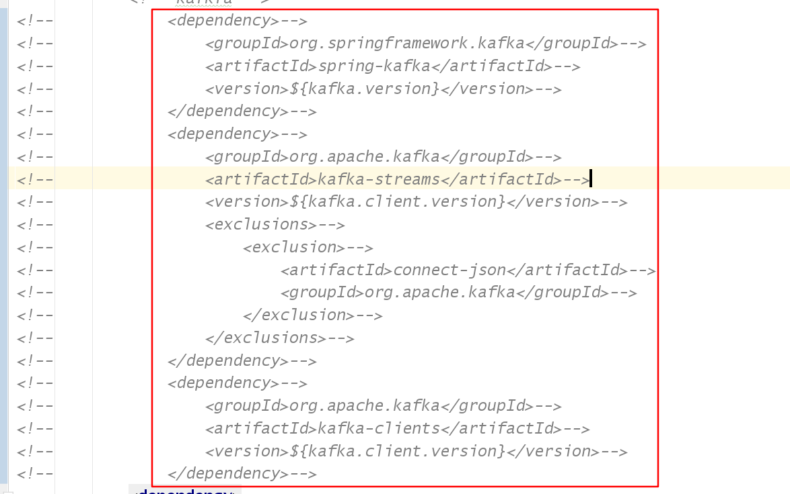

# 第七章 平台自动审核自媒体文章

## 今日目标

- 能够掌握自媒体文章审核的流程
- 能够使用阿里云安全服务检测文章内容
- 能够完成自媒体文章审核的功能
- 能够完成自媒体发布文章与审核对接

## 1 自媒体文章自动审核需求说明

### 1.1 自媒体文章自动审核流程

做为内容类产品，内容安全非常重要，所以需要进行对自媒体用户发布的文章进行审核以后才能到app端展示给用户。

审核的流程如下：也可以查看当前讲义文件夹下：自媒体文章发布时序图.pdf



> 1.当自媒体用户提交发布文章之后，会发消息给kafka提交审核，平台运营端接收文章信息
>
> 2.根据自媒体文章id查询文章信息
>
> 3.如果当前文章的状态为4（人工审核通过），则无需再进行自动审核审核，保存app文章相关数据即可
>
> 4.文章状态为8,发布时间小于等于当前时间,则直接保存app文章相关数据
>
> 5.文章状态为1，则进行自动审核
>
> 5.1 文章内容中是否有自管理的敏感词，如果有则审核不通过，修改自媒体文章状态为2
>
> 5.2 调用阿里云文本反垃圾服务，进行文本审核，如果审核不成功或需要人工审核，修改自媒体文章状态为2
>
> 5.3 调用阿里云图片审核服务，如果审核不通过或需要人工审核，修改自媒体文章状态为2
>
> 5.4 自媒体文章发布时间大于当前时间，修改自媒体文章状态为8（审核通过待发布状态）
>
> 5.5 审核通过，修改自媒体文章状态为 9 （审核通过）同时回填app文章id到自媒体表中
>
> 6.保存app相关数据
>
> 如果存在自媒体文章中存在articleId则是修改，没有articleId为新增
>
> ap_article_config   文章配置
>
> ap_article  文章
>
> ap_article_content  文章内容
>
> 7.创建索引（为后续app端的搜索功能做数据准备）

### 1.2 表结构

（1）wm_news  自媒体文章表  在自媒体库


<font color='red'>status字段：0 草稿   1 待审核   2 审核失败   3 人工审核   4 人工审核通过   8 审核通过（待发布）  9 已发布</font>

（2）ap_author  文章作者表   在article库


（3）ap_article_config   文章配置表  在article库


对应实体：

```java
package com.heima.model.article.pojo;

import com.baomidou.mybatisplus.annotation.IdType;
import com.baomidou.mybatisplus.annotation.TableField;
import com.baomidou.mybatisplus.annotation.TableId;
import com.baomidou.mybatisplus.annotation.TableName;
import lombok.Data;
/**
 * <p>
 * APP已发布文章配置表
 * </p>
 *
 * @author itheima
 */

@Data
@TableName("ap_article_config")
public class ApArticleConfig {
    @TableId(value = "id",type = IdType.ID_WORKER)
    private Long id;
    /**
     * 文章id
     */
    @TableField("article_id")
    private Long articleId;
    /**
     * 是否可评论
     * true: 可以评论   1
     * false: 不可评论  0
     */
    @TableField("is_comment")
    private Boolean isComment;
    /**
     * 是否转发
     * true: 可以转发   1
     * false: 不可转发  0
     */
    @TableField("is_forward")
    private Boolean isForward;
    /**
     * 是否下架
     * true: 下架   1
     * false: 没有下架  0
     */
    @TableField("is_down")
    private Boolean isDown;
    /**
     * 是否已删除
     * true: 删除   1
     * false: 没有删除  0
     */
    @TableField("is_delete")
    private Boolean isDelete;
}
```

（4）ap_article  文章信息表   在article库


- layout 文章布局  0 无图文章   1 单图文章    2或3 多图文章

- flag  文章标记  0 普通文章   1 热点文章   2 置顶文章   3 精品文章   4 大V 文章

- images 文章图片  多张逗号分隔

对应实体

```java
package com.heima.model.article.pojo;

import com.baomidou.mybatisplus.annotation.IdType;
import com.baomidou.mybatisplus.annotation.TableField;
import com.baomidou.mybatisplus.annotation.TableId;
import com.baomidou.mybatisplus.annotation.TableName;
import lombok.Data;

import java.util.Date;

/**
 * <p>
 * 文章信息表，存储已发布的文章
 * </p>
 *
 * @author itheima
 */

@Data
@TableName("ap_article")
public class ApArticle {

    @TableId(value = "id",type = IdType.ID_WORKER)
    private Long id;


    /**
     * 标题
     */
    private String title;

    /**
     * 作者id
     */
    @TableField("author_id")
    private Long authorId;

    /**
     * 作者名称
     */
    @TableField("author_name")
    private String authorName;

    /**
     * 频道id
     */
    @TableField("channel_id")
    private Integer channelId;

    /**
     * 频道名称
     */
    @TableField("channel_name")
    private String channelName;

    /**
     * 文章布局  0 无图文章   1 单图文章    2 多图文章
     */
    private Short layout;

    /**
     * 文章标记  0 普通文章   1 热点文章   2 置顶文章   3 精品文章   4 大V 文章
     */
    private Byte flag;

    /**
     * 文章封面图片 多张逗号分隔
     */
    private String images;

    /**
     * 标签
     */
    private String labels;

    /**
     * 点赞数量
     */
    private Integer likes;

    /**
     * 收藏数量
     */
    private Integer collection;

    /**
     * 评论数量
     */
    private Integer comment;

    /**
     * 阅读数量
     */
    private Integer views;

    /**
     * 省市
     */
    @TableField("province_id")
    private Integer provinceId;

    /**
     * 市区
     */
    @TableField("city_id")
    private Integer cityId;

    /**
     * 区县
     */
    @TableField("county_id")
    private Integer countyId;

    /**
     * 创建时间
     */
    @TableField("created_time")
    private Date createdTime;

    /**
     * 发布时间
     */
    @TableField("publish_time")
    private Date publishTime;

    /**
     * 同步状态
     */
    @TableField("sync_status")
    private Boolean syncStatus;

    /**
     * 来源
     */
    private Boolean origin;

}
```

（5）ap_article_content  文章内容表 在article库


对应实体：

```java
package com.heima.model.article.pojo;

import com.baomidou.mybatisplus.annotation.IdType;
import com.baomidou.mybatisplus.annotation.TableField;
import com.baomidou.mybatisplus.annotation.TableId;
import com.baomidou.mybatisplus.annotation.TableName;
import lombok.Data;

@Data
@TableName("ap_article_content")
public class ApArticleContent {
    
    @TableId(value = "id",type = IdType.ID_WORKER)
    private Long id;

    /**
     * 文章id
     */
    @TableField("article_id")
    private Long articleId;

    /**
     * 文章内容
     */
    private String content;
}
```

## 2 文章自动审核功能实现

### 2.1 文章审核功能-准备工作

#### 2.1.1 自媒体feign接口

（1）需求说明

在自动审核的时候需要自媒体的远程接口，如下：

> 1 根据文章id查询自媒体文章的数据
>
> 2 在审核的过程中,审核失败或者成功需要修改自媒体文章的**状态**
>
> 3 在文章进行保存的时候需要查询作者信息，需要通过自媒体用户关联查询作者信息

（2）自媒体文章接口准备

在自媒体端的WmNewsController接口中新增方法

```java
 	@ApiOperation("根据ID查询自媒体文章-服务内部调用")
    @GetMapping("/findOne/{id}")
    public WmNews findById(@PathVariable("id") Integer id) {
        return wmNewsService.getById(id);
    }
    @ApiOperation("根据ID修改自媒体文章-服务内部调用")
    @PutMapping("/update")
    public ResponseResult updateWmNews(@RequestBody WmNews wmNews) {
        wmNewsService.updateById(wmNews);
        return ResponseResult.okResult();
    }
```

（3）自媒体用户接口准备

在自媒体端的WmUserController接口中新增方法

```java
    @ApiOperation("按照id查询用户")
    @GetMapping("/findOne/{id}")
    public WmUser findWmUserById(@PathVariable("id") Integer id) {
        return wmUserService.getById(id);
    }
```

在feign模块下新增远程接口：

```java
package com.heima.feigns.wemedia;
import com.heima.model.common.dtos.ResponseResult;
import com.heima.model.wemedia.pojos.WmNews;
import com.heima.model.wemedia.pojos.WmUser;
import org.springframework.cloud.openfeign.FeignClient;
import org.springframework.web.bind.annotation.*;
@FeignClient("leadnews-wemedia")
public interface WemediaFeign {
    // ==============新增 远程接口=======================
    @GetMapping("/api/v1/news/findOne/{id}")
    WmNews findById(@PathVariable("id") Integer id);
    @PutMapping("/api/v1/news/update")
    ResponseResult updateWmNews(@RequestBody WmNews wmNews);
    @GetMapping("/api/v1/user/findOne/{id}")
    WmUser findWmUserById(@PathVariable("id") Integer id);
    // ==============新增 远程接口=======================
    
    @PostMapping("/api/v1/user/save")
    public WmUser save(@RequestBody WmUser wmUser);
    @GetMapping("/api/v1/user/findByName/{name}")
    public WmUser findByName(@PathVariable("name") String name);
}
```

#### 2.1.2  引入阿里云内容安全服务

在admin微服务中加入如下配置

文章审核需要调用阿里云服务的云安全服务来审核文章和图片

已整合到admin

### 2.2 文章审核功能-业务层接口定义

新建自动审核接口：

```java
package com.heima.admin.service;
public interface WemediaNewsAutoScanService {
    /**
     * 自媒体文章审核
     * @param wmNewsId
     */
    public void autoScanByMediaNewsId(Integer wmNewsId);
}
```

### 2.3 文章审核功能-业务逻辑实现

#### 2.3.1 抽取文章内容中文本和图片

```java
package com.heima.admin.service.impl;

import com.alibaba.fastjson.JSON;
import com.heima.admin.service.WemediaNewsAutoScanService;
import com.heima.common.aliyun.GreeTextScan;
import com.heima.common.aliyun.GreenImageScan;
import com.heima.common.exception.CustException;
import com.heima.feigns.wemedia.WemediaFeign;
import com.heima.model.common.enums.AppHttpCodeEnum;
import com.heima.model.wemedia.pojos.WmNews;
import lombok.extern.slf4j.Slf4j;
import org.apache.commons.lang3.StringUtils;
import org.springframework.beans.factory.annotation.Autowired;
import org.springframework.beans.factory.annotation.Value;
import org.springframework.stereotype.Service;

import java.util.ArrayList;
import java.util.HashMap;
import java.util.List;
import java.util.Map;

@Service
@Slf4j
public class WemediaNewsAutoScanServiceImpl implements WemediaNewsAutoScanService {
    @Autowired
    WemediaFeign wemediaFeign;
    @Autowired
    GreenTextScan greenTextScan;
    @Autowired
    GreenImageScan greenImageScan;
    @Value("${file.oss.web-site}")
    private String webSite;
    /**
     * 自媒体文章自动审核
     * @param wmNewsId wmNews 文章ID
     */
    @Override
    public void autoScanByMediaNewsId(Integer wmNewsId) {
        //参数校验
        if (wmNewsId == null) {
            log.error("当前的审核id空");
            throw new CustomExcetion(AppHttpCodeEnum.PARAM_INVALID);
        }
        //1 根据WmNes文章id查询文章
        WmNews wmNews = wemediaFeign.findById(wmNewsId);
        if (wmNews == null) {
            log.error("审核的自媒体文章不存在，自媒体的id:{}", wmNewsId);
            throw new CustomExcetion(AppHttpCodeEnum.DATA_NOT_EXIST);
        }
        //判断文章的状态
        //2 文章状态=4 人工审核通过，直接保存文章
        if (wmNews.getStatus().equals(WmNews.Status.ADMIN_SUCCESS.getCode()) && wmNews.getPublishTime().getTime() <= System.currentTimeMillis()) {
            //保存数据
            publishArticle(wmNews);
            return;
        }
        //3 文章状态=8 审核通过 但是发布时间小于等于当前时间，直接保存文章
        if (wmNews.getStatus().equals(WmNews.Status.SUCCESS.getCode())
                && wmNews.getPublishTime().getTime() <= System.currentTimeMillis()) {
            //保存数据
            publishArticle(wmNews);
            return;
        }
        //4 文章状态=1 待审核
        if (wmNews.getStatus().equals(WmNews.Status.SUBMIT.getCode())) {
            // 抽取文章内容中的文本和图片
            Map<String, Object> contentAndImagesResult = handleTextAndImages(wmNews);
            //TODO 4.1 自管理敏感词审核
            //TODO 4.2 阿里云审核文本内容
            //TODO 4.3 阿里云图片审核
            //TODO 4.4 判断文章发布时间大于当前时间，修改状态8
            //TODO 5 保存文章相关数据
            //TODO 6 同步索引库
        }
    }

   /**
     * 抽取文章的 文本和图片（包含封面的图片[不带前缀]）
     * @param wmNews
     * @return Map 图片带前缀
     */
    private Map<String, Object> handleTextAndImages(WmNews wmNews) {

        //1 获取文章内容并转换对象
        String content = wmNews.getContent();
        if (StringUtils.isBlank(content) || content.length()>10000) {
            return null;
        }
        List<Map> contentList = JSON.parseArray(content, Map.class);

        //2 解析内容文本 Stream 流优化 --> String
        // 中美
        // 国家英语   美_hmtt_国？
        String contents = contentList.stream()
                .filter(x -> x.get("type").equals("text"))
                .map(y -> y.get("value").toString())
                .collect(Collectors.joining("_hmtt_"));
        // 文章标题 参与审核
        contents = wmNews.getTitle()+"_hmtt_"+contents;

        //3 解析内容图片
        List<String> images = contentList.stream()
                .filter(x -> x.get("type").equals("image"))
                .map(y -> y.get("value").toString())
                .collect(Collectors.toList());

        //4 处理封面前缀 1.jpg 2.jpg
        String imageCover = wmNews.getImages();
        if (StringUtils.isNotBlank(imageCover)) {
            // 添加到内容图片列表
            images.addAll(
                    Stream.of(imageCover.split(","))
                    .map(x -> webSite+x)
                    .collect(Collectors.toList())
            );
        }

        //5 封装结果
        Map<String, Object> resultMap = new HashMap<>();
        resultMap.put("content", contents);
        resultMap.put("images", images);

        return resultMap;
    }


    /**
     * 保存APP端文章相关数据
     * @param wmNews
     */
    private void publishArticle(WmNews wmNews) {

    }
}
```

配置文件 application.yml 添加 文章图片前缀：

```yaml
file:
  oss:
    web-site: http://heimaleadnewsoss.oss-cn-shanghai.aliyuncs.com/
```


#### 2.3.2 自管理敏感词审核

（1）在AdSensitiveMapper 新增方法

```java
package com.heima.admin.mapper;

import com.baomidou.mybatisplus.core.mapper.BaseMapper;
import com.heima.model.admin.pojos.AdSensitive;
import org.apache.ibatis.annotations.Select;

import java.util.List;

/**
 * @Description: AdSensitiveMapper
 * @Version: V1.0
 */
public interface AdSensitiveMapper extends BaseMapper<AdSensitive> {
    @Select("select sensitives from ad_sensitive")
    public List<String> findAllSensitive();
}
```

（2）具体业务实现

```java
package com.heima.admin.service.impl;

import com.alibaba.fastjson.JSON;
import com.heima.admin.service.WemediaNewsAutoScanService;
import com.heima.common.aliyun.GreeTextScan;
import com.heima.common.aliyun.GreenImageScan;
import com.heima.common.exception.CustException;
import com.heima.feigns.wemedia.WemediaFeign;
import com.heima.model.common.dtos.ResponseResult;
import com.heima.model.common.enums.AppHttpCodeEnum;
import com.heima.model.wemedia.pojos.WmNews;
import lombok.extern.slf4j.Slf4j;
import org.apache.commons.lang3.StringUtils;
import org.springframework.beans.factory.annotation.Autowired;
import org.springframework.beans.factory.annotation.Value;
import org.springframework.stereotype.Service;

import java.util.ArrayList;
import java.util.HashMap;
import java.util.List;
import java.util.Map;

@Service
@Slf4j
public class WemediaNewsAutoScanServiceImpl implements WemediaNewsAutoScanService {

    /**
     * 自媒体文章自动审核
     *
     * @param wmNewsId wmNews 文章ID
     */
    @Override
    public void autoScanByMediaNewsId(Integer wmNewsId) {
        //参数校验
        //1 根据WmNes文章id查询文章
        //判断文章的状态
        //2 文章状态=4 人工审核通过，直接保存文章
        //3 文章状态=8 审核通过 但是发布时间小于等于当前时间，直接保存文章
        //4 文章状态=1 待审核
        if (wmNews.getStatus().equals(WmNews.Status.SUBMIT.getCode())) {
            // 抽取文章内容中的文本和图片
            //4.1 自管理敏感词审核 
          	boolean isSensitiveScan = handleSensitive((String) contentAndImagesResult.get("content"), wmNews);
            if (!isSensitiveScan) return;
            //TODO 4.2 阿里云审核文本内容
            //TODO 4.3 阿里云图片审核
            //TODO 4.4 判断文章发布时间大于当前时间，修改状态8
            //TODO 5 保存文章相关数据
            //TODO 6 同步索引库
        }
    }
  
    @Autowired
    AdSensitiveMapper adSensitiveMapper;

    /**
     * 自管理敏感词审核
     * @param content
     * @param wmNews
     * @return
     */
    private boolean handleSensitive(String content, WmNews wmNews) {

        boolean flag = true;
        // 查询所有敏感词
        List<String> sensitiveList = adSensitiveMapper.findAllSensitive();
        // 初始化 DFA搜索
        SensitiveWordUtil.initMap(sensitiveList);
        // 匹配敏感词
        Map<String, Integer> map = SensitiveWordUtil.matchWords(content);

        if (map.size() > 0) {
            flag = false;
            updateWmNews(wmNews,(short)2,"文章中包含了敏感词:"+map);
        }

        return flag;
    }
  
    /**
     * 修改文章
     * @param wmNews
     * @param status
     * @param msg
     */
    private void updateWmNews(WmNews wmNews, short status, String msg) {
        wmNews.setStatus(status);
        wmNews.setReason(msg);
        ResponseResult responseResult = wemediaFeign.updateWmNews(wmNews);
        if(!responseResult.getCode().equals(0)){
          throw new CustomExcetion(AppHttpCodeEnum.WEMEDIA_UPDATE_ERROR);
        }
    }
  
}
```


#### 2.3.3 阿里云文本审核

```java
package com.heima.admin.service.impl;

import com.alibaba.fastjson.JSON;
import com.heima.admin.service.WemediaNewsAutoScanService;
import com.heima.common.aliyun.GreeTextScan;
import com.heima.common.aliyun.GreenImageScan;
import com.heima.common.exception.CustException;
import com.heima.feigns.wemedia.WemediaFeign;
import com.heima.model.common.dtos.ResponseResult;
import com.heima.model.common.enums.AppHttpCodeEnum;
import com.heima.model.wemedia.pojos.WmNews;
import lombok.extern.slf4j.Slf4j;
import org.apache.commons.lang3.StringUtils;
import org.springframework.beans.factory.annotation.Autowired;
import org.springframework.beans.factory.annotation.Value;
import org.springframework.stereotype.Service;

import java.util.ArrayList;
import java.util.HashMap;
import java.util.List;
import java.util.Map;

@Service
@Slf4j
public class WemediaNewsAutoScanServiceImpl implements WemediaNewsAutoScanService {
    /**
     * 自媒体文章自动审核
     * @param wmNewsId wmNews 文章ID
     */
    @Override
    public void autoScanByMediaNewsId(Integer wmNewsId) {
        //参数校验
        //1 根据WmNes文章id查询文章
        //判断文章的状态
        //2 文章状态=4 人工审核通过，直接保存文章
        //3 文章状态=8 审核通过 但是发布时间小于等于当前时间，直接保存文章
        //4 文章状态=1 待审核
        if (wmNews.getStatus().equals(WmNews.Status.SUBMIT.getCode())) {
            // 抽取文章内容中的文本和图片
            //4.1 自管理敏感词审核
            //4.2 阿里云审核文本内容
            boolean isTextScan = handleTextScan((String) contentAndImagesResult.get("content"), wmNews);
            if (!isTextScan) return;

            //TODO 4.3 阿里云图片审核
            //TODO 4.4 判断文章发布时间大于当前时间，修改状态8

            //TODO 5 保存文章相关数据
            //TODO 6 同步索引库
        }
    }

    /**
     * 审核文内容-阿里云
     * @param content
     * @param wmNews
     * @return
     */
    private boolean handleTextScan(String content, WmNews wmNews) {
        boolean flag = true;
        try {
            Map map = greeTextScan.greenTextScan(content);
            //审核不通过
            if (map.get("suggestion").equals("block")) {
                flag = false;
                updateWmNews(wmNews, (short) 2, "文本中内容有敏感词汇");
            }
            //需要人工审核
            if (map.get("suggestion").equals("review")) {
                flag = false;
                updateWmNews(wmNews, (short) 3, "文本中内容需要人工审核");
            }
        } catch (Exception e) {
            e.printStackTrace();
            log.error("文章阿里云内容审核失败，转入人工审核, e：{}",e);
            flag = false;
            updateWmNews(wmNews, (short) 3, "文章阿里云内容审核失败,转入需要人工审核");
        }
        return flag;
    }
}
```

#### 2.3.4 阿里云图片审核

```java
package com.heima.admin.service.impl;
import com.alibaba.fastjson.JSON;
import com.heima.admin.service.WemediaNewsAutoScanService;
import com.heima.common.aliyun.GreeTextScan;
import com.heima.common.aliyun.GreenImageScan;
import com.heima.common.exception.CustException;
import com.heima.feigns.wemedia.WemediaFeign;
import com.heima.model.common.dtos.ResponseResult;
import com.heima.model.common.enums.AppHttpCodeEnum;
import com.heima.model.wemedia.pojos.WmNews;
import lombok.extern.slf4j.Slf4j;
import org.apache.commons.lang3.StringUtils;
import org.springframework.beans.factory.annotation.Autowired;
import org.springframework.beans.factory.annotation.Value;
import org.springframework.stereotype.Service;
import java.util.ArrayList;
import java.util.HashMap;
import java.util.List;
import java.util.Map;
@Service
@Slf4j
public class WemediaNewsAutoScanServiceImpl implements WemediaNewsAutoScanService {

    /**
     * 自媒体文章自动审核
     *
     * @param wmNewsId wmNews 文章ID
     */
    @Override
    public void autoScanByMediaNewsId(Integer wmNewsId) {
        //参数校验
        //1 根据WmNes文章id查询文章
        //判断文章的状态
        //2 文章状态=4 人工审核通过，直接保存文章
        //3 文章状态=8 审核通过 但是发布时间小于等于当前时间，直接保存文章
        //4 文章状态=1 待审核
        if (wmNews.getStatus().equals(WmNews.Status.SUBMIT.getCode())) {
            // 抽取文章内容中的文本和图片
            //4.1 自管理敏感词审核
            //4.2 阿里云审核文本内容
          
            //4.3 阿里云图片审核
           boolean isImageScan = handleImagesScan((List) contentAndImagesResult.get("images"), wmNews);
            if (!isImageScan) return;
          
            //4.4 如果发布时间 大于 当前时间， 修改wmNews 文章状态=8
            if (wmNews.getPublishTime().getTime() > System.currentTimeMillis()) {
                updateNews(wmNews, WmNews.Status.SUCCESS.getCode(), "文章审核通过，待发布");
                return;
            }

            //5 审核通过，保存文章相关信息（三张表）， 修改文章的状态=9 已发布
            publishArticle(wmNews);
            //TODO 6 同步索引库
        }
    }

   /**
     * 图片审核-阿里云
     * @param images
     * @param wmNews
     * @return
     */
    private boolean handleImagesScan(List<String> images, WmNews wmNews) {

        // 无图则无需审核
        if(images==null || images.size() == 0){
            return true;
        }

        boolean flag = true;

        try {
           images=images.stream().distinct()
                               .collect(Collectors.toList());
            Map map = greenImageScan.imageUrlScan(images);

            //审核不通过
            if (map.get("suggestion").equals("block")) {
                updateWmNews(wmNews, (short) 2, "文章图片有违规");
                flag = false;
            }
            //人工审核
            if (map.get("suggestion").equals("review")) {
                updateWmNews(wmNews, (short) 3, "文章图片有不确定元素");
                flag = false;
            }

        } catch (Exception e) {
            e.printStackTrace();
            updateWmNews(wmNews, (short) 3, "阿里云审核失败，转入人工审核");
            flag = false;
        }

        return flag;
    }
}
```


#### 2.3.5 审核阶段单元测试

启动article和wemedia微服务

```java
package com.heima.admin.test;

import com.heima.admin.AdminApplication;
import com.heima.admin.service.WemediaNewsAutoScanService;
import org.junit.Test;
import org.junit.runner.RunWith;
import org.springframework.beans.factory.annotation.Autowired;
import org.springframework.boot.test.context.SpringBootTest;
import org.springframework.test.context.junit4.SpringRunner;

@SpringBootTest(classes = AdminApplication.class)
@RunWith(SpringRunner.class)
public class WemediaNewsAutoScanServiceTest {

    @Autowired
    private WemediaNewsAutoScanService wemediaNewsAutoScanService;

    @Test
    public void testScanNews(){
        wemediaNewsAutoScanService.autoScanByMediaNewsId(6203);
    }
}
```


### 2.4 文章微服务feign接口

#### 2.4.1 分布式id

随着业务的增长，文章表可能要占用很大的物理存储空间，为了解决该问题，后期使用数据库分片技术。将一个数据库进行拆分，通过数据库中间件连接。如果数据库中该表选用ID自增策略，则可能产生重复的ID，此时应该使用分布式ID生成策略来生成ID。


雪花算法实现

snowflake是Twitter开源的分布式ID生成算法，结果是一个long型的ID。其核心思想是：使用41bit作为毫秒数，10bit作为机器的ID（5个bit是数据中心，5个bit的机器ID），12bit作为毫秒内的流水号（意味着每个节点在每毫秒可以产生 4096 个 ID），最后还有一个符号位，永远是0



mybatis-plus已经集成了雪花算法，完成以下两步即可在项目中集成雪花算法

第一：在实体类中的id上加入如下配置，指定类型为id_worker

```java
@TableId(value = "id",type = IdType.ID_WORKER)
private Long id;
```

第二：在article服务的application.yml文件中配置数据中心id和机器id

```yaml
mybatis-plus:
  mapper-locations: classpath*:mapper/*.xml
  # 设置别名包扫描路径，通过该属性可以给包中的类注册别名
  type-aliases-package: com.heima.model.article.pojos
  global-config:
  	datacenter-id: 1
    workerId: 1  
```

datacenter-id:数据中心id(取值范围：0-31)

workerId:机器id(取值范围：0-31)

#### 2.4.2 需求说明和思路分析

在文章审核成功以后需要在app的article库中新增文章数据

1. 保存文章信息  ap_article

2. 保存文章配置信息  ap_article_config

3. 保存文章内容 ap_article_content

**具体实现的思路：**

当前接口具备保存三个表数据的功能，**如果已经有了文章id,则是修改，如果没有id为新增数据。**

同时需要把资料文件夹中的类拷贝到文章微服务下：


#### 2.4.3 文章微服务参数准备

**ArticleDto**

在远程调用当前接口的时候，因为ap_article表中并没有保存content的字段，在远程调用传递的过程中，需要把这个内容传递到文章微服务，再保存到ap_article_content表中

```java
package com.heima.model.article.dto;
import com.heima.model.article.pojo.ApArticle;
import lombok.Data;
@Data
public class ArticleDto extends ApArticle {
    /**
     * 文章内容
     */
    private String content;
}
```

在 WemediaNewsAutoScanServiceImpl 编写 publishArticle 方法，执行保存文章相关数据

```java
/**
 * 保存APP端文章相关数据
 * @param wmNews
 */
private void publishArticle(WmNews wmNews) {

    //保存app相关文章
    ResponseResult responseResult = saveArticle(wmNews);
    if(!responseResult.getCode().equals(0)){
        throw new RuntimeException("文章审核保存app文章失败");
    }
    Object data = responseResult.getData();
    //修改自媒体文章状态，状态为9  审核通过
    wmNews.setArticleId((Long) data);
    updateWmNews(wmNews,(short) 9,"文章审核通过");
}


	@Autowired
	private AdChannelMapper adChannelMapper;
	@Autowired
	ArticleFeign articleFeign;

    /**
     * 执行保存文章（三张表）
     * @param wmNews
     * @return
     */
    private ResponseResult saveArticle(WmNews wmNews) {
        //1 封装数据 dto
        ArticleDto articleDto = new ArticleDto();
        BeanUtils.copyProperties(wmNews, articleDto);
        articleDto.setId(null);
        if (wmNews.getArticleId()!=null) {
            articleDto.setId( wmNews.getArticleId() );
        }
        // 布局
        articleDto.setLayout(wmNews.getType());
        articleDto.setFlag((byte) 0);

        //2 设置频道
        if (wmNews.getChannelId() != null) {
            articleDto.setChannelId(wmNews.getChannelId());
            AdChannel channel = adChannelMapper.selectById(wmNews.getChannelId());
            if (channel != null) {
                articleDto.setChannelName(channel.getName());
            }
        }

        //3 设置作者信息
        // 查wm_user 状态
        WmUser wmUser = wemediaFeign.findWmUserById(wmNews.getUserId());
        if (wmUser == null || wmUser.getStatus().intValue() != 9) { // 非法用户
            throw new CustomExcetion(AppHttpCodeEnum.ADMIN_ADUSER_ISNTOEXIT_ERROR);
        }
        if (StringUtils.isNotBlank(wmUser.getName())) {
            // 自媒体名称不能修改
            articleDto.setAuthorName(wmUser.getName());
            // 作者id 尽量减少远程调用
        }
        //4 文章内容
        articleDto.setContent(wmNews.getContent());

        // 发起远程调用 保存 三张表数据, 返回值必须携带文章id
        return articleFeign.saveArticle(articleDto);
    }
```


#### 2.4.3 文章端定义api接口

```java
package com.heima.article.controller.v1;
import com.heima.article.service.ApArticleService;
import com.heima.model.article.dto.ArticleDto;
import com.heima.model.common.dto.ResponseResult;
import io.swagger.annotations.Api;
import io.swagger.annotations.ApiOperation;
import org.springframework.beans.factory.annotation.Autowired;
import org.springframework.web.bind.annotation.PostMapping;
import org.springframework.web.bind.annotation.RequestBody;
import org.springframework.web.bind.annotation.RequestMapping;
import org.springframework.web.bind.annotation.RestController;
@Api(value = "App端文章API",tags = "App端文章API")
@RestController
@RequestMapping("/api/v1/article")
public class ApArticleController{
    @ApiOperation(value = "保存App端文章信息",notes = "基于ArticleDto 保存文章信息 文章详情信息 文章配置信息")
    @PostMapping("/save")
    public ResponseResult saveArticle(@RequestBody ArticleDto articleDto) {
        // TODO ==============================
        return null;
    }
}
```

#### 2.4.4 业务层

在ApArticleService接口中新增如下方法

```java
package com.heima.article.service;
import com.baomidou.mybatisplus.extension.service.IService;
import com.heima.model.article.dtos.ArticleDto;
import com.heima.model.article.pojos.ApArticle;
import com.heima.model.common.dtos.ResponseResult;
public interface ApArticleService extends IService<ApArticle> {
    /**
     * 保存或修改文章
     * @param articleDto
     * @return
     */
    public ResponseResult saveArticle(ArticleDto articleDto);
}
```

实现类：

```java
@Service
@Transactional
@Slf4j
public class ApArticleServiceImpl extends ServiceImpl<ApArticleMapper, ApArticle> implements ApArticleService {
    @Autowired
    AuthorMapper authorMapper;
    @Autowired
    ApArticleConfigMapper apArticleConfigMapper;
    @Autowired
    ApArticleContentMapper apArticleContentMapper;

    /**
     * 保存app文章
     * @param articleDto
     * @return
     */
    @Override
    public ResponseResult saveArticle(ArticleDto articleDto) {
//        1. 校验参数
        if(articleDto == null){
            throw new CustomException(AppHttpCodeEnum.PARAM_INVALID);
        }
//        2. 封装文章ApArticle对象
        ApArticle apArticle = new ApArticle();
        BeanUtils.copyProperties(articleDto,apArticle);
//        3. 根据作者名称查询作者ID
        ApAuthor author = authorMapper.selectOne(Wrappers.<ApAuthor>lambdaQuery().eq(ApAuthor::getName, apArticle.getAuthorName()));
        if(author == null){
            throw new CustomException(AppHttpCodeEnum.DATA_NOT_EXIST);
        }
        apArticle.setAuthorName(author.getName());
//        4. 如果文章ID为null 添加文章
        if(apArticle.getId() == null){
            // 普通文章
            apArticle.setComment(0);
            apArticle.setViews(0);
            apArticle.setCollection(0);
            apArticle.setLikes(0);
            // 保存
            save(apArticle);  // 返回ID
        }else {
            //        5. 如果文章ID不为null 修改文章
            //        并删除之前配置 和 文章内容
            ApArticle article = getById(articleDto.getId());
            if (article == null) {
                log.info("文章信息为空 : {}", articleDto.getId());
                throw new CustomException(AppHttpCodeEnum.DATA_NOT_EXIST);
            }
            apArticleConfigMapper.delete(Wrappers.<ApArticleConfig>lambdaQuery()
                                        .eq(ApArticleConfig::getArticleId,apArticle.getId()));
            apArticleContentMapper.delete(Wrappers.<ApArticleContent>lambdaQuery()
                    .eq(ApArticleContent::getArticleId,apArticle.getId()));
            updateById(apArticle);
        }
        //添加文章配置
        //保存article_config 数据
        ApArticleConfig apArticleConfig = new ApArticleConfig();
        apArticleConfig.setIsForward(true);
        apArticleConfig.setIsComment(true);
        apArticleConfig.setIsDown(false);
        apArticleConfig.setIsDelete(false);
        apArticleConfig.setArticleId(apArticle.getId());
        apArticleConfigMapper.insert(apArticleConfig);
        //添加文章内容
        //保存文章article_content 数据
        ApArticleContent apArticleContent = new ApArticleContent();
        apArticleContent.setContent(articleDto.getContent());
        apArticleContent.setArticleId(apArticle.getId());
        apArticleContentMapper.insert(apArticleContent);
        //返回文章ID
        return ResponseResult.okResult(apArticle.getId());
    }
}
```

#### 2.4.5 控制层

```java
@Api(value = "App端文章API",tags = "App端文章API")
@RestController
@RequestMapping("/api/v1/article")
public class ApArticleController{
    @Autowired
    private ApArticleService articleService;
    @ApiOperation(value = "保存App端文章信息",notes = "基于ArticleDto 保存文章信息 文章详情信息 文章配置信息")
    @PostMapping("/save")
    public ResponseResult saveArticle(@RequestBody ArticleDto articleDto) {
        return articleService.saveArticle(articleDto);
    }
}
```

#### 2.4.6 在feign端定义远程接口

```java
package com.heima.admin.feign;
import com.heima.model.article.dtos.ArticleDto;
import com.heima.model.common.dtos.ResponseResult;
import org.springframework.cloud.openfeign.FeignClient;
import org.springframework.web.bind.annotation.PostMapping;
@FeignClient("leadnews-article")
public interface ArticleFeign {
    // ===================新增方法=======================
    @PostMapping("/api/v1/article/save")
    ResponseResult saveArticle(@RequestBody ArticleDto articleDto);
    // ===================新增方法=======================
    @GetMapping("/api/v1/author/findByUserId/{userId}")
     ApAuthor findByUserId(@PathVariable("userId") Integer userId);
    @PostMapping("/api/v1/author/save")
     ResponseResult save(@RequestBody ApAuthor apAuthor);
}
```

### 2.5 文章审核功能-app文章保存测试

启动article和wemedia微服务

查看以下结果：

1. wm_news 数据状态是否发生变化
2. ap_article 表新增数据
3. ap_article_content 表新增数据
4. ap_article_config 表新增数据

## 3 文章审核功能-发布文章提交审核&定义监听接收消息

在审核文章流程的第一步，当自媒体人发布一篇文章后会马上进行审核，这个时候是通过消息中间件进行数据的传递的。所以说需要配置生产者和消费者。

* 自媒体微服务就是生产者

* admin就是消费者

### 3.1 配置kafka环境

在`heima-leadnews-services`模块中添加依赖

```xml
	<!-- kafkfa -->
    <dependency>
        <groupId>org.springframework.kafka</groupId>
        <artifactId>spring-kafka</artifactId>
    </dependency>
```
**注意!!**: 要先注释掉父工程中对kafka的版本定义





### 3.2  配置生产者

在leadnews-wemedia模块中的application.yml加入kafka的配置

```yaml
spring:
  application:
    name: leadnews-wemedia
  kafka:
    bootstrap-servers: 192.168.200.129:9092
    producer:
      retries: 10
      key-serializer: org.apache.kafka.common.serialization.StringSerializer
      value-serializer: org.apache.kafka.common.serialization.StringSerializer
```

在发布文章修改代码，发送消息，提交审核

定义topic名称

新建常量类：

```java
package com.heima.common.constants.message;
public class NewsAutoScanConstants {
    public static final String WM_NEWS_AUTO_SCAN_TOPIC="wm.news.auto.scan.topic";
}
```

在`wemedia-service`微服务中修改业务层实现类WmNewsServiceImpl的saveWmNews方法，修改如下代码，发送消息进行文章审核

```java
@Autowired
private KafkaTemplate kafkaTemplate;

@Override
public ResponseResult saveNews(WmNewsDto dto, Short isSubmit) {
  
   // 4 发消息给admin审核文章
  Map map = new HashMap();
  map.put("wmNewsId", wmNews.getId());
          kafkaTemplate.send(NewsAutoScanConstants.WM_NEWS_AUTO_SCAN_TOPIC, JSON.toJSONString(map));
}
```

### 3.3 配置消费者

（1）在`admin-service`微服务中修改`application.yml`文件，增加kafka相关配置

```yml
spring:
  application:
    name: leadnews-admin
  kafka:
    bootstrap-servers: 192.168.200.129:9092
    consumer:
      group-id: ${spring.application.name}-kafka-group
      key-deserializer: org.apache.kafka.common.serialization.StringDeserializer
      value-deserializer: org.apache.kafka.common.serialization.StringDeserializer
```

（2）自媒体文章发布以后会发消息过来自动进行审核，需要在admin端来接收消息，处理审核

```java
package com.heima.admin.listener;

import com.alibaba.fastjson.JSON;
import com.heima.admin.service.WemediaNewsAutoScanService;
import com.heima.model.common.constants.NewsAutoScanConstants;
import lombok.extern.slf4j.Slf4j;
import org.apache.commons.lang3.StringUtils;
import org.springframework.beans.factory.annotation.Autowired;
import org.springframework.kafka.annotation.KafkaListener;
import org.springframework.stereotype.Component;

import java.util.Map;

/**
 * @Description:
 * @Version: V1.0
 */
@Component
@Slf4j
public class WemediaNewsAutoListener {
    @Autowired
    WemediaNewsAutoScanService wemediaNewsAutoScanService;
    @KafkaListener(topics = NewsAutoScanConstants.WM_NEWS_AUTO_SCAN_TOPIC)
    public void recevieMessage(String message) {
        if (StringUtils.isNotBlank(message)) {
            log.info("WemediaNewsAutoListener recevieMessage :{}", message);
            Map map = JSON.parseObject(message, Map.class);
            Object wmNewsId = map.get("wmNewsId");
            if (wmNewsId != null) {
                wemediaNewsAutoScanService.autoScanByMediaNewsId((Integer) wmNewsId);
            }
        }
    }
}
```

## 4 文章审核功能-解决分布式事务

目前项目中已经全部集成了seata，没有集成的需要按照之前的步骤在项目中配置，然后在对应的业务方法上进行注解控制即可。

admin微服务添加seata依赖：

```xml
<dependency>
    <groupId>com.heima</groupId>
    <artifactId>autoconfiguration-seata</artifactId>
    <version>1.0-SNAPSHOT</version>
</dependency>
```

application.yml配置文件：

```yaml
spring:
  cloud:
  	alibaba:
    	seata:
      		tx-service-group: heima_leadnews_tx_group
  autoconfigure:
  	exclude: org.springframework.boot.autoconfigure.jdbc.DataSourceAutoConfiguration
```

在WeMediaNewsAutoScanServiceImpl的autoScanByMediaNewsId方法加上注解`@GlobalTransactional`


## 5 文章审核功能-综合测试

服务启动列表：

1. nacos
2. seata

3. zookeeper&kafka
4. article微服务

5. wemedia微服务

6. 启动wemedia网关微服务

7. admin微服务

8. 启动前端系统wemedia

测试动作：在自媒体前端进行发布文章

结果：

1. 审核成功后，app端的article相关数据是否可以正常插入

2. 审核成功或失败后，wm_news表中的状态是否改变，成功和失败原因正常插入