# xxl-Job分布式任务调度

# 1.概述

## 1.1 什么是任务调度

我们可以先思考一下业务场景的解决方案：

- 某电商系统需要在每天上午10点，下午3点，晚上8点发放一批优惠券。
- 某银行系统需要在信用卡到期还款日的前三天进行短信提醒。
- 某财务系统需要在每天凌晨0:10结算前一天的财务数据，统计汇总。
- 12306会根据车次的不同，设置某几个时间点进行分批放票。

以上业务场景的解决方案就是任务调度。

**任务调度是指系统为了自动完成特定任务，在约定的特定时刻去执行任务的过程。有了任务调度即可解放更多的人力，而是由系统自动去执行任务。**

如何实现任务调度？

- 多线程方式，结合sleep
- JDK提供的API，例如：Timer、ScheduledExecutor
- 框架，例如Quartz ，它是一个功能强大的任务调度框架，可以满足更多更复杂的调度需求
- spring task

**入门案例**

spring框架中默认就支持了一个任务调度，spring-task

（1）创建一个工程：spring-task-demo

pom文件

```xml
	<parent>
        <groupId>org.springframework.boot</groupId>
        <artifactId>spring-boot-starter-parent</artifactId>
        <version>2.3.2.RELEASE</version>
        <relativePath/> <!-- lookup parent from repository -->
    </parent>
    <dependencies>
        <dependency>
            <groupId>org.springframework.boot</groupId>
            <artifactId>spring-boot-starter-web</artifactId>
        </dependency>
    </dependencies>
```

（2）引导类：

```java
package com.itheima.task;

import org.springframework.boot.SpringApplication;
import org.springframework.boot.autoconfigure.SpringBootApplication;
import org.springframework.scheduling.annotation.EnableScheduling;

@SpringBootApplication
@EnableScheduling
public class TaskApplication {

    public static void main(String[] args) {
        SpringApplication.run(TaskApplication.class,args);
    }
}
```

(3)编写案例

```java
package com.itheima.task.job;

import org.springframework.scheduling.annotation.Scheduled;
import org.springframework.stereotype.Component;

import java.util.Date;

@Component
public class HelloJob {

    @Scheduled(cron = "0/5 * * * * ?")
    public void eat(){
        System.out.println("5秒中吃一次饭，我想成为一个胖子"+new Date());
    }
}
```

测试：启动项目，每隔5秒中会执行一次eat方法

* 集群状态下各个服务都会执行当前任务

## 1.2 cron表达式

cron表达式是一个字符串, 用来设置定时规则, 由七部分组成, 每部分中间用空格隔开, 每部分的含义如下表所示:

| **组成部分** |     **含义**      |       **取值范围**        |
| :----------: | :---------------: | :-----------------------: |
|   第一部分   |   Seconds (秒)    |           0－59           |
|   第二部分   |    Minutes(分)    |           0－59           |
|   第三部分   |     Hours(时)     |           0-23            |
|   第四部分   | Day-of-Month(天)  |           1-31            |
|   第五部分   |     Month(月)     |       0-11或JAN-DEC       |
|   第六部分   | Day-of-Week(星期) | 1-7(1表示星期日)或SUN-SAT |
|   第七部分   |   Year(年) 可选   |         1970-2099         |

另外, cron表达式还可以包含一些特殊符号来设置更加灵活的定时规则, 如下表所示:

| **符号** | **含义**                                                     |
| :------: | :----------------------------------------------------------- |
|    ?     | 表示不确定的值。当两个子表达式其中一个被指定了值以后，为了避免冲突，需要将另外一个的值设为“?”。例如：想在每月20日触发调度，不管20号是星期几，只能用如下写法：0 0 0 20 * ?，其中最后以为只能用“?” |
|    *     | 代表所有可能的值                                             |
|    ,     | 设置多个值,例如”26,29,33”表示在26分,29分和33分各自运行一次任务 |
|    -     | 设置取值范围,例如”5-20”，表示从5分到20分钟每分钟运行一次任务 |
|    /     | 设置频率或间隔,如"1/15"表示从1分开始,每隔15分钟运行一次任务  |
|    L     | 用于每月，或每周，表示每月的最后一天，或每个月的最后星期几,例如"6L"表示"每月的最后一个星期五" |
|    W     | 表示离给定日期最近的工作日,例如"15W"放在每月（day-of-month）上表示"离本月15日最近的工作日" |
|    #     | 表示该月第几个周X。例如”6#3”表示该月第3个周五                |

为了让大家更熟悉cron表达式的用法, 接下来我们给大家列举了一些例子, 如下表所示:

| **cron表达式**     | **含义**                                |
| ------------------ | --------------------------------------- |
| */5 * * * * ?      | 每隔5秒运行一次任务                     |
| 0 0 23 * * ?       | 每天23点运行一次任务                    |
| 0 0 1 1 * ?        | 每月1号凌晨1点运行一次任务              |
| 0 0 23 L * ?       | 每月最后一天23点运行一次任务            |
| 0 26,29,33 * * * ? | 在26分、29分、33分运行一次任务          |
| 0 0/30 9-17 * * ?  | 朝九晚五工作时间内每半小时运行一次任务  |
| 0 15 10 ? * 6#3    | 每月的第三个星期五上午10:15运行一次任务 |

## 1.3 什么是分布式任务调度

当前软件的架构已经开始向分布式架构转变，将单体结构拆分为若干服务，服务之间通过网络交互来完成业务处理。在分布式架构下，一个服务往往会部署多个实例来运行我们的业务，如果在这种分布式系统环境下运行任务调度，我们称之为**分布式任务调度**。

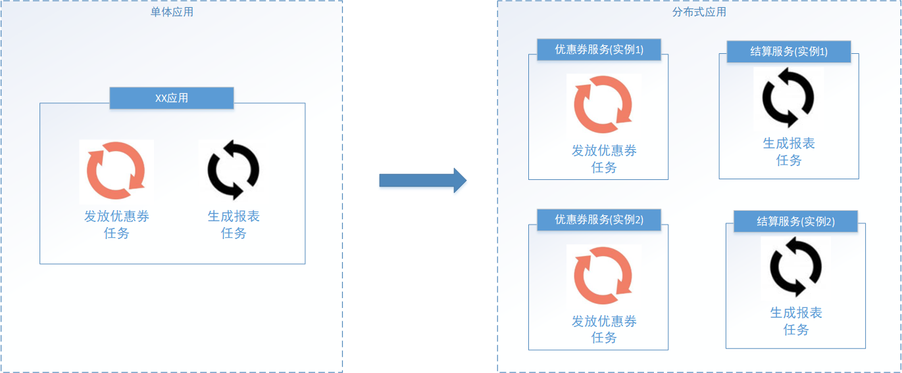

将任务调度程序分布式构建，这样就可以具有分布式系统的特点，并且提高任务的调度处理能力：

1、并行任务调度

并行任务调度实现靠多线程，如果有大量任务需要调度，此时光靠多线程就会有瓶颈了，因为一台计算机CPU的处理能力是有限的。

如果将任务调度程序分布式部署，每个结点还可以部署为集群，这样就可以让多台计算机共同去完成任务调度，我们可以将任务分割为若干个分片，由不同的实例并行执行，来提高任务调度的处理效率。

2、高可用

若某一个实例宕机，不影响其他实例来执行任务。

3、弹性扩容

当集群中增加实例就可以提高并执行任务的处理效率。

4、任务管理与监测

对系统中存在的所有定时任务进行统一的管理及监测。让开发人员及运维人员能够时刻了解任务执行情况，从而做出快速的应急处理响应。

**分布式任务调度面临的问题：**

当任务调度以集群方式部署，同一个任务调度可能会执行多次，例如：电商系统定期发放优惠券，就可能重复发放优惠券，对公司造成损失，信用卡还款提醒就会重复执行多次，给用户造成烦恼，所以我们需要控制相同的任务在多个运行实例上只执行一次。常见解决方案：

- 分布式锁，多个实例在任务执行前首先需要获取锁，如果获取失败那么就证明有其他服务已经在运行，如果获取成功那么证明没有服务在运行定时任务，那么就可以执行。
- ZooKeeper选举，利用ZooKeeper对Leader实例执行定时任务，执行定时任务的时候判断自己是否是Leader，如果不是则不执行，如果是则执行业务逻辑，这样也能达到目的。

## 1.4 xxl-Job简介    许雪里

针对分布式任务调度的需求，市场上出现了很多的产品：

1） TBSchedule：淘宝推出的一款非常优秀的高性能分布式调度框架，目前被应用于阿里、京东、支付宝、国美等很多互联网企业的流程调度系统中。但是已经多年未更新，文档缺失严重，缺少维护。

2） **XXL-Job：**大众点评的分布式任务调度平台，是一个轻量级分布式任务调度平台, 其核心设计目标是开发迅速、学习简单、轻量级、易扩展。现已开放源代码并接入多家公司线上产品线，开箱即用。

3）**Elastic-job：**当当网借鉴TBSchedule并基于**quartz** 二次开发的弹性分布式任务调度系统，功能丰富强大，采用zookeeper实现分布式协调，具有任务高可用以及分片功能。

4）Saturn： 唯品会开源的一个分布式任务调度平台，基于Elastic-job，可以全域统一配置，统一监
控，具有任务高可用以及分片功能。 

XXL-JOB是一个分布式任务调度平台，其核心设计目标是开发迅速、学习简单、轻量级、易扩展。现已开放源代码并接入多家公司线上产品线，开箱即用。

源码地址：https://gitee.com/xuxueli0323/xxl-job

文档地址：https://www.xuxueli.com/xxl-job/

**特性**

- **简单灵活**
  提供Web页面对任务进行管理，管理系统支持用户管理、权限控制；
  支持容器部署；
  支持通过通用HTTP提供跨平台任务调度；
- **丰富的任务管理功能**
  支持页面对任务CRUD操作；
  支持在页面编写脚本任务、命令行任务、Java代码任务并执行；
  支持任务级联编排，父任务执行结束后触发子任务执行；
  支持设置指定任务执行节点路由策略，包括轮询、随机、广播、故障转移、忙碌转移等；
  支持Cron方式、任务依赖、调度中心API接口方式触发任务执行
- **高性能**
  任务调度流程全异步化设计实现，如异步调度、异步运行、异步回调等，有效对密集调度进行流量削峰；
- **高可用**
  任务调度中心、任务执行节点均 集群部署，支持动态扩展、故障转移
  支持任务配置路由故障转移策略，执行器节点不可用是自动转移到其他节点执行
  支持任务超时控制、失败重试配置
  支持任务处理阻塞策略：调度当任务执行节点忙碌时来不及执行任务的处理策略，包括：串行、抛弃、覆盖策略
- **易于监控运维**
  支持设置任务失败邮件告警，预留接口支持短信、钉钉告警；
  支持实时查看任务执行运行数据统计图表、任务进度监控数据、任务完整执行日志；

# 2.XXL-Job

在分布式架构下，通过XXL-Job实现定时任务

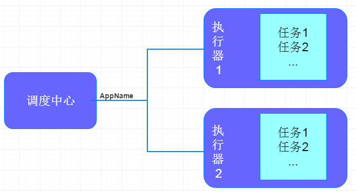

调度中心：负责管理调度信息，按照调度配置发出调度请求，自身不承担业务代码。

任务执行器：负责接收调度请求并执行任务逻辑。

任务：专注于任务的处理。

调度中心会发出调度请求，任务执行器接收到请求之后会去执行任务，任务则专注于任务业务的处理。

## 2.1 环境搭建(可选)

### 2.1.1 调度中心环境要求

- Maven3+
- Jdk1.8+
- Mysql5.7+

### 2.1.2 源码仓库地址

| 源码仓库地址                         | Release Download                                          |
| :----------------------------------- | :-------------------------------------------------------- |
| https://github.com/xuxueli/xxl-job   | [Download](https://github.com/xuxueli/xxl-job/releases)   |
| http://gitee.com/xuxueli0323/xxl-job | [Download](http://gitee.com/xuxueli0323/xxl-job/releases) |

也可以使用资料文件夹中的源码

### 2.1.3 初始化“调度数据库”

请下载项目源码并解压，获取 “调度数据库初始化SQL脚本” 并执行即可。

位置：`/xxl-job/doc/db/tables_xxl_job.sql`  共8张表

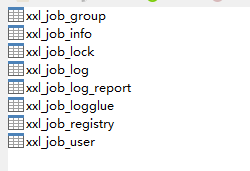

```java
- xxl_job_lock：任务调度锁表；
- xxl_job_group：执行器信息表，维护任务执行器信息；
- xxl_job_info：调度扩展信息表： 用于保存XXL-JOB调度任务的扩展信息，如任务分组、任务名、机器地址、执行器、执行入参和报警邮件等等；
- xxl_job_log：调度日志表： 用于保存XXL-JOB任务调度的历史信息，如调度结果、执行结果、调度入参、调度机器和执行器等等；
- xxl_job_logglue：任务GLUE日志：用于保存GLUE更新历史，用于支持GLUE的版本回溯功能；
- xxl_job_registry：执行器注册表，维护在线的执行器和调度中心机器地址信息；
- xxl_job_user：系统用户表；
```

调度中心支持集群部署，集群情况下各节点务必连接同一个mysql实例;

如果mysql做主从,调度中心集群节点务必强制走主库;

### 2.1.4 编译源码

解压源码,按照maven格式将源码导入IDE, 使用maven进行编译即可，源码结构如下：

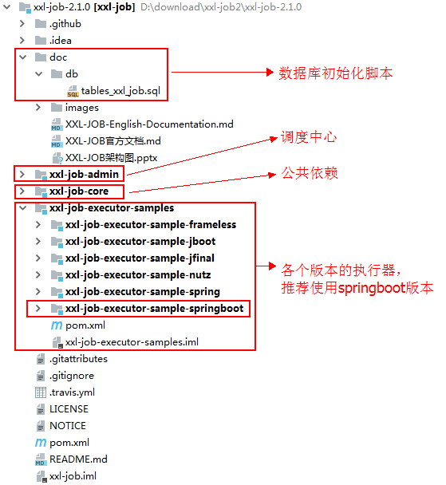

> 安装到本地仓库：mvn clean -DskipTests install


### 2.1.5 配置部署“调度中心”

调度中心项目：xxl-job-admin

作用：统一管理任务调度平台上调度任务，负责触发调度执行，并且提供任务管理平台。

步骤一：调度中心配置

调度中心配置文件地址：`/xxl-job/xxl-job-admin/src/main/resources/application.properties`

数据库的连接信息修改为自己的数据库

```properties
### web
server.port=8888
server.servlet.context-path=/xxl-job-admin

### actuator
management.server.servlet.context-path=/actuator
management.health.mail.enabled=false

### resources
spring.mvc.servlet.load-on-startup=0
spring.mvc.static-path-pattern=/static/**
spring.resources.static-locations=classpath:/static/

### freemarker
spring.freemarker.templateLoaderPath=classpath:/templates/
spring.freemarker.suffix=.ftl
spring.freemarker.charset=UTF-8
spring.freemarker.request-context-attribute=request
spring.freemarker.settings.number_format=0.##########

### mybatis
mybatis.mapper-locations=classpath:/mybatis-mapper/*Mapper.xml
#mybatis.type-aliases-package=com.xxl.job.admin.core.model

### xxl-job, datasource
spring.datasource.url=jdbc:mysql://127.0.0.1:3306/xxl_job?Unicode=true&serverTimezone=Asia/Shanghai&characterEncoding=UTF-8
spring.datasource.username=root
spring.datasource.password=root
spring.datasource.driver-class-name=com.mysql.cj.jdbc.Driver

### datasource-pool
spring.datasource.type=com.zaxxer.hikari.HikariDataSource
spring.datasource.hikari.minimum-idle=10
spring.datasource.hikari.maximum-pool-size=30
spring.datasource.hikari.auto-commit=true
spring.datasource.hikari.idle-timeout=30000
spring.datasource.hikari.pool-name=HikariCP
spring.datasource.hikari.max-lifetime=900000
spring.datasource.hikari.connection-timeout=10000
spring.datasource.hikari.connection-test-query=SELECT 1

### xxl-job, email
spring.mail.host=smtp.qq.com
spring.mail.port=25
spring.mail.username=xxx@qq.com
spring.mail.password=xxx
spring.mail.properties.mail.smtp.auth=true
spring.mail.properties.mail.smtp.starttls.enable=true
spring.mail.properties.mail.smtp.starttls.required=true
spring.mail.properties.mail.smtp.socketFactory.class=javax.net.ssl.SSLSocketFactory

### xxl-job, access token
xxl.job.accessToken=

### xxl-job, i18n (default is zh_CN, and you can choose "zh_CN", "zh_TC" and "en")
xxl.job.i18n=zh_CN

## xxl-job, triggerpool max size
xxl.job.triggerpool.fast.max=200
xxl.job.triggerpool.slow.max=100

### xxl-job, log retention days
xxl.job.logretentiondays=30
```

步骤二：部署项目

如果已经正确进行上述配置，可将项目编译打包部署。

启动方式一：这是一个springboot项目，可以在idea中直接启动，不推荐使用

启动方式二：

- 执行maven打包命令：package
- 打完包以后，从项目的target目录中找到jar包拷贝到不带空格和中文的目录下
- 执行以下命令，启动项目

```shell
java -jar xxl-job-admin-2.2.0-SNAPSHOT.jar
```

调度中心访问地址：http://localhost:8888/xxl-job-admin (该地址执行器将会使用到，作为回调地址)

<font color="red"><b>启动方式三：docker部署微服务</b></font> 

- 初始化数据库

  位置：`/xxl-job/doc/db/tables_xxl_job.sql`  共8张表

- 创建容器

  ```shell
  docker run -e PARAMS="--spring.datasource.url=jdbc:mysql://192.168.200.130:3306/xxl_job?useUnicode=true&characterEncoding=UTF-8&autoReconnect=true&serverTimezone=Asia/Shanghai --spring.datasource.username=root --spring.datasource.password=root"  -p 8888:8080 -v /tmp:/data/applogs --name xxljob --privileged=true  -id xuxueli/xxl-job-admin:2.2.0
  
  
  ```

默认登录账号 “admin/123456”, 登录后运行界面如下图所示。

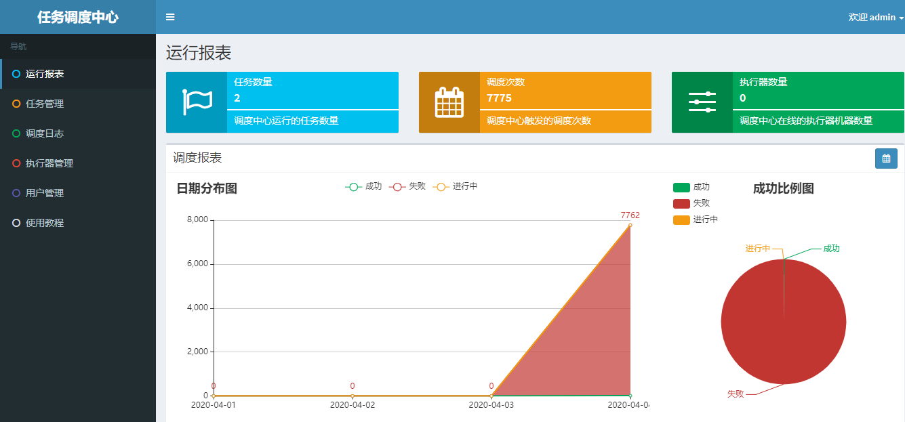

至此“调度中心”项目已经部署成功。

## 2.2 入门案例编写

### 2.2.1  配置执行器

在任务调度中心，点击进入"执行器管理"界面, 如下图:


1、此处的AppName,会在创建任务时被选择，每个任务必然要选择一个执行器。
2、"执行器列表" 中显示在线的执行器列表, 支持编辑删除。

 以下是执行器的属性说明：

| 属性名称 | 说明                                                         |
| -------- | ------------------------------------------------------------ |
| AppName  | 是每个执行器集群的唯一标示AppName, 执行器会周期性以AppName为对象进行自动注册。可通过该配置自动发现注册成功的执行器, 供任务调度时使用; |
| 名称     | 执行器的名称, 因为AppName限制字母数字等组成,可读性不强, 名称为了提高执行器的可读性; |
| 排序     | 执行器的排序, 系统中需要执行器的地方,如任务新增, 将会按照该排序读取可用的执行器列表; |
| 注册方式 | 调度中心获取执行器地址的方式；                               |
| 机器地址 | 注册方式为"手动录入"时有效，支持人工维护执行器的地址信息；   |

**具体操作：**

（1）新增执行器：


（2）自动注册和手动注册的区别和配置


### 2.2.2 在调度中心新建任务

在任务管理->新建，填写以下内容

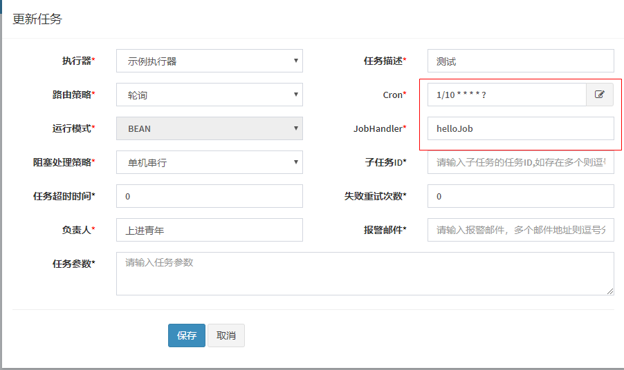

- 执行器：任务的绑定的执行器，任务触发调度时将会自动发现注册成功的执行器, 实现任务自动发现功能; 另一方面也可以方便的进行任务分组。每个任务必须绑定一个执行器, 可在 "执行器管理" 进行设置

- 任务描述：任务的描述信息，便于任务管理

  **路由策略：当执行器集群部署时，提供丰富的路由策略，包括**

  - FIRST（第一个）：固定选择第一个机器；

  - LAST（最后一个）：固定选择最后一个机器；

  - ROUND（轮询）：

  - RANDOM（随机）：随机选择在线的机器；

  - CONSISTENT_HASH（一致性HASH）：每个任务按照Hash算法固定选择某一台机器，且所有任务均匀散列在不同机器上。

  - LEAST_FREQUENTLY_USED（最不经常使用）：使用频率最低的机器优先被选举；

  - LEAST_RECENTLY_USED（最近最久未使用）：最久为使用的机器优先被选举；

  - FAILOVER（故障转移）：按照顺序依次进行心跳检测，第一个心跳检测成功的机器选定为目标执行器并发起调度；

  - BUSYOVER（忙碌转移）：按照顺序依次进行空闲检测，第一个空闲检测成功的机器选定为目标执行器并发起调度；

  - SHARDING_BROADCAST(分片广播)：广播触发对应集群中所有机器执行一次任务，同时系统自动传递分片参数；可根据分片参数开发分片任务；

- Cron：触发任务执行的Cron表达式；

- **运行模式：**

  - BEAN模式：任务以JobHandler方式维护在执行器端；需要结合 "JobHandler" 属性匹配执行器中任务；

  - GLUE模式(Java)：任务以源码方式维护在调度中心；该模式的任务实际上是一段继承自IJobHandler的Java类代码并 "groovy" 源码方式维护，它在执行器项目中运行，可使用@Resource/@Autowire注入执行器里中的其他服务；

  - GLUE模式(Shell)：任务以源码方式维护在调度中心；该模式的任务实际上是一段 "shell" 脚本；

  - GLUE模式(Python)：任务以源码方式维护在调度中心；该模式的任务实际上是一段 "python" 脚本；

  - GLUE模式(PHP)：任务以源码方式维护在调度中心；该模式的任务实际上是一段 "php" 脚本；

  - GLUE模式(NodeJS)：任务以源码方式维护在调度中心；该模式的任务实际上是一段 "nodejs" 脚本；

  - GLUE模式(PowerShell)：任务以源码方式维护在调度中心；该模式的任务实际上是一段 "PowerShell" 脚本；

- JobHandler：运行模式为 "BEAN模式" 时生效，对应执行器中新开发的JobHandler类“@JobHandler”注解自定义的value值；

- **阻塞处理策略**：调度过于密集执行器来不及处理时的处理策略；

  - 单机串行（默认）：调度请求进入单机执行器后，调度请求进入FIFO队列并以串行方式运行；

  - 丢弃后续调度：调度请求进入单机执行器后，发现执行器存在运行的调度任务，本次请求将会被丢弃并标记为失败；

  - 覆盖之前调度：调度请求进入单机执行器后，发现执行器存在运行的调度任务，将会终止运行中的调度任务并清空队列，然后运行本地调度任务；

- 子任务：每个任务都拥有一个唯一的任务ID(任务ID可以从任务列表获取)，当本任务执行结束并且执行成功时，将会触发子任务ID所对应的任务的一次主动调度。

- 任务超时时间：支持自定义任务超时时间，任务运行超时将会主动中断任务；

- 失败重试次数；支持自定义任务失败重试次数，当任务失败时将会按照预设的失败重试次数主动进行重试；

- 报警邮件：任务调度失败时邮件通知的邮箱地址，支持配置多邮箱地址，配置多个邮箱地址时用逗号分隔；

- 负责人：任务的负责人；

- 执行参数：任务执行所需的参数；

### 2.2.3 搭建springboot项目

新建项目：xxl-job-demo

（1）pom文件

```xml
	<parent>
        <groupId>org.springframework.boot</groupId>
        <artifactId>spring-boot-starter-parent</artifactId>
        <version>2.3.2.RELEASE</version>
        <relativePath/> <!-- lookup parent from repository -->
    </parent>
    <dependencies>
        <dependency>
            <groupId>org.springframework.boot</groupId>
            <artifactId>spring-boot-starter-web</artifactId>
        </dependency>
        <!-- xxl-job -->
        <dependency>
            <groupId>com.xuxueli</groupId>
            <artifactId>xxl-job-core</artifactId>
            <version>2.2.0</version>
        </dependency>
    </dependencies>
```

<font color='red'>注意：如果项目中没有找到`xxl-job-core`这个依赖，需要把这个依赖安装到本地的maven仓库</font>

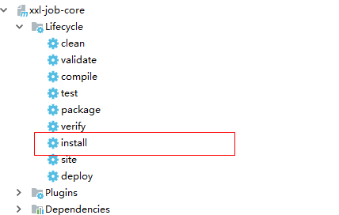

> 或者直接进入源码包目录下执行：mvn clean -DskipTests install

(2)配置有两个，一个是application.properties，另外一个是日志配置:logback.xml

application.properties

```properties
# web port
server.port=${port:8801}
# no web
#spring.main.web-environment=false
# log config
logging.config=classpath:logback.xml
### xxl-job admin address list, such as "http://address" or "http://address01,http://address02"
xxl.job.admin.addresses=http://localhost:8888/xxl-job-admin
### xxl-job, access token
xxl.job.accessToken=
### xxl-job executor appname
xxl.job.executor.appname=xxl-job-executor-sample
### xxl-job executor registry-address: default use address to registry , otherwise use ip:port if address is null
xxl.job.executor.address=
### xxl-job executor server-info
xxl.job.executor.ip=
xxl.job.executor.port=${executor.port:9999}
### xxl-job executor log-path 创建文件路径 D:/logs
xxl.job.executor.logpath=/data/applogs/xxl-job/jobhandler
### xxl-job executor log-retention-days
xxl.job.executor.logretentiondays=30

```

logback.xml

```xml
<?xml version="1.0" encoding="UTF-8"?>
<configuration debug="false" scan="true" scanPeriod="1 seconds">

    <contextName>logback</contextName>
    <property name="log.path" value="/xxl-job.log"/>

    <appender name="console" class="ch.qos.logback.core.ConsoleAppender">
        <encoder>
            <pattern>%d{HH:mm:ss.SSS} %contextName [%thread] %-5level %logger{36} - %msg%n</pattern>
        </encoder>
    </appender>

    <appender name="file" class="ch.qos.logback.core.rolling.RollingFileAppender">
        <file>${log.path}</file>
        <rollingPolicy class="ch.qos.logback.core.rolling.TimeBasedRollingPolicy">
            <fileNamePattern>${log.path}.%d{yyyy-MM-dd}.zip</fileNamePattern>
        </rollingPolicy>
        <encoder>
            <pattern>%date %level [%thread] %logger{36} [%file : %line] %msg%n
            </pattern>
        </encoder>
    </appender>

    <root level="info">
        <appender-ref ref="console"/>
        <appender-ref ref="file"/>
    </root>

</configuration>
```

(3)引导类：

```java
package com.itheima.xxljob;

import org.springframework.boot.SpringApplication;
import org.springframework.boot.autoconfigure.SpringBootApplication;

@SpringBootApplication
public class XxlJobApplication {

    public static void main(String[] args) {
        SpringApplication.run(XxlJobApplication.class,args);
    }
}
```

### 2.2.4 添加xxl-job配置

添加配置类：

这个类主要是创建了任务执行器，参考官方案例编写，无须改动

```java
package com.itheima.xxljob.config;

import com.xxl.job.core.executor.impl.XxlJobSpringExecutor;
import org.slf4j.Logger;
import org.slf4j.LoggerFactory;
import org.springframework.beans.factory.annotation.Value;
import org.springframework.context.annotation.Bean;
import org.springframework.context.annotation.Configuration;

/**
 * xxl-job config
 *
 * @author xuxueli 2017-04-28
 */
@Configuration
public class XxlJobConfig {
    private Logger logger = LoggerFactory.getLogger(XxlJobConfig.class);

    @Value("${xxl.job.admin.addresses}")
    private String adminAddresses;

    @Value("${xxl.job.accessToken}")
    private String accessToken;

    @Value("${xxl.job.executor.appname}")
    private String appName;

    @Value("${xxl.job.executor.address}")
    private String address;

    @Value("${xxl.job.executor.ip}")
    private String ip;

    @Value("${xxl.job.executor.port}")
    private int port;

    @Value("${xxl.job.executor.logpath}")
    private String logPath;

    @Value("${xxl.job.executor.logretentiondays}")
    private int logRetentionDays;


    @Bean
    public XxlJobSpringExecutor xxlJobExecutor() {
        logger.info(">>>>>>>>>>> xxl-job config init.");
        XxlJobSpringExecutor xxlJobSpringExecutor = new XxlJobSpringExecutor();
        xxlJobSpringExecutor.setAdminAddresses(adminAddresses);
        xxlJobSpringExecutor.setAppname(appName);
        xxlJobSpringExecutor.setAddress(address);
        xxlJobSpringExecutor.setIp(ip);
        xxlJobSpringExecutor.setPort(port);
        xxlJobSpringExecutor.setAccessToken(accessToken);
        xxlJobSpringExecutor.setLogPath(logPath);
        xxlJobSpringExecutor.setLogRetentionDays(logRetentionDays);

        return xxlJobSpringExecutor;
    }

    /**
     * 针对多网卡、容器内部署等情况，可借助 "spring-cloud-commons" 提供的 "InetUtils" 组件灵活定制注册IP；
     *
     *      1、引入依赖：
     *          <dependency>
     *             <groupId>org.springframework.cloud</groupId>
     *             <artifactId>spring-cloud-commons</artifactId>
     *             <version>${version}</version>
     *         </dependency>
     *
     *      2、配置文件，或者容器启动变量
     *          spring.cloud.inetutils.preferred-networks: 'xxx.xxx.xxx.'
     *
     *      3、获取IP
     *          String ip_ = inetUtils.findFirstNonLoopbackHostInfo().getIpAddress();
     */


}
```

### 2.2.5 创建任务

```java
package com.itheima.xxljob.job;

import com.xxl.job.core.biz.model.ReturnT;
import com.xxl.job.core.handler.annotation.XxlJob;
import org.springframework.beans.factory.annotation.Value;
import org.springframework.stereotype.Component;

import java.time.LocalDateTime;


@Component
public class HelloJob {

    @Value("${server.port}")
    private String appPort;

    @XxlJob("helloJob")
    public ReturnT<String> hello(String param) throws Exception {
        System.out.println("helloJob："+ LocalDateTime.now()+",端口号"+appPort);
        return ReturnT.SUCCESS;
    }
}

```

<font color='red'>`@XxlJob("helloJob")`这个一定要与调度中心新建任务的JobHandler的值保持一致,如下图：</font>

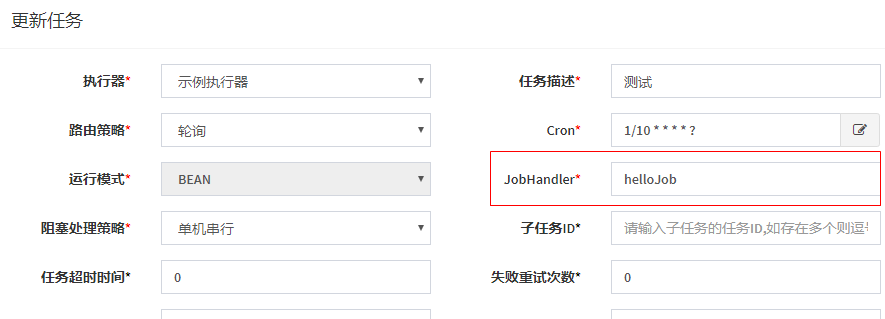


### 2.2.6 测试

（1）首先启动调度中心

（2）启动xxl-job-demo项目，为了展示更好的效果，可以同时启动三个项目，用同一个JobHandler，查看处理方式。

在启动多个项目的时候，端口需要切换，连接xxl-job的执行器端口不同相同

服务一：默认启动8801端口，执行器端口为9999

idea中不用其他配置，直接启动项目即可

服务二：项目端口：8802，执行器端口：9998

idea配置如下：

- 编辑配置，Edit Configurations...


- 选中XxlJobApplication，点击复制


- 修改参数


- 启动：选中8802启动项目


服务三：项目端口：8803，执行器端口：9997


（3）测试效果

三个项目启动后，可以查看到是轮询的方式分别去执行当前调度任务。

## 2.3 广播任务和动态分片

### 2.3.1 什么是作业分片

作业分片是指任务的分布式执行，需要将一个任务拆分为多个独立的任务项，然后由分布式的应用实例
分别执行某一个或几个分片项。

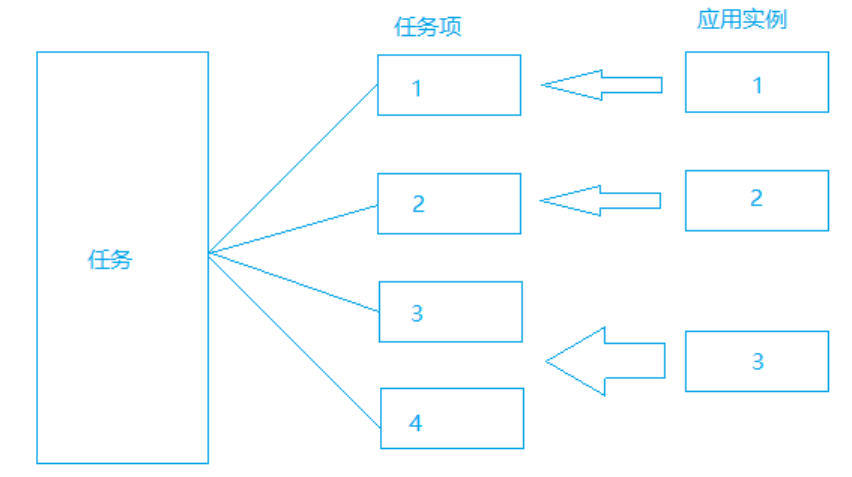

### 2.3.2 XXL-JOB分片

执行器集群部署时，任务路由策略选择”分片广播”情况下，一次任务调度将会广播触发对应集群中所有执行器执行一次任务，同时系统自动传递分片参数；可根据分片参数开发分片任务；

“分片广播” 以执行器为维度进行分片，支持动态扩容执行器集群从而动态增加分片数量，协同进行业务处理；在进行大数据量业务操作时可显著提升任务处理能力和速度。

“分片广播” 和普通任务开发流程一致，不同之处在于可以获取分片参数，获取分片参数进行分片业务处理。

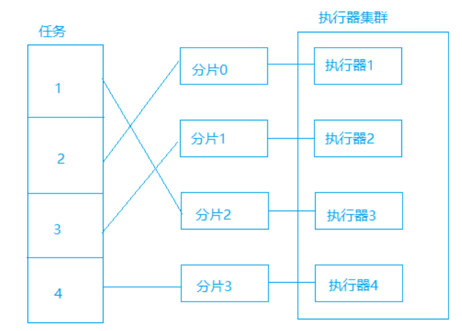

### 2.3.3 XXL-JOB支持分片的好处


30万 条  


3台

10万

10万

10万

- 分片项与业务处理解耦
  XXL-JOB并不直接提供数据处理的功能，框架只会将分片项分配至各个运行中的作业服务器，开发者需
  要自行处理分片项与真实数据的对应关系。
- 最大限度利用资源
  基于业务需求配置合理数量的执行器服务，合理设置分片，作业将会最大限度合理的利用分布式资源。

### 2.3.4 适用场景

- 分片任务场景：10个执行器的集群来处理10w条数据，每台机器只需要处理1w条数据，耗时降低10倍；
- 广播任务场景：广播执行器机器运行shell脚本、广播集群节点进行缓存更新等

### 2.3.5 分片广播案例演示

目标：实现XXL-JOB作业分片的演示

方案分析：规划一个任务，两个分片，对应两个执行器，每个分片处理一部分任务。

实现步骤：

- 创建分片执行器

  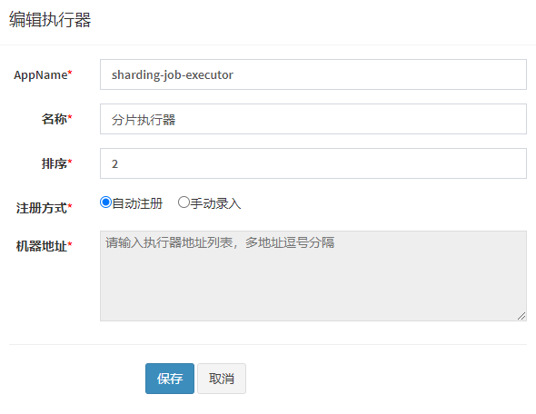

- 创建任务

  指定刚才创建的**分片执行器**，在路由策略这一栏选择**分片广播**

  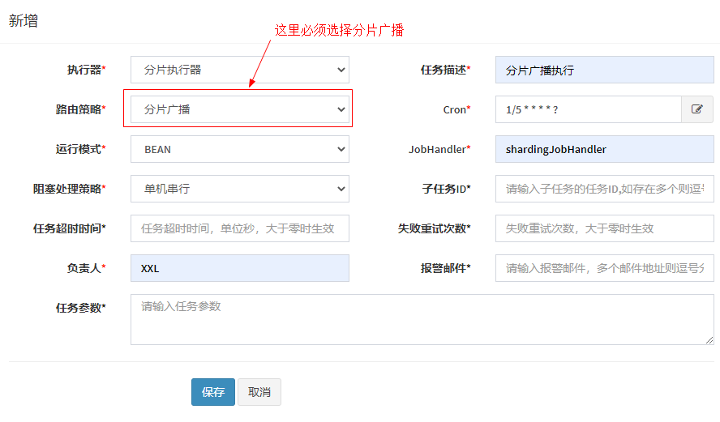

- 分片广播代码

  分片参数属性说明：

  - index：当前分片序号(从0开始)，执行器集群列表中当前执行器的序号；

  - total：总分片数，执行器集群的总机器数量；

  

  目前有一万条数据，使用两个分片同时执行

  ```java
  /**
       * 2、分片广播任务
       */
  @XxlJob("shardingJobHandler")
  public ReturnT<String> shardingJobHandler(String param) throws Exception {
  
      // 分片参数
      ShardingUtil.ShardingVO shardingVO = ShardingUtil.getShardingVo();
      XxlJobLogger.log("分片参数：当前分片序号 = {}, 总分片数 = {}", shardingVO.getIndex(), shardingVO.getTotal());
  
      List<Integer> list = getList();
      for (Integer integer : list) {
          if(integer % shardingVO.getTotal() == shardingVO.getIndex()){
              System.out.println("第"+shardingVO.getIndex()+"分片执行，执行数据为："+integer);
          }
      }
  
      return ReturnT.SUCCESS;
  }
  
  public static List<Integer> getList(){
      List<Integer> list = new ArrayList<>();
      for (int i = 0; i < 10000 ; i++) {
          list.add(i);
      }
      return list;
  }
  ```


结论：

* 如果没有设定分片的执行逻辑，默认情况下是广播形式执行，即集群中的每一个节点都会执行任务
* 如果设定了分片执行逻辑，则会把任务划分到各个集群中执行


