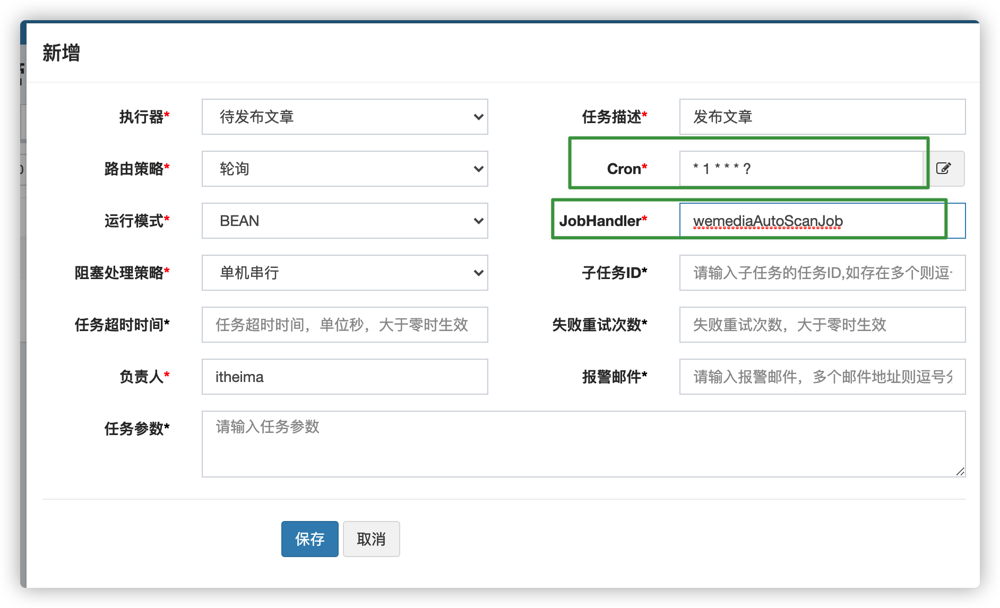
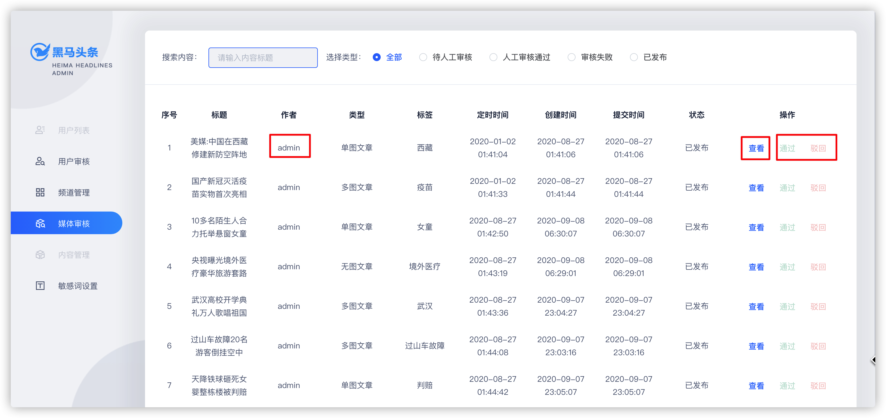
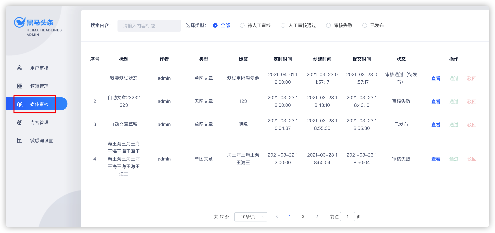
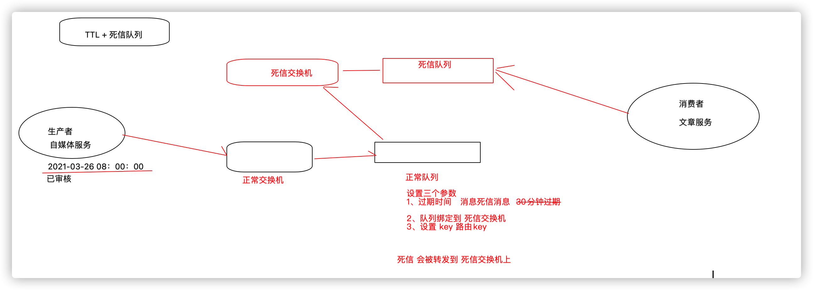

# 第八章 分布式任务调度&人工审核

## 今日目标

- 能够理解什么是分布式任务调度
- 能够掌握xxl-job的基本使用
- 能够使用xxl-job解决黑马头条项目中定时任务的功能
- 能够完成自媒体文章人工审核功能
- 能够完成自媒体端文章上下架同步的问题

## 1 分布式任务调度

详细查看资料文件夹中的xxl-job相关文档。

## 2 自媒体文章审核-定时任务扫描待发布文章

### 2.1 需求分析

- 前期回顾：在自媒体文章审核的时候，审核通过后，判断了文章的发布时间大于当前时间，这个时候并没有真正的发布文章，
  - 把文章的状态设置为了8（审核通过待发布）
  - 如果是人工审核通过，把状态改为了4，也没有发布。
- 定时任务的作用就是每分钟去扫描这些待发布的文章，**如果当前文章的状态为8或为4的，且<font color="red">发布时间小于等于当前时间</font> 的，立刻发布当前文章**。

### 2.2 自媒体文章数据准备

自动审核的代码都是通过自媒体文章的id进行审核的，这个时候需要在admin端远程调用自媒体端查询文章状态为8或4且发布时间小于当前时间的文章id列表

（1）修改WmNewsController接口，新增方法

```java
@ApiOperation(value="查询审核通过待发布",notes="查询状态为4 或 8,  发布时间小于等于当前时间的文章数据")
@GetMapping("/findRelease")
public List<Integer> findRelease() {
    return null;
}
```

(2)业务层

在自媒体微服务中的WmNewsService新增方法

```java
/**
     * 查询需要发布的文章id列表
     * @return
     */
List<Integer> findRelease();
```

实现方法：

```java
/**
 * 查询需要发布的文章id列表
 * @return
 */
@Override
public List<Integer> findRelease() {
  //查询状态为4或为8的数据且发布时间小于当前时间
  List<WmNews> list = list(Wrappers.<WmNews>lambdaQuery()
                           .le(WmNews::getPublishTime, new Date())
                           .in(WmNews::getStatus, 4, 8)
                           .select(WmNews::getId));
  
  List<Integer> idList = list.stream().map(WmNews::getId)
    .collect(Collectors.toList());
  return idList;
}
```

(3)控制器

WmNewsController中新增方法

```java
@ApiOperation(value="查询审核通过待发布",notes="查询状态为4 或 8,  发布时间小于等于当前时间的文章数据")
    @GetMapping("/findRelease")
    public List<Integer> findRelease() {
        return wmNewsService.findRelease();
    }
```

（4）在feign模块下添加远程调用feign接口

修改WemediaFeign接口添加方法

```java
@GetMapping("/api/v1/news/findRelease")
List<Integer> findRelease();
```

### 2.3 xxl-job调度中心创建调度任务

（1）新建执行器，原则上一个项目一个执行器，方便管理

执行器：leadnews-admin-executor


（2）新建任务

如下图：



执行器：选择自己新建的执行器

路由策略：轮询

**JobHandler**名称：wemediaAutoScanJob

Cron: `0 0/1 * * * ?`每分钟执行一次

### 2.4 xxl-job集成到项目中

（1）引入依赖信息

在 `autoconfiguration-xxljob` 中引入依赖

```xml
<dependencies>
  <dependency>
    <groupId>com.xuxueli</groupId>
    <artifactId>xxl-job-core</artifactId>
  </dependency>
  <dependency>
    <groupId>org.springframework.boot</groupId>
    <artifactId>spring-boot-autoconfigure</artifactId>
  </dependency>
  <dependency>
    <groupId>org.springframework.boot</groupId>
    <artifactId>spring-boot-starter</artifactId>
  </dependency>
  <dependency>
    <groupId>org.springframework.boot</groupId>
    <artifactId>spring-boot-configuration-processor</artifactId>
    <optional>true</optional>
  </dependency>
  <dependency>
    <groupId>org.springframework.boot</groupId>
    <artifactId>spring-boot-starter-actuator</artifactId>
  </dependency>
</dependencies>
```

（2）创建配置类

```java
package com.heima.jobs.config;

import com.xxl.job.core.executor.impl.XxlJobSpringExecutor;
import lombok.extern.log4j.Log4j2;
import org.springframework.beans.factory.annotation.Value;
import org.springframework.context.annotation.Bean;
import org.springframework.context.annotation.Configuration;

@Log4j2
@Configuration
public class XxlJobConfig {

    @Value("${xxljob.admin.addresses}")
    private String adminAddresses;

    @Value("${xxljob.executor.appname}")
    private String appName;

    @Value("${xxljob.executor.port}")
    private int port;
    @Value("${xxljob.executor.logPath}")
    private String logPath;
    @Bean
    public XxlJobSpringExecutor xxlJobExecutor() {
        log.info(">>>>>>>>>>> xxl-job config init.");
        XxlJobSpringExecutor xxlJobSpringExecutor = new XxlJobSpringExecutor();
        xxlJobSpringExecutor.setAdminAddresses(adminAddresses);
        xxlJobSpringExecutor.setAppname(appName);
        xxlJobSpringExecutor.setPort(port);
        xxlJobSpringExecutor.setLogRetentionDays(30);
        xxlJobSpringExecutor.setLogPath(logPath);

        return xxlJobSpringExecutor;
    }
}
```

​    3 人工审核文章

（4）自动化配置类`META-INF/spring.factories`

```properties
org.springframework.boot.autoconfigure.EnableAutoConfiguration=\
  com.heima.jobs.config.XxlJobConfig
```

### 2.5 创建调度任务，定时审核

（1）admin端添加依赖：

```xml
<dependency>
    <groupId>com.heima</groupId>
    <artifactId>autoconfiguration-xxljob</artifactId>
    <version>1.0-SNAPSHOT</version>
</dependency>
```

（2）application.yml 添加配置

```yml
xxljob:
  admin:
    addresses: http://192.168.200.129:8888/xxl-job-admin
  executor:
    appname: leadnews-admin-executor
    port: 9999
    logPath: /Users/itcast/itheima/logs
```

创建任务,查询自媒体文章后进行审核

```java
package com.heima.admin.job;
import com.heima.admin.service.WemediaNewsAutoScanService;
import com.heima.feigns.wemedia.WemediaFeign;
import com.xxl.job.core.biz.model.ReturnT;
import com.xxl.job.core.handler.annotation.XxlJob;
import lombok.extern.slf4j.Slf4j;
import org.springframework.beans.factory.annotation.Autowired;
import org.springframework.stereotype.Component;
import java.util.List;
@Component
@Slf4j
public class WeMediaNewsAutoScanJob {
    @Autowired
    private WemediaNewsAutoScanService wemediaNewsAutoScanService;
    @Autowired
    private WemediaFeign wemediaFeign;
    /**
     * @param param
     * @return
     * @throws Exception
     */
    @XxlJob("wemediaAutoScanJob")
    public ReturnT<String> autoScanJob(String param) throws Exception {
        log.info("自媒体文章审核调度任务开始执行....");
        List<Integer> releaseIdList = wemediaFeign.findRelease();
        if(null!=releaseIdList && !releaseIdList.isEmpty()){
            for (Integer id : releaseIdList) {
                wemediaNewsAutoScanService.autoScanByMediaNewsId(id);
            }
        }
        log.info("自媒体文章审核调度任务执行结束....");
        return ReturnT.SUCCESS;
    }
}
```

### 2.6 测试

在数据库中准备好数据，数据状态为8且发布时间小于当前时间

## 3 admin端-人工审核文章

### 3.1 需求分析

自媒体文章如果没有自动审核成功，而是到了人工审核（自媒体文章状态为1），需要在admin端人工处理文章的审核



平台管理员可以查看待人工审核的文章信息，可以**通过（状态改为4）**或**驳回（状态改为2）**

也可以通过点击**查看**按钮，查看文章详细信息，查看详情后可以根据内容判断是否需要通过审核


### 3.2 媒体审核功能实现

#### 3.2.1 查询文章列表

查询文章列表时候，不仅仅要返回文章数据，也要返回作者名称，这个时候返回的数据，需要包含作者名称

1. 需要使用wm_news表与wm_user表做关联查询

2. 在返回的结果的时候，单独再封装一个类，用于包装用户名称和文章数据 WmNewsVo

> **vo:view object 视图对象  是一个表现层对象，主要对应页面显示（web页面）的数据对象**

3. 由于需要做关联查询，mybatis-plus暂时不支持关联查询，需要自定义mapper实现

WmNewsVo

```java
package com.heima.model.wemedia.vo;
import com.heima.model.wemedia.pojo.WmNews;
import lombok.Data;
@Data
public class WmNewsVo  extends WmNews {
    /**
     * 作者名称
     */
    private String authorName;
}
```


（1）api接口

在WmNewsController接口新增方法

```java
	@ApiOperation(value = "分页查询封装列表_返回vo",notes = "条件中包含 文章名称 文章状态信息")
    @PostMapping("/list_vo")
    public ResponseResult findList(@RequestBody NewsAuthDto dto) {
        return wmNewsService.findList(dto);
    }
```

NewsAuthDto

```java
package com.heima.model.wemedia.dto;
import com.heima.model.common.dto.PageRequestDto;
import lombok.Data;
@Data
public class NewsAuthDto extends PageRequestDto {
    /**
     * 文章标题
     */
    private String title;
    /**
     * 状态
     */
    private Short status;
}
```

(2) mapper

在WmNewsMapper中定义两个方法

```java
public interface WmNewsMapper extends BaseMapper<WmNews> {

    List<WmNewsVo> findListAndPage(@Param("dto") NewsAuthDto dto);
    long findListCount(@Param("dto") NewsAuthDto dto);
}
```

对应的映射文件

```java
<?xml version="1.0" encoding="UTF-8"?>
<!DOCTYPE mapper PUBLIC "-//mybatis.org//DTD Mapper 3.0//EN" "http://mybatis.org/dtd/mybatis-3-mapper.dtd">
<mapper namespace="com.heima.wemedia.mapper.WmNewsMapper">
    <select id="findListAndPage" resultType="com.heima.model.wemedia.vos.WmNewsVo" parameterType="com.heima.model.wemedia.dtos.NewsAuthDto">
        SELECT
        wn.*, wu.`name` authorName
        FROM
        wm_news wn
        LEFT JOIN wm_user wu ON wn.user_id = wu.id
        <where>
            <if test="dto.title != null and dto.title != ''">
                and wn.title like #{dto.title}
            </if>
            <if test="dto.status != null and dto.status != ''">
                and wn.status = #{dto.status}
            </if>

        </where>
        LIMIT #{dto.page},#{dto.size}
    </select>

    <select id="findListCount" resultType="long" parameterType="com.heima.model.wemedia.dtos.NewsAuthDto">
        SELECT
        count(1)
        FROM
        wm_news wn
        LEFT JOIN wm_user wu ON wn.user_id = wu.id
        <where>
            <if test="dto.title != null and dto.title != ''">
                and wn.title like #{dto.title}
            </if>
            <if test="dto.status != null and dto.status != ''">
                and wn.status = #{dto.status}
            </if>
        </where>
    </select>
</mapper>
```

(3) 业务层

在WmNewsService中新增方法

```java
 /**
     * 查询文章列表
     * @param dto
     * @return
     */
public ResponseResult findList(NewsAuthDto dto);
```

实现方法

```java
/**
     * 查询文章列表
     * @param dto
     * @return
     */
    @Override
    public ResponseResult findList(NewsAuthDto dto) {
        //1.检查参数
        dto.checkParam();
        //记录当前页
        int currentPage = dto.getPage();
        //设置起始页
        dto.setPage((dto.getPage()-1)*dto.getSize());
        if(StringUtils.isNotBlank(dto.getTitle())){
            dto.setTitle("%"+dto.getTitle()+"%");
        }
        //2.分页查询
        List<WmNewsVo> wmNewsVoList = wmNewsMapper.findListAndPage(dto);
        //统计多少条数据
        long count = wmNewsMapper.findListCount(dto);
        //3.结果返回
        PageResponseResult result = new PageResponseResult(currentPage, dto.getSize(), count);
        result.setData(wmNewsVoList);
        result.setHost(webSite);
        return result;
    }
```

（4）控制层

在WmNewsController中新增方法

```java
    @ApiOperation(value = "分页查询封装列表_返回vo",notes = "条件中包含 文章名称 文章状态信息")
    @PostMapping("/list_vo")
    public ResponseResult findList(@RequestBody NewsAuthDto dto) {
        return wmNewsService.findList(dto);
    }
```

(5)在**admin**网关中添加自媒体的路由

```yaml
# 自媒体
- id: wemedia
  uri: lb://leadnews-wemedia
  predicates:
    - Path=/wemedia/**
  filters:
    - StripPrefix= 1
```

(6) 访问前端测试



#### 3.2.2 查询文章详情

查询文章详情，是根据文章id查询，返回的vo对象

(1)在WmNewsController接口中新增方法

```java
@ApiOperation("根据文章id查询vo对象")
@GetMapping("/one_vo/{id}")
@Override
public ResponseResult findWmNewsVo(@PathVariable("id") Integer id) {
    return wmNewsService.findWmNewsVo(id);
}
```

(2)mapper

使用mybatis-plus自带

(3) 业务层

在WmNewsService中新增方法

```java
 /**
     * 查询文章详情
     * @param id
     * @return
     */
public ResponseResult findWmNewsVo(Integer id) ;
```

实现类：

```java
@Autowired
private WmUserMapper wmUserMapper;

/**
     * 查询文章详情
     * @param id
     * @return
     */
@Override
public ResponseResult findWmNewsVo(Integer id) {
    //1参数检查
    if(id == null){
        return ResponseResult.errorResult(AppHttpCodeEnum.PARAM_INVALID);
    }
    //2.查询文章信息
    WmNews wmNews = getById(id);
    if(wmNews == null){
        return ResponseResult.errorResult(AppHttpCodeEnum.DATA_NOT_EXIST);
    }
    //3.查询作者
    WmUser wmUser = null;
    if(wmNews.getUserId() != null){
        wmUser = wmUserMapper.selectById(wmNews.getUserId());
    }

    //4.封装vo信息返回
    WmNewsVo wmNewsVo = new WmNewsVo();
    BeanUtils.copyProperties(wmNews,wmNewsVo);
    if(wmUser != null){
        wmNewsVo.setAuthorName(wmUser.getName());
    }
    ResponseResult responseResult = ResponseResult.okResult(wmNewsVo);
    responseResult.setHost(webSite);
    return responseResult;
}
```

（4）控制层

```java
/**
     * 查询文章详情
     * @param id
     * @return
     */
@GetMapping("/one_vo/{id}")
@Override
public ResponseResult findWmNewsVo(@PathVariable("id") Integer id) {
    return wmNewsService.findWmNewsVo(id);
}
```

(5)打开页面测试

#### 3.2.3 修改文章

>当文章是人工审核的时候，可以进行审核
>
>审核成功，把文章状态改为4 
>
>审核失败，把文章状态改为2 给出失败原因

(1)在WmNewsController接口定义两个方法

```java
/**
 * 文章审核成功
 * @param dto
 * @return
 */
public ResponseResult authPass(NewsAuthDto dto);
/**
 * 文章审核失败
 * @param dto
 * @return
 */
public ResponseResult authFail(NewsAuthDto dto);
```

在NewsAuthDto新增两个参数，完整如下：

```java
package com.heima.model.wemedia.dtos;

import com.heima.model.common.dtos.PageRequestDto;
import lombok.Data;

@Data
public class NewsAuthDto extends PageRequestDto {
    /**
     * 文章标题
     */
    private String title;
    /**
     * 状态
     */
    private Short status;
    /**
     * 文章id
     */
    private Integer id;
    /**
     * 失败原因
     */
    private String msg;
}
```

(2)mapper

无须定义

(3)业务层

在WmNewsService新增方法

```java
/**
 *  自媒体文章人工审核
 *  @param status  2  审核失败  4 审核成功
 *  @param dto
 *  @return
 */
public ResponseResult updateStatus(Short status, NewsAuthDto dto);
```

实现类

```java
/**
 * 自媒体文章人工审核
 * @param status 2  审核失败  4 审核成功
 * @param dto
 * @return
 */
@Override
public ResponseResult updateStatus(Short status, NewsAuthDto dto) {
    //1.参数检查
    if(dto == null || dto.getId() == null){
        return ResponseResult.errorResult(AppHttpCodeEnum.PARAM_INVALID);
    }
    //2.查询文章
    WmNews wmNews = getById(dto.getId());
    if(wmNews == null){
        return ResponseResult.errorResult(AppHttpCodeEnum.DATA_NOT_EXIST);
    }
    //3.修改文章状态
    wmNews.setStatus(status);
    if(StringUtils.isNotBlank(dto.getMsg())){
        wmNews.setReason(dto.getMsg());
    }
    updateById(wmNews);
    return ResponseResult.okResult(AppHttpCodeEnum.SUCCESS);
}
```

（4）控制器

先在WemediaContants类中新增两个常量

```java
public static final Short WM_NEWS_AUTH_PASS = 4;
public static final Short WM_NEWS_AUTH_FAIL = 2;
```

在WmNewsController类中新增方法

```java
	/**
     * 文章审核成功
     * @param dto
     * @return
     */
@PostMapping("/auth_pass")
public ResponseResult authPass(@RequestBody NewsAuthDto dto) {
    return wmNewsService.updateStatus(WemediaConstants.WM_NEWS_AUTH_PASS,dto);
}
	/**
     * 文章审核失败
     * @param dto
     * @return
     */
@PostMapping("/auth_fail")
public ResponseResult authFail(@RequestBody NewsAuthDto dto) {
    return wmNewsService.updateStatus(WemediaConstants.WM_NEWS_AUTH_FAIL,dto);
}
```

可打开页面直接测试

## 4 自媒体端-文章上下架

### 4.1 思路分析

在自媒体文章管理中有文章上下架的操作，上下架是文章已经审核通过发布之后的文章，目前自动审核文章和人工审核文章都已完成，可以把之前代码补充，使用异步的方式，修改app端文章的**配置信息**即可。


### 4.2 自媒体文章发消息通知下架

修改WmNewsServiceImpl中的downOrUp方法，发送消息

```java
@Override
public ResponseResult downOrUp(WmNewsDto dto) {
    //1.检查参数
    //2.查询文章
    //3.判断文章是否发布
    //4.修改文章状态，同步到app端（后期做）TODO  
    // ***发消息
    if(wmNews.getArticleId()!=null){
       Map<String,Object> mesMap = new HashMap<>();
       mesMap.put("enable",dto.getEnable());
       mesMap.put("articleId",wmNews.getArticleId());
       kafkaTemplate.send(WmNewsMessageConstants.WM_NEWS_UP_OR_DOWN_TOPIC,JSON.toJSONString(mesMap));
    }
    return ResponseResult.okResult(AppHttpCodeEnum.SUCCESS);
}
```

常量类中定义topic

```java
package com.heima.common.constans.message;
public class WmNewsMessageConstants {
    public static final String WM_NEWS_UP_OR_DOWN_TOPIC="wm.news.up.or.down.topic";
}
```

### 4.3 文章微服务

文章微服务需要接收消息

在application.yml文件中添加kafka消费者的配置

```yaml
kafka:
    bootstrap-servers: 192.168.200.129:9092
    consumer:
      group-id: ${spring.application.name}-kafka-group
      key-deserializer: org.apache.kafka.common.serialization.StringDeserializer
      value-deserializer: org.apache.kafka.common.serialization.StringDeserializer
```

编写listener，如下：

```java
@Component
@Slf4j
public class ArticleIsDownListener {
    @Autowired
    private ApArticleConfigService apArticleConfigService;
    @KafkaListener(topics = WmNewsMessageConstants.WM_NEWS_UP_OR_DOWN_TOPIC)
    public void receiveMessage(String message) {
        log.info("收到 主题: {}  消息， 参数为: {}",WmNewsMessageConstants.WM_NEWS_UP_OR_DOWN_TOPIC,message);
        Map map = JSON.parseObject(message, Map.class);
        Object enable = map.get("enable");
        boolean isDown = enable.equals(1) ? false : true;
        apArticleConfigService.update(Wrappers.<ApArticleConfig>lambdaUpdate()
                .eq(ApArticleConfig::getArticleId, map.get("articleId"))
                                      .set(ApArticleConfig::getIsDown, isDown));
    }
}
```

启动服务：

* nacos

* kafka/zk

* seata

* 自媒体wemedia

* 文章服务 article

* admin平台服务

* 自媒体网关

* 自媒体前端


当前文章定时发布存在以下问题

1. 延时发布问题
2. 文章库数据量比较大，对数据性能有损耗，定时1分钟查询一次数据库

解决方案：延迟消息队列解决

生产方：

* wemedia，文章提交审核并且文章的状态为审核通过， 发延迟消息

  

消费方：

* 监听死信队列
* 完成文章审核和发布