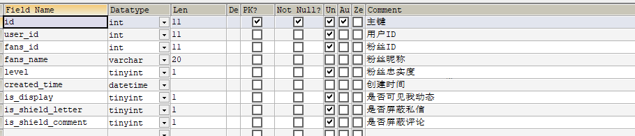

#  第九章 app端基本功能展示

## 今日目标

- 能够完成app端登录的功能
- 能够完成app端文章列表展示功能开发
- 能够完成app端文章详情的功能开发
- 能够掌握解决long类型丢失精度的问题
- 能够掌握关注作者功能

## 1 app端网关搭建

（1）`heima-leadnews-gateways`新建模块，名称：`app-gateway`

（2）application.yml

```yaml
server:
  port: 5001
spring:
  application:
    name: leadnews-app-gateway
  cloud:
    nacos:
      discovery:
        server-addr: 192.168.200.129:8848
    gateway:
      globalcors:
        cors-configurations:
          '[/**]': # 匹配所有请求
            allowedOrigins: "*" #跨域处理 允许所有的域
            allowedMethods: # 支持的方法
            - GET
            - POST
            - PUT
            - DELETE
      routes:
      #文章微服务
      - id: leadnews-article
        uri: lb://leadnews-article
        predicates:
        - Path=/article/**
        filters:
        - StripPrefix= 1
```

（4）引导类：

```java
package com.heima.app.gateway;

import org.springframework.boot.SpringApplication;
import org.springframework.boot.autoconfigure.SpringBootApplication;
import org.springframework.cloud.client.discovery.EnableDiscoveryClient;

@SpringBootApplication
@EnableDiscoveryClient
public class AppGatewayApplication {

    public static void main(String[] args) {
        SpringApplication.run(AppGatewayApplication.class,args);
    }
}
```

## 2 app端登录功能

### 2.1 app端登录-需求分析

- 点击**登录**可以根据app端的手机号和密码进行登录
- 点击**不登录，先看看**可以在无登录状态下进入app

### 2.2 app端登录-思路分析

概念介绍：**用户设备**，即当前用户所使用的终端设备。

1. 用户点击**登录**

* 用户输入**手机号和密码**到后端进行校验，校验成功生成token返给前端

- 其他请求需要带着token到app网关去校验jwt,校验成功，放行

2. 用户点击**不登录，先看看**

- 获取用户的设备id到后端根据设备id生成token,设置jwt存储的**id为0**
- 其他请求需要带着token到app网关去校验jwt,校验成功，放行


### 2.3 app端登录-功能实现

此功能在`user-service`模块中实现

#### 2.3.1 接口定义

```java
@Api("APP端用户登录API")
@RestController
@RequestMapping("/api/v1/login")
public class ApUserLoginController{
    @Autowired
    private ApUserLoginService apUserLoginService;

    @ApiOperation(value = "登录",notes = "app端可以选择不登录访问，不登录会读取移动设备ID")
    @PostMapping("/login_auth")
    public ResponseResult login(@RequestBody LoginDto dto) {
        return apUserLoginService.login(dto);
    }
}
```

`LoginDto`

```java
package com.heima.model.user.dtos;

import lombok.Data;

@Data
public class LoginDto  {

    /**
     * 设备id
     */
    private Integer equipmentId;

    /**
     * 手机号
     */
    private String phone;

    /**
     * 密码
     */
    private String password;
}
```

#### 2.3.2 mapper

校验用户登录的时候需要查询appUser表，此mapper之前课程已经定义完成

#### 2.3.3 业务层

新建接口：

```java
package com.heima.user.service;
import com.heima.model.common.dtos.ResponseResult;
import com.heima.model.user.dtos.LoginDto;
public interface ApUserLoginService {
    /**
     * app端登录
     * @param dto
     * @return
     */
    public ResponseResult login(LoginDto dto);
}
```

实现类：

```java
package com.heima.user.service.impl;

import com.baomidou.mybatisplus.core.toolkit.Wrappers;
import com.heima.model.common.dtos.ResponseResult;
import com.heima.model.common.enums.AppHttpCodeEnum;
import com.heima.model.user.dtos.LoginDto;
import com.heima.model.user.pojos.ApUser;
import com.heima.user.mapper.ApUserMapper;
import com.heima.user.service.ApUserLoginService;
import com.heima.utils.common.AppJwtUtil;
import org.apache.commons.lang3.StringUtils;
import org.springframework.beans.factory.annotation.Autowired;
import org.springframework.stereotype.Service;
import org.springframework.util.DigestUtils;

import java.util.HashMap;
import java.util.Map;

@Service
public class ApUserLoginServiceImpl implements ApUserLoginService {

    @Autowired
    ApUserMapper apUserMapper;

    /**
     * app端登录
     * @param dto
     * @return
     */
    @Override
    public ResponseResult login(LoginDto dto) {
        //1.校验参数
        if(dto.getEquipmentId() == null &&
                (StringUtils.isBlank(dto.getPassword())&&
                        StringUtils.isBlank(dto.getPassword()))){
            return ResponseResult.errorResult(AppHttpCodeEnum.PARAM_INVALID);
        }

        // 查询登录用户
        if (StringUtils.isNotBlank(dto.getPhone()) && StringUtils.isNotBlank(dto.getPassword())) {
            ApUser apUser = apUserMapper.selectOne(Wrappers.<ApUser>lambdaQuery().eq(ApUser::getStatus, 0).eq(ApUser::getPhone, dto.getPhone()));
            if (apUser == null) {
                return ResponseResult.errorResult(AppHttpCodeEnum.DATA_NOT_EXIST, "请检查手机号");
            }

            // 数据库密码
            String dbpassword = apUser.getPassword();
            String newPassword = DigestUtils.md5DigestAsHex((dto.getPassword() + apUser.getSalt()).getBytes());
            if (!dbpassword.equals(newPassword)) {
                return ResponseResult.errorResult(AppHttpCodeEnum.DATA_NOT_EXIST, "手机号或密码错误");
            }

            Map<String, Object> map = new HashMap<>();
            apUser.setPassword("");
            apUser.setSalt("");
            map.put("token", AppJwtUtil.getToken(apUser.getId().longValue()));
            map.put("user", apUser);
            return ResponseResult.okResult(map);
        }else {
            Map<String,Object> map = new HashMap<>();
            // 通过设备ID登录的 userId存0
            map.put("token",AppJwtUtil.getToken(0L));
            return ResponseResult.okResult(map);
        }

    }
}
```

#### 2.3.4 控制器

新建app用户登录控制器

```java
package com.heima.user.controller.v1;

import com.heima.apis.user.ApUserLoginControllerApi;
import com.heima.model.common.dtos.ResponseResult;
import com.heima.model.user.dtos.LoginDto;
import com.heima.user.service.ApUserLoginService;
import org.springframework.beans.factory.annotation.Autowired;
import org.springframework.web.bind.annotation.PostMapping;
import org.springframework.web.bind.annotation.RequestBody;
import org.springframework.web.bind.annotation.RequestMapping;
import org.springframework.web.bind.annotation.RestController;

@RestController
@RequestMapping("/api/v1/login")
public class ApUserLoginController{
    @Autowired
    private ApUserLoginService apUserLoginService;
    @PostMapping("/login_auth")
    public ResponseResult login(@RequestBody LoginDto dto) {
        return apUserLoginService.login(dto);
    }
}
```

#### 2.3.5 网关校验

网关校验流程：

参考其他网关设置，在 `app-gateway` 模块中新建过滤器，如下：

- 需要修改登录拦截uri的设置，需要把之前jwt的工具类拷贝过来
- 参考其他网关把全局过滤器拷贝过来

#### 2.3.6 网关路由配置

(1)修改全局过滤器，根据user的实际登录地址修改网关中登录放行的uri


(2)在application.yml文件中添加leadnews-user拦截路由

```yaml
server:
  port: 5001
spring:
  application:
    name: leadnews-app-gateway
  cloud:
    nacos:
      discovery:
        server-addr: 192.168.200.129:8848
    gateway:
      globalcors:
        cors-configurations:
          '[/**]': # 匹配所有请求
            allowedOrigins: "*" #跨域处理 允许所有的域
            allowedMethods: # 支持的方法
            - GET
            - POST
            - PUT
            - DELETE
      routes:
      #自媒体
      - id: leadnews-article
        uri: lb://leadnews-article
        predicates:
        - Path=/article/**
        filters:
        - StripPrefix= 1
      - id: leadnews-user
        uri: lb://leadnews-user
        predicates:
        - Path=/user/**
        filters:
        - StripPrefix= 1
```

#### 2.3.7 获取登录用户

在`heima-leadnews-model`模块中添加存储App登录用户的`ThreadLocal`工具类

```java
package com.heima.model.threadlocal;
import com.heima.model.user.pojo.ApUser;
public class AppThreadLocalUtils {
    private final  static ThreadLocal<ApUser> userThreadLocal = new ThreadLocal<>();
    /**
     * 设置当前线程中的用户
     * @param user
     */
    public static void setUser(ApUser user){
        userThreadLocal.set(user);
    }
    /**
     * 获取线程中的用户
     * @return
     */
    public static ApUser getUser( ){
        return userThreadLocal.get();
    }
}
```

在user模块 filter中新增 AppTokenFilter 过滤器

```java
package com.heima.user.filter;
import com.heima.model.common.threadlocal.AppThreadLocalUtils;
import com.heima.model.user.pojos.ApUser;
import lombok.extern.slf4j.Slf4j;
import org.apache.commons.lang3.StringUtils;
import org.springframework.core.annotation.Order;
import org.springframework.stereotype.Component;
import org.springframework.web.filter.GenericFilterBean;
import javax.servlet.FilterChain;
import javax.servlet.ServletException;
import javax.servlet.ServletRequest;
import javax.servlet.ServletResponse;
import javax.servlet.annotation.WebFilter;
import javax.servlet.http.HttpServletRequest;
import java.io.IOException;
@Slf4j
@Order(1)
@WebFilter(filterName = "appTokenFilter",urlPatterns = "/*")
@Component
public class AppTokenFilter extends GenericFilterBean {
    @Override
    public void doFilter(ServletRequest servletRequest, ServletResponse servletResponse, FilterChain filterChain) throws IOException, ServletException {
        // 1. 获取请求对象
        HttpServletRequest request = (HttpServletRequest) servletRequest;
        // 2. 查看请求header中是否有userId属性
        String userId = request.getHeader("userId");// 如果是设备登录 存的userId是0
        // 3. 如果userId有值存入到ThreadLocal中
        if(StringUtils.isNotBlank(userId)&&Integer.valueOf(userId)!=0){
            ApUser apUser = new ApUser();
            apUser.setId(Integer.valueOf(userId));
            AppThreadLocalUtils.setUser(apUser);
        }
        // 4. 放行
        filterChain.doFilter(servletRequest,servletResponse);
    }
}
```


## 3 app端-环境搭建

### 3.1 weex

app端的前端项目使用的阿里的前端框架weex开发的。

Weex 致力于使开发者能基于通用跨平台的 Web 开发语言和开发经验，来构建 Android、iOS 和 Web 应用。简单来说，在集成了 WeexSDK 之后，你可以使用 JavaScript 语言和前端开发经验来开发移动应用。

官网：https://weex.apache.org/zh/

### 3.2 前后端文章列表联调测试

使用Vscode打开已下载的文件

#### 3.2.1 环境准备

（1）安装依赖

在项目的根目录使用命令`npm install`命令安装项目所依赖的js文件


#### 3.2.2 启动项目

打开 VsCode terminal 控制台运行：`npm run serve` 启动前端项目


启动项目后：


如果当前电脑和手机在一个局域网下下载weex的app，就可以扫码在手机端查看效果

app下载地址：https://weex.apache.org/guide/playground.html

效果如下：

扫描二维码查看效果


#### 3.2.3 测试

可以直接测试登录，不登录和登录的情况

## 4 app端-文章列表

### 4.1 app端文章列表-需求分析

在手机端可以查看文章信息


> 1. 在默认频道展示10条文章信息
>
> 2. 可以切换频道查看不同种类文章
>
> 3. 当用户上拉可以加载更多的文章信息（按照发布时间）
>
>    * 分页
>
>    * 本页文章列表中发布时间为最小的时间为依据
>
> 4. 当用户下拉可以加载最新的文章
>    * 本页文章列表中发布时间最大的时间为依据


如果加载首页数据，前端会默认给传递一些参数


### 4.2 app端文章列表-功能实现

#### 4.2.1 api接口

在apis模块中新增接口

```java
@Api("APP文章首页API")
@RestController
@RequestMapping("/api/v1/article")
public class ArticleHomeController{
    @Autowired
    private ApArticleService articleService;
    @ApiOperation(value = "查询首页文章列表")
    @PostMapping("/load")
    public ResponseResult load(@RequestBody ArticleHomeDto dto) {
        return null;
    }
    @ApiOperation(value = "查询更多文章")
    @PostMapping("/loadmore")
    public ResponseResult loadMore(@RequestBody ArticleHomeDto dto) {
        return null;
    }
    @ApiOperation(value = "查询最新文章")
    @PostMapping("/loadnew")
    public ResponseResult loadNew(@RequestBody ArticleHomeDto dto) {
        return null;
    }
}
```

ArticleHomeDto

```java
package com.heima.model.article.dto;
import lombok.Data;
import java.util.Date;
@Data
public class ArticleHomeDto {
    // 最大时间
    Date maxBehotTime;
    // 最小时间
    Date minBehotTime;
    // 分页size
    Integer size;
    // 频道ID
    String tag;
}
```

#### 4.2.2 mapper

文章展示并不是直接查询ap_article文章表数据，需要关联查询文章的配置表信息，如果是已下架或者标明已删除的文章则不被查询出来

在之前定义好的ApArticleMapper接口中新增方法

```java
package com.heima.article.mapper;
import com.baomidou.mybatisplus.core.mapper.BaseMapper;
import com.heima.model.article.dtos.ArticleHomeDto;
import com.heima.model.article.pojos.ApArticle;
import org.apache.ibatis.annotations.Mapper;
import org.apache.ibatis.annotations.Param;
import java.util.List;
public interface ApArticleMapper extends BaseMapper<ApArticle> {
    /**
     * 查询文章列表
     * @param dto
     * @param type 1：加载更多   2：加载最新
     * @return
     */
    public List<ApArticle> loadArticleList(@Param("dto") ArticleHomeDto dto,@Param("type") Short type);

}
```

在resources\mapper目录下新建ApArticleMapper.xml文件

```xml
<?xml version="1.0" encoding="UTF-8"?>
<!DOCTYPE mapper PUBLIC "-//mybatis.org//DTD Mapper 3.0//EN" "http://mybatis.org/dtd/mybatis-3-mapper.dtd">
<mapper namespace="com.heima.article.mapper.ApArticleMapper">
    <select id="loadArticleList" resultType="ApArticle">
        SELECT
        aa.*
        FROM
        `ap_article` aa
        LEFT JOIN ap_article_config aac ON aa.id = aac.article_id
        <where>
            and aac.is_delete != 1
            and aac.is_down != 1
            <!-- loadmore -->
            <if test="type != null and type == 1">
                and aa.publish_time <![CDATA[<]]> #{dto.minBehotTime}
            </if>
            <if test="type != null and type == 2">
                and aa.publish_time <![CDATA[>]]> #{dto.maxBehotTime}
            </if>
            <if test="dto.tag != '__all__'">
                and aa.channel_id = #{dto.tag}
            </if>
        </where>
        order by aa.publish_time desc
        limit #{dto.size}
    </select>
</mapper>
```

#### 4.2.3 业务层

在ApArticleService中新增一个方法

```java
/**
     * 根据参数加载文章列表
     * @param loadtype 1为加载更多  2为加载最新   
     * @param dto
     * @return
     */
ResponseResult load(Short loadtype, ArticleHomeDto dto);
```

实现类方法

```java
package com.heima.article.service.impl;

import com.baomidou.mybatisplus.extension.service.impl.ServiceImpl;
import com.heima.article.mapper.ApArticleMapper;
import com.heima.article.service.ApArticleService;
import com.heima.common.constans.article.ArticleConstans;
import com.heima.model.article.dtos.ArticleHomeDto;
import com.heima.model.article.pojos.ApArticle;

import com.heima.model.common.dtos.ResponseResult;
import org.apache.commons.lang3.StringUtils;
import org.springframework.beans.factory.annotation.Autowired;
import org.springframework.beans.factory.annotation.Value;
import org.springframework.stereotype.Service;

import java.util.Date;
import java.util.List;


@Service
public class ApArticleServiceImpl extends ServiceImpl<ApArticleMapper, ApArticle> implements ApArticleService {

    @Autowired
    ApArticleMapper apArticleMapper;

    @Value("${file.oss.web-site}")
    private String webSite;

    /**
     * 根据参数加载文章列表
     * @param loadtype 1为加载更多  2为加载最新
     * @param dto
     * @return
     */
    @Override
    public ResponseResult load(Short loadtype, ArticleHomeDto dto) {
        //1 参数检查
        if (dto == null) {
            dto = new ArticleHomeDto();
        }
        // 页大小
        Integer size = dto.getSize();
        if (size == null || size <= 0) {
            size = 10;
        }
        dto.setSize(size);
        // 频道
        if (StringUtils.isBlank(dto.getTag())) {
            dto.setTag(ArticleConstants.DEFAULT_TAG);
        }
        // 时间
        if (dto.getMaxBehotTime() == null) {
            dto.setMaxBehotTime(new Date());
        }
        if (dto.getMinBehotTime() == null) {
            dto.setMinBehotTime(new Date());
        }
        // 类型判断
        if (!loadtype.equals(ArticleConstants.LOADTYPE_LOAD_MORE) && !loadtype.equals(ArticleConstants.LOADTYPE_LOAD_NEW)) {
            loadtype = ArticleConstants.LOADTYPE_LOAD_MORE;
        }
        //2 执行查询
        List<ApArticle> articleList = apArticleMapper.loadArticleList(dto, loadtype);
        //3 返回结果
        ResponseResult result = ResponseResult.okResult(articleList);
        result.setHost(webSite);
        return result;
    }
   
}
```

定义常量类

```java
package com.heima.common.constants.article;
public class ArticleConstants {
    public static final Short LOADTYPE_LOAD_MORE = 1;  // 加载更多
    public static final Short LOADTYPE_LOAD_NEW = 2; // 加载最新
    public static final String DEFAULT_TAG = "__all__";
}
```

#### 4.3.4 控制器

```java
package com.heima.article.controller.v1;
import com.heima.article.service.ApArticleService;
import com.heima.common.constants.article.ArticleConstants;
import com.heima.model.article.dto.ArticleHomeDto;
import com.heima.model.common.dto.ResponseResult;
import io.swagger.annotations.Api;
import io.swagger.annotations.ApiOperation;
import org.springframework.beans.factory.annotation.Autowired;
import org.springframework.web.bind.annotation.PostMapping;
import org.springframework.web.bind.annotation.RequestBody;
import org.springframework.web.bind.annotation.RequestMapping;
import org.springframework.web.bind.annotation.RestController;

@Api("APP文章首页API")
@RestController
@RequestMapping("/api/v1/article")
public class ArticleHomeController{
    @Autowired
    private ApArticleService articleService;
    @ApiOperation(value = "查询首页文章列表")
    @PostMapping("/load")
    public ResponseResult load(@RequestBody ArticleHomeDto dto) {
        return articleService.load(ArticleConstants.LOADTYPE_LOAD_MORE,dto);
    }
    @ApiOperation(value = "查询更多文章")
    @PostMapping("/loadmore")
    public ResponseResult loadMore(@RequestBody ArticleHomeDto dto) {
        return articleService.load(ArticleConstants.LOADTYPE_LOAD_MORE,dto);
    }
    @ApiOperation(value = "查询最新文章")
    @PostMapping("/loadnew")
    public ResponseResult loadNew(@RequestBody ArticleHomeDto dto) {
        return articleService.load(ArticleConstants.LOADTYPE_LOAD_NEW,dto);
    }
}

```

### 4.3 app端文章列表-测试


## 5 app文章详情展示

### 5.1 app文章详情-需求分析


在文章列表中点击文章进入到文章详情查看页面，页面显示内容包括：标题、作者、作者头像、发布时间、是否关注、喜欢、不喜欢、分享、评论、收藏、转发、猜你喜欢、打赏等内容。除此之外还需收集用户打开页面时间、阅读次数、阅读百分比等信息。

### 5.2 app文章详情-思路分析

文章详情所展示的主要是文章的内容，这个时候无须再次加重ap_article表中的数据，只需要通过前端传递过来的文章id去查询文章的内容即可，同时需要判断当前文章是否已上架和是否已经删除。

由分析得出，主要是通过文章id查询ap_article_content和ap_article_config表的数据即可。

ap_article_content  app文章内容表


ap_article_config  app文章配置表


前端发起请求解析结果，渲染到页面：


### 5.3 app文章详情-功能实现

#### 5.3.1 api接口定义

```java
@Api("文章详情API")
@RestController
@RequestMapping("/api/v1/article")
public class ArticleInfoController{
    @Autowired
    ApArticleService apArticleService;
    @ApiOperation("根据文章id查询文章详情信息")
    @PostMapping("/load_article_info")
    public ResponseResult loadArticleInfo(@RequestBody ArticleInfoDto dto) {
        return null;
    }
}
```

ArticleInfoDto

```java
package com.heima.model.article.dtos;

import lombok.Data;

@Data
public class ArticleInfoDto {
    // 文章ID
    Long articleId;
}
```


#### 5.3.2 mapper

在之前的课程中已经定义好了文章配置和文章内容的mapper接口

#### 5.3.3 业务层

在ApArticleService业务层接口中新增方法

```java
/**
     * 加载文章详情
     * @param dto
     * @return
     */
public ResponseResult loadArticleInfo(ArticleInfoDto dto);
```

实现类：

```java

@Value("${file.oss.web-site}")
private String webSite;

/**
     * 查询文章详情
     * @param dto 文章id
     * @return
     */
@Override
public ResponseResult loadArticleInfo(ArticleInfoDto dto) {
  // 1 参数检查
  if (dto==null || dto.getArticleId() == null) {
    return ResponseResult.errorResult(AppHttpCodeEnum.PARAM_INVALID);
  }

  Long id = dto.getArticleId();

  //2 查询文章配置信息config
  ApArticleConfig articleConfig = apArticleConfigMapper.selectOne(Wrappers.<ApArticleConfig>lambdaQuery().eq(ApArticleConfig::getArticleId, id));
  if (articleConfig == null
      || articleConfig.getIsDown()
      || articleConfig.getIsDelete()) {
    return ResponseResult.errorResult(AppHttpCodeEnum.DATA_NOT_EXIST, "文章已下架");
  }
  //3 查询文章内容
  ApArticleContent articleContent = apArticleContentMapper.selectOne(Wrappers.<ApArticleContent>lambdaQuery().eq(ApArticleContent::getArticleId, id));
  if (articleContent == null) {
    return ResponseResult.errorResult(AppHttpCodeEnum.DATA_NOT_EXIST, "文章不存在");
  }
  //4 返回封装结果
  Map<String, Object> resultMap = new HashMap<>();
  resultMap.put("config", articleConfig);
  resultMap.put("content", articleContent);
  return ResponseResult.okResult(resultMap);
}

```

#### 5.3.4 控制层

控制层：

```java
package com.heima.article.controller.v1;

import com.heima.apis.article.ArticleInfoControllerApi;
import com.heima.article.service.ApArticleService;
import com.heima.model.article.dtos.ArticleInfoDto;
import com.heima.model.common.dtos.ResponseResult;
import org.springframework.beans.factory.annotation.Autowired;
import org.springframework.web.bind.annotation.PostMapping;
import org.springframework.web.bind.annotation.RequestBody;
import org.springframework.web.bind.annotation.RequestMapping;
import org.springframework.web.bind.annotation.RestController;

@RestController
@RequestMapping("/api/v1/article")
public class ArticleInfoController implements ArticleInfoControllerApi {
    @Autowired
    ApArticleService apArticleService;
    @PostMapping("/load_article_info")
    @Override
    public ResponseResult loadArticleInfo(@RequestBody ArticleInfoDto dto) {
        return apArticleService.loadArticleInfo(dto);
    }
}
```

#### 5.3.5 测试

启动前端项目：heima-leadnews-app

在文章列表点击一篇文章进入详情


并不能查询出文章信息。

查看前端传递的文章id：1350442954170368000

实际的文章id为：1350442954170368001

原因：目前文章id为long类型，在转换json传递到前端以后精度丢失，所以查询详情的文章id也是丢失精度的id,不能查询数据。

### 5.4 Long类型转换精度丢失问题解决

#### 5.4.1 解决方案分析：

方案一：将文章的id的由long类型手动改为String类型，可以解决此问题。（需要修改表结构）

方案二：可以使用jackson进行序列化和反序列化解决（本项目采用这种方案）

#### 5.4.2 jackson序列化和反序列化原理说明


- 当后端响应给前端的数据中包含了id或者特殊标识（可自定义）的时候，把当前数据进行转换为String类型
- 当后端响应前端articleId字段时，使用jackson序列化，指定该字段序列化设置为序列化为String

`heima-leadnews-model`中添加jackson依赖

```xml
<dependency>
    <groupId>com.fasterxml.jackson.core</groupId>
    <artifactId>jackson-databind</artifactId>
</dependency>
```

修改ApArticle实体类

```java
package com.heima.model.article.pojos;

import com.fasterxml.jackson.databind.annotation.JsonSerialize;
import com.fasterxml.jackson.databind.ser.std.ToStringSerializer;

@Data
@TableName("ap_article")
public class ApArticle {
    @TableId(value = "id",type = IdType.ID_WORKER)
    @JsonSerialize(using = ToStringSerializer.class)
    private Long id;
	//..... 略 .....
}
```

重启项目，使用app前端再次访问文章详情，问题解决。


## 6 app端-关注作者或取消关注

### 6.1 需求分析


如上效果：

当前登录后的用户可以关注作者，也可以取消关注作者

### 6.2 思路分析

一个用户关注了作者，作者是由用户实名认证以后开通的作者权限，才有了作者信息，作者肯定是app中的一个用户。

从用户的角度出发：一个用户可以关注其他多个作者 —— 我的关注

从作者的角度出发：一个用户（同是作者）也可以拥有很多个粉丝  —— 我的粉丝

实现步骤：

1. 前端传递作者id获取作者信息，最终获取中作者在当前app端的账号id

2. 如果是关注操作，需要保存数据，用户保存关注的作者，作者保存当前的粉丝

   2.1 异步记录关注行为（后面开发，为了推荐做准备）

4. 如果是取消关注，删除用户关注的作者，删除作者当前的粉丝

流程分析：


- app端关注信息表

  记录了当前登录用户和关注人（作者）的关系，方便当前用户查看关注的作者

- app端用户粉丝表

  记录了作者与粉丝的关系，方便作者查看自己的粉丝，同时当前作者也是app中的一个用户


- app用户表与app作者表是一对一关系，只有在用户认证以后才会有作者出现
- app用户表与app用户关注表是一对多的关系，一个用户可以关注多个作者
- app用户表与app用户粉丝表是一对多的关系，一个用户可以拥有多个粉丝


ap_user_follow APP用户关注信息表


对应实体：

```java
package com.heima.model.user.pojos;

import com.baomidou.mybatisplus.annotation.IdType;
import com.baomidou.mybatisplus.annotation.TableField;
import com.baomidou.mybatisplus.annotation.TableId;
import com.baomidou.mybatisplus.annotation.TableName;
import lombok.Data;

import java.io.Serializable;
import java.util.Date;

/**
 * <p>
 * APP用户关注信息表
 * </p>
 *
 * @author itheima
 */
@Data
@TableName("ap_user_follow")
public class ApUserFollow implements Serializable {

    private static final long serialVersionUID = 1L;

    /**
     * 主键
     */
    @TableId(value = "id", type = IdType.AUTO)
    private Integer id;

    /**
     * 用户ID
     */
    @TableField("user_id")
    private Integer userId;

    /**
     * 关注作者ID
     */
    @TableField("follow_id")
    private Integer followId;

    /**
     * 粉丝昵称
     */
    @TableField("follow_name")
    private String followName;

    /**
     * 关注度
     0 偶尔感兴趣
     1 一般
     2 经常
     3 高度
     */
    @TableField("level")
    private Short level;

    /**
     * 是否动态通知
     */
    @TableField("is_notice")
    private Boolean isNotice;

    /**
     * 创建时间
     */
    @TableField("created_time")
    private Date createdTime;

}
```

ap_user_fan  APP用户粉丝信息表



对应实体：

```java
package com.heima.model.user.pojos;

import com.baomidou.mybatisplus.annotation.IdType;
import com.baomidou.mybatisplus.annotation.TableField;
import com.baomidou.mybatisplus.annotation.TableId;
import com.baomidou.mybatisplus.annotation.TableName;
import lombok.Data;

import java.io.Serializable;
import java.util.Date;

/**
 * <p>
 * APP用户粉丝信息表
 * </p>
 *
 * @author itheima
 */
@Data
@TableName("ap_user_fan")
public class ApUserFan implements Serializable {
    private static final long serialVersionUID = 1L;
    /**
     * 主键
     */
    @TableId(value = "id", type = IdType.AUTO)
    private Integer id;
    /**
     * 用户ID
     */
    @TableField("user_id")
    private Integer userId;
    /**
     * 粉丝ID
     */
    @TableField("fans_id")
    private Long fansId;
    /**
     * 粉丝昵称
     */
    @TableField("fans_name")
    private String fansName;
    /**
     * 粉丝忠实度
            0 正常
            1 潜力股
            2 勇士
            3 铁杆
            4 老铁
     */
    @TableField("level")
    private Short level;
    /**
     * 创建时间
     */
    @TableField("created_time")
    private Date createdTime;
    /**
     * 是否可见我动态
     */
    @TableField("is_display")
    private Boolean isDisplay;
    /**
     * 是否屏蔽私信
     */
    @TableField("is_shield_letter")
    private Boolean isShieldLetter;
    /**
     * 是否屏蔽评论
     */
    @TableField("is_shield_comment")
    private Boolean isShieldComment;
}
```

### 6.3 功能实现

#### 6.3.1 接口定义

新建api接口

```java
package com.heima.apis.user;
import com.heima.model.common.dtos.ResponseResult;
import com.heima.model.user.dtos.UserRelationDto;
public interface UserRelationControllerApi {
    /**
     * 关注或取消关注
     * @param dto
     * @return
     */
    ResponseResult follow(UserRelationDto dto);
}
```

UserRelationDto

```java
package com.heima.model.user.dtos;
import lombok.Data;
@Data
public class UserRelationDto {
    // 文章作者ID
    Integer authorId;
    // 文章id
    Long articleId;
    /**
     * 操作方式
     * 0  关注
     * 1  取消
     */
    Short operation;
}
```

#### 6.3.2 feign接口-文章微服务中获取作者数据

(1)文章微服务中的AuthorControllerApi新增根据id查询作者

```java
    /**
     * 根据Id查询作者
     * @param id
     * @return
     */
    public ApAuthor findById(Integer id);
```

(2)修改AuthorController中实现这个方法

```java
@GetMapping("/one/{id}")
@Override
public ApAuthor findById(@PathVariable("id") Integer id) {
    return authorService.getById(id);
}
```

(3) 在ArticleFeign接口中新增方法

```java
@GetMapping("/api/v1/author/one/{id}")
ApAuthor selectById(@PathVariable("id") Integer id);
```

#### 6.3.3 mapper

用户关注信息mapper接口

```java
package com.heima.user.mapper;
import com.baomidou.mybatisplus.core.mapper.BaseMapper;
import com.heima.model.user.pojos.ApUserFollow;
import org.apache.ibatis.annotations.Mapper;
public interface ApUserFollowMapper extends BaseMapper<ApUserFollow> {
}
```

用户粉丝信息mapper

```java
package com.heima.user.mapper;
import com.baomidou.mybatisplus.core.mapper.BaseMapper;
import com.heima.model.user.pojos.ApUserFan;
import org.apache.ibatis.annotations.Mapper;
public interface ApUserFanMapper extends BaseMapper<ApUserFan> {
}
```

#### 6.3.4 业务层

业务层中需要使用到当前用户信息，所以需要设置filter来获取用户id，参考文章微服务

新建业务层接口

```java
package com.heima.user.service;
import com.heima.model.common.dtos.ResponseResult;
import com.heima.model.user.dtos.UserRelationDto;
public interface ApUserRelationService {
    /**
     * 用户关注/取消关注
     * @param dto
     * @return
     */
    public ResponseResult follow(UserRelationDto dto);
}
```

实现类：

```java
package com.heima.user.service.impl;
import com.baomidou.mybatisplus.core.toolkit.Wrappers;
import com.heima.feigns.article.ArticleFeign;
import com.heima.model.article.pojos.ApAuthor;
import com.heima.model.common.dtos.ResponseResult;
import com.heima.model.common.enums.AppHttpCodeEnum;
import com.heima.model.user.dtos.UserRelationDto;
import com.heima.model.user.pojos.ApUser;
import com.heima.model.user.pojos.ApUserFan;
import com.heima.model.user.pojos.ApUserFollow;
import com.heima.user.mapper.ApUserFanMapper;
import com.heima.user.mapper.ApUserFollowMapper;
import com.heima.user.mapper.ApUserMapper;
import com.heima.user.service.ApUserRelationService;
import com.heima.utils.threadlocal.AppThreadLocalUtils;
import org.springframework.beans.factory.annotation.Autowired;
import org.springframework.stereotype.Service;
import org.springframework.transaction.annotation.Transactional;
import java.util.Date;
@Service
@Transactional
public class ApUserRelationServiceImpl implements ApUserRelationService {
    @Autowired
    ArticleFeign articleFeign;
    /**
     * 用户关注/取消关注
     * @param dto
     * @return
     */
    @Override
    public ResponseResult follow(UserRelationDto dto) {
        //1.检查参数
        if(dto.getOperation() == null ||
                dto.getOperation() < 0 || dto.getOperation() > 1) {
            return ResponseResult.errorResult(AppHttpCodeEnum.PARAM_INVALID);
        }
        //2 判断是否有作者
        if(dto.getAuthorId() == null) {
            return ResponseResult.errorResult(AppHttpCodeEnum.PARAM_INVALID, "作者信息不能为空");
        }
        ApAuthor apAuthor = articleFeign.selectById(dto.getAuthorId());
        if(apAuthor == null){
            return ResponseResult.errorResult(AppHttpCodeEnum.DATA_NOT_EXIST,"关注用户不存在");
        }
        //3 判断是否登录
        ApUser user = AppThreadLocalUtils.getUser();
        if(user == null){
            return ResponseResult.errorResult(AppHttpCodeEnum.NEED_LOGIN);
        }
        // 关注
        if (dto.getOperation() == 0) {
            //4 创建数据（app用户关注和app用户粉丝）
            return followByUserId(user.getId(),apAuthor.getUserId(),dto.getArticleId());
        } else { // 取消关注
            return followCancelByUserId(user.getId(),apAuthor.getUserId());
        }
    }
    @Autowired
    ApUserMapper apUserMapper;
    @Autowired
    ApUserFollowMapper apUserFollowMapper;
    @Autowired
    ApUserFanMapper apUserFanMapper;
    /**
     * 关注
     * @param userId   普通用户（当前登录人）
     * @param followUserId 被关注的作者对应的apUser id
     * @param articleId 文章id
     * @return
     */
    private ResponseResult followByUserId(Integer userId, Integer followUserId, Long articleId) {
        //1.获取被关注的作者对应的apUser
        ApUser followUser = apUserMapper.selectById(followUserId);
        if(followUser == null){
            return ResponseResult.errorResult(AppHttpCodeEnum.DATA_NOT_EXIST,"关注用户不存在");
        }
        if (userId.intValue() == followUser.getId().intValue()) {
            return ResponseResult.errorResult(AppHttpCodeEnum.DATA_EXIST,"无需关注自己");
        }
        //2 保存当前用户关注信息
        ApUserFollow apUserFollow = apUserFollowMapper.selectOne(Wrappers.<ApUserFollow>lambdaQuery()
                .eq(ApUserFollow::getFollowId, followUser.getId())
                .eq(ApUserFollow::getUserId, userId));
        if (apUserFollow != null) {
             CustException.cust(AppHttpCodeEnum.DATA_EXIST);
        }
        apUserFollow = new ApUserFollow();
        apUserFollow.setFollowId(followUserId);
        apUserFollow.setUserId(userId);
        apUserFollow.setLevel((short)1);
        apUserFollow.setIsNotice(true);
        apUserFollow.setFollowName(followUser.getName());
        apUserFollow.setCreatedTime(new Date());
        apUserFollowMapper.insert(apUserFollow);
        //3 保存 被关注的作者对应的apUser 对应的粉丝（当前用户）
        //查询粉丝信息(站在当前文章作者角度考虑)
        ApUserFan apUserFan = apUserFanMapper.selectOne(Wrappers.<ApUserFan>lambdaQuery()
                .eq(ApUserFan::getFansId, userId).eq(ApUserFan::getUserId, followUserId));
        if (apUserFan != null) {
            CustException.cust(AppHttpCodeEnum.DATA_EXIST);
        }
        apUserFan = new ApUserFan();
        apUserFan.setUserId(followUserId);
        apUserFan.setCreatedTime(new Date());
        apUserFan.setLevel((short)0);
        apUserFan.setIsShieldComment(false);
        apUserFan.setIsShieldLetter(false);
        apUserFan.setIsDisplay(true);
        apUserFan.setFansId(userId.longValue());
				 // 粉丝名称 
        ApUser apUser = apUserMapper.selectById(userId);
        apUserFan.setFansName(apUser.getName());
        apUserFanMapper.insert(apUserFan);
        //TODO 4 记录用户的行为
        // 返回结果
        return ResponseResult.okResult(AppHttpCodeEnum.SUCCESS);
    }


    /**
     * 取消关注
     * @param userId   普通用户（当前登录人）
     * @param followUserId 被关注的作者对应的apUser id
     * @return
     */
    private ResponseResult followCancelByUserId(Integer userId, Integer followUserId) {
        // 删除当前用户关注信息
        apUserFollowMapper.delete(Wrappers.<ApUserFollow>lambdaQuery()
                .eq(ApUserFollow::getFollowId, followUserId)
                .eq(ApUserFollow::getUserId, userId));
        // 删除被关注的粉丝信息
        apUserFanMapper.delete(Wrappers.<ApUserFan>lambdaQuery()
                .eq(ApUserFan::getFansId, userId)
                .eq(ApUserFan::getUserId, followUserId));
        return ResponseResult.okResult(AppHttpCodeEnum.SUCCESS);
    }

}
```

#### 6.3.5 控制层

新建控制器

```java
package com.heima.user.controller.v1;
import com.heima.apis.user.UserRelationControllerApi;
import com.heima.model.common.dtos.ResponseResult;
import com.heima.model.user.dtos.UserRelationDto;
import com.heima.user.service.ApUserRelationService;
import org.springframework.beans.factory.annotation.Autowired;
import org.springframework.web.bind.annotation.PostMapping;
import org.springframework.web.bind.annotation.RequestBody;
import org.springframework.web.bind.annotation.RequestMapping;
import org.springframework.web.bind.annotation.RestController;
@RestController
@RequestMapping("/api/v1/user")
public class UserRelationController implements UserRelationControllerApi {
    @Autowired
    private ApUserRelationService apUserRelationService;
    @Override
    @PostMapping("/user_follow")
    public ResponseResult follow(@RequestBody UserRelationDto dto){
        return apUserRelationService.follow(dto);
    }
}
```

#### 6.3.6 测试

打开前端项目进行联调测试。

