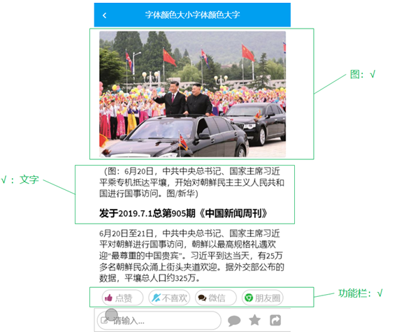

# 第十章 app端用户行为处理

## 今日目标

- 能够理解app端的行为记录
- 能够完成作者关注行为的功能
- 能够完成文章点赞行为的功能
- 能够完成文章阅读行为的功能
- 能够掌握不喜欢和收藏功能的实现思路
- 能够完成app文章关系展示功能

## 1 app-用户操作行为记录 

用户行为数据的记录包括了关注、点赞、不喜欢、收藏、阅读等行为

这些行为与当前app端的功能实现没有任何关系，即使没有行为数据，功能也不耽误实现，那为什么要做行为数据的保存呢？

黑马头条项目整个项目开发涉及web展示和大数据分析来给用户推荐文章，如何找出哪些文章是热点文章进行针对性的推荐呢？这个时候需要进行大数据分析的准备工作，埋点。

所谓“埋点”，是数据采集领域（尤其是用户行为数据采集领域）的术语，指的是针对特定用户行为或事件进行捕获、处理和发送的相关技术及其实施过程。比如用户某个icon点击次数、阅读文章的时长，观看视频的时长等等。

黑马头条课程里主要涉及到了关注行为，点赞行为，阅读行为的保存。其他类似于不喜欢、收藏功能可根据这些实现的功能自行实现。

### 1.1 行为微服务搭建

#### 1.1.1创建behavior-service微服务

处理行为是一个量比较大的操作，所以专门创建一个微服务来处理行为相关操作

模块`behavior-service`


#### 1.1.2 application.yml

```yaml
server:
  port: 9005
spring:
  application:
    name: leadnews-behavior
  cloud:
    nacos:
      discovery:
        server-addr: 192.168.200.129:8848
  datasource:
    driver-class-name: com.mysql.jdbc.Driver
    url: jdbc:mysql://192.168.200.129:3306/leadnews_behavior?useUnicode=true&characterEncoding=UTF-8&serverTimezone=UTC
    username: root
    password: root
# 设置Mapper接口所对应的XML文件位置，如果你在Mapper接口中有自定义方法，需要进行该配置
mybatis-plus:
  mapper-locations: classpath*:mapper/*.xml
  type-aliases-package: com.heima.model.behavior.pojos# 设置别名包扫描路径，通过该属性可以给包中的类注册别名
swagger:
  group: ${spring.application.name} # api文档分组名
```


### 1.2 关注行为

#### 1.2.1 需求分析

在文章详情中，当用户点击了关注作者按钮，需要记录当前行为到表中，目前只需要存储数据即可，后期会做实时的流式处理，根据这些基础数据做热点文章的计算。

#### 1.2.2 思路分析

ap_follow_behavior  APP关注行为表


对应实体

```java
package com.heima.model.behavior.pojos;

import com.baomidou.mybatisplus.annotation.IdType;
import com.baomidou.mybatisplus.annotation.TableField;
import com.baomidou.mybatisplus.annotation.TableId;
import com.baomidou.mybatisplus.annotation.TableName;
import lombok.Data;

import java.io.Serializable;
import java.util.Date;

/**
 * <p>
 * APP关注行为表
 * </p>
 *
 * @author itheima
 */
@Data
@TableName("ap_follow_behavior")
public class ApFollowBehavior implements Serializable {

    private static final long serialVersionUID = 1L;

    @TableId(value = "id", type = IdType.ID_WORKER)
    private Long id;

    /**
     * 实体ID
     */
    @TableField("entry_id")
    private Integer entryId;

    /**
     * 文章ID
     */
    @TableField("article_id")
    private Long articleId;

    /**
     * 关注用户ID
     */
    @TableField("follow_id")
    private Integer followId;

    /**
     * 登录时间
     */
    @TableField("created_time")
    private Date createdTime;

}
```

ap_behavior_entry 行为实体

行为实体指的是使用的终端设备或者是登录的用户，统称为**行为实体**。

`type :0终端设备  1用户  `

行为实体与APP关注行为表是一对多的关系，关注行为需要知道是谁（设备或用户）关注了该文章信息


对应实体

```java
package com.heima.model.behavior.pojos;

import com.baomidou.mybatisplus.annotation.IdType;
import com.baomidou.mybatisplus.annotation.TableField;
import com.baomidou.mybatisplus.annotation.TableId;
import com.baomidou.mybatisplus.annotation.TableName;
import lombok.Data;
import lombok.Getter;
import org.apache.ibatis.type.Alias;

import java.io.Serializable;
import java.util.Date;

/**
 * <p>
 * APP行为实体表,一个行为实体可能是用户或者设备，或者其它
 * </p>
 * @author itheima
 */
@Data
@TableName("ap_behavior_entry")
public class ApBehaviorEntry implements Serializable {
    private static final long serialVersionUID = 1L;
    /**
     * 主键
     */
    @TableId(value = "id", type = IdType.AUTO)
    private Integer id;
    /**
     * 实体类型
     0终端设备
     1用户
     */
    @TableField("type")
    private Short type;
    /**
     * 实体ID
     */
    @TableField("entry_id")
    private Integer entryId;
    /**
     * 创建时间
     */
    @TableField("created_time")
    private Date createdTime;
    @Alias("ApBehaviorEntryEnumType")
    public enum  Type{
        USER((short)1),EQUIPMENT((short)0);
        @Getter
        short code;
        Type(short code){
            this.code = code;
        }
    }
    public boolean isUser(){
        if(this.getType()!=null&&this.getType()== Type.USER.getCode()){
            return true;
        }
        return false;
    }
}
```

关注与取消关注的功能已经实现，当用户点击了关注保存关注行为，取消关注不保存数据。

因为只做保存操作，只需要在关注操作的时候发送消息在行为微服务保存数据即可。

实现步骤：

> 1 用户微服务中关注操作发送消息，保存用户行为
>
> 2 行为微服务接收消息
>
> 2.1 获取行为实体
>
> 2.2 保存数据


#### 1.2.3 功能实现

（1）在用户微服务中搭建kafka的环境，并且修改用户关注代码

kafka环境，在application.yml添加配置

```yaml
spring:
  application:
    name: leadnews-user
  kafka:
    bootstrap-servers: 192.168.200.130:9092
    producer:
      key-serializer: org.apache.kafka.common.serialization.StringSerializer
      value-serializer: org.apache.kafka.common.serialization.StringSerializer
```

发送消息需要准备一个FollowBehaviorDto,进行数据的传递

```java
package com.heima.model.behavior.dto;
import lombok.Data;
@Data
public class FollowBehaviorDto {
    //文章id
    Long articleId;
    //关注的id
    Integer followId;
    //用户id
    Integer userId;
}
```

新建常量，固定当前消息的topic

```java
package com.heima.common.constants.message;
public class FollowBehaviorConstants {
    public static final String FOLLOW_BEHAVIOR_TOPIC="follow.behavior.topic";
}
```

修改`UserRelationServiceImpl`中的`followByUserId`方法，添加发送消息的代码

需要在当前类中注入`KafkaTemplate`

```java
// 记录关注行为
FollowBehaviorDto dto = new FollowBehaviorDto();
dto.setFollowId(followId);
dto.setArticleId(articleId);
dto.setUserId(apUser.getId());
//异步发送消息，保存关注行为
kafkaTemplate.send(FollowBehaviorConstants.FOLLOW_BEHAVIOR_TOPIC, JSON.toJSONString(dto));
```

（2）在行为微服务中查询行为实体 


行为实体mapper

```java
package com.heima.behavior.mapper;
import com.baomidou.mybatisplus.core.mapper.BaseMapper;
import com.heima.model.behavior.pojo.ApBehaviorEntry;
import org.apache.ibatis.annotations.Mapper;
public interface ApBehaviorEntryMapper extends BaseMapper<ApBehaviorEntry> {
}
```


行为实体业务层接口：

```java
package com.heima.behavior.service;
import com.baomidou.mybatisplus.extension.service.IService;
import com.heima.model.behavior.pojo.ApBehaviorEntry;
public interface ApBehaviorEntryService extends IService<ApBehaviorEntry> {
    public ApBehaviorEntry findByUserIdOrEquipmentId(Integer userId, Integer equipmentId);
}
```

行为实体业务实现类：

```java
@Service
public class ApBehaviorEntryServiceImpl extends ServiceImpl<ApBehaviorEntryMapper, ApBehaviorEntry> implements ApBehaviorEntryService {
    @Override
    public ApBehaviorEntry findByUserIdOrEquipmentId(Integer userId, Integer equipmentId){
        //根据用户查询行为实体
        if(userId != null && equipmentId != 0 ){
          return getOne(Wrappers.<ApBehaviorEntry>lambdaQuery().eq(ApBehaviorEntry::getEntryId,userId).eq(ApBehaviorEntry::getType,1));
        }
        //根据设备id查询行为实体
        if(equipmentId != null && equipmentId != 0){
            return getOne(Wrappers.<ApBehaviorEntry>lambdaQuery().eq(ApBehaviorEntry::getEntryId,equipmentId).eq(ApBehaviorEntry::getType,0));
        }
        return null;
    }
}
```

（3）在行为微服务中保存关注行为

关注行为mapper

```java
package com.heima.behavior.mapper;
import com.baomidou.mybatisplus.core.mapper.BaseMapper;
import com.heima.model.behavior.pojo.ApFollowBehavior;
import org.apache.ibatis.annotations.Mapper;
public interface ApFollowBehaviorMapper extends BaseMapper<ApFollowBehavior> {
}
```

关注行为业务层接口

```java
package com.heima.behavior.service;
import com.baomidou.mybatisplus.extension.service.IService;
import com.heima.model.behavior.dto.FollowBehaviorDto;
import com.heima.model.behavior.pojo.ApFollowBehavior;
import com.heima.model.common.dto.ResponseResult;
public interface ApFollowBehaviorService extends IService<ApFollowBehavior> {
    public ResponseResult saveFollowBehavior(FollowBehaviorDto dto);
}
```

实现类：

```java
package com.heima.behavior.service.impl;
import com.baomidou.mybatisplus.extension.service.impl.ServiceImpl;
import com.heima.behavior.mapper.ApFollowBehaviorMapper;
import com.heima.behavior.service.ApBehaviorEntryService;
import com.heima.behavior.service.ApFollowBehaviorService;
import com.heima.model.behavior.dto.FollowBehaviorDto;
import com.heima.model.behavior.pojo.ApBehaviorEntry;
import com.heima.model.behavior.pojo.ApFollowBehavior;
import com.heima.model.common.dto.ResponseResult;
import com.heima.model.common.enums.AppHttpCodeEnum;
import lombok.extern.slf4j.Slf4j;
import org.springframework.beans.factory.annotation.Autowired;
import org.springframework.stereotype.Service;
import java.util.Date;
@Slf4j
@Service
public class ApFollowBehaviorServiceImpl extends ServiceImpl<ApFollowBehaviorMapper, ApFollowBehavior> implements ApFollowBehaviorService {
    @Autowired
    private ApBehaviorEntryService apBehaviorEntryService;
    @Override
    public ResponseResult saveFollowBehavior(FollowBehaviorDto dto) {
        //查询行为实体
        ApBehaviorEntry apBehaviorEntry = apBehaviorEntryService.findByUserIdOrEquipmentId(dto.getUserId(),null);
        if(apBehaviorEntry==null){
            return ResponseResult.errorResult(AppHttpCodeEnum.PARAM_INVALID);
        }
        //保存关注行为
        ApFollowBehavior alb = new ApFollowBehavior();
        alb.setEntryId(apBehaviorEntry.getId());
        alb.setCreatedTime(new Date());
        alb.setArticleId(dto.getArticleId());
        alb.setFollowId(dto.getFollowId());
        return ResponseResult.okResult(save(alb));
    }
}
```

(4)在行为微服务中集成kafka，并且创建监听

```yaml
spring:
  application:
    name: leadnews-behavior
  kafka:
    bootstrap-servers: 192.168.200.129:9092
    consumer:
      group-id: ${spring.application.name}-kafka-group
      key-deserializer: org.apache.kafka.common.serialization.StringDeserializer
      value-deserializer: org.apache.kafka.common.serialization.StringDeserializer
```

消息监听类：

```java
package com.heima.behavior.listener;
import com.alibaba.fastjson.JSON;
import com.heima.behavior.service.ApFollowBehaviorService;
import com.heima.common.constants.message.FollowBehaviorConstants;
import com.heima.model.behavior.dto.FollowBehaviorDto;
import lombok.extern.slf4j.Slf4j;
import org.apache.commons.lang3.StringUtils;
import org.springframework.beans.factory.annotation.Autowired;
import org.springframework.kafka.annotation.KafkaListener;
import org.springframework.stereotype.Component;
/**
 * @Description:
 * @Version: V1.0
 */
@Component
@Slf4j
public class FollowBehaviorListener {
    @Autowired
    private ApFollowBehaviorService apFollowBehaviorService;
    @KafkaListener(topics= FollowBehaviorConstants.FOLLOW_BEHAVIOR_TOPIC)
    public void receiverMessage(String message) {
        if (StringUtils.isNotBlank(message)) {
            log.info("FollowBehaviorListener receiverMessage：{}", message);
            apFollowBehaviorService.saveFollowBehavior(JSON.parseObject(message, FollowBehaviorDto.class));
            log.info("FollowBehaviorListener success");
        }
    }
}
```

(4) 测试

在app端文章详情中，当点击关注按钮的时候，会往ap_follow_behavior表中插入数据。

### 1.3 点赞行为

#### 1.3.1 需求分析


当前登录的用户点击了”赞“,就要保存当前行为数据

#### 1.3.2 思路分析


实体类：

```java
package com.heima.model.behavior.pojos;

import com.baomidou.mybatisplus.annotation.IdType;
import com.baomidou.mybatisplus.annotation.TableField;
import com.baomidou.mybatisplus.annotation.TableId;
import com.baomidou.mybatisplus.annotation.TableName;
import lombok.Data;
import org.apache.ibatis.type.Alias;

import java.io.Serializable;
import java.util.Date;

/**
 * <p>
 * APP点赞行为表
 * </p>
 *
 * @author itheima
 */
@Data
@TableName("ap_likes_behavior")
public class ApLikesBehavior implements Serializable {

    private static final long serialVersionUID = 1L;

    @TableId(value = "id", type = IdType.ID_WORKER)
    private Long id;

    /**
     * 实体ID
     */
    @TableField("entry_id")
    private Integer entryId;

    /**
     * 文章ID
     */
    @TableField("article_id")
    private Long articleId;

    /**
     * 点赞内容类型
     * 0文章
     * 1动态
     */
    @TableField("type")
    private Short type;

    /**
     * 0 点赞
     * 1 取消点赞
     */
    @TableField("operation")
    private Short operation;

    /**
     * 创建时间
     */
    @TableField("created_time")
    private Date createdTime;

    // 定义点赞内容的类型
    @Alias("ApLikesBehaviorEnumType")
    public enum Type {
        ARTICLE((short) 0), DYNAMIC((short) 1), COMMENT((short) 2);
        short code;

        Type(short code) {
            this.code = code;
        }

        public short getCode() {
            return this.code;
        }
    }

    //定义点赞操作的方式，点赞还是取消点赞
    @Alias("ApLikesBehaviorEnumOperation")
    public enum Operation {
        LIKE((short) 0), CANCEL((short) 1);
        short code;

        Operation(short code) {
            this.code = code;
        }

        public short getCode() {
            return this.code;
        }
    }

}
```


当前用户点赞以后保存数据，取消点赞则不删除数据

保存也是根据当前**行为实体和文章id**进行保存

#### 1.3.3 功能实现

（1）接口定义

新增ApLikesBehaviorController接口，添加保存的方法

```java
@Api("点赞行为API")
@RestController
@RequestMapping("/api/v1/likes_behavior")
public class ApLikesBehaviorController{
    @ApiOperation("点赞或取消点赞")
    @PostMapping
    public ResponseResult like(@RequestBody @Validated LikesBehaviorDto dto) {
        //TODO -==================
        return null;
    }
}
```

LikesBehaviorDto

```java
@Data
public class LikesBehaviorDto {
    // 设备ID
    Integer equipmentId;
    // 文章、动态、评论等ID
    @NotNull
    Long articleId;
    /**
     * 喜欢内容类型
     * 0文章
     * 1动态
     * 2评论
     */
    @Range(min = 0,max = 2)
    Short type;
    /**
     * 喜欢操作方式
     * 0 点赞
     * 1 取消点赞
     */
    @Range(min = 0,max = 1)
    Short operation;
}
```

（2）mapper

```java
package com.heima.behavior.mapper;
import com.baomidou.mybatisplus.core.mapper.BaseMapper;
import com.heima.model.behavior.pojo.ApLikesBehavior;
public interface ApLikesBehaviorMapper extends BaseMapper<ApLikesBehavior> {

}
```

（3）业务层

在功能实现的时候需要得到行为实体，所以需要得到当前登录的用户信息，参考文章微服务，添加filter，获取用户信息放到当前线程中

```java
package com.heima.behavior.filter;
import com.heima.model.threadlocal.AppThreadLocalUtils;
import com.heima.model.user.pojo.ApUser;
import org.springframework.core.annotation.Order;
import org.springframework.stereotype.Component;
import org.springframework.web.filter.GenericFilterBean;
import javax.servlet.FilterChain;
import javax.servlet.ServletException;
import javax.servlet.ServletRequest;
import javax.servlet.ServletResponse;
import javax.servlet.annotation.WebFilter;
import javax.servlet.http.HttpServletRequest;
import javax.servlet.http.HttpServletResponse;
import java.io.IOException;
@Order(1)
@WebFilter(filterName = "appTokenFilter", urlPatterns = "/*")
@Component
public class AppTokenFilter extends GenericFilterBean {
    @Override
    public void doFilter(ServletRequest req, ServletResponse res, FilterChain chain) throws IOException, ServletException {
        HttpServletRequest request = (HttpServletRequest) req;
        HttpServletResponse response = (HttpServletResponse) res;
        String userId = request.getHeader("userId");
        //如果userId为0，说明当前设备没有登录
        if(userId!=null && Integer.valueOf(userId).intValue()!=0){
            ApUser apUser = new ApUser();
            apUser.setId(Integer.valueOf(userId));
            AppThreadLocalUtils.setUser(apUser);
        }
        chain.doFilter(req,res);
    }
}
```

点赞业务层接口

```java
package com.heima.behavior.service;

import com.baomidou.mybatisplus.extension.service.IService;
import com.heima.model.behavior.dtos.LikesBehaviorDto;
import com.heima.model.behavior.pojos.ApLikesBehavior;
import com.heima.model.common.dtos.ResponseResult;

/**
 * <p>
 * APP点赞行为表 服务类
 * </p>
 * @author itheima
 */
public interface ApLikesBehaviorService extends IService<ApLikesBehavior> {
    /**
     * 存储喜欢数据
     * @param dto
     * @return
     */
	public ResponseResult like(LikesBehaviorDto dto);
}
```

实现类：

```java
package com.heima.behavior.service.impl;
import com.baomidou.mybatisplus.core.toolkit.Wrappers;
import com.baomidou.mybatisplus.extension.service.impl.ServiceImpl;
import com.heima.behavior.mapper.ApLikesBehaviorMapper;
import com.heima.behavior.service.ApBehaviorEntryService;
import com.heima.behavior.service.ApLikesBehaviorService;
import com.heima.model.behavior.dto.LikesBehaviorDto;
import com.heima.model.behavior.pojo.ApBehaviorEntry;
import com.heima.model.behavior.pojo.ApLikesBehavior;
import com.heima.model.common.dto.ResponseResult;
import com.heima.model.common.enums.AppHttpCodeEnum;
import com.heima.model.threadlocal.AppThreadLocalUtils;
import com.heima.model.user.pojo.ApUser;
import org.springframework.beans.factory.annotation.Autowired;
import java.util.Date;
public class ApLikesBehaviorServiceImpl extends ServiceImpl<ApLikesBehaviorMapper,ApLikesBehavior> implements ApLikesBehaviorService {
    @Autowired
    ApBehaviorEntryService apBehaviorEntryService;
    @Override
    public ResponseResult like(LikesBehaviorDto dto) {
        ApUser user = AppThreadLocalUtils.getUser();
        ApBehaviorEntry apBehaviorEntry = apBehaviorEntryService.findByUserIdOrEquipmentId(user.getId(), dto.getEquipmentId());
        if (apBehaviorEntry == null) {
            return ResponseResult.errorResult(AppHttpCodeEnum.PARAM_INVALID);
        }
        ApLikesBehavior apLikesBehavior = getOne(Wrappers.<ApLikesBehavior>lambdaQuery()
                .eq(ApLikesBehavior::getArticleId, dto.getArticleId())
                .eq(ApLikesBehavior::getEntryId, apBehaviorEntry.getId()));
        // 保存点赞
        if (apLikesBehavior == null && dto.getOperation().equals(ApLikesBehavior.Operation.LIKE.getCode())) 		{
            apLikesBehavior = new ApLikesBehavior();
            apLikesBehavior.setOperation(dto.getOperation());
            apLikesBehavior.setCreatedTime(new Date());
            apLikesBehavior.setType(dto.getType());
            apLikesBehavior.setArticleId(dto.getArticleId());
            apLikesBehavior.setEntryId(apBehaviorEntry.getId());
            save(apLikesBehavior);
            return ResponseResult.okResult();
        }else {
            //4.取消点赞
            apLikesBehavior.setOperation(dto.getOperation());
            updateById(apLikesBehavior);
            return ResponseResult.okResult();
        }
    }
}

```

（4）控制层

新增ApLikesBehaviorController中新增方法

```java
package com.heima.behavior.controller.v1;

import com.heima.behavior.service.ApLikesBehaviorService;
import com.heima.model.behavior.dto.LikesBehaviorDto;
import com.heima.model.common.dto.ResponseResult;
import io.swagger.annotations.Api;
import io.swagger.annotations.ApiOperation;
import org.springframework.beans.factory.annotation.Autowired;
import org.springframework.validation.annotation.Validated;
import org.springframework.web.bind.annotation.PostMapping;
import org.springframework.web.bind.annotation.RequestBody;
import org.springframework.web.bind.annotation.RequestMapping;
import org.springframework.web.bind.annotation.RestController;
@Api("点赞行为API")
@RestController
@RequestMapping("/api/v1/likes_behavior")
public class ApLikesBehaviorController{
    @Autowired
    private ApLikesBehaviorService apLikesBehaviorService;
    @ApiOperation("点赞或取消点赞")
    @PostMapping
    public ResponseResult like(@RequestBody @Validated LikesBehaviorDto dto) {
        return apLikesBehaviorService.like(dto);
    }
}
```

（5）在app网关中配置行为微服务的路由

```yaml
#行为微服务
- id: leadnews-behavior
  uri: lb://leadnews-behavior
  predicates:
  - Path=/behavior/**
  filters:
  - StripPrefix= 1
```

（6）测试

启动项目，当用户点赞文章好，可以在ap_likes_behavior表新增数据，文章取消赞，再次点赞后追加数据。

### 1.4 阅读行为

#### 1.4.1 需求分析

当用户查看了某一篇文章，需要记录当前用户查看的次数，阅读时长，阅读文章的比例，加载的时长（非必要）

#### 1.4.2 思路分析

ap_read_behavior APP阅读行为表


对应实体：

```java
/**
 * APP阅读行为表
 * @author itheima
 */
@Data
@TableName("ap_read_behavior")
public class ApReadBehavior implements Serializable {
    private static final long serialVersionUID = 1L;
    @TableId(value = "id",type = IdType.ID_WORKER)
    private Long id;
    /**
     * 用户ID
     */
    @TableField("entry_id")
    private Integer entryId;
    /**
     * 文章ID
     */
    @TableField("article_id")
    private Long articleId;
    /**
     * 阅读次数
     */
    @TableField("count")
    private Short count;
    /**
     * 阅读时间单位秒
     */
    @TableField("read_duration")
    private Integer readDuration;
    /**
     * 阅读百分比
     */
    @TableField("percentage")
    private Short percentage;
    /**
     * 文章加载时间
     */
    @TableField("load_duration")
    private Short loadDuration;
    /**
     * 登录时间
     */
    @TableField("created_time")
    private Date createdTime;
    /**
     * 更新时间
     */
    @TableField("updated_time")
    private Date updatedTime;
}
```

#### 1.4.3 功能实现

(1)接口定义

新建阅读行为的api接口

```java
@Api("阅读行为api")
@RestController
@RequestMapping("/api/v1/read_behavior")
public class ApReadBehaviorController  {
    @ApiOperation("保存阅读行为")
    @PostMapping
    public ResponseResult readBehavior(@RequestBody ReadBehaviorDto dto) {
        // TODO ======================
        return null;
    }
}
```

ReadBehaviorDto

```java
package com.heima.model.behavior.dtos;
import lombok.Data;
@Data
public class ReadBehaviorDto {
    // 设备ID
    Integer equipmentId;
    // 文章、动态、评论等ID
    Long articleId;
    /**
     * 阅读次数
     */
    Short count;
    /**
     * 阅读时长（S)
     */
    Integer readDuration;
    /**
     * 阅读百分比
     */
    Short percentage;
    /**
     * 加载时间
     */
    Short loadDuration;
}
```

(2) mapper

新建阅读行为mapper

```java
package com.heima.behavior.mapper;
import com.baomidou.mybatisplus.core.mapper.BaseMapper;
import com.heima.model.behavior.pojo.ApReadBehavior;
public interface ApReadBehaviorMapper extends BaseMapper<ApReadBehavior> {
}
```

(3) 业务层

新建阅读行为的业务层接口

```java
package com.heima.behavior.service;
import com.baomidou.mybatisplus.extension.service.IService;
import com.heima.model.behavior.dto.ReadBehaviorDto;
import com.heima.model.behavior.pojo.ApReadBehavior;
import com.heima.model.common.dto.ResponseResult;
public interface ApReadBehaviorService extends IService<ApReadBehavior> {
    ResponseResult readBehavior(ReadBehaviorDto dto);
}
```

实现类：

```java
package com.heima.behavior.service.impl;
import com.baomidou.mybatisplus.core.toolkit.Wrappers;
import com.baomidou.mybatisplus.extension.service.impl.ServiceImpl;
import com.heima.behavior.mapper.ApReadBehaviorMapper;
import com.heima.behavior.service.ApBehaviorEntryService;
import com.heima.behavior.service.ApReadBehaviorService;
import com.heima.model.behavior.dto.ReadBehaviorDto;
import com.heima.model.behavior.pojo.ApBehaviorEntry;
import com.heima.model.behavior.pojo.ApReadBehavior;
import com.heima.model.common.dto.ResponseResult;
import com.heima.model.common.enums.AppHttpCodeEnum;
import com.heima.model.threadlocal.AppThreadLocalUtils;
import com.heima.model.user.pojo.ApUser;
import org.springframework.beans.factory.annotation.Autowired;
import org.springframework.stereotype.Service;
import java.util.Date;
@Service
public class ApReadBehaviorServiceImpl extends ServiceImpl<ApReadBehaviorMapper, ApReadBehavior>
        implements ApReadBehaviorService {
    @Autowired
    ApBehaviorEntryService apBehaviorEntryService;
    /**
     * 保存或更新阅读行为
     * @param dto
     * @return
     */
    @Override
    public ResponseResult readBehavior(ReadBehaviorDto dto) {
        //1 参数检查
        if (dto == null && dto.getArticleId() == null) {
            return ResponseResult.errorResult(AppHttpCodeEnum.PARAM_INVALID);
        }
        //2 查询行为实体 (可能未登录)
        ApBehaviorEntry apBehaviorEntry = null;
        ApUser user = AppThreadLocalUtils.getUser();
        if (user == null || user.getId() == 0) {  // 设备登录
            apBehaviorEntry = apBehaviorEntryService.findByUserIdOrEquipmentId(null, 0);
        }
        if (user != null && user.getId() != 0) {
            apBehaviorEntry = apBehaviorEntryService.findByUserIdOrEquipmentId(user.getId(), null);
        }
        if (apBehaviorEntry == null) {
            return ResponseResult.errorResult(AppHttpCodeEnum.DATA_NOT_EXIST);
        }
        //3 保存或者是更新文章阅读行为
        ApReadBehavior apReadBehavior = getOne(Wrappers.<ApReadBehavior>lambdaQuery().eq(ApReadBehavior::getArticleId,dto.getArticleId() )
                .eq(ApReadBehavior::getEntryId,apBehaviorEntry.getId() ));
        if (apReadBehavior == null) { // 保存阅读行为
            apReadBehavior = new ApReadBehavior();
            apReadBehavior.setCount(dto.getCount());
            apReadBehavior.setArticleId(dto.getArticleId());
            apReadBehavior.setPercentage(dto.getPercentage());
            apReadBehavior.setEntryId(apBehaviorEntry.getId());
            apReadBehavior.setLoadDuration(dto.getLoadDuration());
            apReadBehavior.setReadDuration(dto.getReadDuration());
            apReadBehavior.setCreatedTime(new Date());
            save(apReadBehavior);
        } else {
            // 阅读+1
            // 更新时间
            apReadBehavior.setUpdatedTime(new Date());
            apReadBehavior.setCount((short)(apReadBehavior.getCount()+1));
            updateById(apReadBehavior);
        }
        //4 返回
        return ResponseResult.okResult(AppHttpCodeEnum.SUCCESS);
    }
}
```

(4)控制层

新建阅读行为控制器

```java
@Api("阅读行为api")
@RestController
@RequestMapping("/api/v1/read_behavior")
public class ApReadBehaviorController  {
    @Autowired
    ApReadBehaviorService apReadBehaviorService;

    @ApiOperation("保存阅读行为")
    @PostMapping
    public ResponseResult readBehavior(@RequestBody ReadBehaviorDto dto) {
        return apReadBehaviorService.readBehavior(dto);
    }
}
```

(5)测试

当用户查看了一篇文章的详情，点击返回重新加入文章列表发送请求，记录当前用户阅读此文章的行为

### 1.5 不喜欢行为和收藏行为

目前的请求api已经设定好了，大家可以自行实现不喜欢和收藏行为。

#### 1.5.1 不喜欢行为记录实现思路

为什么会有不喜欢？

​	一旦用户点击了不喜欢，不再给当前用户推荐这一类型的文章信息

ap_unlikes_behavior APP不喜欢行为表


```java
package com.heima.model.behavior.pojo;

import com.baomidou.mybatisplus.annotation.IdType;
import com.baomidou.mybatisplus.annotation.TableField;
import com.baomidou.mybatisplus.annotation.TableId;
import com.baomidou.mybatisplus.annotation.TableName;
import lombok.Data;
import org.apache.ibatis.type.Alias;

import java.io.Serializable;
import java.util.Date;

/**
 * <p>
 * APP不喜欢行为表
 * </p>
 *
 * @author itheima
 */
@Data
@TableName("ap_unlikes_behavior")
public class ApUnlikesBehavior implements Serializable {

    private static final long serialVersionUID = 1L;

    @TableId(value = "id", type = IdType.ID_WORKER)
    private Long id;

    /**
     * 实体ID
     */
    @TableField("entry_id")
    private Integer entryId;

    /**
     * 文章ID
     */
    @TableField("article_id")
    private Long articleId;

    /**
     * 0 不喜欢
     1 取消不喜欢
     */
    @TableField("type")
    private Short type;

    /**
     * 登录时间
     */
    @TableField("created_time")
    private Date createdTime;
    // 定义不喜欢操作的类型
    @Alias("ApUnlikesBehaviorEnumType")
    public enum Type{
        UNLIKE((short)0),CANCEL((short)1);
        short code;
        Type(short code){
            this.code = code;
        }
        public short getCode(){
            return this.code;
        }
    }
}
```

实现思路

1 获取行为实体

2 查询不喜欢对象，有则修改，无则新增

3 固定api接口地址：/api/v1/unlike_behavior    POST请求

如果想修改api接口地址，请打开前端的：heima-leadnews-app\src\common\conf.js文件进行修改


dto:

```java
@Data
public class UnLikesBehaviorDto {
    // 设备ID
    Integer equipmentId;
    // 文章ID
    Long articleId;
    /**
     * 不喜欢操作方式
     * 0 不喜欢
     * 1 取消不喜欢
     */
    Short type;

}
```

#### 1.5.2 收藏功能实现思路

收藏表在文章库中，为什么不设计在行为库？

因为app端用户可以个人中心找到自己收藏的文章列表，这样设计更方便

ap_collection APP收藏信息表


对应实体：

```java
package com.heima.model.article.pojos;
import com.baomidou.mybatisplus.annotation.IdType;
import com.baomidou.mybatisplus.annotation.TableField;
import com.baomidou.mybatisplus.annotation.TableId;
import com.baomidou.mybatisplus.annotation.TableName;
import lombok.Data;
import org.apache.ibatis.type.Alias;
import java.io.Serializable;
import java.util.Date;
/**
 * APP收藏信息表
 * @author itheima
 */
@Data
@TableName("ap_collection")
public class ApCollection implements Serializable {
    private static final long serialVersionUID = 1L;
    @TableId(value = "id", type = IdType.ID_WORKER)
    private Long id;
    /**
     * 实体ID
     */
    @TableField("entry_id")
    private Integer entryId;
    /**
     * 文章ID
     */
    @TableField("article_id")
    private Long articleId;
    /**
     * 点赞内容类型
     0文章
     1动态
     */
    @TableField("type")
    private Short type;
    /**
     * 创建时间
     */
    @TableField("collection_time")
    private Date collectionTime;
    /**
     * 发布时间
     */
    @TableField("published_time")
    private Date publishedTime;
    // 定义收藏内容类型的枚举
    @Alias("ApCollectionEnumType")
    public enum Type{
        ARTICLE((short)0),DYNAMIC((short)1);
        short code;
        Type(short code){
            this.code = code;
        }
        public short getCode(){
            return this.code;
        }
    }
    public boolean isCollectionArticle(){
        return (this.getType()!=null&&this.getType().equals(Type.ARTICLE));
    }
}
```

实现思路

1 在文章微服务中获取远程接口拿到行为实体

2 保存收藏文章数据，如果当前文章已收藏，无须再次收藏

3 固定访问url


数据流程对象dto

```java
@Data
public class CollectionBehaviorDto {
    // 设备ID
    Integer equipmentId;
    // 文章、动态ID
    Long entryId;
    /**
     * 收藏内容类型
     * 0文章
     * 1动态
     */
    Short type;
    /**
     * 操作类型
     * 0收藏
     * 1取消收藏
     */
    Short operation;
    Date publishedTime;
}
```

## 2 app文章关系展示功能

### 2.1 app文章关系-需求分析



主要是用来展示文章的关系，app端用户必须登录，判断当前用户**是否已经关注该文章的作者、是否收藏了此文章、是否点赞了文章、是否不喜欢该文章等**

例：如果当前用户点赞了该文章，点赞按钮进行高亮，其他功能类似。

### 2.2 app文章关系-思路分析

#### 2.2.1 实现思路


1 用户查看文章详情，展示文章信息（功能已实现），同时需要展示当前文章的行为（点赞，收藏等）

2 根据用户id(已登录)或设备id(未登录)去查询当前实体id

3 通过实体id和前端传递过来的文章id去查询收藏表、点赞表、不喜欢表；其中点赞和不喜欢需要远程调用behavior微服务获取数据。

4 在文章详情展示是否关注此作者，需要通过当前用户和作者关系表进行查询，有数据则关注，无数据则没有关注

返回的格式如下：

```json
{"isfollow":true,"islike":true,"isunlike":false,"iscollection":true}
```

#### 2.2.2 表关系说明


### 2.3 远程接口准备

#### 2.3.1 行为微服务

这些接口定义方便为了让feign远程接口内部调用，所以一般都正常返回想要的对象即可，非必要，无需返回ResponseResult对象

##### 2.3.1.1 行为实体远程接口

新建行为实体控制器

```java
package com.heima.behavior.controller.v1;
import com.heima.behavior.service.ApBehaviorEntryService;
import com.heima.model.behavior.pojo.ApBehaviorEntry;
import io.swagger.annotations.Api;
import io.swagger.annotations.ApiOperation;
import org.springframework.beans.factory.annotation.Autowired;
import org.springframework.web.bind.annotation.GetMapping;
import org.springframework.web.bind.annotation.RequestMapping;
import org.springframework.web.bind.annotation.RequestParam;
import org.springframework.web.bind.annotation.RestController;
@Api("行为实体管理API")
@RestController
@RequestMapping("/api/v1/behavior_entry")
public class ApBehaviorEntryController{
    @Autowired
    private ApBehaviorEntryService apBehaviorEntryService;
    @ApiOperation("根据用户ID或设备ID查询行为实体")
    @GetMapping("/one")
    public ApBehaviorEntry findByUserIdOrEquipmentId(
            @RequestParam(value = "userId",required = false) Integer userId,
            @RequestParam(value = "equipmentId",required = false) Integer equipmentId) {
        return apBehaviorEntryService.findByUserIdOrEquipmentId(userId,equipmentId);
    }
}
```

##### 2.3.1.2 文章点赞/不喜欢远程接口

（1）新增 ApArticleRelationController 接口

```java
package com.heima.behavior.controller.v1;
import com.heima.model.behavior.dto.ApArticleRelationDto;
import io.swagger.annotations.Api;
import io.swagger.annotations.ApiOperation;
import org.springframework.web.bind.annotation.PostMapping;
import org.springframework.web.bind.annotation.RequestBody;
import org.springframework.web.bind.annotation.RequestMapping;
import org.springframework.web.bind.annotation.RestController;
import java.util.Map;
@Api("文章行为关系API")
@RestController
@RequestMapping("/api/v1/article_relation")
public class ApArticleRelationController {
    @ApiOperation("查询用户是否点赞，是否不喜欢")
    @PostMapping("one")
    public Map findApArticleRelation(@RequestBody ApArticleRelationDto dto) {
        //TODO ============================
        return null;
    }
}
```

ApArticleRelationDto定义：

```java
package com.heima.model.behavior.dtos;

import lombok.Data;
@Data
public class ApArticleRelationDto {
    //文章id
    Long articleId;
    //当前登录用户id
    Integer entryId;
    /**
     * 实体类型
     *  0 终端设备
     *  1 用户
     */
    Short type;
}
```

所有的Mapper在资料中已提供

（2）在behavior下 新增 ApArticleRelationService 接口

```java
package com.heima.behavior.service;
import com.heima.model.behavior.dto.ApArticleRelationDto;
import java.util.Map;
public interface ApArticleRelationService {
    /**
     * 查询用户文章的点赞\不喜欢
     */
    public Map findApArticleRelation(ApArticleRelationDto dto);
}
```

（3）ApArticleRelationServiceImpl 实现类

目的：返回结果 `{"islike":true,"isunlike":false,"entryId",1}`

```java
package com.heima.behavior.service.impl;

import com.baomidou.mybatisplus.core.toolkit.Wrappers;
import com.heima.behavior.service.ApArticleRelationService;
import com.heima.behavior.service.ApBehaviorEntryService;
import com.heima.behavior.service.ApLikesBehaviorService;
import com.heima.behavior.service.ApUnlikesBehaviorService;
import com.heima.model.behavior.dtos.ApArticleRelationDto;
import com.heima.model.behavior.pojos.ApBehaviorEntry;
import com.heima.model.behavior.pojos.ApLikesBehavior;
import com.heima.model.behavior.pojos.ApUnlikesBehavior;
import org.springframework.beans.factory.annotation.Autowired;
import org.springframework.stereotype.Service;

import java.util.HashMap;
import java.util.Map;

/**
 * @Description:
 * @Version: V1.0
 */
@Service
public class ApArticleRelationServiceImpl implements ApArticleRelationService {
    @Autowired
    ApLikesBehaviorService apLikesBehaviorService;
    @Autowired
    ApUnlikesBehaviorService apUnlikesBehaviorService;
    @Autowired
    ApBehaviorEntryService apBehaviorEntryService;
    /**
     * 查询用户文章的点赞\不喜欢
     * @param dto
     * @return
     */
    @Override
    public Map findApArticleRelation(ApArticleRelationDto dto) {
        // 预封装结果
        Map resultMap = new HashMap<>();
        resultMap.put("islike", false);
        resultMap.put("isunlike", false);
        // 参数校验
        if (dto == null || dto.getArticleId() == null || dto.getEntryId() == null) {
            return resultMap;
        }
        /**
         * 实体类型
         *  0 终端设备
         *  1 用户
         */
        // 查询行为实体
        ApBehaviorEntry behaviorEntry = null;
        if (dto.getType() == 1) {
            behaviorEntry = apBehaviorEntryService.findByUserIdOrEquipmentId(dto.getEntryId(), null);
        } else {
            behaviorEntry = apBehaviorEntryService.findByUserIdOrEquipmentId(null,dto.getEntryId());
        }
        if (behaviorEntry == null) {
            return resultMap;
        }
        // 行为实体ID
        resultMap.put("entryId", behaviorEntry.getId());
        // 查询文章点赞
        ApLikesBehavior apLikesBehavior = apLikesBehaviorService.getOne(Wrappers.<ApLikesBehavior>lambdaQuery()
                .eq(ApLikesBehavior::getEntryId,behaviorEntry.getId())
                .eq(ApLikesBehavior::getArticleId,dto.getArticleId())
        );
        if (apLikesBehavior != null && apLikesBehavior.getOperation()==0) {
            resultMap.put("islike", true);
        }

        // 查询文章不喜欢
        ApUnlikesBehavior apUnlikesBehavior = apUnlikesBehaviorService.getOne(Wrappers.<ApUnlikesBehavior>lambdaQuery()
                .eq(ApUnlikesBehavior::getEntryId,behaviorEntry.getId())
                .eq(ApUnlikesBehavior::getArticleId,dto.getArticleId())
        );
        if (apUnlikesBehavior != null && apUnlikesBehavior.getType().intValue() == 0) {
            resultMap.put("isunlike", true);
        }

        return resultMap;
    }
}
```

（4）新增ApArticleRelationController

```java
@Api("文章行为关系API")
@RestController
@RequestMapping("/api/v1/article_relation")
public class ApArticleRelationController {
    @Autowired
    ApArticleRelationService apArticleRelationService;
    @ApiOperation("查询用户是否点赞，是否不喜欢")
    @PostMapping("one")
    public Map findApArticleRelation(@RequestBody ApArticleRelationDto dto) {
        return apArticleRelationService.findApArticleRelation(dto);
    }
}
```

（5）发布Feign远程接口

```java
package com.heima.feigns.behavior;
import com.heima.model.behavior.dtos.ApArticleRelationDto;
import org.springframework.cloud.openfeign.FeignClient;
import org.springframework.web.bind.annotation.PostMapping;
import org.springframework.web.bind.annotation.RequestBody;
import java.util.Map;
@FeignClient("leadnews-behavior")
public interface BehaviorFeign {
    @PostMapping("/api/v1/article_relation/one")
    public Map findApArticleRelation(@RequestBody ApArticleRelationDto dto);
}
```

#### 2.3.2 用户微服务

（1）用户关注接口定义

新建ApUserFollowController接口

```java
package com.heima.user.controller.v1;
import com.heima.model.user.pojo.ApUserFollow;
import io.swagger.annotations.Api;
import io.swagger.annotations.ApiOperation;
import org.springframework.web.bind.annotation.GetMapping;
import org.springframework.web.bind.annotation.RequestMapping;
import org.springframework.web.bind.annotation.RequestParam;
import org.springframework.web.bind.annotation.RestController;
@Api("用户关注管理API")
@RestController
@RequestMapping("/api/v1/user_follow")
public class ApUserFollowController{
    @ApiOperation("查询是否关注过指定用户")
    @GetMapping("/one")
    public ApUserFollow findByUserIdAndFollowId(@RequestParam("userId") Integer userId, @RequestParam("followId") Integer followId) {
        // TODO =============================
        return null;
    }
}
```

（2）ApUserFollowMapper已定义

（3）业务层

新建业务层接口

```java
package com.heima.user.service;
import com.baomidou.mybatisplus.extension.service.IService;
import com.heima.model.user.pojo.ApUserFollow;
public interface ApUserFollowService extends IService<ApUserFollow> {

}
```

实现类：

```java
package com.heima.user.service.impl;
import com.baomidou.mybatisplus.extension.service.impl.ServiceImpl;
import com.heima.model.user.pojo.ApUserFollow;
import com.heima.user.mapper.ApUserFollowMapper;
import com.heima.user.service.ApUserFollowService;
import lombok.extern.slf4j.Slf4j;
import org.springframework.stereotype.Service;
@Service
public class ApUserFollowServiceImpl extends ServiceImpl<ApUserFollowMapper, ApUserFollow> implements ApUserFollowService {
}
```

（4）控制层

新建用户关注信息控制器

```java
package com.heima.user.controller.v1;
import com.baomidou.mybatisplus.core.toolkit.Wrappers;
import com.heima.model.user.pojo.ApUserFollow;
import com.heima.user.service.ApUserFollowService;
import io.swagger.annotations.Api;
import io.swagger.annotations.ApiOperation;
import org.springframework.beans.factory.annotation.Autowired;
import org.springframework.web.bind.annotation.GetMapping;
import org.springframework.web.bind.annotation.RequestMapping;
import org.springframework.web.bind.annotation.RequestParam;
import org.springframework.web.bind.annotation.RestController;
@Api("用户关注管理API")
@RestController
@RequestMapping("/api/v1/user_follow")
public class ApUserFollowController{
    @Autowired
    private ApUserFollowService apUserFollowService;
    @ApiOperation("查询是否关注过指定用户")
    @GetMapping("/one")
    public ApUserFollow findByUserIdAndFollowId(@RequestParam("userId") Integer userId, @RequestParam("followId") Integer followId) {
        return apUserFollowService.getOne(Wrappers.<ApUserFollow>lambdaQuery().eq(ApUserFollow::getFollowId,followId).eq(ApUserFollow::getUserId,userId));
    }
}
```

（5）发布远程Feign接口

```java
package com.heima.feigns;
import com.heima.model.user.pojo.ApUserFollow;
import org.springframework.cloud.openfeign.FeignClient;
import org.springframework.web.bind.annotation.GetMapping;
import org.springframework.web.bind.annotation.RequestParam;
@FeignClient("leadnews-user")
public interface UserFeign {
    @GetMapping("/api/v1/user_follow/one")
    public ApUserFollow findByUserIdAndFollowId(@RequestParam("userId") Integer userId, @RequestParam("followId") Integer followId);
}
```

### 2.4 app文章关系-功能实现

#### 2.4.1 接口定义

修改ArticleInfoController添加查询行为的方法

```java
    @ApiOperation("加载文章详情的行为内容")
    @PostMapping("/load_article_behavior")
    public ResponseResult loadArticleBehavior( ArticleInfoDto dto){
        return apArticleService.loadArticleBehavior(dto);
    }
```

修改ArticleInfoDto，如下

```java
@Data
public class ArticleInfoDto {
    // 设备ID
    Integer equipmentId;
    // 文章ID
    Long articleId;
    // 作者ID
    Integer authorId;
}
```

#### 2.4.2 mapper定义

前提：找到1.5章节中收藏的实体类导入到对应的model中

从之前的思路分析得出，需要查询5张表的数据，远程feign接口已经准备完成，下面完成文章微服务中的mapper

收藏

```java
package com.heima.article.mapper;
import com.baomidou.mybatisplus.core.mapper.BaseMapper;
import com.heima.model.article.pojo.ApCollection;
public interface ApCollectionMapper extends BaseMapper<ApCollection> {
}
```

#### 2.4.3 业务层

业务层中需要获取当前登录用户信息，所以参考用户微服务的filter，从线程中获取用户

新定义filter

```java
package com.heima.article.filter;

import com.heima.model.threadlocal.AppThreadLocalUtils;
import com.heima.model.user.pojo.ApUser;
import lombok.extern.slf4j.Slf4j;
import org.springframework.core.annotation.Order;
import org.springframework.stereotype.Component;
import org.springframework.web.filter.GenericFilterBean;

import javax.servlet.FilterChain;
import javax.servlet.ServletException;
import javax.servlet.ServletRequest;
import javax.servlet.ServletResponse;
import javax.servlet.annotation.WebFilter;
import javax.servlet.http.HttpServletRequest;
import javax.servlet.http.HttpServletResponse;
import java.io.IOException;

@Order(1)
@WebFilter(filterName = "appTokenFilter", urlPatterns = "/*")
@Component
@Slf4j
public class AppTokenFilter extends GenericFilterBean {
    @Override
    public void doFilter(ServletRequest req, ServletResponse res, FilterChain chain) throws IOException, ServletException {
        HttpServletRequest request = (HttpServletRequest) req;
        HttpServletResponse response = (HttpServletResponse) res;
        // 测试和开发环境不过滤
        String userId = request.getHeader("userId");
        //如果userId为0，说明当前设备没有登录
        if(userId!=null && Integer.valueOf(userId).intValue()!=0){
            ApUser apUser = new ApUser();
            apUser.setId(Integer.valueOf(userId));
            AppThreadLocalUtils.setUser(apUser);
        }
        chain.doFilter(req,res);
    }
}
```

（2）行为展示业务层接口

在ApArticleService中添加方法

```java
/**
     * 加载文章详情的初始化配置信息，比如关注、喜欢、不喜欢等
     * @param dto
     * @return
     */
ResponseResult loadArticleBehavior(ArticleInfoDto dto);
```

实现方法

目标：

`{"isfollow":true,"islike":true,"isunlike":false,"iscollection":true}`

```java
@Autowired
private BehaviorFeign behaviorFeign;
@Autowired
private UserFeign userFeign;
@Autowired
ApCollectionMapper apCollectionMapper;
/**
     * 加载文章详情的初始化配置信息，比如关注、喜欢、不喜欢等
     *
     * @param dto
     * @return
     */
@Override
public ResponseResult loadArticleBehavior(ArticleInfoDto dto) {
  //1 参数校验
  if(dto == null || dto.getArticleId() == null || dto.getAuthorId() == null){
    return ResponseResult.errorResult(AppHttpCodeEnum.PARAM_INVALID);
  }
  boolean iscollection=false,isfollow=false;

  // 是否关注
  ApAuthor apAuthor = authorMapper.selectById(dto.getAuthorId());
  if(apAuthor!=null){
    ApUserFollow apUserFollow = userFeign.findByUserIdAndFollowId(
      AppThreadLocalUtils.getUser().getId(), apAuthor.getUserId());
    if(apUserFollow!=null){
      isfollow=true;
    }
  }

  // 是否点赞/不喜欢
  ApArticleRelationDto relationDto = new ApArticleRelationDto();
  relationDto.setArticleId(dto.getArticleId());
  relationDto.setEntryId(AppThreadLocalUtils.getUser().getId());
  relationDto.setType((short) 1);
  Map behaviorMap = behaviorFeign.findApArticleRelation(relationDto);

  // 收藏
  ApCollection apCollection = apCollectionMapper.selectOne(Wrappers.<ApCollection>lambdaQuery()
                                                           .eq(ApCollection::getArticleId, dto.getArticleId())
                                                           .eq(ApCollection::getEntryId, behaviorMap.get("entryId")));
  if(apCollection != null){
    iscollection = true;
  }

  //3 返回结果
  Map resultMap = new HashMap();
  resultMap.put("isfollow", isfollow);
  resultMap.put("iscollection", iscollection);
  resultMap.putAll(behaviorMap);

  return ResponseResult.okResult(resultMap);
}
```

#### 2.4.4 控制层

修改ArticleInfoController，添加方法

```java
	@ApiOperation("加载文章详情的行为内容")
    @PostMapping("/load_article_behavior")
    public ResponseResult loadArticleBehavior( ArticleInfoDto dto){
        return apArticleService.loadArticleBehavior(dto);
    }
```

#### 2.4.5 测试

启动后台项目： 行为微服务，用户微服务，文章微服务

启动前台项目： heima-leadnews-app

数据准备，分别在ap_collection表和ap_unlikes_behavior表中手动添加数据。

在登录之后打开文章详情页面，测试效果如下：当前作者被关注&&当前文章被收藏


