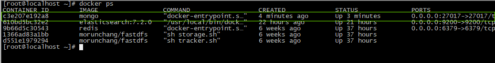
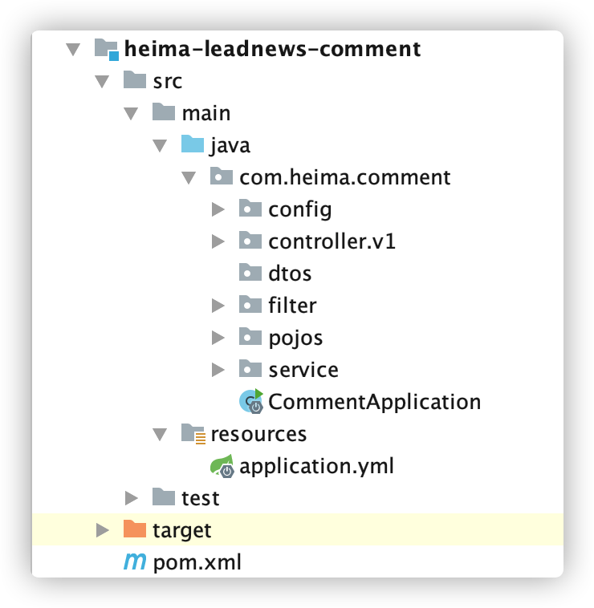
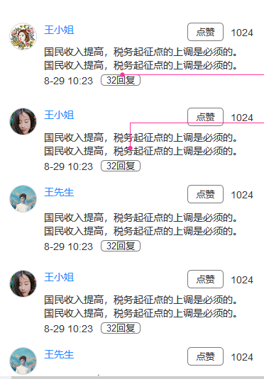
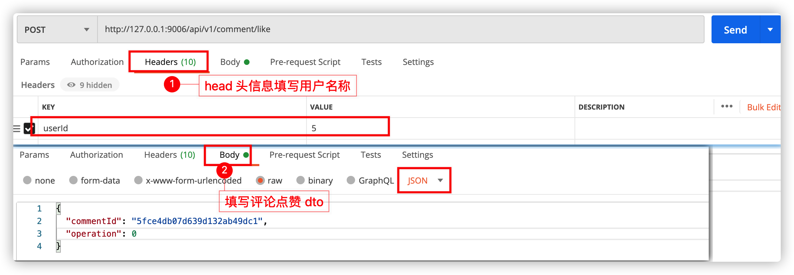
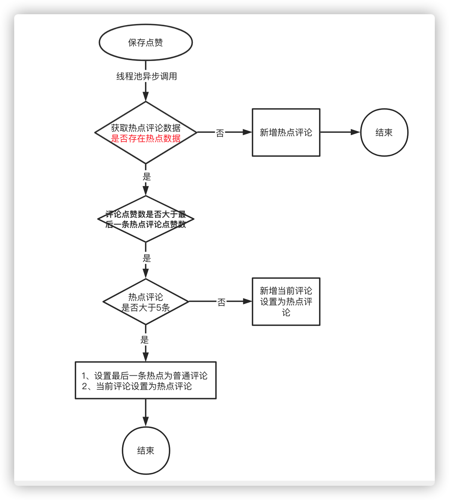
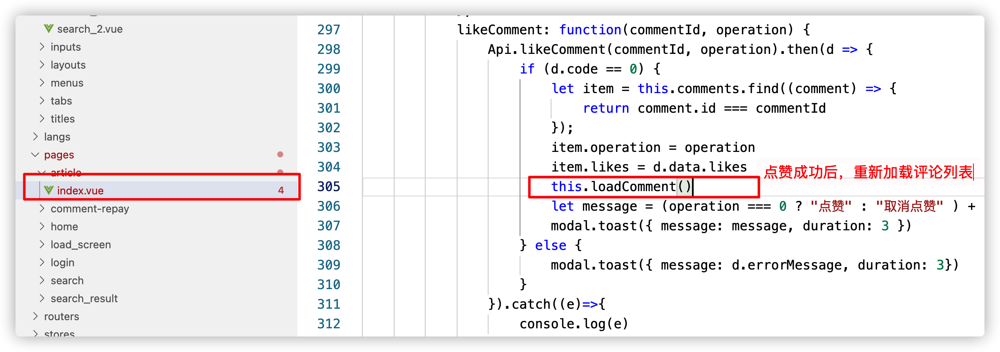

# 第十一章 app端评论系统开发

## 今日目标

- 能够完成对mongodb的环境搭建
- 能够掌握mongodb的基本使用
- 能够完成app端评论的查询、发表、点赞等功能
- 能够完成app端评论回复的查询，发表、点赞功能
- 能够完成热点评论功能

## 1 Mongodb

### 1.1 Mongodb简介

MongoDB是一个开源、高性能、无模式的文档型数据库，介于关系型数据库（MySQL）和非关系型数据库之间的一款非关系型数据库。

**应用场景：**

- 支持文本查询

- 不需要支持事务，不存在复杂的多表查询

- 存储数据可持久化

- 需要TB甚至 PB 级别数据存储

- 需求变化较快，数据模型无法确认，预计使用快速迭代开发形式

- 需要至少2000以上的读写QPS【高性能】

- 能支持快速水平扩展【高扩展】

- 99.999%高可用【高可用】

### 1.2 Mongodb安装

#### 1.2.1 拉取镜像

```shell
docker pull mongo
```

#### 1.2.2 创建容器

```shell
docker run -di --name mongo -p 27017:27017 -v ~/data/mongodata:/data  mongo
```



### 1.3 Mongodb快速入门

**见讲义快速入门**

## 2 app端评论-发表评论

### 2.1 需求分析


- 文章详情页下方可以查看评论信息，按照点赞数量倒序排列，展示**评论内容、评论的作者、点赞数、回复数、时间**，默认查看10条评论，如果想查看更多，可以点击加载更多进行分页
- 可以针对当前文章发布评论
- 可以针对于某一条评论进行点赞操作

### 2.2 思路分析

(1) mongodb的实体类需要使用@Document注解  

在 `heima-leadnews-model` 工程中引入依赖

```xml
		<dependency>
            <groupId>org.springframework.data</groupId>
            <artifactId>spring-data-mongodb</artifactId>
            <scope>provided</scope>
        </dependency>
```

(2)数据映射

对应实体及注解配置

```java
package com.heima.model.comment.pojo;
import lombok.Data;
import org.springframework.data.mongodb.core.mapping.Document;
import java.math.BigDecimal;
import java.util.Date;
/**
 * APP评论信息
 */
@Data
@Document("ap_comment")
public class ApComment {

    /**
     * id
     */
    private String id;
    /**
     * 用户ID  评论的用户ID（当前登录人ID）
     */
    private Integer authorId;

    /**
     * 用户昵称
     */
    private String authorName;


    /**
     * 文章id或动态id
     */
    private Long entryId; //articleId
      /**
     * 评论内容类型
     * 0 文章
     * 1 动态
     */
    private Short type;

    /**
     * 频道ID
     */
    private Integer channelId;


    /**
     * 评论内容 不能大于140个字
     */
    private String content;

    /**
     * 登录人头像
     */
    private String image;

    /**
     * 点赞数
     */
    private Integer likes;

    /**
     * 回复数
     */
    private Integer reply;

    /**
     * 文章标记
     * 0 普通评论
     * 1 热点评论
     * 2 推荐评论
     * 3 置顶评论
     * 4 精品评论
     * 5 大V 评论
     */
    private Short flag;

    /**
     * 经度
     */
    private BigDecimal longitude;

    /**
     * 维度
     */
    private BigDecimal latitude;

    /**
     * 地理位置
     */
    private String address;

    /**
     * 评论排列序号
     */
    private Integer ord;

    /**
     * 创建时间
     */
    private Date createdTime;

    /**
     * 更新时间
     */
    private Date updatedTime;

}
```

APP评论信息点赞

```java
package com.heima.model.comment.pojo;

import lombok.Data;
import org.springframework.data.mongodb.core.mapping.Document;

/**
 * APP评论信息点赞
 */
@Data
@Document("ap_comment_like")
public class ApCommentLike {

    /**
     * id
     */
    private String id;

    /**
     * 用户ID
     */
    private Integer authorId;

    /**
     * 评论id
     */
    private String commentId;

    /**
     * 0：点赞
     * 1：取消点赞
     */
    private Short operation;
}
```


评论与评论点赞表是一对多关系，一条评论可以让多个app用户点赞

（2）思路分析

根据文章id发表评论，输入内容发表评论，评论内容不能超过140字，**评论内容需要做文本垃圾检测**

### 2.3 功能实现

#### 2.3.1 导入评论微服务

（1）创建项目`comment-service`



（2）pom依赖

```xml
<dependencies>
    <!--mongoDB-->
    <dependency>
        <groupId>org.springframework.boot</groupId>
        <artifactId>spring-boot-starter-data-mongodb</artifactId>
    </dependency>
</dependencies>
```

（3）application.yml

其中自动配置项去除了关于数据源的配置，因为这个项目不需要查询数据库，查询的mongodb

```yaml
server:
  port: 9006
spring:
  autoconfigure:
    exclude: org.springframework.boot.autoconfigure.jdbc.DataSourceAutoConfiguration,org.springframework.boot.autoconfigure.jdbc.DataSourceTransactionManagerAutoConfiguration
  application:
    name: leadnews-comment
  cloud:
    nacos:
      discovery:
        server-addr: 192.168.200.129:8848
  data:
    mongodb:
      host: 192.168.200.129
      port: 27017
      database: leadnews-comment
swagger:
  group: ${spring.application.name} # api文档分组名
```

#### 2.3.2 其他配置准备

(1)获取当前登录用户信息

评论必须在登录的情况下才能发布，所以需要验证用户获取用户信息,添加过滤类：

```java
package com.heima.comment.filter;
import com.heima.model.threadlocal.AppThreadLocalUtils;
import com.heima.model.user.pojo.ApUser;
import org.slf4j.Logger;
import org.slf4j.LoggerFactory;
import org.springframework.core.annotation.Order;
import org.springframework.stereotype.Component;
import org.springframework.web.filter.GenericFilterBean;
import javax.servlet.FilterChain;
import javax.servlet.ServletException;
import javax.servlet.ServletRequest;
import javax.servlet.ServletResponse;
import javax.servlet.annotation.WebFilter;
import javax.servlet.http.HttpServletRequest;
import javax.servlet.http.HttpServletResponse;
import java.io.IOException;
@Component
@Order(1)
@WebFilter(filterName = "appTokenFilter", urlPatterns = "/*")
public class AppTokenFilter extends GenericFilterBean {
    Logger logger = LoggerFactory.getLogger(AppTokenFilter.class);
    @Override
    public void doFilter(ServletRequest req, ServletResponse res, FilterChain chain) throws IOException, ServletException {
        HttpServletRequest request = (HttpServletRequest) req;
        HttpServletResponse response = (HttpServletResponse) res;
        // 测试和开发环境不过滤
        String userId = request.getHeader("userId");
        //如果userId为0，说明当前设备没有登录
        if(userId!=null && Integer.valueOf(userId).intValue()!=0){
            ApUser apUser = new ApUser();
            apUser.setId(Integer.valueOf(userId));
            AppThreadLocalUtils.setUser(apUser);
        }
        chain.doFilter(req,res);
    }
}
```

#### 2.3.3 接口定义

```java
package com.heima.comment.controller.v1;
import com.heima.model.common.dto.ResponseResult;
import io.swagger.annotations.Api;
import io.swagger.annotations.ApiOperation;
import org.springframework.web.bind.annotation.PostMapping;
import org.springframework.web.bind.annotation.RequestBody;
import org.springframework.web.bind.annotation.RequestMapping;
import org.springframework.web.bind.annotation.RestController;

@Api("评论管理API")
@RestController
@RequestMapping("/api/v1/comment")
public class CommentController{
    @ApiOperation("保存评论信息")
    @PostMapping("/save")
    public ResponseResult saveComment(@RequestBody @Validated CommentSaveDto dto){
       return null;
    }
}
```

发表评论:CommentSaveDto

```java
package com.heima.model.comment.dto;
import lombok.Data;
@Data
public class CommentSaveDto {
    @NotNull(message = "文章id不能为空")
    private Long articleId;
    @Length(max = 140,message = "评论内容不能大于140个字符")
    @NotBlank(message = "评论内容不能为空")
    private String content;
}
```

#### 2.3.4 用户微服务远程接口准备

评论中需要查询登录的用户信息，所以需要定义远程feign接口根据用户id获取用户信息

定义apis接口

```java
package com.heima.user.controller.v1;
import com.heima.model.user.pojo.ApUser;
import com.heima.user.service.ApUserService;
import io.swagger.annotations.Api;
import io.swagger.annotations.ApiOperation;
import org.springframework.beans.factory.annotation.Autowired;
import org.springframework.web.bind.annotation.*;
@Api(value = "app用户管理API",tags = "app用户管理API")
@RestController
@RequestMapping("/api/v1/user")
public class ApUserController{
    @Autowired
    private ApUserService apUserService;

    @ApiOperation("根据id获取apUser信息")
    @GetMapping("/{id}")
    public ApUser findUserById(@PathVariable("id") Integer id) {
        return apUserService.getById(id);
    }
}
```

在user的微服务中新增业务层层接口，mapper在之前已经定义完成

```java
package com.heima.user.service;
import com.baomidou.mybatisplus.extension.service.IService;
import com.heima.model.user.pojos.ApUser;
public interface ApUserService extends IService<ApUser>{
    
}
```

实现类：

```java
package com.heima.user.service.impl;
import com.baomidou.mybatisplus.extension.service.impl.ServiceImpl;
import com.heima.model.user.pojo.ApUser;
import com.heima.user.mapper.ApUserMapper;
import com.heima.user.service.ApUserService;
import org.springframework.stereotype.Service;
@Service
public class ApUserServiceImpl extends ServiceImpl<ApUserMapper, ApUser> implements ApUserService {
    
}
```

增加feign远程接口

```java
@FeignClient("leadnews-user")
public interface UserFeign {
    @GetMapping("/api/v1/user/{id}")
    ApUser findUserById(@PathVariable("id") Long id);
}
```

#### 2.3.5 业务层

业务层接口：

```java
package com.heima.comment.service;
import com.heima.model.comment.dto.CommentSaveDto;
import com.heima.model.common.dto.ResponseResult;
public interface CommentService {
    /**
     * 保存评论
     * @return
     */
    public ResponseResult saveComment(CommentSaveDto dto);

}
```

实现类：

```java
package com.heima.comment.service.impl;
import com.heima.comment.service.CommentService;
import com.heima.feigns.UserFeign;
import com.heima.model.comment.dto.CommentSaveDto;
import com.heima.model.common.dto.ResponseResult;
import com.heima.model.common.enums.AppHttpCodeEnum;
import org.springframework.beans.factory.annotation.Autowired;
import org.springframework.data.mongodb.core.MongoTemplate;
import org.springframework.stereotype.Service;
import java.util.*;
@Service
public class CommentServiceImpl implements CommentService {
    @Autowired
    private MongoTemplate mongoTemplate;
    @Autowired
    private UserFeign userFeign;
    @Override
    public ResponseResult saveComment(CommentSaveDto dto) {
        //1.检查参数
        if (dto.getArticleId() == null) {
            return ResponseResult.errorResult(AppHttpCodeEnum.PARAM_REQUIRE);
        }
        if (dto.getContent() != null && dto.getContent().length() > 140) {
            return ResponseResult.errorResult(AppHttpCodeEnum.PARAM_REQUIRE, "评论内容不能超过140字");
        }
        //2.判断是否登录
        ApUser user = AppThreadLocalUtils.getUser();
        if (user == null) {
            return ResponseResult.errorResult(AppHttpCodeEnum.NEED_LOGIN);
        }
        //3.安全过滤,自行实现
        //4.保存评论
        ApUser apUser = userFeign.findUserById(user.getId().longValue());
        if (apUser == null) {
            return ResponseResult.errorResult(AppHttpCodeEnum.PARAM_REQUIRE, "当前登录信息有误");
        }
        ApComment apComment = new ApComment();
        apComment.setAuthorId(apUser.getId());
        apComment.setAuthorName(apUser.getName());
		apComment.setImage(apUser.getImage());
        apComment.setContent(dto.getContent());
        apComment.setEntryId(dto.getArticleId());
        apComment.setCreatedTime(new Date());
        apComment.setUpdatedTime(new Date());
        apComment.setLikes(0);
        apComment.setReply(0);
        apComment.setType((short) 0);
        apComment.setFlag((short) 0);
        mongoTemplate.insert(apComment);
        return ResponseResult.okResult(AppHttpCodeEnum.SUCCESS);
    }
}
```

#### 2.3.6 控制层

评论控制器

```java
@Api("评论管理API")
@RestController
@RequestMapping("/api/v1/comment")
public class CommentController{
    @Autowired
    CommentService commentService;
    @ApiOperation("保存评论信息")
    @PostMapping("/save")
    public ResponseResult saveComment(@RequestBody CommentSaveDto dto){
       return commentService.saveComment(dto);
    }
}
```

#### 2.3.7 配置网关

修改 `app-gateway` 网关微服务中的application.yml，新增评论微服务路由配置

```yaml
#行为微服务
- id: leadnews-comment
  uri: lb://leadnews-comment
  predicates:
  - Path=/comment/**
  filters:
  - StripPrefix= 1
```

#### 2.3.8 测试

使用前端或postmen来测试

## 3 app端评论-点赞评论

### 3.1 需求分析



用户点赞，可以增加点赞数量，点赞后不仅仅要增加点赞数，需要记录当前用户对于当前评论的数据记录

​	用户取消点赞，点赞减一，删除点赞数据


### 3.2 功能实现

#### 3.2.1 接口定义

CommentController添加方法

```java
	@ApiOperation("点赞评论")
    @PostMapping("/like")
    public ResponseResult like(@RequestBody CommentLikeDto dto){
        return null;
    }
```

用户点赞:CommentLikeDto

```java
@Data
public class CommentLikeDto {
    @NotBlank(message = "评论ID不能为空")
    private String commentId;
    @Range(min = 0,max = 1,message = "评论点赞操作状态错误")
    private Short operation;
}
```

#### 3.2.2 业务层

业务层接口：CommentService

```java
	/**
     * 点赞评论
     * @param dto
     * @return
     */
public ResponseResult like(CommentLikeDto dto);
```

实现类：

```java
	/**
     * 点赞评论
     * @param dto
     * @return
     */
@Override
public ResponseResult like(CommentLikeDto dto) {
  //1 参数检查
  if (dto == null || dto.getCommentId() == null ||(dto.getOperation()<0 || dto.getOperation()>1) ) {
    return ResponseResult.errorResult(AppHttpCodeEnum.PARAM_REQUIRE);
  }
  //2 判断用户登录
  ApUser user = AppThreadLocalUtils.getUser();
  if (user == null) {
    return ResponseResult.errorResult(AppHttpCodeEnum.NEED_LOGIN);
  }
  //3 查询评论
  ApComment apComment = mongoTemplate.findById(dto.getCommentId(), ApComment.class);
  if (apComment == null) {
    return ResponseResult.errorResult(AppHttpCodeEnum.DATA_NOT_EXIST);
  }
  // 用户不能重复点赞
  ApCommentLike apCommentLike = mongoTemplate.findOne(
    Query.query(Criteria.where("authorId").is(user.getId())
                .and("commentId").is(dto.getCommentId())
               ),
    ApCommentLike.class);
  if (apCommentLike != null &&  dto.getOperation() == 0) {
    return ResponseResult.errorResult(AppHttpCodeEnum.DATA_EXIST, "已点赞");
  }
  if (dto.getOperation() == 0) { //点赞
    // 点赞+1
    apComment.setLikes(apComment.getLikes() + 1);
    mongoTemplate.save(apComment);

    // 保存点赞评论信息
    apCommentLike = new ApCommentLike();
    apCommentLike.setAuthorId(user.getId());
    apCommentLike.setCommentId(apComment.getId());
    apCommentLike.setOperation(dto.getOperation());
    mongoTemplate.save(apCommentLike);
  } else {
    // 取消点赞
    apComment.setLikes(
      apComment.getLikes() <= 0 ? 0: apComment.getLikes() - 1);
    mongoTemplate.save(apComment);
    //删除点赞评论信息
    mongoTemplate.remove( Query.query( Criteria.
                                      where("authorId").is(user.getId())
                                      .and("commentId").is(apComment.getId()) ), ApCommentLike.class);
  }
  //4 数据返回
  Map<String, Object> resultMap = new HashMap<>();
  resultMap.put("likes",apComment.getLikes());
  return ResponseResult.okResult(resultMap);
}
```

#### 3.2.3 控制层

评论控制器CommentController

```java
	@ApiOperation("点赞评论")
    @PostMapping("/like")
    public ResponseResult like(@RequestBody @Validated CommentLikeDto dto){
        return commentService.like(dto);
    }
```

#### 3.2.4 测试

使用postmen来测试



## 4 app端评论-评论列表

### 4.1 需求分析


查询评论列表，根据当前文章id进行检索，按照创建时间倒序，分页查询（默认10条数据）

### 4.2 功能实现

#### 4.2.1 接口定义

在CommentController接口中新增查询评论的方法

```java
    @ApiOperation("根据文章id查询评论列表")
    @PostMapping("/load")
    public ResponseResult findByArticleId(@RequestBody @Validated CommentDto dto){
        return commentService.findByArticleId(dto);
    }
```

查询评论列表:CommentDto

```java
package com.heima.model.comment.dto;
import com.heima.model.common.dto.PageRequestDto;
import lombok.Data;
import javax.validation.constraints.NotNull;
import java.util.Date;
@Data
public class CommentDto  extends PageRequestDto {
	@NotNull(message="文章id不能为空")
    private Long articleId;
    // 最小时间
    private Date minDate;
    //是否是首页
    private Short index;
}
```

#### 4.2.2 业务层

业务层接口：

修改CommentService业务层接口，添加方法

```java
/**
     * 根据文章id查询评论列表
     * @return
     */
public ResponseResult findByArticleId(CommentDto dto);
```


登录后封装数据的vo

```java
package com.heima.model.comment.vo;
import com.heima.model.comment.pojo.ApComment;
import lombok.Data;
@Data
public class ApCommentVo extends ApComment {
    /**
     * 0：点赞
     * 1：取消点赞
     */
    private Short operation;
}
```


实现类：

```java
/**
     * 根据 文章id 查询评论列表
     * @param dto
     * @return
     */
    @Override
    public ResponseResult findByArticleId(CommentDto dto) {
        //1 参数检查
        if (dto == null || dto.getArticleId() == null) {
            return ResponseResult.errorResult(AppHttpCodeEnum.PARAM_REQUIRE);
        }
        Integer size = dto.getSize();
        if ( size == null || size <= 0) {
            dto.setSize(10);
        }
        //2 查询Mongo文章所有评论列表
        List<ApComment> apCommentList = mongoTemplate.find(
                Query.query(Criteria.where("entryId").is(dto.getArticleId())
                        .and("createdTime").lt(dto.getMinDate()))
                        .limit(dto.getSize())
                        .with(Sort.by(Sort.Direction.DESC,"createdTime")),
                ApComment.class
        );
        //3 封装查询结果
        //3.1 用户未登录 直接返回评论列表
        ApUser user = AppThreadLocalUtils.getUser();
        if (user == null) {
            return ResponseResult.okResult(apCommentList);
        }
        //3.2 用户登录，需要加载当前用户对评论点赞的列表
        List<ApCommentVo> apCommentVoList = new ArrayList<>();
        // 获取文章对应的所有评论ID列表
        List<String> idList = apCommentList.stream()
                                            .map(ApComment::getId)
                                            .collect(Collectors.toList());
        // 查询 点赞批量列表 按照评论id 筛选
        List<ApCommentLike> apCommentLikes = mongoTemplate.find(Query.query(Criteria.where("commentId").in(idList)
                        .and("authorId").is(user.getId())), ApCommentLike.class);

        // 遍历当前用户点赞列表 和当前评论列表
        if(!CollectionUtils.isEmpty(apCommentList,apCommentLikes)){
            // 获取当前登录用户 点过赞的 评论id
            List<String> likeCommentIds = apCommentLikes.stream()
                    .map(ApCommentLike::getCommentId).collect(Collectors.toList());

            // 循环评论列表，将点过赞的评论 设置operation字段为0
            apCommentList.forEach(comment ->{ //遍历所有文章列表ID
                ApCommentVo apCommentVo = new ApCommentVo();
                BeanUtils.copyProperties(comment, apCommentVo);
                // 判断是否点过赞
                if (likeCommentIds.contains(comment.getId()))
                    apCommentVo.setOperation((short)0);
                apCommentVoList.add(apCommentVo);
            });
            return ResponseResult.okResult(apCommentVoList);
        }
        return ResponseResult.okResult(apCommentList);
    }
```

定义判断集合数据的工具类

```java
public class CollectionUtils {
    public static boolean  isEmpty(Collection... collections){
        for (Collection collection : collections) {
            if(collection == null || collection.size() == 0){
                return true;
            }
        }
        return false;
    }
}
```

#### 4.2.3 控制层

评论控制器，修改CommentController添加方法

```java
	@ApiOperation("根据文章id查询评论列表")
    @PostMapping("/load")
    public ResponseResult findByArticleId(@RequestBody @Validated CommentDto dto){
        return commentService.findByArticleId(dto);
    }
```

#### 4.2.4 测试

使用postmen来测试

## 5 app端评论回复-发表回复、点赞回复、回复列表

### 5.1 需求分析


1. 当用户点击了评论中的**回复**就可以查看当前评论回复内容列表

2. 可以针对当前评论进行回复，需要更新评论的回复数量

3. 可以对当前评论回复列表进行点赞操作，同时记录当前回复评论点赞信息

### 5.2 思路分析

（1）数据实体

操作数据实体为mongodb中的集合，评论回复集合是ap_comment_repay，需要在studo3t中创建该集合

对应实体类为：

```java
package com.heima.model.comment.pojo;
import lombok.Data;
import org.springframework.data.annotation.Id;
import org.springframework.data.mongodb.core.mapping.Document;
import java.math.BigDecimal;
import java.util.Date;
/**
 * APP评论回复信息
 */
@Data
@Document("ap_comment_repay")
public class ApCommentRepay {
    /**
     * id
     */
    @Id
    private String id;
    /**
     * 用户ID
     */
    private Integer authorId;
    /**
     * 用户昵称
     */
    private String authorName;
    /**
     * 评论id
     */
    private String commentId;
    /**
     * 回复内容
     */
    private String content;
    /**
     * 点赞数
     */
    private Integer likes;
    /**
     * 经度
     */
    private BigDecimal longitude;
    /**
     * 维度
     */
    private BigDecimal latitude;
    /**
     * 地理位置
     */
    private String address;
    /**
     * 创建时间
     */
    private Date createdTime;

    /**
     * 更新时间
     */
    private Date updatedTime;

}
```

APP评论回复信息点赞信息

```java
package com.heima.model.comment.pojos;


import lombok.Data;
import org.springframework.data.mongodb.core.mapping.Document;

/**
 * APP评论回复信息点赞信息
 */
@Data
@Document("ap_comment_repay_like")
public class ApCommentRepayLike {

    /**
     * id
     */
    private String id;

    /**
     * 用户ID
     */
    private Integer authorId;

    /**
     * 评论id
     */
    private String commentRepayId;

    /**
     * 0：点赞
     * 1：取消点赞
     */
    private Short operation;
}
```


（2）思路分析：

1. 用户点击**回复**，根据当前评论id查询对应的所有回复进行展示
2. 用户针对于当前的评论进行了回复，需要保存数据，同时需要更新当前评论的回复数
3. 可以对回复列表进行点赞操作

### 5.3 功能实现

(1)接口定义

```java
package com.heima.comment.controller.v1;
import com.heima.comment.service.CommentRepayService;
import com.heima.model.comment.dto.CommentRepayDto;
import com.heima.model.comment.dto.CommentRepayLikeDto;
import com.heima.model.comment.dto.CommentRepaySaveDto;
import com.heima.model.common.dto.ResponseResult;
import io.swagger.annotations.Api;
import io.swagger.annotations.ApiOperation;
import org.springframework.beans.factory.annotation.Autowired;
import org.springframework.web.bind.annotation.PostMapping;
import org.springframework.web.bind.annotation.RequestBody;
import org.springframework.web.bind.annotation.RequestMapping;
import org.springframework.web.bind.annotation.RestController;
@Api(value = "评论回复API",tags = "评论回复API")
@RestController
@RequestMapping("/api/v1/comment_repay")
public class CommentRepayController{
    @Autowired
    CommentRepayService commentRepayService;

    @ApiOperation("根据评论ID加载回复列表")
    @PostMapping("/load")
    public ResponseResult loadCommentRepay(@RequestBody CommentRepayDto dto){
        return commentRepayService.loadCommentRepay(dto);
    }

    @ApiOperation("保存评论回复")
    @PostMapping("/save")
    public ResponseResult saveCommentRepay(@RequestBody CommentRepaySaveDto dto){
        return commentRepayService.saveCommentRepay(dto);
    }

    @ApiOperation("点赞评论回复")
    @PostMapping("/like")
    public ResponseResult saveCommentRepayLike(@RequestBody CommentRepayLikeDto dto){
        return commentRepayService.saveCommentRepayLike(dto);
    }
}
```

加载评论回复列表参数：CommentRepayDto

```java
package com.heima.model.comment.dto;
import lombok.Data;
import javax.validation.constraints.NotNull;
import java.util.Date;
@Data
public class CommentRepayDto {
    @NotNull(message = "评论id不能为空")
    private String commentId;
    private Integer size;
    // 最小时间
    private Date minDate;
}
```

保存回复内容参数：CommentRepaySaveDto

```java
package com.heima.model.comment.dto;
import lombok.Data;
import org.hibernate.validator.constraints.Length;
import javax.validation.constraints.NotBlank;
import javax.validation.constraints.NotNull;
@Data
public class CommentRepaySaveDto {
    /**
     * 评论id
     */
    @NotNull(message = "评论id不能为空")
    private String commentId;
    /**
     * 回复内容
     */
    @NotBlank(message = "评论内容不能为空")
    @Length(max = 140,message = "评论内容不能大于140个字")
    private String content;
}
```

点赞回复内容参数：CommentRepayLikeDto

```java
package com.heima.model.comment.dto;
import lombok.Data;
import org.hibernate.validator.constraints.Range;
import javax.validation.constraints.NotNull;
@Data
public class CommentRepayLikeDto {
    @NotNull(message = "评论回复ID不能为空")
    private String commentRepayId;
    /**
     * 0：点赞
     * 1：取消点赞
     */
    @Range(min = 0,max = 1,message = "点赞参数错误")
    private Short operation;
}
```

(2) 业务层

评论回复业务层接口

```java
package com.heima.comment.service;
import com.heima.model.comment.dto.CommentRepayDto;
import com.heima.model.comment.dto.CommentRepayLikeDto;
import com.heima.model.comment.dto.CommentRepaySaveDto;
import com.heima.model.common.dto.ResponseResult;
/**
 * 评论回复
 */
public interface CommentRepayService {
    /**
     * 查看更多回复内容
     * @param dto
     * @return
     */
    public ResponseResult loadCommentRepay(CommentRepayDto dto);
    /**
     * 保存回复
     * @return
     */
    public ResponseResult saveCommentRepay(CommentRepaySaveDto dto);
    /**
     * 点赞回复的评论
     * @param dto
     * @return
     */
    public ResponseResult saveCommentRepayLike(CommentRepayLikeDto dto);
}
```

加载评论回复列表数据封装类

```java
package com.heima.model.comment.vo;

import com.heima.model.comment.pojo.ApCommentRepay;
import lombok.Data;

@Data
public class ApCommentRepayVo extends ApCommentRepay {
    /**
     * 0：点赞
     * 1：取消点赞
     */
    private Short operation;
}
```


实现类

```java
package com.heima.comment.service.impl;
import com.heima.comment.service.CommentRepayService;
import com.heima.feigns.user.UserFeign;
import com.heima.model.comment.dtos.CommentRepayDto;
import com.heima.model.comment.dtos.CommentRepayLikeDto;
import com.heima.model.comment.dtos.CommentRepaySaveDto;
import com.heima.model.comment.pojos.ApComment;
import com.heima.model.comment.pojos.ApCommentRepay;
import com.heima.model.comment.pojos.ApCommentRepayLike;
import com.heima.model.comment.vo.ApCommentRepayVo;
import com.heima.model.common.dtos.ResponseResult;
import com.heima.model.common.enums.AppHttpCodeEnum;
import com.heima.model.common.threadlocal.AppThreadLocalUtils;
import com.heima.model.user.pojos.ApUser;
import lombok.extern.log4j.Log4j2;
import org.springframework.beans.BeanUtils;
import org.springframework.beans.factory.annotation.Autowired;
import org.springframework.data.domain.Sort;
import org.springframework.data.mongodb.core.MongoTemplate;
import org.springframework.data.mongodb.core.query.Criteria;
import org.springframework.data.mongodb.core.query.Query;
import org.springframework.stereotype.Service;
import java.util.*;
import java.util.stream.Collectors;
@Service
@Log4j2
public class CommentRepayServiceImpl implements CommentRepayService {
    @Autowired
    private MongoTemplate mongoTemplate;
    @Autowired
    private UserFeign userFeign;
    @Override
    public ResponseResult loadCommentRepay(CommentRepayDto dto) {
        //1.检查参数
        if(dto.getCommentId() == null){
            return ResponseResult.errorResult(AppHttpCodeEnum.PARAM_REQUIRE);
        }
        if(dto.getSize() == null || dto.getSize() == 0){
            dto.setSize(10);
        }
        //2.按照文章id过滤，设置分页和排序
        Query query = Query.query(Criteria.where("commentId").is(dto.getCommentId()).and("createdTime").lt(dto.getMinDate()));
        query.limit(dto.getSize()).with(Sort.by(Sort.Direction.DESC,"createdTime"));
        List<ApCommentRepay> list = mongoTemplate.find(query, ApCommentRepay.class);
        //3.数据封装返回
        //3.1 用户未登录 加载数据
        ApUser user = AppThreadLocalUtils.getUser();
        if(user== null){
            return ResponseResult.okResult(list);
        }

        List<String> idList = list.stream().map(x -> x.getId()).collect(Collectors.toList());
        Query query1 = Query.query(Criteria.where("commentRepayId").in(idList).and("authorId").is(user.getId()));
        List<ApCommentRepayLike> apCommentRepayLikes = mongoTemplate.find(query1, ApCommentRepayLike.class);
        List<ApCommentRepayVo> resultList = new ArrayList<>();
        if(list!=null && apCommentRepayLikes != null){
            list.stream().forEach(x->{
                ApCommentRepayVo apCommentRepayVo = new ApCommentRepayVo();
                BeanUtils.copyProperties(x,apCommentRepayVo);
                for (ApCommentRepayLike apCommentRepayLike  : apCommentRepayLikes) {
                    if(x.getId().equals(apCommentRepayLike.getCommentRepayId())){
                        apCommentRepayVo.setOperation((short)0);
                    }
                }
                resultList.add(apCommentRepayVo);
            });
            return ResponseResult.okResult(resultList);
        }else {
            return ResponseResult.okResult(list);
        }
    }

    @Override
    public ResponseResult saveCommentRepay(CommentRepaySaveDto dto) {
        //1.检查参数
        if (dto.getCommentId() == null) {
            return ResponseResult.errorResult(AppHttpCodeEnum.PARAM_REQUIRE);
        }
        if (dto.getContent() != null && dto.getContent().length() > 140) {
            return ResponseResult.errorResult(AppHttpCodeEnum.PARAM_REQUIRE, "评论内容不能超过140字");
        }
        //2.判断是否登录
        ApUser user = AppThreadLocalUtils.getUser();
        if (user == null) {
            return ResponseResult.errorResult(AppHttpCodeEnum.NEED_LOGIN);
        }
        //3.安全过滤,自行实现
        //4.保存评论
        ApUser apUser = userFeign.findUserById(user.getId().longValue());
        if (apUser == null) {
            return ResponseResult.errorResult(AppHttpCodeEnum.PARAM_REQUIRE, "当前登录信息有误");
        }
        ApCommentRepay apCommentRepay = new ApCommentRepay();
        apCommentRepay.setAuthorId(apUser.getId());
        apCommentRepay.setAuthorName(apUser.getName());
        apCommentRepay.setContent(dto.getContent());
        apCommentRepay.setCommentId(dto.getCommentId());
        apCommentRepay.setCreatedTime(new Date());
        apCommentRepay.setUpdatedTime(new Date());
        apCommentRepay.setLikes(0);
        mongoTemplate.insert(apCommentRepay);

        //****更新评论的回复数量
        ApComment apComment = mongoTemplate.findById(dto.getCommentId(), ApComment.class);
        apComment.setReply(apComment.getReply() + 1);
        mongoTemplate.save(apComment);

        return ResponseResult.okResult(AppHttpCodeEnum.SUCCESS);
    }

    @Override
    public ResponseResult saveCommentRepayLike(CommentRepayLikeDto dto) {
        //1.检查参数
        if (dto.getCommentRepayId() == null) {
            return ResponseResult.errorResult(AppHttpCodeEnum.PARAM_REQUIRE);
        }

        //2.判断是否登录
        ApUser user = AppThreadLocalUtils.getUser();
        if (user == null) {
            return ResponseResult.errorResult(AppHttpCodeEnum.NEED_LOGIN);
        }

        //3.点赞操作
        ApCommentRepay apCommentRepay = mongoTemplate.findById(dto.getCommentRepayId(), ApCommentRepay.class);
        if (apCommentRepay != null && dto.getOperation() == 0) {
            //更新评论的点赞数量
            apCommentRepay.setLikes(apCommentRepay.getLikes() + 1);
            mongoTemplate.save(apCommentRepay);

            //保存 APP评论信息点赞
            ApCommentRepayLike apCommentLike = new ApCommentRepayLike();
            apCommentLike.setAuthorId(user.getId());
            apCommentLike.setCommentRepayId(apCommentRepay.getId());
            apCommentLike.setOperation(dto.getOperation());
            mongoTemplate.save(apCommentLike);
        } else if (apCommentRepay != null && dto.getOperation() == 1) {
            //4.取消点赞
            //更新评论的点赞数量
            apCommentRepay.setLikes(apCommentRepay.getLikes() < 0 ? 0 : apCommentRepay.getLikes() - 1);
            mongoTemplate.save(apCommentRepay);
            //更新 APP评论信息点赞
            mongoTemplate.remove(Query.query(Criteria.where("authorId").is(user.getId()).and("commentRepayId").is(apCommentRepay.getId())), ApCommentRepayLike.class);
        }

        //5.数据返回
        Map<String, Object> resultMap = new HashMap<>();
        resultMap.put("likes",apCommentRepay.getLikes());
        return ResponseResult.okResult(resultMap);
    }
}
```

(3)控制器

```java
package com.heima.comment.controller.v1;
import com.heima.comment.service.CommentRepayService;
import com.heima.model.comment.dto.CommentRepayDto;
import com.heima.model.comment.dto.CommentRepayLikeDto;
import com.heima.model.comment.dto.CommentRepaySaveDto;
import com.heima.model.common.dto.ResponseResult;
import io.swagger.annotations.Api;
import io.swagger.annotations.ApiOperation;
import org.springframework.beans.factory.annotation.Autowired;
import org.springframework.web.bind.annotation.PostMapping;
import org.springframework.web.bind.annotation.RequestBody;
import org.springframework.web.bind.annotation.RequestMapping;
import org.springframework.web.bind.annotation.RestController;
@Api(value = "评论回复API",tags = "评论回复API")
@RestController
@RequestMapping("/api/v1/comment_repay")
public class CommentRepayController{
    @Autowired
    CommentRepayService commentRepayService;

    @ApiOperation("根据评论ID加载回复列表")
    @PostMapping("/load")
    public ResponseResult loadCommentRepay(@RequestBody CommentRepayDto dto){
        return commentRepayService.loadCommentRepay(dto);
    }

    @ApiOperation("保存评论回复")
    @PostMapping("/save")
    public ResponseResult saveCommentRepay(@RequestBody CommentRepaySaveDto dto){
        return commentRepayService.saveCommentRepay(dto);
    }

    @ApiOperation("点赞评论回复")
    @PostMapping("/like")
    public ResponseResult saveCommentRepayLike(@RequestBody CommentRepayLikeDto dto){
        return commentRepayService.saveCommentRepayLike(dto);
    }
}
```


**上述代码遗留问题:**

事务问题  mongoDB的事务功能需要搭建副本集后方可使用

```
如 启动类中引入事务管理器
  	@Bean
    MongoTransactionManager transactionManager(MongoDatabaseFactory factory){
        return new MongoTransactionManager(factory);
    }
service方法中，还是使用 @Transactional 注解标注
```

并发安全问题:

当多个并发同时对点赞数量，回复数量进行操作时，可能会造成数据混乱

```
可以通过 Redisson 框架提供的分布式锁解决(基于redis方案)
```


## 6 热点评论

### 6.1 需求分析

- 如果某一条评论点赞数超过5就可以把它作为热点评论
- 一个文章最多有5条热点评论
- 热点评论需要按照点赞数倒序排序

### 6.2 实现思路

第一：修改点赞方法，如果当前点赞数超过5，则需要计算是否是热点评论

1. 查询当前文章热点评论的所有数据，按照点赞数倒序    comment  flag 0 普通   1  热点评论
2. 如果当前没有热点数据，直接新增
3. 如果当前有热点数据，则判断当前评论的点赞数是否大于热点评论中的最小点赞数
4. 如果当前评论数据大于5条，则替换热点评论中的最后一条数据
5. 如果当前热点评论不满足5条，则直接新增





通过异步线程池的方式计算热点评论

第二：修改查询评论列表方法

- 如果首页
  - 查询热点评论
  - 查询普通评论
  - 合并返回
- 不是首页
  - 正常返回普通评论

### 6.3 线程池准备

使用线程池可以给我们带来很多好处，首先通过线程池中线程的重用，减少创建和销毁线程的性能开销。其次，能控制线程池中的并发数，否则会因为大量的线程争夺CPU资源造成阻塞。

下面是spring框架封装之后的线程池

```java
package com.heima.comment.config;
import lombok.Data;
import org.springframework.context.annotation.Bean;
import org.springframework.context.annotation.Configuration;
import org.springframework.scheduling.annotation.EnableAsync;
import org.springframework.scheduling.concurrent.ThreadPoolTaskExecutor;
import java.util.concurrent.ThreadPoolExecutor;
@Data
@Configuration
@EnableAsync //开启异步请求
public class ThreadPoolConfig {
    private static final int corePoolSize = 10;   // 核心线程数（默认线程数）
    private static final int maxPoolSize = 100;   // 最大线程数
    private static final int keepAliveTime = 10;  // 允许线程空闲时间（单位：默认为秒）
    private static final int queueCapacity = 500; // 缓冲队列数
    /**
     * 默认异步线程池
     * @return
     */
    @Bean("taskExecutor")
    public ThreadPoolTaskExecutor taskExecutor(){
        ThreadPoolTaskExecutor pool = new ThreadPoolTaskExecutor();
        pool.setThreadNamePrefix("--------------全局线程池-----------------");
        pool.setCorePoolSize(corePoolSize);
        pool.setMaxPoolSize(maxPoolSize);
        pool.setKeepAliveSeconds(keepAliveTime);
        pool.setQueueCapacity(queueCapacity);
        // 直接在execute方法的调用线程中运行
        pool.setRejectedExecutionHandler(new ThreadPoolExecutor.CallerRunsPolicy());
        // 初始化
        pool.initialize();
        return pool;
    }
}
```

Reject策略预定义有四种： 

- ThreadPoolExecutor.AbortPolicy策略，是默认的策略,处理程序遭到拒绝将抛出运行时 RejectedExecutionException。 
- ThreadPoolExecutor.CallerRunsPolicy策略 ,调用者的线程会执行该任务,如果执行器已关闭,则丢弃. 
- ThreadPoolExecutor.DiscardPolicy策略，不能执行的任务将被丢弃. 
- ThreadPoolExecutor.DiscardOldestPolicy策略，如果执行程序尚未关闭，则位于工作队列头部的任务将被删除，然后重试执行程序（如果再次失败，则重复此过程）

线程池工作流程：


### 6.4 修改点赞方法

在点赞成功之后，修改以下代码


下面为代码片段：

```java
//3.点赞操作
ApComment apComment = mongoTemplate.findById(dto.getCommentId(), ApComment.class);
if (apComment != null && dto.getOperation() == 0) {
    //更新评论的点赞数量
    apComment.setLikes(apComment.getLikes() + 1);
    mongoTemplate.save(apComment);
  
  //计算热点评论评论
  if (apComment.getLikes() >= 5 && apComment.getFlag().shortValue() == 0) {
    commentHotService.hotCommentExecutor(apComment.getEntryId(), apComment);
  }
  //下面代码省略
}
```

新增业务层方法，专门用来计算热点评论

```java
package com.heima.comment.service;
import com.heima.model.comment.pojos.ApComment;
public interface CommentHotService {
    /**
     * 查找热点评论
     */
    public void hotCommentExecutor(Long entryId, ApComment apComment);
}
```

实现类

```java
package com.heima.comment.service.impl;
import com.heima.comment.service.CommentHotService;
import com.heima.model.comment.pojo.ApComment;
import lombok.extern.slf4j.Slf4j;
import org.springframework.beans.factory.annotation.Autowired;
import org.springframework.data.domain.Sort;
import org.springframework.data.mongodb.core.MongoTemplate;
import org.springframework.data.mongodb.core.query.Criteria;
import org.springframework.data.mongodb.core.query.Query;
import org.springframework.scheduling.annotation.Async;
import org.springframework.stereotype.Service;
import java.util.List;
@Service
@Slf4j
public class CommentHotServiceImpl implements CommentHotService {
    @Autowired
    MongoTemplate mongoTemplate;
    /**
     * 当此方法在Spring对象中被调用时
     * 会使用taskExecutor所配置的线程池 异步的执行
     * @param entryId
     * @param apComment
     */
    @Async("taskExecutor")
    @Override
    public void hotCommentExecutor(Long entryId, ApComment apComment) {
        log.info("计算热评 异步方法开始  ==> {}",apComment);
        // 1. 按照文章ID(entryId) 查询热点评论  flag = 1   按照点赞降序
        Query queryHot = Query.query(Criteria.where("entryId").is(entryId)
                .and("flag").is(1))
                .with(Sort.by(Sort.Direction.DESC,"likes"));
        List<ApComment> hotCommentList = mongoTemplate.find(queryHot, ApComment.class);

        // 2. 如果没有热评  或者  热评的数量 < 5  修改当前评论为热评
        if(hotCommentList==null || hotCommentList.size()<5){
            apComment.setFlag((short)1);
            mongoTemplate.save(apComment);
            return;
        }

        // 3. 如果热评数量大于等于5
        //  获取热评集合中 最后一条热评  和  当前评论做对比
        ApComment lastHotComment = hotCommentList.get(hotCommentList.size() - 1);
        //  如果当前评论点赞数>最后一条热评
        if(apComment.getLikes() > lastHotComment.getLikes()){
            //将当前评论修改为热评
            apComment.setFlag((short)1);
            mongoTemplate.save(apComment);
            //将最后一条评论改为普通评论
            lastHotComment.setFlag((short)0);
            mongoTemplate.save(lastHotComment);
            return;
        }
    }
}
```

### 6.5 修改查询方法

修改查询评论的方法

完整代码如下：

```java
    /**
     * 根据 文章id 查询评论列表
     * @param dto
     * @return
     */
    @Override
    public ResponseResult findByArticleId(CommentDto dto) {
        //1 参数检查
        if (dto == null || dto.getArticleId() == null) {
            return ResponseResult.errorResult(AppHttpCodeEnum.PARAM_REQUIRE);
        }

        dto.checkParam();
        Integer size = dto.getSize();
        //2 查询Mongo文章所有评论列表
        List<ApComment> apCommentList = null;
        if(dto.getIndex().intValue() == 1){
            //查询热点评论  5
            Query query = Query.query(Criteria.where("entryId").is(dto.getArticleId())
                    .and("flag").is(1))
                    .with(Sort.by(Sort.Direction.DESC, "likes"));
            apCommentList = mongoTemplate.find(query, ApComment.class);
            if(CollectionUtils.isEmpty(apCommentList)){
                apCommentList = getNormalCommentList(dto, size);
            }else {
                List<ApComment> normalList = getNormalCommentList(dto, size - apCommentList.size());
                apCommentList.addAll(normalList);
            }
        }else {
            apCommentList = getNormalCommentList(dto, size);
        }
        //3 封装查询结果
        //3.1 用户未登录 直接返回评论列表
        ApUser user = AppThreadLocalUtils.getUser();
        if (user == null) {
            return ResponseResult.okResult(apCommentList);
        }
        //3.2 用户登录，需要加载当前用户对评论点赞的列表
        List<ApCommentVo> apCommentVoList = new ArrayList<>();
        // 获取文章对应的所有评论ID列表
        List<String> idList = apCommentList.stream()
                                            .map(ApComment::getId)
                                            .collect(Collectors.toList());
        // 查询 点赞批量列表 按照评论id 筛选
        List<ApCommentLike> apCommentLikes = mongoTemplate.find(Query.query(Criteria.where("commentId").in(idList)
                        .and("authorId").is(user.getId())), ApCommentLike.class);

        // 遍历当前用户点赞列表 和当前评论列表
        if(!CollectionUtils.isEmpty(apCommentList,apCommentLikes)){
            // 获取当前登录用户 点过赞的 评论id
            List<String> likeCommentIds = apCommentLikes.stream()
                    .map(ApCommentLike::getCommentId).collect(Collectors.toList());

            // 循环评论列表，将点过赞的评论 设置operation字段为0
            apCommentList.forEach(comment ->{ //遍历所有文章列表ID
                ApCommentVo apCommentVo = new ApCommentVo();
                BeanUtils.copyProperties(comment, apCommentVo);
                // 判断是否点过赞
                if (likeCommentIds.contains(comment.getId()))
                    apCommentVo.setOperation((short)0);
                apCommentVoList.add(apCommentVo);
            });
            return ResponseResult.okResult(apCommentVoList);
        }
        return ResponseResult.okResult(apCommentList);
    }
    /**
     * 根据文章id 查询普通评论数据  按照创建时间降序排序
     * @param dto
     * @param size
     * @return
     */
    private List<ApComment> getNormalCommentList(CommentDto dto, Integer size) {
        return mongoTemplate.find(
                Query.query(Criteria.where("entryId").is(dto.getArticleId())
                        .and("createdTime").lt(dto.getMinDate())
                        .and("flag").is(0))
                        .limit(size)
                        .with(Sort.by(Sort.Direction.DESC, "createdTime")),
                ApComment.class
        );
    }
```

前端显示点赞后的评论列表修改：

