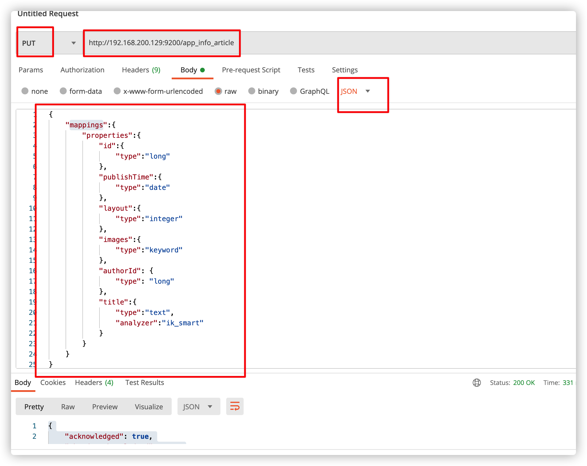
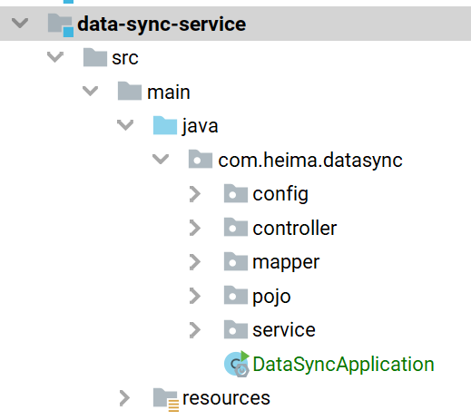
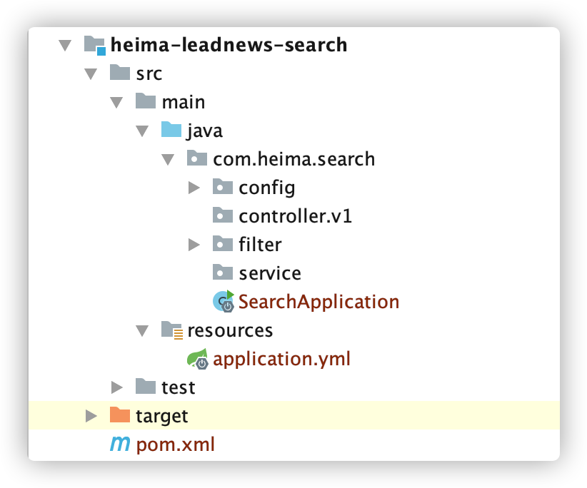
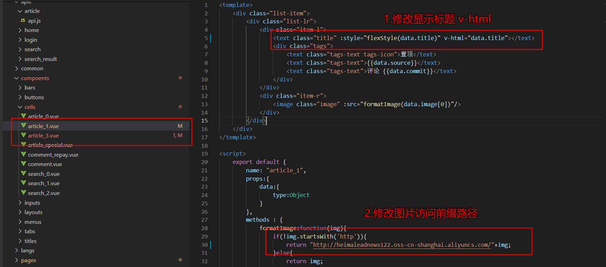
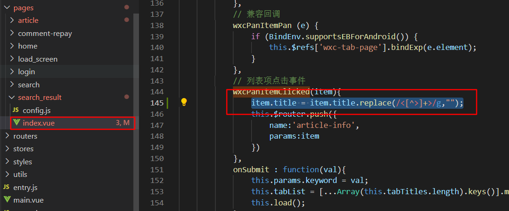
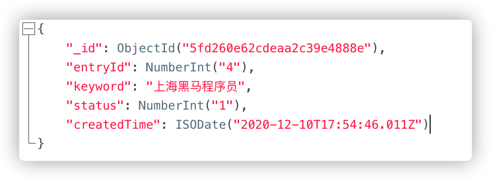
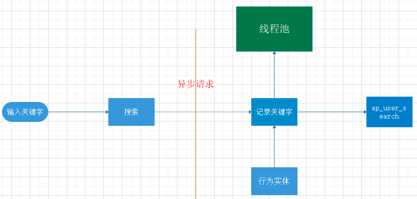
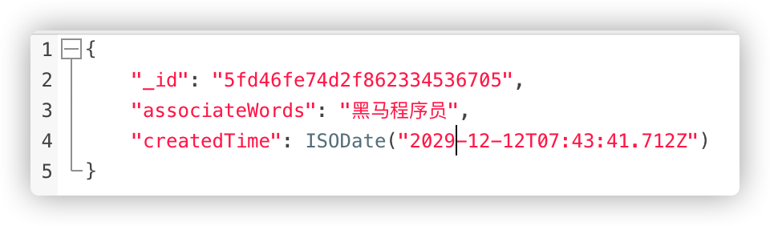
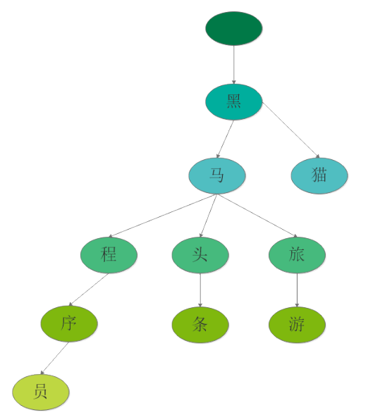

# 第十二章 app端文章搜索

## 今日目标

- 能够熟悉docker搭建ElasticSearch的环境
- 能够掌握创建索引的思路
- 能够完成app端文章的搜索
- 能够完成app端搜索记录的管理
- 能够完成搜索关键词的联想功能

## 1 搭建ElasticSearch环境

### 1.1 拉取镜像

```shell
docker pull elasticsearch:7.4.2
```

### 1.2 创建容器

```shell
docker run -id --name elasticsearch \
    -e "cluster.name=elastic-cluster" \
    -e "http.host=0.0.0.0" \
    -e "ES_JAVA_OPTS=-Xms256m -Xmx256m" \
    -e "discovery.type=single-node" \
    -e http.cors.enabled=true \
    -e http.cors.allow-origin="*" \
    -e http.cors.allow-headers=X-Requested-With,X-Auth-Token,Content-Type,Content-Length,Authorization \
    -e http.cors.allow-credentials=true \
    -v es-data:/usr/share/elasticsearch/data \
    -v es-logs:/usr/share/elasticsearch/logs \
    -v es-plugins:/usr/share/elasticsearch/plugins \
    --privileged \
    --hostname elasticsearch \
    -p 9200:9200 \
    -p 9300:9300 \
elasticsearch:7.4.2
```

注意: es默认占用内存较大，需要修改 jvm.properties中 内存的大小

### 1.3 配置中文分词器 ik

因为在创建elasticsearch容器的时候，映射了目录，所以可以在宿主机上进行配置ik中文分词器

在去选择ik分词器的时候，需要与elasticsearch的版本好对应上

把资料中的`elasticsearch-analysis-ik-7.4.2.zip`上传到服务器上,放到对应目录（plugins）解压

```shell
#切换目录
 cd /var/lib/docker/volumes/es-plugins/_data
#新建目录
mkdir analysis-ik
cd analysis-ik
#root根目录中拷贝文件
mv elasticsearch-analysis-ik-7.4.2.zip /var/lib/docker/volumes/es-plugins/_data/analysis-ik
#解压文件
cd /var/lib/docker/volumes/es-plugins/_data/analysis-ik
unzip elasticsearch-analysis-ik-7.4.2.zip
```

### 1.4 测试

http://192.168.200.129:9200


### 1.5 设置开机启动

```shell
docker update --restart=always  elasticsearch
```


### 1.6 安装kibana

拉取镜像

```shell
docker pull kibana:7.4.2
```

创建容器

```shell
docker run -d -p 5601:5601 --name kibana --link elasticsearch -e "ELASTICSEARCH_HOSTS=http://192.168.200.130:9200" kibana:7.4.2
```

测试:http://192.168.200.129:5601/


## 2 app端文章搜索

### 2.1 需求分析

搜索页面


搜索结果页面


- 用户输入关键可搜索文章列表
- 关键词高亮显示
- 文章列表展示与home展示一样，当用户点击某一篇文章，可查看文章详情

### 2.2 思路分析

为了加快检索的效率，在查询的时候不会直接从数据库中查询文章，需要在elasticsearch中进行高速检索。

实现思路

- 需要把文章相关的数据存储到es索引库中
- 在搜索微服务中进行检索，查询的是es库，展示文章列表，需要根据关键字进行查询
- 在搜索的时候，用户输入了关键字，需要对当前用户记录搜索历史

### 2.3 功能实现

#### 2.3.1 创建索引和映射

(1)在kibana中手动创建索引和映射

```json
PUT app_info_article
{
    "mappings":{
        "properties":{
            "id":{
                "type":"long"
            },
            "publishTime":{
                "type":"date"
            },
            "layout":{
                "type":"integer"
            },
            "images":{
                "type":"keyword"
            },
            "authorId": {
          		"type": "long"
       		},
          "title":{
            "type":"text",
            "analyzer":"ik_smart"
          }
        }
    }
}
```


创建成功后：

可查询当前索引库，只需要把put请求改为get请求即可。

```java
GET app_info_article
```


(2)使用postman添加映射和查询

创建索引库并且添加映射

put请求 ： http://192.168.200.129:9200/app_info_article



GET请求查询映射：http://192.168.200.129:9200/app_info_article

DELETE请求，删除索引及映射：http://192.168.200.129:9200/app_info_article

GET请求，查询所有文档：http://192.168.200.129:9200/app_info_article/_search

#### 2.3.2 搭建数据同步服务

**目的：**完成从文章库中将所有的数据导入到 ElasticSearch 索引库中

（1）新建接收索引库文章存储对象

```java
package com.heima.model.search.vo;
import lombok.Data;
import java.util.Date;
@Data
public class SearchArticleVo {
    // 文章id
    private Long id;
    // 文章标题
    private String title;
    // 文章发布时间
    private Date publishTime;
    // 文章布局
    private Integer layout;
    // 封面
    private String images;
    // 作者
    private Long authorId;
}
```

（2）创建数据同步微服务`data-sync-service`



pom引入依赖

```xml
<dependencies>
    <!-- ES 依赖 -->
    <dependency>
        <groupId>org.elasticsearch.client</groupId>
        <artifactId>elasticsearch-rest-high-level-client</artifactId>
    </dependency>
</dependencies>
```

（3）编写启动类

```java
package com.heima.datasync;
import com.baomidou.mybatisplus.extension.plugins.PaginationInterceptor;
import org.mybatis.spring.annotation.MapperScan;
import org.springframework.boot.SpringApplication;
import org.springframework.boot.autoconfigure.SpringBootApplication;
import org.springframework.context.annotation.Bean;
@SpringBootApplication
@MapperScan("com.heima.datasync.mapper")
public class DataSyncApplication {
    public static void main(String[] args) {
        SpringApplication.run(DataSyncApplication.class, args);
    }
    @Bean
    PaginationInterceptor paginationInterceptor(){
        return new PaginationInterceptor();
    }
}
```

（4）`application.yml`

```yaml
server:
  port: 9101
spring:
  application:
    name: es-article
  cloud:
    nacos:
      discovery:
        server-addr: 192.168.200.129:8848
  datasource:
    driver-class-name: com.mysql.jdbc.Driver
    url: jdbc:mysql://192.168.200.130:3306/leadnews_article?useUnicode=true&characterEncoding=UTF-8&serverTimezone=UTC
    username: root
    password: root
# 设置Mapper接口所对应的XML文件位置，如果你在Mapper接口中有自定义方法，需要进行该配置
mybatis-plus:
  mapper-locations: classpath*:mapper/*.xml
  # 设置别名包扫描路径，通过该属性可以给包中的类注册别名
  type-aliases-package: com.heima.model.article.pojos
#自定义elasticsearch连接配置
elasticsearch:
  host: 192.168.200.130
  port: 9200
swagger:
  group: ${spring.application.name}
```

（4）准备ES客户端配置类

```java
package com.heima.datasync.config;
import lombok.Getter;
import lombok.Setter;
import org.apache.http.HttpHost;
import org.elasticsearch.client.RestClient;
import org.elasticsearch.client.RestHighLevelClient;
import org.springframework.boot.context.properties.ConfigurationProperties;
import org.springframework.context.annotation.Bean;
import org.springframework.context.annotation.Configuration;
@Getter
@Setter
@Configuration
@ConfigurationProperties(prefix = "elasticsearch")
public class ElasticSearchConfig {
    private String host;
    private int port;
    @Bean
    public RestHighLevelClient client(){
        return new RestHighLevelClient(RestClient.builder(
                new HttpHost(
                        host,
                        port,
                        "http"
                )
        ));
    }
}
```

#### 2.3.3 导入索引库初始化数据

（1）创建ApArticleMapper

```java
package com.heima.datasync.mapper;
import com.baomidou.mybatisplus.core.mapper.BaseMapper;
import com.heima.model.article.pojos.ApArticle;
import org.apache.ibatis.annotations.Select;
import java.util.List;
public interface ApArticleMapper extends BaseMapper<ApArticle> {
    @Select("select aa.* from ap_article aa left join ap_article_config" +
            " aac on aa.id = aac.article_id where aac.is_delete !=1 and aac.is_down !=1")
    List<ApArticle> findAllArticles();
}
```

（2）创建EsDataService

```java
package com.heima.datasync.service;
import com.heima.model.common.dtos.ResponseResult;
public interface EsDataService {
    ResponseResult dataInit();
}
```

（3）创建EsDataServiceImpl

```java
package com.heima.datasync.service.impl;
import com.alibaba.fastjson.JSON;
import com.heima.datasync.mapper.ApArticleMapper;
import com.heima.model.article.pojo.ApArticle;
import com.heima.model.common.dto.ResponseResult;
import com.heima.model.search.vo.SearchArticleVo;
import com.heima.datasync.service.EsDataService;
import com.heima.model.common.enums.AppHttpCodeEnum;
import org.elasticsearch.action.bulk.BulkRequest;
import org.elasticsearch.action.bulk.BulkResponse;
import org.elasticsearch.action.index.IndexRequest;
import org.elasticsearch.client.RequestOptions;
import org.elasticsearch.client.RestHighLevelClient;
import org.elasticsearch.common.xcontent.XContentType;
import org.springframework.beans.BeanUtils;
import org.springframework.beans.factory.annotation.Autowired;
import org.springframework.stereotype.Service;
import java.io.IOException;
import java.util.List;
/**
 * @作者 itcast
 * @创建日期 2021/4/23 20:01
 **/
@Service
public class EsDataServiceImpl implements EsDataService {
    public static final String ARTICLE_INDEX_NAME = "app_info_article";
    @Autowired
    private ApArticleMapper apArticleMapper;
    @Autowired
    private RestHighLevelClient restHighLevelClient;
    @Override
    public ResponseResult dataInit() {
        // TODO 判断索引库是否存在
        // 批量导入数据:
        // 一般建议是1000-5000个文档，如果你的文档很大，可以适当减少队列，大小建议是5-15MB，默认不能超过100M
        // TODO 如果数据库数据过多 建议分段批量插入
        try {
            // 分页查询第一页文章数据
            List<ApArticle> apArticles = apArticleMapper.findAllArticles();
            if(apArticles == null || apArticles.size() == 0){
                return ResponseResult.errorResult(AppHttpCodeEnum.SERVER_ERROR, "数据库文章信息不存在");
            }
            // 遍历页码批量插入到索引库
            BulkRequest bulkRequest = new BulkRequest(ARTICLE_INDEX_NAME);
            for (ApArticle record : apArticles) {
                // 封装数据
                SearchArticleVo articleVo = new SearchArticleVo();
                BeanUtils.copyProperties(record, articleVo);
                // 转json
                String articleJson = JSON.toJSONString(articleVo);
                // 设置文档ID
                IndexRequest indexRequest = new IndexRequest()
                        .id(record.getId().toString())
                        .source(articleJson, XContentType.JSON);
                // 添加到批量插入对象
                bulkRequest.add(indexRequest);
            }
            BulkResponse responses = restHighLevelClient.bulk(bulkRequest, RequestOptions.DEFAULT);
            return ResponseResult.okResult(responses.status());
        } catch (IOException e) {
            e.printStackTrace();
            return ResponseResult.errorResult(AppHttpCodeEnum.SERVER_ERROR, e.getMessage());
        }
    }
}
```

（4）创建EsDataController

```java
package com.heima.datasync.controller;
import com.heima.datasync.service.EsDataService;
import com.heima.model.common.dtos.ResponseResult;
import org.springframework.beans.factory.annotation.Autowired;
import org.springframework.web.bind.annotation.GetMapping;
import org.springframework.web.bind.annotation.RequestMapping;
import org.springframework.web.bind.annotation.RestController;

@Api(value="同步数据API",tags="同步数据API")
@RestController
@RequestMapping("esdata")
public class DataSyncController {
    @Autowired
    EsDataService esDataService;
    @ApiOperation(value="全量索引数据同步",notes="查询所有文章数据库数据，导入到es索引库中")
    @GetMapping("init")
    public ResponseResult esDataInit(){
        return esDataService.dataInit();
    }
}
```

（5）查看导入结果

**调用初始化数据方法:**  http://localhost:9101/esdata/init

```json
GET /app_info_article/_search
{
  "query": {
    "match_all": {}
  },
  "size": 2000,
  "sort": [
    {
      "publishTime": {
        "order": "desc"
      }
    }
  ]
}
```

#### 2.3.4 搜索微服务导入

（1）创建微服务 `search-service`



（2）pom依赖、application.yml、引导类

```xml
	<dependencies>
        <!--mongoDB-->
        <dependency>
            <groupId>org.springframework.boot</groupId>
            <artifactId>spring-boot-starter-data-mongodb</artifactId>
        </dependency>
        <!-- ES 依赖 -->
        <dependency>
            <groupId>org.elasticsearch.client</groupId>
            <artifactId>elasticsearch-rest-high-level-client</artifactId>
        </dependency>
    </dependencies>
```

```java
@SpringBootApplication
public class SearchApplication {
    public static void main(String[] args) {
        SpringApplication.run(SearchApplication.class, args);
    }
}
```

```yaml
server:
  port: 9007
spring:
  application:
    name: leadnews-search
  cloud:
    nacos:
      discovery:
        server-addr: 192.168.200.129:8848
  autoconfigure:
    exclude: org.springframework.boot.autoconfigure.jdbc.DataSourceAutoConfiguration,org.springframework.boot.autoconfigure.jdbc.DataSourceTransactionManagerAutoConfiguration
  data:
    mongodb:
      host: 192.168.200.129
      port: 27017
      database: leadnews-comment
#取消对elastsearch的健康检查
management:
  health:
    elasticsearch:
      enabled: false
#自定义elasticsearch连接配置
elasticsearch:
  host: 192.168.200.129
  port: 9200
```

（3）配置es环境

```java
package com.heima.search.config;
import lombok.Getter;
import lombok.Setter;
import org.apache.http.HttpHost;
import org.elasticsearch.client.RestClient;
import org.elasticsearch.client.RestHighLevelClient;
import org.springframework.boot.context.properties.ConfigurationProperties;
import org.springframework.context.annotation.Bean;
import org.springframework.context.annotation.Configuration;
import org.springframework.context.annotation.PropertySource;
@Getter
@Setter
@Configuration
@ConfigurationProperties(prefix = "elasticsearch")
public class ElasticSearchConfig {
    private String host;
    private int port;
    @Bean
    public RestHighLevelClient client(){
        return new RestHighLevelClient(RestClient.builder(
                new HttpHost(host,port,"http")
        ));
    }
}
```

#### 2.3.5 搜索接口定义

```java
package com.heima.search.controller.v1;
import com.heima.model.common.dto.ResponseResult;
import io.swagger.annotations.Api;
import io.swagger.annotations.ApiOperation;
import org.springframework.web.bind.annotation.PostMapping;
import org.springframework.web.bind.annotation.RequestBody;
import org.springframework.web.bind.annotation.RequestMapping;
import org.springframework.web.bind.annotation.RestController;

@Api(value = "文章搜索API",tags = "文章搜索API")
@RestController
@RequestMapping("/api/v1/article/search")
public class ArticleSearchController{
    @ApiOperation("文章搜索")
    @PostMapping("/search")
    public ResponseResult search(@RequestBody UserSearchDto userSearchDto) {
        // 文章搜索接口
        return null;
    }
}
```

UserSearchDto

```java
package com.heima.model.search.dto;
import lombok.Data;
import java.util.Date;
@Data
public class UserSearchDto {

    // 设备ID
    Integer equipmentId;
    /**
    * 搜索关键字
    */
    String searchWords;
    /**
    * 当前页
    */
    int pageNum;
    /**
    * 分页条数
    */
    int pageSize;
    
    Integer entryId;
    /**
    * 最小时间
    */
    Date minBehotTime;
    public int getFromIndex(){
        if(this.pageNum<1)return 0;
        if(this.pageSize<1) this.pageSize = 10;
        return this.pageSize * (pageNum-1);
    }
}
```

#### 2.3.6 业务层实现

创建业务层接口：ApArticleSearchService

```java
package com.heima.search.service;
import com.heima.model.common.dto.ResponseResult;
import com.heima.model.search.dto.UserSearchDto;
public interface ArticleSearchService {
    /**
     ES文章分页搜索
     @return
     */
    ResponseResult search(UserSearchDto userSearchDto);
}
```

实现类：

```java
package com.heima.search.service.impl;
import com.alibaba.fastjson.JSON;
import com.heima.model.common.dtos.ResponseResult;
import com.heima.model.common.enums.AppHttpCodeEnum;
import com.heima.model.common.threadlocal.AppThreadLocalUtils;
import com.heima.model.search.dtos.UserSearchDto;
import com.heima.model.search.vo.SearchArticleVo;
import com.heima.model.user.pojos.ApUser;
import com.heima.search.service.ApUserSearchService;
import com.heima.search.service.ArticleSearchService;
import lombok.extern.slf4j.Slf4j;
import org.apache.commons.lang3.StringUtils;
import org.elasticsearch.action.delete.DeleteRequest;
import org.elasticsearch.action.index.IndexRequest;
import org.elasticsearch.action.search.SearchRequest;
import org.elasticsearch.action.search.SearchResponse;
import org.elasticsearch.client.RequestOptions;
import org.elasticsearch.client.RestHighLevelClient;
import org.elasticsearch.common.text.Text;
import org.elasticsearch.common.xcontent.XContentType;
import org.elasticsearch.index.query.BoolQueryBuilder;
import org.elasticsearch.index.query.MatchQueryBuilder;
import org.elasticsearch.index.query.QueryBuilders;
import org.elasticsearch.index.query.RangeQueryBuilder;
import org.elasticsearch.search.SearchHit;
import org.elasticsearch.search.SearchHits;
import org.elasticsearch.search.builder.SearchSourceBuilder;
import org.elasticsearch.search.fetch.subphase.highlight.HighlightBuilder;
import org.elasticsearch.search.sort.SortOrder;
import org.springframework.beans.factory.annotation.Autowired;
import org.springframework.stereotype.Service;
import java.io.IOException;
import java.util.ArrayList;
import java.util.List;
import java.util.Map;
/**
 * @Description:
 * @Version: V1.0
 */
@Service
@Slf4j
public class ArticleSearchServiceImpl implements ArticleSearchService {
    @Autowired
    RestHighLevelClient restHighLevelClient;
    /**
     * ES文章分页搜索
     * @param userSearchDto
     * @return
     */
    @Override
    public ResponseResult search(UserSearchDto userSearchDto) {
        //1 参数检查
        String searchWords = userSearchDto.getSearchWords();
        if (userSearchDto == null || StringUtils.isBlank(searchWords)) {
              return ResponseResult.errorResult(AppHttpCodeEnum.PARAM_REQUIRE);
        }
        //***如果是首页记录搜索关键字
        ApUser user = AppThreadLocalUtils.getUser();
        if (userSearchDto.getFromIndex() == 0) {
            if(user !=null) userSearchDto.setEntryId(user.getId());
            // 异步调用保存用户输入关键词记录
            apUserSearchService.insert( userSearchDto);
        }
        //2 构建查询执行查询
        SearchRequest searchRequest = new SearchRequest("app_info_article");
        SearchSourceBuilder searchSourceBuilder = new SearchSourceBuilder();
        // 构建查询条件和过滤等
        BoolQueryBuilder boolQueryBuilder = new BoolQueryBuilder();
        // 关键词查询
        MatchQueryBuilder queryBuilder = QueryBuilders.matchQuery("title", searchWords);
        boolQueryBuilder.must(queryBuilder);
        // 查询小于mindate的数据
        RangeQueryBuilder rangeQueryBuilder = QueryBuilders.rangeQuery("publishTime").lt(userSearchDto.getMinBehotTime().getTime());
        boolQueryBuilder.filter(rangeQueryBuilder);
        // 分页
        searchSourceBuilder.from(0);
        searchSourceBuilder.size(userSearchDto.getPageSize());
        // 按照发布时间倒序
        searchSourceBuilder.sort("publishTime", SortOrder.DESC);
        // 高亮 三要素
        HighlightBuilder highlightBuilder = new HighlightBuilder();
        highlightBuilder.field("title");
        highlightBuilder.preTags("<font style='color:red'>");
        highlightBuilder.postTags("</font>");
        searchSourceBuilder.highlighter(highlightBuilder);
        searchSourceBuilder.query(boolQueryBuilder);
        searchRequest.source(searchSourceBuilder);
        try {
            SearchResponse searchResponse = restHighLevelClient.search(searchRequest, RequestOptions.DEFAULT);
            //3 解析结果 封装结果
            SearchHits searchHits = searchResponse.getHits();
            List<SearchArticleVo> resultList = new ArrayList<>();
            // 总记录数
            long total = searchHits.getTotalHits().value;
            log.info("search result total:{}",total);
            SearchHit[] hits = searchHits.getHits();
            for (SearchHit hit : hits) {
                String jsonString = hit.getSourceAsString();
                SearchArticleVo apArticle = JSON.parseObject(jsonString, SearchArticleVo.class);
                // 获取高亮结果集
                Text[] titles = hit.getHighlightFields().get("title").getFragments();
                // 保留原始标题
                String title = StringUtils.join(titles);
                if (StringUtils.isNotBlank(title)) {
                    apArticle.setTitle(title);
                }
                resultList.add(apArticle);
            }
            return ResponseResult.okResult(resultList);
        } catch (IOException e) {
            e.printStackTrace();
            log.error("search result error:{}",e);
        }
        return ResponseResult.errorResult(AppHttpCodeEnum.SERVER_ERROR);
    }
}
```

#### 2.3.7 控制层实现

新建控制器ArticleSearchController

```java
package com.heima.search.controller.v1;
import com.heima.model.common.dto.ResponseResult;
import com.heima.model.search.dto.UserSearchDto;
import com.heima.search.service.ArticleSearchService;
import io.swagger.annotations.Api;
import io.swagger.annotations.ApiOperation;
import org.springframework.beans.factory.annotation.Autowired;
import org.springframework.web.bind.annotation.PostMapping;
import org.springframework.web.bind.annotation.RequestBody;
import org.springframework.web.bind.annotation.RequestMapping;
import org.springframework.web.bind.annotation.RestController;

@Api(value = "文章搜索API",tags = "文章搜索API")
@RestController
@RequestMapping("/api/v1/article/search")
public class ArticleSearchController{

    @Autowired
    ArticleSearchService articleSearchService;

    @ApiOperation("文章搜索")
    @PostMapping("/search")
    public ResponseResult search(@RequestBody UserSearchDto userSearchDto) {
        // 文章搜索接口
        return articleSearchService.search(userSearchDto);
    }
}
```

#### 2.3.8 测试

首先需要在app的网关中添加搜索微服务的路由配置

```yaml
#搜索微服务
- id: leadnews-search
  uri: lb://leadnews-search
  predicates:
  - Path=/search/**
  filters:
  - StripPrefix= 1
```

启动项目进行测试，至少要启动文章微服务，用户微服务，搜索微服务，app网关微服务，app前端工程

**注意**:

查看文章详情时，会出现文章查找不到 原因 是因为id的long值 精度丢失  

```java
package com.heima.model.search.vo;

import com.fasterxml.jackson.databind.annotation.JsonSerialize;
import com.fasterxml.jackson.databind.ser.std.ToStringSerializer;
import com.heima.model.article.pojos.ApArticle;
import lombok.Data;
import org.springframework.beans.BeanUtils;

import java.util.Date;
@Data
public class SearchArticleVo {
    public SearchArticleVo(ApArticle apArticle) {
        BeanUtils.copyProperties(apArticle,this);
    }
    public SearchArticleVo() {
    }
    // 文章id
    @JsonSerialize(using = ToStringSerializer.class)
    private Long id;
    // 文章标题
    private String title;
    // 文章发布时间
    private Date publishTime;
    // 文章布局
    private Integer layout;
    // 封面
    private String images;
    // 作者
    private Long authorId;
}
```


**前端修改**

设置v-html识别高亮标签



**添加过滤标签方法:** `item.title = item.title.replace(/<[^>]+>/g,"");`



### 2.4 文章自动审核构建索引

### 2.5 索引库文章的自动更新

说明:

索引库中的文章数据，要和ap_article库中的文章数据保持一致, 上面在项目初始化阶段我们已经将文章数据导入到索引库，后期当文章库数据发生变化时，我们也要保证索引库数据的一致性。

1. 当admin微服务的自动审核成功时，需要通知search微服务添加文章索引
2. 当wemedia微服务的上架调用后，需要通知search微服务添加文章索引
3. 当wemedia微服务的下架调用后，需要通知search微服务删除文章索引

#### 2.5.1 定义kafka消息主题常量类

`com.heima.common.constants.message.ArticleForEsConstants`

```java
package com.heima.common.constants.message;
public class ArticleForEsConstants {
    // es中添加文章的消息主题
    public static final String ARTICLE_ELASTICSEARCH_ADD="article.es.add.topic";
    // es中删除文章的消息主题
    public static final String ARTICLE_ELASTICSEARCH_DELETE="article.es.remove.topic";
}
```

#### 2.5.2 添加kafka消息通知

admin微服务添加kafka生产者配置

```yaml
spring:
  application:
    name: leadnews-admin
  kafka:
    bootstrap-servers: 192.168.200.129:9092
    consumer:
      group-id: ${spring.application.name}-kafka-group
      key-deserializer: org.apache.kafka.common.serialization.StringDeserializer
      value-deserializer: org.apache.kafka.common.serialization.StringDeserializer
    producer:
      key-serializer: org.apache.kafka.common.serialization.StringSerializer
      value-serializer: org.apache.kafka.common.serialization.StringSerializer 
```

admin微服务自动审核方法，添加kafka发送消息

`com.heima.admin.service.impl.WemediaNewsAutoScanServiceImpl#publishArticle`

```java
	/**
     * 发布文章
     * @param wmNews
     */
    private void publishArticle(WmNews wmNews) {
        // 保存 ap_article相关数据
        ResponseResult responseResult = saveArticle(wmNews);
        //        ap_article_config   文章配置
        //        ap_article  文章
        //        ap_article_content  文章内容
        //   如果存在自媒体文章中存在articleId则是修改，没有articleId为新增
        if(responseResult.getCode() != 0){
            throw new RuntimeException("保存文章信息出现错误:"+responseResult.getErrorMessage());
        }
        //   审核通过，修改自媒体文章状态为 9 （审核通过）同时回填app文章id到自媒体表中
        wmNews.setArticleId((Long)responseResult.getData());
        updateWmNews(wmNews,(short) 9 ,"文章审核通过");
        //创建索引（为后续app端的搜索功能做数据准备）
        // ==============新加代码==============================================

        map.put("articleId",wmNews.getArticleId());
        kafkaTemplate.send(ArticleForEsConstants.ARTICLE_ELASTICSEARCH_ADD,JSON.toJSONString(map));
        // ==============新加代码==============================================
    }
```

wemedia微服务修改上下架方法

`com.heima.wemedia.service.impl.WmNewsServiceImpl#downOrUp`

```java
@Override
    public ResponseResult downOrUp(WmNewsDto dto) {
        //1.检查参数
        if(dto == null || dto.getId() == null){
            return ResponseResult.errorResult(AppHttpCodeEnum.PARAM_INVALID);
        }
        //2.查询文章
        WmNews wmNews = getById(dto.getId());
        if(wmNews == null){
            return ResponseResult.errorResult(AppHttpCodeEnum.DATA_NOT_EXIST,"文章不存在");
        }
        //3.判断文章是否发布
        if(!wmNews.getStatus().equals(WmNews.Status.PUBLISHED.getCode())){
            return ResponseResult.errorResult(AppHttpCodeEnum.DATA_NOT_EXIST,"当前文章不是发布状态，不能上下架");
        }
        //4.修改文章状态，同步到app端（后期做）TODO
        if(dto.getEnable() != null && dto.getEnable() > -1 && dto.getEnable() < 2){
            update(Wrappers.<WmNews>lambdaUpdate().eq(WmNews::getId,dto.getId()).set(WmNews::getEnable,dto.getEnable()));
            if(wmNews.getArticleId()!=null){
                Map<String,Object> mesMap = new HashMap<>();
                mesMap.put("enable",dto.getEnable());
                mesMap.put("articleId",wmNews.getArticleId());
                kafkaTemplate.send(WmNewsMessageConstants.WM_NEWS_UP_OR_DOWN_TOPIC,JSON.toJSONString(mesMap));
            }
            //是否上架  0 下架  1 上架
            // ==============新加代码==============================================
            Map map = new HashMap();
            map.put("articleId",wmNews.getArticleId());
            if(dto.getEnable().intValue() == 0){
                kafkaTemplate.send(ArticleForEsConstants.ARTICLE_ELASTICSEARCH_DELETE,JSON.toJSONString(map));
            }else {
                kafkaTemplate.send(ArticleForEsConstants.ARTICLE_ELASTICSEARCH_ADD,JSON.toJSONString(map));
            }
            // ==============新加代码==============================================
        }
        return ResponseResult.okResult(AppHttpCodeEnum.SUCCESS);
    }
```

#### 2.5.3 定义文章远程调用接口

1.ArticleFeign增加接口方法

```java
package com.heima.feigns.article;
import com.heima.model.article.dtos.ArticleDto;
import com.heima.model.article.pojos.ApAuthor;
import com.heima.model.common.dtos.ResponseResult;
import com.heima.model.search.vo.SearchArticleVo;
import org.springframework.cloud.openfeign.FeignClient;
import org.springframework.web.bind.annotation.GetMapping;
import org.springframework.web.bind.annotation.PathVariable;
import org.springframework.web.bind.annotation.PostMapping;
import org.springframework.web.bind.annotation.RequestBody;
@FeignClient("leadnews-article")
public interface ArticleFeign {
    // ==============新加代码==============================================
    @GetMapping("/api/v1/article/{id}")
    SearchArticleVo findArticle(@PathVariable("id") Long id);
    // ==============新加代码==============================================
    @GetMapping("/api/v1/author/findByUserId/{userId}")
    ApAuthor findByUserId(@PathVariable("userId") Integer userId);
    @PostMapping("/api/v1/author/save")
    ResponseResult save(@RequestBody ApAuthor apAuthor);
    @PostMapping("/api/v1/article/save")
    ResponseResult saveArticle(@RequestBody ArticleDto articleDto);
    @GetMapping("/api/v1/author/one/{id}")
    ApAuthor selectById(@PathVariable("id") Integer id);
}
```

3.article微服务 `com.heima.article.controller.v1.ApArticleController`实现方法

```java
	@ApiOperation("根据ID查询文章搜索VO")
	@GetMapping("{id}")
    public SearchArticleVo findArticle(@PathVariable Long id) {
        ApArticle article = articleService.getById(id);
        if(article!=null){
            SearchArticleVo searchArticleVo = new SearchArticleVo();
            BeanUtils.copyProperties(article,searchArticleVo);
            return searchArticleVo;
        }
        return null;
    }
```

#### 2.5.4 定义kafka消息监听

1. search微服务添加kafka配置

```yaml
spring:
  application:
    name: leadnews-search
  kafka:
    bootstrap-servers: 192.168.200.130:9092
    consumer:
      group-id: ${spring.application.name}-kafka-group
      key-deserializer: org.apache.kafka.common.serialization.StringDeserializer
      value-deserializer: org.apache.kafka.common.serialization.StringDeserializer
```

2. 定义处理`com.heima.search.service.ArticleSearchService`方法

```java
    /**
     * 添加索引文章
     * @param articleId
     * @param article
     * @throws IOException
     */
    void saveArticle(SearchArticleVo article);
    /**
     * 删除索引文章
     * @param articleId
     * @throws IOException
     */
    void deleteArticle(Long articleId);
```

3. 实现service方法

```java
	@Override
    public void saveArticle(SearchArticleVo article) {
        IndexRequest request = new IndexRequest("app_info_article");
        request.id(String.valueOf(article.getId()));
        request.source(JSON.toJSONString(article), XContentType.JSON);
        try {
            restHighLevelClient.index(request,RequestOptions.DEFAULT);
        } catch (IOException e) {
            e.printStackTrace();
            log.error("索引库添加文章数据失败: {}",article);
        }
    }
    @Override
    public void deleteArticle(Long articleId) {
        DeleteRequest request = new DeleteRequest("app_info_article",String.valueOf(articleId));
        try {
            restHighLevelClient.delete(request,RequestOptions.DEFAULT);
        } catch (IOException e) {
            e.printStackTrace();
            log.error("索引库删除文章数据失败: {}",e.getMessage());
        }
    }
```

4. 定义kafka消息监听 `com.heima.search.listen.ArticleAddOrRemoveListener`

```java
package com.heima.search.listener;
import com.alibaba.fastjson.JSON;
import com.heima.common.constants.message.ArticleForEsConstants;
import com.heima.feigns.article.ArticleFeign;
import com.heima.model.search.vo.SearchArticleVo;
import com.heima.search.service.ArticleSearchService;
import lombok.extern.slf4j.Slf4j;
import org.springframework.beans.factory.annotation.Autowired;
import org.springframework.kafka.annotation.KafkaListener;
import org.springframework.stereotype.Component;
import java.util.Map;
@Component
@Slf4j
public class ArticleAddOrRemoveListener {
    @Autowired
    ArticleFeign articleFeign;
    @Autowired
    ArticleSearchService articleSearchService;
    @KafkaListener(topics = ArticleForEsConstants.ARTICLE_ELASTICSEARCH_ADD)
    public void addArticle(String message){
        Long articleId = (Long)JSON.parseObject(message, Map.class).get("articleId");
        log.info("搜索微服务 接收到添加文章到索引库消息==> {}",articleId);
        SearchArticleVo article = articleFeign.findArticle(Long.valueOf(articleId));
        articleSearchService.saveArticle(article);
    }
    @KafkaListener(topics = ArticleForEsConstants.ARTICLE_ELASTICSEARCH_DELETE)
    public void removeArticle(String message){
        Long articleId = (Long)JSON.parseObject(message, Map.class).get("articleId");
        log.info("搜索微服务 接收到删除索引库文章消息==> {}",articleId);
        articleSearchService.deleteArticle(articleId);
    }
}
```

#### 2.5.5 测试

启动wemedia微服务 调用文章上下架接口，查看索引库的文章是否能够添加和删除

启动admin微服务 发布一个文章，当自动审核通过后，查看索引库中是否添加了该文章


## 3 app端搜索-搜索记录

### 3.1 需求分析


- 展示用户的搜索记录10条，按照搜索关键词的时间倒序
- 可以删除搜索记录
- 保存历史记录
  - 异步的保存

### 3.2 思路分析

表结构：

ap_user_search APP用户搜索信息表 — 存储到 MongoDB/Redis 数据库中



对应实体：

```java
package com.heima.search.pojo;
import lombok.Data;
import org.springframework.data.mongodb.core.mapping.Document;
import java.io.Serializable;
import java.util.Date;
/**
 * APP用户搜索信息表
 * @author itheima
 */
@Data
@Document("ap_user_search")
public class ApUserSearch implements Serializable {
    private static final long serialVersionUID = 1L;
    /**
     * 主键
     */
    private String id;
    /**
     * 用户ID
     */
    private Integer entryId;
    /**
     * 搜索词
     */
    private String keyword;
    /**
     * 创建时间
     */
    private Date createdTime;

}
```

### 3.3 保存用户搜索记录

#### 3.3.1 实现思路

1. 用户输入关键字进行搜索的异步记录关键字
2. 利用线程池重用，减少创建和销毁线程的性能开销
3. 保存关键字需要先查询行为实体（登录用户或设备用户）
4. 如果是已经存在的关键字，如果则修改时间



#### 3.3.2 定义远程接口调用查询行为实体

在行为微服务中已经提供了接口，只需要在搜索微服务中新建行为的远程接口即可

```java
@FeignClient("leadnews-behavior")
public interface BehaviorFeign {
   @GetMapping("/api/v1/behavior_entry/one")
    public ApBehaviorEntry findByUserIdOrEquipmentId(@RequestParam("userId") Integer userId, 
                                                     @RequestParam("equipmentId") Integer equipmentId);
}

```

#### 3.3.3 集成AppTokenFilter过滤器

```java
@Order(1)
@WebFilter(filterName = "appTokenFilter", urlPatterns = "/*")
@Component
@Slf4j
public class AppTokenFilter extends GenericFilterBean {
    @Override
    public void doFilter(ServletRequest req, ServletResponse res, FilterChain chain) throws IOException, ServletException {
        HttpServletRequest request = (HttpServletRequest) req;
        HttpServletResponse response = (HttpServletResponse) res;
        // 测试和开发环境不过滤
        String userId = request.getHeader("userId");
        //如果userId为0，说明当前设备没有登录
        if(userId!=null && Integer.valueOf(userId).intValue()!=0){
            ApUser apUser = new ApUser();
            apUser.setId(Integer.valueOf(userId));
            AppThreadLocalUtils.setUser(apUser);
        }
        chain.doFilter(req,res);
        // 在过滤器的后置方法中清除当前登录用户
        AppThreadLocalUtils.clear();
    }
}
```


#### 3.3.4 修改文章搜索方法

修改类ArticleSearchServiceImpl类的search方法，完整代码如下：

```java
@Autowired
ApUserSearchService apUserSearchService;

/**
     * ES文章分页搜索
     * @param userSearchDto
     * @return
     */
@Override
public ResponseResult search(UserSearchDto userSearchDto) {
  //1 参数检查
  String searchWords = userSearchDto.getSearchWords();
  if (userSearchDto == null || StringUtils.isBlank(searchWords)) {
      return ResponseResult.errorResult(AppHttpCodeEnum.PARAM_REQUIRE);
  }
  //***如果是首页记录搜索关键字
  ApUser user = AppThreadLocalUtils.getUser();
  if (user !=null && userSearchDto.getFromIndex() == 0) {
    userSearchDto.setEntryId(user.getId());
    // 异步调用保存用户输入关键词记录
    apUserSearchService.insert( userSearchDto);
  }
  // 其他代码省略... 
}
```

#### 3.3.5 搜索历史异步任务

新增ApUserSearchService接口，由于是在搜索的时候异步调用保存关键字，暂时不需要定义api接口

```java
package com.heima.search.service;

public interface ApUserSearchService {

    /**
     * 保存用户搜索历史记录
     * @param userSearchDto
     */
    public void insert( UserSearchDto userSearchDto);
}
```

实现类：

在插入方法中使用注解`@Async("taskExecutor")`进行异步调用，使得该方法加入线程池运行，这个值为在是线程池中的方法名称，需要与`@EnableAsync`一块使用

配置线程池

```java
package com.heima.search.config;
import lombok.Data;
import org.springframework.context.annotation.Bean;
import org.springframework.context.annotation.Configuration;
import org.springframework.scheduling.annotation.EnableAsync;
import org.springframework.scheduling.concurrent.ThreadPoolTaskExecutor;
import java.util.concurrent.ThreadPoolExecutor;
@Data
@Configuration
@EnableAsync //开启异步请求
public class ThreadPoolConfig {
    private static final int corePoolSize = 10;   // 核心线程数（默认线程数）
    private static final int maxPoolSize = 100;   // 最大线程数
    private static final int keepAliveTime = 10;  // 允许线程空闲时间（单位：默认为秒）
    private static final int queueCapacity = 500; // 缓冲队列数
    /**
     * 默认异步线程池
     * @return
     */
    @Bean("taskExecutor")
    public ThreadPoolTaskExecutor taskExecutor(){
        ThreadPoolTaskExecutor pool = new ThreadPoolTaskExecutor();
        pool.setThreadNamePrefix("--------------全局线程池-----------------");
        pool.setCorePoolSize(corePoolSize);
        pool.setMaxPoolSize(maxPoolSize);
        pool.setKeepAliveSeconds(keepAliveTime);
        pool.setQueueCapacity(queueCapacity);
        // 直接在execute方法的调用线程中运行
        pool.setRejectedExecutionHandler(new ThreadPoolExecutor.CallerRunsPolicy());
        // 初始化
        pool.initialize();
        return pool;
    }
}
```

实现类

```java
package com.heima.search.service.impl;

import com.heima.common.exception.CustException;
import com.heima.feigns.behavior.BehaviorFeign;
import com.heima.model.behavior.pojos.ApBehaviorEntry;
import com.heima.model.common.enums.AppHttpCodeEnum;
import com.heima.model.search.dtos.UserSearchDto;
import com.heima.search.pojos.ApUserSearch;
import com.heima.search.service.ApUserSearchService;
import lombok.extern.slf4j.Slf4j;
import org.apache.commons.lang3.StringUtils;
import org.springframework.beans.factory.annotation.Autowired;
import org.springframework.data.domain.Sort;
import org.springframework.data.mongodb.core.MongoTemplate;
import org.springframework.data.mongodb.core.query.Criteria;
import org.springframework.data.mongodb.core.query.Query;
import org.springframework.data.mongodb.core.query.Update;
import org.springframework.scheduling.annotation.Async;
import org.springframework.stereotype.Service;

import java.util.Date;
import java.util.List;

/**
 * @Description:
 * @Version: V1.0
 */
@Service
@Slf4j
public class ApUserSearchServiceImpl implements ApUserSearchService {
  @Autowired
  MongoTemplate mongoTemplate;
  @Autowired
  BehaviorFeign behaviorFeign;
    /**
     * 保存用户搜索历史记录
     * @param userSearchDto
     */
    @Override
    @Async("taskExecutor")
    public void insert( UserSearchDto userSearchDto) {
        //1 参数检查
        String searchWords = userSearchDto.getSearchWords();
        Integer entryId = userSearchDto.getEntryId();
        if (entryId== null || StringUtils.isBlank(searchWords)) {
           CustException.cust(AppHttpCodeEnum.PARAM_REQUIRE);
        }
        //2 查询行为实体
        ApBehaviorEntry apBehaviorEntry = behaviorFeign.findByUserIdOrEquipmentId(entryId, userSearchDto.getEquipmentId());
        if (apBehaviorEntry == null) {
            CustException.cust(AppHttpCodeEnum.DATA_NOT_EXIST);
        }

        log.info("ApUserSearchServiceImpl insert entryId:{}, searchWords:{}", entryId, searchWords);
//
        //3 查询当前用户搜索的关键词是否存在
        ApUserSearch apUserSearch = mongoTemplate.findOne(Query.query(Criteria.where("entryId").is(entryId).and("keyword").is(searchWords)), ApUserSearch.class);
        //3.1 存在则更新最新时间，更新状态
        if (apUserSearch != null) {
            apUserSearch.setCreatedTime(new Date());
            mongoTemplate.save(apUserSearch);
            return;
        }
        //3.2 不存在则新增
        apUserSearch = new ApUserSearch();
        apUserSearch.setCreatedTime(new Date());
        apUserSearch.setEntryId(entryId);
        apUserSearch.setKeyword(searchWords);
        mongoTemplate.save(apUserSearch);
    }
}
```

#### 3.3.6 测试

在app端搜索一个词，是否能存入到MongoDB数据库中，搜索相同的词，只保存一次，按照时间倒序。

### 3.4 加载搜索记录列表

#### 3.4.1 思路分析

根据行为实体查询用户搜索记录表，默认加载10条数据，按照时间倒序

#### 3.4.2 接口定义

```java
package com.heima.search.controller.v1;
import com.heima.apis.search.ApUserSearchControllerApi;
import com.heima.model.common.dtos.ResponseResult;
import com.heima.model.search.dtos.UserSearchDto;
import com.heima.search.service.ApUserSearchService;
import lombok.extern.slf4j.Slf4j;
import org.springframework.beans.factory.annotation.Autowired;
import org.springframework.web.bind.annotation.PostMapping;
import org.springframework.web.bind.annotation.RequestBody;
import org.springframework.web.bind.annotation.RequestMapping;
import org.springframework.web.bind.annotation.RestController;
/**
 * APP用户搜索信息表 前端控制器
 * @author itheima
 */
@Slf4j
@Api(value="搜索历史记录API",tags="搜索历史记录API")
@RestController
@RequestMapping("/api/v1/history")
public class ApUserSearchController{
    @Autowired
    private ApUserSearchService apUserSearchService;
    @ApiOperation("加载搜索历史记录")
    @PostMapping("/load")
    public ResponseResult findUserSearch(@RequestBody UserSearchDto userSearchDto) {
        return apUserSearchService.findUserSearch(userSearchDto);
    }
}
```

#### 3.4.3 业务层

在ApUserSearchService中新增接口方法

```java
 /**
     查询搜索历史
     @param userSearchDto
     @return
     */
ResponseResult findUserSearch(UserSearchDto userSearchDto);
```

实现方法

```java
/**
     * 查询用户搜索历史记录  显示10条
     * @param userSearchDto
     * @return
     */
    @Override
    public ResponseResult findUserSearch(UserSearchDto userSearchDto) {
        List<ApUserSearch> userSearchList = new ArrayList<>();
        int size = 10;
        ApUser user = AppThreadLocalUtils.getUser();
        //1 查询实体
        ApBehaviorEntry apBehaviorEntry = behaviorFeign.findByUserIdOrEquipmentId(user==null?null:user.getId(), userSearchDto.getEquipmentId());
        if (apBehaviorEntry != null) {
            // 查询当前用户的搜索列表  按照时间倒序 .limit(userSearchDto.getPageSize())
            userSearchList = mongoTemplate.find(Query.query(Criteria.where("entryId").is(apBehaviorEntry.getId()).and("createdTime").lt(userSearchDto.getMinBehotTime()))
                            .with(Sort.by(Sort.Direction.DESC,"createdTime")).limit(size),ApUserSearch.class);
            return ResponseResult.okResult(userSearchList);
        }
        return ResponseResult.okResult(userSearchList);
    }
```

#### 3.4.5 控制器

```java
package com.heima.search.controller.v1;
import com.heima.apis.search.ApUserSearchControllerApi;
import com.heima.model.common.dtos.ResponseResult;
import com.heima.model.search.dtos.UserSearchDto;
import com.heima.search.service.ApUserSearchService;
import lombok.extern.slf4j.Slf4j;
import org.springframework.beans.factory.annotation.Autowired;
import org.springframework.web.bind.annotation.PostMapping;
import org.springframework.web.bind.annotation.RequestBody;
import org.springframework.web.bind.annotation.RequestMapping;
import org.springframework.web.bind.annotation.RestController;
/**
 * APP用户搜索信息表 前端控制器
 * @author itheima
 */
@Slf4j
@Api(value="搜索历史记录API",tags="搜索历史记录API")
@RestController
@RequestMapping("/api/v1/history")
public class ApUserSearchController{
    @Autowired
    private ApUserSearchService apUserSearchService;
    @ApiOperation("加载搜索历史记录")
    @PostMapping("/load")
    public ResponseResult findUserSearch(@RequestBody UserSearchDto userSearchDto) {
        return apUserSearchService.findUserSearch(userSearchDto);
    }
}
```

#### 3.4.6 测试

打开app的搜索页面，可以查看搜索记录列表

### 3.5 删除搜索记录

#### 3.5.1 思路分析

根据行为实体和当前id删除搜索记录

#### 3.5.2 接口定义

在ApUserSearchController接口新增方法

```java
@ApiOperation("删除搜索历史记录")
@PostMapping("/del")
public ResponseResult delUserSearch(@RequestBody HistorySearchDto historySearchDto) {
    return apUserSearchService.delUserSearch(historySearchDto);
}
```

添加 HistorySearchDto

```java
package com.heima.model.search.dtos;

import lombok.Data;
@Data
public class HistorySearchDto {

    // 设备ID
    Integer equipmentId;
    /**
     * 接收搜索历史记录id
     */
    String id;
}

```

#### 3.5.3 业务层

在ApUserSearchService中新增方法

```java
/**
     删除搜索历史
     @param userSearchDto
     @return
     */
ResponseResult delUserSearch(HistorySearchDto historySearchDto);
```

实现方法

```java
	@Override
    public ResponseResult delUserSearch(HistorySearchDto historySearchDto) {
        if(historySearchDto.getId() == null){
            return ResponseResult.errorResult(AppHttpCodeEnum.PARAM_INVALID);
        }
        ApUser user = AppThreadLocalUtils.getUser();
        ApBehaviorEntry behaviorEntry = behaviorFeign.findByUserIdOrEquipmentId(user == null ? null : user.getId(), historySearchDto.getEquipmentId());
        if(behaviorEntry == null){
            return ResponseResult.errorResult(AppHttpCodeEnum.DATA_NOT_EXIST,"行为实体数据不存在");
        }
        mongoTemplate.remove(Query.query(Criteria.where("_id").is(historySearchDto.getId()).and("entryId").is(behaviorEntry.getId())),ApUserSearch.class);
        return ResponseResult.okResult();
    }
```

#### 3.5.4 控制器

修改ApUserSearchController，新增方法

```java
	@ApiOperation("删除搜索历史记录")
    @PostMapping("/del")
    public ResponseResult delUserSearch(@RequestBody HistorySearchDto historySearchDto) {
        return apUserSearchService.delUserSearch(historySearchDto);
    }
```

#### 3.5.5 测试

打开app可以删除搜索记录

## 4 app端搜索-关键字联想词

### 4.1 需求分析

当关键词在一定的时间被频繁搜索，会被判定为受到用户更需求的行为，搜索功能根据用户搜索的时候给到下拉的联想推荐。

操作方法如下：


- 根据用户输入的关键字展示联想词

### 4.2 思路分析


表结构：

ap_associate_words 联想词表



```json
{
    _id: "1",
    associateWords: "黑马程序员",
    createdTime: ISODate("2029-12-12T07:43:41.712Z")
}
```


对应实体：

```java
package com.heima.search.pojo;
import lombok.Data;
import org.springframework.data.mongodb.core.mapping.Document;
import java.io.Serializable;
import java.util.Date;
/**
 * 联想词表
 * @author itheima
 */
@Data
@Document("ap_associate_words")
public class ApAssociateWords implements Serializable {
    private static final long serialVersionUID = 1L;
    private String id;
    /**
     * 联想词
     */
    private String associateWords;
    /**
     * 创建时间
     */
    private Date createdTime;
}
```

根据当前时间进行检索数据

### 4.3 功能实现

#### 4.3.1 接口定义

新建接口

```java
package com.heima.search.controller.v1;
import com.heima.model.common.dtos.ResponseResult;
import com.heima.model.search.dto.UserSearchDto;
import com.heima.search.service.ApAssociateWordsService;
import lombok.extern.slf4j.Slf4j;
import org.springframework.beans.factory.annotation.Autowired;
import org.springframework.web.bind.annotation.PostMapping;
import org.springframework.web.bind.annotation.RequestBody;
import org.springframework.web.bind.annotation.RequestMapping;
import org.springframework.web.bind.annotation.RestController;
/**
 * 联想词表 前端控制器
 * @author itheima
 */
@Api(value="搜索联想词API",tags="搜索联想词API")
@Slf4j
@RestController
@RequestMapping("/api/v1/associate")
public class ApAssociateWordsController {
    @Autowired
    private ApAssociateWordsService apAssociateWordsService;
    @ApiOperation("搜索联想词")
    @PostMapping("/search")
    public ResponseResult findAssociate(@RequestBody UserSearchDto userSearchDto) {
        return apAssociateWordsService.findAssociate(userSearchDto);
    }
}
```

#### 4.3.2 业务层

新建联想词业务层接口

```java
package com.heima.search.service;

import com.baomidou.mybatisplus.extension.service.IService;
import com.heima.model.common.dtos.ResponseResult;
import com.heima.model.search.dtos.UserSearchDto;
import com.heima.model.search.pojos.ApAssociateWords;

/**
 * <p>
 * 联想词表 服务类
 * </p>
 *
 * @author itheima
 */
public interface ApAssociateWordsService {

    /**
     联想词
     @param userSearchDto
     @return
     */
    ResponseResult findAssociate(UserSearchDto userSearchDto);

}
```

实现类

```java
package com.heima.search.service.impl;
import com.heima.model.common.dto.ResponseResult;
import com.heima.model.common.enums.AppHttpCodeEnum;
import com.heima.model.search.dto.UserSearchDto;
import com.heima.model.search.pojo.ApAssociateWords;
import com.heima.search.service.ApAssociateWordsService;
import org.apache.commons.lang3.StringUtils;
import org.springframework.beans.factory.annotation.Autowired;
import org.springframework.data.mongodb.core.MongoTemplate;
import org.springframework.data.mongodb.core.query.Criteria;
import org.springframework.data.mongodb.core.query.Query;
import org.springframework.stereotype.Service;
import java.util.List;
@Service
public class ApAssociateWordsServiceImpl implements ApAssociateWordsService {
    @Autowired
    MongoTemplate mongoTemplate;
    @Override
    public ResponseResult findAssociate(UserSearchDto userSearchDto) {
        //1 参数检查
        if(StringUtils.isBlank(userSearchDto.getSearchWords())){
            return ResponseResult.errorResult(AppHttpCodeEnum.PARAM_INVALID);
        }
        //2 执行查询 模糊查询
        List<ApAssociateWords> wordsList = mongoTemplate.find(Query.query(Criteria.where("associateWords")
                .regex(".*" +userSearchDto.getSearchWords()+ ".*")), ApAssociateWords.class);
        return ResponseResult.okResult(wordsList);
    }
}
```

#### 4.3.3  控制器

新建联想词控制器

```java
package com.heima.search.controller.v1;
import com.heima.model.common.dto.ResponseResult;
import com.heima.model.search.dto.UserSearchDto;
import com.heima.search.service.ApAssociateWordsService;
import io.swagger.annotations.Api;
import io.swagger.annotations.ApiOperation;
import lombok.extern.slf4j.Slf4j;
import org.springframework.beans.factory.annotation.Autowired;
import org.springframework.web.bind.annotation.PostMapping;
import org.springframework.web.bind.annotation.RequestBody;
import org.springframework.web.bind.annotation.RequestMapping;
import org.springframework.web.bind.annotation.RestController;
@Api(value="搜索联想词API",tags="搜索联想词API")
@Slf4j
@RestController
@RequestMapping("/api/v1/associate")
public class ApAssociateWordsController {
    @Autowired
    private ApAssociateWordsService apAssociateWordsService;
    @ApiOperation("搜索联想词")
    @PostMapping("/search")
    public ResponseResult findAssociate(@RequestBody UserSearchDto userSearchDto) {
        return apAssociateWordsService.findAssociate(userSearchDto);
    }
}
```

#### 4.3.5 测试

同样，打开前端联调测试效果

### 4.4 优化改造关键字联想词

#### 4.4.1现有问题

每次输入关键字的时候都会调用后台获取数据，频繁的发起请求查询数据库，并且是模糊查询

随着联想词的搜索越来越频繁，每次从数据库查询非常占用数据库资源，同时查询效率比较低

#### 4.4.2 优化方案Trie树 (前缀查询  )

优化方案：

- 构造Trie树数据结构，高效查询联想词数据
- Trie树存放在内存中，以少量空间换取大量时间

Trie树：又称单词查找树，Trie树，是一种树形结构，是一种哈希树的变种。典型应用是用于统计，排
序和保存大量的字符串（但不仅限于字符串），所以经常被搜索引擎系统用于文本词频统计。它的优点
是：利用字符串的公共前缀来减少查询时间，最大限度地减少无谓的字符串比较，查询效率比哈希树
高。

**词组为：黑马程序员、黑马头条、黑马旅游、黑猫**



- 根节点不包含字符，除根节点外的每一个子节点都包含一个字符。

- 从根节点到某一节点，路径上经过的字符连接起来，就是该节点对应的字符串。

- 每个单词的公共前缀作为一个字符节点保存。

工具类Trie

```java
package com.heima.search.model;
import java.util.ArrayList;
import java.util.HashMap;
import java.util.List;
import java.util.Map;
public class Trie {
	Node root;
	List<String> list;
	public Trie() {
		root = new Node();
		list = new ArrayList<String>();
	}
	/**
	 * 向字典树中插入单词
	 * @param word
	 */
	public void insert(String word) {
		if (word == null)
			return;
		Node node = root;
		for (int i = 0; i < word.length(); i++) {
			String str = "" + word.charAt(i);
			if (node.nexts.get(str) == null)
				node.nexts.put(str, new Node());
			node = node.nexts.get(str);
		}
		node.end = 1;
	}
	/**
	 * 判断是否有匹配该前缀的词汇
	 * @param preWord
	 * @return
	 */
	public boolean startWith(String preWord) {
		Node node = root;
		for (int i = 0; i < preWord.length(); i++) {
			String str = "" + preWord.charAt(i);
			if (node.nexts.get(str) == null)
				return false;
			node = node.nexts.get(str);
		}
		return true;
	}
	/**
	 * 根据前缀 获取所有联想词汇
	 * @param preword
	 * @return
	 */
	public List<String> getData(String preword) {
		list.clear();
		if (!startWith(preword))
			return null;
		else {
			StringBuilder str = new StringBuilder("");
			str.append(preword);
			Node node = root;
			for (int i = 0; i < preword.length(); i++)
				node = node.nexts.get("" + preword.charAt(i));
			dfs(node, str);
		}
		return list;
	}
	private void dfs(Node root, StringBuilder str) {
		if (root.end == 1) {
			list.add(str.toString());
			if (root.nexts.size() == 0)
				return;
		}
		Node node = root;
		for (String s : node.nexts.keySet()) {
			str.append(s);
			dfs(node.nexts.get(s), str);
			str.delete(str.length() - 1, str.length());
		}
	}
	class Node {
		public Map<String, Node> nexts; // 子节点
		public int end;
		public Node() {
			this.nexts = new HashMap<String, Node>();
			this.end = 0;
		}
	}
}

```

#### 4.4.3 改造现有service

在ApAssociateWordsService中新增V2版本的方法

```java
/**
     联想词 V2
     @param userSearchDto
     @return
     */
ResponseResult findAssociateV2(UserSearchDto userSearchDto);
```

实现方法

```java
package com.heima.search.service.impl;

import com.heima.model.common.dtos.ResponseResult;
import com.heima.model.common.enums.AppHttpCodeEnum;
import com.heima.model.search.dtos.UserSearchDto;
import com.heima.model.search.pojos.ApAssociateWords;
import com.heima.search.service.ApAssociateWordsService;
import com.heima.utils.common.Trie;
import org.apache.commons.lang3.StringUtils;
import org.springframework.beans.factory.InitializingBean;
import org.springframework.beans.factory.annotation.Autowired;
import org.springframework.data.mongodb.core.MongoTemplate;
import org.springframework.data.mongodb.core.query.Criteria;
import org.springframework.data.mongodb.core.query.Query;
import org.springframework.stereotype.Service;
import java.lang.ref.SoftReference;
import java.util.ArrayList;
import java.util.List;
import java.util.stream.Collectors;

/**
 * @Description:
 * @Version: V1.0
 */
@Service
public class ApAssociateWordsServiceImpl implements ApAssociateWordsService,InitializingBean {
    @Autowired
    MongoTemplate mongoTemplate;
    /**
     * 联想词
     * @param userSearchDto
     * @return
     */
    @Override
    public ResponseResult findAssociate(UserSearchDto userSearchDto) {
        //1 参数检查
        if(userSearchDto == null || StringUtils.isBlank(userSearchDto.getSearchWords())){
            return ResponseResult.errorResult(AppHttpCodeEnum.PARAM_INVALID);
        }
        //3 执行查询 模糊查询
        List<ApAssociateWords> wordsList = mongoTemplate.find(Query.query(Criteria.where("associateWords")
                                                                          .regex(".*?\\" +userSearchDto.getSearchWords()+ ".*")), ApAssociateWords.class);
        return ResponseResult.okResult(wordsList);
    }
    public static volatile SoftReference<Trie> associateWordsTrie = null;
    @Override
    public ResponseResult findAssociateV2(UserSearchDto userSearchDto) {
        //1 参数检查
        if(userSearchDto == null || StringUtils.isBlank(userSearchDto.getSearchWords())){
            return ResponseResult.errorResult(AppHttpCodeEnum.PARAM_INVALID);
        }
        if(associateWordsTrie==null || associateWordsTrie.get()==null){
            initTrieData();
        }
        Trie trie = associateWordsTrie.get();
        List<String> words = trie.getData(userSearchDto.getSearchWords());
        List<ApAssociateWords> apAssociateWordList = new ArrayList<>();
        if(words!=null && words.size()>0){
            for (int i = 0; i < words.size(); i++) {
                ApAssociateWords associateWords = new ApAssociateWords();
                associateWords.setAssociateWords(words.get(i));
                apAssociateWordList.add(associateWords);
            }
        }
        return ResponseResult.okResult(apAssociateWordList);
    }
    public void initTrieData(){
        Trie trie = new Trie();
        // 查询联想词
        List<ApAssociateWords> associateWords =
                mongoTemplate.findAll(ApAssociateWords.class);
        if(associateWords != null && associateWords.size()>0){
            // 将联想词  存入到字典树种
            associateWords.stream().map(ApAssociateWords::getAssociateWords).forEach(trie::insert);
        }
        // 字典树存放在内存， 使用软引用 在内存溢出前 会释放该内存
        associateWordsTrie = new SoftReference<Trie>(trie);
    }
    @Override
    public void afterPropertiesSet() throws Exception {
        System.out.println("初始化tree树");
        initTrieData();
    }
}
```

#### 4.4.5 改造现有controller

新建v2版本的控制器

```java
package com.heima.search.controller.v2;

import com.heima.apis.search.ApAssociateWordsControllerApi;
import com.heima.model.common.dtos.ResponseResult;
import com.heima.model.search.dtos.UserSearchDto;
import com.heima.search.service.ApAssociateWordsService;
import org.springframework.beans.factory.annotation.Autowired;
import org.springframework.web.bind.annotation.PostMapping;
import org.springframework.web.bind.annotation.RequestBody;
import org.springframework.web.bind.annotation.RequestMapping;
import org.springframework.web.bind.annotation.RestController;

@RestController
@RequestMapping("/api/v2/associate")
public class ApAssociateWordsV2Controller implements ApAssociateWordsControllerApi {
    @Autowired
    private ApAssociateWordsService apAssociateWordsService;
	@PostMapping("/search")
    @Override
    public ResponseResult findAssociate(@RequestBody UserSearchDto userSearchDto) {
        return apAssociateWordsService.findAssociate2(userSearchDto);
    }
}
```

#### 4.4.6 测试

