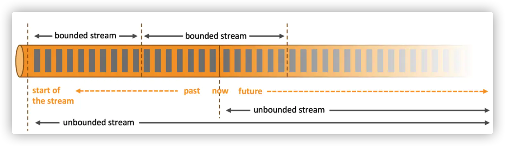
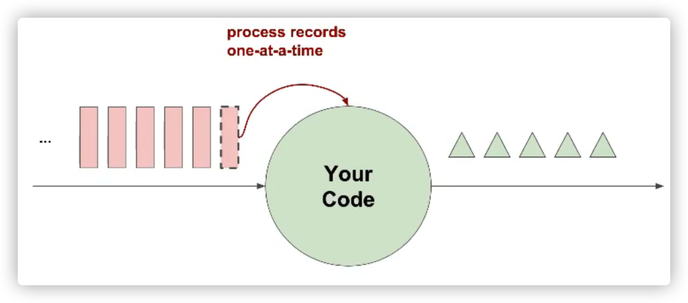
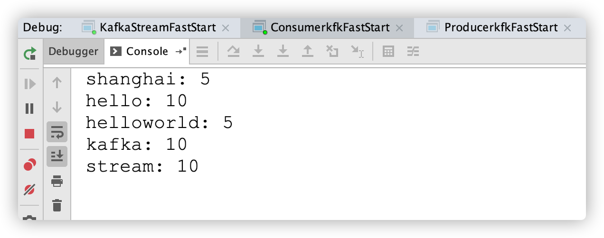
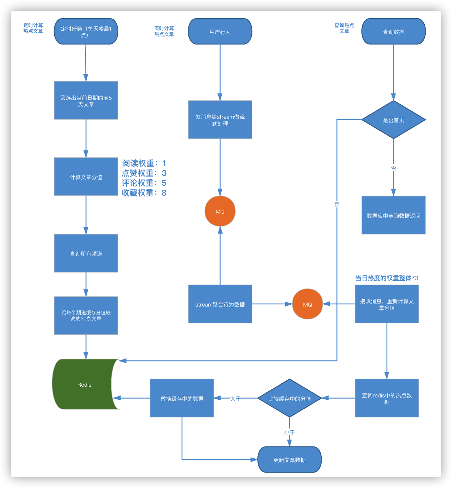
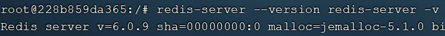
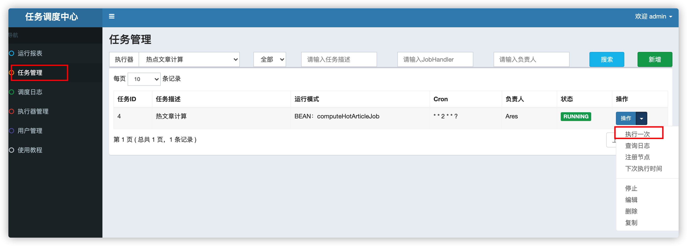
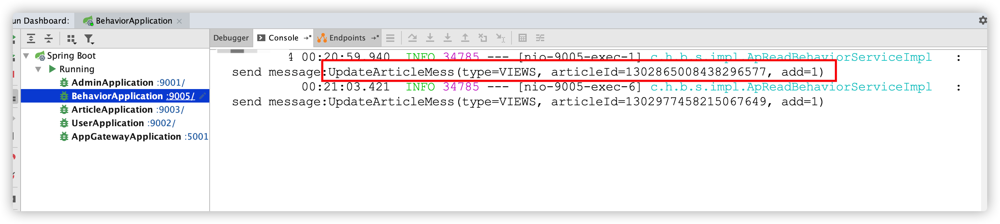
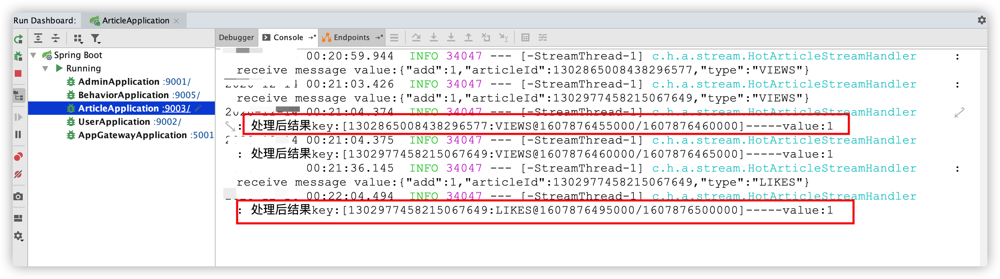

# 第十三章 kafkaStream新热文章计算

## 今日目标

- 能够理解什么是实时流式计算
- 能够理解kafkaStream处理实时流式计算的流程
- 能够完成kafkaStream实时流式计算的入门案例
- 能够完成app端热点文章计算的功能
- 能够完成app端文章列表接口的优化改造

## 1 实时流式计算

### 1.1 概念

任何类型的数据都是作为事件流产生的。信用卡交易，传感器测量，机器日志或网站或移动应用程序上的用户交互，所有这些数据都作为流生成。
数据可以作为无界或有界流处理。

一般流式计算会与批量计算相比较。在流式计算模型中，输入是持续的，可以认为在时间上是无界的，也就意味着，永远拿不到全量数据去做计算。同时，计算结果是持续输出的，也即计算结果在时间上也是无界的。流式计算一般对实时性要求较高，同时一般是先定义目标计算，然后数据到来之后将计算逻辑应用于数据。同时为了提高计算效率，往往尽可能采用增量计算代替全量计算。



**有界流**

- 有定义流的开始，也有定义流的结束。
- 有界流可以在摄取所有数据后再进行计算。
- 有界流所有数据可以被排序，所以并不需要有序摄取。
- 有界流处理通常被称为批处理。

**无界流**

- 有定义流的开始，但没有定义流的结束。
- 它们会无休止地产生数据。
- 无界流的数据必须持续处理，即数据被摄取后需要立刻处理。我们不能等到所有数据都到达再处理，因为输入是无限的，在任何时候输入都不会完成。
- 处理无界数据通常要求以特定顺序摄取事件，例如事件发生的顺序，以便能够推断结果的完整性。

### 1.2 应用场景

- 日志分析

  网站的用户访问日志进行实时的分析，计算访问量，用户画像，留存率等等，实时的进行数据分析，帮助企业进行决策

- 大屏看板统计

  可以实时的查看网站注册数量，订单数量，购买数量，金额等。

- 公交实时数据

  可以随时更新公交车方位，计算多久到达站牌等

- 实时文章分值计算

  头条类文章的分值计算，通过用户的行为实时文章的分值，分值越高就越被推荐。

### 1.3 技术方案选型

- Hadoop 

  

- Apche Storm/Flink

  Storm 是一个分布式实时大数据处理系统，可以帮助我们方便地处理海量数据，具有高可靠、高容错、高扩展的特点。是流式框架，有很高的数据吞吐能力。

- Kafka Stream

  可以轻松地将其嵌入任何Java应用程序中，并与用户为其流应用程序所拥有的任何现有打包，部署和操作工具集成。

## 2 Kafka Stream 

### 2.1 概述

[Kafka Stream](http://kafka.apache.org/27/documentation/streams/)是Apache Kafka从0.10版本引入的一个新Feature。它是提供了对存储于Kafka内的数据进行流式处理和分析的功能。

Kafka Stream的特点如下：

- Kafka Stream提供了一个非常简单而轻量的Library，它可以非常方便地嵌入任意Java应用中，也可以任意方式打包和部署
- 除了Kafka外，无任何外部依赖
- 充分利用Kafka分区机制实现水平扩展和顺序性保证
- 通过可容错的state store实现高效的状态操作（如windowed join和aggregation）
- 支持正好一次处理语义
- 提供记录级的处理能力，从而实现毫秒级的低延迟
- 支持基于事件时间的窗口操作，并且可处理晚到的数据（late arrival of records）
- 同时提供底层的处理原语Processor（类似于Storm的spout和bolt），以及高层抽象的DSL（类似于Spark的map/group/reduce）


### 2.2 Kafka Streams的关键概念

（1）Stream处理拓扑

- **流**是Kafka Stream提出的最重要的抽象概念：它表示一个无限的，不断更新的数据集。流是一个有序的，可重放（反复的使用），不可变的容错序列，数据记录的格式是键值对（key-value）。
- 通过Kafka Streams编写一个或多个的计算逻辑的处理器拓扑。其中处理器拓扑是一个由流（边缘）连接的流处理（节点）的图。
- **流处理器**是`处理器拓扑`中的一个节点；它表示一个处理的步骤，用来转换流中的数据（从拓扑中的上游处理器一次接受一个输入消息，并且随后产生一个或多个输出消息到其下游处理器中）。 

（2）在拓扑中有两个特别的处理器：

- **源处理器（Source Processor）**：源处理器是一个没有任何上游处理器的特殊类型的流处理器。它从一个或多个kafka主题生成输入流。通过消费这些主题的消息并将它们转发到下游处理器。
- **Sink处理器**：sink处理器是一个没有下游流处理器的特殊类型的流处理器。它接收上游流处理器的消息发送到一个指定的**Kafka主题**。


### 2.3 KStream&KTable

（1）数据结构类似于map,如下图，key-value键值对


（2）KStream

**KStream**数据流（data stream），即是一段顺序的，可以无限长，不断更新的数据集。
数据流中比较常记录的是事件，这些事件可以是一次鼠标点击（click），一次交易，或是传感器记录的位置数据。

特点：每一条消息代表一条不可变的新记录。

（3）KTable

**KTable**传统数据库，包含了各种存储了大量状态（state）的表格。KTable负责抽象的，就是表状数据。每一次操作，都是**更新插入（update）**

特点：每条消息代表一个更新，几条key相同的消息会将该key的值更新为最后一条消息的值

<font color="red">对于KStream 和 KTable 区别：</font> 

同时给**KStream** 和 **KTable** 发送两条消息： `{"key":1}` 和  `{"key":2}`

*  **KStream** 做 sum 计算： 结果为 `{"key":3}` 
*  **KTable** 做 sum 计算： 结果为 `{"key":2}` 

### 2.4 Kafka Stream入门案例编写

需求： 接收kafka消息内容并计算输入消息内单词的个数



>如：接收消息—— 数据源
>
>* hello kafka streams
>
>
>* hello heima kafka
>* hello shanghai heima kafka
>


将每个value消息  按照 空格拆分  ，对单词的个数进行统计


>结果输出：
>
>*     hello： 3
>*     kafka： 3
>*     streams：1
>*     heima： 2
>*     shanghai： 1


（1）引入依赖

在之前的kafka-demo工程的pom文件中引入

```xml
<dependency>
    <groupId>org.apache.kafka</groupId>
    <artifactId>kafka-streams</artifactId>
</dependency>
```

(2)创建类

```java
package com.itheima.stream;
import ch.qos.logback.classic.Level;
import ch.qos.logback.classic.Logger;
import ch.qos.logback.classic.LoggerContext;
import org.apache.kafka.common.serialization.Serdes;
import org.apache.kafka.streams.KafkaStreams;
import org.apache.kafka.streams.KeyValue;
import org.apache.kafka.streams.StreamsBuilder;
import org.apache.kafka.streams.StreamsConfig;
import org.apache.kafka.streams.kstream.KStream;
import org.apache.kafka.streams.kstream.TimeWindows;
import org.apache.kafka.streams.kstream.ValueMapper;
import org.slf4j.LoggerFactory;
import java.time.Duration;
import java.util.Arrays;
import java.util.Properties;
public class KafkaStreamFastStart {
    static {
        LoggerContext loggerContext = (LoggerContext) LoggerFactory.getILoggerFactory();
        Logger root = loggerContext.getLogger("root");
        root.setLevel(Level.INFO);
    }
    public static void main(String[] args) {
        //1 kafka配置信息
        Properties prop = new Properties();
        prop.put(StreamsConfig.BOOTSTRAP_SERVERS_CONFIG, "192.168.200.131:9092");
        prop.put(StreamsConfig.DEFAULT_KEY_SERDE_CLASS_CONFIG, Serdes.String().getClass());
        prop.put(StreamsConfig.DEFAULT_VALUE_SERDE_CLASS_CONFIG, Serdes.String().getClass());
        prop.put(StreamsConfig.APPLICATION_ID_CONFIG, "streams-sample");
        //2 stream构建器
        StreamsBuilder builder = new StreamsBuilder();
        // 流式计算
        streamProcessor(builder);
        //3 创建 kafkaStreams
        KafkaStreams kafkaStreams = new KafkaStreams(builder.build(), prop);
        //4 开启kafka流计算
        System.out.println("streamProcessor start: ");
        kafkaStreams.start();
    }
    private static void streamProcessor(StreamsBuilder builder) {
        // 接收生产者发送消息
        KStream<String, String> stream = builder.stream("itcast-topic-input");
        stream.flatMapValues(new ValueMapper<String, Iterable<String>>() {
            @Override
            public Iterable<String> apply(String value) {
                // value 接收消息的具体内容
                System.out.println("消息内容："+value);
                return Arrays.asList(value.split(" "));
            }
        })
                // 根据value进行分组
                .groupBy((key,value)->value)
                // 聚合计算时间间隔
                .windowedBy(TimeWindows.of(Duration.ofSeconds(5)))
                // 聚合查询：求单词总个数
                .count()
                // 转成 KStream
                .toStream()
                // 处理后结果key和value转成string
                .map((key, value) -> {
                    return new KeyValue<>(key.key().toString(), value.toString());
                })
                // 处理后的结果转发给消费方
                .to("itcast-topic-output");
    }
}
```

(3)测试

准备

使用生产者`ProducerkfkFastStart`在topic为：`itcast-topic-input`中发送多条消息

```java
package com.itheima.stream;
import ch.qos.logback.classic.Level;
import ch.qos.logback.classic.Logger;
import ch.qos.logback.classic.LoggerContext;
import org.apache.kafka.clients.producer.KafkaProducer;
import org.apache.kafka.clients.producer.ProducerConfig;
import org.apache.kafka.clients.producer.ProducerRecord;
import org.slf4j.LoggerFactory;

import java.util.Properties;
/**
 * 消息生产者
 */
public class ProducerkfkFastStart {
    static {
        LoggerContext loggerContext = (LoggerContext) LoggerFactory.getILoggerFactory();
        Logger root = loggerContext.getLogger("root");
        root.setLevel(Level.INFO);
    }
    private static final String TOPIC = "itcast-topic-input";
    public static void main(String[] args) {
        //添加kafka的配置信息
        Properties properties = new Properties();
        //配置broker信息
        properties.put("bootstrap.servers","192.168.200.131:9092");
        properties.put(ProducerConfig.KEY_SERIALIZER_CLASS_CONFIG,"org.apache.kafka.common.serialization.StringSerializer");
        properties.put(ProducerConfig.VALUE_SERIALIZER_CLASS_CONFIG,"org.apache.kafka.common.serialization.StringSerializer");
        properties.put(ProducerConfig.RETRIES_CONFIG,10);

        //生产者对象
        KafkaProducer<String,String> producer = new KafkaProducer<String, String>(properties);
      
  try {
            //封装消息
 ProducerRecord<String,String> record =
                            new ProducerRecord<String, String>(TOPIC,"k001","hello shanghai kafka stream hello");
                    //发送消息
                    producer.send(record);
                    System.out.println("发送消息："+record.value());

        }catch (Exception e){
            e.printStackTrace();
        }

        //关系消息通道
        producer.close();
    }
}
```


使用消费者`ConsumerkfkFastStart`接收topic为：`itcast-topic-output`

```java
package com.itheima.stream;
import ch.qos.logback.classic.Level;
import ch.qos.logback.classic.Logger;
import ch.qos.logback.classic.LoggerContext;
import org.apache.kafka.clients.consumer.ConsumerConfig;
import org.apache.kafka.clients.consumer.ConsumerRecord;
import org.apache.kafka.clients.consumer.ConsumerRecords;
import org.apache.kafka.clients.consumer.KafkaConsumer;
import org.slf4j.LoggerFactory;

import java.time.Duration;
import java.util.Collections;
import java.util.Properties;

/**
 * 消息消费者
 */
public class ConsumerkfkFastStart {
    static {
        LoggerContext loggerContext = (LoggerContext) LoggerFactory.getILoggerFactory();
        Logger root = loggerContext.getLogger("root");
        root.setLevel(Level.INFO);
    }
    private static final String TOPIC = "itcast-topic-output";
    public static void main(String[] args) {
        //添加配置信息
        Properties properties = new Properties();
        properties.put(ConsumerConfig.BOOTSTRAP_SERVERS_CONFIG,"192.168.200.131:9092");
        properties.put(ConsumerConfig.KEY_DESERIALIZER_CLASS_CONFIG,"org.apache.kafka.common.serialization.StringDeserializer");
        properties.put(ConsumerConfig.VALUE_DESERIALIZER_CLASS_CONFIG,"org.apache.kafka.common.serialization.StringDeserializer");
        //设置分组
        properties.put(ConsumerConfig.GROUP_ID_CONFIG,"group1");
        //创建消费者
        KafkaConsumer<String, String> consumer = new KafkaConsumer<String, String>(properties);
        //订阅主题
        consumer.subscribe(Collections.singletonList(TOPIC));
        System.out.println("消费方获取处理后结果：");
        while (true){
            ConsumerRecords<String, String> records = consumer.poll(Duration.ofMillis(1000));
            for (ConsumerRecord record : records) {
                System.out.println(record.key()+": "+record.value());
            }
        }

    }
}
```

结果：

通过流式计算，会把生产者的多条消息汇总成一条发送到消费者中输出（需要稍等一会）



### 2.5 SpringBoot集成Kafka Stream

从资料文件夹中把提供好的4个类拷贝到项目的config目录下

当前kafka-demo项目需要添加lombok的依赖包

```xml
<properties>
    <lombok.version>1.18.8</lombok.version>
</properties>

<dependency>
    <groupId>org.projectlombok</groupId>
    <artifactId>lombok</artifactId>
    <version>${lombok.version}</version>
    <scope>provided</scope>
</dependency>
```

（1）自定配置参数

```java
/**
 * 通过重新注册KafkaStreamsConfiguration对象，设置自定配置参数
 */
@Setter
@Getter
@Configuration
@EnableKafkaStreams
@ConfigurationProperties(prefix="kafka")
public class KafkaStreamConfig {
    private static final int MAX_MESSAGE_SIZE = 16* 1024 * 1024;
    private String hosts;
    private String group;

    /**
     * 重新定义默认的KafkaStreams配置属性，包括：
     * 1、服务器地址
     * 2、应用ID
     * 3、流消息的副本数等配置
     * @return
     */
    @Bean(name = KafkaStreamsDefaultConfiguration.DEFAULT_STREAMS_CONFIG_BEAN_NAME)
    public KafkaStreamsConfiguration defaultKafkaStreamsConfig() {
        Map<String, Object> props = new HashMap<>();
        props.put(StreamsConfig.BOOTSTRAP_SERVERS_CONFIG, hosts);
        props.put(StreamsConfig.APPLICATION_ID_CONFIG, this.getGroup()+"_stream_aid");
        props.put(StreamsConfig.CLIENT_ID_CONFIG, this.getGroup()+"_stream_cid");
        props.put(StreamsConfig.RETRIES_CONFIG, 10);
        props.put(StreamsConfig.DEFAULT_KEY_SERDE_CLASS_CONFIG, Serdes.String().getClass());
        props.put(StreamsConfig.DEFAULT_VALUE_SERDE_CLASS_CONFIG, Serdes.String().getClass());
        // 消息副本数量
        props.put(StreamsConfig.REPLICATION_FACTOR_CONFIG, 1);
        props.put(StreamsConfig.RETRY_BACKOFF_MS_CONFIG, 5_000);
        props.put(StreamsConfig.SEND_BUFFER_CONFIG, 3*MAX_MESSAGE_SIZE);
        props.put(ConsumerConfig.AUTO_OFFSET_RESET_CONFIG, Topology.AutoOffsetReset.EARLIEST.name().toLowerCase());
        return new KafkaStreamsConfiguration(props);
    }
}
```

修改application.yml文件，在最下方添加自定义配置

```yaml
kafka:
  hosts: 192.168.200.129:9092
  group: ${spring.application.name}
```


（2）定义监听接口

```java
/**
 * 流数据的监听消费者实现的接口类，系统自动会通过
 * KafkaStreamListenerFactory类扫描项目中实现该接口的类，
 * 并注册为流数据的消费端。
 *
 * 其中泛型可是KStream或KTable
 * @param <T>
 */
public interface KafkaStreamListener<T> {
    // 监听的类型
    String listenerTopic();
    // 处理结果发送的类
    String sendTopic();
    // 对象处理逻辑
    T getService(T stream);
}
```

(3)KafkaStream自动处理包装类

```java
/**
 * KafkaStream自动处理包装类
 */
public class KafkaStreamProcessor {
    // 流构建器
    StreamsBuilder streamsBuilder;
    private String type;
    KafkaStreamListener listener;

    public KafkaStreamProcessor(StreamsBuilder streamsBuilder,KafkaStreamListener kafkaStreamListener){
        this.streamsBuilder = streamsBuilder;
        this.listener = kafkaStreamListener;
        this.parseType();
        Assert.notNull(this.type,"Kafka Stream 监听器只支持kstream、ktable,当前类型是"+this.type);
    }
    /**
     * 通过泛型类型自动注册对应类型的流处理器对象
     * 支持KStream、KTable
     * @return
     */
    public Object doAction(){
        if("kstream".equals(this.type)) {
            KStream<?, ?> stream = streamsBuilder.stream(listener.listenerTopic(), Consumed.with(Topology.AutoOffsetReset.LATEST));
            stream=(KStream)listener.getService(stream);
            stream.to(listener.sendTopic());
            return stream;
        }else{
            KTable<?, ?> table = streamsBuilder.table(listener.listenerTopic(), Consumed.with(Topology.AutoOffsetReset.LATEST));
            table = (KTable)listener.getService(table);
            table.toStream().to(listener.sendTopic());
            return table;
        }
    }

    /**
     * 解析传入listener类的泛型类
     */
    private void parseType(){
        Type[] types = listener.getClass().getGenericInterfaces();
        if(types!=null){
            for (int i = 0; i < types.length; i++) {
                if( types[i] instanceof ParameterizedType){
                    ParameterizedType t = (ParameterizedType)types[i];
                    String name = t.getActualTypeArguments()[0].getTypeName().toLowerCase();
                    if(name.contains("org.apache.kafka.streams.kstream.kstream")||name.contains("org.apache.kafka.streams.kstream.ktable")){
                        this.type = name.substring(0,name.indexOf('<')).replace("org.apache.kafka.streams.kstream.","").trim();
                        break;
                    }
                }
            }
        }
    }
}
```

(4)KafkaStreamListener扫描和实例化成KafkaStreamProcessor.doAction的返回类，完成监听器实际注册的过程

```java
@Component
public class KafkaStreamListenerFactory implements InitializingBean {

    Logger logger = LoggerFactory.getLogger(KafkaStreamListenerFactory.class);

    @Autowired
    DefaultListableBeanFactory defaultListableBeanFactory;

    /**
     * 初始化完成后自动调用
     */
    @Override
    public void afterPropertiesSet() {
        Map<String, KafkaStreamListener> map = defaultListableBeanFactory.getBeansOfType(KafkaStreamListener.class);
        for (String key : map.keySet()) {
            KafkaStreamListener k = map.get(key);
            KafkaStreamProcessor processor = new KafkaStreamProcessor(defaultListableBeanFactory.getBean(StreamsBuilder.class),k);
            String beanName = k.getClass().getSimpleName()+"AutoProcessor" ;
            //注册baen,并且执行doAction方法
            defaultListableBeanFactory.registerSingleton(beanName,processor.doAction());
            logger.info("add kafka stream auto listener [{}]",beanName);
        }
    }
}
```

(5)手动创建监听器

> 1,该类需要实现KafkaStreamListener接口
>
> 2,listenerTopic方法返回需要监听的topic
>
> 3,sendTopic方法返回需要处理完后发送的topic
>
> 4,getService方法，主要处理流数据

```java
package com.itheima.kafka.bootstream;

import com.itheima.kafka.boot.KafkaStreamListener;
import org.apache.kafka.streams.KeyValue;
import org.apache.kafka.streams.kstream.KStream;
import org.apache.kafka.streams.kstream.TimeWindows;
import org.springframework.stereotype.Component;

import java.util.Arrays;

/**
 * @Description:
 * @Version: V1.0
 */
@Component
public class StreamListener implements KafkaStreamListener<KStream<String,String>> {
    @Override
    public String listenerTopic() {
        return "itcast-topic-input";
    }
    @Override
    public String sendTopic() {
        return "itcast-topic-output";
    }
    @Override
    public KStream<String,String> getService(KStream<String,String> stream) {
        return stream.flatMapValues( value -> {
            // value 接收消息的具体内容
            return Arrays.asList(value.split(" "));
        })
         // 根据value进行分组
        .groupBy((key,value)->value)
        // 聚合计算时间间隔
        .windowedBy(TimeWindows.of(5000))
        // 聚合查询：求单词总个数
        .count()
        // 转成 KStream
        .toStream()
        // key和value转成string
        .map((key, value) -> {
            return new KeyValue<>(key.key().toString(), value.toString());
        });
    }
}
```

测试：

​	启动微服务，正常发送消息，可以正常接收到消息

## 3 app端热点文章计算

### 3.1 需求分析

- 筛选出文章列表中最近5天热度较高的文章在每个频道的首页展示
- 根据用户的行为（阅读、点赞、评论、收藏）实时计算热点文章


### 3.2 思路分析

如下图：（如果看不清楚则可以开发资料中的pdf）



整体实现思路共分为3步

- 定时计算热点文章

  - 定时任务每天凌晨1点，查询前5天的文章

  - 计算每个文章的分值，其中不同的行为设置不同的权重

    **（阅读：1，点赞：3，评论：5，收藏：8）**

  - 按照分值排序，给每个频道找出分值较高的30条数据，存入缓存中

    为什么要按照频道缓存？

    在前端工程中的如下代码：

    

    这些就是首页的频道信息，其中的`id`就是与ad_channel表中的id要对应上。
    
    

- 实时计算热点文章

  - 行为微服务，用户阅读或点赞了某一篇文章（目前实现这两个功能），发送消息给kafka
  - 文章微服务，接收行为消息，使用kafkastream流式处理进行聚合，发消息给kafka
  - 文章微服务，接收聚合之后的消息，计算文章分值（当日分值计算方式，在原有权重的基础上再*3）
  - 根据当前文章的频道id查询缓存中的数据
  - 当前文章分值与缓存中的数据比较，如果当前分值大于某一条缓存中的数据，则直接替换
  - 新数据重新设置到缓存中
  - 更新数据库文章的行为数量

- 查询热点数据

  - 判断是否是首页
  - 是首页，选择是推荐，tag值为`__all__`，从所有缓存中筛选出分值最高的30条数据返回
  - 是首页，选择是具体的频道，tag是具体的数字，从缓存中获取对应的频道中的数据返回
  - 不是，则查询数据库中的数据

### 3.3 功能实现

#### 3.3.1 文章分值定时计算

##### 3.3.1.1 集成Redis和远程接口准备

分值计算不涉及到前端工程，也无需提供api接口，是一个纯后台的功能的开发。

**1）redis集成**

```
docker run -id --name redis -p 6379:6379 redis
docker update --restart always redis
```



在`article-service`模块中 pom.xml 添加redis依赖，并引入redis 配置

```xml
		<dependency>
            <groupId>org.springframework.boot</groupId>
            <artifactId>spring-boot-starter-data-redis</artifactId>
        </dependency>
```

```yaml
  redis:
    host: 192.168.200.130
#    password: 123456
    port: 6379
    timeout: 90000
```

在config下创建配置类

```java
package com.heima.article.config;
import lombok.extern.slf4j.Slf4j;
import org.springframework.context.annotation.Bean;
import org.springframework.context.annotation.Configuration;
import org.springframework.data.redis.connection.RedisConnectionFactory;
import org.springframework.data.redis.core.RedisTemplate;
import org.springframework.data.redis.serializer.Jackson2JsonRedisSerializer;
import org.springframework.data.redis.serializer.StringRedisSerializer;
@Configuration
@Slf4j
public class MyRedisConfig {
   @Bean
   public RedisTemplate<String, String> redisTemplate(RedisConnectionFactory redisConnectionFactory) {
      RedisTemplate<String, String> redisTemplate = new RedisTemplate<>();
      redisTemplate.setKeySerializer(new StringRedisSerializer());
      redisTemplate.setValueSerializer(new StringRedisSerializer());
      redisTemplate.setConnectionFactory(redisConnectionFactory);
      log.info("-------RedisTemplate init--------");
      return redisTemplate;
   }
}
```

**2）频道列表远程接口准备**

计算完成新热数据后，需要给每个频道缓存一份数据，所以需要查询所有频道信息

① 定义admin的远程接口

```java
package com.heima.article.feign;
import com.heima.model.admin.pojos.AdChannel;
import org.springframework.cloud.openfeign.FeignClient;
import org.springframework.web.bind.annotation.GetMapping;
import java.util.List;
@FeignClient("leadnews-admin")
public interface AdminFeign {
    @GetMapping("/api/v1/channel/channels")
    ResponseResult selectAllChannel();
}
```

② admin端提供接口

​	该功能之前已实现

##### 3.3.1.2 定时计算业务实现

定义业务层接口

```java
package com.heima.article.service;
/**
 * <p>
 * 热文章表 服务类
 * </p>
 *
 * @author itheima
 */
public interface HotArticleService{
    /**
     * 计算热文章
     */
    public void computeHotArticle();
}
```

修改ArticleConstans，添加一个属性

```java
package com.heima.common.constants.article;
public class ArticleConstants{
    public static final Short LOADTYPE_LOAD_MORE = 1;
    public static final Short LOADTYPE_LOAD_NEW = 2;
    public static final String DEFAULT_TAG = "__all__";
    // 文章行为分值
    public static final Integer HOT_ARTICLE_VIEW_WEIGHT = 1;
    public static final Integer HOT_ARTICLE_LIKE_WEIGHT = 3;
    public static final Integer HOT_ARTICLE_COMMENT_WEIGHT = 5;
    public static final Integer HOT_ARTICLE_COLLECTION_WEIGHT = 8;
    // 存到redis热文章前缀
    public static final String HOT_ARTICLE_FIRST_PAGE = "hot_article_first_page_";
}
```

创建一个vo接收计算分值后的对象

```java
package com.heima.model.article.vo;
import com.heima.model.article.pojo.ApArticle;
import lombok.Data;
@Data
public class HotArticleVo extends ApArticle {
    /**
     * 分值
     */
    private Integer score;
}
```

业务层实现类

```java
package com.heima.article.service.impl;
import com.alibaba.fastjson.JSON;
import com.baomidou.mybatisplus.core.toolkit.Wrappers;
import com.heima.article.mapper.ApArticleMapper;
import com.heima.article.service.HotArticleService;
import com.heima.common.constants.article.ArticleConstants;
import com.heima.feigns.admin.AdminFeign;
import com.heima.model.admin.pojos.AdChannel;
import com.heima.model.article.pojos.ApArticle;
import com.heima.model.article.vo.HotArticleVo;
import com.heima.model.common.dtos.ResponseResult;
import org.springframework.beans.factory.annotation.Autowired;
import org.springframework.data.redis.core.RedisTemplate;
import org.springframework.stereotype.Service;
import org.springframework.transaction.annotation.Transactional;
import java.time.LocalDateTime;
import java.time.format.DateTimeFormatter;
import java.util.Comparator;
import java.util.List;
import java.util.stream.Collectors;
/**
 * @Description:
 * @Version: V1.0
 */
@Service
@Transactional
public class HotArticleServiceImpl implements HotArticleService {
    @Autowired
    private ApArticleMapper apArticleMapper;
    /**
     * 计算热文章
     */
    @Override
    public void computeHotArticle() {
        //1 查询前5天的 （已上架、未删除） 文章数据
        String date = LocalDateTime.now().minusDays(5).format(DateTimeFormatter.ofPattern("yyyy-MM-dd 00:00:00"));
        List<ApArticle> articleList = apArticleMapper.selectList(Wrappers.<ApArticle>lambdaQuery().gt(ApArticle::getPublishTime, date));
        //2 计算热点文章分值
        List<HotArticleVo> hotArticleVoList = computeArticleScore(articleList);
        //3 为每一个频道缓存热点较高的30条文章
        cacheTagToRedis(hotArticleVoList);
    }
    @Autowired
    AdminFeign adminFeign;
    @Autowired
    private RedisTemplate<String,String> redisTemplate;
    /**
     * 3 频道缓存热点较高的30条文章
     * @param hotArticleVoList
     */
    private void cacheTagToRedis(List<HotArticleVo> hotArticleVoList) {
        //1 查询所有的频道列表
        ResponseResult responseResult = adminFeign.selectAllChannel();
        if (responseResult.getCode() == 0) {
            List<AdChannel> list = JSON.parseArray(JSON.toJSONString(responseResult.getData()), AdChannel.class);
            //2 遍历频道列表，筛选当前频道下的文章
            for (AdChannel adChannel : list) {
                //3 给每个频道下的文章进行缓存(已排序)
                List<HotArticleVo> hotArticleVos = hotArticleVoList.stream()
                        // 当前频道下的文章列表
                        .filter(hotArticle -> hotArticle.getChannelId().equals(adChannel.getId()))
                        .collect(Collectors.toList());
                sortAndCache(hotArticleVos, ArticleConstants.HOT_ARTICLE_FIRST_PAGE + adChannel.getId());
            }
        }
        //4 给推荐频道缓存30条数据  所有文章排序之后的前30条
        sortAndCache(hotArticleVoList, ArticleConstants.HOT_ARTICLE_FIRST_PAGE + ArticleConstants.DEFAULT_TAG);
    }
    /**
     * 缓存热点文章
     * @param hotArticleVos
     * @param s
     */
    private void sortAndCache(List<HotArticleVo> hotArticleVos, String cacheKey) {
        // 对文章进行排序
        hotArticleVos = hotArticleVos.stream()
                .sorted(Comparator.comparing(HotArticleVo::getScore).reversed())
                .limit(30)
                .collect(Collectors.toList());
        redisTemplate.opsForValue().set(cacheKey, JSON.toJSONString(hotArticleVos));
    }
    /**
     * 2 计算热点文章的分值
     * @param articleList
     * @return
     */
    private List<HotArticleVo> computeArticleScore(List<ApArticle> articleList) {
        // 定义返回集合
        return articleList.stream().map(apArticle -> {
            HotArticleVo hotArticleVo = new HotArticleVo(apArticle);
            // 2.1计算文章分值算法
            Integer score = computeScore(apArticle);
            hotArticleVo.setScore(score);
            return hotArticleVo;
        }).collect(Collectors.toList());
    }
    /**
     * 2.1计算文章分值算法
     * @param apArticle
     * @return
     */
    private Integer computeScore(ApArticle apArticle) {
        int score = 0;
        // 阅读 1
        if (apArticle.getViews() != null) {
            score += apArticle.getViews() * ArticleConstants.HOT_ARTICLE_VIEW_WEIGHT;
        }
        // 点赞 3
        if (apArticle.getLikes() != null) {
            score += apArticle.getLikes() * ArticleConstants.HOT_ARTICLE_LIKE_WEIGHT;
        }
        // 评论 5
        if (apArticle.getComment() != null) {
            score += apArticle.getComment() * ArticleConstants.HOT_ARTICLE_COMMENT_WEIGHT;
        }
        // 收藏 8
        if (apArticle.getCollection() != null) {
            score += apArticle.getCollection() * ArticleConstants.HOT_ARTICLE_COLLECTION_WEIGHT;
        }
        return score;
    }
}
```

##### 3.3.1.3 单元测试

1. 需要首先启动admin微服务
2. 启动Redis服务

2. 在数据库中准备点数据：把数据库的时间修改为前5天的

```sql
UPDATE ap_article SET publish_time = DATE_ADD(publish_time,INTERVAL 42 day)
```

3. 可以先使用单元测试调试代码

```java
package com.heima.article.test;

import com.heima.article.ArticleApplication;
import com.heima.article.service.HotArticleService;
import org.junit.Test;
import org.junit.runner.RunWith;
import org.springframework.beans.factory.annotation.Autowired;
import org.springframework.boot.test.context.SpringBootTest;
import org.springframework.test.context.junit4.SpringRunner;

@SpringBootTest(classes = ArticleApplication.class)
@RunWith(SpringRunner.class)
public class HotArticleServiceTest {

    @Autowired
    private HotArticleService hotArticleService;

    @Test
    public void testComputeHotArticle(){
        hotArticleService.computeHotArticle();
    }
}
```

测试完成以后，可以安装资料文件夹下的redis连接工具

新建连接


查看数据


4）定时任务创建

访问：http://192.168.200.129:8888/xxl-job-admin/

① 在xxl-job-admin中新建执行器和任务

新建执行器: leadnews-article-executor


新建任务


② `article-service`中集成xxl-job

引入xxljob通用配置依赖

```xml
        <dependency>
            <groupId>com.heima</groupId>
            <artifactId>autoconfiguration-xxljob</artifactId>
            <version>1.0-SNAPSHOT</version>
        </dependency>
```


修改application.yml，新增以下内容,其中appname和port要与其他任务区分

```yaml
xxljob:
  admin:
    addresses: http://192.168.200.129:8888/xxl-job-admin
  executor:
    appname: leadnews-article-executor
    port: 9991
    logPath: D:/xxljob/logs
```


③ java程序新建任务

```java
package com.heima.article.job;
import com.heima.article.service.HotArticleService;
import com.xxl.job.core.biz.model.ReturnT;
import com.xxl.job.core.handler.annotation.XxlJob;
import lombok.extern.log4j.Log4j2;
import org.springframework.beans.factory.annotation.Autowired;
import org.springframework.stereotype.Component;
@Component
@Log4j2
public class ComputeHotArticleJob {
    @Autowired
    private HotArticleService hotArticleService;
    @XxlJob("computeHotArticleJob")
    public ReturnT<String> handle(String param) throws Exception {
        log.info("热文章分值计算调度任务开始执行....");
        hotArticleService.computeHotArticle();
        log.info("热文章分值计算调度任务完成....");
        return ReturnT.SUCCESS;
    }
}
```

5）测试

启动 leadnews-admin,leadnews-behavior，leadnews-article完成测试



#### 3.3.2 文章分值实时计算

##### 3.3.2.1 行为微服务-消息生产方

1）用户行为（阅读量，评论，点赞，收藏）发送消息，目前课程中完成的有阅读和点赞

① 在**leadnews-behavior**微服务中集成kafka生产者配置

修改application.yml，新增内容

```yaml
spring:
  application:
    name: leadnews-behavior
  kafka:
    bootstrap-servers: 192.168.200.129:9092
    producer:
      retries: 1
      key-serializer: org.apache.kafka.common.serialization.StringSerializer
      value-serializer: org.apache.kafka.common.serialization.StringSerializer
```

定义消息发送封装类：UpdateArticleMess

```java
package com.heima.model.mess.app;
import lombok.Data;
@Data
public class UpdateArticleMess {
    /**
     * 修改文章的字段类型
      */
    private UpdateArticleType type;
    /**
     * 文章ID
     */
    private Long articleId;
    /**
     * 数值 用于 + - 热度
     */
    private Integer add;
    
    public enum UpdateArticleType{
        COLLECTION,COMMENT,LIKES,VIEWS;
    }
}
```

topic常量类：

```java
package com.heima.common.constants.message;
public class HotArticleConstants {
    public static final String HOTARTICLE_SCORE_INPUT_TOPIC="hot.article.score.topic";
}
```

② **修改ApLikesBehaviorServiceImpl新增发送消息**

如图：


完整代码如下：

```java
package com.heima.behavior.service.impl;

import com.alibaba.fastjson.JSON;
import com.baomidou.mybatisplus.core.toolkit.Wrappers;
import com.baomidou.mybatisplus.extension.service.impl.ServiceImpl;
import com.heima.behavior.mapper.ApLikesBehaviorMapper;
import com.heima.behavior.service.ApBehaviorEntryService;
import com.heima.behavior.service.ApLikesBehaviorService;
import com.heima.common.constans.message.HotArticleConstants;
import com.heima.model.article.mess.UpdateArticleMess;
import com.heima.model.behavior.dtos.LikesBehaviorDto;
import com.heima.model.behavior.pojos.ApBehaviorEntry;
import com.heima.model.behavior.pojos.ApLikesBehavior;
import com.heima.model.common.dtos.ResponseResult;

import com.heima.model.common.enums.AppHttpCodeEnum;
import com.heima.model.user.pojos.ApUser;
import com.heima.utils.threadlocal.AppThreadLocalUtils;
import org.springframework.beans.factory.annotation.Autowired;
import org.springframework.kafka.core.KafkaTemplate;
import org.springframework.stereotype.Service;

import java.util.Date;
import java.util.UUID;


@Service
public class ApLikesBehaviorServiceImpl extends ServiceImpl<ApLikesBehaviorMapper, ApLikesBehavior> implements ApLikesBehaviorService {

    @Autowired
    private ApBehaviorEntryService apBehaviorEntryService;

    @Autowired
    KafkaTemplate kafkaTemplate;

    @Override
    public ResponseResult like(LikesBehaviorDto dto) {
        //1.检查参数
        //2.查询行为实体
        //3.点赞或取消点赞

        //*****添加文章点赞-发送消息******
        // =======================新加代码==========================
        UpdateArticleMess mess = new UpdateArticleMess();
        mess.setType(UpdateArticleMess.UpdateArticleType.LIKES);
        mess.setArticleId(dto.getArticleId());
        mess.setAdd(dto.getOperation().intValue()==0?1:-1);
        kafkaTemplate.send(HotArticleConstants.HOTARTICLE_SCORE_INPUT_TOPIC,JSON.toJSONString(mess));
        log.info("点赞行为 发送kafka消息 ==>{}",JSON.toJSONString(mess));
        // =======================新加代码==========================
        return ResponseResult.okResult();
    }
}
```

**③ 修改阅读行为的类ApReadBehaviorServiceImpl发送消息**

如图：


完整代码：

```java
package com.heima.behavior.service.impl;

import com.alibaba.fastjson.JSON;
import com.baomidou.mybatisplus.core.toolkit.Wrappers;
import com.baomidou.mybatisplus.extension.service.impl.ServiceImpl;
import com.heima.behavior.mapper.ApReadBehaviorMapper;
import com.heima.behavior.service.ApBehaviorEntryService;
import com.heima.behavior.service.ApReadBehaviorService;
import com.heima.common.constants.message.HotArticleConstants;
import com.heima.exception.CustException;
import com.heima.model.behavior.dtos.ReadBehaviorDto;
import com.heima.model.behavior.pojos.ApBehaviorEntry;
import com.heima.model.behavior.pojos.ApReadBehavior;
import com.heima.model.common.dtos.ResponseResult;
import com.heima.model.common.enums.AppHttpCodeEnum;
import com.heima.model.mess.app.UpdateArticleMess;
import com.heima.model.user.pojos.ApUser;
import com.heima.utils.threadlocal.AppThreadLocalUtils;
import org.springframework.beans.factory.annotation.Autowired;
import org.springframework.kafka.core.KafkaTemplate;
import org.springframework.stereotype.Service;

import java.util.Date;
import java.util.UUID;

/**
 * @Description:
 * @Version: V1.0
 */
@Service
public class ApReadBehaviorServiceImpl extends ServiceImpl<ApReadBehaviorMapper, ApReadBehavior> implements ApReadBehaviorService {


    @Autowired
    ApBehaviorEntryService apBehaviorEntryService;

    @Autowired
    KafkaTemplate kafkaTemplate;
    /**
     * 保存阅读行为
     * @param dto
     * @return
     */
    @Override
    public ResponseResult readBehavior(ReadBehaviorDto dto) {
        // 1 参数检查
        // 2 查询行为实体

        //3.保存或更新阅读的行为

        // =======================新加代码==========================
        UpdateArticleMess mess = new UpdateArticleMess();
        mess.setType(UpdateArticleMess.UpdateArticleType.VIEWS);
        mess.setArticleId(dto.getArticleId());
        mess.setAdd(1);
        kafkaTemplate.send(HotArticleConstants.HOTARTICLE_SCORE_INPUT_TOPIC,JSON.toJSONString(mess));
        log.info("阅读行为 发送kafka消息 ==>{}",JSON.toJSONString(mess));
        // =======================新加代码==========================
      
        return ResponseResult.okResult(AppHttpCodeEnum.SUCCESS);
    }
}

```

##### 3.3.2.2 文章微服务-消息消费方实时计算实现

使用kafkaStream实时接收消息，根据文章的ID和文章的行为（阅读、点赞、评论）聚合内容，计算分值。

① 在**article-service**微服务中集成 kafkaStream 

参考入门案例中的springboot集成kafka Stream ,把4个配置类拷贝过来，如下图


`article-service`引入pom.xml依赖

```xml
		<dependency>
            <groupId>org.apache.kafka</groupId>
            <artifactId>kafka-streams</artifactId>
        </dependency>
```

application.yml中新增自定义配置

```yaml
kafka:
  hosts: 192.168.200.129:9092
  group: ${spring.application.name}
```

② 定义实体类，用于聚合之后的分值封装

```java
package com.heima.model.mess.app;

import lombok.Data;

@Data
public class ArticleVisitStreamMess {
    /**
     * 文章id
     */
    private Long articleId;
    /**
     * 阅读
     */
    private long view;
    /**
     * 收藏
     */
    private long collect;
    /**
     * 评论
     */
    private long comment;
    /**
     * 点赞
     */
    private long like;
}
```

修改常量类：增加常量

```java
package com.heima.common.constans.message;
public class HotArticleConstants {
    // 接收用户文章行为后发送消息topic
    public static final String HOTARTICLE_SCORE_INPUT_TOPIC="hot.article.score.topic";
    // 计算文章分值成功后发送消息topic
    public static final String HOTARTICLE_INCR_HANDLE_OUPUT_TOPIC="hot.article.incr.handle.topic";
}
```

③ 定义stream,接收消息并聚合

```java
package com.heima.article.stream;
import com.alibaba.fastjson.JSON;
import com.heima.article.config.stream.KafkaStreamListener;
import com.heima.common.constants.message.HotArticleConstants;
import com.heima.model.article.mess.ArticleVisitStreamMess;
import com.heima.model.article.mess.UpdateArticleMess;
import lombok.extern.slf4j.Slf4j;
import org.apache.kafka.streams.KeyValue;
import org.apache.kafka.streams.kstream.KStream;
import org.apache.kafka.streams.kstream.KeyValueMapper;
import org.apache.kafka.streams.kstream.TimeWindows;
import org.apache.kafka.streams.kstream.ValueMapper;
import org.springframework.stereotype.Component;
import java.time.Duration;
import java.util.Arrays;
/**
 * @Description:
 * @Version: V1.0
 */
@Component
@Slf4j
public class HotArticleStreamHandler implements KafkaStreamListener<KStream<String, String>> {
    // 接收消息 topic
    @Override
    public String listenerTopic() {
        return HotArticleConstants.HOTARTICLE_SCORE_INPUT_TOPIC;
    }
    // 流式处理成功后 发送消息 topic
    @Override
    public String sendTopic() {
        return HotArticleConstants.HOTARTICLE_INCR_HANDLE_OUPUT_TOPIC;
    }
    @Override
    public KStream<String, String> getService(KStream<String, String> stream) {
       return stream.map((key,val)->{
           UpdateArticleMess articleMess = JSON.parseObject(val, UpdateArticleMess.class);
           log.info("kafka流处理流程触发:{}",val);
           return new KeyValue<>(articleMess.getArticleId()+":"+articleMess.getType(),"");
       })
        // 根据value进行分组
        .groupByKey()
        // 聚合计算时间间隔
        .windowedBy(TimeWindows.of(Duration.ofSeconds(5)))
        // 聚合查询：求单词总个数
        .count()
        // 转成 KStream
        .toStream()
        // 处理后结果key和value转成string
        .map((key, value) -> {
            log.info("流处理后结果  key:{}  ,  value:{}",key.key(),value.toString());
            return new KeyValue<>(key.key(), formatObj(key.key(), value));
        });
    }
    /**
     * 根据key的值来封装处理成功后的各个行为下的分值
     * @param key  mess.getArticleId()+":"+mess.getType()
     * @param value long类型  count之后的数值
     * @return
     */
    private String formatObj(String key, Long value) {
        ArticleVisitStreamMess mess = new ArticleVisitStreamMess();
        String[] split = key.split(":");
        mess.setArticleId(Long.valueOf(split[0]));
        if (UpdateArticleMess.UpdateArticleType.LIKES.name().equals(split[1])) {
            mess.setLike( value );
        }
        if (UpdateArticleMess.UpdateArticleType.VIEWS.name().equals(split[1])) {
            mess.setView( value );
        }
        if (UpdateArticleMess.UpdateArticleType.COMMENT.name().equals(split[1])) {
            mess.setComment(value);
        }
        if (UpdateArticleMess.UpdateArticleType.COLLECTION.name().equals(split[1])) {
            mess.setCollect(value);
        }
        return JSON.toJSONString(mess);
    }
}
```

##### 3.3.2.3 APP端文章行为收发消息聚合计算测试

启动前端和后端服务测试是否可以接收到消息，并且是否可以完成聚合运算

行为微服务：



文章微服务：



##### 3.3.2.4 文章微服务-更新文章分值

文章微服务接收到kafka stream 实时流式处理后的结果消息后，需要做两件事情：

1. 更新MySQL数据库文章表的相关行为的分值
2. 更新Redis缓存中热点文章

1）重新计算文章的分值，更新到数据库和缓存中

① 定义监听，接收聚合之后的数据，文章的分值重新进行计算

```java
package com.heima.article.listener;
import com.alibaba.fastjson.JSON;
import com.heima.article.service.ApArticleService;
import com.heima.common.constants.message.HotArticleConstants;
import com.heima.model.article.mess.ArticleVisitStreamMess;
import lombok.extern.slf4j.Slf4j;
import org.springframework.beans.factory.annotation.Autowired;
import org.springframework.kafka.annotation.KafkaListener;
import org.springframework.stereotype.Component;
/**
 * @Description:
 * @Version: V1.0
 */
@Component
@Slf4j
public class ArticleIncrHandleListener {
    @Autowired
    ApArticleService apArticleService;
    @KafkaListener(topics = HotArticleConstants.HOTARTICLE_INCR_HANDLE_OUPUT_TOPIC)
    public void receiveMessage(String message){
        log.info("kafka监听触发  更新文章热度值 :{}", message);
        apArticleService.updateApArticle(JSON.parseObject(message, ArticleVisitStreamMess.class));
    }
}
```

 ② 在ApArticleService添加方法，用于更新数据库中的文章分值

```java
/**
     * 重新计算文章分值
     * @param mess
     */
public void updateApArticle(ArticleVisitStreamMess mess);
```

实现类方法

```java
	@Autowired
    RedisTemplate<String,String> redisTemplate;
    /**
     * 重新计算文章分值
     * @param mess
     */
    @Override
    public void updateApArticle(ArticleVisitStreamMess mess) {
        log.info("updateApArticle is begin: {}",mess);
        //1 查询文档
        ApArticle apArticle = getById(mess.getArticleId());
        if (apArticle == null) {
            log.error("apArticle is null id:{}", mess.getArticleId());
            CustException.cust(AppHttpCodeEnum.DATA_NOT_EXIST);
        }
        //2 修改文章的行为数据（阅读1、点赞3、评论5、收藏8）
        if (mess.getView() != 0) {
            int view = (int) (apArticle.getViews() == null ? mess.getView() : mess.getView() + apArticle.getViews());
            apArticle.setViews(view);
        }
        if (mess.getLike() != 0) {
            int like = (int) (apArticle.getLikes() == null ? mess.getLike() : mess.getLike() + apArticle.getLikes());
            apArticle.setLikes(like);
        }
        if (mess.getComment() != 0) {
            int comment = (int) (apArticle.getComment() == null ? mess.getComment() : mess.getComment() + apArticle.getComment());
            apArticle.setComment(comment);
        }
        if (mess.getCollect() != 0) {
            int collection = (int) (apArticle.getCollection() == null ? mess.getCollect() : mess.getCollect() + apArticle.getCollection());
            apArticle.setCollection(collection);
        }
        updateById(apArticle);
        //3 计算文章分值
        Integer score = computeScore(apArticle);
        score = score*3;  //当天热点数据 *3
        //4 更新缓存（频道）
        updateArticleCache(apArticle, score, ArticleConstants.HOT_ARTICLE_FIRST_PAGE + apArticle.getChannelId());
        //5 更新推荐列表的缓存
        updateArticleCache(apArticle, score,  ArticleConstants.HOT_ARTICLE_FIRST_PAGE+ ArticleConstants.DEFAULT_TAG);
        log.info("updateApArticle is success");
    }
    /**
     * 更新文章缓存
     * @param apArticle  当前文章
     * @param score 分数
     * @param cacheKey
     */
    private void updateArticleCache(ApArticle apArticle, Integer score, String cacheKey) {
        log.info("updateApArticle updateArticleCache apArticle:{},score:{}",apArticle,score);
        boolean flag = false;
        String hotArticleListJson = redisTemplate.opsForValue()
                .get(cacheKey);
        if (StringUtils.isNotBlank(hotArticleListJson)) {
            List<HotArticleVo> hotArticleList = JSONArray.parseArray(hotArticleListJson,HotArticleVo.class);
            //1 如果当前缓存中有当前文章，更新分值
            for (HotArticleVo hotArticleVo : hotArticleList) {
                if (hotArticleVo.getId().equals(apArticle.getId())) {
                    hotArticleVo.setScore(score);
                    flag = true;
                    break;
                }
            }
            //2 缓存中没有当前文章
            if (!flag) {
                HotArticleVo hotArticle = new HotArticleVo();
                BeanUtils.copyProperties(apArticle, hotArticle);
                hotArticle.setScore(score);
                hotArticleList.add(hotArticle);
            }
            //3. 将热点文章集合 按得分降序排序  取前30条缓存至redis中
            hotArticleList = hotArticleList.stream()
                    .sorted(Comparator.comparing(HotArticleVo::getScore).reversed())
                    .limit(30)
                    .collect(Collectors.toList());
            log.info("updateApArticle updateArticleCache success");
            redisTemplate.opsForValue().set(cacheKey, JSON.toJSONString(hotArticleList));
        }
    }
    /**
     * 2.1计算文章分值算法
     * @param apArticle
     * @return
     */
    private Integer computeScore(ApArticle apArticle) {
        int score = 0;
        // 阅读 1
        if (apArticle.getViews() != null) {
            score += apArticle.getViews() * ArticleConstants.HOT_ARTICLE_VIEW_WEIGHT;
        }
        // 点赞 3
        if (apArticle.getLikes() != null) {
            score += apArticle.getLikes() * ArticleConstants.HOT_ARTICLE_LIKE_WEIGHT;
        }
        // 评论 5
        if (apArticle.getComment() != null) {
            score += apArticle.getComment() * ArticleConstants.HOT_ARTICLE_COMMENT_WEIGHT;
        }
        // 收藏 8
        if (apArticle.getCollection() != null) {
            score += apArticle.getCollection() * ArticleConstants.HOT_ARTICLE_COLLECTION_WEIGHT;
        }
        return score;
    }
```

③  测试，启动服务

#### 3.3.3 用户查询热文章接口改造

1）在ApArticleService中新增方法

```java
/**
     * 根据参数加载文章列表  v2
     * @param loadtypeLoadMore
     * @param dto
     * @param firstPage
     * @return
     */
    public ResponseResult load2(Short loadtypeLoadMore, ArticleHomeDto dto,boolean firstPage);
```

实现类：

```java
    /**
     * 根据参数加载文章列表  v2
     *
     * @param loadtypeLoadMore
     * @param dto
     * @param firstPage
     * @return
     */
    @Override
    public ResponseResult load2(Short loadtypeLoadMore, ArticleHomeDto dto, boolean firstPage) {
        if(firstPage){
            String jsonStr = (String) redisTemplate.opsForValue().get(ArticleConstants.HOT_ARTICLE_FIRST_PAGE + dto.getTag());
            if(StringUtils.isNotBlank(jsonStr)){
                List<HotArticleVo> hotArticleVoList = JSON.parseArray(jsonStr, HotArticleVo.class);
                if(!hotArticleVoList.isEmpty()&& hotArticleVoList.size() > 0){
                    ResponseResult responseResult = ResponseResult.okResult(hotArticleVoList);
                    responseResult.setHost(webSite);
                    return responseResult;
                }
            }
        }
        return load(loadtypeLoadMore,dto);
    }
```

2）定义v2控制器

```java
package com.heima.article.controller.v1;

import com.heima.api.article.ArticleHomeControllerApi;
import com.heima.article.service.ApArticleService;
import com.heima.common.constants.article.ArticleConstans;
import com.heima.model.article.dtos.ArticleHomeDto;
import com.heima.model.common.dtos.ResponseResult;
import org.springframework.beans.factory.annotation.Autowired;
import org.springframework.web.bind.annotation.PostMapping;
import org.springframework.web.bind.annotation.RequestBody;
import org.springframework.web.bind.annotation.RequestMapping;
import org.springframework.web.bind.annotation.RestController;

@RestController
@RequestMapping("/api/v1/article")
public class ArticleHomeController implements ArticleHomeControllerApi {
    @Autowired
    private ApArticleService articleService;
    @PostMapping("/load")
    @Override
    public ResponseResult load(@RequestBody ArticleHomeDto dto) {
        
//        return articleService.load(dto, ArticleConstans.LOADTYPE_LOAD_MORE);
        return articleService.load2(dto,ArticleConstans.LOADTYPE_LOAD_MORE,true);
    }
    =====================略============================================
}
```

