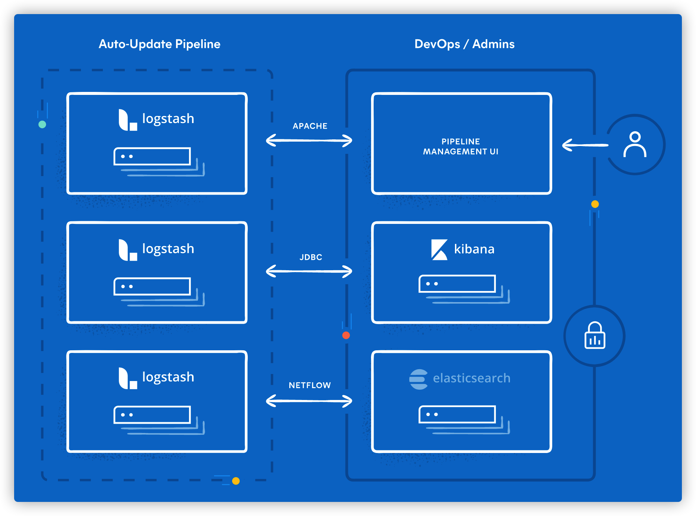
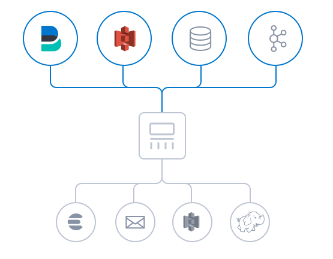
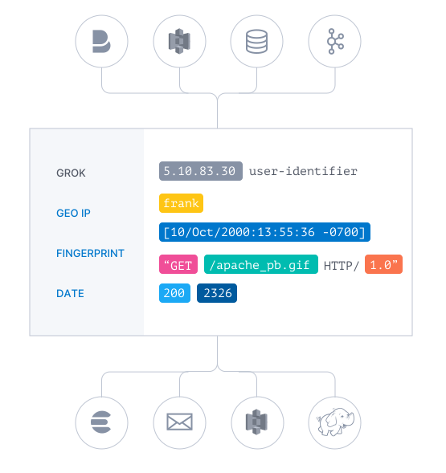
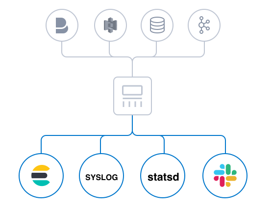
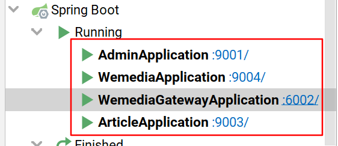
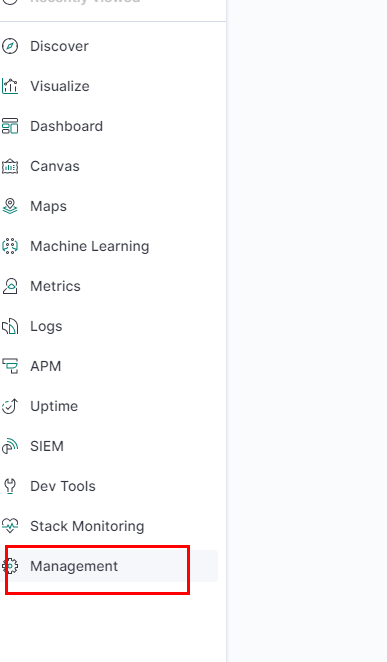
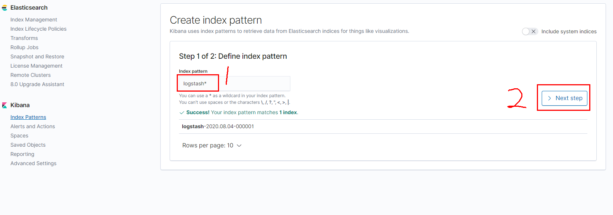
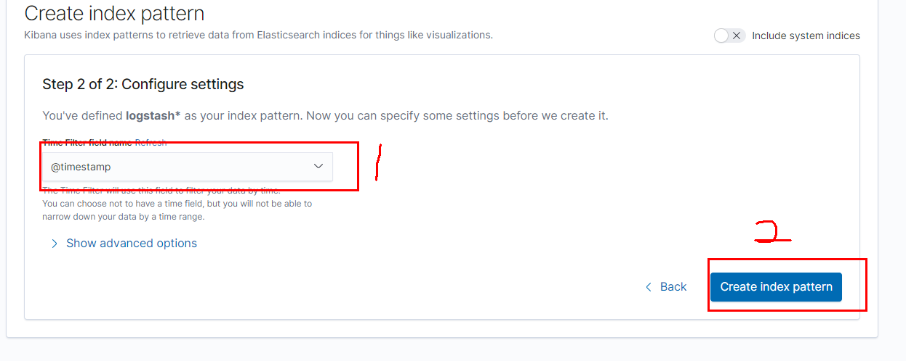

# 分布式日志解决方案之-ELK

日志可以协助我们的调试和开发。在开发中尽量使用日志的方式来调试，是我们推荐的做法。尽量避免使用 System.out.println. 因为很多时候我们调试完毕都要进行删除调试代码。留下会给程序增加运行时间。而日志可以很方便的控制级别就可以控制是否输入，而支持存储的形态很多。比如数据库，文件等。所以日志是我们开发中必不可少的一环。


**logback:**   debug -> info -> warn ->  error 日志

​					info             error

​         info:    重要方法的 入口:   打印info：  （   当前执行的方法    入参 ）  

​                     重要流程执行完毕:   打印info:    kafka发完消息  打印info记录环节    admin:   在每个审核环节打印日志

​                     捕获异常处  打印error: 打印出错信息  出错的原因   出错时相关参数


但微服务是分布式的，服务会非常多，如果每个微服务都把日志输出到各自的日志文件中，对应开发人员排查日志 简直是一场灾难。 那么如何解决分布式日志管理的问题呢?  比较常见的方案 **ELK**

**日志级别的优先级**

 debug > info >  warn > error

**传统日志方案**


**ELK分布式日志方案**


## 1 Elastic技术栈-ELK

ELK：包括 Elasticsearch、Kibana、Beats 和 Logstash（也称为 [ELK Stack](https://www.elastic.co/cn/elk-stack)）。能够安全可靠地获取任何来源、任何格式的数据，然后实时地对数据进行搜索、分析和可视化。

Logstash 主要是用来日志的搜集、分析、过滤日志的工具，支持大量的数据获取方式。一般工作方式为c/s架构，client端安装在需要收集日志的主机上，server端负责将收到的各节点日志进行过滤、修改等操作在一并发往elasticsearch上去。



## 2 Logstash简介

[Logstash](https://www.elastic.co/cn/logstash) 能够动态地采集、转换和传输数据，不受格式或复杂度的影响。利用 Grok 从非结构化数据中派生出结构，从 IP 地址解码出地理坐标，匿名化或排除敏感字段，并简化整体处理过程。

三个特点：

* 输入

  ​		数据往往以各种各样的形式，或分散或集中地存在于很多系统中。Logstash 支持[各种输入选择](https://www.elastic.co/guide/en/logstash/current/input-plugins.html)，可以同时从众多常用来源捕捉事件。能够以连续的流式传输方式，轻松地从您的日志、指标、Web 应用、数据存储以及各种 AWS 服务采集数据。

  

* 过滤器

  ​		数据从源传输到存储库的过程中，Logstash 过滤器能够解析各个事件，识别已命名的字段以构建结构，并将它们转换成通用格式，以便进行更强大的分析和实现商业价值。

  

  Logstash 能够动态地转换和解析数据，不受格式或复杂度的影响：

  - 利用 Grok 从非结构化数据中派生出结构
  - 从 IP 地址破译出地理坐标
  - 将 PII 数据匿名化，完全排除敏感字段
  - 简化整体处理，不受数据源、格式或架构的影响

* 输出

  ​		尽管 Elasticsearch 是我们的首选输出方向，能够为我们的搜索和分析带来无限可能，但它并非唯一选择。

  Logstash 提供[众多输出选择](https://www.elastic.co/guide/en/logstash/current/output-plugins.html)，您可以将数据发送到您要指定的地方，并且能够灵活地解锁众多下游用例。

  

## 2 Logstash应用场景

* 数据采集清洗
* 大数据日志处理
* 数据近实时同步


## 3 Logstash 安装

官方下载地址：https://www.elastic.co/cn/downloads/logstash


1. 下载Logstash官方软件 7.4.2

   历史版本：https://www.elastic.co/cn/downloads/past-releases

   

2. 基于docker安装

```
docker run -id --name logstash -p 5044:5044 logstash:7.4.2
```

3. 进入logstash修改输入输出配置

```
# 进入logstash容器
docker exec -it logstash bash


# 修改输入输出 管道配置
vi pipeline/logstash.conf


# 输入下面配置  说明: 5044接口接收json数据 输出到es中
input {    
    tcp {         
        port => 5044         
        codec => json_lines             
    } 
} 
output{  
    elasticsearch { 
    	hosts => ["192.168.200.130:9200"] 
    } 
}

# 保存  并重启logstash容器  logstash默认占用1g内容，可以进入config/jvm.properties修改对应大小
```

## 4 微服务改造

`heima-leadnews-services`中引入logback整合logstash依赖

```xml
<dependency>
    <groupId>net.logstash.logback</groupId>
    <artifactId>logstash-logback-encoder</artifactId>
    <version>5.2</version>
</dependency>
```


需要记录分布式日志的微服务 引入logback配置   

`logback.xml`

```xml
<?xml version="1.0" encoding="UTF-8"?>
<!--该日志将日志级别不同的log信息保存到不同的文件中 -->
<configuration>
    <include resource="org/springframework/boot/logging/logback/defaults.xml" />
    <springProperty scope="context" name="springAppName"
                    source="spring.application.name" />
    <!-- 日志在工程中的输出位置 -->
    <property name="LOG_FILE" value="${BUILD_FOLDER:-build}/${springAppName}" />
    <!-- 控制台的日志输出样式 -->
    <property name="CONSOLE_LOG_PATTERN"
              value="%clr(%d{yyyy-MM-dd HH:mm:ss.SSS}){faint} %clr(${LOG_LEVEL_PATTERN:-%5p}) %clr(${PID:- }){magenta} %clr(---){faint} %clr([%15.15t]){faint} %m%n${LOG_EXCEPTION_CONVERSION_WORD:-%wEx}}" />
    <!-- 控制台输出 -->
    <appender name="console" class="ch.qos.logback.core.ConsoleAppender">
        <filter class="ch.qos.logback.classic.filter.ThresholdFilter">
            <level>INFO</level>
        </filter>
        <!-- 日志输出编码 -->
        <encoder>
            <pattern>${CONSOLE_LOG_PATTERN}</pattern>
            <charset>utf8</charset>
        </encoder>
    </appender>
    <!-- 为logstash输出的JSON格式的Appender -->
    <appender name="logstash"
              class="net.logstash.logback.appender.LogstashTcpSocketAppender">
        <destination>192.168.12.128:5044</destination>
        <!-- 日志输出编码 -->
        <encoder
                class="net.logstash.logback.encoder.LoggingEventCompositeJsonEncoder">
            <providers>
                <timestamp>
                    <timeZone>UTC</timeZone>
                </timestamp>
                <pattern>
                    <pattern>
                        {
                        "level": "%level",
                        "service": "${springAppName:-}",
                        "trace": "%X{X-B3-TraceId:-}",
                        "span": "%X{X-B3-SpanId:-}",
                        "exportable": "%X{X-Span-Export:-}",
                        "pid": "${PID:-}",
                        "thread": "%thread",
                        "class": "%logger{40}",
                        "message": "%message"
                        }
                    </pattern>
                </pattern>
            </providers>
        </encoder>
    </appender>
    <!-- 日志输出级别 -->
    <root level="INFO">
        <appender-ref ref="console" />
        <appender-ref ref="logstash" />
    </root>
</configuration>

```


可以通过  **发表文章 + 自动审核功能** 来演示分布式日志




## 5 Kibana查看日志

点击Management



创建索引匹配格式:  2填写*即可 


设置匹配格式logstatsh*



1下拉框选择@timestamp 以时间戳排序



创建后 在发现中心查看日志


```
1. 是需要显示的字段2. 是可选过滤字段3. 日志的显示区域
```


在启动另一个微服务 查看日志情况吧


