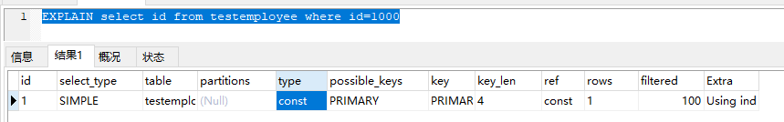
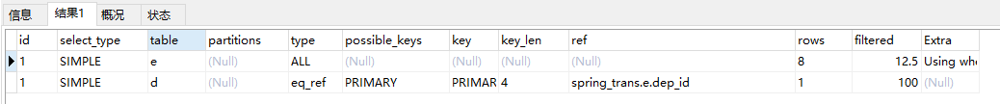

# 学习目标

### 能够描述索引相关面试题

### 能够描述Sql优化的方案


## 1 概述

```
在应用开发的过程中，由于前期数据量少，开发人员编写的SQL语句或者数据库整体解决方案都更重视在功能上的实现， 但是当应用系统正式上线后，随着生成数据量的急剧增长，很多SQL语句和数据库整体方案开始逐渐显露出了性 能问题，对生成的影响也越来越大，此时Mysql数据库的性能问题成为系统应用的瓶颈，因此需要进行Mysql数据库的性能优化。
```

#### 1.1 性能下降的表现

```
执行时间长
等待时间长
```

#### 1.2 性能下降的原因

```
查询语句写的不好，各种连接，各种子查询导致用不上索引或者没有建立索引
建立的索引失效，建立了索引,在真正执行时,没有用上建立的索引
关联查询太多join
服务器调优及配置参数导致，如果设置的不合理,比例不恰当,也会导致性能下降,sql变慢 
系统架构的问题
```

#### 1.3 通用的优化方案


```
索引优化: 添加适当索引(index）(重点)
Sql优化: 写出高质量的sql，避免索引失效 (重点)
设计优化: 表的设计合理化(符合3NF，有时候要进行反三范式操作) 
配置优化: 对mysql配置优化 [配置最大并发数my.ini, 调整缓存大小 ]
架构优化：读写分离、分库分表
硬件优化: 服务器的硬件优化
```
## 2.索引原理

### 2.1 概念

索引是解决SQL性能问题的重要手段之一，使用索引可以帮助用户解决大多数的SQL性能问题。**索引就是数据结构，通过这种数据结构可以大大提高mysql的查询效率**

**磁盘存取示意图**

每次从磁盘中查找数据称为磁盘I/O， 而磁盘IO 至少要经历磁盘寻道、磁盘旋转、数据读取等等操作，非常影响性能，所以对于读取数据，最大的优化就是减少磁盘I/O


### 2.2 索引的底层实现

**MySql底层的数据结构主要是基于Hash 和 B+Tree**

#### 2.2.1 底层数据结构分析

##### 2.2.1.1 二叉树


为了加快数据的查找,可以维护**二叉查找树**,  每个节点分别包含索引键值和一个指向对应数据记录的物理地址的指针,这样就可以运用二叉查找在一定的复杂度内获取相应的数据,从而快速的检索出符合条件 的记录

```
左子树的键值小于根的键值

右子树的键值大于根的键值
```

从二叉树的查找过程了来看，最坏的情况下磁盘IO的次数由树的高度来决定。从前面分析情况来看，减少磁盘IO的次数就必须要压缩树的高度，让瘦高的树尽量变成矮胖的树，所以引出B-Tree强势登场

##### 2.2.1.2 BTree 

```
自平衡多叉查找树
度(Degree) 节点的数据存储个数
叶节点具有相同的深度
节点中数据key从左到右递增排列
叶节点的指针为空
在节点中直接存储了数据 data
```


```
疑问：
二叉树的节点只存了一个数据? 而BTree的节点因为有度的概念存了多个数据？
那么二叉树的节点数据量小是不是在读取的时候效率更高呢？
而且读到内存中的遍历速度是不是更快些呢?

预读：磁盘一般会顺序向后读取一定长度的数据(页的整数倍)放入内存
局部性原理：当一个数据被用到时，其附近的数据也通常会马上被使用

存储器读取数据按 磁盘块读取 

每个磁盘块的大小为  扇区（页）的2的N次方
每个扇区的最小单位 512B 或 4096B 不同的生产厂家不同

为了提升度的长度，还需要对这种数据结构进行优化，所以它的升华版B+Tree诞生了
```

##### 2.2.1.3 B+Tree

B+树是B树的变体,基本与BTree相同

**特点**

```
非叶子节点不存储data,只存储key,可以增大度
叶子节点不存储指针
顺序访问指针，提高区间访问能力
```


B+Tree**索引的性能分析**

```
一般使用磁盘I/O次数评价索引结构的优劣

B+Tree的度一般会超过100，因此h非常小 (一般为3到5之间)，性能就会非常稳定
B+Tree叶子节点有顺序指针，更容易做范围查询
```

##### 2.2.1.4 Hash

使用hash结构存储索引，查找单行数据很快，但缺点也很明显。


```
1.无法用于排序
2.只支持等值查找
3.存在Hash冲突

Hash索引只适用于某些特定场景，我们使用不多
```

#### 2.2.2 mysql的索引实现

##### 2.2.2.1 存储引擎的概念

```
mysql的索引对于不同的存储引擎(Engine) ,索引实现各不相同

MySQL中的数据用各种不同的技术存储在文件(或者内存)中。
这些技术中的每一种技术都使用不同的存储机制、索引技巧、锁定水平并且最终提供广泛的不同的功能和能力。
通过选择不同的技术，你能够获得额外的速度或者功能，从而改善你的应用的整体功能。
这些不同的技术以及配套的相关功能在 MySQL中被称作存储引擎

通过 show engines 可以查看当前数据库支持的引擎、默认的引擎
查看当前数据库的默认引擎
show VARIABLES like 'default_storage_engine'
如：
如果你在研究大量的临时数据，你也许需要使用内存存储引擎。内存存储引擎能够在内存中存储所有的表格数据。
也许需要一个支持事务处理的数据库(以确保事务处理不成功时数据的回退能力) 选择支持事务的存储引擎

5.7 默认的引擎是innodb   可通过 SET default_storage_engine=< 存储引擎名 >更改
面试时经常被问到的两个引擎：
MyISAM 和 innoDB引擎  这两种引擎都是采用B+Tree和hash 数据结构实现的索引
```

##### 2.2.2.2 MyISAM 和 innoDB的对比

|          |   MyISAM   | innoDB         |
| -------- | :--------: | -------------- |
| 事务     |   不支持   | 支持           |
| 外键     |   不支持   | 支持           |
| 锁       |    表锁    | 行锁           |
| 缓存     |  缓存索引  | 缓存索引和数据 |
| 索引实现 | 非聚簇索引 | 聚簇索引       |

```
总的来说：
 	需要事务： 那肯定用innoDB
 	不需要事务：
 		myisam的查询效率高，内存要求低， 但因为采用表锁， 不适合并发写操作， 读多写少选它
 		innoDB采用行锁，适合处理并发写操作， 写多读少选它
```

##### 2.2.2.3 索引实现

```
索引特点：  非聚簇索引
	采用B+Tree 作为数据结构
	MyISAM 索引文件和数据文件是分离的(非聚簇)  
	叶子节点存储的是数据的磁盘地址
	非主键索引和主键索引类似
```


##### 2.2.2.4 InnoDB索引实现

```
索引特点：
	采用B+Tree 作为数据结构
	数据文件本身就是索引文件  (聚簇索引)
	表数据文件本身就是按照B+Tree组织的一个索引结构文件
	聚集索引-叶节点包含了完整的数据记录
	非主键索引 的叶子节点指向主键
	
```


### 2.3 索引的分类

```
1.普通索引index :加速查找
  create index idx_  on 表(字段)
 
2.唯一索引: 
	主键索引：primary key ：加速查找+约束（不为空且唯一）
	唯一索引：unique：加速查找+约束 （唯一）
	
3.联合索引（组合索引）
    create index a,b,c   最左原则
	最左匹配原则
	where A=? and B=? and C=?
     create index  A  on 表(A,B,C)
	-primary key(id,name):联合主键索引
	-unique(id,name):联合唯一索引
	-index(id,name):联合普通索引
	
4.全文索引fulltext :用于搜索很长一篇文章的时候，效果最好。 
```

### 2.4 索引的操作

**创建索引**

```
create [UNIQUE|primary|fulltext] index 索引名称 ON 表名(字段(长度))
```

```mysql
CREATE INDEX emp_name_index ON employee(NAME);
```

**测试脚本**

```
资料中  testemployee.sql文件
```

**没有使用索引查询的时间如下**：

```mysql
select cus_id from testemployee where cus_id=5   # 时间: 0.311ms
```

**创建索引后查询的时间如下**：

```mysql
-- 为num创建一个索引
create index idx_cusid on testemployee(cusid)
-- 再次查询耗时
select cus_id from testemployee where cus_id=5 # 时间: 0.041ms
```

**查看索引**

```mysql
show index from 表名
```

**删除索引**

```mysql
drop index[索引名称] on 表名
DROP INDEX emp_name_index ON employee;
```

**更改索引**

```mysql
alter table tab_name add primary key(column_list)
-- 添加一个主键,索引必须是唯一索引,不能为NULL
alter table tab_name add unque index_name(column_list)
-- 创建的索引是唯一索引,可以为NULL
alter table tab_name add index index_name(column_list)
-- 普通索引,索引值可出现多次
alter table tab_name add fulltext index_name(column_list)
-- 全文索引
```

### 2.5 联合索引  (最左匹配原则)

```
联合索引：
当我们的where条件中 经常存在多个条件查询的时候，我们可以为这多个列创建组合索引
a,b,c

如：一张员工表，我们经常会用 工号、名称、入职日期 作为条件查询
select * from 员工表 where 工号=10002 and 名称=Staff and 入职日期='2001-09-03'

那么我们可以考虑 将(工号、名称、入职日期)创建为一个组合索引

疑问: 那为什么我们不把 这三个字段都单独列一个索引呢？
答： 主要是效率问题，对工号、名称、入职日期三列分别创建索引，MySQL只会选择辨识度高的一列作为索引。假设有100w的数据，一个索引筛选出10%的数据，那么可以筛选出10w的数据；

对于组合索引而言： 如果将(工号、名称、入职日期)创建为一个组合索引，那么三个字段的筛选将都会使用上，
先按工号排查、工号匹配完在按名称筛选、名称筛选完再按日期筛选，那么筛选的数据就是 100w*10%*10%*10%筛选出1000条数据。


最左原则：
	（工号、名称、入职日期) 作为一个组合索引，将会生成下图的索引目录结构。
	
	由接口可以看出，  工号是最先需要判断的字段，所以工号这个查询条件必须存在
	
	工号判断完，才会判断名称
	
	名称判断完才会判断入职日期

也就是说，组合索引查询条件必须得带有最左边的列：
	对于我们的索引：
	条件为： （工号）   （工号，名称）   （工号，名称，入职日期） 这几种情况都是生效的
	条件为： （名称）不生效    （名称，入职日期）不生效  （工号，入职日期）部分生效
```


### 2.6 索引的优劣势

#### 2.6.1 优势

```
1.可以通过建立唯一索引或者主键索引,保证数据库表中每一行数据的唯一性.

2.建立索引可以大大提高检索的数据,以及减少表的检索行数

3.在表连接的连接条件 可以加速表与表直接的相连
employee dep_id   deparment 
4.在分组和排序字句进行数据检索,可以减少查询时间中 分组 和 排序时所消耗的时间(数据库的记录会重新排序)

5.建立索引,在查询中使用索引 可以提高性能
```

#### 2.6.2 劣势

```
1.索引文件会占用物理空间,除了数据表需要占用物理空间之外,每一个索引还会占用一定的物理空间

2.在创建索引和维护索引 会耗费时间,随着数据量的增加而增加


3.当对表的数据进行INSERT,UPDATE,DELETE 的时候,索引也要动态的维护,这样就会降低数据的维护速度 
```

### 2.7 索引字段的选择  5

**适合建立索引**

```
	1.主键自动建立唯一索引:primary 
             id 
	2.频繁作为查询条件的字段应该创建索引 
	  
	  where name =   
	  
	3.查询中与其它表关联的字段,外键关系建立索引
       
       employ dep_id      dep id
       
	4.查询中排序的字段,排序的字段若通过索引去访问将大大提升排序速度	 
		order by 字段
		
	5.查询中统计或分组的字段
		group by 字段
```

**不适合建立索引**

```
	1.记录比较少  
	没必要加索引
	
	2.where条件里用不到的字段不建立索引	
		
	3.经常增删改的表
		索引提高了查询的速度，同时却会降低更新表的速度,因为建立索引后, 如果对表进行INSERT,UPDATE 和	DELETE, MYSQL不仅要保存数据,还要保存一下索引文件
		
	4.数据重复的表字段
		性别: 男  女   1000 0000
			
		如果某个数据列包含了许多重复的内容,为它建立索引  就没有太大在的实际效果，比如表中的某一个字段为国籍,性别，数据的差异率不高,这种建立索引就没有太多意义。
    5. 字段特别大不适合(text  blob varcher)  
       
```

**面试思考:**

```
什么是索引？ 

索引为什么能够提升查询效率？

mysql的索引是基于什么数据结构实现的？

为什么选择这种数据结构? B+Tree  二叉树  BTree B+Tree

mysql有哪些存储引擎 
事务
锁
索引实现

聚簇索引和非聚簇索引有什么区别
聚簇索引: 
一个文件   主键索引叶子节点存具体数据   
         非主键索引叶子节点存主键的值（回表） 
  
非聚簇索引: 索引和数据分开存储   主键索引叶子节点存磁盘地址   非主键索引也是磁盘地址


索引的分类 

索引的优劣 


索引的选择

5个索引

组合索引的最左原则

-- 建立复合索引(a,b,c),请说出下列条件关于索引的使用情况
select * from table where a=4 
a
select * from table where a=4 and b=6
ab
select * from table where a=4 and c=5 and b=6 
abc
select * from table where b=4 or b=5
失效
select * from table where a=4 and c=6
a
select * from table where a=4 and c=6 and b>5
a b 
select * from table where a=4 and b like '%test' and c=6
a
```

## 3.sql性能优化 

### 3.1 性能分析

#### 3.1.1 慢查询日志

```
mysql的慢查询日志是mysql提供的一种日志记录，它用来记录在mysql中响应时间超过阀值的语句,mysql 的日志是跟踪mysql性能瓶颈的最快和最直接的方式了，系统性能出现瓶颈的时候，首先要打开慢查询日志，进行跟踪，尽快的分析和排查出执行效率较慢的SQL ,及时解决避免造成不好的影响。
**作用**： 记录具体执行效率较低的SQL语句的日志信息。


注意：
在默认情况下mysql的慢查询日志记录是关闭的。
同时慢查询日志默认不记录管理语句和不使用索引进行查询的语句
```

**查看是否开启慢查询日志**

```mysql
show variables like '%slow_query_log%'
开启
set global slow_query_log=1;
只对当前数据库生效,如果重启后，则会失效

如果想永久生效，必须修改配置文件
slow_query_log=1
slow_query_log_file=地址
```

**设置慢查询的阀值**

```mysql
show variables like 'long_query_time'
set global long_query_time=4;
```

**要断开连接后, 才能生效**

```mysql
show global variables like 'long_query_time';
select sleep(4)
show global status like '%slow_queries%';
```

**慢查询日志分析**

```
主要功能是, 统计不同慢sql的
出现次数(Count), 
执行最长时间(Time), 
累计总耗费时间(Time), 
等待锁的时间(Lock), 
发送给客户端的行总数(Rows), 
扫描的行总数(Rows), 
用户以及sql语句本身(抽象了一下格式, 比如 limit 1, 20 用 limit N,N 表示).
```

**第三方的慢查询日志分析工具：mysqlsla，myprofi，pt-query-diges等等**


#### 3.1.2 Explain (执行计划)

##### 3.1.2.1 概念及作用

```
使用explain关键字,可以模拟优化器执行的SQL语句
从而知道MYSQL是如何处理sql语句的
通过Explain可以分析查询语句或表结构的性能瓶颈

具体作用：
	查看表的读取顺序
	数据读取操作的操作类型
	查看哪些索引可以使用
	查看哪些索引被实际使用
	查看表之间的引用
	查看每张表有多少行被优化器执行
```

##### 3.1.2.2 使用方法

```mysql
使用Explain关键字 放到sql语句前

explain select cus_id from testemployee where cus_id > 10
```


##### 3.1.2.3 参数详解

**id**（重要）

```
 select查询的序列号，包含一组数字,表示查询中执行select子句或操作表的顺序	
 值分为三种情况

**id值相同**
	执行顺序由上到下

**id不同**
	如果是子查询,id的序号会递增,id值越大优先级越高,优先被执行

**id相同不同,同时存在**
	可以认为是一组,从上往下顺序执行
	在所有组中,id值越大,优先级越高,越先执行	
```

```mysql
-- id值相同
EXPLAIN SELECT * from employee e,department d,customer c where e.dep_id = d.id and e.cus_id = c.id;

```


```mysql
-- id值不同	
EXPLAIN SELECT * from department WHERE id = (SELECT id from employee WHERE id=(SELECT id from customer WHERE id = 1))
```


```mysql
-- id值相同 不同都存在 deriverd 衍生出来的虚表
EXPLAIN select * from department d, (select * from employee group by dep_id) t where d.id = t.dep_id;
```


**select_type** 		

	查询类型,主要用于区别普通查询,联合查询,子查询等复杂查询
	结果值
		SIMPLE
				简单select查询,查询中不包含子查询或者UNION
		PRIMARY
				查询中若包含任何复杂的子查询,最外层查询则被标记为primary
		SUBQUERY
				在select或where中包含了子查询
		DERIVED
				在from列表中包含的子查询被标记为derived(衍生)把结果放在临时表当		UNION
				若第二个select出现的union之后,则被标记为union
				若union包含在from子句的子查询中,外层select将被标记为deriver
		UNION RESULT
				从union表获取结果select,两个UNION合并的结果集在最后


```mysql
-- union 和 union result 示例
EXPLAIN select * from employee e LEFT JOIN department d on e.dep_id = d.id
UNION 
select * from employee e RIGHT JOIN department D ON e.dep_id = d.id
```


**table**

```
显示这一行的数据是关于哪张表的
```

**partitions **

```\
如果查询是基于分区表的话, 会显示查询访问的分区
```

**type**     (重要)

```
 访问类型排列	
 
结果值:(最好到最差) system > const > eq_ref > ref > range > index > ALL
		
```

```mysql
-- system 表中有一行记录(系统表)  这是const类型的特例,平时不会出现
explain select HOST from mysql.db where HOST='localhost'
```


```mysql
-- const  表示通过索引一次就找到了，const用于比较primary 或者 unique索引.   直接查询主键或者唯一索引，因为只匹配一行数据,所以很快
EXPLAIN select id from employee where id=1
```



```mysql
-- eq_ref 唯一性索引扫描 对于每个索引键,表中只有一条记录与之匹配, 常见于主键或唯一索引扫描
EXPLAIN select * from employee e,department d where e.id=d.id
```


```mysql
-- ref 非唯一性索引扫描,返回匹配某个单独值的所有行,本质上也是一种索引访问,它返回所有匹配某个单独值的行可能会找到多个符合条件的行,所以它应该属于查找和扫描的混合体
EXPLAIN select e.id,e.dep_id,d.id from employee e,department d where e.dep_id = d.id
```


```mysql
-- range 只检索给定范围的行,使用一个索引来选择行 一般就是在你的where语句中出现between\<\>\ in等查询,这种范围扫描索引比全表扫描要好,因为它只需要开始于索引的某一点.而结束语另一点,不用扫描全部索引
explain select * from employee where id>2
```


```mysql
-- index index与All区别为index类型只遍历索引树,通常比All要快,因为索引文件通常比数据文件要小all和index都是读全表,但index是从索引中读取,all是从硬盘当中读取
explain select id from employee
```


```mysql
-- ALL 将全表进行扫描,从硬盘当中读取数据,如果出现了All 切数据量非常大, 一定要去做优化
explain select * from employee
```


```
要求:
	一般来说,保证查询至少达到range级别
	最好能达到ref
```

**possible_keys**

```
显示可能应用在这张表中的索引,一个或者多个
查询涉及到的字段上若存在索引,则该索引将被列出,但不一定被查询实际使用
可能自己创建了4个索引,在执行的时候,可能根据内部的自动判断,只使用了3个
```

```mysql
--  可能不会用到索引，实际用到索引
explain select dep_id from employee
```


```mysql
-- 可能会使用索引，实际没用到索引
EXPLAIN select * from employee e,department d where e.dep_id = d.id
```


**key** （重要）

```
实际使用的索引,如果为NULL,则没有使用索引,查询中若使用了覆盖索引 ,则该索引仅出现在key列表

possible_keys与key关系,理论应该用到哪些索引  实际用到了哪些索引
覆盖索引 查询的字段和建立的字段刚好吻合,这种我们称为覆盖索引
```

**key_len**

```mysql
-- 表示索引中使用的字节数,可通过该列计算查询中使用的索引长度 .
explain select * from employee where dep_id=1 and name='鲁班' and age=10
```


**ref**

```
索引是否被引入到, 到底引用到了哪几个索引
```

```mysql
Explain select * from employee e,department d where e.dep_id = d.id and e.cus_id = 1
```


```mysql
Explain select e.dep_id from employee e,department d,customer c where e.dep_id = d.id and e.cus_id = c.id and e.name='鲁班'
```


**rows**

```
根据表统计信息及索引选用情况,大致估算出找到所需的记录所需要读取的行数,每长表有多少行被优化器查询过
```

**filtered**

```mysql
-- 满足查询的记录数量的比例，注意是百分比，不是具体记录数 . 值越大越好，filtered列的值依赖统计信息，并不十分准确
Explain select e.dep_id from employee e,department d where e.dep_id = d.id
```

**Extra**  （重要）

```
注意：
语句中出现了Using Filesort 和 Using Temporary说明没有使用到索引
	 出现 impossible where说明条件永远不成立
```

**产生的值:**

```mysql
	/* 
	Using filesort (需要优化)
		说明mysql会对数据使用一个外部的索引排序,
		而不是按照表内的索引顺序进行
		Mysql中无法利用索引完成排序操作称为"文件排序"
	*/	
	explain select * from employee where dep_id =1 ORDER BY cus_id
```


```mysql
	/* 
	Using temporary (需要优化)
		使用了临时表保存中间结果,Mysql在对查询结果排序时, 使用了临时表,
		常见于排序orderby 和分组查询group by
	*/
	explain select name from employee where dep_id in (1,2,3) GROUP BY cus_id
```


```mysql
	/*
	impossible where (需要优化)
		where 子句的值总是false 不能用来获取任何元组
	*/	
	explain select name from employee where name='鲁班' and name='zs'
```

		use index
			表示相应的select中使用了覆盖索引,避免访问了表的数据行, 效率很好
			如果同时出现using where  表明索引被用来执行索引键值的查找
			如果没有同时出现using where 表明索引 用来读取数据而非执行查找动作
			示例
		using where
			表明使用了where过滤
		using join buffer
			使用了连接缓存

### 3.2 优化实战


#### 3.2.1 避免索引失效

- 最左匹配原则
- 范围查询右边的索引失效
- 在索引字段做任何操作会索引失效
- 字符串没加引号会索引失效
- is not null 
- != > <
- like查询会导致索引失效，如果在后面不会，在两边或前边会
- 使用or连接会索引失效
- 尽量使用覆盖索引

```
-- 最左匹配原则 * 
-- 范围条件右边的索引失效
-- 不再索引列上做任何操作 * 
-- 使用不等于(!=或者<>)索引失效
-- is not null无法使用索引
-- like以通配符开头(%qw)索引失效 * 
-- 字符串不加引号索引失效
-- 使用or连接索引失效
-- 尽量使用覆盖索引
```

##### 3.2.1.1 全值匹配

```mysql
-- 创建组合索引
create index idx_name_dep_age on employee(name,dep_id,age)
-- 索引字段全部使用上
explain select * from employee where name='鲁班' and dep_id=1 and age=10
```

##### 3.2.1.2 最左匹配原则

```mysql
-- 去掉name条件 索引全部失效
explain select * from employee where dep_id=1 and age=10
```

```mysql
-- 去掉dep_id   name索引生效
explain select * from employee where name='鲁班' and age=10
```

```mysql
-- 顺序错乱不会影响最左匹配
explain select * from employee where dep_id=1 and  age=10 and name='鲁班' 
```

##### 3.2.1.3 不再索引列上做任何操作

```mysql
-- 在name字段上 加上去除空格的函数 索引失效
explain select * from employee where TRIM(name)='鲁班' and dep_id=1 and age=10
```

##### 3.2.1.4 范围条件右边的索引失效

```mysql
-- 范围查找 会造成该组合索引字段的右侧索引全部失效
explain select * from employee where  name = '鲁班' and dep_id>1 and age=10 
```

##### 3.2.1.5 mysql在使用不等于(!=或者<>)索引失效

```mysql
explain select * from employee where age != 10
```

##### 3.2.1.6 is not null无法使用索引

```mysql
explain select * from employee where name is not NULL
```

##### 3.2.1.7 like以通配符开头(%qw)索引失效

```mysql
explain select * from employee where name like '%鲁'
```

##### 3.2.1.8 字符串不加引号索引失效

```mysql
explain select * from employee where name = 200
```

##### 3.2.1.9 使用or连接索引失效

```mysql
explain select * from employee where name = '鲁班' or age>10
```

##### 3.2.1.10 尽量使用覆盖索引

```mysql
explain select * from employee where name = '鲁班' or age>10
-- 覆盖索引: 要查询的字段全部是索引字段
-- 上面情况会触发全表扫描，不过若使用了覆盖索引，则会只扫描索引文件
explain select name,dep_id,age from employee where name = '鲁班' or age>10
```

#### 3.2.2 排序与分组优化     

##### 3.2.2.1 使用order by出现Using filesort

```
-- 如果select * 语句未使用到索引，会出现 filesort 可使用覆盖索引解决 或 主键索引
-- 组合索引不满足最左原则 会出现 filesort
-- 组合索引顺序不一致(order by的后面) 会出现 filesort
-- 当索引出现范围查找时 可能会出现 filesort
-- 排序使用一升一降会造成filesort
```

```mysql
-- 没有使用索引排序，服务器需要额外的为数据进行排序的处理
-- 如果select语句未使用到索引，会出现 filesort
explain select * from employee  order by name,dep_id,age
-- 组合索引不满足最左原则 会出现 filesort
explain select * from employee where name='鲁班' order by dep_id,age
explain select * from employee  order by dep_id,age  
-- 组合索引顺序不一致(order by的后面) 会出现 filesort
explain select * from employee where name='鲁班' order by dep_id,age 
explain select * from employee where name='鲁班' order by age,dep_id
-- 当索引出现范围查找时 可能会出现 filesort
explain select * from employee where name='鲁班' and dep_id>1 order by age 
-- 排序使用一升一降会造成filesort
explain select * from employee where name='鲁班' order by dep_id desc,age

```

##### 3.2.2.2 使用group by出现Using temporary

```
-- 同order by情况类似， 分组必定触发排序
-- 组合索引不满足最左原则 会出现 filesort
-- 组合索引顺序不一致(order by的后面) 会出现 filesort
-- 当索引出现范围查找时 可能会出现 filesort
```


##### 3.2.2.3 面试题

```mysql
-- 建立复合索引(a,b,c),请说出下列条件关于索引的使用情况
select * from table where a=4 

select * from table where a=4 and b=6

select * from table where a=4 and c=5 and b=6 

select * from table where b=4 or b=5

select * from table where a=4 and c=6

select * from table where a=4  and c=6 and b>5

select * from table where a=4 and b like '%test' and c=6
 
```

#### 3.2.3 大数据量分页优化

```
-- 分页是我们经常使用的功能，在数据量少时单纯的使用limit m,n 不会感觉到性能的影响
-- 但我们的数据达到成百上千万时 ， 就会明显查询速度越来越低
```

```mysql
-- 使用存储过程导入数据
-- 查看是否开启函数功能
show variables like 'log_bin_trust_function_creators';
-- 设置开启函数功能
set global log_bin_trust_function_creators=1;
-- 创建函数用于生成随机字符串
delimiter $$
 create function rand_string(n int) returns varchar(255)
 begin
   declare chars_str varchar(100) default 'qwertyuiopasdfghjklzxcvbnm';
   declare return_str varchar(255) default '';
   declare i int default 0;
   while i<n do
   set return_str=concat(return_str,substring(chars_str,floor(1+rand()*52),1));
   set i=i+1;
   end while;
   return return_str;
 end $$
-- 创建存储过程用于插入数据
delimiter $$
create procedure insert_emp(in start int(10),in max_num int(10))
begin
 declare i int default 0;
 /*把autocommit设置成0*/
 set autocommit= 0;
 repeat
 set i=i+1;
 insert into testemployee(name,dep_id,age,salary,cus_id)
 values(rand_string(6),'2',24,3000,6);
 until i=max_num end repeat;
commit;
end $$

-- 调用存储过程插入100万条数据
call insert_emp(1,1000000);

```

```mysql
-- 测试一下分页数据的相应时间
-- limit 0,20 时间: 0.001ms
select * from testemployee limit 0,20
-- limit 10000,20 时间: 0.004ms
select * from testemployee limit 10000,20
-- limit 100000,20 时间: 0.044ms
select * from testemployee limit 100000,20
-- limit 1000000,20 时间:  0.370ms
select id from testemployee order by age limit 1000000,20
-- limit 3000000,20 时间: 1.068ms
select * from testemployee t1,(select id from testemployee order by age limit 3000000,20) t2 where t1.id = t2.id
```

##### **子查询优化**

```mysql
-- 子查询优化
-- 通过Explain发现，之前我们没有利用到索引，这次我们利用索引查询出对应的所有ID
-- 在通过关联查询，查询出对应的全部数据，性能有了明显提升
-- limit 3000000,20 时间: 1.068ms -> 时间: 0.742ms
select * from testemployee e,(select id from testemployee limit 3000000,20) tmp where e.id=tmp.id
-- 自增ID也可以用如下方式
select * from testemployee where id> (select id from testemployee t limit 3000000,1) LIMIT 10
```

##### **使用id限定方案**

```mysql
-- 使用id限定方案，将上一页的ID传递过来 根据id范围进行分页查询
-- 通过程序的设计，持续保留上一页的ID，并且ID保证自增
-- 时间: 0.010ms   
select * from testemployee where id>3000109 limit 20
-- 虽然使用条件有些苛刻 但效率非常高，可以和方案一组合使用 ，跳转某页使用方案一 下一页使用方案2
```

#### 3.2.4 小表驱动大表

##### 3.2.4.1 表关联查询

```mysql
explain select e.id from employee e,department d where e.dep_id=d.id 
MySQL 表关联的算法是 Nest Loop Join，是通过驱动表的结果集作为循环基础数据，
然后一条一条地通过该结果集中的数据作为过滤条件到下一个表中查询数据，然后合并结果。
如果小的循环在外层，对于数据库连接来说就只连接5次，进行5000次操作，
如果1000在外，则需要进行1000次数据库连接，从而浪费资源，增加消耗。
这就是为什么要小表驱动大表。
```

```mysql
总结：
多表查询中，一定要让小表驱动大表
create index idx_dep_id on testemployee(dep_id)
--                         500万                    5
explain select e.id from testemployee e LEFT JOIN department d on e.dep_id=d.id


explain select e.id from testemployee e RIGHT JOIN department d on e.dep_id=d.id

```

##### 3.2.4.2 in和exits查询  

使用in 时的explain执行计划 department的数据先被查询出来, 根据department的结果集循环查询employee表数据


```mysql
-- 使用in 时间: 3.292ms
select * from employee where dep_id in (select id from department)


使用department表中数据作为外层循环 10次
for( select id from department d)
	每次循环执行employee表中的查询
	for( select * from employee e where e.dep_id=d.id)
```


使用exits时的explain执行计划   虽然department的查询优先级高，但是当select_type为DEPENDENT_SUBQUERY时，代表当前子查询依赖外部查询，所以可以考到 employee表先进行查询


```mysql
-- 使用exits 时间: 14.771ms
       A                                      B
select * from employee e where exists (select 1 from department d where d.id = e.dep_id)

使用employee表中数据作为外层循环 3000000万次
for(select * from employee e)
	每次循环执行department表中的查询
	for( select 1 from department d where d.id = e.dep_id)
```

```
总结：
	当A表数据多于B表中的数据时，这是我们使用in优于Exists
	当B表数据多于A表中的数据时,这时我们使用Exists优于in
	如果数据量差不多，那么它们的执行性能差不多
	Exists子查询只返回true或false,因此子查询中的select * 可以是select 1或其它
```

#### 3.2.5 max函数优化

```mysql
-- 给max函数中的字段添加索引
select max(age) from testemployee
```

```
索引优化 
	索引是什么
	数据结构 
	聚簇非聚簇的概念和区别
	索引的分类
	索引的优缺点 where 
	
	索引的选择 
	最左匹配原则 
sql优化
	如何找到慢sql   :  慢查询日志 
	如何分析慢sql   :  explain  
                         type: all  range ref   index 
                         key: 查看使用哪个索引字段
                         id:  查看select执行的顺序
                         extra : using filesort 排序
                                using temporary 分组 
    ()  extra  filesort  tomporary 
	常用优化手段   :   1. 避免索引失效     ==> 什么情况造成索引失效         
			         2. 排序和分组的优化  ==> extra  
			         3. 小表驱动大表   ==>  大表 条件 in(小表)  
                         小表   exists (大表)
  
```

## 4.面试总结

**什么是索引**

```
数据库索引的本质是数据结构，这种数据结构能够帮助我们快速的获取数据库中的数据。
```

**索引的作用**

```
当表中的数据量越来越大时，索引对于性能的影响愈发重要。索引优化应该是对查询性能优化最有效的手段了。索引能够轻易将查询性能提高好几个数量级。有了索引相当于我们给数据库的数据加了目录一样，可以快速的找到数据，如果不适用索引则需要一点一点去查找数据
简单来说
提高数据查询的效率。
```

**索引的分类** 

```
- 1.普通索引index :加速查找
- 2.唯一索引
- 3.联合索引（组合索引）
- 4.全文索引fulltext :用于搜索很长一篇文章的时候，效果最好。
```

**索引原理**

```
索引的实现本质上是为了让数据库能够快速查找数据，而单独维护的数据结构，mysql实现索引主要使用的两种数据结构：hash和B+树： 我们比较常用的 MyIsam 和 innoDB引擎都是基于B+树的。

hash:（hash索引在mysql比较少用）他以把数据的索引以hash形式组织起来,因此当查找某一条记录的时候,速度非常快.当时因为是hash结构,每个键只对应一个值,而且是散列的方式分布.所以他并不支持范围查找和排序等功能.

B+树:b+tree是(mysql使用最频繁的一个索引数据结构)数据结构以平衡树的形式来组织,因为是树型结构,所以更适合用来处理排序,范围查找等功能.相对hash索引,B+树在查找单条记录的速度虽然比不上hash索引,但是因为更适合排序等操作,所以他更受用户的欢迎.毕竟不可能只对数据库进行单条记录的操作.


-----
二叉树:  数高度高  磁盘IO次数大
BTree:  
B+Tree:  去除了非叶子节点data部分   在叶子结点上添加顺序访问指针
          增大度 减少磁盘IO的次数     提升了范围查询的能力
          
         Myisam:  非聚簇索引    
                  索引和数据分成两个文件存储
                  索引树的叶子节点存储的是当前行数据的磁盘地址
                  
         innodb:  聚簇索引
         		  索引和数据是存储在一个文件中
         		  主键索引 叶子节点部分存储的是具体数据
         		  
          
```

**索引的优点**

```
1.可以通过建立唯一索引或者主键索引,保证数据库表中每一行数据的唯一性.
2.建立索引可以大大提高检索的数据,以及减少表的检索行数
3.在表连接的连接条件 可以加速表与表直接的相连
4.在分组和排序字句进行数据检索,可以减少查询时间中 分组 和 排序时所消耗的时间(数据库的记录会重新排序)
5.建立索引,在查询中使用索引 可以提高性能

```

**索引的缺点**

```
1.在创建索引和维护索引 会耗费时间,随着数据量的增加而增加
2.索引文件会占用物理空间,除了数据表需要占用物理空间之外,每一个索引还会占用一定的物理空间
3.当对表的数据进行INSERT,UPDATE,DELETE 的时候,索引也要动态的维护,这样就会降低数据的维护速度,(建立索引会占用磁盘空间的索引文件。一般情况这个问题不太严重，但如果你在一个大表上创建了多种组合索引，索引文件的会膨胀很快)。
```

**索引操作**

```
对索引的简单增删改查语句要记得
查看表中索引
show index from tableName;
创建索引
CREATE INDEX 索引名 ON 表名 列名;
删除索引
DORP INDEX IndexName ON TableName
分析索引使用情况
explain select 语句
```

**分析索引使用情况**

```
explain显示了MySQL如何使用索引来处理select语句以及连接表。可以帮助选择更好的索引和写出更优化的查询语句。简单讲，它的作用就是分析查询性能。explain关键字的使用方法很简单，就是把它放在select查询语句的前面。mysql查看是否使用索引，简单的看type类型就可以。如果它是all，那说明这条查询语句遍历了所有的行，并没有使用到索引。 (最简单的说法，希望能说详细些)

```

**哪些字段适合加索引**

```
1.在经常需要搜索的列上,可以加快索引的速度
2.主键列上可以确保列的唯一性
3.在表与表的而连接条件上加上索引,可以加快连接查询的速度
4.在经常需要排序(order by),分组(group by)和的distinct 列上加索引 可以加快排序查询的时间,
```

**哪些字段不适合加索引**

```
1.查询中很少使用到的列 不应该创建索引,如果建立了索引然而还会降低mysql的性能和增大了空间需求.
2.很少数据的列也不应该建立索引,比如 一个性别字段 0或者1,在查询中,结果集的数据占了表中数据行的比例比较大,mysql需要扫描的行数很多,增加索引,并不能提高效率
3.定义为text和image和bit数据类型的列不应该增加索引,
4.当表的修改(UPDATE,INSERT,DELETE)操作远远大于检索(SELECT)操作时不应该创建索引,这两个操作是互斥的关系。
```

**哪些情况会造成索引失效**

```
1.如果条件中有or，即使其中有条件带索引也不会使用(这也是为什么尽量少用or的原因)
2.索引字段的值不能有null值，有null值会使该列索引失效
3.对于多列索引，不是使用的第一部分，则不会使用索引（最左原则）
4.like查询以%开头
5.如果列类型是字符串，那一定要在条件中将数据使用单引号引用起来,否则不使用索引
6.在索引的列上使用表达式或者函数会使索引失效
```

**联合索引最左原则**

```
在mysql建立联合索引时会遵循最左前缀匹配的原则，即最左优先，在检索数据时从联合索引的最左边开始匹配，组合索引的第一个字段必须出现在查询组句中，这个索引才会被用到

如创建组合索引 a,b,c     那么查询条件中单纯的使用  b 和 c是使用不到索引的
```

**聚簇索引和非聚簇索引**

```
MyISAM——非聚簇索引
MyISAM存储引擎采用的是非聚簇索引，非聚簇索引的主索引和辅助索引几乎是一样的，只是主索引不允许重复，不允许空值，他们的叶子结点的key都存储指向键值对应的数据的物理地址。
非聚簇索引的数据表和索引表是分开存储的。


InnoDB——聚簇索引
聚簇索引的主索引的叶子结点存储的是键值对应的数据本身，辅助索引的叶子结点存储的是键值对应的数据的主键键值。因此主键的值长度越小越好，类型越简单越好。
聚簇索引的数据和主键索引存储在一起。
```

**事务的基本要素（ACID）**

```
（1）原子性：整个事务中的所有操作，要么全部完成，要么全部不完成，不可能停滞在中间某个环节。事务在执行过程中发生错误，会被回滚到事务开始前的状态，就像这个事务从来没发生过一样。
例如：A账户中有1000元，B账户中有1000元。A要给B转账500元。A扣款和B加款这两条要么同时执行，要么同时不执行。如果在A扣款后B加款之前，系统发生故障，会回滚到A扣款之前的状态。

（2）一致性：事务开始之前和事务结束后，数据库的完整性约束没有被破坏。
例如：不论汇款成败，A账户B账户总额是2000元。

（3）隔离性：事务的执行互不干扰。
  读未提交
  读已提交
  可重复读
  串行化

（4）持久性：事务执行成功后，该事务对数据库的更改是持久保存在数据库中的，不会被回滚。
可以使用日志记录或影子副本来实现。
```

**什么是事务？**

```
事务就是被绑定在一起作为一个逻辑工作单元的SQL语句分组
如果任何一个语句操作失败那么整个操作就被失败，以后操作就会回滚到操作前状态，或者是上有个节点。
为了确保要么执行，要么不执行，就可以使用事务。
要将有组语句作为事务考虑，就需要通过ACID测试：
即原子性，一致性，隔离性和持久性。
```

**事务的并发问题**

```
1、脏读：事务A读取了事务B更新的数据，然后B回滚操作，那么A读取到的数据是脏数据
2、不可重复读：事务 A 多次读取同一数据，事务 B 在事务A多次读取的过程中，对数据作了更新并提交，导致事务A多次读取同一数据时，结果 不一致。
3、幻读：系统管理员A将数据库中所有学生的成绩从具体分数改为ABCDE等级，但是系统管理员B就在这个时候插入了一条具体分数的记录，当系统管理员A改结束后发现还有一条记录没有改过来，就好像发生了幻觉一样，这就叫幻读。
```

**事务隔离性的作用**

```
就是保证数据的一致性、完整性。
事务隔离级别越高，在并发下会产生的问题就越少，
但同时付出的性能消耗也将越大，因此很多时候必须在并发性和性能之间做一个权衡。
所以设立了几种事务隔离级别，以便让不同的项目可以根据自己项目的并发情况选择合适的事务隔离级别，对于在事务隔离级别之外会产生的并发问题，在代码中做补偿。
```

**事务的隔离级别4个**     

| 事务隔离级别 | 读未提交 | 读已提交 | 可重复读 | 串行化 |
| ------------ | -------- | -------- | -------- | ------ |
| 脏读         | 是       | 否       | 否       | 否     |
| --------     | -------- | -------- |          |        |
| 不可重复读   | 是       | 是       | 否       | 否     |
| --------     | -------- | -------- |          |        |
| 幻读         | 是       | 是       | 是       | 否     |

**mysql中锁的分类**

```
按操作分
	读锁(共享锁)
		加了读锁,   其他的进程也可以进行读操作，但写操作会阻塞，所以称为共享锁
	写锁(排它锁)
		加了写锁，  其他的进程读操作和写操作都会进入阻塞状态	
按粒度分
	表锁
		加锁特点：开销小、加锁快，不会出现死锁；锁粒度大，锁冲突高，并发低
		加锁方式：
			lock table tableName read; //读锁
			lock table tableName write; //写锁
		解锁方式:
			unlock tables;//释放全部锁
	行锁
		开销大，加锁慢；会出现死锁；锁定粒度最小，发生锁冲突的概率最低，并发度也最高。 
		加锁方式：
			select * from table where id=1 lock in share mode; //读锁
			select * from table where id=1 for update; //写锁
			
		解锁方式:
        	commit; //提交事务即解锁
	页锁
		介于上面两个之间，不用特意阐述
从思想的层面:
	悲观锁：
	看待事情比较悲观， 认为别人会修改它的数据，需要上锁来保证数据的安全
	
	select * from employee where id = 1 for update
	
	update -- 
	
	
	乐观锁：
	看待事情比较乐观， 
	
	id   name  salary version 
	1     老王   500     1
	
   客户端1   
   select * from employee where id = 1    version = 1  
   update employee set salary=2000,version=version+1 where id=1 and version = 1
   
   客户端2   
   select * from employee where id = 1    版本 = 1
   // 修改时1.一定要给版本号+1    2.条件中一定要有版本条件 
   update employee set salary=500,version=version+1 where id=1 and version = 1
   
   
   读操作多 选乐观锁
   写操作多 选悲观锁
```

**mysql中的几种连接查询**

```
内连接：只有两个元素表相匹配的才能在结果集中显示。
	inner join
	
	select * from 表1,表2 where 表1.id = 表2.dep_id
	select * from 表1 inner join 表2 on 表1.id = 表2.dep_id
外连接：
    左外连接:左边为驱动表，驱动表的数据全部显示，匹配表的不匹配的不会显示。
    	left join
	右外连接:右边为驱动表，驱动表的数据全部显示，匹配表的不匹配的不会显示。
		right join
	全外连接：连接的表中不匹配的数据全部会显示出来。
	 	full join
```


**sql的书写顺序和执行顺序**

```
-- 编写顺序
select  distinct  查询字段
from  表名
JOIN 表名
ON  连接条件
where 查询条件
group by 分组字段
having 分组后条件
order by  排序条件
limit 查询起始位置, 查询条数

-- 执行顺序
from  表名
ON  连接条件
JOIN 表名
where 查询条件
group by 分组字段
having 分组后条件
select  distinct  查询字段
order by  排序条件
limit 查询起始位置, 查询条数
```

**mysql优化综合性**

```
1.表的设计优化
选择表合适存储引擎：
myisam: 应用时以读和插入操作为主，只有少量的更新和删除，并且对事务的完整性，并发性要求不是很高的。
Innodb： 事务处理，以及并发条件下要求数据的一致性。除了插入和查询外，包括很多的更新和删除。


尽量 设计 所有字段都得有默认值,尽量避免null。


数据库表设计时候更小的占磁盘空间尽可能使用更小的整数类型.


但是一般说来，数据库中的表越小，在它上面执行的查询也就会越快。 
因此，在创建表的时候，为了获得更好的性能，我们可以将表中字段的宽度设得尽可能小。例如，
在定义邮政编码这个字段时，如果将其设置为CHAR(255),显然给数据库增加了不必要的空间，
 CHAR (18)            VARCHAR (255)    10  
 定长                   可变长度
             

甚至使用VARCHAR这种类型也是多余的，因为CHAR(6)就可以很好的完成任务了。同样的，如果可以的话，

 
我们应该使用TINYINT而不是BIGINT来定义整型字段。
应该尽量把字段设置为NOT NULL，这样在将来执行查询的时候，数据库不用去比较NULL值。
对于某些文本字段，例如“省份”或者“性别”，我们可以将它们定义为ENUM类型。因为在MySQL中，ENUM类型被当作数值型数据来处理， 而数值型数据被处理起来的速度要比文本类型快得多。这样，我们又可以提高数据库的性能。


2.索引优化
表的主键、外键必须有索引；
数据量大的表应该有索引；
经常与其他表进行连接的表，在连接字段上应该建立索引；
经常出现在Where子句中的字段，特别是大表的字段，应该建立索引；
索引应该建在选择性高的字段上； （sex 性别这种就不适合）
索引应该建在小字段上，对于大的文本字段甚至超长字段，不要建索引；
频繁进行数据操作的表，不要建立太多的索引；
删除无用的索引，避免对执行计划造成负面影响；
表上建立的每个索引都会增加存储开销，索引对于插入、删除、更新操作也会增加处理上的开销。另外，过多的复合索引，在有单字段索引的情况下，一般都是没有存在价值的；相反，还会降低数据增加删除时的性能，特别是对频繁更新的表来说，负面影响更大。


3.sql语句优化
SELECT语句务必指明字段名称（避免直接使用select * ）
SQL语句要避免造成索引失效的写法
SQL语句中IN包含的值不应过多
当只需要一条数据的时候，使用limit 1
如果排序字段没有用到索引，就尽量少排序
如果限制条件中其他字段没有索引，尽量少用or
尽量用union all代替union
避免在where子句中对字段进行null值判断
不建议使用%前缀模糊查询
避免在where子句中对字段进行表达式操作
Join优化 能用innerjoin 就不用left join right join，如必须使用 一定要已小表为驱动

sql： 通过慢查询日志找到比较慢的sql语句 需要优化
explain:  分析慢sql
	id:  查看多个select的执行顺序    小表驱动大表
	type: 查看索引的使用情况      all：没有使用索引  range index: 覆盖索引
	key: 查看具体使用的索引
	extra: 额外的信息 
	    using filesort:   排序没有使用到索引
	    using temporary:  分组没有使用到索引
1. 避免索引失效的写法 
2. 尽量让分组和排序使用到索引
3. 一定要小表驱动大表


4.缓存优化 (数据库自身缓存  redis缓存 等等 )
为了提高查询速度，我们可以通过不同的方式去缓存我们的结果从而提高响应效率。

数据库本身也是支持缓存的 --> 查询缓存query_cache , 默认查询缓存是关闭的
需要我们在mysql.ini 配置文件中开启:
开启方法： 
query_cache_type=0   #关闭查询缓存
query_cache_type=1   #开启查询缓存,mysql自动帮我们缓存满足条件的查询数据
query_cache_type=2   #开启查询缓存,需要在参数中手动指定要缓存的查询

不过因为我们的课程体系主要讲解的是redis,所以在这里可以引入redis的知识点。


5.主从复制、读写分离
如果数据库的使用场景读的操作比较的时候，为了避免写的操作所造成的性能影响 可以采用读写分离的架构，读写分离，解决的是，数据库的写入，影响了查询的效率。读写分离的基本原理是让主数据库处理事务性增、改、删操作（INSERT、UPDATE、DELETE），而从数据库处理SELECT查询操作。 数据库复制被用来把事务性操作导致的变更同步到集群中的从数据库。
参考: https://www.jianshu.com/p/faf0127f1cb2

sql主从    避免单点故障    防止数据丢失   提升并发的访问效率

1. 主库挂了  暂时无法进行写操作 
2. 如果网络不好可能会有数据一致性的问题


6.mysql的分库分表   
数据量越来越大时，单体数据库无法满足要求，可以考虑分库分表
两种拆分方案：
垂直拆分：（分库）
业务表太多？ 将业务细化 不同的小业务专门用一个库来维护
水平拆分：（分表）
单个表存的数据太多，装不下了？ 将该表查分成多个

分库分表经常使用的数据库中间件：
MyCat
https://www.cnblogs.com/chongaizhen/p/11083226.html
Sharding-JDBC
https://www.boxuegu.com/freecourse/detail-1538.html
```

